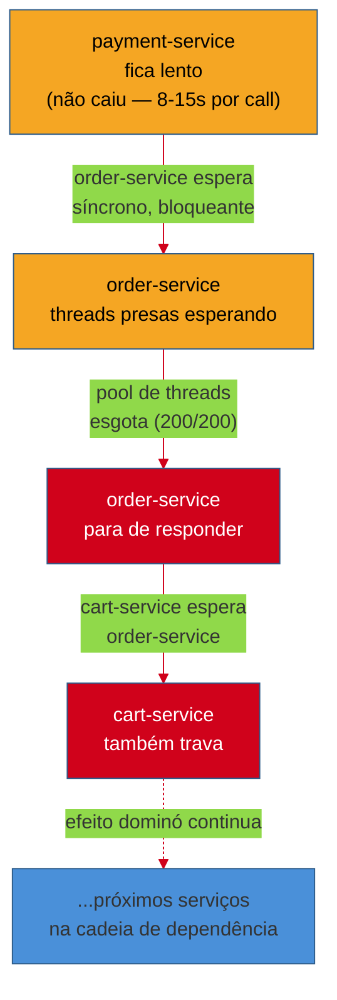
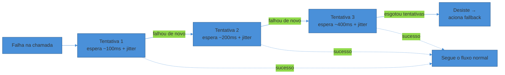
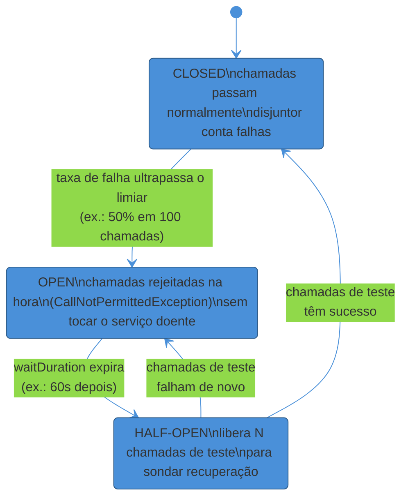
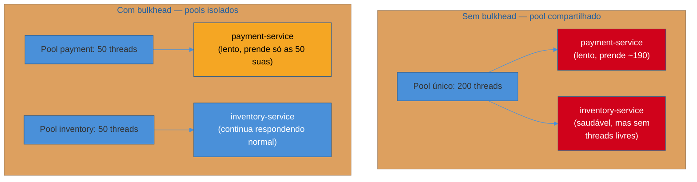

# Circuit Breaker e resiliência

> [!abstract] TL;DR
> Um serviço lento é mais perigoso que um serviço morto — porque ele não devolve erro, ele **prende threads esperando**. Quando `order-service` chama `payment-service` de forma síncrona e este último começa a demorar, cada requisição de `order-service` fica bloqueada até o timeout. O pool de threads esgota. `order-service` para de responder. Quem depende dele — `cart-service` — cai junto. Uma lentidão local virou uma **falha em cascata** global. A defesa não é um padrão único, é uma pilha: **timeout** (nunca espere para sempre), **retry com backoff exponencial + jitter** (tente de novo, mas sem sincronizar todo mundo), **circuit breaker** (pare de bater numa porta que não abre — estados closed/open/half-open), **bulkhead** (isole pools de recursos para uma falha não afundar o resto do navio) e **fallback** (responda algo degradado em vez de nada). Nenhum desses substitui o outro; eles se combinam. E tudo isso só é seguro se as operações forem **idempotentes** — senão, retry vira duplicação.

Sexta-feira, 14h32. O time de `order-service` recebe um alerta: latência p99 subiu de 80ms para 12 segundos. Ninguém mexeu em `order-service` hoje.

O culpado é outro serviço, dois saltos de distância: `payment-service` começou a responder devagar depois de uma migração de banco mal calculada — não caiu, só ficou **lento**. Cada chamada que antes levava 50ms agora leva entre 8 e 15 segundos antes de finalmente responder (ou estourar o timeout de 30s configurado, o que também demora).

`order-service` chama `payment-service` de forma síncrona, bloqueante, dentro de uma requisição HTTP. Cada requisição que chega em `order-service` abre uma thread do pool, essa thread chama `payment-service` e **fica esperando**. Com `payment-service` lento, as threads não são liberadas em 50ms — ficam presas por segundos.

O tráfego de `order-service` não parou de chegar. Novas requisições continuam entrando, cada uma pegando outra thread do pool, cada uma ficando presa esperando o mesmo serviço lento. Em minutos, o pool de threads — digamos, 200 threads — está 100% ocupado esperando `payment-service`. A próxima requisição que chega não encontra thread livre. Ela também espera. E a próxima. E a próxima.

`order-service`, que estava perfeitamente saudável — CPU baixa, memória normal, nenhum bug no seu próprio código — parou de responder. Não porque quebrou. Porque **esgotou um recurso finito esperando por outra coisa**.

E o efeito não para aí. `cart-service` chama `order-service` para validar um pedido antes do checkout. Agora `cart-service` também começa a acumular threads presas, esperando um `order-service` que está, ele mesmo, esperando um `payment-service` doente. Três serviços saudáveis em código, três serviços fora do ar em produção — porque nenhum deles se protegeu do vizinho lento.

Isso é **falha em cascata** (*cascading failure*): a doença de um componente se propaga para quem depende dele, não por bug, mas por falta de isolamento. É o problema central desta nota — e o motivo pelo qual "meu serviço não tem bug" não é garantia nenhuma de que ele fica de pé.

## Falha parcial: o modo de falha que o monólito não tinha

Num monólito, chamar outro módulo é uma chamada de método — na mesma memória, no mesmo processo, sub-microssegundo, e ela **sempre retorna**: com sucesso, com exceção, mas retorna. Não existe "o módulo ficou pensando por 30 segundos sem te avisar".

Num sistema distribuído, "chamar outro serviço" atravessa a rede. E a rede introduz um modo de falha que simplesmente não existe dentro de um processo: a **falha parcial**. O serviço remoto não está morto nem vivo — ele está num estado ambíguo: talvez lento, talvez tenha processado a operação e a resposta se perdeu, talvez esteja reiniciando. As **falácias da computação distribuída**, catalogadas por Peter Deutsch nos anos 90, começam exatamente por aí: "a rede é confiável", "a latência é zero" — nenhuma das duas é verdade, e todo sistema distribuído paga esse preço mais cedo ou mais tarde.

> [!question]- Por que um serviço lento é pior que um serviço fora do ar?
> Porque um serviço **morto** — conexão recusada, DNS falha — te dá um erro *imediatamente*. Você recebe a exceção em milissegundos, libera a thread, aplica um fallback, segue a vida. Um serviço **lento** não te dá erro nenhum — ele te faz *esperar*, e enquanto você espera, o recurso que está segurando essa espera (thread, conexão de banco, slot de file descriptor) fica indisponível para qualquer outra requisição. É por isso que os padrões desta nota — sobretudo o circuit breaker — se importam tanto com *chamadas lentas*, não só com chamadas que falham explicitamente. Uma latência alta e sustentada é, do ponto de vista de quem consome, indistinguível de uma falha — só que mais cara.

O nome técnico para o padrão de propagação que abriu esta nota é **cascading failure**: a falha de um nó satura um recurso finito (threads, conexões, memória) em quem o chama, o que faz esse chamador também falhar, o que propaga a saturação para quem depende *dele*. Michael Nygard descreveu esse mecanismo em detalhe no livro *Release It!* (2007), e é de lá que vem o vocabulário que o resto desta nota usa — inclusive o nome "circuit breaker".

Em uma frase: **uma lentidão localizada, sem isolamento, vira uma indisponibilidade sistêmica** — e cada padrão desta nota existe para cortar um elo dessa corrente.

## Timeout: a defesa mais básica e a mais esquecida

Antes de qualquer padrão sofisticado, existe uma pergunta que deveria ser feita em toda chamada de rede: **até quando eu espero?**

Um timeout define o limite máximo de tempo que você aguarda uma resposta antes de desistir e tratar a chamada como falha. Parece óbvio — e por isso mesmo é o item mais frequentemente esquecido ou mal configurado em código de produção. Muitos clientes HTTP têm timeout *infinito* por padrão, ou um timeout tão alto (60s, 120s) que na prática não protege nada: a essa altura, o pool de threads já esgotou há muito tempo.

O cenário de abertura desta nota só foi possível porque `order-service` estava configurado para esperar 30 segundos por `payment-service`. Se o timeout fosse 500ms, cada chamada falharia rápido, a thread seria liberada quase imediatamente, e o pool nunca chegaria a esgotar — o problema em `payment-service` continuaria existindo, mas não *se propagaria*.

Isso não significa "timeout curto sempre". Significa **timeout deliberado**, calibrado pela latência esperada da dependência (p99 dela, não a média) mais uma margem — e nunca "o default da biblioteca", que costuma ser genérico demais ou simplesmente ausente.

> [!warning] Timeout ausente ou "default da lib"
> **O que acontece:** o time nunca configurou timeout explícito; o cliente HTTP usa o valor padrão da biblioteca — que em muitos clientes é *sem limite*. **Por quê:** timeout parece um detalhe de infraestrutura, não uma decisão de design; ninguém o revisita até o incidente acontecer. **Como evitar:** todo client de chamada remota (HTTP, RPC, banco, fila) declara um timeout explícito, calibrado pelo p99 da dependência + margem — nunca o default silencioso da lib. Trate a ausência de timeout como um bug de produção, não como um detalhe de configuração.

Timeout sozinho já corta boa parte do dano de uma falha em cascata — mas ele tem um efeito colateral: agora você tem uma chamada que *falhou*. O que fazer com uma falha é o próximo problema.

## Retry com backoff exponencial + jitter

A resposta ingênua a uma falha é: tentar de novo. E às vezes funciona — falhas de rede transitórias (um pacote perdido, um failover de leader que levou 200ms) somem sozinhas se você simplesmente tentar de novo em instantes.

Mas retry ingênuo tem dois problemas sérios.

**Primeiro: retry imediato multiplica a carga exatamente no pior momento.** Se `payment-service` está sobrecarregado e cada cliente que falha tenta de novo *imediatamente*, você não está aliviando a carga — está adicionando uma segunda onda de requisições em cima da primeira, no serviço que menos precisa disso agora.

**Segundo: retry sincronizado entre muitos clientes cria um "retry storm".** Imagine 10.000 clientes chamando `payment-service` ao mesmo tempo. Se ele cair por 1 segundo e todos os 10.000 clientes usarem a mesma estratégia de retry (por exemplo, "espere 1s e tente de novo"), os 10.000 vão bater na porta *no mesmo instante*, 1 segundo depois — uma onda sincronizada de tráfego que pode derrubar o serviço de novo, mesmo que ele já tivesse se recuperado.

A solução para o primeiro problema é o **backoff exponencial**: cada tentativa espera mais que a anterior (100ms, 200ms, 400ms, 800ms...), dando tempo real para o serviço se recuperar em vez de bombardeá-lo continuamente.

A solução para o segundo é o **jitter**: em vez de esperar exatamente o tempo calculado pelo backoff, adiciona-se um componente aleatório, de forma que clientes diferentes esperam tempos ligeiramente diferentes — e a onda sincronizada se dissolve numa distribuição de tráfego mais suave.

O texto de referência aqui é o artigo da AWS Architecture Blog "Exponential Backoff and Jitter" (2015), de Marc Brooker, que compara três variantes:

- **Full jitter** — o tempo de espera é um valor aleatório entre 0 e o backoff calculado (`random(0, base * 2^tentativa)`). É a variante mais agressiva em espalhar a carga.
- **Equal jitter** — mantém metade do backoff fixo e sorteia a outra metade, evitando esperas absurdamente curtas.
- **Decorrelated jitter** — cada espera depende da espera anterior, não só do número da tentativa; converge para um comportamento parecido com full jitter, mas com uma cauda um pouco maior.

O artigo mais recente do Amazon Builders' Library, "Timeouts, retries, and backoff with jitter", do mesmo autor, reforça a mesma conclusão em produção AWS: **backoff sem jitter reduz throughput e ainda cria picos correlacionados**; full jitter e equal jitter empiricamente reduzem o número de chamadas totais ao serviço com problema de forma parecida, enquanto decorrelated jitter tende a gerar mais chamadas totais, mas com menos sincronização.

> [!question]- Quantas tentativas de retry é razoável?
> Não existe um número universal — mas 2 a 3 tentativas é o intervalo mais comum na prática, com um **orçamento de tempo total** (não deixe o retry, somado, ultrapassar o timeout que o *seu* chamador está disposto a esperar por você). Retry demais é tão perigoso quanto retry de menos: cada tentativa extra é mais carga na dependência doente e mais latência acumulada para quem está esperando você. Uma regra prática: se a chamada já falhou 3 vezes com backoff crescente, o problema provavelmente não é transitório — é hora de parar de tentar e deixar o circuit breaker (próxima seção) assumir.

Retry também tem uma pré-condição que costuma passar despercebida: só é seguro retentar uma operação se ela for **idempotente** — se executá-la duas vezes produz o mesmo efeito de executá-la uma vez. Cobrar um cartão de crédito não é naturalmente idempotente: se a primeira chamada teve sucesso no servidor mas a resposta se perdeu na rede, um retry ingênuo cobra o cliente duas vezes. A prática padrão é anexar uma **idempotency key** (um UUID gerado pelo cliente para aquela operação específica) para que o servidor detecte e ignore duplicatas — é assim que a AWS documenta em "Making retries safe with idempotent APIs", outro texto do Builders' Library.

> [!warning] Retry sem checar idempotência
> **O que acontece:** o código retenta uma chamada de escrita (criar pedido, cobrar pagamento, enviar notificação) sem se perguntar se a operação é segura para repetir. **Por quê:** retry é tratado como uma preocupação puramente de rede ("a chamada falhou, tenta de novo"), sem considerar o efeito colateral do lado que recebe. **Como evitar:** toda operação de escrita que pode ser retentada precisa de uma idempotency key (ou de ser naturalmente idempotente, como um PUT que sobrescreve o mesmo recurso). Sem isso, retry troca "talvez uma falha" por "com certeza um dado duplicado".

## Circuit Breaker: parar de bater numa porta que não abre

Timeout e retry resolvem falhas *pontuais*. Mas e quando a dependência não está tendo um problema pontual — está genuinamente doente, por minutos, talvez por uma hora? Retentar repetidamente uma chamada que vai continuar falhando não ajuda ninguém: você continua gastando threads, continua adicionando carga a um serviço que já está sofrendo, e continua esperando o timeout inteiro a cada tentativa.

É aqui que entra o **circuit breaker** (disjuntor), o padrão que dá nome a esta nota. Popularizado por Michael Nygard em *Release It!* e descrito de forma influente por Martin Fowler em seu bliki, o circuit breaker envolve a chamada arriscada e **monitora o histórico recente de resultados**. Quando a taxa de falha (ou de chamadas lentas) ultrapassa um limiar, o disjuntor **abre**: passa a rejeitar chamadas *instantaneamente*, sem sequer tentar contatar o serviço doente, devolvendo um erro rápido (ou acionando um fallback) em microssegundos em vez de segundos.

A analogia é literal: um disjuntor elétrico desarma diante de um curto-circuito para impedir que ele vire incêndio. Ele não fica desarmado para sempre — depois de um tempo, você pode rearmá-lo e testar se o problema passou.

### Os três estados

- **CLOSED (fechado)** — o estado saudável. As chamadas passam normalmente e o disjuntor conta, em uma janela deslizante recente, quantas tiveram sucesso e quantas falharam (ou foram lentas). Enquanto a taxa de falha ficar abaixo do limiar, o circuito permanece fechado.
- **OPEN (aberto)** — o estado de proteção. A taxa de falha estourou o limiar configurado; o disjuntor abre e **para de deixar as chamadas passarem**, rejeitando-as imediatamente (sem tentar a rede) durante um tempo de espera configurado.
- **HALF-OPEN (meio-aberto)** — o estado de teste. Depois do tempo de espera, o disjuntor libera um número limitado de chamadas de prova. Se elas tiverem sucesso, o circuito volta a CLOSED; se falharem, volta a OPEN e o relógio recomeça.

> [!example] O ciclo numa frase
> CLOSED (passa tudo, conta falhas) → limiar estourado → OPEN (rejeita tudo, poupa o serviço doente) → tempo de espera → HALF-OPEN (deixa algumas provas passarem) → provas OK → CLOSED, ou provas falham → OPEN de novo.

A decisão de abrir é governada por um **limiar sobre uma janela deslizante recente** — não sobre o histórico inteiro, e não sobre uma única falha isolada. Uma falha isolada é ruído; uma taxa de falha sustentada é sinal. Também existe um número mínimo de chamadas antes de o disjuntor sequer *calcular* uma taxa — sem isso, duas chamadas seguidas com uma falha já pareceriam "50% de falha", um falso alarme típico de baixo volume.

> [!question]- Circuit breaker não seria só um retry mais chique?
> Não — eles resolvem problemas diferentes e se complementam. Retry lida com **falhas pontuais e transitórias**: tenta de novo porque a falha provavelmente não vai se repetir. Circuit breaker lida com **falhas sustentadas**: reconhece que a dependência está doente *agora* e, em vez de continuar tentando (o que só adicionaria carga a um serviço já sofrendo), corta o fluxo por um tempo. Na prática, os dois convivem na mesma chamada: o circuit breaker decide *se* vale a pena tentar; o retry decide *quantas vezes* tentar quando o circuito permite. A ordem de composição mais comum (usada, por exemplo, pelo Resilience4j) é o circuit breaker por fora do retry — assim, um circuito aberto barra até a primeira tentativa, sem gastar nenhum retry num serviço que você já sabe que está fora do ar.

Este é o comportamento em profundidade — thresholds exatos, tipos de janela (count-based vs time-based), a API declarativa via anotação — que já está documentado no galho de Java sob a implementação de referência do ecossistema, o **Resilience4j** (a substituta moderna do Hystrix da Netflix, que a própria Netflix colocou em modo de manutenção em novembro de 2018, recomendando migração para bibliotecas ativas). Esta nota fica no *porquê* do padrão; o *como configurar em Spring Boot* mora em [[Spring Boot]] e, com mais profundidade ainda, no galho Java de microserviços.

## Bulkhead: isolando os compartimentos do navio

Circuit breaker protege contra bater numa porta doente repetidamente. Mas existe um problema anterior: mesmo com timeout e circuit breaker bem configurados, se **todas** as suas chamadas de rede compartilham o mesmo pool de threads, uma dependência lenta ainda pode consumir threads suficientes para afetar chamadas para dependências completamente saudáveis.

Se `order-service` chama tanto `payment-service` (lento) quanto `inventory-service` (saudável) usando o mesmo pool de 200 threads, e `payment-service` consegue prender 190 delas esperando, sobram só 10 threads para *todo o resto* — inclusive para `inventory-service`, que não tem nada de errado. Uma dependência doente afundou o acesso a uma dependência saudável, só porque compartilhavam recurso.

O **bulkhead** (anteparo, em referência aos compartimentos estanques do casco de um navio) resolve isso isolando pools de recursos por dependência. Cada chamada externa tem seu próprio pool de threads (ou semáforo limitando concorrência) — se `payment-service` afunda o pool dedicado a ele, o pool de `inventory-service` continua intacto, e `order-service` continua respondendo para as partes do sistema que não dependem do serviço doente.

Na implementação de referência (Resilience4j), o bulkhead existe em duas variantes: um **semáforo** limitando quantas chamadas concorrentes passam na thread atual, e um **pool de threads dedicado**, que efetivamente executa a chamada arriscada num pool à parte do resto da aplicação. A escolha entre os dois é um trade-off de overhead (thread pool dedicado custa mais memória e context-switching) contra isolamento mais forte (thread pool dedicado impede até que a *duração* de uma chamada lenta contamine a thread que fez a chamada).

> [!warning] Um pool de threads único para toda chamada externa
> **O que acontece:** o serviço usa o pool HTTP padrão (ou o mesmo `ExecutorService`) para chamar todas as suas dependências, sem separação. **Por quê:** parece mais simples de configurar, e a maioria do tempo funciona — até uma dependência específica adoecer e revelar que ela estava, sem ninguém perceber, compartilhando recurso com todo o resto. **Como evitar:** dê a cada dependência crítica seu próprio pool (ou semáforo) dimensionado pela criticidade e pelo volume dela. Uma dependência de baixa prioridade não deveria ter capacidade de afundar uma de alta prioridade só por estarem no mesmo balde de threads.

## Fallback e degradação graciosa

Timeout, retry, circuit breaker e bulkhead, juntos, evitam que uma falha se propague — mas eles não fazem a falha original desaparecer. Quando o circuito está aberto, *alguma coisa* precisa ser devolvida à requisição que chegou. Essa alguma coisa é o **fallback**.

Um fallback bom não é "devolver um erro 500 mais rápido" — é uma resposta **degradada, mas útil**. Algumas estratégias comuns:

- **Cache velho (stale-but-useful)** — se `recommendations-service` está fora do ar, devolva a última lista de recomendações computada, mesmo que tenha algumas horas. Pior recomendação é melhor que nenhuma tela.
- **Valor default sensato** — se `pricing-service` de um serviço de terceiros falha, use o último preço conhecido ou um valor conservador, em vez de travar o checkout inteiro.
- **Fila para processamento posterior** — se `email-service` está fora do ar, enfileire a notificação para reenvio quando ele voltar, em vez de perder o evento.
- **Feature flag de degradação** — desligue temporariamente uma funcionalidade não essencial (ex.: "produtos relacionados" numa página de produto) para preservar a funcionalidade essencial (o botão de comprar).

Esse conjunto de decisões — o que continua funcionando quando uma parte do sistema cai — é o que a literatura chama de **graceful degradation**: o sistema perde capacidades de forma controlada e visível, em vez de cair inteiro de uma vez. É o oposto do comportamento observado no cenário de abertura desta nota, onde a falta de qualquer barreira fez uma lentidão local virar uma queda total.

> [!question]- Fallback sempre é a resposta certa? E se ele mascarar um problema sério?
> Não é de graça. Um fallback mal pensado pode esconder uma falha real por tempo demais — imagine um fallback de "sempre aprovar" num serviço de checagem de fraude: ele mantém o sistema *disponível*, mas às custas de segurança. A regra prática é: fallback é aceitável quando o custo de estar levemente errado (dado velho, recomendação subótima) é muito menor que o custo de estar indisponível — e é perigoso quando o "estar errado" tem consequência (dinheiro, segurança, compliance). Nesses casos, o fallback correto às vezes é "recusar a operação com uma mensagem clara" em vez de fingir sucesso.

## Combinando os padrões: a ordem importa

Nenhum desses padrões vive sozinho em produção — eles se compõem, e a *ordem* da composição afeta o comportamento. Uma composição comum (e a ordem usada, por exemplo, pelos decoradores do Resilience4j) é, de fora para dentro:

**Retry → Circuit Breaker → Rate Limiter → Time Limiter → Bulkhead → a chamada real.**

A leitura é: o retry decide se tenta de novo; dentro dele, o circuit breaker decide se sequer permite a tentativa passar; dentro dele, o rate limiter e o time limiter aplicam seus próprios limites; e o bulkhead, mais interno, isola o recurso físico (thread) que efetivamente executa a chamada. Um circuito aberto barra a chamada *antes* de ela consumir um slot de bulkhead ou de gastar uma tentativa de retry — é essa camada externa que faz o "falhar rápido" ser rápido de verdade.

| Padrão | Pergunta que responde | Protege contra |
|--------|------------------------|-----------------|
| Timeout | Até quando eu espero? | Espera infinita, esgotamento silencioso de threads |
| Retry + backoff/jitter | Vale a pena tentar de novo? | Falhas transitórias; sem virar retry storm |
| Circuit Breaker | O serviço está doente o suficiente para eu parar de tentar? | Bater repetidamente numa dependência que não vai responder |
| Bulkhead | Essa dependência pode afundar as outras? | Contaminação cruzada de recursos compartilhados |
| Fallback | O que eu devolvo se tudo falhar? | Indisponibilidade total quando degradação parcial bastava |

> [!question]- Isso é a mesma coisa que rate limiting?
> São primos, não a mesma coisa — e a distinção importa em entrevista. **Rate limiting** protege você de **excesso de entrada**: controla quanto tráfego *chega* ao seu serviço, geralmente por cliente ou por chave de API, para impedir abuso ou sobrecarga da sua própria capacidade (ver [[04 - Rate Limiting]]). **Circuit breaker** protege você de uma **dependência doente na saída**: controla quanto tráfego *você envia* para outro serviço, com base na saúde observada *dele*. Um limita entrada, o outro limita (e corta) saída condicionalmente. Um sistema robusto frequentemente tem os dois: rate limiting nas bordas, para não ser sobrecarregado por clientes; circuit breaker nas chamadas para dependências, para não ser derrubado por elas.

## Em entrevista

Resiliência aparece de duas formas na entrevista de system design: como pergunta direta ("como você lida com uma dependência lenta?") ou, mais frequentemente, como **cutucada do entrevistador** depois que você desenhou um fluxo síncrono entre serviços — "e se esse serviço cair?" é quase garantido em qualquer deep dive com múltiplos serviços.

A resposta forte não cita "circuit breaker" como uma palavra mágica — ela nomeia o mecanismo de propagação primeiro. "Se `payment-service` ficar lento em vez de cair, `order-service` vai acumular threads esperando e pode esgotar o próprio pool — isso é uma falha em cascata. Eu mitigaria com timeout agressivo calibrado no p99 dele, um circuit breaker que abre depois de, digamos, 50% de falha numa janela de 100 chamadas, e um fallback — nesse caso, talvez enfileirar o pagamento para reprocessamento em vez de falhar a compra inteira."

Repare na estrutura: nomeou o risco, propôs o mecanismo com um número defensável, e fechou com um fallback concreto — não genérico. Essa é a diferença entre "eu usaria circuit breaker" (decorado) e "eu usaria circuit breaker porque..." (raciocinado).

> [!warning] Citar "circuit breaker" sem explicar o mecanismo
> **O que acontece:** o candidato, ao ser cutucado sobre falhas, responde só "eu colocaria um circuit breaker aqui" e passa para o próximo tópico. **Por quê:** o padrão virou vocabulário decorado de tanto aparecer em artigos, sem o candidato ter internalizado *por que* ele existe. **Como evitar:** sempre amarre o padrão ao mecanismo de propagação que ele corta. "Circuit breaker porque, sem ele, `order-service` continuaria tentando `payment-service` repetidamente e mantendo threads presas mesmo sabendo que ele está fora do ar" é uma frase muito mais forte que o nome do padrão sozinho.

Se o entrevistador pedir profundidade, os pontos defensáveis para ir fundo são: os thresholds exatos do disjuntor (por que 50% e não 10%?), a diferença entre janela por contagem e por tempo, e o trade-off do bulkhead (thread pool dedicado vs semáforo). Isso sinaliza que você não só conhece o nome do padrão, mas entende as decisões de engenharia dentro dele.

## Como explicar em inglês

> "The core problem here is cascading failure — a slow dependency, not even a dead one, can exhaust your thread pool because every call blocks waiting for it. I'd defend against that with a layered approach: an aggressive timeout calibrated to the dependency's p99, retry with exponential backoff and jitter for transient failures — jitter specifically to avoid a retry storm where every client retries in sync — and a circuit breaker that trips after a sustained failure rate, so we stop hammering a dependency we already know is unhealthy. I'd also isolate the resource pool for that dependency with a bulkhead, so it can't starve calls to healthy services, and define an explicit fallback — degraded but useful — instead of just failing the whole request."

| PT | EN |
|----|----|
| Falha em cascata | Cascading failure |
| Falha parcial | Partial failure |
| Esgotamento de recursos | Resource exhaustion |
| Disjuntor / Circuit Breaker | Circuit breaker |
| Fechado / Aberto / Meio-aberto | Closed / Open / Half-open |
| Janela deslizante | Sliding window |
| Retentativa com backoff exponencial | Retry with exponential backoff |
| Jitter | Jitter |
| Tempestade de retentativas | Retry storm |
| Idempotência | Idempotency |
| Anteparo / Bulkhead | Bulkhead |
| Resposta de contingência | Fallback |
| Degradação graciosa | Graceful degradation |
| Falhar rápido | Fail fast |

## O que vem a seguir

Esta nota fecha a defesa contra dependências doentes. A última peça deste sub-galho junta tudo isso na camada que fica na frente de todo o sistema — o ponto onde rate limiting, roteamento e (às vezes) circuit breaking por rota se encontram antes mesmo de chegar aos serviços internos.

- [[06 - API Gateway e BFF]] — roteamento, agregação e onde o próprio gateway pode virar o novo gargalo (ou o novo ponto único de falha)

## Veja também

- [[System Design/index|System Design]] — o galho-pai e o mapa da trilha
- [[3 - Padrões recorrentes/index|Padrões recorrentes]] — os demais padrões deste sub-galho
- [[04 - Rate Limiting]] — o primo que protege de excesso de entrada, não de dependência doente
- [[06 - CAP, consistência e consenso]] — degradação sob partição de rede, a mesma lógica de "disponibilidade sobre consistência" vista sob a ótica do CAP
- [[Spring Boot]] — onde a implementação concreta em Java (Resilience4j) é referenciada
- [[03-Dominios/Tecnologia/Java/Microservices e sistemas distribuídos/13 - Resiliência I — a falha distribuída e o Circuit Breaker|Resiliência I — Circuit Breaker em Java]] — o mesmo padrão, com thresholds, código e configuração Resilience4j 2.4.0 em detalhe

## Fontes

- **Michael T. Nygard** — *Release It! Design and Deploy Production-Ready Software*, 2ª edição (Pragmatic Bookshelf, 2018) — origem do padrão circuit breaker e do vocabulário de estabilidade de produção (bulkhead, fail fast, cascading failure).
- **Martin Fowler** — [*CircuitBreaker*](https://martinfowler.com/bliki/CircuitBreaker.html) — descrição canônica dos três estados e por que envolver a chamada arriscada num objeto que monitora falhas.
- **Resilience4j** — [*CircuitBreaker docs*](https://resilience4j.readme.io/docs/circuitbreaker) e [*Bulkhead docs*](https://resilience4j.readme.io/docs/bulkhead) — implementação de referência Java: estados, janela deslizante (count-based/time-based), thresholds, SemaphoreBulkhead vs ThreadPoolBulkhead.
- **AWS Architecture Blog** — [*Exponential Backoff and Jitter*](https://aws.amazon.com/blogs/architecture/exponential-backoff-and-jitter/) (Marc Brooker, 2015) — origem das variantes full jitter, equal jitter e decorrelated jitter, com dados comparativos de throughput.
- **Amazon Builders' Library** — [*Timeouts, retries, and backoff with jitter*](https://aws.amazon.com/builders-library/timeouts-retries-and-backoff-with-jitter/) e [*Making retries safe with idempotent APIs*](https://aws.amazon.com/builders-library/making-retries-safe-with-idempotent-APIs/) — recomendações de produção da AWS sobre timeout calibrado, retry e idempotency keys.
- **Netflix / GitHub** — [*Netflix/Hystrix*](https://github.com/Netflix/Hystrix) — anúncio de modo de manutenção em novembro de 2018 e a recomendação subsequente de migração para bibliotecas ativas como Resilience4j; contexto histórico do padrão na indústria.
