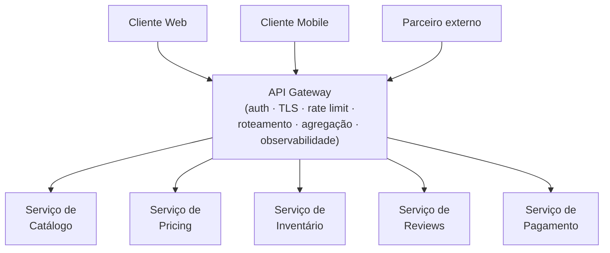
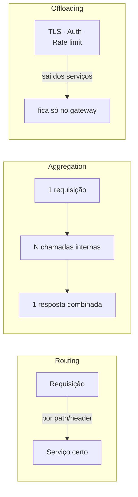
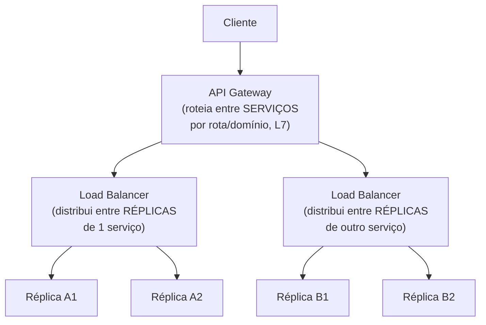
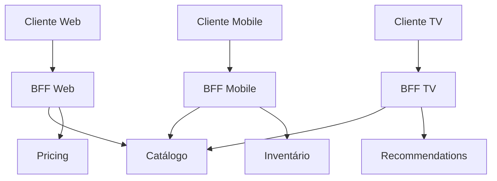
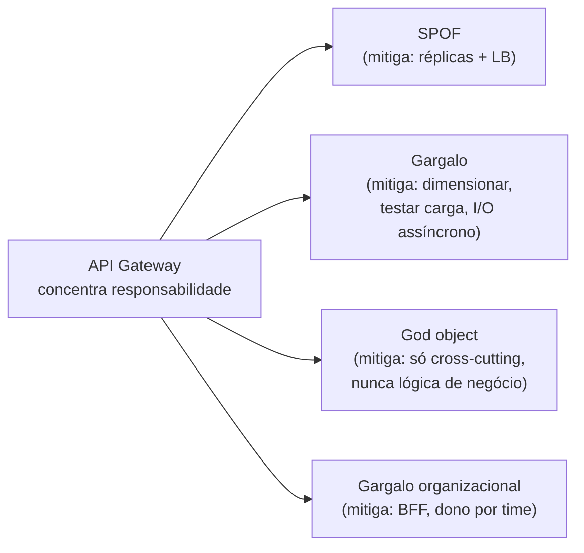
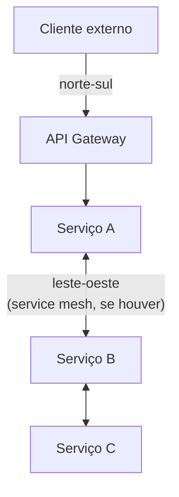

# API Gateway e BFF

> [!abstract] TL;DR
> Um app mobile que monta uma única tela chamando 8 microserviços — cada um com seu próprio TLS, autenticação e retry — não tem "arquitetura de microserviços". Tem a complexidade de 8 serviços vazada para dentro do cliente. O **API Gateway** resolve isso concentrando os **cross-cutting concerns** (autenticação, TLS termination, rate limiting, roteamento, agregação, observabilidade) num único ponto de entrada, para que cada microserviço trate só da sua lógica de domínio. Ele opera em três padrões — **Routing** (roteia por path para o serviço certo), **Aggregation** (combina N chamadas em uma) e **Offloading** (tira concerns transversais dos serviços) — e é diferente de um **load balancer**: o LB distribui carga entre réplicas de *um* serviço na camada de transporte; o gateway roteia entre serviços *diferentes*, lendo a requisição na camada de aplicação (L7). Quando um cliente tem necessidades muito distintas de outro (mobile vs. web vs. TV), um gateway genérico incha — e a resposta é o **BFF (Backend-for-Frontend)**: um gateway dedicado por tipo de experiência de cliente. O risco simétrico é o gateway virar **SPOF**, **gargalo** de latência e **god object** que ninguém mais entende — mitigados com réplicas atrás de um LB e disciplina sobre o que pode viver ali.

Um time está construindo o app mobile de um marketplace. Para montar a tela de detalhe de um produto, o app precisa: dados do produto (serviço de catálogo), preço e promoções (serviço de pricing), estoque (serviço de inventário), avaliações (serviço de reviews) e recomendações relacionadas (serviço de recommendations).

Sem nenhum componente entre o cliente e os serviços, o app mobile faz **5 chamadas HTTP separadas**. Cada uma abre sua própria conexão TLS, carrega seu próprio token de autenticação, tem seu próprio timeout e sua própria lógica de retry. Numa rede 4G com latência de 100-200ms por round-trip, 5 chamadas sequenciais — ou mesmo em paralelo, mas 5 conexões simultâneas numa rede instável — não são um detalhe de implementação. São a diferença entre uma tela que carrega em 300ms e uma que carrega em 3 segundos, ou que falha parcialmente porque uma das 5 chamadas caiu no meio do caminho.

Pior: cada novo serviço que o backend adiciona (um sexto, um sétimo) é mais uma chamada que o *cliente* precisa saber fazer, mais um lugar onde o cliente precisa reimplementar autenticação e tratamento de erro. A lógica de orquestração — "para montar essa tela, preciso combinar esses 5 resultados" — vazou para dentro do app mobile, que agora conhece a topologia interna do backend e quebra toda vez que essa topologia muda.

Esse é exatamente o problema que a Netflix enfrentou publicamente em 2011-2012: uma API "one-size-fits-all" servindo mais de 800 tipos de dispositivo diferentes, cada um com necessidades de dados, formato e latência distintas — e a solução que ela publicou se tornou referência do setor.[^1]

A resposta é colocar um componente entre o cliente e os serviços — um **gateway** — que concentra tudo que é transversal (auth, TLS, rate limit, roteamento, agregação) num único ponto, para que os microserviços internos fiquem livres para tratar só da própria lógica de domínio, e o cliente fale com um único endpoint em vez de conhecer a topologia inteira do backend.

## O que é um API Gateway

Um **API Gateway** é o ponto único de entrada entre os clientes (web, mobile, parceiros externos) e o conjunto de microserviços de um sistema. Toda requisição externa passa por ele antes de chegar a qualquer serviço interno.

A ideia central não é nova — é a mesma motivação por trás do padrão **Facade** da orientação a objetos, aplicada em escala de rede: esconder a complexidade de um subsistema atrás de uma interface única e coerente. Sam Newman, em *Building Microservices*, descreve o gateway como o lugar certo para lidar com preocupações que são genuinamente sobre o *sistema como um todo* — não sobre nenhum serviço específico.

O valor concreto se divide em seis frentes, e vale nomear cada uma porque a entrevista costuma pedir "o que exatamente o gateway está fazendo aqui?":

**Roteamento.** O gateway decide, por path, header ou versão da API, para qual serviço encaminhar cada requisição — `/products/*` vai para o catálogo, `/orders/*` vai para o serviço de pedidos.

**Autenticação e autorização centralizadas.** O token (JWT, OAuth) é validado *uma vez*, no gateway, em vez de cada um dos N serviços implementar sua própria lógica de validação. Os serviços internos podem confiar que, se a requisição chegou até eles, já passou pela checagem — e tratam apenas autorização fina, específica do domínio, se precisarem.

**TLS termination.** A conexão criptografada do cliente termina no gateway; a comunicação gateway→serviços internos pode rodar em texto claro dentro de uma rede confiável (ou com mTLS interno, dependendo do modelo de zero-trust adotado) — sem que cada serviço precise gerenciar certificado próprio.

**Rate limiting.** O gateway é o lugar natural para aplicar limites de requisição por cliente/token/IP, porque ele já vê 100% do tráfego de entrada antes de qualquer fan-out para os serviços internos. O mecanismo — token bucket, sliding window, Redis distribuído — é o assunto da nota [[04 - Rate Limiting]]; aqui importa só que o gateway é o ponto de hospedagem natural do rate limit, não o algoritmo em si.

**Agregação de respostas.** O padrão que resolve diretamente o problema de abertura desta nota: o gateway recebe uma requisição do cliente, faz o fan-out para múltiplos serviços internos, combina as respostas e devolve um único payload. É o padrão **Gateway Aggregation** do Azure Architecture Center — motivado exatamente por "chattiness" entre cliente e backend em redes de alta latência, como celular.[^2]

**Transformação de protocolo.** O cliente externo fala REST/JSON; internamente, os serviços podem se comunicar por gRPC (mais eficiente, tipado). O gateway traduz de um protocolo para o outro nas duas direções, para que o cliente nunca precise saber que o backend usa gRPC.

> [!question]- O gateway processa lógica de negócio?
> Não deveria. O Azure Architecture Center é explícito sobre isso no padrão Gateway Offloading: "business logic should never be offloaded to the gateway".[^3] A linha é sutil, mas importante: *agregar* respostas de 3 serviços é orquestração de transporte; *decidir* se um pedido pode ser cancelado com base em regras de negócio é lógica de domínio, e pertence a um serviço. Se o gateway começa a acumular `if` de regra de negócio, ele deixou de ser infraestrutura transversal e virou um serviço disfarçado — sem dono claro, sem testes de domínio, sem versionamento por bounded context. Esse é o embrião do anti-padrão "god object" discutido mais adiante.

## Os três padrões do gateway (Azure): Routing, Aggregation, Offloading

O Azure Architecture Center nomeia três padrões distintos que, juntos, cobrem o vocabulário-padrão do que um gateway faz — e vale conhecer os três pelo nome em entrevista, porque cada um resolve um problema ligeiramente diferente.

**Gateway Routing.** O gateway expõe um único endpoint público e roteia a requisição para o serviço certo com base em regras — path, header, versão. É o uso mais básico: substitui múltiplos endpoints públicos (um por serviço) por um só, escondendo a topologia interna.

**Gateway Aggregation.** Já descrito acima — o gateway decompõe uma requisição do cliente em N chamadas a serviços internos, espera as respostas e as combina em um único payload de saída. A motivação documentada pela Microsoft é reduzir "chattiness" entre cliente e backend, principalmente sob redes de alta latência.[^2]

**Gateway Offloading.** O gateway assume responsabilidades transversais que, de outra forma, cada serviço teria que reimplementar: certificados TLS, autenticação, rate limiting (throttling), logging/monitoramento mínimo garantido. A motivação da Microsoft aqui é dupla — reduzir a chance de erro operacional (um certificado mal configurado em 1 de 50 serviços) e permitir que times especializados (segurança, plataforma) cuidem dessas preocupações sem que cada time de produto precise reaprender a mesma coisa.[^3]

Os três padrões coexistem no mesmo gateway físico na prática — um Kong, um AWS API Gateway, um Azure API Management fazem os três ao mesmo tempo. A separação conceitual importa porque cada um tem seu próprio conjunto de "issues and considerations" — Aggregation precisa de timeout/fallback por chamada interna (o que fazer se 1 de 5 serviços não responde?); Offloading precisa que o gateway seja redundante o suficiente para não virar um SPOF pior que os N certificados distribuídos que ele substituiu.

## API Gateway não é Load Balancer

Esta é a confusão mais comum de entrevista neste tópico, e vale fixar a distinção com precisão — porque os dois componentes costumam aparecer lado a lado no mesmo diagrama, às vezes até na mesma caixa, e são coisas fundamentalmente diferentes.

O **[[01 - Escalabilidade e load balancing|load balancer]]** distribui tráfego entre **réplicas idênticas de um único serviço**. Ele não sabe — nem precisa saber — o que a requisição *significa*; sua pergunta é "qual das N cópias idênticas do serviço X está mais livre agora?". Um LB em L4 nem lê o conteúdo da requisição; um LB em L7 lê o suficiente para rotear por path ou header, mas ainda dentro do universo de um único serviço (ou de um conjunto pequeno e estático de rotas).

O **API Gateway** roteia entre **serviços diferentes**, cada um com sua própria lógica de negócio, seu próprio banco, seu próprio time dono. Ele opera necessariamente em L7 — porque decidir "essa requisição é sobre catálogo, essa é sobre pagamento" exige ler o conteúdo da requisição (path, corpo, headers) — e faz muito mais do que rotear: autentica, agrega, transforma, limita.

Repare na topologia: o gateway está *acima* dos load balancers, não no lugar deles. Ele decide *qual serviço* atender; o LB (um por serviço, tipicamente embutido no orquestrador — um Service da Kubernetes, um Target Group da AWS) decide *qual réplica* daquele serviço. São camadas de decisão diferentes, resolvendo problemas diferentes, e um sistema em produção normalmente tem os dois — gateway na borda, LB entre o gateway e cada frota de réplicas (ou entre serviço e serviço, no caso de um service mesh).

| Critério | Load Balancer | API Gateway |
|----------|---------------|--------------|
| O que distribui | Requisições entre réplicas **do mesmo serviço** | Requisições entre **serviços diferentes** |
| Camada típica | L4 (transporte) ou L7 simples | L7 (sempre — precisa ler a requisição) |
| Sabe sobre domínio? | Não — cego a qual serviço é qual | Sim — roteia por regra de negócio/rota |
| Faz auth, rate limit, agregação? | Não é o papel dele | Sim, é justamente o papel dele |
| Onde fica na topologia | Na frente de **uma** frota de réplicas | Na borda do sistema, acima de N frotas |
| Pergunta que resolve | "Qual cópia está livre?" | "Qual serviço trata isso, e o que mais precisa acontecer antes?" |

> [!question]- Um API Gateway pode fazer load balancing também?
> Sim, na prática a maioria dos gateways de mercado (Kong, AWS API Gateway com integrações, Azure API Management) inclui capacidade básica de distribuir tráfego entre instâncias de um backend — mas isso é uma *feature* que ele oferece, não a *razão* pela qual ele existe. A distinção conceitual continua valendo: quando você fala em "load balancing", está falando de distribuir carga entre cópias idênticas; quando fala em "API gateway", está falando de rotear, proteger e compor requisições entre serviços com lógica diferente. Em entrevista, não amarre os dois papéis na mesma frase como se fossem sinônimos — isso é exatamente o red flag que essa seção existe para evitar.

> [!warning] Chamar o load balancer de "gateway" (ou vice-versa) no meio da entrevista
> **O que acontece:** o candidato desenha uma caixa "Load Balancer / Gateway" tratando os dois como a mesma coisa, ou usa os nomes de forma intercambiável ao longo da conversa. **Por quê:** os dois aparecem "na frente" do sistema no diagrama, então parecem cumprir o mesmo papel visual — mas resolvem problemas de camadas diferentes (réplicas vs. serviços). **Como evitar:** ao desenhar, nomeie explicitamente o que cada caixa decide. "Esse é o load balancer, ele escolhe entre as 5 réplicas do serviço de pedidos. Esse aqui é o gateway, ele decide se a requisição vai para pedidos, pagamento ou catálogo, e cuida de auth antes de mandar para qualquer um deles." Uma frase resolve a ambiguidade e sinaliza que você entende a diferença — algo que a rubrica de "profundidade técnica" registra.

## BFF: Backend-for-Frontend

Um gateway genérico funciona bem enquanto os clientes têm necessidades parecidas. O problema aparece quando eles não têm — e é exatamente o cenário da abertura desta nota, levado ao extremo: um app mobile numa rede instável quer *poucas* chamadas, payloads *pequenos*, dados já formatados para a tela. Um cliente web numa rede rápida pode tolerar mais granularidade e prefere payloads ricos, reaproveitáveis entre várias telas. Uma Smart TV quer outra coisa ainda.

Se você tenta atender aos três com **um único gateway genérico**, ele acumula lógica condicional — "se o cliente é mobile, corta esses campos; se é TV, agrega diferente" — e vira, ele mesmo, um serviço inchado com múltiplas responsabilidades concorrentes, sem dono claro.

A saída, batizada e popularizada por Sam Newman a partir da experiência de times como SoundCloud e REA Group, é o **Backend-for-Frontend (BFF)**: em vez de um gateway genérico, cada tipo de experiência de cliente ganha seu **próprio** backend dedicado, otimizado exatamente para as necessidades daquela experiência.[^4]

Newman resume o princípio em uma frase que vale citar em entrevista: **"one experience, one BFF"** — um BFF por experiência de cliente, não por tecnologia de cliente. Se dois clientes (por exemplo, iOS e Android) têm necessidades de dados quase idênticas, eles podem compartilhar um BFF; se divergem de verdade (a experiência web é fundamentalmente diferente da mobile), cada um merece o próprio.

A segunda decisão importante, também de Newman, é **quem é dono do BFF**: ele defende que o BFF deve ser construído e mantido pelo **mesmo time que constrói a UI** daquele cliente — não por um time de plataforma centralizado. A lógica é a mesma que justifica microserviços por *bounded context*: o time que entende as necessidades exatas da tela mobile é o time mais bem posicionado para decidir o que o BFF dela deve agregar, sem esperar priorização de um time de infraestrutura compartilhada.

| Sem BFF (gateway genérico) | Com BFF |
|---|---|
| Um payload serve todos os clientes — geralmente rico demais para mobile, pobre demais para web | Cada payload é desenhado para a tela exata que o consome |
| Lógica condicional por tipo de cliente se acumula no gateway central | Cada BFF tem sua própria lógica, isolada e simples |
| Mudar algo para mobile arrisca quebrar o contrato usado pela web | Mudanças em um BFF não afetam os outros |
| Um time de plataforma vira gargalo de priorização para todos os clientes | Time de produto dono da UI evolui o próprio BFF no próprio ritmo |

> [!question]- BFF não é só reinventar o gateway com outro nome?
> Tecnicamente, um BFF *é* um gateway — herda tudo que um gateway faz (roteamento, agregação, às vezes auth). A diferença não está na mecânica, está no **escopo e na propriedade**: um API Gateway clássico tenta ser genérico o suficiente para servir qualquer cliente, e normalmente é mantido por um time de plataforma central. Um BFF é deliberadamente estreito — serve *uma* experiência — e é mantido pelo time dono daquela experiência. É a mesma lógica de "um serviço, um bounded context, um time dono" aplicada à camada de agregação em vez de à camada de domínio. Se seu sistema tem só um tipo de cliente (uma API pública para parceiros, digamos), BFF não traz benefício — é só um gateway com nome mais específico; a distinção só paga quando as necessidades dos clientes realmente divergem.

> [!warning] BFF compartilhado que vira o próximo gateway inchado
> **O que acontece:** o time cria "o BFF mobile" pensando em resolver o problema, mas com o tempo esse único BFF passa a atender iOS, Android *e* um app parceiro externo com necessidades bem diferentes — recriando, dentro do BFF, exatamente o inchaço que ele deveria evitar. **Por quê:** BFF vira, na prática, "o gateway que não é o gateway principal" — e sem disciplina sobre quem pode adicionar o quê, ele degrada do mesmo jeito. **Como evitar:** aplicar o mesmo critério de bounded context usado para decidir fronteiras de microserviço: se dois clientes têm trajetórias de evolução divergentes (roadmaps diferentes, times diferentes, cadência de release diferente), eles merecem BFFs separados, mesmo que hoje o payload pareça parecido. Sam Newman também alerta que bibliotecas compartilhadas entre BFFs são uma fonte primária de acoplamento — cuidado ao "reaproveitar" lógica entre BFFs via um pacote comum, porque isso recria a dependência cruzada que o padrão existe para eliminar.

## Os riscos: SPOF, gargalo e god object

Todo componente que concentra responsabilidade concentra também risco. Um gateway que fica entre 100% do tráfego externo e o sistema inteiro é, por definição, o lugar onde uma falha dói mais.

**Single point of failure.** Se o gateway cai, o sistema inteiro fica inacessível de fora — mesmo que todos os microserviços internos estejam saudáveis. É a mesma lógica do load balancer como SPOF ([[01 - Escalabilidade e load balancing]]), e a mitigação é a mesma: rodar múltiplas réplicas do gateway atrás de um load balancer, nunca uma instância única. O Azure Architecture Center é explícito: "ensure the gateway is highly available and resilient to failure. Avoid single points of failure by running multiple instances of your gateway."[^3]

**Gargalo de performance e latência.** Todo tráfego passa por um hop extra. Se o gateway não escala tão rápido quanto os serviços atrás dele, ele vira o teto de capacidade do sistema inteiro — mesmo que cada serviço individual aguentasse mais carga. A recomendação, também da Microsoft, é dimensionar e testar sob carga o gateway isoladamente, e usar I/O assíncrono para que uma dependência lenta não trave o gateway inteiro.[^2] Em agregação (Gateway Aggregation), o problema fica mais visível ainda: se uma das N chamadas internas trava, o gateway precisa decidir — timeout com resposta parcial, ou falhar a requisição inteira? Essa decisão precisa ser explícita, não acidental.

**God object / acoplamento excessivo.** É o risco menos falado e o mais insidioso: conforme o time adiciona regra atrás de regra ao gateway ("se o cliente for X, faz Y"; "se o header Z existir, transforma assim"), ele lentamente vira uma árvore de decisão que ninguém entende inteira — o "god endpoint" que concentra responsabilidades que deveriam estar espalhadas por múltiplos serviços.[^5] Isso reintroduz o acoplamento que a arquitetura de microserviços existia para eliminar: mudar o comportamento de *um* cliente passa a exigir tocar no componente compartilhado por *todos*.

**Quem é o dono?** Um problema organizacional, não técnico: se o gateway pertence a um time de plataforma central, toda mudança nele — mesmo uma trivial, como adicionar uma rota — vira uma fila de priorização compartilhada por todos os times de produto. Isso é parte do motivo pelo qual BFFs, com dono descentralizado por experiência de cliente, ganharam popularidade: eles devolvem autonomia aos times sem abrir mão dos cross-cutting concerns genuinamente compartilhados (que continuam num gateway/camada de borda mais fina, atrás da qual os BFFs vivem).

> [!warning] Otimização prematura: gateway/BFF para um sistema de dois serviços e um cliente só
> **O que acontece:** o candidato propõe um API Gateway completo — com aggregation, offloading, BFF por cliente — para um sistema descrito como "dois serviços, um único cliente web". **Por quê:** confunde "arquitetura de referência que empresas grandes usam" com "o que este sistema, com estes requisitos, precisa agora". **Como evitar:** com um cliente só e poucos serviços, um gateway genérico simples (roteamento + auth) já resolve; BFF por definição não se justifica sem múltiplos tipos de cliente com necessidades divergentes. Nomeie o padrão, mas condicione a resposta ao requisito: "se o sistema crescesse para atender mobile e web com necessidades muito diferentes, eu introduziria BFFs separados aqui — hoje, com um cliente só, isso seria complexidade sem retorno".

## API Gateway vs. Service Mesh: duas respostas para "cross-cutting" em camadas diferentes

Vale fechar uma confusão adjacente antes de seguir: se o gateway já cuida de auth, retry e observabilidade na borda, por que sistemas grandes também falam em **service mesh** (Istio, Linkerd)? A resposta é que os dois resolvem cross-cutting concerns em **direções diferentes do tráfego**.

O API Gateway cuida do tráfego **norte-sul** — o que entra do mundo externo (clientes) para dentro do sistema. O service mesh cuida do tráfego **leste-oeste** — a comunicação *entre* microserviços internos, depois que a requisição já passou pelo gateway. Um mesh injeta um proxy (sidecar) ao lado de cada serviço e resolve, para chamadas serviço-a-serviço, o mesmo tipo de preocupação que o gateway resolve na borda: mTLS automático, retry, circuit breaking, observabilidade — só que peer-to-peer, sem um único componente centralizado no meio.

Para a maioria dos designs discutidos em entrevista — e para a maioria dos sistemas reais de porte pequeno a médio — um API Gateway na borda já é suficiente; service mesh é um investimento operacional considerável (mais um plano de controle para operar) que só se paga quando o número de serviços e a complexidade de comunicação interna justificam. Mencionar a distinção mostra que você não trata "cross-cutting concerns" como um problema resolvido de uma vez só — reconhece que a borda e o interior do sistema são problemas distintos.

## Um exemplo trabalhado: a mesma pergunta, duas conduções

Para tornar concreta a diferença entre "sei o nome do padrão" e "sei quando e por que usar cada peça dele", veja o mesmo pedido — "nosso app mobile hoje faz 6 chamadas separadas para montar a tela inicial, e queremos suportar também um cliente web com necessidades diferentes; como você resolveria?" — conduzido de duas formas.

**Condução fraca (só componentes):**

> "Eu colocaria um API Gateway na frente dos serviços. Ele cuidaria de autenticação, rate limiting e roteamento, e o mobile passaria a fazer uma chamada só."

Não está errado, mas ignora completamente a segunda parte da pergunta — o cliente web com necessidades diferentes — e não diz *como* o gateway resolve as 6 chamadas viraram 1, nem o que acontece se uma delas falhar.

**Condução forte (mesma ideia, raciocínio visível):**

> "Duas coisas separadas aqui. Primeiro, as 6 chamadas do mobile: isso é candidato claro para o padrão de **Gateway Aggregation** — o cliente manda uma requisição para `/home`, o gateway faz o fan-out para os 6 serviços internos em paralelo, com timeout individual por chamada, e combina numa resposta só. Preciso decidir o que fazer se 1 das 6 falhar ou estourar o timeout — vou assumir que dá para devolver resposta parcial (por exemplo, sem a seção de recomendações) em vez de falhar a tela inteira, porque recomendações não são críticas; já preço e estoque, esses eu não deixaria faltar.
>
> Segundo, o cliente web com necessidades diferentes: se web e mobile realmente pedem dados moldados de forma diferente — web talvez precise de mais detalhe por tela, mobile precisa de payload enxuto pela rede — eu não colocaria essa lógica condicional dentro de um único gateway genérico, porque isso vira uma árvore de `if` que ninguém mantém direito depois de um tempo. Eu separaria em dois **BFFs**: um mobile, um web, cada um dono do time que constrói aquela UI. Os dois continuam atrás de um gateway/edge mais fino, comum aos dois, que cuida só do que é genuinamente compartilhado — TLS, auth de borda. Quer que eu detalhe como decido o timeout de cada chamada interna da agregação, ou prefere que eu vá para o modelo de dados dos BFFs?"

A segunda condução nomeou os padrões certos (Aggregation, BFF), justificou a escolha pelo requisito específico (mobile vs. web divergem de verdade), tratou o caso de falha parcial em vez de assumir caminho feliz, e terminou oferecendo o próximo deep dive — os quatro sinais que a rubrica de entrevista mede, amarrados num único parágrafo.

## Em entrevista

API Gateway e BFF aparecem tipicamente na fase de **diagrama macro**, logo depois que você já decidiu que o sistema tem múltiplos microserviços — é a primeira caixa que recebe o tráfego externo, antes de qualquer fan-out. Raramente é o *deep dive* principal de uma entrevista de 45 minutos, mas é quase certo que o entrevistador cutuque nele com uma das duas perguntas clássicas: **"o gateway não vira um ponto único de falha?"** e **"esse não é o mesmo componente que o load balancer?"**.

A primeira pergunta você já sabe responder: réplicas + LB na frente do gateway, mesma lógica do LB do SG2-01. A segunda é a distinção mais importante desta nota — tenha a frase pronta: "load balancer distribui entre cópias do mesmo serviço; gateway roteia entre serviços diferentes e cuida de auth/rate limit/agregação — geralmente os dois coexistem, o gateway acima, o LB entre o gateway e cada frota."

Se o sistema descrito tem múltiplos tipos de cliente com necessidades visivelmente diferentes (por exemplo, "essa API serve tanto o app mobile quanto um dashboard administrativo web"), proponha BFF proativamente — é um sinal de senioridade reconhecer o padrão certo sem esperar ser perguntado. Mas amarre a proposta ao requisito: diga *por que* os dois clientes precisam de payloads diferentes, não apenas que "BFF é uma boa prática".

> [!question]- O gateway conta como "profundidade técnica" ou é sempre superficial?
> Pode virar deep dive real se o entrevistador perguntar sobre um dos riscos — como o gateway lida com uma das 5 chamadas de agregação travando (timeout parcial vs. falha total), ou como ele escala sem virar gargalo sob um pico de tráfego. Aí a conversa sai do "eu colocaria um gateway aqui" superficial e entra em decisões concretas: timeouts por chamada, circuit breaker por dependência downstream (ver [[05 - Circuit Breaker e resiliência]]), cache de resposta agregada. A caixa "API Gateway" no diagrama é rasa por padrão; a profundidade aparece quando você antecipa os failure modes antes de ser perguntado.

## Como explicar em inglês

An **API Gateway** sits between clients and a system of microservices, acting as the single entry point for external traffic. It centralizes cross-cutting concerns — authentication, TLS termination, rate limiting, routing, and response aggregation — so individual services don't each reimplement them.

It's easy to conflate a gateway with a load balancer, but they solve different problems: a load balancer distributes traffic across **replicas of the same service**, usually at the transport layer; an API Gateway routes between **different services** based on the request's content, always at the application layer (L7), and does much more than just route — it authenticates, aggregates, and transforms.

When clients have meaningfully different needs — a mobile app wants few, small, tailored responses; a web client can handle richer, more granular ones — a generic gateway starts accumulating client-specific conditional logic and becomes bloated. The fix is the **Backend-for-Frontend (BFF)** pattern: one dedicated backend per client experience, owned by the same team that builds that client's UI.

> "I'd put an API Gateway at the edge to handle auth, TLS termination, and routing to the right service — that's different from the load balancer, which just distributes load across replicas of one service. If mobile and web have very different data needs here, I'd actually split this into BFFs per client rather than growing one generic gateway with a pile of conditionals."

| PT | EN |
|----|----|
| Concentração de preocupações transversais | Cross-cutting concerns |
| Terminação de TLS | TLS termination |
| Agregação de gateway | Gateway aggregation |
| Descarregamento (de responsabilidade) | Offloading |
| Ponto único de falha | Single point of failure (SPOF) |
| Objeto-deus / responsabilidade inchada | God object |
| Backend dedicado por cliente | Backend-for-Frontend (BFF) |
| Time dono | Owning team |
| Chamadas encadeadas / excesso de chamadas | Chattiness |
| Resposta parcial (com timeout) | Partial response (on timeout) |

## O que vem a seguir

Com **API Gateway e BFF**, o sub-galho **Padrões recorrentes** está completo: pub/sub e event-driven, CQRS, event sourcing, rate limiting, circuit breaker e, agora, o ponto de entrada que costuma hospedar vários desses padrões ao mesmo tempo (o gateway roteia para o serviço certo, aplica rate limit, e pode abrir circuito para uma dependência instável — três padrões, um componente).

O próximo movimento é ver esses padrões *em ação*, dentro de designs completos ponta a ponta:

- [[4 - Walkthroughs/index|Walkthroughs]] — os oito designs completos (encurtador de URL, feed, chat, rate limiter distribuído, notificações, storage, crawler, key-value store) onde gateway, BFF e os demais padrões recorrentes aparecem combinados sob requisitos concretos

## Veja também

- [[System Design/index|System Design]] — o galho-pai e o mapa da trilha
- [[3 - Padrões recorrentes/index|Padrões recorrentes]] — o sub-galho e as demais peças recorrentes
- [[API Design]] — contratos de endpoint, versionamento e modelo de dados que o gateway expõe e roteia
- [[01 - Escalabilidade e load balancing]] — a distinção gateway vs. load balancer, em detalhe
- [[04 - Rate Limiting]] — o algoritmo que o gateway costuma hospedar

## Fontes

- **Sam Newman** — *Building Microservices*, 2ª edição (O'Reilly) — o papel do gateway como fachada de cross-cutting concerns e a origem conceitual do BFF.
- **Sam Newman** — [*Pattern: Backends For Frontends*](https://samnewman.io/patterns/architectural/bff/) — definição canônica do padrão, "one experience, one BFF", propriedade por time de produto, risco de bibliotecas compartilhadas acoplarem BFFs entre si.
- **Microsoft Azure Architecture Center** — [*Gateway Aggregation pattern*](https://learn.microsoft.com/en-us/azure/architecture/patterns/gateway-aggregation) — motivação (chattiness em redes de alta latência), considerações de timeout/resposta parcial. Atualizado jun/2026.
- **Microsoft Azure Architecture Center** — [*Gateway Offloading pattern*](https://learn.microsoft.com/en-us/azure/architecture/patterns/gateway-offloading) — cross-cutting concerns candidatos a offload (TLS, auth, throttling), advertência explícita contra lógica de negócio no gateway, risco de SPOF/gargalo. Atualizado dez/2025.
- **Netflix Technology Blog** — [*Embracing the Differences: Inside the Netflix API Redesign*](http://techblog.netflix.com/2012/07/embracing-differences-inside-netflix.html) (jul/2012) — origem histórica do problema (API "one-size-fits-all" para 800+ tipos de dispositivo) que motivou o padrão BFF na indústria.
- **Kong Inc.** — [*Kong Gateway documentation*](https://developer.konghq.com/gateway/) — implementação de referência open-source: plugins de auth, rate limiting e transformação como cross-cutting concerns configuráveis no gateway.

[^1]: Netflix Technology Blog, "Embracing the Differences: Inside the Netflix API Redesign" (jul/2012) — a API única "one-size-fits-all" não escalava para 800+ tipos de dispositivo com necessidades divergentes. [^2]: Azure Architecture Center, "Gateway Aggregation pattern" — chattiness entre cliente e múltiplos backends degrada performance especialmente em redes de alta latência (celular); recomenda I/O assíncrono, timeout com resposta parcial e distributed tracing via correlation IDs. [^3]: Azure Architecture Center, "Gateway Offloading pattern" — "business logic should never be offloaded to the gateway"; recomenda múltiplas instâncias do gateway para evitar SPOF e dimensionamento cuidadoso para evitar gargalo. [^4]: Sam Newman, "Pattern: Backends For Frontends" — princípio "one experience, one BFF" e propriedade do BFF pelo time que constrói a UI correspondente, não por um time de plataforma central. [^5]: Termo "god endpoint"/god object aplicado a gateways que acumulam responsabilidades condicionais por cliente até se tornarem uma árvore de decisão opaca — padrão descrito em discussões de anti-padrões de API gateway (Medium/System Overflow, 2025-2026).
