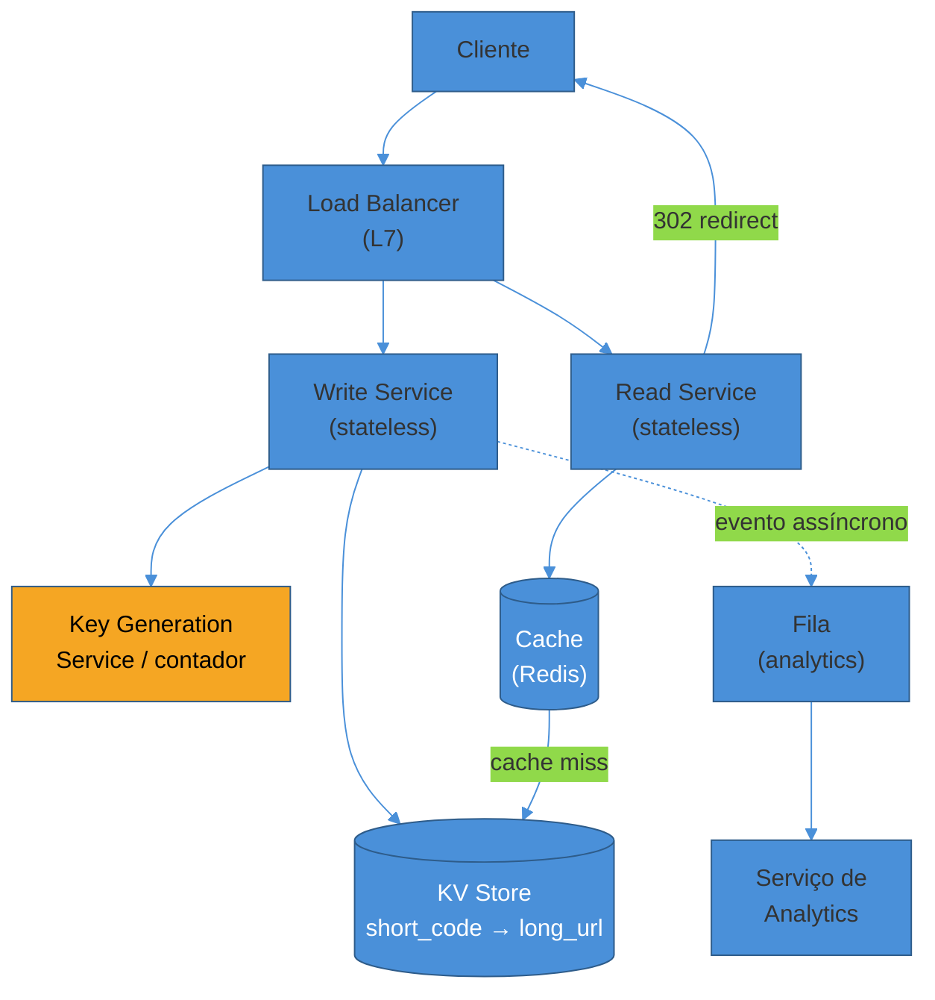
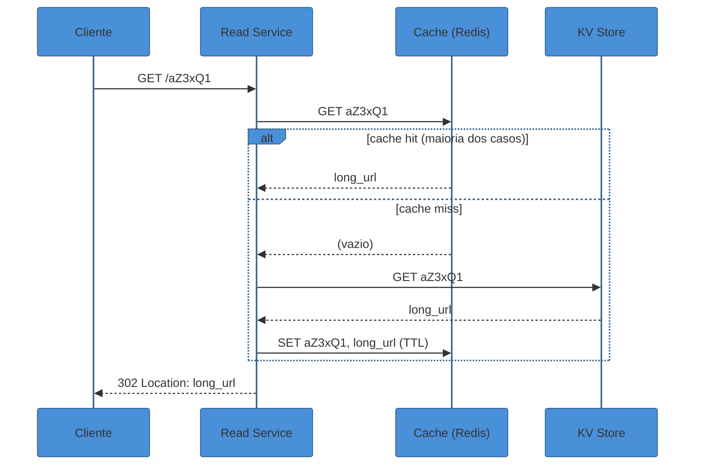
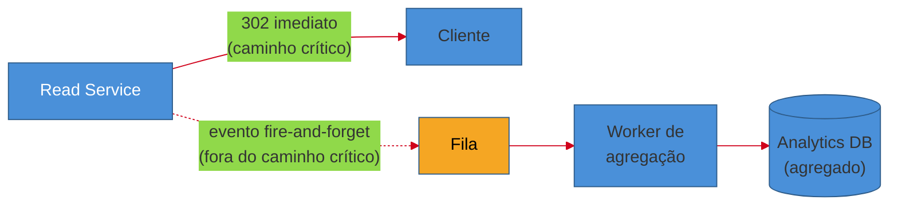

# URL Shortener

> [!abstract] TL;DR
> "Projete o bit.ly" é o walkthrough de entrada de quase toda trilha de system design — parece simples o bastante para caber em 45 minutos, e é complexo o suficiente para expor quem só decorou componentes. O sistema tem duas operações (encurtar, redirecionar) e um perfil de carga **brutalmente read-heavy** — algo como **100:1 a 1000:1** leitura sobre escrita, porque um link é criado uma vez e clicado centenas de vezes. Isso empurra o design inteiro para um único eixo: **acesso por chave, sem joins, servido majoritariamente por cache**. O núcleo técnico — o deep dive que separa um candidato júnior de um sênior — é como gerar um **código curto e único** sem coordenação cara: contador global + base62 é simples e sem colisão, mas exige um serviço centralizado; hash truncado é descentralizado, mas colide e precisa de retry. O segundo eixo é o **caminho de leitura**: cache-aside absorvendo os 20% de links "quentes" que respondem por 80% do tráfego, e a escolha nada óbvia entre redirect **301** (rápido, mas invisível para analytics) e **302** (todo clique passa pelo servidor, mas cacheia pior). Nenhuma dessas decisões é "certa" no vácuo — cada uma se justifica pelos requisitos que você negocia nos primeiros cinco minutos.

O entrevistador diz: "projete um encurtador de URL, tipo o bit.ly."

A tentação é começar desenhando na hora. Um usuário manda uma URL longa, o sistema devolve uma curta, alguém clica e é redirecionado. Trivial, certo? Um `POST` para criar, um `GET` para redirecionar, uma tabela com duas colunas.

E é exatamente aí que a maioria dos candidatos perde pontos — não porque erram o desenho, mas porque **o desenho óbvio esconde três decisões nada óbvias**: como gerar um código curto sem colisão e sem coordenação cara; como servir uma leitura em menos de 100ms quando o volume de cliques é ordens de magnitude maior que o de criações; e o que fazer quando "não perca nenhum clique nas analytics" entra em conflito direto com "sirva o redirect o mais rápido possível".

Este walkthrough conduz o problema inteiro, na ordem em que uma entrevista de verdade avançaria: requisitos, estimativas, API, diagrama macro, dois deep dives, gargalos e as variações de follow-up que o entrevistador provavelmente vai puxar depois. Cada decisão volta a um requisito ou um número — nunca a "porque é assim que o bit.ly faz".

## Requisitos

Antes de qualquer caixa no quadro, o primeiro passo — coberto em detalhe em [[1 - Framework de entrevista/02 - Clarificar requisitos|Clarificar requisitos]] — é separar o que o sistema *faz* (RF) do quão bem ele precisa fazer (RNF), e negociar o que fica de fora.

**Requisitos funcionais (RF):**

- **Encurtar.** Dado uma URL longa, o sistema devolve um código curto único. Ex.: `https://exemplo.com/artigos/2026/system-design-url-shortener-guia-completo` → `https://sho.rt/aZ3xQ1`.
- **Redirecionar.** Dado o código curto, o sistema redireciona o cliente para a URL original.
- **Custom alias (opcional, negociado).** Usuário escolhe seu próprio código (`sho.rt/promo2026`) em vez de um gerado.
- **Expiração (opcional, negociado).** Link deixa de resolver após uma data, ou tem TTL configurável.
- **Analytics básico (opcional, negociado).** Contagem de cliques, talvez geolocalização e referrer.

Vale negociar explicitamente em voz alta: "vou focar encurtar e redirecionar como o núcleo, e tratar alias, expiração e analytics como extensões depois que o caminho principal estiver sólido" — é o tipo de gestão de escopo que sinaliza senioridade sem parecer que você está evitando trabalho.

**Requisitos não-funcionais (RNF):**

- **Read-heavy extremo.** A proporção leitura:escrita costuma ser citada entre **100:1** (Alex Xu, *System Design Interview*) e **1000:1** (Hello Interview, cenário de 100M DAU) — um link é criado uma vez e clicado repetidamente ao longo de dias ou semanas.
- **Baixa latência de redirect.** O usuário não deveria perceber que passou por um serviço intermediário — alvo comum: **<100ms p99** para o redirect completo.
- **Alta disponibilidade.** Um link quebrado é uma URL morta em algum lugar do mundo — tipicamente **99,9%+**, com preferência por disponibilidade sobre consistência forte na leitura (ver CAP em [[2 - Building blocks/06 - CAP, consistência e consenso|CAP, consistência e consenso]]).
- **Unicidade do código.** Dois usuários nunca podem receber o mesmo código curto apontando para URLs diferentes — este é o único ponto do sistema em que uma garantia forte é inegociável.
- **Não-previsibilidade (negociável).** Códigos sequenciais (`sho.rt/1`, `sho.rt/2`) vazam o volume de criação do sistema para um scraper malicioso; a maioria dos designs prefere códigos que pareçam aleatórios.
- **Consistência eventual é aceitável na criação.** Se uma URL recém-criada leva alguns segundos para propagar a todas as réplicas, o impacto prático é quase nulo — ninguém compartilha um link no mesmo instante em que o cria.

> [!question]- Por que "não-previsibilidade" é um requisito e não só um detalhe de implementação?
> Porque muda a escolha entre as duas estratégias de geração de código discutidas no primeiro deep dive. Um contador incremental puro (`1`, `2`, `3`...) é a forma mais simples de garantir unicidade — mas devolve, em base62, uma sequência previsível: `sho.rt/b`, `sho.rt/c`, `sho.rt/d`. Um concorrente ou scraper consegue estimar quantos links a plataforma cria por dia só observando o crescimento do código. Não é catastrófico, mas é um vazamento de informação de negócio que a maioria dos produtos prefere evitar — e é exatamente o tipo de requisito que, se você não levantar, o entrevistador vai puxar mais tarde como "e se eu não quiser que os códigos sejam adivinháveis?".

Em uma frase: **o sistema inteiro gira em torno de um único fato de carga — leitura domina em ordens de magnitude — e cada decisão de arquitetura daqui pra frente é uma resposta a esse fato.**

## Estimativas de escala (back-of-envelope)

Com os requisitos fechados, o próximo passo — detalhado em [[1 - Framework de entrevista/03 - Estimativas de escala (back-of-envelope)|Estimativas de escala]] — é traduzir "muitos usuários" em números que guiam decisões concretas: precisa de sharding? Cabe num cache? Qual read-heavy exatamente?

**Premissas de partida** (declaradas em voz alta, não assumidas em silêncio):

- **100 milhões de URLs novas por mês.**
- **Proporção leitura:escrita de 100:1.**
- Cada mapeamento (registro) ocupa cerca de **500 bytes** (código, URL longa até 2KB truncada/hasheada, timestamps, metadados de usuário).
- Horizonte de retenção: **5 anos**, sem deletar links antigos por padrão.

**Escritas por segundo:**

$$ \frac{100.000.000 \text{ URLs/mês}}{30 \times 86.400 \text{ s/mês}} \approx 39 \text{ escritas/s}
$$

Um número pequeno — tratável por um único banco relacional bem indexado, sem nenhuma necessidade de sharding pelo lado da escrita.

**Leituras por segundo:**

Com a proporção 100:1:

$$ 39 \times 100 \approx 3.900 \text{ leituras/s (média)}
$$

Tráfego real não é uniforme ao longo do dia — aplicando um **peak factor de ~3x** (prática comum recomendada por guias de estimativa como o do Hello Interview), o pico chega perto de:

$$ 3.900 \times 3 \approx 11.700 \text{ leituras/s no pico}
$$

Esse é o número que decide o design: **quase 12 mil leituras por segundo não é algo que um banco relacional sozinho aguenta com folga em <100ms** — é exatamente o padrão de carga que justifica uma camada de cache agressiva na frente do armazenamento, discutida no segundo deep dive.

**Armazenamento total em 5 anos:**

$$ 100.000.000 \text{ URLs/mês} \times 60 \text{ meses} = 6 \text{ bilhões de URLs}
$$

$$ 6.000.000.000 \times 500 \text{ bytes} = 3 \text{ TB}
$$

Três terabytes é um volume administrável por um único cluster de banco moderno com réplicas — não exige sharding *por volume*. Mas vale antecipar em voz alta que, se a proporção de crescimento subir (ou o produto virar mais popular), sharding por código vira a próxima decisão natural — reforçando [[2 - Building blocks/04 - Sharding e Consistent Hashing|Sharding e Consistent Hashing]].

**Comprimento do código curto:**

Esta é a conta que costuma aparecer explicitamente em entrevista, porque conecta estimativa a decisão de design. Um código em **base62** (dígitos `0-9`, minúsculas `a-z`, maiúsculas `A-Z` — 10+26+26 = 62 símbolos) de comprimento `n` cobre `62^n` combinações:

| Comprimento | Combinações possíveis | Suficiente para |
|---|---|---|
| 5 | 62⁵ ≈ 916 milhões | Perto do limite para 6 bilhões de URLs |
| 6 | 62⁶ ≈ 56,8 bilhões | Confortável para 6 bilhões, com folga ~9x |
| 7 | 62⁷ ≈ 3,52 trilhões | Folga generosa (~587x); padrão recomendado por Alex Xu |
| 8 | 62⁸ ≈ 218 trilhões | Overkill para a maioria dos produtos |

Com 6 bilhões de URLs em 5 anos, **6 caracteres já bastam matematicamente** (56,8 bilhões de combinações ≫ 6 bilhões), mas a prática recomendada — inclusive por Alex Xu no capítulo dedicado do *System Design Interview Vol.1* — é usar **7 caracteres**: a folga extra absorve crescimento futuro sem precisar migrar o esquema de codificação, e o custo de armazenamento adicional (1 byte por registro) é irrisório frente ao ganho de não precisar reprojetar o sistema quando o volume passar do estimado.

> [!question]- Por que base62 e não base64?
> Base64 padrão inclui `+` e `/`, que têm significado especial numa URL (o `/` separa segmentos de path, o `+` costuma virar espaço em query strings) — usá-los exigiria escapar o código, o que é exatamente o oposto do objetivo de um link "limpo e copiável". Base62 usa só caracteres alfanuméricos, seguros em qualquer contexto de URL sem escaping, ao custo de precisar de um caractere a mais para cobrir o mesmo espaço de combinações (62⁷ ≈ 3,5 trilhões contra 64⁷ ≈ 4,4 trilhões) — uma troca claramente favorável.

Em uma frase: **~40 escritas/s e ~12 mil leituras/s no pico, sobre 3TB de dados em 5 anos — os números confirmam que o gargalo nunca é escrita ou volume, é sempre leitura, e é isso que dita cada decisão a seguir.**

## API & modelo de dados

Com requisitos e escala fixados, o terceiro passo do framework (ver [[1 - Framework de entrevista/04 - API design e data model na entrevista|API design e data model na entrevista]]) é esboçar os contratos — o suficiente para ancorar o diagrama, sem se perder em detalhes de schema completo.

**Endpoints:**

```
POST /api/v1/urls
Body: {
  "long_url": "https://exemplo.com/caminho/muito/longo",
  "custom_alias": "promo2026",      // opcional
  "expiration_date": "2027-01-01"   // opcional
}
Response: {
  "short_url": "https://sho.rt/aZ3xQ1",
  "short_code": "aZ3xQ1",
  "expiration_date": "2027-01-01"
}
```

```
GET /{short_code}
→ HTTP 301 ou 302 Location: https://exemplo.com/caminho/muito/longo
```

```
GET /api/v1/urls/{short_code}/analytics   (variação de follow-up)
Response: { "total_clicks": 4821, "clicks_by_day": [...] }
```

**Modelo de dados (tabela `url_mapping`):**

| Campo | Tipo | Nota |
|---|---|---|
| `short_code` | string, PK | 7 caracteres, base62 |
| `long_url` | string (até ~2KB) | URL original completa |
| `user_id` | string, nullable | dono do link, se autenticado |
| `created_at` | timestamp | |
| `expiration_date` | timestamp, nullable | |
| `is_custom_alias` | boolean | diferencia geração automática de escolha manual |

O acesso dominante — `WHERE short_code = ?` — é um **lookup puro por chave primária, sem joins**. Esse padrão de acesso é o argumento central para escolher um armazenamento **chave-valor** (DynamoDB, Cassandra, ou até Redis como fonte de verdade em designs mais simples) em vez de um relacional tradicional: não há necessidade de transações multi-tabela nem de queries relacionais complexas, e um KV store escala horizontalmente por chave com muito menos fricção operacional que sharding manual de um relacional. Um Postgres bem indexado também resolveria os números deste walkthrough sem esforço — a escolha de KV aqui é mais sobre "o padrão de acesso pede isso" do que "o volume exige isso", e vale dizer essa diferença em voz alta na entrevista.

## Diagrama macro

Com API e modelo fixados, a visão consolidada de alto nível — os dois caminhos, escrita e leitura, através dos mesmos componentes:



O ponto que vale narrar explicitamente ao desenhar isso: **write e read service são separados intencionalmente**, mesmo sendo o mesmo código-base ou o mesmo processo em designs menores. A justificativa não é estética — é a mesma que apareceu na estimativa: a carga de leitura é 100x a de escrita, então a camada de leitura precisa escalar (mais réplicas, cache agressivo) de forma independente da de escrita, que raramente precisa de mais que um punhado de instâncias. Escalar as duas juntas desperdiça capacidade numa ou provisiona de menos na outra.

Os app servers (write e read) são **stateless** — nenhuma sessão ou estado fica preso a uma instância específica, o que permite ao load balancer distribuir requisições livremente e escalar horizontalmente sem coordenação, um building block coberto em [[2 - Building blocks/01 - Escalabilidade e load balancing|Escalabilidade e load balancing]].

## Deep dives

Uma entrevista de 45 minutos não cabe o sistema inteiro em detalhe — o sinal de profundidade técnica vem de escolher 1-2 componentes e ir fundo. Neste walkthrough, os dois candidatos naturais são **como o código curto é gerado** (o problema mais interessante e mais citado deste design) e **como o read path absorve 12 mil leituras/s** sem que o banco vire gargalo.

### Deep dive 1 — Geração de código único

O requisito de unicidade parece trivial até você perguntar: **unicidade garantida por quem, e como, quando há múltiplos servidores gerando códigos ao mesmo tempo?**

Existem três estratégias recorrentes, cada uma com um trade-off estrutural diferente.

**Opção A — Hash truncado (MD5/SHA-256) + colisão.**

A ideia: aplicar uma função de hash à URL longa (mais um salt, para o mesmo input não gerar sempre o mesmo código), pegar os primeiros N bits do resultado, e codificar em base62.

```
código = base62( primeiros_42_bits( SHA256(long_url + salt) ) )
```

A vantagem é que **nenhuma coordenação central é necessária** — qualquer servidor pode gerar um código de forma totalmente independente, sem consultar nenhum outro nó. O problema é que hashes truncados **colidem**: dois inputs diferentes podem gerar o mesmo prefixo de bits, especialmente à medida que o espaço de códigos preenche.

O tratamento padrão é: gerar o código, tentar inserir no banco com uma constraint de unicidade em `short_code`; se a inserção falhar por violação de unicidade, adicionar um caractere/salt e tentar de novo, com um limite de retries (tipicamente 3-5, segundo o padrão descrito por Hello Interview). Isso funciona, mas introduz **latência variável e imprevisível** na escrita — na maioria das vezes zero retries, ocasionalmente um ou dois, e em teoria (embora extremamente raro com 42+ bits de espaço) uma cadeia mais longa.

**Opção B — Contador global + base62.**

A ideia oposta: manter um contador global que só incrementa (`1`, `2`, `3`, ...) e converter cada valor para base62 no momento da criação.

```
id = próximo_valor_do_contador()   // ex: 1000000000
código = base62(id)                 // "15ftgG"
```

A vantagem é **unicidade garantida por construção** — sem colisão possível, sem retry, sem verificação extra no banco. O problema é o oposto do hash: agora existe um **ponto único de coordenação**. Se dois servidores de escrita chamam "próximo valor" ao mesmo tempo sem sincronização, eles podem obter o mesmo número.

Na prática, essa coordenação é resolvida com **Redis `INCR`** — uma operação atômica, garantida pelo modelo single-threaded do Redis para cada comando, que devolve sempre um valor diferente para chamadas concorrentes. Isso resolve a corrida, mas introduz uma dependência: cada escrita agora depende da disponibilidade do Redis para obter seu próximo ID, e cada `INCR` é uma chamada de rede.

A mitigação padrão — usada, entre outros, pelo design descrito por Hello Interview para este mesmo problema — é **alocação em lotes (range allocation)**: em vez de cada escrita chamar `INCR` individualmente, cada instância de Write Service reserva um **bloco de 1000 IDs** de uma vez (`INCRBY 1000`), e distribui esses IDs localmente até esgotar o lote, só então voltando ao Redis para o próximo bloco. Isso reduz o tráfego contra o contador central em três ordens de grandeza — de 39 chamadas/s para menos de 0,04 chamadas/s no ritmo médio deste walkthrough — ao custo de desperdiçar parte do espaço de IDs se uma instância cair no meio de um lote (os IDs não usados daquele bloco ficam "queimados", mas isso é aceitável frente ao tamanho do espaço de 62⁷).

Também é a base do algoritmo mais conhecido para geração distribuída de IDs sem coordenação por chamada: o **Snowflake do Twitter** (2010), que compõe um ID de 64 bits a partir de timestamp (41 bits), ID do worker/nó (10 bits) e um contador local por milissegundo (12 bits) — cada nó gera seus próprios IDs sem nunca falar com os outros, porque o ID do worker já garante que dois nós nunca colidem, e o timestamp garante ordenação aproximada no tempo. Não é o desenho padrão de um encurtador de URL simples (o espaço de IDs do Snowflake é muito maior do que o necessário aqui), mas vale citá-lo em entrevista como o exemplo canônico de "contador distribuído sem gargalo central" quando o entrevistador perguntar "e se o Redis cair?".

**Opção C — Key Generation Service (KGS) dedicado.**

A terceira variação, descrita no capítulo de Alex Xu, desacopla a geração de código do fluxo de escrita: um serviço separado **pré-gera** um estoque de códigos únicos (aleatórios, não sequenciais — resolvendo o problema de previsibilidade levantado nos requisitos) e os mantém em duas tabelas ou filas: "disponíveis" e "usados". Quando um Write Service precisa de um código novo, ele simplesmente consome um item da fila de disponíveis — sem gerar nada em tempo real.

A vantagem é que o KGS resolve **unicidade e não-previsibilidade ao mesmo tempo** (os códigos podem ser gerados por um processo verdadeiramente aleatório, verificado contra duplicatas em batch, fora do caminho crítico de latência da escrita), e o Write Service nunca espera por geração — só consome de um estoque pré-computado, o que é ainda mais rápido que um `INCR`. A desvantagem é operacional: agora existe **mais um serviço e mais um banco** para manter disponível, e ele precisa reabastecer o estoque de códigos continuamente sem deixar o pool secar durante um pico de escrita.

**Comparação lado a lado:**

| Estratégia | Unicidade | Coordenação | Previsibilidade | Complexidade operacional |
|---|---|---|---|---|
| Hash truncado + retry | Probabilística (precisa retry) | Nenhuma | Boa (parece aleatório) | Baixa, mas latência de escrita variável |
| Contador + base62 | Garantida | Redis `INCR` (mitigável com range allocation) | Ruim (sequencial, salvo ofuscação) | Média |
| KGS dedicado | Garantida | Nenhuma no caminho crítico | Boa (gerado aleatório) | Alta (serviço extra) |

> [!question]- Qual dessas três é "a resposta certa" para citar em entrevista?
> Nenhuma sozinha — o sinal de senioridade é apresentar o trade-off, não decorar uma escolha. Uma resposta forte soa como: "eu começaria com contador + base62 via Redis `INCR` com range allocation, porque é simples e resolve unicidade sem ambiguidade; o custo é previsibilidade, que eu mitigaria embaralhando os bits do contador antes de codificar (um XOR com uma constante, por exemplo) em vez de expor o valor cru. Se previsibilidade ou o acoplamento ao Redis viraem um problema real de produto ou de disponibilidade, eu evoluiria para um KGS dedicado." Isso mostra que você entende os três, sabe por que escolheu um como ponto de partida, e sabe qual é a próxima evolução — exatamente o roteiro descrito em [[1 - Framework de entrevista/01 - O que é System Design e o que a entrevista avalia|O que é System Design]].

> [!warning] Tratar "gerar um código aleatório e torcer" como estratégia válida
> **O que acontece:** o candidato propõe `random_string(7)` a cada criação, sem verificação de unicidade nem retry. **Por quê:** parece funcionar em qualquer teste manual — colisões são raras o suficiente para nunca aparecer numa demo. Mas em escala (bilhões de códigos, ver a conta de 62⁷ da seção de estimativas), a probabilidade deixa de ser desprezível, e sem constraint de unicidade no banco, uma colisão silenciosa **sobrescreve** o mapeamento de outro usuário — o link dele passa a apontar para a URL de outra pessoa. Isso não é um bug raro tolerável; é uma falha de integridade de dado. **Como evitar:** ou (a) usar um esquema com garantia estrutural de unicidade (contador, KGS), ou (b) se usar geração aleatória/hash, sempre impor uma constraint de unicidade no banco e tratar a violação com retry — nunca confiar só na baixa probabilidade matemática sem uma rede de segurança.

### Deep dive 2 — Read path e cache

O segundo componente que vale aprofundar é o caminho que recebe os quase **12 mil requests/segundo** no pico — porque é aí que a maioria dos designs ingênuos falha silenciosamente sob carga, mesmo com um schema de dados perfeito.

**Cache-aside (lazy loading).** O padrão dominante, coberto em detalhe em [[2 - Building blocks/02 - Caching|Caching]]: o Read Service primeiro consulta o cache (Redis); se o dado está lá (**hit**), devolve direto, sem tocar o banco; se não está (**miss**), busca no banco, devolve ao cliente **e** popula o cache para a próxima leitura da mesma chave.



A escolha de cache-aside sobre alternativas como write-through se justifica pelo padrão de acesso deste sistema: a maioria dos links **nunca é lida logo após criada** (o usuário cria, compartilha, e o tráfego real chega minutos ou horas depois), então popular o cache proativamente no momento da escrita desperdiçaria memória com dados que talvez nunca sejam lidos. Cache-aside só ocupa espaço com o que é efetivamente demandado — degradando graciosamente, além disso, se o cache cair: o sistema continua funcional, só mais lento, servindo tudo direto do banco.

**Hit ratio esperado.** Links de URL shortener seguem uma distribuição de popularidade em cauda longa clássica — uma minoria de links (uma campanha de marketing, um post viral) concentra a maior parte dos cliques, enquanto a maioria dos links recebe pouquíssimo tráfego depois dos primeiros dias. A heurística **80/20** (20% dos links respondem por ~80% do tráfego) é o ponto de partida padrão citado nesse contexto: cachear os 20% mais quentes já absorve a maior parte da carga, reduzindo a pressão no banco em uma ordem de grandeza sem precisar cachear o dataset inteiro. Na prática, hit ratios de cache saudáveis em sistemas deste perfil ficam **acima de 80-90%** — abaixo disso, o cache está sub-dimensionado ou o TTL está curto demais para o padrão de acesso real.

Com Redis operando em memória (acesso da ordem de **~100 nanosegundos**, contra ~0,1ms de um SSD e ~10ms de um HDD — a diferença de ordens de grandeza que justifica o cache em primeiro lugar), um único cluster Redis bem dimensionado sustenta tranquilamente os ~12 mil reads/s de pico deste walkthrough, deixando o KV store exposto só à fração de cache miss.

**301 vs 302 — a decisão que parece cosmética e não é.**

Todo redirect HTTP carrega um código de status, e a escolha entre **301 (Moved Permanently)** e **302 (Found/Temporary)** tem uma consequência direta em dois eixos que já apareceram neste walkthrough: performance e analytics.

Um **301** sinaliza ao navegador "este redirecionamento é permanente" — navegadores modernos **cacheiam agressivamente** essa resposta, às vezes indefinidamente. Na prática, isso significa que, depois do primeiro clique de um usuário num link específico, os cliques seguintes **nunca mais tocam o servidor** — o navegador redireciona localmente, direto para a URL longa, sem sequer fazer a requisição HTTP para o encurtador. Isso é ótimo para performance e custo de infraestrutura (menos requests para o Read Service processar), mas péssimo para analytics: se você quer contar cliques, o 301 torna a maioria deles **invisível** depois do primeiro.

Um **302** sinaliza "este redirecionamento é temporário — não assuma que sempre será este destino". Navegadores, em geral, **não cacheiam** de forma persistente (a menos que headers `Cache-Control` explícitos digam o contrário), então **todo clique volta a passar pelo servidor**, permitindo contagem precisa, geolocalização por IP, detecção de referrer, e a possibilidade de trocar o destino do link depois de criado (útil para campanhas de A/B testing ou links que "expiram" para uma página diferente).

| | 301 (permanente) | 302 (temporário) |
|---|---|---|
| Cache no navegador | Agressivo, às vezes indefinido | Não, por padrão |
| Carga no servidor após 1º clique | Quase zero | Todo clique bate no servidor |
| Analytics de clique | Impreciso (maioria invisível) | Preciso |
| Permite trocar destino depois | Não (clientes já cachearam) | Sim |
| Custo de infraestrutura | Menor | Maior |

A maioria dos encurtadores de produção (bit.ly, TinyURL) usa **302 por padrão**, precisamente porque analytics de clique é uma feature central do produto — o pequeno aumento de carga no servidor é um preço aceitável frente ao dado que se ganha. É a resposta certa para citar em entrevista, mas com a ressalva importante: **a resposta certa depende do requisito**. Se analytics não estivesse no escopo (você pode ter negociado isso fora nos primeiros 5 minutos), 301 seria a escolha superior, porque reduz carga estrutural no sistema sem custo nenhum — cliques repetidos do mesmo usuário simplesmente não geram tráfego.

> [!question]- Um cache-aside no Redis e um 301 cacheado no navegador não fazem a mesma coisa duas vezes?
> Não — são camadas diferentes, resolvendo problemas diferentes. O cache no Redis protege o **banco de dados** de leituras repetidas *de usuários diferentes* pedindo o mesmo código (ex: mil pessoas clicando no mesmo link viral). O cache do navegador via 301 protege o **servidor inteiro** de receber qualquer requisição *do mesmo usuário* clicando o mesmo link de novo. Um sistema real com 302 (para manter analytics) ainda se beneficia enormemente do cache Redis, porque ele resolve o volume agregado entre usuários diferentes, que o cache do navegador nunca resolveria sozinho — cada usuário só cacheia localmente o que ele mesmo já visitou.

> [!warning] Confundir "cache-aside resolve tudo" com "não preciso pensar em TTL"
> **O que acontece:** a equipe implementa cache-aside sem definir TTL, ou com um TTL longo demais (dias), assumindo que "mais cache é sempre melhor". **Por quê:** um mapeamento código→URL raramente muda depois de criado (a menos que o produto suporte editar o destino de um link, uma feature real em alguns encurtadores) — então parece seguro cachear "para sempre". O problema aparece quando um link expira (o requisito de TTL da seção de requisitos) ou é deletado: sem um TTL de cache curto o suficiente, ou sem um mecanismo explícito de invalidação no momento da deleção/expiração, o cache continua servindo o link **depois** que ele deveria ter parado de funcionar. **Como evitar:** ou (a) invalidar explicitamente a entrada de cache no momento em que um link é deletado/expira (write-through de invalidação), ou (b) manter um TTL de cache deliberadamente mais curto que a granularidade de expiração que o produto promete — aceitando staleness de alguns minutos como trade-off consciente, não acidental.

## Gargalos & trade-offs

Nenhum dos componentes discutidos até aqui é gratuito — cada um introduz um ponto de fragilidade que vale nomear proativamente, porque é exatamente o tipo de pergunta que o entrevistador faz na fase de trade-offs & evolução (ver [[1 - Framework de entrevista/05 - Do diagrama macro ao deep dive e trade-offs|Do diagrama macro ao deep dive e trade-offs]]).

**O contador/KGS como ponto único de falha (SPOF).** Se a estratégia escolhida for contador via Redis, ou KGS dedicado, esse componente vira uma dependência crítica: se ele cair, **nenhuma URL nova pode ser criada**, mesmo que o resto do sistema esteja saudável. A mitigação padrão é dupla — replicar o Redis (leader-follower com failover automático, ou um cluster Redis com sharding) e, no caso do range allocation, cada Write Service já mantém um lote local de IDs não usados, o que dá a ele autonomia para continuar criando URLs por um tempo mesmo que o contador central fique temporariamente indisponível.

> [!warning] Esquecer que a leitura sobrevive à queda do contador, mas a escrita não
> **O que acontece:** a equipe testa a resiliência do sistema derrubando o Redis do contador e conclui "o sistema está saudável" porque os redirects continuam respondendo normalmente. **Por quê:** o caminho de leitura (redirect) nunca toca o contador — ele só lê `short_code → long_url` do cache/banco, então uma falha no gerador de ID é **invisível** para quem só observa redirects. O sintoma real (criação de link falhando) fica escondido atrás de uma métrica de disponibilidade agregada que continua verde. **Como evitar:** monitore a disponibilidade de escrita e de leitura como métricas **separadas**, com alertas independentes — um SPOF que derruba só 1% das requisições (as de criação, dado o perfil 100:1) ainda é uma falha total de uma capacidade inteira do produto, mesmo que o painel geral de "% de requests bem-sucedidos" mal se mexa.

**Sharding do KV store por código.** Embora os 3TB estimados não exijam sharding por volume hoje, é o ponto natural de evolução se o produto crescer além da estimativa original. A shard key óbvia é o próprio `short_code` — alta cardinalidade, distribuição uniforme se o código for razoavelmente aleatório (reforçando por que previsibilidade importa: um contador sequencial puro criaria hot spots de escrita concentrados no shard que recebe os valores "mais recentes", exatamente o cenário descrito em [[2 - Building blocks/04 - Sharding e Consistent Hashing|Sharding e Consistent Hashing]]). Consistent hashing, não `hash % N` puro, é a escolha natural aqui pelo mesmo motivo de sempre: adicionar um shard não deveria remapear a maioria do dataset.

**Contador distribuído como gargalo de coordenação.** Já discutido no deep dive — a alocação em lote (Redis `INCRBY` de blocos de 1000) é a mitigação padrão; em sistemas que precisam de geração de ID verdadeiramente sem coordenação nenhuma (multi-região, por exemplo), a alternativa é alocar **faixas disjuntas de contador por região** (região A recebe 0–1B, região B recebe 1B–2B, e assim por diante) — cada região gera IDs localmente, sem nunca precisar falar com as outras, ao custo de ter que pré-decidir o tamanho de cada faixa.

**Analytics assíncrono via fila.** Contar cliques em tempo real, no caminho crítico do redirect, adicionaria latência exatamente onde o requisito de <100ms é mais rígido. A solução padrão é publicar um evento leve ("clique no código X, timestamp Y, IP Z") numa fila (Kafka, SQS) de forma **fire-and-forget** — o Read Service não espera confirmação de que o evento foi processado antes de responder o redirect ao usuário — e processar a agregação de analytics de forma totalmente desacoplada, em um serviço consumidor que nunca bloqueia o caminho de leitura. Isso reforça o padrão coberto em [[2 - Building blocks/05 - Message queues e processamento assíncrono|Message queues e processamento assíncrono]]: desacoplar quem produz trabalho (o redirect) de quem consome (a agregação de analytics).



## Variações de follow-up

O entrevistador raramente para no design básico — as extensões abaixo são as mais comuns, e vale antecipar cada uma antes de ser perguntado.

**Custom alias.** O usuário escolhe seu próprio código em vez de receber um gerado. A mudança de design é pequena mas real: o Write Service precisa **checar disponibilidade** do alias desejado antes de aceitar (constraint de unicidade no banco, exatamente como no caso de colisão de hash), e o campo `is_custom_alias` da tabela existe justamente para diferenciar esse caso na hora de, por exemplo, impedir que o processo de limpeza de links expirados reutilize um alias que um usuário escolheu deliberadamente.

**Expiração / TTL.** Dois mecanismos coexistem: um **TTL no nível do banco** (muitos KV stores, como DynamoDB, suportam expiração nativa de item — o registro simplesmente some depois de X tempo, sem custo extra de limpeza) e a **invalidação de cache correspondente**, discutida no warning do deep dive de cache. Vale mencionar explicitamente que expiração automática de item no banco não invalida sozinha uma entrada de cache já servida — os dois mecanismos precisam estar coordenados, ou o link "expirado" continua resolvendo durante o TTL restante do cache.

**Analytics em escala.** Se o produto evolui de "contar cliques" para "dashboard de analytics em tempo real com segmentação por geografia, dispositivo, referrer", o design de fila simples da seção anterior não basta — isso empurra para um pipeline de streaming real (Kafka + processamento tipo Flink/Spark Streaming) com agregações em janelas de tempo, e um banco analítico colunar (ClickHouse, BigQuery) em vez de incrementar contadores num KV store. É um bom gancho para citar que "analytics em tempo real com alta cardinalidade de dimensões" é, na prática, um sistema separado com seu próprio design — vale nomear a fronteira em vez de tentar encaixar tudo no mesmo banco do mapeamento de URLs.

**Links maliciosos / phishing.** Um encurtador é, por natureza, uma ferramenta que esconde o destino real de um link — o que o torna atraente para phishing e malware. A mitigação de produto passa por checar a URL longa contra uma lista de blocklist conhecida (ex: Google Safe Browsing API) no momento da criação, e opcionalmente mostrar uma **página intermediária de aviso** ("você está prestes a ser redirecionado para X — continuar?") em vez de um redirect silencioso, especialmente para links recém-criados ou de contas sem histórico de reputação. Isso é uma extensão de produto, mas vale mencionar proativamente — mostra que você pensou além do caminho feliz, um dos eixos citados em [[1 - Framework de entrevista/01 - O que é System Design e o que a entrevista avalia|O que é System Design]].

## Em entrevista

Este é tipicamente o **primeiro** walkthrough que aparece em qualquer preparação de system design — e por bons motivos: ele é pequeno o suficiente para caber em 45 minutos com folga para um deep dive real, e denso o suficiente para expor os quatro eixos da rubrica sem exigir domínio de sistemas distribuídos avançados.

O roteiro de condução que tende a sinalizar senioridade:

1. **Não aceite o enunciado como veio.** "Vamos assumir que é read-heavy — que proporção? Precisa de analytics? Custom alias e expiração fazem parte do escopo ou eu foco no core primeiro?" — negocie em voz alta o que fica de fora.
2. **Faça a conta do comprimento do código na hora**, mesmo que aproximada — é um dos únicos walkthroughs onde um cálculo simples (base62^n) produz um número defensável e visivelmente conecta estimativa a decisão de schema.
3. **Ofereça o deep dive de geração de código proativamente**, antes de ser perguntado — é o componente mais rico deste design, e entrevistadores costumam recompensar quem identifica sozinho onde a dificuldade real mora.
4. **Não trate 301 vs 302 como trivialidade.** É uma das poucas decisões deste walkthrough que parece cosmética e na verdade amarra performance, custo e a feature de analytics numa única escolha — nomear esse trade-off explicitamente é um sinal de profundidade barato de conquistar.
5. **Feche com o SPOF do contador/KGS**, mesmo que não peçam — é o gargalo mais óbvio do design e antecipá-lo mostra que você pensa em modos de falha, não só no caminho feliz.

> [!question]- O entrevistador pode considerar esse problema "fácil demais" e me penalizar por escolher ele?
> Você raramente escolhe o problema — o entrevistador escolhe. Mas se a pergunta permitir alguma flexibilidade de aprofundamento, o "fácil demais" nunca é o problema em si, é a superficialidade da condução. Um encurtador de URL conduzido com estimativas reais, um deep dive de geração de código bem argumentado, o trade-off 301/302 explicado e o SPOF do contador antecipado é indistinguível, em termos de sinal de rubrica, de qualquer outro walkthrough "mais impressionante" — porque o que é avaliado é *como* você navega a incerteza, não a complexidade aparente do enunciado. É perfeitamente possível reprovar num design de sistema distribuído sofisticado e passar de forma sólida num encurtador de URL bem conduzido.

## Como explicar em inglês

> "I'd start by clarifying that this is extremely read-heavy — reads outnumber writes by something like 100 to 1, since a link gets created once but clicked many times. That ratio drives the whole design: I want aggressive caching on the read path and I don't need to over-engineer the write path.
>
> For short code generation, I'd compare a global counter encoded in base62 against a hash-and-truncate approach. The counter guarantees uniqueness with no collision handling, but it needs a coordination point — I'd use Redis `INCR` with batch allocation to keep that cheap. The trade-off is predictability, since sequential IDs leak how many links you're creating; I'd obfuscate the counter output before encoding it.
>
> On the read path, cache-aside handles the hot 20% of links driving most of the traffic. And I'd default to a 302 redirect instead of 301, because 301s get cached by the browser and become invisible to click analytics — which is usually a hard requirement for this kind of product."

| PT | EN |
|----|----|
| Encurtador de URL | URL shortener |
| Código curto | Short code |
| Colisão (de hash) | Collision |
| Contador global | Global counter |
| Serviço de geração de chaves | Key Generation Service (KGS) |
| Alocação em lote | Batch allocation / range allocation |
| Cache-aside / lazy loading | Cache-aside / lazy loading |
| Taxa de acerto de cache | Cache hit ratio |
| Link quente / viral | Hot link |
| Redirecionamento permanente/temporário | Permanent/temporary redirect |
| Ponto único de falha | Single point of failure (SPOF) |
| Cauda longa (distribuição) | Long tail (distribution) |

## O que vem a seguir

O encurtador de URL resolveu um padrão de acesso relativamente simples — chave única, sem relações, leitura dominante. O próximo walkthrough joga o oposto: um sistema onde a leitura de cada usuário (o feed) é a **agregação** de escritas de centenas ou milhões de outras pessoas, e a pergunta central deixa de ser "como cacheio uma chave" e passa a ser "eu computo o feed na escrita ou na leitura — e o que fazer quando uma celebridade tem 100 milhões de seguidores".

- [[02 - News Feed e Timeline]] — fan-out on-write vs on-read, o problema da celebridade, feed cache e ranking

## Veja também

- [[System Design/index|System Design]] — o galho-pai e o mapa da trilha
- [[4 - Walkthroughs/index|Walkthroughs]] — os outros sete designs deste sub-galho
- [[1 - Framework de entrevista/index|Framework de entrevista]] — os seis passos aplicados ponta a ponta neste walkthrough
- [[2 - Building blocks/02 - Caching|Caching]] — cache-aside, TTL, eviction, stampede — aprofundado no deep dive de read path
- [[2 - Building blocks/04 - Sharding e Consistent Hashing|Sharding e Consistent Hashing]] — a evolução natural do KV store se o volume crescer além do estimado
- [[1 - Framework de entrevista/03 - Estimativas de escala (back-of-envelope)|Estimativas de escala (back-of-envelope)]] — o método por trás das contas desta nota

## Fontes

- **Alex Xu** — *System Design Interview – An Insider's Guide, Vol. 1*, cap. 8 (Design a URL Shortener) — a referência-âncora deste walkthrough: base62, contador vs hash, Key Generation Service (KGS).
- **Hello Interview** — [*Design a URL Shortener Like Bitly*](https://www.hellointerview.com/learn/system-design/problem-breakdowns/bitly) — breakdown moderno (2024+) com estimativas, batch allocation via Redis `INCRBY`, e o trade-off 301/302 detalhado.
- **Donne Martin** — [*System Design Primer*](https://github.com/donnemartin/system-design-primer) — vocabulário de referência para os building blocks aplicados aqui (cache, load balancer, KV store).
- **Twitter Engineering** — *Announcing Snowflake*, 2010 — o algoritmo de geração distribuída de IDs sem coordenação central citado no deep dive de geração de código.
- **peng.fyi** — [*Six Options for Generating Distributed Unique IDs*](https://peng.fyi/post/six-options-generating-distributed-ids/) — panorama comparativo de estratégias de ID distribuído (UUID, Snowflake, range allocation, Redis INCR).
- **URL Shortening** — [*301 vs. 302 Redirects in URL Shorteners: Speed, SEO, and Caching Best Practices*](https://url-shortening.com/blog/301-vs-302-redirects-in-shorteners-speed-seo-and-caching) — o trade-off cache-vs-analytics do código de redirect, aplicado especificamente a encurtadores.
