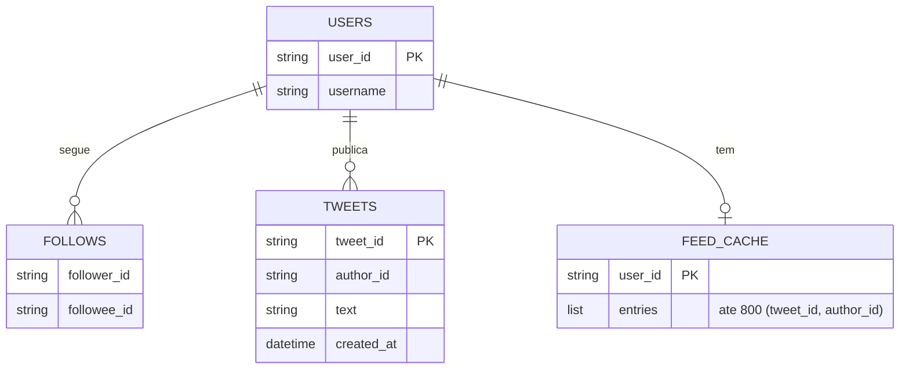
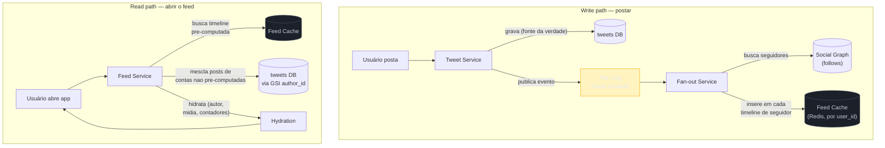
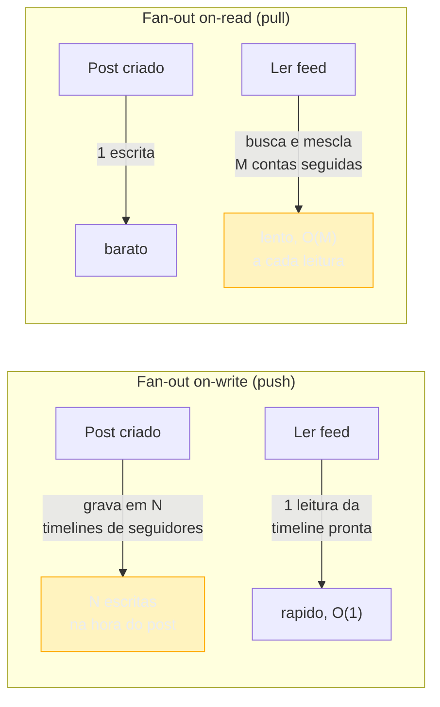
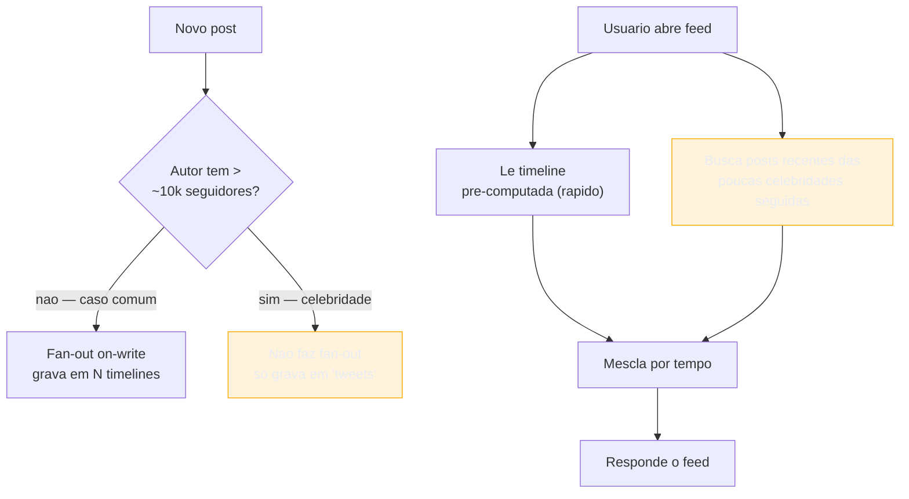
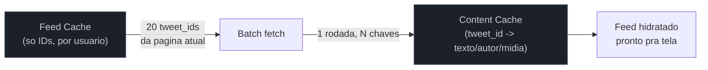

# News Feed e Timeline

> [!abstract] TL;DR
> "Projete o feed do Twitter" é, no fundo, um problema de **onde gastar trabalho**: no momento em que alguém posta, ou no momento em que alguém lê. **Fan-out on-write** pré-computa o feed de cada seguidor assim que o post acontece — leitura vira um `O(1)` de cache, mas escrever um post de uma conta com 90 milhões de seguidores significa 90 milhões de gravações quase simultâneas. **Fan-out on-read** faz o oposto: escrever é barato (uma linha), mas ler o feed de alguém que segue 3.000 contas significa buscar e mesclar 3.000 fontes toda vez que a tela abre. Nenhuma das duas sozinha escala para o mundo real, porque a distribuição de seguidores é brutalmente desigual — a maioria dos usuários tem poucas centenas de seguidores, uma fração minúscula tem dezenas de milhões. A solução que Twitter, Facebook e Instagram convergiram, de formas distintas mas com o mesmo princípio, é **híbrida**: fan-out on-write para o comum, fan-out on-read (ou um pipeline separado) para o excepcional. Esta nota conduz esse design ponta a ponta — requisitos, números, o diagrama macro, e os dois deep dives que decidem se o sistema aguenta escala real: a arquitetura write/read path e o problema da celebridade.

Imagine a pergunta na entrevista: "projete o feed de notícias do Twitter — quando eu abro o app, quero ver os posts mais recentes de quem eu sigo."

A primeira reação de quem nunca pensou nisso é tratar como uma junção (`JOIN`) relacional: pegar todo mundo que o usuário segue, buscar os posts recentes de cada um, ordenar por data, paginar. Funciona perfeitamente — para 100 usuários. A um milhão de usuários abrindo o feed por segundo, cada um seguindo em média algumas centenas de contas, essa consulta vira uma varredura distribuída gigantesca *repetida a cada abertura de app*, na maioria das vezes retornando quase o mesmo resultado da última vez.

O insight que resolve isso não é um banco mais rápido. É perceber que **a mesma escrita (um post) é lida centenas ou milhões de vezes**, então o trabalho de "juntar os posts de quem eu sigo" pode ser feito *uma vez*, no momento da escrita, e reaproveitado em toda leitura subsequente — em vez de refeito do zero a cada leitura. Essa troca de "quando computar" é o coração do design, e o resto da nota existe para mostrar onde ela quebra e como remendar a quebra.

## Requisitos

### Requisitos funcionais (RF)

- **Postar.** Um usuário publica um post (texto, imagem, possivelmente mídia) — vamos chamar de *tweet* para simplificar, mas o design serve igualmente a um post do Instagram.
- **Seguir / deixar de seguir.** Um usuário segue outro usuário; a relação é **assimétrica** (seguir não implica ser seguido de volta — diferente de "amizade" bidirecional do Facebook, que tem sua própria variação de escala mas o mesmo princípio de fundo).
- **Ver o feed (home timeline).** O usuário abre o app e vê os posts mais recentes de quem segue, em ordem — cronológica ou por relevância, ver seção de ranking.
- **Paginar o feed.** Rolar para trás no tempo, carregando mais posts antigos sob demanda (scroll infinito).

Ficam **fora do escopo** desta nota, para caber no orçamento de uma entrevista de 45-60 minutos: curtidas/comentários como feature completa, mensagens diretas, notificações push (nota própria: [[05 - Notification System]]), busca e trending topics. Vale mencionar que eles existem e dizer por que ficam de fora — isso já é sinal de escopo negociado, não de esquecimento.

### Requisitos não-funcionais (RNF)

- **Read-heavy, extremamente.** A proporção de leituras de feed para posts publicados é de ordens de magnitude — ver estimativas abaixo. Todo o design se curva em torno disso.
- **Latência de leitura baixa.** Abrir o feed precisa responder em **menos de 2 segundos** (Facebook mira <500ms para o primeiro lote em alguns relatos de entrevista) — o usuário não tolera uma tela em branco.
- **Disponibilidade sobre consistência forte.** Se o feed está 30 segundos atrasado — um post que acabou de sair ainda não apareceu para todo mundo — ninguém percebe nem se importa. Isso é **staleness tolerável**, e é a licença que permite todo o resto do design ser assíncrono.
- **Escala massiva.** Ordem de 200-300 milhões de usuários ativos diários (DAU) para uma rede do porte do X/Twitter em 2026 — a X reporta algo entre 245-259M DAU e ~251M mDAU (monetizáveis) no início de 2026 ([Backlinko, X Statistics 2026](https://backlinko.com/twitter-users); [DemandSage, Twitter Statistics 2026](https://www.demandsage.com/twitter-statistics/)). Para efeito de estimativa nesta nota, vamos fixar **300M DAU**, um número redondo dentro dessa faixa.
- **Distribuição de seguidores extremamente desigual.** A maioria dos usuários tem algumas centenas de seguidores; uma fração ínfima (celebridades, contas oficiais) tem dezenas de milhões. Esse único fato — não qualquer requisito de latência — é o que força a arquitetura híbrida da nota inteira.
- **Durabilidade do post.** Um post publicado nunca pode simplesmente sumir, mesmo que o *feed pré-computado* dele se perca — o post em si é a fonte da verdade, o feed é uma projeção reconstruível.

> [!question]- Por que "staleness tolerável" é tratado como requisito, e não como defeito a esconder?
> Porque é essa concessão que compra a arquitetura inteira. Se o requisito fosse "todo seguidor vê o post em tempo real, garantido, sem exceção", você não poderia usar filas assíncronas para fan-out — teria que confirmar a entrega em cada um dos milhões de feeds antes de considerar o post "publicado", o que é absurdo em latência e custo. Dizer em voz alta "eu assumo que um atraso de alguns segundos a um minuto é aceitável" é o mesmo movimento que a nota [[01 - O que é System Design e o que a entrevista avalia]] descreve como usar requisitos como bússola: a partir daqui, cada decisão de assincronismo se justifica por esse RNF, não por preguiça de fazer certo.

## Estimativas (back-of-envelope)

Números defensáveis, não decorados — o objetivo é que cada decisão de arquitetura mais à frente aponte de volta para um destes.

**Usuários e posts.**
- DAU: **300 milhões**.
- Suponha que 20% dos DAU postam algo em um dia médio (a maioria só lê — comportamento real de redes sociais, onde leitores superam autores em ordens de magnitude): **60 milhões de posts/dia**.
- QPS de escrita médio: 60.000.000 / 86.400s ≈ **~700 escritas/s** em média; com fator de pico de 3-5x em horários de maior uso, **~2.500-3.500 escritas/s** no pico.

**Leituras de feed.**
- Suponha que cada DAU abre o feed em média 10 vezes por dia (scroll, refresh, reabrir o app): **3 bilhões de leituras de feed/dia**.
- QPS de leitura médio: 3.000.000.000 / 86.400 ≈ **~35.000 leituras/s** em média; no pico, **~100.000-150.000 leituras/s**.
- **Proporção leitura:escrita ≈ 50:1** — na prática publicada por engenheiros do Twitter, esse número real fica ainda mais extremo em picos de eventos (300K QPS de leitura citados para 150M usuários ativos — [High Scalability, "The Architecture Twitter Uses"](https://highscalability.com/the-architecture-twitter-uses-to-deal-with-150m-active-users/)). É esse desequilíbrio — muito mais leitura que escrita — que justifica pré-computar no lado da escrita: você paga o custo de fan-out uma vez por post, e economiza esse custo em cada uma das dezenas de leituras subsequentes daquele mesmo post.

**Fan-out: o número que muda tudo.**
- Um usuário mediano tem, digamos, 200 seguidores. Postar para ele dispara **200 gravações** no fan-out.
- Uma conta grande (celebridade, veículo de notícia) pode ter **10-90 milhões de seguidores**. Postar para ela, com fan-out ingênuo, dispara **10-90 milhões de gravações** — de uma vez só, em segundos, todas na mesma janela de tempo.
- Multiplicando pela taxa de posts: se a amplificação média de fan-out for ~sw 500x (a razão observada entre inserções no cluster Redis de destino e requisições de ingestão de tweet, que salta de milhares para centenas de milhares de req/s conforme o número de seguidores por post cresce — [High Scalability, idem]), o sistema de fan-out não processa "60 milhões de posts", processa **bilhões de gravações de timeline por dia**.

**Armazenamento do feed cache.** Se cada usuário mantém as últimas 800 entradas do feed pré-computado (o número real usado pelo Twitter, ver deep dive) e cada entrada ocupa ~20 bytes (ID do tweet 8B + ID do autor 8B + 4B de metadados — [High Scalability, idem]), o feed cacheado de um usuário pesa **~16KB**. Para 300M usuários ativos com timeline quente em RAM: 300.000.000 × 16KB ≈ **4,8 TB** de cache — grande, mas administrável distribuído em um cluster Redis com réplicas.

Esses três números — leitura:escrita de ~50:1, fan-out que salta de milhares para centenas de milhares de req/s por post de celebridade, e ~16KB por timeline cacheada — são os que vão decidir cada escolha do deep dive.

## API & modelo de dados

### API

```
POST /v1/tweets
Body: { "userId": "u123", "text": "...", "mediaIds": [...] }
Resp: { "tweetId": "t789", "createdAt": "..." }

POST /v1/follows
Body: { "followerId": "u123", "followeeId": "u456" }
Resp: 204 No Content

GET /v1/feed?cursor={opaco}&limit=20
Resp: {
  "items": [{ "tweetId": "t789", "authorId": "u456", "createdAt": "..." }, ...],
  "nextCursor": "..."
}
```

O `cursor` de paginação é opaco (um timestamp ou offset codificado), não um número de página — porque o feed é uma lista que muda constantemente conforme novos posts chegam; paginar por número de página faria itens pularem ou repetirem entre uma requisição e a seguinte.

### Modelo de dados

**`users`** — perfil básico. `user_id` (PK), `username`, `created_at`.

**`follows`** — a relação assimétrica. `follower_id`, `followee_id` (chave composta), mais um índice secundário invertido por `followee_id` para responder "quem segue este usuário" — a consulta que o fan-out precisa fazer a cada post.

```
follows(follower_id, followee_id, created_at)
  PK: (follower_id, followee_id)
  GSI: (followee_id, follower_id)   -- "me dê todos os seguidores de X"
```

**`tweets`** — a fonte da verdade de cada post. `tweet_id` (PK, tipicamente um Snowflake ID — ordenável por tempo e distribuído, sem coordenação central), `author_id`, `text`, `media_refs`, `created_at`. Uma GSI por `author_id` + `created_at` permite reconstruir o perfil de um autor ou recomputar um feed do zero se o cache se perder.

**`feed_cache` (ou `precomputed_feed`)** — a projeção pré-computada por usuário, o coração da arquitetura de fan-out on-write. Chave por `user_id`, valor é uma lista ordenada (por tempo) de `(tweet_id, author_id)`, limitada às últimas **~800 entradas** (número usado pelo Twitter em produção — ver deep dive). Vive em Redis, não no banco relacional/primário — é *cache reconstruível*, não fonte de verdade: se ele se perder, dá para reconstruir consultando `follows` + `tweets`, só que mais devagar.



> [!question]- Por que o feed cacheado não é a fonte da verdade?
> Porque tratar um cache reconstruível como fonte da verdade tira a sua principal vantagem: a liberdade de perdê-lo sem perder dado real. Se o `feed_cache` de um usuário for corrompido, evictado por pressão de memória, ou perdido num incidente do cluster Redis, o pior cenário é reconstruí-lo consultando `follows` (quem ele segue) e `tweets` (os posts recentes desses usuários) — mais lento, mas correto. Se o cache *fosse* a fonte da verdade, perdê-lo significaria perder posts de verdade — inaceitável dado o requisito de durabilidade. Esse é o mesmo princípio de "cache é descartável, banco é permanente" que aparece em [[02 - Caching]], aplicado aqui a uma estrutura pré-computada em vez de um valor simples.

## Diagrama macro

Dois fluxos separados — escrita (postar) e leitura (abrir o feed) — que se encontram na estrutura de dados do feed cache.



O write path é assíncrono a partir da fila: o `Tweet Service` responde "publicado!" assim que grava no banco de posts — não espera o fan-out terminar. Isso é o mesmo padrão de desacoplar o caminho crítico do não-crítico discutido em [[05 - Message queues e processamento assíncrono]]: o usuário não precisa esperar 90 milhões de escritas de timeline para saber que seu post saiu.

O read path busca a timeline pré-computada (rápido, `O(1)` de leitura de lista) e — esse é o pulo do gato do design híbrido, detalhado no deep dive (b) — **mescla** com posts de contas que não foram pré-computadas (celebridades). A etapa de **hidratação** busca dados adicionais (nome do autor, foto, contagem de curtidas) que não valem a pena guardar duplicados dentro do feed cache — o feed cache guarda só IDs, magro o suficiente para caber 800 entradas em ~16KB.

## Deep dives

### (a) Fan-out on-write vs fan-out on-read

Esta é a decisão central da nota, e a resposta certa em entrevista nunca é "eu escolho X" sozinho — é comparar os dois e escolher com critério, amarrado aos números da seção de estimativas.

**Fan-out on-write (push).** No momento em que o post é criado, o sistema já calcula e grava a entrada correspondente na timeline pré-computada de *cada seguidor*. Ler o feed depois vira uma leitura direta de uma lista já pronta — rápido, previsível, `O(1)` relativo ao número de seguidores do leitor.

**Fan-out on-read (pull).** Nada é pré-computado. Quando o usuário abre o feed, o sistema busca, na hora, os posts recentes de *cada conta que ele segue* e mescla por tempo. Escrever um post é barato — uma linha na tabela `tweets`. Ler é caro: se o usuário segue 3.000 contas, a leitura precisa tocar (ou pelo menos consultar índice de) até 3.000 fontes.



| | Fan-out on-write (push) | Fan-out on-read (pull) |
|---|---|---|
| Custo de escrita | Alto — `O(seguidores)` gravações por post | Baixo — 1 gravação por post |
| Custo de leitura | Baixo — `O(1)`, timeline já pronta | Alto — `O(contas seguidas)` a cada leitura |
| Melhor quando | Poucos seguidores por autor, muitas leituras por post (o caso comum) | Muitas contas seguidas por leitor, poucas leituras (raro em redes sociais mainstream) |
| Falha catastrófica | Conta com 90M seguidores → 90M escritas de uma vez (thundering write) | Usuário que segue 10.000 contas → 10.000 buscas por leitura |
| Staleness | Pode atrasar propagação (fila enfileirando) | Sempre atual — lê a fonte direto |
| Onde aparece | Twitter, Instagram (regime normal) | LinkedIn (parcialmente), sistemas com poucos "hubs" |

Dado o RNF de leitura:escrita ~50:1 desta nota, fan-out on-write vence *no caso geral*: você paga o custo de fan-out uma vez por post e amortiza sobre dezenas de leituras subsequentes. É exatamente o argumento que a estimativa de "amplificação de req/s" da seção anterior sustenta — pagar mais na escrita para economizar (e muito) na leitura, porque a leitura acontece com frequência muito maior.

Mas "vence no caso geral" esconde a palavra que decide tudo: **geral**. E é aí que mora o problema seguinte.

> [!question]- Por que não simplesmente usar fan-out on-read para todo mundo e evitar o problema da celebridade de vez?
> Porque isso troca um problema raro (poucas contas com muitos seguidores) por um problema universal (toda leitura de feed vira uma busca distribuída cara). Lembre da proporção leitura:escrita — ~50:1 nesta estimativa, e observadamente ainda mais extrema em redes reais. Fan-out on-read faz *cada uma* dessas dezenas de bilhões de leituras diárias pagar o custo que fan-out on-write paga *uma vez* por post. Você resolveria o caso raro (celebridade) degradando o caso comum (usuário médio abrindo o feed) — uma troca ruim, porque o caso comum é a esmagadora maioria do tráfego.

### (b) O problema da celebridade e a solução híbrida

O fan-out on-write ingênuo tem um ponto de ruptura nítido: contas com seguidores na casa dos milhões. Quando uma conta com 30-90 milhões de seguidores posta, o `Fan-out Service` precisaria disparar dezenas de milhões de gravações **quase simultaneamente** — mesmo com fila e processamento assíncrono, isso é uma rajada de escrita que pode:

- **Sobrecarregar o cluster de cache** que recebe as gravações, degradando latência para *todo mundo* que compartilha aquele cluster, não só os seguidores da celebridade.
- **Atrasar a propagação para além do aceitável** — relatos de engenharia do Twitter descrevem filas "que enfileiram o tempo todo para fan-outs de alto valor" ([High Scalability, idem]), ou seja, mesmo com meta de 5 segundos, celebridades nem sempre cumprem esse SLA sob fan-out puro.
- **Desperdiçar trabalho para nada** — boa parte dos 90 milhões de seguidores de uma celebridade não vai abrir o feed nas próximas horas. Pré-computar a timeline deles agora, quando talvez metade nunca logue de novo naquele dia, é gravação que nunca será lida.

A solução, documentada de forma equivalente por Twitter, Instagram e no design de referência do Hello Interview, é **híbrida por conta, não por sistema inteiro**:

- **Para a esmagadora maioria dos usuários** (poucos milhares de seguidores para baixo): fan-out on-write normal. Postar dispara gravações na timeline de cada seguidor, via fila assíncrona.
- **Para contas "grandes"** (acima de um limiar configurável de seguidores — dezenas de milhares, ajustável): a relação de follow é marcada com uma flag (`is_precomputed = false` na tabela `follows`, no desenho do Hello Interview). O post dessas contas **não** dispara fan-out. Ele fica disponível apenas via a tabela `tweets` (indexada por `author_id`).
- **No momento da leitura**, o `Feed Service` busca a timeline pré-computada normal (rápida) **e**, em paralelo, consulta diretamente os posts recentes das contas grandes que aquele usuário segue (normalmente pouquíssimas — a maioria das pessoas segue no máximo algumas celebridades) — e **mescla** os dois conjuntos por tempo antes de responder.



O resultado prático: o custo de escrita de uma celebridade cai de "90 milhões de gravações" para "uma gravação" (o post em si). O custo dessa decisão é jogado para a leitura — mas de forma controlada, porque cada leitor típico segue *poucas* celebridades (a maioria das pessoas não segue centenas de contas com dezenas de milhões de seguidores cada), então o `O(M)` da mesclagem no read path é pequeno na prática, mesmo sendo tecnicamente "fan-out on-read" para esse subconjunto.

> [!warning] Fan-out ingênuo sem limiar de celebridade é uma bomba-relógio de capacidade
> **O que acontece:** o sistema funciona bem em testes e no lançamento — a maioria das contas de teste tem poucos seguidores. Meses depois, uma conta cresce organicamente (ou uma conta famosa migra para a plataforma) e ultrapassa alguns milhões de seguidores. O primeiro post dela satura o cluster de fan-out, atrasando a propagação para *todos* os usuários que compartilham aquele shard de cache, não só os seguidores da conta grande. **Por quê:** a arquitetura foi validada contra a distribuição *média* de seguidores, não contra a **cauda** da distribuição — e redes sociais têm cauda extremamente longa (lei de potência: pouquíssimas contas concentram a maior parte dos seguidores agregados). **Como evitar:** definir o limiar de "conta grande" como parte do design desde o início — não como correção de incidente. Monitorar a contagem de seguidores e mover contas automaticamente para o regime "não pré-computado" ao cruzar o limiar, com um pipeline de fan-out gradual (rate-limited, não instantâneo) para as que ficam perto da fronteira.

### (c) Feed cache: estrutura, tamanho e replicação

O feed cache é onde o design vive ou morre em latência, e três decisões de implementação — vistas na prática do Twitter — valem a pena entender.

**Estrutura por usuário: lista limitada, não histórico completo.** Cada timeline pré-computada guarda só as últimas **~800 entradas** (número real usado pelo Twitter em produção — [Redis / antirez, "Twitter/X: Deep Internals and Custom Data Structures"](https://redis.antirez.com/production/twitter-internals.html); [High Scalability, idem]). Isso não é um limite arbitrário — é o reconhecimento de que **ninguém rola 5.000 posts para trás no feed**. Guardar mais do que o usuário jamais vai consultar é desperdício de RAM sem ganho de experiência. Cada entrada é compacta: ID do tweet + ID do autor + alguns bytes de metadata (flags de retweet, por exemplo) — a hidratação completa (texto, mídia, contadores) acontece só na leitura, buscando de um cache de conteúdo separado, não replicado 800 vezes por seguidor.

**TTL e eviction: só usuários ativos ficam quentes.** Manter a timeline pré-computada de *todo* usuário cadastrado em RAM, ativo ou não, é desperdício — a maioria dos usuários cadastrados não abre o app todo dia. A prática observada é manter em Redis apenas as timelines de usuários **ativos recentemente** (login nos últimos ~30 dias); para o resto, a timeline não existe em cache e é reconstruída sob demanda (consultando `follows` + `tweets` via índice por autor) na primeira leitura depois de muito tempo ausente — mais lenta essa primeira vez, mas rara o suficiente para não importar em agregado.

**Hot key / celebridade no cache: replicação, não sharding único.** Existe uma segunda forma do problema da celebridade, mais sutil: mesmo com fan-out híbrido resolvendo a escrita, um post viral pode ser lido por milhões de pessoas em minutos. Se o cache desse post vive em um único shard/partição (o padrão comum de sharding por chave, ver [[04 - Sharding e Consistent Hashing]]), esse shard vira um **hot spot** de leitura, sobrecarregado enquanto os outros ficam ociosos. A correção descrita para esse tipo de conteúdo é tratar posts populares como replicados em *todas* as instâncias do cluster (em vez de morarem numa partição fixa), com o load balancer distribuindo as leituras entre todas as réplicas — o mesmo princípio de "réplicas de leitura absorvem carga que uma partição única não aguentaria" que aparece em [[02 - Caching]].

> [!question]- Por que não simplesmente aumentar o TTL e guardar tudo, já que RAM é "barata"?
> Porque a conta não fecha na escala que este design opera. Retomando a estimativa: ~16KB por usuário ativo × 300 milhões de usuários já são ~4,8TB só de feed cache — e isso considerando apenas os *ativos*. Se você removesse o filtro de atividade e cacheasse a timeline de cada uma das, digamos, 1-2 bilhões de contas cadastradas historicamente (a maioria delas dormentes), o cluster precisaria de dezenas de terabytes de RAM para timelines que **nunca serão lidas**. RAM é cara o suficiente, e escassa o suficiente por nó, para que esse desperdício componha rápido. TTL/eviction por atividade não é economia por economia — é reconhecer que o valor de um cache é proporcional à probabilidade de ele ser lido de novo, e essa probabilidade despenca para contas inativas.

### (d) Hidratação: por que o feed cache guarda IDs, não conteúdo

Um detalhe que separa uma resposta de entrevista completa de uma incompleta: o que exatamente fica dentro das 800 entradas do feed cache? A resposta certa é **o mínimo possível** — tipicamente só `tweet_id` e `author_id`, mais um punhado de bytes de flag. Não o texto do post, não a URL da mídia, não o nome de exibição do autor, não a contagem atual de curtidas.

A razão é dupla. Primeiro, tamanho: se cada uma das 800 entradas carregasse o texto completo de um post (280 caracteres) mais metadados de mídia, o feed cacheado de um único usuário passaria de ~16KB para centenas de KB — e pior, esse conteúdo estaria **duplicado** em cada um dos milhares (ou milhões) de feeds que contêm aquele mesmo post, multiplicando o desperdício pelo fan-out inteiro. Segundo, atualidade: se um autor edita um post ou seu perfil (troca de nome de exibição, foto), ou se a contagem de curtidas muda a cada segundo, duplicar esse dado em cada feed cacheado significa ou aceitar que a cópia fique desatualizada, ou reescrever milhões de cópias a cada mudança — o pior dos dois mundos.

A solução é separar duas responsabilidades: o **feed cache** guarda só a lista ordenada de IDs (a "espinha" do feed, praticamente imutável depois de escrita), e um **cache de conteúdo** separado — indexado por `tweet_id`, compartilhado entre todos os feeds que referenciam aquele post — guarda o conteúdo hidratável (texto, autor, contadores), atualizável em um único lugar. O `Feed Service`, ao responder uma requisição de `GET /v1/feed`, primeiro lê a lista de IDs do feed cache e depois faz um **batch fetch** desses IDs no cache de conteúdo — uma única rodada de leituras em lote (não N chamadas sequenciais, que seria o clássico problema de N+1 em versão distribuída) — para hidratar os 20 posts que vão de fato aparecer na tela.



Esse desenho também resolve, de graça, um problema que apareceria se conteúdo vivesse dentro do feed cache: quando um post é apagado ou tem visibilidade alterada (deletado pelo autor, removido por moderação), basta invalidar **uma** entrada no cache de conteúdo — não caçar e reescrever a mesma informação espalhada em milhões de feeds pré-computados que ainda referenciam aquele ID.

> [!warning] Hidratar um post por vez em vez de em lote
> **O que acontece:** a implementação do `Feed Service` itera sobre as 20 entradas da página atual e faz uma chamada separada ao cache de conteúdo para cada uma — 20 round-trips de rede sequenciais (ou até paralelos, mas ainda 20 conexões) para montar uma única resposta de feed. **Por quê:** é o caminho mais óbvio de implementar quando se pensa "para cada ID, busque o conteúdo" — o mesmo padrão N+1 que aparece em ORMs mal configurados, só que aqui multiplicado pelo QPS de leitura de feed inteiro (dezenas de milhares de req/s). **Como evitar:** usar uma operação de leitura em lote do cache (`MGET` no Redis, por exemplo) para buscar os N IDs da página em uma única viagem de rede. A diferença entre 20 round-trips e 1 round-trip com 20 chaves é, em geral, uma ordem de magnitude de latência — e é exatamente o tipo de detalhe de implementação que sinaliza que você já operou um sistema desse porte, não só desenhou um no quadro.

## Gargalos & trade-offs

**Thundering herd no post de celebridade.** Já coberto no deep dive (b) — a rajada de escrita de um fan-out não-limitado é o gargalo mais citado nesta arquitetura, e a solução híbrida existe primariamente para evitá-lo.

**Hot users no read path.** Mesmo com fan-out híbrido resolvendo a escrita, um usuário que segue um número incomum de contas grandes (jornalistas que seguem centenas de outros jornalistas e veículos, por exemplo) ainda paga o custo de mesclar muitas fontes no read path. É um caso de cauda, mas real — a mitigação típica é limitar quantas contas "não pré-computadas" um único usuário pode seguir antes de a UX degradar graciosamente (paginação mais agressiva, cache do resultado da mesclagem por alguns segundos).

**Ranking: cronológico vs relevância.** Esta nota assumiu implicitamente ordenação cronológica — a mais simples de implementar e explicar. Mas o feed de produção do Facebook, Instagram e X não é cronológico: é ordenado por um modelo de **relevância**. O Facebook migrou de EdgeRank (2011 — três fatores: afinidade, peso do tipo de interação, decaimento por tempo) para um sistema de machine learning com **quase 100.000 fatores de peso**, avaliando múltiplos modelos preditivos (probabilidade de curtir, comentar, compartilhar) sobre um pool inicial de candidatos ([Engineering at Meta, "How machine learning powers Facebook's News Feed"](https://engineering.fb.com/2021/01/26/core-infra/news-feed-ranking/); [MarTech, "EdgeRank Is Dead"](https://martech.org/edgerank-is-dead-facebooks-news-feed-algorithm-now-has-close-to-100k-weight-factors/)). O X open-sourced parte do seu pipeline em 2023: **candidate sourcing** extrai ~1.500 candidatos de centenas de milhões de posts (metade "in-network" — de quem você segue — metade "out-of-network" — recomendado), um **light ranker** filtra esse pool, e um **heavy ranker** — uma rede neural de ~48 milhões de parâmetros, treinada continuamente em interações reais — pontua cada candidato em dez rótulos de engajamento esperado ([X Engineering Blog, "Twitter's Recommendation Algorithm", 2023](https://blog.x.com/engineering/en_us/topics/open-source/2023/twitter-recommendation-algorithm)). O trade-off central: ranking por relevância melhora engajamento agregado, mas adiciona uma etapa cara (inferência de modelo) entre "timeline pré-computada" e "resposta ao usuário" — e o feed cache passa a guardar *candidatos* a serem ranqueados, não a lista final pronta para exibir.

**Consistência do feed sob fan-out assíncrono.** Como o fan-out roda em background via fila, existe uma janela — de milissegundos a poucos segundos, mais em picos — entre "post publicado" e "post visível na timeline de todos os seguidores". Isso é exatamente o RNF de staleness tolerável desta nota sendo pago em prática: aceitável para a maioria dos casos, mas vale mencionar em entrevista que o *próprio autor* geralmente quer ver seu post na hora (mesmo antes do fan-out completar) — resolvido tipicamente escrevendo o post na timeline do próprio autor de forma síncrona, separada do fan-out assíncrono para os seguidores.

> [!warning] Confundir "o feed pré-computado" com "a fonte da verdade do post"
> **O que acontece:** um candidato desenha o `feed_cache` como se fosse onde os posts "moram", e trata a perda desse cache como perda de dado. **Por quê:** depois de tanto tempo falando de fan-out e timeline, é fácil esquecer que a timeline pré-computada é uma *projeção derivada* — ela existe só para acelerar leitura, não para guardar o post. **Como evitar:** nomear explicitamente, em voz alta, que `tweets` (o banco primário) é a fonte da verdade e `feed_cache` é reconstruível a partir dele. Essa frase sozinha sinaliza que você entende a diferença entre dado e projeção de dado — um dos eixos que a rubrica de entrevista mais valoriza (ver [[01 - O que é System Design e o que a entrevista avalia]]).

## Variações de follow-up

O entrevistador raramente para no design básico. Follow-ups comuns e para onde cada um aponta:

- **"Como você adicionaria ranking por relevância em vez de cronológico?"** — aponta para o trade-off de ranking discutido acima: um estágio de candidate sourcing + scoring entre o feed pré-computado e a resposta final, trocando simplicidade por engajamento, e latência extra por relevância.
- **"E se eu quisesse adicionar Stories (conteúdo efêmero, expira em 24h)?"** — um sistema *separado* do feed principal, porque o padrão de acesso é diferente (lista curta e sempre pequena por usuário — quantas pessoas você segue que postaram Stories nas últimas 24h — sem necessidade de paginação profunda nem histórico). Reaproveita o `follows` e o padrão de fan-out, mas com TTL agressivo nativo dos dados (a entrada expira e some, não é evictada por LRU).
- **"Como isso vira Notificações (alguém curtiu seu post)?"** — um problema de fan-out *diferente*, orientado a evento único por usuário, não a uma lista temporal — ver [[05 - Notification System]] para o design dedicado.
- **"Como você faz 'trending topics' aparecerem?"** — foge do modelo de fan-out por seguidor inteiramente: é um problema de agregação em streaming sobre *todo* o volume de posts (contagem de hashtags/termos numa janela de tempo), mais próximo de um pipeline de processamento de stream (Kafka + agregação) do que do feed cache por usuário desta nota.
- **"O que muda se o produto for mais parecido com o Instagram (posts com mídia pesada, taxa de postagem menor, mas volume de mídia maior)?"** — o RF muda pouco, mas o RNF de banda e armazenamento de mídia cresce — Instagram reporta algo perto de **95 milhões de fotos e vídeos compartilhados por dia** ([Photutorial, "Photo statistics 2026"](https://photutorial.com/photos-statistics/)) — o que empurra a conversa para um CDN na frente da entrega de mídia (ver [[07 - CDN e entrega na borda]]), com o feed cache guardando referências (URLs/IDs), nunca o binário da imagem.

## Em entrevista

Quando o entrevistador disser "projete o Twitter" ou "o feed do Instagram", resista ao impulso de desenhar um `JOIN` relacional — isso é o primeiro red flag que separa quem já pensou em escala de quem não pensou. Nomeie a assimetria leitura:escrita cedo ("esse sistema deve ser extremamente read-heavy — vou estimar a proporção") e deixe ela guiar a escolha de fan-out on-write como padrão.

O ponto de maior sinal de senioridade nesta nota inteira é antecipar o problema da celebridade **antes** de o entrevistador perguntar. Uma frase como "fan-out on-write funciona bem no caso comum, mas quebra para contas com milhões de seguidores — vou tratar isso como um caso especial híbrido" no meio da explicação do design macro, sem esperar a cutucada, é exatamente o comportamento que a rubrica de [[01 - O que é System Design e o que a entrevista avalia]] classifica como "antecipa alternativas e escolhe com critério" em vez de "só menciona trade-off quando cutucado".

Se o tempo permitir só um deep dive, escolha entre (a) e (b) em vez de tentar cobrir os três superficialmente — a nota [[01 - O que é System Design e o que a entrevista avalia]] já argumenta que profundidade real em um componente vale mais que verniz em três.

## Como explicar em inglês

The core tension in a news feed system is *when* you pay the cost of joining "posts from everyone I follow" — at write time or at read time. **Fan-out on write** precomputes every follower's timeline the moment a post is created: reads become a cheap list lookup, but a post from an account with millions of followers triggers millions of near-simultaneous writes. **Fan-out on read** flips that: writing is cheap, but reading requires fetching and merging posts from every followed account on every single feed open — expensive if someone follows thousands of accounts.

Given a typical social feed's read:write ratio — tens of times more reads than writes — fan-out on write wins for the common case. But follower distribution is heavy-tailed: most accounts have a few hundred followers, a tiny fraction have tens of millions. That's the celebrity problem, and the standard fix is a **hybrid**: fan-out on write for regular accounts, skip precomputation for high-follower accounts and merge their recent posts at read time instead.

> "I'd default to fan-out on write since this system is read-heavy by a wide margin — precomputing once per post amortizes across dozens of reads. But that breaks for celebrity accounts, so I'd flag high-follower accounts to skip precomputation and merge their posts at read time — a hybrid model, not a single strategy for the whole system."

| PT | EN |
|----|----|
| Fan-out na escrita | Fan-out on write / push model |
| Fan-out na leitura | Fan-out on read / pull model |
| O problema da celebridade | The celebrity problem |
| Timeline pré-computada | Precomputed timeline / feed cache |
| Mesclar (por tempo) | Merge (by time) |
| Escrita amplificada | Write amplification |
| Cauda longa (distribuição) | Long tail (distribution) |
| Hot key / ponto quente | Hot key / hot spot |
| Ranqueamento por relevância | Relevance-based ranking |
| Fonte da verdade | Source of truth |
| Staleness tolerável | Tolerable staleness |

## O que vem a seguir

O feed resolve "como distribuir um post para quem segue o autor" — mas e quando a comunicação é ponto-a-ponto, bidirecional e em tempo real, como um chat? A peça central muda de um cache de leitura pré-computado para uma conexão persistente entre cliente e servidor.

- [[03 - Chat System]] — WebSocket, presença online, ordenação de mensagens, filas offline

Voltando um passo, o walkthrough anterior desta trilha trabalhou um problema quase oposto em perfil de carga — muito mais leitura simples, sem fan-out algum:

- [[01 - URL Shortener]] — geração de código, colisões, cache agressivo num sistema read-heavy sem grafo social

## Veja também

- [[System Design/index|System Design]] — o galho-pai e o mapa da trilha
- [[4 - Walkthroughs/index|Walkthroughs]] — os demais sistemas conduzidos ponta a ponta
- [[01 - Pub-Sub e event-driven em escala]] — o padrão de publicar um evento para múltiplos consumidores, por trás do fan-out
- [[05 - Message queues e processamento assíncrono]] — por que o fan-out roda em fila assíncrona, e não numa chamada síncrona
- [[02 - Caching]] — cache-aside, TTL, eviction e hot keys, aplicados aqui ao feed cache
- [[04 - Sharding e Consistent Hashing]] — particionamento por chave, e por que posts virais precisam de réplica em vez de partição única

## Fontes

- **Alex Xu** — *System Design Interview – An Insider's Guide, Vol. 2*, capítulo "Design a News Feed System" — o framework canônico de requisitos, API e fan-out para esta classe de problema.
- **High Scalability** — [*The Architecture Twitter Uses to Deal with 150M Active Users, 300K QPS, a 22 MB/s Firehose, and Send Tweets in Under 5 Seconds*](https://highscalability.com/the-architecture-twitter-uses-to-deal-with-150m-active-users/) — números concretos de fan-out, amplificação de escrita, e a fila que "enfileira sempre" para celebridades.
- **Redis / antirez** — [*Twitter/X: Deep Internals and Custom Data Structures*](https://redis.antirez.com/production/twitter-internals.html) — estrutura interna do timeline cache (800 entradas, 20 bytes por entrada, ring buffer lock-free).
- **Hello Interview** — [*Design Facebook's News Feed — Answer Key*](https://www.hellointerview.com/learn/system-design/answer-keys/fb-news-feed) — o modelo híbrido com flag `is_precomputed` no follow, dados de storage e cache replicado para hot keys.
- **Meta Engineering** — [*How machine learning powers Facebook's News Feed ranking algorithm*](https://engineering.fb.com/2021/01/26/core-infra/news-feed-ranking/) (2021) — evolução de EdgeRank para ranking com ~100 mil fatores de peso.
- **MarTech** — [*EdgeRank Is Dead: Facebook's News Feed Algorithm Now Has Close To 100K Weight Factors*](https://martech.org/edgerank-is-dead-facebooks-news-feed-algorithm-now-has-close-to-100k-weight-factors/) — contexto histórico de EdgeRank (2011) até o ranking por ML.
- **X Engineering Blog** — [*Twitter's Recommendation Algorithm*](https://blog.x.com/engineering/en_us/topics/open-source/2023/twitter-recommendation-algorithm) (2023) — candidate sourcing, light ranker, heavy ranker (~48M parâmetros) do "For You" timeline, open-sourced.
- **Backlinko** — [*X (Twitter) Statistics: How Many People Use X?*](https://backlinko.com/twitter-users) (2026) — DAU/mDAU atualizados usados nas estimativas desta nota.
- **DemandSage** — [*Twitter (X) Users Statistics 2026*](https://www.demandsage.com/twitter-statistics/) — faixa de MAU/DAU convergente com Backlinko.
- **Photutorial** — [*Photo statistics: how many photos are taken every day in 2026?*](https://photutorial.com/photos-statistics/) — volume diário de fotos/vídeos no Instagram, usado na variação de follow-up sobre mídia pesada.
