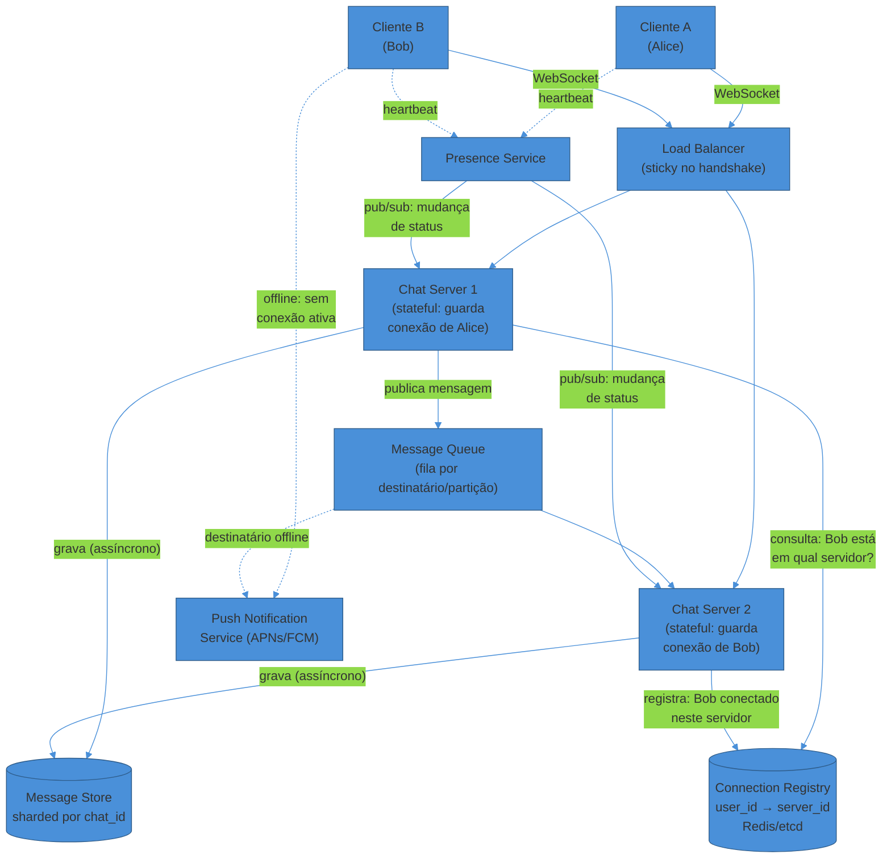
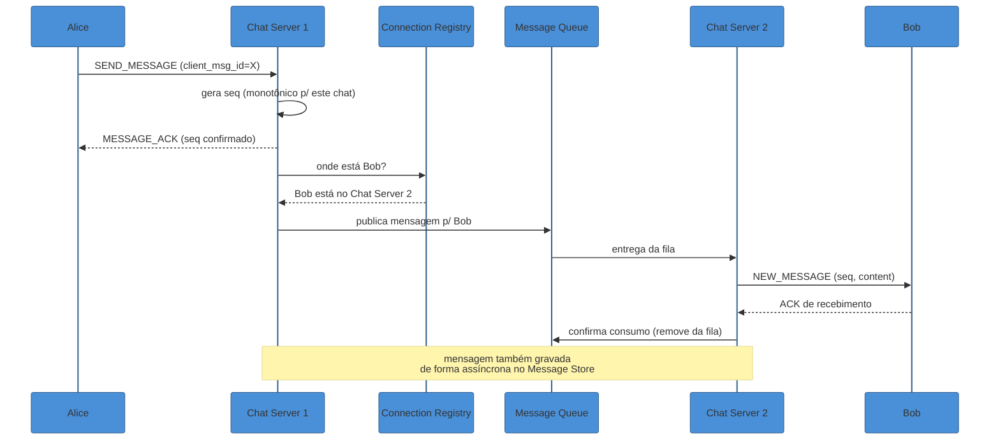
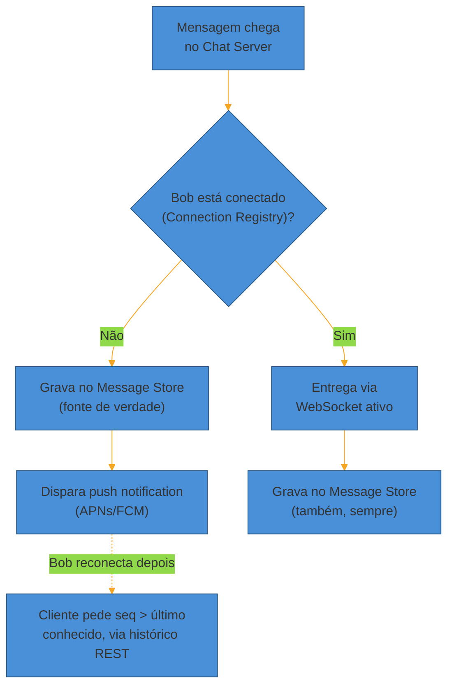
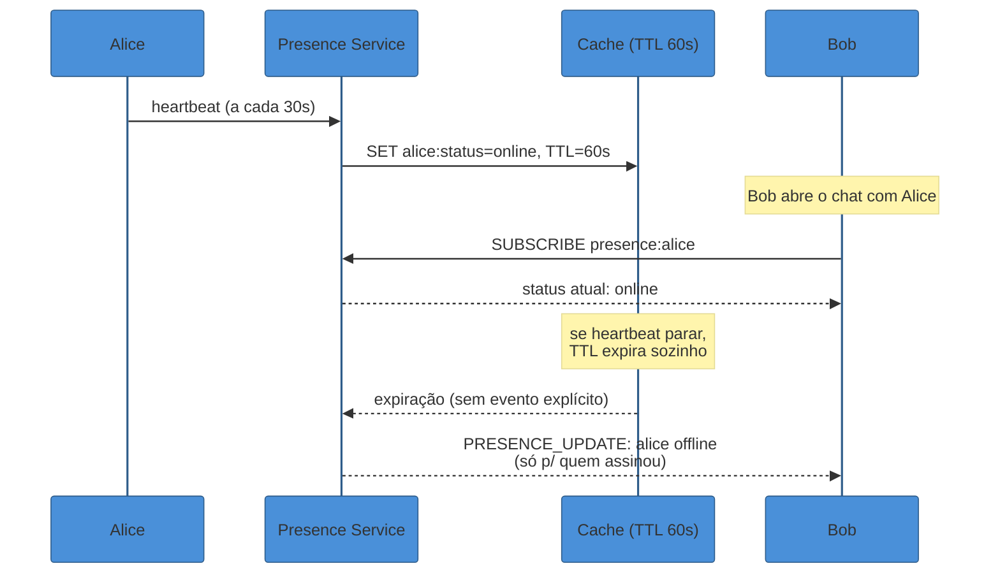

# Chat System

> [!abstract] TL;DR
> "Projete o WhatsApp" parece, à primeira vista, um problema de CRUD com uma tabela de mensagens. Não é. O que torna o chat difícil não é *guardar* a mensagem — é que o servidor precisa **empurrar** a mensagem para um cliente específico, em tempo real, sem que o cliente peça. Isso exige uma **conexão persistente** entre cliente e servidor (WebSocket), o que quebra a premissa mais confortável de sistemas web: servidores stateless que qualquer load balancer pode rotear para qualquer instância. Aqui, para entregar a mensagem de Alice, o sistema precisa saber **em qual servidor, entre milhares, o processo de Bob está vivo agora** — e esse roteamento é o coração do design. Ao redor disso: garantir que as mensagens cheguem **na ordem certa** dentro de uma conversa, sobreviver a reconexões sem duplicar nem perder mensagens (at-least-once + deduplicação), lidar com o destinatário **offline** (fila + push notification), escalar **presence** (quem está online agora) sem que o fan-out de status vire o próprio gargalo, e decidir como fazer fan-out numa conversa de grupo com centenas de participantes. Nenhuma dessas peças aparece em um CRUD comum — todas nascem da mesma exigência: *tempo real*, *bidirecional*, *em escala de bilhões de mensagens por dia*.

Um entrevistador diz: "projete um sistema de chat, tipo WhatsApp ou Slack. Foca em 1:1 e grupos pequenos."

A resposta ingênua: "tenho uma tabela `messages` com `sender_id`, `receiver_id`, `content`. Quando Alice manda uma mensagem, faço um `POST /messages`. Quando Bob quer ver, ele faz `GET /messages` a cada poucos segundos."

Isso funciona — no sentido de que compila. Mas é **polling**: Bob está perguntando "chegou algo novo?" centenas de vezes por minuto, mesmo quando não chega nada. Em escala de bilhões de mensagens/dia e centenas de milhões de usuários simultâneos, isso é uma quantidade absurda de requisições desperdiçadas, e ainda assim a latência de entrega fica presa ao intervalo de polling — se Bob pergunta a cada 3 segundos, a mensagem de Alice pode demorar até 3 segundos para aparecer, mesmo que o servidor já a tivesse pronta há muito tempo.

O que o chat pede de verdade é o oposto de polling: o servidor **empurra** a mensagem assim que ela chega, sem que o cliente precise perguntar. Isso é a primeira decisão de arquitetura da nota — e ela desmancha uma premissa que praticamente todo outro sistema deste galho toma por garantida: que os servidores de aplicação são **stateless**, sem memória de quem é o cliente entre uma requisição e outra. Um chat server precisa **lembrar** qual conexão pertence a qual usuário, porque é por essa conexão específica — e só por ela — que a mensagem chega.

## Requisitos

### Funcionais (RF)

- **Chat 1:1:** dois usuários trocam mensagens de texto em tempo real.
- **Chat em grupo:** um pequeno número de participantes (a entrevista costuma limitar a ~100-500 para não desviar o foco para *broadcast* de massa, que é outro sistema — ver "Variações" adiante).
- **Entrega em tempo real:** se o destinatário está online, a mensagem chega em segundos, sem polling.
- **Presence (online/offline):** o usuário vê se seus contatos estão online, offline, ou "visto por último às HH:MM".
- **Read receipts:** indicação de que a mensagem foi entregue (chegou no dispositivo) e lida (o usuário abriu a conversa) — os dois "tiques" clássicos do WhatsApp.
- **Histórico:** o usuário consegue rolar para cima e ver mensagens antigas, mesmo entre dispositivos diferentes.
- **Suporte a offline:** se o destinatário está desconectado, a mensagem é entregue quando ele reconectar, e opcionalmente dispara uma push notification.

### Não-funcionais (RNF)

- **Baixa latência de entrega:** o padrão de mercado, citado por vários guias de entrevista, é entrega ponta a ponta abaixo de ~100-200ms quando ambos estão online — é essa expectativa de "instantâneo" que diferencia chat de e-mail.
- **Entrega garantida e ordenada:** nenhuma mensagem pode se perder silenciosamente, e a ordem dentro de uma mesma conversa precisa ser preservada — receber a resposta antes da pergunta quebra a experiência.
- **Alta disponibilidade:** o sistema não pode cair porque um usuário está tentando falar com outro agora.
- **Escala de bilhões de mensagens/dia** e centenas de milhões de conexões simultâneas — a ordem de grandeza real do WhatsApp e do Messenger.
- **Consistência que tolera algum atraso, mas não perda:** read receipts e presence podem chegar com alguns segundos de atraso (AP na lente CAP — ver [[06 - CAP, consistência e consenso]]); a própria mensagem, não — perder uma mensagem é inaceitável, então o *message store* pesa mais para durabilidade do que para latência de escrita.

**Fora de escopo, declarado em voz alta** (o tipo de negociação que a nota 01 do SG1 chama de "estreitar o problema"): chamadas de voz/vídeo, criptografia ponta-a-ponta em detalhe de protocolo (mencionamos como variação), grupos de dezenas de milhares de membros (isso é *broadcast*, outro sistema), busca full-text no histórico.

## Estimativas

Números de ordem de grandeza, no espírito da nota [[1 - Framework de entrevista/03 - Estimativas de escala (back-of-envelope)|03 do SG1]] — não para acertar o valor exato, mas para que cada decisão de design tenha um número por trás.

- **DAU:** 500 milhões de usuários ativos diários (ordem de grandeza de um WhatsApp/Messenger regional grande).
- **Conexões simultâneas de pico:** assumindo que ~20% dos DAU está com o app aberto e conectado num dado instante de pico, isso é **~100 milhões de conexões WebSocket simultâneas**. Cada conexão precisa ficar viva em algum chat server — é esse número que dita quantos chat servers o sistema precisa.
- **Mensagens/dia:** se cada usuário ativo manda em média 40 mensagens/dia (número conservador comparado a mercados de alto engajamento), são **20 bilhões de mensagens/dia**.
- **QPS médio de envio:** 20 bi / 86.400s ≈ **~230.000 mensagens/s** em média. Com um *peak factor* de 3x (hora de maior uso concentra tráfego), o pico chega a **~700.000 msg/s**.
- **Conexões por servidor:** a Erlang/FreeBSD do WhatsApp, documentada publicamente, chegou a **~2 milhões de conexões TCP por servidor físico**, graças a processos leves de baixo overhead de memória e um kernel ajustado para milhões de sockets abertos. Usando essa referência como teto otimista e um valor mais conservador de ~250-500 mil conexões por instância para uma stack convencional (não Erlang), **100 milhões de conexões simultâneas exigem algo entre ~200 e ~2.000 chat servers**, dependendo da stack escolhida — é esse intervalo, e o porquê dele, que vale trazer em voz alta na entrevista.
- **Storage de histórico:** se cada mensagem tem em média 100 bytes de texto + metadados (remetente, timestamp, chat_id, sequence number) somando ~200 bytes, 20 bilhões de mensagens/dia geram **~4 TB de dados novos por dia**, ou **~1,5 PB/ano** só de texto — sem contar mídia (fotos, áudio, vídeo), que domina o volume real de armazenamento em qualquer app de chat de produção, mas cujo design (chunking, blob storage, CDN) pertence a outro walkthrough ([[06 - Distributed File Storage]]).
- **Banda de rede por chat server:** com ~500 mil conexões ativas por servidor e mensagens pequenas, o volume de I/O de rede é dominado não pelo throughput de dados, mas pelo **número de conexões TCP abertas simultaneamente** — é aqui que o custo de memória (buffer por conexão) supera o custo de CPU, e é por isso que a escolha de runtime (Erlang, Go, Netty/Java) importa tanto quanto a arquitetura lógica.

> [!question]- Por que 20% dos DAU conectado simultaneamente e não 100%?
> Porque DAU mede "usuário que abriu o app em algum momento do dia", não "usuário com WebSocket aberto agora". A maioria dos usuários abre o app, manda algumas mensagens, e fecha — só uma fração está com o app em primeiro plano (ou em segundo plano mantendo a conexão viva) em qualquer instante dado. 20% é uma estimativa razoável para um app de mensageria de uso intenso; a entrevista não espera que você acerte esse número, espera que você **declare a premissa** e a use de forma consistente no resto do cálculo. Esse é o mesmo espírito da nota de estimativas do SG1: o valor exato importa menos que a cadeia de raciocínio que leva até ele.

## API & modelo de dados

### API

O chat é um dos poucos sistemas deste galho em que a API "de escrita" via REST convive com um canal totalmente diferente — o WebSocket — para o "tempo real" propriamente dito. Vale separar os dois papéis:

**Sobre WebSocket (canal persistente, depois do handshake inicial):**

```
// Cliente → servidor
SEND_MESSAGE {
  chat_id: string,
  client_msg_id: string,   // idempotency key gerado no cliente
  content: string,
  content_type: "text" | "image" | "file",
  seq_hint?: number        // opcional, ajuda a detectar reordenação local
}

// Servidor → cliente (ACK de entrega ao servidor)
MESSAGE_ACK {
  client_msg_id: string,
  server_msg_id: string,
  seq: number,             // sequence number definitivo da conversa
  timestamp: number
}

// Servidor → cliente (mensagem recebida de outro usuário)
NEW_MESSAGE {
  chat_id: string,
  server_msg_id: string,
  sender_id: string,
  seq: number,
  content: string,
  timestamp: number
}

// Servidor → cliente (mudança de presence de um contato)
PRESENCE_UPDATE {
  user_id: string,
  status: "online" | "offline" | "last_seen",
  last_seen_at?: number
}
```

**Sobre REST (operações que não exigem push em tempo real):**

```
GET  /chats/{chat_id}/messages?before={seq}&limit=50   → histórico paginado
POST /chats                                             → criar chat/grupo
GET  /chats                                              → listar conversas do usuário
POST /chats/{chat_id}/read                               → marcar como lida (read receipt)
```

O detalhe que costuma passar despercebido: `client_msg_id` é uma **idempotency key gerada no cliente**, não no servidor. Ela existe porque o cliente pode reenviar a mesma mensagem (timeout, reconexão) sem saber se a primeira tentativa chegou — e é essa chave que permite ao servidor detectar "essa mensagem eu já processei" sem depender de um `server_msg_id` que o cliente ainda não recebeu. É a mesma lógica de idempotência que aparece em qualquer API de pagamento, aplicada aqui ao problema de at-least-once delivery (ver deep dive adiante).

### Modelo de dados

```
messages
  chat_id       (partition key)
  seq           (clustering key, monotonically increasing por chat)
  server_msg_id
  sender_id
  content
  content_type
  created_at
  client_msg_id  (para deduplicação em reenvio)

chats
  chat_id       (PK)
  type          ("direct" | "group")
  participant_ids[]
  created_at
  last_message_seq

chat_participants   -- para "quais chats o usuário X participa", consultado no login
  user_id       (partition key)
  chat_id       (clustering key)
  last_read_seq  -- read receipt: até que seq o usuário já leu

connections          -- roteamento: em qual chat server o usuário está agora
  user_id       (PK, em cache distribuído, não em disco durável)
  server_id
  connected_at
```

A escolha de particionar `messages` por `chat_id` (e ordenar por `seq` dentro de cada partição) não é arbitrária: é exatamente o padrão de acesso do produto — "me dê as últimas 50 mensagens deste chat, ordenadas" — que domina 99% das leituras. Isso é um key-value/wide-column store, não um relacional com joins; a nota [[03 - Bancos de dados em escala - SQL vs NoSQL e replicação]] detalha por que esse padrão de acesso (leitura por chave, ordenada, sem joins) favorece Cassandra/DynamoDB/HBase sobre um Postgres tradicional em escala — e é literalmente a escolha que o Discord fez e documentou publicamente para seu histórico de mensagens (ver Fontes).

O registro `connections` é deliberadamente **não durável** (cache, TTL curto) — não é fonte de verdade sobre quem é amigo de quem, é um índice efêmero de roteamento que expira sozinho se o servidor cair sem limpar. Essa distinção — dado de negócio (durável) vs dado de roteamento (efêmero) — é um dos fios que atravessa o deep dive de conexão persistente a seguir.

## Diagrama macro



O fluxo central: Alice manda uma mensagem para Bob. Ela está conectada ao **Chat Server 1**; Bob, ao **Chat Server 2** — servidores diferentes, porque com centenas de chat servers a chance de dois usuários caírem no mesmo é baixa. O Chat Server 1 não sabe, por padrão, onde Bob está. Ele **consulta o Connection Registry** (um Redis ou serviço equivalente, com baixa latência de leitura), descobre que Bob está no Chat Server 2, e roteia a mensagem — via fila de mensagens ou diretamente via RPC entre servidores — até lá. Só então o Chat Server 2 empurra a mensagem pela conexão WebSocket viva que ele mantém com Bob.

Esse roteamento entre servidores é o motivo pelo qual "escalar o número de chat servers" não é trivial como escalar servidores stateless: adicionar um chat server não basta — cada novo servidor precisa participar do mesmo protocolo de descoberta ("onde está o usuário X?"), e cada mensagem, mesmo dentro do mesmo data center, paga o custo de um hop adicional de rede para achar o destinatário. É esse desafio que o próximo bloco aprofunda.

### Sequência de envio de uma mensagem (com ACK)



Repare que o **ACK para Alice** (confirmando que o servidor recebeu a mensagem) acontece **antes** de saber se Bob a recebeu — são dois ACKs em momentos diferentes, correspondendo aos dois "tiques" visíveis no app: um tique quando o servidor confirma o recebimento, dois tiques quando o destinatário de fato recebe.

## Deep dives

### 1. Conexão persistente: por que WebSocket, e o custo de ser stateful

A primeira decisão técnica real da entrevista é o protocolo de transporte. As três opções candidatas, e por que só uma sobrevive ao requisito de latência:

| Protocolo | Como funciona | Latência de entrega | Bidirecional? | Overhead por mensagem |
|-----------|---------------|----------------------|----------------|------------------------|
| **Polling simples** | Cliente pergunta "tem novidade?" a cada N segundos | Até N segundos | Não (cliente sempre inicia) | Alto — requisição HTTP completa mesmo sem novidade |
| **Long polling** | Cliente pergunta; servidor **segura** a resposta até ter algo (ou timeout) | Baixa, mas cada resposta reabre uma conexão nova | Não nativamente | Médio — menos requisições vazias, mas ainda reabre conexão a cada mensagem |
| **Server-Sent Events (SSE)** | Servidor mantém stream HTTP aberto, empurra eventos | Baixa | Não — só servidor→cliente; enviar exige requisição HTTP separada | Baixo para o lado de recepção |
| **WebSocket** | Handshake HTTP inicial, depois conexão TCP full-duplex persistente | Mais baixa possível | Sim, nativamente | Mínimo — sem overhead de header HTTP repetido por mensagem |

O chat precisa de **bidirecionalidade nativa** — o mesmo canal serve tanto para o cliente enviar mensagens quanto para o servidor empurrar mensagens recebidas — e é exatamente aí que SSE fica pela metade: ele resolveria bem o "servidor empurra presence/mensagens" mas exigiria um segundo canal HTTP para o cliente enviar, dobrando a complexidade sem ganho real. **WebSocket** vence porque unifica os dois sentidos numa única conexão TCP, evitando o overhead de handshake TLS/HTTP repetido a cada troca — overhead que, multiplicado por bilhões de mensagens/dia, é uma diferença real de custo de infraestrutura, não só de latência.

O preço dessa escolha é estrutural: **o chat server passa a ser stateful**. Todo o resto de um sistema web moderno é desenhado para servidores **stateless** — qualquer instância atende qualquer requisição, o load balancer distribui livremente, uma instância pode morrer e o tráfego simplesmente vai para outra sem ninguém notar. Um WebSocket quebra essa premissa: a conexão de Bob **vive** num processo específico, num servidor específico. Se esse servidor morre, a conexão morre com ele — Bob precisa reconectar, e nesse intervalo mensagens endereçadas a ele precisam ficar em algum lugar até ele reaparecer (a fila offline, adiante).

Isso tem três consequências práticas de design:

1. **O load balancer precisa de afinidade** no momento do handshake WebSocket (às vezes chamado de *sticky routing*), mas só para a conexão inicial — depois que a conexão está estabelecida, o roteamento subsequente de mensagens *para* aquele usuário passa a depender do Connection Registry, não do load balancer.
2. **Escalar chat servers exige coordenação**, não é "adicionar mais réplicas idênticas": cada novo servidor precisa se anunciar no serviço de descoberta e cada mensagem cross-servidor paga um hop extra de rede — o Slack documenta publicamente que seus *Gateway Servers* mantêm o mapa de assinaturas WebSocket em memória e são replicados geograficamente para servir cada cliente pela região mais próxima.
3. **Deploy e falha de nó exigem um plano de reconexão explícito** — quando um chat server é reiniciado (deploy, crash, autoscaling para baixo), todos os clientes conectados a ele precisam reconectar a outro; um bom design faz isso de forma escalonada (não todos ao mesmo tempo, para não gerar um *thundering herd* de reconexões simultâneas no resto do cluster).

> [!question]- Por que não usar SSE, que é mais simples de operar (é só HTTP)?
> SSE resolveria metade do problema — o servidor empurrando mensagens novas para o cliente — sem exigir a complexidade de manter uma conexão TCP fora do modelo request/response do HTTP. Mas o chat também precisa que o cliente **envie** em tempo real, e SSE não tem canal de volta: você teria que combinar SSE (recepção) com requisições HTTP normais (envio), o que funciona, mas dobra a superfície de protocolo e ainda paga o overhead de abrir uma requisição HTTP nova a cada mensagem enviada. WebSocket, ao resolver os dois sentidos com uma única conexão, é estritamente melhor para esse caso de uso específico — o trade-off de "é mais difícil de operar" é real (proxies antigos e alguns firewalls corporativos historicamente bloqueavam upgrade de protocolo), mas a maioria da infraestrutura moderna (load balancers L7, CDNs, browsers) já suporta WebSocket nativamente, então esse custo caiu bastante desde que o protocolo foi padronizado.

> [!warning] Tratar o chat server como se fosse stateless "porque todo o resto do sistema é"
> **O que acontece:** o candidato desenha o chat server igual a qualquer outro microsserviço — atrás de um load balancer round-robin, escalado horizontalmente sem mais nenhuma menção. **Por quê:** essa é a suposição-padrão de quase todo outro sistema deste galho (ver [[01 - Escalabilidade e load balancing]]), e é natural aplicá-la aqui por hábito. Mas a conexão WebSocket viva **é** estado — round-robin puro quebraria o roteamento, porque a próxima requisição de Alice (ou uma mensagem endereçada a ela) precisa achar o *mesmo* processo que segura sua conexão, não qualquer instância disponível. **Como evitar:** nomeie explicitamente o Connection Registry como a peça que resolve esse problema — é ele, não o load balancer, quem responde "onde está o usuário X agora" para toda mensagem cross-servidor. Isso sinaliza que você reconheceu a exceção à regra, em vez de aplicar o padrão default sem pensar.

### 2. Entrega e ordering: garantir que a mensagem chegue, uma vez, na ordem certa

Três garantias distintas — que a entrevista frequentemente trata como uma coisa só, mas que exigem mecanismos diferentes:

**Ordenação dentro de uma conversa.** A solução é o **sequence number** monotonicamente crescente por `chat_id`, já presente no modelo de dados. O chat server que primeiro recebe a mensagem (ou um serviço dedicado de geração de sequência) atribui o próximo `seq` da conversa antes de propagar. Isso resolve ordering *dentro* de um chat, mas note que ordenação *entre* chats diferentes não é garantida nem necessária — não faz sentido perguntar "a mensagem do chat A chegou antes da mensagem do chat B", porque são conversas independentes.

**At-least-once + deduplicação.** Redes falham, clientes reconectam, servidores reiniciam no meio de um envio — nesse cenário, a garantia mais barata de construir é *at-least-once*: o sistema garante que a mensagem chega pelo menos uma vez, mas pode entregá-la ou processá-la mais de uma vez em caso de retry. A contrapartida inevitável é a possibilidade de duplicata, resolvida com o `client_msg_id` idempotente do modelo de API: se o servidor já processou aquele `client_msg_id`, ele responde com o mesmo `MESSAGE_ACK` de antes em vez de criar uma segunda entrada. O mesmo raciocínio se aplica na ponta do consumidor — o cliente rastreia o último `seq` recebido por chat e, se detectar um "buraco" na sequência (recebeu seq 41 e depois seq 43, sem o 42), sabe que precisa pedir a mensagem faltante via histórico REST em vez de assumir perda silenciosa.

**ACK de entrega e leitura.** São dois eventos distintos, e vale nomeá-los separadamente numa entrevista: o **ACK de servidor** confirma que a mensagem foi persistida e está a caminho (primeiro tique); o **ACK de entrega ao dispositivo** confirma que o WebSocket do destinatário recebeu o payload (segundo tique); o **read receipt** confirma que o usuário abriu a conversa (dois tiques azuis). Cada um desses três eventos atualiza um campo diferente no registro da mensagem, e cada um dispara um push adicional para o remetente original informar da mudança de estado.

**Destinatário offline.** Se o Connection Registry não encontra Bob em nenhum chat server, a mensagem não é descartada — ela é gravada no Message Store normalmente (a fonte de verdade não depende de ninguém estar online) e o sistema dispara uma **push notification** via APNs (iOS) ou FCM (Android) para acordar o app em segundo plano. Quando Bob reconecta, o cliente pede ao servidor, via histórico REST, todas as mensagens com `seq` maior que o último que ele tem localmente por chat — um catch-up simples que reaproveita exatamente a mesma API de paginação usada para rolar o histórico antigo.



> [!warning] Confundir "at-least-once" com "sem duplicata visível pro usuário"
> **O que acontece:** o candidato descreve o mecanismo de retry (reenviar se não vier ACK) e para por aí, como se isso já resolvesse o problema de entrega. **Por quê:** at-least-once, por definição, **permite** duplicata — o retry existe justamente para cobrir o caso em que a primeira tentativa teve sucesso mas o ACK se perdeu no caminho de volta. Sem uma segunda camada (o `client_msg_id` idempotente), o usuário veria a mesma mensagem aparecer duas vezes na tela. **Como evitar:** sempre apresente retry e deduplicação como uma dupla, não como peças isoladas — "eu reenvio se não vier ACK em N segundos, **e** o servidor descarta reenvios com o mesmo `client_msg_id`" é a frase completa. Mencionar só a primeira metade é um sinal de que o candidato decorou "at-least-once" sem entender a consequência prática dele.

> [!question]- E se o mesmo usuário está logado em dois dispositivos ao mesmo tempo (celular + desktop)?
> Isso é o cenário de **multi-device sync**, e é onde o Connection Registry deixa de mapear `user_id → um server_id` e passa a mapear `user_id → lista de (device_id, server_id)`. Toda mensagem endereçada ao usuário precisa ser roteada para **todas** as conexões ativas dele, não só uma — o fan-out acontece por usuário-com-múltiplos-dispositivos, não só por conversa em grupo. O read receipt fica mais sutil também: "lido" precisa significar "lido em pelo menos um dispositivo", e cada dispositivo precisa sincronizar seu próprio `last_read_seq` para não re-notificar o usuário de algo que ele já viu no outro aparelho. É um bom sinal de profundidade mencionar esse caso mesmo que o entrevistador não pergunte — mostra que você enxergou uma dimensão do problema além do "1 usuário = 1 conexão" simplificado do diagrama macro.

### 3. Presence em escala: o custo do fan-out, não da escrita

Presence parece trivial — "salva um bit: online ou offline" — mas o desafio real não é *escrever* o status, é **distribuí-lo** para todo mundo que precisa saber.

**Detecção de estado.** O cliente manda um **heartbeat** periódico (a cada 5-30 segundos, tipicamente) enquanto o app está aberto ou em segundo plano com conexão viva. O Presence Service guarda esse estado num cache com **TTL curto** (por exemplo, TTL de 60s para um heartbeat de 30s — dando margem para uma falha de rede pontual sem marcar o usuário como offline prematuramente). Se o TTL expira sem um novo heartbeat, o usuário vira "offline" automaticamente — sem exigir nenhum evento explícito de desconexão, o que é importante porque conexões TCP podem cair silenciosamente (o cliente fecha o app à força, perde sinal) sem nunca enviar um "estou saindo".

**O problema real: fan-out.** Se Alice tem 500 contatos e cada um precisa saber quando ela fica online, uma mudança de status de Alice potencialmente dispara 500 atualizações — uma para cada contato que está com a tela de conversa ou lista de contatos aberta naquele momento. Multiplicado por centenas de milhões de usuários mudando de status o tempo todo (abrindo e fechando o app), o fan-out de presence pode gerar **mais tráfego do que as próprias mensagens de chat**.

A mitigação padrão é **assinatura seletiva, não broadcast total**: em vez de notificar todos os 500 contatos de Alice sempre que ela muda de status, o sistema só notifica quem está **ativamente olhando** para o status dela agora — por exemplo, quem tem a conversa com Alice aberta na tela, ou quem abriu a lista de contatos recentemente. Isso transforma presence de um problema de "broadcast para toda a rede social do usuário" em um problema de "pub/sub com poucos assinantes por publicador em qualquer instante dado" — o mesmo padrão de [[01 - Pub-Sub e event-driven em escala]], aplicado aqui à granularidade de "status de um usuário".



> [!warning] Fazer fan-out de presence para toda a lista de contatos, sempre
> **O que acontece:** o candidato propõe "quando o status de Alice muda, notifica todos os contatos dela" como o design padrão, sem qualificar quem realmente precisa saber agora. **Por quê:** para um usuário com centenas ou milhares de contatos (grupos grandes agravam isso ainda mais), esse fan-out cresce proporcional ao tamanho da rede social do usuário, não ao número de pessoas de fato interessadas naquele instante — é um desperdício de escrita e de banda que escala mal e não corresponde a nenhum ganho de experiência real (ninguém está olhando 400 dos 500 contatos ao mesmo tempo). **Como evitar:** restrinja o fan-out a assinaturas ativas — só quem tem a tela relevante aberta recebe o evento em tempo real; o resto descobre o status "sob demanda", na próxima vez que abrir a conversa ou a lista de contatos. Isso é literalmente o padrão pub/sub com escopo de assinatura explícito, e citar essa restrição em voz alta é o tipo de detalhe que separa "conhece presence" de "sabe operar presence em escala".

> [!question]- "Visto por último às HH:MM" é a mesma coisa que presence online/offline?
> São dados relacionados, mas com requisitos de consistência diferentes. "Online agora" é presence em tempo real — precisa de baixa latência e é aceitável (até esperado) que seja levemente stale por alguns segundos. "Last seen" é um timestamp que só precisa ser atualizado quando o status *muda* de online para offline — é escrito com muito menos frequência (uma vez por sessão, não a cada heartbeat) e pode viver tranquilamente numa tabela durável convencional, sem o mesmo aparato de cache + TTL + pub/sub do status em tempo real. Tratar os dois como o mesmo problema de engenharia é um erro sutil — um exige um sistema de eventos de baixa latência, o outro é essencialmente um campo de banco de dados atualizado ocasionalmente.

## Gargalos & trade-offs

**Grupos grandes: o fan-out da mensagem em si.** Para um grupo de 5 pessoas, quando alguém manda uma mensagem, o chat server faz 4 lookups no Connection Registry e 4 entregas — trivial. Para um grupo de 500 pessoas (o limite mencionado por guias de entrevista para o WhatsApp), a mesma mensagem agora precisa de até 499 lookups e entregas, potencialmente espalhados por centenas de chat servers diferentes. A saída comum é gerar a mensagem **uma vez** no message store e depois fazer o fan-out de *notificações* de forma assíncrona e paralela (uma fila por destinatário ou por partição de destinatários), em vez de o chat server original bloquear esperando confirmar entrega a cada um dos 500 — o mesmo trade-off *fan-out on write vs. lazy* que aparece no walkthrough de [[02 - News Feed e Timeline]], aqui em escala bem menor (centenas, não milhões de destinatários).

**Roteamento entre chat servers.** Cada mensagge cross-servidor paga: (1) uma consulta ao Connection Registry, (2) um hop de rede até o servidor correto. Em alta escala, isso empurra o Connection Registry para virar, ele mesmo, um sistema distribuído com réplicas e sharding — normalmente um Redis Cluster ou equivalente, otimizado para leituras de baixíssima latência (`GET user_id → server_id` é o tipo de acesso perfeito para um KV store em memória). Se esse registro ficar lento ou indisponível, **toda** mensagem cross-servidor trava — é um ponto único de estrangulamento que merece réplicas e um plano de degradação explícito (por exemplo, cache local de curto prazo no próprio chat server, aceitando staleness de segundos, em vez de falhar toda entrega quando o registro está sob pressão).

**Consistência vs. disponibilidade da entrega (CAP aplicado).** Sob uma partição de rede entre data centers, o sistema precisa escolher: recusar novas conexões/mensagens até a partição se resolver (CP — nunca entrega fora de ordem ou perde nada, mas fica visivelmente indisponível), ou continuar aceitando mensagens em cada lado, mesmo sem conseguir confirmar que o outro lado recebeu (AP — sempre responde, mas arrisca duplicar entrega ou atrasar a propagação de um lado para o outro). A escolha de mercado dominante para chat é **AP com at-least-once e deduplicação no cliente** — como visto no deep dive de ordering — porque a experiência de "app trava e não deixa mandar mensagem" é pior, para o usuário, do que uma duplicata ocasional que o cliente silenciosamente descarta. É a mesma lente de [[06 - CAP, consistência e consenso]] aplicada aqui: o dado "mensagem enviada" tolera reconciliação (dedup) melhor do que tolera indisponibilidade.

**Storage quente vs. frio.** As mensagens dos últimos dias são lidas com frequência muito maior que mensagens de meses atrás — um padrão de acesso clássico de cauda longa. Um design maduro separa o *hot path* (mensagens recentes, servidas de um cache ou de um shard otimizado para leitura rápida) do *cold path* (histórico antigo, movido para armazenamento mais barato e mais lento, acessado só quando o usuário rola para trás de propósito). O Discord documenta publicamente ter migrado seu histórico de trilhões de mensagens de Cassandra para ScyllaDB justamente para reduzir latência de cauda (p99) nesse padrão de acesso em escala — sem mudar o modelo lógico de dados, só a engine por trás dele.

## Variações de follow-up

Perguntas que a entrevista costuma usar para testar profundidade adicional depois do design central:

- **"E se o grupo tiver 100 mil membros?"** — isso deixa de ser "chat em grupo" e vira *broadcast* — o padrão muda de fan-out ponto-a-ponto para algo mais parecido com o fan-out on-read do walkthrough de feed: você não empurra a mensagem para 100 mil conexões individuais, você grava uma vez e cada leitor puxa sob demanda, ou usa uma topologia de tópicos hierárquicos.
- **Criptografia ponta-a-ponta (E2E).** O Signal Protocol (usado pelo WhatsApp) garante que nem o próprio servidor consegue ler o conteúdo das mensagens — só os endpoints têm as chaves. Isso não muda o design de roteamento e entrega descrito aqui (o servidor ainda precisa rotear bytes opacos do jeito certo, na ordem certa, para o destinatário certo), mas muda o que pode viver no servidor: read receipts e busca no conteúdo, por exemplo, ficam mais difíceis de implementar do lado do servidor quando ele não consegue ler o payload.
- **Mídia e anexos.** Fotos, áudio e vídeo não trafegam pelo WebSocket como o texto — o cliente faz upload direto para um blob storage (S3-like) e a mensagem no chat carrega só uma URL/referência, seguindo o padrão de chunking e metadata service detalhado em [[06 - Distributed File Storage]].
- **Typing indicators ("Alice está digitando...").** É presence de granularidade ainda mais fina e mais efêmera — não persiste em lugar nenhum, expira em segundos, e o mesmo padrão de assinatura seletiva do deep dive de presence se aplica: só quem tem a conversa aberta recebe o evento, e ele nunca precisa sobreviver a uma reconexão.

## Em entrevista

O sinal que separa uma resposta de nível médio de uma sênior neste sistema específico é reconhecer, cedo, que **o chat server é a exceção stateful num mundo stateless** — e depois seguir esse fio consistentemente pelo resto da conversa: é por isso que existe um Connection Registry, é por isso que "escalar chat servers" não é trivial, é por isso que deploys e falhas de nó exigem um plano de reconexão. Candidatos mais fracos desenham o WebSocket como um detalhe de implementação e passam o resto do tempo em cima da tabela de mensagens — que é, comparativamente, a parte fácil do sistema.

Uma frase que costuma funcionar bem para abrir o deep dive: "a parte interessante aqui não é como eu guardo a mensagem — é como o servidor que recebeu a mensagem de Alice descobre, entre milhares de chat servers, qual deles está segurando a conexão viva do Bob agora." Isso sinaliza, numa frase, que você já identificou o componente difícil antes de o entrevistador precisar apontar para ele — exatamente o comportamento que a rubrica de "profundidade técnica" da nota 01 do SG1 está observando.

## Como explicar em inglês

The hard part of a chat system isn't storing messages — it's that the server needs to **push** a message to a specific client in real time, which breaks the usual assumption that application servers are stateless. A chat server holds a live WebSocket connection per user, so routing a message means first answering "which of these thousand servers is holding this user's connection right now?" — that's what the connection registry is for.

> "I'd use WebSocket over long polling or SSE here because the chat needs true bidirectional push — the client sends and receives over the same persistent connection, without paying the overhead of reopening an HTTP request for every message. The trade-off is that the chat server becomes stateful: I need a connection registry mapping user to server, and scaling out chat servers means coordinating discovery, not just adding stateless replicas behind a round-robin load balancer."

For delivery, the design leans on at-least-once semantics with a client-generated idempotency key for deduplication, plus a monotonically increasing sequence number per conversation for ordering — never global ordering across chats, only within one. Presence is cheap to write but expensive to fan out, so the mitigation is scoping subscriptions to who's actively looking at a user's status right now, instead of broadcasting to the entire contact list on every heartbeat.

| PT | EN |
|----|----|
| Conexão persistente | Persistent connection |
| Servidor com estado / sem estado | Stateful / stateless server |
| Registro de conexões | Connection registry |
| Entrega garantida | Guaranteed delivery |
| Pelo menos uma vez (entrega) | At-least-once (delivery) |
| Deduplicação | Deduplication |
| Número de sequência | Sequence number |
| Confirmação de recebimento | Acknowledgement (ACK) |
| Confirmação de leitura | Read receipt |
| Status de presença | Presence status |
| Pulsação / batimento | Heartbeat |
| Distribuição em cascata | Fan-out |
| Fila offline | Offline queue |
| Indicador de digitação | Typing indicator |

## O que vem a seguir

O chat resolveu "como entregar em tempo real para um destinatário específico". O próximo walkthrough pega um problema-irmão — proteger um sistema de ser sobrecarregado por requisições demais — e aprofunda um padrão já visto em [[3 - Padrões recorrentes/04 - Rate Limiting|Rate Limiting]] num sistema completo, com o desafio extra de sincronizar limites entre múltiplos nós.

- [[04 - Distributed Rate Limiter]] — aprofunda o padrão de rate limiting num sistema completo: Redis central, sincronização entre nós, race conditions

## Veja também

- [[System Design/index|System Design]] — o galho-pai e o mapa da trilha
- [[4 - Walkthroughs/index|Walkthroughs]] — os outros sete designs conduzidos ponta a ponta
- [[05 - Message queues e processamento assíncrono]] — a fila que desacopla o chat server que recebe da mensagem do chat server que entrega
- [[06 - CAP, consistência e consenso]] — a lente CP/AP aplicada à escolha "recusar mensagem ou aceitar e reconciliar depois"
- [[04 - Sharding e Consistent Hashing]] — como o Message Store particiona bilhões de mensagens por `chat_id`
- [[01 - Pub-Sub e event-driven em escala]] — o padrão de assinatura seletiva por trás do fan-out de presence

## Fontes

- **Alex Xu** — *System Design Interview Vol. 2*, cap. "Design a Chat System" — a referência canônica da entrevista para este walkthrough; resumo em [Pagefy](https://pagefy.io/system-design/system-design-interview-by-alex-xu/chat-system) e [ByteByteGo — EP 42: Designing a chat application](https://blog.bytebytego.com/p/ep-42-designing-a-chat-application).
- **Hello Interview** — [*Design a Messaging App Like WhatsApp*](https://www.hellointerview.com/learn/system-design/problem-breakdowns/whatsapp) — breakdown moderno (2024-2026) com foco em fan-out de presence, ticks de entrega/leitura e o desafio de escalar chat servers além de um host.
- **WhatsApp Engineering (retrospectiva)** — 2 milhões de conexões TCP por servidor via Erlang/FreeBSD; ver [ScaleWithChintan — WhatsApp Erlang Architecture](https://scalewithchintan.com/blog/whatsapp-erlang-architecture-2-billion-users) e [HighScalability — How WhatsApp Grew to Nearly 500 Million Users](https://highscalability.com/how-whatsapp-grew-to-nearly-500-million-users-11000-cores-an/).
- **Slack Engineering** — [*Real-time Messaging*](https://slack.engineering/real-time-messaging/), 2023 — arquitetura de Gateway Servers (stateful, WebSocket) e Channel Servers (particionados por consistent hashing), 5M+ sessões WebSocket simultâneas em pico.
- **Discord** — [*How Discord Stores Trillions of Messages*](https://discord.com/blog/how-discord-stores-trillions-of-messages), 2023 — migração de Cassandra (177 nós) para ScyllaDB (72 nós), p99 de leitura caindo de 40-125ms para 15ms; a decisão de particionar por `channel_id`/`chat_id` com sequence number.
- **WebSocket.org** — [*WebSocket vs Long Polling: Performance & When to Use*](https://websocket.org/comparisons/long-polling/) — comparação de latência e overhead entre os três protocolos de transporte discutidos no deep dive 1.
- **SoftwareMill** — [*Message delivery and deduplication strategies*](https://softwaremill.com/message-delivery-and-deduplication-strategies/) — o padrão de sequence number + idempotency key para at-least-once com deduplicação, base do deep dive 2.
