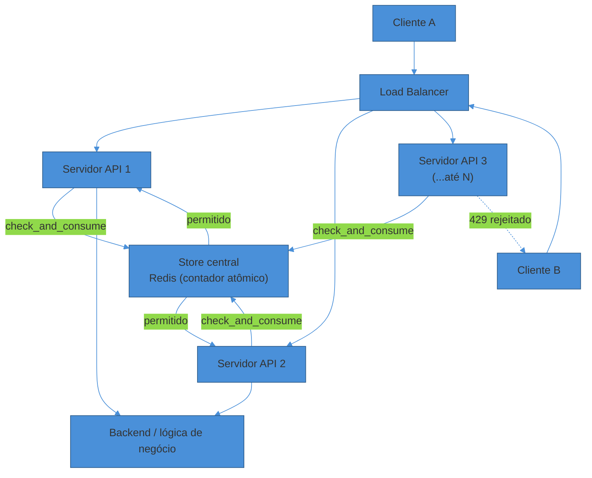
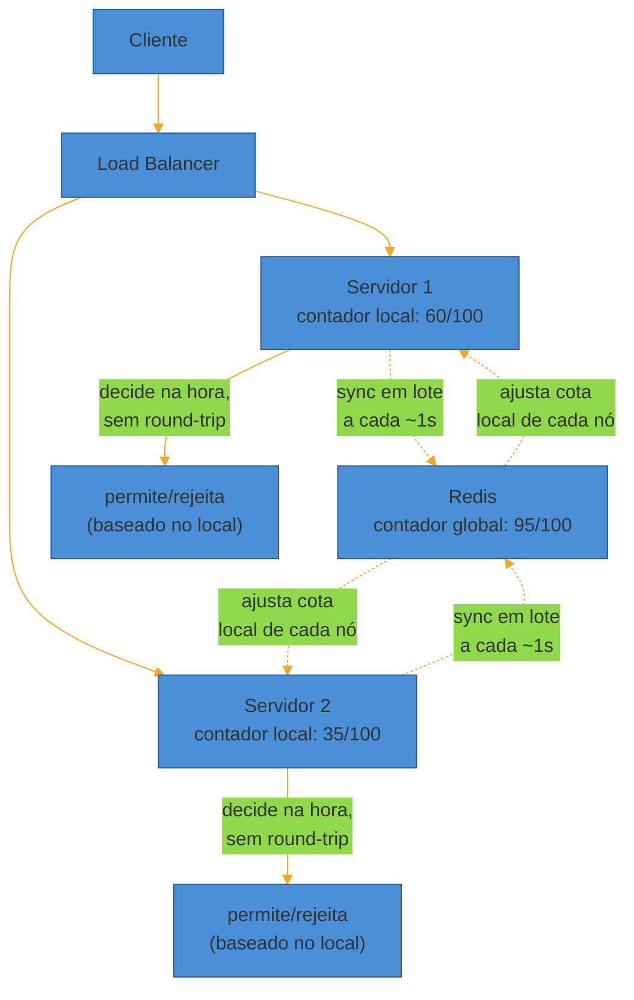
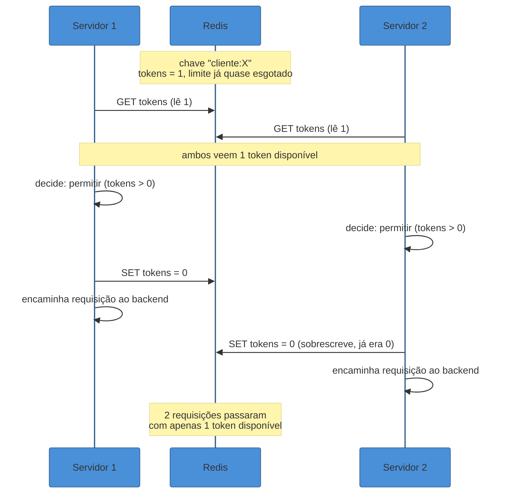

# Distributed Rate Limiter

> [!abstract] TL;DR
> Projetar "um rate limiter" na entrevista é fácil — token bucket, `INCR` no Redis, pronto. Projetar um rate limiter que funciona **corretamente atrás de centenas de servidores de API** é outra pergunta inteira: o limite é *global*, mas cada requisição chega a um servidor qualquer, escolhido por um load balancer que não sabe nada sobre cotas. Se cada servidor contar sozinho, um cliente com limite de 100 req/s consegue `100 × N` req/s reais, onde `N` é o número de servidores — o limite existe só no papel. A solução — um **store central** (Redis) compartilhado por todos os nós — introduz três problemas novos que não existiam num rate limiter single-node: **atomicidade** (dois nós fazendo *read-modify-write* concorrente no mesmo contador criam uma corrida que deixa passar mais requisições do que o limite), **latência** (toda requisição agora paga um round-trip de rede síncrono ao Redis antes de prosseguir) e **disponibilidade** (o Redis virou uma dependência nova — se ele cair, o que acontece com o tráfego?). Este walkthrough constrói o sistema em volta desses três problemas, assumindo os algoritmos (token bucket, sliding window) já conhecidos de [[04 - Rate Limiting]].

Uma API pública, servida por 200 instâncias atrás de um load balancer, promete a cada cliente autenticado um limite de 100 requisições por segundo. Um cliente decide testar esse limite: dispara 100 req/s, sustentado, por um minuto inteiro.

Se cada uma das 200 instâncias contasse localmente — um dicionário em memória, sem nenhuma coordenação — cada instância veria uma fração do tráfego total (o load balancer distribui round-robin ou por hash), talvez meia dúzia de requisições por segundo cada. Nenhuma instância, isoladamente, jamais chegaria perto de 100 req/s. **O rate limiter nunca dispararia** — porque o limite que ele está aplicando não é o limite global do cliente, é o limite *daquele servidor específico* que por acaso recebeu a requisição.

O cliente, sem saber, está enviando 100 req/s reais e nenhuma delas é rejeitada, porque o sistema de proteção foi silenciosamente fragmentado em 200 pedaços que não conversam entre si. Esse é o problema central deste walkthrough: **contar corretamente quando a contagem precisa ser uma só, mas as requisições chegam espalhadas por N processos independentes.**

## Requisitos

Como em qualquer entrevista de system design, o primeiro movimento é separar o que o sistema faz do quão bem ele precisa fazer — a lente detalhada em [[02 - Clarificar requisitos]].

**Requisitos funcionais (RF)**

- Limitar requisições por identidade do cliente: `user_id`, API key, ou IP (para tráfego não-autenticado).
- Suportar regras configuráveis por cliente/plano: limite e janela variam (ex: `free` = 10 req/s, `enterprise` = 10.000 req/s).
- Rejeitar requisições acima do limite com **HTTP 429** e headers informativos (`Retry-After`, `X-RateLimit-Remaining`).
- Permitir múltiplos limites simultâneos por cliente (ex: um limite por segundo *e* um limite diário).

**Requisitos não-funcionais (RNF)**

- **Latência adicional mínima**: o rate limiter senta no caminho crítico de *toda* requisição — se ele adiciona 50ms, ele já é o gargalo da API inteira. Meta razoável: **poucos milissegundos** de overhead (p99 < 5-10ms).
- **Alta disponibilidade**: o rate limiter não pode ser o componente que derruba a API. Precisa sobreviver à falha do seu próprio store.
- **Precisão vs custo**: o limite não precisa ser matematicamente exato — precisa ser "bom o suficiente" ao menor custo de memória e I/O. (A mesma lição de [[04 - Rate Limiting]]: sliding window *counter* aproximado bate sliding window *log* exato em quase todo cenário de produção.)
- **Fail-open vs fail-closed** declarado explicitamente: se o store central cair, o sistema deixa passar (prioriza disponibilidade da API) ou bloqueia tudo (prioriza a proteção que o rate limiter existe para dar)? Essa é uma decisão de produto, não só de engenharia — abordada a fundo adiante.
- **Consistência eventual é aceitável**: diferente de um saldo bancário, um rate limiter que deixa passar 3-5% a mais em condições adversas (falha parcial, hot key, replicação assíncrona) não é um bug fatal — é um trade-off deliberado. Ninguém cancela a conta por causa disso.

Vale nomear explicitamente, na entrevista, por que esse último RNF é diferente dos outros: um rate limiter *não é* um sistema transacional. Ele não precisa da garantia "nunca deixe passar nem uma requisição acima do limite" — precisa de "mantenha o volume perto do limite, na maioria do tempo, sem adicionar latência perceptível". Essa relaxação é o que abre espaço para todas as decisões de arquitetura discutidas adiante: se a exigência fosse exatidão perfeita sob qualquer condição de falha, a única solução correta seria um serviço de coordenação forte (tipo etcd/ZooKeeper com consenso), pagando latência e complexidade operacional muito maiores do que o problema justifica.

> [!question]- Por que "baixa latência adicional" é um RNF tão crítico aqui, mais do que em outros componentes?
> Porque o rate limiter, ao contrário de um cache ou de uma fila assíncrona, está **sempre no caminho síncrono** de toda requisição, mesmo daquelas que serão aceitas. Um cache lento degrada só quando há miss; uma fila lenta atrasa só o processamento assíncrono. O rate limiter é chamado em 100% das requisições, no *hot path*, antes de qualquer trabalho útil acontecer. Se ele adiciona 20ms fixos a cada chamada, isso é 20ms que **toda** requisição da API paga, para sempre — inclusive as 99,99% que seriam aprovadas de qualquer forma. É por isso que a arquitetura deste walkthrough gasta tanto esforço evitando que cada requisição precise de um round-trip síncrono e bloqueante ao store central.

## Estimativas

Como em [[03 - Estimativas de escala (back-of-envelope)]], os números guiam a arquitetura — eles decidem se "um Redis" basta ou se é preciso shardear.

Suponha uma API com **10.000 requisições/segundo** no agregado, servida por **100 instâncias** de aplicação atrás de um load balancer (~100 req/s por instância na média, distribuição desigual em picos).

**Custo de um round-trip ao Redis.** Uma chamada `EVALSHA` (script Lua pré-carregado) num Redis na mesma região, sem contenção de rede, tipicamente fica na faixa de **0,3-1ms** de latência de rede + execução (Redis processa comandos em memória, single-thread, em microssegundos — o custo dominante é a viagem de rede, não o processamento). Multiplicado por 10.000 req/s, isso é **10.000 operações/segundo no Redis** só para rate limiting — um volume que uma única instância Redis (capaz de dezenas de milhares de ops/s para operações simples) ainda absorve, mas que já justifica planejar sharding se a API crescer 5-10x.

**Memória do store de contadores.** Cada cliente ativo consome um registro pequeno. Para token bucket ou sliding window counter, o estado por cliente cabe em um Redis hash de dois a quatro campos (`tokens`, `last_refill` ou `contador_atual`, `contador_anterior`, `timestamp_janela`) — algo como **40-80 bytes** por cliente, incluindo overhead de estrutura do Redis. Para **1 milhão de clientes ativos** simultaneamente rastreados, isso é **~40-80 MB** — trivial para um único nó Redis com alguns GB de RAM. O gargalo nunca é memória; é **taxa de operações** e **latência de rede**.

**Quantos shards de Redis?** Se o volume de operações crescer para 100.000 ops/s, um único nó Redis (mesmo otimizado) começa a ficar perto do limite prático de throughput sustentado para operações que envolvem script Lua (mais custosas que um `GET` simples). A resposta é **particionar por chave de cliente** — consistent hashing sobre `user_id`/API key distribui os contadores entre N nós Redis, cada um recebendo uma fração do tráfego. Com 10 shards, 100.000 ops/s vira ~10.000 ops/s por shard — folgado.

> [!warning] Estimar "throughput do Redis" olhando só para `GET`/`SET` simples
> **O que acontece:** o candidato cita o número de marketing "Redis faz 100k+ ops/s por núcleo" e assume que isso vale para o rate limiter inteiro. **Por quê:** um script Lua que faz `HGET` + cálculo + `HSET` + `EXPIRE` custa múltiplos comandos internos por chamada externa — o throughput real de operações *atômicas compostas* é menor do que o de um `GET` isolado, tipicamente uma fração dele. **Como evitar:** estime pelo tipo real de operação (script Lua, não `GET`), e valide com benchmark do script específico antes de prometer um número em produção. Numa entrevista, é aceitável dizer "eu chutaria conservador — algumas dezenas de milhares de ops/s por nó — e validaria com carga real".

## API & configuração

O rate limiter tem dois "clientes": o **tráfego de API** que ele filtra, e o **operador** que configura as regras.

**Interface de decisão** (interna, chamada pelo gateway ou middleware, não exposta ao público):

```
check_and_consume(chave_cliente, regra) -> { permitido: bool, remaining: int, reset_em: timestamp }
```

- `chave_cliente`: `user_id`, API key, ou IP — a identidade sob a qual o limite é aplicado (ver [[04 - Rate Limiting]] sobre granularidade de chave).
- `regra`: `{ limite, janela_segundos, burst_máximo }` — resolvida a partir do plano do cliente.

**Configuração de regras** — normalmente um documento versionado, não hardcoded no serviço:

```yaml
plans:
  free:
    default: { limit: 10, window: 1s, burst: 20 }
    endpoints:
      POST /export: { limit: 1, window: 60s }
  enterprise:
    default: { limit: 10000, window: 1s, burst: 20000 }
```

**Onde o rate limiter mora.** Duas opções não-excludentes, já discutidas em [[04 - Rate Limiting]]: na **borda** (API Gateway, ver [[06 - API Gateway e BFF]]) e **dentro do serviço** para limites finos por endpoint. Este walkthrough foca no store compartilhado que ambas as camadas consultam — a decisão de "onde" é sobre granularidade, a decisão de "como contar certo entre N réplicas" é a mesma nos dois casos.

## Diagrama macro



A variante que reduz a dependência síncrona do Redis mantém um **contador local aproximado** em cada servidor, sincronizado periodicamente:



A primeira variante é **exata mas síncrona** (cada decisão paga um round-trip). A segunda é **rápida mas aproximada** (cada nó pode deixar passar um pouco mais entre sincronizações). A escolha entre elas é o primeiro grande trade-off do sistema — desenvolvido no deep dive (a).

## Deep dives

### (a) O problema da contagem global: centralizado vs sincronizado

O RNF mais difícil deste sistema é uma tensão direta: **precisão exige coordenação; coordenação custa latência.** Existem três posições nesse espectro, e a entrevista espera que você as compare, não que decore uma.

**1. Contagem por servidor, sem coordenação (o que falha).** Já visto na abertura: cada instância conta só o que ela mesma viu. É `O(1)` em latência (nenhum round-trip externo) mas o limite real vira `limite × N_servidores` — inaceitável para qualquer limite que precisa ser respeitado de verdade.

**2. Store central compartilhado (Redis).** Todas as réplicas leem e escrevem o mesmo contador. É a abordagem padrão de referência (Alex Xu, Hello Interview, Kong `redis` policy) porque resolve o problema de coordenação da forma mais simples: **elimina a coordenação movendo o estado para um único lugar**. O custo é que toda decisão agora depende de uma chamada de rede síncrona — exatamente o RNF de latência que apertamos nas estimativas.

**3. Contadores locais com sincronização periódica (gossip/broadcast/batch).** Cada servidor mantém uma fatia aproximada do limite total (ex: `limite_global / N_servidores`, ajustada dinamicamente) e sincroniza com o store central em lote, a cada ~1 segundo, em vez de a cada requisição. É o padrão que a policy `batch-redis` do Kong implementa, e o que o Envoy faz combinando *local rate limiting* (token bucket em memória, no processo) como um filtro **na frente** do *global rate limiting* — o local absorve a maior parte do tráfego (inclusive rajadas grandes) sem nunca tocar a rede, e só uma fração das decisões precisa da consulta ao serviço global.

O trade-off é literal: você troca **precisão exata** por **latência previsível**. Um cliente pode, no pior caso, consumir até `N_servidores × margem_de_sincronização` acima do limite nominal antes que a folga apareça — mas para a maioria dos limites (fair use, proteção geral de capacidade), essa imprecisão de alguns segundos é aceitável, e o ganho de latência é grande: zero round-trips síncronos no caminho crítico da maioria das requisições.

| Abordagem | Latência por requisição | Precisão | Quando usar |
|---|---|---|---|
| Contagem por servidor (sem coordenação) | Zero (local) | Nenhuma — limite multiplicado por N | Nunca, para limites reais |
| Store central síncrono (Redis a cada req) | 1 round-trip de rede | Exata (com atomicidade correta) | Limites críticos, volume moderado |
| Local + sync periódico em lote | Zero na maioria das reqs | Aproximada, janela de imprecisão = intervalo de sync | Alto volume, limite de fair use |

Vale colocar um número na "janela de imprecisão" para tirá-la do abstrato. Com sync a cada 1 segundo e um cliente tentando estourar o limite deliberadamente, o pior caso é: o cliente já gastou seu orçamento local em cada um dos `N` servidores (porque a última sincronização não sabia disso ainda) e dispara mais uma rajada completa em cada um, simultaneamente, no instante exato antes do próximo sync. Com `N = 100` servidores e uma fatia local de `limite/100` por servidor, o excesso máximo teórico nesse intervalo de 1 segundo é limitado pela soma das fatias locais que ainda não foram "gastas oficialmente" — na prática, sistemas de referência (Envoy local+global, Kong `batch-redis`) mantêm esse excesso na faixa de **poucos por cento** do limite nominal, porque a fatia local de cada servidor já é pequena e o intervalo de sync é curto. É esse número — não uma garantia de precisão perfeita — que você defende na entrevista ao propor essa abordagem: "aceito até ~X% de overshoot no pior caso, em troca de zero latência de rede na maioria das requisições".

> [!question]- Se contadores locais são "aproximados", por que não simplesmente aceitar a imprecisão da contagem por servidor sem coordenação nenhuma?
> Porque a diferença não é de grau, é de ordem de grandeza. Contagem por servidor sem qualquer sincronização deixa o limite real crescer **linearmente com o número de servidores** — dobrar a frota dobra silenciosamente o limite efetivo, sem que ninguém decida isso. Contadores locais com sync periódico têm uma janela de imprecisão **limitada pelo intervalo de sincronização**, não pelo tamanho da frota: mesmo com 1000 servidores, o excesso máximo possível é limitado pela fração de tráfego que ocorre *dentro* de um intervalo de sync (ex: 1 segundo), não pelo número de nós. É a diferença entre "o limite não existe de fato" e "o limite tem uma tolerância conhecida e configurável".

### (b) Atomicidade e race conditions

Mesmo com um store central único, o problema não está resolvido — porque "verificar se está sob o limite" e "incrementar o contador" são, ingenuamente, **duas operações separadas**, e entre elas existe uma janela de corrida.



O resultado: duas requisições foram admitidas quando só havia orçamento para uma. Cada leitura individual (`GET tokens (lê 1)`) estava correta no instante em que foi feita — o bug não está em nenhuma operação isolada, está no **intervalo entre ler e escrever**, onde outro processo pode intercalar.

A correção é garantir que o ciclo inteiro — ler, decidir, atualizar — execute como **uma única unidade indivisível**. Redis oferece isso nativamente porque processa comandos (e scripts) em **single-thread**: enquanto um script Lua está executando via `EVAL`/`EVALSHA`, nenhum outro comando roda no meio. Um script típico de token bucket faz, numa única chamada atômica:

```lua
-- KEYS[1] = chave do cliente, ARGV = {agora, taxa, capacidade}
local tokens = tonumber(redis.call('HGET', KEYS[1], 'tokens') or ARGV[3])
local last_refill = tonumber(redis.call('HGET', KEYS[1], 'ts') or ARGV[1])
local elapsed = ARGV[1] - last_refill
tokens = math.min(ARGV[3], tokens + elapsed * ARGV[2])
if tokens >= 1 then
    tokens = tokens - 1
    redis.call('HSET', KEYS[1], 'tokens', tokens, 'ts', ARGV[1])
    redis.call('EXPIRE', KEYS[1], 60)
    return 1  -- permitido
else
    redis.call('HSET', KEYS[1], 'tokens', tokens, 'ts', ARGV[1])
    return 0  -- rejeitado
end
```

Esse é, no espírito, o mesmo mecanismo do `CL.THROTTLE` do módulo `redis-cell` (que implementa GCRA — *Generic Cell Rate Algorithm*, uma variante do leaky bucket que guarda um único timestamp por cliente em vez de contadores separados) e das versões nativas incluídas em builds recentes do Redis. Para **sliding window counter distribuído**, o mesmo princípio se aplica: o script lê os dois contadores (janela atual e anterior), calcula a estimativa ponderada, decide, e — se permitido — incrementa o contador da janela atual, tudo dentro do mesmo `EVAL`. A alternativa sem Lua, mais simples mas menos flexível, é usar `INCR` (atômico por natureza no Redis) seguido de `EXPIRE` só na primeira escrita — funciona bem para fixed window, mas não dá para expressar a lógica de token bucket (que precisa calcular reposição) num único comando primitivo.

**Trace numérico: o script resolvendo a corrida do diagrama acima.** Volte ao cenário do `sequenceDiagram`: cliente `X` tem limite `r = 100` tokens/s, capacidade `B = 100`, e o balde está em `tokens = 1` no instante `t = 1.000000` (epoch em segundos, para simplificar). Dois nós, `S1` e `S2`, recebem uma requisição desse cliente dentro do mesmo milissegundo.

Sem o script Lua (o cenário do diagrama): `S1` lê `tokens = 1`, decide permitir; `S2` lê `tokens = 1` antes de `S1` escrever, decide permitir também. Resultado: **2 requisições admitidas, 1 token de orçamento** — exatamente a violação ilustrada.

Com o script Lua, porque o Redis serializa a execução de `EVAL`, as duas chamadas de `S1` e `S2` chegam à fila de comandos do Redis em alguma ordem — digamos, `S1` primeiro:

1. `S1` executa o script inteiro atomicamente: lê `tokens = 1`, calcula reposição (`elapsed ≈ 0`, sem novos tokens), `1 >= 1` → decrementa para `tokens = 0`, escreve, retorna `1` (permitido).
2. Só então o script de `S2` começa a executar (o Redis nunca intercala): lê `tokens = 0` (o valor que `S1` acabou de escrever), calcula reposição (`elapsed` ainda ~0), `0 >= 1` é falso → **não decrementa**, retorna `0` (rejeitado).

O resultado é **1 requisição admitida, 1 rejeitada com 429** — o comportamento correto, com exatamente 1 token de orçamento consumido. A ordem entre `S1` e `S2` é arbitrária (poderia ter sido o inverso), mas o resultado agregado — nunca mais que o orçamento disponível é consumido — é garantido independentemente de quantos nós competem pela mesma chave ao mesmo tempo, porque a garantia vem da serialização do Redis, não de qualquer coordenação entre `S1` e `S2`.

> [!warning] Usar `MULTI`/`EXEC` do Redis pensando que resolve a atomicidade do rate limiter
> **O que acontece:** o candidato propõe uma transação Redis (`MULTI`/`EXEC`) para agrupar o `GET` e o `SET`, achando que isso equivale a um script Lua. **Por quê:** `MULTI`/`EXEC` garante que os comandos *dentro* da transação executem sem interrupção — mas a leitura que **decide o que escrever** (ex: "se tokens > 0, decrementa") precisa acontecer **fora** da transação em Redis puro, porque `MULTI` não suporta lógica condicional baseada no valor lido. Isso reabre exatamente a mesma janela de corrida do diagrama acima: o `GET` que informa a decisão roda antes do `MULTI`, então dois clientes podem ler o mesmo valor antes de qualquer um enfileirar sua escrita. **Como evitar:** para read-modify-write com lógica condicional, é Lua (`EVAL`/`EVALSHA`) ou um comando atômico nativo que já embute a lógica (`INCR`, ou `CL.THROTTLE` do módulo GCRA). `MULTI`/`EXEC` sozinho não basta quando a escrita depende do valor lido.

### (c) Disponibilidade do rate limiter: e se o Redis cair?

Introduzir um store central resolve a contagem global, mas cria uma **dependência nova e crítica**: se o Redis cair (ou degradar), toda requisição da API — mesmo as que nada têm a ver com o cliente que estourou o limite — está bloqueada esperando uma resposta que não vai chegar a tempo.

A decisão de design mais importante deste componente é explícita: **fail-open ou fail-closed?**

- **Fail-open** (deixa passar quando o rate limiter está indisponível): prioriza **disponibilidade da API** sobre a proteção que o rate limiter oferece. Se o Redis cai por 2 minutos, o backend fica temporariamente exposto a tráfego sem controle — um risco aceitável se o backend tem sua própria capacidade de absorver picos curtos, ou se o rate limiter existe principalmente para *fairness* entre clientes, não para prevenir colapso.
- **Fail-closed** (bloqueia tudo quando o rate limiter está indisponível): prioriza a **proteção** — nenhuma requisição passa sem ser verificada. É a escolha certa quando o rate limiter é a única coisa entre o backend e um colapso real (ex: proteção contra um backend frágil que não sobrevive a tráfego sem controle), mas tem um custo severo: **uma falha no Redis vira uma indisponibilidade total da API**, mesmo que o backend em si estivesse saudável. Você trocou "o rate limiter pode falhar em conter um abuso" por "o rate limiter pode derrubar tudo sozinho" — um SPOF disfarçado de proteção.

Na prática, a maioria dos sistemas de produção (incluindo a recomendação de referências como Hello Interview) escolhe **fail-open com timeout curto e agressivo** (ex: se o Redis não responde em 20-50ms, deixa passar) — porque a alternativa, fail-closed, transforma o componente de proteção no próprio ponto único de falha que ele foi desenhado para evitar.

**Mitigar sem eliminar a dependência.** Três táticas, combináveis, reduzem o quanto a disponibilidade da API depende do Redis estar sempre saudável:

1. **Réplicas do Redis com failover automático** — uma réplica read/promovível reduz o tempo de indisponibilidade de "até o operador notar" para "segundos, via failover automático" (Sentinel ou Cluster). Não elimina a janela de falha, mas encolhe.
2. **Cache local com sync aproximado** (a mesma técnica do deep dive a) — se cada servidor já mantém uma cota local aproximada, uma falha do Redis degrada para "decisões um pouco mais imprecisas" em vez de "decisões impossíveis". O sistema absorve a falha graciosamente em vez de travar.
3. **Circuit breaker na própria chamada ao rate limiter** — se o Redis está lento ou fora do ar, um circuit breaker (ver [[05 - Circuit Breaker e resiliência]]) abre depois de N falhas consecutivas e passa a aplicar a política de fail-open/fail-closed **sem sequer tentar a chamada de rede**, evitando que cada requisição pague o timeout completo enquanto o Redis está degradado.

> [!question]- Fail-open não é simplesmente "desistir" de proteger o sistema?
> Só durante a janela de falha do Redis — que, com réplicas bem configuradas, deveria ser de segundos, não minutos. A pergunta certa não é "fail-open é seguro?", é "o que é pior: alguns segundos sem rate limiting, ou a API inteira fora do ar toda vez que o Redis tiver um blip?". Para a maioria dos produtos, um cliente abusivo sem controle por 10 segundos é um incidente menor e recuperável; a API inteira fora do ar é um incidente maior, visível a todos os clientes, não só ao abusivo. A exceção genuína é quando o rate limiter protege contra algo catastrófico e irreversível (ex: uma chamada de API que dispara uma cobrança real a um provedor terceiro por requisição) — aí o cálculo se inverte e fail-closed, com todo o custo de disponibilidade, é a escolha defensável. Declarar qual dos dois cenários você está resolvendo, em voz alta, é o que a entrevista quer ouvir.

## Gargalos & trade-offs

**Redis como hot spot / SPOF.** Um único nó Redis, mesmo replicado para disponibilidade, ainda é um único ponto de contenção de *throughput* — todo o tráfego de rate limiting da API inteira passa por ele. A mitigação é **sharding por chave de cliente** via consistent hashing (ver [[04 - Sharding e Consistent Hashing]]): cada shard recebe uma fatia dos clientes, multiplicando o throughput agregado. Em Redis Cluster, isso se implementa com **hash tags** (`rate:{cliente_id}`) para garantir que todas as chaves de um mesmo cliente caiam no mesmo slot — necessário porque um script Lua só pode operar atomicamente sobre chaves do mesmo slot.

**Hot keys.** Mesmo com sharding, um único cliente com volume desproporcional (um cliente enterprise legítimo com tráfego enorme, ou um ataque concentrado) faz sua chave sozinha virar o gargalo de um shard inteiro — sharding distribui *entre clientes*, não *dentro* de um cliente hiperativo. Concretamente: se o cluster tem 10 shards e um cliente sozinho gera 20% do tráfego agregado da API, esse cliente pode facilmente exceder a capacidade individual do shard que hospeda sua chave, mesmo que os outros 9 shards estejam ociosos — o problema nunca aparece no dashboard de "carga média do cluster", só na latência p99 daquele shard específico. A mitigação corta na direção do deep dive (a): para esse cliente específico, trocar contagem central síncrona por contadores locais aproximados, aceitando menos precisão em troca de tirar a pressão do shard. Uma segunda mitigação, mais simples de operar, é identificar os clientes de maior volume (top-N por tráfego, revisado periodicamente) e movê-los, deliberadamente, para um shard dedicado — isolando o "ruído" deles do resto da população, que continua servida com precisão total num cluster que não sente a pressão.

**Precisão vs performance.** Já é o tema central de [[04 - Rate Limiting]] no nível do algoritmo (sliding window log exato e caro vs sliding window counter aproximado e barato); no nível distribuído, o mesmo eixo reaparece na escolha entre store central síncrono (exato, lento) e contadores locais com sync (aproximado, rápido). É o mesmo trade-off, uma camada acima.

**Sincronização de relógio.** Token bucket e sliding window dependem de calcular `agora - last_refill` ou posicionar uma requisição dentro de uma janela de tempo. Se os relógios dos servidores de aplicação (que fornecem o timestamp `agora` no script Lua) estiverem dessincronizados — sem NTP configurado corretamente — a reposição de tokens pode ficar incorreta de formas sutis: um servidor com relógio adiantado "sente" mais tempo passado do que realmente passou e libera tokens de mais. A mitigação prática é banal mas real: garantir NTP funcionando em toda a frota, e preferir usar `TIME` do próprio Redis (que tem uma única fonte de tempo) em vez do relógio de cada servidor de aplicação, quando a precisão importa.

**Thundering herd na virada de janela.** Para fixed window, todos os clientes cujo contador zerou no mesmo instante (a virada exata do minuto, por exemplo) podem disparar uma rajada sincronizada logo após o reset — um eco em miniatura do *cache stampede*. A mitigação, além de preferir sliding window (que não tem uma "virada" única e discreta), é a mesma receita geral contra rajadas coordenadas: alguma forma de jitter na resposta ou no `Retry-After` devolvido pelo 429 anterior, para que clientes que foram rejeitados não tentem novamente todos no mesmo instante.

> [!warning] Tratar sharding do Redis como solução completa para hot keys
> **O que acontece:** o time sharda o Redis por `user_id`, resolve o gargalo agregado, e é pego de surpresa quando um único cliente grande satura um shard sozinho meses depois. **Por quê:** sharding resolve contenção *entre* clientes distintos, distribuindo-os por hash. Não resolve contenção *dentro* de um único cliente cujo volume, sozinho, já satura a capacidade de um nó — hashear a mesma chave sempre manda o tráfego para o mesmo shard, por definição. **Como evitar:** monitore a distribuição de tráfego por chave (não só o agregado do cluster) e trate clientes hiperativos como um caso especial — contadores locais aproximados, ou até um shard dedicado só para os clientes de maior volume, isolando o "ruído" deles do resto do cluster.

### Operação: como saber que a arquitetura distribuída está saudável

Os mesmos sinais de calibração discutidos em [[04 - Rate Limiting]] (taxa de 429, distribuição de proximidade do limite) precisam, aqui, de uma dimensão extra: **por shard e por região**, não só agregado. Um cluster Redis pode estar saudável em média e ainda ter um shard isolado perto do limite de throughput — a métrica agregada esconde exatamente o problema que sharding foi desenhado para evitar.

Duas métricas específicas de arquitetura distribuída valem instrumentação dedicada:

- **Latência do round-trip ao store central**, p50/p99, separada da latência total da API. Se o p99 do rate limiter começa a subir antes do p99 da API inteira, é o sinal mais cedo de que o Redis está sob pressão — antes que qualquer cliente sinta o efeito diretamente.
- **Taxa de fallback fail-open/fail-closed acionado**, contada por tempo. Um circuit breaker abrindo ocasionalmente por um blip de rede é normal; abrindo repetidamente é sinal de que a réplica de failover, o timeout configurado, ou a capacidade do cluster precisam de revisão — e é um dado que só existe se o fallback for instrumentado como evento de primeira classe, não uma exceção silenciosa engolida no código.

## Variações de follow-up

O entrevistador, satisfeito com o design central, normalmente escala a pergunta numa destas direções.

**Múltiplas camadas de limite.** Um cliente pode ter um limite por segundo (proteger contra rajada instantânea) **e** um limite diário (proteger orçamento/cota de longo prazo) simultaneamente. Cada camada é um contador independente, verificado em sequência no mesmo script Lua — a requisição só passa se **todas** as camadas permitirem. A chave de cada contador inclui a granularidade da janela (`cliente:X:1s`, `cliente:X:1d`).

**Limites hierárquicos (por-user + global).** Além do limite individual por cliente, um sistema pode precisar de um teto agregado — ex: "no máximo 50.000 req/s no total, para todos os clientes do endpoint `/search`, mesmo que cada um individualmente esteja dentro do seu próprio limite". Isso é um segundo contador, com escopo `endpoint:X` em vez de `cliente:X`, verificado em paralelo. A dificuldade nova é que esse contador global é, por definição, um hot key permanente — todo cliente do endpoint escreve nele — então frequentemente é implementado com a técnica de contador local aproximado (deep dive a) por necessidade, não por escolha.

**Rate limiting por custo/peso.** Nem toda requisição custa o mesmo. Uma chamada a um LLM que processa 10 mil tokens custa mais que uma que processa 10. Em vez de "1 requisição = 1 token consumido", o custo em tokens do bucket varia por requisição (`quantity` no `CL.THROTTLE`, por exemplo) — o cliente pode fazer poucas requisições caras ou muitas baratas, mas o orçamento total é o mesmo. Isso reaproveita exatamente a mesma infraestrutura (Redis + Lua), só muda o valor decrementado por chamada.

**Distribuição multi-região.** Um contador central único funciona bem numa região; replicar em tempo real entre regiões geograficamente distantes reintroduziria a mesma latência que a arquitetura toda existe para evitar — um round-trip entre `us-east` e `ap-southeast`, por exemplo, facilmente passa de 150-200ms, muito acima do orçamento de poucos milissegundos estabelecido nos RNFs. A resposta prática, coerente com o teorema CAP (ver [[06 - CAP, consistência e consenso]]): **particionar o limite por região**, cada região recebendo uma fração fixa do limite total do cliente. Um cliente com limite global de 900 req/s, servido por 3 regiões ativas, recebe 300 req/s de orçamento *local* em cada uma — cada região decide sozinha, contra seu próprio Redis regional, sem nunca consultar as outras. O cliente pode, no pior caso teórico, atingir até 900 req/s enviando tráfego concentrado numa única região (o cenário comum) ou, mais raramente, um pouco acima de 900 se distribuir tráfego desigual entre regiões de forma que uma sub-utilize sua fatia enquanto outra a esgota — mas nunca substancialmente mais que isso, e nunca ao custo de round-trips inter-região no caminho crítico. É disponibilidade e latência local sobre precisão global exata, um trade-off deliberado e nomeável na entrevista, não um bug escondido.

## Em entrevista

"Projete um rate limiter distribuído" é, estruturalmente, uma pergunta sobre **coordenação em sistemas distribuídos**, disfarçada de pergunta sobre um componente de API. O entrevistador já sabe que você conhece token bucket — o que ele quer ver é se você reconhece que **o algoritmo é a parte fácil** e a dificuldade real está em fazer N processos concordarem sobre um único número compartilhado, sob restrição de latência.

A progressão que sinaliza senioridade: nomear o problema de contagem-por-servidor primeiro (mesmo sem ser perguntado), propor o store central, e então — sem esperar ser cutucado — levantar você mesmo a race condition do read-modify-write e a pergunta de fail-open vs fail-closed. Esses dois pontos são, historicamente, onde entrevistadores de nível sênior fazem a pergunta de acompanhamento; chegar neles primeiro é o sinal mais forte deste walkthrough inteiro.

Se o tempo permitir aprofundar, os follow-ups de multi-região e limites hierárquicos são o próximo degrau natural — mostram que você entende que "rate limiter" não é um componente monolítico, é uma família de decisões que escalam com a topologia do sistema em volta dele.

> [!question]- Preciso saber escrever o script Lua de cor?
> Não — nenhum entrevistador espera sintaxe Lua exata no quadro. O que importa é o **raciocínio**: por que a operação precisa ser atômica, por que `GET` + `SET` separados falham, e que mecanismo (script server-side, comando atômico nativo) resolve isso no Redis especificamente. Esboçar o pseudocódigo da lógica (ler, calcular reposição, decidir, escrever, tudo "numa chamada só") comunica o mesmo entendimento sem precisar de sintaxe correta.

## Como explicar em inglês

> "The interesting part of a distributed rate limiter isn't the algorithm — it's making N stateless API servers agree on a single global counter without adding meaningful latency to every request. A shared Redis store fixes the 'each server counts alone' problem, but introduces a race condition: read-then-write across two nodes can let more requests through than the limit allows. You fix that with an atomic Lua script — read, compute refill, decide, write, all as one operation, since Redis is single-threaded and won't interleave anything mid-script. The other big decision is what happens when Redis itself is unavailable: fail-open, which favors API availability but briefly loses protection, or fail-closed, which protects the backend but turns your rate limiter into a single point of failure for the whole API. Most production systems choose fail-open with an aggressive timeout, because fail-closed defeats the purpose of adding resilience in the first place."

| PT | EN |
|----|----|
| Contagem global vs por servidor | Global vs per-server counting |
| Store central compartilhado | Shared central store |
| Round-trip síncrono | Synchronous round-trip |
| Condição de corrida | Race condition |
| Operação atômica | Atomic operation |
| Script Lua | Lua script |
| Falhar aberto / falhar fechado | Fail-open / fail-closed |
| Ponto único de falha (SPOF) | Single point of failure |
| Contador local aproximado | Local approximate counter |
| Sincronização em lote | Batch synchronization |
| Chave quente (hot key) | Hot key |
| Particionamento por região | Regional partitioning |
| Limite hierárquico | Hierarchical / tiered limit |

## O que vem a seguir

O rate limiter decide *se* uma requisição passa. O próximo walkthrough olha para o outro lado do fluxo: um sistema cujo trabalho inteiro é **entregar** — de forma confiável, em múltiplos canais, sem duplicar nem perder — a mensagens que já foram aceitas.

- [[05 - Notification System]] — fan-out multi-canal, templates, deduplicação, retry e prioridade

## Veja também

- [[System Design/index|System Design]] — o galho-pai e o mapa da trilha
- [[4 - Walkthroughs/index|Walkthroughs]] — os demais sistemas completos deste sub-galho
- [[04 - Rate Limiting]] — o mecanismo que este walkthrough aprofunda: os cinco algoritmos, granularidade de chave, headers de resposta
- [[06 - API Gateway e BFF]] — onde o rate limiter costuma morar na prática, ao lado de auth e roteamento
- [[02 - Caching]] — Redis como store compartilhado; TTL e eviction que também se aplicam ao contador
- [[03 - Chat System]] — walkthrough anterior deste sub-galho

## Fontes

- **Alex Xu** — *System Design Interview – An Insider's Guide, Vol. 1* (cap. "Design a Rate Limiter", seção de arquitetura distribuída) — store central compartilhado e sincronização entre servidores.
- **Hello Interview** — [Design a Distributed Rate Limiter](https://www.hellointerview.com/learn/system-design/problem-breakdowns/distributed-rate-limiter) — requisitos, sharding do Redis por consistent hashing, fail-open vs fail-closed, dynamic configuration.
- **Figma Engineering** — [An alternative approach to rate limiting](https://www.figma.com/blog/an-alternative-approach-to-rate-limiting/) — a race condition read-then-write em produção, hash de dois valores por cliente para eficiência de memória.
- **Kong** — [Rate Limiting Plugin docs](https://developer.konghq.com/plugins/rate-limiting/) — policies `local`/`cluster`/`redis`/`batch-redis`, atomicidade via Lua entre nós de um data plane distribuído.
- **Envoy** — [Global rate limiting](https://www.envoyproxy.io/docs/envoy/latest/intro/arch_overview/other_features/global_rate_limiting) e [envoyproxy/ratelimit](https://github.com/envoyproxy/ratelimit) — serviço gRPC dedicado com backend Redis; combinação de local + global rate limiting para reduzir chamadas síncronas.
- **Brandur Leach** — [redis-cell](https://github.com/brandur/redis-cell) e [Rate Limiting, Cells, and GCRA](https://brandur.org/rate-limiting) — módulo Redis nativo (`CL.THROTTLE`) implementando GCRA com estado de um único valor por cliente.
- **Percona** — [Distributing Data in a Redis/Valkey Cluster: Slots, Hash Tags, and Hot Spots](https://www.percona.com/blog/distributing-data-in-a-redis-valkey-cluster-slots-hash-tags-and-hot-spots/) — hash tags para co-localizar chaves de um mesmo cliente no mesmo slot, necessário para scripts Lua atômicos em Redis Cluster.
- **Redis** — [Build 5 Rate Limiters with Redis](https://redis.io/tutorials/howtos/ratelimiting/) (2026) — comparação de algoritmos com implementação de referência via Lua.
