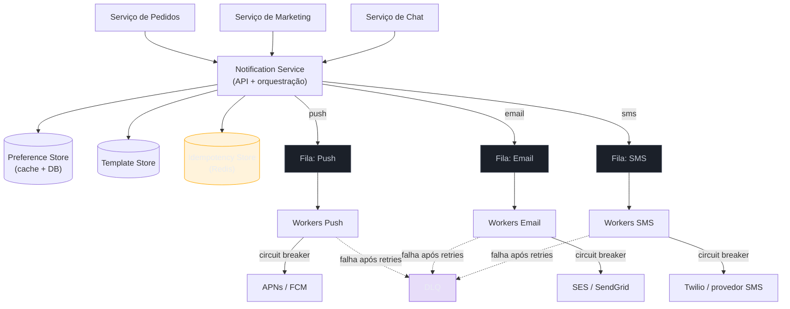
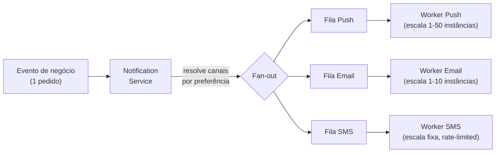
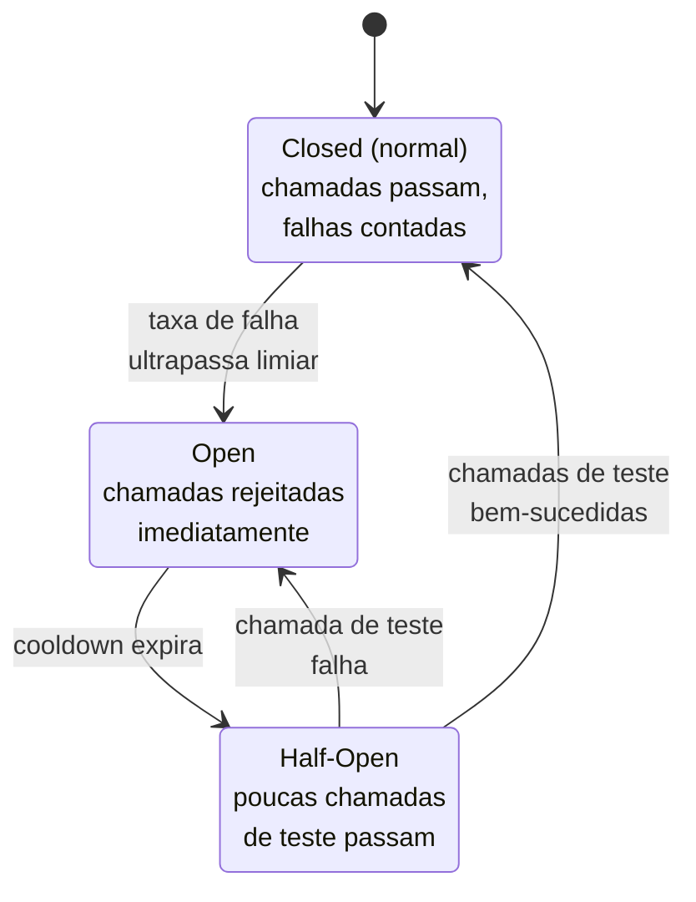
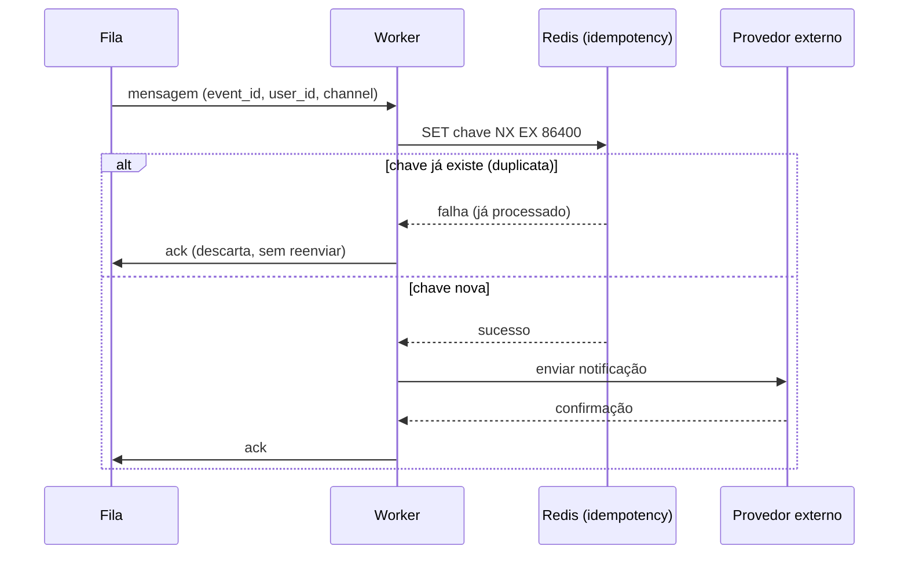

# Notification System

> [!abstract] TL;DR
> "Projete o sistema de notificações do Uber/Slack/Amazon" pede um sistema que dispara **push, SMS e email para bilhões de eventos por dia**, sem duplicar uma notificação, sem perder uma crítica e sem derrubar o resto do sistema quando um provedor externo (APNs, Twilio) ficar lento. A arquitetura inteira gira em torno de um fato: **cada evento de negócio pode virar N notificações** — um evento ("seu pedido chegou") pode disparar push + SMS + email para o mesmo usuário, e um evento em massa ("promoção de Black Friday") pode disparar para milhões de usuários de uma vez. Isso empurra o design para **fan-out desacoplado por fila, uma fila por canal**, com workers que escalam de forma independente por canal e absorvem picos sem travar o resto. O segundo eixo é a **fronteira do sistema com o mundo externo**: APNs, FCM, Twilio e provedores de email são serviços de terceiros fora do seu controle, com suas próprias quotas e instabilidades — retry com backoff e jitter, circuit breaker e dead-letter queue (DLQ) existem para que uma falha do provedor vire degradação controlada, não um incidente. O terceiro eixo, menos óbvio mas frequentemente citado como o "gotcha" deste walkthrough, é **dedup e idempotência**: numa fila com garantia at-least-once, todo retry é um duplo-envio em potencial, e a defesa é uma chave de idempotência por `(evento, usuário, canal)`. Nenhuma dessas decisões é gratuita — cada uma responde a um requisito que se negocia nos primeiros minutos da entrevista.

O entrevistador diz: "projete o sistema de notificações de um app de e-commerce — confirmação de pedido, atualização de entrega, promoções."

A tentação é desenhar direto: um serviço recebe o evento, chama a API do APNs ou do Twilio, pronto. Funciona numa demo com 10 usuários. Mas em produção, esse desenho ingênuo tem pelo menos quatro formas de quebrar silenciosamente: se o APNs ficar lento, cada chamada bloqueante trava uma thread do serviço até o timeout, e em poucos segundos todo o pool de conexões está preso esperando um provedor externo que você não controla; se um worker processa a mesma mensagem duas vezes (o cenário normal de qualquer fila at-least-once), o usuário recebe a mesma notificação duplicada; se um evento de "promoção" concorre pelo mesmo caminho que um evento de "código de verificação de login", o usuário pode não receber a notificação crítica a tempo porque a fila está entupida de marketing; e se ninguém verificou a preferência do usuário antes de disparar, você acabou de mandar SMS de marketing para alguém que pediu, explicitamente, para nunca mais receber SMS — o que em alguns países (como visto adiante) é infração legal com multa por mensagem.

Este walkthrough conduz o design na ordem que uma entrevista de verdade seguiria: requisitos, estimativas, API, diagrama macro, quatro deep dives (fan-out por fila, resiliência a provedores externos, dedup/idempotência, preferências e rate limiting), gargalos e as variações de follow-up mais comuns. Cada decisão volta a um requisito ou a um número.

## Requisitos

O primeiro passo do framework — coberto em [[1 - Framework de entrevista/02 - Clarificar requisitos|Clarificar requisitos]] — é separar o que o sistema *faz* (RF) do quão bem ele precisa fazer (RNF), negociando escopo em voz alta antes de desenhar qualquer caixa.

**Requisitos funcionais (RF):**

- **Enviar notificação multi-canal.** Um serviço interno dispara um evento ("pedido confirmado") que pode resultar em push, SMS e/ou email para o(s) destinatário(s), conforme a preferência do usuário e o tipo de evento.
- **Templates.** O conteúdo da notificação é gerado a partir de um template parametrizado (`"Seu pedido {{order_id}} saiu para entrega"`), não texto hardcoded no serviço que dispara o evento — permite localizar (i18n), versionar e trocar o texto sem deploy.
- **Preferências e opt-out do usuário.** O usuário escolhe, por categoria de notificação (transacional, marketing, social) e por canal, se quer receber. Um opt-out de marketing nunca pode suprimir uma notificação transacional crítica (código de verificação, alerta de fraude) — a distinção entre categorias é um requisito, não um detalhe.
- **Notificações agendadas vs. disparadas por evento (triggered).** Algumas notificações nascem de um evento em tempo real ("mensagem recebida"); outras são agendadas de antemão ("lembrete às 9h amanhã") ou geradas em lote ("todos os usuários com carrinho abandonado há 24h").
- **Rastreamento de status (opcional, negociado).** Saber se uma notificação foi enviada, entregue, aberta — importante para produto, mas fora do caminho crítico de envio.

Vale negociar em voz alta: "vou focar no caminho de disparo — receber o evento, resolver o destinatário e as preferências, montar o conteúdo a partir de um template e entregar por canal — e tratar agendamento em lote e analytics de abertura como extensões, depois que o núcleo estiver sólido."

**Requisitos não-funcionais (RNF):**

- **Alto throughput, fan-out grande.** Um único evento de negócio pode gerar de 1 até dezenas de milhões de notificações (uma promoção para toda a base). O sistema precisa absorver esse fan-out sem que um pico de marketing atrase uma notificação transacional.
- **At-least-once na entrega, mas sem duplicar para o usuário.** É aceitável — e, em sistemas distribuídos com filas, praticamente inevitável — que uma mensagem seja processada mais de uma vez internamente; o que não é aceitável é o usuário *ver* duas notificações idênticas. A garantia de entrega e a garantia de não-duplicação são responsabilidades de camadas diferentes.
- **Baixa latência para notificações críticas.** Um código de verificação (OTP) ou alerta de fraude precisa chegar em segundos; uma notificação de marketing pode levar minutos sem problema algum. Latência não é um número único do sistema — é um número por categoria de prioridade.
- **Resiliência a falha de provedor externo.** APNs, FCM, Twilio e provedores de email (SES, SendGrid) estão fora do seu controle direto — eles têm suas próprias quotas, instabilidades e SLAs. O sistema precisa continuar funcional (para os outros canais, e degradado, não travado) quando um desses provedores fica lento ou indisponível.
- **Idempotência e dedup.** A mesma chave de idempotência aplicada ao mesmo `(evento, usuário, canal)` nunca deveria gerar duas entregas.
- **Alta disponibilidade** — tipicamente **99,9%+** para o caminho de disparo, com preferência por disponibilidade em detrimento de consistência forte (o pior cenário aceitável é atraso, não perda silenciosa — ver [[2 - Building blocks/06 - CAP, consistência e consenso|CAP, consistência e consenso]]).

> [!question]- "At-least-once, mas sem duplicar" não é uma contradição?
> Não — são duas garantias em camadas diferentes da pilha, e confundi-las é um erro comum de quem está aprendendo o padrão. A fila (Kafka, SQS) garante que uma mensagem **não se perde**: se um worker crashar antes de confirmar o processamento, a mensagem volta para a fila e é reprocessada por outro worker — isso é at-least-once, e é *desejável*, porque a alternativa (at-most-once) permite perder notificações silenciosamente. O que a fila não garante, e nunca vai garantir sozinha, é que o *efeito observável* (a notificação chegando ao usuário) aconteça só uma vez. Essa segunda garantia — chamada de "efetivamente exactly-once" ou idempotência de efeito — é responsabilidade da aplicação, implementada com uma chave de idempotência checada antes do envio de fato. É exatamente o assunto do terceiro deep dive desta nota.

Em uma frase: **o sistema não é um serviço, é uma fábrica de fan-out — um evento vira N notificações por M canais, e cada uma dessas ramificações precisa de sua própria garantia de entrega, prioridade e resiliência a falha externa.**

## Estimativas de escala (back-of-envelope)

Com os requisitos fechados, o próximo passo — [[1 - Framework de entrevista/03 - Estimativas de escala (back-of-envelope)|Estimativas de escala]] — traduz "bilhões de notificações" em números que guiam decisões de topologia: quantas filas, quantos workers por canal, qual o pico real.

**Premissas de partida** (declaradas em voz alta):

- **500 milhões de usuários ativos.**
- **Em média, 4 notificações/usuário/dia** somando os três canais (push, SMS, email) — confirmação de pedido, atualização de entrega, lembrete, promoção ocasional.
- **Distribuição entre canais:** ~70% push, ~25% email, ~5% SMS (SMS é caro por mensagem, usado só para o crítico — 2FA, alertas).
- Um **evento de marketing em massa** típico ocorre algumas vezes por semana e atinge até **20% da base** de uma vez (100M usuários) numa janela de poucas horas.

**Volume diário e QPS médio:**

$$ 500.000.000 \text{ usuários} \times 4 \text{ notif/dia} = 2 \text{ bilhões de notificações/dia}
$$

$$ \frac{2.000.000.000}{86.400 \text{ s}} \approx 23.150 \text{ notificações/s (média)}
$$

**QPS de pico** — aplicando um peak factor de ~3x pelo padrão do dia (manhã/noite concentram tráfego) mais o efeito de campanhas em massa, que não são uniformes ao longo do dia:

$$ 23.150 \times 3 \approx 70.000 \text{ notificações/s no pico "normal"}
$$

Mas o número que realmente importa para o design não é a média diária — é o **pico de um evento de fan-out em massa**. Se uma campanha de marketing dispara para 100 milhões de usuários e a expectativa de produto é "entregue em até 30 minutos":

$$ \frac{100.000.000}{30 \times 60 \text{ s}} \approx 55.500 \text{ notificações/s só dessa campanha}
$$

Esse número, somado ao tráfego transacional de fundo, é a justificativa central para **separar filas por prioridade** (ver deep dive 1): se a campanha entrasse na mesma fila que os códigos de verificação de login, um pico de 55 mil/s de marketing enfileiraria atrás de si qualquer 2FA disparado no mesmo minuto — inaceitável para um RNF de "baixa latência para crítico".

**Volume por canal (aplicando a distribuição 70/25/5 sobre os 23.150/s médios):**

| Canal | QPS médio | Observação |
|---|---|---|
| Push | ~16.200/s | Mais barato, tolera fan-out agressivo |
| Email | ~5.800/s | Provedor (SES) cobra por mensagem, mas throughput alto é viável |
| SMS | ~1.150/s | Mais caro (centavos por mensagem) e mais restrito por regulação (TCPA) |

O contraste de custo e de restrição regulatória entre os três canais é, por si só, um argumento para que cada canal tenha seu próprio worker pool e sua própria política de rate limit — SMS não pode ser tratado com a mesma liberalidade que push.

**Storage:** guardando metadados de cada notificação (destinatário, canal, status, timestamp, ~300 bytes) por 90 dias para auditoria e debugging:

$$ 2.000.000.000 \text{ notif/dia} \times 90 \text{ dias} \times 300 \text{ bytes} \approx 54 \text{ TB}
$$

Um volume que já justifica um armazenamento colunar ou particionado por tempo (não um relacional único) — mas fora do caminho crítico de envio, então não é o foco do deep dive.

> [!question]- Por que a estimativa de fan-out de campanha importa mais que a média diária?
> Porque sistemas de fila e worker não são dimensionados pela média — são dimensionados pelo **pico que precisam absorver sem degradar o resto**. Uma média de 23 mil/s soa administrável por qualquer fila moderna. Mas se você dimensiona os workers de push só para essa média, o primeiro evento de Black Friday que gera 55 mil/s adicionais de um só golpe estoura a capacidade e — pior — se esse tráfego compartilha fila com o transacional, arrasta a latência de tudo junto. A conta de fan-out de campanha é o número que efetivamente decide "preciso de filas separadas por prioridade" — sem calculá-lo, a decisão de arquitetura fica sem número por trás, e é exatamente esse tipo de decisão sem justificativa numérica que a rubrica de entrevista penaliza.

Em uma frase: **~23 mil notificações/s em média, picos de dezenas de milhares por campanha isolada, com custo e regulação assimétricos entre canais — os números apontam direto para filas segregadas por canal e por prioridade, não para uma fila única.**

## API & modelo de dados

Com requisitos e escala fixados, o terceiro passo — [[1 - Framework de entrevista/04 - API design e data model na entrevista|API design e data model na entrevista]] — esboça os contratos que ancoram o diagrama macro.

**Endpoints (API interna, chamada por outros serviços — não expostos ao usuário final):**

```
POST /api/v1/notifications
Body: {
  "event_id": "order-9f3a-shipped",       // usado como chave de idempotência
  "user_id": "u_88213",
  "template_id": "order_shipped_v2",
  "template_params": { "order_id": "9f3a", "eta": "2026-07-09" },
  "priority": "high",                      // critical | high | normal | low
  "channels": ["push", "email"],           // opcional — sistema resolve por preferência se omitido
  "scheduled_for": null                    // null = disparo imediato; timestamp = agendado
}
Response: {
  "notification_id": "n_7ac21b",
  "status": "accepted"
}
```

```
GET /api/v1/notifications/{notification_id}/status
Response: {
  "status": "delivered",     // queued | sent | delivered | failed | suppressed
  "channel_results": [
    { "channel": "push", "status": "delivered", "delivered_at": "2026-07-07T14:02:11Z" },
    { "channel": "email", "status": "sent", "sent_at": "2026-07-07T14:02:09Z" }
  ]
}
```

```
PUT /api/v1/users/{user_id}/preferences
Body: {
  "categories": {
    "transactional": { "push": true, "email": true, "sms": true },
    "marketing":      { "push": true, "email": false, "sms": false },
    "social":         { "push": true, "email": true, "sms": false }
  }
}
```

**Modelo de dados (três tabelas centrais):**

| Tabela | Campos-chave | Propósito |
|---|---|---|
| `notification_request` | `event_id` (idempotency key), `user_id`, `template_id`, `priority`, `status` | registro do pedido de envio; `event_id` é único e é a base do dedup |
| `user_preference` | `user_id`, `category`, `channel`, `opted_in` | matriz usuário × categoria × canal, consultada antes de qualquer disparo |
| `template` | `template_id`, `version`, `locale`, `body_template` | conteúdo versionado e localizado, desacoplado do código do serviço |

O acesso dominante em `notification_request` é escrita (uma vez por pedido) seguida de algumas leituras de status — não exige um relacional pesado, mas o `event_id` como chave única (constraint de unicidade no banco) é o ponto de ancoragem de todo o deep dive de dedup adiante. `user_preference` é lookup puro por `user_id`, read-heavy e um candidato natural a cache (a preferência muda raramente, mas é consultada em toda notificação).

## Diagrama macro

Com API e modelo fixados, a visão consolidada — do evento de negócio até a entrega no canal, passando pela decisão de fan-out por fila que é o coração deste design:



O ponto que vale narrar explicitamente ao desenhar isso: o **Notification Service não fala diretamente com APNs, Twilio ou SES** — ele resolve preferências, monta o conteúdo a partir do template, checa idempotência e **publica numa fila por canal**. Quem efetivamente chama o provedor externo é um pool de workers dedicado àquele canal, consumindo daquela fila. Essa separação — evento → fila → worker especializado — é o que permite que uma lentidão do APNs afete só os workers de push, sem tocar em email ou SMS, e é o assunto do primeiro deep dive.

Os três provedores externos (APNs/FCM, SES/SendGrid, Twilio) aparecem atrás de um **circuit breaker** em cada worker pool — cobrindo o segundo deep dive, sobre resiliência à falha desses serviços de terceiros que estão fora do seu controle operacional.

## Deep dives

Uma entrevista de 45 minutos não cabe o sistema inteiro — o sinal de profundidade vem de escolher os componentes mais difíceis e ir fundo. Os quatro candidatos naturais deste design são: como o fan-out multi-canal se desacopla por fila; como o sistema sobrevive a um provedor externo instável; como ele evita duplicar notificações numa fila at-least-once; e como ele evita bombardear um único usuário.

### Deep dive 1 — Fan-out e desacoplamento por fila

A decisão mais estrutural deste design é: **por que uma fila por canal, e não uma fila única de "notificações a enviar"?**

Uma fila única parece mais simples à primeira vista — um worker genérico consome, olha o campo `channel` e decide o que fazer. O problema aparece sob carga real, e é o mesmo raciocínio coberto em [[2 - Building blocks/05 - Message queues e processamento assíncrono|Message queues e processamento assíncrono]]: **canais diferentes têm características de throughput, custo e falha completamente diferentes**, e misturá-los numa fila única acopla o desempenho de um ao desempenho de outro.

Push é barato e tolera fan-out agressivo — um worker pool de push pode escalar para dezenas de instâncias sem custo adicional relevante por mensagem. SMS custa centavos por mensagem e é regulado (TCPA, discutido nos gargalos) — o worker pool de SMS deveria ser deliberadamente mais contido, com rate limiting mais agressivo. Email tem latência de entrega mais tolerante, mas provedores como SES têm sandbox de reputação de domínio (enviar rápido demais derruba a reputação e aumenta a taxa de spam). Se as três compartilham fila, um pico de push arrastaria consigo a latência de SMS, mesmo sem nenhuma relação de causa entre os dois.



Uma fila por canal também isola **backpressure**: se o APNs começa a responder devagar, a fila de push cresce, mas as filas de email e SMS continuam fluindo normalmente — o sinal de degradação fica contido no canal afetado, visível como profundidade de fila crescente (uma métrica de alerta natural), sem se propagar. Com uma fila única, o mesmo cenário faria *toda* a fila crescer, incluindo mensagens de canais saudáveis atrás na fila de mensagens de push travadas — um efeito de cabeça de fila (**head-of-line blocking**) que penaliza canais que não têm nada a ver com o problema.

Dentro de cada fila de canal, uma segunda dimensão de fan-out — **prioridade** — normalmente exige uma segunda segregação: filas separadas (ou partições dedicadas, se usando Kafka) para `critical`/`high` versus `normal`/`low`, para que um pico de campanha de marketing (o cenário dos 55 mil/s calculados na seção de estimativas) nunca fique atrás na mesma fila que um código de verificação de login. O padrão comum, citado por implementações de referência como a do Hello Interview para este mesmo problema, é dedicar workers com concorrência maior (mais threads/instâncias) às filas de prioridade alta, e aplicar throttling deliberado às filas de baixa prioridade quando o sistema está sob pressão.

> [!question]- Por que não simplesmente dar mais workers para a fila única em vez de segregar?
> Porque mais workers na mesma fila não resolve head-of-line blocking nem isola falha — resolve throughput agregado, que é um problema diferente. Se a fila é única (FIFO, ou aproximadamente FIFO), uma mensagem de push travada esperando o APNs responder ainda ocupa a posição dela na fila até ser processada ou expirar — adicionar workers ajuda a paralelizar, mas não separa "o canal que está com problema" de "os canais saudáveis". Além disso, dimensionamento independente é mais barato operacionalmente: você escala workers de push para 50 instâncias num pico de campanha sem precisar escalar (e pagar) os workers de SMS junto, que continuam processando seu volume normal de forma isolada.

### Deep dive 2 — Resiliência a provedores externos

APNs, FCM, Twilio e provedores de email são **serviços de terceiros fora do seu controle operacional** — eles têm suas próprias quotas (a FCM, por exemplo, documenta um teto de **600 mil mensagens/minuto** por projeto por padrão, com picos de colapso de mensagens limitados a 20 por dispositivo com refill de 1 a cada 3 minutos), suas próprias instabilidades, e nenhuma obrigação de avisar você antes de degradar. O design precisa assumir, desde o início, que **qualquer um desses provedores vai ficar lento ou indisponível em algum momento** — a pergunta de entrevista não é "e se o APNs cair", é "quando o APNs cair, o resto do sistema continua de pé?".

Três mecanismos, em camadas, respondem a isso.

**Retry com backoff exponencial e jitter.** Quando uma chamada ao provedor falha por um erro transitório (timeout, 5xx, rate limit momentâneo), o worker não desiste na primeira tentativa nem retenta imediatamente — retenta com um atraso que cresce exponencialmente (ex.: 10s, 30s, 60s, 300s, 900s) e um **jitter aleatório** aplicado a cada atraso. O jitter existe por um motivo específico e contraintuitivo, descrito no artigo de referência da AWS sobre o tema: sem ele, se um provedor cai e volta, **milhares de workers que fizeram retry no mesmo instante do erro original tentam de novo no mesmo instante**, recriando o pico que derrubou o provedor em primeiro lugar — um efeito de "manada" (thundering herd). A estratégia de **full jitter** (sortear o atraso real dentro de um intervalo, não aplicar um atraso fixo) espalha os retries no tempo e reduz drasticamente a carga agregada sobre o provedor recém-recuperado.

Nem todo erro merece retry: um `400 BadDeviceToken` do APNs (token de push inválido — o app foi desinstalado) é um erro **permanente**, retry só desperdiça throughput; um `503` ou timeout é **transitório** e merece a fila de retry. Distinguir os dois é parte do design, não um detalhe de implementação — misturar as duas categorias faz o sistema retentar infinitamente algo que nunca vai funcionar.

**Circuit breaker.** Retry por si só não impede que, sob uma falha prolongada do provedor, cada worker continue tentando (e falhando, e esperando o timeout de cada tentativa) indefinidamente — consumindo threads e conexões que poderiam estar processando outras mensagens. O padrão coberto em detalhe em [[3 - Padrões recorrentes/05 - Circuit Breaker e resiliência|Circuit Breaker e resiliência]] resolve isso: o worker mantém uma contagem de falhas recentes contra aquele provedor; quando a taxa de falha ultrapassa um limiar, o circuito **abre**, e por um período de cooldown toda chamada àquele provedor falha imediatamente (sem sequer tentar a rede) — como descrito por Martin Fowler, o circuito "curto-circuita" a chamada. Passado o cooldown, o circuito entra em **half-open** e deixa passar um punhado de chamadas de teste; se recuperaram, volta a **closed** (normal); se não, volta a **open**.



Com o circuito aberto para o APNs, os workers de push **param de tentar** — liberando threads e conexões — e a mensagem que não pôde ser entregue é redirecionada para a fila de retry (ou, dependendo da política de prioridade, para um canal alternativo — ver a variação de fallback de canal nos gargalos). O ponto central: circuit breaker não é sobre "entregar mais rápido", é sobre **não deixar a falha de um provedor externo consumir recursos que o resto do sistema precisa**.

**Dead-Letter Queue (DLQ).** Quando uma mensagem esgota o número máximo de tentativas de retry (tipicamente um teto configurável — 3 a 5 tentativas para notificações normais, potencialmente mais para críticas) sem sucesso, ela não é descartada silenciosamente — é publicada numa **DLQ**: um tópico/fila separado que registra "esta notificação falhou definitivamente" com o motivo. A DLQ serve dois propósitos: **auditoria** (o status da notificação é marcado como `failed` e fica consultável, em vez de simplesmente sumir) e **operação** (um consumidor da DLQ pode alertar o time de on-call quando o volume de falhas cruza um limiar, ou acionar automaticamente um canal de fallback — se o push falhou definitivamente para uma notificação crítica, escalar para SMS).

> [!warning] Retentar indefinidamente sem limite nem DLQ
> **O que acontece:** o worker retenta uma mensagem que falha permanentemente (token inválido, número de telefone inexistente) infinitas vezes, sem nunca desistir nem registrar a falha em lugar nenhum. **Por quê:** o código de retry foi escrito pensando só no caso feliz ("o provedor volta, o retry funciona"), sem distinguir erro transitório de erro permanente, e sem um teto de tentativas. **Como evitar:** classifique o erro (transitório vs. permanente) antes de decidir se retenta; imponha um `max_attempts` explícito; ao esgotar, publique na DLQ em vez de descartar silenciosamente — a mensagem que falhou definitivamente precisa ficar visível para alguém investigar, não desaparecer.

> [!warning] Circuit breaker sem cooldown calibrado vira uma trava permanente
> **O que acontece:** o circuito abre corretamente quando o APNs cai, mas o cooldown é longo demais (ou o critério de half-open é frouxo demais), e o sistema continua rejeitando chamadas ao APNs muito depois do provedor já ter se recuperado. **Por quê:** o cooldown foi escolhido de forma arbitrária, sem testar o comportamento de recuperação real do provedor — um cooldown de 5 minutos pode ser ótimo para uma falha de rede transitória e péssimo (deixando push inteiro fora do ar por 5 minutos extras) para uma falha de 10 segundos. **Como evitar:** calibre o cooldown com base no comportamento observado do provedor (SLAs documentados, histórico de incidentes), e prefira um estado half-open que teste com poucas chamadas reais em vez de esperar o cooldown inteiro cegamente — o objetivo é minimizar tanto o tempo gasto batendo numa parede quanto o tempo gasto artificialmente fora do ar depois que a parede sumiu.

### Deep dive 3 — Dedup e idempotência

Esta é, segundo praticamente todo guia moderno de entrevista que cobre este design (Hello Interview incluso), a armadilha mais citada: **numa fila com garantia at-least-once, todo retry é uma duplicação em potencial**. Um worker consome a mensagem, chama o APNs com sucesso, mas crasha *antes* de confirmar (`ack`) o consumo à fila — a fila, não sabendo que o envio já aconteceu, redelivera a mesma mensagem para outro worker, que a envia de novo. O usuário recebe a mesma notificação duas vezes.

A defesa é uma **chave de idempotência** — um identificador que representa unicamente "este evento, para este usuário, neste canal", checado *antes* de qualquer chamada ao provedor externo:

```
chave = "{event_id}:{user_id}:{channel}"
```

O fluxo do worker, com a chave aplicada:



A escolha de **Redis com `SET NX EX`** (set-if-not-exists, com TTL) como store de idempotência, em vez de uma constraint de unicidade só no banco relacional, é uma decisão de latência: a operação é atômica, de memória, na casa de ~100 microssegundos — rápida o suficiente para acontecer no caminho crítico de todo envio sem se tornar, ela mesma, um gargalo. O TTL importa tanto quanto a atomicidade: manter a chave para sempre desperdiça memória sem necessidade (depois de alguns dias, a chance de uma redelivery tardia da fila é desprezível); um TTL curto demais, por outro lado, reabre a janela de duplicação se a fila reentregar depois que a chave expirou. A prática comum é escalonar o TTL pela prioridade — janelas mais longas (ex.: 24h) para notificações críticas, mais curtas (ex.: 15min–1h) para as de baixa prioridade, equilibrando segurança contra duplicação e custo de memória.

Dois refinamentos completam a defesa:

**Deduplicação em múltiplas camadas, não só no worker.** A chave de idempotência no Redis protege contra redelivery *dentro* do seu próprio pipeline (worker crashou, fila reentregou). Mas o provedor externo também oferece seu próprio mecanismo — Twilio aceita um header `Idempotency-Key` na chamada de envio, e o APNs aceita um `apns-collapse-id` que faz notificações repetidas para o mesmo dispositivo colapsarem numa só. Usar ambas as camadas — a sua e a do provedor — é defesa em profundidade: mesmo que sua própria checagem falhe por algum motivo (um bug, uma corrida rara), a camada do provedor ainda pode evitar a duplicação visível ao usuário.

**Idempotência no nível de negócio, não só de infraestrutura.** A chave `event_id:user_id:channel` resolve duplicação por *redelivery da fila*. Mas existe uma segunda fonte de duplicação, de nível mais alto: o serviço de pedidos, por um bug próprio, publica o mesmo evento de "pedido enviado" duas vezes com `event_id`s diferentes. Isso a chave de idempotência do notification service não resolve — é responsabilidade do produtor do evento garantir que cada acontecimento de negócio gere um único `event_id`, tipicamente derivado deterministicamente do próprio dado de domínio (`f"order-{order_id}-shipped"` em vez de um UUID aleatório a cada chamada).

> [!question]- Por que não usar apenas a constraint de unicidade do banco (como no deep dive de geração de código do URL Shortener) em vez de Redis?
> Poderia — e é uma alternativa válida, com um trade-off diferente. Uma constraint `UNIQUE(event_id, user_id, channel)` na tabela `notification_request`, com `INSERT ... ON CONFLICT DO NOTHING`, resolve a mesma duplicação sem precisar de infraestrutura adicional (nenhum Redis a mais para operar). O custo é latência: uma escrita transacional num banco relacional, mesmo bem indexada, tipicamente custa de 1 a alguns milissegundos, contra frações de milissegundo de um `SET NX` em memória — a diferença é pequena por chamada individual, mas em 23 mil verificações por segundo (o QPS médio deste sistema), a diferença agregada de latência e de carga no banco primário é real. A escolha comum em sistemas de alto throughput é usar Redis como checagem rápida no caminho crítico e o banco como fonte de verdade duradoura para status e auditoria — as duas camadas coexistem, não competem.

> [!warning] Confundir "idempotência da fila" com "idempotência do provedor"
> **O que acontece:** o time implementa a chave de idempotência corretamente no worker, mas assume que isso também protege contra o provedor externo enviar duas vezes por conta própria (ex.: um retry automático dentro do SDK do Twilio que o time desconhecia). **Por quê:** idempotência é uma propriedade que precisa ser garantida em cada fronteira de rede onde uma requisição pode ser reenviada — o worker→fila é uma fronteira, o worker→provedor é outra, completamente independente. Proteger uma não protege a outra automaticamente. **Como evitar:** sempre que o SDK/API do provedor oferecer um mecanismo de idempotência (header `Idempotency-Key`, `apns-collapse-id`), use-o explicitamente na chamada — não assuma que a idempotência do seu lado do sistema se propaga para dentro de uma caixa-preta de terceiros.

### Deep dive 4 — Preferências e rate limiting por usuário

O último eixo de profundidade natural deste design é evitar o oposto do problema de dedup: em vez de enviar a mesma notificação duas vezes, enviar **notificações demais**, de fontes diferentes, no mesmo curto período — o efeito prático de "bombardear" um usuário, mesmo que cada notificação individual seja legítima e não-duplicada.

**Checagem de preferência antes do fan-out, não depois.** O fluxo correto consulta `user_preference` **antes** de publicar nas filas por canal — se o usuário desativou push para a categoria "marketing", a mensagem nunca chega a ser publicada na fila de push, e não apenas é descartada tardiamente por um worker depois de já ter consumido capacidade de fila e de processamento. A consulta de preferência é read-heavy e muda raramente, um candidato natural a cache-aside (o mesmo padrão coberto em [[2 - Building blocks/02 - Caching|Caching]]) na frente do banco de preferências — evitando que 23 mil consultas/s de preferência batam direto num banco relacional a cada notificação.

Uma distinção que precisa estar explícita no modelo de dados, não só na lógica de negócio: **categoria transacional nunca é suprimível por opt-out geral**. Um código de verificação de login ou um alerta de fraude não é "marketing" — é parte do contrato funcional do produto, e a maioria dos frameworks legais (TCPA nos EUA, discutido nos gargalos) trata comunicação transacional de forma diferente de comunicação de marketing exatamente por esse motivo. Um único opt-out binário ("não me mande nada") que também bloqueia 2FA é um bug de segurança disfarçado de feature de privacidade.

**Rate limiting por usuário, independente de preferência.** Mesmo com todas as preferências respeitadas, um usuário pode legitimamente disparar múltiplas notificações elegíveis num curto período — várias atualizações de status do mesmo pedido, várias menções num chat ativo. O sistema aplica um teto por usuário por janela de tempo (ex.: no máximo N notificações não-críticas por hora), reaproveitando o mesmo padrão de **token bucket** coberto em [[3 - Padrões recorrentes/04 - Rate Limiting|Rate Limiting]] — só que a chave do bucket agora é `user_id`, não IP ou API key. Notificações que excedem o teto não são necessariamente descartadas: uma estratégia comum é **agregá-las** ("você tem 5 novas atualizações") em vez de suprimir silenciosamente, preservando a informação sem gerar cinco interrupções separadas.

> [!warning] Rate limit único aplicado igualmente a crítico e a marketing
> **O que acontece:** o sistema aplica o mesmo teto de "N notificações/hora por usuário" independente da categoria, e um código de verificação de login chega atrasado (ou é suprimido) porque o usuário já recebeu N-1 notificações de marketing na mesma janela. **Por quê:** o rate limiter foi projetado pensando só em "não incomodar o usuário", sem segregar por prioridade — a mesma lacuna do deep dive de fan-out por fila, agora no nível de usuário em vez de nível de sistema. **Como evitar:** o rate limit por usuário precisa de buckets separados por categoria/prioridade, do mesmo jeito que o fan-out por fila separa canais e prioridades no nível de infraestrutura — notificações `critical` (2FA, alerta de fraude, alerta de segurança) ficam fora do rate limit de conveniência que se aplica a marketing e social.

Em uma frase: **fan-out por fila resolve "não travar o sistema"; dedup resolve "não duplicar"; preferências e rate limiting resolvem o terceiro problema, geralmente esquecido — "não irritar o usuário", que é tão parte da experiência do produto quanto entregar a notificação em si.**

## Gargalos & trade-offs

Nenhum componente discutido é gratuito — vale nomear proativamente os pontos de fragilidade, o tipo de pergunta que o entrevistador puxa na fase de trade-offs & evolução (ver [[1 - Framework de entrevista/05 - Do diagrama macro ao deep dive e trade-offs|Do diagrama macro ao deep dive e trade-offs]]).

**O provedor externo é, estruturalmente, o gargalo e o limite de taxa do sistema inteiro.** Por mais que o Notification Service e os workers escalem horizontalmente sem limite teórico, a FCM documenta um teto de **600 mil mensagens/minuto por projeto** por padrão (aumentável mediante solicitação com até 15 dias de antecedência), e provedores de SMS como Twilio cobram por mensagem e aplicam seus próprios limites de taxa por conta. Nenhuma engenharia interna contorna esse teto — o design precisa assumir que existe um limite superior de throughput por canal que não é seu para negociar em tempo real, e isso reforça, de novo, a necessidade de priorização explícita: quando o teto do provedor é atingido, quem fica de fora deveria ser marketing, nunca 2FA.

**Priorização via filas separadas é a resposta estrutural, não um detalhe de implementação.** Já coberto no deep dive 1, mas vale reafirmar como trade-off: manter filas separadas por prioridade custa complexidade operacional (mais filas para monitorar, mais lógica de roteamento no Notification Service) em troca de isolamento de latência — a alternativa mais simples (fila única com campo de prioridade lido pelo worker) é mais fácil de operar, mas reintroduz head-of-line blocking sob pico, exatamente o cenário que a estimativa de 55 mil/s de campanha tornou concreto.

**Tracking de entrega adiciona uma segunda dimensão de escala, silenciosa.** Saber se uma notificação foi de fato entregue (não só enviada) depende de webhooks/callbacks assíncronos dos provedores (Twilio confirma entrega de SMS, APNs sinaliza token inválido via resposta HTTP). Esse fluxo de confirmação, se não for desenhado com o mesmo cuidado de desacoplamento por fila do envio, pode se tornar seu próprio gargalo — Slack documentou publicamente, no rebuild do próprio sistema de notificações, o esforço de meses necessário só para conseguir *rastrear* onde uma notificação era descartada ao longo do pipeline, um problema de observabilidade distinto do problema de envio em si.

**Ordering não é garantido, e normalmente não precisa ser.** Duas notificações do mesmo evento em canais diferentes (push e email da mesma confirmação de pedido) podem chegar fora de ordem — o push pode demorar mais que o email, ou vice-versa, dependendo da fila e do provedor de cada canal. Para a maioria dos produtos isso é aceitável (o conteúdo de cada notificação é autocontido). Quando ordering *importa* de fato — por exemplo, uma sequência de mensagens de chat que precisa aparecer na ordem certa — o design correto normalmente não é "ordenar notificações", é usar partições de fila chaveadas por `user_id` (garantindo ordem só dentro da mesma partição, o padrão de partitioning do Kafka) e tratar isso como um requisito explícito levantado com o entrevistador, não como um padrão default deste sistema.

> [!warning] Ignorar a fronteira legal do opt-out (TCPA/CAN-SPAM)
> **O que acontece:** o sistema trata "preferência do usuário" como uma feature de UX, sem tratar os requisitos legais de opt-out como um requisito funcional obrigatório. **Por quê:** parece um detalhe de produto, não de arquitetura — mas nos EUA, o TCPA prevê multas estatutárias de **US$500 a US$1.500 por violação**, por mensagem, sem necessidade de provar dano real, e exige que um pedido de revogação de consentimento (o usuário respondendo "STOP") seja honrado o quanto antes, no máximo em 10 dias úteis. O CAN-SPAM impõe regra equivalente para email, com multas por email de até dezenas de milhares de dólares. Um bug que continua mandando SMS de marketing depois de um opt-out não é só uma má experiência — é passivo legal mensurável, por mensagem enviada. **Como evitar:** trate a checagem de preferência e a aplicação de opt-out (incluindo reconhecer "STOP"/"CANCEL" recebidos via webhook do provedor de SMS) como parte do caminho crítico e testado do sistema, com o mesmo rigor que se dá a dedup ou a retry — não como uma tabela de configuração acessória.

## Variações de follow-up

O entrevistador raramente para no design básico — as extensões abaixo são as mais comuns puxadas neste walkthrough especificamente.

**Notificações agendadas.** Em vez de disparo imediato por evento, o pedido inclui `scheduled_for` no futuro. A implementação comum não mantém o pedido "vivo" numa fila esperando — usa um **scheduler** (um serviço que varre periodicamente pedidos com `scheduled_for` dentro da próxima janela, ex. os próximos 60 segundos, e os publica na fila correspondente naquele momento) ou um mecanismo de fila com delay nativo (SQS delay queues, ou um plugin de delayed message do RabbitMQ). Para volumes muito altos de agendamento (lembretes diários para milhões de usuários), a estratégia costuma ser particionar por horário-alvo num índice ordenado (ex. um sorted set do Redis com o timestamp como score), permitindo ao scheduler consultar eficientemente "o que vence nos próximos 60 segundos" sem varrer a tabela inteira.

**Digest / batching.** Em vez de disparar uma notificação por evento individual, o sistema agrega eventos do mesmo usuário numa janela de tempo e envia um resumo ("5 pessoas curtiram seu post nas últimas 2 horas") — reduz volume e melhora a experiência, ao custo de introduzir um pequeno delay estrutural e uma lógica de janela deslizante por usuário. É a mesma ideia do rate limiting do deep dive 4, mas usada proativamente como feature de produto em vez de defesa reativa contra excesso.

**A/B de templates.** Como o conteúdo já é resolvido a partir de `template_id` (deep dive de API & modelo de dados), testar variações é, estruturalmente, uma questão de **qual template_id é selecionado** para cada usuário — um serviço de experimentação decide a variante antes de a mensagem chegar ao Notification Service, e o restante do pipeline (fan-out, dedup, entrega) não precisa saber que existe um experimento em andamento. É um bom exemplo de como um bom desenho de modelo de dados (template versionado e desacoplado) paga dividendos quando o produto pede uma feature que não estava no escopo original.

**Analytics de entrega e abertura.** Estender o rastreamento de status (já esboçado na API) para eventos de abertura (o usuário clicou no push, abriu o email) tipicamente sai do caminho síncrono de envio e vira seu próprio pipeline de streaming — cliques e aberturas chegam via callback do provedor ou via pixel de tracking, publicados numa fila própria e agregados separadamente, sem tocar a latência do envio original. É o mesmo padrão de desacoplamento por fila que aparece em todo o resto do design, aplicado agora ao lado de leitura/analytics em vez de ao lado de escrita/envio.

## Em entrevista

Este walkthrough tende a aparecer depois que o candidato já mostrou domínio de fila e cache em designs mais simples — o entrevistador está testando se você consegue **compor** os building blocks (fila, cache, rate limiter, circuit breaker) num sistema com múltiplas dimensões de heterogeneidade (canal, prioridade, provedor externo) ao mesmo tempo.

O roteiro de condução que tende a sinalizar senioridade:

1. **Separe categoria (transacional/marketing/social) de canal (push/SMS/email) desde os requisitos.** É a distinção que evita o erro mais citado deste design — tratar opt-out geral como se suprimisse tudo, inclusive 2FA.
2. **Ofereça fila-por-canal como decisão estrutural, não como detalhe.** É o componente que mais separa uma resposta júnior ("um serviço chama a API do provedor") de uma sênior ("desacoplo por fila para isolar falha e permitir escala independente por canal").
3. **Antecipe o deep dive de resiliência ao provedor externo antes de ser perguntado.** Retry com jitter, circuit breaker e DLQ, nessa ordem de camadas, é o núcleo técnico mais denso deste walkthrough — mencione os três, mesmo que superficialmente, antes que o entrevistador precise puxar.
4. **Não deixe dedup como uma frase solta — explique a chave de idempotência.** É comum candidatos dizerem "preciso de idempotência" sem nunca especificar *qual* é a chave e *onde* ela é checada; a resposta forte nomeia `event_id:user_id:channel` e o `SET NX` atômico antes da chamada ao provedor.
5. **Feche com o teto de throughput do provedor como o verdadeiro limite do sistema.** É um trade-off fácil de esquecer (parece "infraestrutura de terceiros, não meu problema") mas que mostra que você entende os limites reais de um sistema que depende de serviços externos.

> [!question]- Esse design não é "só" um wrapper em cima de mensageria — o que exatamente é avaliado aqui, além de fila?
> A fila é o vocabulário, não o conteúdo avaliado. O que a rubrica busca aqui é como você lida com **heterogeneidade**: três canais com custo e comportamento de falha completamente diferentes, múltiplas prioridades competindo pelo mesmo recurso, uma garantia de entrega (at-least-once) que gera um problema derivado (dedup) que precisa de solução própria, e uma dependência de terceiros que você não controla e cujo teto de throughput vira, de fato, o teto do seu sistema. Um candidato que desenha "uma fila, um worker, chama a API" mostrou que sabe o vocabulário de mensageria. Um candidato que separa por canal, prioriza, deduplica e isola falha de provedor mostrou que entende como esses building blocks se compõem sob restrições reais — que é exatamente o eixo de "profundidade técnica" da rubrica descrita em [[1 - Framework de entrevista/01 - O que é System Design e o que a entrevista avalia|O que é System Design]].

## Como explicar em inglês

> "I'd start by separating notification category — transactional, marketing, social — from channel — push, SMS, email — because opt-out rules apply per category, and transactional notifications like 2FA codes can never be suppressed by a general opt-out.
>
> Architecturally, the core decision is fan-out through a queue per channel rather than calling providers directly. Push, SMS, and email have completely different cost profiles and failure modes, so isolating them means a slow APNs doesn't create head-of-line blocking for SMS or email traffic. Within each channel, I'd also separate by priority, so a marketing campaign spike never queues behind a login verification code.
>
> For resilience against external providers, I'd layer three things: retry with exponential backoff and full jitter to avoid a thundering herd when a provider recovers, a circuit breaker so workers stop wasting threads hammering a provider that's down, and a dead-letter queue so permanently failed messages are auditable instead of silently dropped.
>
> And since the queue is at-least-once, every retry is a potential duplicate — I'd use an idempotency key scoped to `event_id:user_id:channel`, checked atomically in Redis before any call to the provider, so a redelivered message never results in two notifications reaching the user."

| PT | EN |
|----|----|
| Fan-out multi-canal | Multi-channel fan-out |
| Fila por canal | Per-channel queue |
| Provedor externo | External / third-party provider |
| Retentativa com backoff e jitter | Retry with backoff and jitter |
| Circuit breaker (fechado/aberto/semiaberto) | Circuit breaker (closed/open/half-open) |
| Fila de mensagens mortas | Dead-letter queue (DLQ) |
| Chave de idempotência | Idempotency key |
| Deduplicação | Deduplication / dedup |
| Preferências do usuário | User preferences |
| Opt-out / consentimento | Opt-out / consent |
| Bloqueio de cabeça de fila | Head-of-line blocking |
| Notificação transacional vs. de marketing | Transactional vs. marketing notification |

## O que vem a seguir

O sistema de notificações resolveu um problema de **fan-out e resiliência de borda** — muitos canais, muitos provedores externos, cada um com sua própria forma de falhar. O próximo walkthrough troca a natureza do dado: em vez de mensagens efêmeras entregues uma vez, um sistema que precisa **guardar e sincronizar arquivos** de forma durável, consistente entre dispositivos, e eficiente em banda — a pergunta central deixa de ser "como eu desacoplo o envio" e passa a ser "como eu quebro um arquivo grande em pedaços, deduplico o conteúdo entre usuários diferentes, e mantenho tudo consistente quando o mesmo arquivo é editado em dois dispositivos ao mesmo tempo".

- [[06 - Distributed File Storage]] — chunking, metadata service, dedup de conteúdo, sincronização e consistência

## Veja também

- [[System Design/index|System Design]] — o galho-pai e o mapa da trilha
- [[4 - Walkthroughs/index|Walkthroughs]] — os outros walkthroughs deste sub-galho
- [[04 - Distributed Rate Limiter]] — o walkthrough anterior; o rate limiting por usuário deste design reaproveita o mesmo padrão de token bucket
- [[2 - Building blocks/05 - Message queues e processamento assíncrono|Message queues e processamento assíncrono]] — fila vs. log, backpressure, at-least-once — a base do deep dive de fan-out por fila
- [[3 - Padrões recorrentes/05 - Circuit Breaker e resiliência|Circuit Breaker e resiliência]] — estados closed/open/half-open, aprofundado no deep dive de resiliência a provedor externo
- [[3 - Padrões recorrentes/04 - Rate Limiting|Rate Limiting]] — token bucket, o padrão reaproveitado no rate limiting por usuário
- [[3 - Padrões recorrentes/01 - Pub-Sub e event-driven em escala|Pub-Sub e event-driven em escala]] — o modelo de evento único disparando múltiplos consumidores, aplicado aqui ao fan-out multi-canal

## Fontes

- **Alex Xu** — *System Design Interview – An Insider's Guide, Vol. 1*, cap. 10 (Design A Notification System) — a referência-âncora deste walkthrough: fan-out por canal, templates, rate limiting.
- **Hello Interview** — [*Design a Notification System*](https://www.hellointerview.com/community/questions/notification-system-scale/cm758vf17024kalw2qn7e57xs) — breakdown moderno (2024+) com escala de até 1M notificações/s, filas por canal, circuit breaker e dedup.
- **Witty Coder** — [*Notification Reliability: Delivery Guarantees, Deduplication, and Retry Strategy*](https://wittycoder.in/courses/notification-system/notification-reliability) — a chave de idempotência escalonada por prioridade, retry com full jitter e o design de DLQ usados neste walkthrough.
- **AWS Architecture Blog** — [*Exponential Backoff And Jitter*](https://aws.amazon.com/blogs/architecture/exponential-backoff-and-jitter/), Marc Brooker — a referência canônica sobre por que jitter evita o efeito manada em retries.
- **Martin Fowler** — [*CircuitBreaker*](https://martinfowler.com/bliki/CircuitBreaker.html) — os três estados (closed/open/half-open) e a origem do padrão, popularizado por Michael Nygard.
- **Firebase Cloud Messaging** — [*FCM Throttling and Quotas*](https://firebase.google.com/docs/cloud-messaging/throttling-and-quotas) — teto de 600 mil mensagens/minuto por projeto e limites de colapso de mensagem, usados nas estimativas e gargalos.
- **Apple Developer** — [*Communicating with APNs*](https://developer.apple.com/library/archive/documentation/NetworkingInternet/Conceptual/RemoteNotificationsPG/CommunicatingwithAPNs.html) — resposta HTTP/410 "unregistered" para token inválido, citada no tratamento de erro permanente vs. transitório.
- **Slack Engineering** — [*Tracing Notifications*](https://slack.engineering/tracing-notifications/) e [*How Slack Rebuilt Notifications*](https://slack.engineering/how-slack-rebuilt-notifications/) — o esforço real de observabilidade num pipeline de notificação em produção, citado nos gargalos.
- **BCLP Law** — [*The TCPA's New Opt-Out Rules Take Effect on April 11, 2025*](https://www.bclplaw.com/en-US/events-insights-news/the-tcpas-new-opt-out-rules-take-effect-on-april-11-2025-what-does-this-mean-for-businesses.html) — as regras de opt-out e os valores de multa por violação citados no gargalo de compliance.

