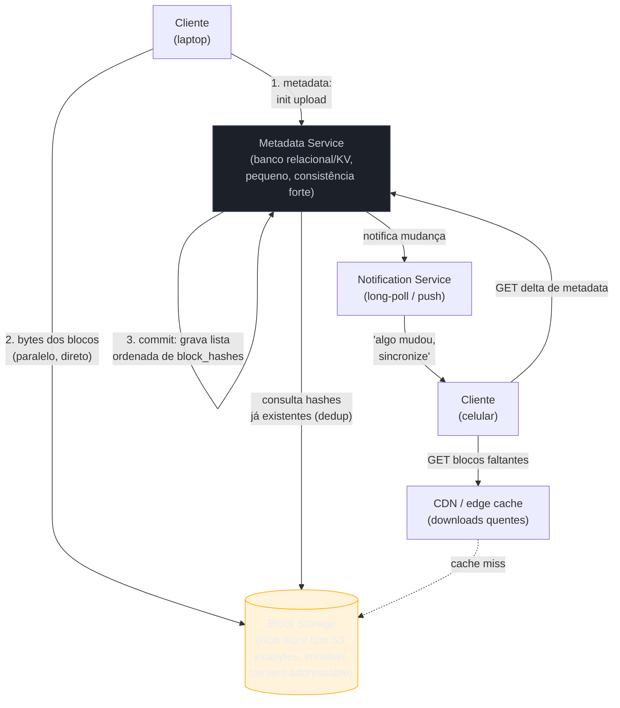
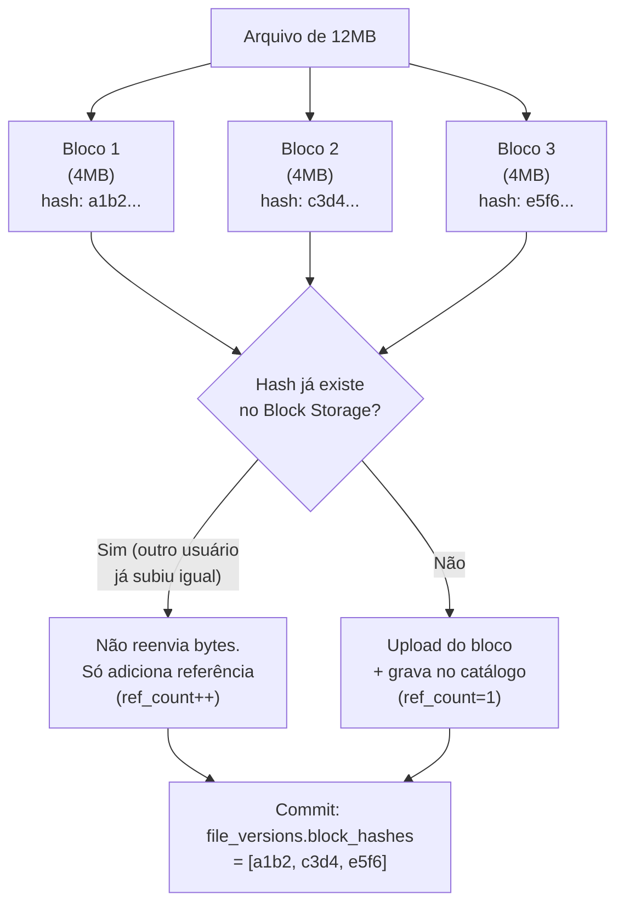
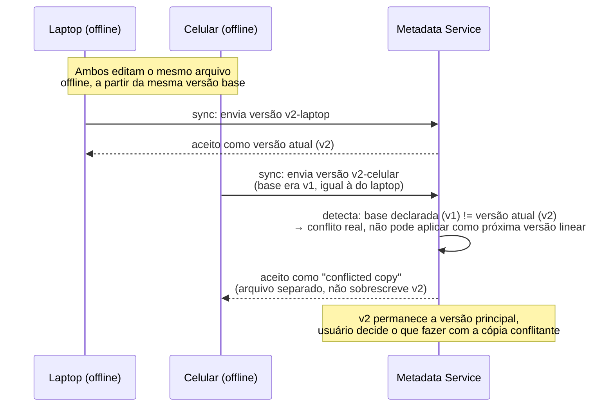

# Distributed File Storage

> [!abstract] TL;DR
> "Projete o Google Drive ou o Dropbox" soa, de novo, como CRUD com upload de arquivo. Não é — pelas mesmas razões estruturais do walkthrough de chat, mas aplicadas a bytes em vez de mensagens. O desafio real não é *guardar* um arquivo de 2GB; é **dividi-lo em blocos**, para que upload resumível, sincronização de delta entre dispositivos e paralelismo de rede sejam possíveis; é **deduplicar** esses blocos, porque milhões de usuários guardam cópias do mesmo PDF, da mesma música, do mesmo instalador; é **separar metadado de conteúdo**, porque "onde está o arquivo X e quais blocos ele tem" é uma pergunta de baixíssima latência que não pode competir, no mesmo banco, com o tráfego pesado de bytes; e é **notificar outros dispositivos** que algo mudou, sem fazer cada laptop perguntar "mudou alguma coisa?" a cada 5 segundos. A arquitetura inteira gira em torno de uma separação: o **metadata service** (o cérebro, consistência forte, pequeno) e o **block storage** (o músculo, consistência eventual tolerável, gigantesco). Entender por que essa separação existe — e como chunking e deduplicação se encaixam nela — é o coração desta nota.

Um entrevistador diz: "projete um sistema de armazenamento de arquivos com sincronização entre dispositivos, tipo Google Drive ou Dropbox."

A resposta ingênua: "tenho uma tabela `files` com `user_id`, `filename`, `content` (um BLOB), e `updated_at`. Quando o usuário sobe um arquivo, faço um `POST /files` com o arquivo inteiro no corpo. Os outros dispositivos fazem `GET /files` de tempos em tempos para ver se mudou algo."

Isso "funciona" para um MVP de brinquedo e quebra em pelo menos quatro pontos assim que a escala aparece. Primeiro: um arquivo de 2GB enviado como um blob monolítico morre com qualquer soluço de rede — a conexão cai aos 80% e o cliente recomeça do zero. Segundo: se Alice edita uma linha num documento de 500MB, reenviar o arquivo inteiro para sincronizar é um desperdício brutal de banda — o delta real pode ser de alguns KB. Terceiro: se um milhão de usuários tem a mesma cópia do instalador do Photoshop ou do mesmo vídeo viral salvo no Drive, armazenar cada cópia byte a byte multiplica o custo de storage por um fator que não precisa existir. Quarto: colocar metadado (nome, pasta, quem pode ver) e conteúdo (os bytes em si) na mesma tabela mistura dois padrões de acesso completamente diferentes — um é pequeno e read-heavy com necessidade de consistência forte, o outro é gigantesco e tolera ser eventual.

Cada um desses quatro problemas tem uma resposta padrão na indústria, e as quatro respostas — **chunking**, **deduplicação**, **separação metadado/bloco** e **notificação assíncrona** — são o esqueleto desta nota.

## Requisitos

### Funcionais (RF)

- **Upload de arquivo:** o usuário sobe um arquivo (de KB a dezenas de GB) para a nuvem.
- **Download de arquivo:** o usuário — ou qualquer dispositivo dele com acesso — baixa o arquivo.
- **Sincronização entre dispositivos:** um arquivo editado no laptop aparece automaticamente no celular e no desktop, sem o usuário precisar fazer nada manual.
- **Compartilhamento:** o usuário compartilha um arquivo ou pasta com outro usuário, com permissões (leitura, edição).
- **Versionamento:** o sistema guarda um histórico de versões do arquivo e permite reverter.
- **Organização em pastas:** arquivos vivem numa hierarquia de pastas, não numa lista flat.
- **Funciona offline:** o cliente pode editar localmente sem conexão e sincronizar quando a rede voltar (fora de escopo de implementação detalhada aqui, mas informa o design de conflito — ver deep dive de sync).

### Não-funcionais (RNF)

- **Durabilidade altíssima — "nunca perder um arquivo do usuário".** É o requisito mais inegociável do sistema: ao contrário de uma mensagem de chat perdida (chata, mas recuperável), um arquivo do usuário perdido — a única cópia da tese de mestrado, das fotos do casamento — é uma falha catastrófica de confiança no produto. Isso empurra o design para replicação/erasure coding agressivos no armazenamento de blocos.
- **Consistência entre dispositivos:** o usuário não pode ver a versão antiga do arquivo num dispositivo e a nova em outro por muito tempo — mas *pequenos* atrasos de propagação (segundos) são toleráveis, desde que nunca haja perda ou corrupção silenciosa.
- **Suporte a arquivos grandes:** uploads de vídeos, bancos de dados, backups — na casa de GBs — precisam funcionar de forma resumível, sem exigir que uma falha de rede aos 95% jogue fora o progresso.
- **Eficiência de banda:** sincronizar uma edição pequena num arquivo grande não pode custar o tamanho do arquivo inteiro em tráfego de rede.
- **Alta disponibilidade de leitura:** download de arquivos populares (um vídeo compartilhado, um template de empresa) não pode degradar sob carga concentrada.
- **Escala de centenas de milhões de usuários** e exabytes de dados agregados — a ordem de grandeza real de Drive e Dropbox.

**Fora de escopo, declarado em voz alta:** edição colaborativa em tempo real no mesmo documento (é outro sistema — operational transform / CRDT, tipo Google Docs; mencionado nas variações), busca full-text dentro do conteúdo dos arquivos, streaming de vídeo otimizado (é outro walkthrough, mais próximo de um CDN de mídia).

## Estimativas

- **Usuários:** 500 milhões de usuários ativos totais, com 100 milhões de usuários ativos diários (DAU) — ordem de grandeza combinada de Drive/Dropbox/OneDrive.
- **Tamanho médio de arquivo:** heterogêneo — de KBs (documentos de texto) a GBs (vídeos, backups). Um valor de ordem de grandeza defensável para a mistura completa é **~200KB de média ponderada** (a maioria dos arquivos é pequena; a minoria de vídeos/backups domina o volume total em bytes, não em contagem).
- **Storage total:** se cada usuário guarda em média **10GB** de dados (bem abaixo do plano gratuito típico de 15-100GB, mas defensável como "uso real médio", não "capacidade contratada"), 500 milhões de usuários geram **~5 exabytes (5.000 PB)** de dados brutos — e isso é *antes* de aplicar replicação (3x) ou erasure coding, e *antes* de contar as versões antigas do versionamento. É essa ordem de grandeza — exabytes — que justifica um sistema de blob storage dedicado (tipo Magic Pocket da Dropbox, documentado publicamente operando em escala de exabytes — ver Fontes) em vez de "colocar tudo num banco relacional".
- **Uploads/dia:** se 20% dos 100M DAU sobe pelo menos 1 arquivo por dia, e cada um sobe em média 3 arquivos, são **~60 milhões de uploads/dia**, ou ~700 uploads/s em média — com picos de 3-5x em horários de trabalho.
- **QPS de metadata vs. QPS de bloco — a divergência que justifica a arquitetura inteira:** toda operação de metadata (listar pasta, checar permissão, ver quem editou por último) é uma consulta pequena e frequente — estimando 10 operações de metadata por usuário ativo por sessão, os 100M DAU geram algo da ordem de **centenas de milhares de QPS de metadata**, cada uma respondendo em milissegundos com payloads de bytes. Já o tráfego de blocos é dominado não pelo número de operações, mas pelo **volume de bytes**: um único upload de vídeo de 2GB move mais dados que 100 mil consultas de metadata somadas. Essa assimetria — metadata é *muitas operações pequenas*, blocos são *poucas operações enormes* — é a razão de negócio, não só técnica, para separar os dois serviços (deep dive adiante).
- **Banda agregada:** com ~700 uploads/s médios e um tamanho médio ponderado por bytes bem maior que 200KB (por causa da cauda de arquivos grandes), a banda de ingestão de blocos facilmente passa de **dezenas de GB/s** em picos — ordem de grandeza que exige um blob store horizontalmente escalável, não um único servidor de arquivos.

> [!question]- Por que a média de 10GB por usuário, se os planos anunciam 15-100GB?
> Porque capacidade contratada e uso real divergem bastante — a maioria dos usuários gratuitos usa uma fração pequena da cota, e só uma minoria de usuários pagantes de planos maiores empurra a média para cima. Na entrevista, o número exato importa menos que a transparência da premissa: declarar "vou assumir 10GB de uso médio real, sabendo que é mais baixo que a cota nominal, porque cota ociosa não vira storage físico consumido" mostra que você entende a diferença entre *capacidade vendida* e *dado realmente armazenado* — a mesma disciplina de estimativa vista em [[1 - Framework de entrevista/03 - Estimativas de escala (back-of-envelope)|03 do SG1]].

## API & modelo de dados

### API

O upload de um arquivo grande não é uma chamada só — é um protocolo de três passos, desenhado especificamente para tolerar falha de rede no meio do caminho:

```
// 1. Iniciar upload: cliente declara metadados, servidor responde
//    com o plano de chunking e quais blocos já existem (dedup)
POST /files/upload/init
  { filename, folder_id, file_size, file_hash,
    block_hashes: [hash_1, hash_2, ..., hash_n] }
  → { file_id,
      blocks_needed: [hash_3, hash_7, ...],   // dedup: só os que faltam
      upload_urls: { hash_3: "https://blockstore/.../presigned",
                      hash_7: "https://blockstore/.../presigned" } }

// 2. Upload de cada bloco faltante, em paralelo, direto pro block storage
//    (o metadata service não fica no caminho crítico dos bytes)
PUT {upload_url}
  <bytes do bloco> (até 4MB)

// 3. Commit: cliente avisa que terminou; servidor materializa o
//    arquivo como a lista ordenada de block_hashes
POST /files/upload/commit
  { file_id, block_hashes: [hash_1, hash_2, ..., hash_n] }
  → { file_id, version, status: "complete" }
```

```
// Download: metadata primeiro, bytes depois — desacoplado
GET /files/{file_id}/metadata
  → { file_id, filename, size, block_hashes: [...], version }

GET /blocks/{hash}   (ou URL presignada direto pro block storage / CDN)
  → <bytes do bloco>

// Sincronização entre dispositivos: long-polling ou push
GET /sync/delta?cursor={cursor}          // long-poll: bloqueia até
  → { changes: [...], new_cursor }       // haver mudança, ou timeout

// Compartilhamento
POST /files/{file_id}/share
  { target_user_id, permission: "read" | "write" }
```

O passo 1 (`init`) é o ponto mais denso do design: o cliente calcula o hash de cada bloco *localmente*, antes de enviar qualquer byte, e manda a lista de hashes para o servidor. O servidor responde só com os hashes que **ainda não existem** no block storage — essa é a dedup acontecendo no protocolo, não como uma otimização posterior. É exatamente o padrão documentado publicamente pelo Dropbox: antes de subir qualquer bloco, o cliente envia os hashes propostos, o servidor consulta um índice de hashes conhecidos e responde só com o subconjunto que falta (ver Fontes).

### Modelo de dados

```
files
  file_id        (PK)
  owner_id
  folder_id
  filename
  size
  latest_version_id
  created_at
  updated_at

file_versions
  version_id     (PK)
  file_id        (FK, partition key)
  block_hashes[]   -- lista ORDENADA de hashes que compõem esta versão
  created_at
  created_by_device_id

blocks               -- catálogo de blocos únicos (dedup global)
  block_hash     (PK)   -- SHA-256 do conteúdo
  size
  storage_location      -- em qual extent/servidor do block storage
  ref_count              -- quantos arquivos/versões referenciam este bloco

folders
  folder_id      (PK)
  parent_folder_id
  owner_id
  name

permissions
  file_or_folder_id  (partition key)
  user_id            (clustering key)
  level              ("read" | "write" | "owner")

sync_cursors        -- estado de sincronização por dispositivo
  device_id      (PK)
  user_id
  last_seen_change_id
```

A tabela `blocks` é o coração físico da deduplicação: ela existe **uma vez por hash**, independente de quantos arquivos ou quantos usuários referenciam aquele conteúdo. `file_versions.block_hashes[]` não guarda bytes — guarda uma lista ordenada de ponteiros para `blocks`. Isso significa que "arquivo" e "conteúdo" são entidades desacopladas: dois arquivos com nomes diferentes, de usuários diferentes, podem apontar para exatamente os mesmos blocos físicos sem que nenhum dos dois saiba disso — a dedup é invisível na camada de produto, só existe na camada de armazenamento.

Repare também que `ref_count` em `blocks` é o que torna a deleção segura: quando um usuário apaga um arquivo, o sistema não apaga os blocos na hora — decrementa o `ref_count` de cada bloco referenciado, e só um processo assíncrono de garbage collection remove fisicamente blocos com `ref_count == 0`. Apagar na hora seria perigoso: se outro usuário, em outro arquivo, referencia o mesmo bloco por dedup, apagá-lo destruiria o arquivo dele também.

## Diagrama macro



A separação no centro do diagrama é a decisão de arquitetura mais importante da nota: **metadata service** e **block storage** não são só dois componentes, são dois *sistemas com requisitos opostos*, e tratá-los como um só é o erro mais comum da resposta ingênua da abertura.

| | Metadata Service | Block Storage |
|---|---|---|
| O que guarda | Nome, pasta, permissões, versão, lista de hashes | Os bytes crus dos blocos |
| Tamanho típico do registro | Bytes a poucos KB | Até 4MB por bloco |
| Volume total | Pequeno (mesmo com bilhões de arquivos, é metadado) | Exabytes |
| Padrão de acesso | Muitas operações pequenas, latência de milissegundos | Poucas operações enormes, throughput de banda |
| Consistência exigida | **Forte** — dois dispositivos não podem discordar sobre qual é a versão atual | **Eventual tolerável** — um bloco recém-escrito pode levar um instante para propagar entre réplicas, o cliente não percebe |
| Tecnologia típica | Banco relacional ou KV com transações (o "cérebro") | Blob store distribuído tipo S3/GFS/Colossus (o "músculo") |

O cliente, no fluxo de upload, fala com os dois: primeiro com o metadata service (para saber o que precisa subir), depois **diretamente** com o block storage via URL presignada — o metadata service nunca fica no meio do caminho dos bytes pesados. É o mesmo padrão que o Alex Xu descreve na 2ª edição do capítulo de Google Drive: em vez de o cliente subir o arquivo inteiro pelo servidor de API, ele recebe metadados descrevendo os blocos do arquivo junto com URLs presignadas para cada bloco necessário, evitando que o serviço de metadata vire um proxy de banda pesada (ver Fontes).

## Deep dives

### 1. Chunking: por que dividir o arquivo em blocos

A decisão nasce de três problemas concretos que "subir o arquivo inteiro como um blob" não resolve:

**Upload resumível.** Se um arquivo de 2GB é enviado como uma única transferência e a conexão cai aos 90%, sem chunking o cliente reinicia do zero. Com o arquivo dividido em blocos de tamanho fixo — o padrão de mercado documentado pelo Dropbox e por implementações de referência é **4MB por bloco** — só os blocos que ainda não confirmaram upload precisam ser reenviados. O protocolo de três passos descrito na API (`init` → upload paralelo → `commit`) é desenhado exatamente para isso: o `commit` só acontece quando todos os blocos estão confirmados, então uma falha no meio do caminho deixa o arquivo num estado "parcialmente subido, resumível", nunca num estado corrompido.

**Sync de delta.** Se Alice edita uma linha no meio de um documento de 200MB, sem chunking o sistema não tem como saber *o que* mudou — teria que reenviar o arquivo inteiro. Com chunking, o cliente recalcula os hashes de cada bloco local, compara com os hashes da última versão sincronizada, e identifica exatamente quais blocos mudaram. Só esses blocos — potencialmente alguns KB ou MB de um arquivo de centenas de MB — precisam trafegar. É essa comparação de hash por bloco, não um diff byte a byte, que viabiliza sincronização eficiente de arquivos grandes em banda limitada.

**Paralelismo.** Blocos independentes podem subir em paralelo, em conexões TCP diferentes, possivelmente para servidores de armazenamento diferentes — o que reduz o tempo total de upload de arquivos grandes de forma quase linear com o número de conexões paralelas abertas, até o limite de banda do link do cliente.



O tamanho do bloco em si é um trade-off, não um número mágico: blocos **menores** deduplicam melhor (uma pequena edição afeta menos dados) e sincronizam com mais granularidade, mas geram mais overhead de metadado (mais hashes para guardar e comparar por arquivo) e mais round-trips de rede. Blocos **maiores** reduzem overhead de metadado e número de requisições, mas pioram a granularidade de dedup e de sync — uma edição de 1 byte num bloco de 16MB ainda obriga a resincronizar o bloco de 16MB inteiro. **4MB** é o ponto de equilíbrio usado publicamente pelo Dropbox (Magic Pocket) e citado como referência de mercado nesse tipo de sistema — grande o suficiente para manter o overhead de metadado administrável em arquivos de GBs, pequeno o suficiente para que a maioria das edições reais toque só um punhado de blocos.

> [!question]- Chunking de tamanho fixo (4MB sempre) ou de tamanho variável (content-defined)?
> A abordagem descrita aqui — cortar em blocos de tamanho fixo — é a mais simples e a mais citada nas referências de entrevista (Dropbox, Alex Xu). Mas ela tem um ponto fraco: se você **insere** um byte no início de um arquivo, todo o conteúdo "desliza" um byte para frente, e blocos de tamanho fixo recalculados a partir dali têm hashes completamente diferentes dos anteriores — mesmo que 99,9% do conteúdo real não tenha mudado. Sistemas de backup e sincronização mais sofisticados (rsync, alguns backends de dedup empresarial) usam **content-defined chunking**: os limites dos blocos são definidos por uma propriedade do próprio conteúdo (por exemplo, um hash rolante estilo Rabin-Karp que marca "corte aqui" quando encontra um padrão de bytes específico), não por uma posição fixa de byte. Isso torna a dedup resiliente a inserções/remoções no meio do arquivo. Para uma entrevista, mencionar essa alternativa — e por que blocos de tamanho fixo bastam para o caso de uso mais comum (edições que sobrescrevem, não inserções que deslocam) — é um sinal de profundidade extra, mesmo optando pela versão mais simples como design principal.

> [!warning] Escolher um tamanho de bloco sem justificar o trade-off
> **O que acontece:** o candidato diz "vou dividir em blocos de 4MB" e segue em frente, sem explicar por quê. **Por quê:** 4MB não é um número universal — é uma escolha de trade-off entre overhead de metadado e granularidade de dedup/sync, exatamente como o tamanho de página num banco de dados ou o tamanho de bloco num filesystem. Citar o número sem o raciocínio por trás soa a "decorei a resposta do livro". **Como evitar:** amarre o número ao trade-off: "blocos menores melhoram dedup e sync granular, mas multiplicam o número de entradas de metadado por arquivo; blocos maiores fazem o oposto — 4MB é o ponto usado na indústria (Dropbox) para arquivos na faixa de dezenas de MB a GBs."

### 2. Deduplicação: guardar o mesmo conteúdo uma única vez

A dedup nasce de uma observação simples: em qualquer serviço de armazenamento com milhões de usuários, uma fração enorme dos bytes armazenados é **conteúdo repetido** — o mesmo PDF de manual, a mesma música, o mesmo instalador, a mesma imagem de meme. Guardar cada cópia byte a byte multiplica o custo de storage sem necessidade.

O mecanismo, já esboçado no modelo de dados: cada bloco é identificado pelo **hash do seu conteúdo** (SHA-256), não por um ID sequencial arbitrário. Isso torna o block storage **content-addressable** — o endereço de um bloco *é* uma função do que ele contém. Consequência direta: se dois blocos têm bytes idênticos, eles têm o mesmo hash, e portanto são, por definição, o mesmo registro na tabela `blocks`. Não existe "achar" duplicatas depois — a duplicata nunca chega a ser criada, porque o próprio identificador colapsa conteúdos iguais na mesma entrada.

Há duas granularidades de dedup a distinguir, e vale nomeá-las na entrevista:

- **Dedup por arquivo inteiro** (mais simples, menos eficiente): hash do arquivo completo; só evita reupload se o arquivo inteiro for byte-a-byte idêntico a outro já existente.
- **Dedup por bloco** (o design descrito aqui): hash de cada bloco de 4MB individualmente. Isso captura casos que dedup por arquivo inteiro perde — dois arquivos parecidos mas não idênticos (duas versões de uma apresentação, com só um slide diferente) ainda compartilham a maioria dos blocos.

Há também uma escolha de escopo que muda o cálculo de privacidade e de economia:

| Escopo | Como funciona | Economia | Risco |
|---|---|---|---|
| **Dedup por usuário** | Só reaproveita blocos que o próprio usuário já subiu antes | Modesta — só captura duplicatas dentro da conta de uma pessoa | Nenhum — nunca cruza dados entre usuários |
| **Dedup global** | Reaproveita qualquer bloco já existente no sistema, de qualquer usuário | Grande — captura o "mesmo PDF popular" subido por milhões de contas diferentes | Um vetor teórico de side-channel: em tese, um atacante que já sabe o hash de um arquivo poderia inferir se **algum outro usuário** também o possui, observando se o upload "pula" o envio dos bytes (porque o servidor já tinha o bloco). Mitigações práticas incluem sempre exigir que o cliente prove posse do conteúdo (ex.: um desafio com um salt do lado do servidor) antes de confirmar a dedup, em vez de confiar cegamente no hash declarado pelo cliente. |

A maioria dos sistemas de produção em escala usa dedup global, aceitando a mitigação de prova de posse como custo do design — é o modelo implícito no protocolo de `init upload` descrito na API desta nota, e é consistente com o padrão documentado publicamente pelo Dropbox de comparar hashes propostos contra um índice central antes de qualquer upload de bytes.

> [!question]- Por que SHA-256 e não um hash mais rápido, tipo MD5?
> Dois motivos, e vale saber os dois. Primeiro, **segurança**: MD5 e SHA-1 têm colisões conhecidas e produzíveis deliberadamente — em um sistema onde o hash *é* o identificador de conteúdo, uma colisão forjada poderia, em teoria, fazer o sistema tratar dois arquivos diferentes como idênticos (um ataque de integridade, não só de performance). SHA-256 não tem colisão prática conhecida até hoje. Segundo, **o custo de calcular o hash é irrelevante perto do custo de rede**: mesmo em hardware modesto, SHA-256 processa blocos de 4MB numa fração de milissegundo — muito mais rápido que o tempo de transferir esse mesmo bloco pela rede. Trocar por um hash mais barato economizaria CPU numa parte do sistema que não é o gargalo, ao custo de robustez numa parte que é crítica. Esse tipo de raciocínio — "onde está o gargalo real, e o que essa escolha custa fora dele" — é o que a rubrica de profundidade técnica está observando.

### 3. Sync e consistência: como um dispositivo sabe que algo mudou

O laptop de Alice edita um arquivo. Como o celular dela, minutos depois, sabe que precisa baixar a nova versão?

**A opção descartada: polling ingênuo.** Cada dispositivo pergunta "mudou algo?" a cada N segundos. É o mesmo problema já descartado no walkthrough de chat: desperdiça requisições e ainda assim entrega com atraso de até N segundos.

**A opção usada na prática: long-polling ou push.** O cliente abre uma requisição que o servidor **segura aberta** até haver uma mudança (ou um timeout, tipicamente minutos), e então responde imediatamente. É literalmente o design documentado publicamente pelo Dropbox: o endpoint de long-poll bloqueia até detectar uma mudança na conta do usuário, e o cliente então busca o delta real via uma chamada separada de "listar mudanças desde o cursor X" (ver Fontes). Para aplicações server-side que não podem manter uma conexão aberta o tempo todo, a alternativa documentada é webhook — o servidor de armazenamento chama de volta a aplicação quando algo muda, eliminando o polling constante 24/7.

O mecanismo de "delta desde X" depende de um **cursor** — um ponteiro opaco (pode ser um número de sequência, um timestamp lógico, ou um token do provedor) que marca até onde aquele dispositivo específico já sincronizou. Cada dispositivo guarda seu próprio cursor (ver `sync_cursors` no modelo de dados); quando reconecta depois de ficar offline, ele manda o último cursor conhecido e recebe só as mudanças que aconteceram desde então — o mesmo padrão de "catch-up por sequência" já visto no deep dive de entrega offline do walkthrough de chat.

**Conflito de edição concorrente — o caso difícil.** Alice edita o mesmo arquivo no laptop e no celular, ambos offline, e os dois sincronizam quase ao mesmo tempo quando a rede volta. O sistema não tem como saber qual edição é "a certa" — os dois dispositivos genuinamente divergiram. A resposta documentada e usada em produção pelo Dropbox não tenta resolver isso automaticamente: em vez de mesclar (o que arriscaria corromper silenciosamente o conteúdo), o sistema salva **as duas versões**, marcando a mais recente como principal e criando uma **"conflicted copy"** — um arquivo separado com o nome original mais um sufixo identificando o dispositivo/data do conflito — para que o usuário resolva manualmente (ver Fontes).



Essa escolha de design — nunca perder dado silenciosamente, empurrar a decisão de merge para o usuário quando o merge automático não é seguro — é uma aplicação direta do RNF mais rígido desta nota: durabilidade acima de conveniência. Um merge automático errado que apaga parte do conteúdo de um dos lados violaria "nunca perder um arquivo do usuário" de um jeito muito pior do que pedir para o usuário escolher manualmente entre duas cópias.

> [!warning] Tentar fazer merge automático de conteúdo binário/arbitrário
> **O que acontece:** o candidato propõe "o sistema detecta o conflito e faz merge das duas versões automaticamente". **Por quê:** merge automático seguro só é possível quando o formato do conteúdo é conhecido e estruturado (texto linha a linha, como o `git merge` faz) — e mesmo assim, `git merge` pede intervenção humana quando as mudanças colidem na mesma linha. Um sistema de armazenamento de arquivos genérico não sabe se está guardando um `.txt`, um `.pdf`, um `.zip` ou um binário de vídeo; tentar merge automático nesses formatos é, na melhor das hipóteses, inútil, e na pior, corrompe o arquivo silenciosamente. **Como evitar:** para conteúdo opaco/binário, a resposta correta e documentada na indústria é "não decidir por mágica automática" — guardar as duas versões (last-writer-wins na *posição principal*, mais uma cópia conflitante preservada) e deixar o usuário reconciliar manualmente. Isso é consistência com um RNF, não uma limitação do design.

### 4. Metadata service: o cérebro que precisa escalar de outro jeito

O metadata service não escala como o block storage. Block storage escala **horizontalmente por volume de bytes** — adicionar mais discos/servidores para guardar mais dados é direto, porque cada bloco é uma unidade independente e imutável (uma vez escrito, um bloco de conteúdo nunca muda — se o conteúdo muda, é um hash diferente, logo um bloco diferente). Metadata escala **horizontalmente por número de operações pequenas e por número de entidades**, o que é um problema de banco de dados distribuído, não de blob store.

**Sharding por usuário.** Como quase toda operação de metadata acontece no contexto de um usuário específico (listar minhas pastas, ver minhas permissões, sincronizar meus arquivos), particionar o metadata service por `user_id` (usando os mesmos princípios de [[04 - Sharding e Consistent Hashing]]) mantém a maioria das consultas dentro de um único shard — sem precisar de uma consulta distribuída cruzando múltiplos nós para a operação mais comum do sistema. A exceção é compartilhamento entre usuários (Alice compartilha uma pasta com Bob), que por definição cruza shards — um custo aceito, porque é bem mais raro que "listar minhas próprias pastas".

**Consistência forte no metadata, eventual nos blocos — e por que essa assimetria é deliberada.** O nome de um arquivo, sua posição na árvore de pastas, quem tem permissão de acesso — essas são exatamente as coisas onde inconsistência é visível e confusa para o usuário na hora ("por que meu celular mostra uma pasta que eu já apaguei no laptop?"). Já um bloco de conteúdo, uma vez que seu hash existe, é **imutável** — não há "versão desatualizada" de um bloco específico, porque o conteúdo nunca muda sem trocar de hash. Isso significa que o block storage pode tolerar réplicas levemente atrasadas entre si (consistência eventual) sem que o usuário jamais perceba, porque o que ele lê — dado o mesmo hash — é sempre correto, só talvez um pouco mais lento de chegar numa réplica recém-sincronizada. É essa propriedade de imutabilidade que permite ao block storage abrir mão de consistência forte sem abrir mão de correção — uma combinação que a maioria dos sistemas mutáveis não tem o luxo de fazer (ver [[06 - CAP, consistência e consenso]] para o vocabulário formal por trás dessa escolha).

O Google Colossus (sucessor do GFS, documentado publicamente) segue exatamente essa separação em escala planetária: um plano de controle de metadados (curators, armazenando metadado em BigTable) fica desacoplado da frota de servidores de chunk que só armazenam e servem bytes — permitindo que cada lado escale de forma independente, ordens de grandeza além do que o GFS original suportava (ver Fontes).

## Gargalos & trade-offs

**Durabilidade via replicação ou erasure coding.** O RNF mais rígido do sistema — nunca perder um arquivo — se traduz, no block storage, em redundância física. Replicação simples (3 cópias completas de cada bloco) é simples de implementar, mas custa 200% de overhead de storage sobre o dado original. Erasure coding (dividir cada bloco em fragmentos de dados + fragmentos de paridade, reconstruíveis mesmo com alguns fragmentos perdidos) atinge durabilidade equivalente ou maior — a ordem de "onze noves" (99,999999999%) citada publicamente pela AWS para o S3 — com um overhead bem menor, em torno de 50% em vez de 200%, à custa de mais complexidade computacional para reconstruir dados após uma falha (ver Fontes). A escolha típica em produção é híbrida: réplicas completas para dados "quentes" (acesso recente, onde velocidade de reconstrução importa), migrando para erasure coding em dados "frios" (histórico raramente acessado, onde o custo de storage pesa mais que a velocidade de recuperação).

**Arquivos populares e CDN.** Um arquivo compartilhado publicamente (um template, um vídeo viral) pode ser baixado por milhões de usuários simultaneamente — sem cache, isso concentra toda a carga de leitura nos servidores de origem do block storage. A mitigação padrão, reforçando [[07 - CDN e entrega na borda]], é servir downloads de blocos populares por uma CDN, com o block storage de origem funcionando como *origin* só para os cache misses. Como blocos são imutáveis (o mesmo hash sempre significa o mesmo conteúdo), eles são um caso ideal para cache agressivo de CDN — nunca há necessidade de invalidação por mudança de conteúdo, só por expiração de política de custo.

**Metadata service como ponto crítico.** Ainda que pequeno em volume comparado ao block storage, o metadata service está no caminho de **toda** operação — listar uma pasta, checar uma permissão, iniciar um upload. Se ele degrada, o sistema inteiro parece fora do ar, mesmo que o block storage esteja saudável. Isso justifica investimento desproporcional em disponibilidade desse componente especificamente: réplicas de leitura, cache de metadados quentes (lista de arquivos recentes, permissões consultadas com frequência), e um plano de degradação explícito (por exemplo, permitir download de um arquivo já conhecido mesmo que o metadata service esteja temporariamente lento para outras operações).

**Custo de storage vs. eficácia da dedup.** Dedup por bloco de tamanho fixo reduz custo real de armazenamento, mas o ganho varia muito pelo tipo de conteúdo — arquivos de texto e binários populares (instaladores, templates) dedup bem; conteúdo já comprimido ou criptografado no cliente (fotos, vídeos, arquivos protegidos por senha) tem entropia alta e quase não deduplica, porque compressão e criptografia deliberadamente tornam a saída indistinguível de ruído aleatório — dois arquivos quase idênticos, depois de comprimidos/criptografados de forma independente, produzem bytes completamente diferentes. Vale mencionar esse limite na entrevista: dedup não é uma bala de prata universal, sua eficácia depende do mix de conteúdo do produto.

> [!warning] Apagar o bloco físico assim que o usuário deleta o arquivo
> **O que acontece:** o candidato descreve a deleção de arquivo como "apaga o registro em `files` e apaga o bloco no block storage", como uma operação síncrona única. **Por quê:** por causa da dedup global, um bloco pode estar referenciado por vários arquivos de vários usuários diferentes — apagar o bloco fisicamente no momento em que *um* desses arquivos é deletado quebraria silenciosamente todos os outros arquivos que compartilham aquele conteúdo. **Como evitar:** trate a deleção de arquivo como um decremento de `ref_count` no catálogo de blocos, não como uma remoção física. Um processo assíncrono de garbage collection, rodando separadamente, é quem remove de fato blocos com `ref_count == 0` — depois de uma margem de segurança (para permitir "restaurar da lixeira", outro requisito comum de produto que se apoia na mesma contagem de referências).

**Banda de sincronização em escala.** Sincronizar deltas pequenos ainda soma, em agregado, a uma banda considerável quando multiplicada por centenas de milhões de dispositivos verificando mudanças. Batching de notificações (agrupar várias mudanças pequenas antes de notificar) e backoff exponencial em reconexões após queda de rede evitam que picos de reconexão simultânea (todos os dispositivos de uma região voltando a sincronizar ao mesmo tempo depois de uma instabilidade de rede) gerem um *thundering herd* no metadata service.

## Variações de follow-up

- **Compartilhamento com permissões granulares.** Além de "pode ler / pode editar" simples, sistemas reais suportam herança de permissão (uma pasta compartilhada propaga a permissão para os arquivos dentro dela), expiração de link de compartilhamento, e links públicos vs. restritos a domínio/usuário específico — cada um exigindo uma checagem de permissão um pouco mais cara na leitura, o que empurra para cache de permissões resolvidas em vez de recalcular a herança a cada acesso.
- **Edição colaborativa em tempo real (tipo Google Docs).** Isso é deliberadamente um sistema diferente: em vez de sincronizar arquivos inteiros ou blocos de forma assíncrona, edição colaborativa exige que múltiplos usuários editem a *mesma* estrutura de dados simultaneamente com convergência garantida — o domínio de Operational Transform ou CRDTs, onde o requisito de consistência é ordens de magnitude mais apertado (segundos, não minutos) e o "conflito" precisa ser resolvido automaticamente, ao vivo, não empurrado para o usuário como uma conflicted copy. Vale nomear a diferença na entrevista: um bom sinal de senioridade é reconhecer que "sincronizar arquivos" e "editar em tempo real" são dois problemas de engenharia distintos, mesmo que pareçam vizinhos no produto.
- **Busca de conteúdo.** Buscar por nome de arquivo é uma consulta de metadata; buscar por *conteúdo dentro* de um PDF ou imagem exige um pipeline de indexação separado (extração de texto, OCR, embeddings) que roda de forma assíncrona sobre os blocos recém-subidos — outro sistema conectado por uma fila, não uma extensão trivial do metadata service.
- **Tiering de arquivos frios.** Arquivos não acessados há meses/anos podem migrar para uma classe de storage mais barata e mais lenta (equivalente a S3 Glacier), com maior latência de recuperação em troca de custo por GB muito menor — uma decisão automática baseada em padrão de acesso observado, não em ação explícita do usuário.

## Em entrevista

O fio que separa uma resposta rasa de uma sênior aqui é reconhecer, cedo, que este sistema tem **dois problemas de escala completamente diferentes disfarçados de um só**: guardar um volume gigantesco de bytes imutáveis (block storage) e coordenar um volume gigantesco de operações pequenas e mutáveis sobre a estrutura desses bytes (metadata service). Candidatos mais fracos desenham "um banco" e "um storage" como duas caixas genéricas sem explicar por que elas *precisam* ser sistemas com propriedades de consistência opostas. Candidatos fortes nomeiam explicitamente: "o metadata service precisa de consistência forte porque inconsistência aqui é visível ao usuário; o block storage pode ser eventual porque, uma vez que um hash existe, o conteúdo por trás dele nunca muda — a imutabilidade é o que torna a consistência eventual segura, não só conveniente."

Uma frase que costuma abrir bem o deep dive: "a parte interessante não é onde eu guardo os bytes — é que eu preciso de dois sistemas com garantias de consistência opostas trabalhando juntos, e o que torna isso seguro é que um deles (os blocos) é imutável por construção." Isso sinaliza, numa frase, que você já enxergou o eixo central do problema antes do entrevistador precisar apontar para ele.

## Como explicar em inglês

The hard part of a distributed file storage system isn't storing a file — it's that you need two subsystems with opposite consistency requirements working together: a small, strongly-consistent **metadata service** that tracks filenames, folders, permissions, and version pointers, and a massive, eventually-consistent **block storage** layer that holds the actual bytes. What makes the eventual consistency on the block side safe, not just convenient, is that blocks are **immutable** and **content-addressed** — the block's identifier is the SHA-256 hash of its own content, so the same hash always means the same bytes, and a stale replica is never a *wrong* replica, just a slightly slower one to catch up.

> "I'd split files into fixed-size chunks — 4MB is the industry reference point, like Dropbox's Magic Pocket uses — for three reasons: resumable uploads, so a dropped connection doesn't waste the whole transfer; delta sync, so editing part of a large file only re-transfers the blocks that actually changed; and content-addressable deduplication, since identical blocks across different users hash to the same value and only get stored once. The trade-off is more metadata overhead per file versus a single monolithic blob, but that's a good trade at this scale."

For sync, the design leans on long-polling or push notifications with a per-device cursor, not naive polling — the same pattern Dropbox documents publicly for its `longpoll` endpoint. Concurrent edits from two offline devices aren't merged automatically for arbitrary binary content; the system keeps both versions and creates a conflicted copy, because a wrong automatic merge would violate durability worse than asking the user to resolve it manually.

| PT | EN |
|----|----|
| Bloco / chunk | Block / chunk |
| Divisão em blocos | Chunking |
| Deduplicação | Deduplication |
| Endereçável por conteúdo | Content-addressable |
| Serviço de metadados | Metadata service |
| Armazenamento de blocos / blob store | Block storage / blob store |
| Upload resumível | Resumable upload |
| Sincronização de delta | Delta sync |
| Cópia conflitante | Conflicted copy |
| Cursor de sincronização | Sync cursor |
| Consistência forte / eventual | Strong / eventual consistency |
| Durabilidade | Durability |
| Codificação de correção de erros | Erasure coding |
| Contagem de referências | Reference count |
| Armazenamento frio/quente | Cold/hot storage |

## O que vem a seguir

O armazenamento de arquivos resolveu "como guardar e sincronizar bytes de usuários em escala de exabytes, sem nunca perdê-los". O próximo walkthrough pega um problema com uma restrição totalmente diferente: em vez de servir os dados de um usuário para ele mesmo, é preciso **descobrir e indexar a web inteira**, respeitando as regras de cada site visitado.

- [[07 - Web Crawler]] — BFS distribuído, politeness, deduplicação de URL e as armadilhas clássicas de um spider em escala

## Veja também

- [[System Design/index|System Design]] — o galho-pai e o mapa da trilha
- [[4 - Walkthroughs/index|Walkthroughs]] — os outros sete designs conduzidos ponta a ponta
- [[05 - Notification System]] — walkthrough anterior; fan-out multi-canal e dedup de notificações, primos do sync deste sistema
- [[03 - Bancos de dados em escala - SQL vs NoSQL e replicação]] — os modelos de dado e replicação por trás do metadata service
- [[04 - Sharding e Consistent Hashing]] — como o metadata service particiona por `user_id` em escala
- [[07 - CDN e entrega na borda]] — como downloads de blocos populares evitam sobrecarregar o block storage de origem
- [[06 - CAP, consistência e consenso]] — a lente formal por trás da assimetria "metadata forte, blocos eventuais"

## Fontes

- **Alex Xu** — *System Design Interview – An Insider's Guide, Vol. 1*, cap. 15 "Design Google Drive" — a separação Metadata Service / Storage Service e o fluxo de upload via URLs presignadas por bloco; resumo em [Noah Tigner — Chapter 15 notes](https://noahtigner.com/articles/system-design-interview-volume-1-chapter-15/).
- **Dropbox Tech** — [*Inside the Magic Pocket*](https://dropbox.tech/infrastructure/inside-the-magic-pocket) — arquitetura do blob store em escala de exabytes, blocos de até 4MB endereçados por SHA-256, organizados em extents de 1GB.
- **QCon San Francisco 2022 / InfoQ** — [*Magic Pocket: Dropbox's Exabyte-Scale Blob Storage System*](https://www.infoq.com/presentations/magic-pocket-dropbox/) — visão de arquitetura horizontal, 99,99% de disponibilidade, multi-região.
- **Dropbox Tech** — [*Low-latency notification of Dropbox file changes*](https://dropbox.tech/developers/low-latency-notification-of-dropbox-file-changes) — o design de long-polling (`list_folder/longpoll`) para notificar mudanças com baixa latência sem polling constante; documentação complementar em [Dropbox Developers — Detecting Changes Guide](https://developers.dropbox.com/detecting-changes-guide).
- **Dropbox Help / Keeply** — [*Dropbox conflicted copy: why it returns, and 3 sync designs that fix it*](https://blog.keeply.work/en/post/dropbox-conflicted-copy/) — o mecanismo de "conflicted copy" para edições concorrentes offline, preservando ambas as versões em vez de merge automático.
- **Google Cloud Blog** — [*A peek behind Colossus, Google's file system*](https://cloud.google.com/blog/products/storage-data-transfer/a-peek-behind-colossus-googles-file-system) — a separação entre curators (metadata, sobre BigTable) e chunkservers (bytes), sucessor do GFS, escalando 100x além dos maiores clusters GFS.
- **ByteByteGo / Alex Xu** — [*How Amazon S3 Stores 350 Trillion Objects with 11 Nines of Durability*](https://blog.bytebytego.com/p/how-amazon-s3-stores-350-trillion) e [*Erasure coding*](https://blog.bytebytego.com/p/erasure-coding) — comparação replicação (200% overhead) vs. erasure coding (~50% overhead) para durabilidade em escala.
- **System Design Primer** — [*Dropbox System Design*](https://systemdesignprimer.com/dropbox-system-design/) — chunking de 4MB, hash SHA-256 por bloco, fluxo de upload com verificação de blocos já existentes antes do envio.
