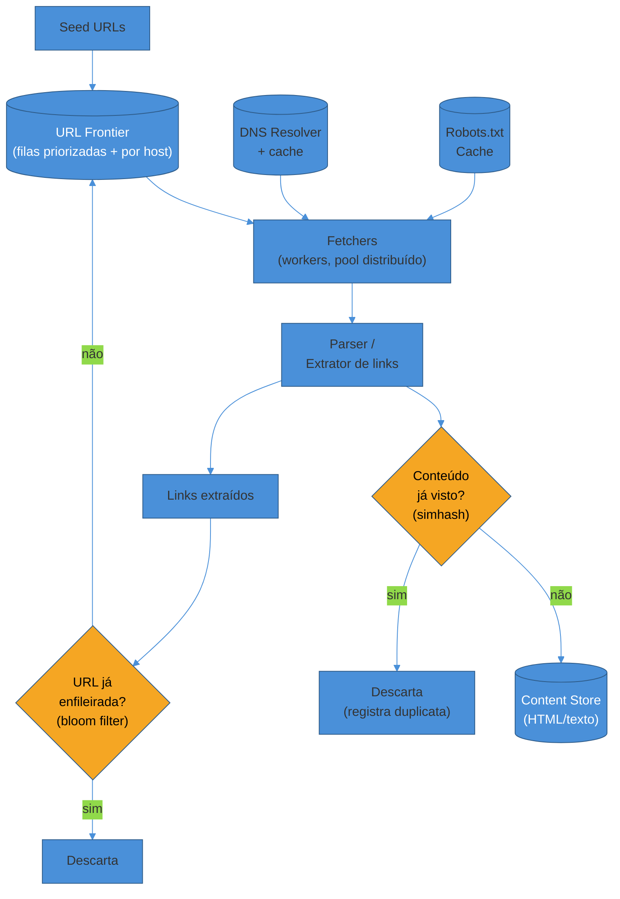
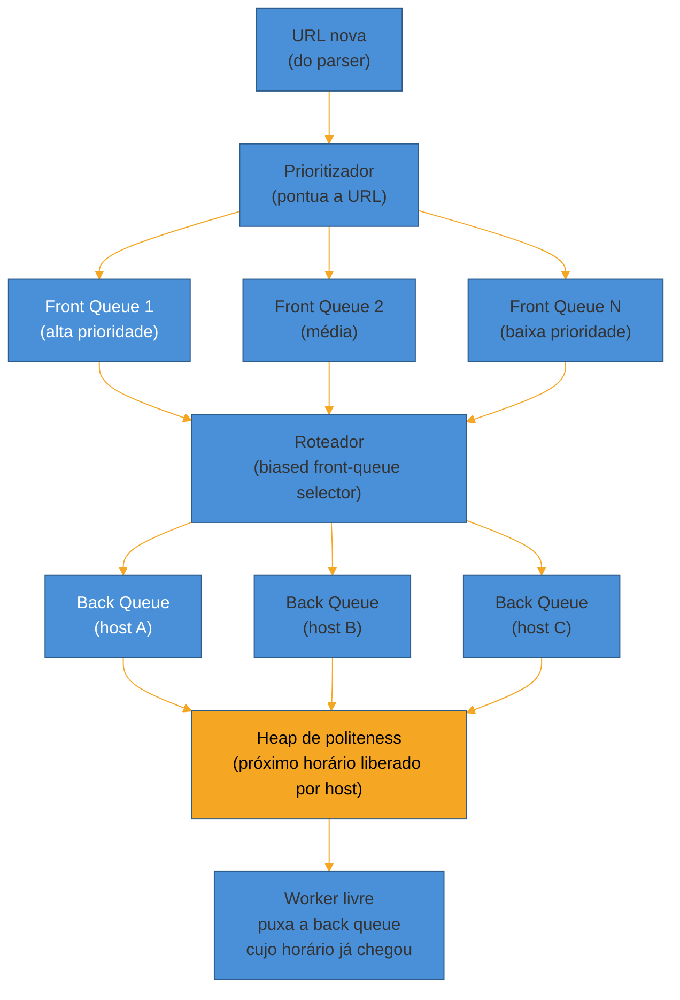
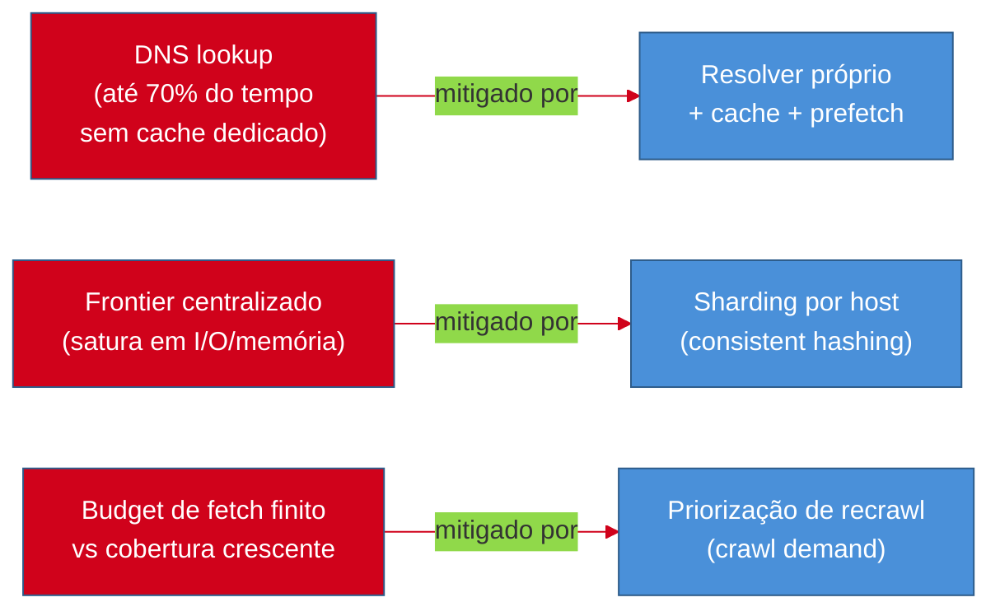

# Web Crawler

> [!abstract] TL;DR
> "Projete o Googlebot" pede um sistema que baixa **bilhões de páginas** da web pública, seguindo links, sem cair em armadilhas, sem derrubar os servidores que visita, e mantendo o conteúdo indexado **razoavelmente fresco**. Diferente do encurtador de URL — read-heavy, chave única, sem coordenação —, aqui o desafio central é o oposto: um **grafo desconhecido e adversarial** (a web) que você atravessa com **BFS distribuído**, mas sob duas restrições que brigam entre si: **politeness** (nunca bater no mesmo host em paralelo, respeitar `robots.txt` e `Crawl-delay`) e **paralelismo massivo** (manter milhares de workers ocupados simultaneamente). A peça que resolve essa tensão é a **URL Frontier** — não uma fila simples, mas o design de duas camadas do Mercator (Heydon & Najork, 1999): **front queues** por prioridade e **back queues** por host, uma por worker, garantindo que nenhum host receba duas requisições concorrentes. O segundo eixo é **dedup em escala**: já visitei esta URL? (bloom filter, porque um hash set de bilhões de URLs não cabe em memória) e este conteúdo já existe sob outra URL? (simhash, porque comparação byte-a-byte não escala e a web tem cópias, mirrors e paywalls disfarçados). O terceiro eixo é **robustez** — a web não coopera: calendários infinitos, URLs geradas dinamicamente, redirects em loop e páginas de 2GB são a regra, não a exceção, e o crawler precisa sobreviver a tudo isso sem travar nem devorar disco.

O entrevistador diz: "projete um web crawler, tipo o Googlebot."

A tentação, de novo, é começar simples: pega uma URL, baixa a página, extrai os links, adiciona numa fila, repete. É literalmente um BFS. Qualquer um que já implementou uma busca em largura sabe escrever isso em 20 linhas.

E é exatamente aí que a maioria dos candidatos perde o problema — porque o BFS ingênuo **funciona perfeitamente em um grafo de milhares de nós e falha cataclismicamente em um grafo de bilhões**. Ele bate várias vezes seguidas no mesmo servidor até derrubá-lo. Ele entra numa página de calendário que gera "próximo mês" infinitamente e nunca sai. Ele reprocessa a mesma URL sob dez variações de query string, redirect e maiúsculas. Ele armazena, com timestamp único, um conteúdo idêntico que apareceu em cinco domínios diferentes.

Nenhuma dessas falhas aparece testando com 50 páginas. Todas aparecem, garantidas, na escala de bilhões — que é justamente a escala que este walkthrough assume desde a primeira frase. Este design conduz o problema na ordem canônica: requisitos, estimativas, modelo de dados, diagrama macro, três deep dives (frontier & politeness, dedup, robustez a armadilhas), gargalos e as variações que o entrevistador tende a puxar depois.

## Requisitos

Como em todo walkthrough, o primeiro passo — coberto em [[1 - Framework de entrevista/02 - Clarificar requisitos|Clarificar requisitos]] — é separar o que o sistema *faz* do quão bem ele precisa fazer, e negociar escopo em voz alta antes de desenhar qualquer caixa.

**Requisitos funcionais (RF):**

- **Baixar páginas a partir de seeds.** O crawler recebe uma lista inicial de URLs (seeds) e começa a busca a partir delas.
- **Extrair links.** Parsear o HTML de cada página baixada e extrair todas as URLs referenciadas.
- **Seguir links descobertos.** Adicionar cada URL nova encontrada de volta ao processo de crawling — é isso que torna o sistema um BFS sobre o grafo da web.
- **Armazenar o conteúdo baixado.** O HTML (ou o texto extraído) de cada página vira um artefato persistido, disponível para quem consome o crawler a jusante (um indexador de busca, um pipeline de analytics, um arquivo).
- **Respeitar `robots.txt`.** Antes de baixar qualquer página de um host, consultar as regras de exclusão daquele host e obedecê-las — não é opcional, é a licença social (e legal, em várias jurisdições) para operar um crawler.

Vale negociar em voz alta: "vou focar em texto/HTML como o tipo de conteúdo principal, e tratar crawling de imagem/vídeo/PDF como extensão — o pipeline de download e o frontier são os mesmos, muda só o parser." É o tipo de escopo que sinaliza senioridade sem parecer fuga.

**Requisitos não-funcionais (RNF):**

- **Escala de bilhões de páginas.** A web indexável por buscadores é da ordem de **centenas de bilhões de documentos** — o índice do Google já foi declarado publicamente em ~400 bilhões de documentos em 2020, testemunho no processo antitruste *EUA vs. Google* — e mesmo um crawler de escopo mais modesto (um verticais de notícias, um crawler acadêmico) opera na casa de dezenas a centenas de milhões de páginas. Este walkthrough assume uma ordem de grandeza de **bilhões**, que é o número que a pergunta de entrevista normalmente ancora.
- **Politeness — não derrubar servidores.** Um único host não pode receber requisições concorrentes nem em rajada; a prática comum documentada por guias de crawling politico é um intervalo de **10-15 segundos entre requisições ao mesmo host** na ausência de uma diretiva `Crawl-delay` explícita no `robots.txt`.
- **Extensibilidade a novos tipos de conteúdo.** O pipeline de parsing deve aceitar novos formatos (imagem, PDF, vídeo) sem reescrever o núcleo de frontier/fetch/dedup.
- **Freshness / re-crawl.** Uma página crawleada uma vez fica obsoleta — o sistema precisa decidir *quando* revisitar uma URL já conhecida, e não apenas descobrir URLs novas.
- **Robustez a armadilhas e conteúdo malformado.** HTML quebrado, redirects em loop, páginas de tamanho absurdo, URLs geradas infinitamente (calendários, parâmetros de sessão) não podem travar o sistema nem consumir recursos sem limite.

> [!question]- Por que politeness é um requisito não-funcional e não um detalhe de implementação, tipo rate limiting genérico?
> Porque, diferente de um rate limit comum (proteger *o seu próprio* sistema), aqui o crawler está protegendo **milhões de sistemas de terceiros que não pediram para ser visitados**. Um crawler impolido não degrada a experiência de um usuário seu — ele pode efetivamente causar uma negação de serviço (DoS) não intencional num site pequeno que não tem capacidade de absorver 1000 requisições/segundo de um bot. Historicamente, é a causa mais comum de crawlers serem banidos por IP, processados, ou terem o próprio `User-Agent` bloqueado permanentemente. É por isso que politeness não é um "nice to have" de performance — é a diferença entre um crawler que pode operar na web pública e um que não pode.

Em uma frase: **o sistema inteiro é um BFS sobre um grafo de bilhões de nós que não coopera com você — e cada requisito não-funcional aqui existe para conter algum jeito específico desse grafo tentar te destruir.**

## Estimativas de escala (back-of-envelope)

Com os requisitos fixados, o passo — detalhado em [[1 - Framework de entrevista/03 - Estimativas de escala (back-of-envelope)|Estimativas de escala]] — é traduzir "bilhões de páginas" em números que guiam decisões de arquitetura: quantos workers? quanto storage? qual banda?

**Premissas de partida** (declaradas em voz alta):

- **Meta: 1 bilhão de páginas crawleadas por mês.** Um número redondo e defensável — abaixo da escala do índice completo do Google, mas grande o suficiente para forçar distribuição real.
- **Tamanho médio de página (HTML bruto): ~500 KB**, considerando que páginas modernas carregam bem mais que só texto (embora o crawler normalmente descarte assets binários pesados e capture principalmente o HTML/texto).
- **Prazo para completar um ciclo de crawl: 30 dias** — a "primeira passada" da meta mensal.

**Páginas por segundo necessárias:**

$$ \frac{1.000.000.000 \text{ páginas}}{30 \times 86.400 \text{ s}} \approx 386 \text{ páginas/s (média)}
$$

Com um **peak factor de ~2-3x** para absorver variação de carga ao longo do dia (prática comum de estimativa citada em guias como Hello Interview):

$$ 386 \times 2,5 \approx 965 \text{ páginas/s no pico}
$$

Quase mil páginas por segundo não é algo que um único fetcher single-threaded processa — isso é exatamente o número que justifica um **pool de workers distribuído**, na casa de centenas a milhares de threads/processos concorrentes, cada um fazendo uma requisição HTTP de cada vez (e cada requisição levando, tipicamente, algumas centenas de milissegundos a poucos segundos, dominado por latência de rede e não por CPU).

**Storage total:**

$$ 1.000.000.000 \text{ páginas/mês} \times 500 \text{ KB} = 500 \text{ TB/mês}
$$

Ao longo de um ano de operação contínua, sem nenhuma retenção seletiva:

$$ 500 \text{ TB} \times 12 \approx 6 \text{ PB/ano}
$$

Um número na casa dos **petabytes** — inviável num único servidor, mas rotineiro para um object store distribuído (S3, GCS, HDFS) projetado exatamente para esse volume, com replicação e tiers de custo (dados antigos migram para storage mais barato e mais lento).

**Banda necessária:**

$$ 965 \text{ páginas/s} \times 500 \text{ KB} \approx 482 \text{ MB/s} \approx 3,86 \text{ Gbps no pico}
$$

Esse número por si só já descarta rodar o crawler de um único datacenter pequeno com um único uplink — é a ordem de grandeza que justifica múltiplos pontos de saída de rede (multi-região ou multi-AZ) e, potencialmente, negociar peering direto com provedores de trânsito, algo que crawlers de produção (Googlebot, Common Crawl) de fato fazem.

Em uma frase: **quase mil páginas/segundo, 6 petabytes por ano e ~4 Gbps de banda no pico — os três números confirmam que este não é um sistema que roda numa máquina, é um sistema distribuído desde o primeiro componente.**

## API, fluxo e modelo de dados

O "crawler" não tem uma API pública tradicional como o encurtador de URL (não há um cliente HTTP externo fazendo `POST`/`GET`) — o "contrato" aqui é o **loop interno** que cada worker executa, e o modelo de dados das duas estruturas que sustentam esse loop: a **URL Frontier** e o **content store**.

**O loop do crawler**, por worker:

```
enquanto True:
    url = frontier.pop_next()                 # respeitando prioridade + politeness
    if not robots_cache.is_allowed(url):
        continue                                # pula, log de "disallowed"

    html = fetcher.download(url)                # timeout + limite de tamanho
    if html is None:
        frontier.mark_failed(url)               # retry com backoff, ou descarte
        continue

    if content_seen.is_duplicate(html):          # simhash contra conteúdo já visto
        content_store.link_duplicate(url, html)  # registra sem re-armazenar
        continue

    content_store.save(url, html)
    links = parser.extract_links(html)

    for link in links:
        normalized = normalizer.canonicalize(link)
        if not url_seen.contains(normalized):     # bloom filter
            url_seen.add(normalized)
            frontier.push(normalized, priority=score(normalized))
```

**Modelo de dados — três estruturas centrais:**

| Estrutura | Papel | Tecnologia típica |
|---|---|---|
| **URL Frontier** | Fila de URLs a visitar, com prioridade e politeness | Redis (filas em memória) ou Kafka particionado por host, com overflow em disco |
| **Seen URLs** | "Já enfileirei esta URL alguma vez?" | Bloom filter distribuído (Redis Bloom, ou implementação própria) |
| **Content Store** | HTML/texto já baixado, indexável a jusante | Object store (S3/GCS/HDFS) + metadata em banco (KV ou relacional) |
| **Robots cache** | `robots.txt` de cada host, com TTL | Cache em memória (Redis), refresh periódico |

O ponto que vale narrar: nenhuma dessas quatro estruturas é um simples banco relacional — cada uma tem um padrão de acesso e uma restrição de escala tão específica (fila com prioridade, teste de pertencimento probabilístico, blob storage, cache com TTL) que a escolha de tecnologia decorre diretamente do papel, não de preferência.

## Diagrama macro

Com o loop e o modelo de dados fixados, a visão consolidada — do seed até o conteúdo armazenado, com o ciclo de realimentação que faz o crawler se auto-alimentar:



Repare no ciclo: **a saída do parser realimenta o frontier**, o que torna este sistema, estruturalmente, um grafo que se descobre em tempo real — diferente dos walkthroughs anteriores, aqui não existe um conjunto fixo de entidades para paginar ou cachear; o próprio espaço de trabalho cresce enquanto o sistema roda. É esse detalhe que justifica por que a URL Frontier — o próximo deep dive — é a peça mais crítica do design inteiro: ela não é só uma fila, é o componente que decide, a cada instante, **qual fração desse grafo infinito o sistema olha primeiro**.

## Deep dives

Três componentes concentram praticamente toda a dificuldade real deste design: **como a URL Frontier concilia prioridade e politeness sem serializar tudo**, **como saber se uma URL ou um conteúdo já foi visto em escala de bilhões**, e **como sobreviver às armadilhas que a web genuinamente contém**. Uma entrevista de 45 minutos raramente cabe os três em profundidade total — mas vale apresentar os três e deixar o entrevistador escolher onde aprofundar, o que já sinaliza que você mapeou o espaço do problema.

### Deep dive 1 — URL Frontier: prioridade e politeness

A pergunta que expõe candidatos que só decoraram "BFS com uma fila": **se o frontier fosse uma fila FIFO simples, o que acontece?**

Resposta: o sistema derruba servidores. Se mil links de um mesmo domínio (imagine uma rede de blogs no mesmo host, ou um site com paginação profunda) entram na fila em sequência, e você tem mil workers livres, todos eles vão puxar URLs desse mesmo host **ao mesmo tempo** — exatamente o cenário de negação de serviço que o requisito de politeness proíbe.

A solução canônica — descrita no paper seminal de **Heydon & Najork sobre o crawler Mercator (1999)**, ainda a referência-âncora para este problema — separa o frontier em **duas camadas de filas**, resolvendo prioridade e politeness como dois problemas distintos:



**Front queues — resolvem prioridade.** Cada URL nova recebe uma pontuação (PageRank estimado, frequência histórica de mudança, profundidade a partir do seed, ou simplesmente uma heurística de importância do domínio) e é roteada para uma das *N* filas front, uma por faixa de prioridade. Um seletor com viés (*biased front-queue selector*) escolhe de qual front queue puxar a seguir, favorecendo as de prioridade mais alta com maior frequência — sem nunca deixar as de prioridade baixa passarem fome indefinidamente.

**Back queues — resolvem politeness.** Cada back queue corresponde a **exatamente um host** em processamento no momento. A regra de ouro do Mercator: **cada back queue não-vazia está associada a um único host, e nenhum host tem mais de uma back queue**, o que garante, por construção, que **no máximo um worker por vez** está buscando páginas daquele host. Um **heap de politeness** guarda, por back queue, o próximo horário em que aquele host pode ser tocado de novo — um worker livre consulta o topo do heap e só puxa da back queue cujo tempo de espera já expirou.

Quando uma back queue esvazia, ela é **reabastecida** puxando a próxima URL disponível de uma front queue (respeitando a prioridade) e, criticamente, **verificando que o host daquela URL não está já associado a outra back queue ativa** — se estiver, a URL espera; senão, uma nova back queue "nasce" para aquele host. Heydon & Najork recomendam, como regra prática, manter cerca de **3x mais back queues que threads de crawling** — folga suficiente para manter os workers ocupados mesmo quando alguns hosts estão temporariamente em cooldown de politeness.

> [!question]- Por que não simplesmente usar um rate limiter genérico por host, tipo token bucket, em vez desse esquema de duas filas?
> Um rate limiter (o padrão coberto em [[3 - Padrões recorrentes/04 - Rate Limiting|Rate Limiting]]) resolveria *quantas* requisições por segundo um host recebe, mas não resolve *quem decide a ordem* nem *como manter todos os workers ocupados enquanto a maioria dos hosts está em cooldown*. O problema aqui não é só "não exceda N req/s por host" — é "com centenas de hosts em cooldown simultâneo, mantenha os workers *livres* ocupados processando hosts que *não* estão em cooldown, sem fila-cega". O design de duas camadas resolve isso: a fila de politeness (back queues + heap) informa exatamente quais hosts estão liberados agora, e o roteador nunca deixa um worker ocioso enquanto existir qualquer back queue liberada — algo que um rate limiter isolado, sem essa estrutura de fila, não orquestra sozinho.

**Respeitando `robots.txt` e `Crawl-delay`.** Antes de qualquer fetch, o worker consulta um cache de `robots.txt` por host (populado sob demanda, com TTL — recuperar `robots.txt` a cada requisição seria, ironicamente, impolido). Se o arquivo declarar um `Crawl-delay: N`, esse valor sobrescreve o intervalo default do heap de politeness para aquele host especificamente — hosts mais sensíveis pedem esperas maiores, e o crawler obedece.

> [!warning] Tratar politeness como "adicionar um `sleep()`" no worker
> **O que acontece:** o time implementa "politeness" como um `time.sleep(10)` fixo antes de cada requisição, dentro do próprio worker. **Por quê:** parece resolver o problema — o worker realmente espera 10 segundos entre requisições. Mas isso só funciona **se cada worker for dedicado a um único host**, o que não é verdade num pool compartilhado: com mil workers livres e um roteamento ingênuo, nada impede que dois workers diferentes peguem URLs do mesmo host ao mesmo tempo, cada um com seu próprio `sleep` local — o host ainda recebe rajadas concorrentes. **Como evitar:** politeness precisa ser uma propriedade **do frontier**, não do worker — é exatamente o que o design de back queue-por-host garante estruturalmente: a associação 1:1 entre host e back queue impede, por construção, que dois workers processem o mesmo host simultaneamente, independente de quantos workers existam no pool.

### Deep dive 2 — dedup de URL e de conteúdo em escala de bilhões

Duas perguntas de dedup, diferentes uma da outra, aparecem neste design — e confundir as duas é um erro comum.

**"Já enfileirei esta URL antes?"** — dedup de URL. Sem essa checagem, o mesmo link (presente em múltiplas páginas, o que é a norma na web — praticamente toda página linka de volta para a home, por exemplo) seria enfileirado repetidamente, inflando o frontier sem limite e re-crawleando a mesma página inúmeras vezes.

A solução ingênua — um hash set (ou uma tabela em banco) com todas as URLs já vistas — não escala: em bilhões de URLs, mesmo um hash compacto de 8 bytes por entrada chegaria a dezenas de gigabytes só para o índice, sem contar overhead de estrutura. A alternativa padrão é o **bloom filter**: uma estrutura probabilística que responde "definitivamente não visto" ou "provavelmente já visto", com uma taxa configurável de falsos positivos, ocupando uma fração do espaço de um set exato — a ordem de grandeza citada com frequência nesse contexto é **~12 GB de bloom filter para rastrear 10 bilhões de URLs**, contra ~1 TB que um hash set exato ocupraria para o mesmo volume.

O trade-off do bloom filter é justamente esse falso positivo: ocasionalmente, uma URL nova será classificada como "já vista" quando na verdade não foi, e o crawler vai **perder essa página** — nunca vai enfileirá-la. Isso é aceitável no contexto de um crawler porque (a) a taxa de falso positivo é ajustável (mais bits por elemento = menos falsos positivos, ao custo de mais memória) e tipicamente mantida abaixo de 1%, e (b) perder uma fração pequena de páginas entre bilhões tem impacto desprezível na cobertura agregada — o oposto do que aconteceria, por exemplo, num sistema financeiro, onde um falso positivo teria consequência real.

**"Este conteúdo já existe, sob outra URL?"** — dedup de conteúdo, um problema estruturalmente diferente. A mesma página frequentemente vive em múltiplas URLs (parâmetros de tracking, `www.` vs sem `www.`, mirrors, sindicação de conteúdo, paywalls que servem o mesmo artigo por dois caminhos) — e comparar o conteúdo byte-a-byte para descobrir isso não escala: um checksum exato (SHA-256, por exemplo) só detecta cópias **idênticas**, e a maioria das duplicatas reais na web é **quase** idêntica — mesmo artigo com um banner de anúncio diferente, ou timestamp de geração na página.

A técnica padrão aqui é **simhash** — uma função de hash localidade-sensível (diferente de um hash criptográfico, que é desenhado para que a menor mudança no input produza um hash totalmente diferente): documentos parecidos geram simhashes com **distância de Hamming pequena** entre si. Um fingerprint de **64 bits** é o tamanho comum citado na literatura (o framework CopyCat, por exemplo, usa 64 bits com um limiar de 3 bits de distância de Hamming para classificar como duplicata), e comparar dois simhashes é uma operação de XOR + contagem de bits — trivialmente rápida, mesmo contra um índice de bilhões de fingerprints já vistos (usando técnicas de particionamento do espaço de bits para não precisar comparar contra todos).

| | Dedup de URL | Dedup de conteúdo |
|---|---|---|
| Pergunta | Já enfileirei esta URL? | Este conteúdo já existe sob outra URL? |
| Estrutura | Bloom filter | Simhash + índice de fingerprints |
| Falha típica | Falso positivo (perde a URL) | Falso negativo (armazena duplicata) ou falso positivo (descarta conteúdo distinto) |
| Momento da checagem | Antes de enfileirar (na extração de links) | Depois de baixar e parsear (antes de persistir) |

> [!question]- Por que não usar simhash também para a dedup de URL, já que é mais poderoso?
> Porque são problemas de natureza diferente. URLs são strings curtas e exatas — ou você já a viu, ou não; não existe "URL quase igual" que precise de comparação por similaridade (URLs *parecidas* como `?utm_source=x` vs `?utm_source=y` são resolvidas por **normalização/canonicalização** antes da checagem, não por hashing difuso). Conteúdo, ao contrário, é grande e varia de forma sutil entre cópias legítimas — exigir igualdade exata (via bloom filter, que também é binário: visto ou não) geraria uma explosão de "duplicatas não detectadas" porque nenhum par de páginas reais é *byte-a-byte* idêntico. Usar simhash para URL seria over-engineering caro para um problema que já é resolvido, de forma mais barata, por um bloom filter e por normalização de URL.

> [!warning] Esquecer a normalização de URL antes de qualquer dedup
> **O que acontece:** o time implementa bloom filter e simhash corretamente, mas o frontier ainda enfileira, na prática, um volume de URLs muito maior do que o esperado. **Por quê:** a mesma página é referenciada de formas textualmente diferentes — `http://Exemplo.com/pagina`, `https://exemplo.com/pagina/`, `https://exemplo.com/pagina?utm_source=twitter`, `https://exemplo.com/Pagina` — e um bloom filter compara **strings**, não significado. Sem normalização, cada variação passa pelo filtro como "nunca visto" e o sistema desperdiça um fetch inteiro numa página que, semanticamente, já foi baixada. **Como evitar:** aplicar uma etapa de **canonicalização** antes de qualquer checagem de dedup — lowercase no host, remoção de parâmetros de tracking conhecidos (`utm_*`, `fbclid`, `gclid`), remoção de fragmentos (`#`), normalização de trailing slash, resolução de `.` e `..` no path. É trabalho de baixo glamour, mas sem ele o bloom filter mede o volume errado desde a entrada.

### Deep dive 3 — armadilhas de spider e robustez

A web não é um grafo bem-comportado — ela contém, ativa ou passivamente, estruturas desenhadas (ou surgidas por acidente) para fazer um crawler nunca parar.

**Spider traps.** Um *spider trap* é um conjunto de páginas — intencional ou não — que gera um número efetivamente infinito de URLs distintas, prendendo o crawler num ramo do grafo para sempre. O exemplo canônico, citado de forma consistente na literatura sobre o tema, é o **calendário dinâmico**: uma página `/calendario?mes=07&ano=2026` que sempre linka para `/calendario?mes=08&ano=2026`, indefinidamente para o futuro — cada mês é uma URL tecnicamente nova, então tanto o bloom filter quanto uma checagem simples de "já visitei" deixam passar cada uma, e o crawler nunca sai desse ramo.

A mitigação não é uma única técnica, é uma combinação:

- **Limite de profundidade por domínio** — um teto no número de saltos a partir do seed (ou da home) que o crawler segue dentro de um mesmo host antes de desistir daquele ramo.
- **Limite de URLs por domínio, por período** — um budget máximo de páginas que o crawler aceita baixar de um único host por dia/semana, independente de quantos links novos aquele host continue gerando.
- **Detecção estrutural de padrões repetitivos** — se URLs geradas por um host seguem um padrão sintático quase idêntico (mesmo path, parâmetro numérico incrementando) sem que o conteúdo mude de forma significativa (medido via simhash entre páginas do mesmo padrão), o crawler pode inferir uma armadilha e cortar aquele ramo.
- **Robots.txt como primeira linha de defesa** — sites que sabem que têm uma armadilha em `/calendario/` costumam declarar isso em `robots.txt`; um crawler educado que respeita o arquivo nunca entra nela em primeiro lugar. É um dos motivos pelos quais politeness e robustez a armadilhas não são requisitos independentes — obedecer `robots.txt` já elimina boa parte do problema antes de precisar de heurística.

**Páginas gigantes.** Um crawler que baixa sem limite de tamanho é vulnerável a uma página (maliciosa ou simplesmente mal configurada) de gigabytes, que consome memória e banda desproporcionais. A mitigação padrão é um **limite de tamanho de download** (truncar ou abortar acima de, por exemplo, alguns MB de HTML) — o conteúdo relevante para indexação raramente está nos últimos megabytes de uma página de texto de qualquer forma.

**Links quebrados, timeouts e redirects em loop.** Toda requisição de fetch precisa de um **timeout** (evitar que um worker fique preso esperando um servidor lento indefinidamente) e um **limite de redirects seguidos** (um `A → B → A` de redirects, seja por erro de configuração ou má-fé, travaria o fetcher para sempre sem esse limite). Falhas de rede (DNS não resolve, conexão recusada, 5xx) entram numa política de **retry com backoff exponencial e limite de tentativas**, e depois de esgotadas, a URL é marcada como falha e não retorna ao frontier até um próximo ciclo de re-crawl.

> [!warning] Confundir "URL nova" com "trabalho legítimo"
> **O que acontece:** o crawler trata toda URL recém-descoberta (que passou pelo bloom filter) como um item de trabalho válido, sem nenhum limite de orçamento por host. **Por quê:** o bloom filter só responde "eu já vi esta string exata?" — ele não tem nenhuma noção de "este host está gerando URLs de forma patológica". Um spider trap gera, por definição, URLs sempre novas, então ele nunca vai "parecer suspeito" aos olhos do bloom filter — cada URL individual é, tecnicamente, legítima e nunca vista. **Como evitar:** o limite de URLs por domínio (budget) precisa existir como uma camada **separada e independente** do bloom filter, exatamente porque o bloom filter é estruturalmente incapaz de detectar esse padrão sozinho — ele resolve "URL repetida", não "host patológico".

## Gargalos & trade-offs

Cada componente discutido introduz um ponto de fragilidade que vale nomear proativamente — o tipo de pergunta que aparece na fase de trade-offs & evolução (ver [[1 - Framework de entrevista/05 - Do diagrama macro ao deep dive e trade-offs|Do diagrama macro ao deep dive e trade-offs]]).

**DNS como gargalo silencioso.** Em escala — centenas a milhares de requisições/segundo espalhadas por milhões de domínios distintos — a resolução de DNS deixa de ser um detalhe e vira um dos maiores consumidores de tempo do sistema; pesquisa histórica sobre crawlers de larga escala relata que lookups de DNS chegaram a consumir **até 70% do tempo de cada thread de fetch** antes de um resolver dedicado ser introduzido. A mitigação padrão é implementar um **resolver de DNS próprio, com cache agressivo e prefetching**, em vez de depender de resolvers públicos genéricos — que, a milhares de queries/segundo, começam a rate-limitar o crawler em minutos. Um resolver caseiro também permite estratégias como **sharding por domínio** (cada instância do resolver mantém quente o cache de um subconjunto de hosts) e prefetch (resolver o DNS de uma URL assim que ela entra no frontier, antes mesmo de um worker ficar livre para buscá-la).

**Distribuição do frontier — sharding por host.** Um frontier centralizado numa única máquina, mesmo com o design de duas camadas do Mercator, eventualmente satura em I/O e memória na escala de bilhões de URLs pendentes. A evolução natural é **shardear o frontier por host** (mesma lente de [[2 - Building blocks/04 - Sharding e Consistent Hashing|Sharding e Consistent Hashing]]) — cada shard do frontier é responsável por um subconjunto de hosts, roteado por hash consistente do domínio, o que preserva de graça a propriedade de politeness (todas as URLs de um mesmo host caem sempre no mesmo shard, então a garantia de "no máximo um worker por host" continua válida dentro daquele shard).

**Freshness vs. cobertura.** Um crawler tem orçamento finito de fetches por dia — cada fetch gasto revisitando uma página já conhecida é um fetch que não descobre conteúdo novo. A tensão entre "manter o índice fresco" e "ampliar a cobertura" é gerida via **priorização de re-crawl**: páginas que historicamente mudam com frequência (notícias, e-commerce com estoque variável) recebem intervalo de re-crawl curto; páginas estáticas (um PDF acadêmico de 2018, por exemplo) recebem intervalo longo ou nenhum re-crawl automático. O próprio Google documenta publicamente essa lógica sob o nome de **crawl budget** — determinado por *crawl rate limit* (quanto o host aguenta sem degradar) e *crawl demand* (quão valioso/frequentemente mutável é o conteúdo) — e prioriza recrawl de páginas com mais links internos e externos apontando para elas, como proxy de importância.

**Storage — tiering por idade e acesso.** Dos ~6 PB/ano estimados, a fração efetivamente "quente" (conteúdo recém-baixado, ainda sendo processado por um indexador a jusante) é pequena frente ao volume histórico acumulado. A prática padrão é um **storage em camadas** — dados recentes em tiers rápidos (SSD-backed), dados antigos migrados automaticamente para tiers mais baratos e mais lentos (cold storage), com o metadata (URL, timestamp, hash, localização do blob) sempre acessível rapidamente independente de onde o blob em si esteja fisicamente.



## Variações de follow-up

O entrevistador raramente para no design básico — as extensões abaixo são as mais comuns depois de um crawler genérico bem conduzido.

**Crawl focado / incremental.** Em vez de tentar cobrir a web inteira, o crawler é direcionado a um domínio temático (um crawler de e-commerce, um crawler acadêmico) ou opera de forma incremental sobre um conjunto de sites já conhecidos, priorizando **mudanças** em vez de descoberta. Muda o critério de priorização do frontier — de "importância geral" para "relevância temática" ou "probabilidade de ter mudado desde a última visita" — mas a espinha (frontier, dedup, fetch) permanece a mesma.

**Detecção de spam e conteúdo de baixa qualidade.** Um crawler de produção não quer indexar farms de conteúdo gerado automaticamente ou páginas de spam SEO. Isso normalmente vira um **classificador** (heurístico ou de ML) rodando depois do parsing e antes do armazenamento — analisa densidade de links, proporção de texto vs. boilerplate, e sinais de reputação de domínio — descartando ou rebaixando a prioridade de recrawl de conteúdo suspeito.

**Renderização de JavaScript (headless).** Uma fração crescente da web moderna renderiza conteúdo via JavaScript no cliente — um fetch HTTP simples devolve um HTML quase vazio (`<div id="root"></div>`), e o conteúdo real só aparece depois da execução do JS. A mitigação é rodar um **navegador headless** (Chromium via Puppeteer/Playwright) para um subconjunto de páginas identificadas como client-side-rendered, ao custo de um fetch **ordens de magnitude mais caro** em CPU e tempo (segundos, contra centenas de milissegundos de um fetch HTTP puro) — o que normalmente empurra esse caminho para um **pool de workers separado**, dimensionado à parte, em vez de aplicar renderização headless a todo o tráfego por padrão.

**Priorização por PageRank (ou proxy equivalente).** Em vez de uma heurística simples de importância, o prioritizador das front queues pode usar um score derivado da estrutura de links do próprio grafo já descoberto (quantos e quais domínios linkam para esta URL) — uma versão simplificada do algoritmo PageRank original do Google, calculada de forma incremental/aproximada sobre o grafo parcial que o crawler já viu, em vez do cálculo exato sobre o grafo completo (que exigiria conhecer a web inteira de antemão, um paradoxo para um sistema cujo propósito é descobri-la).

## Em entrevista

O web crawler costuma aparecer depois de o candidato já ter passado por um ou dois designs mais "CRUD" (encurtador de URL, sistema de chat) — e o salto de dificuldade real está em que **o grafo de entrada é desconhecido e adversarial**, algo que nenhum dos designs anteriores da trilha exige lidar.

O roteiro de condução que tende a sinalizar senioridade:

1. **Negocie escopo de conteúdo cedo.** "Vou focar em HTML/texto; imagem, vídeo e PDF ficam como extensão do mesmo pipeline" evita perder tempo desenhando parsers especializados antes de fechar o núcleo.
2. **Ofereça a URL Frontier como o deep dive proativamente.** É, de longe, o componente mais rico e mais citado (Mercator) deste design — sinalizar que você sabe que "fila simples" não basta, antes mesmo de ser perguntado, é um dos green flags mais baratos de conquistar neste walkthrough específico.
3. **Distinga dedup de URL de dedup de conteúdo explicitamente.** É um erro comum tratar os dois como o mesmo problema; nomeá-los como duas perguntas diferentes, com duas estruturas diferentes (bloom filter vs. simhash), é um sinal de profundidade real.
4. **Traga spider traps sem ser perguntado.** É a pergunta de robustez mais previsível deste design ("o que acontece se o crawler entrar num loop infinito?") — antecipá-la evita ser pego de surpresa e mostra que você já pensou em modos de falha, não só no caminho feliz.
5. **Feche com a tensão freshness vs. cobertura.** É o trade-off de mais alto nível do sistema — todo o resto (frontier, dedup, robustez) serve para permitir cobrir mais e revisitar melhor, mas o orçamento de fetch é sempre finito, e essa tensão nunca desaparece completamente.

> [!question]- Preciso saber calcular PageRank de verdade para essa entrevista?
> Não. O que se espera é saber **que** priorização por estrutura de links existe como estratégia (versus, por exemplo, ordem de descoberta ou round-robin simples), e por que ela é atrativa (usar a própria topologia do grafo que o crawler está construindo como sinal de importância). Implementar o algoritmo de PageRank do zero, com iteração até convergência sobre uma matriz de transição, é matéria de uma entrevista de algoritmos distribuídos, não deste walkthrough — citar o conceito e o motivo de usá-lo já cobre o sinal esperado aqui.

## Como explicar em inglês

> "The core tension in a web crawler is that you're doing a breadth-first search over a graph you don't control and that's actively adversarial — it has infinite loops, malformed pages, and it can't tolerate you hammering any single host.
>
> The centerpiece of the design is the URL frontier — not a simple queue, but the two-tier design from the Mercator crawler: front queues that handle prioritization, and back queues that handle politeness, with a strict one-host-per-back-queue invariant so no two workers ever hit the same host concurrently.
>
> On deduplication, I'd separate two different questions: have I ever queued this URL — solved with a bloom filter, because an exact set doesn't fit in memory at billions of URLs — versus does this content already exist under a different URL, which needs simhash, a locality-sensitive hash where similar documents produce similar fingerprints, because exact-match hashing misses near-duplicates.
>
> And I'd proactively bring up spider traps — dynamically generated URLs, like an infinite calendar — because a bloom filter alone can't catch them; you need a separate per-domain crawl budget as a second line of defense."

| PT | EN |
|----|----|
| Web crawler / rastreador | Web crawler / spider |
| URL Frontier | URL frontier |
| Politeness | Politeness |
| Front queue / back queue | Front queue / back queue |
| Bloom filter | Bloom filter |
| Simhash / hash localidade-sensível | Simhash / locality-sensitive hash |
| Distância de Hamming | Hamming distance |
| Armadilha de spider | Spider trap |
| Orçamento de crawl | Crawl budget |
| Freshness (frescor do índice) | Freshness |
| Re-crawl | Recrawl |
| Renderização headless | Headless rendering |
| Grafo adversarial | Adversarial graph |

## O que vem a seguir

O crawler resolveu um grafo desconhecido e adversarial sob restrição de politeness. O próximo walkthrough troca esse problema por outro que também gira em torno de escala de dados e distribuição, mas com uma garantia completamente diferente no centro: um **key-value store distribuído** onde a pergunta deixa de ser "como descubro dados que não conheço" e passa a ser "como replico e particiono dados que conheço, mantendo disponibilidade sob partição de rede — consistent hashing, quorum, e o que acontece quando dois nós discordam sobre o valor mais recente de uma chave".

- [[08 - Distributed Key-Value Store]] — consistent hashing, quorum, replicação, gossip, vector clocks

## Veja também

- [[System Design/index|System Design]] — o galho-pai e o mapa da trilha
- [[4 - Walkthroughs/index|Walkthroughs]] — os outros sete designs deste sub-galho
- [[06 - Distributed File Storage]] — o walkthrough anterior: chunking, metadata service e dedup de conteúdo aplicados a um sistema de sincronização de arquivos
- [[05 - Message queues e processamento assíncrono]] — desacoplar fetch de processamento a jusante (parsing, indexação) via fila
- [[04 - Sharding e Consistent Hashing]] — a técnica por trás da distribuição do frontier por host
- [[04 - Rate Limiting]] — politeness é, estruturalmente, rate limiting por host aplicado a um sistema que você mesmo está operando contra terceiros
- [[02 - Caching]] — o cache de DNS e de `robots.txt` seguem o mesmo padrão cache-aside discutido no walkthrough do encurtador de URL

## Fontes

- **Alex Xu, Sahn Lam** — *System Design Interview – An Insider's Guide, Vol. 2*, cap. 9 (Design a Web Crawler) — a referência-âncora deste walkthrough: requisitos (escalabilidade, robustez, politeness, extensibilidade), URL Frontier, DNS resolver, Content Seen.
- **Donne Martin** — [*System Design Primer*](https://github.com/donnemartin/system-design-primer) — vocabulário de referência para os building blocks de sistemas distribuídos aplicados aqui.
- **Allan Heydon, Marc Najork** — [*Mercator: A Scalable, Extensible Web Crawler*](https://courses.cs.washington.edu/courses/cse454/15wi/papers/mercator.pdf), 1999 — o paper original do design de front queues (prioridade) + back queues (politeness, um host por fila) citado no primeiro deep dive.
- **Hello Interview** — [*Design a Web Crawler*](https://www.hellointerview.com/learn/system-design/problem-breakdowns/web-crawler) — breakdown moderno (2024+) com estimativas de escala e discussão de DNS como bottleneck.
- **Gurmeet Singh Manku (Google)** — [*Detecting Near-Duplicates for Web Crawling*](https://research.google.com/pubs/archive/33026.pdf) — o paper de referência sobre simhash aplicado a dedup de conteúdo em crawlers, citado no segundo deep dive.
- **oneuptime.com** — [*How to Use Redis Bloom Filters for URL Deduplication in Crawlers*](https://oneuptime.com/blog/post/2026-03-31-redis-bloom-filter-url-deduplication/view), 2026 — a comparação de memória bloom filter (~12GB/10bi URLs) vs. hash set exato (~1TB) citada no segundo deep dive.
- **Wikipedia** — [*Spider trap*](https://en.wikipedia.org/wiki/Spider_trap) — definição e exemplos de armadilhas de spider (calendários dinâmicos) citados no terceiro deep dive.
- **Google for Developers** — [*Crawl Budget Management*](https://developers.google.com/crawling/docs/crawl-budget) e [*What Crawl Budget Means for Googlebot*](https://developers.google.com/search/blog/2017/01/what-crawl-budget-means-for-googlebot) — a definição oficial de crawl rate limit e crawl demand citada na seção de gargalos.
