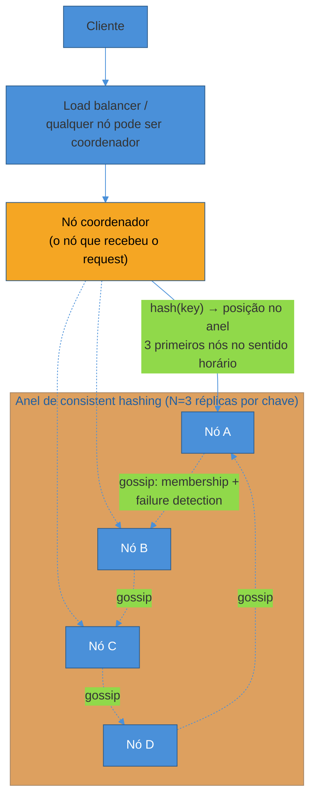
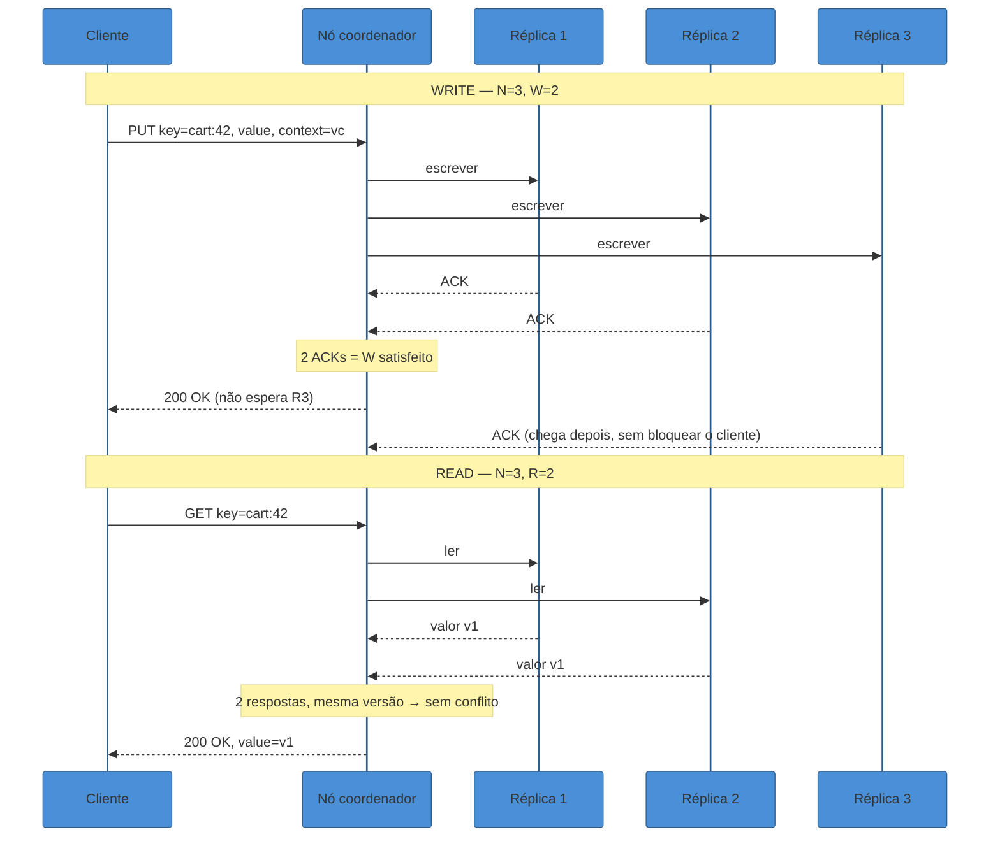
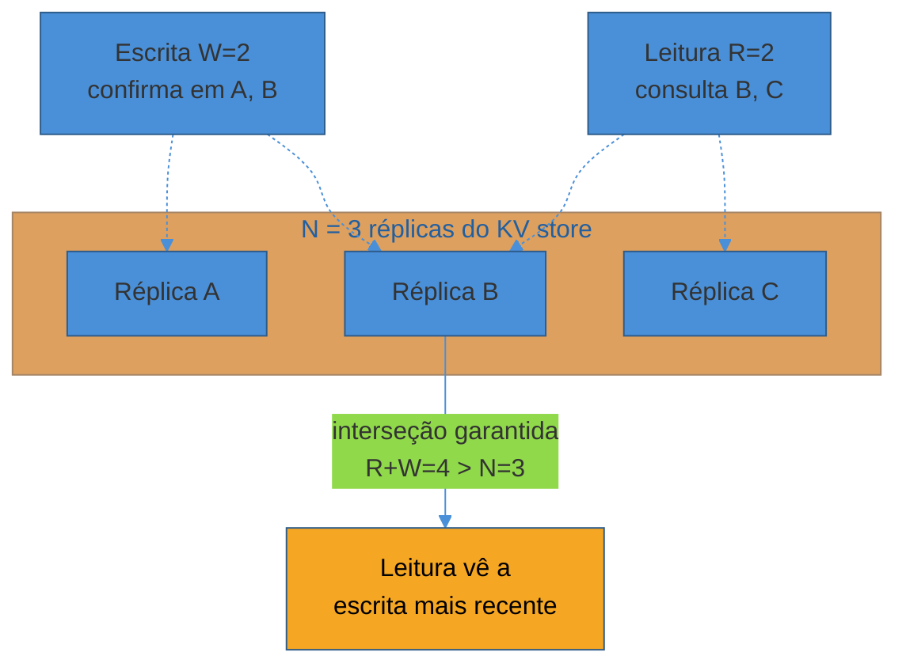
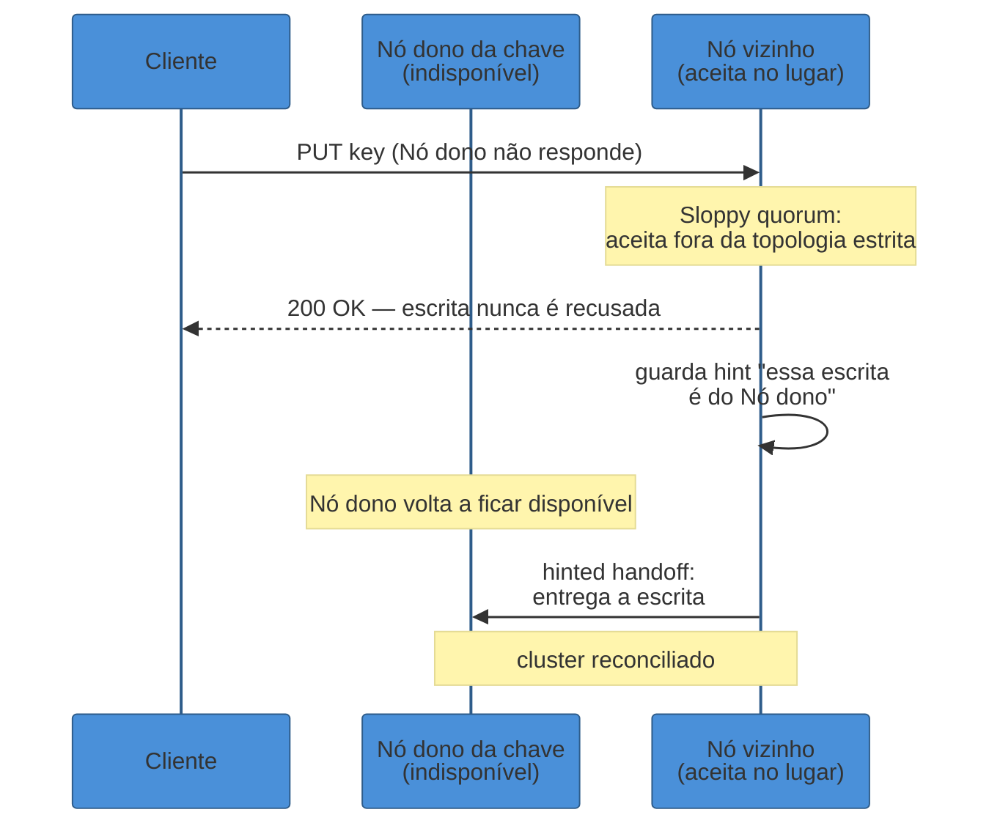
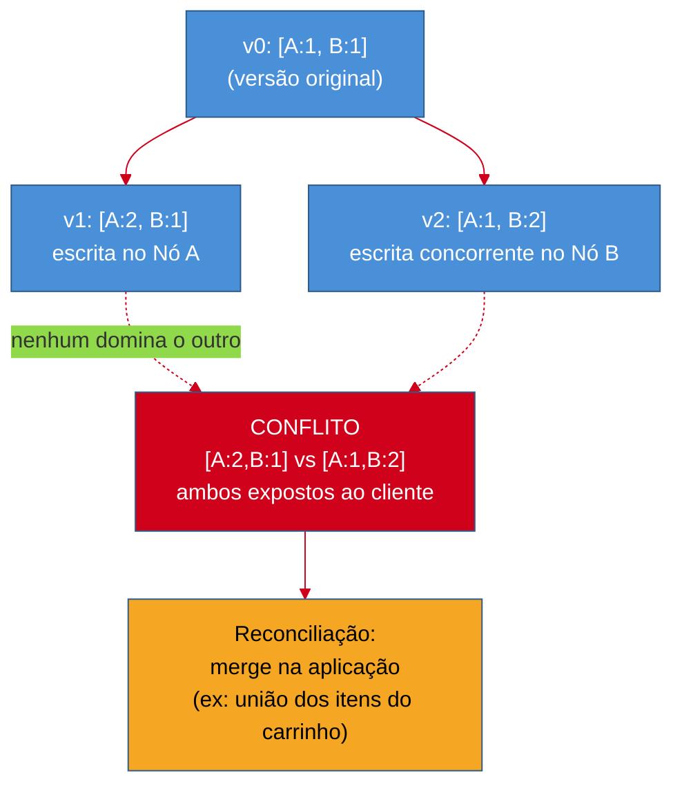
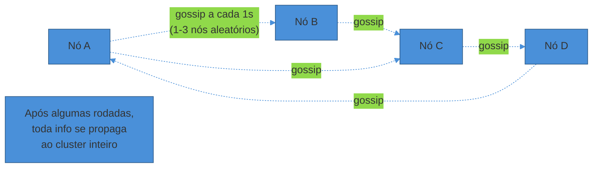
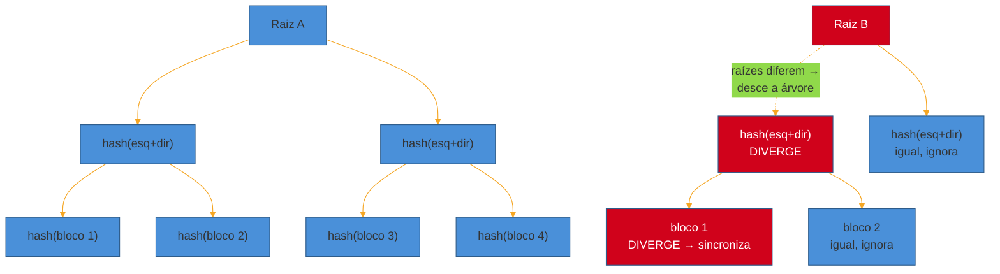

# Distributed Key-Value Store

> [!abstract] TL;DR
> Projetar um key-value store distribuído — DynamoDB, Cassandra — é o walkthrough que **recombina toda a trilha num sistema só**. O requisito que domina tudo é **"always writeable"**: o carrinho de compras da Amazon não pode recusar uma escrita, nunca, nem sob partição de rede. Isso empurra o design inteiro para **AP** (ver [[06 - CAP, consistência e consenso]]): os dados são particionados por [[04 - Sharding e Consistent Hashing|consistent hashing]] num anel com virtual nodes, replicados em **N** nós, e cada leitura/escrita usa **quorum ajustável** (R+W>N) para equilibrar consistência e latência por operação. Quando a rede falha e um nó "dono" de uma chave está inacessível, **sloppy quorum + hinted handoff** aceitam a escrita em outro lugar e a entregam depois. Escritas concorrentes que divergem são detectadas por **vector clocks** — não last-write-wins ingênuo, que perde dados — e a reconciliação (quando o sistema não consegue decidir sozinho) vai para a aplicação. Nós descobrem uns aos outros e detectam falhas por **gossip**, sem coordenador central; réplicas divergentes se resincronizam com **Merkle trees**, comparando hashes em vez de dados inteiros. Por baixo de cada nó, o caminho de escrita é uma **LSM tree** (commit log + memtable + SSTable) — rápida para escrever, cara para compactar depois. Este é o sistema que fecha a trilha porque não introduz nada novo: é a prova de que sharding, quorum e CAP, aprendidos separadamente, são as mesmas três decisões vistas de ângulos diferentes.

Um engenheiro recebe o enunciado mais aberto possível: "projete um key-value store distribuído, estilo DynamoDB, para servir como backend de um carrinho de compras de e-commerce."

Não há schema complexo, não há joins, não há índices secundários — é literalmente `get(key)` e `put(key, value)`. Um júnior olha isso e pensa: "é só um `HashMap` numa API REST, terminei em 5 minutos."

E é exatamente aí que a pergunta se revela traiçoeira. O desafio nunca foi a interface — é o que acontece quando esse `HashMap` precisa viver em **centenas de máquinas**, algumas caindo o tempo todo, espalhadas por três regiões geográficas, sob a exigência de que **nenhuma escrita do cliente seja recusada**, nem durante uma partição de rede às 3h da manhã.

Esse é o problema real: não é "como eu guardo um par chave-valor", é "como eu guardo bilhões de pares chave-valor, replicados, sempre disponíveis para escrita, tolerando falhas de nó e de rede, sem um coordenador central que vira ponto único de falha". A resposta de referência é o paper **Dynamo, da Amazon (SOSP 2007)** — a arquitetura por trás do carrinho de compras da Amazon, e o desenho que inspirou Cassandra, Riak, Voldemort e, décadas depois, o próprio DynamoDB gerenciado da AWS.

## Requisitos

**Requisitos funcionais (RF):**

- `put(key, value)` — grava (ou atualiza) o valor associado a uma chave.
- `get(key)` — lê o valor mais recente (ou um conjunto de versões conflitantes, se houver) associado a uma chave.
- O sistema escala horizontalmente: adicionar capacidade é adicionar nós, não trocar a máquina por uma maior.

Repare no que **não** está na lista: sem query por valor, sem range scan, sem joins, sem transações multi-chave. É acesso puro por chave — a mesma restrição que torna [[04 - Sharding e Consistent Hashing|sharding por hash]] a escolha natural, sem o custo de fan-out que uma query arbitrária exigiria.

**Requisitos não-funcionais (RNF), em ordem de prioridade:**

- **Sempre disponível para escrita ("always writeable").** É o requisito que domina todos os outros. Numa loja online, um `put` recusado é um item que não entra no carrinho — uma venda perdida, sentida imediatamente pelo negócio. Como visto em [[06 - CAP, consistência e consenso]], sob partição isso é uma escolha explícita por **A** sobre **C**.
- **Baixa latência, p99 na casa de dezenas de milissegundos**, mesmo com o dado replicado em múltiplos data centers.
- **Particionável e escalável horizontalmente**, sem downtime para adicionar ou remover nós.
- **Tolerante a falhas de nó e de rede** — nenhum componente é um ponto único de falha; o cluster continua servindo tráfego com nós caindo o tempo todo (é a norma operacional em centenas de máquinas, não a exceção).
- **Consistência ajustável (tunable)**, não fixa. Diferentes chamadas do mesmo cliente podem pedir garantias diferentes — uma leitura crítica pede quorum forte, uma leitura de baixa importância pede o nó mais próximo.
- **Simetria e descentralização.** Todo nó desempenha o mesmo papel; não existe um "nó especial" (coordenador, master de metadado) do qual o cluster inteiro depende.

> [!question]- Por que não simplesmente usar um banco relacional replicado e aceitar o downtime raro de partição?
> Porque o requisito "always writeable" não é uma preferência de performance — é um requisito de negócio explícito. Um banco relacional com replicação síncrona escolhe **CP**: sob partição, ele recusa escritas para preservar consistência. Isso é a escolha certa para saldo bancário (ver o exemplo de checkout em [[06 - CAP, consistência e consenso]]), mas errada para um carrinho de compras, onde o custo de recusar uma escrita (venda perdida, cliente frustrado) supera de longe o custo de, ocasionalmente, mostrar um carrinho levemente desatualizado por alguns segundos. O KV store distribuído *é*, literalmente, o AP do espectro CAP levado a sério — e é por isso que este walkthrough é o lugar certo para ver AP aplicado, não só citado.

## Estimativas

Um número de partida realista, no estilo Dynamo/Amazon: um cluster servindo **carrinhos de compras e catálogo de produtos** para uma loja de grande porte.

- **100 milhões de chaves ativas**, valor médio de 1KB (um objeto pequeno — item de carrinho, sessão, contador).
- **Dataset bruto:** 100M × 1KB ≈ **100GB** sem replicação.
- **Fator de replicação N=3** (padrão Dynamo/Cassandra): **300GB** de dados replicados no cluster.
- **QPS:** um sistema desse porte tipicamente vê **50.000 leituras/s** e **10.000 escritas/s** em pico (read:write ~5:1, comum em carrinho+catálogo).
- **Nós:** se cada nó comporta ~500GB de capacidade útil (SSD, memória para cache quente, overhead de compactação), 300GB replicados cabem confortavelmente em **dezenas de nós** — mas o motivo real para ter **centenas de nós** num cluster de produção não é capacidade, é **distribuir os 60.000 QPS totais e tolerar falha simultânea de vários nós sem perder disponibilidade**. Cassandra e Dynamo, em produção na Amazon, rodam clusters de **centenas de nós**.
- **Virtual nodes:** com 256 vnodes por nó físico (padrão histórico do Cassandra até a 3.x) ou 16 (padrão a partir da 4.0 — ver deep dive adiante), um cluster de 100 nós físicos tem entre 1.600 e 25.600 pontos no anel — o suficiente para distribuição estatisticamente uniforme mesmo com nós entrando e saindo.

Esses números guiam decisões concretas: o valor médio de 1KB é pequeno o bastante para caber inteiro em memória (memtable) antes de ir a disco; o read:write de 5:1 justifica otimizar quorum para leituras rápidas (R baixo) mais do que para escritas; e "centenas de nós" é o parâmetro que torna gossip (não um serviço de membership centralizado) a escolha correta — ver deep dive de detecção de falha adiante.

## API & modelo de dados

A interface é deliberadamente mínima — é a superfície mínima que sustenta toda a complexidade interna:

```
PUT /keys/{key}
  body: { "value": <bytes>, "context": <opaque vector clock> }
  → 200 OK { "version": <opaque vector clock> }

GET /keys/{key}
  → 200 OK { "values": [ {"value": <bytes>, "version": <vc>}, ... ] }
```

Dois detalhes de design que já sinalizam profundidade em entrevista:

**O `context`/`version` opaco no `PUT` e no `GET`.** O cliente que faz um `GET`, decide um novo valor, e faz o `PUT` de volta precisa **devolver o vector clock que recebeu** junto com a nova escrita — é assim que o sistema sabe que essa escrita "descende" da versão lida, em vez de ser uma escrita cega concorrente. Ignorar esse detalhe é o erro mais comum de quem desenha essa API pela primeira vez: sem o contexto, o servidor não tem como distinguir "atualização informada" de "escrita concorrente às cegas" — ver o deep dive de vector clocks adiante.

**`GET` pode retornar múltiplos valores.** Diferente de um KV store single-node, onde uma chave tem um valor, aqui uma chave pode ter **N valores conflitantes simultâneos** — as versões que o vector clock não conseguiu ordenar automaticamente. É a aplicação (ou o usuário, no caso clássico do carrinho da Amazon: "mesclar os dois carrinhos") que resolve o empate.

O "modelo de dados" propriamente dito é deliberadamente burro: `key → bytes`. Sem schema imposto pelo servidor — o valor é opaco, serializado pelo cliente (JSON, Protobuf, o que for). É essa simplicidade de modelo que permite ao sistema não se importar com o *conteúdo* do dado e focar inteiramente em disponibilidade, replicação e consistência — o mesmo motivo pelo qual [[03 - Bancos de dados em escala - SQL vs NoSQL e replicação|bancos NoSQL orientados a chave-valor]] trocam expressividade de query por escala.

## Diagrama macro



Repare que **qualquer nó pode ser o coordenador** de qualquer request — não existe um "nó de entrada" especial. O nó que recebe a requisição do cliente calcula `hash(key)`, descobre (via seu conhecimento local do anel, mantido por gossip) quais são os N nós donos daquela chave, e coordena a operação com eles. Essa simetria total — todo nó é igualmente capaz de coordenar, armazenar e participar do gossip — é a base da ausência de ponto único de falha que o requisito de disponibilidade exige.

O **write path** e o **read path**, com quorum, ficam assim:



## Deep dives

### Particionamento por consistent hashing

O anel de consistent hashing — introduzido em [[04 - Sharding e Consistent Hashing]] — não é revisitado aqui como conceito novo; é aplicado diretamente. Cada chave é posicionada no anel por `hash(key)`, e **os N nós seguintes no sentido horário** (não só o primeiro) são as réplicas dessa chave. É essa regra — "os próximos N, não só um" — que conecta particionamento e replicação num mecanismo só: a mesma estrutura de dados (o anel) decide tanto "onde essa chave mora" quanto "quem tem cópias dela".

Virtual nodes (também detalhados na nota 04) resolvem aqui o mesmo par de problemas: distribuição desigual com poucos nós físicos, e capacidade heterogênea entre máquinas. Vale um detalhe concreto que ancora a teoria em números reais de produção: o Cassandra usava **256 vnodes por nó físico** como padrão até a versão 3.x, e reduziu para **16** a partir da 4.0, porque 256 pontos por nó fazia cada nó compartilhar faixas de dados com praticamente todos os outros nós do cluster — tornando operações de reparo e substituição de nó lentas, já que cada falha de nó tocava um número grande demais de vizinhos. A lição de engenharia, reaproveitável em qualquer sistema com vnodes: mais pontos por nó melhora a uniformidade estatística, mas custa operacionalmente conforme o cluster cresce.

> [!question]- Se o dado já foi particionado uma vez, por que "as N seguintes no anel" não recria o problema de rebalanceamento de `hash % N`?
> Porque a regra de replicação herda exatamente a mesma propriedade que fez consistent hashing valer a pena para particionamento: quando um nó entra ou sai do anel, só as chaves cujo conjunto de "N nós seguintes" muda são afetadas — e esse conjunto só muda para chaves próximas ao ponto de entrada/saída, não para o anel inteiro. A matemática de rebalanceamento mínimo (K/N chaves, não quase todas) se aplica igualmente a "quem é dono" e a "quem são as N réplicas" — é a mesma estrutura de dados fazendo dois trabalhos.

### Replicação e quórum ajustável

Com **N** réplicas por chave, o sistema não exige que todas confirmem cada operação — em vez disso, usa a aritmética de quorum detalhada em [[06 - CAP, consistência e consenso]]: uma escrita precisa da confirmação de **W** réplicas, uma leitura consulta **R** réplicas, e a garantia central é

$$R + W > N$$

Essa desigualdade garante que todo conjunto de R réplicas lidas se sobrepõe a pelo menos uma réplica do conjunto de W réplicas escritas — nunca existe uma leitura que erra completamente a escrita mais recente confirmada.



No cluster deste walkthrough, com N=3, a configuração default do Dynamo é **N=3, R=2, W=2** — o meio-termo clássico: nem escrita nem leitura esperam todas as réplicas, e ainda assim R+W=4 > N=3 garante interseção. Mas o ponto central do requisito "consistência ajustável" é que **W e R são parâmetros por operação**, não uma constante do cluster:

- Uma leitura de "quantidade em estoque" antes de confirmar uma compra pode pedir **R=N** (consultar todas as réplicas, mais lento, mais seguro).
- Uma leitura de "recomendações de produtos relacionados" pode pedir **R=1** (o nó mais próximo, rapidíssimo, tolera estar um pouco desatualizado).
- Uma escrita de item no carrinho, dado o requisito "always writeable", frequentemente usa **W=1** — a coordenação com as outras réplicas acontece de forma assíncrona depois, sem bloquear a resposta ao cliente.

**Quando o quorum estrito falha: sloppy quorum + hinted handoff.** A regra "as N réplicas fixas de uma chave" pressupõe que essas N réplicas estejam disponíveis. Sob falha de nó ou partição, isso quebra — e é exatamente o momento em que o requisito "always writeable" seria violado se o sistema insistisse na topologia estrita.

**Sloppy quorum** resolve isso relaxando "quem pode aceitar a escrita": se um dos N nós donos da chave está inacessível, a escrita é aceita por **outro nó disponível fora do conjunto original** — o próximo nó saudável no anel, por exemplo. **Hinted handoff** completa o mecanismo: o nó que aceitou a escrita "no lugar" de outro guarda uma **dica** (*hint* — um wrapper indicando "essa escrita pertence ao Nó X") e a entrega ao nó correto assim que ele volta a ficar disponível.



No Cassandra, esse mecanismo tem uma janela configurável — por padrão, um nó guarda hints por até **3 horas** (`max_hint_window`, ajustável dinamicamente a partir da 4.0 via `nodetool setmaxhintwindow`); se o nó dono ficar indisponível por mais tempo que isso, o hint é descartado, e a reconciliação passa a depender de anti-entropia (Merkle trees, ver adiante) em vez de handoff direto.

Vale registrar uma diferença sutil entre implementações: no Dynamo original, escritas "sloppy" **contam** para o W exigido — o sistema atinge disponibilidade total mesmo sob falha, porque qualquer nó saudável pode contribuir para o quorum. No Cassandra, por padrão, hints **não contam** para o nível de consistência de escrita — uma escolha mais conservadora, que troca um pouco de disponibilidade por uma noção mais estrita de "quorum satisfeito".

> [!warning] Sloppy quorum não é grátis — ele adia o problema, não resolve
> **O que acontece:** a equipe trata sloppy quorum + hinted handoff como uma solução completa, sem monitorar quanto tempo os hints ficam acumulados nem o volume de dados "temporariamente deslocados". **Por quê:** cada hint acumulado é uma cópia de dado que ainda não chegou ao seu destino correto — se o nó dono ficar fora do ar por muito tempo (mais que a janela de hints), o dado pode se perder de vez, ou a reconciliação via Merkle tree se torna cara o suficiente para competir por I/O com tráfego de produção. **Como evitar:** monitore o volume e a idade dos hints acumulados como um sinal operacional de primeira classe — hints crescendo sem parar é o indicador mais direto de que um nó está degradado, não só temporariamente lento. Trate a janela de hints como uma variável de projeto (3h é o default do Cassandra, não uma lei física), calibrada pelo tempo típico de recuperação de um nó no seu ambiente.

### Resolução de conflito: vector clocks

Sloppy quorum resolve "a escrita nunca é recusada". Mas isso tem um preço direto: **escritas concorrentes em réplicas diferentes, aceitas ao mesmo tempo sob uma partição, geram versões divergentes da mesma chave.** Alguém precisa decidir, depois, qual versão "vale" — ou reconhecer que as duas são igualmente válidas e devem ser mescladas.

A saída ingênua — **last-write-wins (LWW)**, baseado em timestamp — parece simples, mas **perde dados silenciosamente**. Se dois clientes, em réplicas diferentes, adicionam itens diferentes ao mesmo carrinho quase simultaneamente, LWW descarta um dos dois updates inteiros, mesmo que ambos fossem legítimos e não-conflitantes no sentido de negócio (adicionar item A não deveria apagar o item B adicionado em paralelo).

**Vector clocks** (ou, mais precisamente para versionamento de dado, **version vectors**) resolvem isso rastreando **causalidade**, não apenas ordem no tempo. Cada versão de um objeto carrega um vetor de pares `(nó, contador)` — por exemplo `[A:2, B:1]` significa "esta versão reflete 2 escritas vistas pelo nó A e 1 escrita vista pelo nó B". Quando uma nova escrita chega, ela incrementa o contador do nó que a processou, mantendo o histórico das versões anteriores que ela "viu" (o `context` devolvido no `GET`, mencionado na API acima).

Dado dois vetores, existem três relações possíveis:

- **Um domina o outro** (`[A:2,B:1]` domina `[A:1,B:1]`, porque tem todos os contadores iguais ou maiores, e pelo menos um estritamente maior): a versão dominante **descende** da outra — não há conflito, o sistema descarta a mais antiga automaticamente.
- **Os vetores são idênticos:** mesma versão, nada a resolver.
- **Nenhum domina o outro** (`[A:2,B:0]` vs `[A:0,B:1]`): as duas escritas aconteceram **concorrentemente**, sem que uma soubesse da outra — é um **conflito genuíno**, e o sistema não tem informação suficiente para decidir sozinho qual "vence".



Quando o conflito é detectado, o sistema **não tenta adivinhar** — ele devolve as duas (ou mais) versões conflitantes no `GET`, e a aplicação decide. Para um carrinho de compras, a resolução é quase sempre trivial: **união dos itens** dos dois carrinhos (é raro perder um item ao mesclar dois carrinhos — o pior caso é um item duplicado, facilmente deduplicado). É por isso que Dynamo escolheu vector clocks e reconciliação na aplicação em vez de LWW: o custo de implementar merge é pago uma vez, no domínio certo; o custo de LWW (perder escritas silenciosamente) é pago a cada conflito, para sempre.

Na prática, conflitos são raros: dados publicados sobre o tráfego de produção do carrinho de compras da Amazon mostraram **99,94% das leituras retornando uma única versão** sem conflito — o mecanismo existe para o caso raro, não para o caso comum, mas sem ele o caso raro corrompe dados silenciosamente.

> [!question]- Vector clocks continuam sendo o estado da arte, ou já foram substituídos?
> Depende do sistema. O Riak — um dos primeiros bancos a implementar o desenho do paper Dynamo diretamente — identificou um problema prático dos vector clocks clássicos: **sibling explosion**. Escritas repetidas ou retentativas do mesmo cliente, sem contexto de causalidade suficiente, podiam gerar um número de versões conflitantes que crescia sem limite. A partir da versão 2.0, o Riak passou a recomendar **dotted version vectors (DVVs)** — uma variante que identifica cada valor pelo evento exato que o criou, permitindo detectar e descartar duplicatas com mais precisão, reduzindo drasticamente a explosão de siblings. Cassandra e DynamoDB, por sua vez, tendem a usar timestamps com resolução mais fina (e, no caso do DynamoDB moderno, mecanismos internos não totalmente públicos) combinados com **last-write-wins por padrão**, deixando vector clocks completos como uma opção mais explícita ou específica de certos modos de uso. Em entrevista, a resposta que sinaliza profundidade real não é "eu uso vector clocks" — é "eu uso um mecanismo de causalidade explícita em vez de LWW puro, porque LWW perde escritas concorrentes silenciosamente; vector clocks (ou uma variante como dotted version vectors) é a forma clássica de fazer isso, com o trade-off de expor conflitos para a aplicação resolver."

### Detecção de falha e anti-entropia: gossip e Merkle trees

Dois problemas ainda estão em aberto: **como cada nó sabe quais outros nós existem e estão vivos** (sem um coordenador central — o requisito de "descentralização total"), e **como réplicas que divergiram por falhas, hints perdidos, ou simples atraso de rede voltam a convergir**, mesmo sem uma escrita nova acontecer.

**Gossip para membership e detecção de falha.** Cada nó, periodicamente (no Cassandra, a cada segundo), troca informação de estado com **um pequeno número de outros nós** escolhidos aleatoriamente — tipicamente 1 a 3. Essa informação inclui não só o estado do próprio nó, mas o que ele sabe sobre *outros* nós, versionado por um par `(generation, version)` que funciona como um relógio lógico simples. Depois de algumas rodadas, a informação se propaga por todo o cluster de forma probabilística — daí o nome, por analogia com fofoca se espalhando numa rede social.

A detecção de falha, especificamente, usa um mecanismo mais sofisticado que "não respondeu, está morto": o **Phi Accrual Failure Detector**. Em vez de um binário vivo/morto com um timeout fixo, cada nó calcula um valor de suspeita (**φ**) contínuo, baseado no histórico de intervalos entre heartbeats daquele nó específico — permitindo que o detector se adapte a nós com latência de rede naturalmente mais alta (outra região geográfica, por exemplo) sem falsos positivos, e a nós historicamente estáveis com detecção mais rápida.



**Merkle trees para anti-entropia.** Gossip resolve membership e falha; não resolve **conteúdo divergente entre réplicas**. Depois de uma partição prolongada, hints perdidos, ou simples atraso, duas réplicas da mesma faixa de chaves podem ter dados diferentes — sem que nenhuma escrita nova jamais force essa diferença à tona (porque leituras normais, com quorum baixo, podem não tocar as duas réplicas divergentes ao mesmo tempo).

Comparar réplicas byte a byte seria proibitivamente caro para faixas de dados grandes. A solução é uma **árvore de hashes**: cada folha da árvore é o hash de um pequeno bloco de dados; cada nó pai é o hash da concatenação de seus filhos, até a raiz. Duas réplicas comparam primeiro **a raiz** — se as raízes batem, os dados são idênticos, fim da comparação, sem nunca examinar o conteúdo. Se divergem, a comparação desce recursivamente só pelos ramos onde o hash não bate, até identificar exatamente quais blocos pequenos de dados precisam ser sincronizados.



O Cassandra usa uma versão compacta da árvore — profundidade 15 (32.768 folhas) — deliberadamente pequena, porque a árvore precisa ser transferida pela rede antes da comparação começar: uma árvore grande demais tornaria o próprio processo de anti-entropia um consumidor pesado de banda, o oposto do que a técnica busca evitar. Esse processo roda tipicamente sob demanda (`nodetool repair`) ou agendado, não a cada leitura — é uma camada de fundo que garante convergência eventual mesmo quando nada mais força a sincronização.

Uma terceira camada, mais barata e contínua, complementa Merkle trees: o **read repair**. A cada leitura com consistência acima de ONE, o coordenador pede um **digest** (hash) do valor às réplicas não usadas para a resposta principal; se o digest não bate, ele dispara uma leitura completa e escreve a versão mais recente de volta na réplica desatualizada — reparando inconsistências pequenas de forma incremental, no caminho normal de leitura, sem esperar por uma rodada de `repair` completa.

> [!warning] Anti-entropia não é opcional em produção — é o que impede divergência permanente
> **O que acontece:** um time roda um cluster AP por meses sem nunca disparar `nodetool repair` (ou equivalente), confiando só em hinted handoff e read repair para manter as réplicas sincronizadas. **Por quê:** hinted handoff tem uma janela de expiração (3h no Cassandra por padrão); read repair só toca as chaves efetivamente lidas. Chaves raramente lidas, cujo nó dono ficou fora do ar por mais tempo que a janela de hints, **nunca convergem sozinhas** — a divergência fica permanente até uma leitura explícita ou um repair completo tocar aquela chave. **Como evitar:** trate anti-entropia via Merkle tree como uma rotina de manutenção agendada (não uma reação a incidente), com uma cadência que respeite a janela de hints e o volume de dados por nó — documentação do Cassandra recomenda rodar `repair` regularmente, tipicamente dentro do período de `gc_grace_seconds` (10 dias por padrão), para evitar que deleções "ressuscitem" via réplicas desatualizadas (o problema clássico de *zombie data* em sistemas com tombstones).

### O caminho de escrita interno: LSM tree

Por trás de cada nó individual, como ele grava e serve os dados — brevemente, porque é um tópico com peso próprio, mas vale nomear porque explica *por que* o KV store escreve tão rápido. Cada escrita é primeiro apendada a um **commit log** (append-only, sequencial em disco, para recuperação de crash), e simultaneamente escrita numa **memtable** em memória (uma estrutura ordenada, como uma red-black tree). Quando a memtable atinge um tamanho limite, ela é despejada em disco como uma **SSTable** — imutável, ordenada, nunca mais modificada depois de escrita.

Leituras precisam, no pior caso, consultar a memtable e **várias** SSTables (a chave pode ter versões espalhadas por diferentes flushes ao longo do tempo) — daí a necessidade de **compactação** em background, que mescla SSTables antigas numa nova, descartando versões obsoletas e tombstones expirados. É o mesmo desenho — **Log-Structured Merge tree (LSM tree)** — usado por Cassandra, RocksDB, LevelDB e (por baixo) o próprio DynamoDB: otimiza brutalmente para escrita sequencial rápida, ao custo de leitura potencialmente mais cara e de compactação como trabalho de fundo constante.

## Gargalos & trade-offs

- **Hot partitions.** Mesmo com consistent hashing bem implementado, uma chave "celebridade" (um produto viral, um evento de Black Friday concentrado num intervalo de IDs) ainda sobrecarrega os N nós donos daquela chave especificamente — o mesmo problema já detalhado em [[04 - Sharding e Consistent Hashing]], sem solução automática pelo mecanismo de partição em si.
- **Custo do quorum.** W e R altos aumentam a garantia de consistência, mas cada requisição paga a latência do **nó mais lento** dentro do quorum escolhido — a cauda longa de latência cresce com W e R, não só a média.
- **Read repair tem custo em cada leitura.** Consistência acima de ONE significa que toda leitura consulta múltiplas réplicas e compara digests — mais barato que um Merkle tree completo, mas ainda um custo real de rede e CPU pago a cada `GET`, não só quando há divergência de fato.
- **Tunable consistency exige disciplina de uso.** ONE/QUORUM/ALL por operação dá flexibilidade, mas também abre espaço para erro: escolher ONE para uma leitura que precisava de garantia forte (ex: checar estoque antes de confirmar compra) é um bug silencioso — não há erro em tempo de execução, só um comportamento sutilmente errado sob concorrência.
- **CAP na prática: é AP, com consistência eventual (mais read-your-writes e read repair na prática).** Esse é o ponto que fecha o círculo com [[06 - CAP, consistência e consenso]]: o sistema inteiro deste walkthrough é a manifestação concreta de "escolher A sobre C sob partição" — e o custo dessa escolha (vector clocks, sloppy quorum, read repair, Merkle trees) é justamente a engenharia extra que AP exige para não virar caos silencioso.

> [!warning] Tratar "tunable consistency" como "sempre use ONE para performance"
> **O que acontece:** a equipe, ao ver que ONE é mais rápido, padroniza ONE para todas as leituras do sistema, "para maximizar throughput". **Por quê:** ONE não dá nenhuma garantia de ler a escrita mais recente — nem read-your-writes, a garantia mínima que a maioria dos produtos precisa (ver [[06 - CAP, consistência e consenso]]). Um usuário que atualiza o próprio carrinho e, na tela seguinte, não vê a atualização (porque o `GET` bateu numa réplica que ainda não recebeu a escrita) reporta isso como bug, não como trade-off. **Como evitar:** escolha R e W **por tipo de dado e por operação**, como o requisito de consistência ajustável pede — não por padrão único. Dados de alta contenção (estoque) pedem R/W mais altos; dados tolerantes (recomendações) toleram ONE. É a mesma lição de "CAP por dado, não por sistema" de [[06 - CAP, consistência e consenso]], aplicada aqui em unidades concretas de R e W.

## Variações de follow-up

O entrevistador raramente para no design base — as perguntas de aprofundamento mais comuns:

- **"E se você precisar de consistência forte, não eventual?"** — a resposta aponta para fora do desenho Dynamo puro: um sistema que precisa de linearizabilidade real usa **consenso** (Raft/Paxos, ver [[06 - CAP, consistência e consenso]]) para decisões de escrita, como o Google Spanner faz com TrueTime para consistência forte *global* — ao custo de latência de coordenação que este walkthrough evitou deliberadamente.
- **"Como você adiciona índices secundários?"** — acesso só por chave primária é a simplicidade que permitiu tudo isso; um índice secundário (buscar por "todos os carrinhos com item X") normalmente vira uma tabela de índice replicada separadamente, com sua própria janela de consistência eventual em relação à tabela principal — outra forma de fan-out, do mesmo tipo visto em [[04 - Sharding e Consistent Hashing]].
- **"Como isso funciona multi-região?"** — replicar entre regiões geográficas multiplica a latência de qualquer coordenação síncrona; sistemas gerenciados modernos (DynamoDB Global Tables, por exemplo) resolvem isso com replicação assíncrona entre réplicas regionais e last-writer-wins como resolução default entre regiões, com um modo mais recente de consistência forte multi-região disponível a um custo de latência maior — o mesmo trade-off latência-vs-consistência do "Else" do PACELC, só que entre continentes em vez de entre nós de um datacenter.
- **"O que acontece quando o cluster cresce de 10 para 200 nós?"** — reabre a discussão de virtual nodes (quantos por nó, e o trade-off Cassandra 256→16) e de compactação (LSM trees sob mais escrita concorrente exigem mais trabalho de compactação em background, competindo por I/O).

## Em entrevista

Este é o walkthrough onde o entrevistador espera ver a trilha inteira amarrada, não um building block isolado. O roteiro que sinaliza domínio:

1. **Ancore tudo no requisito "always writeable" logo no início** — é ele que justifica cada escolha subsequente (AP, sloppy quorum, vector clocks). Sem essa âncora, o design vira uma lista de tecnologias soltas.
2. **Conecte particionamento e replicação como a mesma estrutura**: "uso o anel de consistent hashing tanto para decidir onde a chave mora quanto para decidir quais N nós a replicam — são os próximos N no sentido horário."
3. **Trate quorum como aritmética ajustável, não constante**: cite R+W>N, mas amarre a um exemplo concreto de por que R e W mudam por tipo de leitura.
4. **Não pule para "usa vector clocks" sem explicar o motivo**: o gancho certo é "LWW perde escritas concorrentes silenciosamente; por isso preciso de um mecanismo de causalidade".
5. **Cite gossip e Merkle trees como duas camadas diferentes**, não intercambiáveis: gossip resolve "quem está vivo", Merkle trees resolvem "o que está divergente" — confundir os dois é um red flag de superficialidade.

> [!question]- Isso não é simplesmente "decorar o paper do Dynamo"?
> É, e não é — depende de como você usa o conhecimento. Recitar "Dynamo usa consistent hashing, vector clocks, gossip e Merkle trees" sem conectar cada peça a um requisito específico é exatamente o red flag citado na nota 01 do sub-galho 1 ([[1 - Framework de entrevista/01 - O que é System Design e o que a entrevista avalia|O que é System Design]]): "componentes sem porquê". A diferença entre decorar e entender é conseguir responder "por que vector clocks e não LWW?" com "porque LWW perde dados silenciosamente sob escrita concorrente, e esse sistema promete nunca recusar uma escrita — então escritas concorrentes *vão* acontecer, e preciso de um jeito de não perdê-las". O paper é o vocabulário; o requisito de negócio é o porquê. A entrevista mede o segundo.

> [!question]- Por que esse é o walkthrough que "fecha a trilha"?
> Porque, diferente dos outros sete, ele não introduz nenhum building block novo — ele é a demonstração de que sharding (SG2-04), CAP/quorum/consenso (SG2-06) e replicação (SG2-03) não são tópicos isolados de estudo, são **as mesmas três decisões, vistas de ângulos diferentes, que qualquer sistema distribuído sério precisa tomar**. Um KV store distribuído é, em certo sentido, o "esqueleto puro" por trás de bancos NoSQL de produção — os outros sete walkthroughs desta trilha (URL shortener, feed, chat, rate limiter, notificação, storage, crawler) resolvem problemas de *aplicação* em cima de peças de infraestrutura como essa. Entender este walkthrough a fundo é entender o motor que roda, silenciosamente, atrás de boa parte dos outros sete.

> [!question]- O entrevistador espera que eu desenhe vector clocks e Merkle trees no quadro em detalhe?
> Raramente no nível de implementação — o sinal buscado é a *intuição causal*: você sabe por que um timestamp sozinho não basta para decidir "qual escrita venceu" sob concorrência, e sabe nomear o mecanismo (vector clocks) e o trade-off (expõe conflito à aplicação em vez de resolver automaticamente e errado). Da mesma forma para Merkle trees: o insight que importa é "comparo hashes primeiro, desço só onde diverge", não a implementação exata da árvore. Se o entrevistador pedir mais profundidade num desses pontos especificamente, é aí que vale desenhar o vetor `[A:2,B:1]` concreto ou a árvore com 4 folhas — mas isso normalmente é sinal de uma entrevista de sistemas distribuídos mais avançada, não a system design interview padrão.

## Como explicar em inglês

A distributed key-value store — DynamoDB or Cassandra-style — is a `get`/`put` interface over a dataset spread across hundreds of nodes, replicated for durability, and designed around one dominant requirement: it must never refuse a write, even during a network partition. That single requirement pushes the whole design toward AP in the CAP sense.

Data is partitioned with **consistent hashing** on a ring, with virtual nodes for even distribution. Each key replicates to the next N nodes clockwise on the ring — the same structure that decides placement also decides replication. Reads and writes use **tunable quorum** (R + W > N) so consistency can be dialed per operation instead of fixed for the whole cluster. When a node is unreachable, **sloppy quorum** lets another node accept the write, and **hinted handoff** delivers it once the original node recovers — the mechanism that keeps writes always accepted.

Concurrent writes that can't be ordered by a simple timestamp are detected with **vector clocks**, which track causality instead of wall-clock time — this avoids the silent data loss that last-write-wins causes under concurrency; genuine conflicts get exposed to the application to merge. Nodes discover each other and detect failure through **gossip**, with no central coordinator; diverged replicas resync via **Merkle trees**, comparing hashes top-down instead of full data.

> "The requirement that drives everything here is 'always writeable' — so I'm choosing AP under partition. I'd partition with consistent hashing, replicate to N nodes, and use quorum reads/writes tuned per operation. Under failure, sloppy quorum plus hinted handoff keeps writes flowing; vector clocks catch concurrent writes so I don't silently drop data the way last-write-wins would."

| PT | EN |
|----|----|
| Sempre disponível para escrita | Always writeable |
| Quórum ajustável | Tunable quorum |
| Quórum frouxo | Sloppy quorum |
| Repasse com dica | Hinted handoff |
| Vetor de versão / relógio vetorial | Vector clock / version vector |
| Escrita concorrente | Concurrent write |
| Última escrita vence | Last-write-wins (LWW) |
| Fofoca (protocolo de membership) | Gossip protocol |
| Árvore de Merkle | Merkle tree |
| Anti-entropia | Anti-entropy |
| Reparo de leitura | Read repair |
| Árvore LSM | LSM tree (Log-Structured Merge tree) |

## O que vem a seguir

Este walkthrough fecha o sub-galho **4 - Walkthroughs** — e, com ele, a trilha **System Design**. As oito notas deste sub-galho não foram oito sistemas isolados: foram oito exercícios do mesmo método, cada um recombinando um subconjunto diferente dos building blocks (SG2) e padrões (SG3) sob restrições novas. Este último, deliberadamente, foi o que menos introduziu conceito novo e mais **sintetizou** — sharding, CAP, quorum e replicação, vistos juntos, num sistema onde nenhum deles é opcional.

O ponto de partida certo para revisitar a trilha inteira é o galho-pai:

- [[System Design/index|System Design]] — o mapa completo: framework de entrevista, building blocks, padrões recorrentes e os oito walkthroughs, todos recombináveis sob restrições que o entrevistador ainda não te deu.

Anterior: [[07 - Web Crawler]] — BFS distribuído, politeness, dedup de URL.

## Veja também

- [[System Design/index|System Design]] — o galho-pai e o mapa da trilha
- [[4 - Walkthroughs/index|Walkthroughs]] — os outros sete designs ponta a ponta
- [[04 - Sharding e Consistent Hashing]] — o mecanismo de particionamento e replicação que este walkthrough aplica diretamente
- [[06 - CAP, consistência e consenso]] — CAP, PACELC, quorum e consenso, a base teórica de todo o deep dive de replicação
- [[03 - Bancos de dados em escala - SQL vs NoSQL e replicação]] — por que um modelo chave-valor puro troca expressividade de query por escala

## Fontes

- **DeCandia, G. et al. (Amazon)** — [*Dynamo: Amazon's Highly Available Key-value Store*](https://www.allthingsdistributed.com/files/amazon-dynamo-sosp2007.pdf), SOSP 2007 — a fonte-âncora deste walkthrough: consistent hashing com virtual nodes, quorum ajustável, sloppy quorum + hinted handoff, vector clocks, gossip; base de Cassandra, Riak e Voldemort.
- **Apache Cassandra Documentation** — [*Storage Engine*](https://cassandra.apache.org/doc/latest/cassandra/architecture/storage-engine.html) — commit log, memtable, SSTable, LSM tree.
- **Apache Cassandra Documentation** — [*Internode communications (gossip)*](https://docs.datastax.com/en/cassandra-oss/3.x/cassandra/architecture/archGossipAbout.html) — protocolo de gossip, Phi Accrual Failure Detector, seed nodes.
- **Apache Cassandra Documentation** — [*Manual repair: Anti-entropy repair*](https://docs.datastax.com/en/cassandra-oss/3.x/cassandra/operations/opsRepairNodesManualRepair.html) — Merkle trees, profundidade 15/32K folhas, processo de comparação.
- **Apache Cassandra Documentation** — [*Hints*](https://cassandra.apache.org/doc/4.0/cassandra/operating/hints.html) e [*Understanding Hinted Handoff*](https://www.datastax.com/blog/understanding-hinted-handoff-cassandra-08) — janela de hints (`max_hint_window`, default 3h), diferença de contagem para quorum vs Dynamo original.
- **Apache Cassandra Documentation** — [*Read repair*](https://cassandra.apache.org/doc/stable/cassandra/managing/operating/read_repair.html) e [*Compaction*](https://cassandra.apache.org/doc/4.1/cassandra/operating/compaction/index.html) — digest reads, STCS/LCS, o motivo da mudança de 256→16 vnodes na 4.0.
- **Riak** — [*Vector Clocks Revisited Part 2: Dotted Version Vectors*](https://riak.com/posts/technical/vector-clocks-revisited-part-2-dotted-version-vectors/index.html?p=9929.html) — sibling explosion, DVVs como evolução dos vector clocks clássicos.
- **AWS** — [*Global tables — multi-active, multi-Region replication*](https://docs.aws.amazon.com/amazondynamodb/latest/developerguide/GlobalTables.html) — replicação multi-região, MREC vs MRSC, last-writer-wins entre regiões (consultado jul/2026).
- **Kleppmann, M.** — *Designing Data-Intensive Applications*, cap. 5 (Replication), 6 (Partitioning) e 9 (Consistency and Consensus) — o tratamento teórico que amarra os três eixos deste walkthrough.
- **Hello Interview** — [*Consistent Hashing*](https://www.hellointerview.com/learn/system-design/deep-dives/consistent-hashing) — reforço do deep dive de particionamento aplicado a entrevista.
