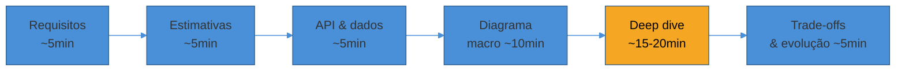

# Conduzindo a entrevista completa

> [!abstract] TL;DR
> Você já tem as peças: o [[1 - Framework de entrevista/index|framework]], os [[2 - Building blocks/index|building blocks]], os [[3 - Padrões recorrentes/index|padrões]] e os [[4 - Walkthroughs/index|walkthroughs]]. Esta nota-capstone é sobre a *performance* que costura tudo: como gastar os 45 minutos sem estourar o relógio, como ler os sinais do entrevistador e ajustar o rumo, como se recuperar quando trava, e como responder à pergunta que separa quem *estudou* de quem *operou* — "você já enfrentou isso em produção?". Não é conteúdo novo; é a camada meta que transforma conhecimento em aprovação. A regra-mestra continua a mesma da primeira nota da trilha: **cada decisão se justifica por um requisito ou um trade-off — nunca "porque sim"** — mas aqui o foco é *conduzir a conversa* em que essas justificativas aparecem no tempo certo.

Um candidato entra na sala sabendo tudo. Sabe consistent hashing, sabe quorum, sabe fan-out on-write. Faz o back-of-envelope de cabeça. E ainda assim é reprovado — porque gastou 30 dos 45 minutos desenhando um diagrama macro cada vez mais bonito e nunca chegou ao deep dive, onde a senioridade é medida.

Outro candidato, com metade do repertório técnico, passa. Porque **dirigiu a conversa**: cortou o escopo cedo, sinalizou onde ia gastar o tempo, foi fundo no componente difícil e, quando o entrevistador cutucou, pensou junto em vez de se defender.

A diferença não é conhecimento. É condução. Esta nota é sobre isso — a habilidade que nenhuma das 26 notas anteriores ensina diretamente porque só existe na execução ao vivo.

## O relógio: o orçamento de 45 minutos

O erro de gestão de tempo mais comum não é falta de conteúdo — é **má alocação**. O framework da trilha (revisto em [[05 - Do diagrama macro ao deep dive e trade-offs]]) reserva o maior bloco pro deep dive por um motivo: é lá que os pontos de senioridade moram. Perder esse bloco desenhando caixas é o suicídio silencioso da entrevista.

O bloco em âmbar é onde você ganha ou perde a entrevista. Trate os primeiros quatro passos como *preparação para chegar bem nele* — não como a entrega principal.

> [!warning] Gastar o tempo todo no diagrama macro
> **O que acontece:** o candidato refina o diagrama de alto nível cada vez mais, adicionando caixas, e o relógio chega aos 30 minutos sem um único deep dive.
> **Por quê:** o macro é confortável — parece progresso e não expõe lacunas. O deep dive é desconfortável porque exige conhecer os modos de falha.
> **Como evitar:** cronometre mentalmente. Aos ~25 minutos, force a transição: "o macro está fechado; deixa eu escolher o componente mais difícil — a geração de código sem colisão — e ir fundo". A transição explícita já é sinal de senioridade.

**Sinalize a gestão de tempo em voz alta.** "Vou pular o detalhe de autenticação para gastar o tempo no fan-out, que é a parte difícil aqui" — isso, por si só, comunica que você prioriza conscientemente. O entrevistador não está lendo sua mente; ele pontua o que você verbaliza.

> [!question]- E se o entrevistador me levar por um caminho que consome todo o tempo?
> Isso é comum — e não necessariamente ruim. Se ele te puxa fundo num componente, é porque *ali* está o sinal que ele quer medir. Siga, mas administre: "posso ir bem fundo nisso, mas quero garantir que sobra tempo pros trade-offs finais — quer que eu priorize a profundidade aqui ou a cobertura?". Você devolve a decisão de alocação pra ele, mostrando consciência de tempo sem abrir mão da condução.

## Lendo os sinais do entrevistador

A entrevista é uma conversa com um interlocutor que está *torcendo por você* — ele quer te contratar, não te derrubar. Cada intervenção é um dado. Aprender a lê-las muda o rumo em tempo real.

| Sinal do entrevistador | O que provavelmente significa | Como reagir |
|------------------------|-------------------------------|-------------|
| "E se esse nó cair?" | Quer ver se você pensa em modos de falha | Estime a carga, admita o SPOF, proponha réplicas/failover |
| "Por que você escolheu X?" | O *porquê* não ficou claro (ou testa profundidade) | Dê o trade-off e a alternativa que rejeitou |
| "Interessante..." + silêncio | Ou concorda, ou quer que você continue | Continue narrando; não pare esperando aprovação |
| Te empurra pra um componente específico | É ali que ele quer medir profundidade | Vá fundo nesse, mesmo que não fosse seu plano |
| "Como isso escala pra 10x?" | Testa se seu design é evolutivo | Identifique o próximo gargalo, não reescreva tudo |
| Olha o relógio / acelera | Tempo apertando | Resuma, feche trade-offs, ofereça o que faltou |

O ponto sutil: **feedback não é ataque.** Quando ele diz "esse componente não vira gargalo?", a resposta certa não é defender cegamente nem capitular na hora. É *pensar junto*: "boa — deixa eu estimar a carga nele... é, a 50k req/s isso satura; eu colocaria cache na frente ou sharding por user_id". Você trata a cutucada como colaboração, que é exatamente o que a rubrica de comunicação mede.

## Como se recuperar quando você trava

Vai acontecer: em algum momento você fica sem saber o próximo passo. Travar não te reprova — *como você reage a travar* é que é medido, e há saídas estruturadas.

- **Volte aos requisitos.** Nove em dez travadas somem quando você relê os RNFs em voz alta. "Deixa eu revisitar: preciso de <2s e tolero staleness — então aqui eu posso cachear agressivo." Os requisitos são a bússola quando o mapa some.
- **Estime para decidir.** Quando estiver entre duas opções e não souber qual, *calcule*. "SQL ou NoSQL aqui? Deixa eu ver a carga: 4000 leituras/s por chave, sem joins... NoSQL." O número decide por você e mostra método.
- **Pense em voz alta a incerteza.** "Não tenho certeza se replicação síncrona vale o custo de latência aqui — deixa eu pesar os dois lados." Admitir incerteza e raciocinar sobre ela é *green flag*, não fraqueza. Fingir certeza que você não tem é o oposto.

> [!question]- E se eu simplesmente não conhecer a tecnologia que ele mencionou?
> Seja honesto e recupere pelo princípio. "Não trabalhei com Cassandra em produção, mas pelo que sei é um KV store distribuído com consistent hashing e quorum ajustável — então eu esperaria que ele resolvesse este caso assim...". Você admite a lacuna e demonstra que consegue raciocinar do primeiro princípio, que é mais valioso que ter decorado o nome.

## A pergunta de produção: "você já enfrentou isso na prática?"

Em algum momento — sobretudo em entrevistas sênior — vem a pergunta que muda o registro: *"você já viveu esse problema em produção? como resolveu?"*. Ela separa quem estudou arquiteturas de quem operou sistemas. Aqui não há como blefar: ou você tem a cicatriz, ou não tem.

A tabela abaixo mapeia problemas recorrentes de produção às abordagens por stack — o tipo de repertório que sustenta uma resposta concreta a essa pergunta. Cada stack tem uma nota dedicada com o detalhe.

| Problema | Java / Spring Boot | Node.js / Express | Python / Django | Go |
| --- | --- | --- | --- | --- |
| **Connection pool exausto** | HikariCP config (max pool, leak detection) | knex/TypeORM pool config; `pg-pool` | Django `CONN_MAX_AGE`; `django-db-connection-pool` | `sql.DB` SetMaxOpenConns, SetMaxIdleConns |
| **N+1 queries** | JPA `@EntityGraph`, `JOIN FETCH`, batch fetch | DataLoader pattern; eager loading no ORM | `select_related()`, `prefetch_related()` | GORM `Preload()`, query manual com JOIN |
| **Slow queries** | `EXPLAIN ANALYZE`, `@Query` nativa, índices | `EXPLAIN` + query raw; knex | Django Debug Toolbar, `raw()`, índices | `EXPLAIN` + sqlc, pgx |
| **Memory leak** | Heap dump + MAT/VisualVM; G1GC tuning | `--inspect` + DevTools; heapdump | tracemalloc, objgraph, memory_profiler | pprof (`go tool pprof`) |
| **Thread/goroutine exhaustion** | Thread pool, `@Async` + virtual threads (Java 21+) | Event loop blocking → worker threads | Gunicorn workers, `asyncio`, Celery | Goroutine leak detection; context cancelation |
| **API timeout cascading** | Resilience4j (circuit breaker, bulkhead, retry) | opossum; `axios` timeout + retry | django-circuitbreaker; requests timeout | `context.WithTimeout`, circuit breaker |
| **Cache stampede** | Cache lock (Redisson), early expiration | Redlock, stale-while-revalidate | django-cacheops, cache lock | singleflight |
| **Graceful shutdown** | Lifecycle hooks, `@PreDestroy` | `process.on('SIGTERM')`, drain | Gunicorn graceful restart | `signal.Notify` + `Server.Shutdown()` |

→ Deep dive em Java/Spring Boot: [[Spring Boot]] (seção Troubleshooting) · Node.js: [[Node.js]]

Repare que quase toda linha dessa tabela é uma *aplicação* dos padrões da trilha: cache stampede é [[02 - Caching]], API timeout cascading é [[05 - Circuit Breaker e resiliência]], connection pool exausto é uma questão de [[01 - Escalabilidade e load balancing]]. A entrevista de system design e a operação de produção são o mesmo conhecimento visto de dois ângulos.

### Na prática (da minha experiência)

> No MedEspecialista, projetei a evolução de um monolito para uma arquitetura orientada a serviços. Algumas decisões de design que ilustram os conceitos desta trilha:
>
> **Separação read/write no agendamento:** O core de agendamentos usa PostgreSQL com **strong consistency** — não pode haver double-booking. Mas a listagem de horários disponíveis (read-heavy, tolerante a dados de segundos atrás) usa um **cache Redis com TTL de 5 minutos** populado por eventos Kafka. Quando um agendamento é confirmado, o serviço publica um evento que invalida o cache. CQRS na prática.
>
> **Fan-out de notificações:** Quando um médico confirma uma consulta, o sistema precisa notificar o paciente (push + SMS), atualizar o dashboard admin (SSE), e registrar para faturamento. Isso é um caso clássico de pub/sub: o Agendamento Service publica `consulta.confirmada`, e cada consumer (Notification, Dashboard, Billing) processa de forma independente. Se o serviço de SMS estiver fora, as outras notificações continuam funcionando.
>
> **Rate limiting na API pública:** A API que os parceiros (planos de saúde) consomem tem rate limiting por API key (1000 req/min) implementado no API Gateway (Kong). Isso protege o sistema contra integrations com bugs que bombardeiam a API, sem afetar o app mobile dos pacientes.
>
> **A lição principal:** o design perfeito no quadro branco nunca sobrevive ao contato com produção. O que importa é que a arquitetura seja **adaptável** — que você consiga mudar componentes sem reescrever tudo. Bounded contexts claros e comunicação assíncrona entre serviços tornam isso possível.

Uma história de produção concreta como essa vale mais que qualquer diagrama decorado. Ela prova as três coisas que a rubrica sênior procura: que você *decidiu* sob restrições reais (strong consistency no agendamento, eventual no cache), que conhece os *trade-offs* (invalidação via evento), e que pensou em *operação* (o SMS fora não derruba o resto). Tenha uma ou duas dessas na ponta da língua.

## As armadilhas que reprovam — consolidadas

Cada nota da trilha tem seus `[!warning]`. Aqui estão as transversais, as que aparecem em qualquer walkthrough:

- **Pular clarificação de requisitos** — sem saber a escala, você projeta um chat de 1000 usuários como se fosse o WhatsApp. Sempre pergunte antes de desenhar. Ver [[02 - Clarificar requisitos]].
- **Projetar para Google-scale imediatamente** — a maioria dos sistemas não precisa de sharding no dia 1. O entrevistador quer ver que você sabe **quando** escalar, não que escala tudo por default.
- **Não falar sobre trade-offs** — "escolho Redis porque é rápido" é insuficiente. "Escolho Redis para cache porque o read:write é 100:1 e os dados cabem em memória, mas o trade-off é perder dados se o cluster reiniciar, então mantenho o banco como source of truth" — isso é senioridade.
- **Ignorar requisitos não-funcionais** — um chat 99.9% disponível que perde mensagens é pior que um 99% disponível que nunca perde. Disponibilidade, latência e consistência pesam tanto quanto features.
- **Monólogo** — system design é conversa. Pergunte, valide premissas, peça feedback. "Estou pensando em Cassandra aqui pelo volume de writes — o que você acha?" mostra colaboração.
- **Ficar no abstrato** — "eu usaria um cache" não impressiona. "Redis com cache-aside, TTL de 5 minutos, invalidação event-based via Kafka quando o dado muda" — isso impressiona.
- **Não fazer back-of-envelope math** — "precisamos de sharding" vs "temos 120K QPS, um PostgreSQL aguenta ~10K com esse schema, então ~12 shards" — o segundo mostra capacidade analítica.
- **Esquecer observabilidade** — mencionar métricas, alertas e dashboards mostra que você pensa em *operar*, não só projetar. "Eu monitoraria p99 latency, cache hit ratio e queue depth."

> [!warning] O erro que reprova sêniores, revisitado
> O staff engineer da primeira nota da trilha foi reprovado por **descrever componentes sem justificar um único trade-off**. É a armadilha-mãe da qual todas as outras derivam. O antídoto cabe numa frase, aplicada a cada caixa que você desenhar: diga em voz alta *a alternativa que rejeitou e o trade-off que decidiu*. Faça isso e você não cai em nenhuma das armadilhas acima.

## Em entrevista: o arco completo em uma frase por fase

Uma condução sênior soa mais ou menos assim, do início ao fim:

1. **Requisitos** — "Antes de desenhar: qual a escala? Read ou write-heavy? Que latência e consistência precisamos?"
2. **Estimativas** — "100M URLs/mês são ~40 escritas/s, mas 100:1 de leitura dá ~4000 leituras/s — isso já grita cache."
3. **API & dados** — "Dois endpoints: criar e redirecionar. O mapeamento código→URL é acesso puro por chave."
4. **Macro** — "LB, app servers stateless, cache na frente do KV store. Escrita gera código; leitura serve do cache."
5. **Deep dive** — "O interessante aqui é gerar código sem colisão em escala — deixa eu ir fundo nisso."
6. **Trade-offs** — "Aceito consistência eventual no analytics; o KGS vira SPOF, então eu o replicaria. Se escalasse 10x, sharding por código."

Cada frase toca um eixo da rubrica. É esse arco — não um diagrama perfeito — que aprova.

## How to explain in English

> "In system design interviews, I follow a structured approach that I've refined through both interviews and real production experience. I start by clarifying requirements — both functional and non-functional — because the scale and constraints drive every subsequent decision. I always do back-of-envelope math to justify my choices with numbers rather than intuition.
>
> For example, if asked to design a URL shortener, I'd first establish the scale: 100 million URLs per day means roughly 1,200 writes per second, and with a 100:1 read-to-write ratio, that's 120,000 reads per second. That tells me I definitely need caching for reads, but a single well-configured database can handle the writes.
>
> What I focus on most is trade-offs. Every decision has a cost: choosing eventual consistency for a feed means faster reads but users might see stale data for a few seconds. Choosing strong consistency for a booking system means slightly higher latency but no double-bookings. The ability to articulate these trade-offs and choose appropriately for the context is what separates a senior engineer from someone who just memorized architectures.
>
> In my experience building production systems, I've learned three things: first, start simple and scale incrementally — a well-designed monolith with clear boundaries handles surprising scale. Second, separate your read and write paths early, because they almost always need to scale differently. Third, make everything async that doesn't need an immediate response — message queues are the most underrated tool in system design."

### Frases úteis em entrevista

- "Let me start by clarifying the requirements and establishing the scale we're designing for."
- "With 120K reads per second, we definitely need a caching layer — let me walk through the caching strategy."
- "The trade-off here is consistency versus availability. For this use case, I'd choose eventual consistency because..."
- "I'd separate the read path from the write path since the ratio is heavily read-dominant."
- "This is a great candidate for async processing via a message queue — the user doesn't need an immediate response."
- "Let me do some quick math: 100M daily active users, 10 requests per day, that's roughly 12,000 QPS at steady state, maybe 30-40K at peak."
- "I'd use consistent hashing here so we can add nodes without redistributing all the data."
- "We need a circuit breaker on this downstream call to prevent cascading failures."
- "I'd monitor three key metrics: p99 latency, cache hit ratio, and queue depth."

### Key vocabulary

| PT | EN |
|----|----|
| projeto de sistema | system design |
| escalabilidade horizontal | horizontal scaling / scale out |
| balanceamento de carga | load balancing |
| fragmentação de dados | sharding / data partitioning |
| replicação | replication |
| consistência eventual / forte | eventual / strong consistency |
| taxa de requisições | requests/queries per second (RPS/QPS) |
| ponto único de falha | single point of failure (SPOF) |
| tolerância a falhas | fault tolerance |
| conta de guardanapo | back-of-envelope calculation |
| requisitos não-funcionais | non-functional requirements (NFRs) |
| disjuntor | circuit breaker |
| particionamento consistente | consistent hashing |
| fila de mensagens | message queue |
| observabilidade / rastreamento distribuído | observability / distributed tracing |

## O que vem a seguir

Esta é a última nota da trilha — o ponto onde as peças viram performance. Daqui, o caminho não é ler mais: é **praticar em voz alta**. Pegue um dos [[4 - Walkthroughs/index|walkthroughs]], feche a nota, e conduza os 45 minutos sozinho, cronometrando. Depois compare. O gap entre o que você desenhou e o que a nota traz é exatamente o que falta treinar.

- [[System Design/index|System Design]] — volte ao mapa da trilha e escolha o próximo sistema para praticar
- [[03-Dominios/Carreira/Entrevistas/09 - System design em entrevista — a ponte|System design em entrevista]] — onde esta etapa se encaixa no funil
- [[03-Dominios/Carreira/Entrevistas/11 - Comunicar trade-offs sob pressão|Comunicar trade-offs sob pressão]] — o músculo de comunicação de que esta nota inteira depende

## Veja também

- [[1 - Framework de entrevista/index|Framework de entrevista]] — o processo dos 45 minutos que esta nota executa
- [[Arquitetura de Software]] — os estilos e patterns por trás das caixas
- [[Event Storming]] — modelagem de domínio, quando o problema é entender o negócio
- [[03-Dominios/Ciência/Banco de Dados/index|Banco de Dados]] — o fundo de SQL/NoSQL/replicação/sharding
- [[Redes e Protocolos]] — TCP/UDP, DNS, HTTP, WebSocket, load balancing, CDN

## Fontes

- **Alex Xu** — *System Design Interview, Vol. 1 & 2* — os walkthroughs e o framework que esta trilha inteira segue.
- **Martin Kleppmann** — *Designing Data-Intensive Applications* — o fundamento de consistência, replicação e consenso.
- **Hello Interview** — [*System Design in a Hurry — Delivery*](https://www.hellointerview.com/learn/system-design/in-a-hurry/introduction) — como a *condução* (delivery) é pontuada; fonte moderna de ex-entrevistadores FAANG.
- **interviewing.io** — [*A Senior Engineer's Guide to the System Design Interview*](https://interviewing.io/guides/system-design-interview) — expectativas por nível e leitura de sinais.
- Experiência de produção própria (MedEspecialista) — os exemplos de CQRS, pub/sub e rate limiting da seção "Na prática".
