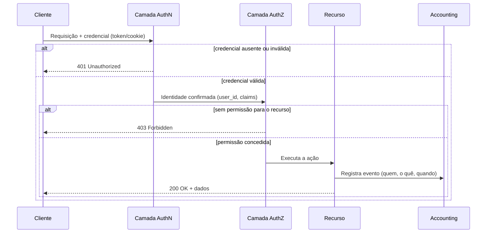
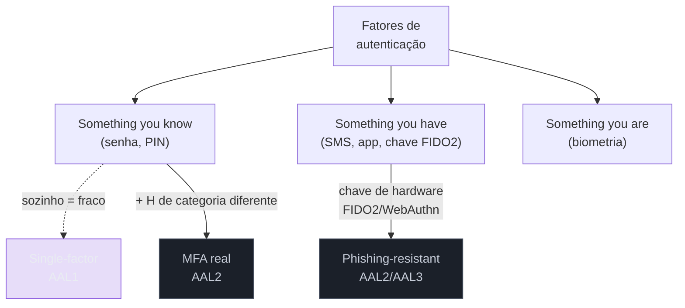
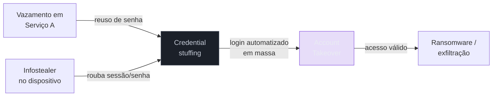
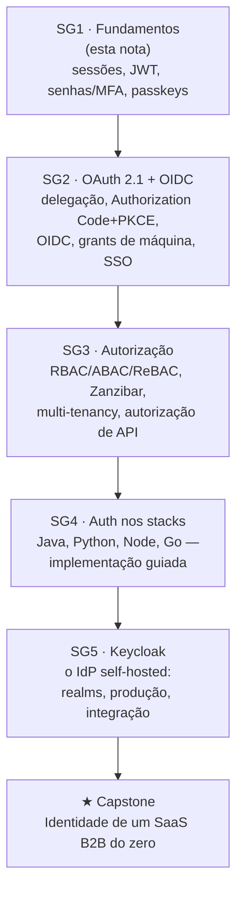

# Identidade, autenticação e autorização — o mapa

> [!abstract] TL;DR
> **Autenticação (AuthN)** prova quem você é; **autorização (AuthZ)** decide o que você pode fazer; **accounting** registra o que você fez — o trio clássico é chamado de **AAA**. São três decisões distintas, tomadas em momentos distintos do ciclo de uma requisição, e confundi-las é a origem de boa parte dos bugs e incidentes de segurança do mundo real: devolver 403 quando devia ser 401, ou pior, checar só "está logado?" e esquecer de checar "pode ver *isto*?". Um autenticador real combina fatores de **categorias diferentes** (algo que você sabe, tem ou é) — dois fatores da mesma categoria não são MFA, são teatro de segurança. Em 2026, identidade é a superfície de ataque mais explorada ao longo da cadeia de uma invasão: o Verizon DBIR mede credential abuse em 39% das cadeias de breach completas, e falhas de controle de acesso aparecem em 100% das aplicações testadas pelo OWASP. Esta nota é o mapa da trilha inteira — o vocabulário e os eixos que as próximas 24 notas aprofundam.

> [!question]- Perguntas que esta nota responde
> - Qual a diferença real entre autenticação e autorização — e por que confundi-las gera bugs de produção?
> - O que conta como MFA de verdade, e por que "dois passos" nem sempre significa "dois fatores"?
> - O que muda entre gerenciar identidade de funcionários (workforce) e de clientes (CIAM)?
> - Por que identidade virou o alvo nº 1 dos atacantes, e o que os números dizem sobre isso em 2026?

## O bug que não é bug de código

Um time está lançando a área de configurações de conta de um SaaS B2B. O endpoint `GET /api/orgs/{orgId}/settings` já existe há meses, protegido por um middleware que checa se a requisição carrega um token válido. Funciona bem: sem token, `401`; com token, `200`. Ninguém tocou nisso desde então porque "autenticação já está resolvida".

O problema é que o middleware nunca checou se o `orgId` da URL pertence à organização do usuário autenticado. Ele confirma **quem** está fazendo a chamada — mas não confirma se essa pessoa tem o **direito** de ver os dados daquela organização específica. Um usuário autenticado da Empresa A, trocando o `orgId` na URL por um número de outra empresa, lê as configurações da Empresa B inteira. Nenhuma linha de código quebrou; nenhum teste falhou. A aplicação fez exatamente o que foi escrita para fazer.

Esse padrão — **Insecure Direct Object Reference (IDOR)** — não é uma curiosidade acadêmica. É tão comum que a categoria que o contém, *Broken Access Control*, lidera o OWASP Top 10 há duas edições seguidas, e a edição 2025 encontrou alguma forma de controle de acesso quebrado em **100% das aplicações testadas**[^owasp]. Cem por cento não é "a maioria" — é "todas".

A causa raiz quase nunca é falta de conhecimento de criptografia ou de protocolo. É a confusão entre duas perguntas que soam parecidas mas são radicalmente diferentes:

- "Eu sei quem você é?" — **autenticação**.
- "Eu sei o que você pode fazer *com este recurso específico*?" — **autorização**.

O middleware do exemplo respondeu à primeira pergunta e tratou a resposta como se valesse para a segunda. É o erro mais caro e mais recorrente em sistemas de identidade — e é exatamente a distinção que esta nota, e a trilha inteira, existe para tornar automática no seu raciocínio.

## AAA: as três perguntas que toda requisição faz

O vocabulário que a indústria usa para nomear essas decisões vem de um framework antigo — nasceu em redes de telecom e VPN nos anos 1990, formalizado em protocolos como RADIUS e depois Diameter — mas que sobreviveu porque a estrutura lógica é atemporal. Chama-se **AAA**: Authentication, Authorization, Accounting[^aaa].

- **Authentication (AuthN)** — provar identidade. "Você é quem diz ser?" Normalmente resolvido uma vez no início de uma sessão (login) e depois reafirmado a cada requisição via um token ou cookie.
- **Authorization (AuthZ)** — decidir permissões. "Você, *já identificado*, pode fazer *esta* ação sobre *este* recurso?" Avaliado a cada operação sensível, não só uma vez.
- **Accounting** (também chamado de *auditing* fora do contexto de redes) — registrar o que aconteceu. "O que você fez, quando, e a partir de onde?" É o rastro que permite investigar um incidente depois que ele já ocorreu.

Repare que as três acontecem em **momentos diferentes** e respondem a **perguntas diferentes**. Isso é mais fácil de enxergar seguindo uma requisição HTTP do início ao fim:



O diagrama expõe algo que o exemplo do IDOR escondia: **existem dois pontos de falha, não um**. Um sistema pode acertar o primeiro (AuthN — "sei quem você é") e ainda assim vazar dados catastroficamente por pular o segundo (AuthZ — "você pode ver *isto*?"). São camadas independentes, e cada uma tem seu próprio código HTTP de resposta.

> [!question]- Por que a diferença entre 401 e 403 importa tanto?
> Porque cada código conta uma história operacional diferente para quem está depurando ou atacando o sistema. `401 Unauthorized` significa "o servidor não sabe quem você é" — faltou credencial, ou ela expirou/é inválida; a resposta correta do cliente é reautenticar (mandar de novo pro login). `403 Forbidden` significa "o servidor sabe exatamente quem você é, e a resposta é não" — reautenticar não resolve nada, porque o problema não é a identidade, é a permissão. Tecnicamente, a RFC 7235 exige que toda resposta `401` venha acompanhada do header `WWW-Authenticate`, dizendo *como* se autenticar; `403` não tem essa obrigação, porque não é um problema de autenticação[^401403]. Um app front-end que trata os dois códigos da mesma forma — por exemplo, deslogando o usuário sempre que vê um erro 4xx de auth — cria loops de logout confusos justamente quando o servidor está dizendo "eu sei quem você é, só não pode fazer isso".

Em uma frase: **401 é "não sei quem você é"; 403 é "sei exatamente quem você é, e não pode".**

### Voltando ao IDOR: o mesmo bug, com o fix

Vale fechar o exemplo de abertura mostrando exatamente onde a checagem que faltava deveria entrar. A versão quebrada só resolve AuthN e trata o resultado como se autorizasse qualquer coisa:

```python
# Quebrado: só checa "está autenticado?"
@app.get("/api/orgs/{org_id}/settings")
def get_settings(org_id: str, user: User = Depends(get_current_user)):
    # user é válido (AuthN ok) — mas ninguém checou se
    # user pertence a org_id (AuthZ ausente)
    return db.get_settings(org_id)
```

A versão corrigida não adiciona nenhuma tecnologia nova — só faz explicitamente a segunda pergunta do AAA, por recurso:

```python
# Corrigido: AuthN confirma quem, AuthZ confirma o direito sobre ESTE org_id
@app.get("/api/orgs/{org_id}/settings")
def get_settings(org_id: str, user: User = Depends(get_current_user)):
    if not user.belongs_to(org_id):
        raise HTTPException(403)  # autenticado, mas sem permissão AQUI
    return db.get_settings(org_id)
```

A diferença entre as duas versões é uma linha — mas é a linha que separa "aplicação funcionando" de "aplicação vazando dados de outro cliente". Nenhuma criptografia, nenhum protocolo novo: só a disciplina de nunca aceitar um identificador vindo do cliente (URL, payload, query string) sem confirmar que a identidade autenticada tem direito sobre *aquele* identificador específico.

## Fatores de autenticação: o que realmente prova identidade

Voltando à primeira pergunta do AAA — "você é quem diz ser?" — como se prova isso, tecnicamente? A resposta clássica, presente em praticamente todo material de segurança desde os anos 1980 e formalizada nas diretrizes do NIST (SP 800-63B), organiza as provas de identidade em três categorias, frequentemente citadas em inglês porque é assim que o mercado fala delas:

1. **Something you know** — algo que só você (deveria) saber: senha, PIN, resposta de pergunta de segurança.
2. **Something you have** — algo que só você (deveria) possuir: um celular recebendo SMS, um app autenticador gerando código, uma chave física FIDO2/security key.
3. **Something you are** — uma característica biométrica sua: impressão digital, reconhecimento facial.

**Autenticação multifator (MFA)** existe para reduzir o risco de um único fator ser comprometido — mas só funciona se os fatores vierem de **categorias diferentes**. Aqui mora a armadilha mais comum e menos entendida do assunto: combinar senha + pergunta de segurança ("nome do seu primeiro animal de estimação?") *parece* dois fatores, mas os dois são "algo que você sabe" — a mesma categoria. Um vazamento de dados que exponha as respostas das perguntas de segurança compromete os dois "fatores" simultaneamente, porque nunca foram independentes[^2famfa]. O mesmo vale para senha + PIN.

MFA de verdade combina categorias distintas: senha (know) + código do app autenticador ou toque numa chave física (have). E dentro da categoria "have", nem todos os métodos têm a mesma resistência — o que nos leva ao próximo ponto.

### Nem todo "segundo fator" resiste ao mesmo ataque

O CISA (a agência americana de segurança de infraestrutura) recomenda explicitamente abandonar SMS e chamadas de voz como segundo fator sempre que possível, reservando-os como último recurso, porque ambos são vulneráveis a SIM swapping e a interceptação via falhas do protocolo SS7[^cisa]. Push notifications (aquele "aprovar/negar" que os apps bancários mandam) sofrem de um ataque específico e cada vez mais comum: **MFA fatigue** (também chamado de *push bombing*), no qual o atacante, já de posse da senha roubada, dispara dezenas de solicitações de aprovação até a vítima aprovar uma por cansaço, distração ou hábito — foi esse vetor, por exemplo, que abriu brechas em incidentes de alto perfil na indústria de tecnologia nos últimos anos[^mfafatigue].

A resposta da indústria a esse problema tem nome: **phishing-resistant MFA**. O padrão FIDO2/WebAuthn (a base técnica das **passkeys**, tema da nota 05 desta trilha) amarra criptograficamente a autenticação ao domínio exato que a solicitou, o que torna o phishing estruturalmente impossível — não é que o usuário "resista melhor" ao golpe, é que o protocolo não permite que a credencial seja usada em um domínio diferente do original, mesmo que a vítima seja enganada. O NIST formaliza essa hierarquia em **Authenticator Assurance Levels (AAL)**: AAL1 aceita um único fator qualquer; AAL2 exige dois fatores de categorias diferentes (e a revisão mais recente do padrão, SP 800-63-4, já exige que toda implementação AAL2 ofereça uma opção phishing-resistant); AAL3 exige um autenticador de hardware resistente a phishing, como uma chave FIDO2 ou um smartcard[^aal].



Em uma frase: **MFA só é MFA quando os fatores vêm de categorias diferentes — e nem todo segundo fator resiste ao mesmo nível de ataque.**

> [!info] Onde isso é aprofundado
> Esta nota fica no nível do vocabulário. Senhas, hashing, políticas do NIST 800-63B e a "falha de recuperação de conta" ganham nota própria em [[04 - Senhas e MFA — o legado que não morre]]; passkeys e WebAuthn em detalhe (cerimônias, discoverable credentials, rollout) em [[05 - Passkeys e WebAuthn — o presente sem senha]]. O hashing de senha em si (argon2id vs bcrypt) é conceito de criptografia, coberto em [[06 - Hashing criptográfico|Segurança 06]] — aqui só usamos o resultado, não reexplicamos o mecanismo.

## CIAM vs workforce identity: o mesmo problema, públicos opostos

Até aqui tratamos "autenticar um usuário" como um problema único. Na prática, a indústria de IAM (Identity and Access Management) se divide em dois mundos com requisitos quase opostos, e reconhecer em qual mundo você está mudando decisões de arquitetura logo no início do projeto.

**Workforce identity** (às vezes chamado apenas de IAM corporativo) gerencia funcionários, contratados e parceiros de uma organização, tipicamente na casa das centenas a dezenas de milhares de contas. **CIAM** (Customer Identity and Access Management) gerencia os usuários finais de um produto — clientes — potencialmente na casa dos milhões[^ciam].

| Dimensão | Workforce IAM | CIAM |
|---|---|---|
| Escala típica | Centenas a dezenas de milhares | Milhares a dezenas de milhões |
| Tolerância a fricção | Alta — MFA obrigatório é aceito como parte do trabalho | Baixa — fricção no login derruba conversão |
| Login social (Google/Apple) | Raro; SSO corporativo domina | Comum, esperado |
| Regulação principal | SOX, HIPAA, controles internos | GDPR, CCPA, privacidade do consumidor |
| Objetivo de negócio | Reduzir risco de insider threat e phishing | Reduzir fricção *e* gerar receita/insight de marketing |
| Autenticação típica | MFA obrigatório, SSO corporativo (SAML/OIDC) | Autenticação adaptativa por risco, social login, passkeys |

O dado que melhor resume por que CIAM trata fricção como métrica de negócio, não só de segurança: **56% dos consumidores abandonam um serviço online quando o processo de login é complicado demais**[^ciam]. Num contexto workforce, ninguém abandona o emprego porque o MFA é chato — mas um cliente de e-commerce abandona o carrinho sem pensar duas vezes. É por isso que produtos CIAM investem pesado em autenticação de baixo atrito (passkeys, login social, autenticação adaptativa por risco) enquanto produtos workforce priorizam controle e auditoria.

> [!question]- Por que isso importa para quem está entrando na trilha agora?
> Porque toda decisão de protocolo que vem a seguir — sessão vs token, o fluxo OAuth escolhido, se você habilita login social — depende de em qual desses dois mundos seu sistema vive. Um SaaS B2B, tema do capstone desta trilha, frequentemente precisa dos dois ao mesmo tempo: workforce identity para o time interno que opera o produto, CIAM (ou uma variante B2B dela, geralmente chamada de **multi-tenancy**) para os clientes que usam o produto. Reconhecer isso cedo evita desenhar um único sistema de auth que tenta servir dois públicos com necessidades opostas.

Um termo que aparece nos dois mundos, mas com peso maior em CIAM/B2B, é **tenant** — a fronteira que isola os dados e usuários de um cliente organizacional dentro de um sistema multiusuário (aprofundado em [[03 - Multi-tenancy e organizações]], sub-galho 3). E toda informação que um token carrega sobre a identidade — nome, email, papel, tenant — é chamada de **claim**, termo que vamos reencontrar constantemente a partir da nota 03 (JWT) em diante.

## Identidade como superfície de ataque nº 1

A razão prática de existir uma trilha inteira sobre isso, e não só um capítulo dentro de "segurança geral", é que identidade deixou de ser um componente entre vários — ela virou **o perímetro**. A frase "identity is the new perimeter", cunhada por volta de 2015 para descrever a migração de cargas de trabalho para nuvens que a própria organização não opera, captura uma mudança estrutural: quando não existe mais um único datacenter com firewall na borda, a credencial que autoriza acesso *é* a nova fronteira de segurança[^perimeter].

Os números de 2026 confirmam essa tese, embora com uma reviravolta interessante. O **Verizon Data Breach Investigations Report (DBIR) 2026** — o relatório mais citado do setor, na sua 19ª edição — registrou, pela primeira vez na história do relatório, que **exploração de vulnerabilidades ultrapassou credenciais roubadas como vetor de acesso inicial** (31% contra 13% dos incidentes)[^dbir2026]. À primeira vista, isso parece dizer que identidade perdeu protagonismo. Mas o próprio relatório destaca o dado que desfaz essa leitura: **credential abuse continua sendo a técnica mais presente ao longo de toda a cadeia do breach, aparecendo em 39% das cadeias completas** — ou seja, mesmo quando o invasor entra por uma vulnerabilidade de software, ele frequentemente usa uma credencial roubada ou colhida em algum ponto posterior do ataque, para se mover lateralmente ou escalar privilégios[^dbir2026]. E olhando phishing e pretexting (engenharia social que também mira credenciais) somados a credential abuse puro, os métodos ligados a identidade ainda respondem coletivamente por uma fatia enorme dos acessos iniciais.

O DBIR 2026 também traz um dado sobre a economia por trás disso: **73% das vítimas de ransomware tinham uma infecção de infostealer ou vazamento de credencial associado no ano anterior ao ataque**, e os datasets de "stealer logs" monitorados pelo relatório surfam em média **2.362 credenciais corporativas vazadas por mês** só pelo domínio de email das organizações analisadas[^dbir2026]. Esse é o motor por trás do **credential stuffing** — o ataque automatizado que testa combinações de usuário/senha vazadas em outros serviços contra o seu login, na aposta (estatisticamente muito boa, dado o reuso de senha) de que algum usuário reutilizou a mesma senha em mais de um lugar. Uma análise de 2026 sobre logs de SSO corporativo encontrou uma mediana diária de **19% de todas as tentativas de autenticação classificadas como credential stuffing**, chegando a 44% no pior dia registrado[^credstuff].



Do lado da autorização, o quadro é igualmente concentrado: o **OWASP Top 10:2025** manteve *Broken Access Control* na posição A01 — o topo da lista — pelo segundo ciclo consecutivo, com o dado já citado de 100% das aplicações testadas apresentando alguma falha de controle de acesso[^owasp]. Junte os dois relatórios e a conclusão é direta: **quem ataca sistemas modernos ataca identidade — seja roubando a credencial (AuthN), seja explorando a ausência de checagem de permissão depois que a credencial já é válida (AuthZ)**. Isso não é uma tendência passageira de um ano; é a razão estrutural pela qual esta trilha existe como disciplina própria, e não como um apêndice de "segurança geral".

Em uma frase: **identidade não é um componente do sistema — em 2026, ela é o alvo primário e o ponto de falha mais comum, nos dois lados do AAA.**

## O mapa da trilha: dos fundamentos ao IdP em produção

Esta é a nota de abertura de uma trilha com 25 notas organizadas em cinco sub-galhos progressivos. Nenhum dos temas abaixo é aprofundado aqui — o objetivo é você sair desta nota sabendo *onde* cada peça vai morar, para não se perder navegando o restante.



**Sub-galho 1 — Fundamentos de identidade** (onde você está agora). Depois desta nota-mapa: [[02 - Sessões e cookies — auth stateful|sessões e cookies]] (o modelo mais antigo e ainda dominante na web tradicional), JWT e a família de tokens (o padrão que domina APIs e SPAs), senhas e MFA (o legado que recusa morrer) e passkeys/WebAuthn (o presente sem senha).

**Sub-galho 2 — OAuth 2.1 e OpenID Connect.** OAuth resolve um problema específico — delegar acesso sem compartilhar senha — e **não é, por si só, autenticação**; esse é um dos erros conceituais mais citados da indústria, e a primeira nota do sub-galho existe justamente para desarmá-lo. OIDC é a camada que *adiciona* identidade em cima do OAuth. Este sub-galho cobre o fluxo canônico (Authorization Code + PKCE), os grants de máquina (M2M, device flow) e como tokens se comportam em produção — inclusive o padrão **BFF (Backend For Frontend)**, a resposta de 2026 para o problema de "onde guardar o token no navegador".

**Sub-galho 3 — Autorização e multi-tenancy.** Autenticado ≠ autorizado — o tema que abrimos nesta nota ganha aqui seu tratamento completo: os três modelos de controle de acesso (RBAC, ABAC, ReBAC), o paper Zanzibar do Google e as ferramentas de policy-as-code que ele inspirou (OpenFGA, SpiceDB, OPA), e o desenho de multi-tenancy — a fronteira de identidade que separa clientes num SaaS B2B.

**Sub-galho 4 — Auth nos stacks.** Uma exceção deliberada à regra geral de "conceito, não tutorial" desta trilha: implementação guiada em Java (Spring Security), Python (Django e FastAPI), Node (Express e NestJS) e Go (Gin) — o suficiente para você reconhecer o idioma de auth de cada ecossistema, não boilerplate de projeto completo.

**Sub-galho 5 — Keycloak.** O IdP (Identity Provider) self-hosted de referência do mercado open-source: realms, clients, authentication flows, e como rodá-lo em produção — Organizations para multi-tenancy B2B, passkeys nativas, alta disponibilidade.

**Capstone.** Um walkthrough de decisão fechando a trilha: desenhar a identidade de um SaaS B2B do zero, decidindo build vs buy (Keycloak vs Auth0/Cognito), sessão vs token vs BFF, estratégia de rollout de passkeys, SSO/SAML para clientes enterprise, e o modelo de autorização por organização.

> [!info] Esta trilha instrumenta, não substitui, a Segurança conceitual
> Autenticação e autorização já têm notas conceituais no domínio Segurança — [[12 - Autenticação|Segurança 12]] e [[13 - Autorização e controle de acesso|Segurança 13]]. Esta trilha **não repete** esse conteúdo: ela é o *deep-dive de protocolo, decisão e implementação* que aquelas notas, por serem conceituais e domain-neutral, deliberadamente não cobrem. Da mesma forma, a criptografia por trás de tudo isso — hashing (senhas), assinaturas digitais (tokens), PKI (TLS/certificados) — mora em [[06 - Hashing criptográfico|Segurança 06]], [[10 - MAC, HMAC e assinaturas digitais|Segurança 10]] e [[11 - PKI e certificados|Segurança 11]]; aqui usamos esses mecanismos como ferramenta, sem reexplicar como funcionam por dentro.

## Armadilhas comuns

> [!warning] Tratar "logado" como sinônimo de "autorizado"
> **O que acontece:** um endpoint checa apenas se existe um token válido e, a partir daí, assume que o usuário pode acessar qualquer recurso que a URL ou o payload pedir. **Por quê:** autenticação e autorização são implementadas, mentalmente, como um único gate — "passou pelo middleware de auth, então pode seguir". Mas o middleware típico só resolve a pergunta "quem é você"; a pergunta "você pode ver *este* recurso específico" exige uma checagem separada, por recurso. **Como evitar:** trate toda autorização como *por recurso*, nunca como global. Antes de retornar dados de `orgId`, `userId` ou qualquer identificador na URL/payload, confirme explicitamente que o dono da credencial tem direito sobre *aquele* identificador — não apenas que a credencial é válida.

> [!warning] Contar "dois passos" como MFA sem checar a categoria dos fatores
> **O que acontece:** um sistema exige senha + pergunta de segurança, ou senha + PIN, e chama isso de "autenticação em duas etapas". **Por quê:** dois fatores da mesma categoria ("something you know" duas vezes) não são independentes — se um vazar, o outro tende a vazar junto, porque ambos vivem no mesmo tipo de segredo memorizável. **Como evitar:** MFA real exige categorias diferentes: senha (know) combinada com um app autenticador, chave FIDO2 ou biometria do dispositivo (have/are). Prefira métodos *phishing-resistant* (FIDO2/WebAuthn) a SMS ou push simples sempre que o risco justificar.

> [!warning] Confundir 401 e 403 na resposta da API
> **O que acontece:** uma API devolve `403 Forbidden` quando o token simplesmente expirou, ou devolve `401 Unauthorized` quando o usuário está autenticado mas não tem permissão para aquele recurso. **Por quê:** os dois códigos parecem intercambiáveis à primeira vista ("deu erro de acesso"), mas carregam semânticas opostas — um pede reautenticação, o outro não resolve nada com reautenticação. **Como evitar:** `401` = "não sei quem você é, autentique-se de novo" (sempre com header `WWW-Authenticate`); `403` = "sei quem você é, e a resposta é não". Clientes (SPAs, apps mobile) devem tratar os dois de formas diferentes — só o `401` deve disparar um fluxo de novo login.

> [!warning] Deixar accounting como afterthought
> **O que acontece:** o sistema autentica e autoriza corretamente, mas não registra quem fez o quê — quando um incidente acontece, não há trilha de auditoria para investigar. **Por quê:** accounting é o "terceiro A" e frequentemente o mais negligenciado, porque não bloqueia nenhuma funcionalidade visível ao usuário — só aparece quando já é tarde demais. **Como evitar:** registre eventos de autenticação e autorização (login, falha de login, mudança de permissão, acesso a dado sensível) desde o primeiro dia, não como retrofit pós-incidente. É consulta central no capstone de autorização de API (sub-galho 3).

## Em entrevista

Numa entrevista de nível sênior, este tema raramente aparece como "explique o que é OAuth" isolado — aparece embutido em perguntas de system design ("como você protegeria este endpoint multi-tenant?") ou em perguntas de debugging comportamental ("já viu um incidente de autorização? como investigou?"). O sinal que o entrevistador busca é justamente a distinção que abrimos nesta nota: você separa, sem hesitar, "prova de identidade" de "checagem de permissão por recurso" — e sabe dizer em que camada da requisição cada uma acontece.

Uma resposta fraca fica no vocabulário ("uso JWT para autenticação"). Uma resposta forte amarra o mecanismo à decisão: "eu autentico com um token de curta duração e valido a assinatura no gateway; mas a autorização — quem pode ver qual `orgId` — eu resolvo no serviço, verificando o claim de tenant contra o recurso pedido, nunca confiando só na validade do token". Isso sinaliza que você já foi mordido pela armadilha do IDOR, ou que estudou o suficiente para nunca precisar ser.

Outro eixo comum: perguntas sobre MFA e por que "SMS ainda é usado se é fraco" — a resposta madura reconhece o trade-off (SMS é melhor que nada, pior que FIDO2, e às vezes é a única opção viável para o público-alvo) em vez de tratar segurança como binário. E perguntas sobre CIAM vs workforce aparecem em entrevistas de arquitetura de produto B2B — reconhecer que os dois públicos coexistem no mesmo sistema é, com frequência, o próprio ponto que o entrevistador quer ver você descobrir sozinho.

Um exemplo de como essa distinção aparece embutida numa pergunta aberta:

> **Entrevistador:** "Nosso produto é um SaaS B2B. Um cliente relatou que um funcionário dele conseguiu ver dados de outra empresa cliente nossa. Como você investigaria e como evitaria isso no futuro?"
>
> **Resposta fraca:** "Eu checaria os logs de autenticação para ver se o login foi válido."
>
> **Resposta forte:** "Primeiro eu separaria as duas perguntas: o acesso foi de um usuário autenticado legitimamente (AuthN ok), ou alguém se passou por outra pessoa? Pelos logs de accounting, eu reconstituiria qual endpoint foi chamado e com qual identificador de tenant. Minha suspeita inicial seria um caso de IDOR — o endpoint provavelmente confia em um `orgId` vindo da URL sem revalidar contra o tenant do usuário autenticado. A correção não é reforçar autenticação, é auditar todo endpoint que aceita um identificador de recurso e garantir que ele sempre valida posse, não só validade do token."

A resposta forte não cita nenhuma tecnologia nova — ela demonstra que o candidato já separa AuthN de AuthZ por reflexo, e sabe onde procurar a causa raiz antes mesmo de abrir um log.

## How to explain it in English

> "Authentication proves who you are; authorization decides what you're allowed to do — and conflating the two is the single most common root cause behind access-control bugs in production. A request can pass authentication perfectly and still leak data catastrophically because nobody checked whether *this* authenticated user has permission over *that specific* resource."

| PT | EN |
|----|----|
| Autenticação | Authentication (AuthN) |
| Autorização | Authorization (AuthZ) |
| Contabilização / auditoria | Accounting / auditing |
| Fator de autenticação | Authentication factor |
| Autenticação multifator | Multi-factor authentication (MFA) |
| Resistente a phishing | Phishing-resistant |
| Credencial | Credential |
| Identidade de funcionários | Workforce identity |
| Identidade de clientes | Customer identity (CIAM) |
| Inquilino (fronteira multi-tenant) | Tenant |
| Referência insegura direta a objeto | Insecure Direct Object Reference (IDOR) |
| Controle de acesso quebrado | Broken access control |

## O que vem a seguir

Ficamos no vocabulário: AAA, fatores de autenticação, CIAM vs workforce, e o motivo estatístico de identidade ser o alvo número um. Falta a primeira peça técnica — *como*, mecanicamente, um servidor lembra que você já provou quem é entre uma requisição e a próxima, já que HTTP não tem memória nenhuma por natureza. Esse é o problema que sessões resolvem, e é ali que a trilha desce do vocabulário para o mecanismo.

- [[02 - Sessões e cookies — auth stateful]] — o modelo mais antigo de "lembrar" um usuário autenticado, os cookies que o sustentam, e por que ele continua sendo a resposta certa para a maioria das aplicações web tradicionais
- [[03 - JWT e a família de tokens]] — a alternativa stateless que domina APIs e SPAs, e os trade-offs que ela troca por não depender de um servidor guardar estado

## Fontes

- **Verizon** — [*2026 Data Breach Investigations Report*](https://www.verizon.com/business/resources/reports/dbir/) — dados de credential abuse (39% nas cadeias completas de breach, 13% como vetor de acesso inicial), infostealers e ransomware; acessado em 2026-07-10.
- **OWASP** — [*A01:2025 Broken Access Control*](https://owasp.org/Top10/2025/A01_2025-Broken_Access_Control/) — 100% das aplicações testadas com alguma falha de controle de acesso, IDOR como padrão dominante; acessado em 2026-07-10.
- **NIST** — [*SP 800-63B — Digital Identity Guidelines: Authentication and Lifecycle Management*](https://pages.nist.gov/800-63-4/sp800-63b.html) — os três fatores de autenticação e os níveis AAL1/AAL2/AAL3; acessado em 2026-07-10.
- **CISA** — [*Implementing Phishing-Resistant MFA*](https://www.cisa.gov/sites/default/files/publications/fact-sheet-implementing-phishing-resistant-mfa-508c.pdf) — por que SMS/voz devem ser último recurso e o que conta como phishing-resistant; acessado em 2026-07-10.
- **FIDO Alliance** — [*The State of Passkeys 2026: Global Consumer and Workforce Report*](https://fidoalliance.org/fido-alliance-reports-accelerating-global-passkey-adoption-on-world-passkey-day-2026/) — 90% de awareness, 75% adoção em ao menos uma conta, 5 bilhões de passkeys em uso; acessado em 2026-07-10.
- **SuperTokens** — [*Demystifying HTTP Error Codes: 401 vs 403*](https://supertokens.com/blog/http-error-codes-401-vs-403) — a semântica dos dois códigos e a obrigação do header `WWW-Authenticate`; acessado em 2026-07-10.
- **FusionAuth** — [*CIAM vs. IAM*](https://fusionauth.io/articles/ciam/ciam-vs-iam) — a distinção workforce vs customer identity e a estatística de abandono por fricção de login (56%); acessado em 2026-07-10.
- **SecureW2** — [*What Three Threat Reports Reveal About Credential Stuffing and Credential Theft in 2026*](https://securew2.com/signal/credential-stuffing-and-theft-in-2026-what-three-threat-reports-reveal-about-the-identity-crisis) — a mediana de 19% de tentativas de login classificadas como credential stuffing em SSO corporativo; acessado em 2026-07-10.
- **Waldo Security** — [*"Identity Is the New Perimeter": Where the Phrase Came From*](https://www.waldosecurity.com/post/identity-is-the-new-perimeter-where-the-phrase-came-from-and-why-it-finally-matters) — origem e contexto da frase, por volta de 2015; acessado em 2026-07-10.
- **Cisco Duo** — [*MFA fatigue: What it is and how to respond*](https://duo.com/blog/mfa-fatigue-what-is-it-how-to-respond) — mecânica do ataque de push bombing/MFA fatigue; acessado em 2026-07-10.
- **Yubico** — [*MFA vs 2FA: What actually determines security*](https://www.yubico.com/resources/glossary/mfa-vs-2fa/) — por que fatores da mesma categoria não constituem MFA real; acessado em 2026-07-10.

[^owasp]: OWASP, *A01:2025 Broken Access Control*. [^aaa]: Framework AAA — ver Wikipedia, *Authentication, authorization, and accounting*, e TechTarget, *What is Authentication, Authorization and Accounting?*. [^401403]: SuperTokens, *Demystifying HTTP Error Codes: 401 vs 403*. [^2famfa]: Yubico, *MFA vs 2FA: What actually determines security*. [^cisa]: CISA, *Implementing Phishing-Resistant MFA*. [^mfafatigue]: Cisco Duo, *MFA fatigue: What it is and how to respond*. [^aal]: NIST SP 800-63B / 800-63-4, Authenticator Assurance Levels. [^ciam]: FusionAuth, *CIAM vs. IAM*. [^perimeter]: Waldo Security, *"Identity Is the New Perimeter"*. [^dbir2026]: Verizon, *2026 Data Breach Investigations Report*. [^credstuff]: SecureW2, *What Three Threat Reports Reveal About Credential Stuffing and Credential Theft in 2026*.
