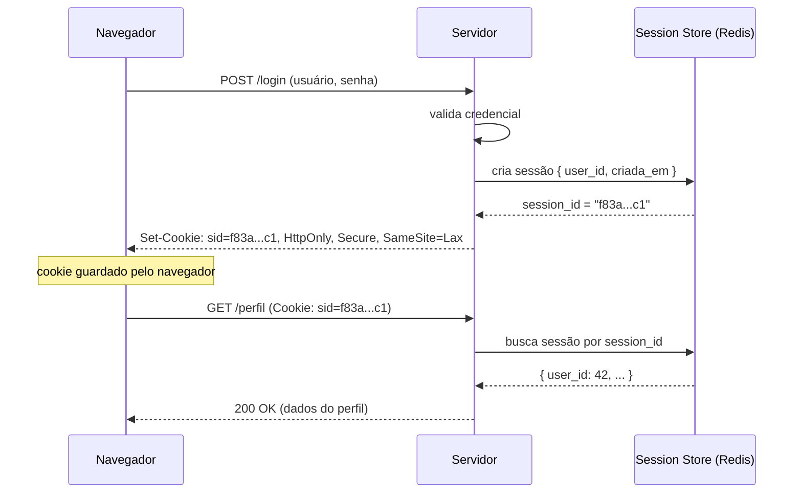
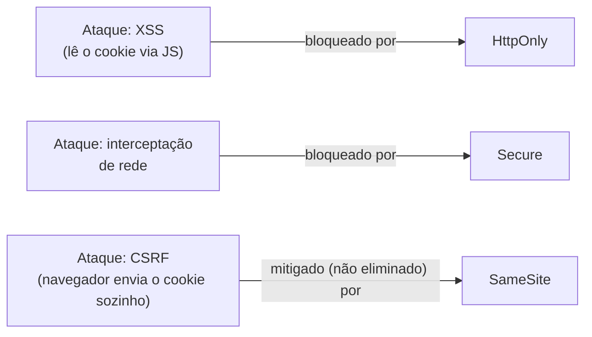
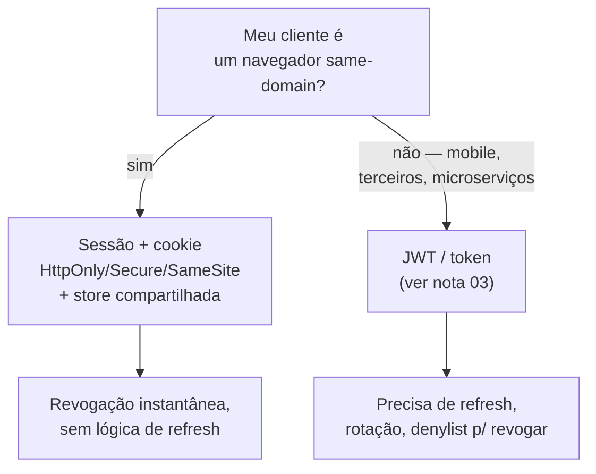

# Sessões e cookies — auth stateful

> [!abstract] TL;DR
> Auth por **sessão** é simples na cabeça: no login, o servidor gera um **session ID opaco** (um número aleatório sem significado), guarda o estado do usuário associado a ele numa store server-side, e manda esse ID pro navegador dentro de um **cookie**. Em cada request seguinte, o navegador devolve o cookie automaticamente e o servidor consulta a store para saber quem está falando. A segurança inteira mora em três lugares: as **flags do cookie** (`HttpOnly` bloqueia roubo via XSS, `Secure` exige HTTPS, `SameSite` limita em quais requests cross-site o cookie viaja), a defesa contra **CSRF** (porque o navegador anexa o cookie sozinho, um site malicioso pode disparar requests "autenticados" sem o usuário saber — `SameSite` ajuda mas não substitui um token anti-CSRF), e a **rotação do session ID no login** (sem isso, um atacante que planta um ID antes do login herda a sessão autenticada — *session fixation*). O mito de que "JWT é mais moderno, logo melhor" não sobrevive ao exame: para uma aplicação web tradicional renderizada no servidor, sessão com store compartilhada (Redis) continua sendo, em 2026, a resposta mais simples e mais segura — revogação instantânea, sem lógica de refresh token, sem token para vazar.

> [!question]- Perguntas que este capítulo responde
> - Por que meu app "desloga sozinho" quando escalo para mais de uma instância atrás de um load balancer?
> - Quais flags de cookie eu preciso saber de cor para uma entrevista de segurança, e o que cada uma impede especificamente?
> - Por que `SameSite=Lax` não é "resolvi CSRF" — e quando eu ainda preciso de um token?
> - Sessão é tecnologia velha que só sobrevive por inércia, ou ainda é a escolha certa em 2026?

## O bug que só aparece em produção

Um time sobe a segunda instância da aplicação atrás de um load balancer para lidar com mais tráfego. Nos testes locais, tudo funciona. Em produção, os usuários reclamam de algo estranho: fazem login, navegam por duas páginas, e de repente são jogados de volta pra tela de login — como se a sessão nunca tivesse existido.

O time investiga logs de erro. Não há exceção, não há timeout, não há nada óbvio. O que aconteceu foi silencioso: o request de login caiu na **instância A**, que criou a sessão **na própria memória do processo**. O próximo clique do usuário caiu na **instância B**, que nunca ouviu falar dessa sessão — porque ela vivia só no `Map` em RAM da instância A. Pro usuário, parece que a aplicação "esqueceu" dele. Pro servidor, ele nunca existiu ali.

Esse é o primeiro fato que qualquer discussão séria sobre sessões tem que encarar: **uma sessão é só tão confiável quanto o lugar onde ela mora**. Se ela vive na memória de um processo, ela está amarrada aquele processo — e a arquitetura inteira (load balancer, deploy, escala horizontal) precisa saber disso ou vai quebrar de um jeito que parece bug de autenticação, mas é na verdade bug de infraestrutura.

O segundo fato, menos visível ainda, é o inverso: mesmo quando a sessão funciona perfeitamente do ponto de vista do usuário, ela carrega um risco estrutural que não tem nada a ver com senha vazada ou XSS. Porque o navegador anexa o cookie de sessão **automaticamente**, um site completamente diferente — que o usuário nem sabe que visitou — pode fazer o navegador disparar um request "autenticado" para a sua aplicação, sem que o usuário clique em nada além de um link malicioso. Isso é CSRF, e é a segunda metade deste capítulo.

Este capítulo desmonta a sessão em três camadas: **como ela funciona** (o mecanismo request/response), **como ela é atacada** (CSRF e fixation), e **como ela vive em produção** (stores, timeout, logout de verdade) — terminando com a pergunta que todo entrevistador de sênior faz: sessão ainda é a resposta certa, ou é tecnologia de museu?

## Como a sessão funciona: o mecanismo

A ideia central é simples de enunciar e fácil de errar na implementação: **o cookie nunca guarda dado sensível — ele guarda só uma chave**.

1. Usuário envia usuário/senha no login.
2. Servidor valida a credencial e cria um registro de sessão — um objeto com `user_id`, timestamps, talvez roles — numa **store** (memória, Redis, banco).
3. Servidor gera um **session ID**: uma string aleatória, opaca, sem significado embutido (nada de `base64(user_id)` — isso seria adivinhável).
4. Servidor manda esse ID de volta num header `Set-Cookie`.
5. O navegador guarda o cookie e o reenvia automaticamente, no header `Cookie`, em toda request subsequente para o mesmo domínio.
6. Em cada request, o servidor pega o ID do cookie, consulta a store, recupera o estado da sessão, e sabe quem está falando — sem o cliente ter enviado credencial de novo.



Repare no que o session ID **não** é: ele não é um JWT, não carrega claims, não é auto-descritivo. É uma chave burra para um valor guardado no servidor — o oposto filosófico de um token stateless. Essa diferença é a raiz de quase todo trade-off entre sessão e JWT que aparece mais adiante neste capítulo e na próxima nota, [[03 - JWT e a família de tokens]].

> [!question]- Por que não simplesmente guardar o `user_id` direto no cookie, sem indireção nenhuma?
> Porque um valor legível e adivinhável no cliente é um convite a forjar identidade — trocar `user_id=42` por `user_id=1` e virar admin. A indireção via session ID aleatório (64+ bits de entropia, segundo o [OWASP Session Management Cheat Sheet](https://cheatsheetseries.owasp.org/cheatsheets/Session_Management_Cheat_Sheet.html)) garante que o cliente nunca vê nem controla o dado real — só possui uma chave que não significa nada fora do contexto do servidor. Se um atacante rouba o cookie, ele rouba acesso à sessão; ele não aprende nada sobre a estrutura interna do sistema. Isso também é por que frameworks são orientados a **não usar nomes de cookie padrão** como `PHPSESSID` ou `JSESSIONID` — eles vazam a stack tecnológica para quem está reconhecendo o alvo.

## Anatomia do cookie: as flags que decidem a segurança

Um cookie de sessão bem configurado se parece com isto — e cada atributo depois do `;` existe para fechar um ataque específico:

```http
Set-Cookie: __Host-sid=f83a9c21b7e4...; Path=/; Secure; HttpOnly; SameSite=Lax; Max-Age=1800
```

| Atributo | O que faz | Ataque que fecha |
|----------|-----------|-------------------|
| `HttpOnly` | Bloqueia acesso via `document.cookie` no JavaScript | Roubo de sessão via **XSS** — mesmo que um script malicioso rode na página, ele não lê o cookie |
| `Secure` | Cookie só trafega em conexão HTTPS | Interceptação em rede não criptografada (Wi-Fi público, MITM) |
| `SameSite=Strict` | Cookie nunca vai em request cross-site, nem em navegação de topo | CSRF, mas quebra links externos que chegam logado (ex.: e-mail com link pro app) |
| `SameSite=Lax` (default nos browsers modernos) | Cookie vai em navegação de topo cross-site (clicar num link), mas não em `POST`/`fetch`/imagem/iframe cross-site | CSRF via `POST` automático continua bloqueado; CSRF via link comum ainda é possível em teoria, mas o `Lax` cobre a maioria dos casos práticos |
| `SameSite=None` | Cookie vai em qualquer request, inclusive cross-site — **exige `Secure`** | Nenhum; é a opção "desligado", só para cenários legítimos de cookie de terceiro (ex.: widget embutido) |
| Prefixo `__Host-` | Exige `Secure`, proíbe `Domain`, exige `Path=/` | Injeção de cookie por subdomínio comprometido — o cookie só é aceito se veio do host exato |
| Prefixo `__Secure-` | Exige `Secure` | Mesma proteção parcial, permitindo compartilhar entre subdomínios quando necessário |

Essas definições vêm do [MDN — Set-Cookie](https://developer.mozilla.org/en-US/docs/Web/HTTP/Reference/Headers/Set-Cookie) (acessado em 2026-07-10) e do [OWASP Session Management Cheat Sheet](https://cheatsheetseries.owasp.org/cheatsheets/Session_Management_Cheat_Sheet.html).

Um detalhe que separa quem decorou a tabela de quem entende o mecanismo: **`HttpOnly` não impede o cookie de ser enviado** — ele só impede o *JavaScript* de lê-lo. O navegador continua anexando o cookie em toda request, inclusive as disparadas por `fetch()`. Essa distinção é exatamente o que abre a porta para CSRF: o atacante não precisa *ler* o cookie, só precisa que o navegador da vítima o *envie* — e `HttpOnly` não impede isso.



> [!question]- `__Host-` parece estritamente melhor que um cookie sem prefixo — por que nem todo mundo usa?
> Porque `Path=/` obrigatório e a proibição de `Domain` fecham exatamente os casos de uso legítimos de compartilhar um cookie entre `app.exemplo.com` e `api.exemplo.com`, ou de restringir um cookie a `/admin`. Para uma aplicação monolítica simples, servida de um único host, `__Host-` é estritamente superior e deveria ser o padrão. Para uma arquitetura com múltiplos subdomínios que legitimamente precisam ver o mesmo cookie, `__Secure-` é o compromisso — ainda exige HTTPS, mas permite `Domain=.exemplo.com`. A régua é: comece com `__Host-` e só relaxe se a arquitetura exigir.

## CSRF: o ataque que a sessão herda de graça

**Cross-Site Request Forgery** explora exatamente o comportamento que faz sessão ser conveniente: o navegador anexa o cookie **automaticamente**, sem o site que fez o request precisar pedir permissão. Segundo o [OWASP CSRF Prevention Cheat Sheet](https://cheatsheetseries.owasp.org/cheatsheets/Cross-Site_Request_Forgery_Prevention_Cheat_Sheet.html), um site malicioso — um e-mail, um blog, um anúncio — engana o navegador autenticado da vítima a executar uma ação indesejada no site confiável.

```mermaid
sequenceDiagram
    participant V as Vítima (navegador, logada em banco.com)
    participant M as site-malicioso.com
    participant B as banco.com

    Note over V,B: Vítima já tem cookie de sessão válido em banco.com
    V->>M: visita site-malicioso.com (ex.: link em e-mail)
    M-->>V: página com <form action="banco.com/transferir" method="POST"> auto-submit
    V->>B: POST /transferir (Cookie: sid=... anexado automaticamente!)
    Note over B: servidor não sabe que o request<br/>partiu de outro site — só vê um cookie válido
    B-->>V: transferência executada
```



O detalhe brutal: a vítima **nunca viu** o formulário, nunca digitou nada, talvez nem tenha percebido que o site abriu. O navegador fez tudo sozinho, porque cookies não sabem *de onde* veio o request — só sabem *para onde* ele vai.

### Por que `SameSite` ajuda mas não resolve sozinho

`SameSite=Lax`, o default nos navegadores modernos desde 2020, já elimina boa parte desse ataque: requests `POST` cross-site (como o do exemplo acima) não levam mais o cookie. Mas o próprio cheat sheet da OWASP lista três limitações reais:

1. **`Lax` ainda permite navegação de topo.** Se a ação sensível puder ser disparada por um `GET` (um link, não deveria, mas acontece em APIs mal desenhadas), o cookie ainda viaja.
2. **O escopo "same-site" é mais largo que "same-origin".** Um cookie setado em `app.exemplo.com` é considerado "same-site" vindo de `qualquercoisa.exemplo.com` — se um subdomínio for comprometido, a proteção não ajuda.
3. **Cobertura inconsistente.** Navegadores antigos, clientes embutidos e alguns *user agents* não aplicam `SameSite` de forma confiável — e ele não protege contra CSRF disparado do lado do cliente por outro vetor (ex.: uma extensão maliciosa).

Por isso a recomendação de 2025-2026 é **defesa em camadas**: `SameSite` como primeira linha, mais um **token anti-CSRF** como segunda, e cada vez mais o uso de **Fetch Metadata headers** (`Sec-Fetch-Site`) como uma terceira camada leve e moderna que o servidor pode inspecionar sem guardar estado extra.

### Os dois padrões de token anti-CSRF

**Synchronizer Token Pattern.** O servidor gera um token secreto, imprevisível, por sessão (ou por formulário) e o embute num campo hidden do HTML — nunca num cookie. O cliente reenvia esse token junto com o request de mutação (form field ou header customizado). O servidor compara o token recebido com o que guardou na sessão; se não bater, rejeita. É o padrão mais forte porque o token nunca trafega como cookie — só um atacante que já consegue ler o HTML da página legítima (o que já seria XSS, um problema diferente) teria acesso a ele.

**Double-Submit Cookie.** O servidor manda o token tanto num cookie quanto espera recebê-lo de volta num header ou campo de formulário. Se os dois batem, o request é legítimo — a lógica é que um site cross-site consegue fazer o navegador *enviar* o cookie, mas não consegue *ler* seu valor para replicá-lo no header (a política de mesma origem do navegador impede isso). A variante **ingênua** (sem assinatura) é vulnerável se um subdomínio comprometido conseguir plantar um cookie com o mesmo nome; a variante **assinada** (HMAC amarrando o token a dados da sessão) é a recomendada quando uma arquitetura stateless torna o synchronizer pattern inviável.

> [!question]- Se meu framework já injeta um token CSRF automaticamente (Django, Rails, Spring Security), preciso entender isso na prática?
> Sim — porque a pergunta de entrevista raramente é "seu framework me protege?", é "e se você desabilitar sem saber, ou expor um endpoint de API que ignora o middleware de forma?". A maioria dos incidentes reais de CSRF em produção não acontece porque o padrão está errado — acontece porque alguém adicionou um endpoint novo (webhook, API JSON) que foi isento da proteção CSRF "porque não é um form HTML", sem perceber que ainda aceita cookie de sessão como autenticação. A regra estrutural: **qualquer endpoint que aceita cookie de sessão para autenticar uma ação que muda estado precisa de proteção CSRF — não importa se é chamado por um `<form>` ou por `fetch()`**.

## Session fixation: a sessão que o atacante escolhe

Onde CSRF explora o cookie *depois* de autenticado, **session fixation** ataca o momento *antes*: o atacante planta um session ID conhecido na vítima e espera ela fazer login com ele.

Segundo a descrição da [OWASP sobre session fixation](https://owasp.org/www-community/attacks/Session_fixation), o fluxo típico é:

1. Atacante visita a página de login do app vulnerável e recebe um session ID legítimo, ainda não autenticado — digamos `sid=abc123`.
2. Atacante força a vítima a usar esse mesmo ID — via link malicioso (`https://app.com/login?sid=abc123`, se o app aceitar ID via URL), via campo hidden de formulário, ou via XSS que planta o cookie diretamente.
3. A vítima, sem saber, acessa o app usando `sid=abc123` e faz login normalmente com sua própria senha.
4. **Se o app não gerar um novo session ID após o login**, `sid=abc123` agora representa uma sessão autenticada — e o atacante, que já conhecia esse ID desde o passo 1, simplesmente usa o mesmo cookie e herda a sessão da vítima, sem nunca ter visto a senha dela.

A causa raiz é sempre a mesma: **o servidor tratou o session ID como contínuo através da fronteira de autenticação**, quando ele deveria ser descartado e recriado exatamente nesse ponto.

A correção, segundo a [OWASP Session Fixation Protection](https://owasp.org/www-community/controls/Session_Fixation_Protection), é uma regra simples e não-negociável: **regenerar o session ID em todo login e em toda mudança de nível de privilégio** (ex.: usuário vira admin, ou reautentica para uma ação sensível). Praticamente todo framework tem o método pronto — `session_regenerate_id(true)` em PHP, `Session.Abandon()` em ASP.NET, invalidar e recriar o `HttpSession` em Java. A segunda metade da defesa é nunca aceitar session ID vindo de query string ou campo de formulário — só de cookie, que o navegador controla de forma mais restrita.

> [!warning] Session fixation via ID na URL
> **O que acontece:** o app aceita `?sessionid=xyz` na URL como alternativa ao cookie — geralmente "para funcionar sem cookies habilitados" ou para debugging. **Por quê:** um session ID na URL é trivialmente injetável — basta mandar o link para a vítima, ou ele vaza em logs de proxy, histórico do navegador, header `Referer`. **Como evitar:** aceitar session ID **somente** via cookie. Se o app precisa funcionar sem cookies (raro em 2026), essa é uma decisão de produto que merece revisão de segurança dedicada, não um fallback silencioso.

## Ciclo de vida: quanto tempo uma sessão deve viver

Uma sessão que nunca expira é uma sessão que, uma vez roubada (cookie vazado, dispositivo compartilhado, malware), dá acesso permanente ao atacante. O [OWASP Session Management Cheat Sheet](https://cheatsheetseries.owasp.org/cheatsheets/Session_Management_Cheat_Sheet.html) distingue dois timeouts que resolvem problemas diferentes:

- **Idle timeout** — a sessão expira depois de um período *sem atividade* (tipicamente 2 a 30 minutos, dependendo da sensibilidade do sistema: um banco é mais agressivo que uma rede social). Protege contra o cenário de "deixei o notebook aberto na sala de reunião".
- **Absolute timeout** — a sessão expira depois de um período fixo *desde o login*, não importa quanta atividade houve (tipicamente 4 a 8 horas). Protege contra o cenário de sessão sequestrada continuar válida indefinidamente, mesmo que o usuário legítimo continue ativo.

Os dois trabalham juntos: idle timeout pega o esquecimento, absolute timeout limita o estrago de um roubo silencioso que passa despercebido. E os dois **precisam ser aplicados no servidor** — um `Max-Age` no cookie é só uma sugestão pro navegador descartar o cookie; nada impede um cliente malicioso de reenviar um cookie "expirado" manualmente. A store é quem decide, na hora da consulta, se aquela sessão ainda é válida.

### Logout de verdade

Um erro comum e sutil: "fazer logout" só apagando o cookie no navegador. Isso desloga a *interface*, mas se o session ID ainda existir na store do servidor, qualquer um que capture esse valor (num proxy, num log, num histórico) ainda consegue reautenticar com ele — a sessão nunca foi de fato encerrada.

Logout de verdade é uma ação em **duas pontas**:

- **Servidor:** invalidar o registro na store (`session_destroy()`, `HttpSession.invalidate()`, `DEL` no Redis) — a partir daqui, aquele session ID não corresponde a nada, mesmo que alguém ainda o possua.
- **Cliente:** expirar o cookie (`Max-Age=0` ou `Expires` no passado) para que o navegador pare de reenviá-lo, e idealmente enviar `Cache-Control: no-store` para páginas que mostrem dado sensível, evitando que o botão "voltar" do navegador exiba conteúdo autenticado de um cache local.

## Onde a sessão mora: stores em produção

Voltando ao bug de abertura — o problema nunca foi "sessão", foi "sessão presa na memória de um processo". A escolha da store é a decisão de infraestrutura mais importante desta nota inteira.

| Store | Como funciona | Quando usar | Risco |
|-------|---------------|-------------|-------|
| **Memória do processo** | `Map` in-process, sem dependência externa | Protótipo, single instance, dev local | Morre no restart; não escala horizontal sem sticky sessions |
| **Sticky sessions** (afinidade no load balancer) | LB sempre roteia o mesmo cliente pra mesma instância, permitindo sessão em memória mesmo com múltiplas instâncias | Legado que não vale a pena migrar agora | Distribuição de carga desigual; perde a sessão inteira se a instância cair; deploys/rolling updates ficam estressantes |
| **Store compartilhada (Redis)** | Toda instância lê/escreve na mesma store externa; qualquer instância atende qualquer request | Padrão recomendado para produção em 2026 | Depende da disponibilidade do Redis; exige rede entre app e store |

A recomendação corrente é clara: sticky sessions resolvem o sintoma, não a causa, e criam fragilidade operacional — uma instância cai, todo mundo grudado nela perde a sessão. Uma store compartilhada como Redis, com **TTL nativo** (a sessão expira sozinha, sem job de limpeza) e latência sub-milissegundo, torna qualquer instância intercambiável: nenhum request depende de "lembrar" qual servidor o atendeu antes. Deploys rolantes deixam de derrubar sessões de usuário — a analogia útil é: sticky session é como cada atendente de um banco só reconhecer os clientes que ele mesmo atendeu antes; store compartilhada é o banco de dados central que qualquer caixa consulta.

> [!question]- Redis cai, o que acontece com todas as sessões?
> Depende inteiramente de como o Redis está configurado. Sem replicação, é um single point of failure de verdade — Redis fora do ar significa ninguém consegue validar sessão, efetivamente um apagão de autenticação. Em produção, isso empurra a decisão para replicação (Redis Sentinel ou Cluster) e para a pergunta que toda trilha de Operação também faz: qual é o SLA aceitável para esse componente, e o que acontece no modo de falha (fail-open deixaria todo mundo "autenticado" por acidente — nunca aceitável; fail-closed derruba logins até o Redis voltar — o padrão correto, ainda que doloroso).

## Sessão em 2026: quando ela ainda é a resposta certa

A pergunta que costuma aparecer, quase sempre carregada de um viés implícito: "JWT não é mais moderno?" A resposta curta é **não** — moderno e adequado são coisas diferentes, e a escolha certa depende do formato do cliente, não da idade da tecnologia.

O consenso que emerge da cobertura recente do tema é que, **para uma aplicação web tradicional renderizada no servidor** (ou mesmo um SPA same-domain com um backend próprio), sessão com store compartilhada continua sendo o padrão de 2026 — e por razões concretas, não nostalgia:

- **Revogação instantânea.** Deletar a chave no Redis desloga o usuário na hora. Um JWT assinado, por design, continua válido até expirar — revogar de verdade exige uma denylist, que é reintroduzir estado em algo que se vendia como stateless.
- **Sem lógica de refresh.** Sessão não precisa da dança de access token curto + refresh token + rotação + detecção de reuse que um sistema JWT correto exige (ver [[03 - JWT e a família de tokens]]).
- **Nada para vazar em texto legível.** O session ID é opaco; um JWT decodificado em base64 expõe claims — não é criptografado, só assinado, então qualquer um que o intercepte lê o payload.
- **Menor superfície de ataque em storage no cliente.** Cookie `HttpOnly` nunca é acessível a JavaScript; token guardado em `localStorage` (erro comum de implementações JWT malfeitas) é trivialmente roubável via XSS.

Ferramentas modernas de auth para Node — **Auth.js/NextAuth**, **Better Auth**, **Supabase Auth** — por padrão implementam sessão server-side por essas razões, não apesar delas.

Onde JWT genuinamente ganha: **APIs stateless consumidas por múltiplos clientes** (mobile, terceiros, microserviços) onde não existe um "navegador com cookie" na equação, ou onde a verificação precisa acontecer sem round-trip a uma store central (ex.: um gateway validando token sem consultar o serviço de auth a cada request). O padrão híbrido mais comum na prática: sessão em cookie para o app web, JWT de vida curta para a API mobile/terceiros — cada um resolvendo o problema que só ele resolve bem.

Em uma frase: **a pergunta certa nunca é "sessão ou JWT é melhor" — é "meu cliente é um navegador que aceita cookie, ou um client que precisa carregar sua própria prova de identidade sem depender de uma store central?"**



## Exemplo trabalhado: uma sessão do login ao logout

Para tornar tudo concreto, o ciclo completo de uma sessão bem configurada, com os headers reais em cada passo.

**1. Login** — `POST /login` com credenciais válidas:

```http
HTTP/1.1 200 OK
Set-Cookie: __Host-sid=9f8e7d6c5b4a3928; Path=/; Secure; HttpOnly; SameSite=Lax; Max-Age=1800
Set-Cookie: csrf_token=3a1f...; Path=/; Secure; SameSite=Lax
```

Duas coisas acontecem aqui: o session ID é gerado **novo** (nunca reaproveitando um ID pré-login — fechando fixation), e um token CSRF separado é emitido, este acessível a JavaScript (sem `HttpOnly`) porque o front-end precisa lê-lo para enviá-lo de volta num header customizado.

**2. Request autenticado** — `GET /perfil`, o navegador anexa os cookies automaticamente:

```http
GET /perfil HTTP/1.1
Cookie: __Host-sid=9f8e7d6c5b4a3928; csrf_token=3a1f...
```

O servidor consulta a store por `9f8e7d6c5b4a3928`, encontra `{ user_id: 42, criado_em: ..., expira_em: ... }`, verifica que não passou do idle timeout, e responde.

**3. Mutação de estado** — `POST /perfil/atualizar`, agora exigindo o token CSRF explicitamente, fora do cookie:

```http
POST /perfil/atualizar HTTP/1.1
Cookie: __Host-sid=9f8e7d6c5b4a3928; csrf_token=3a1f...
X-CSRF-Token: 3a1f...
```

O servidor compara o `X-CSRF-Token` do header com o valor guardado na sessão (ou com o cookie, no padrão double-submit assinado). Só prossegue se baterem — um site cross-site consegue fazer o navegador enviar o cookie, mas não consegue ler o valor pra replicá-lo no header, porque a leitura de cookie de outro site é bloqueada pela mesma política de origem que protege o resto da web.

**4. Logout** — `POST /logout`:

```http
HTTP/1.1 200 OK
Set-Cookie: __Host-sid=; Path=/; Secure; HttpOnly; SameSite=Lax; Max-Age=0
Clear-Site-Data: "cache", "cookies", "storage"
```

E, do lado do servidor, o registro `9f8e7d6c5b4a3928` é apagado da store — não só marcado, apagado — para que nenhum reenvio manual do cookie antigo tenha qualquer efeito.

## Armadilhas comuns

> [!warning] Cookie de sessão sem `HttpOnly`
> **O que acontece:** o time expõe o cookie de sessão a JavaScript "para o front-end conseguir ler o usuário logado" — geralmente para popular um estado de UI sem round-trip ao servidor. **Por quê:** qualquer XSS na página, mesmo pontual, agora consegue ler `document.cookie` e exfiltrar o session ID inteiro para um servidor do atacante — que passa a poder personificar o usuário sem nunca ter visto senha alguma. **Como evitar:** o cookie de sessão nunca leva dado de UI. Se o front precisa saber "quem está logado", isso vem de um endpoint autenticado (`GET /me`) que lê o cookie `HttpOnly` no servidor e devolve só o que o front precisa — nunca expondo o próprio identificador de sessão ao JavaScript.

> [!warning] `SameSite=None` configurado sem entender a implicação
> **O que acontece:** um erro de CORS ou um cookie que "não estava sendo enviado" é resolvido trocando `SameSite=Lax` por `SameSite=None` — porque "resolveu o bug" — sem revisar por que o cookie precisava viajar cross-site em primeiro lugar. **Por quê:** `SameSite=None` desliga a única barreira nativa contra CSRF que o navegador oferece de graça. Se a aplicação não tinha, antes disso, um token anti-CSRF robusto, ela acabou de reabrir a porta inteira. **Como evitar:** `SameSite=None` só é legítimo quando o cookie *precisa* ser third-party por design (ex.: widget embutido em outro domínio) — e, nesse caso, ele tem que vir acompanhado de proteção CSRF explícita, nunca sozinho.

> [!warning] Sessão fixation por reaproveitar o ID pré-login
> **O que acontece:** o framework (ou um código customizado de sessão) cria o session ID na primeira visita — mesmo antes do login — e simplesmente promove esse mesmo ID depois que a credencial é validada, sem regenerar nada. **Por quê:** qualquer ID que existia antes da autenticação pode, em teoria, já ser conhecido por um atacante (plantado via link, XSS, ou até só adivinhado se a entropia for baixa) — e esse atacante herda a sessão autenticada sem nunca ver a senha. **Como evitar:** todo framework sério de sessão expõe um método de "regenerar ID mantendo os dados" (`session_regenerate_id`, `cycleKey`, `Session.Migrate`) — chamar esse método é o primeiro passo do handler de login, sempre, sem exceção, e também em toda elevação de privilégio (ex.: virar admin dentro da mesma sessão).

> [!warning] Timeout só no cliente, nunca validado no servidor
> **O que acontece:** o front-end desloga o usuário depois de X minutos de inatividade — via JavaScript, um timer que limpa o estado local — mas o servidor nunca checa, ele próprio, se a sessão passou do prazo. **Por quê:** um cliente malicioso ou modificado (ou simplesmente o DevTools) ignora esse timer sem esforço; o cookie continua válido para sempre, porque o servidor nunca impôs limite algum na store. **Como evitar:** todo timeout — idle e absolute — precisa ser um campo checado na consulta à store (`expira_em < agora() → rejeitar`), nunca uma lógica que depende do cliente cooperar.

## Em entrevista

Sessões costumam aparecer de duas formas na entrevista de sênior: como pergunta de conceito ("como você garante que a autenticação sobrevive a múltiplas instâncias?") ou embutida dentro de uma pergunta de system design ("desenhe um sistema de login"). Nas duas, o sinal que separa júnior de sênior é o mesmo do resto da trilha de entrevista: **não é saber que existe cookie — é justificar cada flag e cada escolha de store por um trade-off**.

Um candidato forte, ao ser perguntado "e se essa API tivesse duas instâncias atrás de um load balancer?", já antecipa o problema sem precisar ser cutucado: "sessão em memória local não sobrevive a isso — eu externalizaria pra um Redis compartilhado, com TTL, e aí qualquer instância consegue validar qualquer request". Isso mostra profundidade operacional, não só conhecimento de livro.

A segunda armadilha clássica de entrevista é o candidato despejar "JWT é mais escalável" como resposta automática sem contexto — um red flag, porque ignora que, para a maior parte dos apps web tradicionais, sessão com store compartilhada resolve o mesmo problema com menos superfície de ataque e sem lógica de refresh. Antecipar essa nuance — "depende: se o cliente é um navegador same-domain, eu preferiria sessão pela revogação instantânea; se for uma API consumida por terceiros, aí JWT ganha" — é o tipo de resposta que sinaliza pensamento, não memorização.

## How to explain it in English

> "Session-based auth keeps an opaque session ID in an `HttpOnly`, `Secure` cookie, and the actual user state lives server-side — typically in Redis so any instance behind the load balancer can validate it. The two things I always check are CSRF protection, because the browser attaches that cookie automatically to any request, same-site or not, so `SameSite=Lax` plus an explicit CSRF token is the right combination; and session fixation, meaning the session ID gets regenerated on login, never reused from before authentication. For a traditional server-rendered app, this is still the 2026 default — instant revocation and no refresh-token complexity — JWTs earn their keep when the client isn't a same-domain browser."

| PT | EN |
|----|----|
| Sessão / auth stateful | Session-based / stateful auth |
| ID de sessão opaco | Opaque session ID |
| Cookie de sessão | Session cookie |
| Store de sessão | Session store |
| Fixação de sessão | Session fixation |
| Falsificação de requisição entre sites | Cross-Site Request Forgery (CSRF) |
| Token anti-CSRF | Anti-CSRF token |
| Padrão token sincronizador | Synchronizer token pattern |
| Cookie de submissão dupla | Double-submit cookie |
| Tempo limite de inatividade | Idle timeout |
| Tempo limite absoluto | Absolute timeout |
| Revogar / invalidar a sessão | Revoke / invalidate the session |
| Sessão presa (afinidade de servidor) | Sticky session (session affinity) |

## O que vem a seguir

Sessão resolve bem o caso "navegador same-domain, um back-end que controla a própria store". Mas assim que o cliente deixa de ser um navegador comum — um app mobile, um serviço terceiro, um microsserviço que precisa validar identidade sem consultar uma store central a cada chamada — a resposta muda de forma. A próxima nota olha para o outro lado dessa moeda: tokens auto-descritivos que carregam sua própria prova de validade.

- [[03 - JWT e a família de tokens]] — anatomia de um JWT, JWS vs JWE, e o trade-off central: nada para consultar no servidor, mas nada fácil de revogar

## Veja também

- [[Auth e Identidade/index|Auth e Identidade]] — o galho-pai e o mapa da trilha
- [[01 - Identidade, autenticação e autorização — o mapa]] — o vocabulário-base de IAM que esta nota assume
- [[12 - Autenticação]] — o conceito neutro de autenticação na trilha de Segurança; esta nota é o deep-dive de *como* implementar auth stateful

## Fontes

- **OWASP** — [*Session Management Cheat Sheet*](https://cheatsheetseries.owasp.org/cheatsheets/Session_Management_Cheat_Sheet.html) — entropia de session ID, flags de cookie, timeout idle/absoluto, logout correto. Acessado em 2026-07-10.
- **OWASP** — [*Cross-Site Request Forgery Prevention Cheat Sheet*](https://cheatsheetseries.owasp.org/cheatsheets/Cross-Site_Request_Forgery_Prevention_Cheat_Sheet.html) — limites do `SameSite`, synchronizer token, double-submit cookie, Fetch Metadata headers. Acessado em 2026-07-10.
- **OWASP** — [*Session fixation*](https://owasp.org/www-community/attacks/Session_fixation) — mecânica do ataque passo a passo. Acessado em 2026-07-10.
- **OWASP** — [*Session Fixation Protection*](https://owasp.org/www-community/controls/Session_Fixation_Protection) — a defesa por regeneração de ID. Acessado em 2026-07-10.
- **MDN** — [*Set-Cookie header*](https://developer.mozilla.org/en-US/docs/Web/HTTP/Reference/Headers/Set-Cookie) — sintaxe, valores de `SameSite`, prefixos `__Host-`/`__Secure-`. Acessado em 2026-07-10.
- **oneuptime.com** — [*How to Modernize Session Management from Sticky Sessions to Redis*](https://oneuptime.com/blog/post/2026-02-17-how-to-modernize-session-management-from-sticky-sessions-to-cloud-memorystore-redis-on-gcp/view) — motivação prática para migrar sticky sessions para store compartilhada. Acessado em 2026-07-10.
- **toolshelf.tech** — [*JWT vs Session Authentication: The Definitive Guide 2026*](https://toolshelf.tech/blog/jwt-vs-session-authentication-guide-2026/) — panorama do consenso 2026 sobre quando sessão ainda é a escolha certa. Acessado em 2026-07-10.
