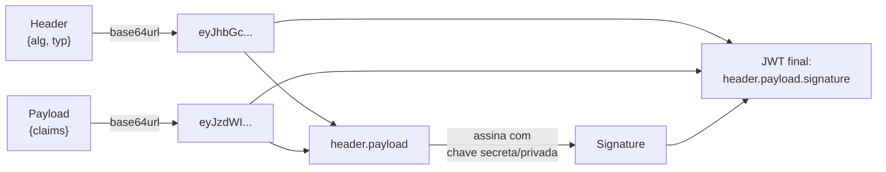
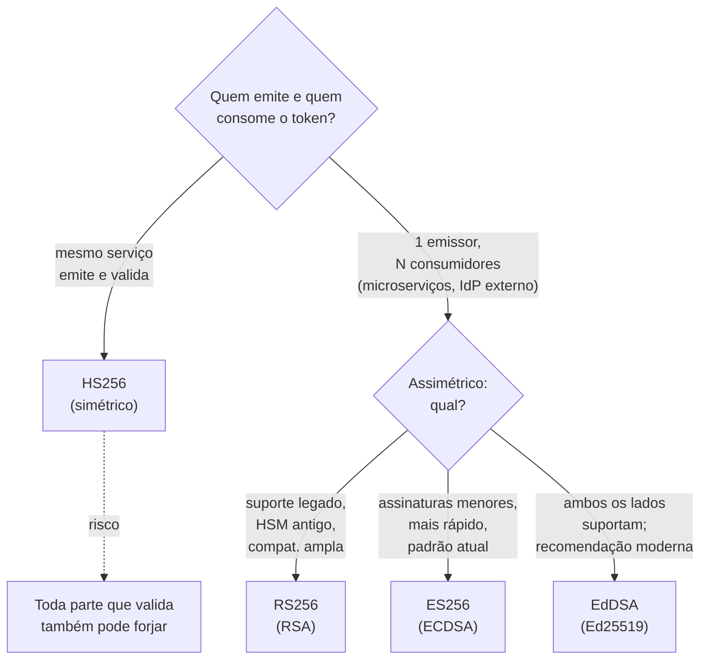
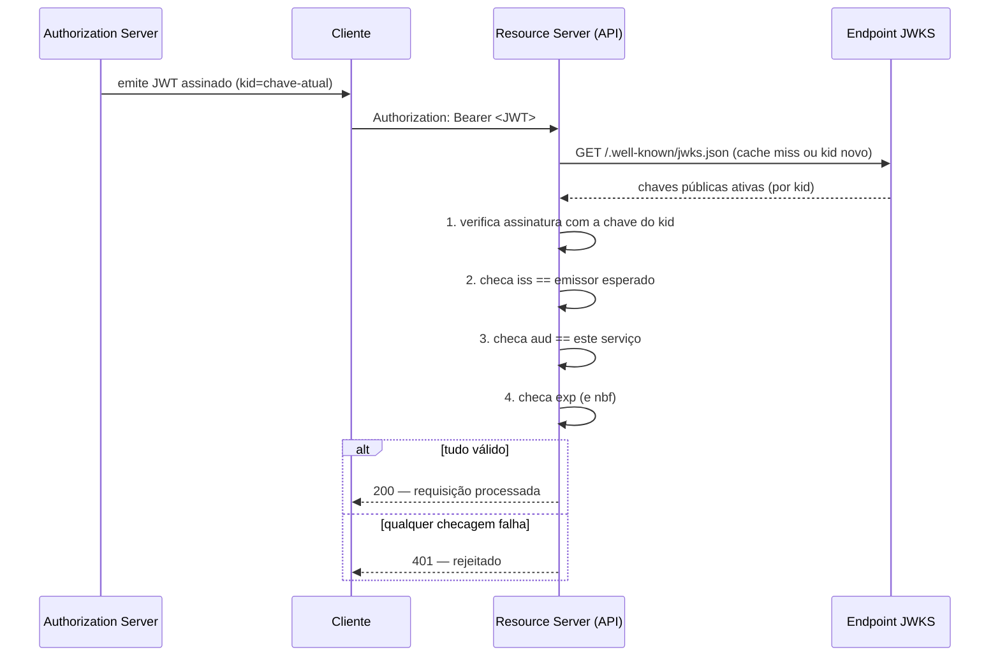

# JWT e a família de tokens

> [!abstract] TL;DR
> Um **JWT** é três blobs base64url separados por ponto — `header.payload.signature` — e a parte perigosa da história é que **os dois primeiros são só codificados, não criptografados**: qualquer um lê o payload sem chave nenhuma. O que garante integridade é a **assinatura** (JWS), verificada contra a chave pública ou secreta do emissor; sem essa verificação, "decodificar o JWT" não é "validar o JWT" — é só ler texto. A família se ramifica em JWS (assinado, o caso comum) e JWE (criptografado, raro), com algoritmos simétricos (HS256, uma chave só) e assimétricos (RS256/ES256/EdDSA, chave privada assina e pública verifica) resolvendo problemas de confiança diferentes. Validar direito significa checar assinatura **e** `iss`/`aud`/`exp` — não só um decode. E o trade-off que nenhuma biblioteca resolve por você: JWT é **stateless por design**, então **não tem logout de verdade** — só expira ou você reintroduz estado com denylist/refresh curto, o que devolve exatamente o custo que o JWT prometia eliminar.

> [!question]- Perguntas que este texto responde
> - Por que decodificar um JWT no jwt.io e "ele bate" não significa que o token é válido?
> - Qual a diferença real entre JWS e JWE, e por que quase ninguém usa JWE?
> - Quando uso HS256 e quando uso RS256/ES256/EdDSA — e por que confundir os dois é uma vulnerabilidade crítica?
> - Se um JWT é roubado, como eu revogo o acesso sem matar o benefício de ser stateless?

Um time recebe um JWT no header `Authorization: Bearer ...` e escreve isto no middleware:

```
const payload = JSON.parse(atob(token.split('.')[1]));
if (payload.role === 'admin') { /* libera */ }
```

Funciona nos testes. Funciona em produção — até o dia em que alguém pega qualquer JWT válido de qualquer conta, edita o payload em texto puro (`{"role":"user"}` → `{"role":"admin"}`), reencoda em base64url e reenvia. O middleware decodifica, lê `role: admin`, libera. Nenhuma assinatura foi checada porque **nenhuma linha desse código chama uma função de verificação** — só `JSON.parse` e `atob`, que são operações de *leitura*, não de *prova*.

Esse não é um bug exótico. É o erro fundacional mais comum em código JWT amador, porque o formato **convida** ao erro: o payload é JSON legível a olho nu, então parece "só ler os dados" — como se fosse um cookie de sessão que o servidor já validou antes de te entregar. Não é. Um JWT chega do cliente, e o cliente é hostil por definição. A única coisa que separa "dados que o servidor confia" de "dados que qualquer um forjou" é a assinatura — e ela só protege alguma coisa se **alguém a verificar**.

Esta nota dissecta um JWT real campo a campo, explica por que a família se divide em JWS e JWE, quando usar cada algoritmo de assinatura, como validar de verdade (não só decodificar), e por que o design "sem estado" do JWT é ao mesmo tempo sua maior virtude de escala e o motivo pelo qual ele não sabe fazer logout.

## Anatomia: três partes, dois papéis

Um JWT (JSON Web Token, [RFC 7519](https://www.rfc-editor.org/rfc/rfc7519.html)) é uma string com três segmentos separados por `.`:

```
header.payload.signature
```

Cada segmento é **base64url** — não base64 comum. A diferença importa: base64 padrão usa `+` e `/` no alfabeto e `=` de padding, e todos os três símbolos têm significado especial em URLs (`+` vira espaço, `/` é separador de path, `=` colide com `chave=valor` de query string). Base64url troca `+`→`-`, `/`→`_` e **descarta o padding**, para que o token inteiro caiba numa URL, num header HTTP ou num cookie sem precisar de escaping adicional ([RFC 4648 §5](https://datatracker.ietf.org/doc/html/rfc4648#section-5), referenciada pela própria RFC 7519).

Pegue um JWT canônico — o exemplo padrão que aparece no debugger do [jwt.io](https://jwt.io):

```
eyJhbGciOiJIUzI1NiIsInR5cCI6IkpXVCJ9.
eyJzdWIiOiIxMjM0NTY3ODkwIiwibmFtZSI6IkpvaG4gRG9lIiwiaWF0IjoxNTE2MjM5MDIyfQ.
SflKxwRJSMeKKF2QT4fwpMeJf36POk6yJV_adQssw5c
```

(quebrado em três linhas só para leitura; no fio é uma string contínua, sem espaços). Decodificando cada parte:

**Header** (base64url → JSON):
```json
{ "alg": "HS256", "typ": "JWT" }
```
Diz *como* o token foi assinado (`alg`) e que tipo de estrutura é (`typ`). É o primeiro pedaço que um atacante tenta manipular — mais adiante.

**Payload** (base64url → JSON):
```json
{ "sub": "1234567890", "name": "John Doe", "iat": 1516239022 }
```
As *claims* — as afirmações que o token carrega. `sub` (subject) diz de quem é o token; `iat` (issued at) diz quando foi emitido. Repare: **isto é só JSON codificado, não criptografado**. Rode `atob()` em qualquer console de navegador nessas duas primeiras partes e você lê tudo — nome, papel, permissões, o que quer que esteja lá. JWT não é um cofre; é um envelope de vidro com um lacre.

**Signature**: o lacre. Para HS256, é `HMAC-SHA256(base64url(header) + "." + base64url(payload), secret)`. Ou seja: pega o header e o payload *ainda codificados* (a string literal antes do último ponto), concatena, e aplica HMAC com uma chave secreta. Qualquer mudança de um único byte no header ou no payload muda a assinatura resultante — é isso que torna a adulteração detectável, **desde que alguém recompute e compare o HMAC no lado do verificador**.



Para provar que não há mágica nenhuma nisso, dá para decodificar as duas primeiras partes na linha de comando, sem biblioteca JWT alguma — só um decodificador base64url comum:

```bash
echo 'eyJzdWIiOiIxMjM0NTY3ODkwIiwibmFtZSI6IkpvaG4gRG9lIiwiaWF0IjoxNTE2MjM5MDIyfQ' \
  | tr '_-' '/+' | base64 -d
# {"sub":"1234567890","name":"John Doe","iat":1516239022}
```

Nenhuma chave foi usada, nenhum segredo foi necessário — porque não havia segredo nenhum protegendo o payload em primeiro lugar. O único jeito de provar que o token *não foi adulterado* é recalcular o HMAC (ou verificar a assinatura RSA/ECDSA) com a chave certa e comparar contra a terceira parte — e é exatamente esse passo que o código de abertura pulou.

Em uma frase: **um JWT prova quem o emitiu (se você verificar a assinatura); não esconde o que ele diz (o payload é texto legível pra qualquer um)**.

> [!question]- Se o payload é legível, por que não é um problema de segurança por si só?
> É um problema — só que um problema *diferente* do que as pessoas assumem. Não coloque segredo nenhum no payload (senha, token de terceiro, PII sensível) porque qualquer um na rede ou com acesso ao token o lê. O que o JWT garante é **integridade e autenticidade**: se a assinatura bate, você sabe que foi o emissor que escreveu aquele payload e que ninguém alterou um bit desde então. Confidencialidade é outro contrato — o de JWE, que vem a seguir — e a maioria dos sistemas simplesmente não precisa dele porque o token já viaja dentro de TLS.

## JWS vs JWE — assinado vs criptografado

A "família JWT" na verdade é definida por duas RFCs irmãs que dividem o trabalho:

- **JWS — JSON Web Signature** ([RFC 7515](https://www.rfc-editor.org/rfc/rfc7515.html)): assina ou aplica MAC no conteúdo. Garante **integridade e autenticidade** — prova que o conteúdo não mudou e veio de quem diz que veio. O payload continua **legível em texto puro**.
- **JWE — JSON Web Encryption** ([RFC 7516](https://www.rfc-editor.org/rfc/rfc7516.html)): criptografa o conteúdo. Garante **confidencialidade** — ninguém sem a chave lê o payload. Estrutura de cinco partes (`header.encrypted_key.iv.ciphertext.tag`) em vez de três.

O "JWT" que você encontra em 99% dos sistemas — no header `Authorization: Bearer`, emitido por um IdP, validado por uma API — é quase sempre um **JWS**, nunca um JWE. A razão é prática, não dogmática: o token já trafega dentro de TLS (HTTPS), que já criptografa o transporte inteiro ponta a ponta. Criptografar *de novo* o conteúdo do token é redundante na maioria dos casos — dobra o custo computacional, complica a gestão de chaves (agora você precisa de um par adicional só para decriptar) e resolve um problema que o TLS já resolveu.

JWE aparece em cenários mais estreitos: quando o token passa por *múltiplos saltos* não confiáveis (ex.: um proxy intermediário que não deveria ler o payload, só repassar), ou quando a claim carrega dado verdadeiramente sensível que precisa ficar opaco mesmo para quem tem o token em mãos mas não a chave de decriptação. É o caso minoritário — a RFC 8725 (Best Current Practices, ver adiante) nem sequer trata JWE como o caminho padrão.

Em uma frase: **JWS prova que o conteúdo não mudou; JWE esconde o conteúdo — e quase todo JWT do mundo real é só JWS, porque o TLS já cuida da confidencialidade em trânsito.**

> [!info] Onde isso é implementado no seu stack
> Esta nota fica na teoria/protocolo, não em código de um framework específico. Se você trabalha em **Java/Spring**, a estrutura, assinatura e validação de JWT em Spring Security estão em [[08 - JWT — estrutura, assinatura e validação]] (Java/Segurança). Se trabalha em **Node**, a implementação com a lib `jsonwebtoken` está em [[04 - JWT e autenticação com jsonwebtoken]] (Node/Segurança). Ambas assumem o que esta nota explica — vale ler esta primeiro.

## Algoritmos: simétrico vs assimétrico, e quando usar cada um

O campo `alg` no header determina o algoritmo de assinatura. Eles se dividem em duas famílias com modelos de confiança opostos:

**HS256 (HMAC-SHA256) — simétrico.** Uma única chave secreta assina *e* verifica. Quem tem a chave pode fazer as duas coisas. Isso significa: **todo serviço que precisa validar o token também precisa ter a chave secreta** — e qualquer um desses serviços, se comprometido, pode forjar tokens novos, não só validar os existentes.

**RS256 (RSA) / ES256 (ECDSA) / EdDSA (Ed25519) — assimétricos.** Um par de chaves: a **privada** assina (só o emissor tem), a **pública** verifica (pode ser distribuída livremente, inclusive publicada num endpoint). Um serviço consumidor valida tokens sem nunca ter o poder de emitir novos — só o Authorization Server, dono da chave privada, emite.

A escolha entre eles não é estética — é uma pergunta sobre **quem precisa confiar em quem**:



- **HS256** faz sentido quando o mesmo serviço (ou um conjunto pequeno e confiável de serviços internos) emite e valida — ex.: uma API monolítica que assina o próprio token de sessão. É mais simples e mais barato computacionalmente. É a escolha **errada** no momento em que um IdP externo emite tokens para múltiplos consumidores que não deveriam ter poder de emissão.
- **RS256** é o padrão histórico para cenários multi-consumidor (um Authorization Server, N APIs resource server) — universal, mas assinaturas maiores (chaves de 2048+ bits) e verificação mais lenta que as alternativas por curva elíptica.
- **ES256** (ECDSA sobre a curva P-256) entrega segurança equivalente a RS256 com chaves e assinaturas bem menores, e é hoje o padrão de facto recomendado quando RSA não é exigência legada.
- **EdDSA (Ed25519)** é a recomendação mais moderna quando emissor e verificador suportam: determinístico por construção (não depende de um nonce aleatório por assinatura, eliminando uma classe inteira de falhas de implementação que afetou ECDSA no passado), mais rápido para assinar e verificar que ECDSA, e resistente a side-channel por design. A hierarquia de recomendação corrente é **EdDSA > ECDSA/RSA-PSS > RSA-PKCS1v1.5** (RS256 tradicional).

Em uma frase: **simétrico faz sentido só quando emissor e verificador são a mesma parte confiável; no momento em que há mais de um consumidor, assimétrico é obrigatório — e dentro dos assimétricos, a curva elíptica ganha de RSA em tamanho e velocidade.**

## Claims: o vocabulário do payload

A RFC 7519 registra sete *claims* (afirmações) com significado padronizado — todas opcionais no papel, mas `exp` é praticamente universal na prática:

| Claim | Nome | O que diz |
|-------|------|-----------|
| `iss` | Issuer | Quem emitiu o token — normalmente a URL do Authorization Server |
| `sub` | Subject | De quem é o token — o ID do usuário/entidade |
| `aud` | Audience | Para quem o token é destinado — qual(is) API(s) devem aceitá-lo |
| `exp` | Expiration Time | Timestamp Unix a partir do qual o token deixa de ser válido |
| `nbf` | Not Before | Timestamp antes do qual o token ainda não vale |
| `iat` | Issued At | Quando o token foi emitido |
| `jti` | JWT ID | Identificador único do token — útil para denylist e detecção de replay |

Além das registradas, qualquer aplicação pode adicionar **claims customizadas** — `role`, `permissions`, `tenant_id`, o que o domínio precisar. A única regra é evitar colisão de nome com claims registradas ou com namespaces reservados de outros padrões (OIDC, por exemplo, reserva `email`, `name`, `picture` como *claims padrão*, não obrigatórias pela 7519 mas convencionadas pelo OpenID Connect Core).

Em uma frase: **`iss`/`aud`/`exp` não são decoração — são exatamente os três campos que, se você não checar, transformam "validar" em "só decodificar".**

## Validação correta: assinatura + iss + aud + exp

Aqui mora o erro do exemplo de abertura, generalizado. Existem quatro checagens obrigatórias, e pular qualquer uma deixa uma porta aberta:

1. **Verificar a assinatura** contra a chave certa (simétrica ou pública do emissor) — sem isso, qualquer payload é aceito.
2. **Checar `iss`** — o token foi emitido por quem eu confio, e não por outro Authorization Server que eu happens a aceitar tokens de?
3. **Checar `aud`** — este token foi emitido *para mim* (esta API específica), ou é um token válido para outro serviço que eu estou aceitando por engano? Sem checar `aud`, um token válido para o serviço de leitura de perfil pode ser reaproveitado no serviço de pagamentos, se ambos compartilham o mesmo emissor.
4. **Checar `exp` (e `nbf` se presente)** — o token não expirou (e já é válido, se houver `nbf`).



Em pseudocódigo, a diferença entre "decodificar" e "validar de verdade" cabe nesta oposição:

```text
# ERRADO — só lê, nunca prova nada
payload = json_decode(base64url_decode(token.split('.')[1]))
if payload.role == 'admin': allow()

# CERTO — a biblioteca faz as quatro checagens, com algoritmo fixado pelo servidor
claims = jwt_library.verify(
    token,
    key=jwks_public_key_for(kid),
    algorithms=["RS256"],       # nunca deduzido do token
    issuer="https://auth.example.com",
    audience="api.example.com",
)
# se chegou aqui: assinatura ok, iss ok, aud ok, exp/nbf ok
if claims.role == 'admin': allow()
```

A diferença entre as duas versões não é estilo — é que a primeira aceita *qualquer* JSON com a forma certa, e a segunda só aceita o que o emissor de fato assinou, para essa audiência, dentro da janela de validade.

A [RFC 8725 — JWT Best Current Practices](https://datatracker.ietf.org/doc/html/rfc8725) existe justamente porque, anos depois da 7519, ficou claro que "parseie o JSON e leia os campos" era o comportamento default de bibliotecas inteiras — e o resultado foram vulnerabilidades sistêmicas na indústria (a seção de armadilhas, abaixo, detalha os CVEs reais). A recomendação central da 8725: **a aplicação deve fixar de antemão qual algoritmo e quais parâmetros são aceitáveis** — nunca deduzir do próprio token o que validar.

Em uma frase: **validar um JWT são quatro checagens, não uma — assinatura garante que não foi adulterado, `iss`/`aud`/`exp` garantem que é o token certo, do emissor certo, ainda dentro da janela certa.**

## JWKS e rotação de chaves

Em cenários assimétricos com múltiplos consumidores, como cada resource server sabe qual chave pública usar para verificar? A resposta é o **JWKS — JSON Web Key Set** ([RFC 7517](https://datatracker.ietf.org/doc/html/rfc7517)): um documento JSON publicado pelo emissor, tipicamente em `/.well-known/jwks.json`, contendo o array `keys` com todas as chaves públicas ativas.

Cada chave no JWKS carrega um `kid` (Key ID) — um identificador curto. O header do JWT também carrega esse `kid`, dizendo *qual* chave do conjunto foi usada para assinar. O fluxo de verificação:

1. O resource server recebe o JWT, lê o `kid` do header.
2. Busca a chave correspondente no JWKS — em cache local, se já a tiver; senão, faz `GET` no endpoint.
3. Usa essa chave pública específica para verificar a assinatura.

Isso viabiliza **rotação de chaves sem downtime**: o emissor gera um par novo, publica a chave pública nova no JWKS *antes* de começar a assiná-la (período de graça), passa a assinar tokens novos com ela, e só remove a chave antiga do JWKS depois que o último token assinado com ela expirou. Nenhum resource server precisa de deploy coordenado — eles simplesmente buscam o JWKS de novo quando encontram um `kid` desconhecido em cache.

Um JWKS real tem essa forma — um array `keys`, cada uma com `kid`, o algoritmo (`alg`), o uso pretendido (`use: "sig"` para assinatura) e os parâmetros públicos da chave:

```json
{
  "keys": [
    {
      "kty": "RSA",
      "kid": "2026-06-rotacao-a",
      "use": "sig",
      "alg": "RS256",
      "n": "0vx7agoebGcQSuuPiLJXZptN9nndrQmbXEps2aiAFbWhM78LhWx4cbbfAAtVT86zwu1RK7aPFFxuhDR1L6tSoc_BJECPebWKRXjBZCiFV4n3oknjhMstn64tZ_2W-5JsGY4Hc5n9yBXArwl93lqt7_RN5w6Cf0h4QyQ5v-65YGjQR0_FDW2QvzqY368QQMicAtaSqzs8KJZgnYb9c7d0zqfahlCPKdQZbmm9AqbEsyaSw4wZBd8Ck",
      "e": "AQAB"
    }
  ]
}
```

O `kid` — exatamente por ser um campo controlado pelo *token*, e não pelo servidor — é também a superfície de ataque mais explorada da família JWT, como a próxima seção mostra.

Em uma frase: **JWKS é o telefone público de chaves do emissor; `kid` é o índice que diz qual delas discar — e rotação de chave vira operação sem downtime porque o consumidor sempre pode buscar de novo.**

## Armadilhas comuns

> [!warning] `alg: none` — o token sem assinatura que passa como válido
> **O que acontece:** a especificação original permite um algoritmo `"none"`, criando o que a RFC chama de "unsecured JWT" — sem assinatura nenhuma. Em 2015, o pesquisador Tim McLean revelou que bibliotecas JWT populares (incluindo implementações usadas por node-jsonwebtoken, pyjwt, jjwt, php-jwt em versões antigas) aceitavam esse valor vindo do *header do próprio token* e simplesmente puxavam o payload sem verificar nada — permitindo autenticar como qualquer usuário, inclusive admin, sem saber segredo nenhum ([Auth0, "Critical vulnerabilities in JSON Web Token libraries", 2015](https://auth0.com/blog/critical-vulnerabilities-in-json-web-token-libraries/)). **Por quê:** o código de verificação lia `alg` do header do token que o *atacante* controla, e usava esse valor para decidir *como validar* — em vez de a aplicação fixar de antemão qual algoritmo é aceitável. **Como evitar:** a RFC 8725 recomenda que bibliotecas não gerem nem consumam `alg: none` a menos que explicitamente solicitado pelo chamador. Na prática: sempre especifique explicitamente a lista de algoritmos aceitos na chamada de verificação (ex.: `verify(token, key, algorithms=["RS256"])`) — nunca deixe a biblioteca decidir com base no que o token diz que é.

> [!warning] Confusão de algoritmo — usando a chave pública RS256 como segredo HS256
> **O que acontece:** o atacante pega a chave pública RS256 do serviço (que é, por definição, pública — está no JWKS), reescreve o header do token trocando `alg` de `RS256` para `HS256`, e assina o novo payload usando **a chave pública como se fosse o segredo HMAC**. Se o código de verificação usa o `alg` do token para decidir *qual* função de verificação chamar (RSA vs HMAC) em vez de fixar isso no lado do servidor, ele acaba rodando `HMAC-verify(token, chave_publica)` — e como o atacante assinou exatamente com essa chave, a verificação **passa** ([PortSwigger, "Algorithm confusion attacks"](https://portswigger.net/web-security/jwt/algorithm-confusion); ver também CVEs recentes catalogados em [WorkOS, "JWT algorithm confusion attacks"](https://workos.com/blog/jwt-algorithm-confusion-attacks)). **Por quê:** a causa raiz é idêntica à do `alg: none` — confiar no `alg` que vem *dentro* do token para decidir o método de verificação, em vez de o servidor impor de fora qual algoritmo é esperado para aquele emissor/chave. **Como evitar:** trate `alg` do header como dado não confiável. Configure a biblioteca de verificação para aceitar *apenas* o algoritmo esperado (allowlist explícita), nunca inferido. Bibliotecas modernas (ex.: PyJWT, jose) já exigem que você declare `algorithms=[...]` na chamada — não ignore esse parâmetro.

> [!warning] `kid` injection — usando o cabeçalho de chave para path traversal ou SQL injection
> **O que acontece:** quando o servidor usa o valor de `kid` (Key ID, vindo do header do token) para localizar a chave — seja num arquivo (`kid: "../../../../dev/null"`, apontando para um arquivo vazio que, lido como chave, gera uma verificação sempre bem-sucedida com segredo vazio) ou numa consulta de banco (`kid` concatenado direto num SQL) — um atacante controla parte da *lógica de busca da própria chave de verificação* ([PortSwigger — Lab: JWT authentication bypass via kid header path traversal](https://portswigger.net/web-security/jwt/lab-jwt-authentication-bypass-via-kid-header-path-traversal); [Invicti, "JWT Signature Bypass via kid Path Traversal"](https://www.invicti.com/web-application-vulnerabilities/jwt-signature-bypass-via-kid-path-traversal)). **Por quê:** `kid` é um campo do header — controlado pelo emissor de um token *legítimo*, mas também livremente reescrevível por qualquer atacante forjando um token novo. Se o servidor trata esse valor como um caminho de arquivo ou entrada SQL sem sanitização, ele transformou um identificador de chave em vetor de injeção. **Como evitar:** nunca use `kid` diretamente como path de arquivo ou em query SQL sem validação. Restrinja a um allowlist de valores conhecidos (ex.: UUIDs específicos, comparados contra os `kid`s que você mesmo emitiu) e use parametrização de query quando a busca é em banco.

## O trade-off central: stateless vs revogável

Aqui está a tensão que nenhuma biblioteca resolve por você, porque é uma decisão de arquitetura, não de implementação.

Um JWT é validado **localmente** — o resource server verifica a assinatura com uma chave que já tem (ou busca no JWKS), sem perguntar a ninguém "esse token ainda vale?". É exatamente isso que faz JWT escalar: zero round-trip de rede por requisição, zero consulta a banco, zero dependência compartilhada que vira gargalo sob carga.

O preço dessa independência: **o emissor não tem como avisar "mudei de ideia"** depois que o token saiu da porta. Se um usuário faz logout, tem a senha trocada, ou é banido — o JWT que ele já tem na mão continua criptograficamente válido até `exp` bater, porque nenhuma verificação de assinatura consulta um "esse token ainda está ativo?" em lugar nenhum. JWT, por construção, **não tem logout**.

As soluções existentes reintroduzem estado — na medida exata em que você precisa de controle:

- **Access token curto (5-15 min) + refresh token de vida mais longa.** Você não revoga o access token — ele simplesmente expira rápido, limitando a janela de dano. O controle real está no refresh: revogar o refresh token (num registro server-side) impede a próxima renovação, então o pior caso é "o atacante tem no máximo 15 minutos de acesso, não para sempre".
- **Denylist.** Uma lista (Redis, normalmente) de tokens (ou `jti`s) explicitamente invalidados antes de expirar. Resolve revogação instantânea, mas devolve exatamente o custo que o JWT existia para evitar: agora toda requisição consulta um estado compartilhado.
- **Versionamento de token.** Um campo `tokenVersion` no usuário, incluído como claim; um "logout de todos os dispositivos" incrementa o valor no banco, e o middleware de validação compara a versão do token com a versão atual — invalida tudo de uma vez sem manter uma lista crescente.

Nenhuma dessas é "a resposta certa" — cada uma escolhe onde reintroduzir estado. O detalhamento de qual escolher em produção, incluindo rotação de refresh token e detecção de reuse, é o assunto de uma nota inteira à parte: [[05 - Tokens em produção]] (sub-galho 2).

Em uma frase: **JWT trocou "consultar o servidor a cada requisição" por "confiar numa assinatura até o relógio expirar" — e essa troca é a origem exata do problema de logout, não um bug de implementação.**

## Tokens opacos como alternativa

Se a revogação instantânea importa mais que o custo de rede, a alternativa arquitetural é abandonar o JWT e usar um **token opaco**: uma string aleatória de alta entropia, sem estrutura nenhuma decodificável, cujo significado vive inteiramente do lado do emissor. O resource server não lê nada do token — ele pergunta ao Authorization Server "o que esse token significa e ainda vale?", tipicamente via [introspection (RFC 7662)](https://datatracker.ietf.org/doc/html/rfc7662).

O trade-off é o espelho exato do JWT: revogação instantânea (revogar no emissor e a próxima introspecção falha imediatamente), ao custo de um round-trip de rede a cada validação — invisível a 50 req/s, potencialmente um gargalo a 10.000 req/s, já que o endpoint de introspecção vira uma dependência compartilhada que todo nó da API bate.

A maioria dos sistemas de alto tráfego converge num híbrido: JWT (verificação local) no caminho quente, e introspecção ou denylist reservados para tokens de alto valor ou operações sensíveis — não uma escolha binária entre os dois modelos.

| | JWT (JWS) | Token opaco |
|---|---|---|
| Onde vive o estado | No próprio token (assinado) | Só no emissor |
| Validação | Local — verifica assinatura, sem rede | Introspecção — round-trip de rede |
| Revogação | Não instantânea (espera `exp`, ou denylist) | Instantânea (revoga no emissor) |
| Custo por requisição | Baixo, constante | Um round-trip adicional |
| Escala horizontal | Trivial — qualquer nó valida sozinho | Introspecção vira dependência compartilhada |
| Caso de uso típico | APIs read-heavy, microserviços distribuídos | Sessões de alto valor, admin, banking |

## Onde não guardar um JWT no browser

Uma decisão de storage no front-end frequentemente tratada como trivial e que não é: **nunca em `localStorage`**. Ele é acessível por qualquer JavaScript rodando na página — inclusive script injetado via XSS — então qualquer vulnerabilidade de XSS na aplicação vira automaticamente roubo de token. Um cookie `HttpOnly` não é lido por JavaScript nenhum, então mesmo com XSS ativo, o atacante não consegue *ler* o valor do cookie (ainda que possa, em alguns cenários, usá-lo via CSRF, que se mitiga com `SameSite`).

Esta nota só sinaliza o problema — a estratégia completa de armazenamento em produção (incluindo o padrão BFF, que resolve o problema removendo o token do browser por completo) é o assunto de [[05 - Tokens em produção]], no sub-galho 2 desta trilha.

## Em entrevista

A pergunta mais comum é uma variação de "explique como um JWT é validado" — e o sinal que separa júnior de sênior não é saber que existe uma assinatura, é saber **as quatro checagens** e **por que `alg` do header nunca deve decidir o método de verificação**. Se o entrevistador perguntar "e se o token expirou mas a assinatura ainda bate?", a resposta certa amarra `exp` como uma checagem *separada* da assinatura — elas falham por razões diferentes e devem ser tratadas como camadas independentes, não uma coisa só.

A segunda pergunta comum é sobre revogação: "como você faz logout com JWT?" — aqui, o sinal de senioridade é reconhecer que **a pergunta não tem resposta trivial**, e articular o trade-off (access curto + refresh revogável, ou denylist, ou token opaco) em vez de fingir que existe um `.logout()` mágico.

Uma terceira pergunta, mais avançada e comum em entrevistas de segurança, é "você já viu algum ataque real contra JWT?" — e a resposta que demonstra profundidade não é recitar "existe o `alg: none`", mas explicar o *mecanismo comum* por trás de quase todas as falhas históricas: bibliotecas que deixam o *token* dizer ao verificador como validar a si mesmo (via `alg` ou `kid`), em vez de o servidor fixar isso de antemão. Uma resposta forte cita o padrão, não só um exemplo isolado:

> [!example] Troca de raciocínio numa entrevista
> **Entrevistador:** "Sua API recebe um JWT assinado com RS256. O que você verifica antes de confiar nele?" **Resposta fraca:** "Eu decodifico o token e leio o payload." **Resposta forte:** "Primeiro, eu fixo no meu código quais algoritmos aceito — nunca deixo o header do token decidir isso, porque é exatamente aí que mora a confusão de algoritmo RS256↔HS256. Depois busco a chave pública certa via `kid` no JWKS, validando o `kid` contra um formato esperado antes de usá-lo — pra não abrir brecha de path traversal. Só então verifico a assinatura, e em seguida checo `iss`, `aud` e `exp`. Se qualquer uma dessas quatro falhar, rejeito — não só a assinatura."

## How to explain it in English

> "A JWT is three base64url segments — header, payload, signature — and the critical thing people miss is that the payload is just encoded, not encrypted: anyone can read it without a key. What actually protects it is the signature, and that only means anything if the verifier checks it — plus the issuer, audience, and expiration claims. A shockingly common bug is code that decodes the payload and trusts it without ever calling a verify function. On algorithms: HMAC (HS256) is symmetric, so anyone who can verify a token can also forge one — fine for a single trusted service, wrong the moment multiple services consume tokens from one issuer. RSA or ECDSA (RS256, ES256, or increasingly EdDSA) split that: private key signs, public key verifies, so consumers can validate without ever being able to mint new tokens. And the trade-off nobody escapes: JWTs are stateless by design, which is exactly why they scale — and exactly why there's no real logout. You either accept short-lived access tokens with a revocable refresh token, or you reintroduce state with a denylist, or you drop JWTs entirely for opaque tokens with introspection when instant revocation matters more than avoiding a network round trip."

| PT | EN |
|----|----|
| Assinatura | Signature |
| Chave simétrica / assimétrica | Symmetric / asymmetric key |
| Claim (registrada / customizada) | Claim (registered / custom) |
| Validar (assinatura + claims) | Validate (signature + claims) |
| Rotação de chave | Key rotation |
| Token opaco | Opaque token |
| Revogação | Revocation |
| Sem estado / stateless | Stateless |
| Denylist (lista de bloqueio) | Denylist |
| Confusão de algoritmo | Algorithm confusion |

## O que vem a seguir

JWT resolve "como provar quem eu sou de forma verificável e sem consulta ao servidor a cada requisição" — mas ainda não resolveu *como* o usuário prova quem é para o emissor, na origem da cadeia. Essa é a pergunta mais antiga de todas: senhas. A próxima nota olha para o elo que, apesar de décadas de alternativas, continua no centro de quase todo sistema de identidade — e por que hashing correto (argon2id) e políticas modernas (NIST 800-63B) importam mais do que complexidade de senha decorada.

- [[04 - Senhas e MFA — o legado que não morre]] — o fator "algo que você sabe" continua vivo, e é onde a maioria dos vazamentos de credenciais realmente acontece
- [[05 - Tokens em produção]] — a continuação direta desta nota: refresh rotation, detecção de reuse, revogação em produção e o padrão BFF
- [[10 - MAC, HMAC e assinaturas digitais]] (Segurança) — a teoria criptográfica por trás de HS256/RS256/ES256, se você quer o fundamento matemático, não só o uso

## Veja também

- [[03-Dominios/Engenharia/Auth e Identidade/index|Auth e Identidade]] — o galho-pai
- [[12 - Autenticação|Segurança 12]] — o conceito neutro de autenticação que este sub-galho instrumenta
- [[08 - JWT — estrutura, assinatura e validação]] (Java/Segurança) — implementação com Spring Security
- [[04 - JWT e autenticação com jsonwebtoken]] (Node/Segurança) — implementação com a lib `jsonwebtoken`

## Fontes

- **IETF** — [RFC 7519 — JSON Web Token (JWT)](https://www.rfc-editor.org/rfc/rfc7519.html) — a especificação central: estrutura, claims registradas, semântica de validação. Acessado em 2026-07-10.
- **IETF** — [RFC 7515 — JSON Web Signature (JWS)](https://www.rfc-editor.org/rfc/rfc7515.html) — o mecanismo de assinatura que a maioria dos JWTs usa. Acessado em 2026-07-10.
- **IETF** — [RFC 7516 — JSON Web Encryption (JWE)](https://www.rfc-editor.org/rfc/rfc7516.html) — o mecanismo de criptografia, minoritário na prática. Acessado em 2026-07-10.
- **IETF** — [RFC 7517 — JSON Web Key (JWK)](https://datatracker.ietf.org/doc/html/rfc7517) — a estrutura de chave e o formato JWKS. Acessado em 2026-07-10.
- **IETF** — [RFC 7662 — OAuth 2.0 Token Introspection](https://datatracker.ietf.org/doc/html/rfc7662) — o protocolo por trás de tokens opacos. Acessado em 2026-07-10.
- **IETF** — [RFC 8725 — JSON Web Token Best Current Practices](https://datatracker.ietf.org/doc/html/rfc8725) — o documento que consolida as lições de anos de vulnerabilidades em bibliotecas JWT; leitura obrigatória para quem implementa validação. Acessado em 2026-07-10.
- **IETF** — [RFC 4648 §5 — Base64url encoding](https://datatracker.ietf.org/doc/html/rfc4648#section-5) — por que o JWT usa esse alfabeto específico. Acessado em 2026-07-10.
- **jwt.io** — [JWT Debugger](https://jwt.io) — a ferramenta e o exemplo canônico HS256 usado na dissecação desta nota. Acessado em 2026-07-10.
- **Auth0** — [Critical vulnerabilities in JSON Web Token libraries](https://auth0.com/blog/critical-vulnerabilities-in-json-web-token-libraries/) — a disclosure original de 2015 sobre `alg: none` em bibliotecas populares. Acessado em 2026-07-10.
- **PortSwigger** — [JWT attacks — Web Security Academy](https://portswigger.net/web-security/jwt) — taxonomia completa de ataques: `alg: none`, confusão de algoritmo, `jwk`/`jku`/`kid` injection. Acessado em 2026-07-10.
- **PortSwigger** — [Algorithm confusion attacks](https://portswigger.net/web-security/jwt/algorithm-confusion) — mecanismo detalhado do ataque RS256→HS256. Acessado em 2026-07-10.
- **PortSwigger** — [Lab: JWT authentication bypass via kid header path traversal](https://portswigger.net/web-security/jwt/lab-jwt-authentication-bypass-via-kid-header-path-traversal) — exemplo prático de injeção via `kid`. Acessado em 2026-07-10.
- **Invicti** — [JWT Signature Bypass via kid Path Traversal](https://www.invicti.com/web-application-vulnerabilities/jwt-signature-bypass-via-kid-path-traversal) — detalhe da técnica de `/dev/null` como chave vazia. Acessado em 2026-07-10.
- **Scott Brady** — [JWTs: Which Signing Algorithm Should I Use?](https://www.scottbrady.io/jose/jwts-which-signing-algorithm-should-i-use) — comparação técnica HS256/RS256/ES256/EdDSA e a hierarquia de recomendação atual. Acessado em 2026-07-10.
- **WorkOS** — [HMAC vs. RSA vs. ECDSA: Which algorithm should you use to sign JWTs?](https://workos.com/blog/hmac-vs-rsa-vs-ecdsa-which-algorithm-should-you-use-to-sign-jwts) — trade-offs de performance e segurança entre algoritmos. Acessado em 2026-07-10.
- **WorkOS** — [Developer's guide to JWKS](https://workos.com/blog/developers-guide-jwks) — mecânica de descoberta, cache e rotação via JWKS. Acessado em 2026-07-10.
- **guptadeepak.com** — [JWT vs Opaque Tokens: API Token Strategy](https://guptadeepak.com/jwt-vs-opaque-tokens-api-authentication-2026/) — o trade-off central entre latência de validação e latência de revogação. Acessado em 2026-07-10.
- **OWASP** — [Session Management Cheat Sheet](https://cheatsheetseries.owasp.org/cheatsheets/Session_Management_Cheat_Sheet.html) — recomendação contra `localStorage` para tokens de sessão. Acessado em 2026-07-10.
