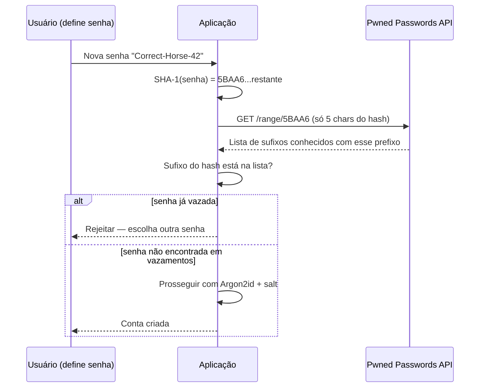
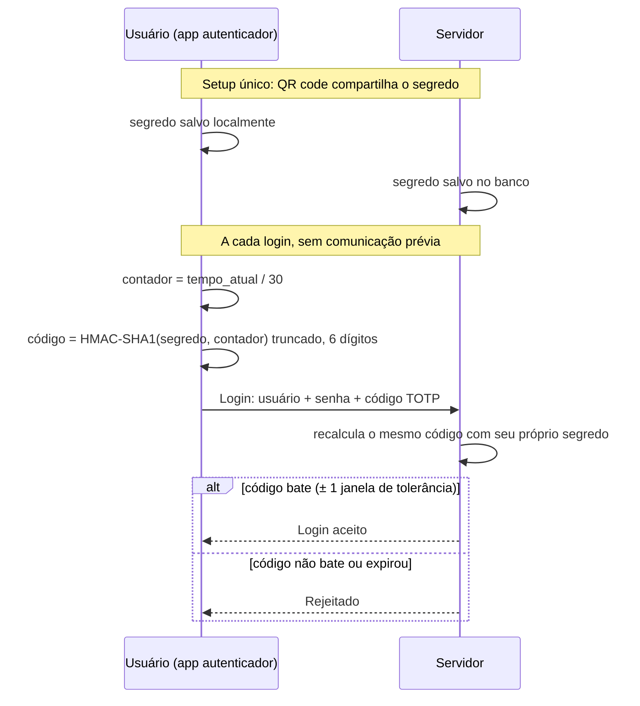
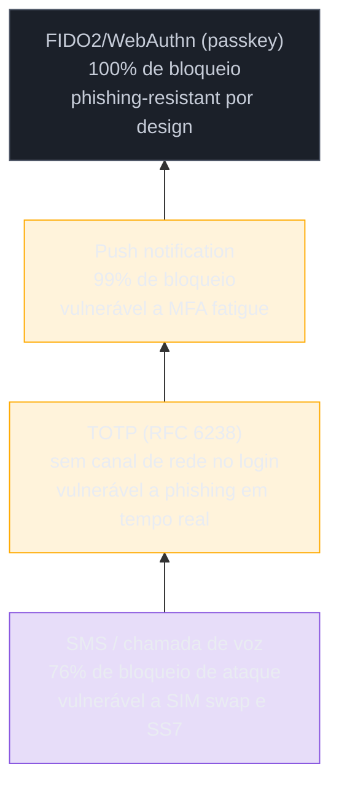

# Senhas e MFA — o legado que não morre

> [!abstract] TL;DR
> Senha continua sendo o fator de autenticação dominante em 2026 não porque seja segura, mas porque é universal, barata de implementar e não exige hardware — e por isso a engenharia em volta dela importa mais do que nunca. Guardar senha certo significa **hash lento e memory-hard** (Argon2id, vencedor da Password Hashing Competition; bcrypt como legado aceitável; nunca MD5/SHA puro nem "salt caseiro", porque GPUs modernas testam bilhões de hashes rápidos por segundo). O NIST SP 800-63B revisão 4 (jul/2025) formalizou o que a pesquisa já mostrava havia anos: comprimento importa mais que complexidade, rotação forçada piora a segurança, e toda senha nova deve ser checada contra listas de vazamentos conhecidos. MFA reduz drasticamente o risco de credencial roubada — mas nem todo "segundo fator" é igual: SMS é vulnerável a SIM swapping e falhas do protocolo SS7, push notification sofre "MFA fatigue" (o vetor que abriu a brecha da Uber em 2022), e o **elo mais fraco do sistema inteiro** costuma ser a recuperação de conta, porque ela existe justamente para contornar todos os outros controles quando o usuário os perde.
>
> [!info] Fronteira
> Esta nota cobre a **política e a prática** de senhas e MFA. A teoria criptográfica por trás do hashing — como uma função de hash funciona, propriedades de resistência a colisão — mora em [[06 - Hashing criptográfico|Segurança 06]]. Passkeys e WebAuthn, a resposta estrutural a boa parte dos problemas descritos aqui, ganham nota própria: [[05 - Passkeys e WebAuthn — o presente sem senha]].

> [!question]- Perguntas que esta nota responde
> - Por que Argon2id é a escolha certa para hash de senha em 2026, e por que bcrypt trunca em 72 bytes?
> - O que exatamente mudou no NIST SP 800-63B revisão 4 — e por que rotação forçada de senha piorava a segurança?
> - Como um serviço detecta que uma senha foi vazada sem nunca enviar a senha em texto claro para outro servidor?
> - Por que SMS é o pior fator de MFA disponível, e o que aconteceu na Uber em 2022 com MFA fatigue?
> - Se MFA está ativo, por que a recuperação de conta ainda é o ponto mais frágil do sistema?

## O banco que vazou em texto quase claro

Em junho de 2012, a LinkedIn sofreu uma invasão que expôs os hashes de senha de uma parcela enorme da sua base — o número final, confirmado quando os dados reapareceram à venda em 2016, chegou a **167 milhões de contas**, das quais cerca de 117 milhões traziam email e hash de senha juntos[^linkedin]. O problema não era só o vazamento em si — bancos de dados vazam. O problema era *como* a LinkedIn guardava essas senhas: hash **SHA-1 sem salt**. SHA-1 é uma função de hash rápida, desenhada para verificar integridade de arquivos, não para proteger segredos — e "sem salt" significa que duas contas com a mesma senha produzem exatamente o mesmo hash, o que permite atacar milhões de contas de uma vez usando uma única tabela pré-computada (rainbow table) em vez de atacar conta por conta.

O resultado foi banal e devastador: pesquisadores de segurança relataram que **90% dos hashes foram quebrados em 72 horas**, usando hardware de GPU comum e listas de senhas conhecidas[^linkedin]. Não foi uma falha sofisticada de criptografia — foi a escolha errada de ferramenta para o trabalho errado. SHA-1, como qualquer hash de propósito geral (MD5, SHA-256, SHA-512), foi desenhado para ser **rápido**, porque a maioria dos usos de hash (checksums, assinaturas, índices) quer velocidade. Senha exige exatamente o oposto: você *quer* que verificar uma senha seja lento, porque isso é o que impede um atacante de testar bilhões de combinações por segundo depois de roubar o banco.

Esse é o fio condutor desta nota: engenharia de senha não é sobre "ter uma senha forte" — é sobre desenhar cada camada (armazenamento, política, segundo fator, recuperação) assumindo que, eventualmente, alguma delas vai falhar, e garantindo que a falha de uma não derrube as outras.

## Como uma senha deveria ser guardada

### O problema que hash lento resolve

A pergunta certa não é "como criptografar a senha" — senha nunca deveria ser criptografada de forma reversível, porque isso implicaria existir uma chave capaz de recuperá-la em texto claro, e essa chave seria o alvo número um de qualquer invasão. A pergunta certa é: **como provar que alguém digitou a senha certa sem nunca guardar a senha em si?** A resposta clássica é uma **função de hash unidirecional**: o servidor guarda `hash(senha)`, e no login recalcula `hash(senha_digitada)` e compara os dois hashes. Se o banco vazar, o atacante tem só os hashes — mas ainda assim pode tentar *adivinhar* senhas, calcular o hash de cada tentativa e comparar. Essa é a operação que se chama **offline cracking**, e ela é o motivo pelo qual a *velocidade* do hash virou a variável de segurança mais importante do design.

Uma GPU moderna consegue calcular bilhões de hashes SHA-256 por segundo. Se um banco de senhas usa SHA-256 puro, um atacante com hardware de US$ 1.000 testa o equivalente ao dicionário de senhas mais comuns do mundo em minutos. A defesa não é trocar de algoritmo de hash por outro "mais forte" no sentido criptográfico — SHA-256 é perfeitamente seguro contra colisão, o problema é que ele é *rápido demais para esse uso específico*. A defesa é usar uma função desenhada para ser **deliberadamente lenta e cara de paralelizar**: uma função de derivação de chave (KDF) com custo ajustável.

> [!question]- Por que "salt caseiro" não resolve o problema de velocidade?
> Um erro comum é pensar que basta concatenar a senha com um valor aleatório (`hash(senha + salt)`) usando SHA-256 e já se está protegido. O salt resolve **um** problema — impede que duas senhas iguais produzam o mesmo hash, derrotando rainbow tables pré-computadas. Mas não resolve o problema da velocidade: o atacante ainda calcula bilhões de tentativas por segundo por GPU, só que agora precisa recalcular por conta em vez de reusar uma tabela global — o que ainda assim é rápido o bastante para quebrar senhas fracas ou médias em massa. Salt é necessário, mas não suficiente; a lentidão deliberada do algoritmo é o que realmente eleva o custo de cada tentativa.

### Argon2id, bcrypt, scrypt e PBKDF2 — a hierarquia real

O **OWASP Password Storage Cheat Sheet** — a referência de facto da indústria para esta decisão — recomenda uma ordem clara de preferência, todos eles funções de derivação de chave com custo configurável (memória, tempo, paralelismo), não hashes de propósito geral[^owasppwd]:

1. **Argon2id** — a escolha default para sistemas novos. Venceu a **Password Hashing Competition (PHC)** em 2015, um concurso público de anos, no estilo dos concursos que definiram AES e SHA-3, especificamente para resolver o problema de hash de senha[^phc]. O "id" no nome indica a variante híbrida, que combina resistência a ataques de canal lateral (Argon2i) com resistência a paralelização em GPU/ASIC (Argon2d) — é por isso que praticamente toda recomendação atual aponta para Argon2**id**, não para as outras duas variantes. Parâmetro mínimo do OWASP: memória de 19 MiB, 2 iterações, paralelismo 1; para login interativo em produção, uma configuração mais robusta e comum em 2026 usa memória de 46–64 MiB, o que já produz um tempo de verificação de cerca de 100ms num core moderno — rápido o bastante para não incomodar o usuário, caro o bastante para tornar cracking em massa economicamente inviável[^owasppwd].
2. **scrypt** — alternativa quando Argon2id não está disponível na stack. Também memory-hard (custo N=2^17, ou 128 MiB), mas mais antigo (2009) e menos estudado do que Argon2id em termos de resistência formal a ataques recentes[^owasppwd].
3. **bcrypt** — aceitável apenas em **sistemas legados** que já o usam; não é a escolha para projeto novo. Fator de trabalho mínimo recomendado de 10 (idealmente mais alto, ajustado ao hardware disponível). A limitação mais citada do bcrypt é estrutural, não de configuração: ele **trunca a senha em 72 bytes**, porque é construído sobre a cifra Blowfish, cujo P-box interno tem exatamente 72 bytes de tamanho[^bcrypt72]. Isso significa que uma senha de 100 caracteres e uma de 72 caracteres idênticos nos primeiros 72 produzem o **mesmo hash** — uma limitação silenciosa que a maioria das bibliotecas nem sequer avisa, e que se agrava com caracteres multi-byte (emoji, acentos em certas codificações), onde o limite de 72 *bytes* pode significar bem menos de 72 *caracteres* visíveis.
4. **PBKDF2** — reservado para contextos que exigem conformidade **FIPS-140** (setor público americano, alguns contratos regulados), porque é o único dos quatro formalmente validado por esse padrão. Não é memory-hard — depende só de iteração —, o que o torna mais vulnerável a hardware especializado (ASIC/FPGA) do que Argon2id ou scrypt. Recomendação atual: PBKDF2-HMAC-SHA256 com **600.000 iterações**[^owasppwd].

> [!warning] Nunca MD5 ou SHA puro para senha
> **O que acontece:** um sistema guarda `md5(senha)` ou `sha256(senha + salt)` diretamente, tratando o hash criptográfico genérico como se fosse hash de senha. **Por quê:** MD5 e a família SHA foram desenhados para serem **rápidos** — são ótimos para checksums de arquivo e assinaturas digitais, exatamente o oposto do que senha precisa. Uma GPU consumer calcula bilhões desses hashes por segundo, tornando cracking offline em massa trivial assim que o banco vaza — foi exatamente o que aconteceu com o SHA-1 sem salt da LinkedIn em 2012. **Como evitar:** use sempre uma KDF de senha desenhada para ser lenta e (idealmente) memory-hard — Argon2id, com bcrypt como fallback legado. MD5/SHA servem para outras finalidades criptográficas, nunca para senha.

Em uma frase: **hash de senha bom é hash deliberadamente caro de calcular em massa — a escolha certa em 2026 é Argon2id, com bcrypt tolerado só em sistemas antigos.**

## O que o NIST mudou (e por que isso importa)

O **NIST Special Publication 800-63B** é o documento mais citado do mundo em política de senha corporativa — a versão anterior, de 2017, já havia começado a desafiar o senso comum, e a **revisão 4**, publicada em julho de 2025, consolidou e formalizou essas mudanças[^nist]. As três mudanças que mais afetam o dia a dia de quem projeta um sistema de login:

**Comprimento importa mais que complexidade.** A revisão 4 recomenda um mínimo de **8 caracteres quando combinado com MFA**, subindo para **15 caracteres quando a senha é o único fator**, e exige que sistemas **suportem** ao menos 64 caracteres para viabilizar passphrases longas[^nist]. Regras de complexidade obrigatória — "precisa ter maiúscula, número e símbolo" — foram explicitamente **removidas** da recomendação. Isso não é permissividade: pesquisa consistente mostra que regras de complexidade levam usuários a padrões previsíveis (`Senha123!`, trocar "a" por "@") que não aumentam a entropia real na mesma proporção que aumentam a fricção.

**Rotação forçada, sem evidência de comprometimento, saiu da recomendação.** Trocar senha a cada 30/60/90 dias deixou de ser exigido — a única exigência de troca é reativa, quando há evidência concreta de vazamento ou comprometimento[^nist]. A razão é empírica: estudos mostraram repetidamente que rotação forçada leva a mudanças mínimas e previsíveis (`Senha1`, `Senha2`, `Senha3`), porque o usuário otimiza para lembrar, não para segurança — trocar a política não trocava o comportamento real de forma útil.

**Checagem obrigatória contra listas de senhas vazadas.** Toda senha nova precisa ser verificada contra bancos de dados de credenciais conhecidamente comprometidas antes de ser aceita[^nist]. Isso formaliza uma prática que a indústria já vinha adotando via serviços como o **Pwned Passwords** do haveibeenpwned — o assunto da próxima seção.

> [!question]- Perguntas de segurança ("qual o nome do seu primeiro animal de estimação?") também saíram?
> Sim — a revisão 4 recomenda abandonar perguntas de segurança como mecanismo de recuperação ou verificação, e a nota-mapa desta trilha já cobriu por quê: uma pergunta de segurança é, tecnicamente, "algo que você sabe" — a mesma categoria da senha. Um vazamento de dados pessoais (nome de solteira da mãe, cidade natal) costuma tornar essas respostas descobríveis via engenharia social ou simplesmente pesquisa pública, e não há como "rotacionar" a resposta de uma pergunta biográfica do jeito que se rotaciona uma senha.

Em uma frase: **NIST 800-63B rev.4 troca regras que pareciam rigorosas mas geravam comportamento previsível por regras que medem risco real — comprimento, checagem contra vazamentos, resposta a evidência de comprometimento.**

## Credential stuffing e a detecção de senha vazada

### Por que uma senha "forte" ainda pode estar comprometida

Uma senha pode satisfazer toda política de comprimento e ainda assim ser uma péssima escolha — se ela já apareceu em algum vazamento anterior, ela está numa lista que os atacantes usam ativamente. É esse fato que move o **credential stuffing**: um atacante pega uma lista de pares usuário/senha vazados de um serviço qualquer (o DeepStrike estima cerca de **2 bilhões de pares de credenciais vazadas únicas** compiladas de combolists da dark web só em 2025[^credstuff]) e testa essas mesmas combinações, em massa e de forma automatizada, contra o login de um serviço completamente diferente — apostando que uma fração dos usuários reutilizou a senha. A aposta compensa: análises de logs de SSO corporativo encontram uma **mediana de 19% de todas as tentativas de login diárias classificadas como credential stuffing**, chegando a 44% no pior dia registrado, e o Verizon DBIR 2025 encontrou credenciais roubadas como o **maior vetor único de acesso inicial confirmado**, em 22% das violações[^credstuff].

A distinção técnica que separa credential stuffing de um brute-force clássico importa para quem desenha defesa: brute-force *adivinha* senhas (testando dicionários, padrões comuns); credential stuffing *reutiliza* pares já conhecidos como válidos em algum lugar — daí ser classificado pela OWASP como sua própria categoria de ameaça automatizada, **OAT-008**[^oat008].

### Como checar sem nunca expor a senha: k-anonymity

O serviço mais usado para checar senha contra vazamentos é o **Pwned Passwords**, do projeto haveibeenpwned (HIBP). O desafio de design é sutil: como perguntar "essa senha específica já vazou?" para um servidor de terceiros **sem enviar a senha** (nem seu hash completo) para esse servidor — porque isso recriaria exatamente o problema que se está tentando evitar. A solução usa uma propriedade chamada **k-anonymity**[^hibp]:

1. O cliente calcula o hash SHA-1 da senha localmente.
2. Envia para a API apenas os **primeiros 5 caracteres hexadecimais** (20 bits) desse hash — um prefixo, não o hash inteiro.
3. A API responde com **todos** os sufixos de hash conhecidos que compartilham aquele mesmo prefixo — tipicamente algumas centenas deles.
4. O cliente compara localmente se o sufixo do seu hash está nessa lista.

O ponto central: o servidor nunca sabe qual hash completo foi consultado — ele só sabe que *algum* cliente pediu um dos ~800 hashes que começam com aquele prefixo de 5 caracteres, o que é matematicamente insuficiente para reconstituir a senha original[^hibp]. É uma forma elegante de terceirizar "essa senha está numa lista de vazamentos conhecidos?" sem nunca centralizar a senha em si num único ponto de risco adicional.



### A jornada completa: do cadastro ao breach

Juntando as duas seções anteriores, a vida de uma senha malfeita segue um caminho previsível — e cada etapa é um ponto onde a engenharia certa quebra a cadeia:

```mermaid
graph LR
    classDef marca fill:#8855DF33,stroke:#8855DF,color:#E9ECF2
    classDef neutro fill:#1B2029,stroke:#4E5666,color:#C6CCD8
    classDef destaque fill:#FFAA0024,stroke:#FFAA00,color:#E9ECF2
    A["Cadastro:<br/>senha fraca/reusada"] -->|"sem checagem HIBP"| B["Hash ruim<br/>(SHA-1/MD5 sem salt)"]
    B -->|"banco vaza"| C["Offline cracking<br/>90% quebrado em 72h"]
    C -->|"senha reusada<br/>em outros sites"| D["Credential<br/>stuffing"]
    D -->|"login automatizado<br/>em massa"| E["Account<br/>Takeover"]

    class B neutro
    class C marca
    class D destaque
    class E marca
```



Cada seta desse diagrama é um ponto de intervenção: checar contra HIBP no cadastro evita a seta 1; Argon2id evita a seta 2 mesmo que o banco vaze; e MFA — o assunto da próxima seção — evita que a seta 4 (login automatizado) sequer funcione, mesmo com a senha certa em mãos do atacante.

Em uma frase: **k-anonymity permite checar "essa senha já vazou?" sem nunca revelar qual senha está sendo checada — e credential stuffing só funciona em escala porque reuso de senha é a norma, não a exceção.**

## MFA na prática: nem todo segundo fator é igual

A nota-mapa desta trilha já estabeleceu o vocabulário — categorias diferentes, AAL1/AAL2/AAL3. Aqui entramos no mecanismo e nas armadilhas reais de cada implementação comum de "algo que você tem".

### TOTP: o código de 6 dígitos que muda a cada 30 segundos

O **TOTP (Time-based One-Time Password)**, formalizado na **RFC 6238**, é o mecanismo por trás de apps como Google Authenticator, Authy e o gerador embutido em qualquer app bancário sério. A ideia central: servidor e cliente compartilham um **segredo** (gerado no momento em que o usuário escaneia o QR code de configuração) e ambos conseguem, de forma independente, chegar ao **mesmo código** em um dado instante — sem trocar nenhuma mensagem entre si durante o login[^rfc6238]. A fórmula, simplificada:

```
contador = floor(tempo_unix_atual / 30)
codigo   = Truncate(HMAC-SHA1(segredo, contador)) % 10^6
```

O `tempo_unix_atual / 30` — dividir o relógio por uma janela de 30 segundos — é o que substitui, no TOTP, o papel que um contador incremental teria no HOTP (a variante anterior, baseada em contagem de usos em vez de tempo): tanto servidor quanto cliente calculam o mesmo "contador" de forma independente, desde que os dois relógios estejam razoavelmente sincronizados. O resultado do HMAC passa por uma etapa de **truncamento dinâmico** que extrai um subconjunto dos bits do hash e os converte num número de 6 dígitos — 6 é o padrão recomendado pela RFC, embora 8 dígitos adicionem entropia às custas de usabilidade[^rfc6238].



O que torna TOTP mais forte que SMS não é o algoritmo em si — é a **ausência de canal de rede** no momento da autenticação: o código nasce localmente no dispositivo, calculado com um segredo que nunca trafega depois do setup inicial. Não há SMS para interceptar, nem operadora de telefonia para enganar.

### Por que SMS é o fator mais fraco

O **CISA** (a agência americana de segurança de infraestrutura) recomenda explicitamente abandonar SMS e chamadas de voz como segundo fator sempre que possível, tratando-os como último recurso — não porque SMS não ajude (ainda é melhor que nenhum segundo fator), mas porque ele é estruturalmente mais fácil de interceptar do que as alternativas[^cisa]. Dois vetores concretos explicam por quê:

- **SIM swapping** — o atacante convence a operadora de telefonia (por engenharia social, funcionário corrompido, ou documentos falsificados) a transferir o número da vítima para um chip sob controle do atacante. A partir daí, todo SMS de segundo fator chega direto ao atacante. O FBI registrou mais de 2.000 denúncias de SIM swap num único ano recente, com perdas relatadas superiores a US$ 70 milhões[^simswap]; em 2019, o próprio CEO do Twitter teve sua conta sequestrada dessa forma, e em 2021 a Coinbase relatou mais de 6.000 clientes afetados por um ataque de SIM swap em massa[^simswap].
- **Falhas do protocolo SS7** — SS7 é o protocolo de sinalização que operadoras de telefonia usam entre si desde os anos 1970 para rotear chamadas e mensagens; ele foi desenhado numa era de confiança mútua entre operadoras, sem autenticação forte, e pesquisadores demonstram há anos que é possível interceptar SMS remotamente explorando essas falhas — sem sequer precisar de acesso físico ao telefone da vítima ou engenharia social contra a operadora[^ss7].

Um estudo de eficácia real por parte do Google mostrou o tamanho da diferença: **SMS bloqueou 76% dos ataques direcionados testados, contra 99% de um prompt no próprio dispositivo e 100% de uma chave de segurança física**[^sms76]. SMS não é "inútil" — 76% ainda é melhor que zero — mas o gap para as alternativas é grande o bastante para justificar a recomendação de aposentá-lo como escolha primária.

### Push notification e o ataque de "MFA fatigue"

**Push notification** — aquele "aprovar/negar" que apps bancários e corporativos mandam para o celular — resolve o problema do SMS (não há SMS para interceptar) mas introduz outro: se o atacante já possui a senha correta e a app simplesmente dispara solicitações de aprovação sem limite, ele pode enviar dezenas delas até a vítima, cansada ou distraída, aprovar uma por hábito. Esse ataque tem nome — **MFA fatigue**, também chamado de *push bombing* — e um caso documentado e amplamente relatado o tornou conhecido: a invasão da **Uber em setembro de 2022**.

O grupo de invasores (associado ao Lapsus$) já possuía credenciais válidas de um contratado da Uber, provavelmente compradas de um vazamento anterior ou obtidas via malware infostealer. Com a senha em mãos, faltava só passar pelo MFA — e o atacante simplesmente **disparou cerca de 40 notificações de aprovação em 30 minutos**[^ubermfa]. Quando isso sozinho não funcionou, o atacante foi além: contatou o contratado diretamente por WhatsApp, se passando por suporte técnico da Uber, e disse que as notificações fariam parte de uma correção de sistema — "só aprove a próxima e elas param". Exausto e acreditando se tratar de um bug do sistema, o contratado aprovou uma solicitação[^ubermfa]. A partir daí, o dispositivo do atacante ficou autorizado na rede interna da Uber, e a varredura da rede corporativa encontrou um script PowerShell com credenciais de administrador para múltiplas plataformas internas (incluindo o próprio sistema de MFA Duo, OneLogin, AWS e G Suite)[^ubermfa]. A vulnerabilidade crítica de implementação, segundo os relatos do incidente: a Uber permitia **um número ilimitado de tentativas de push sem throttling nem alerta** — o atacante podia mandar 100 notificações sem qualquer consequência além de irritar o usuário[^ubermfa].

A defesa moderna contra MFA fatigue tem duas frentes: **number matching** (o app exige que o usuário digite um número exibido na tela de login dentro do próprio prompt de aprovação, tornando aprovação "por hábito" impossível) e, estruturalmente, **phishing-resistant MFA** (FIDO2/WebAuthn, tema da nota 05) — que nem sequer depende de um humano decidir "aprovar ou não", porque a prova criptográfica está amarrada ao domínio exato da requisição.

### Códigos de recuperação: o backup que também é risco

Todo sistema de MFA sério oferece **códigos de recuperação** (recovery codes) — uma lista de códigos de uso único, gerados no momento em que o MFA é ativado, para o cenário em que o usuário perde o dispositivo que gera TOTP ou recebe push. Eles resolvem um problema real (não travar o usuário fora da própria conta), mas introduzem uma superfície nova: um código de recuperação é, na prática, **um segredo estático equivalente à senha original** — se um atacante o encontra (screenshot salvo no Google Drive, print guardado num gerenciador de senhas mal protegido, foto na galeria do celular), ele contorna o MFA inteiro sem precisar quebrar TOTP, SMS ou push. A prática recomendada é tratá-los com o mesmo cuidado de uma senha-mestra: gerar poucos (8–10), invalidar cada um após o uso, e nunca reaproveitar a mesma lista indefinidamente.

### A escada de força dos fatores



Note que mesmo TOTP e push, mais fortes que SMS, ainda são vulneráveis a **phishing em tempo real** (o usuário digita o código TOTP num site falso que o repassa instantaneamente ao site real) ou a fadiga de aprovação — nenhum dos dois amarra criptograficamente a autenticação ao domínio exato, o que só o FIDO2/WebAuthn faz de forma estrutural. É essa lacuna final que a nota 05 desta trilha existe para fechar.

Em uma frase: **todo "segundo fator" reduz risco, mas cada categoria tem seu ataque específico — SMS cai para SIM swap/SS7, push cai para fadiga, e só criptografia amarrada ao domínio (FIDO2) fecha a lacuna do phishing em tempo real.**

## Account recovery: o elo que contorna todos os outros

Aqui está o paradoxo que fecha esta nota: você pode ter Argon2id no armazenamento, política NIST 800-63B na senha, e phishing-resistant MFA ativo — e ainda assim ter um sistema inteiro comprometível através de um único fluxo mal desenhado de "esqueci minha senha". A razão é lógica, não técnica: **recuperação de conta existe precisamente para contornar os controles normais**, para o cenário em que o usuário legitimamente perdeu acesso a eles. Se recuperação pode anular os controles mais fortes do sistema, ela *é* o controle mais fraco do sistema, por definição — nenhuma corrente é mais forte que seu elo mais frágil, e o elo de recuperação é desenhado justamente para ser mais fácil de passar[^recovery].

O padrão mais comum de recuperação é "enviar um link para o email cadastrado" — o que significa que **a segurança da sua conta nunca é maior do que a segurança da conta de email associada a ela**. Se o email não tem MFA (comum — muita gente protege a conta "principal" mas não a de email, ou o email é compartilhado entre serviços), qualquer atacante que comprometa aquele email ganha as chaves de tudo que usa "recuperar por email" como fallback. Além disso, tokens de recuperação enviados por email frequentemente trafegam sem criptografia adicional e, se mal implementados, com validade longa demais ou reutilizáveis — a prática recomendada é usar tokens criptograficamente aleatórios, de uso único, com expiração curta (idealmente não mais que uma hora)[^recovery].

No contexto corporativo, o vetor equivalente é o **helpdesk de TI**: um atacante liga se passando pelo funcionário, alega ter perdido o celular com o app autenticador, e pede para o suporte resetar o MFA. O agente de suporte, sob pressão de "resolver rápido", verifica identidade com as ferramentas disponíveis — código SMS, perguntas de segurança, confirmação verbal de nome/gerente/ID de funcionário — todas elas exatamente os mecanismos fracos que a organização tentou evitar ao adotar MFA forte em primeiro lugar. Julgamento humano sob pressão é, estruturalmente, sempre explorável[^recovery]. Foi um vetor desse tipo, aliás, que abriu a porta para o contratado da Uber aprovar a notificação fraudulenta — o atacante se passou por suporte técnico interno.

> [!warning] Recuperação de conta mais fraca que o login normal
> **O que acontece:** o fluxo de "esqueci minha senha" aceita verificação por perguntas de segurança, SMS, ou uma ligação de suporte — quando o login normal já exige MFA forte. **Por quê:** recuperação é desenhada para "desbloquear" um usuário legítimo que perdeu acesso ao segundo fator; por isso, tende a usar mecanismos de verificação mais fracos do que o próprio MFA que substitui — criando um atalho que ignora exatamente os controles que o sistema investiu em construir. **Como evitar:** trate recuperação como parte do modelo de ameaça do MFA, não como um recurso à parte. Exija verificação de posse (não conhecimento) sempre que possível, use tokens de uso único com expiração curta, e para contas de alto risco, considere exigir um segundo canal verificado (ex.: aprovação de um administrador humano) antes de resetar o MFA.

## Rate limiting e lockout: proteger o login sem virar arma

A última camada de defesa antes de qualquer senha ou MFA entrar em jogo é simplesmente **limitar quantas tentativas de login um invasor pode fazer**. Duas técnicas complementares, segundo o **OWASP Authentication Cheat Sheet**[^owaspauth]:

- **Account lockout** — bloquear a conta após N tentativas falhas dentro de uma janela de observação, por um período de lockout. Uma variante mais sofisticada usa **lockout exponencial**: a primeira falha bloqueia por 1 segundo, a segunda por 2, a terceira por 4, e assim por diante — o atraso cresce rápido o bastante para inviabilizar automação, sem travar o usuário legítimo por muito tempo num único erro de digitação.
- **Rate limiting / login throttling** — limitar a taxa de tentativas por IP, por dispositivo, ou globalmente por endpoint, independentemente de estarem associadas a uma conta específica.

O detalhe de design que separa um lockout bem-feito de um mal-feito: **o contador de falhas deve estar associado à conta, não ao IP de origem**, para impedir que um atacante contorne o limite distribuindo tentativas por muitos IPs diferentes (via botnet ou proxy rotation) — mas, se o contador é só por conta, surge o risco simétrico de um atacante *deliberadamente* errar a senha de uma vítima repetidas vezes só para travá-la fora da própria conta, uma forma de negação de serviço direcionada. A defesa recomendada combina os dois eixos (conta *e* IP/dispositivo, com pesos diferentes) e usa lockout temporário e crescente em vez de bloqueio permanente que exigiria intervenção manual para desfazer[^owaspauth].

> [!warning] Lockout que vira DoS contra o próprio usuário
> **O que acontece:** um sistema bloqueia a conta por 24 horas após 3 tentativas falhas, contando só por username — e um atacante, sem nem tentar adivinhar a senha, simplesmente erra de propósito 3 vezes a senha de qualquer conta que queira travar. **Por quê:** o mecanismo pensado para proteger contra brute-force vira, ele mesmo, uma ferramenta de ataque quando o custo de "errar de propósito" é baixo e a punição é alta e de longa duração. **Como evitar:** prefira lockout **exponencial e curto** (segundos a minutos, não horas) combinado com MFA — que segundo análise da Microsoft teria evitado 99,9% das tomadas de conta por senha comprometida[^owaspauth] — em vez de depender só de lockout agressivo. Rate limiting por IP/dispositivo complementa, sem substituir, o controle por conta.

> [!info] Rate limiting como algoritmo
> Esta nota cobre rate limiting só como proteção de endpoint de login. O desenho de algoritmos de rate limiting em si (token bucket, sliding window, e onde aplicá-los num gateway) é assunto de System Design — fora do escopo desta trilha de Auth e Identidade.

Em uma frase: **lockout e rate limiting protegem contra brute-force, mas mal calibrados viram a própria arma de ataque — a defesa certa combina conta + IP, janelas curtas e crescentes, nunca bloqueio longo e único.**

## Armadilhas comuns

> [!warning] Confiar em MD5/SHA1 "porque sempre foi assim"
> **O que acontece:** um sistema legado (ou um novo, escrito por alguém que copiou código antigo) usa `md5(senha)` ou `sha256(senha)` diretamente para armazenar credenciais. **Por quê:** essas funções foram desenhadas para velocidade e integridade de dados, não para resistir a cracking offline — GPUs modernas calculam bilhões de hashes desses por segundo, tornando qualquer vazamento de banco uma sentença de morte para a maioria das senhas, como aconteceu com a LinkedIn em 2012. **Como evitar:** Argon2id (ou bcrypt em sistema legado que não pode migrar imediatamente) — nunca hash de propósito geral para senha, mesmo com salt.

> [!warning] Rotação forçada de senha a cada 90 dias
> **O que acontece:** a política de segurança da empresa obriga trocar a senha a cada 90 dias, mesmo sem qualquer indício de vazamento. **Por quê:** usuários sob rotação forçada tendem a fazer trocas mínimas e previsíveis (`Empresa2024!` → `Empresa2025!`), o que reduz a entropia real da senha em vez de aumentá-la — o NIST 800-63B rev.4 formalizou o abandono dessa prática justamente por causa dessa evidência. **Como evitar:** troque senha só reativamente, mediante evidência de comprometimento (vazamento detectado, atividade suspeita) — e substitua o esforço de "forçar rotação" por checagem contra listas de senhas vazadas no momento do cadastro/troca.

> [!warning] SMS como único segundo fator numa conta de alto valor
> **O que acontece:** uma conta com privilégios elevados (admin, financeiro, executivo) usa SMS como única opção de MFA, sem alternativa de app autenticador ou chave de hardware. **Por quê:** SMS é vulnerável a SIM swapping (transferência fraudulenta do número na operadora) e a falhas do protocolo SS7 — ambos vetores documentados e usados ativamente contra alvos de alto valor, e SMS bloqueia proporcionalmente menos ataques (76%) do que push (99%) ou chave FIDO2 (100%). **Como evitar:** ofereça e incentive TOTP ou, idealmente, FIDO2/WebAuthn como opção primária; mantenha SMS, se necessário, apenas como fallback de último recurso — nunca como única via de segundo fator para contas sensíveis.

> [!warning] MFA sem limite de tentativas de push
> **O que acontece:** o app de autenticação corporativa aceita um número ilimitado de solicitações de aprovação push sem throttling, alerta ou bloqueio temporário. **Por quê:** isso viabiliza literalmente o ataque que comprometeu a Uber em 2022 — o atacante, já de posse da senha, simplesmente bombardeia o usuário com dezenas de notificações até o cansaço ou a confusão gerarem uma aprovação indevida. **Como evitar:** implemente **number matching** (o usuário digita um número exibido na tela, não só toca "aprovar"), limite a taxa de solicitações push por período, e alerte o time de segurança sobre picos anômalos de tentativas de MFA para uma mesma conta.

## Em entrevista

Em entrevistas de nível sênior, este tema aparece com frequência em perguntas de system design ("como você projetaria o fluxo de cadastro e login deste produto?") ou de segurança aplicada ("como você guardaria senha neste sistema?"). O sinal que o entrevistador busca não é decorar nomes de algoritmo — é a capacidade de justificar **por que** cada escolha existe e conectar armazenamento, política e MFA como camadas de um mesmo modelo de ameaça, não como itens isolados de checklist.

Uma resposta fraca lista tecnologia sem justificar: "eu uso bcrypt e MFA". Uma resposta forte amarra causa e efeito: "eu uso Argon2id porque é o vencedor da Password Hashing Competition e é memory-hard, o que encarece ataques com GPU; eu não forço rotação de senha porque a evidência mostra que isso degrada a segurança real, só a troco reativamente com evidência de comprometimento; e eu trato a recuperação de conta como parte do mesmo modelo de ameaça do MFA — nunca uma verificação mais fraca só porque é 'só recuperação'". Isso sinaliza que o candidato entende os trade-offs, não só memorizou a lista de "boas práticas".

Um exemplo de como essa distinção aparece embutida numa pergunta aberta:

> **Entrevistador:** "Um cliente relatou que a conta dele foi invadida mesmo com MFA ativado por app autenticador. Como você investigaria?"
>
> **Resposta fraca:** "Eu checaria se a senha dele estava em algum vazamento."
>
> **Resposta forte:** "Eu separaria as hipóteses por camada: primeiro, se o app autenticador em si foi comprometido (dispositivo roubado, cópia da seed do TOTP); segundo, se houve um ataque de phishing em tempo real, onde a vítima digitou o código TOTP num site falso que o repassou instantaneamente para o site real — TOTP não é phishing-resistant, só push e SMS-resistant; e terceiro, e com frequência a hipótese mais provável na prática, se o comprometimento não passou pelo MFA de jeito nenhum, mas sim pelo fluxo de recuperação de conta — se o email associado não tem MFA próprio, um atacante que comprometa o email reseta a senha e o MFA sem nunca precisar quebrar nenhum dos dois diretamente."

A resposta forte demonstra que o candidato entende que MFA não é um bloco monolítico de segurança — é uma composição de mecanismos, cada um com seu próprio vetor de falha, e que a recuperação de conta é sempre parte da superfície de ataque real, mesmo quando "tecnicamente" o MFA nunca foi quebrado.

## How to explain it in English

> "Passwords remain the dominant authentication factor in 2026 not because they're secure, but because they're universal and cheap — which is exactly why the engineering around them matters. Storing a password correctly means using a slow, memory-hard hash like Argon2id, never a fast general-purpose hash like SHA-256. And multi-factor authentication isn't a single monolithic control — SMS, TOTP, and push each fail differently, and account recovery is almost always the weakest link, because it exists specifically to bypass the controls you just built."

| PT | EN |
|----|----|
| Hash de senha | Password hashing |
| Função de derivação de chave | Key derivation function (KDF) |
| Resistente a memória (memory-hard) | Memory-hard |
| Salgar (adicionar sal) | Salting |
| Pimenta (segredo adicional server-side) | Pepper |
| Cracking offline | Offline cracking |
| Credencial roubada/reutilizada | Credential stuffing |
| Troca de chip fraudulenta | SIM swapping |
| Fadiga de MFA / bombardeio de push | MFA fatigue / push bombing |
| Recuperação de conta | Account recovery |
| Bloqueio de conta | Account lockout |
| Limitação de taxa | Rate limiting |

## O que vem a seguir

Praticamente todo problema descrito nesta nota — senha reutilizada, SMS interceptável, MFA que cansa o usuário — tem uma raiz comum: o segredo trafega, ou depende de um humano decidir "aprovar ou não" sob pressão. Existe uma resposta estrutural a isso, não incremental: em vez de mais uma camada de defesa em cima da senha, eliminar a senha como segredo compartilhado e trocá-la por uma prova criptográfica amarrada ao dispositivo e ao domínio exato que a solicitou.

- [[05 - Passkeys e WebAuthn — o presente sem senha]] — como o padrão FIDO2/WebAuthn torna phishing estruturalmente impossível, e por que 2026 é o ano em que passkeys deixaram de ser experimento para virar default em produtos novos
- [[06 - Hashing criptográfico|Segurança 06]] — a teoria por trás de Argon2id, bcrypt e as demais funções mencionadas aqui, para quem quer entender o mecanismo criptográfico por dentro

## Fontes

- **OWASP** — [*Password Storage Cheat Sheet*](https://cheatsheetseries.owasp.org/cheatsheets/Password_Storage_Cheat_Sheet.html) — ordem de preferência Argon2id/scrypt/bcrypt/PBKDF2, parâmetros recomendados, uso de pepper; acessado em 2026-07-10.
- **OWASP** — [*Authentication Cheat Sheet*](https://cheatsheetseries.owasp.org/cheatsheets/Authentication_Cheat_Sheet.html) — account lockout, lockout exponencial, rate limiting, contador por conta vs IP; acessado em 2026-07-10.
- **OWASP** — [*Credential Stuffing Prevention Cheat Sheet*](https://cheatsheetseries.owasp.org/cheatsheets/Credential_Stuffing_Prevention_Cheat_Sheet.html) — defesas em camadas, Pwned Passwords, device fingerprinting, MFA como defesa primária (99,9%); acessado em 2026-07-10.
- **OWASP** — [*OAT-008 Credential Stuffing*](https://owasp.org/www-project-automated-threats-to-web-applications/assets/oats/EN/OAT-008_Credential_Stuffing) — classificação formal do ataque como ameaça automatizada; acessado em 2026-07-10.
- **NIST** — [*SP 800-63B — Digital Identity Guidelines: Authentication and Lifecycle Management (rev. 4)*](https://pages.nist.gov/800-63-4/sp800-63b.html) — comprimento mínimo, fim da rotação forçada, checagem contra listas de vazamento; acessado em 2026-07-10.
- **IETF** — [*RFC 6238 — TOTP: Time-Based One-Time Password Algorithm*](https://datatracker.ietf.org/doc/html/rfc6238) — especificação do algoritmo TOTP; acessado em 2026-07-10.
- **Have I Been Pwned** — [*Pwned Passwords*](https://haveibeenpwned.com/Passwords) e [*API v3 documentation*](https://haveibeenpwned.com/api/v3) — k-anonymity, funcionamento do range search; acessado em 2026-07-10.
- **GitHub — P-H-C** — [*phc-winner-argon2*](https://github.com/P-H-C/phc-winner-argon2) — Argon2 como vencedor da Password Hashing Competition (2015); acessado em 2026-07-10.
- **pyca/bcrypt** — [*Issue #1082 — password cannot be longer than 72 bytes*](https://github.com/pyca/bcrypt/issues/1082) — a limitação estrutural de 72 bytes do bcrypt (origem no P-box do Blowfish); acessado em 2026-07-10.
- **TechCrunch** — [*117 million LinkedIn emails and passwords from a 2012 hack just got posted online*](https://techcrunch.com/2016/05/18/117-million-linkedin-emails-and-passwords-from-a-2012-hack-just-got-posted-online/) — escala do vazamento de 2012/2016; acessado em 2026-07-10.
- **arXiv** — [*The Cryptographic Implications of the LinkedIn Data Breach*](https://arxiv.org/pdf/1703.06586) — SHA-1 sem salt e 90% dos hashes quebrados em 72 horas; acessado em 2026-07-10.
- **centrexIT** — [*How Uber Was Breached Through MFA Fatigue: A Security Wake-Up Call*](https://centrexit.com/blog/mfa-fatigue-uber-breach-2022/) — cronologia do incidente Uber 2022, 40 notificações em 30 minutos, engenharia social via WhatsApp; acessado em 2026-07-10.
- **CISA** — [*Implementing Phishing-Resistant MFA*](https://www.cisa.gov/sites/default/files/publications/fact-sheet-implementing-phishing-resistant-mfa-508c.pdf) — recomendação de abandonar SMS/voz como segundo fator; acessado em 2026-07-10.
- **DeepStrike** — [*Credential Stuffing Statistics 2026*](https://deepstrike.io/blog/credential-stuffing-statistics) — 2 bilhões de credenciais vazadas em 2025, mediana de 19% das tentativas de login como credential stuffing; acessado em 2026-07-10.
- **TechRadar** — [*Why account recovery is now the weakest link in security*](https://www.techradar.com/pro/why-account-recovery-is-now-the-weakest-link-in-security) — recuperação de conta como bypass estrutural dos controles fortes; acessado em 2026-07-10.

[^linkedin]: TechCrunch, *117 million LinkedIn emails and passwords from a 2012 hack just got posted online*; arXiv, *The Cryptographic Implications of the LinkedIn Data Breach*. [^owasppwd]: OWASP, *Password Storage Cheat Sheet*. [^bcrypt72]: pyca/bcrypt, Issue #1082. [^phc]: GitHub P-H-C, *phc-winner-argon2*. [^nist]: NIST, *SP 800-63B, revisão 4*. [^credstuff]: DeepStrike, *Credential Stuffing Statistics 2026*. [^oat008]: OWASP, *OAT-008 Credential Stuffing*. [^hibp]: Have I Been Pwned, *Pwned Passwords* / API v3 documentation. [^rfc6238]: IETF, RFC 6238. [^cisa]: CISA, *Implementing Phishing-Resistant MFA*. [^simswap]: VikingCloud / SuperTokens, reportagens sobre SIM swapping; FBI IC3. [^ss7]: ACM Queue, *Security Analysis of SMS as a Second Factor of Authentication*. [^sms76]: Google Security Blog / Vectra AI, comparação de eficácia SMS vs on-device prompt vs chave de segurança. [^ubermfa]: centrexIT, *How Uber Was Breached Through MFA Fatigue*; InfoQ, *Multi-Factor Authentication Fatigue Key Factor in Uber Breach*. [^recovery]: TechRadar, *Why account recovery is now the weakest link in security*; OWASP, *Forgot Password Cheat Sheet*. [^owaspauth]: OWASP, *Authentication Cheat Sheet*.
