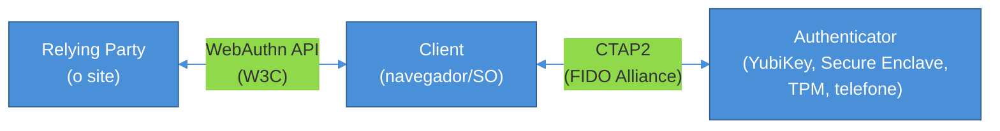
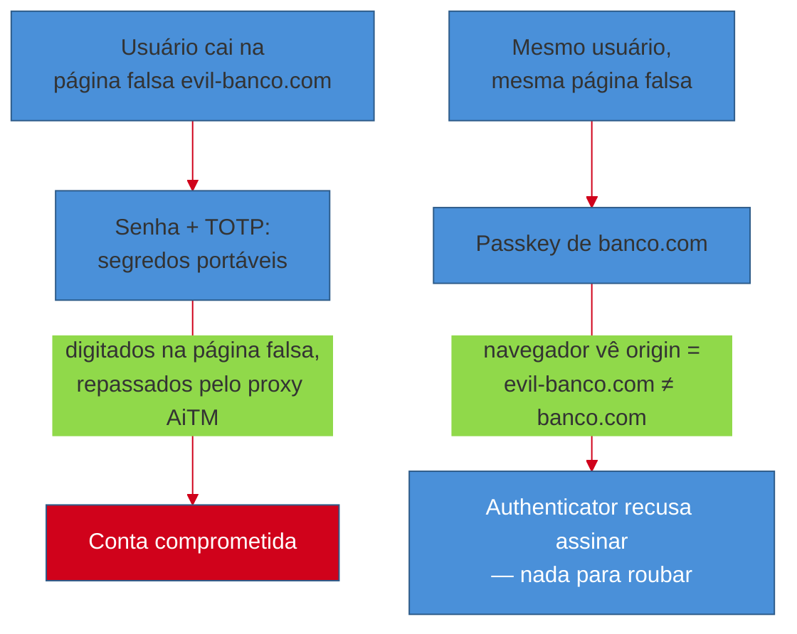
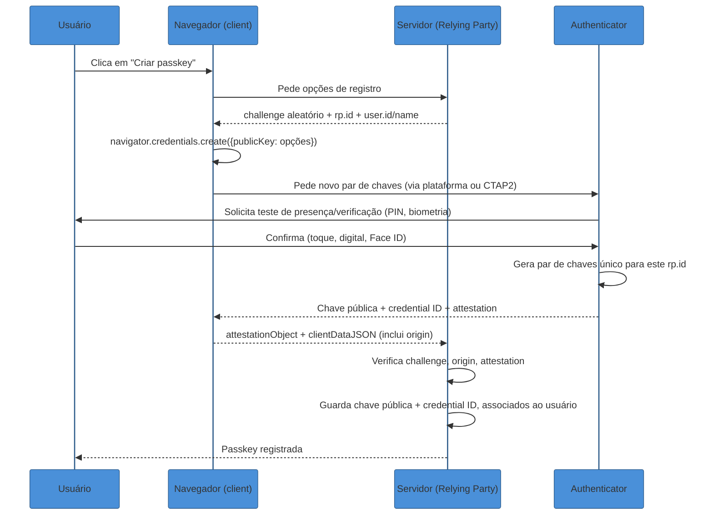
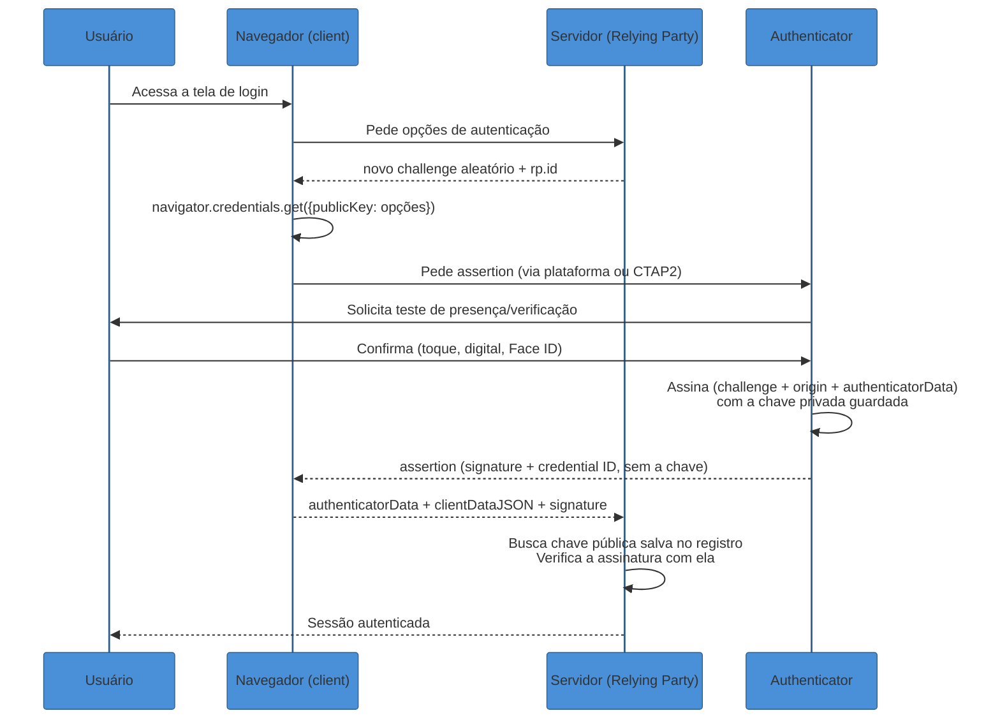
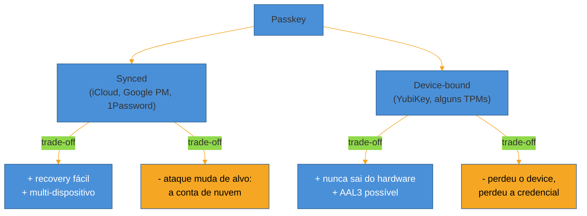
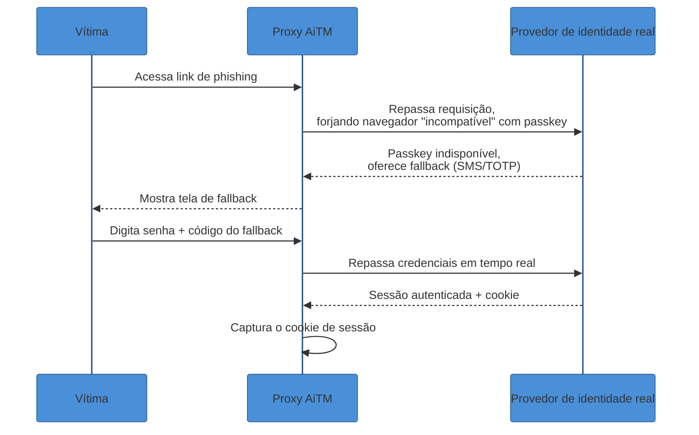

# Passkeys e WebAuthn — o presente sem senha

> [!abstract] TL;DR
> **Passkey** é o nome de marketing para uma credencial **FIDO2** — um par de chaves assimétricas gerado por site, onde a **chave privada nunca sai do dispositivo** (o *authenticator*) e só a chave pública viaja para o servidor. O padrão técnico por trás é **WebAuthn** (a API que o navegador expõe ao site) combinado com **CTAP2** (o protocolo entre navegador e um authenticator externo, como uma YubiKey). A propriedade que resolve phishing não é "o usuário é mais cuidadoso" — é que o navegador **amarra criptograficamente** cada assinatura ao domínio exato que pediu a autenticação; um site clonado em `evi1-banco.com` simplesmente não consegue obter uma assinatura válida para `banco.com`, porque a chave nem existe fora do par legítimo. Isso é estruturalmente diferente de senha e TOTP, que o usuário pode ser enganado a digitar em qualquer lugar. Em 2026 passkeys atingiram adoção mainstream — 5 bilhões em uso, 75% dos consumidores já ativaram uma em pelo menos uma conta — mas o rollout real na indústria segue um caminho pragmático: passkey **ao lado** da senha, nunca a substituindo de uma vez, porque o elo mais fraco do sistema de login continua sendo qualquer fallback que reintroduza phishing pela porta dos fundos.

> [!question]- Perguntas que esta nota responde
> - Como WebAuthn/FIDO2 tornam phishing estruturalmente impossível, e não apenas "mais difícil"?
> - O que acontece, passo a passo, quando um site registra e depois autentica uma passkey?
> - Por que existem passkeys "sincronizadas" (iCloud, Google, 1Password) e "presas ao dispositivo" (YubiKey), e quando cada uma é a escolha certa?
> - Por que uma estratégia de rollout mal desenhada pode anular toda a resistência a phishing que a passkey prometia?

## O phishing perfeito que MFA clássico não bloqueia

Imagine um funcionário bem treinado, cético o suficiente para nunca clicar em links suspeitos de "sua conta foi bloqueada". Um dia ele recebe um aviso legítimo-parecendo de que precisa revalidar o acesso ao VPN da empresa. O link leva a uma página que é pixel-perfect idêntica ao portal real — porque é, tecnicamente, um proxy: o atacante roda um servidor **adversary-in-the-middle (AiTM)** que repassa cada requisição para o site verdadeiro e devolve a resposta verdadeira para a vítima, em tempo real. O funcionário digita usuário e senha na página falsa; o proxy repassa para o site real; o site real pede o segundo fator — um código TOTP de 6 dígitos do app autenticador. O funcionário digita o código na página falsa; o proxy repassa em milissegundos, antes do código expirar. O site real autentica com sucesso e devolve um **cookie de sessão** — que o proxy captura e usa para si.

Nenhuma etapa desse ataque exigiu que o funcionário fosse descuidado. Ele fez exatamente o que o treinamento de segurança manda: verificou o cadeado, checou o domínio (que, no proxy, é quase idêntico ao real ou usa um subdomínio parecido), usou MFA. E mesmo assim a conta foi comprometida, porque **senha e TOTP são segredos portáveis** — sequências de caracteres que o usuário pode, sem saber, repassar para qualquer parte que peça, incluindo um atacante no meio do caminho. É esse desenho de ataque, documentado à exaustão em relatórios de phishing corporativo, que motivou a indústria a criar um mecanismo de autenticação onde o segredo **nunca existe em forma que o usuário possa digitar, copiar ou repassar** — nem por engano, nem sob pressão, nem enganado pela página mais convincente do mundo.

É esse mecanismo — FIDO2/WebAuthn, que o mercado batizou de **passkey** — que esta nota explica: o que ele é por dentro, por que a mesma cerimônia que autentica também *recusa* funcionar contra o domínio errado, e por que, apesar disso, uma estratégia de rollout mal pensada ainda consegue reabrir a porta que o protocolo fechou.

## FIDO2: as duas peças que compõem o padrão

**FIDO2** é o nome guarda-chuva da FIDO Alliance (e do W3C, no lado do navegador) para um conjunto de dois padrões que trabalham juntos[^fido2]:

- **WebAuthn** — a API que vive no navegador, padronizada pelo W3C. É contra ela que o desenvolvedor de um site programa: `navigator.credentials.create()` para registrar, `navigator.credentials.get()` para autenticar. Especificação atual: WebAuthn Level 3[^webauthn3].
- **CTAP2** (Client to Authenticator Protocol) — o protocolo que conecta o navegador/sistema operacional a um *authenticator* externo, como uma chave de segurança USB/NFC (YubiKey) ou o telefone do usuário via Bluetooth. Vive do lado da FIDO Alliance, não do W3C.

A distinção importa porque explica uma pergunta comum de quem está aprendendo o assunto: "authenticator" pode ser interno (o Secure Enclave de um iPhone, o TPM de um notebook Windows, o chip de segurança de um Android) ou externo (uma chave física). Quando é interno, o navegador conversa com ele por uma API de plataforma (Windows Hello, Face ID/Touch ID); quando é externo, a conversa passa por CTAP2. O desenvolvedor do site nunca precisa saber qual dos dois está por trás — WebAuthn abstrai essa diferença.

Três papéis, três responsabilidades:

- **Relying Party (RP)** — o site ou aplicação que quer autenticar alguém. É quem gera o desafio (challenge), guarda a chave pública e decide se a assinatura devolvida é válida.
- **Client** — o navegador (ou sistema operacional, em apps nativos). É quem fala WebAuthn com o RP e CTAP2 com o authenticator, e quem **injeta o `origin` da página atual** nos dados que serão assinados — esse é o passo que impede phishing, detalhado adiante.
- **Authenticator** — quem de fato gera o par de chaves, guarda a privada em hardware protegido, e produz a assinatura. Nunca fala diretamente com o RP; sempre através do client.

> [!question]- Por que não é só "biometria substituindo senha"?
> Porque Face ID, Touch ID ou uma PIN do Windows Hello, nessa arquitetura, **nunca saem do dispositivo e nunca são enviados ao site**. Eles servem só para desbloquear localmente o acesso à chave privada guardada no Secure Enclave/TPM — o chamado *teste de presença do usuário* (user presence) ou *verificação do usuário* (user verification). O site nunca recebe "sua digital"; recebe uma assinatura criptográfica que só pôde ser produzida porque, localmente, você provou para o seu próprio dispositivo que é você. Biometria e passkey resolvem problemas diferentes que às vezes se combinam: biometria autentica você perante o *seu aparelho*; passkey autentica o *seu aparelho* perante o site.

Em uma frase: **FIDO2 = WebAuthn (a API do navegador) + CTAP2 (o protocolo para authenticators externos) — três papéis (RP, client, authenticator) que nunca trocam a chave privada entre si.**

## A criptografia por trás: um par de chaves por site

O mecanismo central é simples de enunciar e poderoso na prática: para cada site (RP) em que você registra uma passkey, o authenticator gera um **par de chaves assimétricas novo e único** — uma chave privada que nunca deixa o hardware protegido, e uma chave pública que é enviada ao site e guardada lá, associada à sua conta[^webauthnguide].

Isso resolve, de uma vez, dois problemas que assombram senhas há décadas:

1. **Nada de segredo compartilhado para vazar.** Uma senha é um segredo que existe em dois lugares — no seu cabeça (ou gerenciador) e, na forma de hash, no banco de dados do site. Se o banco de dados vazar (e ele vaza; é o enredo de boa parte dos breaches documentados), o atacante ganha material para tentar quebrar o hash offline. Uma chave pública WebAuthn, por definição, **não serve para nada sozinha** — ela só verifica assinaturas; não autentica ninguém sem a chave privada correspondente, que nunca esteve no banco de dados.
2. **Nada reutilizável entre sites.** Como o par é gerado por site, comprometer a chave pública guardada por um serviço não dá ao atacante nada que funcione em outro serviço — o oposto do reuso de senha, que é o combustível do *credential stuffing*.

E a peça que fecha o círculo contra phishing é o **origin binding**: durante tanto o registro quanto a autenticação, o client (o navegador) inclui a origem exata da página — o domínio, não uma string que o usuário digitou — nos dados que serão assinados. O authenticator assina sobre esses dados; o servidor, ao verificar, confirma que a assinatura foi produzida *para aquele domínio específico*[^webauthnguide]. Um par de chaves registrado para `banco.com` estruturalmente **não pode** produzir uma assinatura válida para `evil-banco.com` — não porque o usuário seja cuidadoso, mas porque o navegador nunca vai pedir ao authenticator para assinar com a chave de `banco.com` estando numa página cujo domínio é outro. A checagem acontece na camada do navegador, fora do alcance de qualquer engenharia social.

> [!info] A criptografia assimétrica em si é conceito de outro domínio
> Como um par de chaves pública/privada funciona matematicamente (RSA, curvas elípticas), e por que assinar com a privada e verificar com a pública prova posse sem revelar o segredo, é assunto de [[08 - Criptografia assimétrica]] em Segurança. Esta nota usa esse mecanismo como ferramenta pronta — o objeto de estudo aqui é o *protocolo* que o aplica ao problema de login na web, não a matemática por trás da assinatura.

Em uma frase: **a chave privada nunca sai do authenticator e o navegador amarra cada assinatura ao domínio exato da página — por isso phishing não é "mais difícil", é estruturalmente impossível dentro do protocolo.**

## A cerimônia de registro: seguindo o `navigator.credentials.create()`

O termo oficial da especificação para "o processo de registrar ou usar uma credencial" é **cerimônia** (*ceremony*) — não é acidente de vocabulário: enfatiza que várias partes (usuário, RP, client, authenticator) precisam agir em conjunto e na ordem certa, diferente de uma simples chamada de função. Vamos seguir o registro passo a passo.

Desmontando cada peça:

1. **O `challenge`.** O servidor gera um valor aleatório e criptograficamente imprevisível antes de qualquer coisa acontecer no navegador. A única função dele é impedir *replay attacks* — sem ele, um atacante que capturasse uma cerimônia de registro anterior poderia reenviá-la depois como se fosse nova[^webauthnguide]. O servidor precisa lembrar qual challenge emitiu (numa sessão de curta duração) para depois comparar com o que volta assinado.
2. **`navigator.credentials.create()`.** É a chamada JavaScript que o site executa no navegador, passando um objeto `publicKey` com o challenge, o `rp.id` (o domínio, ou um sufixo dele) e informações do usuário (`user.id`, `user.name` — normalmente o e-mail ou username). A *promise* resolve com um objeto `PublicKeyCredential`.
3. **O authenticator gera o par de chaves** — privada e pública — específico para aquele `rp.id`, depois de confirmar presença/verificação do usuário localmente.
4. **Attestation.** Opcionalmente, o authenticator assina a chave pública recém-criada com um certificado de fabricação embutido nele, provando "esta chave pública veio de um authenticator legítimo de tal modelo/fabricante"[^attestation]. É uma prova de *procedência do hardware* — relevante em contextos regulados (governo, algumas empresas que exigem chaves FIDO2 certificadas específicas), mas dispensável (e frequentemente desligada, com `attestation: "none"`) em consumer-facing, onde só importa que a credencial funcione, não de qual fabricante ela veio.
5. **O `clientDataJSON`** carrega o `origin` observado pelo navegador — não o que o site *diz* que é seu domínio, mas o que o navegador de fato viu na barra de endereço. É esse campo, assinado junto com o resto, que o servidor confere contra o domínio esperado.
6. **O RP verifica** challenge, origin e (se presente) attestation, e só então guarda a chave pública e o `credential ID` associados àquela conta.

## A cerimônia de autenticação: seguindo o `navigator.credentials.get()`

Login segue uma coreografia espelhada, trocando "criar chave" por "provar posse da chave existente":

A diferença central entre as duas cerimônias: no registro, o authenticator **cria** um par de chaves e devolve uma **attestation**, uma prova sobre a origem do hardware; no login, ele **usa** uma chave já existente e devolve uma **assertion**, uma prova de que quem responde controla a chave privada correspondente àquela chave pública específica[^assertion]. A assertion nunca contém a chave privada nem a pública — apenas a assinatura e o `credential ID`, que o servidor usa para localizar qual chave pública, das que já tem guardadas, deve usar para verificar.

> [!question]- Como o servidor sabe *qual* chave pública usar para verificar, se a assertion não a traz?
> Duas formas, e a diferença entre elas é exatamente o que separa credenciais "não descobríveis" de **discoverable credentials** (a próxima seção). Na forma clássica (não descobrível), o servidor manda de volta, junto com o challenge, a lista de `credential ID`s que já conhece para aquele usuário (`allowCredentials`) — o que exige que o servidor já saiba *quem* está tentando logar antes de montar essa lista, ou seja, o usuário digitou um username primeiro. Na forma discoverable, o servidor omite essa lista; é o próprio authenticator que guarda, internamente, qual conta pertence a qual chave, e devolve o `user handle` junto com a assertion — permitindo login sem que o site tenha perguntado "quem é você" antes.

Em uma frase: **registro produz uma attestation (prova sobre o hardware); login produz uma assertion (prova de posse da chave) — e nenhuma das duas jamais expõe a chave privada.**

## Discoverable credentials: o login sem digitar username

Toda essa engenharia criptográfica também resolveu, de quebra, um problema de UX que nada tinha a ver com segurança: como logar sem digitar nada além de tocar o sensor.

Uma credencial "não descobrível" (o modo original, herdado do FIDO U2F, pensado para *segundo fator*, não fator único) guarda no servidor a associação usuário → credential ID, e o cliente precisa informar o username primeiro para o servidor montar a lista `allowCredentials` que envia de volta. Uma **discoverable credential** — antigamente chamada de *resident key*, porque a chave "reside" no authenticator — inverte isso: o próprio authenticator guarda localmente qual `user handle` pertence a cada chave, e o servidor pode simplesmente perguntar "alguma passkey aí para mim?" sem saber de antemão quem está respondendo[^discoverable]. É essa capacidade que permite ao navegador mostrar "Fazer login como Maria" ou "Fazer login como João" — uma lista de contas disponíveis, sem que o site tenha perguntado nada primeiro.

Tecnicamente, isso se controla no momento do registro através do parâmetro `residentKey` (ou, na versão mais antiga da API, `requireResidentKey`), que pode valer `required`, `preferred` ou `discouraged`[^discoverable]. Na prática, **toda passkey moderna, por definição de marketing da FIDO Alliance, é uma discoverable credential** — "passkey" é justamente o nome que a indústria deu à experiência de credencial descobrível e sincronizável, para diferenciá-la das credenciais WebAuthn "clássicas" usadas só como segundo fator (ex.: uma YubiKey configurada como *security key*, sem residir localmente a conta).

### Conditional UI: a passkey aparecendo no autofill

A última peça de polimento de UX chama-se **Conditional UI** (também dita *conditional mediation* ou *passkey autofill*): em vez de um botão separado "Entrar com passkey", o navegador injeta as passkeys disponíveis diretamente no dropdown de autofill do campo de username, ao lado das senhas salvas[^conditionalui]. Tecnicamente, isso exige marcar o campo com `autocomplete="username webauthn"` e chamar `navigator.credentials.get()` com `mediation: "conditional"` de forma passiva assim que a página carrega — sem bloquear a UI esperando resposta; se o usuário clicar no campo e escolher uma passkey do dropdown, a promise resolve; se ele digitar uma senha em vez disso, a chamada de credential.get() é simplesmente abandonada. Suporte está amplamente consolidado nos navegadores principais em 2026[^conditionalui].

Em uma frase: **discoverable credentials tiram o username do fluxo de login; Conditional UI tira até o botão — a passkey aparece onde a senha já aparecia.**

## Synced vs device-bound: o trade-off que o marketing esconde

Aqui mora a decisão de produto mais consequente sobre passkeys, e a que o termo genérico "passkey" tende a apagar: existem **dois modelos de armazenamento** com garantias de segurança e recuperação opostas.

**Passkeys sincronizadas (synced)** vivem num cofre na nuvem do fabricante da plataforma ou de um gerenciador de senhas terceiro — iCloud Keychain (Apple), Google Password Manager (Android/Chrome), 1Password, Dashlane — e se replicam automaticamente entre todos os dispositivos vinculados àquela conta[^syncdevice]. **Passkeys presas ao dispositivo (device-bound)** — o caso clássico de uma YubiKey ou de uma implementação de plataforma que opta explicitamente por não sincronizar — nunca saem do hardware específico onde foram criadas.

| Dimensão | Synced | Device-bound |
|---|---|---|
| Onde vive a chave privada | Replicada (criptografada) na nuvem do provedor | Só no elemento seguro daquele dispositivo específico |
| Recuperação se perder o dispositivo | Reautentica na conta de nuvem em um novo aparelho e recupera todas as passkeys | Perda do dispositivo = perda da credencial; exige credencial de backup previamente registrada |
| Superfície de ataque | A conta de nuvem (iCloud/Google/1Password) vira o novo alvo | Nenhuma dependência de terceiro na nuvem |
| Nível de garantia NIST | Tipicamente AAL2 | Pode alcançar **AAL3** (exige chave privada não-exportável)[^syncdevice] |
| Portabilidade entre dispositivos | Alta — funciona em qualquer aparelho da mesma conta | Nenhuma — presa a um único dispositivo físico |
| Caso de uso típico | Consumidor comum, CIAM, baixa fricção | Contas privilegiadas, compliance regulatório, admins |

A leitura pragmática de 2026: a maioria das plataformas oferece um modelo em camadas — passkeys sincronizadas liberadas para acesso de risco baixo/médio (a maioria das contas de consumidor, CIAM), reservando device-bound (chaves de hardware) para papéis elevados ou fluxos regulados que exigem AAL3, como acesso administrativo ou setores sob compliance rígido[^syncdevice]. Não existe "a opção certa" universal — existe a pergunta "o que essa conta específica precisa: recuperabilidade ou garantia de não-exportabilidade?".

> [!warning] Achar que passkey sincronizada é equivalente a device-bound para efeitos de compliance
> **O que acontece:** um time de segurança anuncia "migramos para passkeys, agora somos AAL3/phishing-resistant nível hardware" sem checar qual modelo de armazenamento os usuários de fato ativaram. **Por quê:** a maioria dos usuários, por padrão, ativa passkeys sincronizadas (é o caminho de menor fricção oferecido pela plataforma) — que atingem AAL2, não AAL3, porque a chave, tecnicamente, é exportável dentro do ecossistema de sincronização do provedor. **Como evitar:** se o requisito regulatório exige AAL3 (chave não-exportável), a política de registro deve **forçar** `residentKey`/`authenticatorAttachment` compatíveis com autenticadores device-bound (ex.: exigir chave de hardware FIDO2 registrada), não apenas "aceitar qualquer passkey".

Em uma frase: **synced troca garantia criptográfica por recuperabilidade; device-bound troca recuperabilidade por garantia — e a escolha certa depende do que a conta protege, não de qual é "mais moderna".**

## Adoção em 2026: da curiosidade ao mainstream

Os números do relatório mais recente da FIDO Alliance, divulgado por ocasião do World Passkey Day de 2026 (pesquisa conduzida pela Sapio Research em abril de 2026, com 11.000 consumidores e 1.400 decisores de TI em dez países), marcam a virada de "tecnologia emergente" para "expectativa padrão"[^fidoreport2026]:

- **5 bilhões de passkeys** em uso no mundo.
- **90%** dos consumidores já ouviram falar de passkeys (era bem menor há poucos anos).
- **75%** já ativaram uma passkey em pelo menos uma conta.
- **49%** usam passkeys regularmente quando a opção está disponível — a métrica que mais importa, porque awareness e ativação não implicam uso recorrente.
- Do lado corporativo: **68%** das organizações já implantaram ou estão implantando passkeys para login de funcionários; **82%** têm autenticação totalmente sem senha como meta, e **28%** já a alcançaram.

O padrão que emerge desses dados — awareness quase universal, ativação alta, uso regular ainda em torno de metade dos usuários — reflete exatamente o argumento da próxima seção: passkeys venceram a barreira de "as pessoas não confiam nisso", mas o gargalo de 2026 não é mais convencer o usuário a criar uma passkey; é desenhar o rollout para que ela vire o caminho *default*, não uma opção esquecida no menu de segurança.

## Rollout pragmático: por que "ao lado de", não "em vez de"

A tentação de qualquer time que acabou de implementar WebAuthn é fazer o switch completo — desligar login por senha, forçar todo mundo a criar uma passkey. Na prática, a indústria convergiu para um modelo de fases que resiste a essa tentação, porque o público de qualquer produto tem uma cauda longa de dispositivos antigos, navegadores sem suporte, ou simplesmente usuários que não vão migrar no dia 1[^rollout]:

1. **Fase 1 — habilitar sem forçar.** Passkey vira uma opção no fluxo de cadastro e de configurações de conta; senha continua funcionando para quem não migrou.
2. **Fase 2 — nudge no login.** Usuários que ainda usam senha veem um convite de um clique para registrar uma passkey após autenticar com sucesso — de preferência primeiro para contas de maior valor (admins, usuários com MFA já ativo).
3. **Fase 3 — inverter o default.** Passkey passa a ser o caminho *default* de login (aparece primeiro na tela); senha vira a opção secundária, ainda disponível, mas fora do caminho principal.

A janela típica citada pela indústria para esse ciclo completo é de **12 a 24 meses**, não uma virada de chave — e a aposentadoria total da senha no consumidor final é projetada para o período de 2028–2030, não para amanhã[^rollout].

### O downgrade attack: por que o fallback é o elo mais fraco de todos

Aqui está a armadilha central de qualquer rollout gradual, documentada por pesquisadores da Proofpoint em 2025/2026 como um **downgrade attack** contra autenticação FIDO[^downgrade]: um proxy de phishing adversary-in-the-middle detecta que o navegador da vítima suporta passkey e **simula um navegador incompatível** (por exemplo, um Safari em Windows, combinação que legitimamente não suporta certos fluxos WebAuthn). O provedor de identidade, ao ver essa combinação, **desabilita a opção de passkey** e oferece automaticamente um fallback mais fraco — SMS, código TOTP, push notification. A vítima, sem saber que está sendo manipulada, segue o fallback; o proxy intercepta a senha e o segundo fator mais fraco, e captura o cookie de sessão emitido no final — account takeover completo, exatamente como no phishing clássico descrito na abertura desta nota, apesar da conta ter passkey habilitada.

O mecanismo confirma, de forma quase matemática, um princípio que vale para qualquer sistema de segurança em camadas: **um atacante ataca a rota mais fraca disponível, não a mais forte que você implementou**[^downgrade]. Uma conta com passkey *e* SMS como fallback tem, na prática, o nível de segurança do SMS — porque é a rota que o atacante vai forçar toda vez. A mitigação recomendada pelos próprios pesquisadores é dura: eliminar fallbacks fracos sempre que o risco justificar, ou pelo menos monitorar e alertar quando uma sessão é criada por uma rota de fallback em vez da rota forte — nunca tratar "temos passkey disponível" como sinônimo de "estamos protegidos", se o fallback continua ligado e sem controle.

> [!warning] Tratar "oferecemos passkey" como "somos phishing-resistant"
> **O que acontece:** o time de produto anuncia resistência a phishing porque passkey está disponível, mas o fluxo de login mantém senha + SMS/TOTP como fallback sempre acessível, sem restrição. **Por quê:** resistência a phishing é uma propriedade do *caminho mais fraco permitido*, não do caminho mais forte oferecido. Um atacante sofisticado simplesmente força o fallback, como no downgrade attack documentado pela Proofpoint. **Como evitar:** trate fallback como superfície de risco ativa — restrinja-o a cenários de recuperação de conta genuinamente excepcionais, com verificações adicionais (ex.: espera de 24-48h, notificação a outros dispositivos), e monitore/alerte quando login acontece por fallback em vez de passkey.

> [!warning] Confundir attestation com verificação de identidade do usuário
> **O que acontece:** um time interpreta a attestation do registro como prova de "este é o usuário certo", e passa a confiar demais nela para decisões de autorização. **Por quê:** attestation prova a **procedência do hardware** (que modelo de authenticator gerou a chave), não quem está operando esse hardware. Em contexto consumer, a maioria das implementações usa `attestation: "none"` — não há verificação de fabricante nenhuma, e mesmo quando há, ela nada diz sobre a identidade da pessoa. **Como evitar:** trate attestation como um sinal de compliance/procedência de hardware (útil em contexto enterprise regulado que exige um modelo específico de chave), nunca como prova de identidade. Quem confirma identidade é o vínculo already-estabelecido entre a conta e o `credential ID`, não a attestation.

## Limitações honestas

Passkeys não são universalmente superiores em toda dimensão, e um rollout maduro reconhece as arestas em vez de as esconder:

- **Enterprise e políticas de dispositivo.** Restrições corporativas de MDM frequentemente desabilitam iCloud Keychain ou bloqueiam Bluetooth — o transporte usado pelo fluxo cross-device — quebrando o registro ou o login por passkey sem aviso claro ao usuário[^enterprise].
- **Contas compartilhadas.** O modelo inteiro assume um usuário por credencial, ligado a um dispositivo ou conta de nuvem pessoal. Contas de uso compartilhado (uma conta de sistema operada por um turno de equipe, por exemplo) não têm um caminho nativo elegante em WebAuthn — o padrão foi desenhado para identidade individual.
- **Dispositivos antigos.** Hardware sem chip de segurança dedicado, sem câmera para escanear QR code, ou rodando um navegador desatualizado, simplesmente não participa do fluxo — criando uma divisão de acesso baseada em idade do hardware, não em escolha do usuário[^enterprise].
- **UX cross-device via hybrid transport.** Quando você quer logar num computador que não tem authenticator próprio usando o telefone como authenticator, o fluxo (chamado *hybrid* ou, historicamente, *caBLE*) exige escanear um QR code e depois um handshake Bluetooth de proximidade — a chave nunca trafega pelo Bluetooth (ele só confirma proximidade física; os dados vão por um túnel criptografado via internet), mas o fluxo depende de câmera funcionando e Bluetooth ligado nos dois lados, e é mais frágil do que login no mesmo dispositivo[^hybrid].

Nenhuma dessas limitações invalida o modelo — mas um capstone de decisão de produto (a exemplo do que esta trilha fecha no capstone geral) precisa contar com elas na estratégia de rollout, não descobri-las em produção.

> [!warning] Presumir que passkey resolve 100% dos casos de login sem plano B
> **O que acontece:** um produto remove senha completamente do fluxo de novos cadastros, sem um caminho de exceção claro para dispositivos antigos, contas compartilhadas ou ambientes enterprise travados. **Por quê:** a base instalada de dispositivos, políticas corporativas e cenários de uso compartilhado não desaparece só porque o protocolo é superior tecnicamente — parte relevante dos usuários simplesmente não consegue completar a cerimônia. **Como evitar:** mantenha um caminho de exceção auditado e monitorado (não um fallback silencioso e sempre disponível) para os casos legítimos de incompatibilidade, distinto do fallback de conveniência que abre a porta ao downgrade attack.

## Em entrevista

Perguntas sobre passkeys em entrevista sênior raramente pedem "explique WebAuthn" isolado — aparecem embutidas em perguntas de arquitetura de segurança ("como você reduziria phishing no login do seu produto?") ou de trade-off de produto ("por que não forçamos passkey pra todo mundo amanhã?"). O sinal que o entrevistador busca é se você entende *por que* passkey resiste a phishing (origin binding, não "boa vontade do usuário") e se você reconhece que uma implementação mal desenhada — com fallback livre — anula a garantia inteira.

Uma resposta fraca fica no vocabulário: "passkey é mais seguro que senha porque usa biometria". Uma resposta forte amarra causa e efeito: "passkey resiste a phishing porque o navegador amarra a assinatura ao domínio exato da página — um proxy de phishing não consegue obter uma assinatura válida mesmo enganando completamente o usuário. Mas isso só vale se o fallback também for forte; vi relatórios documentando downgrade attacks onde o atacante força o provedor a cair para SMS, então qualquer rollout real precisa tratar o fallback como superfície de risco, não como plano B inofensivo."

> **Entrevistador:** "Estamos pensando em adotar passkeys no nosso app. Alguém do time disse que isso resolve phishing de vez. Você concorda?"
>
> **Resposta fraca:** "Sim, passkey é phishing-resistant, então resolve."
>
> **Resposta forte:** "Resolve o vetor de phishing *pela via da passkey* — a assinatura é amarrada ao domínio, então um site clonado não consegue nada. Mas a segurança real da conta é a do caminho mais fraco que ainda estiver disponível: se mantivermos senha e SMS como fallback sem controle, um atacante mais sofisticado força esse fallback em vez de atacar a passkey diretamente — é um padrão de downgrade attack já documentado contra outros provedores. Eu trataria isso como rollout em fases: passkey como default, fallback restrito a recuperação de conta com verificação extra, e monitoramento de logins que usam a rota fraca."

## How to explain it in English

> "A passkey is a FIDO2/WebAuthn credential — a unique public-private keypair generated per site, where the private key never leaves the authenticator. What makes it phishing-resistant isn't user vigilance; it's that the browser cryptographically binds every signature to the exact origin that requested it, so a cloned site simply cannot obtain a valid signature for the real domain. But that guarantee only holds end-to-end if the fallback methods are just as strong — a weak fallback is the one thing that still lets a downgrade attack through."

| PT | EN |
|----|----|
| Chave privada / chave pública | Private key / public key |
| Authenticator | Authenticator |
| Cerimônia de registro / autenticação | Registration / authentication ceremony |
| Desafio | Challenge |
| Attestation | Attestation |
| Assertion | Assertion |
| Credencial descobrível | Discoverable credential |
| Autofill de passkey / UI condicional | Passkey autofill / conditional UI |
| Sincronizada / presa ao dispositivo | Synced / device-bound |
| Ataque de downgrade | Downgrade attack |
| Resistente a phishing | Phishing-resistant |
| Amarração à origem | Origin binding |

## O que vem a seguir

Fechamos o sub-galho 1: agora você tem o vocabulário (AAA, fatores, CIAM vs workforce), os dois modelos clássicos de "lembrar" quem já provou identidade (sessões e JWT), o legado que a passkey busca substituir gradualmente (senha e MFA) e, nesta nota, o mecanismo criptográfico mais próximo do estado da arte em 2026. A pergunta que falta responder é outra categoria inteira: como um sistema **delega** acesso — não a um usuário provando quem é para o próprio site, mas a um usuário autorizando um terceiro (um app, um serviço) a agir em seu nome, sem nunca expor a credencial original a esse terceiro. Esse é o problema que o OAuth resolve, e é dali que OpenID Connect empresta identidade de volta ao protocolo de delegação — o assunto do próximo sub-galho.

- [[2 - OAuth 2.1 e OpenID Connect/index|OAuth 2.1 e OpenID Connect]] — como sistemas delegam acesso entre si sem compartilhar senha, e como identidade "pega carona" nesse protocolo
- [[04 - Senhas e MFA — o legado que não morre]] — o contexto imediatamente anterior: por que senha ainda não morreu, e por que o SMS como segundo fator é o precursor direto do downgrade attack discutido aqui
- Passkeys num IdP self-hosted em produção (Keycloak com passkeys nativas desde a versão 26.4, conditional/modal UI e discoverable credentials) ganham tratamento de implementação no sub-galho 5, `[[02 - Keycloak em produção]]`

## Fontes

- **webauthn.guide** — [*Guide to Web Authentication*](https://webauthn.guide/) — explicação canônica de registro/autenticação, private key nunca sai do device, origin binding contra phishing, o papel do challenge, attestation vs assertion; acessado em 2026-07-10.
- **W3C** — [*Web Authentication: An API for accessing Public Key Credentials — Level 3*](https://www.w3.org/TR/webauthn-3/) — especificação normativa das cerimônias, `PublicKeyCredentialCreationOptions`/`RequestOptions`, ceremonies de registro e autenticação; acessado em 2026-07-10.
- **Microsoft Tech Community** — [*All about FIDO2, CTAP2 and WebAuthn*](https://techcommunity.microsoft.com/blog/microsoft-security-blog/all-about-fido2-ctap2-and-webauthn/288910) — a relação entre FIDO2, WebAuthn (W3C) e CTAP2 (FIDO Alliance), papéis de RP/client/authenticator; acessado em 2026-07-10.
- **MDN** — [*Attestation and Assertion*](https://developer.mozilla.org/en-US/docs/Web/API/Web_Authentication_API/Attestation_and_Assertion) — a distinção técnica entre attestation (registro) e assertion (autenticação); acessado em 2026-07-10.
- **web.dev (Google)** — [*Discoverable credentials deep dive*](https://web.dev/articles/webauthn-discoverable-credentials) — resident keys, `residentKey`/`requireResidentKey`, login sem username; acessado em 2026-07-10.
- **Yubico Developers** — [*Discoverable vs non-discoverable credentials*](https://developers.yubico.com/Passkeys/Passkey_concepts/Discoverable_vs_non-discoverable_credentials.html) — o mecanismo por trás do `allowCredentials` omitido; acessado em 2026-07-10.
- **Chrome for Developers** — [*Passwordless sign-in on forms with WebAuthn passkey autofill*](https://developer.chrome.com/docs/identity/webauthn-conditional-ui) — implementação e suporte de Conditional UI; acessado em 2026-07-10.
- **AuthSignal** — [*Synced vs Device-Bound Passkeys*](https://www.authsignal.com/blog/articles/synced-vs-device-bound-passkeys-convenience-and-authentication-experiences) — trade-offs de recuperação, superfície de ataque e níveis AAL2/AAL3; acessado em 2026-07-10.
- **FIDO Alliance** — [*Five Billion Passkeys: FIDO Alliance Reports Mainstream Global Usage on World Passkey Day 2026*](https://fidoalliance.org/fido-alliance-reports-accelerating-global-passkey-adoption-on-world-passkey-day-2026/) — 5 bilhões de passkeys, 90% awareness, 75% ativação, 49% uso regular, 68%/82%/28% dados de workforce; metodologia Sapio Research, abril de 2026; acessado em 2026-07-10.
- **Proofpoint** — [*Don't Phish-let Me Down: FIDO Authentication Downgrade*](https://www.proofpoint.com/us/blog/threat-insight/dont-phish-let-me-down-fido-authentication-downgrade) — o downgrade attack contra Entra ID, mecânica do AiTM forçando fallback; acessado em 2026-07-10.
- **Push Security** — [*How attackers are getting around phishing-resistant auth*](https://pushsecurity.com/blog/mfa-downgrade-attacks) — o princípio de que fallback é sempre o alvo do atacante, não o método mais forte; acessado em 2026-07-10.
- **Corbado** — [*Enterprise Passkey Deployment Challenges & Solutions*](https://www.corbado.com/blog/enterprise-passkey-deployment-challenges) — restrições de MDM, Bluetooth corporativo, limitações em dispositivos antigos; acessado em 2026-07-10.
- **Corbado** — [*WebAuthn Passkey QR Codes & Bluetooth: Hybrid Transport*](https://www.corbado.com/blog/webauthn-passkey-qr-code) — o fluxo cross-device/hybrid (caBLE), papel do Bluetooth como proximity check vs túnel de dados; acessado em 2026-07-10.
- **MojoAuth Blog** — [*Why Most Passkey Rollouts Stall at 5 Percent Adoption*](https://mojoauth.com/blog/passkey-adoption-patterns-5-vs-80-percent) — o modelo de rollout em fases (habilitar → nudge → inverter default) e a janela de 12-24 meses; acessado em 2026-07-10.
- **Keycloak** — [*Passkeys support in upcoming Keycloak release (26.4)*](https://www.keycloak.org/2025/09/passkeys-support-26-4) — conditional/modal UI e discoverable credentials nativas no Keycloak; acessado em 2026-07-10.

[^fido2]: Microsoft Tech Community, *All about FIDO2, CTAP2 and WebAuthn*. [^webauthn3]: W3C, *Web Authentication: An API for accessing Public Key Credentials — Level 3*. [^webauthnguide]: webauthn.guide, *Guide to Web Authentication*. [^attestation]: MDN, *Attestation and Assertion*. [^assertion]: MDN, *Attestation and Assertion*. [^discoverable]: web.dev, *Discoverable credentials deep dive*; Yubico Developers, *Discoverable vs non-discoverable credentials*. [^conditionalui]: Chrome for Developers, *Passwordless sign-in on forms with WebAuthn passkey autofill*. [^syncdevice]: AuthSignal, *Synced vs Device-Bound Passkeys*. [^fidoreport2026]: FIDO Alliance, *Five Billion Passkeys: FIDO Alliance Reports Mainstream Global Usage on World Passkey Day 2026*. [^rollout]: MojoAuth Blog, *Why Most Passkey Rollouts Stall at 5 Percent Adoption*. [^downgrade]: Proofpoint, *Don't Phish-let Me Down: FIDO Authentication Downgrade*; Push Security, *How attackers are getting around phishing-resistant auth*. [^enterprise]: Corbado, *Enterprise Passkey Deployment Challenges & Solutions*. [^hybrid]: Corbado, *WebAuthn Passkey QR Codes & Bluetooth: Hybrid Transport*.
