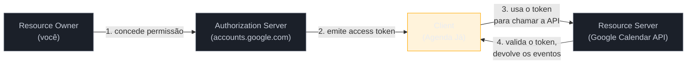
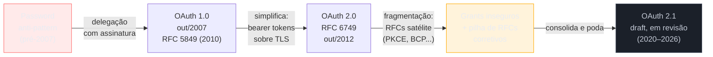

# OAuth — o problema da delegação

> [!abstract] TL;DR
> Antes de 2007, "conectar" um app a outro serviço significava literalmente entregar sua senha — o **password anti-pattern**. **OAuth** resolve isso trocando a senha por uma credencial delegada, com escopo limitado e revogável: o **access token**. O protocolo define quatro papéis fixos — **resource owner** (você), **client** (o app que quer acesso), **authorization server** (quem autentica você e emite o token) e **resource server** (quem guarda o dado protegido) — e um contrato explícito de permissão, o **scope**. O protocolo passou por três eras: **1.0** (2007-2010, assinatura criptográfica manual, poderosa mas frágil de implementar), **2.0**/RFC 6749 (2012, bearer tokens simples, mas flexível demais — nasceram grants inseguros e uma pilha de RFCs satélites para consertá-los) e **2.1** (draft em consolidação desde 2020, ainda em revisão em 2026: remove o implicit grant e o password grant, torna PKCE obrigatório para todo cliente). Uma distinção decide o resto da trilha: **client confidential** (guarda segredo, roda em servidor) vs **client public** (não guarda segredo, roda no dispositivo do usuário). E o erro mais citado da indústria: **OAuth não é autenticação** — um access token prova que uma permissão foi concedida, não que a pessoa é quem diz ser. Usar OAuth puro para "login" abre a porta para o **confused deputy problem**; a resposta correta é OpenID Connect, tema da próxima nota.

> [!question]- Perguntas que esta nota responde
> - Por que a indústria inteira migrou de "compartilhar senha" para "delegar acesso" — o que exatamente quebrava no modelo antigo?
> - Quem são os quatro papéis do OAuth, e como eles se mapeiam para um cenário real e não abstrato?
> - O que mudou entre OAuth 1.0, 2.0 e 2.1 — e por que 2.1 existe se 2.0 "já funcionava"?
> - Por que um access token válido não prova a identidade de quem o está usando, e o que dá errado quando alguém assume que prova?

## A era da senha compartilhada

Em 2006, se você quisesse que um app novo — digamos, um serviço que gerava cartões de visita a partir dos seus contatos do Gmail — "importasse seus contatos", a única forma técnica de fazer isso era entregar ao app a sua senha do Gmail. Você digitava seu usuário e senha reais numa tela do app terceiro, que então logava no Gmail se passando por você para raspar os dados. Esse padrão tinha nome na comunidade de segurança: **password anti-pattern**[^waldo].

O problema não era só filosófico ("compartilhar senha é feio"). Era estrutural, e cada característica do modelo tornava o próximo problema pior:

- **Acesso total, não parcial.** A senha do Gmail não abre só "ver contatos" — abre a caixa de entrada inteira, o Google Drive vinculado, a capacidade de mudar a própria senha e trancar você fora da sua conta. Não existia meio-termo entre "não compartilhar nada" e "compartilhar tudo".
- **Acesso permanente, não temporário.** Uma vez entregue, a senha continuava válida até você trocá-la manualmente — e trocar a senha quebrava o acesso de *todo* app que a usava, não só do app que você queria revogar.
- **Armazenamento fora do seu controle.** O app terceiro precisava guardar sua senha real em algum lugar para reusá-la depois. Muitos guardavam em texto plano, porque era o jeito mais simples de reautenticar depois. Isso transformava cada app terceiro pequeno e mal-financiado num alvo valioso: comprometer aquele banco de dados de brinquedo dava ao atacante a senha real do Gmail de milhares de usuários[^waldo].
- **Nenhuma trilha de revogação seletiva.** Não havia como dizer "revogo o acesso só deste app específico" — a única alavanca era trocar a senha e quebrar tudo de uma vez, inclusive o que você queria manter funcionando.

Foi essa dor — muito concreta, muito repetida entre empresas que competiam para integrar seus produtos entre si — que levou um grupo de engenheiros, incluindo Blaine Cook (então no Twitter), a desenhar, a partir de 2006, um protocolo que resolvesse um problema específico: **como um app consegue agir em nome de um usuário, com permissão explícita e limitada, sem nunca ver a senha desse usuário**[^waldo]. Esse protocolo virou OAuth. A primeira especificação (OAuth Core 1.0) saiu em outubro de 2007[^duende].

Repare que o nome do problema já entrega a forma da solução: não é "como esconder melhor a senha", é "como *delegar* uma fatia de acesso sem transmitir o segredo raiz". É a mesma lógica de dar a um manobrista uma chave-valet que só liga o carro e não abre o porta-malas, em vez de entregar seu molho de chaves completo — a chave-valet é limitada por natureza, não por acordo de cavalheiros.

> [!question]- Isso ainda acontece hoje?
> Sim, com menos frequência — mas ainda aparece em integrações mal desenhadas, principalmente scripts internos ou automações caseiras que pedem "usuário e senha do serviço X" em vez de implementar OAuth. Toda vez que um formulário de "conectar sua conta" pede a senha *da conta que está sendo conectada*, em vez de redirecionar você para o site daquele serviço fazer login lá, é o mesmo anti-padrão de 2006 ressurgindo.

## Os quatro papéis, com um exemplo que persiste a nota inteira

OAuth define quatro papéis fixos — a RFC 6749, o documento que formalizou OAuth 2.0, os define exatamente assim, e a nomenclatura sobreviveu até 2.1 sem mudança[^rfc6749]. Para eles pararem de ser abstração, vamos fixar um cenário e usá-lo do início ao fim da trilha inteira: **um app de agendamento** (chame-o de "Agenda Já") que precisa **ler e escrever eventos no Google Calendar** de um usuário, sem nunca conhecer a senha da conta Google desse usuário.

| Papel | Definição RFC 6749 | No nosso cenário |
|---|---|---|
| **Resource Owner** | "Entidade capaz de conceder acesso a um recurso protegido. Quando é uma pessoa, chama-se end-user."[^rfc6749] | Você, o usuário do Agenda Já, dono da sua própria agenda do Google. |
| **Client** | "Aplicação que faz requisições a recursos protegidos em nome do resource owner e com sua autorização."[^rfc6749] | O Agenda Já — ele *quer* acesso, mas não *é* o dono do recurso. |
| **Authorization Server** | "Servidor que emite access tokens ao client depois de autenticar com sucesso o resource owner e obter autorização."[^rfc6749] | O servidor de autenticação do Google (`accounts.google.com`) — é ali que você digita sua senha do Google, nunca no Agenda Já. |
| **Resource Server** | "Servidor que hospeda os recursos protegidos, capaz de aceitar e responder a requisições usando access tokens."[^rfc6749] | A Google Calendar API — o serviço que efetivamente guarda seus eventos e responde às chamadas do Agenda Já. |

Um detalhe que costuma confundir quem chega vindo de sistemas mais simples: **authorization server e resource server são conceitualmente separados, mesmo quando a mesma empresa opera os dois**. No exemplo, é o Google quem roda tanto `accounts.google.com` quanto a Calendar API — mas são componentes distintos com responsabilidades distintas. A própria RFC 6749 deixa essa interação como algo "fora do escopo da especificação"[^rfc6749], justamente porque cada provedor resolve essa comunicação interna (validação local de assinatura, introspecção, banco compartilhado) do seu próprio jeito. É por isso que dá pra existir um IdP como o Keycloak (sub-galho 5 desta trilha) separado das APIs que ele protege: os dois papéis nunca precisaram estar no mesmo processo.

> [!question]- O client é sempre um "app de terceiro"?
> Não necessariamente terceiro no sentido de "outra empresa" — o que importa é que o client é uma peça de software distinta do resource owner e do resource server, mesmo que as três pertençam à mesma organização. Um app mobile da própria empresa dona da API, ou um microserviço interno chamando outro microserviço em nome de um usuário, também são clients OAuth. "Terceiro" aqui é um papel arquitetural, não uma relação comercial.

## Scopes: o contrato de permissão limitada

Se o access token é a chave-valet, o **scope** é o que está escrito na etiqueta dessa chave: exatamente o que ela abre. A RFC 6749 define scope como "uma lista de valores separados por espaço, sensível a maiúsculas/minúsculas, indicando o escopo necessário do access token para acessar o recurso solicitado" — e completa que os valores de scope são definidos por cada authorization server; não existe um registro central de scopes[^rfc6749scope].

No mundo real, a Google Calendar API expõe scopes como:

- `https://www.googleapis.com/auth/calendar.readonly` — só leitura de eventos e calendários.
- `https://www.googleapis.com/auth/calendar.events` — leitura e escrita de eventos, sem acesso às configurações do calendário.
- `https://www.googleapis.com/auth/calendar` — acesso total, leitura e escrita, a calendários e eventos[^gcal].

A própria documentação do Google recomenda pedir "o menor conjunto de scopes que corresponda à funcionalidade" — porque escopos mais amplos aumentam a fricção na tela de consentimento e, para escopos classificados como sensíveis, disparam um processo de verificação mais pesado antes do app poder sair de modo de teste[^gcal]. Voltando ao Agenda Já: se ele só precisa criar e atualizar eventos, deveria pedir `calendar.events`, nunca `calendar` — pedir o escopo total "porque pode ser útil depois" é o equivalente moderno de pedir a senha inteira da conta.

Isso é o scope resolvendo, de forma explícita e auditável, exatamente o primeiro problema da era da senha compartilhada: **acesso parcial, não total**. E porque o token carrega esse escopo como atributo, o resource server pode recusar uma chamada que o token não autoriza — mesmo que o token seja válido e pertença ao usuário certo. Um token com `calendar.readonly` que tenta chamar o endpoint de criação de evento recebe um erro de permissão, não porque a autenticação falhou, mas porque o *contrato* daquele token específico não cobre aquela ação.

## O access token: um cartão de acesso temporário

Depois que você concede permissão, o authorization server devolve ao client um **access token** — uma string opaca (do ponto de vista do client) que ele vai anexar em toda chamada ao resource server, tipicamente no header `Authorization: Bearer <token>`. A RFC 6750, que formaliza o uso de bearer tokens, define a propriedade central deles com uma frase que vale a pena internalizar: "um bearer token é um token de segurança com a propriedade de que qualquer parte de posse do token pode usá-lo, sem precisar provar posse de material criptográfico"[^rfc6750]. Ou seja: quem tem o token, pode usar o token — não existe verificação extra de "você é realmente quem recebeu isso". É por isso que TLS em trânsito e armazenamento seguro no client não são detalhes de implementação, são a própria segurança do modelo bearer.

A melhor analogia é literalmente um **cartão de acesso temporário de visitante** num prédio corporativo: você (resource owner) autoriza a recepção (authorization server) a emitir um crachá pro seu convidado (client); o crachá abre só certas portas (scope), por um tempo limitado (expiração), e pode ser cancelado a qualquer momento na recepção sem afetar seu próprio crachá permanente de funcionário. Ninguém precisa saber a sua senha do cofre para o convidado entrar na sala de reunião que você autorizou.

Três propriedades do access token, todas resolvendo diretamente um problema da era da senha compartilhada:

| Propriedade da senha compartilhada (problema) | Propriedade do access token (solução) |
|---|---|
| Acesso total ao serviço | Acesso limitado ao **scope** concedido |
| Válido até troca manual da senha | **Expiração** curta (minutos a poucas horas, tipicamente) |
| Revogação afeta todo mundo que usa a senha | **Revogação seletiva**, token a token, no authorization server |
| Guardado pelo app terceiro, fora do seu controle | Emitido e rastreável pelo próprio authorization server |

Access tokens de curta duração criam um problema prático óbvio — o usuário não quer refazer login a cada poucos minutos — que o protocolo resolve com o **refresh token**, um segundo token de vida mais longa usado só para pedir um access token novo sem repetir o login inteiro. Refresh tokens, rotação e revogação em produção são aprofundados na [[05 - Tokens em produção]] desta trilha; aqui, o que importa fixar é que o access token nunca foi desenhado para durar para sempre — durar pouco é uma decisão de segurança deliberada, não uma limitação.

## A história em três eras: de assinatura manual a bearer token universal

### OAuth 1.0 — poderoso, mas frágil de implementar

A primeira versão, formalizada como RFC 5849 (informational) em abril de 2010 depois de circular desde 2007[^duende], resolveu o problema central — nunca compartilhar a senha — mas fez isso exigindo que cada requisição fosse **assinada criptograficamente**: o client tinha que canonicalizar a URL, os parâmetros e um timestamp, gerar uma assinatura HMAC, e anexar tudo isso à requisição. Isso protegia contra token roubado em trânsito mesmo sem HTTPS universal (em 2007, TLS ainda não era onipresente) — mas o custo era altíssimo. A canonicalização de mensagens HTTP tinha que ser reimplementada de forma idêntica em toda linguagem e biblioteca, e qualquer divergência mínima — ordem de parâmetros, encoding de um caractere — quebrava a assinatura de forma silenciosa e difícil de depurar[^duende][^oauthhistory].

### OAuth 2.0 — bearer tokens, e a fragmentação como preço da simplicidade

Em 2010, contribuidores da Microsoft, Yahoo! e Google propuseram um substituto mais simples, batizado internamente de OAuth WRAP, que trocava a assinatura por trecho por **bearer tokens** transmitidos sobre TLS — a proteção em trânsito passa a ser responsabilidade do transporte (HTTPS), não de matemática em cada requisição. Essa proposta virou a base do trabalho do IETF OAuth Working Group, publicado como **RFC 6749** em outubro de 2012[^duende][^oauthhistory].

A troca resolveu o problema de complexidade de implementação — qualquer linguagem que já falasse HTTPS conseguia consumir OAuth 2.0 — mas trouxe um custo novo: **o 2.0 é, deliberadamente, um framework, não um protocolo fechado**. Ele define quatro grant types (formas de obter um token: authorization code, implicit, resource owner password credentials, client credentials) e deixa dezenas de decisões — como armazenar o token, como validar o redirect URI, se usar ou não PKCE — como opcionais ou fora de escopo. Isso gerou, ao longo da década seguinte, uma pilha de RFCs "satélite" corrigindo lacunas que a 2.0 deixou em aberto: PKCE (RFC 7636, 2015) contra interceptação de código de autorização, OAuth for Native Apps (RFC 8252) para mobile, e por fim o Security Best Current Practice (que amadureceu como RFC 9700) consolidando as lições aprendidas de anos de ataques reais contra implementações de 2.0[^oauth21].

Dois desses quatro grant types viraram, na prática, armadilhas: o **implicit grant** (devolvia o access token direto na URL de redirecionamento, sem troca de código, pensado para SPAs de antes de existir CORS maduro) expunha o token no histórico do navegador e em logs de proxy; o **resource owner password credentials grant** (o client pedia usuário e senha diretamente e trocava por um token) reintroduzia, dentro do próprio OAuth, o mesmo problema que o OAuth nasceu para resolver — o client voltava a ver a senha real.

| Grant type (RFC 6749) | Para que servia | Destino na 2.1 |
|---|---|---|
| Authorization code | Fluxo padrão com um usuário humano, client trocando um código por token | Sobrevive — é o fluxo canônico, agora com PKCE obrigatório ([[02 - Authorization Code + PKCE — o fluxo canônico]]) |
| Implicit | Token direto na URL, pensado para SPAs sem backend | **Removido** — substituído por authorization code + PKCE mesmo em SPAs |
| Resource owner password credentials | Client pedia usuário/senha e trocava por token | **Removido** — reintroduzia o password anti-pattern dentro do próprio protocolo |
| Client credentials | Sem usuário humano — serviço autenticando como si mesmo | Sobrevive — é a base dos grants de máquina, aprofundado em [[04 - Grants de máquina e fluxos especiais]] |

### OAuth 2.1 — consolidação, não reinvenção

**OAuth 2.1** não é uma nova RFC do zero: é um esforço, ainda em formato de Internet-Draft do IETF, para consolidar num único documento tudo que a experiência de produção já tinha estabelecido como "a forma certa de fazer OAuth 2.0" — fundindo a 6749 com PKCE, com o guia de apps nativos e com o Security BCP[^oauth21]. Em julho de 2026, o draft mais recente é `draft-ietf-oauth-v2-1-15`, e o próprio oauth.net descreve o esforço como consolidar e simplificar "os recursos mais comumente usados do OAuth 2.0"[^oauth21official]. As mudanças que mais afetam quem implementa:

- **PKCE passa a ser obrigatório para todo client que usa o authorization code flow** — não só para public clients, como era a recomendação em 2.0. O mecanismo em si (code_verifier/code_challenge) é o núcleo técnico da próxima nota desta trilha.
- **O implicit grant é eliminado** — `response_type=token` deixa de existir na 2.1.
- **O resource owner password credentials grant é removido** — não há mais forma "padrão" de um client pedir usuário e senha diretamente.
- **Redirect URIs exigem comparação por string exata** — sem wildcard, sem correspondência parcial, fechando uma classe inteira de ataques de redirecionamento.
- **Refresh tokens para public clients precisam ser sender-constrained ou de uso único**[^oauth21].

Em uma frase: **se você está escrevendo integração OAuth nova em 2026, você já está, na prática, implementando OAuth 2.1** — mesmo que o documento formal ainda esteja em draft, é o que bibliotecas, provedores (Google, Microsoft, Okta) e guias de segurança recomendam como baseline.

> [!info] Nota de caducidade
> O status de "draft" do OAuth 2.1 é dado factual desta trilha em julho de 2026 (draft-15). Se você está lendo isso mais tarde e o documento já foi publicado como RFC, o conteúdo técnico permanece válido — só o número do documento formal muda.

## Confidential vs public client: a distinção que decide o resto do sub-galho

Voltando ao papel de **client** da RFC 6749: nem todo client consegue guardar um segredo. A especificação distingue dois tipos, com uma definição que a 2.1 deliberadamente simplificou para depender só de uma pergunta: **este client consegue manter credenciais confidenciais?**[^oauth21]

- **Confidential client** — roda num ambiente que o usuário final não controla: um backend de servidor, uma função serverless. Pode receber um `client_secret` do authorization server e guardá-lo de forma que ninguém de fora consiga extrair — o segredo nunca sai do servidor.
- **Public client** — roda num ambiente que o usuário controla ou pode inspecionar: um SPA rodando no navegador, um app mobile instalado no telefone do usuário, um binário desktop. Qualquer segredo embutido nesse client pode ser extraído com engenharia reversa trivial (abrir o DevTools, descompilar o APK) — então esse tipo de client **não recebe** `client_secret`, porque um segredo que todo mundo pode ler deixou de ser segredo[^confidential].

No nosso exemplo: se o Agenda Já for um app web tradicional, com um backend que troca o código de autorização por um token *no servidor*, ele é confidential — o `client_secret` fica só ali. Se o Agenda Já for um app mobile ou uma SPA que fala direto com a API do Google pelo navegador do usuário, ele é public — não existe onde guardar um segredo com segurança, e o protocolo tem que compensar essa ausência de outra forma.

É exatamente essa compensação que explica por que PKCE nasceu pensado para public clients e depois virou universal: sem `client_secret`, um public client não tinha, originalmente, como provar ao authorization server "sou eu mesmo pedindo para trocar este código de autorização por um token, não um atacante que interceptou o código". PKCE resolve isso sem depender de segredo nenhum, usando um desafio criptográfico gerado no próprio momento da requisição — o mecanismo exato é o núcleo da [[02 - Authorization Code + PKCE — o fluxo canônico]], a próxima nota. A 2.1 estende PKCE também a confidential clients porque a mesma classe de ataque (interceptação do código de autorização) pode acontecer independentemente do tipo de client — é defesa em profundidade, não um remendo específico de public client[^pkce21].

Essa distinção confidential/public não é um detalhe de implementação descartável: ela decide qual fluxo cada tipo de client pode usar com segurança, se o Agenda Já pode confiar em um refresh token de vida longa guardado localmente (não, se for public), e é o eixo central que a nota de tokens em produção ([[05 - Tokens em produção]]) e o padrão BFF respondem para SPAs modernas.

## Casos práticos

Voltando ao Agenda Já uma última vez, vale colocar lado a lado as duas versões plausíveis do mesmo produto — porque a diferença entre elas é exatamente a diferença entre confidential e public client aplicada a uma decisão de arquitetura real, não a um exercício acadêmico.

### Cenário 1: Agenda Já como app web tradicional (confidential client)

O Agenda Já roda como um servidor: o usuário acessa `agendaja.com`, clica em "Conectar Google Calendar", e é redirecionado para `accounts.google.com`. Depois de consentir, o Google redireciona de volta para uma rota no *backend* do Agenda Já (`agendaja.com/oauth/callback`) com um código de autorização na URL. É o backend — nunca o navegador do usuário — quem troca esse código por um access token, apresentando junto o `client_secret` que o Google emitiu quando o time do Agenda Já registrou a aplicação.

Nesse desenho, o segredo nunca trafega até o navegador do usuário. Se um atacante inspecionar o tráfego do navegador ou o código-fonte servido ao cliente, não encontra nada que permita se passar pelo Agenda Já perante o Google. É essa garantia — segredo que nunca sai do processo que o guarda — que define o client como confidential, e é exatamente por isso que provedores como o Google emitem `client_secret` sem hesitar para esse tipo de registro de aplicação.

### Cenário 2: Agenda Já como app mobile publicado na loja (public client)

Agora o mesmo produto, mas como um app iOS/Android publicado na App Store/Play Store. O binário do app é distribuído para qualquer pessoa que o baixe — e qualquer pessoa com as ferramentas certas (um descompilador de APK, por exemplo) consegue extrair strings e constantes embutidas nesse binário, incluindo um `client_secret` se um desenvolvedor tivesse decidido embuti-lo ali "para simplificar o fluxo".

Se o Agenda Já mobile tentasse usar o mesmo modelo do Cenário 1 — trocar o código de autorização por um token usando um `client_secret` embutido no app — qualquer pessoa que descompilasse o APK teria em mãos as mesmas credenciais que o app usa para se identificar ao Google, e poderia forjar requisições se passando pelo Agenda Já perante o servidor de autorização. É exatamente esse cenário que a distinção confidential/public existe para prevenir: o Google, ao registrar um client mobile, não emite `client_secret` — e o app compensa a ausência de segredo com PKCE, provando posse de um segredo *gerado localmente e descartado a cada tentativa de login*, nunca embutido de forma estática no binário publicado.

O ponto que os dois cenários deixam claro, lado a lado: **a mesma aplicação, o mesmo authorization server, o mesmo resource server — mas o tipo de client muda o mecanismo de segurança inteiro**, porque a pergunta que decide tudo ("este client consegue guardar um segredo?") tem resposta diferente dependendo de onde o código roda, não de quem escreveu o código.

## O erro clássico: usar OAuth puro como autenticação

Aqui fecha o gancho mais importante desta nota. Um access token prova uma coisa muito específica: **que o authorization server concedeu a este client uma permissão delimitada por scope, em nome de algum resource owner**. Ele não prova, por construção, **quem** é esse resource owner — porque, como já vimos, o público-alvo do access token é o *resource server*, não o client, e o token normalmente não carrega nenhum dado de identidade legível pelo client[^oauthauth].

O erro nasce de um raciocínio intuitivo, mas errado: "se o usuário conseguiu completar o fluxo de login do Google e o Agenda Já recebeu um token de volta, então o Agenda Já sabe quem é esse usuário — é login com Google". Esse raciocínio ignora que o token só prova "alguém completou o fluxo de consentimento" — ele não te diz nada sobre quando essa autenticação aconteceu, com qual método, nem garante que o token que voltou foi realmente emitido para *este* client e não para outro. A página oficial do oauth.net sobre autenticação de usuário final resume o problema: "OAuth não diz nada à aplicação sobre o usuário, nem como o usuário provou sua presença, nem sequer se o usuário ainda está lá"[^oauthauth].

Esse erro se manifesta como uma variante do **confused deputy problem**: um resource server (ou um client mal implementado agindo como "verificador de identidade") aceita um token sem checar rigorosamente para qual **audiência** ele foi emitido, e passa a tratar "possuir um token válido de *algum* client" como equivalente a "ser autenticado como o dono daquele token". Se um serviço A aceita, sem validar o campo `audience`, um token que foi originalmente emitido para o serviço B, um atacante que obtenha esse token de B pode reutilizá-lo contra A se passando por um usuário legítimo[^confuseddeputy]. A recomendação padrão do próprio Google para evitar isso é explícita: **sempre validar o access token antes de confiar nele**, nunca assumir validade só porque ele chegou anexado numa requisição[^confuseddeputy2].

Na prática, o sintoma mais comum é um botão "Entrar com [provedor]" implementado à mão sobre OAuth puro: o desenvolvedor troca o código de autorização por um access token, chama um endpoint de perfil do provedor com esse token, recebe um nome e um email de volta, e trata isso como "login concluído". Funciona na maioria dos casos de uso feliz — mas não garante nada sobre a integridade do que voltou, não define um formato padronizado de identidade, e cada provedor expõe esse "endpoint de perfil" de um jeito diferente, forçando um código de integração customizado por provedor.

A resposta da indústria a exatamente esse buraco tem nome: **OpenID Connect (OIDC)**, uma camada de identidade construída *sobre* OAuth 2.0/2.1, que adiciona um segundo token com formato padronizado e propósito explícito de autenticação — o **ID token** — e um contrato formal do que ele garante. "Se você precisa saber a identidade do usuário, use OpenID Connect; não tente hackear isso sozinho por cima do OAuth puro" é a recomendação recorrente entre praticamente todas as fontes de referência do protocolo[^oauthauth]. É exatamente onde a [[03 - OpenID Connect — identidade sobre OAuth]] começa.

## Armadilhas comuns

> [!warning] Tratar "login com Google/Facebook/GitHub" como se fosse autenticação nativa do OAuth
> **O que acontece:** um app implementa "Entrar com X" trocando o código de autorização por um access token e chamando um endpoint de perfil do provedor, sem usar OpenID Connect. **Por quê:** o access token prova permissão delegada, não identidade — ele foi desenhado para ser consumido pelo *resource server*, e nada na especificação OAuth 2.0/2.1 exige que ele carregue, ou garanta, dados verificáveis sobre quem é o resource owner. **Como evitar:** use OpenID Connect (a camada de identidade sobre OAuth, [[03 - OpenID Connect — identidade sobre OAuth]]) sempre que o objetivo for autenticar, não só autorizar acesso a um recurso. OIDC define um token específico para isso — o ID token — com formato e garantias padronizados.

> [!warning] Confundir authorization server com resource server porque a mesma empresa opera os dois
> **O que acontece:** um desenvolvedor assume que, porque o Google emite o token e o Google também guarda o Calendar, os dois são "a mesma coisa" — e valida o token de forma frouxa, ou assume propriedades que só valeriam se fossem componentes fundidos. **Por quê:** a RFC 6749 trata authorization server e resource server como papéis conceitualmente distintos, mesmo quando operados pela mesma organização; a interação entre os dois é deixada fora do escopo da especificação, e cada provedor resolve isso de um jeito diferente (validação local de assinatura, introspecção online, etc.). **Como evitar:** trate a validação do token no resource server como uma etapa explícita e nunca implícita — verifique assinatura, expiração, escopo e audiência do token a cada requisição, independentemente de quem emitiu o token.

> [!warning] Achar que scope é sinônimo de autorização fina por recurso
> **O que acontece:** um time desenha o token do Agenda Já com scope `calendar.events` e assume que isso já resolve "quem pode editar qual evento específico" — inclusive eventos de outros usuários compartilhados na mesma conta. **Por quê:** scope é um contrato *entre client e authorization server* sobre que categoria de operação é permitida (ler vs escrever eventos) — não é um mecanismo de autorização por instância de recurso (este evento específico, deste usuário específico). É a mesma distinção AuthN vs AuthZ da [[01 - Identidade, autenticação e autorização — o mapa|nota-mapa da trilha]], aplicada dentro do próprio OAuth. **Como evitar:** trate scope como o primeiro filtro (grosso), nunca o último. A autorização fina por recurso continua sendo responsabilidade do resource server, aprofundada no sub-galho 3 desta trilha ([[04 - Autorização de API na prática]]).

> [!warning] Deixar um public client guardar client_secret "porque funcionou nos testes"
> **O que acontece:** uma SPA ou app mobile recebe um `client_secret` do provedor OAuth e o embute no bundle JavaScript ou no binário do app, porque alguns fluxos de exemplo de tutorial ainda mostram isso. **Por quê:** qualquer segredo embutido em código que roda no dispositivo do usuário é extraível com ferramentas triviais (DevTools, descompilador de APK) — o segredo deixa de ser secreto no momento em que é publicado, tornando a proteção puramente decorativa. **Como evitar:** public clients nunca recebem `client_secret` num desenho correto; a prova de identidade do client vem de PKCE, não de um segredo compartilhado. Se um SDK ou provedor está pedindo para você embutir um secret numa SPA ou app mobile, isso é sinal de fluxo mal desenhado — ou de que o client deveria, na verdade, estar rodando um backend confidential por trás (padrão BFF, [[05 - Tokens em produção]]).

## Em entrevista

Perguntas sobre OAuth em entrevista sênior raramente pedem "explique o protocolo do zero" — o padrão mais comum é uma pergunta de arquitetura disfarçada: "como você desenharia o login social do nosso produto?" ou "por que nosso app não deveria simplesmente usar o access token do Google como prova de identidade?". O sinal que o entrevistador busca é exatamente a distinção que fecha esta nota: você sabe, de cor, que **OAuth resolve delegação de acesso, não prova de identidade** — e sabe nomear a camada que resolve o segundo problema (OIDC) sem hesitar.

Uma resposta fraca fica no vocabulário de features ("a gente usa OAuth pra fazer login com Google"). Uma resposta forte separa os dois protocolos e explica o porquê: "a gente usa OpenID Connect, que é OAuth mais um ID token assinado — o access token que o Google devolve prova que o usuário concedeu permissão pra algo, mas não garante identidade por si só; quem prova identidade é o ID token do OIDC, que a gente valida (assinatura, `aud`, `iss`, `exp`) antes de considerar o usuário autenticado". Isso sinaliza que você já foi mordido pela armadilha do confused deputy, ou estudou o suficiente para nunca precisar ser.

Um exemplo de como essa distinção aparece embutida numa pergunta aberta:

> **Entrevistador:** "Nosso app vai integrar com o Google Calendar de cada usuário. Como você desenharia essa integração, e o que você validaria com mais cuidado?"
>
> **Resposta fraca:** "Eu usaria OAuth do Google, pediria o token de acesso e chamaria a API do Calendar com ele."
>
> **Resposta forte:** "Primeiro eu separaria os dois problemas: autenticar o usuário no meu app (isso eu resolveria com OpenID Connect, não com o access token bruto) e autorizar o acesso ao Calendar dele (isso sim é OAuth puro, com scope restrito ao mínimo — `calendar.events`, não `calendar` inteiro). Eu trataria o client como confidential se tiver um backend guardando o segredo, ou public com PKCE obrigatório se for uma SPA. E eu nunca confiaria só na presença de um token válido — validaria audiência e escopo em toda chamada ao resource server, pra evitar um cenário de confused deputy onde um token emitido pra outro serviço acaba sendo aceito pelo meu."

A resposta forte não cita nenhuma biblioteca específica — ela demonstra que o candidato separa delegação de identificação por reflexo, e sabe onde cada responsabilidade mora no protocolo.

## How to explain it in English

> "OAuth solves delegation, not identity: it lets a client act on a resource owner's behalf with a limited, revocable, scoped credential — the access token — instead of the resource owner ever sharing their password. The classic mistake is treating a valid access token as proof of who the user is; it only proves that some permission was granted. If you need to know the user's identity, that's what OpenID Connect is for."

| PT | EN |
|----|----|
| Delegação de acesso | Access delegation |
| Dono do recurso | Resource owner |
| Aplicação cliente | Client |
| Servidor de autorização | Authorization server |
| Servidor de recurso | Resource server |
| Escopo (permissão delimitada) | Scope |
| Token de acesso | Access token |
| Token de atualização | Refresh token |
| Cliente confidencial | Confidential client |
| Cliente público | Public client |
| Problema do procurador confuso | Confused deputy problem |

## O que vem a seguir

Fixamos o vocabulário e o porquê: delegação em vez de senha compartilhada, os quatro papéis, scope como contrato, access token como credencial temporária, e a fronteira entre OAuth (autorização) e OIDC (identidade). Falta o mecanismo — *como*, passo a passo, o Agenda Já e o Google trocam mensagens HTTP reais para chegar de "usuário clicou em conectar" a "app tem um token válido nas mãos", e por que PKCE entra exatamente no ponto em que um atacante poderia interceptar o código de autorização.

- [[02 - Authorization Code + PKCE — o fluxo canônico]] — o fluxo completo com diagrama de sequência, o mecanismo de PKCE (code_verifier/code_challenge), redirect URI exato e os parâmetros `state`/`nonce`
- [[03 - OpenID Connect — identidade sobre OAuth]] — a camada de identidade que resolve o erro clássico fechado nesta nota: ID token, claims, discovery
- [[04 - Grants de máquina e fluxos especiais]] — quando não existe um usuário humano no fluxo (client credentials, device flow) ou quando um serviço precisa agir em nome de outro (token exchange)
- [[12 - OAuth2 e OIDC Client e os grant types|Java 12 — OAuth2 e OIDC Client e os grant types]] — a implementação desses mesmos conceitos com Spring Security, no sub-galho 4 desta trilha

## Fontes

- **IETF Datatracker** — [*RFC 6749 — The OAuth 2.0 Authorization Framework*](https://datatracker.ietf.org/doc/html/rfc6749) — definição formal dos quatro papéis, scope, e o framework de grant types; acessado em 2026-07-10.
- **IETF Datatracker** — [*RFC 6750 — The OAuth 2.0 Authorization Framework: Bearer Token Usage*](https://datatracker.ietf.org/doc/html/rfc6750) — definição de bearer token e a propriedade de posse; acessado em 2026-07-10.
- **oauth.net** — [*OAuth 2.1*](https://oauth.net/2.1/) — o que a 2.1 consolida e remove (implicit, password grant), PKCE obrigatório, status de draft; acessado em 2026-07-10.
- **oauth.net** — [*End User Authentication with OAuth 2.0*](https://oauth.net/articles/authentication/) — por que OAuth não é autenticação e o gancho para OIDC; acessado em 2026-07-10.
- **oauth.net** — [*PKCE for OAuth 2.0*](https://oauth.net/2/pkce/) — origem do PKCE para public clients e extensão a todos os clients na 2.1; acessado em 2026-07-10.
- **Duende Software** — [*The Evolution of OAuth and OpenID Connect Timeline*](https://duendesoftware.com/blog/20250520-essential-moments-in-the-oauth-and-openid-connect-timeline) — linha do tempo 1.0 (2007/RFC 5849 em 2010) → 2.0 (RFC 6749, 2012) → satélites → 2.1; acessado em 2026-07-10.
- **Waldo Security** — [*A Brief History of OAuth: From Twitter Frustration to Enterprise Authorization Standard*](https://www.waldosecurity.com/post/a-brief-history-of-oauth-from-twitter-frustration-to-enterprise-authorization-standard) — o password anti-pattern de 2006 e a origem do protocolo com Blaine Cook; acessado em 2026-07-10.
- **Auth0 Docs** — [*Confidential and Public Applications*](https://auth0.com/docs/get-started/applications/confidential-and-public-applications) — definição prática de client confidential vs public e por que SPAs/mobile não recebem client_secret; acessado em 2026-07-10.
- **BeyondTrust** — [*What Is The Confused Deputy Problem?*](https://www.beyondtrust.com/blog/entry/confused-deputy-problem) — mecânica geral do confused deputy problem aplicada a tokens; acessado em 2026-07-10.
- **AWS Documentation** — [*The confused deputy problem*](https://docs.aws.amazon.com/IAM/latest/UserGuide/confused-deputy.html) — formalização do problema e a recomendação de validar audiência do token; acessado em 2026-07-10.
- **Google for Developers** — [*Choose Google Calendar API scopes*](https://developers.google.com/workspace/calendar/api/auth) — os scopes reais (`calendar.readonly`, `calendar.events`, `calendar`) usados no exemplo desta nota; acessado em 2026-07-10.

[^waldo]: Waldo Security, *A Brief History of OAuth: From Twitter Frustration to Enterprise Authorization Standard*. [^duende]: Duende Software, *The Evolution of OAuth and OpenID Connect Timeline*. [^oauthhistory]: oauth.com, *Background — OAuth 2.0 Simplified*; e Duende Software, timeline citada acima. [^rfc6749]: IETF, RFC 6749, Seção 1.1 (Roles). [^rfc6749scope]: IETF, RFC 6749, Seção 3.3 (Access Token Scope). [^gcal]: Google for Developers, *Choose Google Calendar API scopes*. [^rfc6750]: IETF, RFC 6750, Seção 1.2 (Terminology). [^oauth21]: oauth.net, *OAuth 2.1*. [^oauth21official]: oauth.net, *OAuth 2.1* — descrição do esforço de consolidação e status de draft (draft-ietf-oauth-v2-1-15). [^confidential]: Auth0 Docs, *Confidential and Public Applications*. [^pkce21]: oauth.net, *PKCE for OAuth 2.0*. [^oauthauth]: oauth.net, *End User Authentication with OAuth 2.0*. [^confuseddeputy]: BeyondTrust, *What Is The Confused Deputy Problem?*. [^confuseddeputy2]: AWS Documentation, *The confused deputy problem*.
