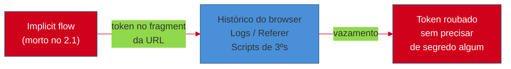
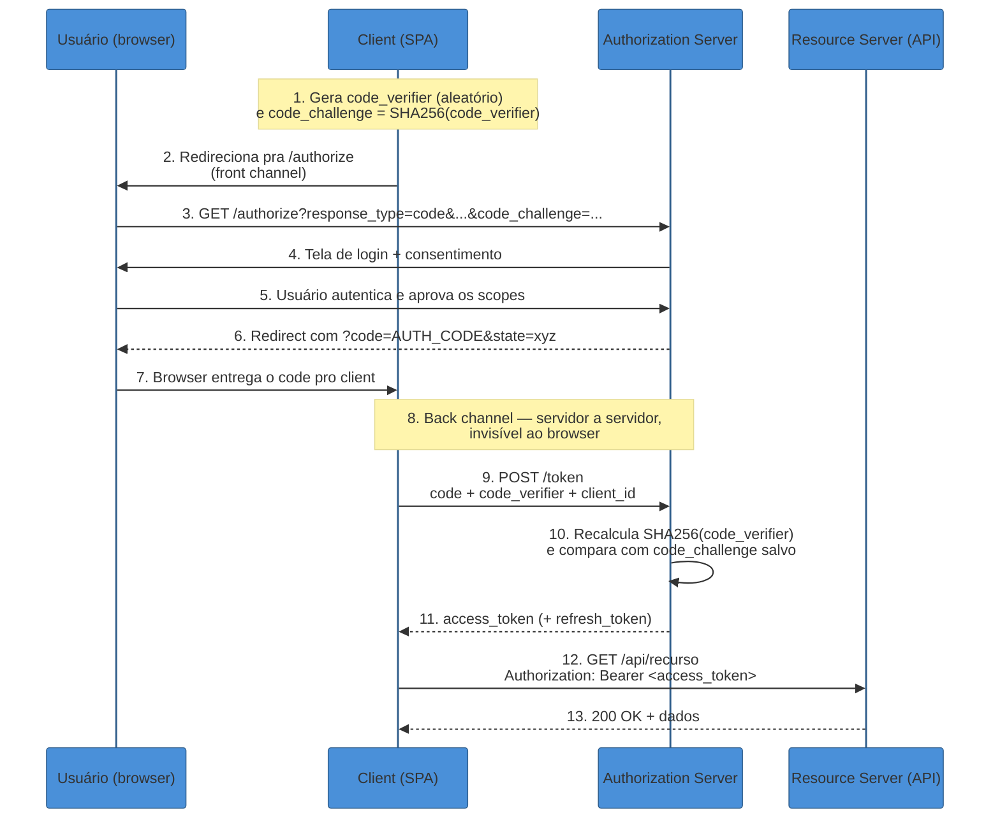
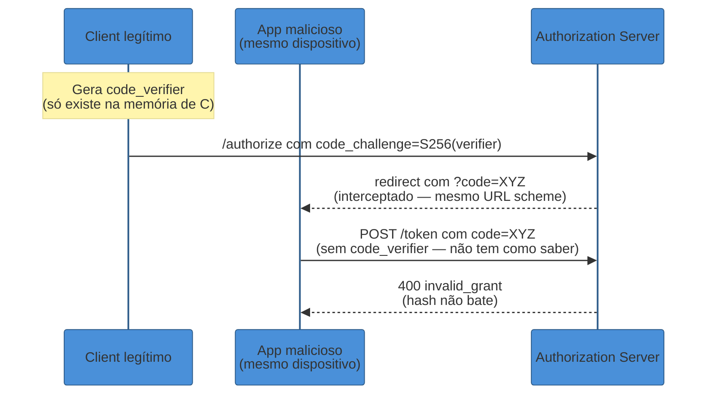

# Authorization Code + PKCE — o fluxo canônico

> [!abstract] TL;DR
> O **Authorization Code Flow** existe porque o navegador do usuário é um ambiente hostil: qualquer coisa que passe por ele — URL, fragment, histórico, extensões — pode vazar. Por isso o fluxo separa a dança em dois canais: o **front channel** (via redirecionamentos do browser, visível e não confiável) troca só um **código de uso único e vida curta**; o **back channel** (uma chamada HTTP servidor-a-servidor, invisível ao usuário) troca esse código pelo token de verdade. **PKCE** (RFC 7636) tapa o buraco que sobra nesse desenho para clientes que não têm como guardar segredo (SPAs, apps mobile e desktop): o cliente gera um `code_verifier` aleatório, manda seu hash (`code_challenge`, método `S256`) na ida, e só quem tiver o `code_verifier` original consegue trocar o código pelo token na volta — mesmo que o código vaze no meio do caminho. O **OAuth 2.1** (draft-ietf-oauth-v2-1-15) tornou PKCE **obrigatório para todo mundo**, inclusive clientes confidenciais com client secret, porque o secret sozinho não impede um ataque de *authorization code injection* — e removeu de vez o **implicit flow** (tokens expostos no fragment da URL, sem autenticação de cliente) e o **Resource Owner Password Credentials grant** (o app pedindo a senha do usuário diretamente). Junto com PKCE, três outros parâmetros fecham o cerco: `state` (impede CSRF no início do fluxo), `nonce` (impede replay do ID token, aprofundado na próxima nota) e **exact redirect URI matching** — comparação byte-a-byte da URL de retorno, sem wildcard, porque validação frouxa aqui já causou vazamento de tokens em produtos reais.

> [!question]- Perguntas que esta nota responde
> - Por que o OAuth não devolve o token direto no redirect — que ataque isso evitaria?
> - O que exatamente o PKCE prova, e por que ele nasceu para mobile mas hoje é obrigatório até para quem tem client secret?
> - O que `state` e `nonce` protegem, e por que são coisas diferentes?
> - Por que o implicit flow e o password grant foram removidos no OAuth 2.1, e o que fazer no lugar deles?

## O ataque que a resposta ingênua permite

Imagine a versão mais simples possível de "delegar acesso": o usuário faz login no authorization server, e o servidor devolve o token de acesso direto na URL de redirecionamento de volta para o app cliente — `https://app.exemplo.com/callback#access_token=abc123`. Simples, rápido, sem etapa extra. Foi exatamente essa a proposta original do **implicit flow**, desenhado nos primórdios do OAuth 2.0 para SPAs de uma época em que CORS mal existia e navegadores não sabiam fazer chamadas cross-origin autenticadas de forma confiável[^implicit-cors].

O problema é que tudo que passa pela barra de endereço do navegador **não é privado**. O token no fragment (`#access_token=...`) fica gravado no histórico do navegador, pode ser logado por proxies corporativos, aparece em `Referer` headers de requisições subsequentes, e — o pior — fica acessível a qualquer script rodando na página, incluindo extensões maliciosas ou uma dependência de terceiros comprometida[^implicit-risks]. E como o implicit flow não autentica o cliente (não existe back channel para checar um secret), um atacante que registre um app malicioso reutilizando o mesmo `client_id` público pode, em certas configurações, receber o token no lugar do app legítimo.

A pergunta que o design do OAuth moderno responde é: **como delegar acesso sem nunca deixar o segredo de verdade (o token) passar pelo canal hostil (o navegador)?** A resposta é o **Authorization Code Flow**: em vez do token, o front channel só carrega um **código** — um vale-presente de uso único, sem valor sozinho, que só pode ser trocado pelo token de verdade numa chamada que o navegador nunca vê.



Em uma frase: **o token nunca deveria tocar o navegador — só um código descartável deveria, e mesmo esse código precisa de proteção extra.**

## Front channel vs back channel: por que a dança existe

Todo protocolo de delegação via navegador opera em dois canais com garantias radicalmente diferentes, e entender essa separação é o que torna o resto do fluxo óbvio em vez de arbitrário.

- **Front channel** — comunicação que passa pelo user-agent (o navegador) via redirecionamentos HTTP. É **visível**: a URL aparece na barra de endereço, pode ser copiada, logada, interceptada por extensões. Não há como provar quem realmente enviou ou recebeu uma requisição nesse canal — o navegador só segue instruções.
- **Back channel** — comunicação servidor-a-servidor, direta, fora da visão do usuário. O cliente (rodando no seu backend, ou — no caso de PKCE — provando posse de um segredo efêmero) fala diretamente com o authorization server via HTTPS. É **autenticável**: dá para exigir um client secret, um certificado mTLS, ou (no caso de PKCE) um `code_verifier`[^frontback].

O Authorization Code Flow usa os dois, cada um para o que ele faz bem: o **front channel** carrega só o código de autorização — que sozinho não vale nada, porque falta a prova de quem pode trocá-lo — e o **back channel** faz a troca de fato, autenticada, longe de qualquer olho curioso no navegador[^authcode-channels]. É por isso que esse fluxo é considerado o mais seguro entre os grants do OAuth: o único artefato sensível (o token) nunca atravessa o canal hostil.

## O fluxo passo a passo, com PKCE

Vamos seguir uma requisição completa, do clique do usuário até o app ter um token utilizável. O exemplo é uma SPA (`app.exemplo.com`) delegando acesso à API `api.exemplo.com`, autenticando via `auth.exemplo.com` — os papéis (resource owner, client, authorization server, resource server) foram definidos em [[01 - OAuth — o problema da delegação]].



Passo a passo, com os parâmetros reais que cada requisição carrega:

**1. Preparação (antes de qualquer rede).** O client gera um `code_verifier` — uma string aleatória de alta entropia, entre 43 e 128 caracteres do alfabeto `[A-Z] [a-z] [0-9] - . _ ~` — e calcula o `code_challenge` aplicando SHA-256 e codificando o resultado em Base64-URL[^rfc7636-verifier]. O `code_verifier` fica guardado localmente (em memória, ou `sessionStorage` na SPA); só o `code_challenge` (o hash, não o segredo) vai para a rede.

**2-3. Requisição de autorização (front channel).** O client redireciona o browser para o endpoint `/authorize` do authorization server:

```
GET https://auth.exemplo.com/authorize
  ?response_type=code
  &client_id=spa-exemplo-abc123
  &redirect_uri=https%3A%2F%2Fapp.exemplo.com%2Fcallback
  &scope=openid%20profile%20orders.read
  &state=k9F2mQzX7pLr3sT1
  &code_challenge=E9Melhor2wOGiEghdVYw6VS7SfMjjfMR9CDKDpqUq0
  &code_challenge_method=S256
```

Cada parâmetro tem um papel específico: `response_type=code` pede o fluxo de código (não implicit); `redirect_uri` precisa bater **exatamente** com uma URL pré-registrada (mais abaixo, por quê); `scope` declara o que o client quer poder fazer; `state` é o token anti-CSRF que o client vai conferir na volta; `code_challenge`/`code_challenge_method` são a metade pública do PKCE.

**4-5. Autenticação e consentimento.** O authorization server mostra sua própria tela de login (o client nunca vê a senha do usuário) e, se for a primeira vez, uma tela de consentimento listando os scopes pedidos.

**6-7. Retorno do código (front channel).** Aprovado, o authorization server redireciona de volta:

```
HTTP/1.1 302 Found
Location: https://app.exemplo.com/callback
  ?code=SplxlOBeZQQYbYS6WxSbIA
  &state=k9F2mQzX7pLr3sT1
```

O client confere que o `state` recebido é idêntico ao que ele mesmo gerou no passo 2 — isso é o que impede CSRF, detalhado adiante. O `code` que chega aqui é o único artefato sensível que passou pelo front channel, e ele é **inútil sozinho**: qualquer um que o intercepte ainda precisa do `code_verifier`, que nunca saiu da memória do client legítimo.

**8-9. Troca do código pelo token (back channel).** Agora, numa chamada HTTP direta — sem redirecionamento de browser, sem URL visível ao usuário — o client troca o código pelo token:

```
POST https://auth.exemplo.com/token
Content-Type: application/x-www-form-urlencoded

grant_type=authorization_code
&code=SplxlOBeZQQYbYS6WxSbIA
&redirect_uri=https%3A%2F%2Fapp.exemplo.com%2Fcallback
&client_id=spa-exemplo-abc123
&code_verifier=dBjftJeZ4CVP-mB92K27uhbUJU1p1r_wW1gFWFOEjXk
```

**10-11. Verificação e emissão.** O authorization server recalcula `SHA256(code_verifier)`, compara com o `code_challenge` que ele salvou no passo 3 e, só se baterem, emite o token:

```json
{
  "access_token": "eyJhbGciOiJSUzI1NiIsInR5cCI6IkpXVCJ9...",
  "token_type": "Bearer",
  "expires_in": 600,
  "refresh_token": "8xLOxBtZp8"
}
```

**12-13. Uso do token.** O client usa o `access_token` em chamadas subsequentes à API, no header `Authorization: Bearer <token>` — o que a API faz com ele (validação, revogação, onde guardar no browser) é assunto da nota [[05 - Tokens em produção|05]].

## PKCE em detalhe: o que ele realmente prova

O nome **PKCE** ("Proof Key for Code Exchange", pronunciado "pixy") descreve exatamente o que o mecanismo faz: ele cria uma **prova de posse** amarrando quem *iniciou* o fluxo a quem *termina* o fluxo, sem depender de um segredo estático[^authlete-pkce].

### O problema original: mobile, sem lugar seguro pra guardar segredo

PKCE nasceu documentado na RFC 7636 (2015) para resolver um problema específico de apps nativos, formalizado em paralelo pela RFC 8252 (*OAuth 2.0 for Native Apps*): apps mobile não têm como guardar um client secret de verdade. Decompile o `.apk` ou o `.ipa` e o secret está ali, idêntico para todo usuário e todo dispositivo — não é um segredo, é uma constante pública disfarçada[^curity-pkce]. Sem secret, o Authorization Code Flow tradicional fica exposto a um ataque conhecido como **authorization code interception attack**: apps nativos usam esquemas de URL customizados (`meuapp://callback`) para receber o redirect, e um app malicioso no mesmo dispositivo pode registrar o **mesmo esquema** e roubar o código antes que o app legítimo o veja. Sem um secret para validar a troca, quem pegar o código primeiro ganha o token[^rfc8252-interception].

PKCE resolve isso trocando um segredo *estático* (que teria que estar embutido no binário, logo não é segredo) por um segredo *efêmero*, gerado do zero a cada início de fluxo e nunca persistido em disco: o `code_verifier`. Mesmo que o atacante capture o `code` na interceptação, ele não tem como adivinhar o `code_verifier` que só existia na memória do processo legítimo — e sem ele, a troca no passo 9 falha.

### code_challenge_method: por que S256 é o único que importa

A RFC 7636 define dois métodos de transformação do `code_verifier` em `code_challenge`: `plain` (o challenge é literalmente igual ao verifier, sem transformação) e `S256` (o challenge é o hash SHA-256 do verifier, em Base64-URL)[^rfc7636-s256]. Na prática, `plain` só existe para dispositivos tão limitados que não conseguem nem calcular um SHA-256 — e ele **não protege nada contra observadores do front channel**: se um atacante vir o `code_challenge` na URL de `/authorize` (que trafega em texto, mesmo sobre HTTPS, para quem tiver acesso ao dispositivo ou logs) e o modo for `plain`, ele já tem o `code_verifier` também, porque são o mesmo valor. Só `S256` garante que ver o challenge não revela o verifier — é uma função de mão única. Por isso o OAuth 2.1 declara `S256` **Mandatory To Implement (MTI)** no servidor, e a RFC 9700 recomenda que clientes usem exclusivamente métodos que não exponham o verifier na requisição de autorização — hoje, isso significa `S256`, ponto final[^rfc9700-s256].



### Por que o OAuth 2.1 tornou PKCE obrigatório até para clientes confidenciais

Aqui está o ponto que mais surpreende quem aprendeu OAuth pré-2.1: PKCE não é mais "coisa de app público sem secret". A RFC 9700 e o OAuth 2.1 exigem que **todo cliente**, mesmo um backend confidencial com client secret registrado, use PKCE em todo fluxo de authorization code[^oauth21-pkce-all]. A razão é um ataque que o secret sozinho não resolve: o **authorization code injection attack** (às vezes chamado de *CSRF via code*, embora seja mais específico que isso). Um atacante que consiga fazer com que a **própria vítima** processe um código de autorização gerado *pelo atacante* — por exemplo, iniciando o fluxo OAuth ele mesmo e injetando o resultado na sessão da vítima por algum canal fora de banda — consegue efetivamente logar a vítima na conta do atacante, ou pior, dependendo do contexto. O `code_verifier` amarra criptograficamente o código de autorização a *quem iniciou aquele fluxo específico*; um client secret estático não faz essa amarração por requisição, ele só prova "eu sou o app X" de forma genérica, não "eu sou quem começou *esta* transação".

Isso também fecha um vetor chamado **PKCE downgrade attack**: um atacante que consiga interceptar a *requisição de autorização* (não o código, a requisição inicial) pode tentar completar a troca de token sem `code_verifier` algum, torcendo para o servidor aceitar. A RFC 9700 exige explicitamente que o authorization server rejeite qualquer requisição ao endpoint `/token` que traga um `code_verifier` quando não havia `code_challenge` registrado na requisição original — e vice-versa, que rejeite trocas sem `code_verifier` quando havia `code_challenge`[^rfc9700-downgrade]. Em outras palavras: uma vez que o fluxo começa com PKCE, ele **tem que terminar** com PKCE — não existe atalho no meio.

> [!info] Versão em aberto
> Este texto reflete o **draft-ietf-oauth-v2-1-15** (março de 2026) — tecnicamente estável e já amplamente adotado pelos principais provedores, mas ainda não publicado como RFC final. Se você estiver escrevendo OAuth novo em 2026, é consenso do mercado escrever direto para OAuth 2.1: ele não introduz protocolo novo, só consolida e torna obrigatório o que a RFC 9700 (Security BCP) e a RFC 7636 (PKCE) já recomendavam separadamente desde 2020 e 2015, respectivamente[^oauth21-net].

## state: o parâmetro que impede CSRF no início do fluxo

Repare que o PKCE protege a **troca do código pelo token** (passos 9-11), mas não protege o **início** do fluxo. Sem mais nada, existe um ataque diferente: um atacante inicia ele mesmo um fluxo OAuth (por exemplo, contra a própria conta dele em um serviço de terceiros), captura o `code` retornado, e induz a vítima — via um link malicioso ou um formulário — a completar a requisição de callback com **o código do atacante**. Se o app cliente não valida nada além de "existe um código válido", ele processa a troca e efetivamente vincula a conta do atacante à sessão da vítima; dependendo do fluxo, isso pode ser usado para *login CSRF* (a vítima acaba autenticada como o atacante, sem saber) ou para vincular uma conta social errada a um perfil existente[^auth0-csrf].

O `state` resolve isso sendo um valor aleatório e não-adivinhável, gerado pelo client **antes** do redirect (passo 2), guardado na sessão local do client, e devolvido sem alteração pelo authorization server no callback (passo 6). O client só processa o `code` se o `state` recebido bater exatamente com o que ele mesmo gerou — e descarta o valor depois de usado, para impedir replay[^mojoauth-state]. Sem essa checagem, o fluxo inteiro fica exposto a CSRF; é literalmente a mesma classe de ataque que tokens CSRF em formulários HTML resolvem, aplicada ao redirecionamento OAuth.

## nonce: o mesmo princípio, um andar acima

`state` protege o fluxo OAuth; `nonce` protege uma camada acima, o **ID token** do OpenID Connect — que carrega a afirmação de identidade, não só a permissão de acesso. O `nonce` é gerado pelo client do mesmo jeito que o `state` (aleatório, guardado localmente, enviado na requisição de autorização) e devolvido *dentro* do ID token assinado, não na URL de callback. O client confere que o `nonce` embutido no ID token bate com o que ele gerou, o que impede um atacante de reaproveitar um ID token legítimo capturado em outro momento (*replay*) para se passar pela vítima numa nova sessão[^oidc-nonce]. Os dois parâmetros resolvem replay/CSRF em pontos diferentes do fluxo — `state` no redirecionamento, `nonce` dentro do token assinado — e a diferença fica mais clara na nota [[03 - OpenID Connect — identidade sobre OAuth|03]], que cobre o ID token em profundidade.

## Exact redirect URI matching: por que "quase igual" não serve

O parâmetro `redirect_uri`, enviado na requisição de `/authorize`, diz ao authorization server para onde mandar o código de volta. Se a validação dessa URL for frouxa — aceitando qualquer coisa que "comece com" o domínio registrado, ou usando padrões com wildcard —, um atacante pode registrar um `redirect_uri` que aponte para um subcaminho ou subdomínio sob seu controle, mas que ainda passe na validação.

A RFC 9700 resolveu essa ambiguidade de forma direta: **o authorization server DEVE comparar a `redirect_uri` recebida contra a lista pré-registrada usando igualdade de string exata** — byte a byte, sem wildcard, com uma única exceção documentada (apps nativos usando `http://localhost`, onde a porta pode variar)[^rfc9700-redirect]. A justificativa não é só teórica: padrões de correspondência (`*.exemplo.com`, `exemplo.com/*`) parecem convenientes, mas a experiência mostrou que são mal implementados com frequência — por exemplo, um servidor que interprete `*` como "qualquer caractere" em vez de "qualquer caractere válido de nome de domínio" pode acidentalmente validar `https://attacker.com/.exemplo.com` como um match para `*.exemplo.com`[^rfc9700-wildcard].

Um caso documentado publicamente envolveu o fluxo OAuth do Booking.com contra o provedor Facebook: o Facebook validava corretamente que a `redirect_uri` pertencia ao domínio do Booking.com, mas o Booking.com não impunha correspondência exata de **caminho** dentro do próprio domínio — e o site tinha, à parte, um open redirect interno. Combinando os dois problemas, um atacante conseguia montar uma URL de callback que passava pela validação de domínio do Facebook, mas que o próprio Booking.com redirecionava, internamente, para um domínio arbitrário controlado pelo atacante — vazando o código de autorização (e, dependendo da configuração, o token) para fora[^booking-case]. A lição não é "não confie no Facebook" nem "não confie no Booking.com" isoladamente — é que validação de redirect é uma corrente de elos, e basta um elo frouxo (path em vez de domínio; um open redirect interno não relacionado a auth) para o conjunto falhar.

## A morte do implicit flow e do password grant

Já vimos por que o implicit flow (`response_type=token`) expõe o token ao front channel sem necessidade. Vale fechar comparando os dois modelos lado a lado, porque a diferença estrutural — não só "um é mais seguro" — é o que costuma aparecer em entrevista.

```mermaid
%%{init: {"theme": "base", "themeVariables": {"primaryColor": "#4A90D9", "primaryBorderColor": "#2E5C8A", "lineColor": "#4A90D9"}}}%%
graph TD
    subgraph Implicit["Implicit flow — morto no OAuth 2.1"]
        I1["Front channel único"] --> I2["Token no fragment da URL"]
        I2 --> I3["Sem client authentication"]
        I3 --> I4["Sem refresh seguro"]
    end
    subgraph Code["Authorization Code + PKCE — canônico"]
        C1["Front channel: só o code"] --> C2["Back channel: troca por token"]
        C2 --> C3["code_verifier prova posse"]
        C3 --> C4["Refresh token rotation possível"]
    end

    style Implicit fill:#D0021B,color:#fff
    style Code fill:#4A90D9,color:#fff
```



O implicit flow existiu porque, no início dos anos 2010, SPAs não tinham como fazer uma chamada POST cross-origin autenticada de forma confiável — CORS ainda era inconsistente entre navegadores, e a "solução" foi eliminar a etapa de troca (o back channel) inteiramente, aceitando o token direto no redirect[^implicit-cors]. Hoje CORS é padrão universal, e essa justificativa não existe mais: toda SPA moderna consegue fazer o `POST /token` do passo 9 sem problema. O OAuth 2.1 formaliza essa mudança removendo o implicit flow do texto da especificação — ele "é omitido desta especificação", nas palavras do próprio draft[^oauth21-omitted] — e exigindo Authorization Code + PKCE de todo cliente, público ou confidencial.

O **Resource Owner Password Credentials grant** (ROPC) morreu por um motivo diferente, mas igualmente estrutural: ele nunca foi realmente "OAuth" no sentido de delegação — era o app pedindo usuário e senha diretamente e trocando por um token, pulando o authorization server inteiro na etapa de autenticação. Ele foi popular porque resolvia um problema real de UX (login nativo sem redirect para um IdP externo, especialmente em apps de primeira parte), mas contradiz o próprio motivo de o OAuth existir: nunca expor a senha ao client. ROPC impede o uso de MFA pelo authorization server (o client só tem usuário/senha, não consegue mediar um segundo fator), não funciona com login social ou passkeys, e treina o usuário a digitar a senha em qualquer tela que peça — o mesmo hábito que phishing explora. O OAuth 2.1 remove o grant formalmente; a recomendação para apps de primeira parte que precisam de UX nativa é ainda usar Authorization Code + PKCE, com um rascunho complementar em desenvolvimento (*OAuth 2.0 for First-Party Applications*) para cobrir esse caso sem reintroduzir o problema[^ropc-removed].

## Código de uso único e vida curta: a última rede de segurança

Mesmo com PKCE, `state` e redirect exato corretos, o código de autorização em si carrega duas propriedades de segurança que fecham o desenho: ele **deve expirar rapidamente** — a RFC 6749 recomenda no máximo 10 minutos, e implementações reais em produção costumam usar 30-60 segundos — e o servidor **deve rejeitá-lo se usado mais de uma vez**, revogando, quando possível, qualquer token já emitido a partir daquele código[^rfc6749-code]. Essa segunda regra é uma rede de segurança valiosa por si só: se um código vazar e for usado por um atacante *antes* do client legítimo completar a troca, a segunda tentativa (a legítima) vai falhar — um sinal claro de que algo está errado, que o client pode tratar revogando qualquer token já emitido e forçando reautenticação, em vez de simplesmente logar o erro e seguir.

## Armadilhas comuns

> [!warning] Validar redirect_uri por "começa com" em vez de igualdade exata
> **O que acontece:** o authorization server aceita qualquer `redirect_uri` que comece com o domínio registrado, ou usa um padrão com wildcard mal especificado. **Por quê:** basta o app cliente ter, em algum lugar do próprio domínio, um endpoint de redirecionamento aberto (open redirect) — comum em funcionalidades de "voltar para onde eu estava" — para um atacante encadear os dois e desviar o código de autorização para um domínio próprio, mesmo com o authorization server validando o domínio corretamente. **Como evitar:** exigir comparação de string exata contra a lista de `redirect_uri` pré-registrados, sem wildcard, e auditar o próprio app cliente em busca de open redirects que possam ser encadeados — a vulnerabilidade documentada no fluxo Booking.com/Facebook nasceu exatamente dessa combinação.

> [!warning] Tratar `code_challenge_method=plain` como equivalente a S256
> **O que acontece:** o cliente (ou uma biblioteca desatualizada) usa o método `plain`, no qual `code_challenge` e `code_verifier` são idênticos. **Por quê:** `plain` não protege contra ninguém que consiga ver a requisição de `/authorize` — e essa requisição trafega parâmetros em texto, visíveis a qualquer um com acesso a logs de proxy, histórico do dispositivo, ou a própria URL. Um code_challenge em `plain` entrega o verifier de graça. **Como evitar:** usar `S256` sempre; reservar `plain` só para os poucos dispositivos comprovadamente incapazes de calcular SHA-256, documentado via metadata do authorization server — cenário raro em 2026.

> [!warning] Confundir state (CSRF do fluxo) com nonce (replay do ID token)
> **O que acontece:** a implementação usa só um dos dois parâmetros, ou usa o mesmo valor para ambos, achando que resolvem o mesmo problema. **Por quê:** `state` protege a etapa de redirecionamento do OAuth — impede que um código gerado pelo atacante seja processado como se fosse da vítima. `nonce` protege o ID token do OIDC — impede que um ID token legítimo capturado seja reproduzido numa sessão nova. São ataques diferentes em camadas diferentes do fluxo; nenhum dos dois substitui o outro. **Como evitar:** gerar `state` e `nonce` como valores aleatórios independentes, sempre que o fluxo envolver OIDC (que devolve ID token) além de OAuth puro (que só devolve access token).

> [!warning] Deixar o código de autorização viver "só mais um pouco" além do necessário
> **O que acontece:** o authorization server configura expiração de código generosa (a RFC permite até 10 minutos) achando que dá margem para lentidão de rede. **Por quê:** a troca do código pelo token, no back channel, é uma chamada servidor-a-servidor que normalmente completa em milissegundos — não há razão prática para o código viver minutos. Cada minuto extra de validade é uma janela extra para um código vazado (via log, proxy, ou erro de implementação) ser explorado. **Como evitar:** configurar expiração curta (segundos, não minutos) sempre que a infraestrutura permitir, e sempre implementar a regra de uso único com revogação em cascata — a defesa que realmente importa quando a janela de tempo, por algum motivo, não é suficiente.

## Em entrevista

Este é um dos temas onde entrevistadores seniores testam se você entende **por que**, não só **como**. A pergunta "explica o Authorization Code Flow" quase nunca aparece isolada — vem embutida em "por que não usar implicit flow numa SPA?", "o que o PKCE realmente resolve?" ou "como você protegeria um fluxo OAuth contra CSRF?". O sinal que se busca é a mesma separação que abrimos aqui: front channel (visível, não confiável) vs back channel (autenticável, invisível ao usuário) — e cada parâmetro de segurança (PKCE, state, nonce, redirect exato) mapeado para o ataque específico que ele fecha.

Uma resposta fraca lista os passos do fluxo sem explicar o motivo de cada um: "o app redireciona pro login, volta com um código, troca por um token." Uma resposta forte amarra cada etapa a uma ameaça: "o código passa pelo browser porque o browser é hostil e não posso confiar nele com o token de verdade; o PKCE garante que, mesmo se esse código vazar, só quem iniciou o fluxo consegue trocá-lo por um token, porque só ele tem o `code_verifier` que nunca saiu de memória."

> **Entrevistador:** "Por que o OAuth 2.1 exige PKCE até para clientes com client secret? Eu pensei que PKCE era só para apps públicos."
>
> **Resposta fraca:** "Porque é mais seguro ter camadas extras de proteção."
>
> **Resposta forte:** "Porque o client secret prova 'eu sou o app X' de forma genérica, reutilizável entre requisições — mas não amarra o código de autorização a *qual* fluxo específico o gerou. Existe um ataque, o authorization code injection, onde um atacante consegue fazer a vítima processar um código gerado pelo próprio atacante; o client secret sozinho não detecta isso, porque o secret do app é o mesmo em qualquer troca. O `code_verifier`, por ser gerado do zero a cada fluxo e nunca persistido, cria uma amarração por transação que o secret estático não oferece. A RFC 9700 fecha esse buraco: PKCE virou parte do modelo de ameaça padrão do OAuth, não um complemento opcional pra quem não tem secret."

Essa resposta demonstra que o candidato entende PKCE como mecanismo de *binding transacional*, não como "extra security for public clients" decorado — é exatamente essa distinção que separa quem estudou o protocolo de quem só copiou um fluxo de biblioteca.

## How to explain it in English

> "The Authorization Code flow exists because the browser is a hostile channel — anything that passes through it can leak. So the dance splits into two legs: the front channel, which only ever carries a single-use, short-lived code, and the back channel, a server-to-server call the browser never sees, which exchanges that code for the real token. PKCE closes the remaining gap for clients that can't hold a secret: the client proves it's the same party that started the flow by generating a random verifier up front and revealing it only at the very end — and OAuth 2.1 now requires this binding for every client, not just public ones, because a static client secret alone doesn't stop an attacker from injecting a code they generated into someone else's session."

| PT | EN |
|----|----|
| Código de autorização | Authorization code |
| Canal frontal / canal de fundo | Front channel / back channel |
| Verificador de código | Code verifier |
| Desafio de código | Code challenge |
| Correspondência exata de URI | Exact redirect URI matching |
| Interceptação de código de autorização | Authorization code interception |
| Injeção de código de autorização | Authorization code injection |
| Ataque de downgrade | Downgrade attack |
| Uso único | Single-use / one-time use |
| Autenticação de cliente | Client authentication |
| Redirecionamento aberto | Open redirect |
| Rotação de token de atualização | Refresh token rotation |

## O que vem a seguir

O Authorization Code + PKCE resolve **delegação de acesso** — um código trocado por um token que autoriza chamadas de API. Mas ele não diz, por si só, *quem* o usuário é de forma padronizada e verificável por qualquer client — essa é exatamente a lacuna que o OAuth puro deixa aberta, e que levou ao erro clássico "usei OAuth como login" que a nota anterior do sub-galho já nomeou. A próxima nota fecha esse buraco: o OpenID Connect adiciona, em cima deste mesmo fluxo, o **ID token** — um JWT assinado que carrega identidade de verdade, com o `nonce` que só citamos de passagem aqui ganhando seu tratamento completo.

- [[03 - OpenID Connect — identidade sobre OAuth]] — ID token vs access token, claims padrão, discovery, e onde o `nonce` entra em detalhe
- [[01 - OAuth — o problema da delegação]] — os papéis (resource owner, client, authorization server, resource server) que este fluxo pressupõe

## Fontes

- **IETF Datatracker** — [*draft-ietf-oauth-v2-1-15 — The OAuth 2.1 Authorization Framework*](https://datatracker.ietf.org/doc/html/draft-ietf-oauth-v2-1-15) — texto normativo: PKCE obrigatório para todo client, remoção do implicit flow e do ROPC; acessado em 2026-07-10.
- **oauth.net** — [*OAuth 2.1*](https://oauth.net/2.1/) — resumo consolidado das mudanças de OAuth 2.0 para 2.1; acessado em 2026-07-10.
- **IETF Datatracker** — [*RFC 7636 — Proof Key for Code Exchange by OAuth Public Clients*](https://datatracker.ietf.org/doc/html/rfc7636) — definição de code_verifier, code_challenge, métodos plain e S256; acessado em 2026-07-10.
- **IETF Datatracker** — [*RFC 9700 — Best Current Practice for OAuth 2.0 Security*](https://datatracker.ietf.org/doc/html/rfc9700) — PKCE downgrade attack, exact redirect URI matching, proibição de wildcard; acessado em 2026-07-10.
- **IETF Datatracker** — [*RFC 8252 — OAuth 2.0 for Native Apps*](https://datatracker.ietf.org/doc/html/rfc8252) — o ataque de interceptação de código em apps nativos que motivou o PKCE; acessado em 2026-07-10.
- **IETF Datatracker** — [*RFC 6749 — The OAuth 2.0 Authorization Framework*](https://datatracker.ietf.org/doc/html/rfc6749) — regras de uso único e expiração curta do authorization code; acessado em 2026-07-10.
- **PortSwigger** — [*OAuth 2.0 authentication vulnerabilities*](https://portswigger.net/web-security/oauth) — catálogo de falhas reais de implementação (validação de client, redirect, state); acessado em 2026-07-10.
- **ACM Digital Library** — [*OAuth 2.0 Redirect URI Validation Falls Short, Literally*](https://dl.acm.org/doi/fullHtml/10.1145/3627106.3627140) — o caso documentado Booking.com/Facebook de vazamento de código via open redirect encadeado; acessado em 2026-07-10.
- **Authlete** — [*Proof Key for Code Exchange (RFC 7636)*](https://www.authlete.com/developers/pkce/) — explicação técnica de code_verifier/code_challenge e por que PKCE é prova de posse; acessado em 2026-07-10.
- **Curity** — [*What is Proof Key for Code Exchange?*](https://curity.io/resources/learn/oauth-pkce/) — por que apps nativos não conseguem guardar client secret; acessado em 2026-07-10.
- **Auth0** — [*Prevent CSRF Attacks in OAuth 2.0 Implementations*](https://auth0.com/blog/prevent-csrf-attacks-in-oauth-2-implementations/) — mecânica do parâmetro state contra CSRF; acessado em 2026-07-10.
- **MojoAuth** — [*How do I handle OAuth2 state parameter validation to prevent CSRF attacks?*](https://mojoauth.com/ciam-qna/how-to-handle-oauth2-state-parameter-validation-prevent-csrf) — fluxo de geração/validação do state; acessado em 2026-07-10.
- **Securing.pl** — [*OpenID Connect Nonce explained: Where it matters and where it doesn't*](https://www.securing.pl/en/openid-connect-nonce-explained/) — a diferença entre nonce (replay do ID token) e state (CSRF do fluxo); acessado em 2026-07-10.
- **FusionAuth** — [*OAuth 2.1: Key Updates and Differences from OAuth 2.0*](https://fusionauth.io/articles/oauth/differences-between-oauth-2-oauth-2-1) — por que o Resource Owner Password Credentials grant foi removido; acessado em 2026-07-10.

[^implicit-cors]: WorkOS, *OAuth 2.1: What's new, what's gone, and how to migrate securely*; contexto histórico de CORS e implicit flow. [^implicit-risks]: Security Boulevard, *OAuth 2.0 vs 2.1: What's Changed and Why It Matters for Developers*. [^frontback]: Ayyoob Ajward, *AuthN & AuthZ for Dummies Series — Part 3: Back-Channel vs Front-Channel Communication*. [^authcode-channels]: Anirban Bhattacherji, *Understanding OAuth 2.0: Architecture, Use Cases, Benefits, and Limitations (Part 3 — PKCE)*. [^rfc7636-verifier]: RFC 7636, seção 4.1 (code_verifier) e 4.2 (code_challenge). [^authlete-pkce]: Authlete, *Proof Key for Code Exchange (RFC 7636)*. [^curity-pkce]: Curity, *What is Proof Key for Code Exchange?*. [^rfc8252-interception]: RFC 8252, *OAuth 2.0 for Native Apps* — authorization code interception attack. [^rfc7636-s256]: RFC 7636, seção 4.2 — métodos `plain` e `S256`. [^rfc9700-s256]: RFC 9700 — recomendação de métodos que não expõem o verifier; S256 como MTI no OAuth 2.1. [^oauth21-pkce-all]: draft-ietf-oauth-v2-1-15 — PKCE obrigatório para todo client no authorization code flow. [^rfc9700-downgrade]: RFC 9700 — mitigação do PKCE downgrade attack. [^oauth21-net]: oauth.net/2.1 — status do draft e consolidação de RFC 7636 + Security BCP. [^auth0-csrf]: Auth0, *Prevent CSRF Attacks in OAuth 2.0 Implementations*. [^mojoauth-state]: MojoAuth, *How do I handle OAuth2 state parameter validation to prevent CSRF attacks?*. [^oidc-nonce]: Securing.pl, *OpenID Connect Nonce explained*. [^rfc9700-redirect]: RFC 9700 — exact redirect URI matching, exceção de localhost com porta variável. [^rfc9700-wildcard]: RFC 9700 — riscos de padrões com wildcard em redirect_uri. [^booking-case]: ACM Digital Library, *OAuth 2.0 Redirect URI Validation Falls Short, Literally* — caso Booking.com/Facebook. [^oauth21-omitted]: draft-ietf-oauth-v2-1-15 — "The Implicit grant... is omitted from this specification." [^ropc-removed]: FusionAuth, *OAuth 2.1: Key Updates and Differences from OAuth 2.0*. [^rfc6749-code]: RFC 6749, seção 4.1.2 — uso único e expiração recomendada do authorization code.
