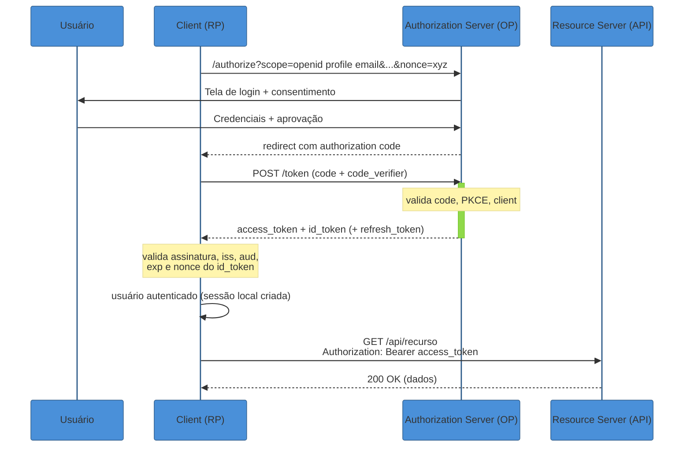
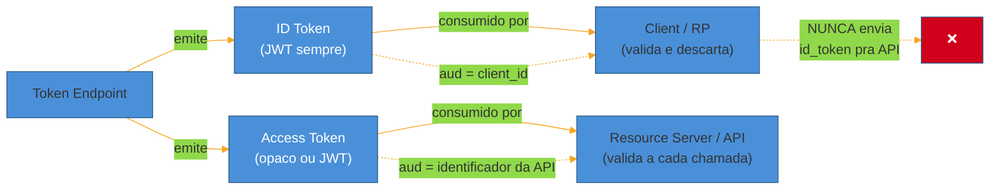
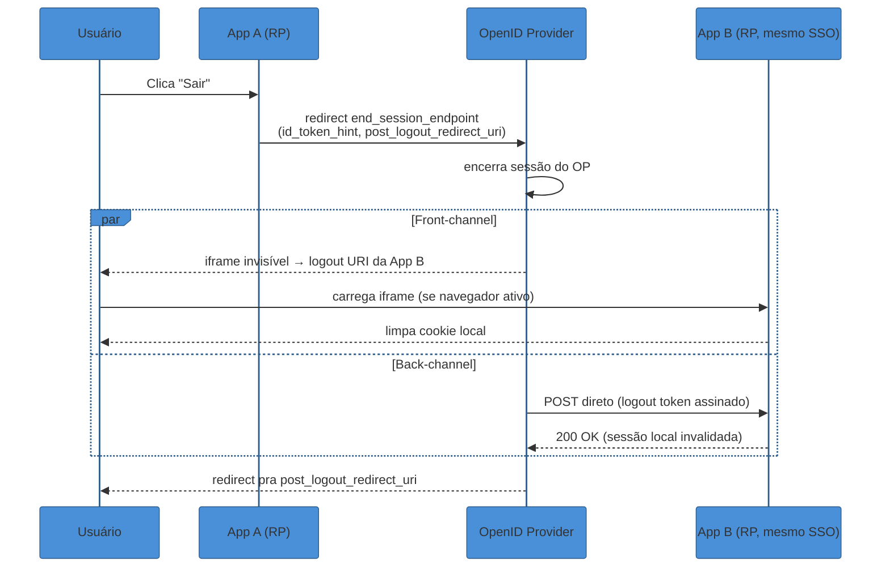

# OpenID Connect — identidade sobre OAuth

> [!abstract] TL;DR
> **OAuth 2.1 delega acesso; não prova identidade.** O fluxo Authorization Code + PKCE que você acabou de estudar termina com um **access token** — um passe de acesso opaco ou JWT, endereçado ao *resource server* (a API), sem garantia formal de quem é o dono nem de quando se autenticou. **OpenID Connect (OIDC)** é a camada fina que a OpenID Foundation encaixou em cima do OAuth 2.0 para fechar exatamente essa lacuna: adiciona o **ID token** (um JWT com claims de autenticação — `iss`, `sub`, `aud`, `exp`, `iat`, `nonce`, `auth_time`, `acr`, `amr`), o **scope `openid`** que ativa o modo de identidade, o **endpoint `/userinfo`** para claims adicionais, e **discovery** (`/.well-known/openid-configuration`) para configurar um cliente inteiro a partir de uma única URL. A confusão mais cara do assunto — e a raiz de vulnerabilidades reais de alto perfil — é tratar o ID token como se fosse um access token: mandá-lo para uma API. Ele não foi desenhado para isso, e aceitar essa troca abre a porta para falsificação de identidade entre aplicações. "Sign in with Google" é OIDC de verdade, certificado pela OpenID Foundation; "Sign in with GitHub" **não é** — é OAuth puro, sem ID token, sem discovery, e qualquer app que trata o `access_token` do GitHub como prova de identidade está reimplementando (mal) o que o OIDC já resolveu.

> [!question]- Perguntas que esta nota responde
> - O que exatamente o OIDC adiciona ao OAuth, e por que "OAuth com scope extra" não é uma descrição precisa?
> - Qual é a diferença estrutural entre ID token e access token, e o que dá errado quando alguém confunde os dois?
> - Como funciona a descoberta automática de configuração (`/.well-known/openid-configuration`), e por que ela existe?
> - Por que fazer logout numa federação de identidade é um problema genuinamente difícil, e quais mecanismos o OIDC oferece para isso?
> - "Sign in with X" — quando isso é OIDC de verdade e quando é OAuth maquiado de autenticação?

## O JWT que abriu contas de qualquer pessoa

Em abril de 2020, o pesquisador de segurança Bhavuk Jain encontrou uma falha no servidor de autenticação do **Sign in with Apple** que, à primeira vista, não tinha nada a ver com senha, criptografia quebrada ou vazamento de banco de dados. Ele descobriu que conseguia solicitar ao servidor da Apple um JWT válido para *qualquer* endereço de email — sem provar que era dono daquele email. O token gerado passava na verificação de assinatura com a chave pública da Apple normalmente, porque a assinatura *estava* correta; o problema era que o passo anterior — confirmar que quem pedia o token realmente controlava aquele email — simplesmente não existia no fluxo de emissão[^apple].

O JWT em questão era o **ID token** do Sign in with Apple — o artefato que dezenas de aplicações terceiras (Dropbox, Spotify, Airbnb e Giphy entre elas, segundo a cobertura do incidente) usavam como prova de identidade para logar o usuário. Com um ID token forjado e criptograficamente válido para o email de uma vítima, um atacante podia se autenticar em qualquer serviço terceiro que confiasse nesse token — **account takeover completo, sem tocar em uma única senha**. A Apple pagou US$ 100.000 pelo bounty, corrigiu o servidor de emissão, e concluiu (pela análise de logs) que a falha não havia sido explorada em produção antes do reporte responsável[^apple].

O incidente não foi um bug de OAuth. Foi um bug na peça que o OAuth *não tem* — porque o OAuth puro nunca teve a ambição de provar identidade. É exatamente essa peça, o ID token e tudo que o cerca, que esta nota dissecta. E a lição estrutural do caso Apple atravessa a nota inteira: **um ID token só vale o que a cadeia de emissão por trás dele garante** — e tratar esse token com o mesmo descuido que se trataria um access token comum é o erro que abre a porta para esse tipo de falha se repetir em qualquer implementação mal feita.

## Por que OAuth sozinho não resolve "quem é você"

A nota anterior fechou com uma frase que vale repetir aqui porque é o gancho de tudo que segue: **OAuth resolve delegação de acesso, não autenticação**. O fluxo Authorization Code + PKCE termina, tecnicamente, com o client de posse de um `access_token` — um passe que o resource server aceita para autorizar chamadas de API. Nada no protocolo OAuth 2.0 original especifica *o que* esse token contém, *quem* é o usuário por trás dele, ou *quando* essa pessoa provou sua identidade ao authorization server. O RFC do OAuth 2.0 é deliberadamente agnóstico quanto ao formato do access token — ele pode ser opaco (uma string aleatória que só o AS entende) ou um JWT, e mesmo quando é um JWT, não existe um esquema de claims padronizado para "isto identifica um usuário".

Isso não é um descuido do design original — é escopo. OAuth foi desenhado para responder "este client pode fazer X na API em nome deste usuário?", não "quem é esse usuário e quando ele provou isso?". Sistemas que tentaram usar o access token *como se* fosse prova de identidade — por exemplo, decodificando um JWT de access token e confiando em qualquer campo que parecesse um nome ou email — construíram, informalmente, uma camada de autenticação ad hoc, sem garantias formais, sem padronização entre provedores, e sem os mecanismos de proteção contra replay que uma autenticação de verdade exige. É esse gap que motivou a criação do OpenID Connect.

> [!question]- OIDC é "OAuth com um scope a mais", ou é mais que isso?
> É mais. Pedir o scope `openid` é o gatilho que ativa o modo OIDC — mas o que acontece depois não é cosmético. A especificação **OpenID Connect Core 1.0**, publicada pela OpenID Foundation, define um artefato novo (o ID token), um endpoint novo (`/userinfo`), um conjunto padronizado de claims de identidade, um mecanismo de descoberta (`/.well-known/openid-configuration`) e um registro dinâmico de clients. Chamar isso de "só um scope" é como chamar HTTPS de "HTTP com um S a mais" — tecnicamente a mudança de superfície é pequena, mas o que ela habilita por baixo é uma camada de garantias inteiramente nova.

O OIDC formaliza isso adicionando um segundo token à resposta do fluxo: o **ID token**. Ele nasce no mesmo `token_endpoint` do OAuth, na mesma troca de `code` por tokens que você já conhece da nota 02 — o OIDC não inventa um fluxo novo, ele enriquece a resposta do fluxo existente.



Repare no que muda em relação ao fluxo puro de OAuth: o `token_endpoint` devolve **dois** tokens com propósitos diferentes, e o client faz algo com o `id_token` que nunca faria com um access token — ele **valida a assinatura e os claims localmente e trata o resultado como prova de autenticação**, sem nunca reenviar esse token para ninguém. O `access_token`, ao contrário, viaja para o resource server na chamada seguinte. Essa bifurcação de destino — um token fica com o client, o outro viaja para a API — é o coração de tudo que vem a seguir nesta nota.

## ID token vs access token: a distinção que separa "quem" de "o quê pode"

Esta é a confusão mais cara do OIDC, e a que abriu a vulnerabilidade do Sign in with Apple no exemplo de abertura — embora ali a falha estivesse na emissão, não no consumo. É mais comum, na prática de times de aplicação, errar do lado do consumo: mandar o ID token para uma API como se autorizasse a chamada.

**ID token** é uma asserção de autenticação. Ele responde "quem é esse usuário, e quando ele provou isso ao OP (OpenID Provider)?" — e o único consumidor legítimo dele é o **client** (o Relying Party, RP, na terminologia OIDC) que o solicitou. O client valida a assinatura, confere os claims, extrai a identidade do usuário e então **descarta o uso do token para qualquer outra finalidade** — ele nunca deveria sair do client de volta para a rede.

**Access token** é uma concessão de autorização. Ele responde "o portador deste token pode fazer X na API Y?" — e o consumidor legítimo dele é o **resource server**, que não precisa (e frequentemente não consegue) saber quem é o usuário por trás; ele só precisa confiar que o token é válido e carrega os scopes certos.



A distinção tem raiz técnica, não é só convenção de nomes. O claim `aud` (audience) do ID token, segundo a **OpenID Connect Core 1.0**, "deve conter o `client_id` da Relying Party" que solicitou o token[^oidccore] — ou seja, o próprio token diz, criptograficamente, "eu fui emitido *para este client específico*, não para uma API qualquer". Uma API que aceitasse um ID token estaria, na prática, ignorando esse `aud` (porque o `aud` nunca vai bater com o identificador da API) ou aceitando tokens cujo público-alvo declarado nunca foi ela. O Auth0 resume três problemas concretos dessa confusão: descasamento de audiência (o `aud` do ID token é o `client_id`, não o identificador da API); ausência de sender-constraining (nada amarra o ID token ao canal client-API, então um ID token roubado funciona para qualquer atacante que o capture); e o fato de o ID token ser assinado com uma chave conhecida do próprio client, o que significa que a API não tem como saber se o client modificou o token antes de reenviá-lo[^auth0idvsat].

| Dimensão | ID token | Access token |
|---|---|---|
| Responde | "Quem é o usuário, e quando se autenticou?" | "O portador pode fazer X?" |
| Consumidor | Client (RP) | Resource server |
| Formato | Sempre JWT | Opaco ou JWT (implementação decide) |
| `aud` | `client_id` do RP | Identificador da API/resource server |
| Sai de volta pra rede? | Não — fica com o client | Sim — vai no header `Authorization` de cada chamada |
| Contém claims de negócio (roles, permissões)? | Não é o propósito | Sim, tipicamente |

Em uma frase: **ID token prova quem você é para quem pediu o login; access token autoriza o que você pode fazer na API — nunca são intercambiáveis, e o `aud` do token é a prova formal disso.**

## Dissecando um ID token de verdade

Um ID token é um JWT — a nota [[03 - JWT e a família de tokens]] cobre a anatomia genérica (header/payload/signature, JWS, JWKS). Aqui o interesse é nos **claims específicos de autenticação** que o OIDC define por cima do JWT genérico. Um ID token típico do Google, decodificado, tem um payload parecido com este[^googleoidc]:

```json
{
  "iss": "https://accounts.google.com",
  "sub": "110169484474386276334",
  "aud": "424911365001.apps.googleusercontent.com",
  "exp": 1753286461,
  "iat": 1753282861,
  "auth_time": 1753282855,
  "nonce": "n-0S6_WzA2Mj",
  "acr": "urn:mace:incommon:iap:silver",
  "amr": ["pwd", "mfa"],
  "email": "usuario@exemplo.com",
  "email_verified": true,
  "name": "Usuário Exemplo"
}
```

Os claims obrigatórios ou centrais, conforme a **OpenID Connect Core 1.0**[^oidccore]:

- **`iss`** (issuer) — identificador do OpenID Provider que emitiu o token. Para o Google, é sempre `https://accounts.google.com`; o client deve conferir que esse valor bate exatamente com o issuer esperado.
- **`sub`** (subject) — identificador único e **nunca reatribuído** do usuário, dentro do namespace daquele issuer. É o campo que você deveria usar como chave primária de identidade — nunca o email, porque email pode mudar de dono ao longo do tempo (o próprio guia do Google para desenvolvedores é explícito sobre isso: "não use o campo `email` como identificador único de usuário; sempre use o `sub`"[^googleoidc]).
- **`aud`** (audience) — "deve conter o `client_id` OAuth 2.0 da Relying Party"[^oidccore]. É o campo que impede o ataque de confused deputy entre clients diferentes do mesmo provider.
- **`exp`** / **`iat`** — expiração e momento de emissão do próprio JWT. Padrão de qualquer JWT, nada específico de OIDC aqui.
- **`auth_time`** — momento em que o usuário efetivamente se autenticou junto ao OP (não confundir com `iat`, que é quando o *token* foi emitido — podem divergir se o OP reusa uma sessão existente sem pedir login de novo). Obrigatório quando o client pediu `max_age` na requisição de autorização.
- **`nonce`** — valor opaco que o client gerou e enviou na requisição de autorização inicial, especificamente "para associar uma sessão do client a um ID token, e mitigar ataques de replay"[^oidccore]. A especificação é direta: "se presente no ID token, o client DEVE verificar que o valor do claim `nonce` é igual ao valor do parâmetro `nonce` enviado na requisição de autenticação"[^oidccore]. Ignorar essa checagem é uma das armadilhas mais citadas da seção seguinte.
- **`acr`** (Authentication Context Class Reference) — identifica *como forte* foi a autenticação (por exemplo, um valor específico pode significar "autenticação com MFA de hardware").
- **`amr`** (Authentication Methods References) — array declarando *quais métodos* foram usados (`"pwd"`, `"mfa"`, `"otp"`, `"fido"` etc.). Diferente do `acr`, que é um nível abstrato, o `amr` é a lista concreta de mecanismos.
- **`azp`** (authorized party) — aparece quando o `aud` contém múltiplos valores; identifica qual delas é o client que efetivamente fez a requisição.

Repare que **nenhum desses claims fala sobre permissões, roles ou o que o usuário pode fazer**. Isso é deliberado — o ID token é puramente sobre identidade e o evento de autenticação. Se sua aplicação precisa embutir roles/permissões num token para consumo de API, esse é um claim customizado do **access token** (tema que a nota [[05 - Tokens em produção]] aprofunda), não do ID token.

## Scopes e claims: o que cada palavra libera

O scope `openid` é obrigatório e é o interruptor que liga o modo OIDC — a especificação é taxativa: "requisições OpenID Connect DEVEM conter o valor de scope `openid`. Se o valor de scope `openid` não estiver presente, o comportamento é inteiramente não especificado"[^oidccore]. Sem `openid`, você está de volta ao OAuth puro, sem ID token, sem garantias de identidade.

Além do `openid`, o OIDC padroniza quatro scopes adicionais, cada um liberando um conjunto fixo de claims. A tabela abaixo é a "Requesting Claims using Scope Values" da especificação, consolidada por documentação de provedores (Auth0, Microsoft Entra) que a reproduzem fielmente[^scopesclaims]:

| Scope | Claims liberados |
|---|---|
| `profile` | `name`, `family_name`, `given_name`, `middle_name`, `nickname`, `preferred_username`, `profile`, `picture`, `website`, `gender`, `birthdate`, `zoneinfo`, `locale`, `updated_at` |
| `email` | `email`, `email_verified` |
| `address` | `address` (objeto estruturado: rua, cidade, país, CEP) |
| `phone` | `phone_number`, `phone_number_verified` |

Onde esses claims aparecem — no próprio ID token ou só via `/userinfo` — depende de detalhes do fluxo, tema da próxima seção. Um ponto prático: peça só os scopes que sua aplicação de fato consome. Pedir `profile address phone` para um app que só precisa saber o nome do usuário infla o token, expõe dado desnecessário no front-channel e é o tipo de over-asking que revisões de segurança (e usuários atentos na tela de consentimento) sinalizam como red flag.

## `/userinfo`: quando os claims não cabem — ou não devem caber — no token

O OIDC define um endpoint protegido, o **UserInfo Endpoint**, que devolve claims sobre o usuário quando chamado com um access token válido: "um Recurso Protegido que, quando apresentado com um Access Token pelo Client, retorna informações autorizadas sobre o End-User"[^oidccore]. A pergunta natural é: se o ID token já pode carregar `name`, `email` etc., por que existe um segundo lugar para pedir a mesma coisa?

A resposta tem duas metades, e cada provedor pesa o trade-off de um jeito. A documentação da Microsoft recomenda o caminho direto — usar os claims que já vêm no ID token, porque ele "é uma superset da informação disponível no UserInfo endpoint", e evita até duas idas à rede a mais, reduzindo latência[^msuserinfo]. Já a vantagem do `/userinfo`, segundo a mesma fonte, é manter o payload inicial do `id_token` enxuto e evitar passar informação sensível pelo front-channel (o navegador do usuário, no redirect de volta do fluxo) — o `/userinfo` é uma chamada back-channel, servidor a servidor, então dados mais sensíveis (endereço, telefone) tendem a viajar melhor por ali do que embutidos num JWT que passa pelo navegador[^msuserinfo]. Além disso, quando nenhum access token é emitido (por exemplo, em fluxos que retornam só `id_token`), o `/userinfo` simplesmente não é uma opção — os claims *têm* que estar no próprio ID token[^msuserinfo].

Na prática, a heurística que resolve a maioria dos casos: **claims essenciais e estáveis para a sessão (sub, email, nome) vivem confortavelmente no ID token; claims voláteis, grandes ou sensíveis (foto de perfil em alta resolução, endereço completo, telefone) ficam atrás do `/userinfo`**, buscados sob demanda quando a tela que realmente precisa deles é renderizada — não em toda troca de token.

## Discovery: configurar um client inteiro com uma URL

Um dos ganhos de produtividade mais citados do OIDC é que, na prática, integrar com um provedor novo não exige preencher um formulário de dez endpoints manualmente. A especificação **OpenID Connect Discovery 1.0** define que "OpenID Providers que suportam Discovery DEVEM disponibilizar um documento JSON no caminho formado pela concatenação da string `/.well-known/openid-configuration` ao Issuer"[^oidcdiscovery]. Para o Google, isso é literalmente `https://accounts.google.com/.well-known/openid-configuration`[^googleoidc] — uma URL, sem autenticação, que devolve tudo que um client precisa saber.

O documento de discovery do Google (acessível publicamente) traz, entre outros, estes campos[^googleoidc][^oidcdiscovery]:

```json
{
  "issuer": "https://accounts.google.com",
  "authorization_endpoint": "https://accounts.google.com/o/oauth2/v2/auth",
  "token_endpoint": "https://oauth2.googleapis.com/token",
  "userinfo_endpoint": "https://openidconnect.googleapis.com/v1/userinfo",
  "jwks_uri": "https://www.googleapis.com/oauth2/v3/certs",
  "scopes_supported": ["openid", "email", "profile"],
  "response_types_supported": ["code", "token", "id_token", "..."],
  "claims_supported": ["aud", "email", "email_verified", "exp", "iat", "iss", "name", "sub", "..."]
}
```

Cada campo elimina uma decisão manual: `authorization_endpoint` e `token_endpoint` são os dois destinos do fluxo Authorization Code + PKCE; `jwks_uri` aponta para as chaves públicas usadas para validar a assinatura do ID token (a mesma rotação de chave que a nota de JWT explica em detalhe); `scopes_supported` e `claims_supported` dizem exatamente o que você pode pedir sem precisar ler a documentação do provedor. O ganho estrutural, segundo a própria especificação, é que isso "elimina hardcoding de endpoints específicos, tornando implementações mais flexíveis e permitindo que provedores modifiquem sua infraestrutura sem quebrar integrações de clients"[^oidcdiscovery] — se o Google um dia trocar a URL do `token_endpoint`, todo client que faz discovery em runtime continua funcionando sem alteração de código.

> [!info] Registro dinâmico de client (menção)
> A especificação companheira **OpenID Connect Dynamic Client Registration 1.0** define como um Relying Party pode se registrar *programaticamente* junto a um OP — obtendo um `client_id` sem passar por um console administrativo manual. O objetivo prático, segundo análises da especificação, é "eliminar operações manuais em telas de gestão e permitir registro de clients 'as code'"[^dynreg]. É relevante sobretudo em cenários de automação em larga escala (provisionar centenas de clients programaticamente); a maioria das integrações do dia a dia ainda registra o client manualmente no console do provedor, e esta trilha não aprofunda o fluxo — é peça de referência, não algo que você vai implementar com frequência.

## Logout em federação: por que "deslogar" é surpreendentemente difícil

Fazer logout numa aplicação tradicional, com sessão própria, é simples: apaga o cookie de sessão, invalida a entrada no store server-side, pronto. Numa federação de identidade — onde o usuário logou *através* de um OpenID Provider — o problema se multiplica, porque existem **duas sessões separadas** para encerrar: a sessão local do client (RP) e a sessão no OP. Deslogar só uma das duas deixa a outra viva, e o usuário descobre isso do pior jeito possível: clica em "sair", vê a tela de login de novo, mas ao tentar entrar de novo é autenticado automaticamente sem digitar nada — porque a sessão no OP nunca foi encerrada.

A OpenID Foundation resolveu isso com um conjunto de especificações companheiras, cada uma cobrindo um pedaço do problema:

**RP-Initiated Logout 1.0** define o mecanismo pelo qual o client pede ao OP para encerrar a sessão do usuário ali. O client redireciona o navegador para o `end_session_endpoint` (publicado no documento de discovery), tipicamente passando um `id_token_hint` (o ID token da sessão que está sendo encerrada, para o OP confirmar de qual sessão se trata) e um `post_logout_redirect_uri` (para onde mandar o usuário depois). A especificação exige que, quando presente, o OP valide que aquele `id_token_hint` foi de fato emitido por ele mesmo, e que — se `client_id` também estiver presente — o Client Identifier bata com o client para o qual o ID token foi emitido[^rpinitiated].

Mas isso resolve só a sessão no OP. Se o usuário tinha sessões abertas em *outras* aplicações federadas com o mesmo OP (o cenário clássico de SSO — logou uma vez, acessa cinco apps), o RP-Initiated Logout sozinho não avisa essas outras aplicações. Para isso existem dois mecanismos complementares:

- **Front-Channel Logout 1.0** — o OP, ao processar o logout, instrui o navegador a carregar (em iframes invisíveis, tipicamente) uma URL de logout de cada RP ativo, para que cada um limpe sua própria sessão local. Funciona bem quando a UX permite, mas depende do navegador do usuário estar aberto e daquela aba estar viva — se o usuário já fechou o navegador, o front-channel simplesmente não dispara.
- **Back-Channel Logout 1.0** — o OP faz uma chamada servidor-a-servidor diretamente para cada RP, sem depender do navegador do usuário. Uma vantagem citada pela documentação da especificação é justamente essa independência: "back-channel logout não tem dependência do user agent, e como resultado, usuários serão deslogados do client mesmo que o user agent tenha sido fechado"[^backchannel]. A contrapartida é operacional — o endpoint de back-channel logout do RP precisa ser alcançável pelo OP, o que significa que o RP não pode estar atrás de firewall/NAT inacessível a partir de OPs públicos, e a lógica de "o que significa encerrar minha sessão" fica a cargo de cada RP implementar corretamente (limpar cookie é trivial; invalidar tudo que dependia daquela sessão, nem sempre)[^backchannel].



Uma terceira peça, **OpenID Connect Session Management 1.0**, ataca o problema de outro ângulo: em vez de o OP empurrar notificações de logout, o RP faz *polling* periódico (via um iframe oculto que consulta o estado da sessão) para detectar quando a sessão no OP mudou — pode ser usada isoladamente ou em conjunto com front/back-channel logout[^backchannel]. Na prática de 2026, a maioria dos IdPs (Keycloak, Okta, Auth0) implementa RP-Initiated Logout como base e oferece back-channel logout como opção mais robusta para quem tem múltiplos RPs backend-to-backend confiáveis.

Em uma frase: **logout em federação exige encerrar duas sessões (RP e OP) e, se houver mais de um RP no mesmo SSO, avisar cada um deles por um canal que sobreviva mesmo se o navegador do usuário não estiver mais ali.**

## "Sign in with X" na prática: nem todo botão é OIDC

A promessa comercial de "faça login com sua conta Google/Apple/GitHub" esconde uma diferença técnica que a maioria dos usuários — e boa parte dos desenvolvedores que só seguiram um tutorial — nunca percebe: **nem todo "Sign in with X" é OpenID Connect**.

**Google** implementa OIDC "by the book" — publica discovery em `/.well-known/openid-configuration`, emite ID tokens com todos os claims padrão, suporta `/userinfo`, e seu servidor de autenticação está entre as implementações que passaram pela certificação formal da OpenID Foundation. Integrar com Google via OIDC é seguir a especificação ao pé da letra.

**Apple** também implementa OIDC — Sign in with Apple emite ID tokens JWT reais, com `sub`, `email`, `email_verified` etc. (foi justamente um ID token da Apple que teve a falha de emissão do exemplo de abertura). A diferença de UX mais notada — a opção de "ocultar meu email" gerando um relay address — é uma camada de privacidade da Apple por cima do OIDC padrão, não uma quebra do protocolo.

**GitHub**, por outro lado, **não implementa OpenID Connect** no seu fluxo de OAuth para login social de usuários finais. Análises da comunidade e comparações entre implementações apontam duas lacunas concretas: o GitHub "não implementou um endpoint de well-known configuration", exigindo que os endpoints (authorization, token, userinfo) sejam configurados manualmente, e o resultado da autorização não inclui um `id_token` — só um `access_token` OAuth puro[^githubnotoidc]. Qualquer aplicação que usa "Sign in with GitHub" está, tecnicamente, fazendo **OAuth para autenticação** — o antipadrão que a nota anterior já sinalizou como "OAuth não é autenticação" — e depende de uma chamada adicional à API REST do GitHub (`GET /user`, autenticada com o access token) para descobrir quem é o usuário, sem nenhum dos mecanismos formais de proteção contra replay (`nonce`), de audiência (`aud`) ou de contexto de autenticação (`acr`/`amr`) que o OIDC formaliza. Isso não significa que "Sign in with GitHub" seja inseguro por definição — significa que a segurança da autenticação depende inteiramente da implementação cuidadosa de cada aplicação cliente, em vez de estar garantida pelo protocolo.

Na prática, isso importa na hora de escolher provedores para um produto novo: se a lista de "login social" inclui GitHub, trate essa integração como **OAuth com uma chamada de API para simular perfil de usuário**, não como um provedor OIDC igual aos outros — os invariantes que você aprendeu nesta nota (ID token, nonce, discovery) simplesmente não se aplicam a ele.

> [!info] Caducidade
> A ausência de discovery/ID token no GitHub reflete o estado do produto em 2026; provedores mudam de postura ao longo do tempo. Antes de assumir esse comportamento num projeto novo, confirme no documento de discovery (se existir) ou na documentação oficial do provedor.

## OIDC vs SAML: dois protocolos, dois mundos que ainda coexistem

Esta nota fechou o núcleo de OIDC — mas vale adiantar, sem aprofundar (isso é assunto da nota [[06 - SSO corporativo — SAML, federação e SCIM]]), por que SAML segue vivo em 2026 em vez de ter sido totalmente substituído por OIDC.

A resposta curta, segundo análises recentes do mercado de identidade: **para produtos novos, OIDC é o padrão default** — construído sobre OAuth 2.0, usa JSON/JWT (muito mais leve que o XML volumoso do SAML), tem rotação de chave nativa via `jwks_uri` em vez de gestão manual de certificado X.509, e encaixa naturalmente em mobile, SPA e APIs. Mas **SAML continua obrigatório para boa parte da base instalada enterprise e governamental**, porque é o que muitos IdPs corporativos legados (Active Directory Federation Services, Okta configurado há uma década, sistemas de governo) já falam nativamente — e trocar um IdP corporativo inteiro não é uma decisão que uma aplicação terceira consegue forçar[^oidcvssaml]. A recomendação pragmática que se repete entre fornecedores de identidade: comece com OIDC como padrão para tudo que você constrói do zero, e adicione suporte a SAML **quando o primeiro cliente enterprise exigir**, não antes — SAML tende a ser trabalho sob demanda, não investimento antecipado[^oidcvssaml].

Vale reter só o eixo de decisão: **OIDC para apps novas, API-first, mobile, cloud-native; SAML quando o outro lado da integração é um IdP corporativo legado que só fala SAML.** Os detalhes de assertions, SP-initiated vs IdP-initiated, e SCIM para provisionamento ficam para a nota 06, que fecha este sub-galho.

## Armadilhas comuns

> [!warning] Mandar o ID token para uma API
> **O que acontece:** o frontend recebe `access_token` e `id_token` do fluxo, e por engano (ou porque "os dois são JWT, parecem a mesma coisa") usa o `id_token` no header `Authorization` de chamadas para o backend. **Por quê:** o `aud` do ID token é o `client_id` do RP, não o identificador da API — a API que aceitasse esse token estaria ignorando a própria garantia de audiência que o OIDC formalizou. Além disso, não existe sender-constraining amarrando o ID token ao canal client-API, então um ID token vazado (por exemplo, em log ou em uma extensão de navegador maliciosa) vira uma chave de acesso genérica[^auth0idvsat]. **Como evitar:** trate ID token e access token como pertencentes a "mundos" separados desde o design da aplicação — o ID token nunca sai do client depois de validado; só o access token viaja em requisições subsequentes. Se sua API precisa de claims de identidade, extraia-os do access token (se for JWT com claims de negócio) ou aceite o `sub` propagado por um mecanismo explícito, nunca pelo ID token bruto.

> [!warning] Não validar o `nonce`
> **O que acontece:** o client recebe o `id_token`, valida assinatura e `exp`, mas pula a checagem de que o claim `nonce` do token bate com o valor que o próprio client gerou e enviou na requisição de autorização. **Por quê:** o `nonce` existe especificamente para mitigar ataques de replay — um ID token válido interceptado (por exemplo, num redirect mal protegido) poderia ser reapresentado por um atacante numa sessão diferente. A especificação é explícita: se o `nonce` está presente no token, o client **deve** verificar que ele bate com o valor enviado[^oidccore]. Pular essa validação silenciosamente reabre a janela que o `nonce` foi desenhado para fechar. **Como evitar:** sempre gere um `nonce` criptograficamente aleatório por requisição de autorização, armazene-o vinculado à sessão local (nunca em um cookie legível por JS sem proteção), e rejeite qualquer ID token cujo `nonce` não bata exatamente — sem exceção "só desta vez".

> [!warning] Confiar em email não verificado do IdP
> **O que acontece:** a aplicação usa o claim `email` do ID token como identificador de conta (por exemplo, para fazer merge automático com uma conta existente cadastrada por email/senha) sem checar `email_verified`. **Por quê:** alguns provedores permitem que um usuário tenha um email cadastrado sem confirmação (ou o próprio provedor social não garante posse do email — cada OP tem sua própria política). Se sua aplicação faz account linking automático baseado só em `email` igual, um atacante que consiga associar um email não verificado à sua conta num provedor social pode sequestrar a conta correspondente na sua aplicação, sem nunca ter tido acesso real àquele email. **Como evitar:** só confie em `email` para account linking automático quando `email_verified: true` estiver presente e for `true`. Quando não estiver, trate como um sinal fraco — peça confirmação explícita antes de vincular contas.

## Em entrevista

Perguntas de nível sênior sobre este tema quase nunca são "o que é OIDC" isolado — aparecem embutidas em design de sistema ("como você projetaria login social pra um app que também expõe uma API própria?") ou em debugging comportamental ("já viu um bug de token sendo usado onde não devia?"). O sinal que o entrevistador busca é a mesma distinção que esta nota trabalhou: você separa, por reflexo, "isto prova quem o usuário é" de "isto autoriza uma chamada de API" — e sabe justificar por que os dois nunca deveriam ser o mesmo token.

Uma resposta fraca fica no vocabulário ("uso OIDC para login"). Uma resposta forte amarra o mecanismo à decisão de arquitetura: "eu valido o ID token no client/BFF, extraio o `sub` como chave de identidade, crio a sessão local a partir dali — e o access token, que nunca chega a ser interpretado pelo frontend, viaja isolado para as chamadas de API subsequentes. Se preciso de claims de negócio (roles, tenant) para autorização, eles vivem no access token, com um `aud` apontando pra minha API, não no ID token."

Um exemplo de como isso aparece embutido numa pergunta aberta:

> **Entrevistador:** "Você está desenhando o login de um app que usa 'Sign in with Google' e também 'Sign in with GitHub'. Que diferenças de implementação você esperaria entre os dois?"
>
> **Resposta fraca:** "Nenhuma — os dois são login social, uso a mesma lib OAuth para ambos."
>
> **Resposta forte:** "O Google é OIDC completo — vou ter discovery, ID token com claims padronizados, `/userinfo`, e posso validar tudo localmente com o `jwks_uri`. O GitHub não implementa OIDC — não tem well-known configuration nem ID token; depois do OAuth eu preciso fazer uma chamada adicional na API REST do GitHub para descobrir quem é o usuário, e não tenho os mecanismos de proteção contra replay que o `nonce` do OIDC me dá. Isso muda como eu desenho a camada de autenticação: pro Google eu confio no ID token validado; pro GitHub eu preciso tratar o resultado como identidade *inferida* a partir de uma chamada de API, com mais cuidado manual."

A resposta forte não está citando trivia — está demonstrando que a distinção entre "provedor OIDC certificado" e "OAuth disfarçado de login" muda decisões concretas de código, não é só um detalhe de nomenclatura.

## How to explain it in English

> "OAuth tells you what a client is allowed to do; OpenID Connect tells you who the user is. The ID token is the artifact that closes that gap — it's a JWT meant strictly for the client that requested it, never for an API. The single most expensive mistake I see is sending the ID token to a resource server instead of the access token — the two tokens have different audiences by design, and conflating them breaks the security model OIDC was built to provide."

| PT | EN |
|----|----|
| Camada de identidade | Identity layer |
| Token de identidade | ID token |
| Token de acesso | Access token |
| Provedor de identidade / OP | Identity provider (IdP) / OpenID Provider (OP) |
| Parte confiante / cliente | Relying Party (RP) |
| Endpoint de descoberta | Discovery endpoint |
| Documento de configuração | Well-known configuration document |
| Endpoint de perfil do usuário | UserInfo endpoint |
| Encerramento de sessão iniciado pelo RP | RP-Initiated Logout |
| Logout por canal frontal / de fundo | Front-channel / back-channel logout |
| Nível de contexto de autenticação | Authentication Context Class Reference (acr) |
| Métodos de autenticação usados | Authentication Methods References (amr) |

## O que vem a seguir

Ficamos na camada de identidade sobre o fluxo canônico: ID token, discovery, logout federado, e o mapa de quem realmente implementa OIDC "by the book". O que falta é o outro lado do OAuth 2.1 — os fluxos que não têm um usuário sentado na frente de um navegador: serviço conversando com serviço, dispositivos sem teclado, e a delegação de identidade entre serviços internos.

- [[04 - Grants de máquina e fluxos especiais]] — client credentials para M2M, device authorization flow para TVs/CLIs, e token exchange para delegação entre microserviços
- [[05 - Tokens em produção]] — o que fazer com access e refresh tokens depois que a autenticação inicial termina: rotação, revogação, e onde guardar token no browser
- [[06 - SSO corporativo — SAML, federação e SCIM]] — o aprofundamento de OIDC vs SAML que esta nota só adiantou, e o provisionamento de usuários via SCIM

## Fontes

- **OpenID Foundation** — [*OpenID Connect Core 1.0 incorporating errata set 2*](https://openid.net/specs/openid-connect-core-1_0.html) — definição formal do ID token, claims padrão (iss/sub/aud/exp/iat/auth_time/nonce/acr/amr/azp), scope `openid` obrigatório, tabela de scopes-para-claims, UserInfo Endpoint; acessado em 2026-07-10.
- **OpenID Foundation** — [*OpenID Connect Discovery 1.0*](https://openid.net/specs/openid-connect-discovery-1_0.html) — o documento `/.well-known/openid-configuration`, campos obrigatórios e opcionais; acessado em 2026-07-10.
- **OpenID Foundation** — [*OpenID Connect RP-Initiated Logout 1.0*](https://openid.net/specs/openid-connect-rpinitiated-1_0.html) — `end_session_endpoint`, `id_token_hint`, `post_logout_redirect_uri`; acessado em 2026-07-10.
- **OpenID Foundation** — [*OpenID Connect Back-Channel Logout 1.0*](https://openid.net/specs/openid-connect-backchannel-1_0.html) — mecanismo servidor-a-servidor de logout, trade-offs vs front-channel; acessado em 2026-07-10.
- **OpenID Foundation** — [*OpenID Connect Dynamic Client Registration 1.0*](https://openid.net/specs/openid-connect-registration-1_0.html) — registro programático de Relying Parties; acessado em 2026-07-10.
- **Google Identity** — [*OpenID Connect*](https://developers.google.com/identity/openid-connect/openid-connect) — discovery document do Google, validação de ID token, orientação `sub` vs `email`; acessado em 2026-07-10.
- **Bhavuk Jain** — [*Zeroday in Sign in with Apple*](https://bhavukjain.com/blog/2020/05/30/zeroday-signin-with-apple/) — o incidente de abertura desta nota: forja de ID token por falha na validação de posse do email; acessado em 2026-07-10.
- **BleepingComputer** — [*"Sign in with Apple" vulnerability earns researcher $100,000*](https://www.bleepingcomputer.com/news/apple/sign-in-with-apple-vulnerability-earns-researcher-100-000/) — cobertura do impacto e das aplicações afetadas; acessado em 2026-07-10.
- **Auth0** — [*ID Token and Access Token: What Is the Difference?*](https://auth0.com/blog/id-token-access-token-what-is-the-difference/) — os três problemas concretos de usar ID token para chamar API (audiência, sender-constraining, modificação); acessado em 2026-07-10.
- **Microsoft Learn** — [*Microsoft identity platform UserInfo endpoint*](https://learn.microsoft.com/en-us/entra/identity-platform/userinfo) — trade-off ID token vs `/userinfo`, latência vs front-channel; acessado em 2026-07-10.
- **cerberauth** — [*awesome-openid-connect*](https://github.com/cerberauth/awesome-openid-connect) — panorama de provedores OIDC (Google, Apple, Facebook) e o vácuo do GitHub; acessado em 2026-07-10.
- **Clerk** — [*OIDC vs SAML for Enterprise SSO: A 2026 Decision Guide*](https://clerk.com/articles/oidc-vs-saml-for-enterprise-sso-a-2026-decision-guide) — quando escolher cada protocolo, OIDC como default para apps novas, SAML sob demanda enterprise; acessado em 2026-07-10.

[^apple]: Bhavuk Jain, *Zeroday in Sign in with Apple*; BleepingComputer, *"Sign in with Apple" vulnerability earns researcher $100,000*. [^oidccore]: OpenID Foundation, *OpenID Connect Core 1.0*. [^oidcdiscovery]: OpenID Foundation, *OpenID Connect Discovery 1.0*. [^googleoidc]: Google Identity, *OpenID Connect*. [^auth0idvsat]: Auth0, *ID Token and Access Token: What Is the Difference?*. [^scopesclaims]: OpenID Foundation, *OpenID Connect Core 1.0* (seção 5.4, Requesting Claims using Scope Values), consolidada por documentação de Auth0/Microsoft Entra. [^msuserinfo]: Microsoft Learn, *Microsoft identity platform UserInfo endpoint*. [^rpinitiated]: OpenID Foundation, *OpenID Connect RP-Initiated Logout 1.0*. [^backchannel]: OpenID Foundation, *OpenID Connect Back-Channel Logout 1.0*. [^dynreg]: OpenID Foundation, *OpenID Connect Dynamic Client Registration 1.0*. [^githubnotoidc]: cerberauth, *awesome-openid-connect*; documentação comparativa de implementações OIDC vs OAuth puro do GitHub. [^oidcvssaml]: Clerk, *OIDC vs SAML for Enterprise SSO: A 2026 Decision Guide*.
