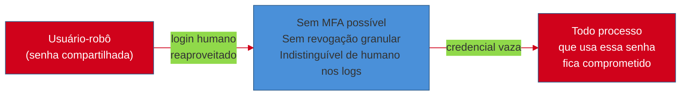
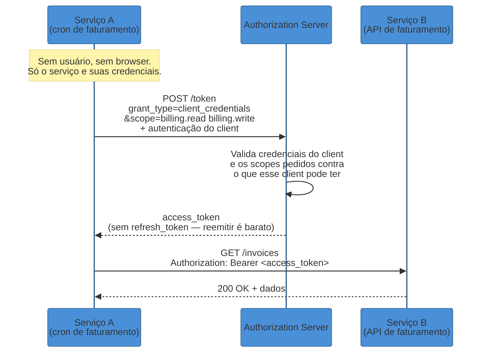
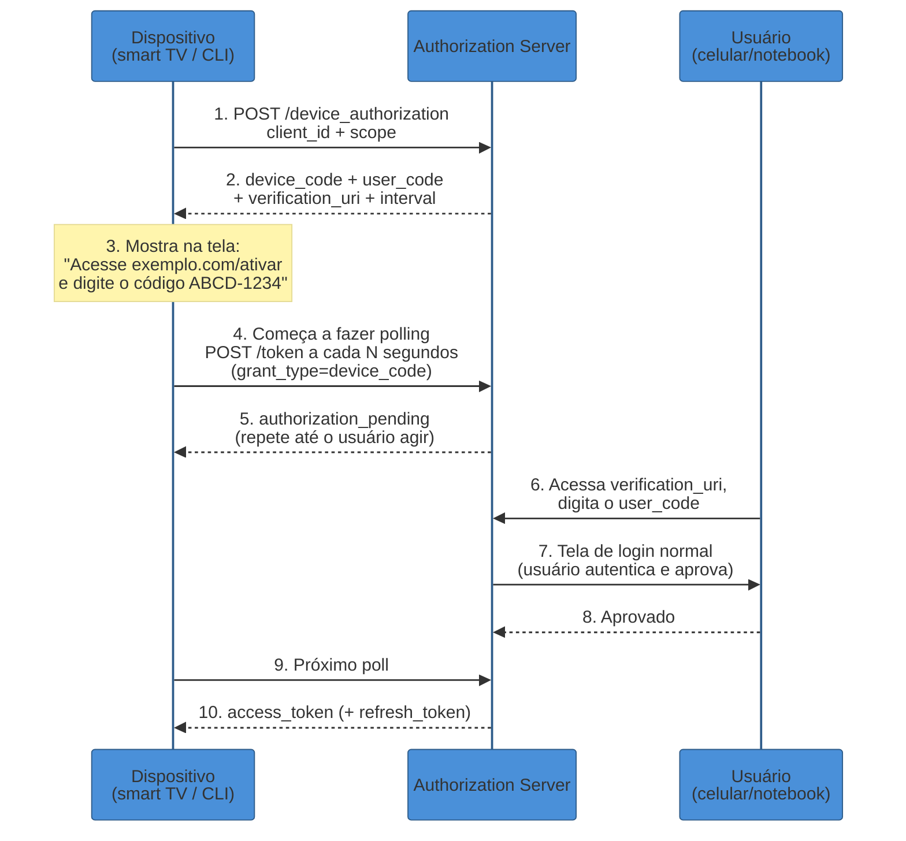
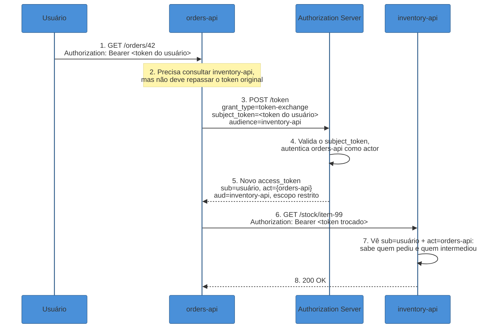
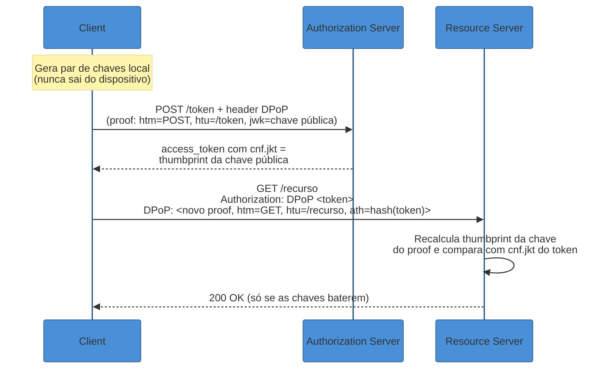

# Grants de máquina e fluxos especiais

> [!abstract] TL;DR
> Tudo que vimos até agora em [[02 - Authorization Code + PKCE — o fluxo canônico|02]] pressupõe um humano na dança: alguém que loga, aprova scopes, é redirecionado. Mas boa parte do tráfego OAuth em produção **não tem usuário nenhum no fluxo** — e usar o grant errado nesses casos não é só feio, é uma vulnerabilidade. O **client credentials grant** resolve M2M puro (cron job, serviço chamando serviço): o próprio client é o resource owner de si mesmo, autenticado por `client_secret`, `private_key_jwt` (mais forte, sem segredo compartilhado) ou mTLS (mais forte ainda, prova de posse na camada de transporte). O **device authorization grant** (RFC 8628) resolve o problema oposto — há um usuário, mas o dispositivo não tem teclado decente (smart TV, CLI): o dispositivo mostra um código curto, o usuário digita esse código em outro aparelho, e o dispositivo fica fazendo *polling* até o authorization server confirmar. Esse mesmo mecanismo virou, desde 2025, uma técnica de phishing documentada em campanhas reais atribuídas a atores estatais russos contra o Microsoft 365. O **token exchange** (RFC 8693) resolve delegação entre serviços — API A precisa chamar API B "em nome do" usuário sem pedir para ele logar de novo — via uma claim `act` que registra quem está agindo por quem, formando uma trilha de auditoria em vez de um token genérico. E por trás de tudo isso está um problema estrutural que nenhum desses grants resolve sozinho: **todo access token OAuth é, por padrão, um bearer token** — quem o possui, o usa, não importa quem o roubou. **mTLS certificate binding** (RFC 8705) e **DPoP** (RFC 9449) são as duas respostas de 2026 para amarrar o token a quem originalmente o recebeu, tornando um token roubado inútil sozinho.

> [!question]- Perguntas que esta nota responde
> - Por que usar client credentials em vez de um "usuário-robô" com senha compartilhada para integração M2M?
> - Como o device authorization grant funciona sem o dispositivo nunca receber um redirect, e por que virou vetor de phishing?
> - O que o token exchange resolve que um simples token compartilhado entre serviços não resolveria?
> - O que significa "sender-constrained" e por que bearer tokens sozinhos não bastam mais?
> - Qual grant usar em qual cenário — a tabela de decisão final?

## O ataque que a resposta ingênua permite

Imagine um cron job que precisa chamar a API de faturamento toda madrugada para gerar relatórios. Ninguém está logado, não há navegador, não há usuário disponível para clicar em "autorizar". A resposta ingênua, ainda comum em sistemas legados, é criar um **usuário-robô**: uma conta de serviço com login e senha fixos, guardada em uma variável de ambiente ou (pior) hardcoded, que autentica via o mesmo fluxo usado por humanos — ou, em cenários OAuth mal desenhados, via o extinto Resource Owner Password Credentials grant que a nota anterior já matou. Esse padrão tem três problemas que se acumulam: a senha do robô é compartilhada entre todo processo que precisa da mesma automação, então revogar o acesso de *um* processo comprometido significa trocar a senha de *todos*; o robô é indistinguível de um humano nos logs de auditoria, então um ataque via essa conta se mistura ao tráfego legítimo; e o "usuário" nunca faz MFA, porque não há ninguém para completar o segundo fator — o que torna essa conta o alvo mais barato de comprometer em todo o sistema.

O OAuth reconhece que **máquina falando com máquina é um cenário estrutural diferente de humano delegando acesso**, e oferece um grant dedicado a isso: o client credentials grant, onde o próprio client — não um usuário fictício disfarçado de client — é a identidade que se autentica e recebe o token. Não há front channel, não há redirect, não há tela de consentimento: é uma única chamada servidor-a-servidor.



Em uma frase: **quando não há usuário no fluxo, o protocolo não deveria fingir que há um — ele deveria ter um grant que trata a máquina como o que ela é: uma identidade de primeira classe.**

## Client credentials: o client é seu próprio resource owner

No client credentials grant (RFC 6749 §4.4, mantido no OAuth 2.1 como um dos poucos grants sobreviventes junto do authorization code), a troca é direta: o client se autentica no endpoint `/token` e recebe um access token de volta, sem etapa de autorização — porque não há ninguém para autorizar nada além do próprio client. O client, aqui, **é o resource owner de si mesmo**: ele não está pedindo acesso a um recurso de terceiros, está provando "eu sou o serviço de faturamento, me dê um token que outros serviços aceitem"[^oauth-net-cc].



Duas diferenças estruturais em relação ao authorization code flow saltam aos olhos. Primeiro, **não existe refresh token** — não faz sentido: se o client tem a credencial para se autenticar de novo, ele simplesmente pede um token novo quando o antigo expira, em vez de guardar um segundo segredo para renovar o primeiro[^oauth-com-cc]. Segundo, os **scopes pedidos são scopes de máquina**, não escopos que fazem sentido para um humano — `billing.read`, `orders.sync`, `internal.metrics.write` — e a validação do authorization server não pergunta "o usuário consentiu com isso?" porque não há usuário; ela pergunta "esse client específico está autorizado a ter esse scope, segundo o registro dele?". É comum, na prática, esses scopes serem atribuídos estaticamente no cadastro do client em vez de negociados dinamicamente[^oauth-com-scopes].

### As três formas de autenticar o client, da mais fraca à mais forte

Como não há usuário provando identidade, **toda a segurança do client credentials grant recai sobre a autenticação do client** — e aqui há uma escolha real de engenharia, não uma checkbox.

**`client_secret` (Basic ou POST).** O client manda um segredo compartilhado — pré-combinado no registro — via HTTP Basic Auth ou no corpo da requisição. É a opção mais simples e, por isso, a mais comum, mas carrega o problema clássico de qualquer segredo compartilhado: precisa ser armazenado por ambos os lados, vaza se alguém logar a requisição por engano (Basic Auth em texto claro sobre HTTP não-TLS é catastrófico), e não oferece nenhuma prova de posse — é dado, não é demonstrado[^connect2id-auth].

**`private_key_jwt`.** Em vez de um segredo estático, o client assina um JWT curto com sua **chave privada** e manda esse JWT como credencial; o authorization server valida a assinatura usando a chave pública que o client registrou previamente. A vantagem estrutural é que o authorization server **nunca guarda nada sensível** — só a chave pública, que não serve para se passar pelo client — e a chave privada pode viver em um HSM ou keystore que nunca a exporta, tornando roubo de credencial muito mais difícil[^authlete-pkjwt].

**mTLS client authentication (RFC 8705).** O client se autentica na própria camada de transporte, apresentando um certificado X.509 durante o handshake TLS. É a opção mais forte das três porque a prova de posse acontece automaticamente a cada conexão — não há "credencial" separada para vazar em log de aplicação, porque a prova está na camada TLS, abaixo de onde a aplicação sequer enxerga. RFC 8705 também define, além da autenticação, **certificate-bound access tokens** — voltamos a isso na seção sobre sender-constraining[^kong-mtls].

| Método | Segredo compartilhado? | Onde pode vazar | Quando escolher |
|---|---|---|---|
| `client_secret` | Sim | Logs, código-fonte, variáveis de ambiente mal protegidas | Prototipagem, ambientes internos de baixo risco |
| `private_key_jwt` | Não (assimétrico) | Só se a chave privada for exportável/mal guardada | Padrão razoável para produção; AS nunca guarda segredo |
| mTLS | Não (certificado) | Só se a chave privada do certificado vazar | Ambientes de alta segurança, finance/banking (FAPI), zero trust |

> [!info] Fronteira — mTLS e PKI em profundidade
> Esta nota usa mTLS só no papel de autenticação de cliente OAuth. A teoria de certificados X.509, cadeias de confiança e PKI mora em [[11 - PKI e certificados]], no domínio Segurança — vá lá para entender *como* um certificado é emitido e validado, não aqui.

## Device authorization grant: quando o dispositivo não tem teclado decente

Client credentials resolve M2M puro, mas há um terceiro cenário que não é nem "humano no navegador" nem "máquina sem humano": **há um humano, mas o dispositivo que ele está usando é ruim para digitar**. Uma smart TV, um decoder, uma CLI rodando num terminal sem browser embutido, um console de jogos — todos têm um usuário real querendo se autenticar, mas nenhum tem um jeito confortável de abrir a tela de login do authorization server e digitar usuário/senha com um controle remoto ou preencher um formulário num terminal puro.

A RFC 8628 formaliza o **Device Authorization Grant** para exatamente esse caso: o fluxo não exige comunicação bidirecional entre o dispositivo limitado e o navegador do usuário — o dispositivo nunca recebe um redirect, porque não tem como processar um[^rfc8628-overview]. Em vez disso, o dispositivo mostra um código curto na tela e pede para o usuário completar a autorização **em outro aparelho** — o celular, o notebook — que tem browser de verdade.



Os dois códigos gerados no passo 2 têm papéis diferentes: o **`device_code`** é opaco, de alta entropia, e nunca é mostrado ao usuário — ele identifica a sessão internamente entre o dispositivo e o authorization server. O **`user_code`** é curto (poucos caracteres alfanuméricos, tipicamente formatado como `ABCD-1234`), pensado para ser digitado manualmente ou lido em voz alta, e é isso que aparece na tela da TV[^rfc8628-codes]. O dispositivo então entra em polling no endpoint `/token`, respeitando o `interval` retornado pelo servidor (padrão 5 segundos se omitido); enquanto o usuário não completa a etapa 6-8, o servidor responde `authorization_pending`. Se o dispositivo pollar rápido demais, o servidor responde `slow_down`, que exige aumentar o intervalo em pelo menos 5 segundos para as tentativas seguintes — uma forma simples de rate limiting embutida no próprio protocolo[^rfc8628-polling].

Esse é literalmente o fluxo por trás de logar na Netflix numa smart TV nova (o app mostra um código, você acessa `netflix.com/tv` no celular e digita) e do `gh auth login` da GitHub CLI, que abre `github.com/login/device`, pede o código de 8 caracteres com hífen no meio, e faz polling em segundo plano até você completar no navegador — evitando que a CLI precise embutir ou manipular um client secret localmente[^github-device].

### Device code phishing: o mesmo fluxo, virado arma

A propriedade que torna o device flow útil — o dispositivo confia cegamente em qualquer código que ele mesmo gerou e mostrou, sem verificar quem realmente completou a etapa do navegador — é exatamente a superfície que um atacante explora. A partir de meados de janeiro de 2025, a Volexity documentou campanhas de spear-phishing atribuídas a atores russos (rastreados como UTA0304, UTA0307, e com sobreposição a CozyLarch/APT29/Midnight Blizzard) mirando contas Microsoft 365[^volexity-2025]. O mecanismo, batizado pela Microsoft de "Storm-2372", funciona assim: o atacante **ele mesmo** inicia um fluxo de device authorization legítimo contra a Microsoft, obtém um `user_code` válido, e então engenharia-social a vítima — por exemplo, se passando por um convite de reunião do Microsoft Teams de um contato aparentemente confiável — para que ela acesse a página real de ativação da Microsoft e digite **o código do atacante**[^ms-storm2372]. Como o código dura apenas cerca de 15 minutos, os atores coordenavam a interação em tempo real, mantendo a vítima "esperando" a reunião fictícia para garantir que o timing batesse[^volexity-2025].

O resultado é simples e devastador: quando a vítima completa a autenticação real dela contra o código do atacante, é o **atacante** quem recebe o token de acesso — não a vítima. Nenhuma senha foi roubada, nenhum malware foi instalado; a vítima literalmente autorizou a sessão do atacante com as próprias credenciais, dentro do fluxo oficial da Microsoft. Por volta do final de 2025, a técnica já havia se espalhado além de campanhas estatais documentadas, e em março de 2026 uma nota de pesquisa da Cloud Security Alliance relatou phishing via device code atingindo mais de 340 organizações Microsoft 365 em cinco países — com o surgimento, em fevereiro de 2026, de uma plataforma "EvilTokens" de Phishing-as-a-Service dedicada especificamente a essa técnica, marcando sua comoditização[^csa-2026].

```mermaid
%%{init: {"theme": "base", "themeVariables": {"primaryColor": "#4A90D9", "primaryBorderColor": "#2E5C8A", "lineColor": "#D0021B"}}}%%
sequenceDiagram
    participant Atk as Atacante
    participant V as Vítima
    participant AS as Authorization Server

    Atk->>AS: 1. Inicia device flow ele mesmo
    AS-->>Atk: 2. device_code + user_code (do atacante)
    Atk->>V: 3. Phishing: "Reunião do Teams,<br/>acesse este link e digite XYZ-789"
    V->>AS: 4. Acessa verification_uri real<br/>e digita o user_code do ATACANTE
    V->>AS: 5. Vítima autentica com<br/>a PRÓPRIA credencial (real, válida)
    Note over Atk: 6. Atacante está fazendo polling<br/>com o device_code correspondente
    AS-->>Atk: 7. access_token da VÍTIMA<br/>entregue ao atacante

    style Atk fill:#D0021B,color:#fff
```

## Token exchange: delegação entre serviços sem re-autenticar o usuário

Client credentials e device flow cobrem os dois extremos — sem usuário e com usuário limitado a um dispositivo ruim. Falta o cenário do meio, cada vez mais comum em arquiteturas de microsserviços: **há um usuário, ele já se autenticou uma vez, e agora um serviço interno precisa chamar outro serviço "em nome dele"** — sem pedir para ele logar de novo, e sem que o segundo serviço simplesmente confie cegamente em qualquer coisa que o primeiro mande.

Imagine uma API de pedidos (`orders-api`) que recebeu uma requisição autenticada de um usuário via um access token normal, obtido pelo authorization code flow de [[02 - Authorization Code + PKCE — o fluxo canônico|02]]. Para processar o pedido, `orders-api` precisa consultar a `inventory-api` — mas não deveria simplesmente repassar o token original do usuário adiante: esse token pode ter escopos amplos demais para o que `inventory-api` precisa ver, e não há registro de que foi `orders-api`, especificamente, quem fez a chamada. A resposta ingênua aqui seria dar à `orders-api` um client credentials genérico e deixar ela chamar `inventory-api` "como se fosse ela mesma" — mas aí se perde toda a informação de **quem originou a ação**, o que quebra auditoria e pode violar least privilege se `inventory-api` não souber que a chamada é, na origem, restrita ao que aquele usuário específico pode ver.

A RFC 8693 (**OAuth 2.0 Token Exchange**) define um Security Token Service dentro do próprio modelo OAuth: um endpoint `/token` com `grant_type=urn:ietf:params:oauth:grant-type:token-exchange` onde um serviço troca um token que já possui por um **novo token, mais restrito ou reformatado, para um público-alvo diferente**[^rfc8693-overview].



O que torna isso mais informativo que um token genérico é a **claim `act`** (actor). O novo token carrega `sub` apontando para o usuário original — a identidade "de verdade" por trás da chamada — e `act` identificando quem está agindo em nome dele, nesse caso `orders-api`. Isso é **delegação**, distinta de **impersonation** (onde o token trocado se apresenta como se fosse literalmente o usuário, sem registrar que houve intermediação)[^zitadel-te]. A claim `act` pode ser aninhada — se `inventory-api` precisasse repassar a chamada adiante para um terceiro serviço, o novo `act` envolveria o `act` anterior como um objeto interno, criando uma **cadeia de delegação** auditável do fim ao início: o serviço mais recente aparece no `act` mais externo, e cada camada anterior fica registrada mais profunda na estrutura aninhada[^rfc8693-actclaim].

> [!info] Fronteira — service mesh e mTLS entre serviços
> Em malhas de serviço (Istio, Linkerd), parte do que token exchange resolve em nível de aplicação também acontece em nível de infraestrutura — por exemplo, trocar um token Kubernetes por um certificado mTLS de curta duração (SVID) para identificar o pod que está chamando. Os dois mecanismos não competem, coexistem em camadas diferentes: mTLS de mesh prova "este pod é este serviço"; token exchange OAuth prova "este serviço está agindo em nome deste usuário". O detalhamento de service mesh mora em Operação e em Tecnologia/Java, Microservices — aqui, mencionamos só o ponto de contato.

## O problema estrutural: bearer tokens e as duas respostas de sender-constraining

Todos os grants vistos até aqui — client credentials, authorization code, device flow, token exchange — têm uma coisa em comum, e é uma fraqueza que nenhum deles resolve sozinho: por padrão, o OAuth emite **bearer tokens**. "Bearer" quer dizer literalmente "portador" — qualquer requisição que apresente o token no header `Authorization: Bearer <token>` é aceita, e o resource server não pergunta "você é mesmo quem recebeu esse token originalmente?", porque não há como perguntar isso num modelo bearer puro. Se um token vaza — via log mal configurado, um XSS que lê `localStorage`, um proxy comprometido, um dispositivo roubado — quem quer que o capture pode usá-lo exatamente como o dono original, até ele expirar ou ser revogado[^workos-bearer].

A resposta de 2026 para isso é **sender-constraining**: amarrar criptograficamente o token a quem o recebeu, de forma que possuir o token sozinho não seja suficiente para usá-lo — é preciso também provar posse de uma chave que nunca viaja junto com o token. Existem duas implementações padronizadas, atacando o mesmo problema em camadas diferentes.

### mTLS certificate-bound access tokens (RFC 8705)

Já vimos o RFC 8705 como método de autenticação de client; a mesma especificação também define **certificate-bound access tokens**: quando o authorization server emite um token para um client que se autenticou via mTLS, ele grava, dentro do próprio token (se for um JWT), uma claim `cnf` (confirmation) contendo `x5t#S256` — o hash SHA-256, em Base64-URL, do certificado X.509 do client, calculado sobre a codificação DER do certificado[^rfc8705-cnf]. Toda vez que o resource server recebe uma requisição com esse token, ele compara o hash do certificado apresentado *naquela conexão TLS específica* contra o `x5t#S256` gravado no token — se não baterem, a requisição é rejeitada, mesmo que o token em si seja válido e não expirado[^authlete-mtls]. Um token roubado sem o certificado correspondente — e sem a chave privada que só existe onde o certificado legítimo vive — não serve para nada.

### DPoP (RFC 9449): prova de posse sem exigir mTLS

mTLS é forte, mas exige infraestrutura de certificados de cliente — nem toda aplicação (especialmente SPAs e apps mobile) consegue ou quer gerenciar isso. A RFC 9449 define **DPoP** ("Demonstrating Proof-of-Possession") como um mecanismo de sender-constraining na **camada de aplicação**, sem depender do transporte: o client gera um par de chaves assimétrico local (efêmero ou por sessão), e para cada requisição — tanto ao pedir o token quanto ao usá-lo depois — anexa um header `DPoP` contendo um JWT curto, assinado com a chave privada, chamado de **DPoP proof**[^dpop-workos].

O proof JWT carrega, no header, a chave pública (`jwk`) correspondente — é assim que o servidor descobre qual chave validar contra — e, no payload, quatro claims que fecham o cerco: `htm` (o método HTTP da requisição, ex. `GET`), `htu` (a URL exata de destino), `jti` (um identificador único, para detectar replay) e `iat` (timestamp de emissão, com tolerância curta de relógio)[^dpop-medium]. Quando o proof acompanha o *uso* do token (não a emissão), ele também carrega `ath` — o hash SHA-256, em Base64-URL, do próprio access token — amarrando o proof àquele token específico. O authorization server, ao emitir o token, grava na claim `cnf` um `jkt` (JWK thumbprint, conforme RFC 7638) derivado da chave pública do client; o resource server, ao receber cada requisição, recalcula o thumbprint da chave usada para assinar o `DPoP` proof e compara com o `jkt` gravado no token — se um atacante tiver só o token e não a chave privada, ele não consegue gerar um proof válido, e a requisição falha[^rfc9449-mechanics].



DPoP não elimina o roubo de token — se o atacante também roubar a chave privada (por exemplo, comprometendo o dispositivo inteiro), ele consegue forjar proofs válidos. O que DPoP muda é o **custo** do ataque: um token sozinho, vazado via log ou interceptado numa chamada mal protegida, deixa de ser suficiente — o atacante precisa da chave privada correspondente, que nunca trafega pela rede[^rfc9449-limits]. Em termos de adoção em 2026, o quadro é desigual entre provedores: Okta tem suporte a DPoP em produção no Workforce Identity Cloud; Auth0 tem suporte de sender-constraining para conexões enterprise em disponibilidade geral, com SDKs ainda em expansão; a Microsoft Entra ID, notavelmente, ainda não suporta DPoP — uma lacuna real entre os grandes provedores de identidade[^dpop-adoption].

## Armadilhas comuns

> [!warning] Dar ao client credentials grant scopes de usuário
> **O que acontece:** um serviço M2M recebe, por conveniência, os mesmos scopes amplos que um usuário humano teria — por exemplo, `orders.write` sem distinguir "escrever qualquer pedido de qualquer usuário" de "escrever no contexto de uma automação específica e limitada".
> **Por quê:** como não há usuário para restringir o escopo por consentimento, todo o "freio" precisa vir do que o authorization server permite estaticamente para aquele client — se o cadastro do client é generoso, o token final é generoso, e um comprometimento desse client vira acesso amplo, não um vazamento limitado.
> **Como evitar:** desenhar scopes de máquina explicitamente distintos de scopes de usuário (ex. `internal.billing.sync` em vez de reaproveitar `billing.write`), e aplicar least privilege no cadastro do client — cada serviço M2M só recebe exatamente os scopes que sua função exige.

> [!warning] Treinar o usuário a digitar qualquer código que aparecer numa tela
> **O que acontece:** produtos que usam device flow legitimamente (Netflix, gh CLI, consoles) normalizam o hábito de "veja o código na tela, digite em outro aparelho, confirme" — exatamente o comportamento que o device code phishing documentado pela Volexity e pela Microsoft explora, com o atacante fornecendo o código dele mesmo disfarçado de convite legítimo.
> **Por quê:** o device flow, por design, não tem como o authorization server verificar que quem está completando a etapa do navegador é o mesmo humano que "originou" o pedido no dispositivo — essa amarração simplesmente não existe no protocolo, porque o cenário original (TV sem browser) não previa um atacante mandando o código por fora.
> **Como evitar:** do lado de quem opera o authorization server, mostrar contexto explícito na tela de ativação (qual app está pedindo, de onde a sessão parece originar) e considerar limitar/monitorar device flow para clients de alto risco; do lado do usuário/organização, tratar "alguém me mandou um código para eu digitar" com a mesma desconfiança que um link de phishing — a Microsoft recomenda desabilitar device code flow via Conditional Access quando não é estritamente necessário.

> [!warning] Achar que "o token vazou, mas está expirando logo" é proteção suficiente
> **O que acontece:** times decidem não investir em sender-constraining (mTLS binding, DPoP) porque os access tokens já são de vida curta (minutos), então "a janela de exposição é pequena".
> **Por quê:** vida curta reduz a janela, mas não fecha o vetor — um token de 10 minutos ainda é tempo suficiente para um atacante automatizado extrair dados sensíveis assim que o roubo acontece, e "curto" não ajuda nada contra roubo em tempo real (ex. um proxy malicioso interceptando ao vivo). Bearer é bearer independente da duração: quem possui, usa.
> **Como evitar:** tratar vida curta e sender-constraining como controles complementares, não substitutos — vida curta limita o dano de um token que vaza e não é detectado a tempo; DPoP/mTLS binding evita que o vazamento seja explorável, ponto, mesmo dentro da janela de validade.

> [!warning] Repassar o token do usuário adiante em vez de usar token exchange
> **O que acontece:** um serviço A recebe o token de um usuário e simplesmente reenvia esse mesmo token para o serviço B, em vez de trocá-lo por um token com escopo e audiência apropriados.
> **Por quê:** isso quebra dois princípios ao mesmo tempo — least privilege (B recebe um token com todos os scopes que A tinha, mesmo que só precise de um subconjunto) e audit trail (B não tem como distinguir "o usuário me chamou direto" de "A está repassando", porque o token é idêntico nos dois casos). Também é frágil: se o token original for revogado no meio da cadeia, B só descobre no próximo uso, sem sinal explícito de que a chamada era, na verdade, delegada.
> **Como evitar:** usar token exchange (RFC 8693) sempre que um serviço interno precisar chamar outro "em nome de" um usuário — a claim `act` documenta a delegação, e a `audience` do novo token pode restringir o escopo exatamente ao que o serviço de destino precisa ver.

## Em entrevista

Esse tema separa quem só decorou "existem vários grants" de quem entende **por que cada um existe** — e entrevistadores seniores tendem a testar isso com uma pergunta de cenário, não de definição. "Como você autenticaria um cron job que precisa chamar uma API interna?" não está pedindo o nome do grant; está pedindo que você reconheça que não há usuário no fluxo e explique por que isso muda o desenho inteiro — da ausência de refresh token à escolha entre `client_secret`, `private_key_jwt` e mTLS.

Uma resposta fraca lista os grants como itens de menu: "tem client credentials pra máquina, device flow pra TV, token exchange pra delegar." Uma resposta forte amarra cada grant ao problema estrutural que ele resolve e sabe nomear a fraqueza que sobra: "client credentials resolve M2M porque não finge que existe um usuário — mas toda a segurança vira uma questão de *como* o client se autentica, e ali dá pra escalar de secret compartilhado pra mTLS conforme o risco. Device flow resolve dispositivos sem teclado decente, mas herdou um vetor de phishing real porque o protocolo nunca amarra 'quem gerou o código' a 'quem completou no navegador' — é um ataque documentado, não teórico, contra o Microsoft 365 desde 2025. E mesmo resolvendo esses dois, sobra o problema mais básico: todo token OAuth por padrão é bearer, então mTLS binding e DPoP existem porque *ter* o token não deveria ser suficiente pra *usar* o token."

> **Entrevistador:** "Se seus access tokens já expiram em 10 minutos, por que você investiria em DPoP? Não é over-engineering?"
>
> **Resposta fraca:** "Porque é mais seguro ter camadas extras de proteção."
>
> **Resposta forte:** "Porque vida curta e sender-constraining resolvem ameaças diferentes. Vida curta limita o *dano* de um token roubado que ninguém percebeu a tempo — depois de 10 minutos, o token morre sozinho. Mas não impede o roubo *em tempo real*: um proxy malicioso, um XSS que exfiltra o token no instante em que ele é usado, ou um log capturado por um agente comprometido dão ao atacante uma janela de uso totalmente dentro daqueles 10 minutos — tempo de sobra pra um ataque automatizado. DPoP fecha exatamente essa lacuna: mesmo com o token em mãos, sem a chave privada correspondente — que nunca trafega pela rede — o atacante não consegue montar um proof válido. Curto e sender-constrained não competem, eles cobrem partes diferentes da superfície de ataque."

## How to explain it in English

> "Client credentials, device flow, and token exchange all exist because 'a human clicks approve in a browser' isn't the only shape OAuth traffic takes. Client credentials treats the machine itself as the resource owner — no user, no consent screen, just the client proving who it is via a shared secret, a signed JWT, or mutual TLS, in increasing order of strength. Device flow solves the opposite gap: there's a real user, but the device — a smart TV, a CLI — can't render a proper login screen, so it shows a short code and polls until the user finishes the flow on a second device. That same mechanism became a real phishing vector: attackers generate their own valid device code and social-engineer the victim into entering it, effectively handing over the victim's session. And underneath all of this sits a structural weakness every bearer token shares — possession alone is enough to use it. DPoP and mTLS certificate binding both close that gap by requiring the client to prove it holds a private key that never travels with the token."

| PT | EN |
|----|----|
| Grant de credenciais de cliente | Client credentials grant |
| Máquina a máquina | Machine-to-machine (M2M) |
| Concessão de autorização de dispositivo | Device authorization grant |
| Código do dispositivo / código do usuário | Device code / user code |
| Sondagem (repetida) | Polling |
| Phishing de código de dispositivo | Device code phishing |
| Troca de token | Token exchange |
| Delegação vs. personificação | Delegation vs. impersonation |
| Reivindicação de ator | Actor claim (`act`) |
| Token com portador (não vinculado) | Bearer token |
| Token vinculado ao remetente | Sender-constrained token |
| Prova de posse | Proof of possession |

## O que vem a seguir

Vimos os grants para os cenários sem — ou com pouco — envolvimento direto de um usuário no navegador, e o problema estrutural do bearer token que atravessa todos eles. O que ainda falta é o que acontece **depois** que qualquer um desses fluxos entrega um token: como gerenciar o ciclo de vida dele em produção — access token curto acompanhado de refresh token rotativo, detecção de reuse, revogação via denylist ou introspection, a diferença entre token opaco e JWT do ponto de vista do resource server, e a pergunta que toda SPA acaba enfrentando: onde guardar o token no browser sem repetir os erros que mataram o implicit flow.

- [[05 - Tokens em produção]] — ciclo de vida do token depois de emitido: rotation, revogação, onde guardar no cliente, e o padrão BFF
- [[02 - Authorization Code + PKCE — o fluxo canônico]] — o fluxo com usuário no navegador que estes grants complementam
- [[03 - OpenID Connect — identidade sobre OAuth]] — o ID token e o `nonce`, que não se aplicam a nenhum destes grants (não há autenticação de usuário direta)

## Fontes

- **IETF Datatracker** — [*RFC 8628 — OAuth 2.0 Device Authorization Grant*](https://datatracker.ietf.org/doc/html/rfc8628) — texto normativo do device flow: device_code, user_code, polling, slow_down; acessado em 2026-07-11.
- **IETF Datatracker** — [*RFC 8693 — OAuth 2.0 Token Exchange*](https://datatracker.ietf.org/doc/html/rfc8693) — Security Token Service, claim `act`, delegação vs. impersonation, cadeias de delegação; acessado em 2026-07-11.
- **IETF Datatracker** — [*RFC 8705 — OAuth 2.0 Mutual-TLS Client Authentication and Certificate-Bound Access Tokens*](https://datatracker.ietf.org/doc/html/rfc8705) — autenticação de client via mTLS e a claim `cnf.x5t#S256`; acessado em 2026-07-11.
- **IETF Datatracker** — [*RFC 9449 — OAuth 2.0 Demonstrating Proof of Possession (DPoP)*](https://datatracker.ietf.org/doc/html/rfc9449) — mecanismo de sender-constraining na camada de aplicação; acessado em 2026-07-11.
- **oauth.net** — [*OAuth 2.0 Client Credentials Grant Type*](https://oauth.net/2/grant-types/client-credentials/) — visão geral do grant M2M; acessado em 2026-07-11.
- **OAuth.com** — [*Client Credentials*](https://www.oauth.com/oauth2-servers/access-tokens/client-credentials/) — ausência de refresh token, scopes de máquina; acessado em 2026-07-11.
- **Connect2id** — [*OAuth 2.0 client authentication*](https://connect2id.com/products/server/docs/guides/oauth-client-authentication) — comparação client_secret vs. private_key_jwt vs. mTLS; acessado em 2026-07-11.
- **Authlete** — [*Client authentication using private_key_jwt method*](https://www.authlete.com/kb/oauth-and-openid-connect/client-authentication/client-auth-private-key-jwt/) — mecânica do private_key_jwt; acessado em 2026-07-11.
- **Kong Inc.** — [*Solution: mTLS Client Authentication for OAuth 2.0 Flows*](https://konghq.com/blog/engineering/zero-trust-oauth-2-0-mtls-client-authentication) — mTLS como autenticação de client; acessado em 2026-07-11.
- **Volexity** — [*Multiple Russian Threat Actors Targeting Microsoft Device Code Authentication*](https://www.volexity.com/blog/2025/02/13/multiple-russian-threat-actors-targeting-microsoft-device-code-authentication/) — campanha de device code phishing, atores UTA0304/UTA0307/CozyLarch; acessado em 2026-07-11.
- **Microsoft Security Blog** — [*Storm-2372 conducts device code phishing campaign*](https://www.microsoft.com/en-us/security/blog/2025/02/13/storm-2372-conducts-device-code-phishing-campaign/) — nomenclatura Microsoft do ataque e mecanismo técnico; acessado em 2026-07-11.
- **Cloud Security Alliance** — [*OAuth Device Code Phishing Hits 340+ Microsoft 365 Organizations*](https://labs.cloudsecurityalliance.org/research/csa-research-note-oauth-device-code-phishing-m365-20260325-c/) — escala da campanha em 2026 e a plataforma EvilTokens PhaaS; acessado em 2026-07-11.
- **GitHub Docs** — [*Authorizing OAuth apps*](https://docs.github.com/en/apps/oauth-apps/building-oauth-apps/authorizing-oauth-apps) — device flow aplicado ao `gh auth login`; acessado em 2026-07-11.
- **ZITADEL Docs** — [*OAuth 2.0 Token Exchange (RFC 8693): Impersonation & Delegation*](https://zitadel.com/docs/guides/integrate/token-exchange) — distinção prática delegação/impersonation; acessado em 2026-07-11.
- **Authlete** — [*Issuing mutual-TLS certificate-bound access tokens*](https://www.authlete.com/kb/oauth-and-openid-connect/proof-of-possession-pop-tokens/certificate-bound-access-tokens/) — verificação de `cnf.x5t#S256` no resource server; acessado em 2026-07-11.
- **WorkOS** — [*DPoP (RFC 9449) explained: How sender-constrained OAuth tokens make token theft a non-event*](https://workos.com/blog/dpop-rfc-9449-explained) — mecânica geral do DPoP e o problema do bearer token; acessado em 2026-07-11.
- **WorkOS** — [*Bearer tokens vs sender-constraining tokens*](https://workos.com/blog/bearer-tokens-vs-sender-constraining-tokens) — o problema estrutural do bearer token; acessado em 2026-07-11.
- **Hüseyin Akdoğan (Medium)** — [*DPoP: What It Is, How It Works, and Why Bearer Tokens Aren't Enough*](https://hakdogan.medium.com/dpop-what-it-is-how-it-works-and-why-bearer-tokens-arent-enough-d37bcbbe4493) — anatomia do proof JWT (htm/htu/ath/jkt/jti/iat); acessado em 2026-07-11.
- **Okta** — [*A leap forward in token security: Okta adds support for DPoP*](https://www.okta.com/es-es/blog/product-innovation/a-leap-forward-in-token-security-okta-adds-support-for-dpop/) — adoção de DPoP no Okta WIC; acessado em 2026-07-11.
- **Auth0** — [*Demonstrating Proof-of-Possession (DPoP)*](https://auth0.com/docs/secure/sender-constraining/demonstrating-proof-of-possession-dpop) — status de suporte DPoP no Auth0; acessado em 2026-07-11.

[^oauth-net-cc]: oauth.net, *OAuth 2.0 Client Credentials Grant Type*.
[^oauth-com-cc]: OAuth.com, *Client Credentials* — ausência de refresh token no grant.
[^oauth-com-scopes]: OAuth.com, *Client Credentials* — scopes atribuídos estaticamente ao client.
[^connect2id-auth]: Connect2id, *OAuth 2.0 client authentication* — comparação client_secret vs. private_key_jwt vs. mTLS.
[^authlete-pkjwt]: Authlete, *Client authentication using private_key_jwt method*.
[^kong-mtls]: Kong Inc., *Solution: mTLS Client Authentication for OAuth 2.0 Flows*.
[^rfc8628-overview]: RFC 8628, seção 1 — motivação e visão geral do device authorization grant.
[^rfc8628-codes]: RFC 8628, seção 3.2 — device_code vs. user_code.
[^rfc8628-polling]: RFC 8628, seção 3.5 — polling, interval, slow_down.
[^github-device]: GitHub Docs, *Authorizing OAuth apps* — device flow do `gh auth login`.
[^volexity-2025]: Volexity, *Multiple Russian Threat Actors Targeting Microsoft Device Code Authentication* (fev/2025).
[^ms-storm2372]: Microsoft Security Blog, *Storm-2372 conducts device code phishing campaign*.
[^csa-2026]: Cloud Security Alliance, *OAuth Device Code Phishing Hits 340+ Microsoft 365 Organizations* (mar/2026).
[^rfc8693-overview]: RFC 8693, seção 1 — Security Token Service e grant type de token exchange.
[^zitadel-te]: ZITADEL Docs, *OAuth 2.0 Token Exchange (RFC 8693): Impersonation & Delegation*.
[^rfc8693-actclaim]: RFC 8693, seção 4.1 — claim `act` e cadeias de delegação aninhadas.
[^workos-bearer]: WorkOS, *Bearer tokens vs sender-constraining tokens*.
[^rfc8705-cnf]: RFC 8705, seção 3 — claim `cnf` e `x5t#S256`.
[^authlete-mtls]: Authlete, *Issuing mutual-TLS certificate-bound access tokens*.
[^dpop-workos]: WorkOS, *DPoP (RFC 9449) explained*.
[^dpop-medium]: Hüseyin Akdoğan, *DPoP: What It Is, How It Works, and Why Bearer Tokens Aren't Enough*.
[^rfc9449-mechanics]: RFC 9449 — mecanismo de proof JWT, cnf.jkt, verificação no resource server.
[^rfc9449-limits]: RFC 9449 — limites do DPoP (não protege contra roubo de chave privada).
[^dpop-adoption]: Okta e Auth0, páginas de produto/blog sobre suporte a DPoP; Microsoft Entra ID sem suporte documentado a DPoP em 2026.
