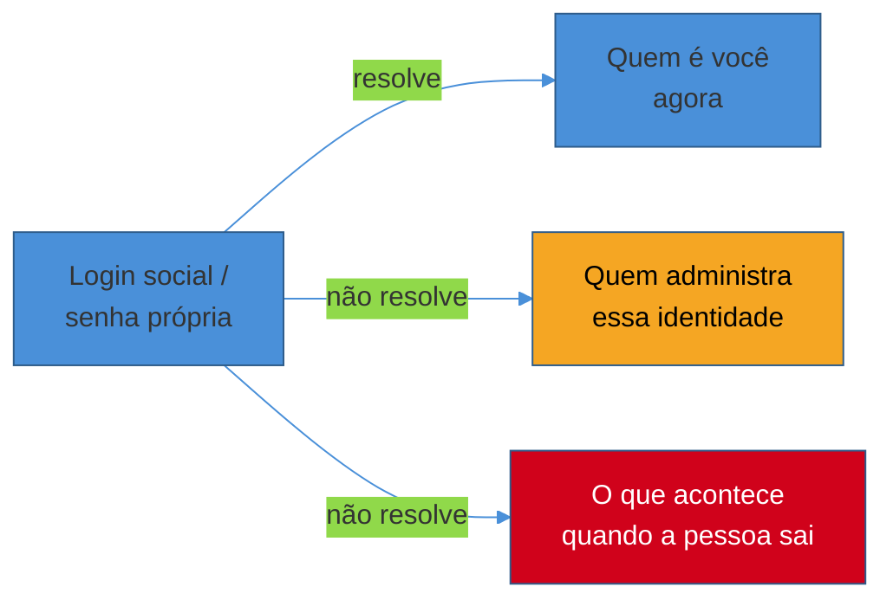
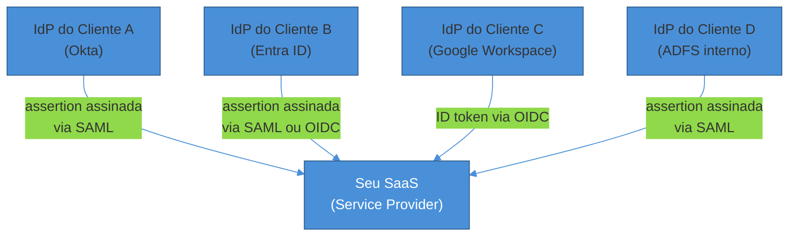
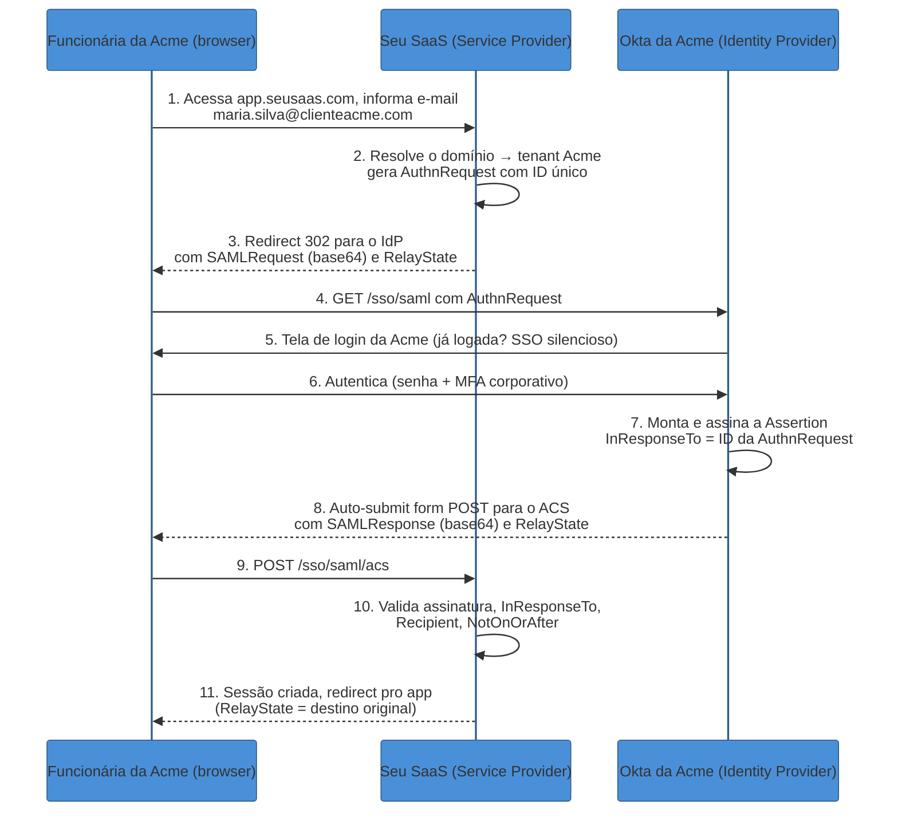
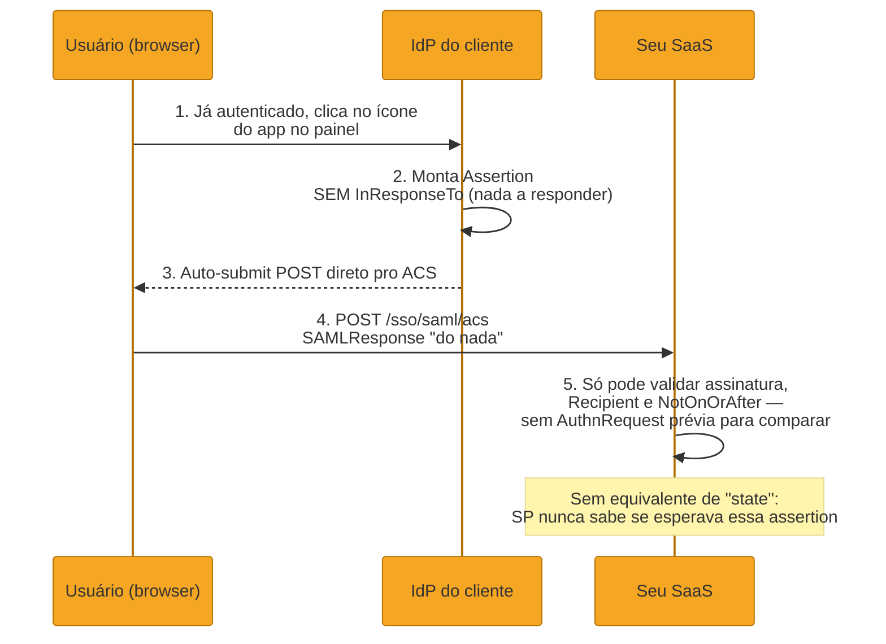
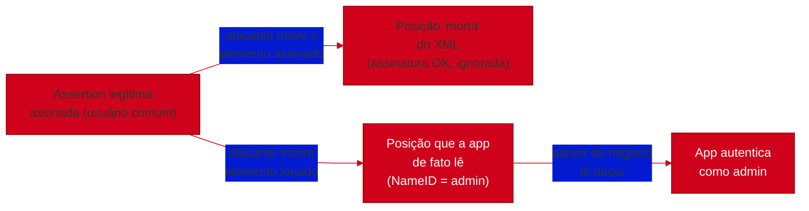
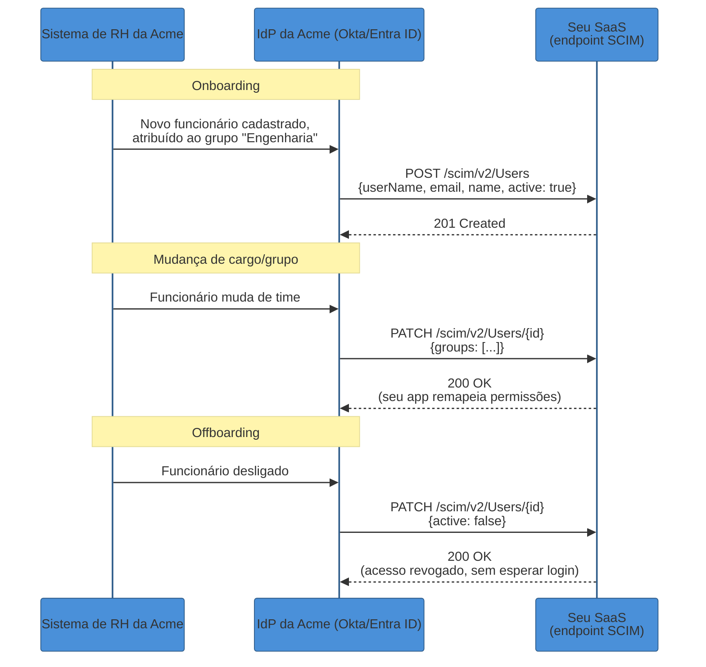

# SSO corporativo — SAML, federação e SCIM

> [!abstract] TL;DR
> Todo SaaS B2B que sobrevive o suficiente esbarra na mesma exigência: um cliente enterprise quer que seus funcionários façam login com a identidade **da empresa**, não com uma senha nova cadastrada no seu produto. Isso é **federação de identidade** — o cliente mantém um **Identity Provider** (Okta, Entra ID, Google Workspace, um Active Directory Federation Services interno) que autentica os próprios funcionários, e o seu app vira um **Service Provider** que confia nas afirmações desse IdP em vez de gerenciar senha nenhuma. O protocolo que a maioria dessas empresas ainda fala é **SAML 2.0** (2005) — não porque seja moderno, mas porque está instalado há duas décadas na base workforce de HR, ITSM e CRM enterprise, e ninguém vai reescrever essa integração por causa de um app novo. SAML troca **assertions XML assinadas digitalmente** entre IdP e SP; o fluxo mais seguro é **SP-initiated** (o app começa a dança, valida o `InResponseTo`, controla a sessão), enquanto **IdP-initiated** — o clique num painel de apps do IdP — não tem equivalente de `state`/CSRF-token e por isso é estruturalmente mais frágil contra replay e assertion theft. Parsear XML assinado é traiçoeiro: em 2018, a Duo Labs mostrou que múltiplas bibliotecas SAML (incluindo OneLogin `python-saml`/`ruby-saml`, `saml2-js`, Shibboleth OpenSAML) tratavam comentários XML dentro do `NameID` de forma inconsistente entre o validador de assinatura e o parser de conteúdo — permitindo forjar identidade sem quebrar a assinatura. SAML não é "pior" que OIDC — resolve o problema de SSO enterprise **hoje**, com décadas de auditoria de segurança; OIDC é o caminho natural pra apps novas; a maioria dos IdPs enterprise fala os dois. Login por si só não resolve outro problema real: **funcionário entra e sai da empresa**, e sem um mecanismo de provisionamento automático, contas órfãs em dezenas de SaaS viram o vetor de ataque mais comum e mais chato de auditar. **SCIM 2.0** (RFC 7643/7644) resolve isso com um schema padronizado de `Users`/`Groups` e uma API REST que o IdP usa para criar, atualizar e — o mais importante — **desativar** contas, independente de login algum. O trio **SSO + SCIM + audit logs** é o que fecha contrato enterprise — e a comunidade batiza de "SSO tax" a prática de vendors cobrarem esse trio como upsell de tier corporativo, às vezes com markups de 500% a 4900% sobre o plano base.

> [!question]- Perguntas que esta nota responde
> - Por que SAML, um protocolo XML de 2005, continua sendo exigido por clientes enterprise em vez de OIDC?
> - Qual a diferença estrutural entre SP-initiated e IdP-initiated, e por que IdP-initiated é considerado mais frágil?
> - O que exatamente deu errado nas vulnerabilidades clássicas de parsing de SAML assinado (comment injection, signature wrapping)?
> - Login resolve "quem é você" — por que isso não resolve o problema de um funcionário sair da empresa, e como o SCIM fecha esse buraco?

## O contrato que travou na cláusula de segurança

Imagine o momento em que um SaaS B2B recebe a primeira proposta de contrato de verdade grande — não mais um time de 5 pessoas pagando no cartão, mas uma empresa de 3.000 funcionários, com um time de segurança que revisa fornecedores antes de assinar. O questionário de segurança chega com uma pergunta que parece simples: *"Vocês suportam SSO via SAML com nosso Identity Provider?"* Se a resposta for "não, mas temos login com Google", o negócio não avança — não porque o time de segurança do cliente ache Google OAuth inseguro, mas porque ele **não controla** aquela conta Google. Um funcionário demitido às 14h continua com acesso ao seu SaaS até que alguém, manualmente, lembre de revogar — e em empresas grandes, ninguém lembra de tudo.

Esse é o ponto cego que autenticação sozinha nunca resolveu: [[01 - OAuth — o problema da delegação|OAuth]] e [[03 - OpenID Connect — identidade sobre OAuth|OIDC]] respondem "como delego acesso" e "quem é esse usuário", mas nenhum dos dois responde "quem administra essa identidade, e o que acontece com ela quando a pessoa sai da empresa". Para uma empresa grande, a resposta **tem** que ser: o próprio departamento de TI, através do IdP corporativo que já governa e-mail, VPN, badge de prédio e toda a pilha de SaaS que a empresa usa. É essa exigência — "a identidade mora com a gente, não com você" — que dá nome ao problema que esta nota cobre: **federação de identidade** aplicada ao mundo B2B enterprise, com **SAML** como o protocolo que a maioria dos IdPs corporativos ainda fala por padrão, e **SCIM** como a peça que faltava para fechar o ciclo de vida da conta, não só o login.



## Federação de identidade: o conceito antes do protocolo

**Federação** é a ideia de que duas organizações diferentes — a sua e a do cliente — podem confiar uma na outra sem compartilhar um banco de dados de usuários. O cliente mantém seu próprio **Identity Provider (IdP)**: o sistema que já sabe quem são os funcionários, aplica a política de senha da empresa, exige o MFA corporativo, e sabe imediatamente quando alguém é desligado, porque está integrado ao RH. O seu produto vira um **Service Provider (SP)**: ele não autentica ninguém diretamente — ele **confia** nas afirmações ("assertions") que o IdP do cliente assina e envia, dentro de uma relação de confiança pré-estabelecida entre os dois sistemas.

Essa relação de confiança não nasce sozinha; ela é configurada explicitamente, dos dois lados, através de **metadata** — um documento (em SAML, tipicamente XML; em OIDC, um JSON via `/.well-known/openid-configuration`) que descreve os endpoints de cada parte, o certificado usado para assinar mensagens, e os identificadores (`entityID` em SAML) que amarram a configuração[^oasis-metadata]. Uma vez que o SP registra o metadata do IdP (ou vice-versa), os dois lados sabem: qual chave pública usar para verificar assinaturas, para onde mandar e de onde esperar mensagens, e sob qual identificador reconhecer o parceiro.

O ponto central — que vale tanto para SAML quanto para OIDC quanto para qualquer protocolo de federação — é este: **o SP nunca vê a senha do usuário, nunca gerencia MFA, nunca decide política de expiração de sessão**. Tudo isso é delegado ao IdP. O SP só recebe uma afirmação assinada — "este usuário se autenticou com sucesso, aqui estão os atributos dele" — e decide o que fazer com base nela. É a mesma separação de responsabilidades que já vimos no Authorization Code Flow ([[02 - Authorization Code + PKCE — o fluxo canônico|02]]), só que aqui a "delegação" é de identidade corporativa inteira, não de um escopo de API.



Um único SaaS enterprise, com dezenas de clientes grandes, acaba mantendo **N relações de confiança em paralelo** — uma por organização cliente, cada uma com seu próprio IdP, seu próprio metadata, e frequentemente seu próprio protocolo preferido. Onde exatamente essa configuração "por organização" vive dentro do seu modelo de dados (um `sso_connection_id` amarrado a um `tenant`, tipicamente) é discutido na nota [[3 - Autorização e multi-tenancy/03 - Multi-tenancy e organizações|Multi-tenancy e organizações]] — aqui o foco é o protocolo que cada conexão fala.

## SAML 2.0: por que não morreu

**SAML** (Security Assertion Markup Language) 2.0 foi padronizado pela OASIS em 2005[^oasis-saml-core] — quase uma década antes do OAuth 2.0 e quinze anos antes do OIDC amadurecer. Ele nasceu para um mundo diferente do de hoje: aplicações web tradicionais, renderizadas no servidor, consumidas de dentro de uma rede corporativa, com o Active Directory como fonte de verdade de identidade. Por isso a escolha de XML como formato — era o formato empresarial dominante da época, com tooling maduro de assinatura digital (XML-DSig) e validação de schema.

O motivo de SAML continuar vivo não é nostalgia: é que ele está **profundamente instalado** na base de sistemas workforce (HR, ITSM, CRM, ferramentas internas) que empresas grandes já rodam há anos, e trocar um protocolo de SSO que já funciona por outro, sem motivo de negócio, é o tipo de risco que nenhum time de segurança corporativo assume de graça[^authgear-oidc-saml]. Governo, saúde e instituições financeiras frequentemente **exigem** SAML especificamente porque ele já passou por décadas de auditoria e tem perfis de conformidade estabelecidos (como FICAM, nos EUA)[^authgear-oidc-saml]. Na prática, se o seu SaaS quer vender para esse mercado, "suportar SAML" não é opcional — é a mesma cláusula que aparece, quase textualmente, em todo questionário de segurança de compra enterprise.

### Anatomia de uma assertion

O artefato central do SAML é a **assertion**: um documento XML que o IdP assina digitalmente e que carrega três tipos possíveis de declaração — autenticação (o usuário se autenticou, quando, com qual método), atributo (nome, e-mail, departamento, grupos) e decisão de autorização (raramente usado na prática)[^oasis-saml-core]. A assinatura XML (XML-DSig) sobre a assertion é o que permite ao SP confiar nela sem se comunicar diretamente com o IdP — diferente do fluxo de token do OAuth, que faz uma chamada back-channel para trocar o código, o SAML tradicionalmente entrega a assertion inteira via redirect do browser (front channel), confiando inteiramente na assinatura para garantir integridade.

Uma assertion simplificada se parece com isto:

```xml
<saml2:Assertion ID="_a1b2c3" IssueInstant="2026-07-11T14:32:00Z">
  <saml2:Issuer>https://idp.clienteacme.com</saml2:Issuer>
  <ds:Signature>...</ds:Signature>
  <saml2:Subject>
    <saml2:NameID Format="emailAddress">
      maria.silva@clienteacme.com
    </saml2:NameID>
    <saml2:SubjectConfirmation Method="bearer">
      <saml2:SubjectConfirmationData
        InResponseTo="_req789xyz"
        Recipient="https://seusaas.com/sso/saml/acs"
        NotOnOrAfter="2026-07-11T14:37:00Z"/>
    </saml2:SubjectConfirmation>
  </saml2:Subject>
  <saml2:AttributeStatement>
    <saml2:Attribute Name="department">
      <saml2:AttributeValue>Engenharia</saml2:AttributeValue>
    </saml2:Attribute>
  </saml2:AttributeStatement>
</saml2:Assertion>
```

Repare em três campos que carregam a maior parte da segurança do protocolo: `InResponseTo` amarra essa assertion a uma requisição específica que o SP fez (o equivalente funcional do `state` do OAuth); `Recipient` restringe onde essa assertion pode ser entregue; `NotOnOrAfter` limita a janela de validade a minutos, não horas. Os três existem para impedir que uma assertion capturada seja reaproveitada em outro contexto — **replay** é a ameaça estrutural que o design de SAML tenta fechar em várias camadas ao mesmo tempo.

### SP-initiated: o fluxo com controle de origem

No **SP-initiated flow**, é o seu app que dá o primeiro passo — o usuário digita o e-mail corporativo numa tela de login, o app reconhece o domínio (ou lê de um `tenant` já conhecido) e redireciona para o IdP correto:



O papel de cada peça:

- **AuthnRequest**: a mensagem que o SP envia ao IdP pedindo autenticação, carregando um `ID` único que o SP vai exigir de volta em `InResponseTo`.
- **ACS (Assertion Consumer Service) endpoint**: a URL do SP (`/sso/saml/acs`, por convenção) que recebe o `POST` com a assertion. É o análogo funcional do `redirect_uri` do OAuth — e, como lá, precisa ser validado contra uma lista pré-registrada, não aceito de qualquer origem.
- **RelayState**: um valor opaco que o SP anexa na ida e recebe de volta, tipicamente usado para lembrar "para onde o usuário queria ir" antes de ser desviado para login — não é um mecanismo de segurança por si só, mas costuma ser confundido com o `state` do OAuth; a proteção real contra replay vem do `InResponseTo` mais a janela curta de `NotOnOrAfter`.

Passo 10 é onde a maior parte dos bugs de implementação SAML nasce — validar uma assertion XML assinada corretamente é sutil, como a próxima seção mostra em detalhe.

### IdP-initiated: por que é estruturalmente mais frágil

No **IdP-initiated flow**, a dança começa do outro lado: o usuário está logado no portal do IdP (o painel de apps da Okta, por exemplo), clica no ícone do seu SaaS, e o IdP monta e envia uma assertion **sem que o SP jamais tenha pedido nada**:



A diferença estrutural é esta: no SP-initiated, o SP gerou o `AuthnRequest` e sabe exatamente que ID esperar de volta em `InResponseTo` — é uma verificação análoga a conferir o `state` no [[02 - Authorization Code + PKCE — o fluxo canônico|Authorization Code Flow]]. No IdP-initiated, **não existe requisição prévia para comparar** — a própria especificação orienta que o SP não valide `InResponseTo` nesse caso, porque simplesmente não há nada para validar contra[^scottbrady-idp-initiated]. Isso deixa o SP incapaz de distinguir uma assertion legítima, iniciada pelo clique real do usuário, de uma assertion **capturada e reproduzida** por um atacante que teve acesso a ela em algum ponto do caminho — não há amarração criptográfica a uma transação específica, só a janela de tempo curta e a checagem de destinatário[^workos-idp-sp].

Isso não significa "nunca use IdP-initiated" — é um padrão comum e até esperado em portais internos de app catalog — mas significa tratá-lo com controles extras: janela de validade agressivamente curta no IdP, monitoramento de replay (checar se aquele `ID` de assertion específico já foi consumido antes, mesmo sem `InResponseTo` para comparar), e, quando possível, preferir SP-initiated como padrão e reservar IdP-initiated só para os casos em que o cliente exige.

## As vulnerabilidades clássicas: por que parsear XML assinado é difícil

A superfície de ataque mais estudada do SAML não está no design do protocolo em si, mas na **implementação da validação de assinatura** — e a razão é estrutural: XML permite formas múltiplas e sutis de representar "o mesmo" conteúdo, e a maioria dos bugs históricos nasce de um **descompasso entre o componente que valida a assinatura e o componente que lê o conteúdo para tomar decisão de negócio**.

### XML Signature Wrapping (XSW)

O ataque de **signature wrapping** explora exatamente esse descompasso: o atacante pega uma assertion legítima e assinada (por exemplo, a sua própria, de uma conta que ele controla), **move** o elemento assinado original para um lugar "morto" do documento (onde a assinatura continua tecnicamente válida, mas ninguém olha ali para tomar decisão), e **insere** um elemento forjado — com o `NameID` de outra pessoa, digamos, um administrador — na posição que o parser de negócio de fato lê[^ibm-xsw]. A assinatura, calculada sobre o elemento original que ainda existe no documento, continua batendo; mas a aplicação, que geralmente busca o primeiro elemento com aquele nome de tag (ou usa um XPath ingênuo), processa o forjado[^jsmon-xsw]. Em resumo: **a assinatura prova que algum conteúdo assinado está presente no documento — não prova que é o conteúdo que a aplicação vai efetivamente usar**.



### O caso Duo Labs 2018: comment injection

Em fevereiro de 2018, pesquisadores da Duo Labs (Kelby Ludwig) publicaram uma variação desse mesmo problema, afetando múltiplas bibliotecas SAML amplamente usadas — entre elas `python-saml` e `ruby-saml` da OneLogin (CVE-2017-11427 e CVE-2017-11428), a `saml2-js` (CVE-2017-11429), `omniauth-saml` (CVE-2017-11430) e o `OpenSAML` em C++ da Shibboleth, além do próprio Duo Network Gateway (CVE-2018-7340)[^osg-advisory]. O truque explorava **canonicalização XML**: o processo de assinatura digital, ao normalizar o documento antes de calcular o hash, **remove comentários XML** por padrão — mas nem todo parser de conteúdo faz o mesmo. Um atacante autenticado (com sua própria conta legítima, mas de baixo privilégio) conseguia inserir um comentário XML *dentro* do valor do `NameID`:

```xml
<saml2:NameID>attacker<!--,-->@vitima.com</saml2:NameID>
```

A rotina de verificação de assinatura, após canonicalizar e remover o comentário, calculava o hash sobre `attacker@vitima.com` — batendo com a assinatura original, que era legítima para essa string completa. Mas algumas bibliotecas, ao **extrair** o valor do `NameID` para uso na aplicação, paravam no primeiro nó de texto antes do comentário, lendo só `attacker` — ou, dependendo da implementação específica, produziam outras combinações inconsistentes entre o texto assinado e o texto processado[^osg-advisory][^workos-fun-footguns]. O resultado prático: um atacante já autenticado no sistema conseguia, manipulando sua própria assertion assinada legitimamente, fazer com que a aplicação o autenticasse como **outro usuário** — sem jamais comprometer a chave privada do IdP nem quebrar a assinatura criptográfica de fato.

> [!info] Por que isso é um bug de biblioteca, não de protocolo
> Nem SAML nem a especificação de assinatura XML (XML-DSig) "erraram" aqui — a raiz do problema é que **verificação de assinatura** e **extração de conteúdo para lógica de negócio** são, na maioria das implementações, dois passos separados, potencialmente feitos por componentes diferentes com entendimentos ligeiramente diferentes do mesmo documento XML. Esse é precisamente o padrão que o post-mortem do GitHub sobre hardening de SAML descreve ao adotar validação **dupla e redundante** (duas bibliotecas rodando em paralelo, exigindo que concordem antes de aceitar um resultado) como defesa em profundidade contra essa classe de bug — em vez de confiar em uma única implementação, por mais corrigida que esteja[^github-hardening].

O padrão de dano é o mesmo em XSW e em comment injection: **a assinatura garante que o documento não foi adulterado por um terceiro sem a chave privada — mas não garante que o parser de conteúdo interpreta o documento do mesmo jeito que o validador de assinatura**. É por isso que a recomendação prática, hoje, não é "escreva seu próprio parser SAML" — é o oposto: usar bibliotecas maduras, mantidas ativamente, testadas contra exatamente essa classe de ataque, e — quando o volume justificar, como no caso do GitHub — rodar validação redundante com bibliotecas independentes.

## SAML vs OIDC: a comparação honesta

Vale resistir à tentação de tratar essa comparação como "tecnologia velha vs tecnologia nova" — a decisão real, em 2026, é sobre **onde a identidade já mora**, não sobre qual protocolo é tecnicamente superior.

| Dimensão | SAML 2.0 | OIDC |
|---|---|---|
| Formato | XML assinado (XML-DSig) | JWT (JSON) |
| Ano de padronização | 2005 | 2014 |
| Canal principal | Front channel (POST via browser) | Front + back channel (Authorization Code) |
| Peso típico da mensagem | ~3-5 KB (XML verboso) | ~1 KB (JWT compacto) |
| Onde domina | Workforce/B2E: HR, ITSM, CRM, apps internos enterprise | Apps novas, mobile, SPAs, APIs |
| Exigido por | Governo, saúde, financeiro (conformidade e auditoria estabelecidas) | Ninguém "exige" — é o padrão natural de quem constrói hoje |
| Complexidade de implementação | Alta (parsing XML, assinatura, canonicalização) | Menor (JSON + HTTPS) |

A pesquisa de mercado é direta sobre a recomendação prática: comece por OIDC, a menos que esteja integrando com um IdP legado que só fala SAML[^authgear-oidc-saml]. Só que "a menos que" cobre uma fatia enorme do mercado enterprise de verdade — e a decisão raramente é do seu SaaS: é do cliente, que já roda uma infraestrutura de identidade estabelecida. Um detalhe pouco óbvio de custo: em alguns IdPs corporativos, o suporte a SAML é vendido em um tier de licença mais caro do que o OIDC básico — por exemplo, federação SAML para apps de terceiros no Microsoft Entra ID historicamente exige a licença P1, enquanto login OIDC básico pode estar incluído em planos mais baixos[^clerk-oidc-saml-2026] — o que às vezes empurra clientes menores para pedir OIDC mesmo quando SAML seria tecnicamente equivalente.

Na prática, a maioria dos IdPs enterprise modernos **fala os dois protocolos** — Okta, Entra ID, Google Workspace, Auth0, o próprio [[01 - Keycloak — realms, clients e flows|Keycloak]] (que este galho cobre em detalhe no sub-galho seguinte) suportam SAML e OIDC como opções de configuração por aplicação. A implicação prática para quem constrói um SaaS B2B: **seu produto precisa suportar os dois**, porque a escolha do protocolo não é sua — é do IdP que o cliente já opera, e negar suporte a SAML fecha a porta para uma fatia inteira do mercado enterprise tradicional, mesmo em 2026.

## Provisioning: o problema que login não resolve

Suponha que a integração SAML esteja funcionando perfeitamente — a funcionária da Acme faz login, a assertion é validada, a sessão é criada. Isso resolve **autenticação**: "quem é essa pessoa agora". Não resolve dois problemas adjacentes, igualmente reais em qualquer relação B2B de escala:

1. **Onboarding**: um funcionário novo precisa de acesso ao seu SaaS *antes* mesmo de fazer o primeiro login — porque alguém precisa atribuí-lo a um time, dar permissões, ou simplesmente porque o processo de onboarding da empresa cliente espera que a conta já exista quando a pessoa chegar no primeiro dia.
2. **Offboarding**: um funcionário desligado precisa ter o acesso **revogado imediatamente** — e "revogado na próxima vez que alguém lembrar de fazer isso manualmente" não é uma resposta aceitável para nenhum time de segurança corporativo sério. Contas órfãs, esquecidas em dezenas de SaaS que a empresa contratou ao longo dos anos, são consistentemente citadas como um dos vetores de risco mais comuns e mais difíceis de auditar em ambientes enterprise.

Login sozinho — mesmo via SSO — não resolve nenhum dos dois, porque login só acontece quando **a pessoa decide entrar**. Se ela nunca faz login (caso 1) ou nunca mais faz login porque foi demitida (caso 2, na direção oposta: ela *não* precisa logar de novo para que o dano já tenha ocorrido — o acesso residual já existe), não há evento algum que dispare uma atualização no seu sistema.

### SCIM 2.0: o protocolo de ciclo de vida

**SCIM** (System for Cross-domain Identity Management) 2.0, padronizado nas RFC 7643 (schema) e RFC 7644 (protocolo) em 2015[^rfc7643][^rfc7644], resolve exatamente essa lacuna: ele define um schema padronizado para recursos `User` e `Group`, e uma API REST (`POST`, `PUT`, `PATCH`, `DELETE` sobre `/Users` e `/Groups`) que o IdP usa para manter o seu sistema sincronizado com o diretório da empresa — **independente de qualquer evento de login**[^scim-wiki].



O detalhe mais importante desse fluxo, do ponto de vista de segurança, é o passo final: **deprovisioning via SCIM não é uma feature de conveniência, é uma feature de segurança**. A prática recomendada é o IdP enviar `PATCH` com `active: false` (soft-delete, revogando acesso e preservando o histórico da conta) em vez de `DELETE` — o que permite ao seu sistema manter auditoria, encerrar sessões ativas daquele usuário, e reter dados conforme política de retenção, ao mesmo tempo em que corta o acesso instantaneamente, no exato momento em que o RH da empresa cliente processa o desligamento[^clerk-scim-explained].

### JIT provisioning vs SCIM

Existe uma alternativa mais simples ao SCIM para o problema de **onboarding**: **Just-In-Time (JIT) provisioning**, que cria a conta automaticamente no primeiro login SAML/OIDC bem-sucedido, lendo os atributos que já vêm na assertion (nome, e-mail, departamento). JIT não exige endpoint dedicado nem sincronização contínua — é essencialmente "grátis" para quem já tem SSO funcionando[^workos-scim-vs-jit].

A limitação do JIT é exatamente o espelho do que descrevemos acima: ele só reage a um evento de login. Isso significa que **não resolve offboarding** — quando o RH desativa alguém no IdP, nenhum login vai acontecer para disparar coisa alguma no seu sistema, então a conta simplesmente continua ativa, com acesso completo, até alguém notar manualmente[^workos-scim-vs-jit]. Também não permite pré-provisionar contas antes do primeiro login (o caso de onboarding em que o time já precisa ver o novo colega atribuído a um projeto antes de ele logar pela primeira vez).

| | JIT provisioning | SCIM |
|---|---|---|
| Dispara em | Evento de login (SAML/OIDC) | Evento no diretório do IdP (independente de login) |
| Onboarding pré-login | Não | Sim |
| Atualização de atributos (mudança de time, cargo) | Só no próximo login | Em tempo quase real |
| Offboarding automático | **Não** — sem login, sem sinal | **Sim** — é o caso de uso central |
| Esforço de implementação | Baixo (reaproveita a assertion) | Médio (endpoint REST dedicado) |
| Quando basta | Times pequenos, baixa rotatividade | Qualquer cliente enterprise sério |

Na prática, os dois não são mutuamente exclusivos: muitos produtos usam JIT para a experiência de primeiro login (simples, sem fricção) e oferecem SCIM como o mecanismo de administração contínua e de offboarding — que é, hoje, o que os clientes enterprise realmente pedem quando perguntam "vocês suportam provisionamento automático".

## O trio que fecha contrato — e o "SSO tax"

Quando um time de compras enterprise avalia um fornecedor SaaS, o padrão de exigência é quase sempre o mesmo trio: **SSO** (federação de autenticação — o que esta nota cobriu), **SCIM** (ciclo de vida de conta) e **audit logs** (trilha de auditoria — quem fez o quê, quando, de onde, disponível para o time de segurança do cliente consultar ou exportar para o próprio SIEM)[^workos-checklist]. Esse trio, junto com controles de acesso baseados em papel (RBAC), é frequentemente chamado de "enterprise readiness" na literatura de produto B2B — o conjunto mínimo de features de segurança que separa "vende para PMEs" de "vende para Fortune 500".

O que gerou controvérsia real na comunidade de desenvolvedores foi **como** os vendors cobram por esse trio: em vez de tratá-lo como parte do produto básico, muitos empurram SSO/SCIM/audit logs para um tier "Enterprise" separado, frequentemente com preço muito acima do plano anterior — o site **sso.tax** (também replicado em ssotax.org), popularizado por Rob Chahin, cataloga exemplos documentados desse markup: Atlassian com aumento de 51% para habilitar SSO, Slack 72%, Asana 140%, Airtable 500%, chegando a casos extremos de 4900%[^sso-tax]. A crítica central não é que SSO custe caro para implementar uma vez — é que, depois de implementado, o custo marginal de habilitar SSO para um cliente a mais é próximo de zero, o que torna esse tipo de markup, segundo a crítica, essencialmente margem pura em cima de uma funcionalidade que deveria ser tratada como requisito básico de segurança, não como luxo[^sso-tax]. A CISA (agência de segurança dos EUA) chegou a recomendar formalmente, em sua diretriz "Secure by Design", que SSO esteja disponível **por padrão** na oferta básica, não como add-on oneroso[^sso-tax].

> [!info] Vendors que constroem SSO/SCIM como produto de plataforma
> Provedores como WorkOS, Auth0 e o próprio Okta (via Auth0) vendem SSO/SCIM/audit logs **como um produto à parte**, para SaaS que não querem implementar SAML e SCIM do zero — o que, ironicamente, cobra do fornecedor exatamente o mesmo tipo de "taxa por conexão" que a comunidade critica quando o fornecedor repassa esse custo ao cliente final. Entender essa dinâmica de mercado ajuda a explicar por que tantos produtos SaaS têm o mesmo padrão de pricing para enterprise features — eles compram a capacidade de um provedor que cobra assim.

## Armadilhas comuns

> [!warning] Aceitar IdP-initiated sem nenhuma proteção adicional
> **O que acontece:** o SP processa qualquer `SAMLResponse` que chegue no ACS endpoint com assinatura válida, sem distinguir se veio de um fluxo iniciado por ele mesmo ou não. **Por quê:** sem `InResponseTo` para comparar, o SP não tem como amarrar a assertion a uma transação específica que ele mesmo começou — uma assertion capturada em algum ponto (log, proxy, extensão maliciosa) pode ser reproduzida enquanto a janela de `NotOnOrAfter` não expirar. **Como evitar:** preferir SP-initiated como fluxo padrão sempre que o IdP suportar; onde IdP-initiated for exigido, configurar janela de validade agressivamente curta no IdP e implementar detecção de replay (registrar o `ID` de cada assertion consumida e rejeitar reuso, mesmo dentro da janela válida).

> [!warning] Escrever ou adaptar um parser SAML próprio "porque parece simples"
> **O que acontece:** o time decide implementar validação de assertion na mão, ou usa uma biblioteca sem manutenção ativa, subestimando a complexidade de canonicalização XML e assinatura. **Por quê:** os casos documentados de XML Signature Wrapping e o comment injection encontrado pela Duo Labs em 2018 não nasceram de más práticas óbvias — nasceram de descompassos sutis entre o componente que valida a assinatura e o componente que extrai o conteúdo, exatamente o tipo de bug que só aparece sob teste adversarial dedicado. **Como evitar:** usar bibliotecas SAML maduras e ativamente mantidas (não abandonadas há anos), manter atualizações de segurança em dia, e — em escala — considerar validação redundante com implementações independentes, como o próprio GitHub adotou depois de revisar sua pilha de SAML.

> [!warning] Tratar SSO como resolvendo offboarding
> **O que acontece:** o time assume que, como o login passa pelo IdP do cliente, desativar o funcionário lá "já resolve" o acesso no seu sistema. **Por quê:** SAML e OIDC só entram em ação quando alguém *faz login*. Se a sessão já existe (token/cookie ainda válido) ou se a pessoa simplesmente não tenta mais logar, seu sistema nunca recebe sinal nenhum de que aquele usuário foi desligado — o acesso permanece intacto até uma auditoria manual (se houver) descobrir a conta órfã. **Como evitar:** implementar SCIM (ou, no mínimo, algum mecanismo de deprovisioning ativo) para todo cliente que exigir automação de ciclo de vida — que, na prática, é todo cliente enterprise de porte razoável — e configurar expiração de sessão curta o suficiente para que uma conta desativada perca acesso rapidamente mesmo sem SCIM.

> [!warning] Confundir "suportamos SSO" com "somos enterprise ready"
> **O que acontece:** o produto implementa login via SAML/OIDC e considera a exigência de segurança do cliente atendida. **Por quê:** o questionário de segurança de um comprador enterprise sério tipicamente pede o trio inteiro — SSO, SCIM e audit logs — porque cada peça cobre uma lacuna diferente (quem entra, quem deveria continuar tendo acesso, o que foi feito). Faltar qualquer uma das três costuma travar a negociação na mesma cláusula. **Como evitar:** tratar SSO, SCIM e audit logs como um pacote mínimo desde o início do roadmap de "enterprise readiness", não como três features independentes priorizadas isoladamente.

## Em entrevista

Esse é um tema onde entrevistadores de vaga sênior/staff testam **julgamento de produto tanto quanto conhecimento de protocolo** — a pergunta raramente é "explica SAML"; é algo como "um cliente enterprise pediu SSO, como você prioriza o trabalho?" ou "por que você suportaria um protocolo XML de 2005 em vez de só usar OIDC?". O sinal que se busca é se o candidato entende que essa é uma decisão de **quem controla a identidade**, não uma escolha técnica isolada — e se ele sabe que login sozinho não fecha o problema de segurança que o cliente está de fato comprando.

Uma resposta fraca lista os passos do fluxo SAML sem explicar o motivo de negócio: "o IdP manda uma assertion XML assinada, o app valida e cria a sessão." Uma resposta forte amarra a decisão de suportar SAML à realidade do mercado: "clientes enterprise não escolhem o protocolo — o IdP deles já fala SAML porque foi implantado há anos, e reescrever isso por conta do meu produto não está no radar deles. Minha decisão é suportar os dois, SAML e OIDC, e tratar SSO como só um terço do que 'enterprise ready' significa — sem SCIM, o cliente continua exposto a contas órfãs de gente desligada, que é exatamente o risco que o time de segurança dele estava tentando fechar ao pedir SSO em primeiro lugar."

> **Entrevistador:** "Por que IdP-initiated SSO é considerado mais arriscado que SP-initiated?"
>
> **Resposta fraca:** "Porque é menos seguro, tem mais chance de ataque."
>
> **Resposta forte:** "No SP-initiated, meu app gera uma `AuthnRequest` com um ID específico e exige que a assertion de volta traga esse mesmo ID em `InResponseTo` — é uma amarração criptográfica a uma transação que eu mesmo iniciei, o equivalente funcional do `state` no OAuth. No IdP-initiated, a dança começa do lado do IdP, sem nenhuma requisição prévia minha para comparar — a própria especificação orienta o SP a nem tentar validar `InResponseTo` nesse caso, porque não existe nada para validar contra. Isso significa que, se uma assertion vazar — via log, proxy, ou qualquer canal — ela pode em tese ser reproduzida dentro da janela de validade, e meu sistema não tem como distinguir isso de um fluxo legítimo. Não é motivo para banir IdP-initiated — é um fluxo comum e às vezes exigido pelo cliente — mas exige controles extras que o SP-initiated já resolve estruturalmente."

Essa resposta demonstra entendimento do *mecanismo* da fragilidade — a ausência de amarração transacional — em vez de repetir "IdP-initiated é mais arriscado" como fato memorizado sem explicação.

## How to explain it in English

> "Enterprise SSO isn't about which protocol is technically better — it's about who owns the identity. A large customer's IT department already runs an Identity Provider that manages passwords, MFA, and offboarding for every employee; they federate that identity to your app instead of creating a separate password you'd have to secure yourself. SAML, despite being a 2005 XML-based protocol, remains the default in that world simply because it's the protocol already wired into decades of enterprise HR and IT systems — ripping it out for a newer app isn't worth the risk to their security team. The subtlety most people miss is that SSO alone doesn't solve the problem the customer actually cares about: when an employee is terminated, nothing about login-based SSO tells your system that access should be revoked, because revocation requires an event, and firing someone doesn't trigger a login. That's what SCIM solves — it's a directory-sync protocol, independent of login, that lets the IdP push account creation, updates, and — critically — deactivation to every connected app the moment HR processes the change."

| PT | EN |
|----|----|
| Federação de identidade | Identity federation |
| Provedor de identidade / provedor de serviço | Identity Provider (IdP) / Service Provider (SP) |
| Afirmação assinada | Signed assertion |
| Iniciado pelo provedor de serviço | Service Provider-initiated (SP-initiated) |
| Iniciado pelo provedor de identidade | Identity Provider-initiated (IdP-initiated) |
| Endpoint consumidor de asserção | Assertion Consumer Service (ACS) |
| Ataque de encapsulamento de assinatura | Signature wrapping attack |
| Injeção de comentário | Comment injection |
| Provisionamento / desprovisionamento | Provisioning / deprovisioning |
| Provisionamento sob demanda | Just-in-time (JIT) provisioning |
| Conta órfã | Orphaned account |
| Prontidão empresarial | Enterprise readiness |

## O que vem a seguir

Este sub-galho terminou de responder "como um usuário chega até o seu sistema, e quem administra essa identidade" — desde a delegação básica ([[01 - OAuth — o problema da delegação|01]]) e o fluxo canônico com PKCE ([[02 - Authorization Code + PKCE — o fluxo canônico|02]]), passando pela camada de identidade real com OIDC ([[03 - OpenID Connect — identidade sobre OAuth|03]]), até a federação corporativa completa que fecha esta nota: SAML, SSO e o ciclo de vida de conta via SCIM.

O que ainda falta é a pergunta seguinte, mais interessante do ponto de vista de arquitetura: **o token chegou, a identidade está validada — e agora, quem pode fazer o quê?** Um funcionário autenticado via SAML não deveria automaticamente poder ler os dados de qualquer organização cliente; alguém precisa decidir, a cada requisição, se aquela identidade tem permissão para aquele recurso específico, dentro daquele tenant específico. É exatamente aí que entra o próximo sub-galho.

- [[3 - Autorização e multi-tenancy/index|Autorização e multi-tenancy]] — RBAC, ABAC, ReBAC e o corte de organizações que todo SaaS B2B enfrenta depois que o login já funciona
- [[01 - Keycloak — realms, clients e flows]] — o IdP self-hosted que este vault cobre em detalhe, incluindo Organizations (multi-tenancy nativo) e SCIM
- [[10 - MAC, HMAC e assinaturas digitais]] (Segurança) — a teoria de assinatura digital que fundamenta a verificação de assertion SAML

## Fontes

- **OASIS Open** — [*Assertions and Protocols for the OASIS Security Assertion Markup Language (SAML) V2.0*](https://docs.oasis-open.org/security/saml/v2.0/saml-core-2.0-os.pdf) — especificação normativa do formato de assertion; acessado em 2026-07-11.
- **OASIS Open** — [*Metadata for the OASIS Security Assertion Markup Language (SAML) V2.0*](https://docs.oasis-open.org/security/saml/v2.0/saml-metadata-2.0-os.pdf) — formato de metadata para configurar confiança entre IdP e SP; acessado em 2026-07-11.
- **IETF Datatracker** — [*RFC 7643 — System for Cross-domain Identity Management: Core Schema*](https://datatracker.ietf.org/doc/html/rfc7643) — schema padronizado de `User`/`Group` do SCIM 2.0; acessado em 2026-07-11.
- **IETF Datatracker** — [*RFC 7644 — System for Cross-domain Identity Management: Protocol*](https://datatracker.ietf.org/doc/html/rfc7644) — operações REST do SCIM 2.0 (create/update/deactivate); acessado em 2026-07-11.
- **sso.tax** — [*The SSO Wall of Shame*](https://sso.tax/) — catálogo de vendors que cobram SSO como upsell de tier enterprise, com percentuais de markup documentados; acessado em 2026-07-11.
- **OSG Security** — [*OSG-SEC-2018-03-13 — SAML Vulnerabilities affecting multiple implementations*](https://osg-htc.org/security/vulns/OSG-SEC-2018-03-13-SAML-Vulnerabilities-affecting-multiple-implementations/) — detalhamento técnico da vulnerabilidade de comment injection descoberta pela Duo Labs em fevereiro de 2018, com lista de CVEs por biblioteca afetada; acessado em 2026-07-11.
- **Auth0** — [*Auth0 Not Affected by SAML Vulnerabilities Identified by Duo Security*](https://auth0.com/blog/auth0-not-affected-by-saml-vulnerabilities-identified-by-duo-security/) — contexto de mercado sobre a disclosure de 2018; acessado em 2026-07-11.
- **WorkOS** — [*Fun with SAML SSO vulnerabilities and footguns*](https://workos.com/blog/fun-with-saml-sso-vulnerabilities-and-footguns) — explicação acessível de XSW e comment injection em SAML; acessado em 2026-07-11.
- **IBM Think** — [*What is XML Signature Wrapping?*](https://www.ibm.com/think/topics/xml-signature-wrapping) — mecânica geral do ataque de signature wrapping; acessado em 2026-07-11.
- **The GitHub Blog** — [*Sign in as anyone: Bypassing SAML SSO authentication with parser differentials*](https://github.blog/security/sign-in-as-anyone-bypassing-saml-sso-authentication-with-parser-differentials/) e [*Inside GitHub: How we hardened our SAML implementation*](https://github.blog/security/web-application-security/inside-github-how-we-hardened-our-saml-implementation/) — post-mortem do GitHub sobre parser differentials em SAML e a adoção de validação dupla e redundante como defesa; acessado em 2026-07-11.
- **Scott Brady** — [*The Dangers of SAML IdP-Initiated SSO*](https://www.scottbrady.io/saml/dangers-of-idp-initiated-sso) — por que IdP-initiated não tem equivalente de `InResponseTo`/CSRF-token; acessado em 2026-07-11.
- **WorkOS** — [*SP-initiated vs. IdP-initiated SSO: key differences explained*](https://workos.com/blog/sp-initiated-sso-vs-idp-authentication) — comparação estrutural dos dois fluxos; acessado em 2026-07-11.
- **Authgear** — [*OIDC vs SAML: When to Use Each for Modern SSO*](https://www.authgear.com/post/oidc-vs-saml/) — comparativo de mercado 2026, quando cada protocolo domina; acessado em 2026-07-11.
- **Clerk** — [*OIDC vs SAML for Enterprise SSO: A 2026 Decision Guide*](https://clerk.com/articles/oidc-vs-saml-for-enterprise-sso-a-2026-decision-guide) — diferença de custo de licenciamento entre SAML e OIDC em IdPs como Entra ID; acessado em 2026-07-11.
- **WorkOS** — [*SCIM vs JIT: Key differences explained*](https://workos.com/guide/scim-vs-jit) e [*What is Just-In-Time Provisioning and how do you use it?*](https://workos.com/blog/what-is-just-in-time-provisioning-and-how-do-you-use-it) — tradeoffs entre os dois modelos de provisionamento; acessado em 2026-07-11.
- **Clerk** — [*SCIM 2.0 explained: a practical guide for SaaS auth*](https://clerk.com/articles/scim-2-0-explained-a-practical-guide-for-saas-auth) — deprovisioning via `active: false` como padrão recomendado; acessado em 2026-07-11.
- **WorkOS** — [*The 10 enterprise features every B2B SaaS needs*](https://workos.com/blog/enterprise-readiness-checklist-2026) — o trio SSO/SCIM/audit logs como checklist de enterprise readiness; acessado em 2026-07-11.
- **Wikipedia** — [*System for Cross-domain Identity Management*](https://en.wikipedia.org/wiki/System_for_Cross-domain_Identity_Management) — histórico e visão geral do SCIM; acessado em 2026-07-11.

[^oasis-saml-core]: OASIS, *Assertions and Protocols for the OASIS SAML V2.0* — estrutura da assertion, tipos de statement, ano de padronização (2005). [^oasis-metadata]: OASIS, *Metadata for the OASIS SAML V2.0* — formato de metadata, entityID, endpoints, chaves de assinatura. [^authgear-oidc-saml]: Authgear, *OIDC vs SAML: When to Use Each for Modern SSO* — SAML dominante em workforce/B2E; exigência regulatória em governo/saúde/financeiro. [^scottbrady-idp-initiated]: Scott Brady, *The Dangers of SAML IdP-Initiated SSO* — ausência de `InResponseTo` para validar em fluxos IdP-initiated. [^workos-idp-sp]: WorkOS, *SP-initiated vs. IdP-initiated SSO: key differences explained* — maior exposição a assertion theft e replay no IdP-initiated. [^ibm-xsw]: IBM Think, *What is XML Signature Wrapping?* — mecânica do ataque: mover elemento assinado, inserir elemento forjado. [^jsmon-xsw]: jsmon.sh, *What is XML Signature Wrapping Attack?* — descompasso entre validação de assinatura e extração de conteúdo por XPath/tag. [^osg-advisory]: OSG Security, *OSG-SEC-2018-03-13* — detalhamento da vulnerabilidade de comment injection, lista de CVEs (OneLogin, saml2-js, omniauth-saml, Duo Network Gateway). [^workos-fun-footguns]: WorkOS, *Fun with SAML SSO vulnerabilities and footguns* — explicação da canonicalização XML removendo comentários antes da assinatura. [^github-hardening]: The GitHub Blog, *Inside GitHub: How we hardened our SAML implementation* — validação dupla e redundante como defesa contra parser differentials. [^clerk-oidc-saml-2026]: Clerk, *OIDC vs SAML for Enterprise SSO: A 2026 Decision Guide* — diferença de custo de licenciamento (Entra ID P1) entre SAML e OIDC. [^scim-wiki]: Wikipedia, *System for Cross-domain Identity Management* — schema e operações REST do SCIM 2.0, RFCs 7643/7644 (2015). [^clerk-scim-explained]: Clerk, *SCIM 2.0 explained: a practical guide for SaaS auth* — `active: false` como padrão de deprovisioning (soft-delete). [^workos-scim-vs-jit]: WorkOS, *SCIM vs JIT: Key differences explained* — JIT não dispara em desligamento; SCIM cobre o ciclo de vida completo. [^sso-tax]: sso.tax, *The SSO Wall of Shame* — exemplos de markup (Atlassian 51%, Slack 72%, Asana 140%, Airtable 500%), recomendação da CISA sobre SSO por padrão.
