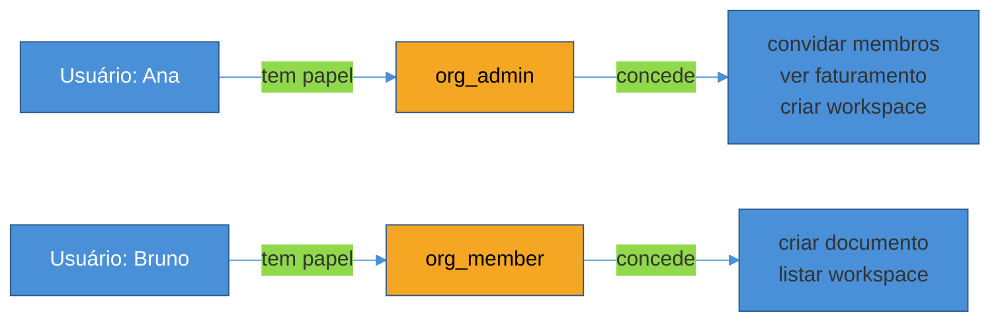
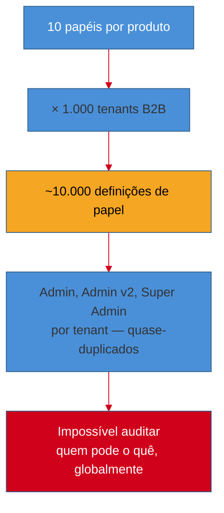
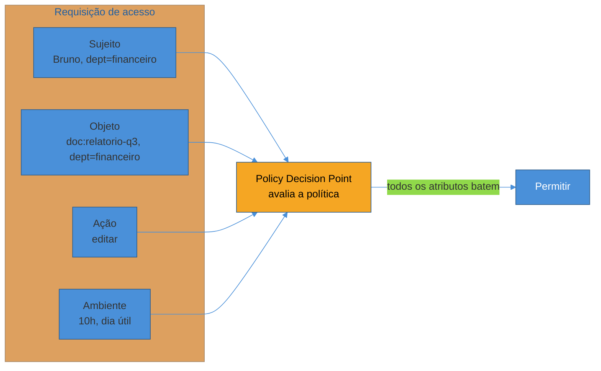
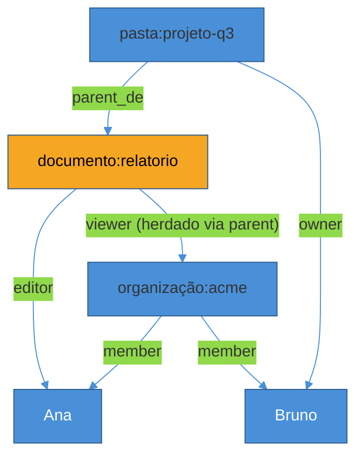
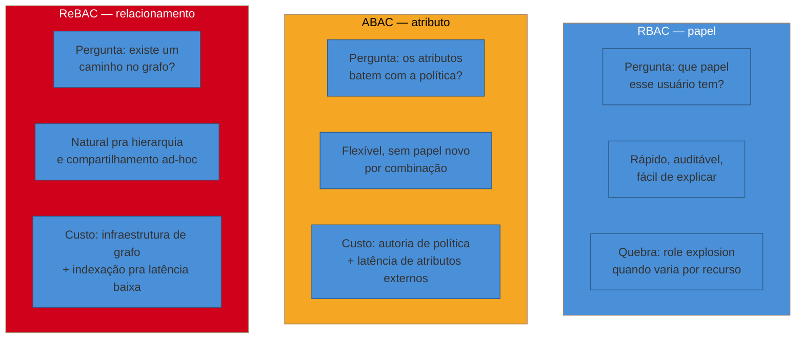

# RBAC, ABAC e ReBAC — os três modelos

> [!abstract] TL;DR
> Autenticado não é a mesma coisa que autorizado, e "autorizado" esconde uma pergunta que três modelos respondem de formas estruturalmente diferentes. **RBAC** (Role-Based Access Control) agrega permissões em **papéis** — você pergunta "que papel esse usuário tem?" e o papel já vem com um pacote fixo de permissões. **ABAC** (Attribute-Based Access Control) avalia uma **política contra atributos** do usuário, do recurso e do ambiente em tempo de execução — não existe papel, existe uma regra tipo "libera se `department(user) == department(resource)` e `time_of_day` está no expediente". **ReBAC** (Relationship-Based Access Control) não pergunta "que papel" nem "que atributo": pergunta **"que caminho existe entre você e o recurso, num grafo de relacionamentos?"** — você pode editar este documento porque é *owner* da pasta que o contém, que por sua vez pertence à sua organização. Os três resolvem o mesmo problema com granularidades e custos diferentes. O RBAC quebra em SaaS multi-organização por um fenômeno batizado **role explosion**: 10 papéis × 1.000 tenants = 10.000 definições de papel pra manter, porque cada tenant quer variações ("Admin", "Super Admin", "Admin v2") do mesmo conceito. O consenso de mercado em 2026 não é "escolha um": é **híbrido — RBAC coarse-grained para o que é estável (dono, membro, admin da organização) + ReBAC fine-grained para o que varia por recurso** (quem pode editar *este* documento, *este* projeto). GitHub e Google Drive são exemplos reais rodando exatamente essa combinação em produção.

> [!question]- Perguntas que esta nota responde
> - Qual a diferença estrutural entre "papel", "atributo" e "relacionamento" como base de uma decisão de acesso?
> - O que é role explosion, por que ele aparece especificamente em SaaS multi-tenant, e como isso quebra RBAC puro?
> - Quando escolher RBAC, quando escolher ABAC, quando escolher ReBAC — e por que a resposta de 2026 costuma ser "os dois primeiros, com o terceiro entrando quando aparecem sinais específicos"?
> - Como GitHub e Google Drive implementam ReBAC na prática, e o que isso ensina sobre modelar permissões como grafo?

## O problema que aparece depois do login

Você resolveu autenticação. O usuário provou quem é — senha, passkey, SSO corporativo, tanto faz o mecanismo, ele está coberto em [[01 - Identidade, autenticação e autorização — o mapa|Fundamentos 01]] e em [[13 - Autorização e controle de acesso|Segurança 13]]. Agora vem a pergunta seguinte, que autenticação não responde: **esse usuário identificado pode fazer *isto*, com *este* recurso, agora?**

A resposta ingênua é um `if`: `if user.email == "admin@empresa.com": allow()`. Funciona para uma conta, quebra na segunda linha de código que faz a mesma checagem com um email diferente hardcoded, e vira um pesadelo de manutenção assim que a lista de "quem pode o quê" passa de um punhado de pessoas. O problema real de autorização é: como expressar regras de acesso de um jeito que **escale** — que não exija reescrever lógica de negócio toda vez que um usuário novo entra, um recurso novo é criado, ou uma exceção de política aparece?

Os três modelos que esta nota cobre — RBAC, ABAC, ReBAC — são três respostas estruturalmente diferentes pra essa pergunta, cada uma nascida numa década e num contexto diferentes, e cada uma com um ponto de ruptura característico. Vamos seguir um exemplo trabalhado do início ao fim: um SaaS de gestão de documentos, parecido com o núcleo de permissões que Google Drive ou Notion resolvem — quem pode ler, editar e compartilhar um documento.

## RBAC: papéis como pacotes de permissão

**Role-Based Access Control** é o modelo mais antigo dos três e, ainda hoje, o ponto de partida padrão de quase todo sistema novo. A ideia central: em vez de atribuir permissões diretamente a usuários (o que não escala — cada usuário novo exige reconfigurar tudo do zero), você define **papéis** intermediários. Um papel é um pacote nomeado de permissões — `editor`, `viewer`, `admin` — e o que você atribui a um usuário não é uma lista de permissões, é um papel. A permissão vem de tabela: `role → permissions`, e a atribuição é `user → role`.

O NIST formalizou esse modelo num padrão de referência em 2000, organizado em quatro camadas cumulativas de sofisticação[^nist-rbac]:

- **Core RBAC** — os seis elementos básicos: usuários, papéis, objetos, operações, permissões e sessões. Um usuário pode ter múltiplos papéis ativos numa sessão; um papel agrupa permissões (operação + objeto).
- **Hierarchical RBAC** — papéis herdam de outros papéis. `Admin` herda tudo que `Editor` pode, que herda tudo que `Viewer` pode — você não repete a lista de permissões em cada nível, só declara a diferença.
- **Constrained RBAC** — adiciona *separation of duties*: regras que impedem um usuário de acumular papéis conflitantes (a mesma pessoa não pode aprovar e auditar a mesma transação — um clássico de compliance financeiro).
- **Symmetric RBAC (RBAC3)** — combina as três camadas anteriores e adiciona revisão bidirecional: dado um papel, quais permissões ele tem; dado um usuário, quais papéis ele ocupa. Essa simetria é o que torna auditoria viável em escala.

No nosso SaaS de documentos, um RBAC simples resolveria a primeira fatia do problema assim: todo usuário da organização tem um papel — `org_admin`, `org_member` — e esses papéis controlam o que ele pode fazer **na organização como um todo**: convidar gente, ver a lista de faturamento, criar workspaces novos. Isso é exatamente o tipo de decisão que RBAC resolve bem: papéis estáveis, poucos, aplicados de forma uniforme.

A checagem de RBAC é, na prática, um `if role in required_roles` — barata, previsível, O(1) contra um conjunto pequeno de papéis carregado na sessão ou no token[^permit-comparison]. É essa simplicidade que faz o RBAC ser recomendado como ponto de partida quase universal: fácil de explicar para um auditor, suportado nativamente por todo provedor de identidade, e adequado para a maioria dos aplicativos internos e SaaS em estágio de MVP[^corma-rbac]. NIST SP 800-162, o guia canônico de ABAC (que veremos a seguir), reconhece essa vantagem do RBAC diretamente: quando os papéis são estáveis e bem definidos, RBAC é mais simples de administrar e de auditar do que qualquer alternativa[^nist-abac-guide].

## O ponto de ruptura: role explosion

O problema aparece quando o "quem pode o quê" deixa de ser uniforme por organização e passa a variar **por recurso**. No nosso SaaS de documentos: Ana é `org_admin`, mas isso não diz nada sobre se ela pode editar *o documento X especificamente* — talvez ela não tenha nada a ver com aquele projeto. Bruno é apenas `org_member`, mas ele é dono de três documentos que criou e colaborador em dois de outra pessoa. RBAC puro, que só sabe falar de papéis globais, não tem vocabulário pra expressar "Bruno pode editar o documento X mas não o documento Y" sem criar um papel novo pra cada combinação.

É aqui que nasce o fenômeno batizado **role explosion**: a resposta ingênua para "preciso de granularidade por recurso" é criar mais papéis — `document_X_editor`, `document_Y_viewer` — e a contagem cresce de forma combinatória. O exemplo citado com frequência na literatura: um produto com 10 papéis distintos, multiplicado por 1.000 tenants (clientes B2B), cada um querendo variações do mesmo conceito, resulta em algo próximo de 10.000 definições de papel para gerenciar — na prática, muitas vezes um conjunto quase-duplicado por tenant ("Admin", "Super Admin", "Admin v2") que ninguém mais consegue auditar de forma confiável[^permify-explosion][^workos-multitenant]. Em organizações internas de porte médio, o mesmo padrão aparece de forma menos dramática mas igualmente real: é comum que o número de papéis definidos supere o número de funcionários, porque cada exceção de acesso vira um papel novo em vez de uma regra composicional[^wikipedia-rbac].

> [!warning] Criar um papel novo pra cada exceção de acesso
> **O que acontece:** toda vez que surge uma necessidade de acesso que não cabe nos papéis existentes, alguém cria `editor_projeto_x` ou `viewer_temporario_cliente_y` como papel novo, em vez de modelar a exceção como relação ou atributo. **Por quê:** papéis são, por definição, estáticos e globais — eles não carregam contexto de *qual* recurso específico. Forçar granularidade por recurso dentro de RBAC puro é empurrar contra a forma do modelo, e o resultado é uma explosão combinatória que nenhuma equipe de plataforma consegue manter atualizada nem auditar com confiança. **Como evitar:** separar responsabilidade — papéis continuam definindo o que é amplo e estável (`org_admin`, `org_member`); acesso a recursos específicos (documento, projeto, workspace) vira relacionamento (ReBAC) ou condição de atributo (ABAC), nunca papel novo.

A raiz do problema é conceitual, não de implementação: RBAC relaciona usuário e permissão através de um intermediário estático (o papel), e esse intermediário não tem como carregar "em relação a *qual* objeto". Quando a resposta certa depende do objeto — "Bruno pode editar *este* documento porque ele é o dono, não porque tem um papel global de editor" —, RBAC puro é a ferramenta errada, não importa quanto esforço de modelagem você jogue nele.

## ABAC: a decisão nasce em tempo de execução

**Attribute-Based Access Control** ataca o mesmo problema de um ângulo diferente: em vez de pré-computar um pacote fixo de permissões (o papel) e atribuí-lo estaticamente, ABAC avalia uma **política** contra **atributos** — do sujeito (quem pede), do recurso (o que está sendo acessado), da ação (o que se quer fazer) e do ambiente (quando, de onde, sob que condições) — **no momento exato da requisição**[^nist-abac-def]. O NIST formalizou isso na SP 800-162 (2014, atualizada): ABAC é um modelo de controle de acesso lógico que decide liberando ou negando com base em regras que comparam atributos do sujeito, do objeto-alvo e do ambiente relevante à requisição[^nist-abac-def2].

No nosso SaaS de documentos, uma política ABAC não fala em papel — fala em condição: `liberar edição se department(user) == department(document) E document.status != "arquivado" E time_of_day dentro do expediente`. Não existe um papel `editor_do_departamento_financeiro_em_horario_comercial` — existe uma regra composta, avaliada dinamicamente contra os atributos correntes de quem pede e do que está sendo pedido.

O padrão histórico mais influente para expressar esse tipo de política é o **XACML** (eXtensible Access Control Markup Language), ratificado pela OASIS em 2003 e chegando à versão 3.0 em 2013 — uma linguagem declarativa baseada em XML, com uma arquitetura de referência que separa quem *pede* a decisão (Policy Enforcement Point), quem *decide* (Policy Decision Point) e quem *fornece* os atributos (Policy Information Point)[^xacml-wiki]. XACML foi, por muito tempo, sinônimo de ABAC — mas sua sintaxe XML pesada e a curva de aprendizado alta fizeram o mercado migrar, na última década, para linguagens mais ergonômicas: **Rego** (a linguagem do Open Policy Agent, hoje a escolha dominante para ABAC em ambientes cloud-native[^osohq-decision]) e, mais recentemente, **Cedar** (a linguagem open-source criada pela AWS para o Amazon Verified Permissions, desenhada para ser expressiva e ao mesmo tempo analisável formalmente — dá pra provar matematicamente que uma política nunca permite certos acessos)[^cedar-strongdm].

O exemplo mais citado de ABAC em produção é o **AWS IAM**: tags. Você anexa tags a recursos (`project=alpha`) e a entidades IAM (usuários, roles), e a política libera acesso quando as tags do principal e do recurso combinam — `aws:ResourceTag/project` igual a `aws:PrincipalTag/project`[^aws-abac]. A vantagem prática que a própria AWS destaca: ABAC **reduz o número de políticas necessárias**, porque você não precisa criar uma política nova para cada recurso novo — a permissão "acompanha" a tag, automaticamente, sem intervenção do administrador[^aws-abac-intro]. É o oposto exato do problema de role explosion: em vez de multiplicar papéis para cobrir combinações, você multiplica *condições* que já vêm parametrizadas pelos próprios dados.

O custo de ABAC é duplo. Primeiro, **autoria de política vira uma disciplina própria** — escrever Rego ou Cedar corretamente exige cuidado real, edições de política costumam passar por revisão dedicada, e um erro sutil de lógica booleana pode abrir ou fechar acesso de formas difíceis de prever só de ler o texto[^osohq-decision-2]. Segundo, **latência**: enquanto avaliar a política dentro do Policy Decision Point costuma ser rápido, buscar os atributos em sistemas externos (o Policy Information Point — um serviço de RH pra saber o departamento do usuário, por exemplo) pode introduzir latência significativa e imprevisível, e manter esses atributos consistentes entre sistemas que atualizam em ritmos diferentes é um problema de engenharia à parte[^authzed-abac-rebac].

## ReBAC: a permissão é um caminho no grafo

O terceiro modelo parte de uma observação diferente: em muitos sistemas reais, a pergunta natural não é "que papel esse usuário tem" nem "que atributos batem" — é **"como esse usuário se relaciona com este recurso?"**. Bruno pode editar o documento porque ele é o *owner*. Carla pode editar porque Bruno *compartilhou como editora*. Diana pode visualizar porque ela é membro da organização dona da pasta que contém o documento. Cada uma dessas afirmações é um **relacionamento**, e a permissão nasce de **caminhar um grafo** desses relacionamentos até encontrar (ou não) uma cadeia que conecta o usuário ao recurso pela relação certa.

**Relationship-Based Access Control** foi popularizado pelo paper **Zanzibar**, publicado pelo Google no USENIX ATC 2019, descrevendo o sistema de autorização interno que serve Google Drive, Google Photos, YouTube e centenas de outros serviços[^zanzibar-wiki]. A unidade fundamental de Zanzibar é a **tupla de relacionamento**, na forma `<objeto>#<relação>@<usuário>` — por exemplo, `document:X#editor@bob` significa "Bob é editor do documento X"[^zanzibar-tuples]. Uma checagem de permissão não é uma busca numa tabela plana: é uma travessia de grafo que pode incluir indireção — "Bob é editor de X porque X herda de Y, e Bob é editor de Y" — e essa indireção é o que permite expressar hierarquias (pasta → documento) e grupos (organização → membro) sem duplicar tuplas.

A escala que Zanzibar atinge em produção é o argumento mais citado a favor de ReBAC: mais de 2 trilhões de tuplas de relacionamento, respondendo a dezenas de milhões de checagens por segundo, com 95% das respostas abaixo de 10 milissegundos e disponibilidade acima de 99,999%[^zanzibar-scale]. Isso não é acidente de engenharia — é a forma do modelo: um grafo bem indexado permite que "Bob pode editar X?" seja resolvido como uma travessia local, sem precisar avaliar uma política de propósito geral contra um conjunto arbitrário de atributos.

### GitHub como ReBAC em produção

O exemplo mais didático de ReBAC fora do laboratório é o próprio GitHub. Em um repositório, você não é um "usuário genérico" com um papel fixo em toda a plataforma — você pode ser *owner* do seu próprio repositório pessoal, *maintainer* com direito de merge num projeto de equipe, e ter permissão apenas para organizar issues num projeto open source de terceiros. Esse sistema, no qual sua permissão muda de acordo com sua **conexão específica** a um repositório, uma pull request ou uma organização, é a ideia central de ReBAC posta em prática[^auth0-rebac-github].

O detalhe interessante — e uma lição de modelagem que vale reter — é que o GitHub **não abandona RBAC**: ele combina os dois modelos deliberadamente. Para apagar um repositório, por exemplo, a regra é "você é *owner* da organização **ou** tem permissão de *admin* no repositório especificamente" — a primeira condição é um papel organizacional (RBAC), a segunda é uma relação com o recurso (ReBAC)[^auth0-rebac-github-both]. Nenhum dos dois modelos sozinho descreve bem esse sistema; a combinação, sim.

### Google Drive: o mesmo padrão, outro domínio

O Google Drive segue a mesma lógica, e é o exemplo original do próprio paper Zanzibar. O tipo `document` tem relações `owner`, `editor`, `viewer` e `parent` — Alice é `owner` do documento X, Bob é `editor`. A relação `parent` é o que resolve herança: quando você compartilha uma pasta, todo mundo com acesso à pasta ganha automaticamente o mesmo acesso a tudo dentro dela, porque a checagem de permissão de um arquivo consulta recursivamente a permissão da pasta-pai via a tupla `parent`[^aserto-gdrive]. É exatamente esse mecanismo — herança via travessia de grafo, não papéis duplicados por nível de pasta — que Zanzibar foi desenhado para tornar rápido em qualquer profundidade de aninhamento.

No nosso SaaS de documentos, o desenho ReBAC ficaria assim: `documento:X#owner@bruno` (Bruno criou o documento e é dono), `documento:X#editor@ana` (Bruno compartilhou com Ana como editora), `pasta:Y#parent@documento:X` mais `pasta:Y#viewer@organização:acme` (todo mundo da organização enxerga a pasta, e por herança, o documento). A pergunta "Diana pode ver o documento X?" vira uma travessia: Diana é membro de `organização:acme` → `organização:acme` é `viewer` de `pasta:Y` → `pasta:Y` é `parent` de `documento:X` → logo Diana pode ver `documento:X`. Nenhuma dessas relações precisou de um papel novo — cada compartilhamento é só mais uma tupla no grafo.

## Comparando os três modelos lado a lado

| Dimensão | RBAC | ABAC | ReBAC |
|---|---|---|---|
| Unidade de decisão | Papel (pacote fixo de permissões) | Política avaliada contra atributos | Relacionamento (caminho no grafo) |
| Pergunta que responde | "Que papel esse usuário tem?" | "Os atributos batem com a regra?" | "Existe um caminho até o recurso?" |
| Onde brilha | Papéis estáveis, poucos, uniformes (admin de org, membro) | Regras contextuais (departamento, horário, sensibilidade do dado) | Permissão por recurso individual, compartilhamento ad-hoc, hierarquia |
| Ponto de ruptura | Role explosion quando a permissão varia por recurso | Autoria de política complexa; latência de atributos externos | Exige infraestrutura de grafo dedicada pra manter latência baixa em escala |
| Custo de checagem | O(1) — lookup contra papéis carregados na sessão | Variável — depende de onde vêm os atributos | Travessia de grafo — rápida com boa indexação (Zanzibar: p95 < 10ms) |
| Exemplo real | Papel `org_admin` numa plataforma B2B | Tags do AWS IAM (`project=alpha`) | Google Drive `editor`/`viewer`; GitHub `admin`/`owner` por repo |

## O consenso 2026: híbrido, não escolha única

A pergunta "RBAC, ABAC ou ReBAC?" pressupõe uma dicotomia que a prática de 2026 já abandonou. O padrão dominante em SaaS B2B moderno não é escolher um modelo — é **estratificar**: RBAC para o que é amplo e estável (papéis organizacionais: quem é admin, quem é membro, quem pode faturar), ReBAC para o que varia por recurso individual (quem pode editar *este* documento, *este* projeto, *esta* planilha)[^permit-hybrid]. O caminho de implementação recomendado com mais frequência é evolutivo, não big-bang: comece com RBAC — é mais simples, mais barato, mais fácil de auditar — e introduza ReBAC (ou ABAC, dependendo do tipo de complexidade) no momento em que aparecerem sinais concretos de role explosion ou necessidade de compartilhamento fino entre recursos, não antes[^osohq-path].

Esse híbrido tem um ecossistema de implementações maduro em 2026, quase todas seguindo o desenho Zanzibar: **OpenFGA** (incubando na CNCF), **SpiceDB** (Authzed), **Permify**, **Ory Keto**, **Auth0 FGA**, **WorkOS FGA**[^zanzibar-impls]. O mercado também consolidou em torno de linguagens de política de propósito geral que suportam os três modelos ao mesmo tempo — o **Cedar**, da AWS, é o exemplo mais citado: dá pra escrever uma política RBAC pura (`principal in Role::"admin"`), uma condição ABAC (`when { principal.department == resource.department }`) e uma regra ReBAC (`principal in resource.owner`) no mesmo policy store, misturando os três conforme a necessidade de cada decisão[^cedar-strongdm]. O aparecimento, em janeiro de 2026, da especificação final **OpenID AuthZEN Authorization API 1.0** — um protocolo padronizado para consultar um Policy Decision Point externo — é outro sinal de que a indústria está convergindo para arquiteturas de autorização desacopladas do código de aplicação, independente de qual modelo (ou combinação) roda por trás[^authzen-2026].

Vale registrar honestamente: ABAC e ReBAC não são intercambiáveis, mesmo quando resolvem problemas parecidos — a escolha entre eles depende de a complexidade ser melhor descrita como *condição sobre atributos* (ABAC) ou como *travessia de relacionamento* (ReBAC), e sistemas grandes de fato acabam usando os dois lado a lado com RBAC, não apenas um par[^authzed-abac-rebac-2]. O deep-dive de como implementar essa combinação — Zanzibar em detalhe, OpenFGA/SpiceDB, policy-as-code com OPA/Rego e Cedar — é o assunto da próxima nota deste sub-galho.

> [!question]- E RBAC hierárquico não resolve a granularidade por recurso, se eu criar papéis por pasta?
> Em teoria, um pouco — hierarquia de papéis (`Hierarchical RBAC`, RBAC1 no modelo NIST) permite que `pasta_X_admin` herde de `pasta_X_editor`, o que reduz alguma duplicação vertical. Mas isso não resolve a explosão horizontal: você ainda precisa de um papel `pasta_X_editor` **para cada pasta X**, o que é exatamente o padrão que gera role explosion em SaaS multi-tenant. Hierarquia ajuda dentro de um recurso; não ajuda entre recursos.

## Em entrevista

Essa é uma das perguntas mais comuns em entrevista de arquitetura sênior, porque ela testa se o candidato entende autorização como um problema de *modelagem de dados* — não como uma lista de features de biblioteca. A pergunta raramente vem isolada: aparece como "como você desenharia permissões para um SaaS multi-tenant?" ou "por que RBAC não escala num produto B2B?".

Uma resposta fraca lista as três siglas e suas definições de dicionário: "RBAC é baseado em papéis, ABAC em atributos, ReBAC em relacionamentos." Uma resposta forte amarra cada modelo a um custo estrutural específico e mostra por que a resposta de produção é composicional.

> **Entrevistador:** "Você está desenhando o sistema de permissões de um SaaS de documentos B2B do zero. Por que não usar só RBAC?"
>
> **Resposta fraca:** "RBAC é simples demais, é melhor usar algo mais moderno como ReBAC."
>
> **Resposta forte:** "RBAC puro funciona bem pra permissões amplas e estáveis — quem é admin da organização, quem pode faturar — porque são papéis que não variam por recurso individual. O problema aparece quando a permissão precisa variar *por documento*: 'Bruno pode editar este documento porque ele é o dono' não é uma afirmação sobre um papel global, é sobre uma relação com um recurso específico. Se eu tentar forçar isso em RBAC, acabo criando um papel por combinação de usuário e recurso, e isso é role explosion — documentado como 10 papéis vezes 1.000 tenants virando 10.000 definições pra manter. Por isso eu desenharia híbrido: RBAC coarse-grained pros papéis organizacionais, e um sistema de relacionamento tipo Zanzibar — OpenFGA, por exemplo — pra granularidade por recurso, onde compartilhar um documento é só adicionar uma tupla no grafo, não criar um papel novo."

Essa resposta demonstra que o candidato entende o *ponto de ruptura* de cada modelo, não só sua definição — e que a decisão de arquitetura nasce de onde a variabilidade do sistema realmente mora (papel estável vs. relação por recurso vs. condição contextual), não de qual sigla está na moda.

## How to explain in English

> "Authorization has three structurally different ways to answer 'can this user do this?'. RBAC bundles permissions into named roles — you check membership in a role, and the role carries a fixed permission set. It's fast and auditable, but it breaks down in multi-tenant SaaS through role explosion: ten roles times a thousand tenants becomes ten thousand near-duplicate role definitions, because permissions that vary per resource don't fit a static role. ABAC evaluates a policy against attributes of the subject, resource, and environment at request time — no pre-defined role, just a rule like 'allow if department matches and it's business hours.' It scales without creating new roles, but policy authoring becomes its own discipline, and pulling attributes from external systems can add real latency. ReBAC — popularized by Google's Zanzibar paper — walks a graph of relationships instead: you can edit this document because you're its owner, or because the owner shared it with you, or because you belong to the organization that owns the parent folder. GitHub and Google Drive both run this in production, usually alongside RBAC rather than instead of it. The 2026 consensus for B2B SaaS isn't picking one model — it's RBAC for coarse, stable roles plus ReBAC for fine-grained, per-resource permissions."

| PT | EN |
|----|----|
| Controle de acesso baseado em papéis | Role-Based Access Control (RBAC) |
| Controle de acesso baseado em atributos | Attribute-Based Access Control (ABAC) |
| Controle de acesso baseado em relacionamentos | Relationship-Based Access Control (ReBAC) |
| Explosão de papéis | Role explosion |
| Papel | Role |
| Atributo | Attribute |
| Relacionamento / tupla de relacionamento | Relationship / relationship tuple |
| Política | Policy |
| Ponto de decisão de política | Policy Decision Point (PDP) |
| Ponto de aplicação de política | Policy Enforcement Point (PEP) |
| Ponto de informação de política | Policy Information Point (PIP) |
| Grosso / fino (granularidade) | Coarse-grained / fine-grained |
| Separação de deveres | Separation of duties |
| Herança de permissão | Permission inheritance |

## O que vem a seguir

Esta nota respondeu "quais são os três modelos e quando cada um se aplica" — mas deixou o **como** de ReBAC em profundidade só esboçado: o paper Zanzibar em detalhe, as implementações que dominam o mercado em 2026 (OpenFGA, SpiceDB, Ory Keto), e como policy-as-code (OPA/Rego, Cedar) se encaixa nessa arquitetura na prática, incluindo o trade-off entre decisão centralizada (um serviço de autorização dedicado) e decisão embutida (avaliada dentro de cada serviço) e o impacto disso na latência de cada requisição.

- [[02 - Fine-grained authorization — Zanzibar e policy-as-code]] — o deep-dive de ReBAC: tuplas Zanzibar, OpenFGA/SpiceDB/Ory Keto, OPA/Rego, Cedar, decisão centralizada vs. embutida
- [[03 - Multi-tenancy e organizações]] — o corte B2B que esta nota só tocou de leve: tenant como fronteira de identidade, papéis por organização, isolamento
- [[13 - Autorização e controle de acesso|Segurança 13]] — o conceito neutro de autorização que esta nota aprofunda
- [[14 - RBAC vs ABAC e method security|Java/Segurança 14]] — implementação de RBAC/ABAC com Spring Security (`@PreAuthorize`, `@Secured`, method security)
- Node/Segurança 06 — RBAC/ABAC na prática com casl e casbin

## Fontes

- **NIST CSRC** — [*The NIST Model for Role-Based Access Control: Towards a Unified Standard*](https://csrc.nist.gov/pubs/conference/2000/07/26/nist-model-for-rbac-towards-a-unified-standard/final) — as quatro camadas do modelo RBAC (Core, Hierarchical, Constrained, Symmetric); acessado em 2026-07-11.
- **NIST CSRC** — [*SP 800-162 — Guide to Attribute Based Access Control (ABAC) Definition and Considerations*](https://csrc.nist.gov/pubs/sp/800/162/upd2/final) — definição canônica de ABAC do governo americano; acessado em 2026-07-11.
- **Wikipedia** — [*Google Zanzibar*](https://en.wikipedia.org/wiki/Google_Zanzibar) — visão geral do sistema, tuplas de relacionamento, escala; acessado em 2026-07-11.
- **Authzed** — [*An Introduction to Google Zanzibar and Relationship-Based Authorization Control*](https://authzed.com/learn/google-zanzibar) — notação `<object>#<relation>@<user>`, contexto do paper original (USENIX ATC 2019); acessado em 2026-07-11.
- **Authzed** — [*ABAC vs ReBAC: When to use which*](https://authzed.com/learn/abac-vs-rebac-when-to-use-which) — trade-offs de latência e modelagem entre os dois modelos; acessado em 2026-07-11.
- **Auth0** — [*What Is Relationship-based access control (ReBAC)*](https://auth0.com/blog/relationship-based-access-control-rebac/) — GitHub como exemplo de ReBAC combinado com RBAC; acessado em 2026-07-11.
- **Aserto** — [*How Google Drive models authorization: A look into Zanzibar*](https://www.aserto.com/blog/google-zanzibar-drive-rebac-authorization-model) — modelagem de owner/editor/viewer/parent no Google Drive; acessado em 2026-07-11.
- **Permify** — [*Role Explosion: The Hidden Cost of RBAC*](https://permify.co/post/role-explosion/) — definição e exemplos numéricos de role explosion; acessado em 2026-07-11.
- **WorkOS** — [*How to design an RBAC model for multi-tenant SaaS*](https://workos.com/blog/how-to-design-multi-tenant-rbac-saas) — role explosion em SaaS multi-tenant e mitigação por escopo de papel; acessado em 2026-07-11.
- **Wikipedia** — [*Role-based access control*](https://en.wikipedia.org/wiki/Role-based_access_control) — crítica histórica ao RBAC e à granularidade insuficiente; acessado em 2026-07-11.
- **AWS Docs** — [*Define permissions based on attributes with ABAC authorization*](https://docs.aws.amazon.com/IAM/latest/UserGuide/introduction_attribute-based-access-control.html) — ABAC via tags no IAM; acessado em 2026-07-11.
- **AWS** — [*Attribute-Based Access Control (ABAC) for AWS*](https://aws.amazon.com/identity/attribute-based-access-control/) — vantagens de redução de políticas via tags; acessado em 2026-07-11.
- **Wikipedia** — [*XACML*](https://en.wikipedia.org/wiki/XACML) — histórico e arquitetura PEP/PDP/PIP; acessado em 2026-07-11.
- **OSO** — [*RBAC vs ABAC vs PBAC: Understanding Access Control Models in 2025*](https://www.osohq.com/learn/rbac-vs-abac-vs-pbac) — dominância de OPA/Rego para ABAC cloud-native; acessado em 2026-07-11.
- **OSO** — [*RBAC vs ABAC vs ReBAC: What is the best access policy paradigm?*](https://www.osohq.com/learn/rbac-vs-abac-vs-rebac-what-is-the-best-access-policy-paradigm) — caminho evolutivo recomendado (começar RBAC, adicionar conforme sinais); acessado em 2026-07-11.
- **Permit.io** — [*RBAC vs ABAC & ReBAC: Choosing the Right Authorization Model*](https://www.permit.io/blog/rbac-vs-abac-and-rebac-choosing-the-right-authorization-model) — consenso híbrido RBAC coarse + ReBAC fine em B2B SaaS 2026; acessado em 2026-07-11.
- **StrongDM** — [*Cedar Policy Language (CPL): 2026 Complete Guide*](https://www.strongdm.com/cedar-policy-language) — Cedar suportando RBAC, ABAC e ReBAC no mesmo policy store; acessado em 2026-07-11.
- **Security Boulevard** — [*RBAC vs ReBAC: Access Control for Modern SaaS Apps*](https://securityboulevard.com/2026/02/rbac-vs-rebac-access-control-for-modern-saas-apps/) — panorama 2026 de implementações Zanzibar (OpenFGA, SpiceDB, Permify, Ory Keto, Auth0 FGA, WorkOS FGA) e especificação OpenID AuthZEN 1.0; acessado em 2026-07-11.

[^nist-rbac]: NIST CSRC, *The NIST Model for Role-Based Access Control: Towards a Unified Standard*. [^permit-comparison]: Permit.io, *RBAC vs ABAC & ReBAC: Choosing the Right Authorization Model* — custo O(1) de checagem RBAC. [^corma-rbac]: Corma, *RBAC vs ABAC: How to Choose the Right Access Model (2026)*. [^nist-abac-guide]: NIST SP 800-162 — vantagens administrativas de papéis estáveis. [^permify-explosion]: Permify, *Role Explosion: The Hidden Cost of RBAC*. [^workos-multitenant]: WorkOS, *How to design an RBAC model for multi-tenant SaaS*. [^wikipedia-rbac]: Wikipedia, *Role-based access control* — crítica sobre número de papéis superando número de usuários. [^nist-abac-def]: NIST SP 800-162 — definição formal de ABAC. [^nist-abac-def2]: NIST SP 800-162 (upd2) — escopo e componentes do modelo. [^xacml-wiki]: Wikipedia, *XACML* — histórico OASIS 2003/2013 e arquitetura PEP/PDP/PIP. [^osohq-decision]: OSO, *RBAC vs ABAC vs PBAC: Understanding Access Control Models in 2025* — OPA/Rego como escolha dominante. [^cedar-strongdm]: StrongDM, *Cedar Policy Language (CPL): 2026 Complete Guide*. [^aws-abac]: AWS Docs, *Define permissions based on attributes with ABAC authorization*. [^aws-abac-intro]: AWS, *Attribute-Based Access Control (ABAC) for AWS*. [^osohq-decision-2]: OSO, *RBAC vs ABAC: main differences and which one you should use* — complexidade de autoria de política. [^authzed-abac-rebac]: Authzed, *ABAC vs ReBAC: When to use which* — latência de atributos externos. [^zanzibar-wiki]: Wikipedia, *Google Zanzibar* — origem no USENIX ATC 2019. [^zanzibar-tuples]: Authzed, *An Introduction to Google Zanzibar and Relationship-Based Authorization Control* — notação de tuplas. [^zanzibar-scale]: Authzed/Wikipedia, *Google Zanzibar* — 2 trilhões de tuplas, p95 < 10ms. [^auth0-rebac-github]: Auth0, *What Is Relationship-based access control (ReBAC)* — GitHub como exemplo de ReBAC. [^auth0-rebac-github-both]: Auth0, *What Is Relationship-based access control (ReBAC)* — GitHub combinando RBAC e ReBAC para exclusão de repositório. [^aserto-gdrive]: Aserto, *How Google Drive models authorization: A look into Zanzibar*. [^permit-hybrid]: Permit.io, *RBAC vs ABAC & ReBAC: Choosing the Right Authorization Model* — híbrido RBAC coarse + ReBAC fine. [^osohq-path]: OSO, *RBAC vs ABAC vs ReBAC: What is the best access policy paradigm?* — caminho evolutivo de implementação. [^zanzibar-impls]: Security Boulevard, *RBAC vs ReBAC: Access Control for Modern SaaS Apps* — lista de implementações Zanzibar 2026. [^authzen-2026]: Security Boulevard, *RBAC vs ReBAC: Access Control for Modern SaaS Apps* — OpenID AuthZEN Authorization API 1.0, janeiro de 2026. [^authzed-abac-rebac-2]: Authzed, *ABAC vs ReBAC: When to use which* — distinção entre condição de atributo e travessia de relacionamento.
