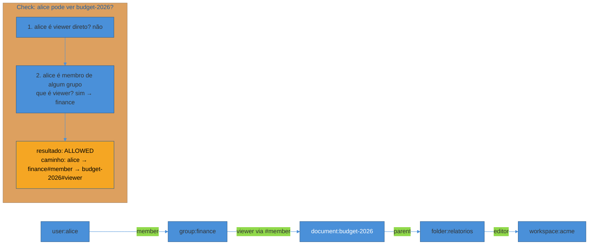
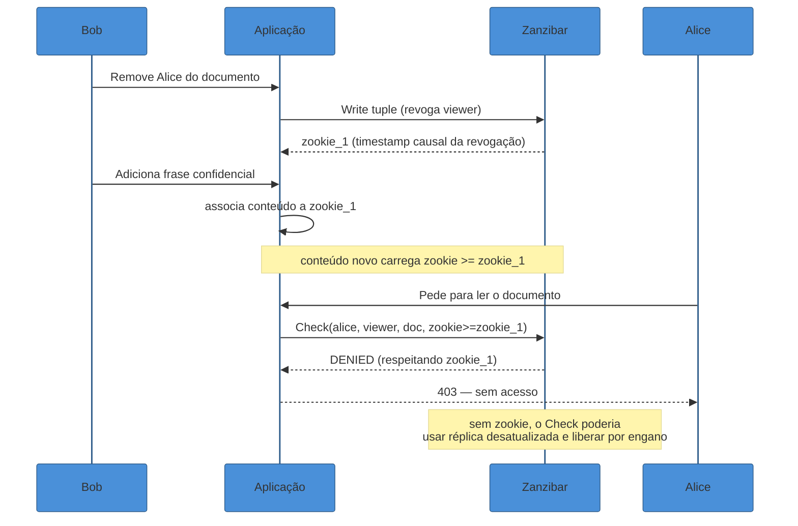
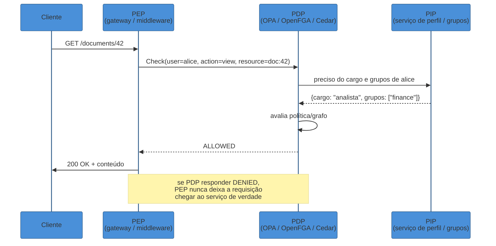
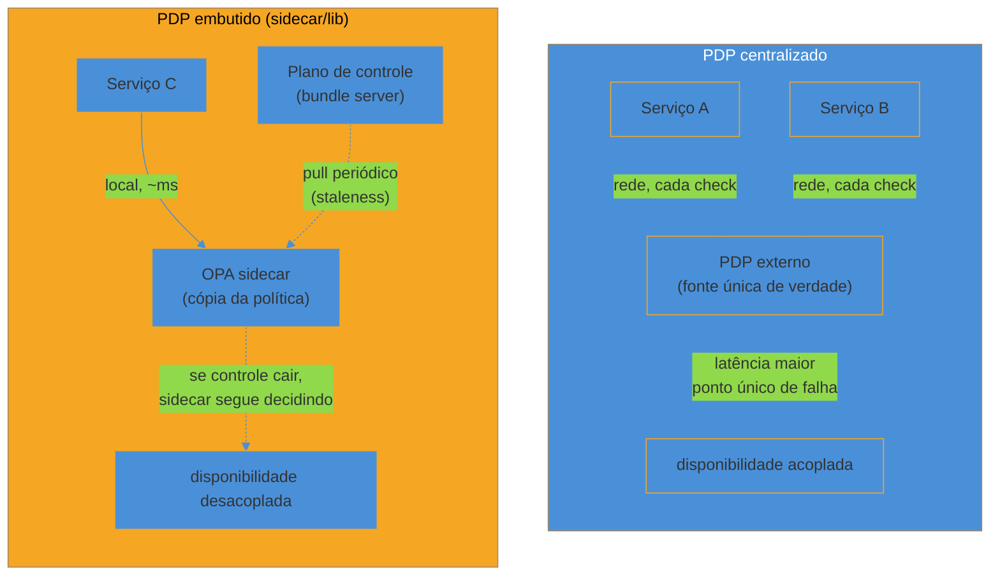

# Fine-grained authorization — Zanzibar e policy-as-code

> [!abstract] TL;DR
> A nota anterior mapeou RBAC, ABAC e ReBAC como três modelos de decisão de autorização. Esta nota entra no motor de dois deles em produção real. Primeiro, o **ReBAC estilo Zanzibar**: o paper que o Google publicou em 2019 descrevendo como Drive, Docs, Photos e YouTube respondem bilhões de perguntas "pode X fazer Y no objeto Z?" por segundo, com latência de milissegundos, usando um modelo brutalmente simples — tudo é uma **tupla de relação** (`objeto#relação@usuário`) guardada num grafo, e "pode" vira "existe caminho no grafo até essa tupla". O problema difícil não é o modelo, é a **consistência**: como garantir que revogar acesso a um documento não deixe uma janela onde o usuário removido ainda vê conteúdo novo — o **"new enemy problem"** — sem pagar o preço de consultar o estado mais recente do mundo inteiro a cada checagem. A resposta do Zanzibar são os **zookies**, tokens que carregam um carimbo de causalidade. Depois, o outro eixo do fine-grained: **policy-as-code** com **OPA/Rego** e **Cedar** (AWS) — em vez de um grafo de relações, uma política declarativa que avalia atributos de contexto contra regras versionadas como código. E o corte que atravessa os dois mundos: a decisão de autorização mora **centralizada** (um serviço PDP que todo o resto consulta pela rede) ou **embutida** (biblioteca ou sidecar rodando junto do serviço que decide)? A resposta certa depende de quanto você consegue tolerar de latência de rede contra quanto você consegue tolerar de dado desatualizado — o mesmo trade-off CAP que já apareceu em [[03-Dominios/Engenharia/System Design/index|System Design]], agora aplicado à pergunta "esse usuário pode fazer isso agora?".

> [!question]- Perguntas que esta nota responde
> - O que é uma relation tuple, e como um grafo de tuplas resolve "Alice pode editar o documento X porque X está numa pasta que o time dela pode editar" sem uma tabela de permissões explícita para cada combinação?
> - O que é o "new enemy problem" e por que resolvê-lo exige mais que só "consultar o banco mais recente"?
> - Qual a diferença prática entre modelar autorização como grafo de relações (Zanzibar/OpenFGA/SpiceDB/Keto) e como política declarativa (OPA/Rego, Cedar)?
> - Quando vale a pena rodar o PDP como serviço centralizado, e quando ele deve virar biblioteca ou sidecar embutido no processo que pergunta?

## O problema que a resposta ingênua não escala

A nota [[01 - RBAC, ABAC e ReBAC — os três modelos|01]] já mostrou o limite do RBAC puro: papéis fixos (`admin`, `editor`, `viewer`) não capturam bem autorização que depende da **estrutura do recurso** — "Alice pode editar este documento porque ele está numa pasta compartilhada com o time dela, que por sua vez herda de um workspace onde ela é membro". Modelar isso com RBAC put uma explosão de papéis (`editor-da-pasta-42`, `viewer-do-workspace-7`) que não escala além de dezenas de recursos. A resposta ingênua seguinte é "então guardamos uma tabela de permissões, uma linha por (usuário, recurso, ação)" — funciona até o produto ter herança (pasta → subpasta → documento), grupos (usuário → time → permissão) e bilhões de recursos. Nesse ponto a tabela vira um grafo disfarçado, e a pergunta certa passa a ser: **como representar esse grafo de forma que "Alice pode editar X?" seja uma consulta rápida, e não uma travessia recursiva a cada request?**

Foi exatamente esse problema que o Google resolveu internamente, e documentou publicamente em 2019 no paper apresentado no USENIX ATC: *Zanzibar: Google's Consistent, Global Authorization System*[^zanzibar-paper]. Zanzibar não é um produto que se instala — é a descrição de uma arquitetura que hoje serve como autorização unificada para Drive, Docs, Calendar, Photos, YouTube e dezenas de outros serviços do Google, respondindo bilhões de checagens de autorização por dia, escalando para trilhões de objetos e milhões de requisições de checagem por segundo, com latência na casa dos milissegundos mesmo no percentil 95[^zanzibar-scale]. A influência do paper no mercado foi imediata: praticamente toda ferramenta de autorização fine-grained lançada depois de 2019 — OpenFGA, SpiceDB, Ory Keto, Permify — se descreve como "inspirada no Zanzibar", da mesma forma que bancos distribuídos pós-2012 se descrevem como "inspirados no Spanner".

## O modelo: tudo é uma tupla de relação

A ideia central do Zanzibar é desconcertantemente simples de enunciar e reveladoramente difícil de operar em escala. Toda permissão do sistema — não importa o produto, não importa o tipo de recurso — vira um fato atômico chamado **relation tuple**, no formato:

```
⟨objeto⟩ # ⟨relação⟩ @ ⟨usuário⟩
```

Por exemplo: `document:budget-2026#viewer@user:alice` significa "Alice tem a relação `viewer` com o documento `budget-2026`". Até aqui, é uma ACL comum — uma lista de quem pode o quê em cada objeto. A parte que torna o modelo poderoso é que o `usuário` de uma tupla pode ser, ele mesmo, um **conjunto definido por outra relação** — um "userset". Em vez de listar cada membro de um time individualmente em cada documento, uma tupla pode dizer:

```
document:budget-2026#viewer@group:finance#member
```

"Todo membro (`member`) do grupo `finance` é `viewer` do documento `budget-2026`." Agora a pergunta "Alice pode ver o documento?" não é mais um lookup direto — é uma **travessia de grafo**: existe um caminho de `alice` até `document:budget-2026#viewer` passando por `group:finance#member`? Esse mecanismo, que o paper chama de *userset rewrite*, é o que permite expressar herança de pasta, membership de grupo aninhado, e papéis derivados (editor implica viewer) sem duplicar dado — a estrutura organizacional inteira vira grafo, e "autorizado" vira "alcançável"[^zanzibar-userset].



Um **check** — a operação central de Zanzibar — recebe `(objeto, relação, usuário)` e responde `ALLOWED`/`DENIED` fazendo essa travessia. O truque de engenharia que torna isso viável em escala planetária não é o algoritmo do grafo em si (busca em grafo é um problema clássico) — é fazer essa travessia em milissegundos sobre trilhões de tuplas, distribuídas globalmente, com um índice construído sobre o Spanner do Google (banco com consistência forte e relógios sincronizados via TrueTime)[^zanzibar-spanner]. Além do `Check`, o paper define outras operações centrais: `Expand` (lista todos os usuários que satisfazem uma relação, útil para exibir "quem tem acesso" numa UI), `Read` (lê tuplas cruas) e `Write` (escreve/revoga tuplas com garantias transacionais)[^zanzibar-ops].

## O "new enemy problem" e por que consistência é o problema difícil

Se o modelo de tuplas fosse tudo, Zanzibar seria "só" um banco de grafo com uma API de check. O que torna o paper interessante — e é a parte que qualquer engenheiro sênior deveria saber explicar — é o problema de **consistência causal** que aparece assim que o sistema precisa ser rápido *e* correto ao mesmo tempo.

Imagine o cenário: Bob está editando um documento compartilhado com Alice. Bob decide que o conteúdo é sensível demais e **remove** Alice da lista de acesso. Um segundo depois, Bob adiciona uma frase confidencial ao documento. Se o sistema de autorização, por qualquer motivo — cache desatualizado, réplica atrasada, race condition entre a escrita da ACL e a leitura da nova checagem — responder "Alice ainda pode ver" usando um snapshot de permissões anterior à remoção, Alice acaba lendo conteúdo que Bob explicitamente decidiu esconder dela. Esse é o **"new enemy problem"**, batizado assim porque o cenário canônico do paper é justamente "removi meu inimigo do documento, e ele ainda consegue ver o que escrevo depois"[^new-enemy]. A causa raiz não é "o sistema está lento" — é que duas operações causalmente relacionadas (revogar acesso, depois escrever conteúdo novo) podem ser observadas **fora de ordem** por um leitor, se o sistema de autorização não amarrar explicitamente a ordem causal entre elas.

A saída ingênua — "sempre leia o estado mais recente, sem cache, direto do banco primário" — resolve a correção mas mata a performance: forçar toda checagem de autorização a esperar a réplica mais atualizada do planeta inteiro elimina justamente a vantagem de ter réplicas geograficamente distribuídas perto do usuário. Zanzibar resolve isso com um mecanismo chamado **zookie**: um token opaco que codifica um **timestamp causal** — não um relógio de parede comum, mas uma marca gerada pelo Spanner que captura "este zookie é posterior a esta escrita específica de ACL, com garantia de ordenação global"[^zookie-def]. Quando o cliente escreve conteúdo novo depois de mudar uma permissão, ele associa esse conteúdo ao zookie daquela escrita de ACL. Quando alguém depois pede para ver o conteúdo, a aplicação passa esse mesmo zookie de volta ao Zanzibar na checagem — instruindo-o: "responda usando um snapshot **pelo menos tão fresco quanto** este momento, nunca mais antigo". Essa semântica de "at-least-as-fresh" é o que permite ao Zanzibar continuar servindo a maioria das checagens de réplicas locais rápidas (sem esperar consenso global toda vez), reservando a espera por consistência forte só para o caso em que existe uma dependência causal explícita a respeitar[^zookie-atleast].



> [!question]- Por que não simplesmente invalidar todo cache a cada escrita?
> Porque "todo cache" num sistema do tamanho do Google significa réplicas em múltiplos continentes, e invalidação síncrona global custa exatamente a latência que o design inteiro existe para evitar. O zookie é uma solução mais cirúrgica: ele não exige que *todas* as checagens usem dado fresco, só as que têm uma dependência causal explícita com uma escrita recente — a maioria das checagens do mundo (permissões que não mudaram há dias) continua sendo servida de réplicas locais rápidas, sem penalidade nenhuma.

## As implementações: OpenFGA, SpiceDB, Ory Keto

O paper Zanzibar descreve uma arquitetura interna do Google, não um software que se baixa. O que o mercado construiu depois de 2019 foram implementações open-source do mesmo modelo conceitual — tuplas, grafo de relações, check — adaptadas para rodar fora da infraestrutura do Google (sem Spanner, sem TrueTime).

**OpenFGA** é a implementação mantida pela CNCF, originada na Auth0/Okta e promovida a **projeto Incubating da CNCF em outubro de 2025**[^openfga-cncf] — o mesmo estágio de maturidade em que já estão projetos como OPA e Envoy, um sinal de adoção real e governança madura, ainda um degrau abaixo de "Graduated". OpenFGA modela autorização com uma linguagem de definição de tipos (equivalente ao DSL de tuplas do Zanzibar), como neste exemplo simplificado de um sistema de documentos com times:

```
model
  schema 1.1

type user

type group
  relations
    define member: [user]

type document
  relations
    define owner: [user]
    define viewer: [user, group#member]
    define editor: [user, group#member] or owner
```

Esse modelo diz: um `document` tem um `owner` (usuário direto), um `viewer` que pode ser um usuário direto ou qualquer `member` de um `group`, e um `editor` que segue a mesma regra **ou** é o próprio `owner` — a palavra `or` compõe relações, exatamente como o *userset rewrite* do paper original. Escrever uma tupla e checar fica assim, na API:

```
# escreve a relação
POST /stores/{id}/write
{ "writes": { "tuple_keys": [
  { "user": "group:finance#member", "relation": "viewer", "object": "document:budget-2026" }
]}}

# checa
POST /stores/{id}/check
{ "tuple_key": {
    "user": "user:alice", "relation": "viewer", "object": "document:budget-2026"
}}
# → { "allowed": true }
```

**SpiceDB**, da AuthZed (empresa fundada por ex-engenheiros do Google que trabalharam em sistemas de autorização internos), é a implementação que mais se declara "Zanzibar-purista" — sua linguagem de schema e o CLI `zed` seguem de perto a terminologia do paper original (inclusive achando ecos diretos de zookies no conceito de *ZedTokens*, usados para a mesma finalidade de consistência causal)[^spicedb-zed]. **Ory Keto** é a implementação da Ory (mesma empresa por trás do Ory Hydra/Kratos, mencionados na trilha de OIDC), com foco em simplicidade operacional e integração com o resto do stack Ory; produção documentada com p95 abaixo de 10ms e disponibilidade acima de 99.99%[^keto-perf]. **Permify** é uma quarta opção, com DSL própria compatível com RBAC/ReBAC/ABAC simultaneamente, recentemente adquirida pela FusionAuth (a Community Edition open-source segue mantida)[^permify-fusionauth].

Na prática, a escolha entre essas quatro (mais opções comerciais como Auth0 FGA, construído sobre OpenFGA) raramente é sobre qual "implementa Zanzibar melhor" — todas resolvem o mesmo problema central. É sobre ecossistema (OpenFGA para quem já usa Auth0/Okta), maturidade de governança (CNCF Incubating pesa para adoção enterprise), operação (Keto para quem já roda Ory) e developer experience (Permify se posiciona nisso). O ponto conceitual que importa reter é: **todas usam o mesmo modelo de tuplas + travessia de grafo**, e todas precisam resolver alguma variante do new enemy problem — só muda o nome do token de consistência (zookie no paper, ZedToken no SpiceDB).

## O outro eixo: policy-as-code com OPA/Rego e Cedar

ReBAC estilo Zanzibar resolve muito bem um tipo específico de pergunta: "existe um caminho de relacionamentos entre este usuário e este recurso?". Mas nem toda decisão de autorização é sobre relacionamento — muitas são sobre **regras de negócio sobre atributos**: "aprovar esta despesa só se o valor for menor que o limite do cargo do solicitante **e** for horário comercial **e** o solicitante não estiver na lista de suspensos **e** a região da requisição não for uma sancionada". Isso é o terreno do ABAC que a nota anterior já introduziu conceitualmente — e o jeito de escrever essas regras em produção, hoje, é **policy-as-code**: a política vira um artefato versionado, testado e revisado como qualquer outro código, em vez de configuração espalhada em `if`s no meio da lógica de negócio.

**Open Policy Agent (OPA)**, projeto graduado da CNCF, é o motor de policy-as-code mais adotado do mercado[^opa-cncf]. Sua ideia central é **desacoplar a decisão da aplicação**: o serviço que precisa autorizar algo não implementa a lógica de autorização — ele monta um documento JSON descrevendo o contexto da requisição (quem está pedindo, o quê, sobre qual recurso) e pergunta a OPA, que avalia esse input contra políticas escritas em **Rego**, uma linguagem declarativa desenhada especificamente para expressar regras sobre dados hierárquicos em JSON[^opa-rego]. Uma política mínima em Rego para o exemplo de aprovação de despesa:

```rego
package expenses.authz

import rego.v1

default allow := false

allow if {
    input.action == "approve"
    input.expense.amount <= input.user.approval_limit
    is_business_hours
    not input.user.id in input.suspended_users
}

is_business_hours if {
    hour := time.clock(time.now_ns())[0]
    hour >= 9
    hour < 18
}
```

A aplicação chama OPA com um `input` contendo `action`, `expense`, `user` e `suspended_users`, e recebe de volta `{"allow": true}` ou `{"allow": false}` — a lógica de negócio nunca precisa saber *como* a decisão foi tomada, só consumir o resultado. Essa separação é o que torna OPA aplicável muito além de autorização de aplicação: o mesmo motor decide admissão de pods no Kubernetes, política de rede, compliance de infraestrutura como código — em todos os casos, a pergunta é a mesma forma ("este input, contra estas regras, é permitido?"), só muda o domínio do input.

**Cedar**, lançado pela AWS em 2023 e open-source desde o início, ataca o mesmo problema com um design diferente: em vez de uma linguagem geral (Rego serve para qualquer política, não só autorização), Cedar é **propositalmente restrito ao domínio de autorização**, modelando toda política em torno de quatro elementos fixos — `principal`, `action`, `resource`, `context` (o modelo **PARC**)[^cedar-parc]. Essa restrição deliberada tem uma motivação de segurança: uma linguagem mais estreita é mais fácil de analisar formalmente — o Cedar foi desenhado com verificação formal (provas matemáticas de propriedades como "esta política nunca permite X") como requisito de primeira classe, algo que uma linguagem geral como Rego não se propõe a garantir[^cedar-formal]. Uma política Cedar equivalente ao exemplo acima:

```cedar
permit(
    principal,
    action == Action::"approve",
    resource
)
when {
    resource.amount <= principal.approvalLimit &&
    context.hour >= 9 && context.hour < 18
}
unless {
    principal in SuspendedUsers
};
```

A AWS oferece Cedar como serviço gerenciado via **Amazon Verified Permissions**, que atualizou em maio de 2026 para suportar múltiplos namespaces por política[^avp-namespaces]. A escolha entre OPA/Rego e Cedar raramente é "qual é mais poderoso" — Rego é estritamente mais expressivo, porque é uma linguagem de propósito geral. É sobre o trade-off entre **flexibilidade** (Rego, que serve para qualquer decisão booleana sobre JSON, dentro ou fora do domínio de autorização) e **auditabilidade formal + foco** (Cedar, desenhado para que engenheiros de segurança consigam raciocinar sobre o que uma política *não* permite, com garantias mais fortes).

> [!warning] Confundir "policy-as-code" com "ReBAC" como concorrentes diretos
> Não são a mesma pergunta. Zanzibar/OpenFGA/SpiceDB respondem "existe uma relação entre este usuário e este recurso?" — modelagem de grafo, ótima para hierarquia e compartilhamento. OPA/Cedar respondem "este contexto satisfaz esta regra?" — modelagem de atributos e lógica de negócio. Sistemas reais de porte combinam os dois: ReBAC decide "Alice tem acesso ao documento" (via herança de pasta/grupo), e uma política ABAC decide, em cima disso, "mas só pode editar em horário comercial e não pode aprovar despesas acima do próprio limite". Tratar como escolha exclusiva é perder a composição que o mercado de fato usa.

## PEP, PDP, PIP: o vocabulário que atravessa todas as implementações

Independente de a decisão vir de um grafo de tuplas ou de uma política Rego/Cedar, toda arquitetura de autorização fine-grained se organiza nos mesmos três papéis, formalizados décadas atrás no padrão **XACML** (eXtensible Access Control Markup Language) e reaproveitados por todas as ferramentas modernas mesmo quando não usam XACML em si[^xacml-roles]:

- **PEP (Policy Enforcement Point)** — o ponto no sistema que efetivamente **intercepta** a requisição e aplica a decisão: nega, permite, ou filtra. É o gateway, o middleware, o filtro no código da aplicação. O PEP não sabe *por que* algo é permitido — ele só sabe pedir a decisão e obedecer.
- **PDP (Policy Decision Point)** — o motor que **avalia** a política e responde `allow`/`deny`. É o OPA, o Zanzibar/OpenFGA/SpiceDB, o Cedar/Verified Permissions. O PDP é onde a lógica de negócio de autorização de fato mora.
- **PIP (Policy Information Point)** — a fonte dos **atributos** que faltam para a decisão: se a política precisa saber o cargo do usuário, ou se ele está numa lista de suspensos, e essa informação não veio na requisição original, o PDP consulta um PIP (tipicamente um serviço de identidade, um banco de perfil, ou um cache de atributos) para completar o quadro antes de decidir[^xacml-pip].



Vale notar que esse vocabulário é mais antigo que Zanzibar — nasceu no padrão XACML dos anos 2000, junto com um **PAP** (Policy Administration Point, onde políticas são criadas/editadas) e um **PRP** (Policy Retrieval Point, onde ficam armazenadas)[^xacml-pap-prp]. XACML como *linguagem* praticamente não se usa mais em sistemas novos — é verboso em XML, difícil de testar, difícil de raciocinar. Mas a **separação de papéis** que ele formalizou sobreviveu e é exatamente a arquitetura que OPA, OpenFGA e Cedar implementam por baixo de sintaxes modernas. Quando alguém em entrevista pergunta "como você desenharia autorização fine-grained para este sistema?", nomear PEP/PDP/PIP explicitamente sinaliza que você entende a arquitetura, não só a ferramenta da vez.

## O trade-off arquitetural: PDP centralizado vs embutido

Toda essa maquinaria de decisão precisa rodar em algum lugar, e a pergunta de onde tem consequências de latência, disponibilidade e consistência que valem a pena decompor.

**PDP centralizado (serviço externo)** — um serviço de autorização dedicado que todos os outros serviços consultam pela rede a cada checagem. É o modelo mais próximo do Zanzibar original (um cluster dedicado que Drive, Docs e YouTube consultam) e como a maioria roda OpenFGA/SpiceDB/Keto em produção: um serviço, uma fonte de verdade, atualizações de política/tupla propagam para um único lugar.

- *Vantagem*: consistência mais simples de raciocinar (um lugar só guarda o estado), auditoria centralizada, uma única superfície para revogar acesso instantaneamente.
- *Custo*: cada checagem é uma chamada de rede. Um serviço externo tende a ter maior latência e menor disponibilidade que uma biblioteca, porque a aplicação precisa esperar uma resposta sobre a rede — se o serviço de autorização cair ou ficar lento, toda decisão que depende dele trava junto[^aserto-tradeoff].

**PDP embutido (biblioteca ou sidecar)** — a lógica de decisão roda no mesmo processo (biblioteca linkada) ou no mesmo pod (sidecar, comunicando por socket Unix ou `localhost`) do serviço que pergunta. É o padrão canônico do **OPA-Envoy**: o Envoy intercepta o tráfego HTTP do serviço, e faz uma chamada gRPC local ao container OPA vizinho antes de deixar a requisição passar — sem hop de rede real, decisão em microssegundos a poucos milissegundos[^opa-envoy-perf].

- *Vantagem*: latência mínima (sem rede), e — crucialmente — **disponibilidade desacoplada**: se o plano de controle central (onde políticas são escritas/publicadas) cair, o sidecar continua decidindo com a última política/bundle que baixou, em vez de travar a aplicação inteira.
- *Custo*: a política/dado que o sidecar usa é, por definição, uma **cópia** — ela pode estar desatualizada em relação à fonte de verdade central por segundos a minutos, dependendo de quão frequente é o *pull* do bundle. Isso reintroduz exatamente o tipo de problema que o zookie do Zanzibar existe para resolver: se alguém revoga acesso agora, quanto tempo até todo sidecar espalhado pela frota saber disso?



Na prática, sistemas grandes convergem para um **modelo híbrido**: a fonte de verdade das políticas/tuplas mora centralizada (um plano de controle único, auditável, onde mudanças de acesso são escritas), mas a **avaliação** roda embutida perto de cada serviço, sincronizada por push/pull de bundles ou réplicas locais — exatamente o padrão que o OPA formaliza com seus *bundle servers* e que ferramentas como Permit.io empacotam como PDP distribuído[^permit-hybrid]. É a mesma lógica do CAP theorem aplicada aqui: você escolhe entre **latência baixa com staleness aceitável** (embutido) e **consistência forte com latência de rede** (centralizado) — não existe opção que dá as duas coisas de graça, e a escolha certa depende de quão crítico é "revogar e ver efeito instantâneo" versus "responder em menos de 5ms sempre".

> [!warning] Tratar staleness do PDP embutido como "bug" em vez de trade-off assumido
> Um sidecar que decide com política de 30 segundos atrás **não é um erro de implementação** — é a consequência inevitável de trocar consistência forte por disponibilidade e latência. O erro real é não decidir *conscientemente* qual staleness máxima o produto tolera. Para a maioria das permissões (que mudam raramente), segundos de atraso são irrelevantes. Para casos sensíveis — revogar acesso de um funcionário demitido, banir um usuário abusivo — staleness de minutos é inaceitável, e a resposta correta não é "abandonar o modelo embutido", é ter um canal de invalidação de emergência (push explícito, não só pull periódico) para esses casos específicos.

## Em entrevista

Autorização fine-grained é um tema onde entrevistadores seniores testam se o candidato distingue **modelo de dados** (como a permissão é representada) de **arquitetura de decisão** (onde e como ela é avaliada) — dois eixos independentes que candidatos menos experientes costumam confundir num só "eu usaria RBAC" genérico.

Uma resposta fraca para "como você desenharia autorização para um SaaS B2B com hierarquia de pastas e times?" seria: "eu usaria roles, tipo admin/editor/viewer." Isso não explica como herança funciona, nem o que acontece quando o produto cresce e times viram aninhados. Uma resposta forte reconhece que esse é um problema de **grafo de relacionamentos**: "eu modelaria como tuplas objeto-relação-usuário, estilo Zanzibar — um documento herda viewers da pasta, que herda de um workspace, e a checagem vira uma travessia de grafo. Usaria OpenFGA ou SpiceDB em vez de reimplementar isso, porque o problema difícil não é o modelo, é fazer essa travessia rápida e consistente em escala — e ambos já resolveram o 'new enemy problem' que aparece quando revogação e leitura de conteúdo novo podem ficar fora de ordem."

> **Entrevistador:** "Por que você não simplesmente cacheia o resultado de cada checagem de autorização por alguns segundos? Resolveria a latência sem toda essa complexidade de zookie/consistência."
>
> **Resposta fraca:** "Cache é sempre bom para performance, eu colocaria um TTL curto."
>
> **Resposta forte:** "Cache sem controle de causalidade reintroduz exatamente o new enemy problem — se eu revogo o acesso de alguém e, no mesmo segundo, escrevo conteúdo sensível, um cache de alguns segundos pode servir a checagem antiga e vazar o conteúdo novo pra pessoa removida. O ponto do zookie não é 'evitar cache', é permitir cache **seguro**: o token carrega a informação de causalidade necessária pra saber quando uma checagem específica *precisa* de dado fresco versus quando pode usar réplica local. Cachear sem esse mecanismo troca performance por um bug de segurança silencioso — que só aparece quando alguém audita e descobre que revogação não foi imediata."

Essa resposta demonstra que o candidato entende consistência causal como parte do *problema de autorização em si*, não como um detalhe de infraestrutura desconectado — é a mesma distinção que separa "sei usar OpenFGA" de "entendo por que OpenFGA existe".

## How to explain it in English

> "Fine-grained authorization has two independent axes. The first is the data model: relationship-based access control, popularized by Google's Zanzibar paper, represents every permission as a relation tuple — object, relation, user — and answering 'can Alice edit this?' becomes a graph traversal. The hard part isn't the model, it's consistency: revoking access and then writing new content can be observed out of order by a stale reader, the 'new enemy problem' — Zanzibar solves it with zookies, tokens that carry a causal timestamp so checks can demand 'at least as fresh as this write' without paying for global consistency on every single check. The second axis is policy-as-code — OPA/Rego or AWS Cedar — which decides based on attributes and business rules rather than graph relationships. Every implementation of either model organizes around the same three roles: a PEP that enforces the decision, a PDP that computes it, and a PIP that supplies missing attributes. And the architectural question that cuts across both is where the PDP lives — centralized, trading latency for a single source of truth, or embedded as a sidecar, trading a small amount of staleness for latency in the low milliseconds and decoupled availability."

| PT | EN |
|----|----|
| Tupla de relação | Relation tuple |
| Modelo de dados relacional (grafo) | Relationship-based access control (ReBAC) |
| Reescrita de conjunto de usuários | Userset rewrite |
| Problema do novo inimigo | New enemy problem |
| Ponto de decisão de política | Policy Decision Point (PDP) |
| Ponto de aplicação de política | Policy Enforcement Point (PEP) |
| Ponto de informação de política | Policy Information Point (PIP) |
| Política como código | Policy as code |
| Consistência causal | Causal consistency |
| Serviço de autorização centralizado | Centralized authorization service |
| Decisão embutida (sidecar/biblioteca) | Embedded decision (sidecar/library) |
| Dado desatualizado / obsolescência | Staleness |

## O que vem a seguir

Zanzibar e policy-as-code respondem "como o motor de decisão funciona por dentro" — grafo de tuplas ou política declarativa, e onde essa decisão roda. Mas quem usa esse motor num produto B2B real ainda precisa resolver duas camadas acima: **onde termina um tenant e começa outro** (a fronteira de isolamento que qualquer SaaS multi-cliente precisa desenhar), e **como essa decisão entra de fato na cadeia de uma requisição de API** — no gateway, no serviço, ou em ambos. As próximas duas notas do sub-galho fecham exatamente essas lacunas.

- [[03 - Multi-tenancy e organizações]] — tenant como fronteira de identidade: organizações, convites, membership, isolamento por realm/schema
- [[04 - Autorização de API na prática]] — scopes vs permissions vs roles no token, enforcement no gateway vs no serviço, propagação de identidade entre microserviços
- [[01 - RBAC, ABAC e ReBAC — os três modelos|01]] — os três modelos conceituais que esta nota aprofunda no caso ReBAC/policy-as-code

## Fontes

- **USENIX ATC 2019** — [*Zanzibar: Google's Consistent, Global Authorization System*](https://www.usenix.org/system/files/atc19-pang.pdf) — paper original: modelo de tuplas, userset rewrite, zookies, arquitetura sobre Spanner; acessado em 2026-07-11.
- **AuthZed** — [*An Introduction to Google Zanzibar and Relationship-Based Authorization Control*](https://authzed.com/learn/google-zanzibar) — leitura consolidada do modelo e sua influência no mercado; acessado em 2026-07-11.
- **AuthZed** — [*Enforcing Causal Ordering in Distributed Systems: The Importance of Permissions Checking*](https://authzed.com/blog/new-enemies) — explicação aprofundada do new enemy problem e zookies; acessado em 2026-07-11.
- **AuthZed Docs** — [*Google Zanzibar*](https://authzed.com/docs/spicedb/concepts/zanzibar) — mapeamento dos conceitos do paper para SpiceDB (ZedToken); acessado em 2026-07-11.
- **CNCF** — [*OpenFGA Becomes a CNCF Incubating Project*](https://www.cncf.io/blog/2025/11/11/openfga-becomes-a-cncf-incubating-project/) — status de maturidade, outubro de 2025; acessado em 2026-07-11.
- **OpenFGA Docs** — [*Concepts*](https://openfga.dev/docs/concepts) e [*Perform a Check*](https://openfga.dev/docs/getting-started/perform-check) — modelo de tipos, DSL, Check API; acessado em 2026-07-11.
- **AuthZed** — [*SpiceDB*](https://authzed.com/spicedb) e [*Schema Language Reference*](https://authzed.com/docs/spicedb/concepts/schema) — schema e ferramenta `zed`; acessado em 2026-07-11.
- **Ory** — [*Fine-Grained Access Control & Authorization Server*](https://www.ory.com/keto) — Ory Keto, performance em produção (p95 <10ms); acessado em 2026-07-11.
- **GitHub** — [*Permify*](https://github.com/Permify/permify) — DSL RBAC/ReBAC/ABAC, status pós-aquisição pela FusionAuth; acessado em 2026-07-11.
- **Open Policy Agent** — [*Documentation*](https://www.openpolicyagent.org/docs) — motor de decisão, linguagem Rego, status CNCF Graduated; acessado em 2026-07-11.
- **Open Policy Agent** — [*OPA-Envoy Plugin*](https://www.openpolicyagent.org/docs/envoy) — padrão sidecar/PEP-PDP com Envoy; acessado em 2026-07-11.
- **AWS** — [*What is Cedar?*](https://docs.cedarpolicy.com/) — linguagem, modelo PARC (principal/action/resource/context); acessado em 2026-07-11.
- **AWS Docs** — [*Amazon Verified Permissions and Cedar policy language terms and concepts*](https://docs.aws.amazon.com/verifiedpermissions/latest/userguide/terminology.html) — serviço gerenciado, atualização de namespaces (maio de 2026); acessado em 2026-07-11.
- **Wikipedia** — [*XACML*](https://en.wikipedia.org/wiki/XACML) — arquitetura de referência PEP/PDP/PIP/PAP/PRP; acessado em 2026-07-11.
- **Aserto** — [*Authorization library vs authorization service*](https://www.aserto.com/blog/authorization-library-vs-service) e [*Centralized vs Distributed Authorization*](https://www.aserto.com/blog/centralized-vs-distributed-authorization) — trade-off de latência/disponibilidade entre PDP centralizado e embutido; acessado em 2026-07-11.
- **Permit.io Docs** — [*Permit's PDP (Policy Decision Point)*](https://docs.permit.io/concepts/pdp/overview/) — modelo híbrido de plano de controle central + PDP distribuído; acessado em 2026-07-11.

[^zanzibar-paper]: USENIX ATC 2019, *Zanzibar: Google's Consistent, Global Authorization System* — paper original apresentado por Pang et al. [^zanzibar-scale]: AuthZed, *An Introduction to Google Zanzibar and Relationship-Based Authorization Control* — escala em trilhões de objetos, milhões de checks/segundo. [^zanzibar-userset]: USENIX ATC 2019 — mecanismo de userset rewrite para composição de relações. [^zanzibar-spanner]: USENIX ATC 2019 — arquitetura construída sobre Spanner e TrueTime. [^zanzibar-ops]: USENIX ATC 2019 — operações Check, Expand, Read, Write. [^new-enemy]: AuthZed, *Enforcing Causal Ordering in Distributed Systems* — definição e origem do termo "new enemy problem". [^zookie-def]: USENIX ATC 2019 — definição de zookie como token opaco de timestamp causal. [^zookie-atleast]: AuthZed, *Enforcing Causal Ordering in Distributed Systems* — semântica "at-least-as-fresh". [^openfga-cncf]: CNCF, *OpenFGA Becomes a CNCF Incubating Project*, novembro de 2025. [^spicedb-zed]: AuthZed Docs, *Google Zanzibar* — mapeamento de zookie para ZedToken em SpiceDB. [^keto-perf]: Ory, *Fine-Grained Access Control & Authorization Server* — métricas de produção do Keto. [^permify-fusionauth]: GitHub, Permify — status pós-aquisição pela FusionAuth, Community Edition mantida. [^opa-cncf]: Open Policy Agent, documentação oficial — status de projeto graduado da CNCF. [^opa-rego]: Open Policy Agent, documentação oficial — Rego como linguagem declarativa sobre JSON. [^cedar-parc]: AWS, *What is Cedar?* — modelo principal/action/resource/context. [^cedar-formal]: AWS Docs, Cedar — verificação formal como requisito de design. [^avp-namespaces]: AWS Docs, Amazon Verified Permissions — suporte a múltiplos namespaces, maio de 2026. [^xacml-roles]: Wikipedia, XACML — arquitetura de referência e definição de PEP/PDP. [^xacml-pip]: Wikipedia, XACML — papel do PIP na resolução de atributos faltantes. [^xacml-pap-prp]: Wikipedia, XACML — papéis de PAP (administração) e PRP (armazenamento) de políticas. [^opa-envoy-perf]: Open Policy Agent, *OPA-Envoy Plugin* — padrão sidecar, avaliação local sem hop de rede. [^aserto-tradeoff]: Aserto, *Authorization library vs authorization service* — comparação de latência e disponibilidade. [^permit-hybrid]: Permit.io Docs, *Permit's PDP* — modelo híbrido de plano de controle central com PDP distribuído.
