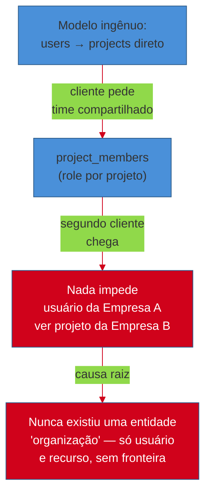
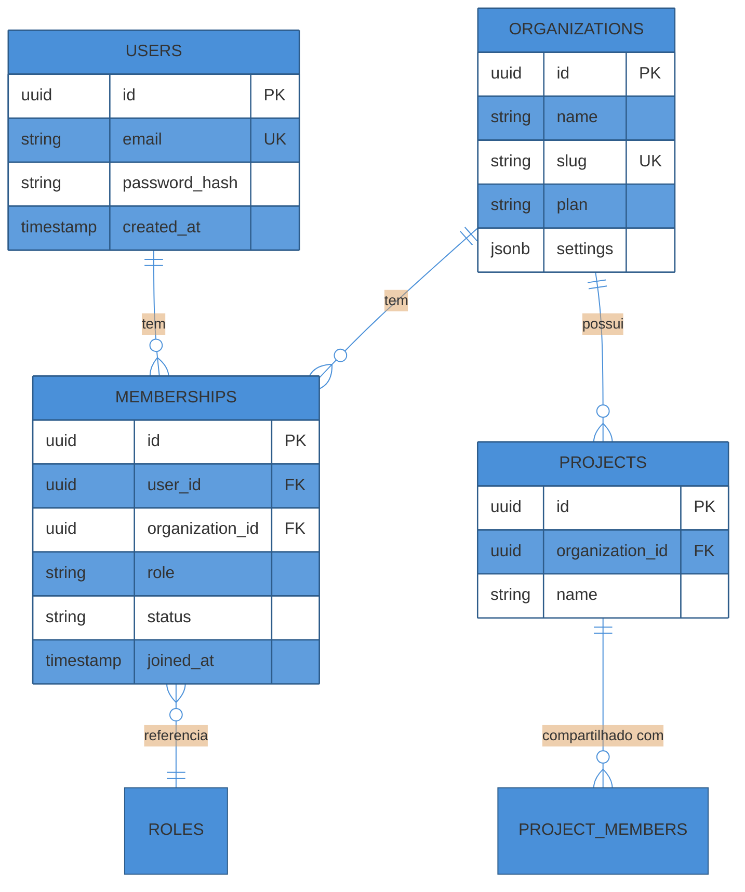
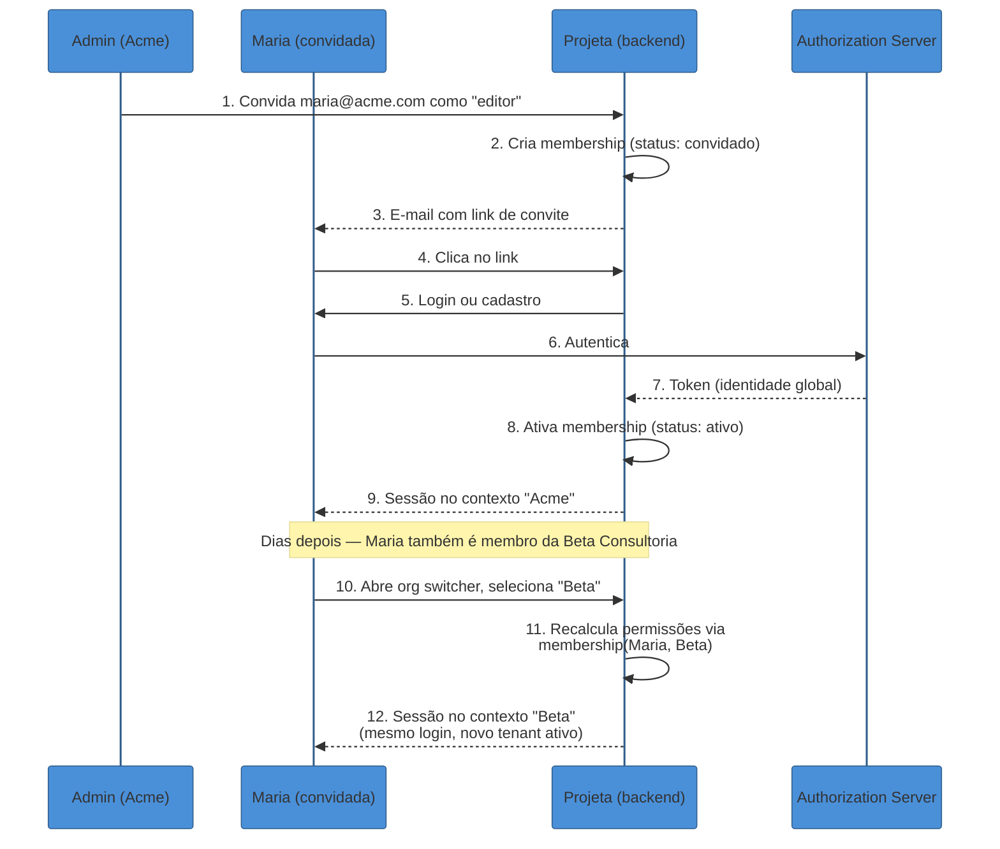
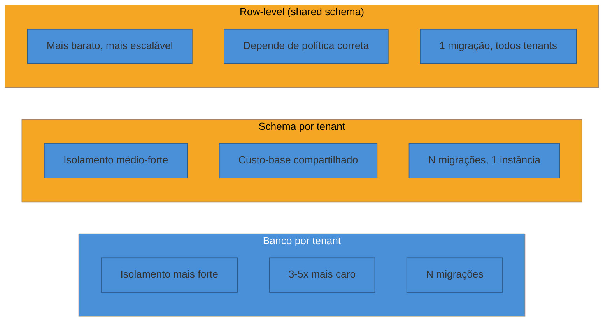
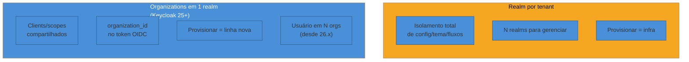
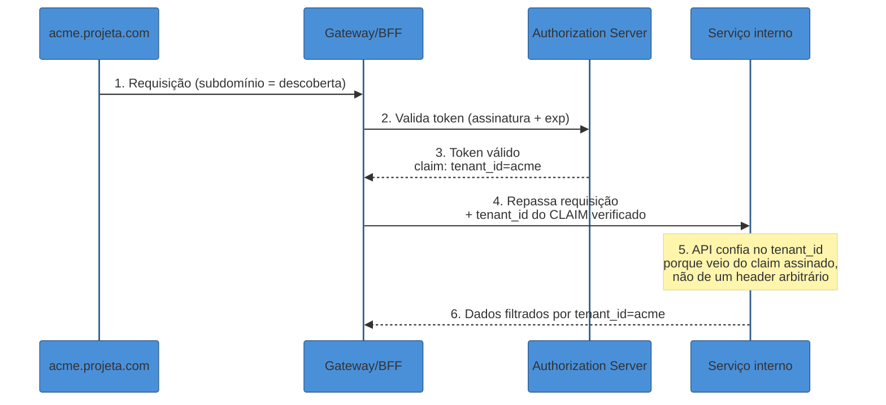

# Multi-tenancy e organizações

> [!abstract] TL;DR
> **Multi-tenancy não é uma feature de infraestrutura — é uma fronteira de identidade.** Antes de decidir "compartilho banco ou não", alguém tem que decidir uma pergunta anterior: **quem é o usuário, em relação a qual empresa, com qual papel?** No SaaS B2B moderno, essa pergunta se resolve com um modelo de **organizações**: uma tabela `users` guarda a identidade global (o e-mail, a credencial), uma tabela `organizations` guarda cada empresa-cliente, e uma tabela `memberships` no meio liga as duas — carregando, por linha, o papel daquele usuário *naquela* organização específica. Esse desenho resolve de saída um problema que trava implementações ingênuas: a mesma pessoa (mesmo e-mail) pode ser **admin** na empresa A e **membro comum** na empresa B, sem duplicar conta e sem colisão. A partir daí, isolamento vira três perguntas distintas e independentes — **onde os dados de cada tenant ficam guardados** (banco por tenant, schema por tenant, ou row-level com discriminador — cada um com seu trade-off de custo, blast radius e operação), **onde a identidade de cada tenant vive** (um realm por tenant, isolamento total mas caro de operar; ou organizações dentro de um único realm, o modelo que o Keycloak adotou a partir da versão 25) e **como o tenant é descoberto e propagado** em cada requisição (subdomínio, claim assinado no token, nunca um header solto e não verificado). Errar a terceira pergunta — confiar em um `X-Tenant-ID` que o cliente manda sem verificação — é a causa mais comum do bug mais perigoso da categoria: o vazamento cross-tenant, onde um token válido para o Tenant A é aceito contra recursos do Tenant B.

> [!question]- Perguntas que esta nota responde
> - Por que "multi-tenancy" é, na raiz, um problema de identidade e não só de banco de dados?
> - Como modelar organizações de forma que o mesmo usuário tenha papéis diferentes em empresas diferentes, sem duplicar conta?
> - Quais são as três estratégias de isolamento de dados (banco/schema/row-level) e quando cada uma vale o custo?
> - Isolar identidade por tenant significa um realm por cliente, ou dá para usar organizações dentro de um realm só?
> - Como o sistema sabe, a cada requisição, "de qual tenant é isso" — e por que confiar cegamente num header é perigoso?

## O problema que a resposta ingênua não vê

Imagine que você está construindo uma ferramenta de gestão de projetos B2B — vamos chamá-la de **Projeta**. A primeira versão, ingênua, tem uma tabela `users` com e-mail e senha, e uma tabela `projects` com um `owner_id` apontando pra `users`. Funciona perfeitamente até o primeiro cliente empresarial ligar dizendo: "queremos que três pessoas do nosso time acessem os mesmos projetos, com permissões diferentes — o gerente edita tudo, o resto só visualiza."

A resposta ingênua é adicionar uma tabela `project_members` ligando `users` a `projects` com um `role`. Isso funciona até o *segundo* cliente aparecer — porque agora dois clientes diferentes, concorrentes entre si, estão compartilhando a mesma base de projetos, e não existe nada no schema que impeça um usuário da Empresa A de, por engano ou má-fé, ver um projeto da Empresa B. O erro de design não foi técnico — foi conceitual: **o modelo de dados nunca reconheceu que existe uma entidade "empresa cliente" que é dona de um conjunto de recursos, e que autenticação sozinha ("quem é você") não responde a pergunta que realmente importa em B2B: "de qual empresa você é, e o que você pode fazer nela?"**

Essa é a distinção que separa autenticação de **autorização multi-tenant**: autenticação prova identidade global (este é o José, dono deste e-mail); autorização multi-tenant precisa de um segundo eixo — o **contexto de tenant** — antes de decidir qualquer coisa. A WorkOS resume isso de forma direta: autenticação multi-tenant é, na prática, um processo de duas fases — primeiro provar quem você é no nível do usuário, depois entrar num **contexto de tenant** que carrega suas próprias regras de autenticação e sua própria tabela de membership[^workos-multitenant-auth]. Sem essa segunda fase explícita, todo o resto do sistema — autorização fina, isolamento de dados, auditoria — herda a ambiguidade.

O resto desta nota resolve essa lacuna: como modelar a organização como cidadã de primeira classe, e como blindar as três camadas onde a fronteira de tenant precisa ser reforçada — dados, identidade e propagação de contexto.

## O modelo de organizações: usuário, organização, membership

O padrão que o mercado convergiu — Slack, GitHub, Notion, Linear, e os provedores de identidade B2B como WorkOS e Auth0 Organizations — não trata "empresa cliente" e "conta de usuário" como a mesma coisa. Em vez disso, usa três entidades e uma tabela de junção:

- **`users`** — identidade global. Um registro por pessoa, com e-mail, credencial (ou vínculo com um provedor externo), e nada de específico a nenhuma empresa.
- **`organizations`** — o tenant. Um registro por empresa-cliente: nome, slug (usado no subdomínio ou na URL), plano de billing, configurações (política de senha, provedores de SSO habilitados).
- **`memberships`** — a tabela de junção que faz a mágica: liga um `user_id` a um `organization_id`, e carrega o **papel daquele usuário especificamente naquela organização** (`role`), além de metadados como data de entrada, quem convidou, status (ativo/convidado/suspenso).

Essa terceira tabela é o que resolve, de saída, o problema que abriu a nota: a mesma pessoa pode ter uma linha em `memberships` como `admin` na Empresa A e outra linha como `viewer` na Empresa B — sem duplicar `users`, sem colisão de e-mail, sem gambiarra. Uma descrição direta desse padrão: "uma tabela `users` guarda a identidade global; uma tabela `organizations` guarda a organização; uma tabela `memberships` carrega o vínculo usuário-organização mais o papel daquele usuário em cada organização — permitindo que a mesma pessoa tenha papéis diferentes em organizações diferentes sem contas duplicadas"[^ssojet-multitenant]. É essencialmente o mesmo desenho relacional que uma solução *many-to-many* clássica de banco de dados, só que aplicado à fronteira mais sensível do sistema: quem pode fazer o quê, em nome de qual empresa.

No exemplo do **Projeta**: o José pode ter uma `membership` como `admin` na organização "Acme Ltda" e outra `membership` como `editor` na organização "Beta Consultoria" — mesmo `user_id`, dois `organization_id` diferentes, dois `role` diferentes. Quando ele faz login, o sistema não pergunta só "quem é você" — pergunta também "em qual organização você está operando agora", e é essa segunda resposta que decide quais projetos aparecem na tela e o que ele pode fazer neles.

### O papel dentro da organização vs. o modelo geral de autorização

Vale abrir um parêntese de fronteira aqui: o `role` guardado em `memberships` é o ponto de entrada — RBAC coarse, do jeito descrito em [[01 - RBAC, ABAC e ReBAC — os três modelos|01]] — mas ele não substitui autorização fina por recurso. "Admin da Acme" decide o que a pessoa pode fazer *na organização como um todo* (convidar gente, mudar billing, ver todos os projetos); se o **Projeta** precisar de regras tipo "este usuário só pode editar *este* projeto específico, mesmo sendo `viewer` no resto da org", isso é autorização relacional — Zanzibar/ReBAC, coberta em [[02 - Fine-grained authorization — Zanzibar e policy-as-code|02]]. O padrão de mercado em 2026, como já estabelecido nessas notas anteriores, é híbrido: **RBAC coarse por organização** (o que este `role` resolve) **+ ReBAC fine-grained por recurso** quando o produto exige granularidade abaixo do nível de organização.

## Convite, onboarding e o org switcher

O fluxo de entrada num modelo de organizações tem uma característica que o modelo de usuário único não tem: **alguém de dentro da organização convida, o convidado não se autocadastra do zero**. Um administrador da Acme convida `maria@acme.com` para o **Projeta**; o sistema manda um e-mail com um link de convite; ao clicar, a Maria é guiada por login ou cadastro e automaticamente adicionada à organização certa, sem precisar descobrir manualmente "qual é a URL da conta da minha empresa"[^workos-onboarding]. Esse fluxo resolve dois problemas de uma vez: elimina a fricção de "cadastro genérico + depois vincular à empresa certa" (que costuma vazar usuários — a pessoa cadastra, esquece de entrar no fluxo de vínculo, e nunca mais volta), e garante que o `role` inicial já vem definido por quem convidou, não por autoatribuição.

Padrões que aparecem em produtos maduros de 2026 valem menção porque resolvem fricções reais de escala: convite em lote via CSV para onboarding de times inteiros de uma vez (em vez de convidar um por um); links de convite "mágicos" reutilizáveis, compartilháveis por qualquer canal, sem precisar coletar e-mail individual antes; e provisionamento **JIT (Just-In-Time)** via SSO — quando a organização já usa SAML/OIDC corporativo, o primeiro login de um funcionário já cria a conta e a membership automaticamente, sem convite manual algum, porque a autenticação bem-sucedida contra o IdP da empresa já é prova suficiente de pertencimento[^workos-onboarding-jit]. O provisionamento via **SCIM**, que sincroniza altas e baixas de funcionários automaticamente a partir do diretório da empresa cliente, fecha esse ciclo — mas isso é assunto da nota [[06 - SSO corporativo — SAML, federação e SCIM|06]] do sub-galho anterior, não repetido aqui.

O outro lado da moeda — o usuário que já pertence a várias organizações, como a Maria do exemplo, ou como qualquer pessoa que usa Slack ou Notion profissionalmente e tem uma conta pessoal separada — é o **org switcher**: uma UI (geralmente um dropdown no topo da aplicação) que troca o contexto ativo sem exigir novo login. O Slack deixa a pessoa alternar entre workspaces a partir de um ícone dedicado, mantendo sessões simultâneas; o Notion resolve de forma parecida, com um seletor de workspace que também dá acesso a "Manage organization" quando aplicável[^workos-slack-notion]. Tecnicamente, trocar de organização é trocar **qual token/sessão está ativo** — não um novo login contra o IdP (a pessoa já provou quem é), mas uma nova emissão de token com um `organization_id`/`tenant_id` diferente embutido, e com o conjunto de permissões recalculado a partir da `membership` daquela organização específica.

> [!question]- E se a Maria for demitida da Acme, mas continuar na Beta Consultoria?
> É exatamente aqui que o modelo de `memberships` separado paga seu preço de design: revogar acesso é **desativar (ou deletar) uma linha específica de `membership`** — `(maria, acme)` — sem tocar em `users` nem nas outras memberships dela. Se identidade e organização estivessem fundidas numa conta só por empresa (o antipadrão que a Azure AD documentação alerta explicitamente[^azure-identity-considerations]), desprovisionar a Maria da Acme exigiria cuidado redobrado para não afetar, por engano, o acesso dela à Beta — o tipo de acoplamento acidental que vira incidente de segurança.

## Isolamento, eixo 1: onde os dados ficam

Resolvido o modelo de identidade — quem pertence a qual organização, com qual papel — sobra a pergunta de infraestrutura: como garantir, na camada de dados, que a Acme nunca vê uma linha da Beta? Três estratégias dominam, e a escolha entre elas é uma decisão de arquitetura com trade-offs reais de custo, isolamento e complexidade operacional — não existe "a certa", existe a certa para o estágio e o perfil de cliente do seu produto.

**Banco por tenant.** Cada organização recebe sua própria instância de banco de dados (ou cluster). É o isolamento mais forte possível: uma falha de configuração, uma query mal filtrada, um bug de aplicação — nada disso vaza dados entre tenants, porque fisicamente não há como uma conexão numa instância "ver" outra instância. É também o mais caro: segundo um benchmark citado por múltiplas fontes do setor em 2026, modelos de banco por tenant custam de 3 a 5 vezes mais para operar do que modelos compartilhados[^aws-benchmark], porque cada instância tem custo-base fixo (mesmo ociosa) e migrações de schema precisam rodar N vezes — uma por tenant. Esse modelo costuma ser reservado para clientes enterprise com exigência contratual ou regulatória explícita (HIPAA, FedRAMP, contratos que exigem isolamento físico auditável).

**Schema por tenant.** Um meio-termo: uma única instância de banco, mas cada organização tem seu próprio schema dentro dela. Migrações ainda precisam rodar por tenant (uma vez por schema), mas o custo-base de infraestrutura é compartilhado — não há N instâncias ociosas. O isolamento é mais forte que row-level (um bug de aplicação que esqueça o filtro de tenant simplesmente não encontra a tabela errada, porque ela está em outro schema/*search_path*), mas mais frágil que banco-por-tenant (a instância de banco continua sendo um ponto único de falha e de contenção de recursos — o *noisy neighbor* ainda existe no nível de I/O e CPU do servidor).

**Row-level com discriminador (shared schema + `tenant_id`).** Todas as organizações compartilham o mesmo schema, a mesma tabela — cada linha carrega uma coluna `tenant_id` (ou `organization_id`) que identifica a quem pertence. É o modelo mais barato de operar, mais fácil de escalar para milhares de tenants pequenos, e o único que permite queries analíticas cross-tenant nativas (úteis para o próprio time de produto, nunca expostas ao cliente). O preço é que **o isolamento depende inteiramente de código correto** — toda query, sem exceção, precisa filtrar por `tenant_id`; esquecer um `WHERE` é o vetor de vazamento mais comum documentado na categoria.

O **Postgres Row-Level Security (RLS)** existe justamente para tirar essa responsabilidade da aplicação e empurrá-la para o banco: em vez de confiar que todo desenvolvedor lembrará do `WHERE tenant_id = ?` em toda query, para sempre, a política RLS é definida uma vez na tabela e o banco a aplica automaticamente em todo `SELECT`/`INSERT`/`UPDATE`/`DELETE`, comparando a coluna `tenant_id` contra uma variável de sessão (`current_setting('app.tenant_id')`) que a aplicação define no início de cada requisição[^crunchy-rls]. Isso é uma camada de defesa em profundidade genuína: mesmo que a camada de aplicação tenha um bug que esqueça o filtro, o banco ainda recusa devolver linhas de outro tenant — a garantia passa a valer no nível mais baixo da pilha, não só no código de negócio[^aws-rls]. O custo de performance é modesto: o otimizador do Postgres trata predicados de RLS de forma parecida com cláusulas `WHERE` normais, e a sobrecarga documentada fica na faixa de 1-5% na maioria dos casos[^rls-perf].

RLS não é bala de prata, porém. Duas ressalvas documentadas merecem peso: primeiro, RLS depende de a aplicação nunca rodar como usuário superuser do banco — superusers ignoram RLS por definição, então o desenho exige um role de aplicação com privilégios restritos, e frequentemente `FORCE ROW LEVEL SECURITY` explícito, já que o dono da tabela também escapa das políticas por padrão[^crunchy-rls-owner]. Segundo, e mais sério: uma CVE documentada em 2024 (CVE-2024-10976) mostrou que, sob certas condições de *connection pooling*, mudanças de identidade de usuário no meio de uma sessão reutilizada podiam fazer políticas RLS ignorarem a troca de contexto — potencialmente devolvendo linhas do tenant errado[^cve-rls]. A lição prática não é "não use RLS" — é que RLS deve ser **uma camada de defesa em profundidade, nunca a única**: a aplicação continua responsável por filtrar corretamente e por gerenciar o pooling de conexões com cuidado extra em cenários multi-tenant, exatamente como o próprio princípio de defesa em profundidade recomenda.

> [!warning] Hybrid tenancy — o padrão real de produção em 2026
> A maioria dos SaaS maduros não escolhe uma estratégia única para todos os clientes — usa um modelo híbrido: clientes no plano gratuito/standard compartilham schema com RLS (barato, escala bem para milhares de contas pequenas), enquanto contas enterprise com exigência de compliance ou carga pesada recebem schema dedicado, ou até banco dedicado[^hybrid-tenancy]. A decisão vira, na prática, um parâmetro de billing/plano, não uma escolha de arquitetura única e definitiva — o que exige que o código de acesso a dados seja escrito para ser agnóstico à estratégia de armazenamento subjacente desde o início, ou a migração de um tenant de "compartilhado" para "dedicado" vira um projeto de meses.

## Isolamento, eixo 2: onde a identidade vive

A pergunta de "onde os dados ficam" tem uma irmã gêmea, um andar acima: **onde a identidade — as contas, os provedores de SSO, as políticas de senha — vive**? Aqui a escolha central, especialmente relevante para quem vai usar um IdP self-hosted como o Keycloak (cobertura completa no sub-galho 5), é entre **realm por tenant** e **organizações dentro de um único realm**.

Um **realm**, no vocabulário do Keycloak, é um domínio de identidade completamente isolado: realms não compartilham nada — um usuário do realm `funcionarios` não existe no realm `clientes`, e um client registrado num realm não consegue autenticar usuários de outro[^medium-org-vs-realm]. Um realm-por-tenant dá isolamento total de configuração: cada cliente pode ter seu próprio tema visual, suas próprias políticas de senha, seus próprios fluxos de autenticação customizados, sem qualquer chance de vazamento de configuração entre eles.

O custo é operacional: gerenciar centenas ou milhares de realms — cada um com sua própria configuração de clients, roles, fluxos — não escala bem administrativamente, e provisionar um novo tenant vira uma operação de infraestrutura (criar realm, configurar clients, replicar fluxos), não uma simples linha nova numa tabela.

A alternativa, introduzida no Keycloak 25 e amadurecida na linha 26.x, é a feature **Organizations**: múltiplos tenants (organizações) dentro de **um único realm**, cada um autenticando seus usuários potencialmente contra sua própria fonte de identidade (um IdP externo específico daquela empresa, ou credenciais locais), mas compartilhando os mesmos clients, scopes e configuração-base de autenticação do realm[^keycloak-org-announcement]. Cada organização se vincula a um domínio de e-mail (`@acme.com` roteia automaticamente para a organização Acme), tem seus próprios membros e convites, e — ponto crucial para o resto desta trilha — o **contexto de organização é embutido no token**: adicionar o scope `organization` faz o `organization_id` (e atributos associados) aparecerem como claim no token OIDC, exatamente o tipo de propagação de contexto que a próxima seção discute[^keycloak-org-scope]. Desde o Keycloak 26, um usuário pode ser membro de múltiplas organizações simultaneamente, e o token reflete todas elas — o equivalente, no nível do IdP, ao modelo de `memberships` que desenhamos na seção anterior[^keycloak-26-multi-org].

A recomendação predominante para a maioria dos SaaS B2B em 2026 é: **Organizations como padrão**. Autentique cada tenant contra sua própria fonte de identidade, roteie por domínio de e-mail, e opere um realm só. Reserve realm-por-tenant para quando os tenants exigem isolamento rígido de configuração, tema ou administração — cenário raro fora de setups híbridos (um realm interno para funcionários da própria empresa dona do SaaS, separado do realm de clientes, que por sua vez usa Organizations para multi-tenancy leve entre os clientes)[^skycloak-guide].

> [!info] Versão em aberto
> A feature Organizations do Keycloak nasceu na versão 25 (jun/2024) e segue amadurecendo — a linha 26.x (estável em 26.6.4, com 26.7.0 lançado em jul/2026) já traz admin roles por organização e integração com passkeys. Esta nota descreve o modelo conceitual estável; a configuração prática (criar organização, mapear domínio de e-mail, configurar IdP por organização) é o assunto da nota [[../5 - Keycloak/02 - Keycloak em produção|Keycloak em produção]], que trata Organizations com a versão cravada.

## Isolamento, eixo 3: como o tenant é descoberto e propagado

Resolvidos "onde os dados moram" e "onde a identidade mora", falta a pergunta que amarra os dois em tempo de execução: a cada requisição que chega, **como o sistema sabe de qual tenant ela é**? Três mecanismos aparecem na prática, geralmente combinados:

- **Subdomínio** — `acme.projeta.com` identifica o tenant já na camada de DNS/roteamento, antes mesmo de qualquer autenticação acontecer. É intuitivo para o usuário (a URL já diz "eu sou da Acme") e permite customização visível (favicon, branding) por tenant sem lógica extra. É o mecanismo típico de **descoberta** — "para onde eu devo mandar esse usuário/essa requisição".
- **Claim assinado no token** — depois que a autenticação acontece, o token (JWT) carrega um `tenant_id` ou `organization_id` como claim, colocado ali pelo authorization server no momento da emissão, e portanto **assinado e verificável criptograficamente** em cada validação subsequente. Esse é o mecanismo de **propagação de confiança**: uma vez que o token é validado, o `tenant_id` dentro dele é tão confiável quanto a assinatura do token.
- **Header solto** — um `X-Tenant-ID` enviado pelo cliente junto com a requisição, sem verificação criptográfica alguma.

A combinação recomendada para B2B é **subdomínio para descoberta + claim no token para propagação de confiança**[^multi-tenant-saas-jwt]. O ponto que separa um desenho seguro de um vulnerável é onde a **decisão de autorização** se apoia: ela precisa se apoiar exclusivamente no claim assinado, nunca no header solto. Uma fonte especializada no assunto descreve o padrão de falha real, não teórico: "raramente é uma assinatura quebrada. É um serviço que assina o token corretamente, mas depois deriva o tenant de outro lugar que não o payload verificado — um header `X-Tenant-ID`, um segmento de path, um lookup em cache indexado por `sub` — e um único descompasso concede ao Tenant A uma query que devolve linhas do Tenant B"[^multi-tenant-saas-jwt-failure]. Em outras palavras: o header pode existir como conveniência (ex.: numa arquitetura de microserviços internos, onde um gateway já validou o token e repassa o `tenant_id` extraído dele para os serviços downstream, que confiam no gateway como perímetro de confiança) — mas nunca pode ser a fonte de verdade final se o serviço em questão está exposto diretamente, sem esse gateway confiável na frente.

A recomendação de nomenclatura também importa: usar um claim customizado de topo, como `tenant_id` (às vezes abreviado `tid`), em vez de reaproveitar campos padrão do OIDC como `sub` ou `azp` para carregar semântica de tenant — porque esses campos têm semântica específica de cada provedor de identidade, e reaproveitá-los para outra coisa convida deriva de parsing e colisões acidentais quando o sistema um dia trocar de IdP ou integrar um segundo[^jwt-claims-tenant]. Um JWT multi-tenant bem desenhado carrega **exatamente um identificador de tenant imutável**, validado criptograficamente a cada hop da cadeia de chamadas — nunca assumido a partir do hop anterior sem reverificação.

> [!warning] O caso "mesmo e-mail em duas empresas"
> Um problema real e recorrente: `maria@gmail.com` (conta pessoal) tenta se cadastrar tanto numa organização quanto, meses depois, numa segunda, e o sistema trata e-mail como identificador único global — colidindo. A causa raiz é a mesma do antipadrão nomeado no início da nota: tratar usuário e tenant como relação um-para-um. A correção estrutural não é "impedir e-mails repetidos" (impossível de garantir de qualquer forma quando duas empresas diferentes usam o mesmo provedor de e-mail corporativo por coincidência) — é o modelo de `memberships` já descrito: `users` guarda a identidade global por e-mail, e a mesma pessoa pode ter `N` linhas de `membership`, uma por organização à qual pertence. Provedores como Azure AD e Okta confirmam esse desenho na prática: duas contas com o mesmo e-mail podem existir como usuários distintos em tenants (diretórios) diferentes do mesmo provedor, porque cada tenant é uma instância isolada do diretório[^azure-same-email]. A descoberta de qual tenant um e-mail pertence, quando há ambiguidade, se resolve por mapeamento de domínio de e-mail, um seletor de tenant explícito na tela de login, ou os dois combinados[^azure-identity-considerations].

## Voltando ao Projeta: como as peças se encaixam

Fechando o exemplo trabalhado: o **Projeta**, na versão madura, tem `users` (a Maria, o José, todo mundo, uma vez cada), `organizations` (Acme, Beta, e assim por diante), e `memberships` ligando os dois com um `role` por linha. Os dados de projetos moram em shared schema com RLS habilitado — a maioria dos clientes do Projeta são times pequenos que não justificam banco dedicado — mas o time reservou a opção de promover um cliente específico para schema dedicado se ele fechar um contrato enterprise com exigência de isolamento físico auditável, sem precisar reescrever a camada de dados do zero (hybrid tenancy, decidida como parâmetro de plano, não como arquitetura única).

A identidade roda em Keycloak com a feature Organizations: um realm só, cada organização cliente mapeada para uma Organization do Keycloak, com domínio de e-mail vinculado para roteamento automático. Quando a Maria faz login, o token que ela recebe carrega um claim `organization_id` correspondente à organização ativa no momento — e se ela usar o org switcher para trocar de Acme para Beta, o backend do Projeta pede um novo token com o `organization_id` da Beta, recalcula as permissões a partir da `membership` correspondente, e a interface reflete o contexto novo. Em nenhum momento a camada de API confia num header de tenant não verificado — o `tenant_id`/`organization_id` que decide o que a query de banco filtra vem sempre do claim já validado do token, nunca de um valor que o próprio cliente HTTP poderia forjar.

## Armadilhas comuns

> [!warning] Tratar tenant e usuário como relação um-para-um
> **O que acontece:** o schema assume "uma conta = uma empresa", geralmente porque o MVP nasceu B2C e ganhou clientes B2B depois sem revisão de modelo. **Por quê:** a primeira vez que um consultor, um fornecedor terceirizado, ou simplesmente alguém que muda de emprego precisa acessar duas organizações com o mesmo e-mail, o sistema não tem onde guardar isso — força duplicar conta (quebrando login unificado) ou gambiarra de troca manual de "empresa ativa" num campo solto na tabela de usuários. **Como evitar:** desde o primeiro dia B2B, usar o trio `users`/`organizations`/`memberships` — mesmo que o produto só suporte uma organização por usuário na v1, o modelo relacional já suporta N sem migração dolorosa depois.

> [!warning] Confiar em X-Tenant-ID sem verificação criptográfica
> **O que acontece:** um serviço interno lê o tenant de um header enviado pelo cliente (ou por um serviço upstream) e usa esse valor direto para filtrar a query, sem reconferir contra o claim assinado do token. **Por quê:** qualquer requisição que chegue diretamente a esse serviço — bypassando o gateway confiável que supostamente validaria o token antes — pode forjar o header e ler/escrever dados de qualquer tenant. **Como evitar:** a decisão de autorização se apoia sempre no claim do token já verificado; headers de conveniência só existem atrás de um perímetro de confiança explícito (mTLS entre serviços internos, ou revalidação do token em cada hop), nunca como fonte única de verdade.

> [!warning] RLS como única linha de defesa, sem filtro na aplicação
> **O que acontece:** o time confia inteiramente na política de row-level security do Postgres e para de filtrar por `tenant_id` na camada de aplicação, achando que "o banco já resolve". **Por quê:** RLS depende de configuração correta (role de aplicação sem privilégios de superuser, `FORCE ROW LEVEL SECURITY` explícito) e de gestão cuidadosa de connection pooling — a CVE-2024-10976 documentou um cenário real onde troca de identidade de sessão em conexões reaproveitadas podia furar a política. **Como evitar:** tratar RLS como defesa em profundidade — a aplicação continua filtrando por tenant explicitamente, e o RLS é a rede de segurança que pega o que passar despercebido, não a única barreira.

## Em entrevista

Multi-tenancy é um dos temas onde entrevistadores seniores testam se o candidato pensa em **fronteiras de identidade** ou só em "onde guardar os dados". A pergunta costuma vir disfarçada — "como você desenharia o multi-tenancy de um SaaS B2B do zero?" ou "qual a diferença entre isolar por schema e isolar por linha?" — mas o sinal que se busca é sempre o mesmo: o candidato separa as três camadas (dados, identidade, propagação de contexto) e sabe justificar a escolha em cada uma com trade-off explícito, não com "depende" vago.

Uma resposta fraca lista as três estratégias de banco sem amarrar a nenhuma decisão de negócio: "pode ser banco por tenant, schema por tenant ou row-level, cada um tem prós e contras." Uma resposta forte parte do modelo de identidade primeiro e usa a estratégia de dados como consequência: "eu começaria modelando organização como entidade de primeira classe, com uma tabela de membership carregando o papel do usuário por organização — isso evita duplicar conta quando alguém pertence a duas empresas. Para o armazenamento, eu partiria de row-level security no Postgres, porque a maioria dos meus clientes no início são pequenos e o custo de banco-por-tenant não se paga ainda; eu reservaria a opção de promover um cliente enterprise específico para schema dedicado quando o contrato exigir, sem reescrever a camada de acesso a dados. E em nenhuma camada eu confiaria num header de tenant não verificado — a decisão de isolamento sempre se apoia no claim assinado do token, validado a cada hop."

> **Entrevistador:** "Você tem um usuário que reporta ver dados de outra empresa no seu SaaS multi-tenant. Por onde você começa a investigar?"
>
> **Resposta fraca:** "Eu olharia os logs de erro pra ver se algo quebrou."
>
> **Resposta forte:** "Esse é o bug mais grave dessa categoria — vazamento cross-tenant — e ele tem um número pequeno de causas raiz típicas, então eu já sei onde procurar primeiro: (1) uma query que esqueceu o filtro de `tenant_id`, se o isolamento for row-level; (2) um serviço que derivou o tenant de um header não verificado em vez do claim do token, numa chamada interna entre microserviços; ou (3), mais raro mas documentado, uma falha de connection pooling deixando uma política de RLS não reaplicar corretamente numa conexão reutilizada. Eu reproduziria o cenário isolando exatamente qual camada devolveu o dado errado — a query, o middleware de autorização, ou o próprio banco — porque a correção e a superfície de exposição são bem diferentes dependendo de qual das três falhou."

Essa resposta demonstra que o candidato já viu esse bug de perto, ou pelo menos entende o modelo de ameaça o suficiente para não tratá-lo como "bug genérico" — é exatamente essa especificidade que separa quem operou multi-tenancy em produção de quem só leu sobre o assunto.

## How to explain it in English

> "Multi-tenancy isn't primarily an infrastructure decision — it's an identity boundary decision. Before you pick a database isolation strategy, you need a data model that treats the organization as a first-class entity, with a membership table carrying the user's role *within* that specific organization — that's what lets the same person be an admin in one company and a regular member in another, without duplicate accounts. From there, isolation splits into three independent axes: where the data lives (database-per-tenant, schema-per-tenant, or row-level with a discriminator — each with real cost and blast-radius trade-offs), where identity lives (a realm per tenant for full isolation, or organizations inside a single realm — the Keycloak 25+ model — for lighter-weight multi-tenancy), and how the tenant is resolved and propagated on every request. The dangerous mistake is trusting an unverified header for that last part — the authorization decision has to rest on a signed claim inside the token, validated at every hop, never on a client-supplied value nobody re-checked."

| PT | EN |
|----|----|
| Multi-tenancy / multi-inquilinato | Multi-tenancy |
| Inquilino / locatário | Tenant |
| Organização | Organization |
| Vínculo / associação | Membership |
| Convite | Invitation |
| Trocador de organização | Organization switcher |
| Isolamento de dados | Data isolation |
| Banco por tenant | Database-per-tenant |
| Schema por tenant | Schema-per-tenant |
| Segurança em nível de linha | Row-Level Security (RLS) |
| Discriminador / identificador de tenant | Tenant discriminator / tenant identifier |
| Vazamento entre tenants | Cross-tenant leak |
| Vizinho barulhento | Noisy neighbor |
| Provisionamento just-in-time | Just-in-time (JIT) provisioning |
| Resolução de tenant | Tenant resolution |
| Domínio realm | Realm |

## O que vem a seguir

Esta nota fechou a fronteira de "quem pode o quê" no nível da organização — o tenant como unidade de identidade, membership e isolamento. Falta uma peça: como essa fronteira se materializa no protocolo de fato, quando o token chega numa API — quais claims carregam o quê, onde o enforcement acontece (gateway vs. serviço), e como a identidade do usuário e do tenant se propaga entre microserviços sem se perder ou ser forjada no caminho.

- [[04 - Autorização de API na prática]] — scopes, permissions e roles no token; enforcement no gateway vs. no serviço; propagação de identidade entre microserviços; fecha o sub-galho 3
- [[01 - RBAC, ABAC e ReBAC — os três modelos]] — os modelos de autorização que o `role` de membership usa como base
- [[02 - Fine-grained authorization — Zanzibar e policy-as-code]] — quando o `role` por organização não é granular o suficiente
- [[../5 - Keycloak/02 - Keycloak em produção|Keycloak em produção]] — configuração prática de Organizations, versão cravada

## Fontes

- **WorkOS** — [*What is multitenant authentication?*](https://workos.com/blog/what-is-multitenant-authentication) — o modelo de duas fases (identidade + contexto de tenant); acessado em 2026-07-11.
- **WorkOS** — [*Customer and user onboarding for real-world B2B SaaS*](https://workos.com/blog/b2b-saas-onboarding-organizations-users) — fluxo de convite, JIT provisioning; acessado em 2026-07-11.
- **WorkOS** — [*Multi-tenant permissions done right: What Slack, Notion, and Linear can teach us*](https://workos.com/blog/multi-tenant-permissions-slack-notion-linear) — org switcher e roles escopados por workspace; acessado em 2026-07-11.
- **WorkOS** — [*The developer's guide to SaaS multi-tenant architecture*](https://workos.com/blog/developers-guide-saas-multi-tenant-architecture) — Organizations como tenant boundary; acessado em 2026-07-11.
- **SSOJet** — [*Multi-Tenant Identity Management for SaaS: Architecture & Best Practices*](https://ssojet.com/blog/multi-tenant-identity-management) — modelo `users`/`organizations`/`memberships`; acessado em 2026-07-11.
- **nhimg.org** — [*Multi-tenant SaaS authentication still breaks at tenant boundaries*](https://nhimg.org/articles/multi-tenant-saas-authentication-still-breaks-at-tenant-boundaries/) — tenant como claim verificado em cada boundary; acessado em 2026-07-11.
- **Multi-Tenant SaaS Architecture Hub** — [*JWT Claims for Tenant Scoping: Best Practices*](https://www.multi-tenant-saas.com/auth-isolation-cross-tenant-access-control/tenant-aware-jwt-token-management/jwt-claims-for-tenant-scoping-best-practices/) — claim customizado `tenant_id`, falha típica de derivar tenant fora do payload verificado; acessado em 2026-07-11.
- **Crunchy Data** — [*Row Level Security for Tenants in Postgres*](https://www.crunchydata.com/blog/row-level-security-for-tenants-in-postgres) — mecânica de RLS, variável de sessão, `FORCE ROW LEVEL SECURITY`; acessado em 2026-07-11.
- **AWS Database Blog** — [*Multi-tenant data isolation with PostgreSQL Row Level Security*](https://aws.amazon.com/blogs/database/multi-tenant-data-isolation-with-postgresql-row-level-security/) — RLS como defesa em profundidade; acessado em 2026-07-11.
- **Ali Asghar** — [*Multi-tenant SaaS: RLS vs schema-per-tenant vs database-per-tenant*](https://aliasghar.me/blog/multi-tenant-saas-data-isolation) — comparação de trade-offs, CVE-2024-10976; acessado em 2026-07-11.
- **dasroot.net** — [*Multi-Tenancy Database Patterns: Schema vs Database vs Row-Level Comparison*](https://dasroot.net/posts/2026/01/multi-tenancy-database-patterns-schema-database-row-level/) — benchmark de custo 3-5x banco-por-tenant; acessado em 2026-07-11.
- **Neon** — [*The Noisy Neighbor Problem in Multitenant Architectures*](https://neon.com/blog/noisy-neighbor-multitenant) — contenção de recursos em shared schema; acessado em 2026-07-11.
- **Skycloak** — [*Multitenancy in Keycloak Using the Organizations Feature*](https://skycloak.io/blog/multitenancy-in-keycloak-using-the-organizations-feature/) — Organizations vs realm-per-tenant, recomendação de padrão; acessado em 2026-07-11.
- **Keycloak.org** — [*Support for Customer Identity and Access Management (CIAM) and Multi-tenancy*](https://www.keycloak.org/2024/06/announcement-keycloak-organizations) — anúncio oficial da feature Organizations (Keycloak 25); acessado em 2026-07-11.
- **Medium (Abhishek Koserwal)** — [*Exploring Keycloak 26: Introducing the Organization Feature for Multi-Tenancy*](https://medium.com/keycloak/exploring-keycloak-26-introducing-the-organization-feature-for-multi-tenancy-fb5ebaaf8fe4) — scope `organization` no token, multi-org por usuário desde 26.x; acessado em 2026-07-11.
- **Medium (Florian Röser)** — [*Keycloak Organizations vs. Realms: Two Tools, Two Completely Different Jobs*](https://medium.com/@vgzxkgmrpn/keycloak-organizations-vs-realms-two-tools-two-completely-different-jobs-a022f8e1592e) — definição de realm como isolamento total; acessado em 2026-07-11.
- **Microsoft Learn** — [*Architectural Considerations for Identity in a Multitenant Solution*](https://learn.microsoft.com/en-us/azure/architecture/guide/multitenant/considerations/identity) — antipadrão de user-tenant 1:1, tenant discovery por domínio de e-mail; acessado em 2026-07-11.
- **Microsoft Q&A** — [*Can two users with the same email address be associated with two different Azure AD directories?*](https://learn.microsoft.com/en-us/answers/questions/2157270/can-two-users-with-the-same-email-address-be-assoc) — confirmação de mesmo e-mail em tenants distintos; acessado em 2026-07-11.
- **Auth0** — [*Demystifying Multi-Tenancy in a B2B SaaS Application*](https://auth0.com/blog/demystifying-multi-tenancy-in-b2b-saas/) — Auth0 Organizations como container isolado de usuários/auth; acessado em 2026-07-11.

[^workos-multitenant-auth]: WorkOS, *What is multitenant authentication?* — processo de duas fases (identidade + contexto de tenant). [^ssojet-multitenant]: SSOJet, *Multi-Tenant Identity Management for SaaS* — modelo users/organizations/memberships. [^workos-onboarding]: WorkOS, *Customer and user onboarding for real-world B2B SaaS* — fluxo de convite por link e-mail. [^workos-onboarding-jit]: WorkOS, *Customer and user onboarding for real-world B2B SaaS* — JIT provisioning via SSO. [^workos-slack-notion]: WorkOS, *Multi-tenant permissions done right: What Slack, Notion, and Linear can teach us* — org switcher em Slack/Notion. [^azure-identity-considerations]: Microsoft Learn, *Architectural Considerations for Identity in a Multitenant Solution* — antipadrão de acoplamento usuário-tenant. [^aws-benchmark]: dasroot.net, *Multi-Tenancy Database Patterns* — benchmark de custo 3-5x banco-por-tenant citado por múltiplas fontes 2026. [^crunchy-rls]: Crunchy Data, *Row Level Security for Tenants in Postgres* — variável de sessão como base do filtro RLS. [^aws-rls]: AWS Database Blog, *Multi-tenant data isolation with PostgreSQL Row Level Security* — RLS como defesa em profundidade. [^rls-perf]: AWS Prescriptive Guidance / múltiplas fontes de benchmark — sobrecarga de RLS na faixa de 1-5%. [^crunchy-rls-owner]: Crunchy Data, *Row Level Security for Tenants in Postgres* — necessidade de role não-superuser e FORCE ROW LEVEL SECURITY. [^cve-rls]: Ali Asghar, *Multi-tenant SaaS: RLS vs schema-per-tenant vs database-per-tenant* — CVE-2024-10976 e connection pooling. [^hybrid-tenancy]: CodeMiner / múltiplas fontes 2026 — hybrid tenancy como padrão de produção maduro. [^medium-org-vs-realm]: Medium (Florian Röser), *Keycloak Organizations vs. Realms* — definição de realm isolado. [^keycloak-org-announcement]: Keycloak.org, *Support for CIAM and Multi-tenancy* — anúncio da feature Organizations. [^keycloak-org-scope]: Medium (Abhishek Koserwal), *Exploring Keycloak 26* — scope organization e claim no token OIDC. [^keycloak-26-multi-org]: Medium (Abhishek Koserwal), *Exploring Keycloak 26* — usuário em múltiplas organizations desde 26.x. [^skycloak-guide]: Skycloak, *Multitenancy in Keycloak Using the Organizations Feature* — recomendação de padrão Organizations vs realm-per-tenant. [^multi-tenant-saas-jwt]: Multi-Tenant SaaS Architecture Hub, *JWT Claims for Tenant Scoping* — combinação subdomínio + claim assinado. [^multi-tenant-saas-jwt-failure]: Multi-Tenant SaaS Architecture Hub, *JWT Claims for Tenant Scoping* — padrão de falha por header não verificado. [^jwt-claims-tenant]: Multi-Tenant SaaS Architecture Hub, *JWT Claims for Tenant Scoping* — recomendação de claim customizado tenant_id/tid. [^azure-same-email]: Microsoft Q&A, *Can two users with the same email address be associated with two different Azure AD directories?* — confirmação de contas distintas por tenant.
