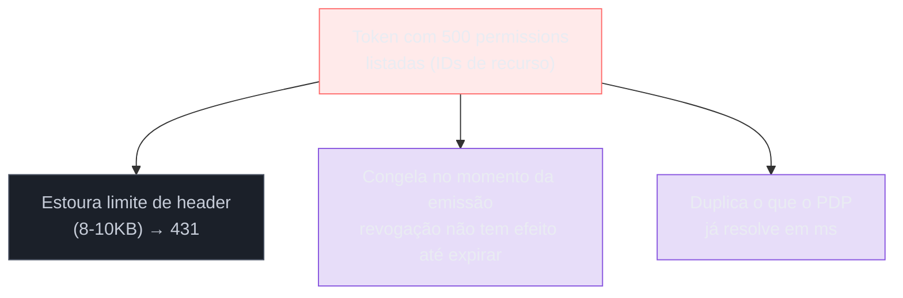
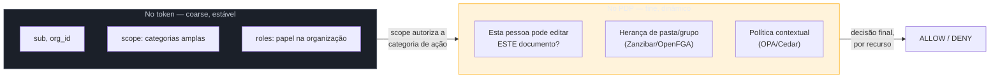
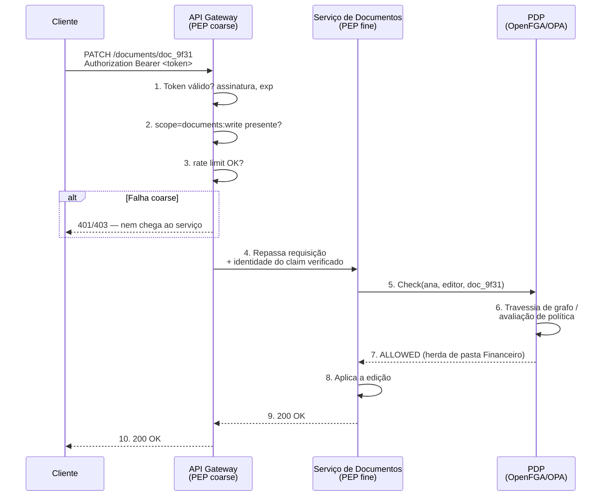
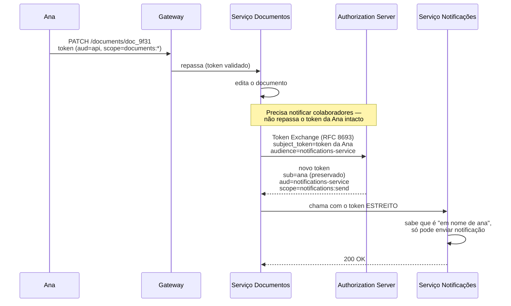
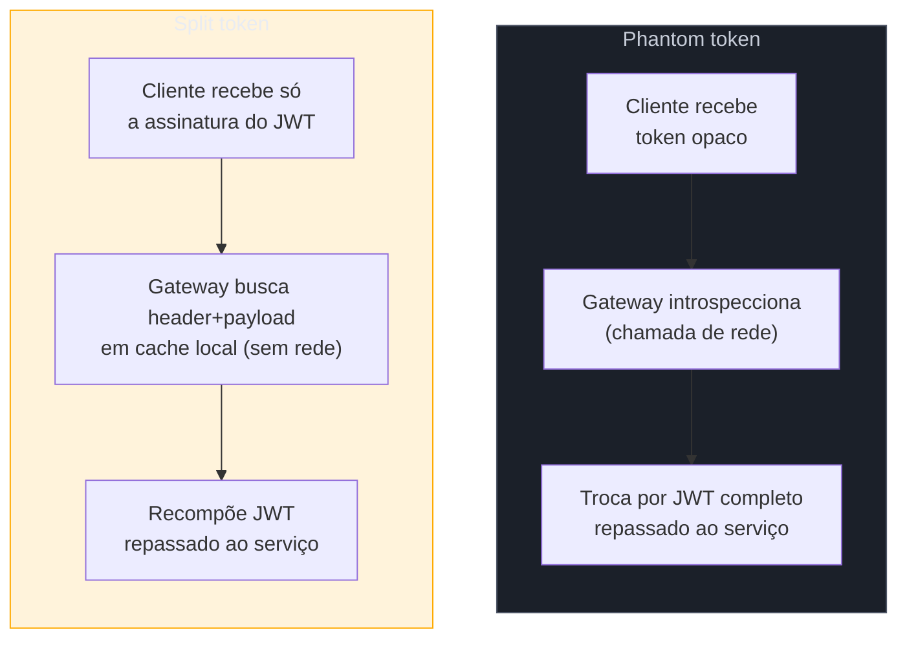

# Autorização de API na prática

> [!abstract] TL;DR
> As três notas anteriores deste sub-galho deram os modelos (RBAC/ABAC/ReBAC), o motor (Zanzibar/OpenFGA, OPA/Cedar) e a fronteira (organizações, tenants). Esta nota fecha o sub-galho respondendo à pergunta mais prática de todas: **quando um token chega numa API de verdade, o que exatamente vai dentro dele, quem checa o quê, e como essa decisão sobrevive a uma cadeia de cinco microserviços?** Três decisões de engenharia se repetem em toda API séria. Primeiro, **claims design**: o token carrega **scopes coarse** (categorias amplas de consentimento, tipo `documents:write`) e talvez **roles** — nunca a lista completa de **permissions** fine-grained, porque isso não cabe (JWT estoura o limite de header HTTP de 8KB), fica obsoleto no segundo em que alguém revoga acesso, e reintroduz exatamente o problema que RBAC/ReBAC no PDP já resolvem melhor. Segundo, **enforcement em duas camadas**: o **gateway** aplica a checagem coarse (autenticado? escopo certo? rate limit?) e o **serviço** aplica a fine-grained (este usuário específico, com este recurso específico) — não é redundância, é **defense in depth**: o gateway sozinho vira ponto único de decisão, o serviço sozinho não escala checagem cara em toda borda da rede. Terceiro, **propagação de identidade** entre microserviços: um token de usuário não deveria atravessar cinco serviços sem mudar — cada hop deveria receber um token **mais estreito** que o anterior, via **token exchange** (RFC 8693) ou padrões correlatos (**phantom token**, **split token**), nunca um header solto que qualquer serviço interno aceita sem verificar. Amarrando tudo, o **audit trail**: toda decisão de autorização que importa — quem pediu, o que foi decidido, com base em quê, quando — precisa ficar registrada, porque "por que o sistema deixou isso acontecer" é a pergunta que todo incidente sério faz depois do fato. O exemplo que atravessa a nota inteira é uma API de gestão de documentos B2B — o mesmo SaaS que as notas 01 e 03 já desenvolveram — agora vista do ângulo de "o que entra na requisição HTTP e no token, de fato".

> [!question]- Perguntas que esta nota responde
> - O que vai dentro do token (scopes/roles) e o que fica de fora, resolvido por lookup no PDP — e por que colocar 500 permissions no JWT é um anti-padrão, não só uma questão de estilo?
> - Por que enforcement de autorização acontece tanto no gateway quanto no serviço, e o que cada camada consegue (e não consegue) decidir sozinha?
> - Como a identidade de um usuário se propaga entre microserviços sem virar um token cada vez mais poderoso e mais velho — o que são phantom token, split token e token exchange (RFC 8693)?
> - O que um audit trail de autorização precisa registrar, e por que isso é parte do desenho de autorização, não um log genérico adicionado depois?

## Do modelo ao fio de arame

As notas anteriores resolveram problemas de modelagem: como representar "quem pode o quê" (nota 01), como fazer essa pergunta em escala com grafo de relações ou política declarativa (nota 02), e onde termina um tenant e começa outro (nota 03). Só que nenhuma delas respondeu a uma pergunta que todo engenheiro que já implementou autorização de verdade encontra no primeiro dia: **quando a requisição HTTP chega, o que exatamente está no cabeçalho `Authorization`, e quem lê o quê?**

Essa pergunta parece de implementação, mas é de arquitetura. A resposta errada — "coloco todas as permissões no JWT, resolvo tudo no middleware do meu próprio serviço, e pronto" — funciona para uma API de brinquedo e desmorona assim que o produto ganha (a) mais de uma dúzia de tipos de recurso, (b) mais de um serviço, ou (c) um cliente enterprise perguntando "como eu audito quem acessou o quê". Vamos seguir o mesmo SaaS de documentos B2B das notas 01 e 03 — chamado **Projeta** —, agora sob a lente de uma requisição real: `PATCH /documents/{id}` chegando de um cliente autenticado, pedindo para editar um documento específico.

## Claims design: o que vai no token, o que fica de fora

A primeira decisão, e a mais mal-compreendida, é o que colocar dentro do access token. A tentação — sobretudo em quem vem de um mundo de sessão server-side, onde "carregar tudo na sessão" nunca doeu — é achar que o JWT deveria ser autossuficiente: se o usuário pode editar 40 documentos específicos, por que não listar os 40 IDs no token e resolver tudo sem bater no banco de novo?

### O anti-padrão do token gigante

A resposta curta é: porque isso não escala em nenhuma das três dimensões que importam. Primeiro, **tamanho**: um JWT viaja tipicamente no header HTTP `Authorization`, e a maioria dos servidores web e proxies impõe limites de tamanho de header — Apache por padrão em 8KB, Nginx entre 4-8KB, AWS API Gateway em 10KB[^size-limits]. Um token que tenta carregar uma lista de permissões por recurso, ou um mapeamento completo de URL-para-permissão, cresce até estourar esse limite — e a falha resultante (um `431 Request Header Fields Too Large`) acontece na camada de infraestrutura, antes mesmo de chegar ao código da aplicação, o que a torna especialmente dolorosa de depurar[^large-token-fail]. Segundo, **staleness**: mesmo que o token coubesse, ele é assinado no momento da emissão e vale até expirar — normalmente minutos. Se um admin revoga o acesso de alguém a um documento específico *agora*, essa mudança só teria efeito quando o token atual expirasse, porque o conjunto de permissões ficou congelado dentro da assinatura[^stale-scopes]. Terceiro, **redundância conceitual**: a nota 02 já resolveu "como responder rápido a 'este usuário pode editar este recurso específico'" — é exatamente o que Zanzibar/OpenFGA ou uma política OPA/Cedar fazem, em milissegundos, sem precisar que o token carregue a resposta pré-computada.



> [!warning] Cramming — a progressão típica do anti-padrão
> Times raramente decidem de propósito colocar permissões finas no token. O padrão de falha é gradual: primeiro um scope, depois um role, depois "só mais um campo com os IDs das pastas que esse usuário administra", depois uma lista de exceções, até o token virar um documento de configuração inteiro. Cada adição parece pequena isoladamente; o resultado acumulado é ou um token estourando limites de header, ou um código de leitura do token tão acoplado ao formato que qualquer mudança de modelo de permissão vira uma migração de todo cliente que já tem token emitido[^cramming].

### O que efetivamente vai no token: scopes e roles, coarse

A prática que emergiu como consenso de mercado — documentada por fontes como Curity, WorkOS e Aserto ao longo de 2025-2026 — separa três conceitos que a linguagem cotidiana confunde: **scope**, **claim** e **role**[^scopes-claims-workos].

- **Scope** — o que o cliente (a aplicação) pediu para fazer em nome do usuário, no momento do consentimento OAuth. `documents:read`, `documents:write`, `billing:manage`. É uma categoria ampla e estável, pensada para caber numa tela de consentimento que um humano consiga entender e aprovar — não uma permissão por recurso.
- **Claim** — uma afirmação de fato sobre o portador do token: quem ele é (`sub`), qual organização está ativa (`org_id`, retomando a nota 03), quando o token expira (`exp`). Claims carregam identidade e contexto, não decisão de autorização em si.
- **Role** — o papel do usuário dentro da aplicação (`org_admin`, `editor`), no sentido RBAC coarse da nota 01. A recomendação de 2026 é tratá-lo como algo **derivado, não fonte de verdade persistente dentro do token**: se o token vive 15-60 minutos e o role de alguém muda no meio desse intervalo (por exemplo, foi rebaixado de admin), um token que ainda carrega o role antigo segue "válido" para decisões que nunca deveriam ter sido permitidas até a expiração — daí a orientação de manter os roles autoritativos armazenados server-side, e usar o claim no token como uma otimização de leitura de curto prazo, não a fonte final de verdade para decisões sensíveis[^roles-serverside].

O ponto mais sutil, que vale a pena internalizar: **scope e role não são a mesma coisa, e um limita o outro**. Um usuário pode ter o role `admin` (o que ele *é* dentro da organização) mas um token emitido com scope `documents:read-only` (o que a aplicação específica que gerou aquele token pediu permissão para fazer). A decisão de autorização correta aplica os dois como um "E" — o usuário precisa ter tanto o role quanto o scope necessários; nenhum dos dois sozinho é suficiente[^scope-cap]. É a mesma lógica que já apareceu na trilha de OAuth: scope é sobre **o que esta aplicação específica está autorizada a fazer agora**, role é sobre **o que esta pessoa é, de forma mais ampla e estável** — dois eixos diferentes que, juntos, decidem o que uma requisição específica pode fazer.

No **Projeta**, o access token que a Ana (editora na organização Acme) recebe depois de logar carrega algo como:

```json
{
  "sub": "user_ana_88f2",
  "org_id": "org_acme_41a9",
  "scope": "documents:read documents:write comments:write",
  "roles": ["org_member"],
  "exp": 1752247200,
  "aud": "api.projeta.com"
}
```

Repare no que **não** está aqui: nenhuma lista de documentos específicos que a Ana pode editar. Esse token diz "a Ana está autenticada, atua na organização Acme, tem o role `org_member`, e a aplicação que emitiu este token tem permissão de ler/escrever documentos e comentários em nome dela" — tudo isso é coarse, estável, e cabe folgado dentro de qualquer limite de header. A pergunta fina — "a Ana pode editar *este* documento específico, `doc_9f31`?" — não vive no token. Vive no PDP, como a nota 02 já desenhou: uma checagem Zanzibar/OpenFGA (`document:doc_9f31#editor@user:ana`, resolvido via herança de pasta/organização) ou uma política OPA que avalia atributos do documento contra o contexto da requisição.



> [!question]- E se eu realmente precisar de uma permissão fina disponível offline, sem chamar o PDP a cada request?
> Isso é uma otimização de cache, não uma mudança de modelo: o serviço pode manter um cache local (com TTL curto, e invalidação ativa quando possível) do resultado de checagens recentes, ou usar um PDP embutido como sidecar (a nota 02 já cobriu esse trade-off entre PDP centralizado e embutido). O que não se recomenda é *serializar* esse cache dentro do próprio token assinado — porque aí ele herda os três problemas já descritos (tamanho, staleness, acoplamento), e ainda fica invisível a qualquer tentativa de invalidação, já que o token já foi entregue e assinado.

## Enforcement em duas camadas: gateway e serviço

Resolvido o que o token carrega, a pergunta seguinte é: **quem, na cadeia de uma requisição, efetivamente checa alguma coisa?** A resposta de produção madura não é "o gateway" nem "o serviço" — é os dois, com responsabilidades diferentes, e entender a diferença é o que separa uma arquitetura de autorização de um ponto único de falha disfarçado de segurança.

### O gateway como PEP coarse

O **API gateway** (ou um BFF, dependendo da topologia) é o primeiro ponto que toda requisição externa atravessa, e por isso é o lugar natural para aplicar as checagens **baratas e universais**: o token é válido (assinatura, expiração)? O escopo pedido bate com o que o token autoriza? O rate limit deste cliente foi excedido? Esse tipo de checagem é barata precisamente porque não depende do conteúdo específico do recurso sendo acessado — só do token em si. Centralizar isso no gateway evita reimplementar a mesma validação de token em cada um dos N serviços internos, reduz carga nos serviços de negócio (requisições inválidas nem chegam lá) e garante política consistente entre todas as APIs expostas[^gateway-pep].

### O serviço como PEP fine

Só que o gateway não sabe — e não deveria saber — os detalhes de negócio de cada domínio. Ele não sabe que o documento `doc_9f31` pertence à pasta "Financeiro Q3", que essa pasta herda permissões de um grupo, ou que a política da organização Acme proíbe edição de documentos arquivados. Essa é uma checagem **fine-grained e contextual**, que só o serviço dono daquele domínio de dados tem contexto suficiente para fazer corretamente — geralmente delegando a decisão em si para o PDP (Zanzibar/OpenFGA ou OPA/Cedar), mas aplicando (enforce) a decisão ali, no ponto de acesso ao dado real.



### Por que os dois, e não só um

A tentação de simplificar — "por que não colocar toda a lógica de autorização no gateway e deixar os serviços simples?" — ignora um risco estrutural: um gateway que decide **tudo** vira, ele mesmo, um ponto único de decisão que precisa conhecer a lógica de negócio de cada domínio que existe atrás dele. Isso não escala organizacionalmente (o time do gateway vira gargalo de toda mudança de regra de autorização de qualquer domínio) nem tecnicamente (a lista de regras cresce sem limite, e o gateway se torna cada vez mais acoplado a detalhes que deveriam pertencer aos serviços)[^gateway-limits]. Por outro lado, confiar só nos serviços individuais para autorização abre uma superfície de ataque diferente: qualquer requisição que consiga contornar o gateway (um erro de roteamento interno, um serviço exposto por engano, um chamador lateral dentro da rede) chega direto num serviço que talvez nunca tenha sido testado para lidar com tráfego não autenticado.

A resposta de mercado — documentada tanto no OWASP Microservices Security Cheat Sheet quanto em análises recorrentes de arquitetura de 2025-2026 — é **defense in depth**: gateway e serviço são camadas independentes, cada uma reforçando o que a outra pode falhar em pegar, e idealmente ambas consultando o **mesmo** PDP, para que a lógica de decisão não divirja entre os dois pontos de enforcement[^defense-in-depth]. Um gateway comprometido ou mal configurado não expõe o sistema inteiro, porque o serviço ainda checa; um serviço com um bug de autorização não expõe tudo, porque o gateway já filtrou o volume óbvio de tráfego inválido antes de chegar lá.

> [!warning] Duplicar a política em vez de reusar o mesmo PDP
> O erro sutil de implementar defense in depth malfeito é escrever a lógica de autorização duas vezes — uma no gateway, outra em cada serviço — e deixá-las divergir com o tempo, porque alguém atualiza uma cópia e esquece a outra. A arquitetura correta não duplica a *lógica*, duplica os *pontos de enforcement* (PEPs) consultando a **mesma fonte de decisão** (o PDP): o gateway faz uma checagem coarse contra o PDP (ou contra claims já validadas), o serviço faz uma checagem fine contra o mesmo PDP. Nenhuma das duas reimplementa a regra localmente.

## Propagação de identidade entre microserviços

Resolvido "quem checa o quê" dentro de uma única requisição, sobra o problema que aparece assim que o **Projeta** deixa de ser um monólito: a edição de um documento dispara, internamente, uma chamada ao serviço de notificações (avisar colaboradores), que por sua vez chama o serviço de e-mail. A identidade da Ana — e a decisão de que ela tinha permissão de editar aquele documento — precisa atravessar essa cadeia sem se perder, sem ser forjada, e sem virar um token cada vez mais poderoso.

### O problema do token que não deveria viajar intacto

A resposta ingênua é "propaga o mesmo access token da Ana para cada chamada interna subsequente" — o **token reuse**. Funciona até um detalhe se tornar óbvio: o token da Ana foi emitido com `aud: api.projeta.com` e scope amplo o bastante para tudo que a interface principal precisa fazer. Se o serviço de notificações recebe esse mesmo token intacto, ele está recebendo um crachá bem mais poderoso do que precisa para "mandar um e-mail" — e se esse serviço, por sua vez, chama um terceiro serviço repassando o mesmo token de novo, o *blast radius* de qualquer vazamento cresce a cada hop, porque o mesmo artefato de altíssimo privilégio circula por serviços que nunca precisaram dele[^token-propagation-approaches].

### Token exchange (RFC 8693): cada hop, um token mais estreito

A resposta padronizada é o **OAuth 2.0 Token Exchange**, RFC 8693: um serviço que recebeu um token pode apresentá-lo ao authorization server e pedir, em troca, um **novo** token — preservando a identidade original do usuário (a Ana continua sendo o sujeito), mas com `audience` e `scope` recalculados para exatamente o que o próximo hop precisa[^rfc8693-exchange]. O serviço de documentos, ao chamar o serviço de notificações, troca seu token amplo por um token com `aud: notifications-service` e scope reduzido a `notifications:send` — o serviço de notificações nunca vê, e não pode usar, nenhuma permissão que a Ana tinha sobre documentos.



O rascunho **Identity Chaining** (`draft-ietf-oauth-identity-chaining`, em trilha de padronização, com uma revisão publicada em junho de 2026) formaliza o passo seguinte: propagar identidade e autorização **entre domínios de confiança diferentes** — por exemplo, quando o serviço de notificações do Projeta chama uma API de um provedor terceirizado de e-mail transacional — combinando Token Exchange com o **JWT Profile for OAuth 2.0 Client Authentication and Authorization Grants** (RFC 7523), de forma que a cadeia de "quem pediu isso originalmente" sobreviva à travessia entre organizações, não só entre serviços de uma mesma empresa[^identity-chaining]. Um perfil derivado, o **ID-JAG** (Identity Assertion JWT Authorization Grant), especializa esse mecanismo para o caso mais comum em enterprise: usar a asserção de identidade de um SSO corporativo (a nota SG2-06 já cobriu SAML/OIDC/SCIM) como base para obter tokens de API downstream, sem reintroduzir login[^id-jag].

### Phantom token e split token: o caso do cliente público

Existe uma variante desse problema quando o *primeiro* token — o que o navegador ou o app mobile recebe — não deveria nem chegar aos serviços internos em forma legível. O padrão **phantom token**, popularizado pela Curity, resolve isso emitindo ao cliente público um **token opaco** (uma string sem estrutura interpretável, tipo um identificador de sessão) em vez de um JWT legível. O gateway/API na borda **introspecciona** esse token opaco contra o authorization server — troca-o por um JWT completo, só então repassado aos serviços internos[^phantom-token]. A vantagem dupla: o cliente público nunca vê os claims internos (nenhuma informação sensível de infraestrutura vaza para o browser, mesmo que alguém decodifique o token capturado), e a revogação é imediata — um token opaco não tem "validade própria" fora do que o authorization server disser no momento da introspecção, ao contrário de um JWT que continua "válido" localmente até expirar.

O custo do phantom token é uma chamada extra de rede (a introspecção) a cada requisição que chega na borda — relevante quando o gateway está distribuído globalmente e cada instância precisa bater no token service para cada checagem[^phantom-cost]. O padrão **split token**, mais recente, ataca esse custo: em vez de emitir um token opaco genérico, o authorization server entrega ao cliente só a **assinatura** do JWT (a terceira parte, separada de header+payload) como o "token" que ele usa, enquanto header e payload completos ficam num cache no próprio gateway, indexados pelo hash dessa assinatura. O gateway recompõe o JWT localmente comparando a assinatura recebida contra o cache — sem precisar de uma chamada de rede ao token service a cada requisição, preservando a mesma propriedade de "o cliente nunca vê os claims internos"[^split-token].



### Zero-trust interno: mTLS e SPIFFE como base, não como substituto

Vale fechar esta seção com uma distinção que costuma confundir quem vem de uma leitura superficial de "zero trust": **mTLS não é um mecanismo de autorização**. Numa malha de serviços operando sob o modelo BeyondCorp/zero-trust — cada workload com uma identidade **SPIFFE** própria, certificados de curta duração emitidos automaticamente, conexões mutuamente autenticadas — mTLS garante que os dois lados da conexão *são quem dizem ser* (autenticação de workload) e que o canal está criptografado. Mas um certificado prova "eu sou o serviço de notificações", não "eu tenho permissão de enviar este e-mail em nome desta usuária específica"[^mtls-not-authz]. Por isso, em produção, mTLS e SPIFFE resolvem a camada de **transporte e identidade de workload**, enquanto o token (via exchange, phantom, ou split) continua carregando a identidade do **usuário final** e a autorização em nome de quem a chamada está sendo feita — as duas camadas são complementares, não substitutas uma da outra. Um gateway que aplica mTLS entre serviços internos normalmente termina essa conexão e repassa a identidade verificada via header assinado ou claim, cuidadosamente escopado e removido nas bordas de confiança, nunca como um header livre que qualquer chamador poderia forjar[^mtls-header-propagation].

## Audit trail: a decisão de autorização como fato registrado

A última peça que fecha o ciclo é, muitas vezes, a que só aparece depois de um incidente: quando alguém pergunta "quem autorizou isso, e com base em quê?", o sistema precisa ter uma resposta — não uma reconstrução aproximada a partir de logs genéricos de aplicação, mas um registro deliberado da própria decisão de autorização.

Um **decision log** de autorização, bem desenhado, registra tipicamente: o **sujeito** da requisição (quem pediu), o **recurso** e a **ação** pedidos, a **decisão** (permitido/negado), e — crucialmente — as **entradas que levaram à decisão**: qual política ou tupla de relação foi avaliada, com que versão de política, e em que timestamp[^decision-log-content]. Isso é diferente de um log de acesso HTTP comum, que registra "a requisição aconteceu" — o audit trail de autorização registra *por que* o sistema decidiu como decidiu, o que é o dado que realmente importa numa investigação de segurança ou numa auditoria de compliance.

Dois tipos de evento merecem trilhas separadas, porque respondem perguntas diferentes[^decision-log-content]:

- **Eventos de decisão** — cada checagem individual que produziu um resultado que afetou um desfecho real (`ana pode editar doc_9f31? → ALLOWED, via herança de pasta Financeiro, política v42`). Esse é o log que responde "por que esta requisição específica passou ou foi barrada".
- **Eventos de mudança de política** — toda alteração em quem-pode-o-quê: uma tupla adicionada/removida no PDP, uma política Rego republicada, um role reatribuído. Registrado com o ator que fez a mudança, o timestamp, e o estado antes/depois. Esse é o log que responde "quando o acesso da Ana ao documento mudou, e quem mudou".

A combinação dos dois é o que permite reconstruir, meses depois, uma linha do tempo completa: "a Ana podia editar este documento desde 3 de março, porque foi adicionada ao grupo Financeiro nessa data (evento de mudança de política); em 15 de julho, ela editou o documento às 14h32, e o sistema permitiu porque essa membership ainda estava ativa (evento de decisão)". Sem essa dupla trilha, qualquer investigação de "como é que fulano teve acesso a isso" vira arqueologia de logs de aplicação nunca desenhados para essa pergunta.

> [!warning] Auditoria como reflexão tardia, adicionada só na camada de aplicação
> Um erro recorrente é implementar autorização primeiro e "adicionar auditoria depois", geralmente como um log genérico espalhado pelo código de negócio. O problema é que, nesse desenho, o log captura o que a *aplicação* fez, não necessariamente o que o *PDP* decidiu e por quê — se a política mudar de forma sutil (uma condição a mais numa regra OPA, uma tupla removida), o log de aplicação continua dizendo só "permitido"/"negado", sem o contexto que explicaria a mudança de comportamento. A correção é tratar o audit trail como parte do contrato do PDP desde o desenho: toda implementação séria de OpenFGA, SpiceDB ou OPA expõe um mecanismo de decision logging nativo — usá-lo, em vez de reimplementar um log paralelo na camada de aplicação, é o que garante que o registro reflita a decisão real, não uma paráfrase dela.

## Amarrando o exemplo: a requisição completa do Projeta

Voltando à requisição que abriu a nota — `PATCH /documents/doc_9f31`, vinda da Ana — a cadeia completa, juntando as quatro seções, fica assim: o gateway valida o token (assinatura, `exp`, `aud`, `scope=documents:write` presente) e, se tudo bater, repassa a requisição ao serviço de documentos junto com a identidade já verificada — nunca um header solto que o cliente poderia forjar. O serviço de documentos, antes de aplicar a edição, faz um `Check` contra o PDP (OpenFGA, herdando a permissão via a pasta "Financeiro Q3" que a nota 02 já modelou) — essa é a checagem fine-grained que o gateway não tinha contexto de negócio para fazer. Se a edição dispara uma notificação, o serviço de documentos não repassa o token original da Ana ao serviço de notificações: ele faz um token exchange (RFC 8693), obtendo um token mais estreito, com a identidade da Ana preservada mas o escopo reduzido a exatamente o que o serviço de notificações precisa. E cada uma dessas decisões — o `Check` no PDP, a emissão do token trocado — gera um evento de decisão no audit trail, amarrado ao `request_id` da requisição original, de forma que, se alguém perguntar seis meses depois "por que a Ana conseguiu editar este documento", a resposta esteja registrada, não reconstruída de memória.

Esse fio de arame — claims coarse no token, enforcement em duas camadas, identidade propagada de forma estreitada a cada hop, decisão registrada — é o que separa um sistema de autorização que "funciona na demo" de um que sobrevive a um cliente enterprise pedindo relatório de acesso, ou a um pentest perguntando "o que acontece se eu chamar o serviço de notificações diretamente, pulando o gateway?".

## Fronteiras: o que esta nota não reabre

Vale fechar nomeando explicitamente o que ficou de fora, porque já foi resolvido em outro lugar da trilha e não vale a pena reexplicar: os **modelos** de decisão (RBAC/ABAC/ReBAC) são a nota [[01 - RBAC, ABAC e ReBAC — os três modelos|01]]; o **motor** que resolve a checagem fine-grained (Zanzibar/OpenFGA/SpiceDB, OPA/Rego, Cedar, e o trade-off PDP centralizado vs embutido) é a nota [[02 - Fine-grained authorization — Zanzibar e policy-as-code|02]]; a **fronteira de tenant** — organizações, membership, isolamento de dados e de identidade — é a nota [[03 - Multi-tenancy e organizações|03]]; **token exchange como mecanismo de grants OAuth** (a mecânica RFC 8693 em si, fora do contexto de propagação entre microserviços) já foi apresentado em [[../2 - OAuth 2.1 e OpenID Connect/04 - Grants de máquina e fluxos especiais|SG2-04]] — aqui o foco foi o **uso** dele como padrão de propagação, não a redefinição do grant. E a decisão de **contrato** de uma API — que verbo HTTP, que formato de erro, que versão de schema — é um problema de design de API que pertence a [[03-Dominios/Engenharia/Comunicação entre Sistemas/2 - Design de contratos e evolução/03 - Autenticação e autorização de API — panorama|Comunicação SG2-03]], que trata auth como uma das decisões de contrato entre várias — esta nota é o deep-dive que aquela nota aponta para cá.

## Em entrevista

Esse é um dos temas onde a entrevista para uma vaga sênior de backend ou de plataforma costuma ir além de "explique RBAC" e chegar em "desenhe a autorização de uma API real" — e o sinal que se busca é justamente a separação de camadas que esta nota percorreu: o que fica no token versus o que se resolve por lookup, onde o enforcement acontece, e como a identidade sobrevive a uma cadeia de chamadas internas sem virar um crachá universal.

Uma resposta fraca fica só em "eu validaria o JWT e checaria o role" — não distingue scope de role, não fala em enforcement em duas camadas, e assume implicitamente que um único serviço processa a requisição inteira. Uma resposta forte nomeia o trade-off de cada decisão.

> **Entrevistador:** "Você tem uma API com hierarquia de recursos (pastas, documentos) e uma cadeia de três microserviços processando cada requisição de escrita. Como você desenharia a autorização?"
>
> **Resposta fraca:** "Eu colocaria as permissões no JWT e cada serviço checaria o token."
>
> **Resposta forte:** "Eu separaria o que vai no token do que se resolve em tempo real. O token carrega scope e role coarse — categorias amplas, estáveis, que cabem num header HTTP e não ficam obsoletas a cada mudança de permissão. A permissão fina — 'este usuário pode editar este documento específico' — eu resolveria com um Check contra um PDP tipo OpenFGA, que já modela a herança de pasta como grafo. No gateway, eu aplicaria a checagem coarse — token válido, scope presente — antes de qualquer coisa chegar aos serviços; no serviço dono do recurso, eu aplicaria a checagem fine, contra o mesmo PDP, porque só ele tem o contexto de negócio pra saber que documento é aquele. E entre os três microserviços da cadeia, eu não repassaria o token original do usuário intacto — cada hop trocaria por um token mais estreito via RFC 8693 Token Exchange, preservando a identidade do usuário mas reduzindo o escopo ao mínimo que aquele serviço específico precisa, exatamente para que um vazamento num serviço downstream não exponha permissões que ele nunca deveria ter recebido."

Essa resposta demonstra que o candidato entende autorização de API como uma composição de decisões independentes — o que fica no token, onde se decide, como a identidade viaja — não como uma checagem única resolvida no primeiro middleware que a requisição encontra.

## How to explain it in English

> "Production API authorization comes down to three engineering decisions that repeat across every serious system. First, claims design: the token carries coarse, stable scopes and roles — never a full list of fine-grained permissions, because that doesn't fit inside HTTP header size limits, goes stale the instant someone revokes access, and duplicates what a policy decision point already resolves faster. Second, enforcement happens in two layers on purpose: the gateway enforces coarse checks — is the token valid, does the scope match — and the service enforces fine-grained, resource-specific checks against the same PDP, because defense in depth means neither layer alone is a single point of failure. Third, identity propagation between microservices should never mean forwarding the same user token unchanged through five hops — instead, each hop exchanges it for a narrower token via OAuth Token Exchange (RFC 8693), preserving the user's identity while shrinking scope and audience to exactly what that downstream service needs; patterns like phantom and split tokens solve the same problem for public clients that shouldn't see readable claims at all. And every decision that mattered gets logged — not just that a request happened, but what was decided, against which policy version, and why — because 'who authorized this, and on what basis' is the question every real incident eventually asks."

| PT | EN |
|----|----|
| Desenho de claims | Claims design |
| Escopo (coarse) | Scope (coarse-grained) |
| Permissão (fine-grained) | Permission (fine-grained) |
| Token gigante / anti-padrão de cramming | Token bloat / claim cramming |
| Ponto de aplicação de política | Policy Enforcement Point (PEP) |
| Defesa em profundidade | Defense in depth |
| Propagação de identidade | Identity propagation |
| Troca de token | Token exchange |
| Token fantasma | Phantom token |
| Token dividido | Split token |
| Encadeamento de identidade | Identity chaining |
| Trilha de auditoria / registro de decisão | Audit trail / decision log |
| Confiança zero | Zero trust |
| Identidade de carga de trabalho | Workload identity |

## O que vem a seguir

Esta nota fecha o **sub-galho 3 — Autorização e multi-tenancy**: da teoria dos três modelos (nota 01), passando pelo motor fine-grained (nota 02), pela fronteira de tenant (nota 03), até aterrissar na API real (esta nota). O que falta na trilha é a parte que o design da trilha nomeou como exceção deliberada: tudo isso — RBAC/ReBAC, claims design, enforcement em camadas, propagação de identidade — precisa virar **código** em stacks reais. O sub-galho 4 faz exatamente isso: Spring Security, Django, FastAPI, Express, NestJS e Gin, cada um mostrando como esses conceitos entram no middleware, no guard, na dependency injection de cada ecossistema — sem reexplicar a teoria, só a instrumentação.

- [[../4 - Auth nos stacks/01 - Java — Spring Security e Spring Authorization Server]] — abre o sub-galho 4, ponte para as 18 notas de Java/Segurança
- [[01 - RBAC, ABAC e ReBAC — os três modelos]] — os modelos que o `role`/scope deste token pressupõem
- [[02 - Fine-grained authorization — Zanzibar e policy-as-code]] — o PDP que resolve a checagem fine-grained citada nesta nota
- [[03 - Multi-tenancy e organizações]] — o `org_id` que aparece no claim do token desta nota
- [[../2 - OAuth 2.1 e OpenID Connect/04 - Grants de máquina e fluxos especiais|SG2-04]] — token exchange como grant OAuth, base mecânica do que esta nota aplica à propagação entre serviços
- [[03-Dominios/Engenharia/Comunicação entre Sistemas/2 - Design de contratos e evolução/03 - Autenticação e autorização de API — panorama|Comunicação SG2-03]] — panorama de auth como decisão de contrato de API

## Fontes

- **Curity** — [*Claims Best Practices*](https://curity.io/resources/learn/claims-best-practices/) — separação entre scope/claim/role e recomendações de desenho de token; acessado em 2026-07-11.
- **WorkOS** — [*Scopes vs. claims: What they are, how they differ, and when to use each*](https://workos.com/blog/scopes-vs-claims) — distinção conceitual scope vs claim; acessado em 2026-07-11.
- **Permit.io** — [*How to Use JWTs for Authorization: Best Practices and Common Mistakes*](https://www.permit.io/blog/how-to-use-jwts-for-authorization-best-practices-and-common-mistakes) — anti-padrão de cramming de permissões no JWT, recomendação de scopes coarse + lookup fine; acessado em 2026-07-11.
- **Aserto** — [*OAuth2 Scopes are not permissions*](https://www.aserto.com/blog/oauth2-scopes-are-not-permissions) e [*Using OAuth 2.0 scopes vs. permissions for app authorization*](https://www.aserto.com/blog/scopes-vs-permissions-authorization) — diferença estrutural entre scope e permission; acessado em 2026-07-11.
- **DevToolkit.cloud** — [*JWT Security Best Practices for 2026*](https://devtoolkit.cloud/blog/jwt-security-best-practices-2026) — roles armazenados server-side, staleness de claims embutidos; acessado em 2026-07-11.
- **jsonic.io** — [*JWT Size: Limits, Optimization, and Cookie vs Header*](https://jsonic.io/guides/json-web-token-size) — limites de tamanho de header HTTP (Apache/Nginx/AWS API Gateway) e falhas de token grande; acessado em 2026-07-11.
- **OWASP Cheat Sheet Series** — [*Microservices Security Cheat Sheet*](https://cheatsheetseries.owasp.org/cheatsheets/Microservices_Security_Cheat_Sheet.html) — enforcement em gateway vs serviço, defense in depth; acessado em 2026-07-11.
- **Aserto** — [*The authorization 3-body problem*](https://www.aserto.com/blog/the-authorization-3-body-problem) — limitações do gateway como único ponto de decisão; acessado em 2026-07-11.
- **Tyk** — [*AuthZEN: Standards-based API authorisation for API gateways*](https://tyk.io/blog/authzen-standards-based-api-authorisation-for-api-gateways/) — PEPs distintos consultando o mesmo PDP; acessado em 2026-07-11.
- **Curity** — [*Split Token Approach: Enhancing API Token Security*](https://curity.io/resources/learn/split-token-pattern/) — mecânica do split token; acessado em 2026-07-11.
- **Curity (Medium)** — [*The Different Token Types and Formats Explained*](https://curity.medium.com/the-different-token-types-and-formats-explained-19dd8b947b2e) — phantom token, introspecção no gateway; acessado em 2026-07-11.
- **Nordic APIs** — [*Strategies for Integrating OAuth With API Gateways*](https://nordicapis.com/strategies-for-integrating-oauth-with-api-gateways/) — trade-off de custo de introspecção; acessado em 2026-07-11.
- **IETF Datatracker** — [*RFC 8693 — OAuth 2.0 Token Exchange*](https://datatracker.ietf.org/doc/html/rfc8693) — texto normativo do grant type; acessado em 2026-07-11.
- **dasroot.net** — [*Tracing Token Usage Across Microservices: A 2026 Technical Guide*](https://dasroot.net/posts/2026/02/tracing-token-usage-microservices-2026/) — abordagens de propagação (reuse/embedded/exchange) em 2026; acessado em 2026-07-11.
- **IETF Datatracker** — [*draft-ietf-oauth-identity-chaining-14*](https://datatracker.ietf.org/doc/html/draft-ietf-oauth-identity-chaining) — encadeamento de identidade cross-domain, status de junho de 2026; acessado em 2026-07-11.
- **Dev.to (kanywst)** — [*Identity Chaining Deep Dive*](https://dev.to/kanywst/identity-chaining-deep-dive-connecting-identity-across-trust-domains-with-oauth-2onb) — combinação RFC 8693 + RFC 7523, ID-JAG; acessado em 2026-07-11.
- **The Backend Developers (Substack)** — [*Zero-Trust Service-to-Service Auth in 2026: mTLS, SPIFFE, and Identity Boundaries*](https://thebackenddevelopers.substack.com/p/zero-trust-service-to-service-auth) — mTLS/SPIFFE como autenticação de workload, não autorização; acessado em 2026-07-11.
- **AWS** — [*Using mTLS with SPIFFE/SPIRE in AWS App Mesh on Amazon EKS*](https://aws.amazon.com/blogs/containers/using-mtls-with-spiffe-spire-in-app-mesh-on-eks/) — propagação de identidade verificada via headers na borda de mTLS; acessado em 2026-07-11.
- **OpenID Foundation** — [*AuthZEN Authorization API 1.0*](https://openid.github.io/authzen/) — protocolo padronizado PEP↔PDP, publicado julho de 2026; acessado em 2026-07-11.
- **Aserto** — [*Why authorization audit logs and decision logs are important*](https://www.aserto.com/blog/authorization-decision-logs-important) — conteúdo de decision logs; acessado em 2026-07-11.
- **Permit.io** — [*Best Practices for Authorization Audit Logs*](https://www.permit.io/blog/audit-logs) — eventos de decisão vs eventos de mudança de política; acessado em 2026-07-11.

[^size-limits]: jsonic.io, *JWT Size: Limits, Optimization, and Cookie vs Header* — limites de header HTTP por servidor/proxy. [^large-token-fail]: jsonic.io, *JWT Size* — falha 431 e dificuldade de depuração de token grande. [^stale-scopes]: DevToolkit.cloud, *JWT Security Best Practices for 2026* — staleness de permissões embutidas até expiração do token. [^cramming]: Permit.io, *How to Use JWTs for Authorization* — progressão típica do anti-padrão de cramming. [^scopes-claims-workos]: WorkOS, *Scopes vs. claims* — distinção conceitual entre scope, claim e role. [^roles-serverside]: DevToolkit.cloud, *JWT Security Best Practices for 2026* — recomendação de roles armazenados server-side. [^scope-cap]: DevToolkit.cloud, *JWT Security Best Practices for 2026* — scope como teto sobre o que o role permitiria. [^gateway-pep]: OWASP Cheat Sheet Series, *Microservices Security Cheat Sheet* — gateway como PEP natural para checagens coarse. [^gateway-limits]: Aserto, *The authorization 3-body problem* — riscos de centralizar toda decisão no gateway. [^defense-in-depth]: OWASP Cheat Sheet Series / Tyk, *AuthZEN* — defense in depth com PEPs distintos e PDP compartilhado. [^token-propagation-approaches]: dasroot.net, *Tracing Token Usage Across Microservices* — token reuse, embedded tokens e token exchange como três abordagens. [^rfc8693-exchange]: IETF Datatracker, RFC 8693 — mecânica de troca preservando sujeito, reduzindo audience/scope. [^identity-chaining]: IETF Datatracker, draft-ietf-oauth-identity-chaining-14 — propagação cross-domain combinando Token Exchange e RFC 7523. [^id-jag]: Dev.to (kanywst), *Identity Chaining Deep Dive* — ID-JAG como perfil especializado para SSO enterprise. [^phantom-token]: Curity (Medium), *The Different Token Types and Formats Explained* — mecânica do phantom token via introspecção no gateway. [^phantom-cost]: Nordic APIs, *Strategies for Integrating OAuth With API Gateways* — custo de rede da introspecção distribuída. [^split-token]: Curity, *Split Token Approach* — mecânica de cache local de header+payload contra assinatura. [^mtls-not-authz]: The Backend Developers, *Zero-Trust Service-to-Service Auth in 2026* — mTLS autentica workload, não decide autorização. [^mtls-header-propagation]: AWS, *Using mTLS with SPIFFE/SPIRE in AWS App Mesh* — identidade verificada repassada via header na borda de confiança. [^decision-log-content]: Aserto, *Why authorization audit logs and decision logs are important* / Permit.io, *Best Practices for Authorization Audit Logs* — conteúdo de decision logs e distinção entre eventos de decisão e de mudança de política.
