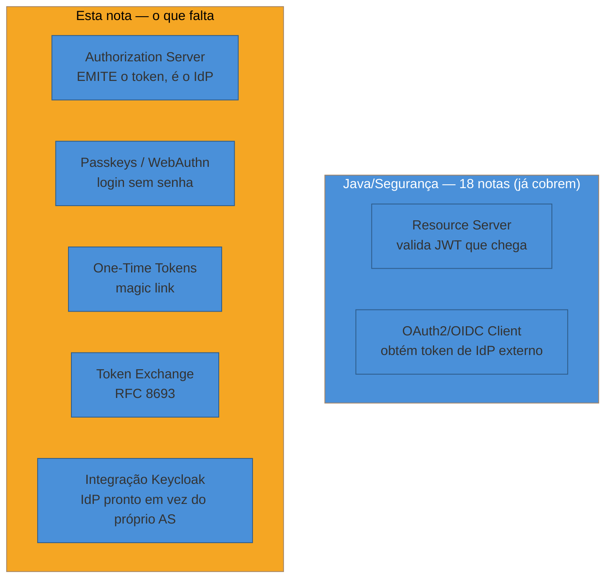
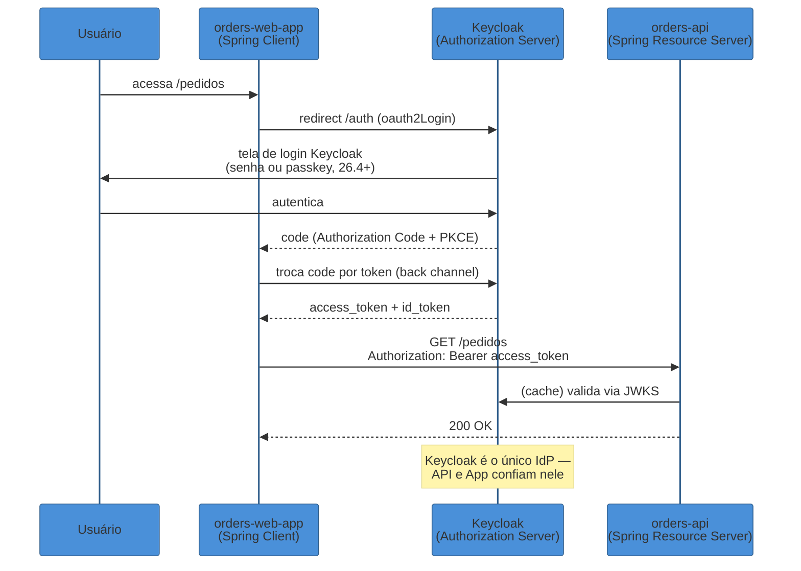
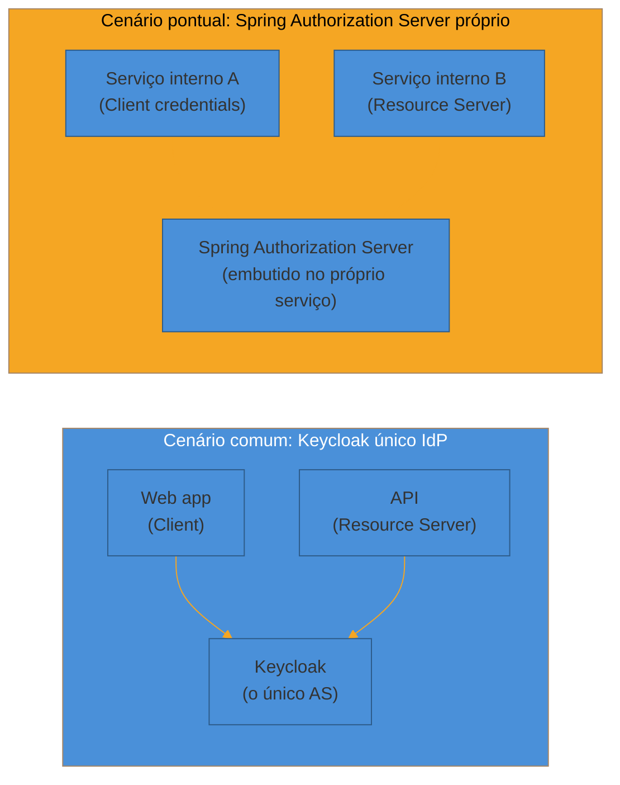

# Java — Spring Security e Spring Authorization Server

> [!abstract] TL;DR
> Se você chegou aqui vindo de Java, provavelmente já tem 18 notas de Spring Security esperando — filter chain, `UserDetailsService`, JWT, resource server, OAuth2/OIDC client, RBAC, sessão, OWASP, capstone. Esta nota **não repete nada disso**: ela é uma **ponte**, um mapa curado que diz "quer X? está na nota Y" — e então mergulha exatamente no que aquelas 18 notas não cobrem, porque foram escritas do ponto de vista de quem **consome** identidade (client, resource server), não de quem **a produz**. O núcleo novo aqui é o **Spring Authorization Server**: o projeto que transforma seu backend Spring no próprio Authorization Server — o IdP — capaz de emitir tokens, registrar clients, rodar o fluxo Authorization Code + PKCE do lado servidor. Depois entram três capacidades que chegaram no Spring Security 6.4/6.5 e mudam o cardápio de autenticação: **passkeys/WebAuthn** (login sem senha via `webAuthn()`), **one-time tokens** (magic links sem infraestrutura de senha) e **token exchange** (RFC 8693, delegação entre serviços). Fechamos com **Keycloak**: como usar um IdP self-hosted maduro em vez de rodar seu próprio Authorization Server, tanto do lado resource server (validar JWT do Keycloak) quanto do lado client (login via Keycloak).

> [!question]- Perguntas que esta nota responde
> - As 18 notas de Java/Segurança já cobrem JWT, OAuth2 client e resource server — o que exatamente falta, e onde?
> - O que é o Spring Authorization Server, e por que ele existe separado do Spring Security "normal"?
> - Como configuro um `RegisteredClient` e o essencial pra emitir tokens?
> - O que passkeys, one-time tokens e token exchange têm em comum, e por que chegaram juntos no Spring Security 6.4+?
> - Quando faz sentido rodar meu próprio Authorization Server em vez de usar o Keycloak?
> - Como uma API Spring valida tokens emitidos pelo Keycloak, e como um app Spring faz login via Keycloak?

## Por que esta nota é uma ponte, não um tutorial

O Spring é, de longe, o ecossistema Java mais maduro em segurança — e o vault já reconhece isso: o galho [[03-Dominios/Tecnologia/Java/Segurança/index|Java/Segurança]] tem 18 notas cobrindo o ciclo completo de autenticação e autorização numa aplicação Spring. Reescrever esse conteúdo aqui seria pura redundância — e redundância de assunto entre notas do vault é tratada como reforço desnecessário, não como profundidade. O que vale a pena é fazer o oposto: **mapear** o que já existe (pra você nunca ficar perdido procurando "cadê a nota de JWT?") e então preencher exatamente as lacunas que a trilha Java, focada em "construir uma API que autentica usuários e consome tokens de terceiros", deixou abertas — porque o foco dela nunca foi "meu backend É o Identity Provider".

Essa distinção de papel — **client** (obtém tokens) vs **resource server** (valida tokens) vs **authorization server** (emite tokens) — já apareceu no vocabulário do [[03-Dominios/Engenharia/Auth e Identidade/2 - OAuth 2.1 e OpenID Connect/01 - OAuth — o problema da delegação|SG2-01]]. As 18 notas de Java/Segurança cobrem os dois primeiros papéis com profundidade. O terceiro — ser o Authorization Server — é uma peça de infraestrutura de identidade genuinamente diferente, com seu próprio projeto Spring (`spring-authorization-server`), seu próprio modelo de dados (`RegisteredClient`), e suas próprias armadilhas. É aqui que esta nota entra.



## Mapa das 18 notas de Java/Segurança

Antes de ir para o que falta, aqui está o índice — quando você precisar de algo que já está resolvido, é para uma destas notas que você deve ir, não reinventar aqui.

| Quer... | Está na nota |
|---|---|
| Entender o filter chain, `authn` vs `authz` no Spring | [[03-Dominios/Tecnologia/Java/Segurança/01 - O que é Spring Security — authn, authz e o filter chain\|01 — O que é Spring Security]] |
| Saber o que é `SecurityContext`/`Authentication`/`Principal` | [[03-Dominios/Tecnologia/Java/Segurança/02 - SecurityContext, Authentication e Principal — o usuário atual\|02 — SecurityContext]] |
| Autenticação clássica: `UserDetailsService`, form/basic login | [[03-Dominios/Tecnologia/Java/Segurança/03 - Autenticação — UserDetailsService, AuthenticationManager, Form e Basic\|03 — Autenticação]] |
| Hash de senha: BCrypt, Argon2, `DelegatingPasswordEncoder` | [[03-Dominios/Tecnologia/Java/Segurança/04 - Password encoding — BCrypt, Argon2 e o DelegatingPasswordEncoder\|04 — Password encoding]] |
| Autorização por URL: `authorizeHttpRequests`, roles vs authorities | [[03-Dominios/Tecnologia/Java/Segurança/05 - Autorização baseada em URL — authorizeHttpRequests, roles vs authorities\|05 — Autorização por URL]] |
| A arquitetura interna do filter chain, em profundidade | [[03-Dominios/Tecnologia/Java/Segurança/06 - A arquitetura do filter chain em profundidade\|06 — Filter chain profundo]] |
| Autorização em método: `@PreAuthorize`, `@PostAuthorize`, SpEL | [[03-Dominios/Tecnologia/Java/Segurança/07 - Method security — @PreAuthorize, @PostAuthorize e SpEL\|07 — Method security]] |
| Anatomia de JWT — header/payload/signature, `alg: none`, JWKS | [[03-Dominios/Tecnologia/Java/Segurança/08 - JWT — estrutura, assinatura e validação\|08 — JWT]] |
| Configurar sua API como Resource Server, validar JWT de terceiros | [[03-Dominios/Tecnologia/Java/Segurança/09 - OAuth2 Resource Server — validando JWT na API\|09 — Resource Server]] |
| CSRF — por que é ligado por default, quando desligar | [[03-Dominios/Tecnologia/Java/Segurança/10 - CSRF — por que ligado por default e quando desligar\|10 — CSRF]] |
| CORS — preflight, config de segurança na borda | [[03-Dominios/Tecnologia/Java/Segurança/11 - CORS — a borda, o preflight e a config de segurança\|11 — CORS]] |
| Login social/OIDC do lado **client**: `oauth2Login`, grant types | [[03-Dominios/Tecnologia/Java/Segurança/12 - OAuth2 e OIDC Client e os grant types\|12 — OAuth2/OIDC Client]] |
| Refresh tokens, rotação, revogação | [[03-Dominios/Tecnologia/Java/Segurança/13 - Refresh tokens e revogação de token\|13 — Refresh tokens]] |
| `AuthorizationManager`, RBAC vs ABAC no Spring | [[03-Dominios/Tecnologia/Java/Segurança/14 - Autorização avançada — AuthorizationManager, RBAC vs ABAC\|14 — Autorização avançada]] |
| Gestão de sessão e security headers | [[03-Dominios/Tecnologia/Java/Segurança/15 - Session management e security headers\|15 — Session management]] |
| OWASP Top 10 aplicado a Java/Spring | [[03-Dominios/Tecnologia/Java/Segurança/16 - OWASP Top 10 no contexto Java\|16 — OWASP Top 10]] |
| Uma request de ponta a ponta: do token à autorização no método | [[03-Dominios/Tecnologia/Java/Segurança/17 - Uma request autenticada do token à autorização no método\|17 — Request ponta a ponta]] |
| Capstone: projetar a segurança de uma API Spring production-grade | [[03-Dominios/Tecnologia/Java/Segurança/18 - Capstone — projetando a segurança de uma API Spring production-grade\|18 — Capstone]] |

Repare no padrão: as notas 09 e 12 são as mais próximas do assunto desta nota — mas 09 é **validar** um token que chegou, e 12 é **obter** um token de um IdP externo (login social, ou um Keycloak configurado como `provider`). Nenhuma das duas ensina o seu backend a **ser** o IdP que emite esses tokens para outros clientes. É essa terceira perna que falta, e é nela que mergulhamos agora.

## Spring Authorization Server: seu backend vira o IdP

### Por que é um projeto separado

O Spring Security "clássico" resolve autenticação e autorização *dentro* de uma aplicação — quem está logado, o que ele pode fazer. O **Spring Authorization Server** é um projeto Spring distinto (`spring-security-oauth2-authorization-server`), construído sobre o Spring Security, que implementa o *outro lado* do protocolo OAuth 2.1/OIDC: os endpoints `/oauth2/authorize`, `/oauth2/token`, `/oauth2/jwks`, `/oauth2/revoke`, `/oauth2/introspect` — tudo que um authorization server precisa expor para que *outros* aplicativos (clients) obtenham tokens[^sas-overview]. Ele implementa nativamente OAuth 2.1 e OpenID Connect 1.0, ou seja, PKCE obrigatório, sem implicit flow, sem password grant — a mesma baseline discutida em [[03-Dominios/Engenharia/Auth e Identidade/2 - OAuth 2.1 e OpenID Connect/02 - Authorization Code + PKCE — o fluxo canônico|SG2-02]][^sas-oauth21].

> [!warning] Spring Authorization Server não é "Keycloak em Java"
> É tentador pensar nele como um substituto leve do Keycloak. Não é. O projeto entrega **os blocos de construção do protocolo** — RegisteredClientRepository, geração e validação de token, os endpoints OAuth2/OIDC — mas **não** entrega tela de cadastro de usuário, gestão de grupos, MFA pronta, painel de administração, ou fluxos de recuperação de senha. Isso você constrói (ou integra via `UserDetailsService` já existente, se seu app já tem base de usuários). A pergunta certa não é "Spring Authorization Server ou Keycloak", mas **"quero construir meu próprio IdP peça por peça, ou usar um pronto?"** — voltamos a essa decisão mais adiante.

### O núcleo mínimo: RegisteredClient e a configuração do servidor

O modelo central é o `RegisteredClient` — o registro de cada aplicação-cliente que tem permissão de pedir tokens ao seu Authorization Server: seu `client_id`, secret (se confidencial), os grant types permitidos, redirect URIs, e os scopes que ele pode solicitar[^registeredclient]. Ele é armazenado por um `RegisteredClientRepository` — em memória para protótipo, `JdbcRegisteredClientRepository` para produção[^registeredclient-repo].

```java
@Bean
public RegisteredClientRepository registeredClientRepository() {
    RegisteredClient webClient = RegisteredClient.withId(UUID.randomUUID().toString())
        .clientId("orders-web-app")
        .clientSecret("{noop}segredo-apenas-para-exemplo")
        .clientAuthenticationMethod(ClientAuthenticationMethod.CLIENT_SECRET_BASIC)
        .authorizationGrantType(AuthorizationGrantType.AUTHORIZATION_CODE)
        .authorizationGrantType(AuthorizationGrantType.REFRESH_TOKEN)
        .redirectUri("https://app.exemplo.com/login/oauth2/code/orders")
        .scope(OidcScopes.OPENID)
        .scope("orders.read")
        .clientSettings(ClientSettings.builder()
            .requireProofKey(true) // PKCE obrigatório, mesmo com secret — OAuth 2.1
            .build())
        .build();

    return new InMemoryRegisteredClientRepository(webClient);
}

@Bean
public SecurityFilterChain authorizationServerSecurityFilterChain(HttpSecurity http) throws Exception {
    OAuth2AuthorizationServerConfigurer authorizationServerConfigurer =
        OAuth2AuthorizationServerConfigurer.authorizationServer();

    http
        .securityMatcher(authorizationServerConfigurer.getEndpointsMatcher())
        .with(authorizationServerConfigurer, (server) -> server.oidc(Customizer.withDefaults()))
        .authorizeHttpRequests(auth -> auth.anyRequest().authenticated());

    return http.build();
}
```

O `OAuth2AuthorizationServerConfigurer` é o ponto de extensão central: ele registra automaticamente os endpoints do protocolo (`/oauth2/authorize`, `/oauth2/token`, `/oauth2/jwks`, o discovery `.well-known/openid-configuration`) e permite trocar cada peça — o `RegisteredClientRepository`, o `OAuth2AuthorizationService` (onde ficam os authorization codes e tokens emitidos), o `OAuth2TokenGenerator` (como o JWT é montado e assinado)[^configuration-model]. Note o `.requireProofKey(true)`: é o PKCE tornado obrigatório mesmo para um client confidencial com secret — exatamente a exigência do OAuth 2.1 que a nota do SG2 já explicou em detalhe (o secret sozinho não amarra o código de autorização a *quem* iniciou aquele fluxo específico).

> [!info] Versão em aberto
> Este texto reflete **Spring Authorization Server 1.5.x** (a última geração antes de uma futura unificação anunciada com o próprio Spring Security), rodando sobre **Spring Security 6.4+/6.5** e **Spring Boot 3.4+/3.5**[^sas-1-5-7]. Confira a versão atual antes de codar — o projeto evolui rápido e patches de segurança (como o CVE corrigido na 1.5.7, relativo ao endpoint de Dynamic Client Registration) saem com frequência[^sas-cve].

### Quando isso realmente vale a pena

Construir seu próprio Authorization Server faz sentido quando: seu ecossistema já é 100% Spring e você quer o IdP nativo na mesma stack, sem operar um serviço externo; você precisa de lógica de emissão de token muito específica do seu domínio (claims customizadas complexas, regras de negócio no `OAuth2TokenCustomizer`); ou você está construindo um produto que *é* infraestrutura de identidade. Para o caso comum — "meu SaaS precisa de login e API protegida" — a conta quase sempre fecha a favor de um IdP pronto como o Keycloak: ele já resolve cadastro de usuário, MFA, telas de consentimento, painel administrativo e (como veremos) passkeys nativas, tudo isso testado em produção por milhares de organizações[^saas-vs-build]. Voltamos a essa decisão, com mais critérios, na seção de Keycloak.

## Passkeys e WebAuthn: login sem senha, nativo desde o 6.4

Desde o **Spring Security 6.4** (lançado nov/2024, consolidado até 6.5), a DSL de configuração ganhou suporte nativo a passkeys via o método `webAuthn()`, delegando a validação de attestation/assertion para a biblioteca **WebAuthn4J** (conformante FIDO2)[^webauthn-dsl]. Isso fecha um gap real: até então, integrar WebAuthn no Spring exigia bibliotecas de terceiros e bastante código de cola.

A configuração mínima exige três atributos: `rpId` (o domínio — precisa bater com o hostname do `allowedOrigins`), `rpName` (nome amigável exibido no diálogo do navegador) e `allowedOrigins` (a URL do site, obrigatoriamente HTTPS, exceto `localhost`)[^webauthn-config]:

```java
@Bean
public SecurityFilterChain filterChain(HttpSecurity http) throws Exception {
    http
        .authorizeHttpRequests(auth -> auth.anyRequest().authenticated())
        .webAuthn(webAuthn -> webAuthn
            .rpName("Exemplo Corp")
            .rpId("exemplo.com")
            .allowedOrigins("https://exemplo.com")
        );
    return http.build();
}
```

Isso habilita um endpoint de registro de credencial (`/webauthn/register`) e uma tela de login padrão que aceita passkey. A persistência das credenciais (`PublicKeyCredentialUserEntityRepository`, `UserCredentialRepository`) tem implementação em memória por padrão e JDBC para produção[^webauthn-persistence]. A partir do 6.5, dá para customizar o conversor de mensagens (`messageConverter`) e o `PublicKeyCredentialCreationOptionsRepository`, útil quando você precisa de controle fino sobre como as opções de criação de credencial são geradas e armazenadas entre requisições[^webauthn-65].

O conceito de passkey em si — FIDO2/CTAP2, discoverable credentials, phishing-resistance, sync vs device-bound — já foi coberto em profundidade em [[03-Dominios/Engenharia/Auth e Identidade/1 - Fundamentos de identidade/05 - Passkeys e WebAuthn — o presente sem senha|SG1-05]]. O que esta seção adiciona é só o *como*, especificamente no Spring.

## One-Time Tokens: magic link sem reinventar a roda

Também chegando no 6.4, o **One-Time Token (OTT)** é um mecanismo de login *passwordless* diferente de passkey: em vez de uma credencial criptográfica no dispositivo, o usuário recebe um token de uso único — tipicamente por e-mail, como um *magic link* — que ele usa uma vez para autenticar[^ott-overview]. O fluxo tem duas pernas: o usuário pede um token informando seu identificador (e-mail/username); o servidor gera o token, entrega via algum canal (você implementa o `OneTimeTokenGenerationSuccessHandler` que decide *como* entregar — e-mail, SMS); o usuário clica no link e o Spring valida o token no endpoint de login OTT[^ott-flow].

```java
@Bean
public SecurityFilterChain filterChain(HttpSecurity http) throws Exception {
    http
        .authorizeHttpRequests(auth -> auth.anyRequest().authenticated())
        .oneTimeTokenLogin(ott -> ott
            .tokenGenerationSuccessHandler(this::enviarMagicLinkPorEmail)
        );
    return http.build();
}

private void enviarMagicLinkPorEmail(HttpServletRequest request, HttpServletResponse response,
                                      OneTimeToken oneTimeToken) throws IOException {
    String magicLink = "https://exemplo.com/login/ott?token=" + oneTimeToken.getTokenValue();
    emailService.enviar(oneTimeToken.getUsername(), "Seu link de login", magicLink);
}
```

Vale a distinção que passa despercebida: OTT não é OTP (One-Time *Password*, tipo TOTP de app autenticador). OTP exige setup prévio (escanear QR code, instalar app); OTT é mais simples do ponto de vista do usuário — ele só recebe um token pronto, sem configuração antecipada[^ott-vs-otp]. Na prática, OTT é uma resposta direta e barata a "não quero gerenciar senha nem forçar o usuário a instalar app autenticador" — bom para fluxos de baixo atrito como ativação de conta ou reset, cobertos em [[03-Dominios/Engenharia/Auth e Identidade/1 - Fundamentos de identidade/04 - Senhas e MFA — o legado que não morre|SG1-04]].

## Token Exchange (RFC 8693): delegação entre serviços

O **Token Exchange** resolve um problema que aparece assim que sua arquitetura vira uma cadeia de chamadas: o serviço A recebe um token do usuário, mas precisa chamar o serviço C — que token ele apresenta? Reenviar o token original quebra o princípio de menor privilégio (C ganha o mesmo escopo que A tinha); um novo token *client credentials* perde a identidade do usuário original. A RFC 8693 define um grant (`urn:ietf:params:oauth:grant-type:token-exchange`) que resolve exatamente isso: trocar um token por outro, preservando (ou não) a identidade do sujeito original[^rfc8693-grant].

Spring Security 6.3 trouxe suporte ao *lado client* do token exchange; o suporte *server-side* (o Authorization Server efetivamente processando essa troca) chegou no Spring Authorization Server 1.3[^spring-63-token-exchange]. A especificação distingue dois padrões de uso: **delegação** (o serviço A age *em nome de* B, preservando a identidade de B — expressa no claim `act`, que registra quem está atuando por quem) e **impersonation** (o novo token identifica só o ator, sem registrar a delegação)[^rfc8693-delegation]. Para propagar identidade entre microserviços de forma auditável — "o serviço de pedidos chamou o de pagamentos, em nome do usuário X" — delegação é o padrão certo, porque preserva rastreabilidade completa da cadeia de chamadas.

> [!question]- Isso substitui token relay simples (repassar o mesmo Bearer token adiante)?
> Não necessariamente — token relay simples ainda é comum e mais barato de operar quando o escopo do token original já é apropriado para todo o caminho de chamadas. Token exchange entra quando você precisa de **redução de escopo por hop** (o serviço C não deveria ganhar o escopo completo que A tinha) ou de **rastreabilidade explícita da cadeia de atores** — cenários mais comuns em arquiteturas de microserviços com fronteiras de confiança reais entre serviços, não só entre times do mesmo sistema.

## Keycloak: o IdP pronto, nos dois papéis

Depois de ver o que é construir seu próprio Authorization Server, a pergunta prática é: na maioria dos sistemas reais, você **não** constrói — você aponta para um IdP já pronto. **Keycloak** é a opção self-hosted de referência (linha 26.x, com 26.7 lançado em jul/2026), e integrá-lo ao Spring acontece em dois papéis distintos, que já vimos separadamente nas notas 09 e 12 de Java/Segurança — aqui a novidade é o Keycloak especificamente como esse IdP.

### Spring como Resource Server validando tokens do Keycloak

Este é o caso mais comum: sua API só precisa confiar no Keycloak como emissor. A configuração é a mesma DSL da nota 09 — só o `issuer-uri` aponta para o realm do Keycloak, e o Spring faz discovery do JWKS automaticamente:

```yaml
spring:
  security:
    oauth2:
      resourceserver:
        jwt:
          issuer-uri: https://keycloak.exemplo.com/realms/orders-realm
```

O Spring bate em `https://keycloak.exemplo.com/realms/orders-realm/.well-known/openid-configuration`, descobre o endpoint JWKS do Keycloak, baixa as chaves públicas, e passa a validar assinatura, `iss`, `aud` e `exp` de cada JWT localmente — sem chamar o Keycloak a cada requisição[^keycloak-rs]. Isso é exatamente o mecanismo de rotação de chave sem downtime já explicado na nota 09; a única coisa "Keycloak" nessa equação é a URL.

Um detalhe específico do Keycloak que costuma pegar quem vem de outros IdPs: por padrão, ele coloca roles no claim `realm_access.roles` (aninhado), não em `roles` direto — então o `JwtAuthenticationConverter` da nota 09 precisa de um conversor customizado que sabe navegar essa estrutura, em vez do `setAuthoritiesClaimName("roles")` simples que funciona com IdPs mais "planos".

### Spring como Client fazendo login via Keycloak

Do outro lado, um app Spring que delega login ao Keycloak usa o mesmo `oauth2Login` da nota 12, com o Keycloak declarado como `provider` (porque, ao contrário do Google, o Spring não conhece o Keycloak por nome — cada instalação tem uma URL própria):

```yaml
spring:
  security:
    oauth2:
      client:
        registration:
          keycloak:
            client-id: orders-web-app
            client-secret: ${KEYCLOAK_CLIENT_SECRET}
            authorization-grant-type: authorization_code
            scope: openid, profile, email
        provider:
          keycloak:
            issuer-uri: https://keycloak.exemplo.com/realms/orders-realm
```

## Exemplo trabalhado: uma API que confia no Keycloak, e o cenário de virar AS próprio

Imagine o sistema `orders-api`, um backend Spring que hoje delega toda a identidade a um Keycloak corporativo:



Nesse desenho, `orders-api` roda a configuração da nota 09 apontando o `issuer-uri` para o realm do Keycloak; `orders-web-app` roda a configuração da nota 12 com o Keycloak como `provider`. Nenhum dos dois roda Spring Authorization Server — o Keycloak é o único emissor de tokens do sistema.

Agora o contraste: imagine que a mesma empresa decida que, para um produto interno de baixo volume — digamos, uma ferramenta de automação usada só por outros serviços internos, sem tela de login humana nem necessidade de MFA — não vale a pena provisionar um realm inteiro no Keycloak corporativo (que é operado por outro time, com processo de onboarding lento). Nesse caso pontual, montar um Spring Authorization Server minúsculo, com `client_credentials` apenas, dentro do próprio serviço, é uma decisão de escopo razoável: sem usuário humano, sem UI de consentimento, só `RegisteredClient`s de máquina-a-máquina emitindo tokens curtos para chamadas internas. É o tipo de decisão que aparece no capstone da trilha — build vs buy nunca é binário para o sistema inteiro; pode ser binário *por caso de uso*.



## Armadilhas

> [!warning] Tratar o Spring Authorization Server como "Keycloak grátis e mais simples"
> **O que acontece:** um time decide montar seu próprio IdP com Spring Authorization Server achando que é menos trabalho que operar Keycloak.
> **Por quê:** o Spring Authorization Server entrega só o protocolo — nada de cadastro de usuário, MFA pronta, telas de consentimento polidas, painel administrativo, auditoria, ou gestão de grupos/organizações. Tudo isso alguém no time vai ter que construir e manter, e é exatamente o trabalho que faz o Keycloak valer a pena na maioria dos casos.
> **Como evitar:** só optar pelo Spring Authorization Server quando o caso de uso for genuinamente estreito (client credentials interno, uma lógica de emissão de token muito específica de domínio) ou quando houver um motivo de negócio real para não operar um serviço externo.

> [!warning] Esquecer PKCE no RegisteredClient de um client confidencial
> **O que acontece:** ao registrar um client com `client-secret`, o time assume que PKCE é "coisa de client público" e deixa `requireProofKey` no default (que pode variar por versão) sem checar explicitamente.
> **Por quê:** o OAuth 2.1 exige PKCE para *todo* client no fluxo Authorization Code, confidencial ou não — o motivo já foi explicado no SG2-02: o secret prova "eu sou o app X" de forma genérica, não amarra o código de autorização à transação específica que o gerou.
> **Como evitar:** setar `requireProofKey(true)` explicitamente em todo `RegisteredClient` que usa Authorization Code, sem depender do valor default da versão instalada.

> [!warning] Roles aninhadas do Keycloak quebrando o `JwtAuthenticationConverter` padrão
> **O que acontece:** a API valida o token do Keycloak com sucesso (assinatura, `iss`, `exp` todos corretos), mas `hasRole(...)` sempre retorna `403` — silenciosamente, sem erro óbvio.
> **Por quê:** o Keycloak, por padrão, entrega os papéis do realm em `realm_access.roles` (um objeto aninhado), não num claim `roles` direto no primeiro nível — o conversor padrão descrito na nota 09 não sabe navegar essa estrutura sem configuração extra.
> **Como evitar:** escrever um `Converter<Jwt, Collection<GrantedAuthority>>` customizado que extrai `realm_access.roles` (e, se for o caso, `resource_access.<client>.roles` para roles específicas de client) antes de mapear para `GrantedAuthority`.

## Em entrevista

A pergunta que separa quem só "usou Spring Security" de quem entende a arquitetura de identidade é: **"seu backend Spring pode ser ao mesmo tempo client, resource server e authorization server?"** A resposta técnica correta é sim — são papéis de protocolo, não exclusivos entre si — mas a resposta madura acrescenta *quando* isso faz sentido: quase nunca você quer os três ao mesmo tempo no mesmo serviço; o desenho comum é um IdP centralizado (Keycloak, ou um Spring Authorization Server dedicado) servindo múltiplos clients e resource servers.

> **Entrevistador:** "Por que não usar Spring Authorization Server em vez de operar um Keycloak à parte? Já que é tudo Spring mesmo."
>
> **Resposta fraca:** "Porque o Keycloak é mais popular e tem mais recursos."
>
> **Resposta forte:** "Spring Authorization Server entrega o protocolo — os endpoints OAuth2/OIDC, o modelo de RegisteredClient, geração e validação de token — mas não entrega gestão de usuário, MFA, consentimento, nem administração. Isso eu teria que construir do zero e manter, e é justamente aí que o Keycloak já chega maduro, testado em produção por milhares de organizações, com passkeys nativas desde a 26.4 e suporte a multi-tenancy via Organizations. Eu reservaria o Spring Authorization Server para um caso estreito — por exemplo, um serviço interno client-credentials-only, sem usuário humano — onde o overhead de provisionar um realm no Keycloak corporativo supera o trabalho de configurar um `RegisteredClientRepository` mínimo."

## How to explain in English

> "Spring Security has three protocol roles it can play: **client** (obtains tokens — that's `oauth2Login`), **resource server** (validates tokens — that's `oauth2ResourceServer().jwt()`), and **authorization server** — the one role our existing Java security notes don't cover, because it means your app *becomes* the identity provider. Spring Authorization Server is the project that adds that role: it implements OAuth 2.1 and OIDC natively, PKCE-mandatory, no implicit or password grant, built around a `RegisteredClient` model. Since 6.4, Spring Security also picked up passkeys via the `webAuthn()` DSL and one-time-token magic-link login, and RFC 8693 token exchange for delegating identity across service calls. In practice, most systems don't build their own authorization server — they point at Keycloak, which already solves user management, MFA, and consent screens that Spring Authorization Server deliberately leaves out."

| PT | EN |
|----|----|
| Servidor de autorização | Authorization Server |
| Cliente registrado | Registered client |
| Chave de prova (PKCE) obrigatória | Proof key required |
| Passkey / chave de acesso | Passkey |
| Token de uso único | One-time token (OTT) |
| Troca de token | Token exchange |
| Delegação vs personificação | Delegation vs impersonation |
| Credencial detectável | Discoverable credential |
| Interface condicional | Conditional UI |
| Provedor de identidade self-hosted | Self-hosted identity provider |

## O que vem a seguir

Esta nota fechou o lado Java da trilha de stacks — o mapa do que já existe, mais os três recursos novos do Spring Security 6.4+ (passkeys, OTT, token exchange) e a integração com Keycloak nos dois papéis. O próximo passo natural é ver como esse mesmo terreno — client, resource server, e as decisões de identidade — se desenha num stack completamente diferente, sem o peso convencional do Spring:

- [[03-Dominios/Engenharia/Auth e Identidade/4 - Auth nos stacks/02 - Python — Django|SG4-02 — Python (Django)]] — o mesmo problema, resolvido no idioma do Django (`contrib.auth`, `django-allauth`, DRF/SimpleJWT)
- [[03-Dominios/Engenharia/Auth e Identidade/5 - Keycloak/01 - Keycloak — realms, clients e flows|SG5-01 — Keycloak: realms, clients e flows]] — aprofunda o Keycloak como IdP de referência, independente de qual stack o consome

## Fontes

- **Spring Authorization Server Docs** — [*Configuration Model*](https://docs.spring.io/spring-authorization-server/reference/configuration-model.html) — `OAuth2AuthorizationServerConfigurer` e os componentes centrais; acessado em 2026-07-11.
- **Spring Authorization Server Docs** — [*RegisteredClient API*](https://docs.spring.io/spring-authorization-server/docs/current/api/org/springframework/security/oauth2/server/authorization/client/RegisteredClient.html) — modelo de dados do client registrado; acessado em 2026-07-11.
- **Spring Authorization Server Docs** — [*Core Model / Components*](https://docs.spring.io/spring-authorization-server/reference/core-model-components.html) — `RegisteredClientRepository`, in-memory vs JDBC; acessado em 2026-07-11.
- **Spring.io Blog** — [*Spring Authorization Server 1.5.7 Available Now*](https://spring.io/blog/2026/04/21/spring-authorization-server-1-5-7-available-now/) — patch de segurança em Dynamic Client Registration; acessado em 2026-07-11.
- **Spring Security Docs** — [*Passkeys*](https://docs.spring.io/spring-security/reference/servlet/authentication/passkeys.html) — DSL `webAuthn()`, atributos obrigatórios, persistência; acessado em 2026-07-11.
- **Spring.io Blog** — [*Spring Security 6.4.0 goes GA*](https://spring.io/blog/2024/11/19/spring-security-6-4-goes-ga/) — introdução de passkeys e one-time tokens; acessado em 2026-07-11.
- **Spring Security Docs** — [*What's New in Spring Security 6.5*](https://docs.spring.io/spring-security/reference/6.5-SNAPSHOT/whats-new.html) — customização de `messageConverter` no WebAuthn DSL, `GenerateOneTimeTokenRequestResolver`; acessado em 2026-07-11.
- **Spring Security Docs** — [*One-Time Token Login*](https://docs.spring.io/spring-security/reference/servlet/authentication/onetimetoken.html) — fluxo OTT, `OneTimeTokenGenerationSuccessHandler`; acessado em 2026-07-11.
- **Spring.io Blog** — [*Token Exchange support in Spring Security 6.3.0-M3*](https://spring.io/blog/2024/03/19/token-exchange-support-in-spring-security-6-3-0-m3/) — suporte client-side ao RFC 8693; acessado em 2026-07-11.
- **IETF Datatracker** — [*RFC 8693 — OAuth 2.0 Token Exchange*](https://datatracker.ietf.org/doc/html/rfc8693) — delegação vs impersonation, claim `act`; acessado em 2026-07-11.
- **GitHub — spring-projects/spring-authorization-server** — [*Issue #1242, Support for RFC 8693 Token Exchange*](https://github.com/spring-projects/spring-authorization-server/issues/1242) — suporte server-side desde a 1.3; acessado em 2026-07-11.
- **Keycloak.org** — [*Passkeys support in upcoming Keycloak release (26.4)*](https://www.keycloak.org/2025/09/passkeys-support-26-4) — discoverable credentials, conditional/modal UI; acessado em 2026-07-11.
- **Keycloak.org** — [*Keycloak 26.7.0 released*](https://www.keycloak.org/2026/07/keycloak-2670-released) — versão baseline usada nesta trilha; acessado em 2026-07-11.
- **Baeldung** — [*A Quick Guide to OAuth2 With Spring Boot And Keycloak*](https://www.baeldung.com/spring-boot-keycloak) — integração client + resource server; acessado em 2026-07-11.
- **Medium — Ilya Kovalkov** — [*Auth0 vs. Keycloak vs. Spring Authorization Server*](https://medium.com/@ilya.kovalkov/auth0-vs-keycloak-vs-spring-authorization-server-ba3350fae8c9) — critérios de build vs buy; acessado em 2026-07-11.

[^sas-overview]: Spring Authorization Server Docs, *Configuration Model* — endpoints do protocolo expostos pelo `OAuth2AuthorizationServerConfigurer`.
[^sas-oauth21]: Spring Authorization Server Docs — implementação nativa de OAuth 2.1 e OIDC 1.0.
[^registeredclient]: Spring Authorization Server Docs, *RegisteredClient API* — client_id, secret, grant types, redirect URIs, scopes.
[^registeredclient-repo]: Spring Authorization Server Docs, *Core Model / Components* — `InMemoryRegisteredClientRepository` vs `JdbcRegisteredClientRepository`.
[^configuration-model]: Spring Authorization Server Docs, *Configuration Model* — pontos de extensão via `OAuth2AuthorizationServerConfigurer`.
[^sas-1-5-7]: Spring.io Blog, *Spring Authorization Server 1.5.7 Available Now* (abr/2026).
[^sas-cve]: Spring.io Blog — correção de CVE relativo a Dynamic Client Registration na versão 1.5.7.
[^saas-vs-build]: Medium, Ilya Kovalkov, *Auth0 vs. Keycloak vs. Spring Authorization Server* — critérios de decisão build vs buy.
[^webauthn-dsl]: Spring Security Docs, *Passkeys* — DSL `webAuthn()` desde a 6.4, delegando a WebAuthn4J.
[^webauthn-config]: Spring Security Docs, *Passkeys* — atributos obrigatórios `rpId`, `rpName`, `allowedOrigins`.
[^webauthn-persistence]: Spring Security Docs, *Passkeys* — `PublicKeyCredentialUserEntityRepository`/`UserCredentialRepository`, in-memory vs JDBC.
[^webauthn-65]: Spring Security Docs, *What's New in Spring Security 6.5* — customização de `messageConverter` e `PublicKeyCredentialCreationOptionsRepository`.
[^ott-overview]: Spring Security Docs, *One-Time Token Login* — definição de OTT, entrega via magic link.
[^ott-flow]: Spring Security Docs, *One-Time Token Login* — fluxo de duas etapas, `OneTimeTokenGenerationSuccessHandler`.
[^ott-vs-otp]: DEV Community / Medium — OTT vs OTP, diferença de setup prévio.
[^rfc8693-grant]: RFC 8693 — grant type `urn:ietf:params:oauth:grant-type:token-exchange`.
[^spring-63-token-exchange]: Spring.io Blog, *Token Exchange support in Spring Security 6.3.0-M3*; server-side no Spring Authorization Server 1.3.
[^rfc8693-delegation]: RFC 8693 — delegação (claim `act`) vs impersonation.
[^keycloak-rs]: Baeldung / documentação Spring — discovery via `issuer-uri`, cache de JWKS.
