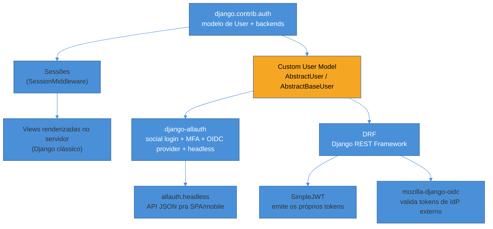
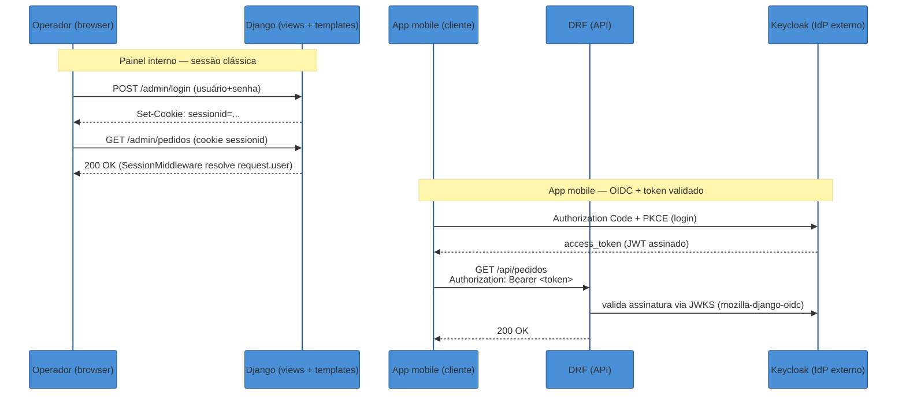
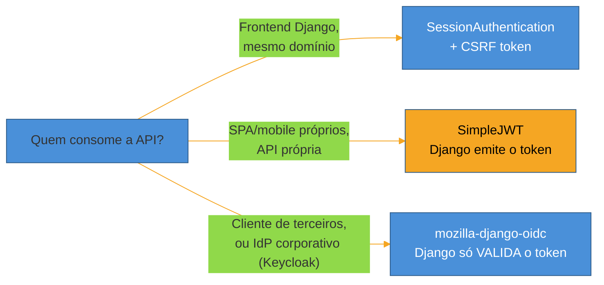

# Python — Django

> [!abstract] TL;DR
> Django nasceu com autenticação embutida — `django.contrib.auth` mais o framework de sessões dá login funcional em minutos, e isso não é acidente: é a razão de o Django ainda ser, em 2026, uma escolha defensável para auth em vez de terceirizar tudo para um serviço externo desde o dia 1. Mas essa conveniência esconde uma decisão que **precisa** ser tomada antes da primeira `migrate`: o `AUTH_USER_MODEL`. Trocar de modelo de usuário depois que o banco já tem dados é uma cirurgia de múltiplos passos, sem caminho oficialmente suportado pelo Django — por isso todo projeto novo, mesmo que vá usar só `username`/`email`/`password` padrão, deveria subclassear `AbstractUser` no primeiro commit. A partir daí, o mapa se divide em duas frentes que raramente aparecem juntas em tutoriais: **sessão** (o modelo nativo do Django, ainda a resposta certa para a maioria das aplicações web renderizadas no servidor) e **API stateless** (DRF + SimpleJWT, ou validação de token de um IdP externo via OIDC) — e **django-allauth** entra como a peça que cobre login social, MFA e, desde as versões recentes, um **provider OIDC genérico** e um **modo headless** que devolve JSON em vez de renderizar templates, permitindo usar o motor de contas do allauth atrás de uma SPA ou app mobile sem abrir mão da bateria de recursos (verificação de e-mail, recuperação de senha, rate limiting de login) que ele já resolve.

> [!question]- Perguntas que esta nota responde
> - Por que decidir o `AUTH_USER_MODEL` no primeiro dia é quase irreversível, e o que fazer se você "esqueceu"?
> - Quando usar `AbstractUser` e quando `AbstractBaseUser`?
> - Sessão do Django ainda serve em 2026? Quando trocar por JWT, e quando usar os dois ao mesmo tempo?
> - O que o django-allauth resolve que dá muito trabalho reimplementar (social login, MFA, provider OIDC, modo headless)?
> - Como um endpoint DRF valida um token OIDC emitido por um IdP externo (Keycloak) em vez de emitir o próprio token?
> - Async views funcionam com auth no Django, ou é uma armadilha?

Esta nota assume que você já sabe **o que** é uma sessão, um JWT, o fluxo OAuth/OIDC e RBAC — isso foi ensinado nos sub-galhos anteriores desta trilha, em [[02 - Sessões e cookies — auth stateful]], [[03 - JWT e a família de tokens]] e [[2 - OAuth 2.1 e OpenID Connect/03 - OpenID Connect — identidade sobre OAuth|OpenID Connect — identidade sobre OAuth]]. O que falta é a **materialização**: como esses conceitos viram `settings.py`, migrations e classes Python dentro de um projeto Django real. Vale registrar uma fronteira também: a trilha [[03-Dominios/Tecnologia/Python/index|Tecnologia/Python]] não cobre auth — o assunto mora aqui, na trilha Auth e Identidade, por decisão deliberada de design (a trilha Python trata linguagem e runtime, não protocolos de identidade).

## O mapa do ecossistema

Antes de escrever uma linha de código, vale ver o território. O Django não tem "um jeito de fazer auth" — tem uma pilha de camadas que se combinam de formas diferentes dependendo do tipo de cliente:



Quatro peças fazem o trabalho pesado:

- **`django.contrib.auth`** — o núcleo: modelo de usuário, backends de autenticação (a lógica que decide se `usuario`+`senha` são válidos), hashing de senha (PBKDF2 por padrão, com Argon2 disponível via `PASSWORD_HASHERS`), e o sistema de `Group`/`Permission` que serve de RBAC nativo.
- **Sessões** (`django.contrib.sessions`) — o modo default de manter alguém "logado" entre requisições: um cookie `sessionid` que aponta para um registro no backend de sessão (banco, cache, Redis). Ainda a resposta certa para a maioria dos sites renderizados no servidor — não é legado, é a ferramenta certa pro trabalho certo.
- **django-allauth** — a distribuição mais completa de "conta de usuário" pronta para uso: cadastro, verificação de e-mail, reset de senha, login social (Google, GitHub, etc.), MFA (TOTP e, mais recentemente, WebAuthn/passkeys), um **provider OIDC genérico** para plugar qualquer IdP compatível (incluindo Keycloak) e, desde 2024-2026, um **modo headless** que expõe tudo isso como API JSON.
- **Django REST Framework (DRF) + SimpleJWT** — quando o consumidor não é um navegador rodando templates Django, mas uma SPA, app mobile ou serviço externo que quer chamar sua API com um token Bearer.

> [!info] Versão em aberto
> Esta nota reflete **Django 5.2 LTS** (suporte até 2028) e **django-allauth 65.x** (release 65.18.0, maio de 2026). Django 5.2 expandiu suporte assíncrono em `django.contrib.auth` (login/logout/verificação de sessão com métodos `async`), o que muda a resposta de "async e auth combinam?" — cobrimos isso mais adiante. Confirme as versões nos requirements do seu projeto antes de replicar configurações.

## A decisão do dia 1: o custom User model

Se você só vai lembrar de uma coisa desta nota, que seja esta: **crie um `AUTH_USER_MODEL` customizado antes da primeira migration**, mesmo que ele comece idêntico ao `User` padrão do Django.

### Por que "esperar pra ver se precisa" é a decisão errada

O Django resolve o modelo de usuário através da configuração `AUTH_USER_MODEL` em todo lugar do framework — toda `ForeignKey` que aponta para "o usuário" (em `admin`, em `contrib.auth`, em qualquer app de terceiros que tenha uma relação com usuário) referencia essa configuração, não uma classe fixa. Isso significa que a decisão não é "vou trocar uma classe Python depois" — é **trocar a tabela que dezenas de outras tabelas referenciam por chave estrangeira**, depois que o banco de produção já tem linhas nelas.

Não existe um comando `manage.py migrate_to_custom_user` oficial. A rota documentada pela comunidade — criar uma tabela nova com `db_table` apontando para o nome antigo, reescrever manualmente o histórico de migrations, e rodar tudo isso primeiro em staging com backup completo — funciona, mas é um projeto à parte, arriscado, que se paga em horas de trabalho manual e ansiedade de produção. É a categoria de problema que aparece nas primeiras posições de busca sob o título "a decisão que 90% dos projetos Django erram" — e o erro não é técnico, é de sequência: a decisão foi adiada até custar caro.

### AbstractUser vs AbstractBaseUser

Duas bases servem de ponto de partida, e a escolha entre elas depende de quanto do modelo padrão você quer manter:

- **`AbstractUser`** — herda todos os campos do `User` padrão (`username`, `email`, `first_name`, `last_name`, `is_staff`, `is_active`, etc.) e toda a integração com `admin`, `Group`/`Permission` e formulários prontos. Você só adiciona os campos extras que precisar. **Esta é a escolha certa para a maioria absoluta dos projetos** — inclusive quando você não tem nenhum campo extra em mente hoje, porque o custo de "ter e não precisar" é zero, e o custo de "precisar e não ter" é a migração dolorosa acima.
- **`AbstractBaseUser`** — não traz campo nenhum além do necessário para autenticação (senha, `last_login`); você declara `USERNAME_FIELD`, os campos obrigatórios e implementa o `UserManager` do zero. Faz sentido quando a identidade do usuário não é username nem email tradicional (ex.: login por CPF, por número de telefone com fluxo próprio, ou um esquema de conta totalmente diferente do padrão Django), ou quando você quer eliminar campos que nunca vai usar (`first_name`/`last_name` em domínios onde isso não faz sentido). Espere de 6 a 12 horas extras de setup comparado a `AbstractUser`, porque você reimplementa managers, formulários de admin e validações que `AbstractUser` já resolve.

```python
# users/models.py — o arquétipo recomendado para 90% dos projetos novos
from django.contrib.auth.models import AbstractUser
from django.db import models


class User(AbstractUser):
    """Custom user model — existe desde o commit inicial, mesmo sem
    campos extras hoje. O custo de manter é zero; o custo de precisar
    dele depois de popular o banco é uma migração manual e arriscada."""

    # Exemplo de campo que só um custom model permite adicionar sem dor:
    organization = models.ForeignKey(
        "tenants.Organization", null=True, blank=True,
        on_delete=models.SET_NULL, related_name="members",
    )


# settings.py
AUTH_USER_MODEL = "users.User"
```

> [!warning] Nunca importar `django.contrib.auth.models.User` diretamente
> **O que acontece:** um app referencia `from django.contrib.auth.models import User` em vez de `settings.AUTH_USER_MODEL` (em `models.py`, para `ForeignKey`) ou `get_user_model()` (em qualquer outro lugar — views, forms, testes).
> **Por quê:** se `AUTH_USER_MODEL` aponta para `users.User`, o import direto do `User` embutido aponta para uma tabela **diferente** — o app quebra silenciosamente, ou pior, cria relações contra o modelo errado.
> **Como evitar:** regra simples e sem exceção — `models.py` usa a string `"users.User"` ou `settings.AUTH_USER_MODEL` (evita import circular); todo o resto do código usa `django.contrib.auth.get_user_model()`.

### Se você já esqueceu

Se o projeto já está em produção com o `User` padrão e populado, a rota documentada (Caktus Group, TestDriven.io e outras fontes convergem no mesmo roteiro) é: criar um modelo novo idêntico ao `User` original mas com `class Meta: db_table = "auth_user"` (reaproveitando a tabela existente, evitando migração de dados), trocar todas as referências para `get_user_model()`/`AUTH_USER_MODEL`, resetar o histórico de migrations do app afetado, e testar exaustivamente em staging antes de tocar produção. Não há atalho seguro — é o preço de ter adiado a decisão.

## O exemplo trabalhado: uma API de pedidos com dois tipos de cliente

Vamos seguir um cenário concreto pelo resto da nota: uma aplicação Django que serve (1) um painel administrativo renderizado no servidor, para operadores internos, e (2) uma API consumida por um app mobile de clientes finais. Essa combinação é comum o suficiente para justificar as duas abordagens de auth lado a lado — e é exatamente o tipo de decisão que aparece em entrevista como "como você projetaria autenticação para uma aplicação com essas duas superfícies?".



O painel interno usa **sessão** — é a resposta certa porque o cliente é um navegador que já mantém cookies, o CSRF do Django já protege as rotas, e não há necessidade de um token portável entre serviços. O app mobile usa um **token validado contra o Keycloak** — a API Django nunca emite o próprio token nem guarda senha do cliente final; ela só confia na assinatura de um IdP externo, um padrão que aprofundamos adiante.

## Sessão: por que ainda é a resposta certa (e como configurá-la bem)

`django.contrib.auth` mais `django.contrib.sessions` dão login funcional com poucas linhas — `login(request, user)` grava o `user.id` (mais o hash da senha, para invalidar a sessão se a senha mudar) num registro de sessão do lado do servidor, e devolve um cookie `sessionid` opaco ao cliente. Nenhum dado sensível trafega no cookie; ele é só uma chave.

```python
# settings.py — os flags que fecham as brechas mais comuns em produção
SESSION_COOKIE_SECURE = True       # cookie só trafega em HTTPS
SESSION_COOKIE_HTTPONLY = True     # JavaScript não lê o cookie
SESSION_COOKIE_SAMESITE = "Lax"    # bloqueia a maioria dos vetores de CSRF
                                    # sem quebrar navegação normal (links externos)
CSRF_COOKIE_SECURE = True
CSRF_COOKIE_SAMESITE = "Lax"
CSRF_COOKIE_HTTPONLY = False       # JS PRECISA ler este pra enviar em headers AJAX
SECURE_SSL_REDIRECT = True
SECURE_HSTS_SECONDS = 31536000
```

Repare a assimetria entre `SESSION_COOKIE_HTTPONLY` (sempre `True` — não há motivo para JavaScript ler o `sessionid`) e `CSRF_COOKIE_HTTPONLY` (precisa ser `False`, porque o próprio mecanismo de proteção CSRF do Django depende do frontend ler o valor do cookie e reenviá-lo como header em requisições AJAX). É um detalhe fácil de configurar errado copiando um checklist de segurança genérico sem entender o porquê.

O comando `python manage.py check --deploy` audita boa parte dessa lista automaticamente — vale rodar antes de todo deploy, não só na primeira vez.

## DRF: as três formas de autenticar uma API

Quando o cliente não é mais um navegador rodando templates Django, `SessionAuthentication` deixa de ser suficiente sozinha — mas isso não significa "sempre use JWT". Há três caminhos, e a escolha certa depende de quem é o cliente:



### SimpleJWT — quando o Django é a autoridade

`djangorestframework-simplejwt` faz sentido quando o próprio Django é quem autentica o usuário e emite o token — não há IdP externo, o backend controla a conta do usuário do início ao fim. É a opção mais comum para uma API própria consumida por um app mobile ou SPA do mesmo produto.

```python
# settings.py
from datetime import timedelta

REST_FRAMEWORK = {
    "DEFAULT_AUTHENTICATION_CLASSES": (
        "rest_framework_simplejwt.authentication.JWTAuthentication",
    ),
}

SIMPLE_JWT = {
    "ACCESS_TOKEN_LIFETIME": timedelta(minutes=5),
    "REFRESH_TOKEN_LIFETIME": timedelta(days=7),
    "ROTATE_REFRESH_TOKENS": True,        # cada refresh emite um novo refresh token
    "BLACKLIST_AFTER_ROTATION": True,     # o antigo é invalidado — detecta reuse
    "ALGORITHM": "RS256",                 # assinatura assimétrica > HS256 compartilhado
}

# INSTALLED_APPS precisa incluir "rest_framework_simplejwt.token_blacklist"
# para BLACKLIST_AFTER_ROTATION funcionar.
```

`ROTATE_REFRESH_TOKENS` + `BLACKLIST_AFTER_ROTATION` juntos implementam o padrão de **refresh token rotation com detecção de reuse** que a nota [[2 - OAuth 2.1 e OpenID Connect/05 - Tokens em produção|Tokens em produção]] descreve em teoria: cada troca de refresh token invalida o anterior, então se um token roubado for reaproveitado depois que o legítimo já rotacionou, o servidor detecta a tentativa de reuso e pode revogar a cadeia inteira. Vale rodar `manage.py flushexpiredtokens` periodicamente (um cron diário é a recomendação da documentação oficial) para não deixar a tabela de blacklist crescer sem limite.

### Validando token OIDC de um IdP externo — a ponte para o Keycloak

Quando a identidade não é gerenciada pelo Django — o Keycloak (ou outro IdP corporativo) é quem autentica o usuário e emite o token — o papel do Django muda de **emissor** para **validador**. É aqui que `mozilla-django-oidc` (ou o backend equivalente do allauth) entra: ele não faz login algum, só confere que o `access_token` recebido no header `Authorization` foi assinado por uma chave que consta no JWKS do IdP, e popula `request.user` a partir das claims do token.

```python
# settings.py
OIDC_RP_CLIENT_ID = "django-api"
OIDC_OP_JWKS_ENDPOINT = "https://keycloak.exemplo.com/realms/acme/protocol/openid-connect/certs"

REST_FRAMEWORK = {
    "DEFAULT_AUTHENTICATION_CLASSES": (
        "mozilla_django_oidc.contrib.drf.OIDCAuthentication",
    ),
}
```

Essa é a peça que fecha o loop com o Keycloak (aprofundado no sub-galho 5 desta trilha): o Django deixa de guardar senha alguma para esses usuários — ele confia inteiramente na assinatura do IdP, exatamente o modelo de "resource server" descrito na nota [[2 - OAuth 2.1 e OpenID Connect/03 - OpenID Connect — identidade sobre OAuth|OpenID Connect]].

> [!question]- Por que não usar SimpleJWT E validar token do Keycloak ao mesmo tempo?
> Dá, e é comum: um serviço interno emite tokens próprios via SimpleJWT para clientes internos de confiança, enquanto outro endpoint da mesma API valida tokens de um IdP corporativo para parceiros externos. DRF suporta múltiplas `DEFAULT_AUTHENTICATION_CLASSES` simultâneas — ele tenta cada uma em ordem até uma autenticar com sucesso. O que **não** faz sentido é o Django emitir *e* validar o mesmo tipo de token para o mesmo cliente — isso é redundância sem ganho.

## django-allauth: contas prontas, social login, MFA e o modo headless

Reimplementar cadastro, verificação de e-mail, reset de senha, rate limiting de tentativas de login e login social do zero é trabalho real, cheio de detalhes de segurança fáceis de errar (token de reset previsível, e-mail de verificação sem expiração, falta de rate limit em `/login`). **django-allauth** resolve essa camada inteira, e evoluiu, nas versões recentes, para cobrir três cenários que costumavam exigir bibliotecas separadas:

- **Social login** — o caso original: `google`, `github`, `microsoft` e dezenas de outros provedores, com o fluxo OAuth já implementado.
- **MFA** — TOTP (Google Authenticator e equivalentes) e, mais recentemente, WebAuthn/passkeys nativos, cobrindo o terreno da nota [[../1 - Fundamentos de identidade/05 - Passkeys e WebAuthn — o presente sem senha|Passkeys e WebAuthn]] direto na camada de conta.
- **Provider OIDC genérico** — em vez de um provider dedicado por serviço, o allauth expõe um provider `openid_connect` configurável para *qualquer* IdP compatível com OIDC, incluindo um Keycloak self-hosted. Isso significa que "logar com a conta corporativa via Keycloak" e "logar com Google" usam a mesma peça de infraestrutura no lado Django.
- **Modo headless** — a mudança mais relevante para arquiteturas modernas: em vez de renderizar templates HTML de login/cadastro, o allauth pode operar em `HEADLESS_ONLY = True`, expondo toda a lógica de conta (login, cadastro, reset de senha, MFA, social login) como uma API JSON documentada via OpenAPI, para uma SPA ou app mobile consumir diretamente.

```python
# settings.py — esqueleto de configuração allauth com OIDC genérico + headless

INSTALLED_APPS += [
    "allauth",
    "allauth.account",
    "allauth.socialaccount",
    "allauth.socialaccount.providers.openid_connect",
    "allauth.mfa",
    "allauth.headless",
]

AUTHENTICATION_BACKENDS = [
    "django.contrib.auth.backends.ModelBackend",
    "allauth.account.auth_backends.AuthenticationBackend",
]

SOCIALACCOUNT_PROVIDERS = {
    "openid_connect": {
        "APPS": [
            {
                "provider_id": "keycloak",
                "name": "Acme SSO",
                "client_id": "django-app",
                "secret": env("KEYCLOAK_CLIENT_SECRET"),
                "settings": {
                    "server_url": (
                        "https://keycloak.exemplo.com/realms/acme"
                        "/.well-known/openid-configuration"
                    ),
                },
                # PKCE configurável por app desde as versões recentes:
                "oauth_pkce_enabled": True,
            }
        ]
    }
}

HEADLESS_ONLY = True
HEADLESS_CLIENTS = ["app", "browser"]  # limita os tipos de cliente aceitos
```

Com `HEADLESS_ONLY = True`, as rotas tradicionais de template (`/accounts/login/`, etc.) somem, e o allauth passa a responder em `/_allauth/{client}/v1/...` com JSON — o front-end (SPA ou app) implementa suas próprias telas, mas toda a lógica de negócio de conta continua no allauth, testada e mantida por uma comunidade grande, em vez de reimplementada à mão.

> [!warning] Configurar allauth sem decidir a estratégia de token da API primeiro
> **O que acontece:** o time configura `HEADLESS_ONLY` e o provider OIDC, mas não decide se as chamadas subsequentes à API vão usar sessão, um token próprio do allauth (via `Token Strategy`), ou SimpleJWT — e acaba com dois mecanismos de auth concorrentes e inconsistentes.
> **Por quê:** o allauth headless resolve o *fluxo de conta* (login, cadastro, MFA) — ele não substitui a decisão de *como a API vai autenticar as próximas requisições* depois que a conta existe. Por padrão ele reaproveita a própria estratégia de sessão/token do allauth, mas isso precisa ser uma decisão explícita, documentada, não um acidente de configuração.
> **Como evitar:** decidir a estratégia de token da API primeiro (SimpleJWT próprio, ou emissão de sessão) e configurar o allauth para alimentar essa decisão, não o contrário.

## RBAC nativo: Group e Permission

O sistema de `Group`/`Permission` do `django.contrib.auth` é um RBAC funcional sem biblioteca adicional: cada modelo ganha automaticamente permissões `add`/`change`/`delete`/`view`, um `Group` agrega permissões, e um usuário herda todas as permissões de todos os grupos aos quais pertence.

```python
# Verificação de permissão em uma view DRF
from rest_framework.permissions import BasePermission


class IsOrderManager(BasePermission):
    def has_permission(self, request, view):
        return request.user.groups.filter(name="order_managers").exists()


class PedidoViewSet(viewsets.ModelViewSet):
    permission_classes = [IsAuthenticated, IsOrderManager]
```

Isso cobre RBAC **coarse-grained** bem — "quem pode gerenciar pedidos" — mas não fine-grained ("este operador só pode ver pedidos da própria filial"), que exige checagem por objeto (`has_object_permission`) ou uma biblioteca como `django-guardian`. A nota [[3 - Autorização e multi-tenancy/01 - RBAC, ABAC e ReBAC — os três modelos|RBAC, ABAC e ReBAC]] cobre quando esse modelo simples deixa de bastar — o Django nativo não tenta resolver ReBAC ou multi-tenancy, e não deveria: isso é responsabilidade de uma camada de autorização mais expressiva por cima.

## Async views e auth: o que funciona e o que ainda trava

Django 5.2 expandiu o suporte assíncrono dentro de `django.contrib.auth` — `alogin()`, `alogout()`, verificação assíncrona de sessão — o que muda a resposta que era comum até pouco tempo atrás ("nem tente misturar async com auth no Django"). Hoje, uma view `async def` pode chamar `await auth.alogin(request, user)` sem sair do contexto assíncrono.

O ponto de atenção fica no **middleware**: `AuthenticationMiddleware` (que popula `request.user`) e `SessionMiddleware` continuam, por padrão, síncronos. Quando um middleware síncrono fica entre o servidor ASGI e uma view assíncrona, o Django adapta automaticamente rodando esse middleware em sua própria thread — funciona, mas introduz uma troca de contexto por requisição que não existe numa stack 100% assíncrona. Middleware customizado que precisa funcionar sob WSGI e ASGI deve checar `asyncio.iscoroutinefunction(get_response)` e implementar os dois caminhos.

```python
# view assíncrona chamando auth assíncrono — Django 5.2+
from django.contrib import auth
from django.http import JsonResponse


async def alogin_view(request):
    user = await auth.aauthenticate(request, username=..., password=...)
    if user is not None:
        await auth.alogin(request, user)
        return JsonResponse({"status": "ok"})
    return JsonResponse({"status": "invalid"}, status=401)
```

> [!warning] Chamar código síncrono de auth dentro de uma view async sem `sync_to_async`
> **O que acontece:** uma view `async def` chama `request.user` diretamente antes de o middleware ter resolvido o usuário de forma assíncrona, ou invoca uma função sync de `contrib.auth` sem envolver com `sync_to_async(..., thread_sensitive=True)`.
> **Por quê:** partes do stack ainda dependem de estado thread-local (a conexão de banco, o objeto `request`); chamar isso do event loop assíncrono sem a ponte correta lança `SynchronousOnlyOperation`.
> **Como evitar:** usar as variantes `a*` (`aauthenticate`, `alogin`, `alogout`) disponíveis desde Django 5.2 sempre que a view for assíncrona, e `sync_to_async(thread_sensitive=True)` para qualquer código de terceiros ainda síncrono que precise tocar `request.user`.

## Armadilhas do stack

> [!warning] Adiar a decisão do custom User model
> **O que acontece:** o projeto começa com o `User` padrão "porque é mais rápido", e meses depois precisa de um campo extra, ou de trocar o campo de login para e-mail — e o banco já tem milhares de linhas.
> **Por quê:** `AUTH_USER_MODEL` é referenciado por chave estrangeira em todo o framework; trocá-lo depois de migrar é uma operação manual, arriscada, sem suporte oficial do Django.
> **Como evitar:** todo projeto novo cria `users.User(AbstractUser)` no primeiro commit, mesmo sem campos extras planejados — o custo de manter é zero.

> [!warning] Misturar SessionAuthentication e SimpleJWT sem decidir CSRF explicitamente
> **O que acontece:** uma API usa `SessionAuthentication` (porque o mesmo domínio já tem cookies de sessão do painel admin) mas não configura o envio do token CSRF em chamadas AJAX de escrita (POST/PUT/DELETE), e o cliente recebe 403 de forma intermitente e confusa.
> **Por quê:** DRF desabilita o enforcement de CSRF para `APIView` por padrão em várias configurações comuns, mas `SessionAuthentication` especificamente reimpõe a checagem — é fácil ter um ambiente de desenvolvimento que "funciona" (CSRF desabilitado ou ignorado) e produção que falha.
> **Como evitar:** se o cliente é first-party e compartilha domínio, usar sessão com CSRF configurado corretamente desde o ambiente de dev; se o cliente é uma SPA/mobile separado, preferir token (SimpleJWT ou validação OIDC) e não tentar fazer sessão funcionar entre origens diferentes.

> [!warning] Configurar django-allauth sem decidir headless vs template-based primeiro
> **O que acontece:** o time mistura páginas renderizadas pelo allauth com chamadas de API para o mesmo fluxo de conta, criando dois caminhos de autenticação parcialmente redundantes.
> **Por quê:** `HEADLESS_ONLY` é uma decisão de arquitetura, não um detalhe de configuração — ela determina se o allauth é dono da UI ou só do backend de conta.
> **Como evitar:** decidir no início do projeto se o frontend é server-rendered (allauth clássico, com templates) ou uma SPA/app separado (allauth headless) — raramente os dois modos coexistem bem no mesmo fluxo de login.

## Em entrevista

A pergunta que aparece com mais frequência não é "como configurar SimpleJWT" — é "como você decidiria entre sessão e JWT numa API Django, e por quê". Uma resposta fraca lista as duas opções sem critério: "sessão é pra web, JWT é pra API". Uma resposta forte amarra a escolha ao **cliente**: sessão funciona bem quando o cliente compartilha domínio e já tem cookies (o frontend é o próprio Django, ou uma SPA no mesmo domínio com BFF), porque o CSRF do Django já resolve o vetor de ataque relevante; token (JWT emitido ou validado de um IdP) entra quando o cliente é um app mobile, um serviço externo, ou quando múltiplos backends precisam validar o mesmo token sem consultar um banco de sessões compartilhado.

> **Entrevistador:** "Por que vocês decidiram criar um custom User model desde o início, mesmo sem precisar de campos extras no MVP?"
>
> **Resposta fraca:** "Porque é boa prática do Django."
>
> **Resposta forte:** "Porque `AUTH_USER_MODEL` é referenciado por chave estrangeira em praticamente todo lugar do framework que lida com usuário — trocar esse modelo depois que o banco tem dados de produção não tem um caminho oficialmente suportado, é uma migração manual de tabelas com risco real de perda de integridade referencial. O custo de criar `users.User(AbstractUser)` vazio no dia 1 é zero — uma classe a mais, sem diferença de comportamento. O custo de não ter feito isso e precisar depois é, na prática, um projeto de migração de banco em produção. Não é uma escolha entre 'fazer certo' e 'fazer rápido' — fazer certo *é* rápido aqui."

Essa resposta demonstra que a decisão não veio de um checklist copiado, mas do entendimento de *por que* o Django amarra o modelo de usuário dessa forma — a mesma distinção entre "decorou o passo" e "entende a consequência" que aparece em qualquer pergunta de arquitetura bem feita.

## How to explain in English

> "Django ships with authentication built in — sessions and `contrib.auth` give you working login in minutes — but that convenience hides one nearly irreversible decision: the custom user model has to be set before the first migration, because `AUTH_USER_MODEL` is referenced by foreign key throughout the framework, and there's no officially supported path to swap it once the database has data. From there, the stack splits into session auth — still the right default for server-rendered apps — and API auth, where SimpleJWT issues Django's own tokens for first-party clients, while `mozilla-django-oidc` validates tokens issued by an external IdP like Keycloak, turning Django into a resource server instead of a token issuer. django-allauth ties social login, MFA and a generic OIDC provider together, and its headless mode now exposes all of that as a JSON API for SPAs and mobile clients instead of rendered templates."

| PT | EN |
|----|----|
| Modelo de usuário customizado | Custom user model |
| Backend de autenticação | Authentication backend |
| Sessão do lado do servidor | Server-side session |
| Emissor de token | Token issuer |
| Servidor de recursos | Resource server |
| Validação de token | Token validation |
| Rotação de refresh token | Refresh token rotation |
| Detecção de reuso | Reuse detection |
| Modo sem cabeça (API pura) | Headless mode |
| Login social | Social login |
| Autenticação multifator | Multi-factor authentication (MFA) |
| Middleware de autenticação | Authentication middleware |

## O que vem a seguir

Django resolveu sessão nativa, custom user model como decisão de dia 1, e duas formas de API (emitir com SimpleJWT ou validar com OIDC). A próxima nota do sub-galho troca de framework para **FastAPI** — que não tem `contrib.auth` embutido, então cada peça (dependência de auth via `Depends`, validação de senha, validação de token OIDC) é montada explicitamente com bibliotecas menores. A comparação entre "framework com baterias inclusas" (Django) e "framework explícito, monta você mesmo" (FastAPI) é, em si, uma decisão arquitetural relevante para times Python que hoje operam os dois.

- [[03 - Python — FastAPI]] — a mesma matéria-prima (sessão vs token vs OIDC externo), montada peça por peça em vez de vir pronta
- [[5 - Keycloak/index|Keycloak]] — o IdP externo que `mozilla-django-oidc` e o provider OIDC do allauth integram
- [[2 - OAuth 2.1 e OpenID Connect/05 - Tokens em produção|Tokens em produção]] — a teoria por trás de `ROTATE_REFRESH_TOKENS`/`BLACKLIST_AFTER_ROTATION`

## Fontes

- **Django Project** — [*Customizing authentication in Django*](https://docs.djangoproject.com/en/6.0/topics/auth/customizing/) — AbstractUser, AbstractBaseUser, AUTH_USER_MODEL; acessado em 2026-07-11.
- **Django Project** — [*Deployment checklist*](https://docs.djangoproject.com/en/6.0/howto/deployment/checklist/) — flags de segurança de cookie/CSRF/HSTS; acessado em 2026-07-11.
- **Django Project** — [*Asynchronous support*](https://docs.djangoproject.com/en/6.0/topics/async/) — auth assíncrono, adaptação de middleware síncrono sob ASGI; acessado em 2026-07-11.
- **Django Project** — [*Django 5.2 release notes*](https://docs.djangoproject.com/en/6.0/releases/5.2/) — expansão de métodos assíncronos em contrib.auth; acessado em 2026-07-11.
- **django-allauth (docs.allauth.org)** — [*Headless*](https://docs.allauth.org/en/dev/headless/index.html) — modo headless, HEADLESS_CLIENTS, integração DRF/Django Ninja; acessado em 2026-07-11.
- **django-allauth (docs.allauth.org)** — [*OpenID Connect provider*](https://docs.allauth.org/en/dev/socialaccount/providers/openid_connect.html) — provider genérico para qualquer IdP OIDC, PKCE por app; acessado em 2026-07-11.
- **django-allauth (docs.allauth.org)** — [*Release notes 65.18.0*](https://docs.allauth.org/en/dev/release-notes/recent.html) — HEADLESS_CLIENTS, JWT algorithm configurável, WebAuthn/passkeys; acessado em 2026-07-11.
- **Simple JWT (django-rest-framework-simplejwt.readthedocs.io)** — [*Settings*](https://django-rest-framework-simplejwt.readthedocs.io/en/stable/settings.html) — ROTATE_REFRESH_TOKENS, BLACKLIST_AFTER_ROTATION, flushexpiredtokens; acessado em 2026-07-11.
- **mozilla-django-oidc (readthedocs)** — [*DRF integration*](https://mozilla-django-oidc.readthedocs.io/en/stable/drf.html) — validação de access token via JWKS para Django REST Framework; acessado em 2026-07-11.
- **Django REST Framework** — [*Authentication*](https://www.django-rest-framework.org/api-guide/authentication/) — SessionAuthentication, CSRF, classes de autenticação combináveis; acessado em 2026-07-11.
- **Django REST Framework** — [*Permissions*](https://www.django-rest-framework.org/api-guide/permissions/) — has_permission/has_object_permission, composição de permissões; acessado em 2026-07-11.
- **TestDriven.io** — [*Migrating to a Custom User Model Mid-project in Django*](https://testdriven.io/blog/django-custom-user-model-migration/) — o roteiro documentado de migração tardia; acessado em 2026-07-11.
- **Caktus Group** — [*How to Switch to a Custom Django User Model Mid-Project*](https://www.caktusgroup.com/blog/2019/04/26/how-switch-custom-django-user-model-mid-project/) — técnica de `db_table` para preservar dados; acessado em 2026-07-11.
- **WorkOS** — [*Top 5 authentication solutions for secure Django apps in 2026*](https://workos.com/blog/top-authentication-solutions-django-2026) — panorama allauth vs SimpleJWT vs enterprise SSO; acessado em 2026-07-11.
- **djangoproject.in** — [*Django Production Settings: Every Security Config Explained*](https://djangoproject.in/blog/django-production-settings/) — SESSION_COOKIE_SAMESITE, CSRF_COOKIE_HTTPONLY; acessado em 2026-07-11.
