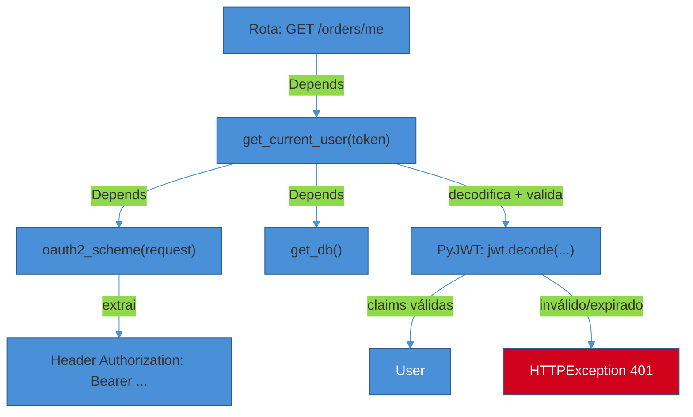
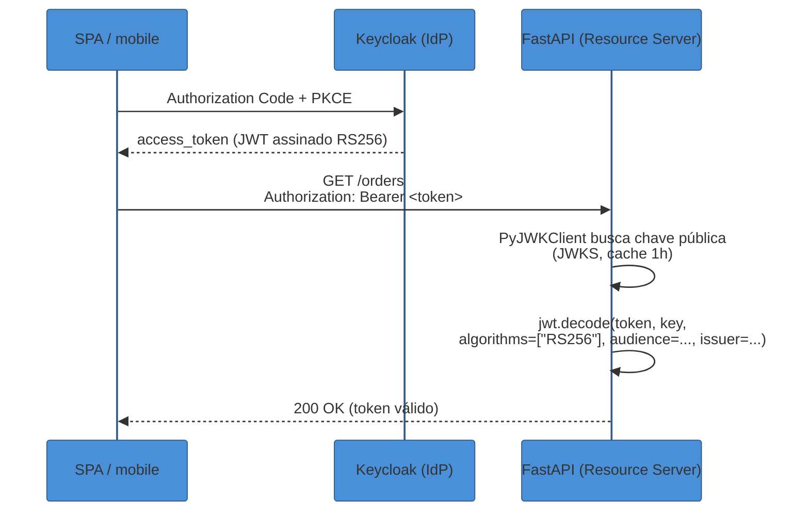
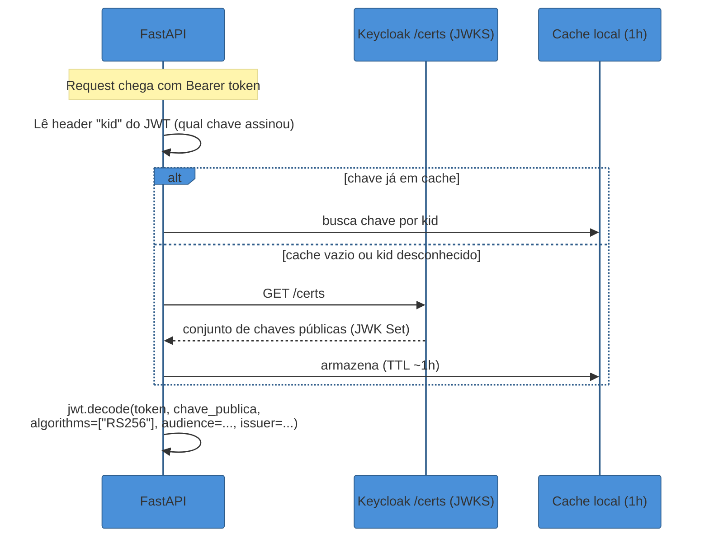
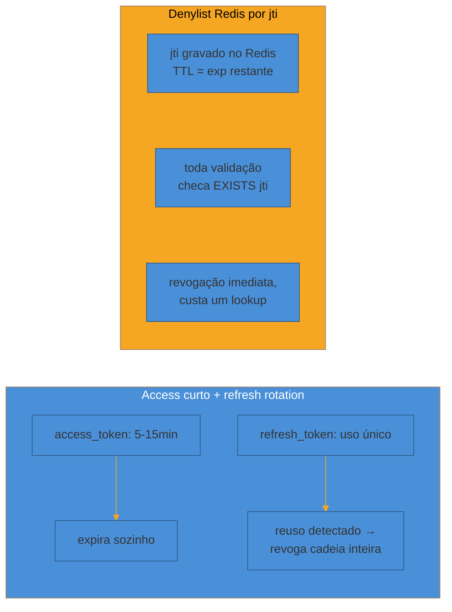

# Python — FastAPI

> [!abstract] TL;DR
> Django resolve auth com baterias incluídas: um sistema de sessão pronto, um `User` model, middlewares que já sabem popular `request.user`. **FastAPI não tem nada disso** — e essa ausência não é uma lacuna a lamentar, é o próprio design do framework. FastAPI não tem opinião sobre autenticação porque sua unidade de composição é a **dependência** (`Depends`): auth em FastAPI não é um middleware que roda antes de tudo, é uma função comum que você declara como parâmetro de uma rota, e que o framework resolve, encadeia e injeta como qualquer outro dado de entrada. `fastapi.security` fornece só os schemas que descrevem *o formato* da credencial (`OAuth2PasswordBearer` para bearer tokens, `HTTPBearer`, `APIKeyHeader`) — a lógica de validar o token, decidir se é válido, buscar o usuário, tudo isso é código seu, escrito como uma dependência que qualquer rota declara via `Depends(get_current_user)`. O padrão 2026 para uma API stateless é: **PyJWT** para emitir e validar tokens (não `python-jose`, que está sem release há mais de um ano e carrega CVEs abertos); **pwdlib** para hash de senha local (não `passlib`, que está em manutenção mínima desde 2020); e, quando o token vem de um IdP externo como Keycloak, validação via **JWKS** com `PyJWKClient` — sem chamar o IdP a cada request. Scopes viram um segundo parâmetro de `Depends`, tão granular quanto o endpoint precisar. Este é o oposto do modelo Django: lá você configura um sistema; aqui você **monta** um, peça por peça, e cada peça é uma função Python comum.

> [!question]- Perguntas que esta nota responde
> - Por que FastAPI não tem "sistema de auth" embutido, e o que `Depends` tem a ver com isso?
> - O que `OAuth2PasswordBearer` realmente faz — e o que ele explicitamente *não* faz?
> - PyJWT ou Authlib: quando cada um, e por que `python-jose` está fora de cogitação em 2026?
> - Como validar um JWT emitido por um IdP externo (Keycloak) via JWKS, sem reinventar um authorization server?
> - Passlib está morrendo — o que usar no lugar, e o que muda na prática?
> - Como restringir um endpoint a um scope específico sem duplicar lógica de autorização em cada rota?
> - JWT é stateless — então como revogar um token antes de ele expirar?

## O design que explica tudo: auth é dependência, não middleware

A trilha Python (galho 5, em construção em outra sessão) cobre a linguagem em si — sintaxe, tipagem, concorrência, o motor CPython — mas **não cobre auth**; a implementação de autenticação e autorização em Python mora inteiramente aqui, na trilha Auth e Identidade. Isso vale tanto para Django ([[03 - Auth nos stacks/02 - Python — Django|nota anterior]]) quanto para FastAPI.

E a diferença entre as duas notas não é de detalhe, é de **filosofia**. Django é "baterias incluídas": abra `settings.py`, adicione `django.contrib.auth` ao `INSTALLED_APPS`, e o framework já sabe fazer login, logout, hash de senha, e popular `request.user` em toda view via middleware — porque Django assume sessão como o modelo padrão de autenticação web. FastAPI não assume nada. Ele nem sequer tem o conceito de "usuário logado" embutido — o que ele tem é um mecanismo genérico de **injeção de dependência**, e autenticação é só um dos milhares de usos possíveis desse mecanismo.

Uma dependência em FastAPI é uma função (ou classable) comum que o framework chama antes de executar a rota, resolve o retorno, e injeta como parâmetro. Isso não é uma metáfora — é literalmente como você recebe um `db: Session` ou um `settings: Settings` em qualquer endpoint. Auth usa o mesmo mecanismo: uma dependência `get_current_user` que extrai o token do header `Authorization`, valida, busca o usuário (ou decodifica os claims direto, sem tocar banco), e devolve um objeto `User` — ou levanta `HTTPException(401)` se qualquer etapa falhar[^fastapi-di]. A rota declara essa dependência como qualquer parâmetro:

```python
from fastapi import Depends
from typing import Annotated

@app.get("/orders/me")
async def my_orders(current_user: Annotated[User, Depends(get_current_user)]):
    return await get_orders_for(current_user.id)
```

Não existe "registrar um middleware de auth global" — se uma rota não declara `Depends(get_current_user)`, ela simplesmente não passa por nenhuma checagem, e isso é **intencional**: torna óbvio, olhando a assinatura da função, quais rotas são protegidas e quais não são. O preço dessa explicitação é que você escreve a lógica de validação você mesmo; o ganho é que essa lógica é uma função Python testável, mockável via `app.dependency_overrides`, e componível — dependências podem depender de outras dependências, formando uma cadeia que o FastAPI resolve na ordem certa automaticamente[^di-nesting].



O papel de `fastapi.security` nesse desenho é bem mais estreito do que parece à primeira vista: ele não valida nada, só **descreve o formato esperado da credencial** para o OpenAPI e extrai o valor bruto do request. `OAuth2PasswordBearer(tokenUrl="token")`, por exemplo, diz ao Swagger UI "esta API espera um Bearer token, obtido via `POST /token`" e, em runtime, só faz uma coisa: ler o header `Authorization`, conferir que começa com `Bearer `, e devolver a string do token — ou lançar 401 se o header estiver ausente. Toda a validação de assinatura, expiração, claims — isso é 100% responsabilidade da dependência que você escreve em cima[^oauth2-scheme].

## O fluxo recomendado 2026: API stateless com JWT + OIDC

Para uma API backend consumida por SPA, mobile ou outro serviço, o padrão de mercado em 2026 é: o FastAPI **não emite senha nem gerencia login por conta própria na maioria dos casos modernos** — ele delega a autenticação a um IdP (Keycloak, Auth0, Cognito) via OIDC, e seu único trabalho é **validar** o token que chega em cada request. Isso é o inverso do tutorial oficial do FastAPI (que ensina emitir e assinar seu próprio JWT com senha local, HS256, um segredo simétrico) — útil para entender o mecanismo, mas raramente o desenho de produção em 2026, porque centralizar emissão de token no seu próprio código significa reimplementar login, MFA, recovery de senha e rotação de chave — tudo que um IdP já resolve.



Nesse desenho, o FastAPI nunca vê senha, nunca assina token, nunca gerencia refresh token diretamente (isso é papel do IdP e do client) — ele só **verifica**: a assinatura bate com a chave pública do IdP, o token não expirou, o `aud` (audience) é esta API, o `iss` (issuer) é o Keycloak esperado. É o mesmo fluxo Authorization Code + PKCE de [[2 - OAuth 2.1 e OpenID Connect/02 - Authorization Code + PKCE — o fluxo canônico|SG2-02]] — aqui a materialização é só o lado "resource server que valida", não o lado "authorization server que emite".

Quando o FastAPI *é* o dono do login (produto pequeno, sem IdP externo, primeira parte), o padrão do tutorial oficial ainda se aplica, com dois ajustes de 2026: use `pwdlib` no lugar de `passlib`, e `PyJWT` no lugar de `python-jose`.

## Código essencial: OAuth2PasswordBearer, hash de senha e emissão de JWT

O ponto de entrada — o schema que descreve o formato Bearer para o OpenAPI e extrai o token do header:

```python
from fastapi.security import OAuth2PasswordBearer

oauth2_scheme = OAuth2PasswordBearer(tokenUrl="token")
```

Hash de senha com `pwdlib` (o sucessor recomendado do `passlib` — mais em "Armadilhas" abaixo):

```python
from pwdlib import PasswordHash

password_hash = PasswordHash.recommended()  # Argon2id por padrão

def hash_password(plain: str) -> str:
    return password_hash.hash(plain)

def verify_password(plain: str, hashed: str) -> bool:
    return password_hash.verify(plain, hashed)
```

Emissão de um JWT próprio com `PyJWT` (cenário "FastAPI é o IdP"):

```python
import jwt
from datetime import datetime, timedelta, timezone

SECRET_KEY = settings.jwt_secret  # nunca hardcoded; vem de secret manager
ALGORITHM = "HS256"

def create_access_token(subject: str, expires_minutes: int = 15) -> str:
    now = datetime.now(timezone.utc)
    payload = {
        "sub": subject,
        "iat": now,
        "exp": now + timedelta(minutes=expires_minutes),
        "iss": "https://api.exemplo.com",
        "aud": "api.exemplo.com",
    }
    return jwt.encode(payload, SECRET_KEY, algorithm=ALGORITHM)
```

E a dependência que fecha o ciclo — o `get_current_user` que toda rota protegida declara:

```python
from typing import Annotated
from fastapi import Depends, HTTPException, status

async def get_current_user(
    token: Annotated[str, Depends(oauth2_scheme)],
) -> User:
    credentials_exception = HTTPException(
        status_code=status.HTTP_401_UNAUTHORIZED,
        detail="Could not validate credentials",
        headers={"WWW-Authenticate": "Bearer"},
    )
    try:
        payload = jwt.decode(
            token, SECRET_KEY, algorithms=[ALGORITHM],
            audience="api.exemplo.com", issuer="https://api.exemplo.com",
        )
    except jwt.ExpiredSignatureError:
        raise credentials_exception
    except jwt.InvalidTokenError:
        raise credentials_exception

    user = await get_user_by_username(payload["sub"])
    if user is None:
        raise credentials_exception
    return user
```

Repare que a dependência resolve `token` via `Depends(oauth2_scheme)` — outra dependência, aninhada. É exatamente a cadeia que o diagrama Mermaid acima mostra: FastAPI resolve `oauth2_scheme` primeiro (extrai o header), depois passa o resultado para `get_current_user`, e só então a rota recebe o `User` já validado.

> [!question]- Por que jogar `exp`/`iss`/`aud` no `jwt.decode` e não conferir manualmente depois?
> Porque `jwt.decode` faz a validação **atomicamente** — se qualquer claim obrigatória não bater, ele levanta a exceção específica (`ExpiredSignatureError`, `InvalidAudienceError`, `InvalidIssuerError`) antes mesmo de devolver o payload. Conferir manualmente depois de decodificar sem essas checagens embutidas é um padrão frágil: já houve implementações que decodificavam sem `verify_signature=True` por engano, ou esqueciam de checar `exp`, aceitando token expirado. Deixe a biblioteca fazer a checagem — é o que ela existe para fazer.

## Validando token de um IdP externo (Keycloak) via JWKS

Quando o token não é emitido pelo próprio FastAPI, mas por um IdP externo como Keycloak, a única mudança estrutural é **de onde vem a chave pública** usada para verificar a assinatura. Em vez de um segredo simétrico (HS256) guardado nas duas pontas, o IdP assina com uma chave **assimétrica** (RS256 ou ES256) e publica a chave pública correspondente num endpoint JWKS (`/.well-known/jwks.json` ou, no Keycloak, `/realms/<realm>/protocol/openid-connect/certs`)[^skycloak-jwks].



`PyJWKClient` (parte do próprio pacote `PyJWT`) implementa esse cache automaticamente: ele busca o JWKS na primeira validação, guarda em memória, e só refaz a chamada de rede se aparecer um `kid` (key ID) desconhecido no cabeçalho do JWT — o que normalmente só acontece durante rotação de chave no IdP[^pyjwt-jwks].

```python
import jwt
from jwt import PyJWKClient

JWKS_URL = "https://keycloak.exemplo.com/realms/meu-realm/protocol/openid-connect/certs"
jwks_client = PyJWKClient(JWKS_URL, cache_keys=True)

async def get_current_user_from_idp(
    token: Annotated[str, Depends(oauth2_scheme)],
) -> User:
    try:
        signing_key = jwks_client.get_signing_key_from_jwt(token)
        payload = jwt.decode(
            token,
            signing_key.key,
            algorithms=["RS256"],
            audience="meu-client-id",
            issuer="https://keycloak.exemplo.com/realms/meu-realm",
        )
    except jwt.PyJWKClientError:
        raise HTTPException(401, "Could not fetch signing key")
    except jwt.InvalidTokenError:
        raise HTTPException(401, "Invalid token")

    return User(
        id=payload["sub"],
        username=payload.get("preferred_username"),
        roles=payload.get("realm_access", {}).get("roles", []),
    )
```

Note que aqui o FastAPI **nunca chama o Keycloak por request** — ele valida localmente, usando a chave pública já cacheada. Isso é estruturalmente mais rápido e resiliente do que introspecção remota (`RFC 7662`, coberta em [[2 - OAuth 2.1 e OpenID Connect/05 - Tokens em produção|SG2-05]]): validação local não depende do IdP estar no ar a cada chamada de API, só na hora de renovar o cache de chaves. O trade-off é o clássico de qualquer JWT stateless — coberto na seção de revogação abaixo.

Quando o objetivo é mais do que validar um token — construir um **cliente OAuth2/OIDC completo** que inicia o fluxo de autorização (redirects, troca de código, sessão) —, esse é o papel do **Authlib**, não do PyJWT. Authlib é uma biblioteca de escopo mais amplo: implementa cliente e servidor OAuth1/OAuth2/OIDC, com integração pronta para Starlette (`authlib.integrations.starlette_client`)[^authlib-starlette]. Mas repare a pegadinha: o cliente OIDC do Authlib para Starlette depende, por padrão, de **sessão server-side** (via `SessionMiddleware`) para guardar `state` e `code_verifier` entre o redirect de ida e o de volta — o que é natural para uma aplicação com sessão web, mas contraria uma API puramente stateless[^authlib-caveat]. Na prática, a divisão de trabalho fica assim: se o FastAPI só **valida** tokens de um IdP (o caso mais comum de "resource server"), PyJWT + PyJWKClient basta e não exige sessão nenhuma; se o FastAPI precisa **ele mesmo conduzir** um login OAuth (por exemplo, um backend que faz login social em nome do usuário, no padrão BFF), Authlib é a ferramenta certa, e aí sessão volta a fazer sentido — o mesmo padrão BFF detalhado em [[2 - OAuth 2.1 e OpenID Connect/05 - Tokens em produção|SG2-05]].

## Scopes por endpoint: granularidade sem duplicar lógica

Scopes em FastAPI usam o mesmo mecanismo de dependência, só que com um parâmetro especial: `SecurityScopes`, injetado automaticamente e populado com a lista de scopes exigidos, acumulados de toda a cadeia de `Security(...)` daquela rota[^oauth2-scopes-doc]. Isso permite declarar, por endpoint, exatamente quais permissões são necessárias — sem escrever `if "orders:write" not in user.scopes` manualmente em cada handler:

```python
from fastapi import Security
from fastapi.security import SecurityScopes

oauth2_scheme = OAuth2PasswordBearer(
    tokenUrl="token",
    scopes={"orders:read": "Ler pedidos", "orders:write": "Criar/editar pedidos"},
)

async def get_current_user_with_scopes(
    security_scopes: SecurityScopes,
    token: Annotated[str, Depends(oauth2_scheme)],
) -> User:
    payload = jwt.decode(token, SECRET_KEY, algorithms=[ALGORITHM])
    token_scopes = payload.get("scopes", [])

    for scope in security_scopes.scopes:
        if scope not in token_scopes:
            raise HTTPException(
                status_code=403,
                detail="Not enough permissions",
                headers={"WWW-Authenticate": f'Bearer scope="{security_scopes.scope_str}"'},
            )
    return await get_user_by_username(payload["sub"])


@app.post("/orders")
async def create_order(
    current_user: Annotated[
        User, Security(get_current_user_with_scopes, scopes=["orders:write"])
    ],
):
    ...


@app.get("/orders")
async def list_orders(
    current_user: Annotated[
        User, Security(get_current_user_with_scopes, scopes=["orders:read"])
    ],
):
    ...
```

O detalhe que costuma passar batido: `Security()` é uma variante de `Depends()` especificamente pensada para carregar metadados de scopes — ela aceita o parâmetro `scopes=[...]`, que `Depends()` sozinho não tem. E como scopes se **acumulam** ao longo da cadeia de dependências (uma dependência que exige `["orders:read"]` chamada de dentro de outra que exige `["orders:write"]` resulta em `security_scopes.scopes == ["orders:read", "orders:write"]`), é possível compor requisitos de permissão em camadas — um scope base checado por uma dependência comum, mais um scope específico por rota — sem reescrever a checagem em cada endpoint[^oauth2-scopes-doc].

## Revogação: JWT é stateless, então o que "revogar" significa aqui

Este é o ponto onde a conversa teórica de [[2 - OAuth 2.1 e OpenID Connect/05 - Tokens em produção|SG2-05]] vira decisão concreta de código. Um JWT validado localmente (por assinatura, sem consultar o IdP) é, por design, **impossível de revogar de verdade** antes do `exp` — o servidor que valida não tem como saber que o token foi "cancelado" em algum outro lugar, porque ele nunca pergunta a ninguém, só confere a matemática da assinatura. Duas estratégias resolvem isso, com trade-offs opostos:

**Estratégia 1 — access token curto + refresh token com rotação.** O `access_token` vive poucos minutos (5-15 é a faixa comum em 2026); revogar, na prática, significa "parar de emitir novos access tokens" — o refresh token é invalidado no IdP (ou no seu próprio banco, se você emite refresh tokens), e o access token antigo simplesmente expira sozinho, dentro da janela curta[^jwt-2026-practices]. Cada troca de refresh token por um novo par gera também um **novo** refresh token, de uso único — se um token de refresh roubado for reutilizado depois que o legítimo já rotacionou, isso é sinal de comprometimento, e o servidor revoga a cadeia inteira[^refresh-rotation]. É a estratégia recomendada como padrão: simples, sem infraestrutura extra, e o "risco residual" (alguém usar um access token roubado por até 15 minutos) é aceitável para a maioria dos produtos.

**Estratégia 2 — denylist em Redis por `jti`.** Para revogação **imediata** (ex.: logout explícito de "sair de todos os dispositivos", ou resposta a incidente de segurança), cada JWT carrega um `jti` (JWT ID) único; ao revogar, você grava esse `jti` no Redis com TTL igual ao tempo restante até o `exp` do token — e a dependência de validação, antes de aceitar o token, checa se o `jti` está na denylist[^redis-denylist]. Isso reintroduz exatamente o lookup stateful que o JWT existia para evitar — mas é um lookup rápido (um `EXISTS` no Redis, não uma query relacional), e o TTL garante que a entrada se autolimpa quando o token expiraria de qualquer forma.



Na prática, os dois não são mutuamente exclusivos: a maioria dos produtos usa access curto + refresh rotation como base, e reserva a denylist Redis para o caso raro de "preciso matar este token específico agora" (conta comprometida, usuário removido no meio de uma sessão ativa) — em vez de pagar o custo de um `EXISTS` em toda validação apenas para cobrir um cenário incomum.

## Armadilhas do stack

> [!warning] Usar python-jose em vez de PyJWT
> **O que acontece:** o tutorial oficial mais antigo do FastAPI ensinava `python-jose`, e ainda existem exemplos e projetos legados usando essa biblioteca. **Por quê:** `python-jose` não recebe release há mais de um ano, carrega CVEs conhecidos (incluindo uma correção necessária para impedir assinar JWT com chave pública, `CVE-2024-33663`) e depende de `ecdsa`, que tem uma vulnerabilidade sem correção planejada pelos mantenedores. **Como evitar:** usar `PyJWT` — ativamente mantido, API mais enxuta, e é o que a documentação atual do FastAPI recomenda. Projetos legados em `python-jose` devem migrar.

> [!warning] Tratar passlib como escolha padrão para projeto novo
> **O que acontece:** copiar o snippet clássico `from passlib.context import CryptContext` de tutoriais antigos. **Por quê:** o último release do passlib foi em 2020; ele emite warnings ao usar o módulo `crypt` da stdlib, que será removido em versões futuras do Python, e a documentação oficial do FastAPI já trocou seus próprios exemplos para `pwdlib`. **Como evitar:** usar `pwdlib` (`PasswordHash.recommended()`, Argon2id por padrão) em projetos novos. Se o projeto já tem hashes legados em algoritmos que o `pwdlib` não cobre, `passlib` ainda serve como ferramenta de migração pontual — não como dependência de produção contínua.

> [!warning] Dependência de auth que revalida a cada request sem cache de chave
> **O que acontece:** uma implementação ingênua chama o endpoint JWKS do IdP a cada request para buscar a chave pública, em vez de cachear. **Por quê:** isso transforma um resource server "sem estado" (que deveria escalar horizontalmente sem depender do IdP estar sempre disponível) numa dependência direta e por-request do IdP — se o Keycloak ficar lento ou fora do ar, toda a API para junto, mesmo que os tokens em circulação ainda sejam válidos. **Como evitar:** usar `PyJWKClient` com `cache_keys=True` (o padrão), que só refaz a chamada de rede quando aparece um `kid` desconhecido — tipicamente só durante rotação de chave no IdP, um evento raro e previsível.

> [!warning] Esquecer de validar `aud` e `iss`
> **O que acontece:** `jwt.decode(token, key, algorithms=["RS256"])`, sem passar `audience=` nem `issuer=`. **Por quê:** sem essas checagens, um token legítimo emitido para **outra** aplicação no mesmo IdP (outro `client_id`, outro `aud`) pode ser aceito por engano por esta API — a assinatura bate (é o mesmo IdP), mas o token nunca deveria valer para este recurso. É um erro de configuração, não de biblioteca: o PyJWT suporta as duas checagens, só não as impõe se você não as passar. **Como evitar:** sempre declarar `audience=` e `issuer=` esperados no `jwt.decode`, e tratar `InvalidAudienceError`/`InvalidIssuerError` como falha de autenticação, não como bug a ser silenciado.

> [!warning] Guardar segredo simétrico (HS256) em código ou repositório
> **O que acontece:** `SECRET_KEY = "minha-chave-super-secreta"` direto no módulo, commitado no Git. **Por quê:** com HS256, a mesma chave assina e valida — qualquer vazamento de código-fonte (repositório público por engano, backup exposto) dá ao atacante o poder de forjar tokens válidos para qualquer usuário. **Como evitar:** carregar o segredo de uma variável de ambiente ou secret manager (Vault, AWS Secrets Manager, etc.), nunca hardcoded; e, quando possível, preferir RS256/ES256 (chave assimétrica) mesmo para tokens emitidos pela própria API — só a chave privada, guardada com mais rigor, consegue assinar; a pública, exposta, só serve para validar.

> [!info] Versões cravadas nesta nota
> FastAPI ~0.136.x (abr/2026), Pydantic ≥2.9 como piso mínimo do FastAPI; PyJWT 2.13.x; pwdlib como sucessor recomendado do passlib (a própria documentação oficial do FastAPI já migrou seus exemplos); Keycloak 26.x como IdP de referência da trilha (ver [[5 - Keycloak/01 - Keycloak — realms, clients e flows|SG5]]). Ecossistema Python de auth muda rápido — revalidar estas escolhas a cada 6-12 meses.

## Contraste rápido: FastAPI vs Django

A nota anterior deste sub-galho cobriu Django, e vale fechar o contraste em uma frase, porque é exatamente o tipo de pergunta que aparece em entrevista técnica sênior: **Django escolhe por você** (sessão como padrão, middleware de auth automático, `User` model pronto — você configura um sistema existente); **FastAPI não escolhe nada** (você monta o mecanismo peça por peça via `Depends`, decide entre sessão ou token, decide a biblioteca de JWT, decide onde revogar). Nenhum dos dois é "melhor" em abstrato — Django ganha em velocidade de entrega para CRUD tradicional com sessão web; FastAPI ganha em controle fino quando a arquitetura já é API-first, stateless, e potencialmente delegando identidade a um IdP externo desde o primeiro dia.

## Em entrevista

A pergunta mais comum aqui não é "como você configura JWT no FastAPI" — é **"por que FastAPI não tem um sistema de auth pronto como Django?"**, testando se o candidato entende dependency injection como conceito, não só como sintaxe.

Uma resposta fraca: "FastAPI é mais leve, então você tem que escrever mais coisa você mesmo."

Uma resposta forte amarra a ausência de auth embutido ao próprio modelo de composição do framework: "FastAPI não tem opinião sobre auth porque toda a arquitetura do framework gira em torno de dependências resolvidas por request, não de middleware global. Um sistema de auth 'pronto' pressuporia uma forma específica de autenticar — sessão, JWT, API key — e o FastAPI prefere deixar isso para o desenvolvedor, expondo só os primitivos (`OAuth2PasswordBearer`, `HTTPBearer`, `SecurityScopes`) que descrevem o *formato* da credencial para o OpenAPI. A lógica de validação em si é uma função comum, testável isoladamente e sobreposta em testes via `dependency_overrides` — o que, na prática, costuma resultar em auth mais fácil de auditar do que um middleware Django que roda implicitamente em toda request."

> **Entrevistador:** "Se JWT é stateless, como você revoga um token antes dele expirar?"
>
> **Resposta fraca:** "Não dá, JWT não pode ser revogado."
>
> **Resposta forte:** "Tecnicamente, validação puramente local (por assinatura) não permite revogação instantânea sem reintroduzir estado — e é exatamente por isso que a estratégia padrão de 2026 é access token curto (5-15 minutos) combinado com refresh token de uso único: revogar vira 'parar de emitir novo access token', e o token vazado expira sozinho dentro de uma janela pequena e aceitável. Quando o requisito é revogação imediata — resposta a incidente, logout forçado de todos os dispositivos —, a resposta é uma denylist de `jti` no Redis com TTL igual ao tempo restante do token, que reintroduz um lookup stateful de propósito, só para esse caso específico, sem pagar o custo dele em toda validação do dia a dia."

## How to explain in English

> "FastAPI doesn't ship an auth system the way Django does, because its whole design revolves around dependency injection resolved per-request, not global middleware. `fastapi.security` only describes the shape of the credential for OpenAPI — actual validation is a plain function you write and declare with `Depends`, which makes it composable and independently testable. The 2026-standard pattern for a stateless API is PyJWT for issuing or verifying tokens, pwdlib for local password hashing (passlib is barely maintained), and — when tokens come from an external IdP like Keycloak — local validation via JWKS with `PyJWKClient`, so the API never calls the IdP on every request."

| PT | EN |
|----|----|
| Injeção de dependência | Dependency injection |
| Esquema de segurança | Security scheme |
| Token portador (bearer) | Bearer token |
| Servidor de recursos | Resource server |
| Conjunto de chaves JWKS | JWKS (JSON Web Key Set) |
| Identificador de chave | Key ID (`kid`) |
| Escopo por endpoint | Per-endpoint scope |
| Lista de bloqueio (negação) | Denylist / blocklist |
| Rotação de refresh token | Refresh token rotation |
| Reutilização detectada | Reuse detection |
| Validação local vs introspecção | Local validation vs introspection |

## O que vem a seguir

FastAPI fecha o par de notas Python (Django = sessão/baterias-incluídas; FastAPI = DI/stateless monte-você-mesmo). A próxima parada muda de linguagem e de modelo mental por completo: o sub-galho segue para **Node — Express**, onde a pergunta já não é "sessão ou token", mas "Passport (middleware clássico) ou better-auth (a aposta moderna que hoje mantém o próprio Auth.js)" — e onde a trilha Node já cobre JWT e OIDC em profundidade, então a nota de lá é ponte parcial, não reconstrução do zero.

- [[04 - Auth nos stacks/04 - Node — Express|Node — Express]] — próxima nota do sub-galho
- [[2 - OAuth 2.1 e OpenID Connect/03 - JWT e a família de tokens|JWT e a família de tokens]] — anatomia do token que PyJWT decodifica aqui
- [[2 - OAuth 2.1 e OpenID Connect/05 - Tokens em produção|Tokens em produção]] — o padrão BFF, onde guardar token no browser, denylist vs introspecção em profundidade
- [[5 - Keycloak/01 - Keycloak — realms, clients e flows|Keycloak — realms, clients e flows]] — o IdP do outro lado do JWKS validado aqui

## Fontes

- **FastAPI (oficial)** — [*OAuth2 with Password (and hashing), Bearer with JWT tokens*](https://fastapi.tiangolo.com/tutorial/security/oauth2-jwt/) — tutorial canônico de JWT local; acessado em 2026-07-11.
- **FastAPI (oficial)** — [*OAuth2 scopes*](https://fastapi.tiangolo.com/advanced/security/oauth2-scopes/) — `SecurityScopes`, acumulação de escopos na cadeia de dependências; acessado em 2026-07-11.
- **FastAPI (oficial)** — [*Get Current User*](https://fastapi.tiangolo.com/tutorial/security/get-current-user/) — padrão de dependência aninhada para usuário autenticado; acessado em 2026-07-11.
- **GitHub — fastapi/fastapi Discussion #11773** — [*passlib seems not being maintenanced anymore*](https://github.com/fastapi/fastapi/discussions/11773) — decisão de migrar exemplos oficiais para pwdlib; acessado em 2026-07-11.
- **frankie567 (autor do pwdlib)** — [*Introducing pwdlib, a modern password hash helper for Python*](https://www.fvoron.com/blog/introducing-pwdlib-a-modern-password-hash-helper-for-python/) — motivação e escopo do pwdlib frente ao passlib; acessado em 2026-07-11.
- **PyJWT (oficial)** — [*API Reference*](https://pyjwt.readthedocs.io/en/stable/api.html) — `PyJWKClient`, `jwt.decode`, exceções de validação; acessado em 2026-07-11.
- **Skycloak** — [*FastAPI Authentication with Keycloak: Securing Python APIs*](https://skycloak.io/blog/keycloak-fastapi-python-api-authentication/) — padrão de validação via JWKS contra Keycloak; acessado em 2026-07-11.
- **CVE Details / Snyk** — [*python-jose vulnerabilities*](https://security.snyk.io/package/pip/python-jose) — CVEs abertos e dependência `ecdsa` sem correção planejada; acessado em 2026-07-11.
- **Authlib (oficial)** — [*Starlette OAuth Client*](https://docs.authlib.org/en/latest/client/starlette.html) — integração OIDC via `SessionMiddleware`; acessado em 2026-07-11.
- **Authlib (oficial)** — [*FastAPI Integration*](https://docs.authlib.org/en/latest/oauth2/client/web/fastapi.html) — cliente OAuth2/OIDC para FastAPI; acessado em 2026-07-11.
- **OneUptime** — [*How to Build a Token Blacklist for JWT Revocation with Redis*](https://oneuptime.com/blog/post/2026-03-31-redis-how-to-build-a-token-blacklist-for-jwt-revocation-with-redis/view) — denylist por `jti` com TTL; acessado em 2026-07-11.
- **JSONCraft** — [*JWT Best Practices in 2026*](https://jsoncraft.dev/docs/jwt-best-practices-2026/) — access curto + refresh rotation como padrão de mercado; acessado em 2026-07-11.
- **DEV Community** — [*JWT Refresh Token Rotation in FastAPI — The Right Way*](https://dev.to/uaslimcreate/jwt-refresh-token-rotation-in-fastapi-the-right-way-4i5d) — reuse detection e revogação em cascata; acessado em 2026-07-11.
- **PropelAuth** — [*FastAPI Auth with Dependency Injection*](https://www.propelauth.com/post/fastapi-auth-with-dependency-injection) — padrão de dependências aninhadas para auth; acessado em 2026-07-11.
- **FastAPI (oficial)** — [*Release Notes*](https://fastapi.tiangolo.com/release-notes/) — versão atual (~0.136.x, abr/2026) e piso mínimo de Pydantic; acessado em 2026-07-11.

[^fastapi-di]: FastAPI (oficial), *Get Current User* — dependência que extrai token, valida e devolve usuário ou levanta `HTTPException`. [^di-nesting]: PropelAuth, *FastAPI Auth with Dependency Injection* — dependências aninhadas resolvidas na ordem correta pelo FastAPI. [^oauth2-scheme]: FastAPI (oficial), *OAuth2 with Password (and hashing)* — `OAuth2PasswordBearer` só extrai o token do header, não valida. [^skycloak-jwks]: Skycloak, *FastAPI Authentication with Keycloak* — endpoint JWKS do Keycloak e cache de uma hora. [^pyjwt-jwks]: PyJWT (oficial), *API Reference* — `PyJWKClient` com cache de duas camadas, refetch só em `kid` desconhecido. [^authlib-starlette]: Authlib (oficial), *Starlette OAuth Client* — cliente OAuth1/OAuth2/OIDC integrado a Starlette/FastAPI. [^authlib-caveat]: Authlib (oficial), *FastAPI Integration* — dependência de `SessionMiddleware` para guardar `state`/`code_verifier`. [^oauth2-scopes-doc]: FastAPI (oficial), *OAuth2 scopes* — `SecurityScopes`, `Security()` com parâmetro `scopes=`, acumulação na cadeia. [^jwt-2026-practices]: JSONCraft, *JWT Best Practices in 2026* — access token de 5-15 minutos como padrão de mercado. [^refresh-rotation]: DEV Community, *JWT Refresh Token Rotation in FastAPI* — refresh token de uso único e detecção de reuso. [^redis-denylist]: OneUptime, *How to Build a Token Blacklist for JWT Revocation with Redis* — denylist por `jti` com TTL igual ao `exp` restante.
