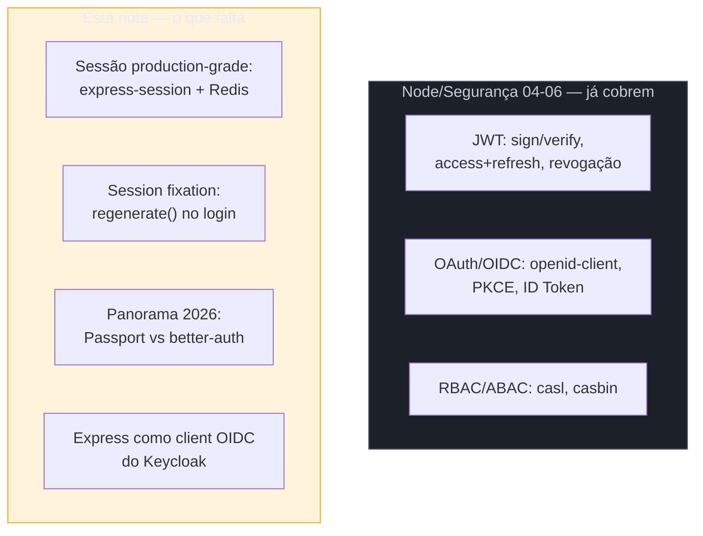
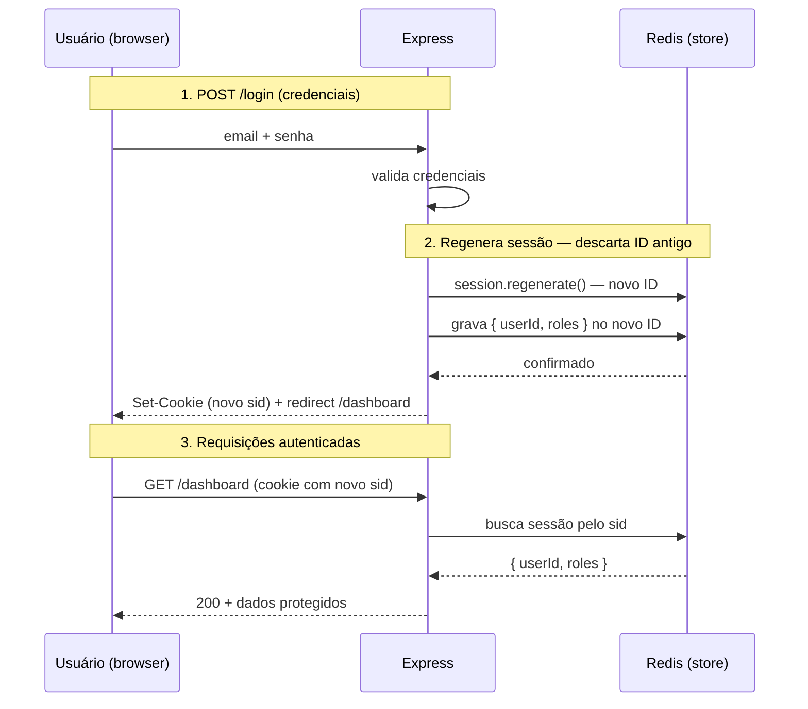
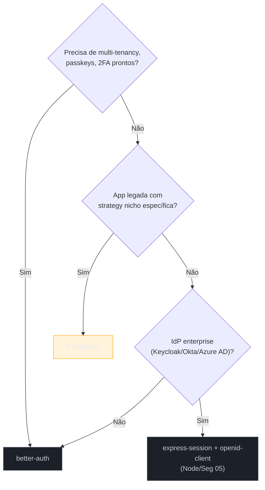

# Node — Express

> [!abstract] TL;DR
> Se você chegou aqui vindo de Node, uma parte considerável de "auth no Express" já mora em três notas de [[03-Dominios/Tecnologia/Node/Segurança/index|Node/Segurança]]: JWT com `jsonwebtoken` (04), OAuth 2.0/OIDC com `openid-client` (05), e RBAC/ABAC com `casl`/`casbin` (06). Esta nota **não repete nada disso** — ela mapeia o que já existe e completa exatamente as duas lacunas que ficaram abertas: **sessão production-grade** (`express-session` com store Redis, cookie flags corretos, rotação de ID contra session fixation) e o **panorama de bibliotecas de auth do ecossistema Node em 2026**, onde `Passport.js` — o middleware histórico com mais de 500 strategies — convive com `better-auth`, a aposta moderna que em setembro de 2025 assumiu a manutenção do próprio `Auth.js` (ex-NextAuth). Fechamos integrando Express como cliente OIDC do Keycloak, a ponte para o SG5 desta trilha. O ecossistema Node muda rápido: tudo aqui carrega data de verificação.

> [!question]- Perguntas que esta nota responde
> - O que já está coberto em Node/Segurança 04-06, e o que exatamente falta?
> - Por que `MemoryStore` (o padrão do `express-session`) é proibido em produção, e o que usar no lugar?
> - O que é session fixation, e por que regenerar o ID da sessão no login é obrigatório?
> - Passport ainda faz sentido em 2026? Quando escolher Passport vs better-auth vs rolar sessão + openid-client na mão?
> - O que o better-auth resolve que Passport não resolve, e por que ele agora também mantém o Auth.js?
> - Como um app Express consome o Keycloak como Authorization Server ao mesmo tempo em que mantém sessão web própria?

## O mapa do que já existe em Node/Segurança

Antes de qualquer coisa nova, o roteiro do que **já está resolvido** — para você nunca reinventar aqui o que outra nota do vault já cobre com profundidade:

| Quer... | Está na nota |
|---|---|
| Anatomia de JWT, `jsonwebtoken` v9, `sign()`/`verify()`, access + refresh token, revogação (blacklist Redis, `tokenVersion`) | [[03-Dominios/Tecnologia/Node/Segurança/04 - JWT e autenticação com jsonwebtoken\|Node/Seg 04 — JWT]] |
| OAuth 2.0 vs OIDC, Authorization Code + PKCE, `openid-client` v5 (`Issuer.discover`, `client.callback`, validação de ID Token), Client Credentials, Device Code | [[03-Dominios/Tecnologia/Node/Segurança/05 - OAuth 2.0 e OIDC com openid-client\|Node/Seg 05 — OAuth/OIDC]] |
| RBAC vs ABAC, `casl` (`AbilityBuilder`, condições, `subject()`), `casbin` (model.conf + policy.csv), integração com claims do JWT | [[03-Dominios/Tecnologia/Node/Segurança/06 - RBAC e ABAC com casl e casbin\|Node/Seg 06 — RBAC/ABAC]] |

Repare no que essas três notas **pressupõem**: elas descrevem uma API stateless, autenticada via Bearer token — o caso comum de SPA + backend Express como resource server. O que falta é exatamente o outro lado do espectro, ainda extremamente comum em produção: aplicações Express que servem HTML renderizado no servidor, ou que atuam como BFF (Backend-for-Frontend) mantendo o próprio estado de login via **sessão** — e a decisão de qual biblioteca usar para orquestrar login social, senha e MFA num app real, decisão que Node/Seg 04-06 não precisou tomar porque partiu do pressuposto "o cliente já chega com um JWT".



## Sessão production-grade: express-session + Redis

### Por que MemoryStore mata sua aplicação em produção

`express-session` — o middleware canônico de sessão do Express — vem, por padrão, com um `MemoryStore` que guarda cada sessão num objeto na memória do processo Node. Isso é conveniente para desenvolvimento local e catastrófico em produção por duas razões distintas: primeiro, o `MemoryStore` **vaza memória** sob a maioria das condições reais de uso, porque nunca purga sessões expiradas de forma eficiente; segundo, ele **não escala além de um único processo** — se você roda dois workers do Node (PM2 cluster mode, múltiplos pods Kubernetes, ou qualquer balanceamento de carga), um usuário autenticado no worker A é um desconhecido no worker B, porque cada processo tem sua própria cópia isolada da memória[^memorystore-warning]. O próprio `express-session` imprime um aviso explícito no console alertando sobre isso — não é um detalhe escondido na documentação, é um alarme deliberado.

A solução padrão é externalizar o armazenamento da sessão para um store compartilhado entre processos — hoje, isso quase sempre significa **Redis** via `connect-redis`.

### connect-redis: a configuração que importa

```javascript
import express from 'express'
import session from 'express-session'
import { RedisStore } from 'connect-redis'
import { createClient } from 'redis'

const redisClient = createClient({ url: process.env.REDIS_URL })
await redisClient.connect()

const app = express()

app.set('trust proxy', 1) // necessário atrás de load balancer/reverse proxy para Secure cookies funcionarem

app.use(
  session({
    store: new RedisStore({
      client: redisClient,
      prefix: 'sess:',      // namespace das chaves — evita colisão com outros dados no mesmo Redis
      ttl: 86400,           // segundos; usado se o cookie não tiver 'expires' explícito
      disableTouch: false,  // 'touch' renova o TTL a cada acesso — mantém rolling sessions consistentes com o store
    }),
    secret: process.env.SESSION_SECRET, // string de alta entropia, nunca hardcoded
    resave: false,             // não regrava a sessão se nada mudou — evita race conditions e carga desnecessária no Redis
    saveUninitialized: false, // não cria sessão para visitantes anônimos — reduz ruído no store e ajuda compliance de cookies
    rolling: true,             // renova o cookie de expiração a cada resposta — sessão "desliza" enquanto o usuário está ativo
    cookie: {
      httpOnly: true,   // inacessível via JavaScript — mitiga roubo via XSS
      secure: true,     // só trafega sobre HTTPS — obrigatório em produção
      sameSite: 'lax',  // bloqueia CSRF em requisições cross-site, mantém navegação normal (clique em link externo funciona)
      maxAge: 30 * 60 * 1000, // 30 minutos — renovado a cada request por causa de 'rolling: true'
    },
  })
)
```

Cada opção aqui resolve um problema específico de produção:

- **`prefix`** evita que as chaves da sessão colidam com outros dados que o mesmo Redis eventualmente hospede (cache de aplicação, filas, rate limiting) — sem ele, uma limpeza de cache por engano pode arrastar sessões ativas junto.
- **`resave: false` + `saveUninitialized: false`** juntos reduzem drasticamente a quantidade de escritas no Redis: a primeira evita regravar sessões que não mudaram entre requests concorrentes (o que causaria condições de corrida onde a última escrita "ganha" e apaga mudanças de outra requisição); a segunda evita criar uma entrada no Redis para todo visitante que nunca fez login, importante tanto por custo quanto por conformidade com leis de cookies (não gerar cookie de sessão para quem não precisa de estado).
- **`rolling: true`** implementa **rolling sessions**: em vez de a sessão expirar em um horário fixo desde o login, o tempo de expiração é renovado a cada requisição — um usuário ativamente usando a aplicação nunca é deslogado no meio de uma tarefa, mas uma sessão abandonada expira no tempo configurado de inatividade[^rolling-sessions].
- **`sameSite: 'lax'`** é o ponto de equilíbrio recomendado para a maioria das aplicações: bloqueia o cookie em requisições cross-site iniciadas por POST, embeds ou chamadas programáticas (o vetor real de CSRF), mas ainda anexa o cookie em navegações GET de topo — então um usuário que clica num link vindo de outro site chega logado, em vez de ser jogado para uma tela de login sem explicação[^samesite-lax].

> [!warning] `trust proxy` esquecido derruba cookies `Secure` silenciosamente
> Se sua aplicação Express roda atrás de um reverse proxy ou load balancer (Nginx, ALB, Cloudflare) que termina TLS antes de repassar a requisição por HTTP interno, o Express por padrão não sabe que a conexão original era HTTPS. Sem `app.set('trust proxy', 1)`, o Express vê a requisição interna como HTTP puro e se recusa a definir cookies `Secure` — o login funciona no ambiente de teste sem proxy e falha silenciosamente em produção, com o cookie de sessão nunca chegando ao browser.

### Session fixation: por que regenerar o ID no login não é opcional

**Session fixation** é a classe de ataque onde um atacante consegue fazer a vítima autenticar-se usando um **ID de sessão que o próprio atacante já conhece** — por exemplo, induzindo a vítima a visitar `https://app.exemplo.com/login?sessionId=ABC123` antes do login, ou explorando uma aplicação que aceita um `sessionId` vindo de fora sem invalidá-lo. Se a aplicação apenas anexa o estado "usuário autenticado" à sessão já existente, sem trocar o identificador, o atacante — que já conhece `ABC123` — passa a ter uma sessão autenticada como a vítima, sem nunca ter visto a senha dela[^session-fixation].

A defesa é regenerar o ID da sessão no exato momento em que a autenticação é bem-sucedida, descartando qualquer sessão pré-existente e criando uma nova, vinculada exclusivamente a esse login:

```javascript
app.post('/login', async (req, res) => {
  const user = await authenticateCredentials(req.body.email, req.body.password)
  if (!user) return res.status(401).json({ error: 'Invalid credentials' })

  // Regenera o session ID — invalida qualquer sessão anterior (autenticada ou não)
  // que possa ter sido fixada por um atacante antes deste login
  req.session.regenerate((err) => {
    if (err) return res.status(500).json({ error: 'Session error' })

    req.session.userId = user.id
    req.session.roles = user.roles

    // Salva explicitamente antes de responder — evita a race condition
    // onde o redirect chega ao browser antes do Redis confirmar a escrita
    req.session.save((err) => {
      if (err) return res.status(500).json({ error: 'Session error' })
      res.redirect('/dashboard')
    })
  })
})
```

`req.session.regenerate()` é a chamada que a própria documentação do Express recomenda como prática padrão contra fixation[^express-session-docs]; o callback aninhado com `req.session.save()` garante que a resposta HTTP só é enviada depois que o Redis confirmou a persistência da nova sessão — pular esse passo é uma race condition sutil que só aparece sob carga.



## O panorama de bibliotecas 2026: Passport vs better-auth

### Passport.js: o middleware histórico, deliberadamente de baixo nível

`Passport.js` é, de longe, a biblioteca de autenticação mais baixada do ecossistema Node — mais de 2 milhões de downloads semanais no npm — e mantém uma comunidade viva com mais de 500 **strategies** cobrindo praticamente todo provedor social e protocolo relevante (local, OAuth2, OIDC, WebAuthn, SAML, e provedores específicos como Google, GitHub, Facebook)[^passport-features]. Sua arquitetura é deliberadamente minimalista: Passport **não monta rotas, não assume schema de banco de dados, e não gerencia sessão sozinho** — ele apenas plugue-se no meio do pipeline de requisição do Express, delegando a decisão "o que fazer com o usuário autenticado" inteiramente para você[^passportjs-docs].

```javascript
import passport from 'passport'
import { Strategy as LocalStrategy } from 'passport-local'

passport.use(new LocalStrategy(
  { usernameField: 'email' },
  async (email, password, done) => {
    const user = await User.findByEmail(email)
    if (!user || !(await verifyPassword(password, user.passwordHash))) {
      return done(null, false, { message: 'Invalid credentials' })
    }
    return done(null, user)
  }
))

passport.serializeUser((user, done) => done(null, user.id))
passport.deserializeUser(async (id, done) => {
  const user = await User.findById(id)
  done(null, user)
})

app.use(passport.session()) // integra com express-session já configurado

app.post('/login', passport.authenticate('local', {
  successRedirect: '/dashboard',
  failureRedirect: '/login?error=1',
}))
```

Essa flexibilidade é também sua principal desvantagem em 2026: times acabam **construindo do zero** tudo que Passport não oferece — fluxo de reset de senha, verificação de email, MFA/TOTP, rate limiting de tentativas de login, gestão de múltiplos dispositivos — porque Passport nunca prometeu resolver isso[^workos-2026]. Passport continua sendo a escolha certa quando você quer controle total sobre cada peça do fluxo, ou quando precisa de uma strategy específica e obscura que só existe no seu ecossistema de 500+ plugins; ele é menos indicado quando o objetivo é "montar login completo rápido" — hoje esse é o nicho que o `better-auth` ocupa.

### better-auth: a aposta moderna, e agora guardiã do Auth.js

`better-auth` é um framework de autenticação **framework-agnostic** para TypeScript, desenhado desde o primeiro dia para funcionar igualmente bem com Express, Fastify, Next.js, Nuxt, Remix, Hono, entre outros — ao contrário de bibliotecas que nasceram acopladas a um framework específico e depois se expandiram[^better-auth-github]. Diferente de Passport, `better-auth` já vem com sessão, login por senha, verificação de email, e **plugins oficiais** para os pedaços que normalmente exigiriam integração manual: `@better-auth/passkey` (WebAuthn via SimpleWebAuthn), o plugin `organization` (multi-tenancy B2B com roles owner/admin/member prontos e access control customizável), 2FA, magic links, e mais[^better-auth-org]. Em setembro de 2025, um marco reorganizou o ecossistema: o time do `Auth.js` (o projeto antes chamado NextAuth.js) passou a ser mantido pela equipe do better-auth — quem já usa `Auth.js` continua recebendo patches de segurança normalmente, mas a recomendação oficial para projetos novos é começar direto em `better-auth`, salvo lacuna de feature muito específica[^authjs-joins].

Em Express especificamente, a integração é um catch-all route que delega tudo ao handler do better-auth:

```javascript
import express from 'express'
import { toNodeHandler } from 'better-auth/node'
import { auth } from './auth' // instância configurada do better-auth

const app = express()

// Monta o handler ANTES de qualquer middleware que parseie o body —
// express.json() antes desta linha trava as respostas do better-auth em "pending"
app.all('/api/auth/*', toNodeHandler(auth))

app.use(express.json()) // demais rotas da aplicação, depois do handler de auth

app.listen(3000)
```

> [!info] Caducidade — ecossistema Node muda rápido
> Este panorama reflete `better-auth` 1.6.x (abril de 2026) e `@better-auth/passkey` 1.6.9 (início de julho de 2026), com o consenso de mercado de setembro de 2025 (Auth.js sob o guarda-chuva better-auth) ainda vigente. O ecossistema de auth em Node tem histórico de virada rápida — NextAuth → Auth.js já foi uma renomeação anterior — então trate os nomes específicos de biblioteca como o estado da arte *hoje*, não uma garantia de 2027. O princípio que sobrevive é: sessão explícita e auditável (o que esta nota ensina) importa mais do que qual biblioteca está na moda.

### Tabela de decisão

| Critério | Passport.js | better-auth | Sessão + openid-client na mão |
|---|---|---|---|
| Login social pronto (Google, GitHub etc.) | Sim, via strategies (500+) | Sim, providers embutidos | Manual, um `Issuer` por provedor |
| Sessão/cookie gerenciados pela lib | Não — usa `express-session` externo | Sim, embutido | Você configura (esta nota) |
| MFA/2FA, passkeys, magic link | Não — implementar à mão ou plugin de terceiros | Sim, plugins oficiais | Não — implementar à mão |
| Multi-tenancy/organizações | Não | Sim, plugin `organization` | Não |
| Curva de adoção em app existente | Baixa (plugue no meio do pipeline) | Média (adota o modelo do framework) | Alta (você desenha tudo) |
| Ideal para | Apps com stack legada, strategy nicho, controle granular | SaaS novo, MVP rápido com features completas | OIDC enterprise com Keycloak/Okta/Azure AD, requisitos de segurança rigorosos e auditáveis |



## Integrando Express com Keycloak como OIDC client

Node/Seg 05 já cobre `openid-client` v5 em profundidade — Discovery, `client.callback()`, validação de ID Token. O que muda ao apontar para Keycloak em vez de Google é só o **issuer** e o fato de o realm carregar seu próprio conjunto de roles e claims customizados; o protocolo é idêntico, porque Keycloak é um Authorization Server OIDC padrão.

```javascript
import { Issuer, generators } from 'openid-client'

// O endpoint de discovery do Keycloak segue o padrão /realms/{realm}/.well-known/openid-configuration
const issuer = await Issuer.discover(
  `${process.env.KEYCLOAK_URL}/realms/${process.env.KEYCLOAK_REALM}`
)

const client = new issuer.Client({
  client_id: process.env.KEYCLOAK_CLIENT_ID,
  client_secret: process.env.KEYCLOAK_CLIENT_SECRET,
  redirect_uris: [process.env.OIDC_REDIRECT_URI],
  response_types: ['code'],
})

app.get('/auth/login', (req, res) => {
  const code_verifier = generators.codeVerifier()
  const state = generators.state()
  const nonce = generators.nonce()

  req.session.oidc = { code_verifier, state, nonce }

  const authUrl = client.authorizationUrl({
    scope: 'openid email profile',
    code_challenge: generators.codeChallenge(code_verifier),
    code_challenge_method: 'S256',
    state,
    nonce,
  })

  res.redirect(authUrl)
})

app.get('/auth/callback', async (req, res) => {
  const { code_verifier, state, nonce } = req.session.oidc ?? {}
  const params = client.callbackParams(req)

  const tokenSet = await client.callback(process.env.OIDC_REDIRECT_URI, params, {
    code_verifier, state, nonce,
  })

  // Keycloak embute roles do realm/client em claims customizados do ID Token —
  // formato depende do mapper configurado no client (ex: realm_access.roles)
  const claims = tokenSet.claims()

  // Regenera a sessão web ao trocar o "modo auth" pelo "modo autenticado" —
  // mesma defesa contra fixation da seção anterior
  req.session.regenerate((err) => {
    if (err) return res.status(500).send('Session error')
    req.session.user = {
      id: claims.sub,
      email: claims.email,
      roles: claims.realm_access?.roles ?? [],
    }
    req.session.save(() => res.redirect('/dashboard'))
  })
})
```

Note a costura das duas peças desta nota: o app Express mantém uma **sessão web tradicional** (Redis, `regenerate()` no login) para a própria aplicação, enquanto delega inteiramente a decisão "quem é este usuário" ao Keycloak via OIDC — o app nunca vê senha, nunca gerencia MFA, e ainda assim controla seu próprio ciclo de vida de sessão. O Keycloak, historicamente, oferecia um adapter dedicado (`keycloak-connect`) para esse tipo de integração, mas ele foi **deprecado** — a recomendação atual, tanto da comunidade quanto de exemplos oficiais, é usar `openid-client` (protocolo padrão) em vez de um adapter proprietário amarrado a uma versão específica do Keycloak[^keycloak-deprecation].

## Armadilhas comuns

> [!warning] Deixar `express-session` no `MemoryStore` além do ambiente de desenvolvimento
> **O que acontece:** a aplicação funciona perfeitamente em desenvolvimento e nos primeiros dias de produção com tráfego baixo, até o processo reiniciar (deploy, crash, autoscaling) e todo mundo ser deslogado — ou, pior, até você escalar para dois processos e usuários começarem a "perder login" aleatoriamente dependendo de qual worker atendeu a requisição. **Por quê:** `MemoryStore` vive isolado por processo e vaza memória sob a maioria das cargas reais — é literalmente rotulado pela própria biblioteca como não-destinado a produção. **Como evitar:** configure `connect-redis` (ou outro store compartilhado) desde o primeiro deploy, não como otimização posterior — o aviso no console na primeira execução já é o sinal para trocar.

> [!warning] Não regenerar a sessão no login
> **O que acontece:** um atacante consegue fixar um ID de sessão conhecido na vítima (via link malicioso, subdomínio comprometido, ou qualquer canal que grave um cookie de sessão antes do login) e, quando a vítima se autentica sem que o ID mude, o atacante ganha acesso à sessão autenticada usando o mesmo ID que já conhecia. **Por quê:** anexar `userId` a uma sessão pré-existente, sem trocar seu identificador, não distingue "sessão de visitante anônimo" de "sessão de usuário autenticado" — ambas compartilham o mesmo ID vulnerável. **Como evitar:** chame `req.session.regenerate()` no exato momento em que a autenticação é confirmada, antes de gravar qualquer dado de usuário na sessão — em qualquer fluxo, seja login por senha ou callback OIDC.

> [!warning] `express.json()` montado antes do handler do better-auth
> **O que acontece:** as chamadas do client SDK do better-auth (login, registro, refresh) ficam presas em "pending" indefinidamente, sem erro explícito no console — um dos bugs de integração mais reportados pela comunidade. **Por quê:** o handler do better-auth espera consumir o corpo bruto da requisição; se `express.json()` já consumiu e parseou o stream antes, o handler não recebe o payload que espera. **Como evitar:** monte `app.all('/api/auth/*', toNodeHandler(auth))` antes de `app.use(express.json())`, reservando o parser de JSON só para as rotas da aplicação que vêm depois.

## Em entrevista

A pergunta mais comum aqui não é "como configurar `express-session`" — é "por que você não usa só JWT em tudo?" ou "quando você escolheria sessão em vez de token". Uma resposta forte reconhece que a escolha não é ideológica: aplicações que servem HTML renderizado no servidor, ou que atuam como BFF absorvendo a complexidade OIDC para não expor tokens ao browser, se beneficiam de sessão — o estado fica no servidor, revogação é imediata (basta apagar a chave no Redis), e o browser só carrega um cookie opaco. APIs puras, consumidas por múltiplos clients desacoplados, tendem para JWT stateless, como as notas de Node/Segurança já cobrem.

> **Entrevistador:** "Vocês usam Passport ou rolaram a própria solução de auth?"
>
> **Resposta fraca:** "Usamos Passport porque é o padrão do mercado."
>
> **Resposta forte:** "Depende do que a aplicação precisa. Para uma app legada com uma strategy de OAuth muito específica de um parceiro, Passport ainda vale — é leve, plugável, não impõe schema. Para um SaaS novo com necessidade de multi-tenancy, passkeys e 2FA desde o dia um, hoje eu partiria de `better-auth`, porque ele já resolve essas peças com plugins oficiais em vez de eu montar cada uma à mão. E quando a identidade vem de um IdP corporativo como Keycloak, a peça que realmente importa não é a biblioteca de auth da aplicação — é o protocolo OIDC padrão via `openid-client`, porque isso me dá interoperabilidade garantida por spec, independente de qual biblioteca de sessão eu escolher por cima."

## How to explain it in English

> "Session management in Express has one hard production rule: never ship the default `MemoryStore` — it leaks memory and doesn't survive more than one process, so a shared store like Redis via `connect-redis` is mandatory from day one. The second non-negotiable is regenerating the session ID at the exact moment of login, which closes session fixation — without it, an attacker who plants a known session ID on the victim inherits their authenticated session once login completes without changing the identifier. On top of that infrastructure sits a library choice: Passport is the historical, deliberately low-level middleware with 500+ strategies but no built-in session, password reset, or MFA — you build those yourself. better-auth is the modern framework-agnostic answer, now also maintaining Auth.js since September 2025, and it ships organizations, passkeys, and 2FA as official plugins instead of DIY glue code."

| PT | EN |
|----|----|
| Sessão production-grade | Production-grade session |
| Armazenamento de sessão compartilhado | Shared session store |
| Fixação de sessão | Session fixation |
| Regenerar o ID de sessão | Regenerate the session ID |
| Sessão deslizante | Rolling session |
| Middleware de baixo nível | Low-level middleware |
| Framework-agnóstico | Framework-agnostic |
| Plugin oficial | Official plugin |
| Adapter deprecado | Deprecated adapter |
| Backend-for-Frontend (BFF) | Backend-for-Frontend (BFF) |

## O que vem a seguir

Express cobre o padrão HTML-server-side/BFF com sessão explícita. O NestJS, próxima nota, ataca o mesmo problema com uma filosofia oposta: guards declarativos, decorators e injeção de dependência em vez de middleware imperativo — sem cobertura prévia em nenhuma outra parte do vault.

- [[05 - Node — NestJS]] — guards, `@nestjs/passport`, `@nestjs/jwt`, decorators de RBAC, auth em GraphQL/WebSocket
- [[03-Dominios/Tecnologia/Node/Segurança/04 - JWT e autenticação com jsonwebtoken|Node/Seg 04]] — JWT completo, access + refresh, revogação
- [[03-Dominios/Tecnologia/Node/Segurança/05 - OAuth 2.0 e OIDC com openid-client|Node/Seg 05]] — openid-client, Authorization Code + PKCE, Client Credentials
- [[03-Dominios/Tecnologia/Node/Segurança/06 - RBAC e ABAC com casl e casbin|Node/Seg 06]] — RBAC/ABAC aplicado aos claims do token/sessão
- [[5 - Keycloak/index|Keycloak]] — o IdP que este fluxo consome como Authorization Server

## Fontes

- **Express.js** — [*session middleware*](https://expressjs.com/en/resources/middleware/session/) — documentação oficial de `express-session`: opções, `regenerate()`, stores compatíveis; acessado em 2026-07-11.
- **GitHub (expressjs/session)** — [*Issue #556 — MemoryStore is not designed for a production environment*](https://github.com/expressjs/session/issues/556) — origem e contexto do aviso de MemoryStore; acessado em 2026-07-11.
- **GitHub (tj/connect-redis)** — [*connect-redis — Redis session store for Connect*](https://github.com/tj/connect-redis) — API e opções de configuração do store Redis; acessado em 2026-07-11.
- **OneUptime** — [*How to Use connect-redis for Express Session Management*](https://oneuptime.com/blog/post/2026-03-31-redis-connect-redis-express-session/view) — configuração de produção com prefix/TTL/disableTouch; acessado em 2026-07-11.
- **Sourcery** — [*Session Fixation Attack Vulnerabilities in Web Applications*](https://www.sourcery.ai/vulnerabilities/session-fixation-attack) — mecânica do ataque de session fixation; acessado em 2026-07-11.
- **barrion.io** — [*Cookie Security Guide — HttpOnly, Secure, SameSite Examples*](https://barrion.io/blog/cookie-security-best-practices) — SameSite=Lax como ponto de equilíbrio contra CSRF; acessado em 2026-07-11.
- **Passport.js** — [*Documentation: Strategies*](https://www.passportjs.org/concepts/authentication/strategies/) e [*Features*](https://www.passportjs.org/features/) — arquitetura de strategies, 500+ plugins, design minimalista; acessado em 2026-07-11.
- **WorkOS** — [*Top 5 authentication solutions for secure Node.js apps in 2026*](https://workos.com/blog/top-authentication-solutions-node-js-2026) — comparação Passport/Auth.js/better-auth e trade-offs de baixo nível vs completo; acessado em 2026-07-11.
- **Better Auth** — [*Auth.js is now part of Better Auth*](https://better-auth.com/blog/authjs-joins-better-auth) — anúncio oficial da fusão de manutenção, setembro de 2025; acessado em 2026-07-11.
- **GitHub (better-auth/better-auth)** — [*better-auth — The most comprehensive authentication framework*](https://github.com/better-auth/better-auth) — design framework-agnostic, suporte a múltiplos frameworks; acessado em 2026-07-11.
- **Better Auth** — [*Express Integration*](https://better-auth.com/docs/integrations/express) — `toNodeHandler`, ordem de middleware, catch-all route; acessado em 2026-07-11.
- **Better Auth** — [*Organization plugin*](https://better-auth.com/docs/plugins/organization) — multi-tenancy, roles owner/admin/member, access control customizável; acessado em 2026-07-11.
- **npm** — [*@better-auth/passkey*](https://www.npmjs.com/package/@better-auth/passkey) — versão 1.6.9, plugin WebAuthn via SimpleWebAuthn; acessado em 2026-07-11.
- **Medium (Austin Cunningham)** — [*Keycloak Express Openid-client*](https://medium.com/keycloak/keycloak-express-openid-client-fabea857f11f) — deprecação do `keycloak-connect` e recomendação de `openid-client`; acessado em 2026-07-11.
- **Keycloak** — [*Node.js adapter*](https://www.keycloak.org/securing-apps/nodejs-adapter) — status do adapter oficial e alternativas recomendadas; acessado em 2026-07-11.

[^memorystore-warning]: GitHub expressjs/session Issue #556 — MemoryStore leaks memory, não escala além de um processo. [^rolling-sessions]: Express.js session middleware docs — opção `rolling` e renovação de expiração por request. [^samesite-lax]: barrion.io, Cookie Security Guide — SameSite=Lax como controle mais efetivo contra CSRF sem quebrar navegação normal. [^session-fixation]: Sourcery, Session Fixation Attack Vulnerabilities — mecânica do ataque e impacto (account takeover). [^express-session-docs]: Express.js session middleware docs — recomendação de `req.session.regenerate()` após login. [^passport-features]: Passport.js Features/Strategies docs — 500+ strategies, 2M+ downloads semanais. [^passportjs-docs]: Passport.js Documentation — não monta rotas, não assume schema, maximiza flexibilidade. [^workos-2026]: WorkOS, Top 5 authentication solutions for secure Node.js apps in 2026 — trade-offs de baixo nível do Passport. [^better-auth-github]: GitHub better-auth/better-auth — design framework-agnostic desde o início. [^better-auth-org]: Better Auth docs, plugin Organization — roles prontos e access control customizável. [^authjs-joins]: Better Auth blog, Auth.js is now part of Better Auth — fusão de manutenção, setembro de 2025. [^keycloak-deprecation]: Medium/Keycloak, Keycloak Express Openid-client — deprecação do keycloak-connect, recomendação de openid-client.
