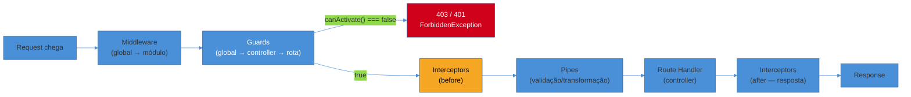

# Node — NestJS

> [!abstract] TL;DR
> No Express puro, auth é convenção: um middleware que você escreve, coloca na ordem certa, e torce para não esquecer de aplicar em alguma rota nova. O NestJS resolve o mesmo problema de um jeito estrutural — ele tem um **conceito de primeira classe** para "isso pode passar?", chamado **Guard**, que roda num ponto fixo do **request lifecycle** (depois do middleware, antes de interceptors e pipes) e que a própria injeção de dependência do framework torna testável sem subir um servidor HTTP. A peça central é o par **`@nestjs/passport` + `@nestjs/jwt`**: Passport continua fazendo o trabalho pesado de validar credenciais via **strategies** (local, JWT, OIDC — o mesmo ecossistema da nota Express), mas o Nest embrulha cada strategy num `AuthGuard` que se declara com `@UseGuards()`, e adiciona **decorators customizados** (`@Roles()`, `@CurrentUser()`) que leem metadata anexada às rotas via `Reflector`. O resultado é autorização fina — roles, ownership, scopes — expressa como anotação declarativa em vez de `if` espalhado pelo controller. A dor idiomática do Nest não é "como validar um JWT" (isso o Passport já resolve) — é **onde exatamente a auth entra em cada superfície**: guards HTTP não enxergam o mesmo `Request` em **GraphQL** (precisa de `GqlExecutionContext`) nem em **WebSocket** (o handshake acontece antes de qualquer guard rodar, e desconectar um socket autenticado incorretamente exige código explícito que o framework não dá de graça). Esta nota assume que você já sabe o que é JWT, OIDC e RBAC (cobertos em [[1 - Fundamentos de identidade/03 - JWT e a família de tokens|03 - JWT e a família de tokens]] e [[3 - Autorização e multi-tenancy/01 - RBAC, ABAC e ReBAC — os três modelos|RBAC/ABAC/ReBAC]]) e no que a nota irmã [[04 - Node — Express|04 - Node — Express]] já cobriu sobre Passport puro — o foco aqui é **o que muda quando você tem guards, DI e decorators para trabalhar**.

> [!question]- Perguntas que esta nota responde
> - Em que ordem exata o Nest processa uma requisição, e por que a auth mora nos Guards e não nos Interceptors?
> - Como uma Passport strategy vira um `AuthGuard` reutilizável, e o que `@nestjs/jwt` faz que o Passport sozinho não faz?
> - Como expressar RBAC declarativamente com `@Roles()` + `RolesGuard` + `Reflector`, sem `if` espalhado nos controllers?
> - Como validar um JWT emitido por um IdP externo (Keycloak) via JWKS, sem hardcodar chave nenhuma?
> - Por que um guard HTTP não funciona direto num resolver GraphQL ou num gateway WebSocket — o que muda em cada contexto?
> - O que a injeção de dependência do Nest realmente compra na hora de testar um guard?

## O que o Nest resolve que o Express deixa em aberto

A nota [[04 - Node — Express|Express]] mostrou como montar sessões production-grade, escolher entre Passport e better-auth, e validar tokens OIDC via `openid-client` — tudo isso rodando sobre um framework que **não tem opinião nenhuma** sobre onde a auth deve morar. Isso é uma faca de dois gumes: dá liberdade total, mas também significa que "o middleware de auth roda antes do de logging?" é uma pergunta que só o code review responde, porque não existe conceito no framework que force uma ordem.

O NestJS nasceu exatamente para fechar esse buraco. Ele empresta de Angular a ideia de que existem **categorias nomeadas** de coisas que acontecem numa requisição — não é tudo "middleware", existem **Guards**, **Interceptors**, **Pipes** e **Exception Filters**, cada um com um papel e um lugar fixo no pipeline[^lifecycle]. Auth (autenticação **e** autorização) tem uma casa dedicada: o **Guard**. Isso não é estética — significa que qualquer desenvolvedor que entra num projeto Nest novo já sabe, sem ler a lógica de negócio, **onde procurar** a decisão de "esse request pode passar?".



O ponto crítico deste diagrama, e a razão pela qual auth mora em **Guards** e não em **Interceptors**: um Guard decide **se** o handler roda — ele retorna `boolean` (ou lança) antes de qualquer outra coisa no pipeline de processamento acontecer. Um Interceptor, por definição, **embrulha** a chamada ao handler (ele roda "antes e depois", tem acesso a um `Observable` do resultado) — é a ferramenta certa para logging, cache, transformação de resposta, mas semanticamente errada para "bloquear o request", porque o próprio nome já assume que o handler *vai* rodar. Guards rodam depois do middleware (que ainda não tem acesso ao `ExecutionContext` nem sabe qual handler vai ser chamado) e antes de interceptors e pipes — é o ponto mais cedo do pipeline em que o framework já sabe **qual rota** está sendo chamada, o que é exatamente a informação que um guard de RBAC por rota precisa[^guards-order].

## Guards e `CanActivate`: a abstração central

Todo Guard implementa uma interface de um único método:

```typescript
export interface CanActivate {
  canActivate(context: ExecutionContext): boolean | Promise<boolean> | Observable<boolean>;
}
```

O `ExecutionContext` é o que dá ao Guard acesso ao request — mas de um jeito abstrato o suficiente para funcionar em HTTP, WebSocket, GraphQL e microservices sem mudar a assinatura. Para HTTP, você chama `context.switchToHttp().getRequest<Request>()`; para os outros contextos, `switchToWs()` ou o adapter do GraphQL (mais adiante). Essa abstração é o motivo de um Guard de autenticação poder, em teoria, ser reutilizado entre REST e GraphQL — só a extração do request muda.

O guard mais simples possível — verificar se existe um `Authorization` header, sem nem validar o conteúdo — já ilustra a mecânica:

```typescript
@Injectable()
export class ApiKeyGuard implements CanActivate {
  canActivate(context: ExecutionContext): boolean {
    const request = context.switchToHttp().getRequest();
    return Boolean(request.headers['x-api-key']);
  }
}
```

Aplicado com `@UseGuards(ApiKeyGuard)` — em cima de um método, de uma classe inteira (afeta todas as rotas do controller), ou globalmente via `APP_GUARD` no módulo raiz (afeta a aplicação inteira, inclusive controllers que ainda nem existem)[^guards-docs]. Na prática, quase ninguém escreve um guard de auth do zero assim — o trabalho de validar credencial de verdade (comparar hash de senha, verificar assinatura de JWT, checar `client_id`) é delegado ao Passport, e o Nest só embrulha o resultado.

## Passport dentro do Nest: strategy vira guard

O pacote `@nestjs/passport` não substitui o Passport — ele é uma camada fina que pega o conceito de **strategy** (uma classe que sabe validar um tipo de credencial e produzir um objeto de usuário) e o expõe como um `AuthGuard` gerado dinamicamente, pronto para `@UseGuards()`[^nest-passport-docs].

A strategy JWT é o caso canônico para uma API stateless. Ela declara **como extrair** o token (do header `Authorization: Bearer`) e **como validar** a assinatura — e o método `validate()` roda só **depois** que a assinatura já foi conferida pelo Passport internamente, então dentro dele você já pode confiar no payload:

```typescript
// jwt.strategy.ts
@Injectable()
export class JwtStrategy extends PassportStrategy(Strategy, 'jwt') {
  constructor(config: ConfigService) {
    super({
      jwtFromRequest: ExtractJwt.fromAuthHeaderAsBearerToken(),
      ignoreExpiration: false,
      secretOrKey: config.get<string>('JWT_SECRET'),
    });
  }

  // Só roda se a assinatura já bateu — aqui você decide o que vira req.user
  async validate(payload: { sub: string; roles: string[] }) {
    return { userId: payload.sub, roles: payload.roles };
  }
}
```

E o guard que a rota realmente usa é uma casca fininha sobre essa strategy — o segundo argumento de `AuthGuard()` é o **nome** que a strategy registrou (`'jwt'` no `super()` acima):

```typescript
// jwt-auth.guard.ts
@Injectable()
export class JwtAuthGuard extends AuthGuard('jwt') {}
```

```typescript
@UseGuards(JwtAuthGuard)
@Get('orders')
findOrders(@Req() req) {
  return this.ordersService.findByUser(req.user.userId);
}
```

Repare que **nenhuma lógica de validação de token está no controller** — o controller só declara "essa rota exige o guard JWT", e o `req.user` já chega populado. Essa separação — strategy valida, guard decide se bloqueia, controller só consome — é o que faz o Nest parecer mais verboso no primeiro contato (três arquivos para "verificar um JWT") e mais sustentável no décimo endpoint (nenhum deles reimplementa a validação).

## `@nestjs/jwt`: emitir, não só validar

`@nestjs/passport` + `passport-jwt` resolvem o lado de **validar** um token que chega. Para **emitir** tokens — o passo de login que gera o par access/refresh — o Nest tem um módulo separado, `@nestjs/jwt`, que embrulha a biblioteca `jsonwebtoken` numa `JwtService` injetável, com `sign()`/`signAsync()` e `verify()`/`verifyAsync()`[^nest-jwt-github]:

```typescript
// auth.module.ts
@Module({
  imports: [
    JwtModule.registerAsync({
      inject: [ConfigService],
      useFactory: (config: ConfigService) => ({
        secret: config.get<string>('JWT_SECRET'),
        signOptions: { expiresIn: '15m' },
      }),
    }),
  ],
  providers: [AuthService, JwtStrategy],
})
export class AuthModule {}
```

```typescript
// auth.service.ts
@Injectable()
export class AuthService {
  constructor(private jwt: JwtService) {}

  async login(user: { id: string; roles: string[] }) {
    const payload = { sub: user.id, roles: user.roles };
    return {
      access_token: await this.jwt.signAsync(payload),
      refresh_token: await this.jwt.signAsync(payload, { expiresIn: '7d' }),
    };
  }
}
```

`JwtService` e `JwtStrategy` são módulos irmãos que compartilham o mesmo segredo (ou par de chaves, se for RS256/ES256) mas resolvem lados opostos da mesma moeda: um assina, o outro verifica. O ciclo completo — access curto, refresh rotation, revogação — já foi coberto em [[2 - OAuth 2.1 e OpenID Connect/05 - Tokens em produção|05 - Tokens em produção]]; aqui o que importa é só a mecânica: no Nest, emissão e validação de JWT são dois módulos injetáveis diferentes, não uma função utilitária solta.

## Decorators customizados: RBAC sem `if` no controller

A parte mais idiomática do Nest para autorização fina é o par **decorator + `Reflector`**. A ideia: um decorator anota metadata na rota (sem lógica nenhuma), e um guard lê essa metadata em runtime para decidir. Isso separa **o que a rota exige** (declarativo, visível no controller) de **como isso é verificado** (a lógica, centralizada no guard, escrita uma vez).

```typescript
// roles.decorator.ts
export const ROLES_KEY = 'roles';
export const Roles = (...roles: string[]) => SetMetadata(ROLES_KEY, roles);
```

```typescript
// roles.guard.ts
@Injectable()
export class RolesGuard implements CanActivate {
  constructor(private reflector: Reflector) {}

  canActivate(context: ExecutionContext): boolean {
    const required = this.reflector.getAllAndOverride<string[]>(ROLES_KEY, [
      context.getHandler(), // metadata no método
      context.getClass(),   // metadata no controller (fallback)
    ]);
    if (!required?.length) return true; // rota sem @Roles() = liberada

    const { user } = context.switchToHttp().getRequest();
    return required.some((role) => user?.roles?.includes(role));
  }
}
```

```typescript
@UseGuards(JwtAuthGuard, RolesGuard)
@Roles('admin', 'billing-manager')
@Delete('invoices/:id')
deleteInvoice(@Param('id') id: string) {
  return this.invoicesService.remove(id);
}
```

`getAllAndOverride` é o detalhe que faz esse padrão escalar: ele olha primeiro o handler (método), depois a classe (controller), e usa o **primeiro valor não-`undefined`** — o que permite anotar `@Roles('user')` no controller inteiro e sobrescrever em rotas específicas com `@Roles('admin')`, sem repetir a regra em toda rota[^reflector-docs]. A ordem dos guards em `@UseGuards(JwtAuthGuard, RolesGuard)` importa e é executada da esquerda pra direita: `JwtAuthGuard` roda primeiro (autentica, popula `req.user`) e só então `RolesGuard` roda (autoriza, lê `req.user.roles`) — inverter a ordem quebraria o `RolesGuard`, que dependeria de um `user` que ainda não existe.

O `@CurrentUser()` fecha o padrão do lado da leitura — em vez de todo handler repetir `req.user`, um `createParamDecorator` extrai direto:

```typescript
// current-user.decorator.ts
export const CurrentUser = createParamDecorator(
  (data: string | undefined, ctx: ExecutionContext) => {
    const request = ctx.switchToHttp().getRequest();
    return data ? request.user?.[data] : request.user;
  },
);
```

```typescript
@Get('me')
getProfile(@CurrentUser() user: AuthUser, @CurrentUser('id') userId: string) {
  // user = objeto inteiro; userId = só o campo id
}
```

> [!question]- Por que não colocar a checagem de role dentro do próprio controller, com um `if`?
> Funciona para um endpoint. Não escala: a regra "quem pode deletar fatura" vira um `if` copiado (e divergente, com o tempo) em cada handler que toca fatura. Com `@Roles()` + `RolesGuard`, a regra existe **uma vez** (no guard) e a declaração de intenção (quais roles cada rota exige) fica visível olhando só a assinatura do método — sem abrir o corpo da função. É a mesma lógica de "convention over configuration" que já vimos favorecer o Guard sobre o middleware: tirar a decisão do corpo imperativo do handler e transformá-la em metadata declarativa que uma camada central interpreta.

## `@Public()`: a exceção ao guard global

Registrar um guard de autenticação globalmente via `APP_GUARD` é a prática recomendada quando a maioria das rotas exige login — nesse modelo, **tudo é protegido por padrão**, e rotas públicas (login, healthcheck, webhook) precisam de uma saída explícita, não o contrário. O padrão usa o mesmo mecanismo de metadata:

```typescript
export const IS_PUBLIC_KEY = 'isPublic';
export const Public = () => SetMetadata(IS_PUBLIC_KEY, true);
```

```typescript
@Injectable()
export class JwtAuthGuard extends AuthGuard('jwt') {
  constructor(private reflector: Reflector) {
    super();
  }

  canActivate(context: ExecutionContext) {
    const isPublic = this.reflector.getAllAndOverride<boolean>(IS_PUBLIC_KEY, [
      context.getHandler(),
      context.getClass(),
    ]);
    if (isPublic) return true;
    return super.canActivate(context); // delega pra lógica do AuthGuard('jwt')
  }
}
```

```typescript
@Public()
@Post('login')
login(@Body() dto: LoginDto) { /* ... */ }
```

```typescript
// app.module.ts
providers: [{ provide: APP_GUARD, useClass: JwtAuthGuard }]
```

Esse padrão — "seguro por padrão, com escape hatch explícito" — é preferível ao inverso ("aberto por padrão, com `@UseGuards()` manual em cada rota protegida") pela mesma razão que allowlists de segurança em geral vencem denylists: esquecer de marcar uma rota nova como `@Public()` resulta em **erro visível** (401 numa rota que devia ser pública, óbvio no teste de fumaça); esquecer de proteger uma rota nova resulta em **vazamento silencioso** (rota sensível exposta, só descoberto em auditoria ou incidente).

## Integrando com um IdP externo: Keycloak como emissor, Nest como resource server

Até aqui, `JwtStrategy` assumiu que o **próprio** backend Nest emite os tokens (via `JwtService.sign()`, com um `secretOrKey` simétrico que só ele conhece). Isso muda quando o IdP é externo — Keycloak, coberto em profundidade no sub-galho 5, [[5 - Keycloak/01 - Keycloak — realms, clients e flows|Keycloak — realms, clients e flows]] — e o Nest passa a ser só um **resource server**: ele nunca emite token, só valida os que o Keycloak assinou.

A diferença estrutural é o `secretOrKey`: em vez de uma string fixa, o Nest precisa buscar a chave pública correta **dinamicamente**, porque o Keycloak assina com RS256 (par de chaves assimétrico) e roda **rotação de chave** — o `kid` (key ID) no header do JWT diz qual chave usar, e essa lista de chaves públicas vive no endpoint JWKS do realm (`/realms/<realm>/protocol/openid-connect/certs`). A biblioteca `jwks-rsa` faz essa ponte, buscando e cacheando as chaves automaticamente:

```typescript
// jwt.strategy.ts — validando token do Keycloak
@Injectable()
export class JwtStrategy extends PassportStrategy(Strategy, 'jwt') {
  constructor(config: ConfigService) {
    super({
      jwtFromRequest: ExtractJwt.fromAuthHeaderAsBearerToken(),
      algorithms: ['RS256'],
      secretOrKeyProvider: passportJwtSecret({
        cache: true,
        rateLimit: true,
        jwksRequestsPerMinute: 5,
        jwksUri: `${config.get('KEYCLOAK_URL')}/realms/${config.get('KEYCLOAK_REALM')}/protocol/openid-connect/certs`,
      }),
      issuer: `${config.get('KEYCLOAK_URL')}/realms/${config.get('KEYCLOAK_REALM')}`,
      audience: config.get('KEYCLOAK_CLIENT_ID'),
    });
  }

  async validate(payload: KeycloakJwtPayload) {
    // realm_access.roles e resource_access[client].roles são específicos do Keycloak
    return {
      userId: payload.sub,
      roles: payload.realm_access?.roles ?? [],
    };
  }
}
```

`passportJwtSecret` resolve o `kid` do token contra o JWKS, com cache e rate limiting para não martelar o endpoint a cada requisição[^skycloak-keycloak]. A partir daqui, **o resto da nota não muda nada** — `JwtAuthGuard`, `RolesGuard`, `@CurrentUser()` funcionam idênticos, porque tudo o que eles consomem (`req.user`, populado pelo `validate()`) tem a mesma forma independente de quem assinou o token. Isso é o ponto que vale carregar: trocar de "eu emito meus próprios tokens" para "eu valido tokens de um IdP externo" é uma mudança **isolada na strategy** — o resto da arquitetura de guards e decorators é agnóstico à origem do token. É exatamente essa separação que faz o padrão BFF (coberto em [[2 - OAuth 2.1 e OpenID Connect/05 - Tokens em produção|05 - Tokens em produção]]) e a integração com IdP self-hosted convivam sem reescrever autorização.

Para o fluxo completo de **login** via Keycloak (não só validação de token já emitido) — o app Nest redirecionando o usuário para o Keycloak, recebendo o `code`, trocando por tokens — a peça que entra é uma strategy OIDC (`passport-openidconnect` ou a lib `openid-client` diretamente), que reproduz o Authorization Code + PKCE já coberto em [[2 - OAuth 2.1 e OpenID Connect/02 - Authorization Code + PKCE — o fluxo canônico|02 - Authorization Code + PKCE]]. A nota [[5 - Keycloak/03 - Integrando os stacks com Keycloak|03 - Integrando os stacks com Keycloak]] fecha esse fluxo de ponta a ponta comparando os quatro stacks lado a lado.

## Auth em GraphQL: o mesmo Guard, um `ExecutionContext` diferente

Um Guard escrito para REST não funciona sem ajuste num resolver GraphQL, porque `context.switchToHttp().getRequest()` **não existe** nesse mundo — o `ExecutionContext` de uma requisição GraphQL carrega o `Request` num lugar diferente, dentro do contexto que o Apollo/Mercurius injeta em cada resolução de campo. O Nest expõe um adapter, `GqlExecutionContext`, que faz essa tradução:

```typescript
// gql-auth.guard.ts
@Injectable()
export class GqlAuthGuard extends AuthGuard('jwt') {
  getRequest(context: ExecutionContext) {
    const ctx = GqlExecutionContext.create(context);
    return ctx.getContext().req; // assume { req } no context factory do GraphQL module
  }
}
```

O truque aqui é que `AuthGuard('jwt')` (o mesmo guard usado em REST) já delega a extração do request para um método `getRequest()` sobrescrevível — então basta trocar **só essa extração**, sem duplicar a lógica de validação de JWT que o Passport já resolve. A condição para isso funcionar é o `GraphQLModule` estar configurado para sempre devolver `{ req }` no `context` factory, senão o guard não acha onde procurar o header `Authorization`[^gql-guards].

`@Roles()` e `@CurrentUser()` seguem o mesmo padrão — o decorator de metadata não muda (`SetMetadata` não sabe nem se importa se a chamada veio de REST ou GraphQL), só o guard/decorator que **lê** o contexto precisa da tradução via `GqlExecutionContext`. E há uma pegadinha adicional específica de GraphQL: por padrão, o Nest **não roda** guards/interceptors/pipes por campo (`field resolver`) — só no nível do query/mutation raiz — a menos que `fieldResolverEnhancers` seja explicitamente habilitado no `GqlModuleOptions`. Isso significa que um guard de autorização por-campo (ex.: "só admin vê o campo `salary` de um `Employee`") **não é automático** — precisa dessa configuração extra ou de uma diretiva de schema dedicada[^gql-guards-2].

## Auth em WebSocket: guards chegam tarde demais

A superfície mais traiçoeira é o **Gateway** WebSocket. Guards funcionam em cima de eventos (`@SubscribeMessage()`), da mesma forma declarativa — `@UseGuards()` num gateway ou num handler de mensagem específico — mas existe uma lacuna estrutural: **a conexão WebSocket já foi estabelecida antes de qualquer guard rodar**. O handshake (`client.handshake`) acontece no nível do transporte (Socket.IO ou `ws`), e o Nest só invoca guards quando chega o **primeiro evento** — não na conexão em si. Isso significa que, sem código adicional, um cliente pode abrir e manter uma conexão WebSocket sem nunca ser autenticado, desde que não dispare nenhum evento guardado[^ws-limitation].

```typescript
// ws-jwt.guard.ts
@Injectable()
export class WsJwtGuard implements CanActivate {
  constructor(private jwt: JwtService) {}

  canActivate(context: ExecutionContext): boolean {
    const client = context.switchToWs().getClient<Socket>();
    const token = client.handshake.auth?.token;
    try {
      const payload = this.jwt.verify(token);
      client.data.user = payload; // guarda pro handler usar depois
      return true;
    } catch {
      throw new WsException('Unauthorized');
    }
  }
}
```

A mitigação recomendada é validar o token **no próprio `handleConnection()`** do gateway (não só via guard nos handlers de mensagem), desconectando explicitamente (`client.disconnect()`) qualquer socket que não apresente um token válido logo na conexão — fechando a janela em que um cliente não-autenticado fica pendurado esperando algum evento sem guard[^ws-best-practice]. Diferente de REST e GraphQL, aqui **não existe** um "coloque o guard globalmente e esqueça" que cubra 100% do ciclo de vida — a conexão em si precisa de tratamento manual.

```mermaid
%%{init: {"theme": "base", "themeVariables": {"primaryColor": "#4A90D9", "primaryBorderColor": "#2E5C8A", "lineColor": "#F5A623"}}}%%
graph TD
    subgraph REST["REST"]
        R1["Guard roda a cada request"] --> R2["Cobertura completa"]
    end
    subgraph GraphQL["GraphQL"]
        G1["Guard roda por query/mutation raiz"] --> G2["Field-level precisa de config extra"]
    end
    subgraph WS["WebSocket"]
        W1["Handshake NÃO passa por guard"] --> W2["Guard só roda no 1º evento"]
        W2 --> W3["handleConnection() manual<br/>fecha a janela"]
    end

    style R2 fill:#4A90D9,color:#fff
    style G2 fill:#F5A623,color:#000
    style W3 fill:#D0021B,color:#fff
```



## Testando guards: o que a DI realmente compra

A promessa central do Nest é que a injeção de dependência torna cada peça isolável — e guards são o caso de uso mais direto disso, porque um `RolesGuard` não depende de subir HTTP algum: ele é uma classe com um construtor, e `canActivate()` recebe um `ExecutionContext` que dá para **mockar** em vez de simular uma requisição real de ponta a ponta.

```typescript
describe('RolesGuard', () => {
  let guard: RolesGuard;
  let reflector: Reflector;

  beforeEach(() => {
    reflector = new Reflector();
    guard = new RolesGuard(reflector);
  });

  it('bloqueia quando o usuário não tem a role exigida', () => {
    jest.spyOn(reflector, 'getAllAndOverride').mockReturnValue(['admin']);
    const context = createMockExecutionContext({ user: { roles: ['viewer'] } });

    expect(guard.canActivate(context)).toBe(false);
  });

  it('libera quando a rota não exige role nenhuma', () => {
    jest.spyOn(reflector, 'getAllAndOverride').mockReturnValue(undefined);
    const context = createMockExecutionContext({ user: null });

    expect(guard.canActivate(context)).toBe(true);
  });
});
```

Sem instanciar um `INestApplication`, sem servidor escutando porta nenhuma, sem HTTP de verdade — o teste exercita só a lógica de decisão do guard. Bibliotecas como `@golevelup/ts-jest` (`createMock<ExecutionContext>()`) removem o boilerplate de simular a interface inteira do `ExecutionContext` à mão[^testing-guards]. Compare isso com testar um middleware Express equivalente: sem um contrato formal como `CanActivate`, o teste tende a acabar dependendo de `supertest` batendo num servidor real, porque não existe um "objeto guard" isolado para instanciar — a lógica de auth normalmente está entranhada na função de middleware, que só faz sentido dentro do pipeline `(req, res, next)`.

## Contraste com Express: estrutura opinada como trade-off, não superioridade absoluta

Vale fechar sem soar como se o Nest fosse estritamente "melhor" — é uma troca deliberada. Express não tem opinião sobre onde auth mora, o que dá liberdade total e zero fricção para prototipar, mas empurra a disciplina de organização inteiramente para convenção de time (documentada, torcida para ser seguida). O Nest **impõe** uma estrutura — Guards para "pode passar?", Interceptors para "transformar a chamada", Pipes para "validar e transformar dados de entrada" — o que custa uma curva de aprendizado maior no início (três conceitos e um sistema de DI para entender antes do primeiro endpoint protegido) mas paga dividendo em bases de código grandes: qualquer desenvolvedor novo, chegando num projeto Nest, sabe *onde* procurar a lógica de auth sem precisar ler o histórico de decisões do time[^nestjs-vs-express].

A DI é o outro lado da mesma moeda: no Express, testar uma rota de auth geralmente significa `supertest` batendo HTTP de verdade contra um servidor de teste, porque as dependências (banco, serviço de token) estão amarradas via `require()` direto ou fechamento de função. No Nest, cada peça — guard, strategy, service — é um provider registrado num container de DI, substituível por mock no `Test.createTestingModule()` sem precisar simular a stack HTTP inteira. Isso não torna o Nest "auth mais segura" — a segurança do JWT, do PKCE, do RBAC é a mesma matemática nos dois stacks — torna a **manutenção** da lógica de auth mais previsível conforme o time e o código crescem.

## Armadilhas comuns

> [!warning] Colocar lógica de bloqueio dentro de um Interceptor
> **O que acontece:** alguém implementa "se o usuário não tiver permissão, lança erro" dentro de um Interceptor, em vez de um Guard. **Por quê:** interceptors rodam depois de guards no pipeline, e semanticamente assumem que o handler *vai* executar — eles decoram a chamada, não decidem se ela acontece. Colocar autorização ali funciona por acidente (o `throw` interrompe o fluxo do mesmo jeito), mas quebra a convenção que faz o resto do time saber onde procurar auth, e frequentemente roda **depois** de efeitos colaterais que já deveriam ter sido bloqueados (ex.: um Pipe de transformação de dados que já rodou antes do interceptor barrar). **Como evitar:** toda decisão "esse request pode prosseguir?" vai em um Guard. Interceptors ficam para logging, cache, transformação de resposta — nunca para controle de acesso.

> [!warning] Esquecer a ordem dos guards em `@UseGuards()`
> **O que acontece:** `@UseGuards(RolesGuard, JwtAuthGuard)` — na ordem errada — falha silenciosamente ou lança um erro confuso, porque `RolesGuard` tenta ler `request.user.roles` antes de `JwtAuthGuard` ter tido chance de popular `request.user`. **Por quê:** guards no mesmo array rodam estritamente da esquerda para a direita; não existe reordenação automática baseada em dependência lógica entre eles. **Como evitar:** sempre autenticação antes de autorização — `@UseGuards(JwtAuthGuard, RolesGuard)` — e, quando possível, mover a autenticação para um guard global via `APP_GUARD` (com `@Public()` como escape hatch), deixando `@UseGuards()` por rota só para guards de autorização mais específicos.

> [!warning] Assumir que um guard HTTP funciona igual em GraphQL ou WebSocket
> **O que acontece:** um `AuthGuard('jwt')` que funciona perfeitamente em REST é aplicado direto num resolver GraphQL ou gateway WebSocket e falha (ou, pior, "funciona" mas deixa buracos). **Por quê:** `context.switchToHttp().getRequest()` não existe no contexto GraphQL (o request mora dentro do `GqlExecutionContext`) e, em WebSocket, o handshake de conexão nunca passa por guard algum — só eventos subsequentes passam, deixando uma janela de conexões não-autenticadas. **Como evitar:** para GraphQL, sobrescrever `getRequest()` usando `GqlExecutionContext.create(context)`; para WebSocket, validar o token explicitamente em `handleConnection()` e desconectar sockets inválidos, sem depender só de guards nos handlers de mensagem.

> [!warning] Guard global sem estratégia de rotas públicas
> **O que acontece:** um `APP_GUARD` de autenticação é registrado, e a única forma de abrir uma rota (login, healthcheck, webhook de terceiro) é remover o guard globalmente ou duplicar lógica de exceção em cada lugar que precisa. **Por quê:** sem um mecanismo declarativo de exceção, times tendem a "resolver na gambiarra" — checagens de path hardcoded dentro do próprio guard (`if (request.path === '/login') return true`), que quebram silenciosamente quando a rota muda de path. **Como evitar:** o padrão `@Public()` + `IS_PUBLIC_KEY` via `Reflector`, verificado no início do `canActivate()` do guard global — mantém a exceção declarativa e visível no controller, não escondida dentro da lógica do guard.

## Em entrevista

A pergunta que mais separa quem só usou Nest de quem entende a arquitetura é alguma variação de "por que auth é um Guard e não um middleware ou um interceptor no Nest?". A resposta fraca descreve sintaxe ("você usa `@UseGuards()`"). A resposta forte amarra a escolha ao **request lifecycle**: guards são o ponto mais cedo do pipeline em que o framework já resolveu qual handler será chamado (então dá para ler metadata específica da rota, como `@Roles()`), e semanticamente representam uma decisão binária "passa ou não passa" — diferente de interceptors, que embrulham uma chamada que já vai acontecer.

Uma segunda pergunta comum, mais avançada: "seu guard de auth funciona em GraphQL sem mudança nenhuma?". Quem só decorou o padrão HTTP responde "sim, é só `@UseGuards()`" — e erra, porque `ExecutionContext.switchToHttp()` não existe nesse mundo. A resposta que demonstra profundidade nomeia o `GqlExecutionContext` como a camada de tradução e explica **por que** ela existe: o `ExecutionContext` é uma abstração deliberadamente genérica o bastante para cobrir HTTP, WS, GraphQL e RPC, e cada transporte expõe seu request de um jeito diferente por baixo dela.

> **Entrevistador:** "Se eu tenho um guard de autenticação JWT funcionando perfeitamente em REST, por que ele não funciona direto num resolver GraphQL?"
>
> **Resposta fraca:** "Precisa adicionar `@UseGuards()` no resolver também."
>
> **Resposta forte:** "O `AuthGuard('jwt')` do Nest, por baixo, chama `context.switchToHttp().getRequest()` para achar o header `Authorization` — mas em GraphQL o `ExecutionContext` não carrega o request nesse formato; ele vem embrulhado dentro do contexto que o Apollo injeta em cada resolução de campo. O jeito certo é sobrescrever só o método `getRequest()` do guard, usando `GqlExecutionContext.create(context)` para chegar no `req` de verdade — a lógica de validação do JWT em si, que o Passport já resolve, não muda nada. É uma prova de que o `ExecutionContext` do Nest foi desenhado como abstração de transporte: a mesma interface serve REST, GraphQL, WebSocket e RPC, mas a extração do 'request' de cada um é específica."

Essa resposta mostra que o candidato entende o `ExecutionContext` como abstração deliberada, não como coincidência de API — a mesma distinção que separa "decorei o padrão" de "entendo por que o padrão existe".

## How to explain it in English

> "In NestJS, authentication and authorization live in Guards — not middleware, not interceptors — because Guards run at the one point in the pipeline where the framework already knows which route handler is about to execute, which is exactly what a role-based check needs. Under the hood it's still Passport doing the credential validation through strategies — local, JWT, OIDC — but Nest wraps each strategy in an `AuthGuard` you attach declaratively with `@UseGuards()`, and layers custom decorators like `@Roles()` on top, read at runtime through a `Reflector`. The part that trips people up isn't validating a token — that's the same Passport logic as plain Express — it's that a Guard written for REST doesn't work unchanged in GraphQL, because the request lives inside a different execution context there, or in WebSocket gateways, where the connection handshake itself never passes through any guard at all."

| PT | EN |
|----|----|
| Guarda | Guard |
| Ciclo de vida da requisição | Request lifecycle |
| Estratégia (Passport) | Strategy |
| Metadado / metadados | Metadata |
| Refletor | Reflector |
| Decorador customizado | Custom decorator |
| Contexto de execução | Execution context |
| Servidor de recursos | Resource server |
| Conjunto de chaves públicas | JSON Web Key Set (JWKS) |
| Handshake de conexão | Connection handshake |
| Injeção de dependência | Dependency injection |
| Testável / testabilidade | Testable / testability |

## O que vem a seguir

O par Passport-em-guards + decorators cobre o idioma do Nest para JWT/OIDC/RBAC em REST, GraphQL e WebSocket — mas a mesma disciplina (extração de credencial isolada, decisão de acesso centralizada, contexto agnóstico de transporte) aparece de forma bem mais explícita, sem framework nenhum escondendo a mecânica, no próximo stack da trilha: Go. A nota [[06 - Go — Gin|06 - Go — Gin]] mostra o mesmo problema resolvido via middleware chain do Gin, sem DI, sem decorators — só funções explícitas — o contraponto exato para fechar o espectro "framework opinado" (Nest) → "biblioteca mínima" (Gin), com Express no meio.

- [[04 - Node — Express]] — Passport puro, sessões production-grade e better-auth, sem a camada de Guards/DI
- [[1 - Fundamentos de identidade/03 - JWT e a família de tokens|03 - JWT e a família de tokens]] — anatomia do JWT, JWKS e rotação de chave em profundidade
- [[3 - Autorização e multi-tenancy/01 - RBAC, ABAC e ReBAC — os três modelos|01 - RBAC, ABAC e ReBAC]] — os modelos de autorização que `@Roles()` só implementa mecanicamente
- [[5 - Keycloak/03 - Integrando os stacks com Keycloak|03 - Integrando os stacks com Keycloak]] — o fluxo de referência com Keycloak cruzando os quatro stacks da trilha

## Fontes

- **NestJS Docs** — [*Guards*](https://docs.nestjs.com/guards) — `CanActivate`, `ExecutionContext`, ordem de execução, `APP_GUARD`; acessado em 2026-07-11.
- **NestJS Docs** — [*Authentication (Passport recipe)*](https://docs.nestjs.com/recipes/passport) — integração `@nestjs/passport`, strategies local/JWT, `AuthGuard()`; acessado em 2026-07-11.
- **NestJS Docs** — [*Request lifecycle (FAQ)*](https://docs.nestjs.com/faq/request-lifecycle) — ordem middleware → guards → interceptors → pipes → handler; acessado em 2026-07-11.
- **NestJS Docs** — [*GraphQL — Other features*](https://docs.nestjs.com/graphql/other-features) — `GqlExecutionContext`, guards e interceptors em resolvers, `fieldResolverEnhancers`; acessado em 2026-07-11.
- **NestJS Docs** — [*WebSockets — Guards*](https://docs.nestjs.com/websockets/guards) — guards em gateways, `WsException`; acessado em 2026-07-11.
- **GitHub — nestjs/jwt** — [*JWT utilities module*](https://github.com/nestjs/jwt) — API de `JwtService` (`sign`/`signAsync`/`verify`), `secretOrKeyProvider`; acessado em 2026-07-11.
- **Trilon Consulting** — [*Announcing NestJS 11: What's New*](https://trilon.io/blog/announcing-nestjs-11-whats-new) — SWC como compilador padrão, Express v5 default, Node 20+, `ParseDatePipe`, bootstrap sem `AppModule`; acessado em 2026-07-11.
- **Encore** — [*NestJS Authentication Guide 2026*](https://encore.dev/articles/nestjs-authentication-guide) — fluxo Passport + JWT + Guards ponta a ponta; acessado em 2026-07-11.
- **Encore** — [*NestJS vs Express in 2026*](https://encore.dev/articles/nestjs-vs-express) — comparação de opinião arquitetural, DI, testabilidade; acessado em 2026-07-11.
- **Skycloak** — [*NestJS Authentication with Keycloak: Complete Guide*](https://skycloak.io/blog/keycloak-nestjs-authentication-guide/) — `passportJwtSecret`, JWKS URI do Keycloak, `realm_access.roles`; acessado em 2026-07-11.
- **DevCraftly** — [*GraphQL Guards & Context*](https://www.devcraftly.com/nestjs/graphql-auth-guards/) — padrão `getRequest()` override, `@CurrentUser()` centralizado; acessado em 2026-07-11.
- **DevCraftly** — [*Reflector & Custom Metadata*](https://www.devcraftly.com/nestjs/reflector-metadata/) — `SetMetadata`, `getAllAndOverride`, composição handler/classe; acessado em 2026-07-11.
- **Rodrigo Alcorta** — [*NestJs Public endpoint with Global Auth*](https://rodrigoalcorta.medium.com/nesjjs-public-endpoit-with-global-auth-16d2716a68c3) — padrão `@Public()` + `IS_PUBLIC_KEY`; acessado em 2026-07-11.
- **preetmishra.com** — [*The Best Way to Authenticate WebSockets in NestJS*](https://preetmishra.com/blog/the-best-way-to-authenticate-websockets-in-nestjs) — limitação de guards no handshake, validação em `handleConnection()`; acessado em 2026-07-11.
- **DEV Community (thiagomini)** — [*How to test NestJS Guards*](https://dev.to/thiagomini/how-to-test-nestjs-guards-55ma) — teste de guard isolado sem HTTP real, mock de `ExecutionContext`; acessado em 2026-07-11.

[^lifecycle]: NestJS Docs, *Request lifecycle* — ordem middleware/guards/interceptors/pipes/filters. [^guards-order]: NestJS Docs, *Guards* — guards rodam após middleware e antes de interceptors/pipes; global → controller → rota. [^guards-docs]: NestJS Docs, *Guards* — `@UseGuards()` em método, classe ou globalmente via `APP_GUARD`. [^nest-passport-docs]: NestJS Docs, *Authentication (Passport recipe)* — `PassportStrategy`, `AuthGuard()`. [^nest-jwt-github]: GitHub nestjs/jwt — `JwtService.sign()`/`verify()`, `secretOrKeyProvider`. [^reflector-docs]: DevCraftly, *Reflector & Custom Metadata* — `getAllAndOverride` combinando handler e classe. [^skycloak-keycloak]: Skycloak, *NestJS Authentication with Keycloak* — `passportJwtSecret`, JWKS URI, cache e rate limit. [^gql-guards]: NestJS Docs, *GraphQL — Other features* — `GqlExecutionContext.create()`, override de `getRequest()`. [^gql-guards-2]: NestJS Docs, *GraphQL — Other features* — `fieldResolverEnhancers` para guards por campo. [^ws-limitation]: GitHub nestjs/nest issue #9231 — guards não cobrem o handshake de conexão WebSocket. [^ws-best-practice]: preetmishra.com, *The Best Way to Authenticate WebSockets in NestJS* — validação em `handleConnection()`. [^testing-guards]: DEV Community (thiagomini), *How to test NestJS Guards* — mock de `ExecutionContext`, `createMock`. [^nestjs-vs-express]: Encore, *NestJS vs Express in 2026* — opinião arquitetural, DI, testabilidade comparadas.
