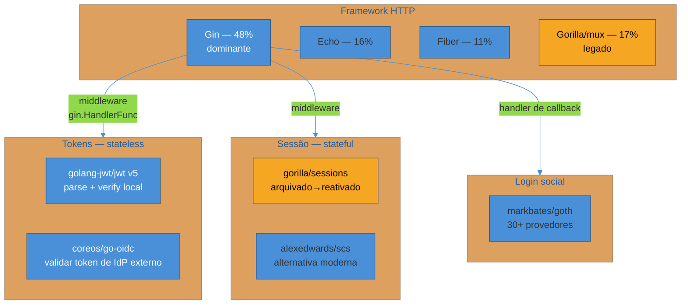
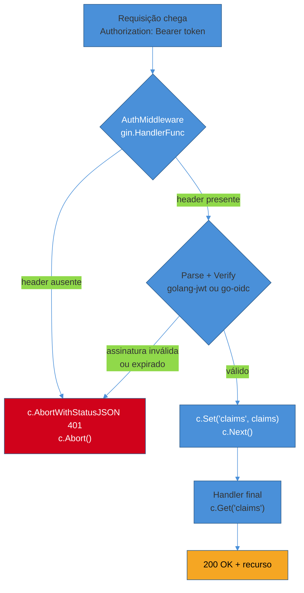
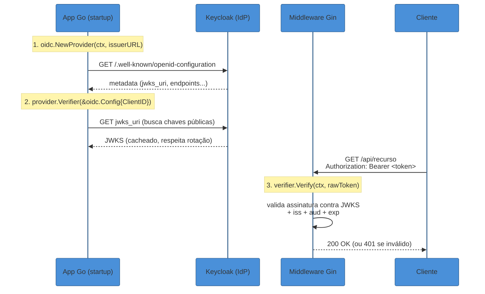

# Go — Gin

> [!abstract] TL;DR
> Go não tem um "Spring Security" ou um "Passport" — e isso não é uma lacuna, é uma escolha de linguagem. O ecossistema Go trata auth como qualquer outra responsabilidade: uma cadeia explícita de funções que você escreve, lê e depura sem magia de framework. Em **Gin** (o framework dominante do ecossistema, ~48% de uso em 2025 contra 17% do Gorilla, 16% do Echo e 11% do Fiber[^jetbrains-2025]), auth é middleware — uma função `gin.HandlerFunc` que roda antes do handler final, decide se a requisição pode continuar (`c.Next()`) ou deve morrer ali (`c.Abort()`), e — se aprovada — carimba o contexto da requisição com quem é o usuário (`c.Set()`) para o handler seguinte ler (`c.Get()`). Para validar tokens você tem duas ferramentas com papéis distintos: **`golang-jwt/jwt` v5** para parsear e verificar JWTs localmente (a peça que checa assinatura, claims, expiração — e onde mora a armadilha clássica do algoritmo de assinatura não verificado) e **`coreos/go-oidc`** para quando o token vem de um Identity Provider externo como o Keycloak, cuidando de descoberta OIDC (`/.well-known/openid-configuration`), busca e cache de chaves públicas (JWKS) e verificação do `id_token`/`access_token` contra o emissor certo. Sessão tradicional ainda existe (`gorilla/sessions` — arquivado em 2022, reativado depois, ou a alternativa mais moderna `alexedwards/scs`), e login social entra via `markbates/goth`. Esta nota **materializa em Go idiomático** a teoria de JWT e OIDC já coberta nas notas [[1 - Fundamentos de identidade/03 - JWT e a família de tokens|JWT e a família de tokens]] e [[2 - OAuth 2.1 e OpenID Connect/03 - OpenID Connect — identidade sobre OAuth|OpenID Connect]] — aqui não se reexplica o que é um JWT ou um ID token, se mostra como validá-los sem framework nenhum escondendo o trabalho.

> [!question]- Perguntas que esta nota responde
> - Como funciona a middleware chain do Gin, e por que esquecer `c.Abort()` é o bug mais comum de auth em Gin?
> - Como validar um JWT localmente com `golang-jwt/jwt` v5 sem cair na armadilha do algoritmo de assinatura?
> - Como validar um token emitido por um IdP externo (Keycloak) usando `coreos/go-oidc`, sem reimplementar JWKS na mão?
> - Quando ainda faz sentido usar sessão (`gorilla/sessions`/`scs`) em vez de token em Go?
> - Por que o Go não tem (e provavelmente nunca terá) um framework de auth "completo" no estilo Spring Security ou Passport?

> [!info] Cobertura inédita — a trilha Go ainda não existe no vault
> Diferente de Java (18 notas de Spring Security), Node (JWT/OIDC/RBAC em Node/Segurança) ou até Python (que ganhou cobertura de auth aqui mesmo, nas notas 02-03 deste sub-galho), **Go não tem uma trilha própria no domínio Tecnologia** — hoje é um stub. Esta nota, por enquanto, é o único lugar do vault onde auth em Go é tratado com profundidade; o [[00-Meta/Roadmap|Roadmap]] sinaliza essa cobertura pontual até que uma trilha Go completa exista.

## O problema: Go não empresta magia de ninguém

Se você vem de Spring Boot, Express ou Django, a primeira coisa que estranha em Go é o que **não** existe. Não tem um `@PreAuthorize` decorando um método. Não tem um container de injeção de dependência resolvendo um `AuthenticationManager` nos bastidores. Não tem um arquivo de configuração central onde você declara "esta rota exige papel ADMIN" e um framework interpreta isso em tempo de execução. Em Go, auth é **código que você escreve e lê linha por linha**, porque essa é a filosofia da linguagem inteira: erros são valores retornados explicitamente, não exceções que sobem escondidas pela pilha; dependências são passadas como parâmetros ou campos de struct, resolvidas manualmente, não injetadas por um container mágico[^glukhov-di]. A citação que resume o espírito: "you always know where a dependency comes from, and nothing is hidden behind a framework"[^glukhov-di-quote].

Isso não é ausência de ferramentas — é uma escolha deliberada de design de linguagem. O Go foi desenhado para minimizar recursos que escondem fluxo de controle (sem herança complexa, sem anotações que reescrevem comportamento, sem reflection pesada em hot path) precisamente para que o comportamento de um programa seja **visível olhando o código**, não inferido de uma configuração distante. Isso tem um preço — mais linhas escritas à mão, menos "façanhas" de um framework — e um ganho: quando o middleware de auth falha em produção às 3 da manhã, você não está caçando qual interceptor de qual anotação decidiu não autorizar a requisição. Você olha a função, lê de cima a baixo, e sabe exatamente o que ela faz.

A pergunta que esta nota responde, então, não é "qual framework de auth usar em Go" — não existe essa resposta, porque a pergunta pressupõe um modelo de outro ecossistema. A pergunta certa é: **como o idioma Go — middleware explícito, structs de claims tipadas, erros verificados linha a linha — resolve os mesmos problemas que Spring Security ou Passport resolvem com anotações e estratégias plugáveis?**

## O mapa do ecossistema

Antes de entrar no código, vale desenhar o território — porque em Go, ao contrário de Java ou Node, não existe *o* pacote de auth. Existem peças pequenas e ortogonais que você combina.



**Framework HTTP.** O JetBrains *Go Ecosystem Survey* de 2025-2026 confirma o que a comunidade já sentia: Gin é hoje usado por 48% dos desenvolvedores Go, contra 17% do venerável Gorilla/mux, 16% do Echo e 11% do Fiber[^jetbrains-2025]. A diferença para 2020 (Gin tinha 41%) mostra consolidação, não disputa aberta — Gin ganhou a preferência do mercado como "o Express do Go": leve, com uma API de roteamento ergonômica, middleware chain explícita e desempenho competitivo sem a complexidade de frameworks mais "batteries-included" como Beego. É por isso que esta nota fala especificamente de Gin, e não de "Go" em abstrato — o idioma de auth muda pouco entre frameworks, mas os detalhes de API (como registrar middleware, como passar dados entre handlers) são de Gin.

**Validação de token — o coração desta nota.** Duas bibliotecas cobrem os dois cenários possíveis:

- **`golang-jwt/jwt` v5** — a sucessora do antigo `dgrijalva/jwt-go`, hoje mantida pela organização `golang-jwt` — parseia e verifica JWTs **localmente**, contra uma chave que você já possui (simétrica, ou pública se for RSA/ECDSA). Você usa isso quando **seu próprio serviço** emitiu o token, ou quando você já tem a chave pública do emissor em mãos.
- **`coreos/go-oidc`** — mantida pela CoreOS (hoje parte da Red Hat), implementa o lado *cliente* do protocolo OpenID Connect: descoberta via `/.well-known/openid-configuration`, busca e cache automático das chaves públicas via JWKS, e verificação de `id_token`/`access_token` contra um **emissor externo** — um Keycloak, um Auth0, um Google. Por baixo dos panos, `go-oidc` também usa `golang-jwt` para a mecânica de parsing; a diferença é que ele automatiza a descoberta e rotação de chaves que você, de outra forma, teria que implementar na mão.

**Sessão.** Nem tudo em 2026 é token — aplicações web tradicionais renderizadas no servidor (Go tem um caso de uso forte aqui, dado o desempenho de `html/template`) ainda usam sessão com cookie. `gorilla/sessions` foi, por anos, o padrão de fato — até dezembro de 2022, quando o time do Gorilla Toolkit anunciou que estava arquivando o projeto inteiro por falta de mantenedores ativos[^gorilla-archived]. O projeto foi desarquivado depois, e há atividade recente de merge de PRs (incluindo compatibilidade com Go 1.23)[^gorilla-reactivated] — mas o susto deixou uma cicatriz de confiança no ecossistema, e hoje `alexedwards/scs` ganhou tração como alternativa mais moderna: menor, mais rápida, com 19 backends de armazenamento (Redis, Postgres, SQLite etc.), regeneração de token de sessão embutida e suporte nativo a timeout absoluto/por inatividade — os dois problemas que a nota [[1 - Fundamentos de identidade/02 - Sessões e cookies — auth stateful|Sessões e cookies]] já cobriu em teoria[^scs-github].

**Login social.** `markbates/goth` é a biblioteca de fato para múltiplos provedores OAuth (GitHub, Google, Facebook, Discord, Auth0, Azure AD e mais de 30 outros), com uma interface (`Provider`/`Session`) que você implementa se precisar de um provedor não listado[^goth-github].

## O fluxo recomendado 2026: middleware validando JWT/OIDC

Para uma API que serve um SPA ou um app mobile — o caso majoritário em 2026 — o fluxo recomendado é: o cliente autentica contra um IdP (seu próprio serviço, emitindo JWT localmente, ou um Keycloak externo, emitindo via OAuth 2.1 + OIDC como já visto em [[2 - OAuth 2.1 e OpenID Connect/02 - Authorization Code + PKCE — o fluxo canônico|Authorization Code + PKCE]]), e toda requisição subsequente à API Go carrega o token no header `Authorization: Bearer <token>`. O middleware de auth do Gin intercepta **toda** rota protegida, valida o token, e só deixa passar se ele for genuíno.



Repare no ponto crítico do diagrama: **toda saída de erro precisa terminar em `c.Abort()`**, não só num `return`. Isso é a armadilha número um de quem começa em Gin, e voltamos a ela na seção de armadilhas.

### A middleware chain do Gin, por dentro

Um middleware em Gin é uma função que recebe (ou fecha sobre) configuração e devolve um `gin.HandlerFunc` — o tipo `func(*gin.Context)`. A engenhosidade do design está no `c.Next()`: ele não é "continue para o próximo handler" no sentido de um `goto` — é uma chamada de função normal que **empilha** a execução do restante da cadeia, e quando ela retorna, o código depois de `c.Next()` no seu middleware volta a rodar. Isso cria um padrão de execução em pilha (LIFO): o primeiro middleware registrado é o primeiro a começar, mas o último a terminar[^gin-middleware-docs].

```go
func LoggingMiddleware() gin.HandlerFunc {
    return func(c *gin.Context) {
        start := time.Now()

        c.Next() // roda o restante da cadeia (auth, handler, etc.)

        // este trecho só executa DEPOIS que a resposta já foi escrita
        log.Printf("%s %s %v", c.Request.Method, c.Request.URL.Path, time.Since(start))
    }
}
```

Para auth, o padrão é o oposto: você quer decidir **antes** de deixar a requisição avançar, e — se a decisão for negativa — **impedir** que o restante da cadeia rode. É aí que entra `c.Abort()`:

```go
func RequireAuth() gin.HandlerFunc {
    return func(c *gin.Context) {
        header := c.GetHeader("Authorization")
        if !strings.HasPrefix(header, "Bearer ") {
            c.AbortWithStatusJSON(http.StatusUnauthorized, gin.H{"error": "missing bearer token"})
            return // return aqui é essencial — Abort() não interrompe a função Go
        }
        tokenString := strings.TrimPrefix(header, "Bearer ")

        claims, err := validateToken(tokenString) // ver próxima seção
        if err != nil {
            c.AbortWithStatusJSON(http.StatusUnauthorized, gin.H{"error": "invalid token"})
            return
        }

        c.Set("claims", claims) // carimba o contexto pro handler ler
        c.Next()
    }
}
```

Dois detalhes idiomáticos que valem a pena nomear. Primeiro: `c.AbortWithStatusJSON` é açúcar para `c.JSON(...)` seguido de `c.Abort()` — usar a versão combinada evita o erro de escrever a resposta e esquecer de abortar. Segundo: **`c.Abort()` não interrompe a execução da função Go que a chamou** — ele só marca um flag interno (`c.index = abortIndex`) que faz o Gin pular os handlers restantes da cadeia quando o loop interno do framework avançar. Se você não colocar um `return` logo depois, o resto da sua própria função de middleware continua rodando — só a cadeia *externa* para. É um detalhe sutil, e a fonte da armadilha mais comum do framework (mais adiante).

Para ler o que o middleware guardou, o handler final usa `c.Get()`:

```go
func GetOrderHandler(c *gin.Context) {
    claimsRaw, exists := c.Get("claims")
    if !exists {
        // não deveria acontecer se a rota está sob o middleware, mas Go não confia — verifica
        c.AbortWithStatusJSON(http.StatusInternalServerError, gin.H{"error": "claims not found in context"})
        return
    }
    claims := claimsRaw.(*CustomClaims) // type assertion — outro lugar onde Go não esconde nada

    // ... usa claims.UserID, claims.Roles etc.
}
```

Repare: `c.Get()` devolve `interface{}` (ou `any` no Go moderno) e um `bool` de existência — mais um lugar onde o Go recusa mágica: você faz o *type assertion* na mão, e se o tipo estiver errado, um `panic` explícito acontece em vez de um erro silencioso escondido. É comum encapsular esse padrão numa função helper (`GetClaims(c *gin.Context) (*CustomClaims, bool)`) para não repetir a assertion em cada handler — mas note que isso ainda é código seu, não uma anotação de framework fazendo o trabalho.

> [!info] gin.Context não é context.Context
> O `gin.Context` que carrega `Set`/`Get` **não é** o `context.Context` padrão da standard library, embora tenha um método `c.Request.Context()` que devolve um. Valores postos com `c.Set()` **não** aparecem automaticamente se você passar `c.Request.Context()` adiante para uma camada de negócio que espera `context.Context` puro — é preciso fazer a ponte explicitamente (`context.WithValue(c.Request.Context(), key, claims)`) se a claim precisar atravessar essa fronteira. Outra pegadinha de "nada é automático" no Go.

## Validando JWT localmente com golang-jwt v5

Quando o seu próprio serviço Go emite os tokens (ou você já resolveu a distribuição de chave pública de outra forma), `golang-jwt/jwt` v5 faz o parsing e a verificação. A v5 é uma reescrita significativa da API v4 — não é compatível para trás — e introduziu um sistema de `ParserOption` para configurar validação de forma explícita, além de um redesenho da interface `Claims`[^golang-jwt-v5-changes].

```go
package auth

import (
	"errors"
	"fmt"
	"time"

	"github.com/golang-jwt/jwt/v5"
)

// CustomClaims embute jwt.RegisteredClaims (exp, iat, sub, iss...)
// e adiciona os campos específicos da aplicação.
type CustomClaims struct {
	UserID string   `json:"user_id"`
	Roles  []string `json:"roles"`
	jwt.RegisteredClaims
}

var ErrInvalidToken = errors.New("invalid or expired token")

func ValidateToken(tokenString string, publicKey *rsa.PublicKey) (*CustomClaims, error) {
	claims := &CustomClaims{}

	token, err := jwt.ParseWithClaims(
		tokenString,
		claims,
		func(t *jwt.Token) (interface{}, error) {
			// A ARMADILHA CLÁSSICA mora aqui — ver callout de armadilhas abaixo.
			// Sem checar o método, um atacante pode forjar o header
			// {"alg":"none"} ou trocar RS256 por HS256 usando a
			// chave pública como segredo HMAC.
			if _, ok := t.Method.(*jwt.SigningMethodRSA); !ok {
				return nil, fmt.Errorf("unexpected signing method: %v", t.Header["alg"])
			}
			return publicKey, nil
		},
		jwt.WithValidMethods([]string{"RS256"}), // reforço declarativo — v5 recomenda os dois
		jwt.WithLeeway(5*time.Second),           // tolerância de clock skew
	)

	if err != nil {
		return nil, ErrInvalidToken
	}
	if !token.Valid {
		return nil, ErrInvalidToken
	}
	return claims, nil
}
```

A `RegisteredClaims` embutida traz os campos padrão do RFC 7519 (`exp`, `iat`, `nbf`, `iss`, `sub`, `aud`) já com validação automática de expiração feita pelo parser — o que sobra pra você validar manualmente são as claims de negócio (`Roles`, no exemplo) e, criticamente, o **método de assinatura**.

> [!warning] A armadilha do `alg`: nunca confie no header do token pra escolher a chave
> **O que acontece:** o `Keyfunc` passado para `ParseWithClaims` devolve a chave de verificação **sem checar** qual algoritmo o token está anunciando no header (`t.Method`). Um atacante pega um JWT legítimo assinado com RS256, troca o header pra `"alg":"HS256"`, e assina o token usando a **chave pública RSA do servidor** como se fosse um segredo HMAC simétrico — algo que ele consegue, porque chaves públicas são, por definição, públicas. **Por quê:** se o seu `Keyfunc` simplesmente devolve `publicKey` sem verificar `t.Method`, a biblioteca vai tentar validar a assinatura HMAC usando essa chave — e como o atacante *também* tem essa chave (é pública), ele consegue forjar uma assinatura válida. É a clássica **confusão de algoritmo** (algorithm confusion attack), documentada há anos e ainda causa de CVEs recorrentes em várias linguagens[^jwt-alg-confusion]. **Como evitar:** dois reforços, não um só — verificar `t.Method` dentro do `Keyfunc` (`if _, ok := t.Method.(*jwt.SigningMethodRSA); !ok { return nil, errors... }`) **e** passar `jwt.WithValidMethods([]string{"RS256"})` como opção do parser. O golang-jwt também bloqueia por padrão o algoritmo `none` (`jwt.UnsafeAllowNoneSignatureType` precisa ser passado explicitamente como chave para aceitá-lo — o nome já avisa que é perigoso), mas isso não substitui a checagem de método: um atacante que force `HS256` contra uma chave RSA pública ainda passa se você não validar o tipo.

## Validando tokens de um IdP externo com go-oidc

O cenário muda quando o token não foi emitido pelo seu serviço, mas por um Identity Provider externo — o caso canônico desta trilha é o Keycloak, coberto em profundidade no sub-galho 5. Aqui você não tem a chave de verificação de antemão: precisa descobrir o emissor, buscar as chaves públicas via JWKS, e mantê-las atualizadas conforme o IdP rotaciona chaves. Reimplementar isso na mão é possível, mas repetitivo e cheio de detalhes fáceis de errar (cache de chave, matching por `kid`, validação de `iss`/`aud`) — exatamente o trabalho que `coreos/go-oidc` automatiza.



```go
package auth

import (
	"context"
	"net/http"
	"strings"

	"github.com/coreos/go-oidc/v3/oidc"
	"github.com/gin-gonic/gin"
)

// No startup da aplicação — uma vez, não por requisição.
func NewOIDCVerifier(ctx context.Context, issuerURL, clientID string) (*oidc.IDTokenVerifier, error) {
	provider, err := oidc.NewProvider(ctx, issuerURL)
	// issuerURL para Keycloak 26.x: https://kc.exemplo.com/realms/meu-realm
	if err != nil {
		return nil, err
	}
	config := &oidc.Config{ClientID: clientID}
	return provider.Verifier(config), nil
}

// Middleware Gin que usa o verifier resolvido no startup.
func RequireOIDCToken(verifier *oidc.IDTokenVerifier) gin.HandlerFunc {
	return func(c *gin.Context) {
		header := c.GetHeader("Authorization")
		rawToken := strings.TrimPrefix(header, "Bearer ")
		if rawToken == "" || rawToken == header {
			c.AbortWithStatusJSON(http.StatusUnauthorized, gin.H{"error": "missing bearer token"})
			return
		}

		idToken, err := verifier.Verify(c.Request.Context(), rawToken)
		if err != nil {
			// verifier.Verify já checa assinatura contra JWKS, iss, aud e exp —
			// tudo o que a seção anterior fez na mão, aqui é uma chamada.
			c.AbortWithStatusJSON(http.StatusUnauthorized, gin.H{"error": "invalid token: " + err.Error()})
			return
		}

		var claims struct {
			Email string   `json:"email"`
			Roles []string `json:"realm_access.roles"` // Keycloak aninha roles em realm_access
		}
		if err := idToken.Claims(&claims); err != nil {
			c.AbortWithStatusJSON(http.StatusInternalServerError, gin.H{"error": "failed to parse claims"})
			return
		}

		c.Set("email", claims.Email)
		c.Set("subject", idToken.Subject)
		c.Next()
	}
}
```

Repare no que `go-oidc` está poupando você de fazer manualmente: `provider.Verifier` já resolve a busca do JWKS pela metadata de discovery, cacheia as chaves e as atualiza quando o `kid` de um token não bate com nenhuma chave conhecida (a rotação de chave do IdP acontece de tempos em tempos, e o cliente precisa reagir sem reiniciar o processo). O `verifier.Verify()` faz, numa chamada só, a validação completa que a seção anterior demonstrou linha a linha: assinatura, emissor (`iss` precisa bater com o `issuerURL`), audiência (`aud` precisa conter o `clientID` configurado) e expiração.

Uma nuance que aparece na integração com Keycloak especificamente: o campo de roles não vem "solto" nas claims — o Keycloak aninha as roles de realm dentro de `realm_access.roles` e as roles de client dentro de `resource_access.<client_id>.roles`, então o parsing de claims custom exige um struct que espelhe essa estrutura aninhada (o comentário no código acima simplifica; na prática você declara `RealmAccess struct{ Roles []string }`). Esse detalhe — e a integração completa Gin+Keycloak, incluindo client credentials para chamadas machine-to-machine — é aprofundado na nota que fecha o sub-galho 5, [[5 - Keycloak/03 - Integrando os stacks com Keycloak|Integrando os stacks com Keycloak]].

> [!info] Versões cravadas nesta nota (2026-07-11)
> `gin-gonic/gin` sem versão de major fixa recente (API estável desde v1); `golang-jwt/jwt/v5` — última versão publicada em 28/01/2026, API v5 não compatível para trás com v4; `coreos/go-oidc/v3` — módulo `github.com/coreos/go-oidc/v3/oidc`; `gorilla/sessions` — arquivado em dezembro/2022, desarquivado depois, com atividade de merge recente (compat Go 1.23); `alexedwards/scs` — v2 ativo; `markbates/goth` — ativamente mantido, 30+ provedores. Ecossistema Go OSS muda de mantenedor com frequência — revalidar antes de fixar em produção.

## Integração com IdP externo: a ponte pro Keycloak

O padrão acima — `oidc.NewProvider` resolvido uma vez no startup, injetado como dependência no middleware — é exatamente o caminho recomendado para qualquer API Go que funcione como **resource server** atrás de um Keycloak (ou qualquer outro IdP compatível com OIDC discovery). A diferença entre "validar localmente" e "validar via go-oidc" não é uma questão de qual biblioteca é "melhor" — é uma questão de **quem é a fonte de verdade da chave**: se é o seu próprio serviço, `golang-jwt` com uma chave fixa (ou rotação própria) resolve; se é um IdP externo com ciclo de vida de chave independente do seu deploy, `go-oidc` paga o preço de uma dependência de rede a mais na inicialização em troca de nunca ter que sincronizar chave manualmente.

Vale registrar a diferença estrutural com os outros stacks desta trilha: em Java, o Spring Authorization Server e o `spring-security-oauth2-resource-server` fazem esse trabalho de discovery e verificação **dentro** de uma cadeia de filtros configurada declarativamente (poucas linhas de `SecurityFilterChain` bean); em Node/NestJS, um guard decorado (`@UseGuards(AuthGuard('jwt'))`) delega para uma estratégia Passport que também esconde JWKS/discovery. Em Go, o mesmo resultado — "só passa quem tem token válido do Keycloak" — nasce de uma função explícita que você registra manualmente na rota (`router.GET("/orders", RequireOIDCToken(verifier), GetOrdersHandler)`). Não é menos seguro; é só visível de um jeito diferente. Essa visibilidade radical é o que os desenvolvedores Go apontam como a razão de nunca sentir falta de um "Spring Security do Go" — cada peça do fluxo é auditável lendo o próprio código do middleware, sem precisar entender uma cadeia de anotações e beans configurados em outro lugar.

## Sessão e login social: as peças que faltam no fluxo puro-API

Nem toda aplicação Go é uma API stateless pura. Para aplicações web renderizadas no servidor — um caso de uso onde Go brilha por desempenho —, sessão com cookie continua sendo o padrão mais simples. O ponto de decisão entre `gorilla/sessions` e `alexedwards/scs` hoje é menos sobre features (ambos cobrem o básico: cookie assinado, store plugável, flags `HttpOnly`/`Secure`/`SameSite`) e mais sobre confiança de manutenção — depois do susto do arquivamento de 2022, `scs` ganhou tração justamente por ser menor, mais rápido e ter tido atividade de commit mais constante, com 19 backends de armazenamento suportados de fábrica e regeneração de token de sessão embutida (a defesa contra *session fixation* já coberta em [[1 - Fundamentos de identidade/02 - Sessões e cookies — auth stateful|Sessões e cookies]])[^scs-github].

Para login social — "entrar com Google/GitHub/Discord" — sem passar por um IdP centralizado como Keycloak, `markbates/goth` resolve a dança OAuth genérica: você registra os provedores desejados, redireciona o usuário pro fluxo de autorização de cada um, e recebe de volta um objeto `goth.User` normalizado (email, nome, avatar, token) independente de qual provedor foi usado. É útil sobretudo para produtos B2C que querem múltiplos provedores sociais sem montar um Keycloak inteiro só para isso — mas note que, se a estratégia da organização já inclui um IdP central (o caso desta trilha), o Keycloak resolve login social **dentro** dele via *identity brokering*, tornando `goth` redundante nesse cenário. A escolha entre os dois é arquitetural, não técnica: `goth` é auth social embutida no seu app; Keycloak com brokering é auth social delegada ao IdP.

## Armadilhas comuns

> [!warning] Esquecer `c.Abort()` depois de escrever uma resposta de erro
> **O que acontece:** o middleware detecta que o token é inválido, escreve uma resposta 401 com `c.JSON(401, ...)`, mas não chama `c.Abort()` — ou chama `c.Abort()` sem um `return` logo depois na própria função. **Por quê:** o Gin não interrompe a cadeia de middleware automaticamente só porque uma resposta já foi escrita. Sem `c.Abort()`, o próximo handler da cadeia (inclusive o handler final) **ainda roda**, potencialmente escrevendo uma segunda resposta por cima da primeira (o que gera um erro de "superfluous response.WriteHeader call" nos logs) ou, pior, executando lógica de negócio como se o usuário estivesse autenticado. E mesmo chamando `c.Abort()`, se a função do middleware continuar executando depois dele sem um `return`, o código restante daquela função específica ainda roda — só a cadeia *externa* de handlers é que para. **Como evitar:** usar sempre `c.AbortWithStatusJSON(status, body)` — a versão combinada que escreve a resposta e aborta atomicamente — e, em qualquer bifurcação de erro, garantir um `return` logo em seguida como hábito automático, do mesmo jeito que "check the error" é hábito em qualquer função Go.

> [!warning] Confiar no header `alg` do token sem checar o método de assinatura
> Já detalhado na seção de golang-jwt acima — vale repetir aqui porque é, de longe, a vulnerabilidade mais citada em auditorias de JWT em qualquer linguagem: sempre checar `t.Method` dentro do `Keyfunc` **e** usar `jwt.WithValidMethods` como reforço declarativo. Nunca decidir o algoritmo de verificação a partir do que o próprio token diz que é.

> [!warning] Tratar gorilla/sessions como "sempre disponível" sem checar manutenção ativa
> **O que acontece:** um projeto novo escolhe `gorilla/sessions` por familiaridade histórica, sem checar o estado atual de manutenção do repositório. **Por quê:** o Gorilla Toolkit foi arquivado formalmente em dezembro de 2022 por falta de mantenedores ativos, gerando alerta em toda a comunidade Go sobre uma dependência crítica de infraestrutura ficando órfã[^gorilla-archived]. Embora tenha sido desarquivado depois e mostre atividade de merge recente[^gorilla-reactivated], a confiança de longo prazo do projeto ficou abalada — e times que dependem de sessão em produção precisam decidir conscientemente se aceitam esse histórico ou migram para uma alternativa com trajetória de manutenção mais previsível, como `alexedwards/scs`. **Como evitar:** checar o histórico de commits e releases antes de fixar uma dependência de infraestrutura crítica; para projetos novos em 2026, `scs` é a escolha com menos ruído de manutenção documentado.

## Em entrevista

A pergunta que costuma aparecer sobre Go e auth não é "como você implementaria login" — é mais estrutural: "por que Go não tem um framework de auth como Spring Security?" ou "como você garante que uma rota protegida não vaza por engano?". O sinal que um entrevistador sênior busca é entender se você reconhece que a ausência de "magia" em Go é uma escolha de design da linguagem, não uma lacuna de maturidade do ecossistema — e que essa escolha tem uma consequência prática e testável: cada rota precisa registrar seu middleware de auth explicitamente, o que significa que **esquecer de proteger uma rota é um erro visível no código de roteamento**, não um erro de configuração escondido numa anotação ou num XML.

> **Entrevistador:** "Sua API em Gin tem uma rota que deveria exigir autenticação, mas em produção ela ficou acessível sem token. Como isso teria acontecido, e como você preveniria?"
>
> **Resposta fraca:** "Provavelmente um bug no middleware — vou adicionar mais testes."
>
> **Resposta forte:** "Em Gin, proteção de rota não é implícita — é uma linha explícita no arquivo de rotas, `router.GET("/orders", RequireAuth(), handler)`. Isso significa que o vazamento mais provável não é o middleware falhando silenciosamente (ele aborta com 401 se o token for inválido), é alguém **esquecer de anexar o middleware àquela rota específica** ao registrar uma nova. A defesa estrutural é inverter o padrão: em vez de aplicar auth rota a rota, registrar um grupo de rotas (`router.Group("/api")`) com o middleware aplicado no grupo inteiro, e tratar rotas públicas como a exceção explícita — documentada, revisada em code review — em vez de rotas protegidas serem a exceção. Isso não elimina o erro humano, mas move o padrão default de 'aberto a menos que eu lembre de proteger' para 'protegido a menos que eu declare explicitamente que é público', o que é mais seguro por padrão."

Essa resposta demonstra entendimento de que, em um ecossistema sem enforcement automático (nenhuma anotação central dizendo "toda rota exige auth por padrão, exceto..."), a defesa contra esquecimento é uma decisão de **estrutura de rotas**, não de código de middleware em si — exatamente o tipo de raciocínio que separa quem já operou o framework em produção de quem só seguiu um tutorial.

## How to explain in English

> "Go doesn't ship a batteries-included auth framework the way Spring Security or Passport do, and that's deliberate — Go's whole design philosophy favors explicit code over hidden magic: errors are values you check by hand, dependencies are wired manually, and middleware is a plain function you register on each route. In Gin, an auth middleware is a `gin.HandlerFunc` that runs before the final handler; it calls `c.Next()` to let the request continue, or `c.Abort()` to kill the chain right there — and forgetting that `Abort()` call is the single most common auth bug in Gin apps. For token validation, `golang-jwt/jwt` v5 handles JWTs you can verify against a key you already hold, while `coreos/go-oidc` handles the harder case: tokens from an external IdP like Keycloak, automating discovery and JWKS key rotation so you never hardcode a public key that might change underneath you."

| PT | EN |
|----|----|
| Cadeia de middleware | Middleware chain |
| Abortar a cadeia | Abort the chain |
| Contexto da requisição | Request context |
| Verificação de assinatura | Signature verification |
| Confusão de algoritmo | Algorithm confusion |
| Conjunto de chaves públicas (JWKS) | JSON Web Key Set (JWKS) |
| Descoberta OIDC | OIDC discovery |
| Sessão baseada em cookie | Cookie-based session |
| Login social | Social login |
| Injeção de dependência manual | Manual dependency wiring |
| Erros como valores | Errors as values |
| Idioma da linguagem | Language idiom |

## O que vem a seguir

Esta nota **fecha o sub-galho 4 — Auth nos stacks**: as seis notas (Spring Security, Django, FastAPI, Express, NestJS e agora Gin) cobriram, cada uma no idioma próprio da sua linguagem, o mesmo problema — validar identidade e autorizar requisições — usando os mesmos protocolos de base (JWT, OAuth 2.1, OIDC) já ensinados nos sub-galhos 1-3. O que muda de stack para stack não é o *o quê*, é o *como*: anotações declarativas em Java, dependency injection via `Depends` em FastAPI, guards decorados em NestJS, middleware explícito em Go.

O próximo destino natural é o [[5 - Keycloak/index|sub-galho 5 — Keycloak]], que fecha o círculo: em vez de cada stack rodando sua própria lógica de emissão de token, todas as seis notas deste sub-galho podem apontar para um único Identity Provider self-hosted. A última nota daquele sub-galho, [[5 - Keycloak/03 - Integrando os stacks com Keycloak|Integrando os stacks com Keycloak]], retoma especificamente o padrão `go-oidc` + Gin mostrado aqui, lado a lado com o resource server Spring, o `Depends` de FastAPI e o guard OIDC de NestJS — uma tabela comparativa final de como o mesmo Keycloak alimenta seis integrações diferentes.

- [[5 - Keycloak/index|Keycloak]] — o IdP externo que este middleware valida
- [[1 - Fundamentos de identidade/03 - JWT e a família de tokens|JWT e a família de tokens]] — a anatomia que `golang-jwt` implementa
- [[2 - OAuth 2.1 e OpenID Connect/03 - OpenID Connect — identidade sobre OAuth|OpenID Connect — identidade sobre OAuth]] — o protocolo que `go-oidc` fala
- [[03-Dominios/Engenharia/Auth e Identidade/index|Auth e Identidade]] — o galho-pai da trilha

## Fontes

- **JetBrains Blog** — [*The Go Ecosystem in 2025: Key Trends in Frameworks, Tools, and Developer Practices*](https://blog.jetbrains.com/go/2025/11/10/go-language-trends-ecosystem-2025/) — dados de market share: Gin 48%, Gorilla 17%, Echo 16%, Fiber 11%; acessado em 2026-07-11.
- **Gin Web Framework (docs oficiais)** — [*Using middleware*](https://gin-gonic.com/en/docs/middleware/using-middleware/) e [*Custom Middleware*](https://gin-gonic.com/en/docs/middleware/custom-middleware/) — semântica de `c.Next()`, `c.Abort()` e ordem de execução da cadeia; acessado em 2026-07-11.
- **pkg.go.dev** — [*gin package*](https://pkg.go.dev/github.com/gin-gonic/gin) — referência de `gin.Context`, `Set`/`Get`, `AbortWithStatusJSON`; acessado em 2026-07-11.
- **pkg.go.dev** — [*jwt package — github.com/golang-jwt/jwt/v5*](https://pkg.go.dev/github.com/golang-jwt/jwt/v5) — API de `ParseWithClaims`, `ParserOption`, `WithValidMethods`, `RegisteredClaims`; acessado em 2026-07-11.
- **GitHub golang-jwt/jwt** — [*Discussion #308 — v5.0.0*](https://github.com/golang-jwt/jwt/discussions/308) — mudanças estruturais da v5 em relação à v4; acessado em 2026-07-11.
- **DEV Community (iamdevbox)** — [*JWT Algorithm Confusion Attacks: CVE-2026-22817, CVE-2026-27804, and CVE-2026-23552 Fix Guide*](https://dev.to/iamdevbox/jwt-algorithm-confusion-attacks-cve-2026-22817-cve-2026-27804-and-cve-2026-23552-fix-guide-4ac4) — panorama atualizado 2026 de ataques de confusão de algoritmo em bibliotecas JWT; acessado em 2026-07-11.
- **PentesterLab** — [*JWT None Algorithm Attack*](https://pentesterlab.com/glossary/jwt-none-algorithm) — mecânica do ataque `alg=none` e variantes de bypass por case; acessado em 2026-07-11.
- **pkg.go.dev** — [*oidc package — github.com/coreos/go-oidc/v3/oidc*](https://pkg.go.dev/github.com/coreos/go-oidc/v3/oidc) — `NewProvider`, `Verifier`, `IDTokenVerifier`, `NewRemoteKeySet`; acessado em 2026-07-11.
- **GitHub coreos/go-oidc** — [*go-oidc — A Go OpenID Connect client*](https://github.com/coreos/go-oidc) — visão geral do pacote e exemplos de uso; acessado em 2026-07-11.
- **Lobste.rs / The New Stack** — [*Gorilla Toolkit Open Source Project Becomes Abandonware*](https://thenewstack.io/gorilla-toolkit-open-source-project-becomes-abandonware/) — arquivamento do Gorilla Toolkit em dezembro de 2022; acessado em 2026-07-11.
- **GitHub gorilla/sessions** — [*gorilla/sessions*](https://github.com/gorilla/sessions) — estado atual do repositório, releases e atividade de merge pós-reativação; acessado em 2026-07-11.
- **GitHub alexedwards/scs** — [*scs: HTTP Session Management for Go*](https://github.com/alexedwards/scs) — comparação de footprint com gorilla/sessions, 19 backends de store; acessado em 2026-07-11.
- **GitHub markbates/goth** — [*goth: idiomatic authentication packages for Go*](https://github.com/markbates/goth) — lista de provedores suportados e interface `Provider`/`Session`; acessado em 2026-07-11.
- **Skycloak** — [*Keycloak + Go: Build Secure APIs with gocloak*](https://skycloak.io/blog/keycloak-golang-api-authentication-guide/) — padrão de integração Gin + Keycloak com golang-jwt; acessado em 2026-07-11.
- **Rost Glukhov** — [*Dependency Injection in Go: Patterns & Best Practices*](https://www.glukhov.org/app-architecture/code-architecture/dependency-injection-in-go/) — filosofia de wiring manual e explicitação de dependências em Go; acessado em 2026-07-11.

[^jetbrains-2025]: JetBrains Blog, *The Go Ecosystem in 2025* — market share de frameworks HTTP. [^glukhov-di]: Rost Glukhov, *Dependency Injection in Go: Patterns & Best Practices*. [^glukhov-di-quote]: idem — citação sobre wiring manual e explicitação de dependências. [^gin-middleware-docs]: Gin Web Framework, *Using middleware* — ordem de execução LIFO da cadeia. [^golang-jwt-v5-changes]: GitHub golang-jwt/jwt, Discussion #308 — mudanças de API entre v4 e v5. [^jwt-alg-confusion]: DEV Community, *JWT Algorithm Confusion Attacks* — CVEs recentes de confusão de algoritmo. [^gorilla-archived]: The New Stack, *Gorilla Toolkit Open Source Project Becomes Abandonware*. [^gorilla-reactivated]: GitHub gorilla/sessions — releases e atividade de merge pós-reativação. [^scs-github]: GitHub alexedwards/scs — comparação com gorilla/sessions e features de store. [^goth-github]: GitHub markbates/goth — lista de provedores OAuth suportados.
