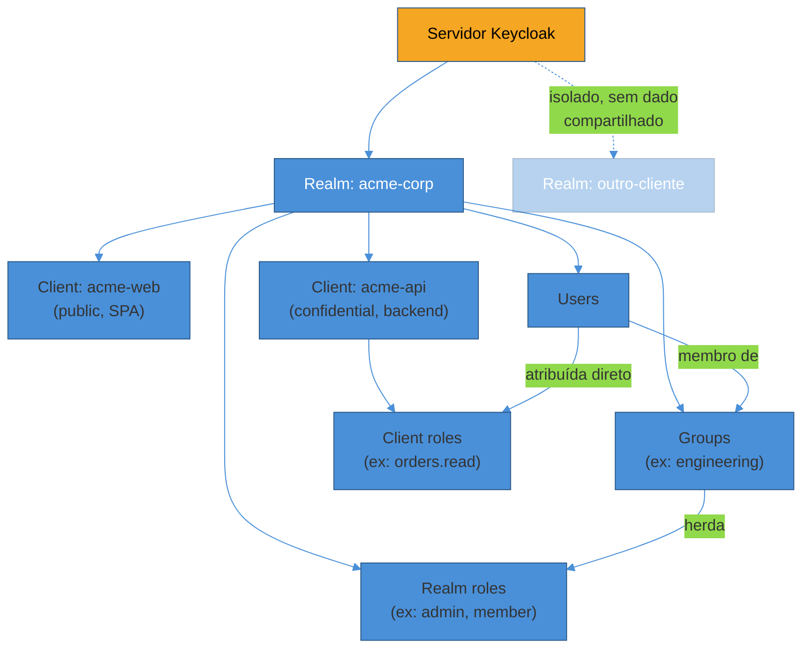
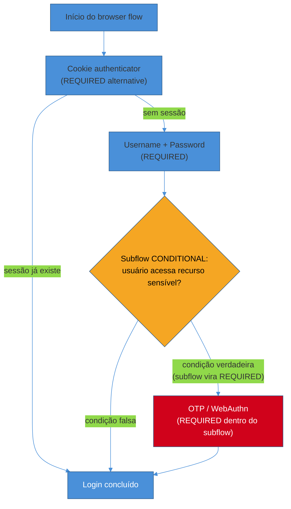

# Keycloak — realms, clients e flows

> [!abstract] TL;DR
> Toda vez que um time decide "vamos fazer nosso próprio login", ele está, na prática, decidindo reimplementar um **authorization server** completo — todo o desenho que as notas de [[2 - OAuth 2.1 e OpenID Connect/02 - Authorization Code + PKCE — o fluxo canônico|Authorization Code + PKCE]] e [[2 - OAuth 2.1 e OpenID Connect/03 - OpenID Connect — identidade sobre OAuth|OpenID Connect]] descreveram em teoria. **Keycloak** é a resposta "build vs buy" mais adotada do mundo self-hosted: um Identity Provider (IdP) open source, mantido pela CNCF/Red Hat, que já fala OAuth 2.1, OIDC e SAML corretamente, para você não ter que provar `code_verifier` e assinar JWT à mão. Seu modelo mental tem cinco peças: o **realm** (a fronteira de isolamento — um espaço nomeado de usuários, clients e configuração, sem nada compartilhado entre realms), o **client** (a aplicação que pede login — confidential se guarda segredo, public se não guarda), o **user** (a pessoa), a **role** (o que ela pode fazer — realm role se é cross-app, client role se é específica de uma aplicação) e o **group** (coleção de usuários com roles herdadas em conjunto). Por cima disso, **authentication flows** são grafos configuráveis de passos (executions) que decidem *como* alguém prova quem é — da tela de senha simples a um step-up condicional que exige MFA só para operações sensíveis. E toda essa configuração pode ser feita tanto no **admin console** (interface visual, ótima para explorar) quanto na **Admin REST API** (a mesma coisa, mas versionável em Terraform ou YAML — o caminho certo para produção). Baseline desta nota: **Keycloak 26.6/26.7** (meados de 2026).

> [!question]- Perguntas que esta nota responde
> - Por que não simplesmente implementar OAuth/OIDC do zero, já que as notas anteriores explicaram o protocolo?
> - O que exatamente isola um realm do outro, e quando isso importa?
> - Qual a diferença prática entre um client confidential e um public, e quando uso cada tipo de fluxo (standard flow, direct access grants, service accounts)?
> - Quando uma permissão deveria ser realm role, client role, ou vir de um group?
> - Como um authentication flow decide "isso é obrigatório, isso é alternativa, isso só roda se uma condição bater"?
> - Por que automatizar Keycloak via Admin API em vez de clicar no console?

## Por que não escrever o seu próprio login

Depois de entender Authorization Code + PKCE e OpenID Connect em profundidade, a tentação natural é pensar: "já sei como o protocolo funciona, é só implementar". É exatamente aqui que a maioria dos times comete o mesmo erro que motivou a indústria inteira a convergir para IdPs prontos: o protocolo é a parte fácil. O que separa uma implementação de brinquedo de um authorization server de produção não é "sabe gerar um JWT" — é uma lista de responsabilidades que ninguém lembra de somar até precisar delas: rotação de chaves de assinatura sem downtime, revogação de sessão em cascata, rate limiting no endpoint de token, proteção contra credential stuffing, telas de consentimento acessíveis e traduzidas, conformidade com WebAuthn/passkeys, auditoria de quem mudou o quê na configuração, e — o item que mais gera incidente em produção — manter tudo isso **seguro contra CVEs que aparecem toda semana** no ecossistema de segurança[^skycloak-tco].

Keycloak é a resposta open source mais madura para esse problema: mantido desde 2014 (originalmente Red Hat, hoje projeto CNCF incubating), com uma base de adoção grande o bastante para que bugs de protocolo sejam achados e corrigidos por terceiros antes de você nem saber que existiam. A decisão de adotá-lo é uma decisão de **build vs buy** clássica, só que "buy" aqui significa "instalar software livre e operar você mesmo" — não "pagar por SaaS". Vale a pena decompor os dois lados:

- **A favor de self-hosted (Keycloak):** custo por infraestrutura, não por usuário — a curva de custo fica praticamente achatada de 100 a 100.000 usuários, o que muda a conta para produtos de alto crescimento[^skycloak-cost]. Dados de identidade nunca saem da sua rede — decisivo quando regulação, contrato ou postura de segurança exigem isso; você roda dentro da própria VPC, região, ou até um ambiente air-gapped, sem terceiro tocando as chaves de assinatura de token ou o armazenamento de usuários[^skycloak-selfhost].
- **Contra (o custo escondido):** "grátis" não é "grátis para operar". Software livre desloca o custo de licença para **tempo de engenharia**: upgrades, patch de CVE, alta disponibilidade, backup. Em 2025 só, Keycloak teve CVEs relevantes catalogados — por exemplo CVE-2025-3501 (bypass de verificação de trust store, CVSS 8.2) e CVE-2025-11419 (DoS via renegociação TLS, CVSS 7.5)[^skycloak-cve]. Rodar em cluster com Infinispan mal configurado derruba sessões e degrada login sob carga, geralmente no pior momento possível[^skycloak-cluster].
- **A favor de managed (Auth0, Cognito, Zitadel Cloud, etc.):** abaixo de um certo volume de usuários, o preço por MAU costuma ser mais barato que manter sua própria infraestrutura; acima dele, o modelo flat do self-hosted puxa a vantagem, às vezes dramaticamente[^skycloak-mau]. Managed também tira de você a responsabilidade operacional de HA, patching e scaling.

A decisão real depende de escala de usuários, exigência de residência de dados, e capacidade de DevOps disponível — não existe resposta universal, e o [[03-Dominios/Engenharia/Auth e Identidade/Capstone — Desenhando a identidade de um SaaS B2B do zero|capstone]] desta trilha revisita esse trade-off no contexto de um SaaS B2B completo. O que esta nota assume é que a decisão já foi tomada: você está rodando Keycloak, e precisa entender como ele modela o mundo.

> [!info] Versão em aberto
> Esta nota descreve **Keycloak 26.6** (estável, abril de 2026) e **26.7** (lançado julho de 2026). O modelo de realm/client/role é estável há anos e não deve mudar; recursos específicos citados como "26.x" (Organizations, SCIM preview, multi-cluster HA sem cache externo) são mais recentes e sujeitos a evoluir de preview para suportado. A nota [[02 - Keycloak em produção|02]] aprofunda o que é preview vs GA.

## O modelo mental: realm, client, user, role, group

Um jeito útil de pensar em Keycloak é como um **banco de identidade multi-inquilino**: um único servidor Keycloak pode hospedar dezenas de "universos" completamente separados, cada um chamado de **realm**. Dentro de cada realm vivem as outras quatro peças.



### Realm — a fronteira de isolamento

Um **realm** é um espaço de nomes completamente isolado: usuários, clients, roles, temas, chaves de assinatura e authentication flows de um realm não têm nenhuma relação implícita com os de outro. Não existe consulta cross-realm nativa — se `acme-corp` e `outro-cliente` são dois realms no mesmo servidor Keycloak, um usuário do primeiro simplesmente não existe do ponto de vista do segundo[^intension-realms]. É essa propriedade que torna o realm a unidade natural de multi-tenancy "forte": cada cliente enterprise, cada ambiente (dev/staging/prod), ou cada produto de um portfólio pode virar seu próprio realm, com isolamento total garantido pela arquitetura, não por convenção de código.

O realm `master` é especial: existe desde a instalação, e é reservado para administrar o próprio servidor Keycloak (criar outros realms, gerenciar usuários administrativos). Nunca hospede usuários de aplicação no `master` — é uma prática consolidada de segurança, porque contas administrativas do Keycloak e contas de usuário final não deveriam compartilhar o mesmo espaço de risco.

Vale antecipar uma dúvida comum: se cada cliente B2B vira um realm, e você tem 500 clientes, isso não explode operacionalmente? A resposta do Keycloak 26.x para esse cenário é **Organizations** — um mecanismo mais leve que vive *dentro* de um único realm, para multi-tenancy B2B que não precisa do isolamento total de um realm inteiro. Isso é assunto da nota [[02 - Keycloak em produção|02]]; aqui, o que importa é que **realm = isolamento máximo, mas caro de multiplicar; Organizations = multi-tenancy econômica, com isolamento parcial**[^intension-orgs].

### Client — quem está pedindo login

Um **client** representa uma aplicação que quer autenticar usuários ou obter tokens — na terminologia OAuth das notas anteriores, é literalmente o *client* do fluxo. Cada aplicação separada (a SPA, o backend, o app mobile, um serviço M2M) é registrada como um client distinto no realm, com seu próprio `client_id` e configuração de fluxos permitidos.

A distinção mais importante ao criar um client é a mesma que [[2 - OAuth 2.1 e OpenID Connect/02 - Authorization Code + PKCE — o fluxo canônico|a nota de PKCE]] já ensinou em teoria: **confidential vs public**. O critério é a capacidade de guardar segredo — se o código roda na sua infraestrutura (um backend), o client é confidential e tem um client secret; se roda no dispositivo do usuário (SPA, app mobile), é public e não há segredo nenhum a guardar, porque qualquer secret embutido no código do cliente deixa de ser secreto[^oneuptime-clients]. Dentro de cada tipo, três capacidades independentes definem o que o client pode fazer:

- **Standard flow** (Authorization Code, com PKCE) — ligado para qualquer client que faz login via navegador, público ou confidencial.
- **Direct access grants** — o antigo Resource Owner Password Credentials, que [[2 - OAuth 2.1 e OpenID Connect/02 - Authorization Code + PKCE — o fluxo canônico|a nota anterior]] já mostrou como deprecado no OAuth 2.1; deixe desligado a menos que exista uma razão legada muito específica.
- **Service accounts roles** — liga o **Client Credentials Grant** (M2M puro, sem usuário envolvido): cada client confidencial ganha uma conta de serviço própria, usada para chamadas backend-a-backend[^oneuptime-service-accounts].

### User, role e group

**Users** são as pessoas (ou serviços, via service account). **Roles** representam permissões — "o que esse usuário pode fazer" — e existem em duas variantes com escopo diferente:

- **Realm roles** são globais ao realm inteiro — fazem sentido para papéis que atravessam múltiplas aplicações: `admin`, `member`, um tier de plano como `premium` ou `enterprise`. Se a permissão representa identidade através de todo o sistema, não dentro de um app só, é realm role[^skycloak-scopes].
- **Client roles** são específicas de um client — `orders.read`, `invoices.edit` só fazem sentido dentro do contexto daquele client em particular. Se a permissão é específica de uma aplicação, é client role.

**Groups** são coleções de usuários que herdam roles em conjunto — a ferramenta certa quando você quer atribuir um conjunto de permissões a "todo o time de engenharia" sem repetir a atribuição usuário por usuário. Um usuário pode pertencer a múltiplos groups, e um group pode ter sub-groups, formando hierarquia.

> [!question]- Roles no token — onde exatamente elas aparecem?
> Realm roles aparecem na claim `realm_access.roles` do access token; client roles aparecem em `resource_access.<client_id>.roles`. Isso não acontece por mágica — é um **protocol mapper** (a próxima seção) que copia a role do modelo de dados do Keycloak para dentro do JWT. Sem o mapper certo configurado no client scope, a role existe no Keycloak mas nunca chega no token.

## Client scopes e protocol mappers: o que entra no token

Roles modelam *quem pode o quê* dentro do Keycloak; **client scopes** e **protocol mappers** decidem *o que efetivamente aparece dentro do JWT* que o client recebe. São conceitos relacionados, mas resolvem problemas diferentes — e essa confusão ("por que criei a role e ela não aparece no token?") é uma das mais comuns em quem está começando.

Um **client scope** é um pacote reutilível de protocol mappers e mapeamentos de role, que pode ser associado a múltiplos clients simultaneamente — a mesma lógica de "o que incluir no token" não precisa ser reconfigurada em cada aplicação[^skycloak-scopes-vs-roles]. Dentro de um client scope, um **protocol mapper** é o motor que efetivamente produz uma claim: existem mappers de atributo de usuário (`department` → claim customizada), de realm role (o mapper que preenche `realm_access.roles`, presente por padrão no scope `roles`), de claim fixa (injeta um valor estático em todo token que usa aquele scope), e de audience (adiciona a claim `aud`, para que o resource server saiba para quem o token foi emitido).

Na prática, isso significa: **use roles para modelar permissão; use client scopes para moldar o conteúdo do token e lidar com pedidos de escopo OAuth**. A maioria dos setups de produção usa os dois juntos — roles decidem o que o usuário pode fazer, client scopes decidem que fatia dessa informação aparece em qual token, para qual client.

## Um realm de exemplo, ponta a ponta

Vamos seguir o exemplo trabalhado da trilha: **Acme SaaS**, uma aplicação B2B que decide registrar seu login no Keycloak em vez de escrever o próprio. A equipe já leu OAuth 2.1/OIDC e sabe o que quer no final: uma SPA React que faz Authorization Code + PKCE, e um backend Node/Express que valida tokens como resource server.

**1. Criar o realm.** Via admin console: `Create realm` → nome `acme-saas`. Isso já cria, por baixo dos panos, as chaves de assinatura padrão (RS256), os client scopes default (`profile`, `email`, `roles`, `web-origins`), e o tema padrão de login.

**2. Registrar o client SPA (public).** `Clients → Create client`:

```
Client ID: acme-web
Client type: OpenID Connect
Client authentication: OFF        (público — sem secret)
Standard flow: ON                 (Authorization Code + PKCE)
Direct access grants: OFF
Valid redirect URIs: https://app.acme.com/callback
Web origins: https://app.acme.com
```

O `Client authentication: OFF` é o que classifica o client como público — Keycloak automaticamente exige PKCE (S256) nesse caso, alinhado com o que o OAuth 2.1 já tornou obrigatório de qualquer forma.

**3. Registrar o client backend (confidential, para M2M).** Um segundo client, `acme-billing-worker`, que roda como job assíncrono processando cobranças, sem usuário logado:

```
Client ID: acme-billing-worker
Client authentication: ON          (confidencial — tem secret)
Standard flow: OFF
Service accounts roles: ON         (Client Credentials Grant)
```

Esse client recebe um client secret gerado pelo Keycloak, guardado como variável de ambiente/secret manager do worker — nunca em código.

**4. Definir roles.** Um realm role `member` (todo usuário autenticado do Acme SaaS tem) e um client role `invoices.write` no client que representa a API de billing — só quem processa faturas precisa dele. Um group `finance-team` recebe o client role `invoices.write`, e usuários daquele time entram no group em vez de receber a role individualmente.

**5. Consumir o token.** A SPA `acme-web` completa o Authorization Code + PKCE (o fluxo exato já coberto em [[2 - OAuth 2.1 e OpenID Connect/02 - Authorization Code + PKCE — o fluxo canônico|SG2-02]]) e recebe um access token cujo `realm_access.roles` contém `["member"]` para um usuário comum, ou `["member"]` + `resource_access["acme-billing"].roles: ["invoices.write"]` para alguém do time financeiro. O backend valida esse token contra o JWKS do realm (`/.well-known/openid-configuration` → `jwks_uri`) — sem nunca precisar confiar cegamente no client.

## Authentication flows: como Keycloak decide "prove quem você é"

Um **authentication flow** é um grafo dirigido de passos chamados **executions**, cada um ligado a um *Authenticator* (a lógica que efetivamente valida algo — senha, OTP, WebAuthn, um redirect para IdP externo). O realm vem com flows padrão prontos — `browser` (login via navegador, com usuário/senha e opcionalmente MFA), `direct grant` (usado no Direct Access Grants, hoje raramente recomendado) — mas o poder real do Keycloak está em poder **customizar** esses grafos[^skycloak-flows].

Cada execution tem um **requirement** que controla como o flow reage ao seu resultado:

- **REQUIRED** — se essa etapa falhar, o flow inteiro falha imediatamente; se passar, o flow continua até o fim.
- **ALTERNATIVE** — se passar, o flow para ali e retorna sucesso (short-circuit); se falhar, o flow tenta a próxima alternativa no mesmo nível.
- **DISABLED** — a etapa é ignorada, como se não existisse.
- **CONDITIONAL** — um tipo especial que só se aplica a *subflows*: o subflow inteiro age como REQUIRED se as condições internas forem verdadeiras, ou como DISABLED se forem falsas[^skycloak-conditional].



Isso é o que permite construir um **step-up authentication**: o usuário faz login normal (senha), mas ao tentar uma ação sensível — transferência de valor alto, alteração de dados de pagamento — o client pede reautenticação com um `acr_values` mais alto (o *Authentication Context Class Reference*, um claim padrão do OIDC), e um subflow CONDITIONAL detecta esse pedido e força um segundo fator antes de liberar. Na primeira autenticação de um usuário, o subflow do nível mínimo sempre roda (o usuário ainda não tem nenhum "level"), por isso a recomendação é que esse primeiro nível já contenha os autenticadores mínimos necessários[^redhat-stepup].

O Keycloak 26.7 estendeu esse mecanismo de step-up também para SAML (não só OIDC), promovendo o recurso de preview para suportado — sinal de que o padrão está amadurecendo além do nicho OIDC-only[^keycloak-267].

> [!warning] Editar o flow padrão em vez de duplicar
> **O que acontece:** o time customiza diretamente o flow `browser` built-in do realm. **Por quê:** flows built-in podem ser sobrescritos silenciosamente em upgrades do Keycloak, e não há como comparar facilmente "o que mudei" vs "o que é padrão" quando tudo está misturado no mesmo flow. **Como evitar:** sempre duplicar o flow (`Duplicate`) antes de customizar, dar um nome descritivo (`browser-with-step-up`), e associar o novo flow ao realm/client explicitamente. Isso também facilita reverter uma mudança ruim sem perder a linha de base.

## Admin console vs Admin REST API

Tudo que se configura no **admin console** (a UI web) é, por baixo, uma chamada à mesma **Admin REST API** que qualquer automação usa — o console é só um cliente dessa API com uma interface bonita. Isso importa porque muda a resposta certa para "como eu gerencio isso em produção": o console é ótimo para explorar e entender o modelo, mas **não deveria ser o mecanismo de configuração de produção**, pelo mesmo motivo que ninguém edita infraestrutura clicando no console da AWS em vez de usar Terraform.

Um exemplo mínimo de chamada à Admin API — obter um token de admin e criar um client:

```bash
# 1. Obter token de acesso do client de automação (client_credentials)
curl -s -X POST \
  "https://auth.acme.com/realms/master/protocol/openid-connect/token" \
  -d "client_id=terraform-automation" \
  -d "client_secret=$TF_KEYCLOAK_SECRET" \
  -d "grant_type=client_credentials" | jq -r .access_token

# 2. Criar um client no realm acme-saas
curl -s -X POST \
  "https://auth.acme.com/admin/realms/acme-saas/clients" \
  -H "Authorization: Bearer $ADMIN_TOKEN" \
  -H "Content-Type: application/json" \
  -d '{"clientId": "acme-web", "publicClient": true, "standardFlowEnabled": true}'
```

A prática recomendada é nunca autenticar automação com o usuário `admin` do master — em vez disso, criar um client dedicado (`terraform-automation`) com **service account** e as *realm-management roles* mínimas necessárias, exatamente como o padrão de service account descrito acima[^tf-provider]. Sobre essa base, o **provedor Terraform da comunidade** (`keycloak/keycloak` no Terraform Registry) modela realms, clients, roles, groups e até authentication flows como recursos declarativos versionáveis — a resposta natural de Infrastructure as Code para o problema de "configuração de Keycloak como código, revisável em PR, com rollback"[^tf-provider-registry].

O Keycloak 26.7 deu um passo importante nessa direção nativamente: uma **nova REST API dedicada para clients OIDC e SAML**, com validação estrita e especificação OpenAPI precisa o bastante para gerar clients automaticamente — e o próprio Keycloak Operator já usa essa API para gerenciar clients de forma declarativa via CRDs `KeycloakOIDCClient`/`KeycloakSAMLClient`[^keycloak-267].

> [!question]- Por que não simplesmente usar o export/import de realm (JSON) como "IaC"?
> Keycloak suporta exportar/importar realms inteiros como JSON, e times pequenos às vezes usam isso como um pseudo-IaC. O problema é granularidade: um export de realm é um dump monolítico — difícil de revisar em PR (diffs enormes), difícil de aplicar parcialmente, e propenso a incluir segredos (client secrets, hashes de senha) no arquivo versionado. Terraform ou a nova REST API de clients dão controle por recurso, o que é o que você realmente quer em produção.

## Temas: customizando a experiência de login

Cada realm tem um **tema** — o conjunto de templates e assets que renderizam a tela de login, de conta, de admin e de e-mail. Um tema customizado vive em um diretório próprio (`themes/meutema/login`, por exemplo) e pode sobrescrever qualquer template do tema padrão sem tocar no código-fonte do Keycloak[^keycloak-themes]. Por padrão o tema é definido no nível do realm, mas o **Theme Selector SPI** permite lógica mais sofisticada — por exemplo, servir um tema diferente para mobile vs desktop olhando o `User-Agent`[^keycloak-themes]. Durante desenvolvimento, é possível desabilitar o cache de temas (`--spi-theme--cache-themes=false`) para editar templates sem reiniciar o servidor. Em 2026, uma abordagem que ganhou tração é usar **Keycloakify** — uma ferramenta que permite construir temas como aplicações React reais (com Tailwind, shadcn/ui) sem fazer fork do próprio Keycloak, encurtando bastante a curva de quem já é fluente em frontend moderno mas nunca tocou em FreeMarker[^keycloak-themes-2026]. Esta nota não aprofunda a mecânica de temas — o ponto que importa aqui é que a marca visual da tela de login é inteiramente customizável sem comprometer o protocolo por baixo.

## Armadilhas comuns

> [!warning] Web Origins configurado como `*`
> **O que acontece:** para "resolver" um erro de CORS rapidamente, alguém configura `Web Origins: *` no client. **Por quê:** o CORS do Keycloak não aceita `*` para requisições credenciadas (com cookies) — e mesmo quando aceita tecnicamente, é uma abertura desnecessária: qualquer origem pode fazer requisições autenticadas contra o endpoint de token[^skycloak-pitfalls]. **Como evitar:** listar as origens reais (`https://app.acme.com`), ou usar o atalho `+` do Keycloak, que reflete automaticamente as `Valid Redirect URIs` já configuradas — sem abrir para o mundo.

> [!warning] Rodar o banco embutido (H2) em produção
> **O que acontece:** a imagem Docker padrão do Keycloak sobe com um banco em memória/arquivo H2, que funciona perfeitamente em dev e "some" na primeira restart do container em produção. **Por quê:** H2 embutido não suporta clustering, não tem garantias de durabilidade sérias, e não é o banco testado extensivamente pela equipe do Keycloak[^skycloak-pitfalls-2]. **Como evitar:** sempre apontar para PostgreSQL (o banco mais bem suportado) desde o primeiro deploy que não seja um laptop de desenvolvimento — mesmo em POC, se a POC vai virar produção sem ninguém perceber (o que é o caso mais comum de todos).

> [!warning] Confundir realm role com client role por conveniência
> **O que acontece:** toda permissão vira realm role, "porque é mais simples", inclusive permissões que só fazem sentido dentro de uma aplicação específica. **Por quê:** conforme o número de aplicações cresce, o realm acumula dezenas de roles com escopo mal definido, tornando a claim `realm_access.roles` do token gigante e ambígua — um resource server não consegue mais confiar que `invoices.write` significa a mesma coisa em todo lugar. **Como evitar:** aplicar a regra simples: permissão específica de uma aplicação → client role daquele client; permissão que representa identidade cross-sistema (tier de plano, papel organizacional amplo) → realm role.

> [!warning] Editar o flow `browser` padrão em vez de duplicar
> Já coberto acima, mas vale repetir na lista de armadilhas por ser a causa mais comum de "por que meu login quebrou depois do upgrade": mudanças em flows built-in não sobrevivem com previsibilidade a atualizações do Keycloak.

## Em entrevista

A pergunta "por que vocês usam Keycloak em vez de Auth0/Cognito/rolar o próprio?" é uma pergunta de arquitetura, não de ferramenta — o entrevistador quer ver se você entende os trade-offs de build vs buy, não uma lista de features. A resposta fraca lista funcionalidades ("Keycloak tem SSO, tem MFA, tem temas"). A resposta forte amarra a decisão a restrições concretas: custo por infraestrutura vs por MAU, residência de dados, capacidade operacional do time.

> **Entrevistador:** "Vocês rodam Keycloak self-hosted. Por que não usar um serviço gerenciado como Auth0 ou Cognito?"
>
> **Resposta fraca:** "Porque é open source e não paga licença."
>
> **Resposta forte:** "A decisão foi de custo e residência de dados: nosso volume de usuários já passou do ponto onde MAU pricing de um serviço gerenciado fica mais caro que a infraestrutura própria, e temos exigência contratual de manter dados de identidade dentro da nossa própria região. Isso tem um custo que a gente absorve conscientemente — patch de CVE, HA do cluster, upgrade de versão são responsabilidade nossa agora, não do provedor. Automatizamos a configuração via Terraform contra a Admin REST API justamente para que essa complexidade operacional não vire trabalho manual recorrente."

Essa resposta mostra que a decisão foi calculada, não default — e que o candidato sabe que "grátis" é um mito no self-hosted, o que é exatamente o ponto que costuma faltar em respostas de quem só usou Keycloak sem pensar no porquê.

## How to explain in English

> "Keycloak is an open-source Identity Provider — instead of hand-rolling OAuth 2.1 and OIDC ourselves, we run a server that already implements the protocol correctly. The core mental model is: a realm is a hard isolation boundary — nothing is shared between realms; a client is an application requesting login, confidential if it can hold a secret, public if it can't; users get permissions through realm roles (cross-application) or client roles (scoped to one app), often grouped for easier assignment. Authentication flows are configurable graphs of steps — REQUIRED steps that must pass, ALTERNATIVE steps that short-circuit on success, and CONDITIONAL subflows that only activate under a condition, which is how step-up authentication gets built. And critically, everything the admin console does is just a call to the same Admin REST API — which is why production configuration should go through Terraform or declarative config, not manual clicks."

| PT | EN |
|----|----|
| Realm | Realm |
| Client confidencial / público | Confidential / public client |
| Role de realm / role de client | Realm role / client role |
| Grupo | Group |
| Client scope | Client scope |
| Protocol mapper | Protocol mapper |
| Fluxo de autenticação | Authentication flow |
| Execução (passo do flow) | Execution |
| Requisito (do execution) | Requirement |
| Subflow condicional | Conditional subflow |
| Autenticação em duas etapas (step-up) | Step-up authentication |
| Console de administração | Admin console |
| Conta de serviço | Service account |
| Infraestrutura como código | Infrastructure as Code (IaC) |

## O que vem a seguir

Esta nota cobriu o modelo de dados e a configuração de um único realm rodando (provavelmente) em um único nó — o suficiente para entender e operar Keycloak em qualquer ambiente de desenvolvimento ou POC. O que fica de fora, deliberadamente, são duas frentes: **como escalar esse modelo para multi-tenancy B2B real e alta disponibilidade** (Organizations, passkeys nativos, SCIM provisioning, clustering multi-região) — coberto em [[02 - Keycloak em produção|02 - Keycloak em produção]] — e **como cada stack de linguagem (Spring, FastAPI, NestJS, Gin) efetivamente consome esse Keycloak como resource server ou client OIDC** — coberto em [[03 - Integrando os stacks com Keycloak|03 - Integrando os stacks com Keycloak]], que fecha o loop com o sub-galho 4 (Auth nos stacks).

- [[02 - Keycloak em produção]] — Organizations, passkeys 26.4+, SCIM, HA/clustering, quando Keycloak é overkill
- [[03 - Integrando os stacks com Keycloak]] — um fluxo de referência SPA+BFF+API contra este mesmo Keycloak
- [[2 - OAuth 2.1 e OpenID Connect/02 - Authorization Code + PKCE — o fluxo canônico]] — o protocolo que Keycloak implementa por baixo
- [[2 - OAuth 2.1 e OpenID Connect/03 - OpenID Connect — identidade sobre OAuth]] — ID token, discovery, claims — a base do que este Keycloak expõe

## Fontes

- **Keycloak.org** — [*Keycloak 26.6.0 released*](https://www.keycloak.org/2026/04/keycloak-2660-released) — release notes oficiais 26.6; acessado em 2026-07-11.
- **Keycloak.org** — [*Keycloak 26.7.0 released*](https://www.keycloak.org/2026/07/keycloak-2670-released) — SCIM preview, multi-cluster HA, nova REST API de clients, step-up para SAML; acessado em 2026-07-11.
- **intension GmbH** — [*Client Separation Starting with Keycloak 26: Realms or Organizations as an Architectural Choice*](https://www.intension.de/en/infoblog/client-separation-starting-with-keycloak-26-realms-or-organizations-as-an-architectural-choice/) — isolamento de realm vs Organizations; acessado em 2026-07-11.
- **Skycloak** — [*Is Self-Hosting Keycloak Worth It in 2026? An Honest Reality Check*](https://skycloak.io/blog/is-self-hosting-keycloak-worth-it-2026/) — TCO, CVEs 2025, custo operacional do self-hosted; acessado em 2026-07-11.
- **Skycloak** — [*Keycloak Client Scopes vs Roles: When to Use Each*](https://skycloak.io/blog/keycloak-client-scopes-vs-roles-explained/) — critério realm role vs client role, client scopes vs roles; acessado em 2026-07-11.
- **Skycloak** — [*Building Custom Authentication Flows in Keycloak*](https://skycloak.io/blog/keycloak-custom-authentication-flow/) — executions, requirements, ALTERNATIVE/REQUIRED/CONDITIONAL; acessado em 2026-07-11.
- **Keycloak GitHub** — [*flows.adoc — Authentication Flows*](https://github.com/keycloak/keycloak/blob/main/docs/documentation/server_admin/topics/authentication/flows.adoc) — documentação canônica de authentication flows; acessado em 2026-07-11.
- **Keycloak Community** — [*multi-factor-admin-and-step-up.md*](https://github.com/keycloak/keycloak-community/blob/main/design/multi-factor-admin-and-step-up.md) — design de step-up authentication e acr_values; acessado em 2026-07-11.
- **OneUptime** — [*How to Create Keycloak Clients*](https://oneuptime.com/blog/post/2026-02-02-keycloak-clients-creation/view) — confidential vs public, standard flow, direct access grants, service accounts; acessado em 2026-07-11.
- **Keycloak.org** — [*Working with themes*](https://www.keycloak.org/ui-customization/themes) — estrutura de temas, Theme Selector SPI; acessado em 2026-07-11.
- **Skycloak** — [*Top 7 Keycloak Cluster Configuration Best Practices*](https://skycloak.io/blog/top-7-keycloak-cluster-configuration-best-practices/) — armadilhas de cluster/cache; acessado em 2026-07-11.
- **Skycloak** — [*Is Keycloak Production Ready? A Practical Checklist*](https://skycloak.io/blog/keycloak-production-ready-checklist/) — H2 vs PostgreSQL, Web Origins `*`, defaults perigosos; acessado em 2026-07-11.
- **Skycloak** — [*Keycloak Configuration as Code with Terraform*](https://skycloak.io/blog/keycloak-configuration-as-code-with-terraform/) — Admin API via Terraform, service account de automação; acessado em 2026-07-11.
- **Terraform Registry** — [*Keycloak Provider*](https://registry.terraform.io/providers/keycloak/keycloak/latest/docs) — provedor comunitário para IaC; acessado em 2026-07-11.
- **Authgear** — [*What Is .well-known/openid-configuration? A Developer's Guide*](https://www.authgear.com/post/well-known-openid-configuration/) — discovery endpoint, endpoints expostos; acessado em 2026-07-11.

[^skycloak-tco]: Skycloak, *Is Self-Hosting Keycloak Worth It in 2026?* — TCO real do self-hosted. [^skycloak-cost]: Skycloak, idem — custo achatado por infraestrutura vs MAU. [^skycloak-selfhost]: Skycloak, idem — residência de dados e controle de chaves. [^skycloak-cve]: Skycloak, idem — CVE-2025-3501 e CVE-2025-11419. [^skycloak-cluster]: Skycloak, *Top 7 Keycloak Cluster Configuration Best Practices* — risco de cluster mal configurado. [^skycloak-mau]: Skycloak, *Is Self-Hosting Keycloak Worth It in 2026?* — ponto de virada MAU vs infraestrutura própria. [^intension-realms]: intension GmbH, *Client Separation Starting with Keycloak 26* — isolamento de realm. [^intension-orgs]: intension GmbH, idem — Organizations como multi-tenancy mais leve. [^oneuptime-clients]: OneUptime, *How to Create Keycloak Clients* — confidential vs public. [^oneuptime-service-accounts]: OneUptime, idem — service accounts e Client Credentials Grant. [^skycloak-scopes]: Skycloak, *Keycloak Client Scopes vs Roles* — critério realm role vs client role. [^skycloak-scopes-vs-roles]: Skycloak, idem — client scopes como pacote de protocol mappers. [^skycloak-flows]: Skycloak, *Building Custom Authentication Flows in Keycloak* — flows built-in e customização. [^skycloak-conditional]: Keycloak GitHub, *flows.adoc* — semântica REQUIRED/ALTERNATIVE/CONDITIONAL/DISABLED. [^redhat-stepup]: Keycloak Community, *multi-factor-admin-and-step-up.md* — comportamento do primeiro nível de autenticação. [^keycloak-267]: Keycloak.org, *Keycloak 26.7.0 released* — nova REST API de clients, step-up SAML, SCIM preview. [^tf-provider]: Skycloak, *Keycloak Configuration as Code with Terraform* — service account dedicado para automação. [^tf-provider-registry]: Terraform Registry, *Keycloak Provider* — recursos declarativos de realm/client/role/flow. [^keycloak-themes]: Keycloak.org, *Working with themes* — estrutura de diretório e Theme Selector SPI. [^keycloak-themes-2026]: phasetwo.io, *A New Keycloak Theme Experience* — Keycloakify e temas como React. [^skycloak-pitfalls]: Skycloak, *Is Keycloak Production Ready? A Practical Checklist* — Web Origins `*`. [^skycloak-pitfalls-2]: Skycloak, idem — H2 embutido vs PostgreSQL em produção.
