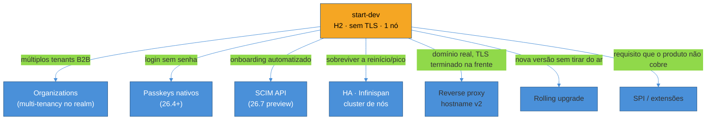
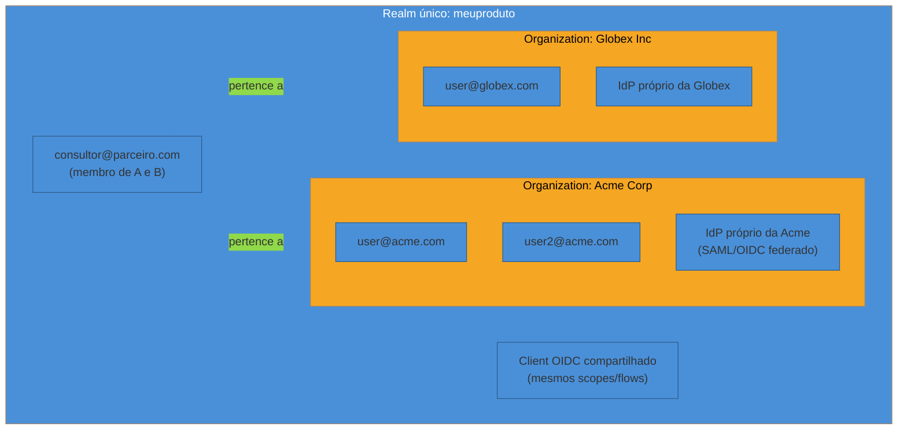
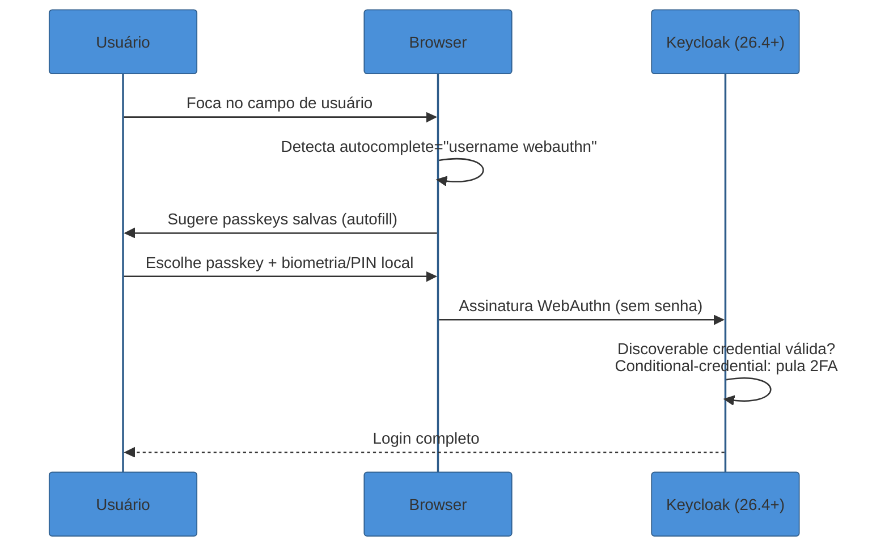
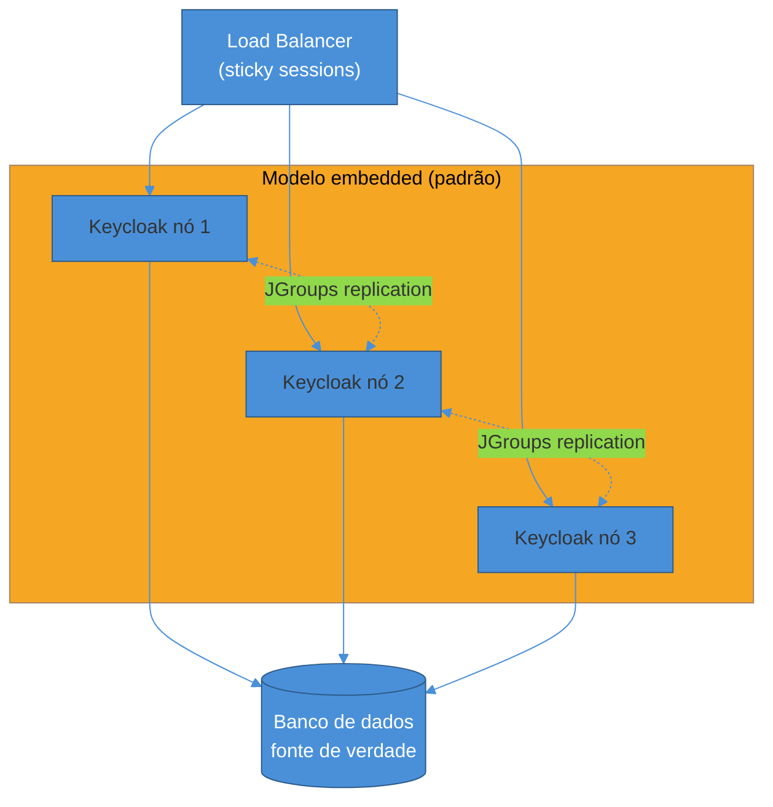
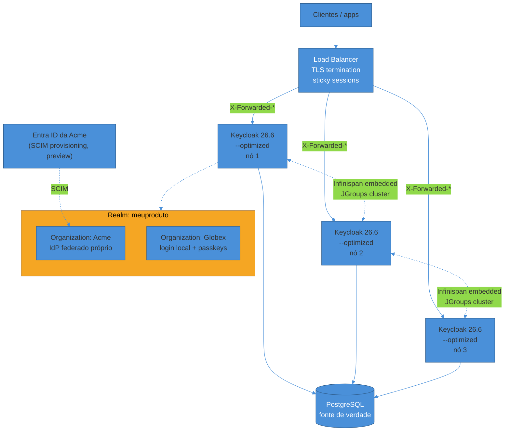

# Keycloak em produção

> [!abstract] TL;DR
> "Funciona no meu Docker" e "funciona em produção" são duas afirmações quase sem relação quando o assunto é Keycloak. Um `docker run quay.io/keycloak/keycloak start-dev` sobe em segundos, com H2 embutido, sem TLS, sem cluster — ótimo para aprender realms e flows (nota anterior), péssimo para qualquer coisa que precise sobreviver a uma reinicialização, um pico de tráfego ou um cliente enterprise pedindo SSO. Esta nota cobre o que muda entre os dois mundos, na linha 26.x (estável 26.6, com 26.7 trazendo três recursos que valem a pena entender mesmo em preview): **Organizations**, o recurso que materializa multi-tenancy B2B dentro de um único realm — introduzido no Keycloak 25, hoje maduro, com admin roles granulares por organização chegando no 26.7; **passkeys nativos** (26.4+), com UI condicional que elimina a fricção de configurar WebAuthn na mão; **SCIM** como API de provisionamento automatizado (26.7, ainda preview); **HA via Infinispan**, o cache distribuído que decide se uma sessão sobrevive a um failover ou não, com um modelo novo no 26.7 que promete matar a dependência de um cluster Infinispan externo; rodar **atrás de proxy reverso** com o hostname resolvido corretamente; **upgrade sem downtime**; **SPIs** para estender o que o produto não cobre nativamente; e, por fim, a pergunta que projetos maduros fazem cedo demais tarde: quando Keycloak é a ferramenta errada.

> [!question]- Perguntas que esta nota responde
> - O que exatamente o recurso Organizations resolve que um realm sozinho não resolve — e quando ainda vale a pena usar realm-por-tenant?
> - Como o Keycloak faz passkeys funcionarem sem eu escrever uma linha de JavaScript WebAuthn?
> - O que o SCIM automatiza que o admin console não automatiza?
> - Por que "Keycloak em cluster" não é só "rodar duas instâncias" — o que o Infinispan realmente guarda, e por que isso importa num failover?
> - O que muda quando o Keycloak fica atrás de um load balancer / ingress, e por que ele reclama tanto de "hostname"?
> - É possível fazer upgrade de versão sem tirar o serviço do ar?
> - Quando NÃO usar Keycloak — e o que usar no lugar?

## O salto de dev para produção

A nota anterior, [[01 - Keycloak — realms, clients e flows|01]], tratou o Keycloak como um produto que se aprende num container único: realms, clients, authentication flows, admin console. Esse modelo mental está correto — é a mesma engenharia interna em produção — mas ele esconde deliberadamente três problemas que só aparecem quando o Keycloak precisa ficar de pé por meses, sob carga real, atrás de um domínio de verdade, com clientes B2B batendo à porta pedindo SSO próprio.

O primeiro problema é **estado**: um realm sozinho não modela "múltiplas empresas usando o mesmo produto, cada uma com seu próprio IdP corporativo e seus próprios admins" sem gambiarra — é isso que o recurso Organizations resolve. O segundo é **disponibilidade**: um único nó Keycloak é um único ponto de falha, e a resposta ingênua ("só sobe mais um nó atrás de um load balancer") esconde uma pergunta nada trivial — o que acontece com a sessão de um usuário logado quando o nó que a criou cai? É aí que entra o Infinispan. O terceiro é **operação contínua**: quem administra um IdP em produção precisa saber fazer upgrade sem quebrar login de ninguém, entender o que o proxy na frente está fazendo com os headers, e decidir quando estender o produto via SPI em vez de esperar uma feature request ser atendida upstream.



Cada um desses seis eixos é uma seção desta nota. Fechamos com a pergunta honesta: em que ponto manter esse cluster de pé custa mais caro, em tempo de engenharia, do que o problema de identidade que ele resolve.

## Organizations: multi-tenancy B2B dentro de um realm

O conceito de multi-tenancy — isolar tenants, decidir onde fica a fronteira de identidade, o modelo de organizações com membership em N tenants — já foi coberto em [[3 - Autorização e multi-tenancy/03 - Multi-tenancy e organizações|Multi-tenancy e organizações]]. O que esta seção cobre é a **materialização concreta** desse conceito dentro do Keycloak: o recurso chamado **Organizations**.

Organizations foi introduzido como preview no Keycloak 25 (meados de 2024) e estabilizado — general availability — a partir do Keycloak 26[^kc-org-announce]. A ideia central: em vez de um realm por tenant (o modelo antigo de "SaaS multi-tenant com Keycloak"), um único realm ganha uma camada de agrupamento — a Organization — à qual usuários podem pertencer. Um usuário existe no realm; a Organization é uma **camada de membership** sobre ele, não um container que o isola[^kc-org-medium]. Isso resolve de cara o problema mais comum de B2B SaaS: um consultor, um administrador de plataforma, ou um usuário que atende múltiplos clientes precisa pertencer a mais de uma organização ao mesmo tempo — trivial em Organizations, doloroso em realm-por-tenant, onde o mesmo humano precisaria de uma conta por realm.



Cada Organization pode ter seu próprio **identity provider federado** (o cliente enterprise que já tem Okta ou Entra ID interno) e seu próprio **domínio de e-mail** para roteamento automático de login — um usuário que digita `usuario@acme.com` na tela de login é automaticamente direcionado para o IdP da Acme, sem precisar escolher manualmente[^kc-org-skycloak]. Isso é exatamente o padrão que faz Organizations ser "o default certo" para a maioria dos SaaS B2B: uma empresa opera um único realm, um único cluster, uma única superfície de operação — e ainda assim oferece a cada cliente enterprise a ilusão de um IdP dedicado.

### Organizations vs realm-por-tenant: quando cada um vale a pena

A pergunta que aparece cedo em qualquer decisão de arquitetura B2B é: por que não simplesmente um realm por cliente? A resposta prática, de quem já operou os dois modelos, é uma questão de escala e de isolamento necessário. Realm-por-tenant funciona bem até algo entre 5 e 20 tenants — além disso, você deixa de "construir seu produto" e passa a "operar uma plataforma de IAM" em tempo integral, porque cada operação (deploy de tema, mudança de flow, rotação de client secret) precisa ser replicada realm a realm[^intension-realms]. Um único cluster Keycloak comporta, na prática, milhares de realms, mas operações de cluster inteiro (upgrade, backup, métricas agregadas) crescem linearmente com o número de realms — cada realm a mais é mais um item na lista, não um custo zero[^cloudiam-multitenancy].

Organizations, em contraste, mantém um único realm — um único conjunto de clients, scopes e configuração de autenticação base — variando apenas *quem* autentica e *a qual organização pertence*. A limitação correspondente é exatamente essa: **não dá para dar a um tenant um client customizado, roles totalmente isoladas, temas próprios ou um conceito de admin completamente segregado** dentro do modelo Organizations[^kc-org-medium2]. Se um cliente enterprise exige, contratualmente, um ambiente logicamente isolado — schema próprio de roles, fluxo de autenticação customizado que não pode vazar para outros tenants — isso é argumento para realm-per-tenant, ou para um híbrido: realms separados para identidades internas vs. externas, com Organizations dentro do realm externo agrupando os clientes[^cloudiam-arch].

A tabela resume a decisão:

| Critério | Organizations (1 realm) | Realm-per-tenant |
|---|---|---|
| Nº de tenants | Dezenas a milhares | Até ~20 |
| Usuário em múltiplos tenants | Nativo (membership) | Requer conta por realm |
| Isolamento de config/tema/flow | Compartilhado no realm | Total por tenant |
| Custo operacional (upgrade, backup) | Um cluster, uma operação | Cresce com nº de realms |
| IdP federado por tenant | Sim, por Organization | Sim, por realm |

> [!info] Versão em aberto
> Organizations é **estável desde o Keycloak 26** (não mais preview). O Keycloak **26.7** (julho de 2026) adiciona **Fine-Grained Admin Permissions (FGAP) para Organizations**: antes, delegar a administração de uma organização a alguém exigia a role `manage-realm` — acesso amplo demais para um admin que só deveria mexer na própria organização. O 26.7 introduz roles dedicadas (`manage-organizations`, `view-organizations`, `query-organizations`) e permissões *por organização*: um admin com `manage`+`view` na Organization A e só `view` na B enxerga as duas, mas só consegue editar a A — as demais ficam completamente ocultas no Admin Console e na REST API[^kc-org-fgap]. O 26.7 também adiciona mapeamento de roles de realm/client para grupos de Organization, e permite que um usuário membro de múltiplas organizations troque de organização ativa durante o login[^kc-260-release].

> [!warning] Tratar Organizations como isolamento de segurança forte
> **O que acontece:** a equipe assume que, por estarem em "organizations" diferentes, dois tenants estão tão isolados quanto estariam em realms separados.
> **Por quê:** Organizations é uma camada de *membership e roteamento de login* sobre um realm compartilhado — roles, clients e flows base continuam no mesmo espaço lógico. Um bug de autorização na aplicação (não no Keycloak) que ignore o filtro de organização pode vazar dados entre tenants, porque o realm por trás é o mesmo.
> **Como evitar:** a aplicação cliente (o resource server) precisa validar o claim de organização em toda chamada, tratando-o como qualquer outro escopo de autorização — Organizations resolve *quem* autentica onde, não substitui autorização fine-grained no backend (ver [[3 - Autorização e multi-tenancy/02 - Fine-grained authorization — Zanzibar e policy-as-code|Fine-grained authorization]]).

## Passkeys no Keycloak: WebAuthn sem escrever WebAuthn

O conceito de passkeys — credenciais baseadas em pares de chave pública/privada, resistentes a phishing, sincronizadas ou vinculadas a dispositivo — já foi coberto em [[1 - Fundamentos de identidade/05 - Passkeys e WebAuthn — o presente sem senha|Passkeys e WebAuthn]]. O que muda aqui é que, a partir do Keycloak 26.4 (setembro de 2025), esse mecanismo passou a ser **integrado nativamente ao fluxo de login padrão**, sem exigir que o time reimplemente a cerimônia WebAuthn na mão em JavaScript[^kc-passkey-announce].

Antes do 26.4, oferecer passkeys no Keycloak significava configurar WebAuthn como segundo fator (2FA) — funcional, mas sem a experiência "sem senha" que faz passkeys valerem a pena. O 26.4 muda isso de duas formas concretas:

**UI condicional (conditional UI / autofill).** O campo de usuário na tela de login ganha o atributo `autocomplete="username webauthn"`. Quando o navegador detecta esse atributo, ele oferece — no próprio teclado virtual ou dropdown do campo — as passkeys já cadastradas para aquele domínio, sem que o usuário precise clicar em nenhum botão "entrar com passkey" separado[^kc-passkey-github]. Isso é o que faz passkeys parecerem mágicas: o usuário toca no campo de usuário, o dispositivo pergunta "usar sua digital?", e ele está logado — sem digitar nada.

**Discoverable credentials como primeiro fator.** A política de WebAuthn Passwordless (`Authentication → Policies → Webauthn Passwordless Policy`) ganha uma opção **Discoverable Credentials**, que segue a especificação atual do WebAuthn com três valores: `required`, `preferred`, `discouraged`. Configurando essa política com `Enabled Passkeys = yes` e `Require Discoverable Credentials = yes`, o Keycloak ativa o login estilo passkey já no fluxo de browser padrão, sem precisar editar o authentication flow manualmente[^kc-passkey-github]. Um novo autenticador, o **Conditional - credential**, entra automaticamente no browser flow padrão para pular o segundo fator quando o primeiro já foi uma passkey — reconhecendo que uma passkey já é, por si só, resistente a phishing e equivalente a MFA[^kc-passkey-github].



Na prática, isso significa que habilitar passkeys no Keycloak 26.6/26.7 é majoritariamente **configuração de política**, não desenvolvimento de frontend customizado — uma inversão real em relação a como a maioria dos IdPs tratava WebAuthn até 2024.

> [!question]- E se o usuário tiver passkey sincronizada (iCloud/Google) em vez de vinculada a dispositivo?
> O Keycloak não distingue passkeys sincronizadas de device-bound no nível de política — essa é uma decisão do autenticador da plataforma (iOS, Android, gerenciador de senhas), não do Relying Party. O Keycloak só pede uma assinatura WebAuthn válida contra a chave pública cadastrada; se o par de chaves foi sincronizado entre dispositivos por um provedor de passkeys, isso é transparente para o Keycloak. A implicação de segurança dessa distinção (phishing-resistance idêntica, mas modelo de ameaça de "perda de conta na nuvem" diferente) é tratada na nota de fundamentos.

## SCIM: provisionamento automatizado, ainda em preview

Enquanto Organizations resolve "quem pertence a qual tenant" e passkeys resolve "como o usuário prova quem é", **SCIM** (System for Cross-domain Identity Management, RFC 7643/7644) resolve um terceiro problema: como o **ciclo de vida** de usuários e grupos é sincronizado automaticamente entre o RH/IdP corporativo do cliente e o Keycloak, sem um humano clicando em "criar usuário" a cada contratação e "desativar" a cada desligamento.

O Keycloak vinha oferecendo suporte a SCIM por extensões de terceiros havia anos (o projeto `scim-for-keycloak`, mantido pela comunidade, é referenciado com frequência em produção antes do suporte nativo)[^scim-third-party]. A mudança recente é que o **SCIM virou parte do core do produto**: lançado como recurso experimental no Keycloak 26.6 e promovido a **preview** no 26.7 (julho de 2026)[^kc-260-release]. Como toda feature em preview, vem desabilitada por padrão — é preciso habilitar explicitamente a feature flag `scim-api` para testá-la.

A API SCIM nativa cobre CRUD completo (create, read, update, delete) e operações PATCH para usuários e grupos dentro de um realm, com filtro, paginação, suporte à extensão *Enterprise User* do schema SCIM, e endpoints de descoberta de schema — o suficiente para que uma plataforma de governança de identidade (Okta, Entra ID, um sistema de RH) provisione e desprovisione usuários no Keycloak automaticamente, sem integração customizada[^kc-scim-feedback].

> [!info] Versão em aberto
> SCIM nativo é **preview no Keycloak 26.7** — ainda não é o caminho recomendado para produção crítica sem avaliação cuidadosa (APIs preview podem mudar de contrato entre versões menores). Para provisionamento SCIM já em produção hoje, a comunidade em geral ainda recorre a extensões de terceiros amadurecidas, como `scim-for-keycloak`[^scim-third-party]. Acompanhe o roadmap oficial antes de comprometer arquitetura de provisionamento a uma feature preview.

O caso de uso concreto: um cliente enterprise do seu SaaS B2B já usa Entra ID internamente. Em vez de pedir para o time de TI dele cadastrar manualmente cada funcionário no seu produto, ele configura o Entra ID para falar SCIM com o endpoint do Keycloak — toda contratação, mudança de cargo ou desligamento no Entra ID propaga automaticamente para o realm, dentro da Organization correspondente[^skycloak-scim-entra]. É a peça que fecha o ciclo "enterprise readiness": SSO federado (via Organizations) resolve autenticação; SCIM resolve o *lifecycle* de quem pode autenticar.

## HA e clustering: o que o Infinispan realmente guarda

Aqui está a parte que mais frequentemente é subestimada: "colocar o Keycloak em HA" não é apenas rodar N réplicas atrás de um load balancer. O Keycloak guarda estado — sessões de usuário, códigos de autorização emitidos, tokens de ação — e esse estado precisa ser visível a **qualquer** nó que receba a próxima requisição daquele usuário, ou o login quebra a cada failover.

Esse estado vive num cache distribuído chamado **Infinispan**, e o Keycloak usa dois modelos, com trade-offs opostos.

**Cache embarcado (embedded).** Cada nó Keycloak roda sua própria instância Infinispan, e os nós formam um cluster entre si (via JGroups, tipicamente descoberta por DNS ou Kubernetes) para replicar dados como sessões entre eles. É o modelo padrão, mais simples de operar — não há um sistema externo a manter — mas tem uma armadilha real: um desligamento completo e não-gradual do cluster (por exemplo, um upgrade que derruba todos os nós de uma vez) **apaga o cache distribuído inteiro**, junto com todas as sessões ativas[^dev-infinispan-cache].

**Cache externo (external Infinispan).** Um cluster Infinispan separado, rodando fora dos processos Keycloak, com os nós Keycloak se conectando a ele como clientes remotos. Isso torna o Keycloak **stateless** — reiniciar, escalar ou fazer upgrade de um nó não perde nenhuma sessão, porque o estado nunca esteve nele —, além de tornar operações de escrita mais rápidas (só o Infinispan externo precisa replicar) e permitir escalar cache e aplicação de forma independente[^dev-infinispan-cache]. O custo é operar um sistema distribuído a mais, com sua própria disponibilidade, backup e monitoramento.



### Multi-site e o fim do cache externo separado (26.7 preview)

Até o Keycloak 26.6, um deployment **multi-site** — dois ou mais data centers/regiões, para tolerância a desastre — exigia um cluster Infinispan externo replicado entre sites, adicionando uma segunda camada distribuída complexa só para coordenar failover geográfico[^kc-multisite-issue]. O Keycloak 26.7 introduz, em preview, o que a documentação chama de **Multi-cluster v2**: um modelo que **remove por completo a exigência de Infinispan externo**. Os nós Keycloak de diferentes clusters se conectam entre si usando caches embarcados, e o **banco de dados** — replicado de forma síncrona entre sites — passa a ser a única fonte de verdade; a invalidação de cache entre sites é resolvida via um padrão *outbox* apoiado no banco, e o load balancer detecta a queda de um site sem precisar de infraestrutura de *fencing* externa dedicada[^kc-multisite-preview]. Para habilitar, o servidor sobe com a feature `stateless`.

> [!info] Versão em aberto
> Multi-cluster v2 é **preview no 26.7** (julho de 2026) — uma simplificação real frente ao modelo anterior (cache externo replicado entre sites), mas ainda sujeito a mudança de design antes de virar GA. Para quem está desenhando HA multi-região agora, vale acompanhar o *Multi-cluster deployments (v2) guide* oficial antes de comprometer a arquitetura.

> [!warning] Assumir que "3 réplicas = alta disponibilidade" sem entender o modelo de cache
> **O que acontece:** a equipe sobe 3 pods Keycloak num Kubernetes, aponta todos para o mesmo Postgres, e assume que está em HA — mas não configurou descoberta de cluster Infinispan corretamente (JGroups sem DNS/KUBE_PING configurado), então cada nó opera um cache isolado.
> **Por quê:** sem os nós formando um cluster Infinispan de fato, uma sessão criada no nó 1 não existe no nó 2 — se o load balancer não usar sticky sessions e mandar a próxima requisição do mesmo usuário para o nó 2, o Keycloak não reconhece a sessão, e o usuário é deslogado silenciosamente ou vê um erro de estado inválido.
> **Como evitar:** validar a formação do cluster Infinispan explicitamente (logs de JGroups mostrando os N membros vistos), configurar sticky sessions no load balancer como mitigação complementar (não substituta), e testar failover de verdade — derrubar um nó com sessões ativas e confirmar que o login sobrevive — antes de declarar o ambiente "em HA".

## Rodando atrás de um proxy reverso: hostname e headers

Em produção, o Keycloak quase nunca fala HTTPS diretamente com o cliente — um proxy reverso ou ingress (nginx, Traefik, um load balancer de nuvem) termina o TLS na frente e encaminha para o Keycloak via HTTP ou TLS reencriptado dentro da rede interna. Isso cria um problema imediato: o Keycloak, ao gerar URLs (para redirects OAuth, para o discovery document, para links de e-mail), precisa saber qual é o hostname *público* — não o hostname interno que ele enxerga na conexão direta do proxy.

A resposta é a opção `--proxy-headers`, que diz ao Keycloak para confiar nos cabeçalhos que o proxy injeta descrevendo a requisição original[^kc-proxy-headers]:

- **`forwarded`** — interpreta o cabeçalho `Forwarded` padronizado pela RFC 7239.
- **`xforwarded`** — interpreta os cabeçalhos não-padronizados, porém onipresentes, `X-Forwarded-For`, `X-Forwarded-Proto`, `X-Forwarded-Host`, `X-Forwarded-Port` e `X-Forwarded-Prefix`.

Um exemplo mínimo de configuração de produção atrás de um proxy que injeta `X-Forwarded-*`, com hostname fixo (mais previsível que deixar tudo dinâmico):

```
bin/kc.sh start --optimized \
  --hostname meuidp.exemplo.com \
  --proxy-headers xforwarded \
  --proxy-trusted-addresses 10.0.1.0/24
```

O `--proxy-trusted-addresses` não é opcional em qualquer ambiente com pretensão de segurança: sem ele, o Keycloak aceitaria cabeçalhos `X-Forwarded-*` de **qualquer origem**, incluindo um cliente malicioso que forje o próprio `X-Forwarded-Host` para manipular URLs de redirect geradas pelo servidor — restringir a lista de IPs confiáveis ao(s) proxy(s) reais fecha essa porta[^kc-proxy-headers].

A configuração de hostname propriamente dita — chamada de **hostname v2** desde que o mecanismo foi reformulado a partir do Keycloak 26 — permite granularidade adicional: hostname diferente para o Admin Console (frequentemente restrito a uma rede interna) versus o hostname público usado pelas aplicações finais, e a opção de deixar partes da URL (porta, esquema, prefixo de caminho) resolvidas dinamicamente a partir dos headers, em vez de hardcoded[^kc-hostname-doc]. Isso importa em deployments onde o Admin Console não deveria estar exposto na mesma superfície pública que os endpoints de autenticação.

## Upgrade sem downtime

Um IdP em produção precisa evoluir de versão sem que isso signifique uma janela de manutenção anunciada a cada patch. O Keycloak distingue duas situações, e a diferença é o que determina se um upgrade pode ser feito com zero downtime.

**Upgrades de patch, dentro da mesma linha major.minor** (por exemplo, 26.6.3 → 26.6.4), suportam **rolling update sem downtime**, desde que o deployment tenha ao menos dois nós: o processo desliga um nó antigo por vez, sobe o novo no lugar, aguarda a *startup probe* confirmar que o novo nó está pronto, e só então segue para o próximo — em nenhum momento todos os nós ficam fora do ar simultaneamente[^kc-rolling-doc].

**Upgrades entre versões major**, no entanto, **não têm garantia de zero downtime** — o próprio Keycloak reconhece essa limitação explicitamente: mudanças de schema de banco, formato de cache ou contrato interno entre versões major podem exigir uma parada coordenada[^kc-rolling-doc]. Isso não significa "sempre vai quebrar", mas significa que a suposição por padrão deveria ser "planeje uma janela", validando com antecedência (o Keycloak fornece uma checagem de compatibilidade de rolling update antes do upgrade real) se aquela transição específica é segura.

No Kubernetes, o **Keycloak Operator** automatiza boa parte dessa decisão via a *update strategy*: o modo **Auto** dispara um job de verificação que avalia se um rolling update é viável para aquele patch específico e o executa automaticamente quando é seguro; o modo **Explicit** delega a decisão a um humano; e o modo **Recreate** derruba o StatefulSet inteiro antes de aplicar a atualização — a opção mais simples, mas com downtime garantido[^kc-rolling-doc]. Uma recomendação prática recorrente na documentação e em relatos de produção: **habilitar sticky sessions no load balancer** durante o processo de rolling update, para evitar que um mesmo usuário alterne entre versões diferentes do servidor no meio de uma sessão — o que, na melhor das hipóteses, força um refresh manual do Account Console ou Admin UI[^kc-rolling-doc].

> [!info] Versão em aberto
> O Keycloak **26.6** (junho de 2026) formalizou zero-downtime updates e *workflows* automatizados de upgrade como parte da linha de releases estáveis — antes disso, o processo dependia mais de scripts próprios de cada equipe de operação[^heise-2660]. A recomendação de "testar com o Auto Strategy antes de confiar cegamente nele" continua válida: o job de verificação avalia compatibilidade de schema e cache, não garante ausência de qualquer efeito colateral em toda configuração customizada (temas, SPIs próprias).

## SPI e extensões: quando o produto não cobre

O Keycloak não tenta prever todo requisito corporativo possível — a estratégia do projeto é expor **pontos de extensão** (SPI, Service Provider Interface) e deixar que cada organização implemente o que for específico do seu negócio. A arquitetura segue o padrão `ServiceLoader` do Java: toda extensão point tem uma interface `Provider` (o código que faz o trabalho) e uma `ProviderFactory` (responsável por criar instâncias e gerenciar o ciclo de vida)[^kc-spi-baeldung].

Os pontos de extensão mais usados em produção:

- **`UserStorageProvider`** — federar usuários de um sistema legado (um banco de dados proprietário, um LDAP não padrão) sem migrar os dados para dentro do Keycloak, expondo-os ao restante do produto como se fossem usuários nativos.
- **`EventListenerProvider`** — reagir a eventos do Keycloak (login, falha de autenticação, criação de usuário) para, por exemplo, disparar um webhook para um sistema de auditoria externo ou popular um data warehouse de segurança.
- **`Authenticator`** — inserir um passo customizado num authentication flow, como uma verificação de risco proprietária ou uma integração com um provedor de MFA que o Keycloak não suporta nativamente.

Duas regras operacionais fecham o assunto. Primeiro, empacotamento: a extensão vira um `.jar`, colocado no diretório `providers/` da distribuição; se o servidor roda com `--optimized` (o modo recomendado de produção, que assume um *closed-world* de providers conhecidos previamente), é preciso rodar `bin/kc.sh build` de novo depois de adicionar o jar, para que o registro otimizado de providers seja atualizado — esquecer esse passo é uma causa comum de "minha extensão não aparece" em produção[^kc-spi-baeldung]. Segundo, compatibilidade de versão: SPIs internas do Keycloak não são uma API pública estável entre versões major — cada upgrade relevante merece revisão de qualquer SPI customizada, já que assinaturas de interface podem mudar[^kc-spi-skycloak].

## Exemplo trabalhado: um deployment HA de referência

Juntando as peças, um desenho razoável para um SaaS B2B de porte médio rodando Keycloak 26.6 em produção, atendendo múltiplos clientes enterprise dentro de um único realm:



Nesse desenho: três nós Keycloak formam um cluster Infinispan embarcado (suficiente para a maioria dos SaaS de porte médio, sem a complexidade operacional de um Infinispan externo); o Postgres é a fonte de verdade persistente; o load balancer termina TLS e injeta `X-Forwarded-*`, e o Keycloak sobe com `--proxy-headers xforwarded` e hostname fixo; a Organization "Acme" federa autenticação com o Entra ID corporativo do cliente e recebe provisionamento via SCIM (assumindo que a equipe avaliou o risco de depender de uma feature preview); a Organization "Globex", menor, usa login local com passkeys habilitadas via política de discoverable credentials. Rodar em Kubernetes com o Operator, observabilidade e métricas de cluster aprofundadas (dashboards, alertas, tracing) é assunto de Operação — mencionado aqui, não desenvolvido.

## Quando Keycloak é a ferramenta errada

A pergunta honesta chega depois de toda essa engenharia: será que o problema de identidade da sua empresa justifica manter um cluster Keycloak de pé? A resposta depende de quanto tempo de engenharia você está disposto a gastar operando um IdP, versus construindo o produto.

**O custo real de operar Keycloak em produção não é trivial.** Estimativas de mercado apontam um piso de infraestrutura e labor parcial em torno de alguns milhares de dólares por mês para um cluster de produção com segurança básica — número que sobe rapidamente quando entram auditorias de compliance, resposta a incidentes e manutenção não planejada; times relatam dedicar de 3 a 5 horas por semana só de operação contínua de um cluster de produção[^skycloak-cost]. Ao longo de três anos, o TCO de um Keycloak auto-hospedado pode superar a casa das seis dígitos, dominado por custo de pessoal especializado em identidade e DevOps — não por licença (que é zero) mas por gente[^skycloak-cost2].

**Quando faz sentido usar Keycloak:**
- Requisito de **residência de dados** ou compliance que exige que a identidade do cliente nunca saia do seu ambiente controlado (saúde, financeiro, setor público, mercados europeus regulados) — Auth0/WorkOS/Cognito são, por definição, cloud de terceiros[^workos-comparison].
- Necessidade de **customização profunda**: fluxos de autenticação totalmente próprios, SPIs para integrar sistemas legados, um modelo de dados de usuário que os SaaS de IdP não conseguem acomodar via configuração.
- Já existe **capacidade de operação** madura (SRE, DevOps) que absorve o custo de upgrade, patch de CVE e HA sem desviar tempo do produto principal.
- Volume que torna custo por usuário ativo mensal (o modelo de cobrança do Auth0 e de boa parte da concorrência) proibitivamente caro em escala — Keycloak não cobra por MAU.

**Quando é overkill:**
- Time pequeno, auth é responsabilidade lateral (não o produto), e ninguém tem bagagem de operar sistemas distribuídos com estado. O cadenciamento de releases do Keycloak (novidades a cada poucas semanas, patches de segurança, failover manual em caso de problema) consome tempo de engenharia que poderia ir para o produto[^skycloak-overkill].
- O requisito real é "SSO enterprise + SCIM rápido", e o time de frontend é enxuto — **WorkOS** é construído especificamente para esse checklist (SSO, Directory Sync, Audit Logs, Admin Portal pronto), enquanto o Keycloak entrega os primitivos (Organizations, Admin API) mas exige que você mesmo construa a experiência de self-service do cliente[^workos-comparison].
- A empresa já vive dentro do ecossistema AWS e não tem requisito de portabilidade de nuvem — **Cognito** integra-se naturalmente com o resto da infraestrutura, embora seja consideravelmente mais limitado em customização de flows e federação do que Keycloak[^ritza-comparison].
- Startups B2B early-stage que precisam de multi-tenancy nativo e API developer-first sem operar infraestrutura — **Zitadel** (cloud-native, escrito em Go, cobertura de compliance mais ampla) ou soluções gerenciadas de Keycloak (managed hosting) capturam o meio-termo entre "construir tudo" e "pagar por MAU"[^auth0alt-zitadel].

Uma retrospectiva citada com frequência em discussões técnicas resume o risco de subestimar esse custo: uma equipe que construiu sua própria solução baseada em Keycloak relatou que, se pudesse recomeçar, teria escolhido Auth0 — não porque Keycloak seja tecnicamente inferior, mas porque o custo de manutenção acumulado ao longo do tempo superou o que a equipe havia orçado inicialmente[^workos-retrospective]. A decisão certa não é "Keycloak é sempre a resposta madura" nem "SaaS de IdP é sempre mais simples" — é medir, com números reais da sua operação, se o time que sustentaria o cluster existe e tem orçamento de tempo sobrando.

> [!warning] Escolher Keycloak só porque é "grátis" e open source
> **O que acontece:** a decisão de arquitetura pesa a ausência de custo de licença e ignora o custo de operação — infraestrutura, upgrade, patch de CVE, HA, tempo de engenharia especializada.
> **Por quê:** "sem custo de licença" não é o mesmo que "sem custo total" — o TCO de rodar Keycloak em produção com seriedade inclui pessoal, e esse componente costuma ser maior do que qualquer mensalidade de SaaS de IdP para times pequenos ou médios.
> **Como evitar:** orçar o custo de operação (horas de engenharia por semana, infraestrutura, resposta a incidentes) antes de decidir, e comparar contra o custo por MAU de alternativas gerenciadas na escala real esperada — não na escala hipotética de "quando formos grandes".

## Em entrevista

Entrevistadores seniores de plataforma ou identidade costumam usar Keycloak como gancho para testar se o candidato entende operação de sistemas com estado, não só configuração de tela. A pergunta raramente é "você sabe configurar Keycloak?" — é algo como "como você desenharia HA para um IdP?" ou "quando você optaria por construir versus comprar identidade?".

Uma resposta fraca lista features: "o Keycloak tem Organizations, tem passkeys, tem SCIM, dá pra rodar em cluster." Uma resposta forte amarra cada peça a um trade-off operacional concreto: "Organizations resolve multi-tenancy sem multiplicar realms, mas não isola configuração — se um cliente enterprise exigir isolamento total de tema ou flow, isso é argumento para realm dedicado. E HA num IdP não é só réplicas: preciso decidir se o cache de sessão é embarcado (mais simples, mas perdido num shutdown completo) ou externo (stateless, mais caro de operar) — e essa decisão muda a estratégia de upgrade e de disaster recovery."

> **Entrevistador:** "Sua empresa está decidindo entre Keycloak self-hosted e um SaaS de IdP tipo Auth0 ou WorkOS. Como você guiaria essa decisão?"
>
> **Resposta fraca:** "Depende do orçamento — Keycloak é grátis, então é mais barato."
>
> **Resposta forte:** "Licença zero não é custo zero. Eu levantaria três números: primeiro, o custo real de operação de um cluster Keycloak em HA — infraestrutura, mais o tempo de um time que já sabe operar sistemas distribuídos com estado, porque sessão e Infinispan não são triviais de manter saudáveis. Segundo, o custo projetado por MAU de um SaaS de IdP na nossa escala esperada em 12-24 meses, não hoje. Terceiro, requisitos não-negociáveis: se residência de dados ou customização profunda de fluxo forem hard requirements, isso pesa a favor de Keycloak independente do custo, porque SaaS de terceiros não resolve. Se o requisito real é só 'SSO enterprise rápido' e o time é pequeno, WorkOS ou um SaaS gerenciado resolve mais rápido e mais barato do que construir a experiência de self-service que o Keycloak não entrega pronta."

Essa resposta demonstra raciocínio de build-vs-buy real — números, requisitos não-negociáveis, e reconhecimento de que "grátis" e "barato" não são sinônimos quando o custo é operacional.

## How to explain it in English

> "Keycloak in production is a different animal from Keycloak in a dev container. Organizations gives you B2B multi-tenancy inside a single realm — one set of clients and flows, with each tenant federating its own IdP and users able to belong to more than one organization at once, which realm-per-tenant can't do cleanly. Passkeys are now first-class as of 26.4, with conditional UI that surfaces saved credentials right in the username field, no custom WebAuthn code required. High availability isn't just running more replicas — Keycloak holds session state in an Infinispan cache, and whether that cache is embedded (simpler, but wiped on a full non-rolling shutdown) or external (stateless nodes, but another distributed system to run) changes your whole upgrade and disaster-recovery story. And the honest question every team should ask before committing: does your identity problem actually justify the ongoing operational cost of running an IdP, or would a managed provider like Auth0, WorkOS, or Zitadel get you there faster and cheaper at your current scale?"

| PT | EN |
|----|----|
| Organizações (recurso) | Organizations |
| Multi-tenancy dentro de um realm | Multi-tenancy within a single realm |
| Realm por tenant | Realm-per-tenant |
| Credenciais detectáveis | Discoverable credentials |
| UI condicional / autopreenchimento | Conditional UI / autofill |
| Provisionamento automatizado | Automated provisioning |
| Cache embarcado / externo | Embedded / external cache |
| Atualização contínua sem downtime | Rolling update / zero-downtime update |
| Cabeçalhos de proxy reverso | Reverse proxy headers |
| Ponto de extensão (SPI) | Service Provider Interface |
| Construir versus comprar | Build versus buy |
| Custo total de propriedade | Total cost of ownership (TCO) |

## O que vem a seguir

Esta nota cobriu o Keycloak como sistema — como ele escala, como sobrevive a falhas, como se estende e quando não vale a pena. O que falta é fechar o loop com o sub-galho 4: como cada stack (Spring, FastAPI, Django, Express, NestJS, Gin) efetivamente fala com esse Keycloak em produção — validando tokens, redirecionando para login, tratando o realm como resource server e client ao mesmo tempo. Isso é o assunto da última nota do sub-galho, que costura um fluxo de referência único (SPA + BFF + API) atravessando os stacks cobertos.

- [[03 - Integrando os stacks com Keycloak]] — fluxo de referência SPA+BFF+API com Keycloak como Authorization Server, cobrindo Spring, FastAPI, NestJS/Express e Gin
- [[01 - Keycloak — realms, clients e flows]] — os fundamentos que esta nota assume: realm, client, authentication flow, admin console
- [[3 - Autorização e multi-tenancy/03 - Multi-tenancy e organizações|Multi-tenancy e organizações]] — o conceito neutro de tenant/organização que o recurso Organizations materializa
- [[1 - Fundamentos de identidade/05 - Passkeys e WebAuthn — o presente sem senha|Passkeys e WebAuthn]] — o conceito de credencial que o Keycloak 26.4+ expõe nativamente

## Fontes

- **Keycloak.org** — [*Keycloak 26.7.0 released*](https://www.keycloak.org/2026/07/keycloak-2670-released) — SCIM API preview, Multi-cluster v2, admin roles de Organizations; acessado em 2026-07-11.
- **Keycloak.org** — [*Fine-Grained Admin Permissions for Organizations*](https://www.keycloak.org/2026/05/org-fgap) — roles `manage-organizations`/`view-organizations`/`query-organizations`, permissões por organização; acessado em 2026-07-11.
- **Keycloak.org** — [*Support for CIAM and Multi-tenancy*](https://www.keycloak.org/2024/06/announcement-keycloak-organizations) — anúncio original do recurso Organizations; acessado em 2026-07-11.
- **Medium (Abhishek Koserwal)** — [*Exploring Keycloak 26: Introducing the Organization Feature for Multi-Tenancy*](https://medium.com/keycloak/exploring-keycloak-26-introducing-the-organization-feature-for-multi-tenancy-fb5ebaaf8fe4) — modelo de membership, IdP federado por organização; acessado em 2026-07-11.
- **intension.de** — [*Client Separation Starting with Keycloak 26: Realms or Organizations as an Architectural Choice*](https://www.intension.de/en/infoblog/client-separation-starting-with-keycloak-26-realms-or-organizations-as-an-architectural-choice/) — trade-offs realm-per-tenant vs Organizations; acessado em 2026-07-11.
- **Cloud-IAM** — [*Keycloak multi-tenancy architecture*](https://www.cloud-iam.com/post/keycloak-multi-tenancy/) — escala de realms por cluster, custo operacional de multi-realm; acessado em 2026-07-11.
- **Keycloak.org** — [*Passkeys support in upcoming Keycloak release (26.4)*](https://www.keycloak.org/2025/09/passkeys-support-26-4) — anúncio de passkeys nativos; acessado em 2026-07-11.
- **GitHub keycloak/keycloak** — [*passkeys.adoc*](https://github.com/keycloak/keycloak/blob/main/docs/documentation/server_admin/topics/authentication/passkeys.adoc) — configuração de discoverable credentials, conditional UI, autenticador Conditional-credential; acessado em 2026-07-11.
- **Keycloak.org** — [*Thanks for your feedback on SCIM support in Keycloak!*](https://www.keycloak.org/2026/02/scim-support-survey-feedback) — evolução do suporte SCIM nativo; acessado em 2026-07-11.
- **scim-for-keycloak.de** — [*SCIM for Keycloak*](https://scim-for-keycloak.de/) — extensão de terceiros usada antes do suporte nativo; acessado em 2026-07-11.
- **skycloak.io** — [*SCIM Provisioning from Microsoft Entra ID to Keycloak 26.6+*](https://skycloak.io/blog/scim-provisioning-from-microsoft-entra-id-to-keycloak-26-6/) — caso prático de provisionamento SCIM; acessado em 2026-07-11.
- **DEV Community (Mohammed Alics)** — [*Optimizing Keycloak Caches: Best Practices for Embedded and External Infinispan*](https://dev.to/mohammedalics/optimizing-keycloak-caches-best-practices-for-embedded-and-external-infinispan-l9e) — trade-offs embedded vs external cache; acessado em 2026-07-11.
- **GitHub keycloak/keycloak** — [*Automatically create external caches for MULTI_SITE deployments (Issue #32129)*](https://github.com/keycloak/keycloak/issues/32129) — contexto do modelo multi-site anterior ao 26.7; acessado em 2026-07-11.
- **Keycloak.org** — [*Configuring a reverse proxy*](https://www.keycloak.org/server/reverseproxy) — opção `--proxy-headers`, valores `forwarded`/`xforwarded`, `--proxy-trusted-addresses`; acessado em 2026-07-11.
- **Keycloak.org** — [*Configuring the hostname (v2)*](https://www.keycloak.org/server/hostname) — hostname v2, resolução dinâmica de URL, hostname separado para Admin Console; acessado em 2026-07-11.
- **Keycloak.org** — [*Avoiding downtime with rolling updates*](https://www.keycloak.org/operator/rolling-updates) — estratégias Auto/Explicit/Recreate do Operator, sticky sessions; acessado em 2026-07-11.
- **Keycloak.org** — [*Checking if rolling updates are possible*](https://www.keycloak.org/server/update-compatibility) — limitação de zero-downtime entre versões major; acessado em 2026-07-11.
- **Heise Online** — [*Keycloak 26.6 brings zero-downtime updates and workflows*](https://www.heise.de/en/news/Keycloak-26-6-brings-zero-downtime-updates-and-workflows-11250686.html) — contexto da linha 26.6 estável; acessado em 2026-07-11.
- **skycloak.io** — [*Keycloak Custom SPI Development: Build Your First Extension*](https://skycloak.io/blog/keycloak-custom-spi-development-guide/) — compatibilidade de versão em SPIs customizadas; acessado em 2026-07-11.
- **Baeldung** — [*Using Custom User Providers with Keycloak*](https://www.baeldung.com/java-keycloak-custom-user-providers) — arquitetura Provider/ProviderFactory, empacotamento em jar, `--optimized` e rebuild; acessado em 2026-07-11.
- **skycloak.io** — [*Is Self-Hosting Keycloak Worth It in 2026? An Honest Reality Check*](https://skycloak.io/blog/is-self-hosting-keycloak-worth-it-2026/) — custo operacional real, quando é overkill; acessado em 2026-07-11.
- **skycloak.io** — [*What Is The Cost Of Self Hosting Keycloak?*](https://skycloak.io/blog/what-is-the-cost-of-self-hosting-keycloak/) — TCO de três anos, custo de pessoal; acessado em 2026-07-11.
- **skycloak.io** — [*Keycloak vs WorkOS: B2B SSO Compared*](https://skycloak.io/blog/keycloak-vs-workos-comparison/) — comparação build vs buy, Admin Portal vs Organizations/Admin API; acessado em 2026-07-11.
- **Phase Two / Medium** — [*Keycloak vs. WorkOS*](https://medium.com/@phasetwo/keycloak-vs-d9c0c626268c) — retrospectiva sobre custo de manutenção de solução própria; acessado em 2026-07-11.
- **Ritza** — [*keycloak vs. okta vs. auth0 vs. authelia vs. cognito vs. authentik*](https://ritza.co/articles/gen-articles/keycloak-vs-okta-vs-auth0-vs-authelia-vs-cognito-vs-authentik/) — comparação de cobertura de features e integração AWS/Cognito; acessado em 2026-07-11.
- **Auth0Alternatives** — [*ZITADEL vs Keycloak Comparison*](https://www.auth0alternatives.com/compare/zitadel/vs/keycloak) — cobertura de features e certificações, Zitadel como opção cloud-native; acessado em 2026-07-11.

[^kc-org-announce]: Keycloak.org, *Support for Customer Identity and Access Management (CIAM) and Multi-tenancy*.
[^kc-org-medium]: Medium/Abhishek Koserwal, *Exploring Keycloak 26: Introducing the Organization Feature for Multi-Tenancy*.
[^kc-org-skycloak]: skycloak.io, *Multitenancy in Keycloak Using the Organizations Feature*.
[^intension-realms]: intension.de, *Client Separation Starting with Keycloak 26*.
[^cloudiam-multitenancy]: Cloud-IAM, *Keycloak multi-tenancy architecture*.
[^kc-org-medium2]: Medium/Florian Röser, *Keycloak Organizations vs. Realms: Two Tools, Two Completely Different Jobs*.
[^cloudiam-arch]: Cloud-IAM, *Keycloak multi-tenancy architecture* — modelo híbrido realms internos/externos.
[^kc-org-fgap]: Keycloak.org, *Fine-Grained Admin Permissions for Organizations*.
[^kc-260-release]: Keycloak.org, *Keycloak 26.7.0 released*.
[^kc-passkey-announce]: Keycloak.org, *Passkeys support in upcoming Keycloak release (26.4)*.
[^kc-passkey-github]: GitHub keycloak/keycloak, *passkeys.adoc*.
[^scim-third-party]: scim-for-keycloak.de, *SCIM for Keycloak*.
[^kc-scim-feedback]: Keycloak.org, *Thanks for your feedback on SCIM support in Keycloak!* e *Keycloak 26.7.0 released*.
[^skycloak-scim-entra]: skycloak.io, *SCIM Provisioning from Microsoft Entra ID to Keycloak 26.6+*.
[^dev-infinispan-cache]: DEV Community/Mohammed Alics, *Optimizing Keycloak Caches: Best Practices for Embedded and External Infinispan*.
[^kc-multisite-issue]: GitHub keycloak/keycloak, Issue #32129, *Automatically create external caches for MULTI_SITE deployments*.
[^kc-multisite-preview]: Keycloak.org, *Keycloak 26.7.0 released* — Multi-cluster v2.
[^kc-proxy-headers]: Keycloak.org, *Configuring a reverse proxy*.
[^kc-hostname-doc]: Keycloak.org, *Configuring the hostname (v2)*.
[^kc-rolling-doc]: Keycloak.org, *Avoiding downtime with rolling updates* e *Checking if rolling updates are possible*.
[^heise-2660]: Heise Online, *Keycloak 26.6 brings zero-downtime updates and workflows*.
[^kc-spi-baeldung]: Baeldung, *Using Custom User Providers with Keycloak*.
[^kc-spi-skycloak]: skycloak.io, *Keycloak Custom SPI Development: Build Your First Extension*.
[^skycloak-cost]: skycloak.io, *Is Self-Hosting Keycloak Worth It in 2026? An Honest Reality Check*.
[^skycloak-cost2]: skycloak.io, *What Is The Cost Of Self Hosting Keycloak?*.
[^workos-comparison]: skycloak.io, *Keycloak vs WorkOS: B2B SSO Compared*.
[^skycloak-overkill]: skycloak.io, *Is Self-Hosting Keycloak Worth It in 2026? An Honest Reality Check*.
[^ritza-comparison]: Ritza, *keycloak vs. okta vs. auth0 vs. authelia vs. cognito vs. authentik*.
[^auth0alt-zitadel]: Auth0Alternatives, *ZITADEL vs Keycloak Comparison*.
[^workos-retrospective]: Phase Two/Medium, *Keycloak vs. WorkOS*.
