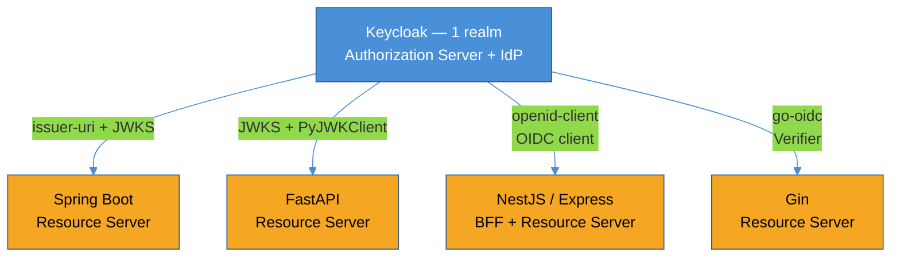
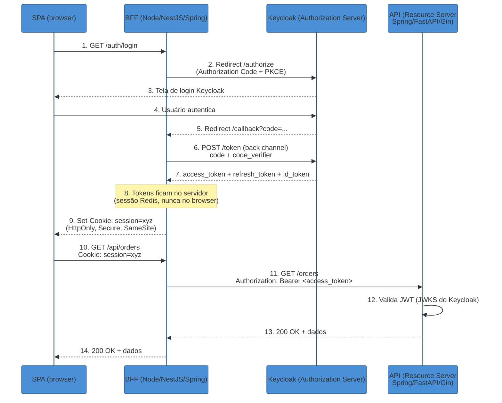
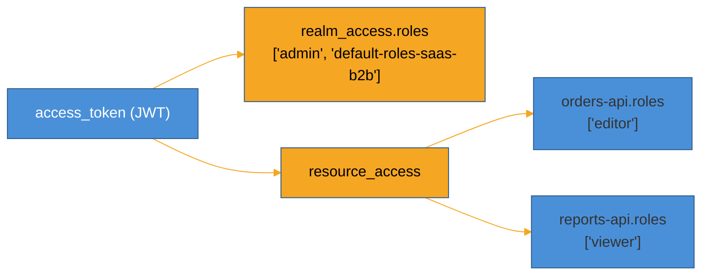

# Integrando os stacks com Keycloak

> [!abstract] TL;DR
> Nas quatro últimas seções do sub-galho 4 você viu cinco stacks diferentes — Spring, Django, FastAPI, Express, NestJS, Gin — cada um resolvendo autenticação e autorização à sua própria maneira, com seu próprio idioma de framework. Esta nota costura essas peças com **um único IdP**: o Keycloak não sabe, e não precisa saber, que existem cinco stacks diferentes consumindo os tokens que ele emite. Ele fala **um** protocolo (OAuth 2.1 + OpenID Connect), expõe **um** conjunto de endpoints padronizados (`/authorize`, `/token`, `/certs` — o JWKS), e cada stack faz o mesmo trabalho de fundo: buscar a chave pública do Keycloak, verificar a assinatura do token, conferir `iss` e `aud`, e traduzir os *claims* de roles do Keycloak (`realm_access`, `resource_access`) para o modelo de autorização nativo daquele framework. O fluxo de referência para 2026 combina três papéis que já vimos separadamente: a **SPA** nunca guarda token algum; um **BFF** (Backend-for-Frontend) troca o código OAuth pelo token e o mantém em sessão server-side, atrás de um cookie `HttpOnly`; e a **API** (o resource server — Spring, FastAPI, Gin, ou o próprio Nest/Express jogando os dois papéis) só *valida* o que chega, nunca emite nada. Depois do fluxo, uma tabela comparativa mostra, lado a lado, qual biblioteca cada stack usa, que papel ela assume e qual é o trecho de configuração que efetivamente faz a validação — issuer-uri no Spring, `PyJWKClient` no FastAPI, `openid-client` no Node, `go-oidc` no Gin. Fechamos nas armadilhas que se repetem em qualquer stack: `aud` ausente por padrão no Keycloak, *clock skew* mal calibrado, e cache de JWKS feito errado.

> [!question]- Perguntas que esta nota responde
> - Como o mesmo Keycloak serve N stacks diferentes sem cada um reinventar o protocolo?
> - O que é o padrão SPA + BFF + API, e por que ele virou a resposta de referência para 2026?
> - Qual é o trecho de configuração mínimo que cada stack usa para validar um token do Keycloak?
> - Como os claims `realm_access` e `resource_access` do Keycloak viram authorities/roles em cada framework?
> - Por que o token de uma SPA às vezes falha ao chegar na API com erro de `aud` inválido?
> - O que muda se eu tenho múltiplas APIs atrás do mesmo Keycloak — cada uma precisa de audience própria?

## Um IdP, N stacks — o problema que esta nota resolve

Cada nota do [[4 - Auth nos stacks/index|sub-galho 4]] tratou a integração com um Identity Provider externo como uma peça isolada — "a nota do Spring integra com Keycloak", "a nota do FastAPI valida via JWKS" — mas nunca colocou as cinco lado a lado. Isso é deliberado: cada stack merece ser entendido em seus próprios termos antes de compará-los. Mas na prática, uma organização raramente roda só um stack. Um SaaS B2B típico em 2026 tem times diferentes escolhendo frameworks diferentes por motivos legítimos — o time de dados prefere FastAPI, o time de plataforma roda Spring, um squad novo escolheu NestJS — e todos eles, se a decisão de identidade foi feita direito, apontam para o **mesmo** Keycloak.



O que esses quatro consumidores têm em comum não é biblioteca — é **contrato**. Todos falam contra o mesmo `/.well-known/openid-configuration`, todos buscam a mesma chave pública no `/certs` (o endpoint JWKS do Keycloak), e todos precisam decidir a mesma coisa: este token foi assinado por quem eu acho que assinou, ainda é válido, e é para mim que ele foi emitido? A resposta técnica difere por stack — issuer-uri declarativo no Spring, uma função explícita no FastAPI, um verifier construído à mão no Gin — mas a pergunta é idêntica em todos. É essa pergunta única, respondida de quatro formas, que esta nota organiza.

> [!info] Versão em aberto
> Keycloak **26.7.0** (lançado em julho de 2026) é o baseline desta nota — a mesma linha coberta em [[01 - Keycloak — realms, clients e flows|SG5-01]] e [[02 - Keycloak em produção|SG5-02]]. As bibliotecas de cada stack também têm data de validade: `spring-security-oauth2-resource-server` (Spring Security 6.x), `PyJWT` + `PyJWKClient` (Python 3.12+), `openid-client` v6 (Node ESM-only), `coreos/go-oidc` v3. Ecossistemas mudam — trate os nomes de pacote como fotografia de 2026, não lei eterna.

## O fluxo de referência: SPA + BFF + API

A pergunta que este fluxo resolve já apareceu, de lados diferentes, em [[2 - OAuth 2.1 e OpenID Connect/05 - Tokens em produção|SG2-05]] (onde guardar o token no browser) e nas notas de Express e NestJS do SG4 (BFF como resposta a XSS/CSRF em SPA). Aqui ela ganha forma completa, com o Keycloak explicitamente no papel de Authorization Server.

A premissa: uma SPA rodando inteiramente no navegador **não tem onde guardar um token com segurança**. `localStorage` é legível por qualquer script — inclusive um script malicioso injetado via XSS ou uma dependência de terceiros comprometida — e mesmo `sessionStorage` não resolve o problema de fundo, só limita o escopo temporal. A resposta que RFC 9700 recomenda explicitamente, e que virou o padrão de mercado em 2026, é **nunca deixar o token tocar o JavaScript da SPA**: um servidor fino — o **BFF** — fica entre a SPA e o Keycloak, conduz a dança OAuth inteira, e devolve à SPA só um cookie de sessão `HttpOnly` — inacessível a JavaScript, portanto imune a roubo via XSS[^bff-rfc9700].



Repare na divisão de papéis, porque é ela que organiza o resto da nota:

- **A SPA** nunca vê um token OAuth. Ela só sabe que tem um cookie de sessão, e delega toda chamada de API ao BFF, que faz o proxy.
- **O BFF** é o único componente que fala **os dois lados** do protocolo: ele é *client* OIDC do Keycloak (obtém tokens) e ao mesmo tempo mantém sua própria sessão web com a SPA (emite o cookie). Na prática, isso costuma ser Express, NestJS ou um Spring Cloud Gateway — qualquer stack com bom suporte a `openid-client`/OAuth2 client e sessão server-side.
- **A API** (o resource server de verdade — pode ser Spring, FastAPI, Gin, ou uma segunda instância Node) nunca fala com o Keycloak para autenticar ninguém interativamente; ela só recebe o `access_token` que o BFF já obteve, e faz o trabalho que é o cerne desta nota: **validar** esse token sem chamar o Keycloak a cada request, usando a chave pública cacheada do JWKS.

Esse desenho não é o único válido — uma API mobile nativa, por exemplo, pode dispensar o BFF porque o app já tem onde guardar token com alguma segurança (keychain do SO) — mas é o desenho de referência para 2026 sempre que existe uma SPA no meio, e é o pano de fundo que todo o resto da nota assume.

## Como cada stack se pluga: mapa e trecho-chave

Cada subseção abaixo assume que você já leu a nota correspondente do SG4 — aqui não se repete o que é Spring, FastAPI, NestJS/Express ou Gin; só se mostra a fatia que fala com o Keycloak.

### Spring — resource server declarativo

A nota [[4 - Auth nos stacks/01 - Java — Spring Security e Spring Authorization Server|SG4-01]] já cobriu o Spring como **Authorization Server** (emitindo tokens) e apontou para as 18 notas de Java/Segurança que cobrem o Spring como **client** (obtendo tokens de terceiros). O papel que falta amarrar aqui é o mais simples de configurar de todos: Spring como **resource server** validando um token que o Keycloak emitiu. Uma única propriedade resolve descoberta, JWKS e validação de issuer:

```yaml
spring:
  security:
    oauth2:
      resourceserver:
        jwt:
          issuer-uri: https://auth.exemplo.com/realms/saas-b2b
```

Com só isso, o Spring busca `{issuer-uri}/.well-known/openid-configuration`, descobre o endpoint JWKS (`/realms/saas-b2b/protocol/openid-connect/certs`), baixa as chaves públicas, cacheia, e valida `iss` e assinatura automaticamente em toda requisição autenticada[^spring-issuer-uri]. O que não vem de graça é a tradução dos claims do Keycloak para o modelo de autorização do Spring: por padrão, o Spring espera authorities num claim `scope`/`scp`, mas o Keycloak entrega roles em `realm_access.roles` (roles do realm inteiro) e `resource_access.<client_id>.roles` (roles específicas daquele client). Um `JwtAuthenticationConverter` customizado faz essa ponte:

```java
@Bean
public JwtAuthenticationConverter jwtAuthenticationConverter() {
    var converter = new JwtAuthenticationConverter();
    converter.setJwtGrantedAuthoritiesConverter(jwt -> {
        var realmRoles = (Map<String, Object>) jwt.getClaims().getOrDefault("realm_access", Map.of());
        var roles = (Collection<String>) realmRoles.getOrDefault("roles", List.of());
        return roles.stream()
            .map(role -> new SimpleGrantedAuthority("ROLE_" + role))
            .collect(Collectors.toList());
    });
    return converter;
}
```

Esse converter é plugado no `SecurityFilterChain` via `.oauth2ResourceServer(oauth2 -> oauth2.jwt(jwt -> jwt.jwtAuthenticationConverter(jwtAuthenticationConverter())))`[^spring-converter] — e a partir daí, `@PreAuthorize("hasRole('ADMIN')")` (SG4-01/Java-Segurança 07) enxerga roles do Keycloak como se fossem authorities nativas do Spring.

### FastAPI — validação explícita via JWKS

A nota [[4 - Auth nos stacks/03 - Python — FastAPI|SG4-03]] já mostrou o desenho inteiro: FastAPI não assume nada sobre auth, então "validar um token do Keycloak" é só mais uma dependência (`Depends`) que você escreve. A peça que faz a ponte com o Keycloak é o `PyJWKClient`, que resolve descoberta de chave e cache automaticamente — sem reimplementar rotação de JWKS na mão:

```python
import jwt
from jwt import PyJWKClient
from fastapi import Depends, HTTPException

ISSUER = "https://auth.exemplo.com/realms/saas-b2b"
jwks_client = PyJWKClient(f"{ISSUER}/protocol/openid-connect/certs")

def get_current_user(token: str = Depends(oauth2_scheme)) -> dict:
    try:
        signing_key = jwks_client.get_signing_key_from_jwt(token)
        payload = jwt.decode(
            token,
            signing_key.key,
            algorithms=["RS256"],
            audience="orders-api",
            issuer=ISSUER,
        )
    except jwt.PyJWTError:
        raise HTTPException(status_code=401, detail="Token inválido")

    realm_roles = payload.get("realm_access", {}).get("roles", [])
    client_roles = payload.get("resource_access", {}).get("orders-api", {}).get("roles", [])
    return {"sub": payload["sub"], "roles": realm_roles + client_roles}
```

`get_signing_key_from_jwt` lê o `kid` (key ID) do header do token, busca a chave correspondente no JWKS — cacheada internamente pelo `PyJWKClient`, sem round-trip ao Keycloak a cada request — e devolve a chave pública certa mesmo que o Keycloak tenha rotacionado chaves recentemente[^pyjwt-client]. Repare que `audience` e `issuer` são passados explicitamente ao `jwt.decode()` — sem isso, `PyJWT` não valida nenhum dos dois por padrão, o que abre a porta para o problema de `aud` que fechamos nas armadilhas.

### NestJS / Express — BFF e OIDC client

Este é o papel duplo descrito no fluxo de referência: [[4 - Auth nos stacks/04 - Node — Express|SG4-04]] e [[4 - Auth nos stacks/05 - Node — NestJS|SG4-05]] já cobriram `openid-client` como o cliente OIDC canônico do ecossistema Node, incluindo `Issuer.discover()` e a troca Authorization Code + PKCE. O ponto que fecha aqui é que Express/NestJS, jogando o papel de **BFF**, não usa `openid-client` para *validar* tokens de terceiros (isso é papel da API) — usa para **obter** tokens do Keycloak em nome da SPA, e depois gerenciar sua própria sessão:

```javascript
import * as client from 'openid-client'

const config = await client.discovery(
  new URL('https://auth.exemplo.com/realms/saas-b2b'),
  'bff-client-id',
  'bff-client-secret'
)

// callback do Keycloak — troca o code pelo token, guarda na sessão do BFF
app.get('/callback', async (req, res) => {
  const tokens = await client.authorizationCodeGrant(config, new URL(req.url, req.headers.origin), {
    pkceCodeVerifier: req.session.codeVerifier,
    expectedState: req.session.state,
  })
  req.session.accessToken = tokens.access_token   // fica no servidor, nunca vai pro browser
  req.session.refreshToken = tokens.refresh_token
  res.redirect('/')
})
```

> [!warning] `nest-keycloak-connect` está sem manutenção real
> O pacote histórico `keycloak-connect` (e sua casca `nest-keycloak-connect`) depende de uma biblioteca que o próprio time do Keycloak sinalizou como legado desde a versão 19 — a última versão publicada tem mais de dois anos, e a recomendação oficial do projeto Keycloak é migrar para `openid-client` diretamente[^keycloak-connect-deprecated]. Times novos em 2026 não devem começar um projeto Nest/Express novo com `nest-keycloak-connect` — o caminho recomendado é `openid-client` puro, orquestrado manualmente como acima, ou embrulhado num `AuthGuard` do Nest (o mesmo padrão de "strategy vira guard" já visto em SG4-05).

Quando Express/NestJS assume também o papel de resource server (recebendo tokens de um mobile app, por exemplo, sem BFF no meio), a validação segue o mesmo princípio do FastAPI e do Spring: buscar o JWKS, verificar assinatura, `iss`, `aud` — bibliotecas como `jwks-rsa` + `jsonwebtoken` (já visto em Node/Segurança 04) resolvem isso sem reinventar nada.

### Gin — verifier construído com go-oidc

[[4 - Auth nos stacks/06 - Go — Gin|SG4-06]] já separou as duas ferramentas: `golang-jwt/jwt` para validar localmente contra uma chave que você já tem, e `coreos/go-oidc` para quando o emissor é externo — exatamente o caso do Keycloak. A descoberta OIDC constrói o `Provider`, e o `Provider` constrói o `Verifier` — sem tocar em JWKS manualmente:

```go
ctx := context.Background()
provider, err := oidc.NewProvider(ctx, "https://auth.exemplo.com/realms/saas-b2b")
if err != nil {
    log.Fatal(err)
}

verifier := provider.Verifier(&oidc.Config{ClientID: "orders-api"})

func AuthMiddleware(verifier *oidc.IDTokenVerifier) gin.HandlerFunc {
    return func(c *gin.Context) {
        rawToken := extractBearerToken(c.Request)
        if rawToken == "" {
            c.AbortWithStatusJSON(401, gin.H{"error": "token ausente"})
            return
        }

        idToken, err := verifier.Verify(c.Request.Context(), rawToken)
        if err != nil {
            c.AbortWithStatusJSON(401, gin.H{"error": "token inválido"})
            return
        }

        var claims struct {
            RealmAccess struct{ Roles []string } `json:"realm_access"`
        }
        idToken.Claims(&claims)
        c.Set("roles", claims.RealmAccess.Roles)
        c.Next()
    }
}
```

`oidc.NewProvider` faz a descoberta (`/.well-known/openid-configuration`) uma única vez na inicialização, e o `Verifier` resultante já sabe buscar e cachear o JWKS internamente — cada chamada a `verifier.Verify()` reaproveita a chave em cache, sem round-trip ao Keycloak por requisição[^go-oidc-verifier]. O `ClientID` passado em `oidc.Config` é o que o `go-oidc` usa para validar o `aud` do token — se ele não bater com o valor configurado no `Config`, `Verify()` retorna erro, fechando sozinho a armadilha de audience que voltamos a discutir abaixo.

## Tabela comparativa

| Stack | Papel no fluxo | Biblioteca | Trecho-chave de validação |
|---|---|---|---|
| **Spring Boot** | Resource server | `spring-security-oauth2-resource-server` | `issuer-uri` (descoberta automática de JWKS) + `JwtAuthenticationConverter` para `realm_access` |
| **FastAPI** | Resource server | `PyJWT` + `PyJWKClient` | `jwt.decode(token, signing_key.key, audience=..., issuer=...)` |
| **Express / NestJS** | BFF (client OIDC) + resource server opcional | `openid-client` v6 | `client.authorizationCodeGrant()` para obter token; `jwks-rsa` para validar quando resource server |
| **Gin (Go)** | Resource server | `coreos/go-oidc` v3 | `provider.Verifier(&oidc.Config{ClientID}).Verify(ctx, token)` |
| **Django** ([[4 - Auth nos stacks/02 - Python — Django\|SG4-02]]) | Resource server (via DRF) | `PyJWT` + `PyJWKClient` (mesmo padrão do FastAPI) | Mesma lógica de `jwt.decode` embrulhada em uma `Authentication` class do DRF |

O padrão que atravessa a tabela inteira: **nenhum stack chama o Keycloak a cada request**. Todos descobrem o JWKS uma vez (ou periodicamente, via cache com TTL), guardam a chave pública em memória, e validam localmente — a mesma economia que já apareceu em [[2 - OAuth 2.1 e OpenID Connect/05 - Tokens em produção|SG2-05]] ao comparar tokens opacos (exigem introspecção a cada uso) com JWT (verificável localmente). É essa propriedade — validação offline, sem round-trip síncrono ao IdP — que torna JWT + JWKS a escolha natural para múltiplos resource servers atrás de um único Keycloak.

## Mapeamento de roles do Keycloak: realm_access vs resource_access

Todo trecho de código acima tropeça na mesma decisão de modelagem, então vale nomear o que ela significa. O Keycloak distingue dois níveis de role, e essa distinção é anterior a qualquer stack — ela nasce na modelagem de [[01 - Keycloak — realms, clients e flows|SG5-01]]:

- **`realm_access.roles`** — roles do **realm inteiro**, válidas para qualquer client registrado naquele realm. Um usuário com a role `admin` no realm é `admin` em todo lugar que aceitar aquele token, independentemente de qual API está validando.
- **`resource_access.<client_id>.roles`** — roles **por client** (Keycloak chama de "client roles"). Um usuário pode ser `viewer` no client `reports-api` e `editor` no client `orders-api`, ao mesmo tempo, no mesmo token — porque cada client tem seu próprio namespace de roles.



A decisão prática que cada stack precisa tomar — e que a tabela de trechos-chave acima já resolveu de facto — é **qual dos dois usar para autorização fina** dentro daquela API específica. A resposta que se repete: roles de `realm_access` funcionam bem para papéis amplos e transversais ("é admin da organização"), enquanto `resource_access.<client_id>` é o lugar certo para permissões que só fazem sentido dentro daquele serviço ("pode editar pedidos", só relevante para a `orders-api`). Misturar os dois sem critério — jogar tudo em `realm_access` porque é mais simples de ler no código — tende a produzir uma explosão de roles genéricas no realm inteiro, o mesmo *role explosion* já discutido em [[3 - Autorização e multi-tenancy/01 - RBAC, ABAC e ReBAC — os três modelos|SG3-01]].

## Armadilhas comuns

> [!warning] `aud` (audience) não bate — e o Keycloak não coloca isso por padrão
> **O que acontece:** uma API valida o `aud` do token (boa prática, como vimos acima) e recebe 401 para tokens que, do ponto de vista do usuário, "deveriam funcionar" — o login foi bem-sucedido, o token chegou, mas a validação falha. **Por quê:** por padrão, o Keycloak define o `aud` do access token como o `client_id` que **pediu** o token — não necessariamente o `client_id` da API que vai **consumi-lo**. Se a SPA (client `saas-web`) obtém o token e o repassa para a `orders-api`, o `aud` no token é `saas-web`, não `orders-api` — e uma API que valida `audience="orders-api"` rejeita, corretamente, um token que não foi emitido para ela. **Como evitar:** criar um **client scope** dedicado com um mapper do tipo `Audience`, configurado para incluir o `client_id` da API de destino (ou um valor customizado, se preferir um audience lógico como `orders-api` em vez do client técnico) — e atribuir esse scope ao client da SPA, para que toda emissão de token já inclua o `aud` correto[^audience-mapper]. Em ambientes com múltiplas APIs atrás do mesmo Keycloak, isso normalmente significa um client scope por "superfície lógica de API", não um scope genérico único.

> [!warning] Clock skew mal calibrado — tokens expiram cedo ou tarde demais
> **O que acontece:** tokens são rejeitados como "expirados" segundos antes do horário esperado, ou — pior — continuam válidos além do previsto porque a checagem de expiração foi desabilitada para "resolver" o primeiro problema. **Por quê:** relógios de servidores diferentes (o Keycloak e cada API) nunca estão perfeitamente sincronizados; um desvio de alguns segundos entre NTP configurado de forma diferente em cada máquina é normal, não um bug. Bibliotecas de validação de JWT permitem configurar uma margem de tolerância (*leeway*) na checagem de `exp`/`iat`/`nbf` — mas a tentação de "só desabilitar a checagem de expiração" para fazer o erro sumir remove uma das poucas garantias reais de segurança do token. **Como evitar:** configurar uma margem de tolerância pequena e explícita — algo entre 30 segundos e alguns minutos, nunca mais que isso — em vez de desabilitar a validação. A maioria das bibliotecas usadas nesta nota aceita esse parâmetro diretamente (`leeway` no PyJWT, configuração de clock skew no `go-oidc`); a regra de ouro é **margem limitada, não perdão ilimitado**.

> [!warning] Cache de JWKS ausente, ou cache eterno demais
> **O que acontece:** ou a API faz uma requisição HTTP ao Keycloak para buscar o JWKS a **cada** validação de token (latência e carga desnecessárias, e um ponto de falha síncrono a mais), ou cacheia a resposta indefinidamente e não percebe quando o Keycloak rotaciona suas chaves de assinatura — resultando em tokens legítimos rejeitados após uma rotação de chave em produção. **Como evitar:** todas as bibliotecas usadas nesta nota (`PyJWKClient`, o cache interno do Spring, `go-oidc`, `jwks-rsa`) já implementam cache com TTL razoável por padrão — a armadilha real é reimplementar a busca de JWKS na mão (por exemplo, um `fetch()` manual sem cache algum) em vez de usar a biblioteca madura. Quando o cache expira e um `kid` desconhecido aparece (sinal de rotação de chave), o comportamento correto é buscar o JWKS de novo **uma vez** antes de rejeitar — não assumir imediatamente que o token é inválido.

## Em entrevista

A pergunta "como você integraria múltiplos serviços em stacks diferentes com um IdP central?" testa exatamente a costura que esta nota fez: entender que o protocolo é o contrato comum, e que a implementação por stack é só tradução de um mesmo conceito para idiomas diferentes.

Uma resposta fraca lista bibliotecas: "no Spring uso issuer-uri, no FastAPI uso PyJWT..." — é factualmente correto, mas não demonstra entendimento do *porquê* de cada peça existir.

Uma resposta forte amarra o protocolo à decisão arquitetural: "o Keycloak expõe um endpoint OIDC discovery padrão e um JWKS; qualquer resource server, em qualquer linguagem, faz a mesma coisa de fundo — descobre a chave pública, cacheia, valida assinatura/issuer/audience localmente, sem round-trip síncrono ao IdP por request. A diferença entre stacks é só quanto trabalho a biblioteca abstrai: o Spring resolve isso com uma propriedade, o Gin exige eu construir o verifier explicitamente — mas o modelo de confiança é idêntico. E para uma SPA no meio, eu nunca deixo o token tocar o browser: um BFF fala com o Keycloak, guarda o token em sessão server-side, e entrega só um cookie HttpOnly — é a recomendação direta da RFC 9700."

> **Entrevistador:** "Você tem uma SPA em React consumindo três APIs diferentes — uma em Spring, uma em FastAPI, uma em Go. Como você desenharia a autenticação?"
>
> **Resposta fraca:** "Cada API valida o token com sua própria biblioteca JWT."
>
> **Resposta forte:** "Primeiro, a SPA não guarda token nenhum — ela fala só com um BFF, que conduz o Authorization Code + PKCE contra o Keycloak e mantém a sessão em cookie HttpOnly. O BFF repassa o access_token para cada API via header Authorization. Cada API — Spring, FastAPI, Go — valida esse token da mesma forma conceitual: busca o JWKS do Keycloak uma vez, cacheia, confere assinatura, issuer e audience localmente. A única coisa que varia entre elas é a biblioteca: issuer-uri no Spring, PyJWKClient no FastAPI, go-oidc no Go. Se cada API precisa de audience diferente, eu configuro client scopes com Audience mapper no Keycloak, um por API, e atribuo à SPA os scopes que ela precisa solicitar."

## How to explain it in English

> "Keycloak issues tokens, the stacks consume them — that's the whole story. Every resource server, regardless of language, does the same thing under the hood: discover the public key via the JWKS endpoint, cache it, verify signature/issuer/audience locally, no synchronous round-trip to the IdP per request. What differs is how much of that work each framework's library hides — Spring resolves it with a single issuer-uri property, Gin makes you build the verifier by hand — but the trust model is identical. For a browser-based SPA, tokens never touch client-side JavaScript: a BFF talks to Keycloak, keeps tokens server-side in session, and hands the SPA only an HttpOnly cookie — the pattern RFC 9700 explicitly recommends."

| PT | EN |
|----|----|
| Servidor de recursos | Resource server |
| Servidor de autorização | Authorization server |
| Backend-for-Frontend | Backend-for-Frontend (BFF) |
| Conjunto de chaves públicas | JSON Web Key Set (JWKS) |
| Descoberta OIDC | OIDC discovery |
| Reivindicação de audiência | Audience claim |
| Tolerância de relógio | Clock skew / leeway |
| Roles do realm | Realm roles |
| Roles do client | Client roles |
| Mapeador de audiência | Audience mapper |
| Cache de chaves | Key caching |
| Rotação de chave | Key rotation |

## O que vem a seguir

Esta nota fecha o sub-galho 5 — Keycloak — e com ele, os cinco sub-galhos da trilha Auth e Identidade estão completos: fundamentos de identidade, os protocolos (OAuth 2.1/OIDC), autorização e multi-tenancy, os stacks, e o IdP que os une. O que falta é costurar tudo isso numa única decisão de ponta a ponta — não mais "como validar um token", mas "que arquitetura de identidade eu desenho, do zero, para um produto real".

- **[[Desenhando a identidade de um SaaS B2B do zero]]** — o capstone do galho-pai: build vs buy (Keycloak vs Auth0/Cognito vs better-auth embutido), sessão vs token vs BFF, social + passkeys + senha, SSO/SAML/SCIM para clientes enterprise, RBAC+ReBAC por organização, MFA — a síntese de todos os cinco sub-galhos desta trilha.
- [[01 - Keycloak — realms, clients e flows]] — a arquitetura de realm/client/role que os mappers de audience e as roles desta nota pressupõem.
- [[02 - Keycloak em produção]] — HA, upgrade, Organizations — o Keycloak que essas integrações precisam encontrar rodando de verdade.

## Fontes

- **Spring Docs / Baeldung** — [*A Quick Guide to Using Keycloak with Spring Boot*](https://www.baeldung.com/spring-boot-keycloak) — configuração de `issuer-uri` e descoberta automática de JWKS; acessado em 2026-07-11.
- **DEV Community** — [*Spring Boot Security tokens Validation locally using Keycloak's public keys (JWKS)*](https://dev.to/devaaai/spring-boot-security-tokens-validation-locally-using-keycloaks-public-keys-jwks-34o5) — validação local via JWKS cacheado; acessado em 2026-07-11.
- **Medium (K. Selman Poyraz)** — [*Spring Boot & Keycloak: Role-Based Authorization with JWT*](https://medium.com/@kspoyraz7/spring-boot-keycloak-role-based-authorization-with-jwt-3bd29bdd9016) — `JwtAuthenticationConverter` para `realm_access`; acessado em 2026-07-11.
- **Skycloak** — [*FastAPI Authentication with Keycloak: Securing Python APIs*](https://skycloak.io/blog/keycloak-fastapi-python-api-authentication/) — `PyJWKClient` e validação de `realm_access`/`resource_access`; acessado em 2026-07-11.
- **Medium (Benjamin Buffet)** — [*Securing FastAPI with Keycloak (Part 2): A Tale of Roles*](https://medium.com/@buffetbenjamin/securing-fastapi-with-keycloak-part-2-a-tale-of-roles-660ab5963ee5) — extração de roles do Keycloak em FastAPI; acessado em 2026-07-11.
- **Skycloak** — [*Backend-for-Frontend (BFF) Pattern with Keycloak*](https://skycloak.io/blog/keycloak-backend-for-frontend-bff-pattern/) — fluxo completo SPA+BFF+Keycloak, tokens nunca no browser; acessado em 2026-07-11.
- **FusionAuth** — [*A Guide to Backend-for-Frontend (BFF) Auth*](https://fusionauth.io/blog/backend-for-frontend) — justificativa RFC 9700 para o padrão BFF; acessado em 2026-07-11.
- **Baeldung** — [*OAuth2 Backend for Frontend With Spring Cloud Gateway*](https://www.baeldung.com/spring-cloud-gateway-bff-oauth2) — variante de BFF com gateway Spring; acessado em 2026-07-11.
- **pkg.go.dev** — [*oidc package — github.com/coreos/go-oidc/v3/oidc*](https://pkg.go.dev/github.com/coreos/go-oidc/v3/oidc) — API de `NewProvider`, `Verifier`, `IDTokenVerifier`; acessado em 2026-07-11.
- **GitHub (keycloak/keycloak discussions)** — [*Keycloak-nodejs-connect deprecation is there any other alternatives?*](https://github.com/keycloak/keycloak/discussions/23551) — status de deprecação do adapter Node.js e recomendação de `openid-client`; acessado em 2026-07-11.
- **DEV Community** — [*How To Configure Audience In Keycloak*](https://dev.to/metacosmos/how-to-configure-audience-in-keycloak-kp4) — configuração de Audience mapper por client scope; acessado em 2026-07-11.
- **Skycloak** — [*Keycloak Client Scopes vs Roles: When to Use Each*](https://skycloak.io/blog/keycloak-client-scopes-vs-roles-explained/) — client scopes por superfície de API e mappers de audience; acessado em 2026-07-11.
- **DevToolKit.cloud** — [*JWT Security Best Practices for 2026*](https://devtoolkit.cloud/blog/jwt-security-best-practices-2026) — margem de clock skew recomendada e cache de JWKS; acessado em 2026-07-11.
- **Keycloak.org** — [*Keycloak 26.7.0 released*](https://www.keycloak.org/2026/07/keycloak-2670-released) — SCIM preview, Organizations, passkeys; baseline de versão desta nota; acessado em 2026-07-11.

[^bff-rfc9700]: FusionAuth, *A Guide to Backend-for-Frontend (BFF) Auth* — RFC 9700 recomenda manter tokens fora do browser. [^spring-issuer-uri]: Baeldung, *A Quick Guide to Using Keycloak with Spring Boot* — `issuer-uri` e descoberta automática de JWKS. [^spring-converter]: Medium (K. Selman Poyraz), *Spring Boot & Keycloak: Role-Based Authorization with JWT* — `JwtAuthenticationConverter` customizado para `realm_access`. [^pyjwt-client]: Skycloak, *FastAPI Authentication with Keycloak* — `PyJWKClient` e cache de chave por `kid`. [^keycloak-connect-deprecated]: GitHub, *Keycloak-nodejs-connect deprecation is there any other alternatives?* — recomendação oficial de migrar para `openid-client`. [^go-oidc-verifier]: pkg.go.dev, *oidc package* — `NewProvider` e `Verifier` com cache interno de JWKS. [^audience-mapper]: DEV Community, *How To Configure Audience In Keycloak* — mapper de audiência por client scope.
