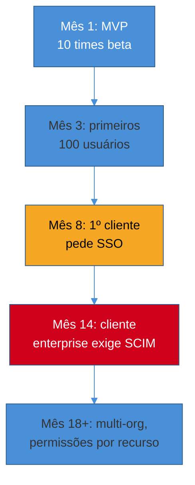
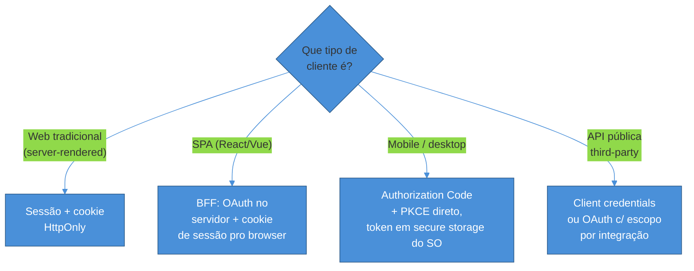
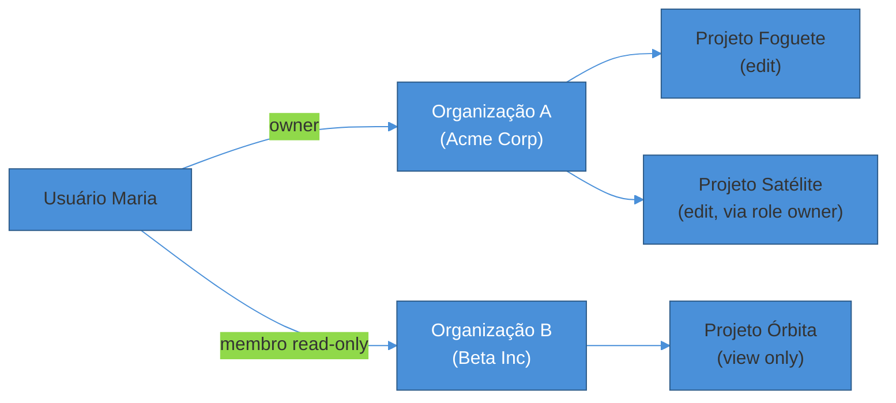
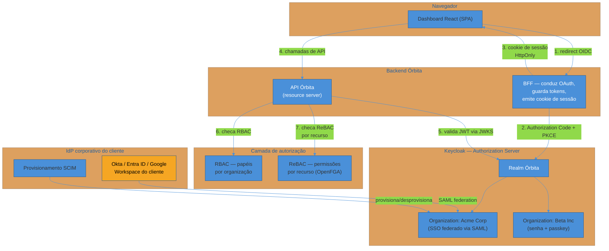

# Capstone — Desenhando a identidade de um SaaS B2B do zero

> [!abstract] TL;DR
> Imagine um SaaS B2B fictício — vamos chamá-lo de **Órbita**, uma ferramenta de gestão de projetos que vende para times de engenharia. Este capítulo segue a equipe do Órbita tomando, na ordem em que a vida real as impõe, as oito decisões de identidade que toda startup B2B enfrenta: **build vs buy** do Authorization Server (Keycloak self-hosted vs Auth0/Cognito/WorkOS vs auth embutido); **sessão vs token vs BFF** conforme o cliente (web tradicional, SPA, mobile); a estratégia de **rollout gradual de fatores** (senha → social → passkeys); o protocolo (**OAuth 2.1 + OIDC**, Authorization Code + PKCE como baseline não-negociável); a **"SSO tax"** — o dia em que o primeiro cliente enterprise pede SAML e SCIM; o modelo de **autorização** (RBAC coarse + ReBAC fine, por organização); a **implementação** no stack que a equipe já domina, com o Keycloak como Authorization Server; e o fechamento com **MFA e recuperação de conta**. Cada decisão linka para a nota da trilha que a aprofunda — este texto costura, não repete. É um veículo de ensino: o Órbita não existe, mas cada trade-off técnico discutido aqui é real e tem fonte.

> [!question]- Perguntas que este capítulo responde
> - Em que ordem essas decisões de identidade aparecem de verdade, e o que acontece se você inverte a ordem?
> - Quando compensa pagar (ou rodar) um IdP pronto em vez de escrever autenticação própria — e quando o embutido no framework já basta?
> - Como decidir entre sessão, token puro e BFF sem cair em dogma?
> - Por que "SSO tax" existe e como não deixar isso travar o primeiro contrato de seis dígitos?
> - Como RBAC e ReBAC coexistem dentro de uma organização, sem virar dois sistemas de permissão concorrentes?

## O SaaS fictício: Órbita

> [!info] Enquadramento
> **Órbita** é um produto hipotético usado só como fio condutor didático. Nenhuma decisão aqui reflete um cliente, empregador ou projeto real do autor — é um SaaS de gestão de projetos B2B, do tipo que qualquer leitor já usou (pense em algo entre Linear e Jira), escolhido porque o ciclo de vida da sua identidade toca praticamente todo o roster desta trilha.

Três pessoas fundam o Órbita. Mês 1: MVP para os primeiros dez times beta, todos startups pequenas pagando com cartão de crédito. Mês 8: o primeiro cliente de porte médio assina, mas o time de TI dele manda um questionário de segurança perguntando se o produto suporta SSO. Mês 14: um cliente enterprise de 2.000 funcionários assina um contrato de seis dígitos — com uma cláusula que exige SCIM. Esse arco — de "só precisamos logar alguém" até "identidade como requisito contratual" — é a espinha deste capítulo, e é também, quase sempre, a ordem real em que qualquer B2B SaaS enfrenta essas decisões. Comece pela primeira.

## Decisão 1 — Build vs buy do Authorization Server

A primeira decisão que a equipe do Órbita enfrenta, antes de escrever uma linha de código de login, é onde a identidade vai morar: **escrever autenticação própria**, **embutir uma biblioteca de auth no próprio backend** (better-auth, Passport, django-allauth), **contratar um IdP gerenciado** (Auth0, Cognito, WorkOS) ou **rodar um IdP self-hosted** (Keycloak, Zitadel, Authentik).

O erro mais caro nesse ponto é subestimar o que "escrever autenticação" realmente cobre. Não é só `POST /login` com usuário e senha — é hashing correto, recuperação de conta, MFA, rate limiting contra credential stuffing, e eventualmente OAuth/OIDC completo quando o primeiro parceiro pedir "login com Google" ou o primeiro cliente enterprise pedir SSO. [[1 - Fundamentos de identidade/index|O sub-galho de fundamentos]] cobre esse chão inteiro — e a lição que ele deixa é que quase nenhuma dessas peças vale a pena reinventar.

A pesquisa de mercado em 2026 desenha quatro faixas de decisão bem definidas[^decision-framework]:

| Cenário | Escolha recomendada | Por quê |
|---|---|---|
| Time pequeno, <300k usuários, ops enxuta | **Auth0 / Cognito** (gerenciado) | Sem infra própria para manter; MAU pricing ainda é barato nessa escala |
| B2B focado só em SSO/SCIM enterprise | **WorkOS** | Cobra por *conexão* enterprise, não por usuário total — modelo de custo alinhado ao caso de uso |
| Single-tenant, ops já madura | **Keycloak self-hosted** | Sem custo por MAU; cobre OIDC+SAML+SCIM+autorização fina, tudo que Auth0 cobra premium por cima |
| Multi-tenant nativo desde o dia 1 | **Zitadel** | Nasceu cloud-native, Go, multi-tenancy como conceito de primeira classe |

O ponto de virada financeiro é concreto: em ~10.000 MAU, o custo de engenharia de rodar Keycloak self-hosted já se paga em semanas frente ao MAU pricing de um IdP gerenciado; em 100.000 MAU, a diferença passa de 100x[^keycloak-economics]. Só que essa conta ignora o outro lado do trade-off — rodar Keycloak em produção é assumir HA, upgrades, backups de banco, hardening — o assunto de [[5 - Keycloak/02 - Keycloak em produção|Keycloak em produção]].

> [!question]- E o `better-auth` embutido no próprio backend Node?
> Faz sentido para o Órbita se o time já está 100% em TypeScript/Node e quer manter o auth "dentro de casa", sem operar um serviço externo. `better-auth` cobre 33 recursos de IAM contra 30 do Keycloak em cobertura declarada[^better-auth-features], mas é um projeto de dois anos contra os treze de maturidade do Keycloak — a diferença aparece em edge cases de federação, SAML e SCIM, que o Keycloak resolve nativamente e o `better-auth` ainda está construindo. Para o Órbita em fase MVP, embutido é aceitável; para o Órbita que já sabe que vai vender enterprise, a aposta muda.

A decisão do Órbita: começar com **auth embutido simples** (sessões + login social) no MVP — não vale a pena operar Keycloak para dez times beta — e migrar para **Keycloak self-hosted** assim que o primeiro cliente médio aparecer no radar, antecipando a exigência de SSO que virá. Essa progressão é o padrão real do mercado: build vs buy não é uma escolha única e definitiva, é uma escolha que se revisita a cada ordem de grandeza de cliente.

> [!tip] Regra prática
> Se o roadmap de vendas já prevê clientes enterprise nos próximos 12 meses, adiantar a migração para um IdP com SAML/SCIM nativos (Keycloak, WorkOS, Zitadel) custa muito menos do que fazer essa migração sob pressão de um contrato já assinado com prazo de SSO.

## Decisão 2 — Sessão, token puro, ou BFF?

Resolvido *onde* a identidade mora, a próxima pergunta é *como* o cliente do Órbita carrega prova de autenticação entre requisições — e a resposta depende do tipo de cliente, não de uma preferência arquitetural abstrata.

O Órbita tem três superfícies: o **app web** (dashboard principal, renderizado por um backend tradicional ou por uma SPA React), a **API pública** (para integrações de terceiros) e, eventualmente, um **app mobile**. Cada uma pede um mecanismo diferente, e [[1 - Fundamentos de identidade/02 - Sessões e cookies — auth stateful|a nota sobre sessões]] já estabelece o ponto central: para a maioria das aplicações web tradicionais, **sessão ainda é a resposta certa** — simples, revogável instantaneamente, sem as armadilhas de guardar um JWT no browser.

O problema aparece quando o dashboard do Órbita é uma SPA. Guardar o `access_token` em `localStorage` é acessível a qualquer script rodando na página — incluindo uma dependência de terceiros comprometida. A resposta que o mercado consolidou em 2026 é o **padrão BFF (Backend for Frontend)**: um backend fino, dedicado ao frontend, que conduz o fluxo OAuth inteiro, guarda os tokens no lado do servidor, e devolve ao browser só um cookie de sessão `HttpOnly`/`Secure`/`SameSite`[^bff-2026]. O IETF recomenda esse desenho explicitamente como a forma preferida de proteger SPAs modernas — o token nunca toca o JavaScript da página, então XSS não consegue roubá-lo diretamente[^bff-ietf]. [[2 - OAuth 2.1 e OpenID Connect/05 - Tokens em produção|A nota sobre tokens em produção]] detalha esse padrão e onde ele se encaixa ao lado de refresh rotation.

O Órbita decide: dashboard web = sessão server-side clássica no MVP (mais simples de operar com o time pequeno); quando a SPA React chegar (planejada para o mês 6, por causa de uma feature de colaboração em tempo real), o dashboard migra para o padrão BFF, reaproveitando o mesmo Authorization Server; o app mobile, quando existir, usa Authorization Code + PKCE nativo com o token guardado no keychain/keystore do sistema operacional — nunca em `localStorage` equivalente.

## Decisão 3 — Fatores de autenticação: senha, social e o rollout de passkeys

Com o transporte decidido, a pergunta seguinte é *como o usuário prova quem é*. [[1 - Fundamentos de identidade/04 - Senhas e MFA — o legado que não morre|Senhas ainda são o piso]] — o Órbita não pode simplesmente recusar senha, porque parte da base de usuários vem de convites corporativos que esperam o fluxo clássico — mas 2026 é reconhecidamente o ano em que passkeys deixam de ser experimento e viram **opção padrão para produtos novos**[^passkeys-2026].

A estratégia de rollout que a pesquisa recomenda não é big-bang. É faseada por risco: contas de alto valor primeiro (admins de organização, contas com acesso a billing), depois o resto da base, ao longo de trimestres — não da noite para o dia[^passkeys-phased]. O motivo prático: mesmo com 87% das empresas pilotando ou implantando FIDO2 em 2026, uma fração residual de 5-15% dos usuários continua em senha+MFA por razões operacionais (dispositivo incompatível, política de TI do cliente), e isso é aceitável — não é uma falha do rollout, é o formato esperado da curva[^passkeys-residual].

O caso de negócio é concreto o suficiente para convencer qualquer stakeholder cético: tickets de reset de senha historicamente somam 20-30% do volume de suporte em B2B SaaS; empresas que rolaram passkeys para a base principal relatam queda para dígito único em seis meses, e a um custo médio de ~$70 por reset, o ROI fecha em 12-18 meses[^passkeys-roi]. [[1 - Fundamentos de identidade/05 - Passkeys e WebAuthn — o presente sem senha|A nota de passkeys]] cobre a mecânica FIDO2/WebAuthn completa; aqui o que importa é a sequência: **senha (piso obrigatório) → login social opcional (reduz fricção de onboarding) → passkeys como primeira opção visível, promovida no topo da tela de login, com senha ainda disponível como fallback**.

> [!warning] Erro comum: esconder passkeys atrás de "configurações avançadas"
> Colocar passkeys como opção secundária, escondida em uma tela de segurança que o usuário raramente visita, reduz a adoção para quase zero. O exemplo citado na pesquisa: quando um produto tornou passkeys a **primeira e mais visível** opção na tela de login (não uma opção B), a taxa de sucesso de login subiu 25% e o tempo de login caiu para um quarto do que era com senha + 2FA[^hubspot-passkeys]. A posição na UI não é detalhe cosmético — é a diferença entre adoção real e um recurso que ninguém usa.

## Decisão 4 — O protocolo: OAuth 2.1 + OIDC como baseline

Assim que o Órbita precisa que outro sistema fale com sua API em nome de um usuário — o primeiro parceiro de integração pedindo "login com sua conta Órbita", ou o próprio dashboard React trocando tokens com o backend — a equipe entra em território de protocolo, não mais de mecanismo de auth isolado.

A decisão aqui, em 2026, deixou de ser uma escolha aberta: **OAuth 2.1** (consolidando RFC 6749 + PKCE + a Security BCP da RFC 9700) é o texto que qualquer implementação nova deveria seguir, com **Authorization Code + PKCE obrigatório para todo cliente**, o implicit flow removido e o Resource Owner Password Credentials grant extinto[[2 - OAuth 2.1 e OpenID Connect/02 - Authorization Code + PKCE — o fluxo canônico|— o fluxo canônico está detalhado aqui]]. A camada de identidade sobre esse fluxo de delegação pura é o **OpenID Connect**, que adiciona o ID token — a peça que efetivamente resolve "quem é esse usuário", separada de "o que ele pode acessar"[[2 - OAuth 2.1 e OpenID Connect/03 - OpenID Connect — identidade sobre OAuth|aprofundado aqui]].

O Órbita não escreve esse protocolo do zero — é exatamente o que o Authorization Server (Keycloak, no caso escolhido na Decisão 1) já implementa. A equipe consome o fluxo, não o reimplementa: o dashboard/BFF do Órbita age como *client* OIDC, o Keycloak é o *authorization server*, e a API do Órbita valida tokens como *resource server*. Esse desenho — com sender-constrained tokens e token exchange para chamadas serviço-a-serviço — é o assunto de [[2 - OAuth 2.1 e OpenID Connect/04 - Grants de máquina e fluxos especiais|grants de máquina]] quando a arquitetura do Órbita crescer para múltiplos microserviços internos.

## Decisão 5 — A "SSO tax": quando SAML e SCIM viram requisito de contrato

Mês 8 do Órbita: o primeiro cliente de porte médio manda um questionário de segurança. A pergunta que decide o negócio é literal: *"o produto suporta SSO baseado em SAML e provisionamento automatizado de usuários?"* Se a resposta é não, o negócio trava — para a maioria dos SaaS mirando mid-market e enterprise, o primeiro contrato na faixa de $30-50k já chega com essa exigência[^sso-tax-threshold].

Vale separar as duas metades do problema, porque elas têm pesos diferentes:

- **SAML/SSO** — o protocolo que redireciona o usuário para o IdP da empresa cliente e de volta. É a metade "fácil": qualquer stack moderno de Authorization Server (incluindo Keycloak) já fala SAML nativamente. [[2 - OAuth 2.1 e OpenID Connect/06 - SSO corporativo — SAML, federação e SCIM|Esta nota]] cobre assertions, IdP-initiated vs SP-initiated, e por que SAML não morreu apesar do OIDC ser tecnicamente superior — a resposta é adoção: o IdP corporativo do cliente já fala SAML, e forçar migração para OIDC não é opção de venda.
- **SCIM** — o provisionamento automatizado. É a metade que realmente decide a auditoria de segurança: quando um funcionário do cliente é desligado, o IdP dele precisa avisar o Órbita em minutos, não em dias, para suspender a conta e matar as sessões. Abaixo de ~100 clientes enterprise, SCIM é "bom ter"; acima de ~1.000 assentos por cliente, é exigência dura de contrato[^scim-threshold].

A "SSO tax" propriamente dita é uma prática comercial, não técnica: travar SSO atrás do tier mais caro do plano, às vezes com markup de 3x a 10x sobre o tier anterior[^sso-tax-practice]. A pesquisa de 2026 aponta um meio-termo mais defensável comercialmente: embutir um número razoável de conexões SSO no tier intermediário e cobrar por *escala* (número de conexões, número de organizações), não pela feature em si[^sso-tax-fix] — o mesmo modelo de precificação que o WorkOS adota, citado na Decisão 1.

O Órbita, ao integrar Keycloak como Authorization Server desde a Decisão 1, já tinha essa capacidade disponível — federar um IdP corporativo do cliente via SAML dentro do próprio realm/organização do Keycloak é configuração, não desenvolvimento novo. Essa é a recompensa concreta de ter antecipado a escolha de IdP: quando o questionário de segurança chega, a resposta já é sim.

## Decisão 6 — Autorização: RBAC coarse + ReBAC fine, por organização

Autenticado não é autorizado. Resolvido *quem* é o usuário, falta decidir *o que* ele pode fazer dentro do Órbita — e aqui a arquitetura de multi-tenancy entra em cena, porque cada cliente do Órbita é uma **organização** com seus próprios usuários, papéis e recursos.

[[3 - Autorização e multi-tenancy/01 - RBAC, ABAC e ReBAC — os três modelos|O modelo consolidado em 2026]] para B2B SaaS é híbrido: **RBAC para políticas grosseiras** (papéis como owner, admin, membro dentro de uma organização) e **ReBAC para permissões no nível do recurso** (quem pode editar *este* projeto específico, quem pode ver *este* board específico)[^rbac-rebac-hybrid]. O ponto chave que evita confusão: RBAC no Órbita opera *dentro* dos limites de cada organização, não globalmente — o mesmo usuário pode ser *owner* na organização A e *membro* somente-leitura na organização B, sem conflito, porque o papel é avaliado no contexto de qual organização o usuário está operando no momento[^rbac-context].

Quando a base de clientes cresce e aparecem casos como "compartilhar este documento específico com um usuário externo à organização, sem dar acesso a mais nada", RBAC sozinho não modela isso bem — é o momento de olhar para **fine-grained authorization** no estilo Zanzibar (o paper do Google que originou o padrão): tuplas objeto-relação-usuário, avaliadas via um serviço dedicado como OpenFGA, SpiceDB ou Ory Keto[[3 - Autorização e multi-tenancy/02 - Fine-grained authorization — Zanzibar e policy-as-code|aprofundado aqui]]. O corte de organização como fronteira de identidade — convites, membership, isolamento — é o assunto de [[3 - Autorização e multi-tenancy/03 - Multi-tenancy e organizações|multi-tenancy e organizações]], e como esses claims chegam ao token e são checados no gateway ou no serviço é [[3 - Autorização e multi-tenancy/04 - Autorização de API na prática|autorização de API na prática]].

O Órbita, no mês 14, ao assinar o cliente enterprise de 2.000 funcionários, já precisa desse modelo: RBAC decide quem é admin da organização (pode convidar, remover, configurar SSO), ReBAC decide quem pode editar qual projeto específico dentro dela.

## Decisão 7 — Implementação: o stack escolhido + Keycloak como Authorization Server

Com protocolo, autorização e IdP decididos, falta a parte que a equipe do Órbita realmente escreve: código. Esta trilha trata implementação como exceção deliberada — a maioria das notas é conceito neutro, mas o [[4 - Auth nos stacks/index|sub-galho 4]] cobre implementação guiada em seis stacks (Spring Boot, Django, FastAPI, Express, NestJS, Gin), e o [[5 - Keycloak/index|sub-galho 5]] fecha o loop mostrando como cada stack integra com o Keycloak como Authorization Server.

Supondo que o Órbita seja escrito em Node/NestJS no backend com um frontend React (a combinação mais comum entre SaaS B2B novos em 2026): o backend age como *resource server* validando tokens emitidos pelo Keycloak via JWKS, e o dashboard consome o Keycloak como *client* OIDC através do padrão BFF decidido acima — [[4 - Auth nos stacks/05 - Node — NestJS|a nota de NestJS]] cobre guards, `@nestjs/passport` e o decorator `@Roles` que aplica o RBAC decidido na Decisão 6. Se a equipe fosse Python/FastAPI, a integração seria via `fastapi.security` validando o JWT do Keycloak com Authlib[[4 - Auth nos stacks/03 - Python — FastAPI|detalhado aqui]]; se fosse Java/Spring, o Spring Authorization Server ou o Spring Security como resource server assumiria esse papel[[4 - Auth nos stacks/01 - Java — Spring Security e Spring Authorization Server|ponte para as 18 notas de Spring Security]].

O fluxo de referência completo — SPA + BFF + API com Keycloak como Authorization Server, cobrindo os quatro stacks lado a lado — é exatamente o assunto de [[5 - Keycloak/03 - Integrando os stacks com Keycloak|integrando os stacks com Keycloak]], a nota que mais se aproxima deste capstone em espírito: ela costura SG4 com SG5 da mesma forma que este capítulo costura a trilha inteira.

## Decisão 8 — MFA e recuperação de conta: o elo final

Falta fechar um ponto que toda arquitetura de identidade adia até doer: o que acontece quando o usuário perde acesso ao segundo fator, ou ao dispositivo com a passkey sincronizada? [[1 - Fundamentos de identidade/04 - Senhas e MFA — o legado que não morre|A recuperação de conta é, na prática, o elo mais fraco do sistema inteiro]] — não importa quão forte seja o desenho de PKCE, ReBAC e SCIM se a recuperação de conta permitir que qualquer um se passe por qualquer usuário respondendo "qual o nome do seu primeiro animal de estimação".

O Órbita precisa de uma política de recuperação que não reintroduza os problemas que MFA e passkeys resolveram: recovery codes de uso único gerados no momento do cadastro de MFA (não perguntas de segurança), um caminho de suporte humano com verificação fora de banda para o caso extremo (perda simultânea de dispositivo e recovery codes), e — quando a organização já tem SSO configurado — delegar autenticação inteiramente ao IdP corporativo do cliente, que já resolve MFA e recovery no lado dele. Esse último ponto é, aliás, um benefício silencioso de SSO que raramente aparece na conversa comercial: para organizações com SSO, o Órbita deixa de ser responsável pela segurança de credenciais dos usuários dela — essa responsabilidade migra para o IdP do próprio cliente.

## Arquitetura final

Depois das oito decisões, a arquitetura de identidade do Órbita fica assim:

## Tabela de decisões

| # | Decisão | Escolha do Órbita | Alternativa considerada | Nota que aprofunda |
|---|---------|--------------------|--------------------------|---------------------|
| 1 | Build vs buy do IdP | Keycloak self-hosted (a partir do 1º cliente médio) | Auth0/Cognito gerenciado; better-auth embutido | [[5 - Keycloak/01 - Keycloak — realms, clients e flows]] |
| 2 | Sessão vs token vs BFF | Sessão no MVP → BFF quando a SPA chega | Token puro no browser (rejeitado por XSS) | [[1 - Fundamentos de identidade/02 - Sessões e cookies — auth stateful]], [[2 - OAuth 2.1 e OpenID Connect/05 - Tokens em produção]] |
| 3 | Fatores de autenticação | Senha (piso) → social → passkeys em destaque | Passkey-only (rejeitado; exclui parte da base) | [[1 - Fundamentos de identidade/04 - Senhas e MFA — o legado que não morre]], [[1 - Fundamentos de identidade/05 - Passkeys e WebAuthn — o presente sem senha]] |
| 4 | Protocolo | OAuth 2.1 + OIDC, Authorization Code + PKCE | Implicit flow / ROPC (removidos no 2.1) | [[2 - OAuth 2.1 e OpenID Connect/02 - Authorization Code + PKCE — o fluxo canônico]], [[2 - OAuth 2.1 e OpenID Connect/03 - OpenID Connect — identidade sobre OAuth]] |
| 5 | Enterprise readiness | SAML federado + SCIM via Organizations do Keycloak | Reimplementar SSO próprio (rejeitado; caro e arriscado) | [[2 - OAuth 2.1 e OpenID Connect/06 - SSO corporativo — SAML, federação e SCIM]] |
| 6 | Autorização | RBAC coarse por organização + ReBAC fine por recurso | RBAC puro (rejeitado; não modela compartilhamento granular) | [[3 - Autorização e multi-tenancy/01 - RBAC, ABAC e ReBAC — os três modelos]], [[3 - Autorização e multi-tenancy/02 - Fine-grained authorization — Zanzibar e policy-as-code]], [[3 - Autorização e multi-tenancy/03 - Multi-tenancy e organizações]], [[3 - Autorização e multi-tenancy/04 - Autorização de API na prática]] |
| 7 | Implementação | NestJS (backend) + Keycloak como AS | Stack alternativo dependendo da equipe | [[4 - Auth nos stacks/index]], [[5 - Keycloak/03 - Integrando os stacks com Keycloak]] |
| 8 | Recuperação de conta | Recovery codes + suporte humano + delegação ao IdP do cliente com SSO | Perguntas de segurança (rejeitado; elo fraco clássico) | [[1 - Fundamentos de identidade/04 - Senhas e MFA — o legado que não morre]] |

## Em entrevista

Este capítulo é, na prática, o roteiro de uma pergunta comum em entrevistas de arquitetura sênior: *"Como você desenharia a identidade de um SaaS B2B do zero?"* O sinal que se busca não é uma lista de tecnologias — é a **ordem das decisões** e o **porquê de cada trade-off**.

Uma resposta fraca lista tecnologias soltas: "eu usaria OAuth, JWT, Keycloak e RBAC." Uma resposta forte narra a sequência de pressões reais: "eu começaria simples — sessão e senha, talvez login social — porque no MVP a prioridade é reduzir fricção de cadastro, não blindar contra ameaças que ainda não existem para dez usuários beta. Eu adiantaria a escolha de um Authorization Server como Keycloak assim que o roadmap de vendas mostrasse clientes maiores no horizonte, porque migrar sob pressão de um contrato já assinado custa muito mais caro que migrar cedo. E eu trataria RBAC e ReBAC como complementares, não concorrentes: papel decide o que uma pessoa pode fazer dentro de uma organização, relação decide o que ela pode fazer com um recurso específico."

> **Entrevistador:** "Por que não simplesmente usar RBAC para tudo? Parece mais simples que ter dois sistemas."
>
> **Resposta fraca:** "Porque ReBAC é mais moderno e granular."
>
> **Resposta forte:** "Porque RBAC modela bem 'que tipo de usuário você é' — admin, membro, owner — mas fica ruim para modelar 'você pode acessar *este* recurso específico', principalmente quando o acesso atravessa fronteiras de organização, como compartilhar um documento com alguém de fora do time. Forçar isso em RBAC gera explosão de papéis — um papel para cada combinação possível de recurso compartilhado, que não escala. ReBAC resolve isso nativamente, como um grafo de relações, sem multiplicar papéis. Os dois não competem: RBAC decide a política grossa, ReBAC decide o caso fino, e a maioria dos SaaS B2B maduros usa exatamente essa combinação."

## How to explain in English

> "Designing identity for a B2B SaaS from scratch follows a predictable sequence, not a checklist. You start by deciding whether to build, embed, or buy your Authorization Server — and that decision gets revisited as the customer base grows, because the SSO and SCIM requirements of an enterprise contract change the math entirely. You choose session, token, or BFF based on the client type, not dogma — a BFF exists specifically to keep tokens out of the browser for SPAs. You roll out passkeys gradually alongside passwords, by risk tier, because a big-bang cutover excludes real users. And you split authorization into RBAC for coarse, per-organization policy and ReBAC for fine-grained, resource-level sharing — because forcing resource-level permissions into a role system causes role explosion that doesn't scale."

| PT | EN |
|----|----|
| Build vs buy | Build vs buy |
| Provedor de identidade | Identity provider (IdP) |
| Servidor de autorização | Authorization server |
| Padrão BFF | Backend for Frontend (BFF) pattern |
| Rollout gradual | Phased rollout |
| Fadiga de senha | Password fatigue |
| Imposto do SSO | SSO tax |
| Provisionamento automatizado | Automated provisioning |
| Desprovisionamento | Deprovisioning |
| Explosão de papéis | Role explosion |
| Autorização refinada | Fine-grained authorization |
| Isolamento de locatário | Tenant isolation |
| Recuperação de conta | Account recovery |

## Como estudar esta trilha

Se você está começando do zero, o roteiro recomendado segue a mesma ordem deste capítulo, mas com profundidade completa em cada nota:

1. **Comece pelos fundamentos** ([[1 - Fundamentos de identidade/index]], 5 notas) — vocabulário (AuthN vs AuthZ), sessões, JWT, senhas/MFA, passkeys. Sem esse chão, o resto da trilha usa termos que você ainda não fixou.
2. **Siga para os protocolos** ([[2 - OAuth 2.1 e OpenID Connect/index]], 6 notas) — delegação, Authorization Code + PKCE, OIDC, grants de máquina, tokens em produção, SSO corporativo. Esta é a espinha técnica mais densa da trilha.
3. **Feche o modelo mental com autorização** ([[3 - Autorização e multi-tenancy/index]], 4 notas) — RBAC/ABAC/ReBAC, Zanzibar, multi-tenancy, autorização de API. Aqui a trilha passa de "quem é você" para "o que você pode".
4. **Vá direto ao seu stack quando for implementar** ([[4 - Auth nos stacks/index]], 6 notas) — não precisa ler as seis; leia a do seu stack e volte quando trocar de tecnologia.
5. **Leia o Keycloak quando for rodar um IdP de verdade** ([[5 - Keycloak/index]], 3 notas) — realms/clients/flows, produção, integração com os stacks.
6. **Volte a este capstone** para reconectar as peças — ele não substitui as 24 notas, ele mostra a ordem em que a vida real as invoca.

## Fontes

- **Security Boulevard** — [*Passkeys at Scale: The Complete Enterprise Deployment Playbook 2026*](https://securityboulevard.com/2026/03/passkeys-at-scale-the-complete-enterprise-deployment-playbook-2026/) — rollout faseado por risco, adoção de 87% em 2026; acessado em 2026-07-11.
- **MojoAuth** — [*Why Enterprise SaaS Companies Are Moving to Passkeys*](https://mojoauth.com/blog/why-enterprise-saas-companies-are-moving-to-passkeys) — ROI de redução de tickets de reset de senha; acessado em 2026-07-11.
- **Security Boulevard** — [*The Enterprise SSO Tax Is Real. Here's How to Stop Overpaying It*](https://securityboulevard.com/2026/07/the-enterprise-sso-tax-is-real-heres-how-to-stop-overpaying-it/) — a prática de markup de SSO e alternativas de precificação; acessado em 2026-07-11.
- **guptadeepak.com (CIAM Compass)** — [*B2B SaaS Identity: Organizations, SSO, SCIM, and the Enterprise Sales Checklist*](https://guptadeepak.com/ciam-compass/guides/b2b-saas-identity/) — limiares de contrato para SSO/SCIM obrigatórios; acessado em 2026-07-11.
- **WorkOS** — [*How to design an RBAC model for multi-tenant SaaS*](https://workos.com/blog/how-to-design-multi-tenant-rbac-saas) — RBAC avaliado no contexto da organização, não globalmente; acessado em 2026-07-11.
- **guptadeepak.com (CIAM Compass)** — [*RBAC vs ABAC vs ReBAC: Choosing an Authorization Model*](https://guptadeepak.com/ciam-compass/guides/rbac-vs-abac-vs-rebac/) — o consenso híbrido RBAC coarse + ReBAC fine em 2026; acessado em 2026-07-11.
- **skycloak.io** — [*Keycloak vs Auth0: The Definitive Comparison for Developers*](https://skycloak.io/blog/keycloak-vs-auth0-comparison-guide/) — ponto de virada econômico ~10k/100k MAU; acessado em 2026-07-11.
- **openalternative.co** — [*Better Auth vs Keycloak: A Detailed Comparison*](https://openalternative.co/compare/better-auth/vs/keycloak) — cobertura de recursos e maturidade comparada; acessado em 2026-07-11.
- **skycloak.io** — [*Multitenancy in Keycloak Using the Organizations Feature*](https://skycloak.io/blog/multitenancy-in-keycloak-using-the-organizations-feature/) — Organizations (single realm) vs realm-per-tenant; acessado em 2026-07-11.
- **Auth0** — [*The Backend for Frontend Pattern (BFF)*](https://auth0.com/blog/the-backend-for-frontend-pattern-bff/) — mecânica e motivação de segurança do padrão BFF; acessado em 2026-07-11.
- **Duende Software** — [*Securing SPAs with the Backend for Frontend Pattern*](https://duendesoftware.com/blog/20210326-bff) — recomendação IETF sobre BFF como padrão preferido; acessado em 2026-07-11.

[^decision-framework]: youngju.dev / infisign.ai / osohq.com — comparativos 2026 Keycloak/Auth0/WorkOS/Zitadel/Cognito por cenário de uso. [^keycloak-economics]: skycloak.io, *Keycloak vs Auth0: The Definitive Comparison for Developers* — ponto de virada de custo em 10k e 100k MAU. [^better-auth-features]: openalternative.co, *Better Auth vs Keycloak* — contagem de recursos declarados e maturidade (2 vs 13 anos). [^bff-2026]: Auth0, *The Backend for Frontend Pattern (BFF)*; Duende Software, *Securing SPAs with the BFF Pattern*. [^bff-ietf]: Duende Software — recomendação do IETF para BFF como padrão preferido de proteção de SPAs em 2026. [^passkeys-2026]: Security Boulevard, *Passkeys at Scale: The Complete Enterprise Deployment Playbook 2026*. [^passkeys-phased]: Security Boulevard — rollout por risco: contas de alto valor primeiro, resto da base ao longo de trimestres. [^passkeys-residual]: Security Boulevard — 87% de adoção/piloto em 2026; 5-15% residual em senha+MFA é esperado. [^passkeys-roi]: MojoAuth, *Why Enterprise SaaS Companies Are Moving to Passkeys* — ROI de 12-18 meses via redução de tickets. [^hubspot-passkeys]: MojoAuth — caso HubSpot (dez/2024): +25% sucesso de login, tempo de login em 1/4. [^sso-tax-threshold]: guptadeepak.com, *B2B SaaS Identity* — primeiro contrato $30-50k já exige SAML/OIDC SSO. [^scim-threshold]: guptadeepak.com — SCIM vira exigência dura acima de ~1.000 assentos por cliente. [^sso-tax-practice]: Security Boulevard, *The Enterprise SSO Tax Is Real* — markup de 3x a 10x sobre o tier anterior. [^sso-tax-fix]: Security Boulevard — alternativa de precificação: SSO embutido no tier intermediário, cobrança por escala. [^rbac-rebac-hybrid]: guptadeepak.com, *RBAC vs ABAC vs ReBAC* — consenso híbrido para B2B SaaS em 2026. [^rbac-context]: WorkOS, *How to design an RBAC model for multi-tenant SaaS* — papel avaliado no contexto da organização atual.
