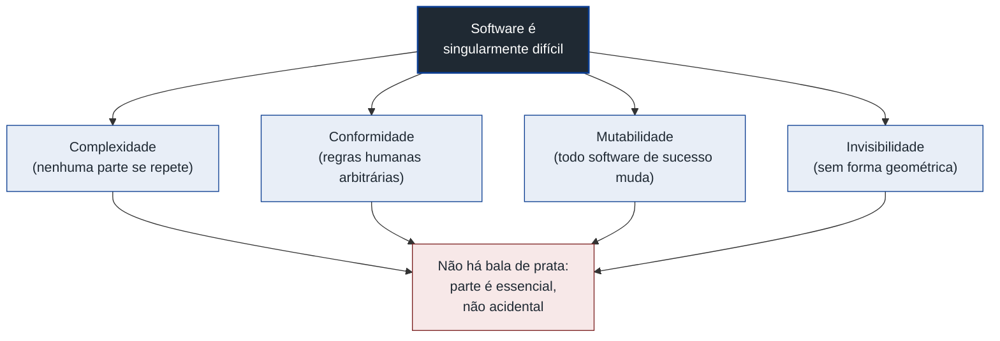
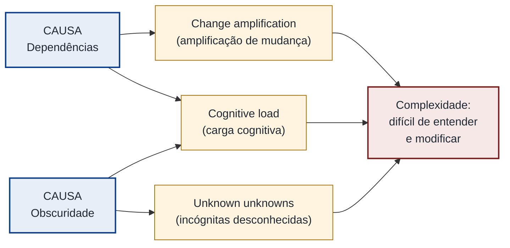
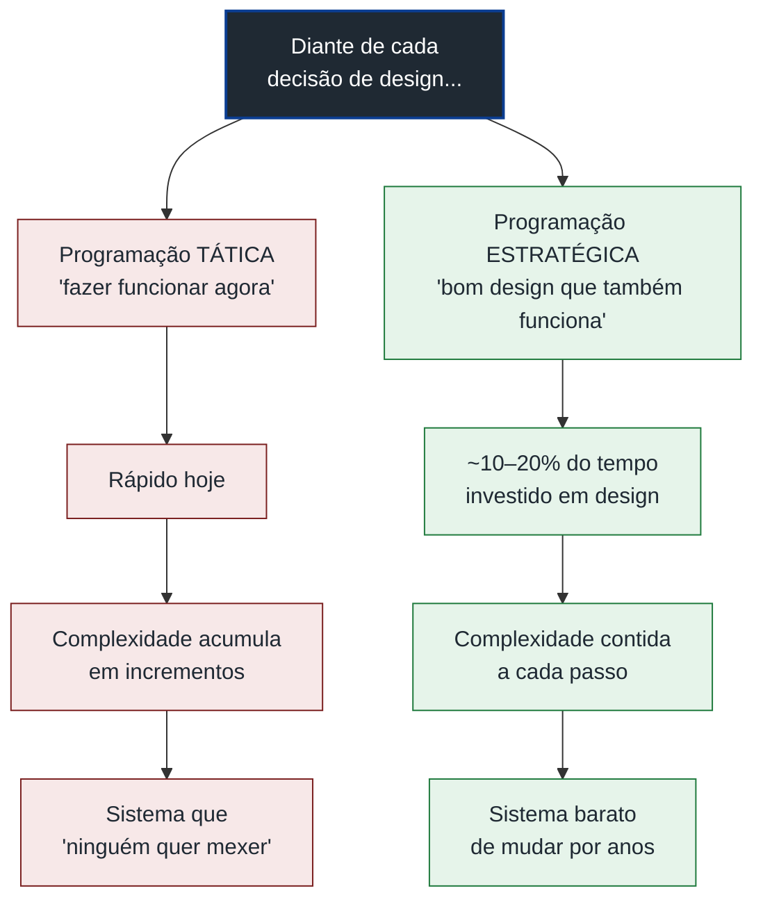
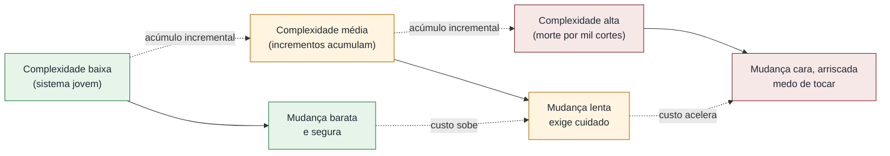
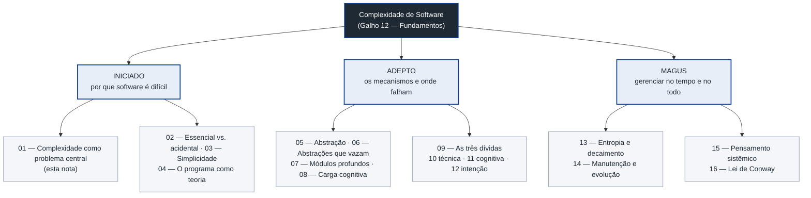

# A complexidade como problema central

Software é difícil por muitos motivos — prazos apertados, requisitos vagos, gente que muda de ideia, sistemas legados que ninguém entende mais.

Mas há um motivo que mora embaixo de todos os outros, e este galho inteiro gira em torno dele: software é difícil porque é **complexo**.

Esta é a nota que abre a trilha. Antes de aprender as ferramentas que domam a complexidade — abstração, modularidade, encapsulamento —, vale parar e entender o inimigo.

Três perguntas guiam a nota inteira:

- O que é, exatamente, complexidade?
- Por que ela, e não outra coisa, é *o* problema central?
- E por que software sofre dela de um jeito que pontes e motores não sofrem?

> [!abstract] TL;DR
> A dificuldade central de construir e manter software não é digitar código nem escolher a linguagem certa — é domar a **complexidade**. Ousterhout dá a definição operacional: complexidade é *"anything related to the structure of a software system that makes it hard to understand and modify"* — qualquer coisa na estrutura do sistema que o torne difícil de entender e modificar. Ela se manifesta em três sintomas (**change amplification**, **cognitive load**, **unknown unknowns**), nasce de duas causas (**dependências** e **obscuridade**), e quase nunca chega de uma vez: acumula em incrementos minúsculos. Brooks foi mais fundo e nomeou **quatro propriedades essenciais** que tornam software singularmente difícil — complexidade, conformidade, mutabilidade e invisibilidade — e mostrou que parte da complexidade é **essencial**, não defeito que uma ferramenta melhor elimina. A resposta não é eliminar a complexidade (não dá), é **gerenciá-la** — e isso exige uma postura: Ousterhout chama de programação **estratégica** vs. **tática**. Esta nota abre a trilha; a separação essencial vs. acidental é assunto da [[02 - Complexidade essencial vs. acidental]].

## O que é

Pergunta honesta: por que dois programas com o mesmo número de linhas podem ter dificuldades de manutenção radicalmente diferentes?

Um você muda em cinco minutos. No outro, qualquer mexida vira uma tarde de medo. A variável que explica essa diferença tem nome: **complexidade**.

A definição que este galho adota é a de **John Ousterhout**, em *A Philosophy of Software Design*:

> [!quote] Definição operacional de complexidade
> *"Complexity is anything related to the structure of a software system that makes it hard to understand and modify the system."*
> — John Ousterhout, *A Philosophy of Software Design*

Repare no que essa definição faz de inteligente: ela é **operacional**, não estética.

Complexidade não é "código feio" no abstrato. É qualquer coisa que torne o sistema mais difícil de **entender** ou **modificar**.

Se uma escolha de design te faz pensar mais e mexer em mais lugares pra fazer uma mudança, ela adicionou complexidade — independentemente de parecer elegante no papel.

É uma definição que se mede pelo *efeito sobre quem trabalha no código*, não pela opinião de quem escreveu.

Esse deslocamento é o coração da nota.

A complexidade não é uma propriedade do código que você admira. É uma propriedade da experiência de quem precisa mudá-lo amanhã.

> [!tip] O teste de uma linha
> Quer saber se uma decisão adicionou complexidade? Pergunte: *"isso torna o sistema mais difícil de entender ou de mudar?"* Se sim, você adicionou complexidade — por mais bonito que o diagrama tenha ficado.

## Por que a complexidade é *o* problema, e não *um* problema

Há muitas dificuldades em software. A da complexidade tem uma propriedade especial: ela é **a que cresce com o tempo e a que limita tudo o mais**.

Pense no ciclo de vida real de um sistema. Software de verdade passa a maior parte da vida sendo **lido e modificado**, não escrito do zero.

E o custo de cada modificação é, em primeiríssima ordem, função de quão complexo o sistema ficou.

Um sistema simples você muda com confiança.

Um sistema complexo você muda com medo — e o medo é racional, porque você não consegue ter na cabeça todas as consequências da mudança.

Esse é o ponto que justifica o galho inteiro.

Quase toda boa prática de design — abstração, modularidade, encapsulamento, nomes bons — existe por um motivo só: **gerenciar complexidade**.

Entender complexidade primeiro é entender o "porquê" de todo o resto.

Dijkstra dizia isso de forma quase poética, e é a frase que melhor resume a profissão:

> [!quote] Programar é organizar complexidade
> *"The art of programming is the art of organizing complexity, of mastering multitude and avoiding its bastard chaos as effectively as possible."*
> — Edsger Dijkstra, *Notes on Structured Programming* (EWD249, 1970)

## Por que software é singularmente difícil — as quatro propriedades de Brooks

Aqui vale recuar de Ousterhout, que descreve a complexidade *de dentro* do código.

Brooks perguntou algo mais fundo: **por que software, como categoria, é mais difícil que outras engenharias?**

A resposta está em *No Silver Bullet — Essence and Accident in Software Engineering* (1986), onde Frederick Brooks nomeia **quatro propriedades essenciais** da natureza do software.

Não são quatro problemas a resolver. São quatro fatos sobre o que software *é*, e cada um o torna mais duro que construir uma ponte.

> [!example] As quatro propriedades essenciais (Brooks)
>
> **1. Complexidade (complexity).** Entidades de software são mais complexas, por tamanho, que talvez qualquer outra construção humana — porque **não há duas partes iguais**. Uma ponte tem milhares de rebites idênticos; um programa de mil linhas tem mil linhas *diferentes*. *Consequência concreta:* não dá pra ganhar escala por repetição. Onde o engenheiro civil reaproveita o mesmo cálculo para mil vigas, cada função sua resolve um problema único — então a complexidade cresce com o número de partes, não com o tamanho. Brooks chama isso de propriedade **essencial**, não acidental: *"The complexity of software is an essential property, not an accidental one."* Ela não vem de pobreza de ferramentas; vem da natureza do que o sistema precisa representar.
>
> **2. Conformidade (conformity).** Boa parte da complexidade é **arbitrária** — imposta "sem rima nem razão" pelas muitas instituições e sistemas humanos com os quais o software precisa se conformar. O físico descobre leis elegantes da natureza; o programador precisa se conformar a interfaces, leis fiscais, protocolos legados e exceções que alguém decidiu décadas atrás. *Consequência concreta:* não há um princípio unificador a descobrir que simplifique tudo. Cada exceção fiscal, cada campo extra no formato legado, é complexidade que nenhuma refatoração elimina — porque ela mora *fora* do seu código, no mundo a que ele precisa obedecer.
>
> **3. Mutabilidade (changeability).** O software está sob pressão **constante** para mudar. *Todo software de sucesso é mudado.* Uma vez que funciona e é útil, as pessoas o esticam para casos novos, ambientes novos, requisitos novos. *Consequência concreta:* a pressão para mudar nunca para, porque o software é **infinitamente maleável**. Diferente de um carro, cuja forma congela na linha de montagem (mudar o chassi custaria reabrir a fábrica), o software *parece* mudável a custo zero — e é justamente essa maleabilidade aparente que convida a mudança sem fim e descongela um design que você imaginava estável.
>
> **4. Invisibilidade (invisibility).** Software **não tem forma geométrica**. A planta baixa serve ao arquiteto, o desenho em escala serve ao engenheiro mecânico — há uma representação espacial que a mente capta de uma olhada. Software não. *Consequência concreta:* você não consegue raciocinar sobre a estrutura **geometricamente**, do jeito que se aponta para uma viga e se diz "isto sustenta aquilo". A estrutura é um grafo de dependências que não cabe num plano: não se vê, não se aponta, não se compartilha de uma olhada. Isso trava a comunicação e o raciocínio — é difícil discutir, e mais difícil ainda corrigir, o que não se consegue desenhar.

Junte as quatro e fica claro por que software é um animal diferente.

Ele é **inerentemente intrincado** (complexidade), **amarrado a regras arbitrárias** (conformidade), **eternamente inacabado** (mutabilidade) e **impossível de visualizar** (invisibilidade).

Nenhuma linguagem melhor, IDE melhor ou framework melhor faz esses quatro fatos desaparecerem.

É exatamente por isso que Brooks não acredita em "balas de prata": nenhuma inovação isolada vai dar um ganho de uma ordem de magnitude, porque a parte mais dura do trabalho não está na implementação — está na **essência**.

Vale desconfiar, então, de toda promessa de que a próxima ferramenta vai fazer os quatro fatos acima desaparecerem — a seção [[#Armadilhas comuns]] volta a esse ponto.

O diagrama abaixo organiza as quatro propriedades como as raízes da dificuldade do software.

Leitura do diagrama: as quatro propriedades essenciais se ramificam da dificuldade-raiz do software e convergem para a mesma conclusão — como parte da complexidade é essencial, não existe uma única ferramenta que a elimine.

### Por que a ponte é mais fácil que o programa

Vale tornar concreto o contraste, porque ele ilumina por que técnicas de outras engenharias não se transplantam direto pra software.

Um engenheiro de pontes trabalha com peças **repetidas** (rebites, vigas, cabos), governadas por **leis da física estáveis** (a gravidade não muda de versão), numa estrutura que se **desenha em escala** e se **congela** quando inaugurada.

As quatro propriedades de Brooks são, todas, *brandas* no caso da ponte.

O programador trabalha no oposto exato:

- Cada linha é diferente (complexidade).
- As "leis" que ele obedece foram inventadas por humanos e mudam (conformidade).
- O sistema nunca fica pronto, porque o próprio sucesso convida mais mudança (mutabilidade).
- E não há planta baixa que caiba a estrutura inteira numa olhada (invisibilidade).

> [!tip] Por isso a metáfora "construção" engana
> Comparar software a construir um prédio é reconfortante e quase sempre enganoso: prédios não mudam de planta depois de prontos, não se conformam a regras arbitrárias que mudam toda semana, e cabem num desenho. O que o software tem de mais parecido com engenharia tradicional é o vocabulário — não a física. É por isso que disciplina de processo "emprestada" da construção civil costuma decepcionar: ela não ataca nenhuma das quatro propriedades essenciais.

## Os sintomas e suas causas (Ousterhout)

Brooks explica *por que* software é difícil.

Ousterhout dá a lupa para enxergar a complexidade **no código de hoje** — antes que ela te morda.

Ele aponta três sintomas observáveis. São úteis porque são concretos: dá pra apontar pra eles num pull request.

> [!example] Os três sintomas, do mais visível ao mais traiçoeiro
>
> **1. Change amplification (amplificação de mudança)** — uma mudança aparentemente pequena exige editar **muitos lugares**. Você quer trocar a cor de fundo padrão e descobre que ela está hardcoded em vinte arquivos. O sintoma é o esforço desproporcional: a mudança conceitual é minúscula, mas a mudança no código é enorme.
>
> **2. Cognitive load (carga cognitiva)** — quanto você precisa **ter na cabeça** pra fazer uma tarefa com segurança. Quantas peças, quantas convenções implícitas, quantas armadilhas você precisa lembrar pra não quebrar nada? Quanto mais alta a carga, mais devagar você vai e mais bugs introduz — não por incompetência, mas porque a memória de trabalho humana é finita. (Esta é a dor que a nota [[08 - Carga cognitiva e legibilidade]] aprofunda.)
>
> **3. Unknown unknowns (incógnitas desconhecidas)** — o pior dos três. É quando você nem sabe **o que** precisa saber pra fazer a mudança certa. Nada óbvio te avisa que existe um trecho que também precisa mudar, ou uma condição a respeitar. Você faz a mudança que parece correta e introduz um bug que só aparece em produção, três semanas depois.

Dos três, a **change amplification** é a mais fácil de tornar tangível. Vale um exemplo.

> [!example] Change amplification, na prática (exemplo ilustrativo)
> Imagine um sistema que mostra moeda. Em algum momento, no início, alguém escreveu `"R$ " + valor` direto na tela do carrinho. Funcionou. No checkout, copiou. No e-mail de confirmação, copiou de novo. No recibo em PDF, no extrato, no relatório do admin — sempre o mesmo `"R$ "` hardcoded, espalhado por **dezenas de arquivos**.
>
> Aí chega o requisito: *"vamos vender para Portugal também — precisa exibir em euro."*
>
> A mudança **conceitual** é minúscula: "o símbolo da moeda depende do país". A mudança **no código** é enorme: caçar cada `"R$ "` em dezenas de arquivos, sem garantia de ter achado todos. Pior — o que você *esquecer* não dá erro de compilação; vira um recibo em reais enviado a um cliente português. (A *change amplification* virou um *unknown unknown*.)
>
> O contraste expõe a causa: tudo isso porque a regra "como formatar dinheiro" não morava em **um lugar**. Uma única função `formatarMoeda(valor, pais)` teria transformado a mudança de "editar dezenas de arquivos" em "editar uma função". É a diferença entre **uma fonte de verdade** e **uma duplicação espalhada** — e é exatamente o tipo de incremento que entra "só por hoje" e cobra juros meses depois.

Por que os *unknown unknowns* são os piores?

Porque os outros dois você ao menos **vê**: a amplificação dói na hora, a carga cognitiva você sente como cansaço.

Os unknown unknowns são invisíveis por definição — você não pode se proteger do que não sabe que existe.

Bom design é, em larga medida, a arte de **converter unknown unknowns em known knowns**: tornar óbvio o que precisa ser sabido.

E de onde vêm os sintomas?

Ousterhout aponta **duas causas estruturais**, e a economia toda da complexidade cabe nelas:

> [!tip] As duas causas: dependências e obscuridade
> **Dependências** — quando uma peça de código não pode ser entendida ou modificada **isoladamente**, porque está amarrada a outras. Dependências geram *change amplification* (mexeu numa, mexa em todas) e *carga cognitiva* (pra entender uma, entenda o resto).
>
> **Obscuridade** — quando informação importante **não está óbvia**. Um nome enganoso, uma convenção implícita, um efeito colateral escondido. A obscuridade gera *unknown unknowns* (você não sabe o que não sabe) e também *carga cognitiva*.
>
> Sintoma → causa: quase tudo que aumenta complexidade é, no fundo, **dependência demais ou clareza de menos**.

O diagrama abaixo amarra as duas causas aos três sintomas que elas produzem.

Leitura do diagrama: as duas causas (dependências e obscuridade) alimentam os três sintomas — note que a *carga cognitiva* recebe das duas, e os *unknown unknowns* nascem só da obscuridade —, e todos desembocam na mesma definição operacional de complexidade.

## A complexidade é incremental — morte por mil cortes

Aqui está a observação mais perigosa de Ousterhout, porque é a mais fácil de subestimar: **a complexidade quase nunca chega de uma vez**.

Ela chega em incrementos minúsculos:

- uma dependência a mais aqui;
- um caso especial não documentado ali;
- um nome enganoso acolá;
- uma duplicaçãozinha "só por hoje".

Cada um parece inofensivo. *"É só uma linha."* *"Eu arrumo depois."*

E individualmente, cada um é mesmo quase nada.

> [!note] A complexidade é cumulativa
> Somados ao longo de meses, esses incrementos minúsculos são exatamente o que transforma um sistema jovem e ágil num sistema que "ninguém quer mexer". Não houve uma decisão catastrófica — houve mil decisões inofensivas. É a **morte por mil cortes**. Por isso complexidade é o problema **central**: ela é o mecanismo silencioso pelo qual sistemas envelhecem mal.

Essa natureza incremental tem uma consequência prática brutal: você não pode esperar uma crise pra agir.

Quando a complexidade fica óbvia o bastante pra justificar um "grande refator", ela já está espalhada por todo o sistema.

E não conte com o refator como salvação garantida: Gerald Weinberg avisa que a mão que mexe também piora.

> [!quote] A manutenção sempre pode piorar
> *"There is no code so big, twisted, or complex that maintenance can't make it worse."*
> — Gerald M. Weinberg

O combate eficaz é, então, o oposto do heroísmo: é **constante, pequeno e chato** — recusar cada incremento de complexidade no momento em que ele tentaria entrar.

E isso nos leva direto à postura que separa quem segura a maré de quem é arrastado por ela.

## Tático vs. estratégico — a complexidade é um investimento

Se a complexidade entra em incrementos, então a pergunta decisiva é sobre **postura diante de cada incremento**.

Ousterhout dá a ela dois nomes.

**Programação tática** é a mentalidade do "fazer funcionar agora". O objetivo é terminar a tarefa, o ticket, a feature — o mais rápido possível.

Funcionou? Próximo. Cada atalho parece uma vitória de velocidade.

**Programação estratégica** inverte a meta. O objetivo primário não é "código que funciona" — é **um bom design** que, por consequência, funciona.

Código que funciona é o mínimo; design que continua barato de mudar é o alvo.

> [!quote] A meta da programação estratégica
> *"Your primary goal must be to produce a great design, which also happens to work. This is strategic programming."*
> — John Ousterhout, *A Philosophy of Software Design*

A diferença não é sobre ser caprichoso ou relaxado. É sobre **horizonte de tempo**.

O programador tático otimiza a próxima hora. O estratégico otimiza os próximos anos.

Ele aceita pagar um pequeno custo agora — Ousterhout sugere reservar **~10–20%** do tempo para esses "investimentos" — pra não pagar juros compostos de complexidade depois.

É a mentalidade de **investimento**: cada pequena melhoria de design é um aporte que rende ao longo da vida do sistema.

(É a contraparte de postura do exemplo da moeda lá em cima: a `formatarMoeda` que ninguém escreveu "porque deu pra resolver com `"R$ "`" é exatamente o investimento que o tático pula e o estratégico faz.)

Ousterhout dá um nome ao extremo da programação tática — e vale conhecê-lo antes de seguir adiante, porque reconhecê-lo é meio caminho pra não virar um (ver [[#Armadilhas comuns]]).

O diagrama abaixo contrasta as duas posturas e mostra para onde cada uma leva ao longo do tempo.

Leitura do diagrama: a mesma decisão de design se bifurca em duas posturas — a tática é mais rápida no curto prazo mas alimenta o acúmulo incremental de complexidade, enquanto a estratégica paga um custo pequeno e contínuo que mantém o sistema barato de mudar.

## O custo de mudar cresce com a complexidade

Por que tudo isso importa em termos práticos?

Porque a complexidade não é um incômodo estético — ela tem **preço em dinheiro e em risco**, e o preço cresce.

Lembre que software passa a maior parte da vida sendo modificado.

Se cada modificação fica mais cara conforme a complexidade sobe, então a complexidade é um **imposto que incide sobre toda mudança futura** — e a alíquota aumenta com o tempo.

Num sistema simples, mudar é barato e seguro: você entende o que vai tocar, vê as consequências, faz e segue.

Num sistema complexo, a mesma mudança custa horas de leitura, gera medo, exige testes defensivos — e ainda assim arrisca um *unknown unknown* que explode depois.

> [!note] A curva, não a linha
> O custo de mudança não cresce de forma linear com a complexidade — ele tende a **acelerar**. Cada nova dependência multiplica os caminhos que uma mudança precisa considerar; cada trecho obscuro a mais é mais um lugar onde um *unknown unknown* pode estar à espreita. É por isso que sistemas negligenciados parecem "de repente" intratáveis: a curva estava subindo o tempo todo, mas só fica íngreme o bastante pra doer lá na frente.

Esse encarecimento contínuo, projetado no tempo de vida do sistema, é o que a trilha trata depois sob o nome de **entropia de software** e decaimento ([[13 - Entropia de software e decaimento]]): a tendência de um sistema a ficar mais desordenado e caro de mudar, a menos que se gaste energia ativa pra conter.

O diagrama abaixo desenha, de forma conceitual, a relação entre complexidade acumulada e o custo/risco de cada mudança.

Leitura do diagrama: conforme a complexidade acumulada sobe (de baixo para alto), o custo e o risco de cada mudança não apenas crescem — eles aceleram, até o ponto em que mexer no sistema vira motivo de medo.

## Mapa do galho

Esta nota abre uma trilha de três fases, que vai do **porquê** software é difícil até **como** se administra essa dificuldade ao longo do tempo.

Vale ter o mapa na cabeça antes de mergulhar.

Leitura do diagrama: a trilha sobe do *porquê* (Iniciado: a natureza da complexidade) para o *como* (Adepto: as ferramentas que a gerenciam e seus vazamentos) e termina no *no tempo e no todo* (Magus: como a complexidade se acumula em sistemas vivos e na escala da arquitetura inteira).

> [!abstract] As três fases, em uma frase cada
> - **Iniciado — por que software é difícil.** O quadro geral: complexidade como problema central (esta nota), a divisão [[02 - Complexidade essencial vs. acidental|essencial vs. acidental]], simplicidade vs. facilidade, e o entendimento que mora nas pessoas ([[04 - O programa como teoria]]).
> - **Adepto — os mecanismos e onde eles falham.** Como gerenciamos complexidade na prática — abstração, modularidade, encapsulamento, carga cognitiva ([[08 - Carga cognitiva e legibilidade]]) — e os pontos onde vazam ([[06 - Abstrações que vazam]]), mais as três dívidas do software ([[09 - As três dívidas do software]]).
> - **Magus — gerenciar a complexidade no tempo e no todo.** Como a complexidade se acumula em sistemas vivos ([[13 - Entropia de software e decaimento]]) e como mantê-la sob controle na escala da arquitetura inteira.

Se você lê só uma frase deste galho, que seja esta: **toda decisão de design é, no fundo, uma decisão sobre complexidade** — você está sempre escolhendo entre adicioná-la ou contê-la.

E a postura que faz a diferença tem dois nomes que Dijkstra resumiria assim:

> [!quote] A humildade como método
> *"The competent programmer is fully aware of the strictly limited size of his own skull; therefore he approaches the programming task in full humility."*
> — Edsger Dijkstra, *The Humble Programmer* (EWD340, 1972)

Domar a complexidade começa por reconhecer que a sua cabeça é pequena.

É essa humildade que torna a abstração, a modularidade e o bom nome não preciosismos — mas sobrevivência.

## Armadilhas comuns

> [!warning] Cuidado com a falsa esperança
> A história do software é cheia de promessas de que *a próxima tecnologia* vai acabar com a complexidade. Linguagens de alto nível, OO, frameworks, IA generativa — cada onda atacou (com sucesso real) a complexidade **acidental**. Nenhuma tocou na **essencial**, porque essa não é um problema de ferramenta. Manter essa distinção em mente é uma vacina contra hype. A separação cuidadosa entre essencial e acidental é o assunto inteiro da nota [[02 - Complexidade essencial vs. acidental]].

> [!warning] O tactical tornado
> Ousterhout dá um nome ao extremo da programação tática: o **tactical tornado** ("tornado tático"). É o desenvolvedor que despeja features numa velocidade que impressiona a gerência — e deixa um rastro de destruição que os colegas passarão meses limpando. Ironicamente, ele às vezes é *premiado* por ser produtivo, porque o custo da complexidade que ele criou só aparece no boleto de quem vem depois. Reconhecer o tactical tornado (e não se tornar um) é parte do julgamento sênior.

> [!warning] Não espere a crise para agir
> Quando a complexidade fica óbvia o bastante pra justificar um "grande refator", ela já está espalhada por todo o sistema. Tratar complexidade como problema do futuro — *"quando ficar ruim de verdade, a gente para tudo e arruma"* — é adiar a conta pro momento em que ela já ficou cara demais de pagar. O combate eficaz não é o grande gesto heroico: é constante, pequeno e chato, recusando cada incremento de complexidade no instante em que ele tentaria entrar.

## Inglês

A literatura sobre complexidade de software é quase toda em inglês — Brooks, Ousterhout, Dijkstra, Weinberg escrevem (ou são citados) no original — e boa parte do vocabulário técnico não tem tradução natural em PT-BR. Vale conhecer os termos como eles circulam de fato numa conversa técnica.

**Complexity** é usado solto em inglês com naturalidade ("this codebase has a lot of complexity"), mas em português "complexidade" já é palavra corrente — não soa estrangeirismo. Já **change amplification**, **cognitive load** e **unknown unknowns** tendem a aparecer em inglês mesmo em times brasileiros, porque são os termos-âncora do livro do Ousterhout; traduzir ("amplificação de mudança", "carga cognitiva", "incógnitas desconhecidas") funciona bem em texto escrito, mas numa reunião falada o inglês costuma vencer.

**Tactical programming** e **strategic programming** quase sempre precisam de uma frase de explicação mesmo em inglês — não são termos que "todo mundo já ouviu", ao contrário de *technical debt*. Já **silver bullet**, na expressão "no silver bullet", é uma daquelas que funciona melhor citada por inteiro ("there's no silver bullet") do que traduzida ("não há bala de prata") — a tradução existe e é usada, mas perde o gancho com o título do ensaio de Brooks.

| Português | Inglês |
|---|---|
| Complexidade | Complexity |
| Amplificação de mudança | Change amplification |
| Carga cognitiva | Cognitive load |
| Incógnitas desconhecidas | Unknown unknowns |
| Programação tática | Tactical programming |
| Programação estratégica | Strategic programming |
| Bala de prata | Silver bullet |
| Tornado tático | Tactical tornado |
| Dependências | Dependencies |
| Obscuridade | Obscurity |
| Complexidade essencial | Essential complexity |
| Complexidade acidental | Accidental complexity |

## Em entrevista

Este é o tipo de assunto que separa quem decorou padrões de quem entende *por que* eles existem.

Saber articular "complexidade como problema central" sinaliza maturidade — porque mostra que você enxerga design como gestão de risco no tempo, não como gosto pessoal.

> [!tip] Como articular o problema central
> Se o entrevistador perguntar "o que é boa arquitetura?" ou "como você decide entre duas soluções?", ancore a resposta na complexidade. Frase de efeito: *"Most design decisions are, at bottom, decisions about complexity — am I adding it or containing it?"* Em PT, deixe explícito o ciclo de vida: software passa a maior parte da vida sendo lido e mudado, então o custo que importa não é o de escrever, é o de **mudar com segurança depois**.

> [!example] Três jogadas que impressionam
> - **Citar Ousterhout com a definição operacional.** Dizer que complexidade é "qualquer coisa que torne o sistema difícil de entender ou modificar" mostra que você tem um critério mensurável, não estético. Some os três sintomas (*change amplification*, *cognitive load*, *unknown unknowns*) e as duas causas (dependências e obscuridade) — é vocabulário que sinaliza leitura séria.
> - **Distinguir tático de estratégico.** Quando perguntarem sobre prazos vs. qualidade, recuse o falso dilema: *"It's not speed vs. quality — it's optimizing for this hour vs. for the next two years."* Mencionar o *tactical tornado* mostra que você já viu o anti-padrão na prática.
> - **Invocar Brooks contra o hype.** Se o tema for IA generativa ou "a próxima ferramenta que resolve tudo", traga o "no silver bullet": ferramentas atacam a complexidade **acidental**, nunca a **essencial**. É uma forma elegante de parecer cético sem parecer reacionário.

> [!warning] O erro que entrega o júnior
> Reduzir "complexidade" a "código feio" ou "muitas linhas". A complexidade que importa é a que cobra na **manutenção** — e um arquivo curto e "limpo" pode ser uma bomba de *unknown unknowns* se esconder uma dependência implícita. Medir complexidade pelo efeito sobre quem mantém, não pela aparência, é o salto de júnior pra sênior nessa conversa.

## O que vem a seguir

Esta nota estabeleceu o problema central: complexidade é o que torna um sistema difícil de entender e modificar, ela se manifesta em três sintomas concretos — change amplification, cognitive load, unknown unknowns —, e ela chega quase sempre em incrementos minúsculos, não de uma vez.

Mas ficou uma tensão pendurada. Brooks disse que parte da complexidade é **essencial** — não sai por nenhuma ferramenta melhor. Se isso é verdade, uma pergunta óbvia nasce: então nada do que fazemos como profissão realmente ajuda? A resposta não pode ser "sim", porque na prática abstração, modularidade e bom design claramente tornam sistemas mais fáceis de mudar.

A saída é que nem toda complexidade é essencial. Parte dela é **acidental** — subproduto de escolhas de ferramenta, de linguagem, de decisões de ontem que ninguém revisou — e essa parte, sim, dá pra cortar.

Separar as duas com precisão é o que evita dois erros simétricos: gastar energia tentando eliminar o que é inerente à natureza do software, ou desistir cedo demais achando que tudo é essencial e imutável. Essa separação — o que dá pra cortar e o que não dá — é o assunto inteiro de [[02 - Complexidade essencial vs. acidental]].

## Referências

> [!tip] Assista — A Philosophy of Software Design — John Ousterhout
> **Talks at Google** · 1h02 · [A Philosophy of Software Design — John Ousterhout](https://www.youtube.com/watch?v=bmSAYlu0NcY)
> Ousterhout apresentando a tese do próprio livro. É a fonte direta de quase tudo que esta nota chama de sintoma — change amplification, carga cognitiva e unknown unknowns aparecem nomeados e exemplificados por quem cunhou o recorte.

- **Frederick P. Brooks Jr.** — *No Silver Bullet — Essence and Accident in Software Engineering* (1986; reimpresso em *Computer*, vol. 20, n. 4, abril de 1987, p. 10-19; incluído na edição de aniversário de *The Mythical Man-Month*). Origem das **quatro propriedades essenciais** do software (complexidade, conformidade, mutabilidade, invisibilidade) e da tese essencial-vs-acidental. [PDF (worrydream.com)](https://worrydream.com/refs/Brooks_1986_-_No_Silver_Bullet.pdf) · [TR86-020 (UNC)](https://www.cs.unc.edu/techreports/86-020.pdf) · [Wikipedia](https://en.wikipedia.org/wiki/No_Silver_Bullet)
- **John Ousterhout** — *A Philosophy of Software Design* (1ª ed. 2018; 2ª ed. 2021, Yaknyam Press). Definição operacional de complexidade; os três sintomas (*change amplification*, *cognitive load*, *unknown unknowns*); as duas causas (dependências e obscuridade); a natureza incremental da complexidade; e a distinção **tático vs. estratégico** (incl. o *tactical tornado* e a regra dos ~10–20% de investimento). [Amazon (2nd ed., ISBN 9781732102217)](https://www.amazon.com/Philosophy-Software-Design-2nd/dp/173210221X)
- **Edsger W. Dijkstra** — *The Humble Programmer* (EWD340, 1972; ACM Turing Award Lecture): *"the competent programmer is fully aware of the strictly limited size of his own skull"*. [Arquivo EWD (UT Austin)](https://www.cs.utexas.edu/~EWD/transcriptions/EWD03xx/EWD340.html)
- **Edsger W. Dijkstra** — *Notes on Structured Programming* (EWD249, 1970): *"the art of programming is the art of organizing complexity, of mastering multitude and avoiding its bastard chaos"*. [Arquivo EWD (UT Austin)](https://www.cs.utexas.edu/~EWD/transcriptions/EWD02xx/EWD249/EWD249.html)
- **Ben Moseley & Peter Marks** — *Out of the Tar Pit* (2006): *"complexity is the single major difficulty in the successful development of large-scale software systems"*. Reforça (e ao mesmo tempo discute com Brooks) que a complexidade é *o* problema. [PDF (curtclifton.net)](https://curtclifton.net/papers/MoseleyMarks06a.pdf)
- **Gerald M. Weinberg** — *"There is no code so big, twisted, or complex that maintenance can't make it worse."* Aforismo recorrente, atribuído a Weinberg em coletâneas de citações de software; ilustra que o próprio ato de manter pode adicionar complexidade. [SoftwareQuotes (Weinberg)](https://softwarequotes.com/author/gerald-m--weinberg)

> [!note] Sobre o lastro das afirmações
> As **quatro propriedades de Brooks** (complexidade/conformidade/mutabilidade/invisibilidade) foram conferidas contra o relatório técnico TR86-020 e resumos do ensaio; a citação *"The complexity of software is an essential property, not an accidental one"* foi conferida contra o texto do ensaio reproduzido em múltiplas fontes. A definição de Ousterhout e os três sintomas/duas causas, bem como a distinção **tático vs. estratégico**, o termo *tactical tornado* e a faixa de ~10–20% de investimento, foram conferidos contra resumos do livro e a citação literal reproduzida. As citações de **Dijkstra** (EWD340 e EWD249) foram verificadas contra o arquivo EWD da Universidade do Texas. A frase de **Moseley & Marks** foi conferida contra o PDF do paper. O aforismo de **Weinberg** foi conferido contra coletâneas de citações; é atribuição amplamente reproduzida, mas não localizei a obra-fonte primária página a página. **Ressalva honesta:** não li o texto integral de cada obra página a página; paráfrases (sobretudo dos sintomas de Ousterhout e do fraseado de Brooks) podem diferir em nuance da formulação exata dos autores. O **exemplo da moeda** (`"R$ "` hardcoded → euro) é uma ilustração própria, não um caso histórico citado. As citações entre aspas são reproduzidas verbatim das fontes acima.

## Veja também

- [[02 - Complexidade essencial vs. acidental]] — a próxima parada: o que dá pra cortar e o que não dá (Brooks e *Out of the Tar Pit* em profundidade)
- [[04 - O programa como teoria]] — o entendimento que combate a complexidade mora nas pessoas, não no código-fonte
- [[06 - Abstrações que vazam]] — o que acontece quando os mecanismos de gestão de complexidade falham
- [[08 - Carga cognitiva e legibilidade]] — o sintoma "cognitive load" deste mapa, medido e aprofundado
- [[09 - As três dívidas do software]] — para onde a complexidade não-gerenciada vai parar: dívida técnica, cognitiva e de intenção
- [[13 - Entropia de software e decaimento]] — o custo de mudança crescente, projetado no tempo de vida do sistema
- [[Dicionário de Ciência da Computação]] — verbetes do domínio (incl. *Programação tática vs. estratégica* e *Mudança amplificada*)
