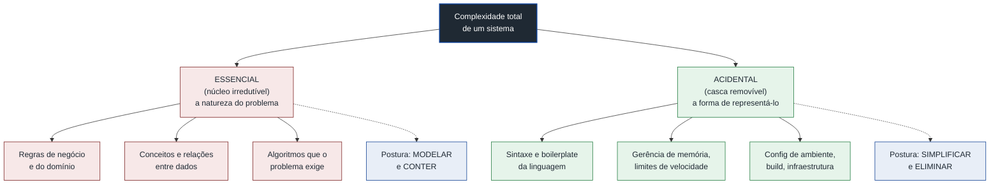
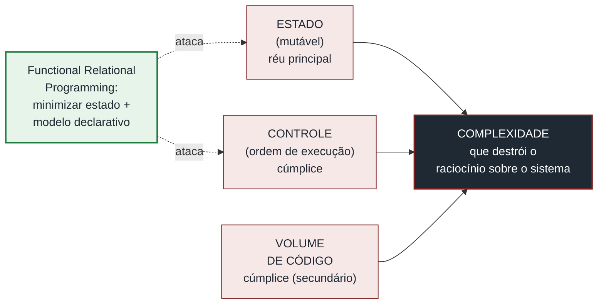
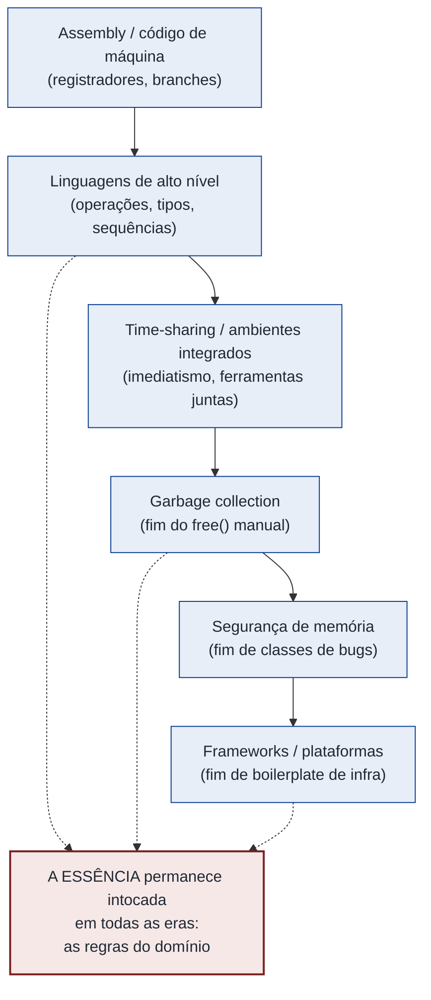
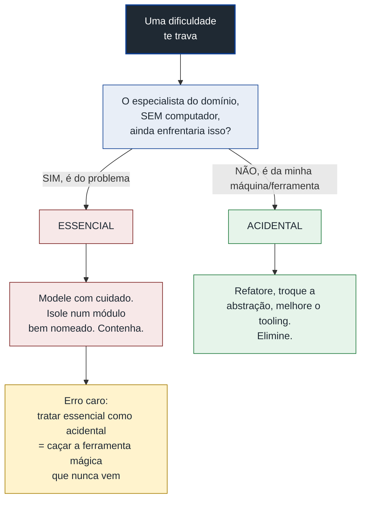

# Complexidade essencial vs. acidental

A nota anterior ([[01 - A complexidade como problema central]]) terminou com um aviso desconfortável de Brooks: parte da complexidade do software é **essencial** — não some com ferramenta melhor.

Esta nota faz o corte que aquela só apontou. Separar o que dá pra cortar do que não dá.

Porque essa distinção não é filosofia ociosa. Ela muda a resposta certa pra cada dificuldade que você encontra.

> [!abstract] TL;DR
> Brooks (*No Silver Bullet*, 1986) divide a complexidade em duas. A **essencial** vem da natureza do problema — das "estruturas conceituais entrelaçadas" que o software precisa representar — e é praticamente irredutível. A **acidental** vem das ferramentas, da linguagem, da representação, do ambiente — e é onde a engenharia tem alavanca.
> Não há "bala de prata" porque os grandes ganhos históricos (linguagens de alto nível, time-sharing, ambientes integrados) atacaram o acidental, e ele já encolheu. O que sobra é a essência, que nenhuma inovação isolada elimina.
> *Out of the Tar Pit* (Moseley & Marks, 2006) aperta o argumento: muito do que parece essencial é acidental disfarçado, introduzido pela forma como gerimos **estado**. A utilidade prática: nomear se uma dificuldade é essencial ou acidental decide a resposta — você **refatora pra eliminar** o acidental, mas tem que **modelar e conter** o essencial.

## O que é: a herança de Aristóteles

Brooks pega emprestada uma distinção de Aristóteles.

A **essência** de uma coisa é o que ela tem de necessário, intrínseco. O **acidente** é o que ela tem por circunstância — e que poderia ser de outro jeito sem deixar de ser ela mesma.

O subtítulo do ensaio é literalmente *"Essence and Accident in Software Engineering"*. A escolha das palavras é deliberada e filosófica.

Aplicado a software:

> [!quote] Os dois tipos de dificuldade
> *"...the difficulties inherent in the nature of the software — and accidents — those difficulties that today attend its production but that are not inherent."*
> — Fred Brooks, *No Silver Bullet* (1986)

E o que é, então, essa "essência" do software? Brooks define com precisão:

> [!quote] A essência do software
> *"The essence of a software entity is a construct of interlocking concepts: data sets, relationships among data items, algorithms, and invocations of functions."*
> — Fred Brooks, *No Silver Bullet* (1986)

Repare no que está na lista: conjuntos de dados, relações entre dados, algoritmos, invocações de funções. É o **modelo conceitual** que o sistema precisa representar.

Se a folha de pagamento da empresa tem trinta regras, essas trinta regras são essenciais. O programa tem que fazer as trinta, independentemente da linguagem.

A complexidade **acidental**, por contraste, é tudo o que vem da *representação* dessas ideias. Brooks é explícito sobre onde ela mora:

> [!quote] O que é o acidental
> *"...the representation of these abstract entities in programming languages and the mapping of these onto machine languages within space and speed constraints."*
> — Fred Brooks, *No Silver Bullet* (1986)

Sintaxe da linguagem, limites de memória e velocidade, configuração do ambiente, boilerplate. Nada disso é o problema — é o atrito de expressar o problema numa máquina.

> [!example] Uma analogia: traduzir um romance
> Imagine traduzir um romance.
> A **história** — a trama, os personagens, as reviravoltas — é a essência. Ela é a mesma em qualquer idioma, e nenhum dicionário melhor a torna mais simples.
> A **tradução** — encontrar a palavra certa, lidar com trocadilhos intraduzíveis, caber na métrica — é o acidente. Um tradutor melhor, um dicionário melhor, uma língua-alvo mais próxima reduzem esse esforço.
> Quem confunde os dois acha que um tradutor automático "resolve" o romance. Ele só ataca o acidente. A história continua exigindo um leitor.

O diagrama abaixo fixa a divisão e dá exemplos de cada lado.

Leitura do diagrama: a complexidade total se parte em duas camadas — o núcleo essencial (vermelho), que você não corta e por isso modela e contém, e a casca acidental (verde), que você de fato pode remover e por isso simplifica.

## Por que não há bala de prata

Aqui está o coração do argumento de Brooks, e a razão do título do ensaio.

Olhe a história das inovações que deram ganho real de produtividade. Assembler → linguagens de alto nível. Gerência manual de memória → garbage collection. Editor de texto → ambiente integrado.

Todas atacaram a complexidade **acidental**. E aqui está a consequência incômoda: existe um teto pra esse tipo de ganho. Você só pode espremer o acidental até zero, e ele já encolheu muito.

Brooks faz a conta explícita:

> [!quote] O teto do ganho acidental
> *"How much of what software engineers now do is still devoted to the accidental, as opposed to the essential? Unless it is more than 9/10 of all effort, shrinking all the accidental activities to zero time will not give an order of magnitude improvement."*
> — Fred Brooks, *No Silver Bullet* (1986)

A lógica é aritmética, não pessimismo.

Se o acidental já é menos de 90% do esforço, então *zerar* o acidental — o melhor caso imaginável de qualquer ferramenta nova — não chega a um ganho de 10x.

E o que sobra, a essência, é justamente a parte que nenhuma ferramenta toca. Daí a tese famosa:

> [!quote] A tese central
> *"There is no single development, in either technology or management technique, which by itself promises even one order of magnitude improvement in productivity, in reliability, in simplicity."*
> — Fred Brooks, *No Silver Bullet* (1986)

> [!warning] A complexidade essencial é irredutível
> Brooks é categórico: *"The complexity of software is in essential property, not an accidental one. Hence descriptions of a software entity that abstract away its complexity often abstract away its essence."*
> Traduzindo a consequência: você não pode "abstrair pra longe" a complexidade essencial sem jogar fora o próprio problema.
> Toda onda de hype que promete eliminar a complexidade — frameworks no-code, geração de código por IA, a próxima linguagem mágica — está, na melhor das hipóteses, atacando o acidental. Manter essa distinção é uma vacina contra acreditar que a essência vai sumir.

## Onde o esforço de engenharia compensa

Se o essencial é (em larga medida) irredutível e o acidental é redutível, a conclusão prática é direta.

**O acidental é a alavanca que você de fato pode puxar.**

É lá que a refatoração paga. Que escolher a abstração certa elimina dor de verdade. Que melhorar o tooling rende. Tempo gasto reduzindo complexidade acidental é tempo bem gasto — você está removendo dificuldade que *não precisava existir*.

O essencial pede uma postura diferente. Você não o elimina. Você o **modela bem e o contém**.

Boa modelagem de domínio, fronteiras de módulo bem postas, nomes que refletem os conceitos do problema — nada disso *apaga* a complexidade essencial, mas organiza ela de um jeito que cabe na cabeça.

A diferença de atitude é tudo: contra o acidental você simplifica; contra o essencial você estrutura.

> [!tip] Duas perguntas, duas respostas
> Diante de uma dificuldade, pergunte: *"isso é da natureza do problema, ou da forma como eu o representei?"*
> Se é da representação (acidental) → simplifique, refatore, troque a ferramenta.
> Se é da natureza do problema (essencial) → não espere que uma ferramenta resolva; modele com cuidado e aceite que a dificuldade é real.
> O erro caro é tratar essencial como acidental — passar meses procurando a ferramenta que vai "resolver" uma complexidade que é intrínseca ao negócio.

## Out of the Tar Pit: e se quase tudo for acidental?

Vinte anos depois de Brooks, **Ben Moseley e Peter Marks** retomaram o tema em *Out of the Tar Pit* (2006) com uma virada provocadora.

Eles aceitam a distinção essencial/acidental de Brooks — inclusive a citam. Mas a usam pra um diagnóstico mais cortante: **muito do que parece complexidade essencial é, na verdade, acidental disfarçado**, introduzido pela forma como construímos software.

A definição deles é deliberadamente mais estrita que a de Brooks:

> [!quote] Essencial vs. acidental, versão Tar Pit
> *"Essential Complexity is inherent in, and the essence of, the problem (as seen by the users). Accidental Complexity is all the rest — complexity with which the development team would not have to deal in the ideal world."*
> — Moseley & Marks, *Out of the Tar Pit* (2006)

"As seen by the users" — pelos olhos do usuário — é a chave. Se o usuário não conhece nem o nome daquilo (uma thread pool, um contador de loop), aquilo não pode ser essencial.

Eles cravam o teste com um exemplo: *"if the user doesn't even know what something is (e.g. a thread pool or a loop counter...) then it cannot possibly be essential by our definition"*.

> [!info] De onde vem o nome "Tar Pit"
> O título do paper é uma imagem emprestada — e do próprio Brooks. Em *The Mythical Man-Month*, Brooks abre comparando grandes projetos de software a um poço de piche pré-histórico, onde feras poderosas se debatem e afundam: quanto mais lutam, mais o piche as prende.
> Moseley & Marks pegam essa imagem e dão um diagnóstico: o piche tem nome, e o nome é **complexidade**. Sair do poço (*out of the tar pit*) é reduzir complexidade — e a deles é, sobretudo, reduzir a complexidade acidental do estado.

### Os três mundos

O argumento da Tar Pit gira em torno de uma régua imaginária: o **mundo ideal**.

No mundo ideal você não se preocupa com performance, e a linguagem e a infraestrutura te dão todo o suporte que você quiser. *"In the ideal world we are not concerned with performance, and our language and infrastructure provide all the general support we desire."*

A régua é essa: o que sobra de complexidade **mesmo nesse mundo ideal** é essencial. Tudo que some quando você remove os limites da máquina era acidental.

Eles descrevem um caminho de simplicidade absoluta nesse mundo. Requisitos informais → requisitos formais → execução direta dos requisitos formais. E observam que isso é, no fundo, *"the very essence of declarative programming — i.e. that you need only specify what you require, not how it must be achieved."*

E qual é, segundo eles, a maior fonte de complexidade acidental nos sistemas reais? **Estado** — mais precisamente, estado mutável.

> [!quote] O réu principal: estado
> *"...it is our belief that the single biggest remaining cause of complexity in most contemporary large systems is state, and the more we can do to limit and manage state, the better."*
> — Moseley & Marks, *Out of the Tar Pit* (2006)

O raciocínio: o estado faz o comportamento do sistema depender não só da entrada de agora, mas de **toda a história de entradas** que levou até aqui.

Isso explode o número de situações que você precisa ter na cabeça pra raciocinar com segurança. E raciocinar sobre o sistema é exatamente o que a complexidade destrói.

Eles têm uma frase ótima pra isso: *"when you let the nose of the camel into the tent, the rest of him tends to follow"*. Deixou uma pontinha de estado entrar, e ele contamina tudo ao redor.

Vale tornar concreto por que o estado é tão venenoso para o raciocínio.

Uma função pura com dois argumentos booleanos tem quatro combinações de entrada. Você consegue ter as quatro na cabeça.

Agora some estado: dez variáveis booleanas internas que sobreviveram de chamadas anteriores. O número de configurações em que a função pode rodar não é mais quatro — é quatro vezes mil e vinte e quatro. O espaço de situações que você precisa considerar para confiar no código **explode**.

Pior: o estado não fica visível na assinatura. Você olha `processar(pedido)` e não tem como saber, só pela chamada, em qual das milhares de configurações internas o sistema está. A transparência referencial — que a Tar Pit tanto valoriza — é exatamente a propriedade que devolve essa previsibilidade: tudo que afeta o resultado volta a estar **nos parâmetros**, visível.

### Controle e volume de código

O estado é o réu principal. Mas há dois cúmplices.

O **controle** é a ordem em que as coisas acontecem. *"Control is basically about the order in which things happen."*

O problema, dizem eles, é que muitas vezes a gente *não quer* se preocupar com isso. A linguagem força. Quando você escreve `a := b + 3` e depois `c := d + 2`, você não tinha intenção alguma sobre a ordem — mas foi forçado a impor uma. Você está sendo obrigado a especificar *como*, quando só queria dizer *o quê*.

No mundo ideal deles, o controle é classificado como **inteiramente acidental** — pode ser omitido por completo, porque o usuário raramente liga pra ordem interna de execução.

O **volume de código** é o terceiro contribuinte. Quanto mais código, mais há pra entender, e a complexidade tende a crescer junto. Mas os autores tratam o volume como secundário — em boa parte ele é *efeito* de estado e controle mal geridos, não causa independente.

O diagrama liga as três fontes ao problema e mostra onde a proposta da Tar Pit ataca.

Leitura do diagrama: estado, controle e volume alimentam a mesma complexidade que mata a capacidade de raciocinar sobre o sistema; a proposta da Tar Pit (FRP) ataca diretamente o estado e o controle, as duas fontes que ela considera mais perigosas.

## A proposta: Functional Relational Programming

A receita deles segue do diagnóstico: **minimizar estado**.

É uma inclinação funcional e declarativa. A força do paradigma funcional puro, dizem, é que *"by avoiding state (and side-effects) the entire system gains the property of referential transparency"* — uma função sempre devolve o mesmo resultado pros mesmos argumentos, e tudo que afeta o resultado está visível nos parâmetros.

A proposta concreta tem nome: **Functional Relational Programming (FRP)**. Ela combina duas coisas.

Um **núcleo funcional puro** carrega toda a lógica essencial — sem estado, com transparência referencial.

E o **modelo relacional** de Codd (1970) estrutura os dados e o estado essencial que sobra. Note: o modelo relacional, dizem os autores, não tem nada de intrínseco a bancos de dados — *"has... nothing intrinsically to do with databases"*. É um jeito elegante de estruturar dados, manipulá-los e manter integridade, com separação clara entre o lógico e o físico (a *data independence* de Codd).

A ideia é empurrar o estado pra um canto pequeno, explícito e controlado, e deixar a lógica do domínio num núcleo funcional que você consegue testar e raciocinar.

A receita arquitetural da Tar Pit é mais precisa que "use funcional". O verbo central deles é **Separar**.

Eles decompõem o sistema em três componentes que precisam ser especificados:

- **Lógica essencial** — as regras do domínio, puras, sem estado nem controle. É o coração que o usuário reconheceria.
- **Estado essencial** — os dados que o sistema *tem mesmo* que guardar porque o usuário precisa deles (e que a Tar Pit modela com o relacional). Pode ser pequeno; alguns sistemas quase não têm.
- **Acidental** — performance, caches, ordem de execução, derivações. A Tar Pit subdivide em "útil" (acelera, mas dá pra remover) e "inútil" (some sem dó).

A regra de ouro: o sistema deve **continuar correto** se você remover toda a parte "acidental útil", restando só as duas essenciais — só que mais lento. É a velha distinção de Kowalski que eles citam: *"The logic component determines the meaning... whereas the control component only affects its efficiency."*

Separar tem um pagamento concreto: você consegue raciocinar sobre a lógica essencial **sem nunca pensar no estado acidental**. Cada parte fica fraca e restrita o bastante pra caber na cabeça sozinha.

> [!note] O que muda de Brooks para Tar Pit
> Brooks traça a fronteira e diz "aceite o essencial, é irredutível".
> Moseley & Marks respondem: "concordamos com a fronteira, mas você está colocando *coisa demais* do lado essencial — boa parte dessa complexidade que você naturalizou como essencial é acidental, e nasceu da sua escolha de gerir estado mutável."
> É menos uma contradição de Brooks e mais um refinamento. Redesenhe o sistema pra empurrar a fronteira essencial/acidental a seu favor.

## A linha é contestada (e isso importa)

Convém uma dose de honestidade aqui: a fronteira entre essencial e acidental **não é um fato da natureza**. Ela depende de onde você coloca a régua.

A própria Tar Pit é a melhor prova disso. Brooks afirmava que a complexidade dos sistemas grandes é majoritariamente essencial. Moseley & Marks **discordam frontalmente**: *"We disagree. Complexity itself is not an inherent (or essential) property of software."*

Ou seja: dois clássicos do tema olham o mesmo software e desenham a linha em lugares diferentes.

Por que isso acontece? Porque "essencial" é relativo ao **mundo de referência** que você adota.

Brooks pensa na natureza intrínseca do software. A Tar Pit pensa no problema *do usuário*, antes do computador entrar em cena. Quanto mais generoso você for com o que a infraestrutura ideal poderia fazer, mais coisa cai pro lado acidental.

A consequência prática é libertadora e perigosa ao mesmo tempo.

Libertadora: muita complexidade que você naturalizou como "intrínseca ao negócio" talvez seja só artefato das suas ferramentas e do seu modelo de estado. Re-modelar pode dissolvê-la.

Perigosa: é fácil cair no otimismo de achar que *toda* dificuldade é acidental e que existe um redesign mágico esperando. Existe um chão essencial. O domínio tem regras que nenhuma régua faz sumir.

> [!warning] Não é uma régua absoluta
> Trate a linha essencial/acidental como uma **ferramenta de pensamento**, não como uma verdade fixa. A pergunta útil não é "isso é objetivamente essencial?", mas "dada a infraestrutura que eu poderia ter, isso ainda sobraria?". A resposta muda com o estado da arte — o que era essencial nos anos 70 (gerenciar memória à mão) virou acidental com o GC.

## A redução histórica do acidental

O argumento "no silver bullet" tem um lado luminoso que é fácil esquecer: o acidental **encolheu de verdade** ao longo das décadas. Cada era matou uma classe inteira de complexidade acidental.

Brooks documenta os marcos da época dele.

As **linguagens de alto nível** foram o golpe mais forte. *"Surely the most powerful stroke for software productivity... has been the progressive use of high-level languages."* Elas "libertam o programa de boa parte da sua complexidade acidental" — você para de pensar em registradores e branches e passa a pensar em operações e tipos de dados.

O **time-sharing** atacou outra dificuldade: a lentidão do batch fazia você *esquecer* o que estava pensando entre uma compilação e outra. *"Time-sharing preserves immediacy, and hence enables us to maintain an overview of complexity."*

Os **ambientes de programação unificados** (Unix, Interlisp) atacaram o atrito de fazer programas trabalharem juntos — bibliotecas integradas, formatos de arquivo unificados, pipes e filtros.

A história não parou em 1986. A linha do tempo seguiu: a **gerência automática de memória** (garbage collection) matou vazamentos e ponteiros pendurados; a **segurança de memória** (de linguagens como Rust) matou uma classe inteira de bugs; os **frameworks** mataram boilerplate de rede, persistência e injeção de dependência.

Cada marco aposentou um tipo de sofrimento. Nenhum tocou na essência: a folha de pagamento ainda tem suas trinta regras.

E aqui está a parte que Brooks fez questão de frisar: **cada um desses avanços tem um limite natural**. A linguagem de alto nível, ele diz, pode no máximo fornecer todos os construtos que o programador *imagina* no programa abstrato — passado esse ponto, ela vira fardo, não ajuda. O time-sharing rende até a resposta do sistema cair abaixo do limiar de percepção humana (uns 100 ms); abaixo disso, não há mais ganho a colher.

Ou seja: não é só que esses avanços atacaram o acidental. É que cada um deles **esgota** o acidental que ataca e depois para de render. É a forma concreta do teto que a aritmética do "9/10" prevê.

Leitura do diagrama: cada era da história do software removeu uma camada de complexidade acidental (azul), do código de máquina aos frameworks; mas a essência (vermelho) — as regras do domínio — atravessa todas elas sem encolher, que é exatamente por que não há bala de prata.

## Como distinguir na prática

Tudo isso vira inútil se você não souber, diante de uma dificuldade real, de que lado ela cai. Aqui está uma heurística que funciona.

**Descreva o problema pra um especialista do domínio que não tem computador. A dificuldade ainda existiria?**

Se sim, é essencial. O contador que calcula imposto à mão enfrenta as mesmas regras de cálculo — elas são da natureza do problema. Nenhuma ferramenta as apaga.

Se não — se a dor só aparece por causa da sua linguagem, do seu banco, do seu modelo de cache, da sua fila de mensagens — é acidental. O especialista nunca ouviu falar de "consistência eventual entre réplicas"; isso é seu, não dele.

É exatamente o teste da Tar Pit: o usuário conhece o nome disso? Se ele nem sabe o que é uma thread pool, uma thread pool não é essencial ao problema dele.

Saber fazer essa pergunta com frieza é uma **habilidade sênior**. O júnior trata toda dificuldade como inevitável ("é assim mesmo"). O sênior separa o que é o negócio do que é o andaime.

> [!example] Aplicando o teste a um caso real
> Um sistema de e-commerce está difícil de mexer. Vamos rodar três dores pelo teste.
> **Dor 1 — "calcular frete por região, peso e promoção vigente é complicado".** O especialista do domínio, com papel e caneta, ainda penaria com isso? Sim — as regras de frete são reais, do negócio. **Essencial.** Modele bem, isole, contenha.
> **Dor 2 — "o carrinho perde itens quando dois servidores processam o mesmo usuário".** O especialista sem computador nunca enfrentaria isso; ele nem sabe o que é "dois servidores". **Acidental.** Nasceu da sua arquitetura distribuída e do seu modelo de estado. Ataque com a abstração certa.
> **Dor 3 — "toda tela nova exige repetir trezentas linhas de validação".** Um vendedor jamais reescreveria as regras a cada pedido. **Acidental** — é boilerplate, falta de abstração. Elimine.
> Repare como o teste **não depende da sua intuição sobre o que parece difícil**. Ele desloca a pergunta pra fora das suas ferramentas.

Leitura do diagrama: uma única pergunta — "o especialista sem computador ainda enfrentaria isso?" — roteia cada dificuldade para um de dois tratamentos opostos (conter o essencial, eliminar o acidental), e o aviso amarelo marca o erro mais caro: confundir os dois e caçar uma bala de prata para o essencial.

## Essencial pode ser relocado, não removido

Um último refinamento, e talvez o mais prático no dia a dia.

A complexidade essencial não some — mas ela **não é obrigada a ficar onde está**. Onde você a coloca é uma decisão de design.

Você pode espalhar a complexidade essencial por todo o sistema, fazendo cada chamador lidar com um pedaço dela. Ou pode concentrá-la atrás de uma interface simples, num único módulo que a engole inteira e expõe pouco.

A quantidade total de complexidade essencial é a mesma nos dois casos. A diferença é quanta gente precisa olhar pra ela.

Essa é a lógica dos **módulos profundos** — muita funcionalidade essencial atrás de uma interface estreita (ver [[07 - Módulos profundos e rasos]]). Você não removeu a essência; você a relocou pra um lugar onde ela cabe e fica contida.

Pense num exemplo concreto: a regra de que "imposto varia por estado, faixa de renda e tipo de produto" é complexidade essencial pura. Ela não some.

Mas você tem escolhas sobre onde ela vive.

Opção ruim: espalhar os `if`s de imposto por cada tela que mostra um preço. A essência continua a mesma, mas agora vinte arquivos carregam um pedaço dela, e mudar uma alíquota vira uma caçada.

Opção boa: um único `CalculadoraDeImposto` que engole todas as regras e expõe um método. A essência continua a mesma — mas só um lugar a conhece. O resto do sistema vê uma interface simples.

Mesma complexidade essencial total. Distribuição radicalmente diferente da carga cognitiva. É por isso que "relocar" é uma jogada de design de primeira ordem, não um detalhe.

> [!tip] Relocar é a jogada que sobra
> Quando você bate no chão essencial e percebe que não dá pra cortar mais, ainda há uma decisão valiosa: *onde* essa complexidade vive. Empurrá-la pro módulo certo — escondida atrás de uma boa fronteira — é a diferença entre um sistema que cabe na cabeça e um que não cabe, mesmo com a mesma complexidade essencial total.

## Em entrevista

> [!example] Usando a distinção em voz alta
> A moldura essencial-vs-acidental é ouro pra **justificar uma decisão de design** numa entrevista de system design ou num code review.
> Em vez de "acho que devíamos refatorar isso", você diz: *"Essa dificuldade aqui é acidental — vem da forma como representamos o estado, não do domínio. Dá pra eliminar com [abstração X]. Já aquela regra de negócio é essencial: nenhuma ferramenta vai simplificá-la, então o melhor que podemos fazer é isolá-la num módulo bem nomeado e contê-la."*
> Isso mostra três coisas de uma vez: que você sabe onde o esforço compensa, que não acredita em bala de prata, e que distingue domar complexidade de fingir que ela não existe.
> Bônus: citar Brooks (e, se couber, a Tar Pit sobre estado) mostra leitura de fundamentos, não só prática.

## Referências

- **Frederick P. Brooks Jr.** — *No Silver Bullet — Essence and Accident in Software Engineering* (1986; reimpresso em *Computer*, vol. 20, n. 4, abril de 1987, p. 10-19; incluído na edição de aniversário de *The Mythical Man-Month*). A distinção essência/acidente (apoiada em Aristóteles), a definição da essência como "construct of interlocking concepts", a tese de que não há bala de prata, e os marcos históricos (linguagens de alto nível, time-sharing, ambientes integrados) que atacaram o acidental. [PDF (worrydream.com)](https://worrydream.com/refs/Brooks_1986_-_No_Silver_Bullet.pdf) · [ACM/IEEE](https://dl.acm.org/doi/10.1109/MC.1987.1663532) · [Wikipedia](https://en.wikipedia.org/wiki/No_Silver_Bullet)
- **Ben Moseley & Peter Marks** — *Out of the Tar Pit* (2006). A definição estrita de essencial "as seen by the users", o enquadramento do "mundo ideal", o estado (mutável) como maior fonte de complexidade, o controle como ordem de execução (acidental), o volume de código como contribuinte secundário, a transparência referencial, e a proposta de *Functional Relational Programming* (núcleo funcional + modelo relacional de Codd, minimizando estado). [PDF (curtclifton.net)](https://curtclifton.net/papers/MoseleyMarks06a.pdf) · [Resumo — the morning paper](https://blog.acolyer.org/2015/03/20/out-of-the-tar-pit/)
- **E. F. Codd** — *A Relational Model of Data for Large Shared Data Banks* (1970). A base do modelo relacional que a Tar Pit adota, incluindo a *data independence* (separação entre lógico e físico) citada na seção 8 do paper.

> [!note] Sobre o lastro das afirmações
> As citações literais de Brooks (a distinção inherent/accidental; a definição da essência; o trecho sobre representação em linguagens e mapeamento pra máquina; o "9/10 of all effort"; a tese do "no single development... order of magnitude"; o "essential property, not an accidental one"; e os marcos das linguagens de alto nível e time-sharing) e as de *Out of the Tar Pit* (a definição de Essential/Accidental Complexity; o "as seen by the users"; o exemplo da thread pool/loop counter; o "single biggest remaining cause... is state"; o "nose of the camel"; o "Control is basically about the order in which things happen"; o "by avoiding state... referential transparency"; o "very essence of declarative programming"; o "nothing intrinsically to do with databases"; o "We disagree. Complexity itself is not an inherent property..."; e a citação de Kowalski "The logic component determines the meaning... whereas the control component only affects its efficiency" reproduzida no paper, junto da arquitetura de três componentes — lógica essencial, estado essencial, acidental útil/inútil — da seção 7.3) foram extraídas diretamente dos PDFs primários (worrydream.com e curtclifton.net) via extração de texto local na pesquisa que alimentou esta nota, não de memória.
> A autoria (Brooks; Ben Moseley e Peter Marks) e os anos (1986/1987; 2006) foram conferidos contra as fontes primárias. A vinculação a Aristóteles é confirmada pelo subtítulo "Essence and Accident" e pela Wikipedia. A síntese da arquitetura de FRP (núcleo funcional + relacional) segue a seção 8 e o resumo do paper; não percorri página a página toda a seção de implementação. A extensão histórica pós-1986 (GC, segurança de memória, frameworks) é leitura corrente do campo, não citação de Brooks — ele documenta os marcos até a época dele. A origem do nome "Tar Pit" no capítulo 1 de *The Mythical Man-Month* de Brooks (as feras pré-históricas no poço de piche) foi conferida via busca; é a imagem de abertura do livro, retomada por Moseley & Marks no título do paper.

## Veja também

- [[01 - A complexidade como problema central]] — a nota que abre a trilha e aponta para esta divisão; as quatro propriedades do software de Brooks ficam lá
- [[03 - Simplicidade não é facilidade]] — a outra face: combater o acidental é buscar simplicidade, e simples não é o mesmo que fácil
- [[06 - Abstrações que vazam]] — quando os mecanismos de gestão de complexidade falham
- [[07 - Módulos profundos e rasos]] — para onde relocar o essencial: muita funcionalidade atrás de uma interface estreita
- [[Dicionário de Ciência da Computação]] — verbetes do domínio
