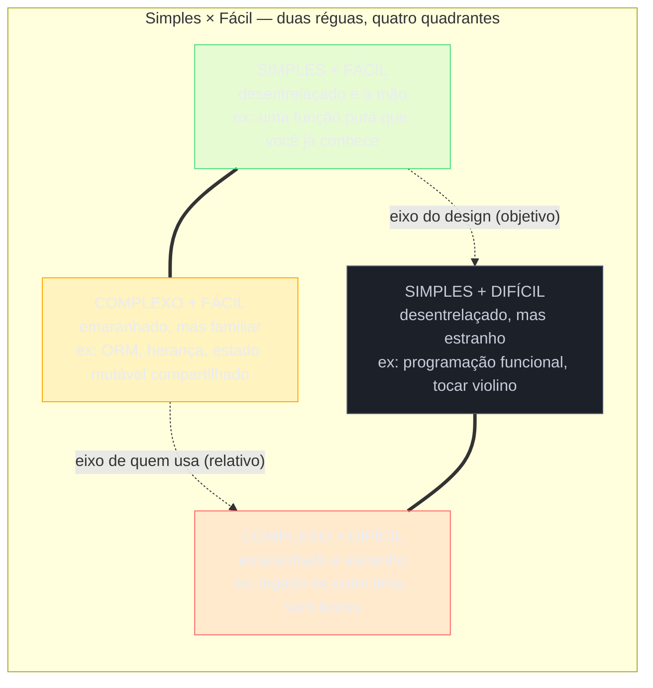
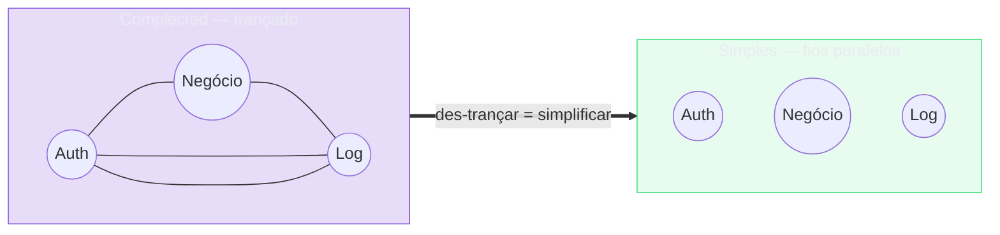
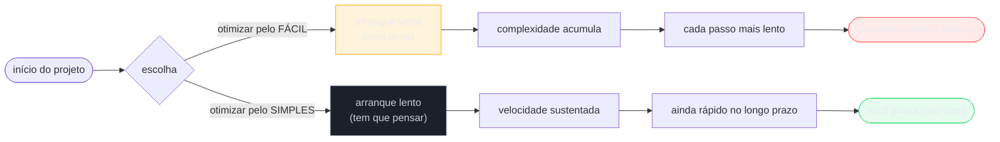
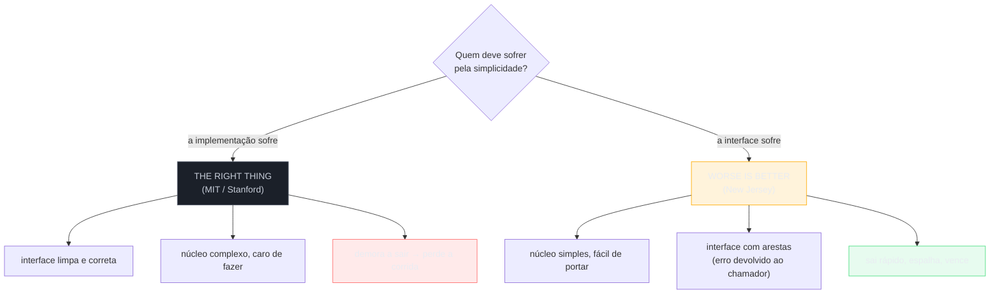

# Simplicidade não é facilidade

A nota anterior ([[02 - Complexidade essencial vs. acidental]]) fechou com uma postura de combate: contra o acidental, você **simplifica**. Mas o que é, exatamente, "simplificar"?

A palavra é traiçoeira. No dia a dia, a gente usa "simples" e "fácil" como sinônimos — "deixa mais simples", "facilita pra mim".

Rich Hickey passou uma palestra inteira mostrando que confundir os dois é a raiz de boa parte da complexidade que a gente mesmo cria. Esta nota faz esse corte.

> [!abstract] TL;DR
> Rich Hickey (*Simple Made Easy*, Strange Loop 2011) separa dois eixos que costumamos colar.
> - **Simple** (simples) é **objetivo** e fala de *estrutura*: vem de *simplex* — "uma dobra/trança", uma coisa sobre uma coisa só, **sem entrelaçamento**.
> - **Easy** (fácil) é **subjetivo e relativo** — vem da raiz de *adjacent*, "estar perto": perto da mão, do familiar, das nossas capacidades atuais.
>
> São eixos diferentes: algo pode ser simples e não fácil (desconhecido), ou fácil e não simples (familiar, mas emaranhado). O ato que cria complexidade é **complect** — entrelaçar, trançar coisas juntas. Simplicidade é a recusa deliberada de complect. A armadilha: a gente escolhe pelo *fácil* (o que já está perto) e paga em *complexidade* depois.

## O que é: dois eixos, não um

Hickey insiste que "simples" e "fácil" não são pontos numa mesma régua — são **duas réguas diferentes**. Vale ir à etimologia, porque é dela que ele tira a precisão.

**Simple** vem de *sim* + *plex*: "one fold or one braid or twist" — uma dobra, uma trança. O oposto seria muitas dobras trançadas.

Então simples é uma coisa que trata de **um papel, uma tarefa, um conceito, uma dimensão** do problema. E o critério, ele crava, é estrutural:

> [!quote] O que importa pra simplicidade
> *"...what matters for simplicity is that there is no interleaving."* — Rich Hickey, *Simple Made Easy* (2011)

Repare na palavra: **interleaving**, entrelaçamento. Simples não é sobre *quantidade* — é sobre *separação*. E, crucial, é uma propriedade **objetiva**: ou as coisas estão trançadas, ou não estão.

> [!quote] Simples é objetivo
> *"...if something is interleaved or not, that's sort of an objective thing... simple is actually an objective notion."* — Rich Hickey, *Simple Made Easy* (2011)

**Easy** vem de outro lugar inteiro: da raiz latina de *adjacent*, "estar perto, estar à mão". Hickey decompõe em três sentidos de "perto":

- perto fisicamente (já instalado, já no classpath);
- perto do nosso **entendimento** (familiar);
- perto das nossas **capacidades** atuais.

E daí vem a diferença decisiva: fácil é **relativo**.

> [!quote] Fácil é relativo
> *"...easy is relative. Right?... easy is always going to be, you know, easy for whom, or hard for whom? It's a relative term."* — Rich Hickey, *Simple Made Easy* (2011)

Simples é uma pergunta que você faz **ao design**. Fácil é uma pergunta que você faz **a si mesmo**. São interlocutores diferentes — e respostas que não se traduzem uma na outra.

*Leitura do diagrama*: o eixo horizontal (objetivo) mede **estrutura** — entrelaçado ou não; o eixo vertical (relativo) mede **distância** — perto ou longe de quem usa. O perigo mora no quadrante laranja: "complexo + fácil" parece confortável porque é familiar, e é justamente aí que a gente contrai dívida sem perceber.

> [!example] A analogia das duas réguas
> Pense em duas perguntas diferentes sobre uma ferramenta.
> - *"Ela mistura responsabilidades?"* — pergunta de **estrutura**, e a resposta é a mesma pra qualquer pessoa que olhe: ou mistura, ou não.
> - *"Eu já sei usar?"* — pergunta de **distância**, e a resposta muda conforme quem pergunta: o que é familiar pra mim é estranho pra você.
>
> A primeira régua mede *simple*; a segunda mede *easy*. Tocar violino é **simples** (cordas e um arco — sem nada entrelaçado) e ao mesmo tempo nada **fácil** (anos longe das suas capacidades). Já um framework que faz tudo com uma anotação mágica é **fácil** (já está à mão) e nem por isso **simples** (por dentro, mil coisas trançadas).

## A etimologia e o complecting: o verbo que fabrica complexidade

Se "simples" é a ausência de entrelaçamento, precisa existir um verbo pro ato de entrelaçar. Hickey ressuscita uma palavra inglesa antiga: **complect**.

> [!quote] Complect
> *"[to] complect... to interleave or entwine or braid."* — Rich Hickey, *Simple Made Easy* (2011)

Esse é o coração da tese. A complexidade não cai do céu — ela é **produzida**, toda vez que a gente trança duas preocupações que poderiam viver separadas.

- Misturar autenticação com lógica de negócio? Complecting.
- Amarrar a ordem de execução à correção do resultado? Complecting.
- Pôr estado e identidade no mesmo objeto mutável? Complecting.

Cada trança dessas adiciona um eixo a mais que você precisa segurar na cabeça ao mesmo tempo — e é exatamente esse "ao mesmo tempo" que destrói a capacidade de raciocinar sobre o sistema (o tema que abre toda a trilha em [[01 - A complexidade como problema central]]).

*Leitura do diagrama*: à esquerda, três preocupações **trançadas** — para mexer numa, você arrasta as outras juntas; nenhum fio sai inteiro. À direita, os mesmos três conceitos como **fios paralelos**: cada um pode ser puxado, entendido e trocado sozinho. Simplificar não é apagar fios; é desfazer as tranças.

Simplicidade, então, não é um estado mágico — é uma **disciplina negativa**: a recusa de complect.

Manter cada coisa sobre uma coisa só, *des*-trançada. Hickey chama isso de a única forma de a gente conseguir "reasonar" sobre software: você consegue pegar uma peça simples e entendê-la *sem* ter que arrastar junto todas as outras peças com que ela estaria entrelaçada.

> [!note] Conexão com a nota anterior
> Lembra do corte de Brooks em [[02 - Complexidade essencial vs. acidental]]? Boa parte da complexidade **acidental** nasce exatamente de complecting — a gente entrelaça preocupações que o domínio nunca pediu que fossem juntas. *Out of the Tar Pit* aponta o estado como o réu principal; Hickey diria que estado é complexo porque *complecta* valor com tempo/identidade. Recusar complect é a tática concreta por trás de "combater o acidental". Esta nota é a **postura de valor** que sustenta o galho inteiro: você gere complexidade *não complectando*.

## A lista de Hickey: o que costumamos complectar

A parte mais corajosa da palestra é o inventário. Hickey pega construções queridas do dia a dia e mostra, uma a uma, o que cada uma **trança**.

Não é uma cruzada moral — é um mapa de onde a complexidade entra escondida. Os pares dele (em inglês, com a glosa):

- **State** (estado) — *"complects value and time"*: você não consegue obter um valor independente do tempo.
- **Objects** (objetos) — *"complect state, identity, and value"*: misturam três coisas que você não consegue mais separar.
- **Methods** (métodos) — *"complect function and state"*, e às vezes namespaces também.
- **Syntax** (sintaxe) — *"complects meaning and order"*: o significado fica preso à ordem das palavras.
- **Inheritance** (herança) — *"complects types"*: dois tipos passam a ser inseparáveis, por definição.
- **Switch/matching** — trançam vários pares de "quem faz" e "o que acontece", todos no mesmo lugar fechado.
- **Vars/variáveis** — de novo, *valor* trançado com *tempo*, muitas vezes de forma inextricável.
- **Loops imperativos** — trançam *o que* você faz com *como* você faz.
- **Actors** — trançam *o que* vai ser feito com *quem* vai fazer.
- **ORM** — sobre o qual ele só desabafa: *"oh, my God complecting going on"*.
- **Conditionals** espalhados — as regras do programa ficam *"strewn all throughout"*, trançadas com a estrutura.

Repare que quase nada nessa lista é "errado". São ferramentas legítimas. O ponto de Hickey é mais fino: cada uma delas **traz uma trança embutida**, e a gente raramente para pra perguntar se aquela trança era necessária.

Do outro lado, ele oferece um **kit de simplicidade** — construções que tendem a manter os fios separados:

- **Values** (valores imutáveis) no lugar de objetos mutáveis;
- **Functions** (funções puras) no lugar de métodos;
- **Namespaces** explícitos;
- **Data** (dados como dados) no lugar de sintaxe especial;
- **Polymorphism a la carte** — declarar dados, declarar conjuntos de funções e *conectá-los* como três operações independentes;
- **Managed refs** (as refs de Clojure/Haskell) que *compõem* valor e tempo em vez de trançá-los;
- **Set functions** e **queues** (uma fila desacopla quem produz de quem consome);
- **Manipulação declarativa de dados** — SQL, Datalog, LINQ;
- **Rules** (regras reunidas num lugar) no lugar de conditionals espalhados.

> [!tip] Como usar a lista na prática
> Não decore os pares — internalize a pergunta que cada um responde: *"o que isto está trançando que eu poderia manter separado?"*. Um método trança função e estado; uma fila separa produtor de consumidor; um valor imutável separa o dado do tempo. A lista é menos um veredito e mais um detector: ela treina o olho pra enxergar a trança antes que ela vire dívida.

Há um corolário que Hickey faz questão de cravar: **testes, type-checkers e refactoring são "guardrails", não direção**.

Eles te dizem quando você saiu da pista — mas não dirigem o carro por você, e não tornam o sistema simples.

> [!quote] Os guardrails não dirigem
> A imagem de Hickey: confiar em testes e ferramentas pra "garantir" um sistema emaranhado é como dirigir uma estrada de montanha *"banging against the guardrails"* — você pode até chegar, mas não é assim que se dirige bem. Simplicidade vem do *design*, antes; as ferramentas só apanham o que escapou. — paráfrase de Rich Hickey, *Simple Made Easy* (2011)

Ou seja: nenhuma quantidade de cobertura de testes compra simplicidade. A simplicidade é uma decisão tomada *antes* de escrever a linha — escolhendo construções que não trançam — e não um selo que você passa por cima depois.

### Como achar a linha de corte: abstrair é "afastar"

"Recuse complect" é fácil de falar. Na prática, como você decide *onde* cortar a trança?

Hickey amarra simplicidade a **abstração** — mas não no sentido de "esconder", e sim na etimologia:

> [!quote] Abstrair é afastar
> *"Abstract means to draw something away... to draw away from the physical nature of something."* — Rich Hickey, *Simple Made Easy* (2011)

Abstrair, pra ele, é *separar* o **what** (o quê, a especificação) do **how** (o como, a implementação) — de modo que o "como" possa virar problema de outra pessoa, outra hora.

E ele dá um método de bolso: passe cada decisão pelo crivo de **who / what / how / when-where / why** e separe os aspectos.

- *What* — a operação, sem se misturar com quem a executa.
- *How* — a implementação, escondida atrás de um contrato de dados/polimorfismo.
- *Who* — quem fornece, declarado, não trançado no chamador.
- *When/where* — desacoplado por filas, refs gerenciadas.
- *Why* — as regras, reunidas, não espalhadas em conditionals.

Cada aspecto que você consegue nomear e separar é uma trança a menos. (Essa é a porta de entrada pra [[05 - Abstração - a ferramenta central]], onde a abstração ganha nota própria.) E, como Hickey faz questão de cravar, essa trança nunca é culpa da ferramenta — é escolha de quem construiu.

E ele aponta a raiz cultural de a gente cair nessa de novo e de novo: olhamos só pro lado bom.

> [!quote] Benefícios de tudo, tradeoffs de nada
> *"We look all for benefits... we're not looking carefully enough at the byproducts."* — Rich Hickey, *Simple Made Easy* (2011)

Avaliamos uma ferramenta pelo que ela *permite* fazer, raramente pelo que ela *trança* em troca. Daí a herança, o ORM, o estado mutável: adotados pelos benefícios, com os tradeoffs (a complexidade que vão produzir) invisíveis até cobrarem juros.

## A armadilha do fácil e a ilusão da velocidade

Aqui está a parte incômoda. Se simples e fácil são eixos diferentes, qual deles a gente usa pra decidir?

Hickey é direto: a indústria decide pelo **fácil**. Escolhemos a ferramenta familiar, a que já está à mão, a que deixa começar rápido. E faz sentido no curtíssimo prazo — fácil é, por definição, o caminho de menor resistência *agora*.

O problema é a fatura. Fácil otimiza o **começar**; simples otimiza o **continuar**.

A ferramenta fácil te deixa produtivo no minuto zero e te entrega um sistema entrelaçado no mês seis — quando o emaranhado que você não viu cobra juros em cada mudança. Simplicidade quase nunca é a escolha fácil de início: exige parar, pensar na estrutura, separar o que o atalho juntaria.

É um **investimento deliberado**, pago adiantado, contra um custo que só apareceria depois. E é aqui que mora a imagem mais forte da palestra: a corrida.

*Leitura do diagrama*: as duas trajetórias largam juntas. A de cima (fácil) dispara na frente e desacelera à medida que o emaranhado cobra juros; a de baixo (simples) larga devagar — você teve que *pensar* — mas mantém o ritmo e ultrapassa. O cruzamento das curvas é a tese inteira da palestra.

> [!quote] A corrida: arranque rápido, colapso lento
> *"If you focus on ease and ignore simplicity... you will be able to go as fast as possible from the beginning of the race. But no matter what technology you use... the complexity will eventually kill you."* — Rich Hickey, *Simple Made Easy* (2011)

E a ironia ácida sobre processo: trocar simplicidade por velocidade de partida é tratar a corrida como uma sequência de sprints curtos, em que a gente *"fire the starting pistol every hundred yards and call it a new sprint"* — comemorando o arranque de cada trecho e nunca olhando a maratona inteira, onde a complexidade acumulada é quem decide.

O viés é traiçoeiro porque os dois sentidos de "near" se reforçam: a ferramenta familiar (perto do entendimento) também costuma ser a já instalada (perto fisicamente). Tudo grita "use isto". Mas familiaridade não é uma propriedade do *design* — é uma propriedade *sua*, e temporária: o que é estranho hoje vira familiar com prática. Já o entrelaçamento é do design, e é permanente até alguém destrançar.

> [!tip] A pergunta que desarma a armadilha
> Antes de adotar algo, separe as duas perguntas que a gente costuma fundir:
> - *"isto é simples?"* — mistura preocupações? quantos eixos eu vou ter que segurar juntos?
> - *"isto é fácil?"* — eu já sei usar? já está à mão?
>
> Quando a resposta for "fácil, mas não simples", você ao menos sabe que está contraindo dívida — e pode decidir conscientemente, em vez de tropeçar nela.

## Simples não é "menos coisas"

Um último mal-entendido, e Hickey o ataca de frente: simples **não** quer dizer "poucas coisas". A confusão é natural — "simplificar" soa como "reduzir", "ter menos". Mas o critério nunca foi cardinalidade.

> [!quote] Cardinalidade não é entrelaçamento
> *"...it's important to distinguish cardinality, right, counting things from actual interleaving."* — Rich Hickey, *Simple Made Easy* (2011)

Ele dá o exemplo da interface: simples *"doesn't mean an interface that only has one operation"*.

- Uma interface com vinte operações, cada uma sobre uma coisa bem separada, é **simples**.
- Uma interface com uma operação só que faz três coisas trançadas é **complexa**.

O número de elementos é irrelevante; o que conta é se eles estão *entrelaçados* ou não.

Isso liberta. Você não precisa caber tudo numa caixinha minúscula pra ter simplicidade — uma coisa simples pode ser **bastante coisa**, desde que cada parte trate de uma preocupação só.

O alvo não é encolher o sistema; é *des*-trançá-lo. (E é por isso que "simplicidade" e "minimalismo" não são a mesma coisa: dá pra ser minimalista e emaranhado, e dá pra ser grande e impecavelmente separado.)

> [!tip] Por que a separação compra liberdade
> O retorno concreto de não-complectar é a **mudança barata**. Quando os fios estão separados, você troca um sem tocar nos outros: trocar a implementação sem mexer na interface, mudar a regra sem reescrever o fluxo, substituir o armazenamento sem reescrever o domínio. Hickey resume isso como a capacidade de *raciocinar* sobre uma peça isoladamente — e raciocinar isoladamente é exatamente o que permite *mudar* isoladamente. Um sistema simples não é o que tem menos código; é o que você consegue evoluir uma parte de cada vez. A simplicidade, nesse sentido, é a moeda da evolução de software ([[14 - Manutenção e evolução]]).

## As vozes clássicas: simplicidade como valor antigo

Hickey deu nome e etimologia, mas a ideia é velha. A engenharia de software vem repetindo, em variações, que simplicidade não é enfeite — é pré-requisito. Vale ouvir as vozes, porque cada uma ilumina um ângulo.

**Tony Hoare**, na palestra do Turing Award de 1980 (*The Emperor's Old Clothes*), cravou a formulação mais citada de todas:

> [!quote] Os dois jeitos de construir um design
> *"There are two ways of constructing a software design: one way is to make it so simple that there are obviously no deficiencies and the other way is to make it so complicated that there are no obvious deficiencies. The first method is far more difficult."* — C. A. R. Hoare, *The Emperor's Old Clothes* (Turing Award, 1980)

Repare na última frase: o jeito simples é *mais difícil*. É a tese desta nota dita em 1980 — simples não é fácil.

**Edsger Dijkstra** condensou a consequência: simplicidade não é estética, é confiabilidade.

> [!quote] Simplicidade é pré-requisito de confiabilidade
> *"Simplicity is prerequisite for reliability."* — atribuído a E. W. Dijkstra (ver nota de lastro abaixo)

**Antoine de Saint-Exupéry**, num registro poético que migrou pra engenharia, deu a definição negativa de perfeição:

> [!quote] A perfeição pela subtração
> *"Il semble que la perfection soit atteinte non quand il n'y a plus rien à ajouter, mais quand il n'y a plus rien à retrancher."* ("Parece que a perfeição é atingida não quando não há mais nada a acrescentar, mas quando não há mais nada a retirar.") — Antoine de Saint-Exupéry, *Terre des Hommes* (1939)

**Brian Kernighan** trouxe o argumento pro chão da depuração — e contra a esperteza:

> [!quote] Esperteza demais te trava no debug
> *"Everyone knows that debugging is twice as hard as writing a program in the first place. So if you're as clever as you can be when you write it, how will you ever debug it?"* — Kernighan & Plauger, *The Elements of Programming Style* (2ª ed., 1978)

**Alan Perlis**, nos *Epigrams on Programming* (1982), deixou dois aforismos que conversam direto com Hickey:

> [!quote] Perlis sobre a complexidade
> *"Fools ignore complexity. Pragmatists suffer it. Some can avoid it. Geniuses remove it."* *"Simplicity does not precede complexity, but follows it."* — Alan J. Perlis, *Epigrams on Programming* (1982)

O segundo é especialmente afiado: a simplicidade boa não é a ingênua do começo — é a que você *conquista* depois de entender a complexidade do problema.

E há o slogan popular, o **KISS** ("Keep it simple, stupid"), atribuído a Kelly Johnson, engenheiro-chefe da Lockheed Skunk Works (U-2, SR-71). Johnson não falava de código: falava de jatos que tinham que ser consertados por um mecânico comum, com ferramentas básicas, em condições de combate. A simplicidade ali era sobrevivência operacional — não elegância.

O fio que costura todas essas vozes é o mesmo: **simplicidade não é estética, é função**.

Hoare a liga à *ausência de defeitos*. Dijkstra (ou Hoare, de novo) à *confiabilidade*. Kernighan à *capacidade de depurar*. Perlis à *genialidade que remove em vez de tolerar*. Saint-Exupéry à *perfeição pela subtração*.

Nenhum deles diz "simples é bonito". Todos dizem, em alguma chave: **simples é o que sobrevive ao tempo, ao erro e à manutenção** — exatamente o eixo que Hickey chamaria de "continuar" em oposição a "começar". É a mesma tese, repetida por sessenta anos com sotaques diferentes.

> [!note] O lastro de cada citação importa
> Algumas dessas frases são sólidas; outras são lendárias. **A atribuição de "Simplicity is prerequisite for reliability" a Dijkstra (EWD498) é disputada**: a frase é repetida à exaustão como dele, mas pesquisadores notam que ela não aparece no corpo do EWD498, e há indícios de que a formulação original ("for reliability, simplicity is an absolute prerequisite") venha de uma fala de Hoare em 1975. Atribua com cautela. E há a quase-citação famosa **"Everything should be made as simple as possible, but not simpler"**, sempre colada em Einstein: é **apócrifa**. O que Einstein de fato escreveu é mais longo e cauteloso — algo como tornar os elementos básicos *"as simple and as few as possible without having to surrender the adequate representation of a single datum of experience"*. A versão curta é um resumo popular, não uma frase dele. (Por isso ela não vira um callout de citação aqui — só esta menção honesta.)

## Worse is Better: o contraponto que complica o conto

Toda nota sobre simplicidade que se respeite precisa encarar um espinho: **simplicidade de quê?**. Porque existe uma simplicidade *da interface* e uma simplicidade *da implementação* — e elas podem brigar.

Esse é o tema do ensaio mais provocador da história da engenharia de software: **"The Rise of Worse is Better"**, de Richard P. Gabriel (1991, originalmente parte de *Lisp: Good News, Bad News, How to Win Big*).

Gabriel contrasta duas filosofias de design, cada uma rankeando quatro qualidades — **Simplicity, Correctness, Consistency, Completeness** — em ordens diferentes.

A **abordagem MIT/Stanford** ("the right thing"):

> [!quote] The Right Thing — simplicidade da interface
> *"...the design must be simple, both in implementation and interface. It is more important for the interface to be simple than the implementation."* — Richard P. Gabriel, *The Rise of Worse is Better* (1991)

A **abordagem New Jersey** ("worse is better"):

> [!quote] Worse is Better — simplicidade da implementação
> *"...the design must be simple, both in implementation and interface. It is more important for the implementation to be simple than the interface. Simplicity is the most important consideration in a design."* — Richard P. Gabriel, *The Rise of Worse is Better* (1991)

A diferença cabe numa palavra: **quem paga pela simplicidade?**.

- No "right thing", a *implementação* sofre pra que a *interface* fique limpa — quem usa tem vida fácil, quem mantém o código sofre.
- No "worse is better", a *interface* sofre pra que a *implementação* fique simples — quem mantém tem vida fácil, quem usa engole as arestas.

E não para na simplicidade. As outras três qualidades também invertem de prioridade entre as escolas — e é aí que a coisa fica picante:

- **Correctness** (correção): no "right thing", incorreção *não é permitida*; no "worse is better", Gabriel chega a escrever que é *"slightly better to be simple than correct"* — melhor simples do que correto, se a correção custar implementação complexa.
- **Consistency** (consistência): o MIT sacrifica um pouco de simplicidade e completude pra nunca ser inconsistente; o New Jersey *abandona* casos raros e inconsistências antes de complicar a implementação.
- **Completeness** (completude): o MIT cobre todos os casos razoáveis; o New Jersey corta completude *"sempre que a simplicidade de implementação estiver em risco"*.

Ou seja: as duas escolas concordam que simplicidade importa — e discordam de tudo o que vem depois dela.

*Leitura do diagrama*: a pergunta de cima divide o mundo. À esquerda, o ideal do MIT empurra a complexidade pra dentro da implementação e entrega uma interface impecável — mas demora tanto que perde mercado. À direita, o pragmatismo de New Jersey simplifica o núcleo, vaza a complexidade pra interface, e justamente por ser fácil de portar e shippar, **vence**.

O exemplo clássico de Gabriel é a chamada de sistema interrompida (o *"PC-losering problem"*). O "right thing" mandaria o sistema desfazer tudo e voltar o program counter, escondendo a interrupção de quem chama. O Unix, mais "worse", simplesmente devolve um código de erro e manda o programa *tentar de novo* — implementação trivial, interface mais chata.

E a profecia de Gabriel — que Unix e C venceriam Lisp justamente *por serem piores* — se cumpriu. O argumento: um sistema que entrega *"50%-80% of what you want"*, é simples de implementar e fácil de portar, espalha como vírus; quando ele já está em todo lugar, os usuários *"have already been conditioned to accept worse"*, e o sistema melhora aos poucos. O "right thing", grande e perfeito, chega tarde demais.

> [!note] Como Worse is Better conversa com Hickey
> Hickey e Gabriel não se contradizem — eles miram alvos diferentes. Hickey fala da simplicidade da **estrutura** (entrelaçamento), que é objetiva e atemporal. Gabriel fala de uma **escolha política**: entre duas simplicidades legítimas, qual você prioriza, e o que essa escolha faz com a *adoção* do sistema no mundo real. A lição combinada é desconfortável: o sistema mais simples *por dentro* (worse is better) frequentemente expõe uma interface mais emaranhada *por fora* — e ainda assim vence, porque "vencer" depende de espalhar, não de ser elegante. Simplicidade é um valor; mas qual simplicidade, e a serviço de quê, é uma decisão que você não escapa de tomar.

## Simples-mas-não-fácil × fácil-mas-não-simples

A teoria fica mais nítida em exemplos. Os dois quadrantes perigosos do primeiro diagrama, com nome e sobrenome.

**Simples, mas não fácil** (vale a pena, custa aprender):

- **Programação funcional / imutabilidade** — separar valor de tempo é estruturalmente simples, mas exige desaprender o hábito de mutar. Estranho no começo, limpo pra sempre.
- **Clojure / managed refs** — a própria linguagem de Hickey: poucos conceitos, mas longe da familiaridade de quem vem de OO.
- **O modelo de objetos do Git** — blobs, trees, commits, refs: quatro coisas que apontam umas pras outras, cada uma sobre uma preocupação só. Conceitualmente simples, notoriamente *não* fácil de aprender.

**Fácil, mas não simples** (conforta agora, cobra depois):

- **Herança profunda** — *"complects types"* (Hickey): super-rápida de escrever, e amarra tipos que você não consegue mais separar.
- **ORMs** — *"oh, my God complecting going on"*: começar é trivial, e o emaranhado objeto-relacional vaza em cada query não-trivial.
- **Frameworks "mágicos"** — uma anotação faz tudo: à mão e familiar, com mil coisas trançadas por baixo do tapete.
- **Estado mutável compartilhado** — o atalho universal, e o complecter-mor: valor, tempo e identidade no mesmo lugar (a ponte direta pra [[02 - Complexidade essencial vs. acidental]] via *Out of the Tar Pit*).

> [!example] O teste de bolso
> Da próxima vez que uma ferramenta parecer "óbvia" de adotar, desconfie do conforto. Pergunte: *esse conforto é porque ela é simples (desentrelaçada) ou porque ela é familiar (perto de mim)?*. Se for só familiaridade, você está no quadrante laranja — fácil agora, caro depois.

## Armadilhas comuns

> [!warning] "Incidental is Latin for your fault"
> Hickey é cruel com a desculpa de que "a complexidade veio da ferramenta": *"It wasn't part of what the user asked us to do. We chose a tool. It had some inherent complexity in it... Incidental is Latin for your fault."* Complexidade acidental não é um acidente meteorológico — é uma **escolha** sua de construção. A ponte direta pro corte de Brooks em [[02 - Complexidade essencial vs. acidental]]: o acidental é exatamente o que você adicionou, e portanto o que você pode retirar.

> [!warning] Fácil de começar não é simples de manter
> O viés é traiçoeiro porque os dois sentidos de "near" se reforçam: a ferramenta familiar (perto do entendimento) também costuma ser a já instalada (perto fisicamente). Tudo grita "use isto".
>
> Mas familiaridade não é uma propriedade do *design* — é uma propriedade *sua*, e temporária: o que é estranho hoje vira familiar com prática. Já o entrelaçamento é do design, e é permanente até alguém destrançar.
>
> Trocar simplicidade por facilidade é hipotecar a estrutura do sistema pra economizar na curva de aprendizado de quem escreve. Hickey: a gente acaba com sistemas que são fáceis de *escrever* e impossíveis de *raciocinar*.

> [!warning] O quadrante traiçoeiro não é o difícil — é o confortável
> Note que o perigo real não está em "complexo + difícil" (legado horrível): esse pelo menos *grita* que é problema, e ninguém o adota de bom grado. O perigo está em "complexo + fácil": a herança que você escreve em trinta segundos, o ORM que começa lindo, o framework que esconde a trança atrás de uma anotação. Eles **não doem na hora** — e por isso passam pela revisão de código sem resistência. A complexidade entra de fininho, vestida de produtividade. É por isso que Hickey insiste que simplicidade exige *vigilância ativa*: o atalho complexo é sempre o que parece mais amigável.

## Inglês

O vocabulário de *Simple Made Easy* não é ornamento — é a própria ferramenta de análise de Hickey. Boa parte da precisão da palestra desaparece na tradução, porque português tem menos réguas do que inglês pra essa distinção.

O caso mais gritante é **simple vs. easy**. Em português, "simples" e "fácil" convivem como quase-sinônimos no uso comum — "deixa mais simples" e "facilita" apontam pra mesma sensação de alívio. Em inglês, a distinção também não é óbvia por padrão (é por isso que a palestra precisa existir); mas a língua pelo menos oferece duas palavras com raízes etimológicas separáveis (*simplex* vs. *adjacent*) que Hickey consegue puxar e opor. Em português, o par mais próximo seria "simples" vs. "cômodo/conveniente" — mas nenhum tradutor usa isso, porque soaria estranho, e a nota inteira existe justamente porque essa opacidade cobra um preço.

**To complect** merece nota à parte: não é uma palavra do inglês corrente — é um arcaísmo que Hickey desenterrou do dicionário e ressuscitou pra ter um verbo técnico específico. Um falante nativo de inglês, fora do círculo de quem viu a palestra, provavelmente nunca ouviu o verbo. Por isso, em entrevista ou em code review, dizer "isso está complecting duas coisas que deveriam estar separadas" funciona como senha: sinaliza que você conhece a fonte, não é jargão genérico que qualquer um usaria por acaso.

| Português | Inglês |
|---|---|
| simples (estrutural, objetivo) | simple |
| fácil (relativo, subjetivo) | easy |
| entrelaçar, trançar | to complect |
| entrelaçamento, trança | interleaving / braid |
| grades de proteção (testes/tipos que só apanham o erro) | guardrails |
| acidental (a complexidade que você mesmo introduziu) | incidental |
| cardinalidade (número de elementos) | cardinality |
| afastar, tirar de perto (abstrair) | to abstract, to draw away |

## Em entrevista

Se cair "qual a diferença entre simples e fácil?", a resposta curta que mostra senioridade:

- **Simples** é objetivo e estrutural — fala de *entrelaçamento* (Hickey: *complect*). Algo é simples quando cada parte trata de uma preocupação só, independente de eu saber usar.
- **Fácil** é subjetivo e relativo — fala de *distância* (familiar, à mão, dentro das minhas capacidades).
- A armadilha é decidir pelo fácil e pagar em complexidade: fácil otimiza o *começar*, simples otimiza o *continuar*.
- Bônus de profundidade: cite **Worse is Better** (Gabriel) pra mostrar que "simplicidade" se bifurca em *interface* vs. *implementação*, e que a escolha entre elas é política, não técnica.

## O que vem a seguir

Recusar complect resolve metade do problema. A outra metade é saber, na hora de desfazer uma trança, *por que* ela foi feita — porque quase nenhum entrelaçamento nasce de acidente puro. Alguém amarrou estado a tempo, ou lógica de negócio a autenticação, tentando resolver um problema real, com as informações e pressões que tinha naquele momento.

O problema é que essa razão raramente sobrevive no código. O commit que juntou as duas coisas não deixou um comentário explicando o porquê; o autor mudou de time, ou simplesmente esqueceu. O que resta é a trança — sem o mapa de por que ela foi amarrada assim.

Peter Naur tem um nome pra esse "porquê" que evapora: a **teoria do programa**. Não é a documentação, nem os testes, nem o próprio texto do código — é o entendimento vivo, que existe só na cabeça de quem construiu (ou manteve) o sistema, do porquê ele é *desse jeito* e não de outro.

É a peça que faltava nesta nota: complecting é o que se faz; a teoria é o que explica por que se fez, e é sobre ela que fala a próxima nota, [[04 - O programa como teoria]].

## Referências

> [!tip] Assista — "Simple Made Easy" — Rich Hickey (2011)
> **Strange Loop** · 1h01 · ["Simple Made Easy" — Rich Hickey (2011)](https://www.youtube.com/watch?v=SxdOUGdseq4) A palestra canônica, e a origem de tudo que esta nota discute. Vale assistir inteira pelo menos uma vez: a distinção simple × easy, o verbo *to complect* e a crítica ao que é "fácil de escrever agora" saem daqui na formulação original.

- **Rich Hickey** — *Simple Made Easy* (Strange Loop, setembro de 2011; a palestra foi reprisada em outras conferências depois). A distinção simple/easy, as etimologias (*simplex* = "one fold or braid"; *easy* da raiz de *adjacent* = "lie near"), o verbo *complect* ("to interleave or entwine or braid"), o caráter objetivo de simples vs. relativo de fácil, a lista de construções que *complectam* (state/objects/methods/syntax/inheritance/switch/vars/loops/actors/ORM/conditionals), o kit de simplicidade (values/functions/namespaces/data/polymorphism a la carte/managed refs/queues/declarative), abstração como "draw something away" e o crivo *who/what/how/when-where/why*, os testes/types como "guardrails" e não direção, "incidental is Latin for your fault", a cegueira de "benefícios de tudo, tradeoffs de nada", a corrida (fácil arranca rápido e colapsa; simples sustenta) e a separação entre cardinalidade e entrelaçamento. [Vídeo + transcrição (InfoQ)](https://www.infoq.com/presentations/Simple-Made-Easy/) · [Página da Strange Loop](https://www.thestrangeloop.com/2011/simple-made-easy.html) · [Transcrição (talk-transcripts)](https://github.com/matthiasn/talk-transcripts/blob/master/Hickey_Rich/SimpleMadeEasy.md)
- **C. A. R. Hoare** — *The Emperor's Old Clothes* (Turing Award Lecture, 1980; *Communications of the ACM*, fev. 1981). "Two ways of constructing a software design... so simple that there are obviously no deficiencies... The first method is far more difficult." [Wikiquote](https://en.wikiquote.org/wiki/C._A._R._Hoare) · [The Morning Paper — resumo](https://blog.acolyer.org/2016/09/07/the-emperors-old-clothes/)
- **Richard P. Gabriel** — *The Rise of "Worse is Better"* (1991; trecho de *Lisp: Good News, Bad News, How to Win Big*). As quatro qualidades (Simplicity/Correctness/Consistency/Completeness), o contraste MIT/"the right thing" × New Jersey/"worse is better", a simplicidade da interface vs. da implementação, o *PC-losering problem* e o argumento da disseminação. [Dreamsongs (texto original)](https://www.dreamsongs.com/RiseOfWorseIsBetter.html) · [Wikipedia](https://en.wikipedia.org/wiki/Worse_is_better)
- **Edsger W. Dijkstra** — "Simplicity is prerequisite for reliability", comumente atribuída ao EWD498 (1975). **Atribuição disputada** (ver lastro): a frase pode derivar de uma formulação de Hoare em 1975. [Wikiquote](https://en.wikiquote.org/wiki/Edsger_W._Dijkstra)
- **Antoine de Saint-Exupéry** — *Terre des Hommes* (1939), cap. III. "Il semble que la perfection soit atteinte... quand il n'y a plus rien à retrancher." [Wikiquote](https://en.wikiquote.org/wiki/Antoine_de_Saint_Exup%C3%A9ry)
- **Brian W. Kernighan & P. J. Plauger** — *The Elements of Programming Style* (2ª ed., 1978). "Debugging is twice as hard as writing a program in the first place..." [Wikiquote](https://en.wikiquote.org/wiki/Brian_Kernighan)
- **Alan J. Perlis** — *Epigrams on Programming*, *ACM SIGPLAN Notices* 17(9), set. 1982. "Fools ignore complexity..."; "Simplicity does not precede complexity, but follows it." [Yale — Perlisisms](https://www.cs.yale.edu/homes/perlis-alan/quotes.html)
- **KISS principle** — atribuído a Kelly Johnson (Lockheed Skunk Works); termo em uso popular já por volta de 1970. [Wikipedia](https://en.wikipedia.org/wiki/KISS_principle)

> [!note] Sobre o lastro das afirmações
> As citações literais de Hickey — *"what matters for simplicity is that there is no interleaving"*, *"simple is actually an objective notion"*, *"easy is relative... easy for whom"*, *complect* = *"to interleave or entwine or braid"*, *"distinguish cardinality... from actual interleaving"* (com o *"doesn't mean an interface that only has one operation"*), os verbos de *complecting* da lista (state/objects/methods/etc.), as frases sobre abstração (*"abstract means to draw something away"*), os tradeoffs (*"we look all for benefits... we're not looking carefully enough at the byproducts"*), *"incidental is Latin for your fault"* e as frases da corrida (*"go as fast as possible from the beginning... the complexity will eventually kill you"*; *"fire the starting pistol every hundred yards"*) — foram extraídas da transcrição da palestra (talk-transcripts no GitHub) na pesquisa que alimentou esta nota, não de memória. A imagem dos *"guardrails"* (testes/types apanham o que escapou, mas não dirigem) é parafraseada da mesma palestra, não citada ao pé da letra — por isso aparece marcada como paráfrase no corpo. As etimologias e o venue/ano (Strange Loop 2011) foram conferidos contra a mesma transcrição e a página oficial da conferência.
>
> As frases de Hoare, Saint-Exupéry (original francês), Kernighan e Perlis foram conferidas via web nas fontes linkadas. **Duas ressalvas de honestidade**: (1) "Simplicity is prerequisite for reliability" é amplamente atribuída a Dijkstra/EWD498, mas a atribuição é *disputada* — a frase não consta do corpo do EWD498 e pode vir de Hoare (1975); tratei como atribuição, não fato. (2) "Everything should be made as simple as possible, but not simpler" é **apócrifa** de Einstein — o que ele de fato escreveu é mais longo e qualificado; por isso ela aparece só como menção, sem virar citação destacada.
>
> As citações de Gabriel (Worse is Better) saíram do texto original em dreamsongs.com. A leitura de que Worse-is-Better é uma "escolha política entre duas simplicidades" e o framing de que esta nota é a "postura de valor por trás do galho" são interpretações minhas, não falas dos autores.

## Veja também

- [[02 - Complexidade essencial vs. acidental]] — o corte de Brooks; complecting é uma das fábricas de complexidade acidental
- [[04 - O programa como teoria]] — por que o entendimento (e a desentranhação) mora nas pessoas, não no código
- [[05 - Abstração - a ferramenta central]] — abstrair é "afastar"; o método who/what/how pra achar a linha de corte
- [[08 - Carga cognitiva e legibilidade]] — o que o entrelaçamento cobra na cabeça de quem lê
- [[06 - Abstrações que vazam]] — quando o esconderijo da complexidade falha por baixo
- [[14 - Manutenção e evolução]] — simplicidade como moeda da mudança barata
- [[Dicionário de Ciência da Computação]] — verbetes do domínio
