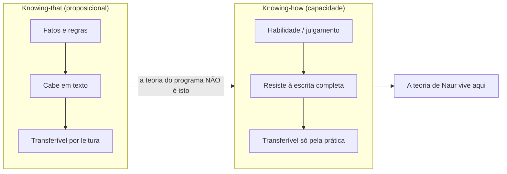
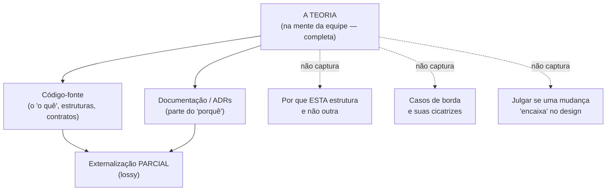
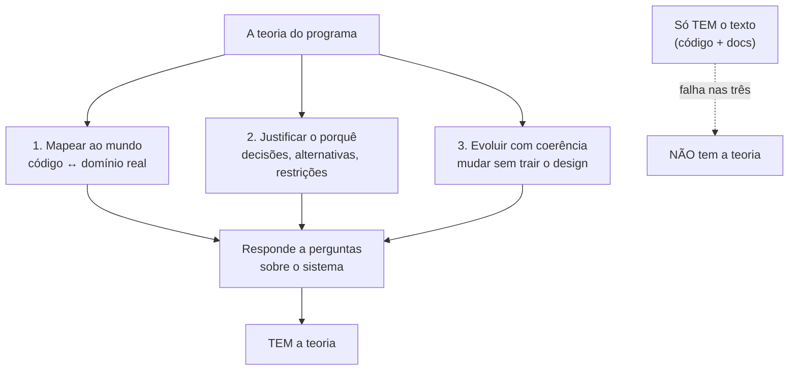
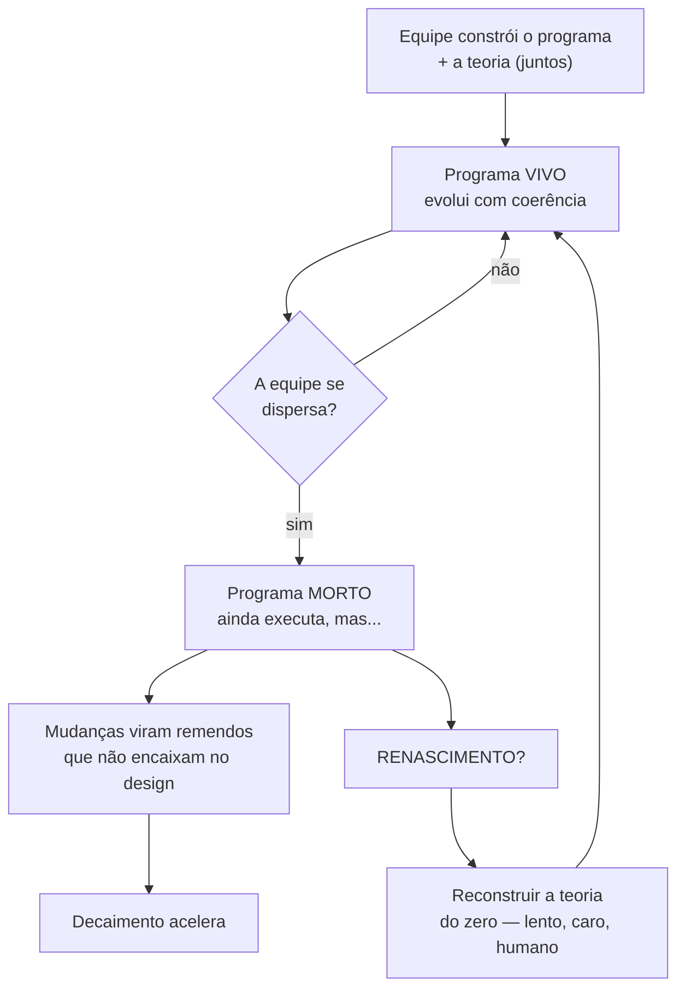

# O programa como teoria

Imagine que toda a sua equipe sênior ganha na loteria amanhã e some.

O código continua lá. Compila, sobe em produção, atende clientes. Mas, na primeira mudança de requisito não-trivial, ninguém consegue tocá-lo sem medo de quebrar três coisas que não entende.

O programa não morreu por falta de código. Morreu por falta de uma coisa que nunca esteve no repositório.

A tese de **Peter Naur** é que essa coisa é o produto de verdade da programação.

Programar não é produzir texto (código). É **construir uma teoria** — um conhecimento em grande parte tácito que vive na mente de quem desenvolve, não no artefato.

> [!abstract] TL;DR
> Em *Programming as Theory Building* (1985), Peter Naur argumenta que o produto real da programação não é o código, mas a **teoria** que os desenvolvedores formam: como o programa corresponde ao mundo, por que está estruturado assim, e como evoluí-lo de forma coerente. Código e documentação são externalizações *parciais* dessa teoria. Quando a equipe que a detém se dispersa, o programa "morre" — ainda compila, mas ninguém consegue modificá-lo com segurança. Reviver não é ler a documentação: é **reconstruir a teoria**, trabalho lento e humano. É a base teórica do [[11 - Dívida cognitiva|débito cognitivo]].

## O que é: programar é construir uma teoria

Vale saber de onde vem a tese. **Peter Naur** (1928–2016) foi um cientista da computação dinamarquês — editor do relatório do ALGOL 60, vencedor do Prêmio Turing (2005) e defensor incansável da *datalogy*: o estudo dos dados e da prática humana, não só da máquina.

Não é, portanto, um romântico anti-técnico. É alguém do coração da computação formal dizendo que a parte que mais importa não é formalizável por inteiro.

Naur escreveu o ensaio em 1985 contra uma ideia dominante. A ideia de que programar é, no fundo, *fabricar* um artefato — o código — e que a documentação seria o registro fiel desse artefato.

A tese central inverte isso: **programar é construir uma teoria, não produzir texto.**

O que ele chama de "teoria" não é um documento nem um conjunto de fórmulas. É a compreensão viva que a equipe forma sobre o sistema:

- como ele se comporta;
- por que tem a forma que tem;
- como mudá-lo sem que se desfaça.

O código-fonte e a documentação são, no máximo, **externalizações parciais** dessa teoria. São registros *com perda* (*lossy*).

A teoria de verdade mora na cabeça dos programadores.

Repare na consequência imediata. Se o ativo é a teoria, então o que importa preservar não é só o repositório — é a *mente* que sabe lê-lo.

## *Knowing-that* vs. *knowing-how*: a teoria no sentido de Ryle

Naur empresta o conceito de "teoria" do filósofo **Gilbert Ryle** (*The Concept of Mind*, 1949).

Ryle separa dois tipos de conhecimento:

- **Knowing-that** (saber proposicional) — saber *que* algo é o caso. Fatos, regras, enunciados. Cabe num texto: "a função `calcularJuros` usa juros compostos".
- **Knowing-how** (saber-fazer) — uma *capacidade*. Saber andar de bicicleta, diagnosticar um bug, julgar se uma mudança "encaixa" no design. Não se reduz a uma lista de proposições.

Ter uma "teoria" de algo, no sentido de Ryle, é do segundo tipo: é a **capacidade** de explicar, justificar e responder a situações novas — não a posse de um texto.

Um exemplo de software deixa a distinção concreta. Você pode memorizar (saber-*que*):

- "este serviço publica eventos numa fila quando um pedido é criado".

Mas a teoria é saber-*como*:

- *prever* o que vai quebrar se você trocar a fila por chamada síncrona;
- *farejar* que aquele `try/catch` silencioso esconde um caso de borda real;
- *julgar*, diante de uma feature nova, se ela cabe no design ou o trai.

O primeiro item cabe num wiki. Os outros três são uma capacidade que se forma fazendo — e que some quando a pessoa que a tinha vai embora.

> [!quote] Ryle, sobre o erro intelectualista
> Ryle ataca o que chama de *intellectualist legend*: a ideia de que toda ação inteligente vem de primeiro consultar uma regra (proposição) na mente e depois executá-la.
>
> O **argumento da regressão**: se agir com inteligência exigisse antes pensar numa regra, então *pensar nessa regra com inteligência* exigiria consultar outra regra antes — e assim ao infinito. A inteligência, conclui Ryle, se manifesta *na própria ação*, não num passo anterior a ela.

Por que isso importa para software? Porque mostra que o "saber programar este sistema" é irredutível a qualquer manual. Não é um texto que faltou escrever; é uma capacidade que se forma fazendo.

Leitura do diagrama: a documentação consegue capturar o lado esquerdo (*knowing-that*), mas a teoria do programa é uma capacidade — o lado direito —, e é por isso que ler tudo não basta.

## Por que a teoria não cabe na documentação

A teoria é majoritariamente **tácita**.

Aqui entra **Michael Polanyi** (*The Tacit Dimension*, 1966) e seu lema célebre: **"sabemos mais do que conseguimos dizer"** (*we can know more than we can tell*).

O ponto de Polanyi é que há sempre uma camada de conhecimento que opera *por baixo* da fala — e que nem mesmo um especialista honesto consegue verbalizar por inteiro, por mais que tente.

Isso é o que hoje se chama **paradoxo de Polanyi**: tarefas que executamos com fluência intuitiva, mas cujas regras não sabemos enunciar.

Aplicado ao código, o resultado é direto.

A documentação e o código conseguem registrar *parte* do "o quê":

- *o quê* o sistema faz;
- *quais* são as entidades, as rotas, os contratos.

Mas o "porquê" e a capacidade de julgar mudanças coerentes resistem à externalização completa:

- *por que* esta fila existe em vez de uma chamada síncrona?
- *por que* este caso de borda esquisito está tratado assim — que bug de produção ele cicatriza?
- esta nova feature *encaixa* no design ou o trai?

Por que isso acontece?

Polanyi explica com uma distinção fina. Em todo saber-fazer há uma estrutura **"de-para"** (*from-to*):

- estamos **focalmente** atentos ao todo — andar de bicicleta, ler o sistema;
- e nos apoiamos **subsidiariamente** em mil particulares que *não* olhamos diretamente — o equilíbrio, os reflexos, o "cheiro" de uma parte do código.

O detalhe cruel: se você vira a atenção para os particulares subsidiários, a performance se desfaz. Foque nos dedos enquanto digita e você trava.

É por isso que pedir ao sênior "escreva tudo o que você sabe sobre este sistema" não funciona.

Boa parte do que ele sabe só opera enquanto permanece subsidiário — vira inútil no instante em que é forçado a virar texto.

Por melhor que seja a documentação, ela nunca transmite a teoria por inteiro. Ela **ajuda quem já está reconstruindo a teoria** — serve de andaime —, mas não a substitui.

Leitura do diagrama: setas cheias são o que se consegue externalizar; setas pontilhadas são o que se perde no caminho da mente para o artefato — e é justamente esse resíduo que distingue quem *tem* a teoria de quem só *tem* o texto.

## As três capacidades da teoria

A teoria que um desenvolvedor tem de um programa lhe permite fazer três coisas. Naur as enumera, e elas são o teste prático de quem "tem a teoria":

1. **Mapear o programa ao mundo** — explicar como o software se relaciona com o problema do mundo real que ele resolve; como cada parte do código corresponde aos assuntos do domínio.
2. **Justificar a estrutura (o "porquê")** — explicar por que cada parte do programa está ali e como contribui para a solução; quais decisões foram tomadas, contra quais alternativas e sob quais restrições.
3. **Evoluir com coerência** — responder *construtivamente* a demandas de modificação e extensão; estender o programa de modo consistente com seu design, sem violá-lo.

Quem tem a teoria responde a essas três coisas. Quem só tem o texto, não.

E aqui está o sinal clínico de Naur para a "morte" do programa.

O estado de morte fica visível quando demandas de modificação **não podem mais ser respondidas com inteligência** — só com remendos às cegas.

Leitura do diagrama: as três capacidades convergem na habilidade de responder com sentido a qualquer pergunta sobre o sistema — e é exatamente essa habilidade que falta a quem herdou só o repositório.

## A morte e o renascimento do programa

O corolário mais citado de Naur: **um programa morre quando a equipe que detém sua teoria se dispersa.**

Repare na palavra "morre". O programa pode estar rodando perfeitamente em produção e, ainda assim, estar morto no sentido de Naur.

A morte aqui não é o *crash*. É a perda da capacidade de evoluí-lo com segurança.

O que resta é texto. Ele ainda executa.

Mas modificações feitas por quem não tem a teoria tendem a ser **remendos que não se encaixam no design**, degradando o sistema mudança após mudança. (É o motor do [[13 - Entropia de software e decaimento|decaimento]].)

E reviver? Reviver não é ler a documentação.

> [!quote] Naur
> "Revival of a program is the rebuilding of its theory by a new programmer team."

Reconstruir a teoria é trabalho lento, caro e que **só pessoas podem fazer**. Não se baixa de um repositório.

Leitura do diagrama: a única seta que devolve um programa morto à vida é a da reconstrução da teoria por pessoas — e ela é cara justamente porque refaz o trabalho cognitivo que o código não guardou.

## O caso de Naur: o compilador e a equipe que tinha o texto, mas não a teoria

A força do ensaio vem de um exemplo real que Naur descreve.

Um grupo **A** desenvolveu um compilador para uma linguagem L, e ele funcionava bem. Outro grupo **B** recebeu a tarefa de estender esse compilador para L + M — uma extensão modesta.

O grupo B teve *toda* a ajuda que se poderia pedir:

- documentação completa, com textos de programa anotados;
- farta discussão escrita de design;
- e aconselhamento pessoal do grupo A.

Mesmo assim, quando B propunha como acomodar as extensões e submetia ao grupo A para revisão, em vários casos importantes acontecia o mesmo.

As soluções de B **ignoravam recursos que já estavam na estrutura do compilador** — e que estavam, inclusive, *documentados*.

Em vez de usá-los, B propunha *remendos* — patches que destruíam a potência e a simplicidade do design original.

A documentação estava toda ali. O grupo B a tinha lido. E ainda assim não conseguia estender o sistema com coerência — porque não tinha *construído a teoria*. Tinha o texto; faltava a capacidade.

Esse é o ensaio inteiro em miniatura: o "o quê" estava escrito; o "porquê" e o julgamento de coerência não cabiam no papel.

## Consequências práticas: o payoff sênior

Naur escreveu sobre filosofia da mente, mas a tese explica problemas concretos que todo time grande vive. Cada um deles vira óbvio quando você troca "código" por "teoria".

### Por que grandes *rewrites* fracassam

Reescrever do zero descarta o código — e, com ele, a teoria sedimentada nos casos de borda.

Joel Spolsky chamou a reescrita do Netscape de "o pior erro estratégico que uma empresa de software pode cometer".

O argumento dele casa exatamente com Naur. As partes "feias" e *crufty* do código costumam ser **conhecimento duramente ganho** sobre bugs e cantos do problema.

Cada esquisitice é a cicatriz de um caso real. Apagar o código apaga a cicatriz — e o bug volta.

Na linguagem de Naur, o *rewrite* joga a teoria fora e obriga a reconstruí-la do zero — enquanto a concorrência avança.

O código novo é "limpo" justamente porque ainda não aprendeu nada. (Liga a [[10 - Dívida técnica]].)

A lição não é "nunca reescreva" — é "saiba que você está pagando para reconstruir uma teoria, não só para reescrever um texto".

### *Onboarding* é transferência de teoria, não leitura de docs

O melhor jeito de um novato adquirir a teoria, dizia Naur, é trabalhar *lado a lado* com quem a tem.

Documento ajuda; substituir o convívio, não. A teoria passa por osmose: ver o sênior decidir, ouvir o "porquê" no momento em que ele importa, errar e ser corrigido.

Por isso pareamento e revisão de código valem tanto. Não são só mecanismos para pegar bugs — são **canais de transferência de teoria** (*theory-sharing*).

Uma revisão que só aprova o diff perdeu metade do propósito. A que pergunta "por que aqui e não ali?" está movendo teoria de uma cabeça para outra.

### Bus factor / truck factor

É a métrica direta da tese: o número mínimo de pessoas que precisam sumir para o projeto travar por falta de quem detém a teoria.

Bus factor de 1 significa um sistema que está vivo apenas porque uma pessoa específica não foi atropelada por um ônibus. Não é exagero retórico — é uma descrição honesta do risco.

A defesa não é "documentar mais" — já vimos que não basta.

É **espalhar a teoria**: pareamento, rodízio em áreas do código, *code ownership* compartilhado em vez de feudos individuais.

Cada uma dessas práticas eleva o número de cabeças que conseguem responder às três perguntas de Naur.

### Integridade conceitual (Brooks)

Fred Brooks, em *The Mythical Man-Month*, chama a **integridade conceitual** de "a consideração mais importante no design de um sistema": olhe onde olhar, e o sistema parece desenhado pela mesma mente.

Isso é a teoria de Naur *feita coerente* — e mantida coerente ao longo do tempo.

Brooks propõe um arquiteto-chefe (ou poucos) como guardião dessa coerência. A razão é a mesma de Naur: uma teoria única não sobrevive sozinha quando muitas mãos a tocam sem dono.

Quando a teoria se dilui entre muitas mãos sem coordenação, a integridade conceitual é a primeira coisa a se perder.

O sistema vira uma colcha de retalhos — cada parte pensada por uma teoria diferente, nenhuma falando com a outra.

### Lei de Conway

Se a estrutura do sistema espelha a estrutura de comunicação da organização (ver [[16 - Lei de Conway]]), então a teoria também é **distribuída pela organização**.

Cada time carrega a teoria da sua parte; as fronteiras entre times viram fronteiras entre teorias.

Reorganizar times sem cuidar dessas fronteiras de teoria fragmenta o entendimento do sistema. E a integração entre módulos sofre exatamente onde a comunicação entre as pessoas é mais fraca.

## Como se preserva a teoria, na prática

Se a teoria é o ativo, a engenharia tem que tratá-la como tal. Algumas práticas comuns deixam de ser "boas maneiras" e viram **preservação de teoria**:

- **Pareamento e mob programming** — espalham a teoria em tempo real; transformam bus factor 1 em 2 ou 3 sem reunião extra.
- **Revisão de código como diálogo** — a pergunta "por quê?" no PR é teoria sendo transferida, não burocracia.
- **ADRs** (*Architecture Decision Records*) — capturam o "porquê" de decisões específicas no momento em que ele ainda está vivo. Não são *a* teoria, mas são a melhor captura *parcial* dela. (Ver [[12 - Dívida de intenção]].)
- **Continuidade de pessoas** — manter ao menos um desenvolvedor de "primeira geração" perto de cada parte crítica, como em Bjarnason.
- **Não reescrever por impulso** — antes de um *rewrite*, perguntar: temos a teoria do que vamos jogar fora, ou só estamos fugindo do que não entendemos?

Nenhuma dessas práticas *substitui* a teoria na cabeça das pessoas. Todas a **espalham, capturam parcialmente ou protegem** — que é o máximo que se pode fazer com algo majoritariamente tácito.

> [!tip] O resumo sênior em uma linha
> O código você herda de graça. A teoria, você reconstrói no suor — então proteja as pessoas que a carregam tanto quanto protege o repositório.

## Por que importa hoje

Naur já desafiava a **"visão de produção"** da programação: a ideia de que programar é fabricar texto.

Dessa visão decorre que programadores seriam intercambiáveis e que o processo poderia ser mecanizado por método.

Naur até observa um corolário desconfortável dessa mentalidade: a de que as pessoas trabalhariam melhor se agissem *como máquinas*, seguindo regras formais.

Para ele, isso é um erro de categoria — confunde o artefato com a teoria.

Se o programa é uma teoria, o ativo é a **mente** que a sustenta, não a linha de código.

O conceito ficou décadas relativamente esquecido e **ressurgiu nos anos 2020**.

Baldur Bjarnason ("Theory-building and why employee churn is lethal to software companies", 2022) levou a tese à conclusão organizacional: a rotatividade constante de equipe é "o toque de finados" de um projeto de software.

O argumento dele é sobre *gerações* de teoria:

- a forma mais confiável de ter a teoria de um código é **ter estado lá** quando ele foi escrito;
- a segunda melhor é ter trabalhado com alguém que estava lá — um desenvolvedor de "primeira geração" à mão;
- a cada saída sem sobreposição, a teoria fica mais diluída, e a reconstrução, mais cara.

Por isso *churn* alto não é só um custo de RH. É um risco existencial para o sistema: cada pessoa que sai sem passar a teoria adiante leva embora um pedaço que nenhum documento guardou.

E há o ângulo da **IA generativa** — que pertence mais a IA / O Lado Sombrio da IA. Aqui, só o gancho.

A IA barateia a produção do *texto* sem necessariamente construir a *teoria* na cabeça de ninguém.

Gera-se o artefato pulando o trabalho de *theory building* — e o programa pode nascer já na condição de "morto" no sentido de Naur.

Esse é o mecanismo por trás do [[03-Dominios/Tecnologia/IA/O Lado Sombrio da IA/Débito cognitivo|débito cognitivo]] — desenvolvido na nota [[11 - Dívida cognitiva]].

## Limites e nuances

A tese é forte — e por isso vale marcar onde ela não deve virar dogma.

**"Tudo é tácito"?** Não. Naur não diz que *nada* se pode escrever; diz que o registro é sempre *parcial*. Boa parte do "o quê" se documenta muito bem. O que resiste é o "porquê" profundo e o julgamento de coerência. A conclusão prática não é "não documente" — é "não confunda o documento com a teoria".

**ADRs, specs e testes como captura parcial.** A leitura moderna do ensaio (Barn & Clark, *Revisiting Naur's Programming as Theory Building*, 2011) é direta: práticas como clean code, ADRs, *story maps* e testes são **necessárias, mas não suficientes**.

São secundárias ao construto mental compartilhado do time. Valem muito — só não substituem a teoria.

Um bom ADR captura *uma* decisão e seu porquê no instante em que ele está vivo. É o melhor que se consegue — e, ainda assim, é um fragmento. (Ver [[12 - Dívida de intenção]].)

**Não é desculpa para não escrever nada.** O risco de citar Naur é a preguiça travestida de filosofia: "documentar não adianta, então não documento". Errado.

Como a captura é parcial, vale capturar o máximo *do que dá* — e investir o resto em transferência humana. As duas coisas, não uma só.

> [!warning] Lastro / honestidade
> A enumeração das três capacidades, a definição de morte e a frase sobre o renascimento são de Naur (1985). *Knowing-that*/*knowing-how* e o argumento da regressão são de Ryle (1949); "sabemos mais do que conseguimos dizer" é de Polanyi (1966). A leitura organizacional (*employee churn*) é de Bjarnason (2022); a frase do *rewrite* é de Spolsky (2000); "integridade conceitual" é de Brooks. O ângulo da IA é gancho — o desenvolvimento está nas notas linkadas, não aqui. Tudo conferido nas fontes da seção Referências.

## Em entrevista

Pergunta típica: *"Por que documentar mais não resolve o problema de conhecimento de um sistema legado?"*

Resposta curta, ancorada em Naur: porque o conhecimento crítico é uma *capacidade* (Ryle, *knowing-how*) e majoritariamente tácito (Polanyi).

A documentação captura o "o quê", não o "porquê" nem o julgamento de coerência. Ela ajuda quem reconstrói a teoria, mas não a transfere.

Por isso pareamento, revisão e continuidade de pessoas importam mais que volume de docs — e por isso *bus factor* baixo é risco real, não burocracia.

Se sobrar tempo, o gancho de profundidade é o exemplo do compilador de Naur (grupos A/B): a doc completa não impediu B de propor remendos, porque B não tinha a teoria.

## Referências

- **Peter Naur** — *Programming as Theory Building* (1985). *Microprocessing and Microprogramming*, vol. 15, pp. 253–261. Reimpresso em *Computing: A Human Activity* (ACM Press, 1992). O exemplo dos grupos A/B (o compilador) é o "Case 1" do ensaio. [PDF (gwern.net)](https://gwern.net/doc/cs/algorithm/1985-naur.pdf) · [PDF (UW-Madison)](https://pages.cs.wisc.edu/~remzi/Naur.pdf) · [texto (gist)](https://gist.github.com/onlurking/fc5c81d18cfce9ff81bc968a7f342fb1)
- **Gilbert Ryle** — *The Concept of Mind* (1949), cap. 2 "Knowing How and Knowing That" — a distinção *knowing-that* × *knowing-how* e o argumento da regressão contra a *intellectualist legend*. Ver também [SEP — Ryle on Knowing-How](https://plato.stanford.edu/entries/ryle/knowing-how.html).
- **Michael Polanyi** — *The Tacit Dimension* (1966) — conhecimento tácito; "we can know more than we can tell" (o "paradoxo de Polanyi"); a estrutura *from-to* entre awareness subsidiária e focal. Ver [Wikipedia — Tacit knowledge](https://en.wikipedia.org/wiki/Tacit_knowledge) e [Polanyi's paradox](https://en.wikipedia.org/wiki/Polanyi%27s_paradox).
- **Fred Brooks** — *The Mythical Man-Month* (1975) — "conceptual integrity" como "a consideração mais importante no design de um sistema".
- **Joel Spolsky** — *Things You Should Never Do, Part I* (2000) — por que reescrever do zero descarta conhecimento sedimentado (caso Netscape). [joelonsoftware.com](https://www.joelonsoftware.com/2000/04/06/things-you-should-never-do-part-i/)
- **Baldur Bjarnason** — *Theory-building and why employee churn is lethal to software companies* (2022) — a releitura organizacional da tese de Naur. [baldurbjarnason.com](https://www.baldurbjarnason.com/2022/theory-building/)
- **Bus factor** (truck/lottery factor) — número mínimo de pessoas cuja perda trava o projeto por falta de quem detém o conhecimento. [Wikipedia](https://en.wikipedia.org/wiki/Bus_factor)
- **Balbir Barn & Tony Clark** — *Revisiting Naur's Programming as Theory Building for Enterprise Architecture Modelling* (CAiSE 2011) — a leitura de que ADRs, testes e clean code são captura *parcial*, "necessária mas não suficiente". [PDF](https://www.eis.mdx.ac.uk/staffpages/tonyclark/Papers/CAISE-Final-v3-Barn-Clark.pdf)
- **Peter Naur (biografia)** — cientista da computação dinamarquês (1928–2016), editor do relatório ALGOL 60, Prêmio Turing 2005, defensor da *datalogy*. [Wikipedia](https://en.wikipedia.org/wiki/Peter_Naur)

## Veja também

- [[01 - A complexidade como problema central]] — abre o galho Complexidade de Software, onde esta nota é a fase Iniciado
- [[11 - Dívida cognitiva]] — a erosão dessa teoria em nível de projeto, sob a lente geral
- [[10 - Dívida técnica]] — o que se acumula quando se mexe no programa sem a teoria; e por que *rewrites* fracassam
- [[12 - Dívida de intenção]] — ADRs e specs como captura *parcial* do "porquê" da teoria
- [[16 - Lei de Conway]] — a teoria também é distribuída pela estrutura da organização
- [[13 - Entropia de software e decaimento]] — o decaimento como sintoma de remendos sem teoria
- [[15 - Pensamento sistêmico]] — o software como sistema sociotécnico de pessoas + código + processo
- [[03 - O comprehension gate|Comprehension gate]] — a prática que defende a teoria mudança a mudança
- [[03-Dominios/Tecnologia/IA/O Lado Sombrio da IA/Débito cognitivo|Débito cognitivo]] — a erosão, em nível de projeto, dessa teoria sob a lente da IA (Storey, 2026)
- [[02-Glosas/2026-cognitive-debt-hidden-risk-ai-driven-software-development|Cognitive debt — Margaret-Anne Storey (DX)]] — a glosa que conecta Naur ao contexto de IA
- [[Dicionário de Ciência da Computação]] — verbete *Programação como construção de teoria (theory building)*
