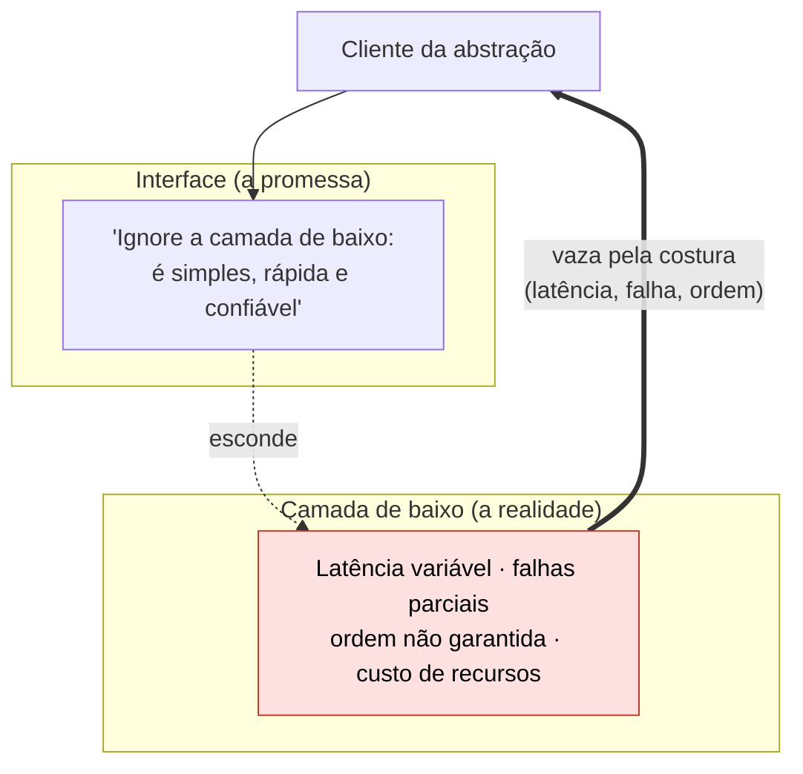
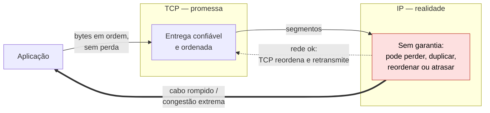
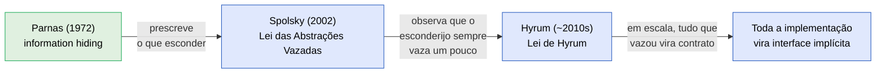
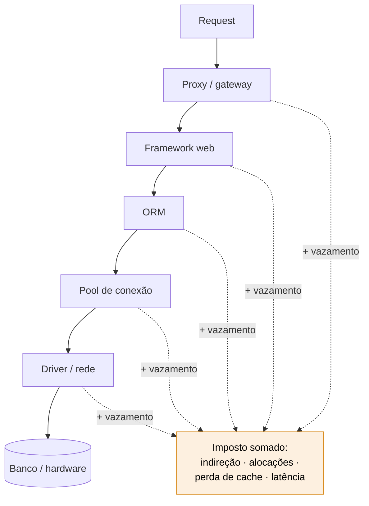
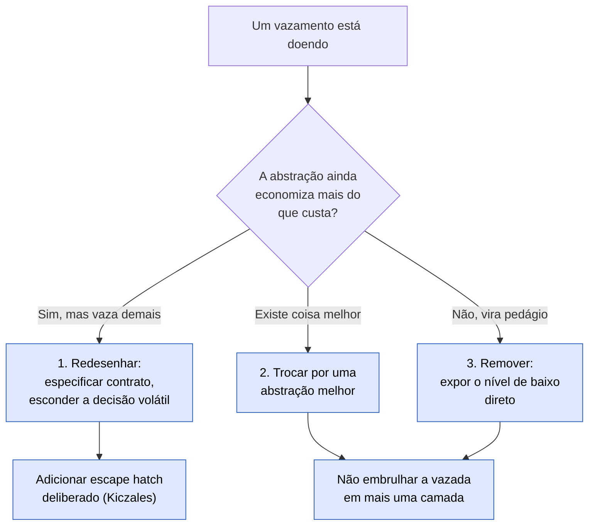

# Abstrações que vazam

Uma abstração **vaza** quando os detalhes internos que ela deveria esconder escapam pela interface.

E aí quem a usa é forçado a entender a camada de baixo pra resolver o problema — exatamente o que a abstração prometia poupar.

> [!abstract] TL;DR
> Joel Spolsky cunhou a **Lei das Abstrações Vazadas** em 2002: *"All non-trivial abstractions, to some degree, are leaky"* — toda abstração não-trivial vaza em algum grau. A consequência prática é dura: abstrações poupam tempo de **trabalho**, mas não de **aprendizado**. Elas te deixam produtivo no caso comum, mas quando vazam (GC pausando, ORM gerando N+1, GIL serializando threads, slice de Go mutando o array do vizinho), só resolve quem entende o nível de baixo. Não é argumento contra abstrações — é argumento contra a ilusão de que elas dispensam os fundamentos.

A teoria positiva da abstração — o que ela é e por que funciona — está em [[05 - Abstração - a ferramenta central]]. Esta nota é sobre o **limite** dela: o momento em que a abstração não segura mais o que prometeu esconder.

## O que é

O termo foi cunhado e popularizado por **Joel Spolsky** no ensaio *The Law of Leaky Abstractions* (Joel on Software, 11/11/2002), com o enunciado:

> [!quote] Lei das Abstrações Vazadas
> *"All non-trivial abstractions, to some degree, are leaky."*
> — Joel Spolsky, 2002

A definição operacional: uma abstração vazada **falha em esconder completamente a complexidade subjacente** que pretendia simplificar.

O contrato era "use esta interface simples e ignore o que há embaixo". O vazamento é o momento em que o que há embaixo afeta o comportamento observável — e ignorá-lo deixa de ser opção.

O diagrama abaixo desenha a anatomia do vazamento: a interface promete uma coisa, a camada de baixo tem uma realidade própria, e essa realidade atravessa a costura.

*Leitura do diagrama*: no caminho feliz, o cliente fala só com a promessa e a realidade fica escondida (seta pontilhada). Mas a seta grossa de volta é o vazamento — quando latência, falha ou ordem da camada de baixo chegam ao cliente diretamente, sem passar pelo filtro da interface.

O fenômeno já tinha sido descrito antes (Gregor Kiczales, *Towards a New Model of Abstraction*, 1992, sobre abstrações imperfeitas e *open implementation*), mas o nome e a "lei" são de Spolsky.

> [!note] Tensão definicional
> Há duas leituras em disputa. Pra Spolsky, vazar é **propriedade universal** de toda abstração não-trivial — não é defeito, é física. Pra críticos como Haufe (ver [[#Críticas e refinamentos]]), abstração que vaza é só **abstração mal especificada**. A Wikipedia adota a leitura de "design flaw". As duas leituras convivem na literatura; esta nota apresenta ambas.

## A consequência: poupa trabalho, não aprendizado

O ponto central do ensaio não é a lei em si, é o corolário:

> *"The abstractions save us time working, but they don't save us time learning."*

E a única forma de lidar com vazamentos com competência é *"learn about how the abstractions work and what they are abstracting"*.

Ou seja: a abstração acelera o caso comum, mas **não te isenta de entender a camada que ela esconde**. Porque quando ela vazar (e vai vazar), o debugging acontece no nível de baixo.

Paradoxalmente, ferramentas que prometem que você "não precisa saber X" criam o pior cenário. Você acaba precisando saber X *e* a ferramenta.

### O exemplo canônico: TCP sobre IP

TCP promete entrega confiável e ordenada — construída sobre IP, que não promete nada (*"TCP is obliged to somehow send data reliably using only an unreliable tool"*).

Em condições normais, a mágica funciona. Mas se um cabo é rompido ou a rede congestiona, a não-confiabilidade do IP **atravessa** a abstração: mensagens não chegam, tudo fica lento, conexões caem.

TCP não consegue esconder a rede pra sempre — *"sometimes, the network leaks through the abstraction"*. Veja [[03-Dominios/Ciência/Redes e Protocolos/index|Redes e Protocolos]].

O diagrama mostra a promessa de TCP empilhada sobre a realidade de IP, e o ponto onde a realidade vence.

*Leitura do diagrama*: enquanto a rede coopera, TCP absorve a bagunça de IP (retransmite o perdido, reordena o fora de ordem) e a aplicação só vê o caminho pontilhado, limpo. Sob falha dura — cabo cortado, congestão extrema —, a não-confiabilidade do IP fura direto até a aplicação (seta grossa): conexão lenta, timeouts, queda. A promessa de TCP era condicional à rede existir.

## Exemplos por ecossistema

> [!info] Lastro das afirmações
> Os exemplos de **GC (Java/Python)** e **GIL (CPython)** passaram por verificação adversarial contra fontes primárias (docs Oracle, glossário e PEPs do CPython) na pesquisa que alimentou esta nota. Os demais são semântica documentada de cada linguagem (docs oficiais citadas), mas não passaram pelo mesmo crivo — distinção registrada por honestidade epistêmica.

### Java

- **Garbage Collector** — promete "esqueça gerenciamento de memória".
    - Mas *memory leaks continuam existindo*: caches sem limite, listeners não removidos, `ThreadLocal` esquecido. Em linguagem com GC, "leak" vira *objeto alcançável-mas-desnecessário*, não ponteiro perdido — a Oracle mantém capítulo oficial de *Troubleshoot Memory Leaks* na doc do Java SE.
    - E as pausas de GC afetam latência a ponto de ZGC e Shenandoah existirem precisamente pra mitigar stop-the-world. Quando o p99 explode, você desce pra [[03 - Garbage Collection — o conceito|o conceito de GC]], [[06 - Os coletores do HotSpot|os coletores]] e [[11 - Tuning de GC — metodologia e prática|tuning]].
- **ORM (Hibernate/JPA)** — promete "trabalhe com objetos, esqueça SQL".
    - Até bater no **N+1 queries**, na `LazyInitializationException` (proxy lazy acessado fora de sessão) ou na query lenta que exige ler o SQL gerado e o plano de execução.
    - O vazamento dobra a conta: você precisa entender SQL *e* o ORM. O próprio Spolsky já citava ORMs no ensaio original como SQL vazando por strings de query.
- **JIT** — promete "performance transparente".
    - Mas warmup (o código começa interpretado), *deoptimizations* e limites de inlining fazem a performance variar de formas que só se explicam descendo pra [[07 - JIT — C1, C2 e tiered compilation|C1/C2 e tiered compilation]].

### TypeScript

- **Type erasure** — o sistema de tipos promete segurança, mas **não existe em runtime**: os tipos são apagados na compilação.
    - Um `as User` num JSON vindo da rede não valida nada — o objeto errado atravessa o "tipo" e explode longe dali.
    - O vazamento força a entender que TS é uma camada estática sobre JavaScript dinâmico (daí validadores de runtime como Zod existirem).
- **`async/await` sobre o event loop** — a sintaxe promete "código assíncrono que parece síncrono".
    - Mas um loop CPU-bound dentro de uma função `async` ainda **bloqueia o event loop inteiro** — `await` não cria thread, só agenda continuação.
    - Quem não entende o event loop não explica por que o servidor "travou" com código aparentemente assíncrono.
- **Tipagem estrutural** — duas interfaces sem relação nominal são intercambiáveis se as formas coincidem; o "tipo errado" passa silenciosamente onde uma linguagem nominal acusaria.

### Go

- **Slices e o array subjacente** — slice promete "array dinâmico simples", mas é uma *view* `(ptr, len, cap)` sobre um array compartilhado.
    - Dois slices podem **aliasar o mesmo array**: um `append` dentro da capacidade muta dados que outro slice enxerga; um `append` que estoura a capacidade realoca e *des*-compartilha silenciosamente.
    - O comportamento só faz sentido entendendo a mecânica interna (documentada no Go Blog, *Go Slices: usage and internals*).
- **Interface com typed nil** — uma interface guardando um ponteiro nil (`(*T)(nil)`) **não compara igual a `nil`**: a interface só é nil se tipo *e* valor forem nil.
    - O clássico `return err` que nunca é nil vaza a representação interna de interfaces (par tipo/valor), documentado no FAQ oficial de Go.
- **Goroutines e o scheduler** — prometem "concorrência barata, esqueça threads".
    - Mas chamadas de sistema bloqueantes, CGO e loops sem pontos de preempção interagem com o scheduler M:N de formas que exigem entender Ps, Ms e Gs quando a latência degrada.

### Python

- **GIL** — a API de `threading` promete paralelismo, mas o *Global Interpreter Lock* permite **uma thread executando bytecode por vez**.
    - Programas CPU-bound multi-thread são efetivamente single-threaded (no benchmark da Real Python: ~6,2s com 1 thread, ~6,9s com 2 — *mais lento*, pelo overhead do lock).
    - A causa é um detalhe de implementação do CPython: o *reference counting* precisava de proteção contra races, e um lock global foi mais barato que locks por objeto.
    - Vazamento de manual: um detalhe interno do interpretador dita a arquitetura do seu código (multiprocessing vs threading). **Caveat temporal**: desde o 3.13 existe build *free-threaded* opt-in (PEP 703), oficial no 3.14 (PEP 779) — mas o build padrão em 2026 ainda tem GIL.
- **GC + ciclos de referência** — o reference counting libera a maioria dos objetos, mas ciclos exigem o coletor geracional — e pausas em heaps grandes motivaram o GC **incremental** do 3.14. O "esqueça memória" vaza igual ao Java.
- **Interning de inteiros pequenos** — CPython mantém cache dos ints de -5 a 256; `a is b` dá `True` pra `256` e `False` pra `257`.
    - O operador `is` vaza o modelo de objetos do interpretador — por isso a regra "compare valores com o operador de igualdade (`a == b`), use `is` só pra `None`".

## Conceitos vizinhos

- **Information hiding (Parnas, 1972)** — o contraponto prescritivo direto.
    - Em *On the Criteria To Be Used in Decomposing Systems into Modules* (CACM 15(12), 1972; precursor no paper IFIP de 1971), David Parnas define que cada módulo deve **esconder uma decisão de design propensa a mudar** — não meramente "esconder dados".
    - Abstração que vaza é precisamente uma *falha de information hiding*: a decisão volátil escapou e o cliente passou a depender dela.
- **Encapsulamento** — o mecanismo de linguagem (visibilidade, interfaces) que tenta implementar information hiding.
    - Vazamento acontece *apesar* do encapsulamento: o compilador esconde o campo, mas não esconde o comportamento (latência, ordem, falha). Veja [[03-Dominios/Engenharia/Design de Software/Orientação a Objetos/index|Orientação a Objetos]].
- **Lei de Hyrum** — o extremo lógico do vazamento: *"With a sufficient number of users of an API, it does not matter what you promise in the contract: all observable behaviors of your system will be depended on by somebody."*
    - Com usuários suficientes, **toda a implementação vira interface implícita** — alguém depende até dos seus bugs.
    - A própria página canônica (hyrumslaw.com) cita Spolsky como mecanismo: a lei de Hyrum é o que acontece quando os vazamentos ganham dependentes em escala (Google a registra em *Software Engineering at Google*, cap. 1).

A cadeia conceitual liga os três autores numa linha do tempo só: cada um pega o anterior e dá um passo.

*Leitura do diagrama*: Parnas (verde, prescritivo) diz o que *deveria* ser escondido. Spolsky (azul, descritivo) observa que, na prática, o esconderijo sempre vaza um pouco. Hyrum leva isso ao extremo: com usuários suficientes, cada migalha que vazou vira contrato implícito — e a implementação inteira acaba sendo a interface real. Um vai dando munição pro próximo.

## Críticas e refinamentos

- **Haufe (2019) — "leaky abstractions are just bad abstractions"**: Michael L. Haufe rejeita a lei argumentando que os exemplos de Spolsky são um *straw man* — atribuem às abstrações garantias que elas nunca prometeram (TCP não promete entrega *incondicional*; promete confiabilidade *enquanto a conexão existir*).
    - Abstração que cumpre sua especificação não "vaza"; a que vaza estava mal especificada.
    - Pra Haufe, perpetuar a lei *"is actively harmful to the industry"* porque normaliza especificações ruins.
- **Principles Wiki — de lei descritiva a princípio prescritivo**: a lei de Spolsky *descreve* um efeito; como princípio de engenharia, ela vira três estratégias quando um vazamento dói.
    - **(1)** redesenhar a abstração pra vazar menos; **(2)** trocá-la por uma abstração melhor; **(3)** *remover* a abstração quando os vazamentos custam mais do que ela economiza.
    - Com alerta explícito contra empilhar frameworks uns sobre os outros: cada camada empilhada soma os vazamentos de todas as de baixo.

### Jeff Atwood — *All Abstractions Are Failed Abstractions*

No ensaio de 2009 (Coding Horror), Atwood radicaliza Spolsky: *virtualmente toda* abstração boa é uma abstração que falha.

A frase dele é direta — *"I don't think I've ever used one that didn't leak like a sieve"* (nunca usei uma que não vazasse feito peneira).

O exemplo é LINQ-to-SQL, que ele considera uma *boa* abstração — e que mesmo assim vaza. Por padrão, LINQ-to-SQL traz todas as colunas (o equivalente a `SELECT *`), o que é caro; pra otimizar, você precisa descer pro SQL que ele gera.

A lição de Atwood: o problema não é a má abstração, é que você está *"tentando passar uma camada limpa por cima de um banco cheio de comportamentos irregulares do mundo real"*. A irregularidade sempre acha uma fresta.

### Gregor Kiczales — o precursor acadêmico

Dez anos antes de Spolsky, Kiczales já tinha nomeado o problema em *Towards a New Model of Abstraction in Software Engineering* (workshop de Reflection/Meta-Level Architecture, Tóquio, 1992).

O diagnóstico dele: mesmo quando a abstração serve perfeitamente à sua aplicação, a *implementação* embaixo pode não servir — e isso é incômodo justamente porque você deveria poder ignorá-la.

A proposta dele não é fingir que o vazamento não existe — é **abrir a implementação** (*open implementation*). Cada módulo teria *duas* interfaces: a interface abstrata de sempre (agnóstica à implementação) e uma **interface de tuning**, deliberada, pra influenciar o como sem quebrar o quê.

É o ancestral intelectual dos *escape hatches* que aparecem mais abaixo: em vez de a implementação vazar por acidente, ela é exposta de propósito, por uma porta controlada (o mecanismo concreto na obra de Kiczales é o *Metaobject Protocol*).

## O custo de empilhar abstrações

Cada camada de abstração tem seus próprios vazamentos. Quando você empilha N camadas, você não escolhe os vazamentos de uma — você herda os de todas.

Esse é o sentido prático do alerta da Principles Wiki contra empilhar frameworks: profundidade de pilha é **custo somado**, não arquitetura grátis.

> [!warning] O "imposto de abstração"
> Cada camada cobra um pedágio: indireção, alocações, cópias, perda de localidade de cache. Individualmente, cada uma é "desprezível". Somadas — request passa por proxy, framework web, ORM, pool de conexão, driver, rede —, viram o motivo de o caminho quente estar lento sem nenhum culpado óbvio.

É aqui que entra a **mechanical sympathy** (Martin Thompson, ex-CTO do LMAX, criador do Disruptor): a ideia de que software de alta performance exige *entender o hardware embaixo* — cache lines, acesso previsível à memória, batching natural.

O termo vem da Fórmula 1 (Jackie Stewart: *"você não precisa ser engenheiro pra ser piloto, mas precisa de mechanical sympathy"*). Aplicado a software, é a confissão de que, no limite de performance, as abstrações vazam tanto que você tem que pilotar o hardware diretamente.

*Leitura do diagrama*: o request desce por cinco camadas até o hardware, e cada uma contribui seu pedaço de imposto (setas pontilhadas) pra uma conta que ninguém vê isolada. Nenhuma camada é "a culpada" — a lentidão é a soma. Mechanical sympathy é o reflexo oposto: encurtar a pilha e enxergar o hardware pra cortar o imposto onde ele dói.

## Como projetar abstrações que vazam menos

- **Especifique o contrato de verdade** (resposta à crítica de Haufe): diga o que a abstração *não* promete — limites, modos de falha, custos. Vazamento surpreende menos quando está documentado como comportamento.
- **Esconda decisões, não apenas dados** (Parnas): pergunte "que decisão volátil este módulo protege?" — se a resposta vazar pela API (nomes, tipos, ordem de chamadas), a troca futura da decisão quebra os clientes.
- **Ofereça *escape hatches* deliberados** (Kiczales): uma porta explícita pro nível de baixo (o `unwrap()` da conexão crua, o `nativeQuery` do ORM, a interface de tuning) é melhor que forçar o usuário a contornar a abstração por fora quando ela não basta.
- **Não empilhe frameworks**: cada camada soma os vazamentos das de baixo; profundidade de pilha é custo, não arquitetura.
- **Minimize a superfície observável** (defesa contra Hyrum): quanto menos comportamento observável, menos coisas pra alguém depender — randomize o que não é prometido (ordem de iteração, formatos internos), ou alguém vai cravar dependência nele.
- **Saiba quando *não* abstrair**: se os usuários precisam descer o tempo todo, a abstração virou pedágio — removê-la é uma das três estratégias legítimas.

## Padrões de mitigação

Quando um vazamento *dói* (não só existe — atrapalha de verdade), o que você faz?

O diagrama organiza as respostas, das mais conservadoras às mais radicais.

*Leitura do diagrama*: a pergunta-pivô é se a abstração ainda paga seu custo. Se sim mas vaza demais, você redesenha (e abre uma porta deliberada pro nível de baixo). Se existe algo claramente melhor, você troca. Se ela virou pedágio puro, você remove e expõe a camada de baixo direto. O anti-padrão que atravessa tudo — embrulhar a vazada em *mais uma* camada — fica de fora de todos os caminhos: ele soma vazamentos em vez de resolver.

## Como conviver com vazamentos (checklist prático)

Vazar é o estado normal; não há abstração não-trivial sem vazamento. O objetivo não é eliminá-los — é não ser pego de surpresa.

- **Conheça a camada de baixo.** Antes de confiar numa abstração em produção, saiba o que ela esconde: que SQL o ORM gera, como o GC pausa, o que o event loop não paraleliza. O caminho do debugging passa por lá.
- **Documente o que a abstração *não* promete.** A resposta direta a Haufe: metade dos "vazamentos" é contrato não-lido. Escreva os limites, modos de falha e custos no próprio contrato.
- **Tenha escape hatches mapeados.** Saiba qual é a porta pro nível de baixo de cada abstração que você usa (`nativeQuery`, conexão crua, flush manual) — antes de precisar dela às 3h da manhã.
- **Meça, não confie.** Vazamento de performance só aparece sob carga real. Profiling e métricas de p99 revelam o imposto somado que o diagrama não consegue contar.
- **Resista a empilhar.** Cada framework novo por cima soma vazamentos. Pergunte se a camada nova esconde mais do que adiciona.

## Armadilhas comuns

- **Acreditar que a ferramenta dispensa o fundamento** — o ORM não dispensa SQL, o GC não dispensa modelo de memória, o `async` não dispensa o event loop. É exatamente o erro que a lei denuncia.
- **Culpar a abstração por promessa que ela não fez** — antes de declarar vazamento, leia a especificação: às vezes o "vazamento" é contrato documentado que ninguém leu (o ponto de Haufe).
- **Resolver vazamento com mais uma camada** — embrulhar uma abstração vazada em outra abstração soma vazamentos em vez de eliminá-los.
- **Depender do que vazou** — usar comportamento interno observável (interning de ints, ordem de iteração, SQL gerado) como se fosse contrato; é assim que se vira estatística da lei de Hyrum.

> [!warning] Achar que "leitura madura" é jogar a lei fora
> A crítica de Haufe ("abstração que vaza é abstração mal especificada") é um refinamento útil, não uma refutação. Na prática as duas coisas coexistem: parte do que se chama de vazamento é mesmo contrato mal escrito, e parte é vazamento de verdade (latência de rede, GC pausando) que nenhuma especificação, por melhor que fosse, eliminaria. Descartar a lei de Spolsky citando Haufe é trocar um exagero por outro.

> [!warning] Empilhar mais uma camada pra "resolver" o vazamento
> Cada framework, proxy ou wrapper novo soma os vazamentos das camadas de baixo — nunca os cancela. O sintoma é o "imposto de abstração" (ver [[#O custo de empilhar abstrações]]): nenhuma camada isolada é lenta, mas a pilha inteira é, e não há um único vilão pra apontar. Antes de empilhar, pergunte se a camada nova esconde mais do que adiciona; se a resposta for "não sei", ela provavelmente só está somando pedágio.

> [!warning] Tratar o checklist de convivência como só teórico
> "Conheça a camada de baixo", "documente o que não é prometido", "tenha escape hatches mapeados" (ver [[#Como conviver com vazamentos (checklist prático)]]) soam óbvios até faltarem às 3h da manhã, no meio de um incidente. O erro comum é deixar esse conhecimento implícito na cabeça de uma pessoa sênior em vez de documentado — daí vazamento previsível virar surpresa de novo a cada rotatividade de time.

## Inglês

**"Leak"** aqui é falso amigo perigoso: não é vazamento de dados (*data leak*) nem de memória (*memory leak*) — é o detalhe de implementação que atravessa a interface e se torna visível pra quem consome. Um sistema pode ter *leaky abstractions* em profusão sem vazar um byte de dado sensível ou reter um byte de memória a mais; são fenômenos ortogonais que só compartilham o verbo em português e em inglês.

A **Hyrum's law** também merece cuidado de registro: não é *law* no sentido de teorema provado, é uma *observation* informal, batizada em homenagem a Hyrum Wright (engenheiro do Google) por colegas que notaram o padrão se repetindo. A citação mais reproduzida — *"with a sufficient number of users of an API, it does not matter what you promise in the contract: all observable behaviors of your system will be depended on by somebody"* — vale decorar em inglês, porque é assim que aparece em toda literatura de API design e em entrevista de sistema.

O termo **abstraction tax** (imposto de abstração) e **ecosystem** (o conjunto de camadas/ferramentas que compõem uma stack) completam o vocabulário mínimo pra discutir o tema em inglês sem parafrasear.

| Português | Inglês |
|---|---|
| Abstração que vaza | Leaky abstraction |
| Lei das Abstrações Vazadas | Law of Leaky Abstractions |
| Lei de Hyrum | Hyrum's Law |
| Imposto de abstração | Abstraction tax |
| Ecossistema (de ferramentas/camadas) | Ecosystem |

## Em entrevista

- **"O que é uma abstração que vaza?"** — Não decore a frase de Spolsky; entregue o corolário: abstração poupa tempo de *trabalho*, não de *aprendizado*. Dê um exemplo da sua stack (N+1 do ORM, pausa de GC no p99) e mostre que você desceu pro nível de baixo pra resolver.
- **Cuidado com o exagero** — se você disser "toda abstração é ruim", caiu na armadilha que Haufe denuncia. A resposta madura: vazar é inevitável, mas boa parte do que se chama de vazamento é contrato mal especificado. Saber distinguir os dois é o sinal de senioridade.
- **Conecte com decisão de design** — entrevistas de sistema gostam de "quando você *não* abstrairia?". A resposta vem das três estratégias: se a abstração vira pedágio (todo mundo desce o tempo todo), removê-la é legítimo.

## O que vem a seguir

Se toda abstração não-trivial vaza, "abstrair ou não" é a pergunta errada — vazamento é preço de entrada, não defeito evitável. A pergunta que sobra é outra: **quanto** essa abstração precisa entregar pra valer o pedágio que cobra?

Até aqui a lente foi qualitativa: onde vaza, por que vaza, o que fazer quando dói. Falta uma régua — uma forma de comparar duas abstrações e dizer qual é a "melhor negociação" entre o que ela esconde e o que ela expõe.

John Ousterhout dá essa régua com o conceito de **profundidade**: quanta funcionalidade uma abstração esconde por unidade de interface que ela expõe. Uma interface pequena escondendo muita complexidade é um módulo profundo — o melhor tipo de trato, porque o vazamento potencial fica concentrado numa costura pequena. Uma interface grande escondendo pouco é um módulo raso, e frequentemente nem vale o custo de existir.

[[07 - Módulos profundos e rasos]]

## Referências

> [!tip] Assista — A New Tool for Fighting Against Hyrum's Law — David Hollman (2019)
> **CppCon** · 29min · [A New Tool for Fighting Against Hyrum's Law — David Hollman (2019)](https://www.youtube.com/watch?v=sFfRxjAvxhc)
> Os exemplos são de C++, mas o mecanismo é universal e é exatamente o desta nota: quando usuários suficientes dependem de comportamentos observáveis, cada detalhe da implementação vira contrato de fato — e a palestra mostra o que dá para fazer a respeito.

- **Joel Spolsky** — [The Law of Leaky Abstractions](https://www.joelonsoftware.com/2002/11/11/the-law-of-leaky-abstractions/) (Joel on Software, 11/11/2002) — o ensaio fundador.
- **Hyrum Wright / Titus Winters** — [Hyrum's Law](https://www.hyrumslaw.com/) — página canônica; também em *Software Engineering at Google* (O'Reilly, 2020, cap. 1).
- **David Parnas** — [On the Criteria To Be Used in Decomposing Systems into Modules](https://dl.acm.org/doi/10.1145/361598.361623) (CACM 15(12), 1972) — information hiding.
- **Michael L. Haufe** — [Leaky Abstractions Are Just Bad Abstractions](https://thenewobjective.com/requirements-engineering/leaky-abstractions-are-just-bad-abstractions/) (2019) — a crítica direta.
- **Principles Wiki** — [Law of Leaky Abstractions](http://www.principles-wiki.net/principles:law_of_leaky_abstractions) — leitura prescritiva e as três estratégias.
- **Jeff Atwood** — [All Abstractions Are Failed Abstractions](https://blog.codinghorror.com/all-abstractions-are-failed-abstractions/) (Coding Horror, 2009) — "leak like a sieve" e o exemplo do LINQ-to-SQL.
- **Gregor Kiczales** — [Towards a New Model of Abstraction in Software Engineering](https://embeddedartistry.com/wp-content/uploads/2022/01/Towards-a-New-Model-of-Abstraction-in-Software-Engineering.pdf) (IMSA '92, Tóquio) — *open implementation* e a interface de tuning; precursor acadêmico.
- **Martin Thompson** — [Mechanical Sympathy](https://se-radio.net/2014/02/episode-201-martin-thompson-on-mechanical-sympathy/) (SE Radio 201, 2014) — entender o hardware quando as abstrações vazam no limite de performance.
- **Oracle** — [Troubleshoot Memory Leaks](https://docs.oracle.com/en/java/javase/25/troubleshoot/troubleshooting-memory-leaks.html) (Java SE 25) — leaks apesar do GC.
- **Real Python** — [What Is the Python GIL?](https://realpython.com/python-gil/) + [PEP 703](https://peps.python.org/pep-0703/) e [free-threading HOWTO](https://docs.python.org/3/howto/free-threading-python.html) — o GIL e sua remoção opt-in.
- **Go Blog** — [Go Slices: usage and internals](https://go.dev/blog/slices-intro) — a mecânica `(ptr, len, cap)`.
- **Total TypeScript** — [TypeScript Types Don't Exist at Runtime](https://www.totaltypescript.com/typescript-types-dont-exist-at-runtime) — type erasure.

## Veja também

- [[05 - Abstração - a ferramenta central]] — a abstração e o information hiding que esta lei mostra vazando
- [[07 - Módulos profundos e rasos]] — como dimensionar abstrações (interface simples, muita funcionalidade)
- [[03-Dominios/Ciência/Redes e Protocolos/index|Redes e Protocolos]] — TCP/IP, o exemplo canônico da lei
- [[03-Dominios/Engenharia/Design de Software/Orientação a Objetos/index|Orientação a Objetos]] — encapsulamento, o mecanismo que o vazamento atravessa
- [[03 - Garbage Collection — o conceito]] — a abstração de memória da JVM por dentro
- [[07 - JIT — C1, C2 e tiered compilation]] — por que a performance "transparente" varia
- [[03-Dominios/Engenharia/Complexidade de Software/04 - O programa como teoria]] — outro fundamento sobre o que o código esconde: o entendimento mora nas pessoas
- [[Dicionário de Ciência da Computação#Abstração que vaza (leaky abstraction)|Verbete no Dicionário de Ciência da Computação]]
