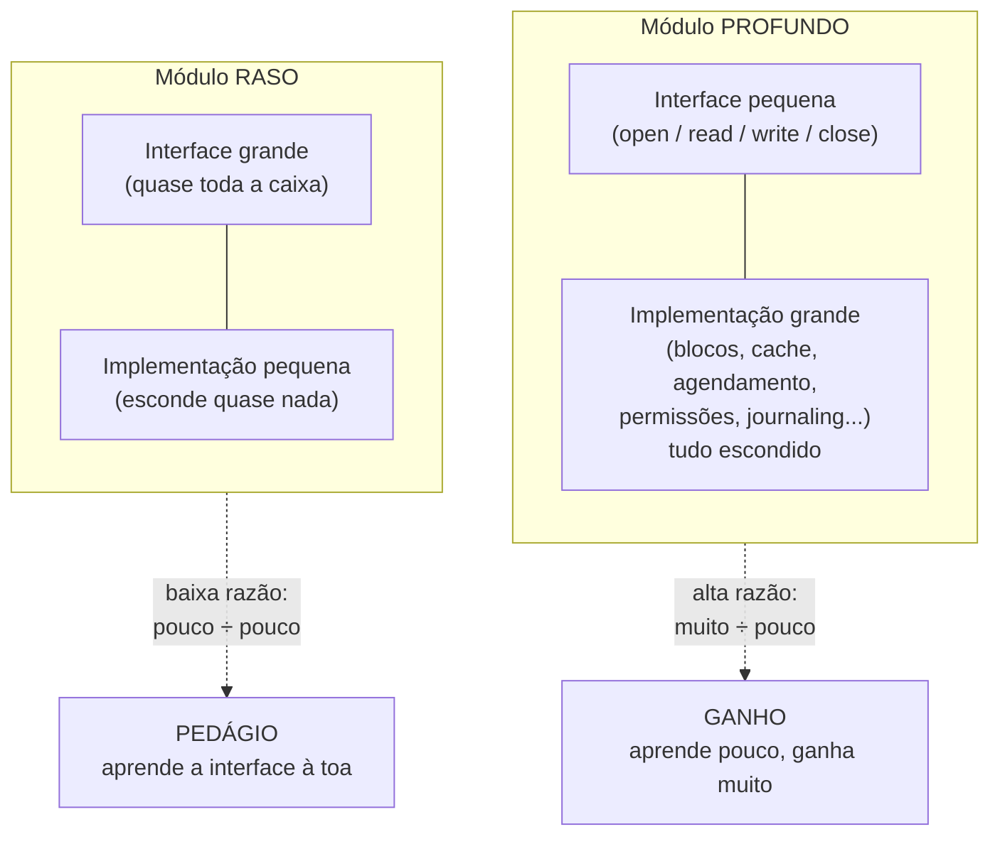
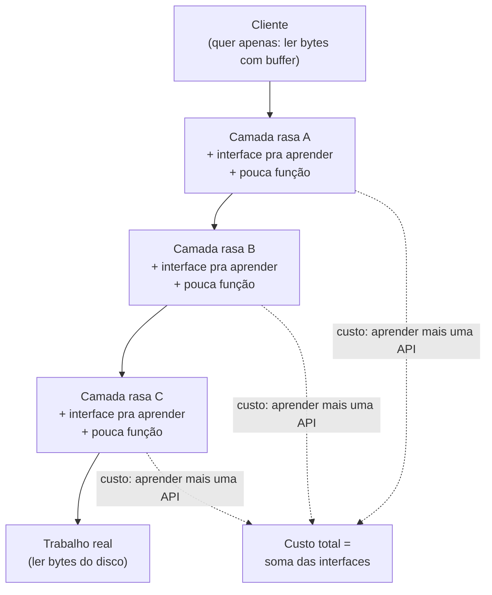
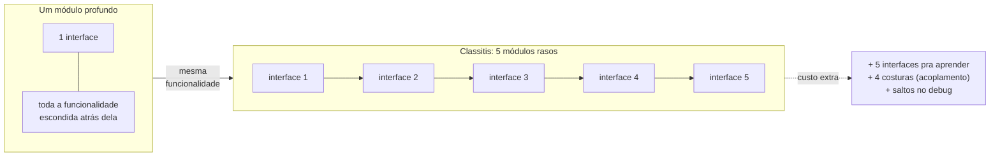
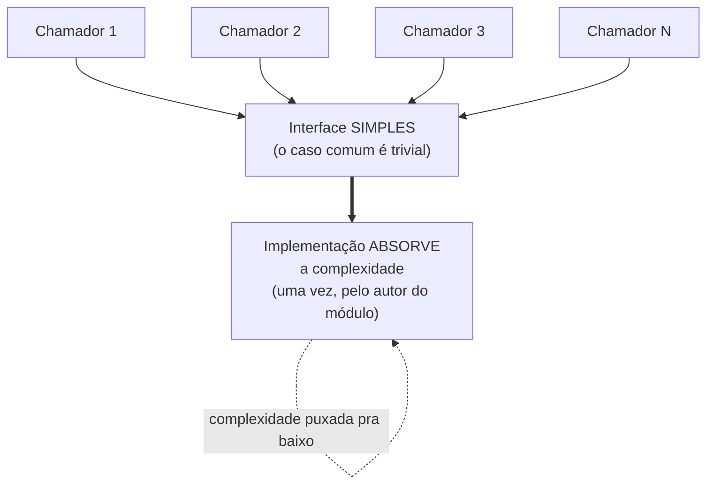

# Módulos profundos e rasos

A nota anterior fechou com uma promessa: abstração tem dois lados — uma **interface** (o que você precisa saber pra usá-la) e uma **implementação** (tudo que ela esconde), e a arte está em manter a interface pequena enquanto a implementação faz o trabalho pesado ([[05 - Abstração - a ferramenta central]]).

Esta nota transforma essa tensão num critério concreto pra dimensionar um módulo. A pergunta deixa de ser "este módulo é grande ou pequeno?" e vira outra: *quanta complexidade ele esconde por unidade de interface que cobra?*

> [!abstract] TL;DR
> John Ousterhout mede um módulo pela sua **profundidade** (*depth*): a razão entre a funcionalidade que ele entrega e a complexidade da interface que ele expõe. Um **módulo profundo** (*deep module*) tem interface pequena e esconde muita coisa — é o que dá lucro, porque você aprende pouco e ganha muito. Um **módulo raso** (*shallow module*) tem interface quase tão complicada quanto a implementação — paga o custo de mais uma camada sem o benefício de esconder nada. O erro mais comum que produz módulos rasos é a **classitis**: a crença de que mais classes pequenas é sempre melhor. Profundidade importa mais que tamanho — e por isso Ousterhout e o "Uncle Bob" do *Clean Code* travaram um debate público sobre funções pequenas.

## O que é: interface, implementação e a razão entre elas

Todo módulo — uma classe, uma função, um pacote, um serviço — tem duas partes.

A **interface** é o que um cliente precisa ter na cabeça pra usá-lo: assinaturas, parâmetros, tipos de retorno, efeitos colaterais, modos de falha, ordem de chamadas. A **implementação** é todo o resto: o código que faz o trabalho, e que o cliente legitimamente ignora.

Ousterhout propõe pensar nessa relação como uma **razão**:

> [!quote] Profundidade de módulo
> *"The best modules are deep: they have a lot of functionality hidden behind a simple interface."*
> — John Ousterhout, *A Philosophy of Software Design*

A profundidade é o **benefício líquido** da abstração. A funcionalidade escondida é o que você ganha; a interface é o que você paga (em carga cognitiva — a *cognitive load* que a nota 08 detalha).

Um bom módulo entrega muito e cobra pouco. Um módulo ruim cobra quase tanto quanto entrega — e às vezes cobra *mais*, virando saldo negativo.

> [!note] Profundidade ≠ tamanho
> Profundidade não é sobre o módulo ter muitas linhas. Um módulo profundo pode ser enorme por dentro — o que importa é que a **interface** seja pequena em relação a isso. E um módulo minúsculo pode ser raso: se a interface dele é quase do tamanho do que ele faz, ele não abstrai nada. O eixo certo de avaliação é a razão, não a contagem de linhas nem de classes.

Visualmente, Ousterhout desenha cada módulo como um retângulo: a **largura do topo** é o tamanho da interface; a **área** é a funcionalidade total. O módulo profundo é alto e estreito (pouca interface, muita área); o raso é largo e baixo (muita interface, pouca área).

O diagrama abaixo contrasta os dois formatos. À esquerda, o módulo profundo: uma fresta de interface sobre um corpo enorme de funcionalidade escondida. À direita, o módulo raso: a interface ocupa quase toda a caixa, e quase nada fica escondido.



Leitura do diagrama: o que distingue os dois não é o tamanho da caixa, e sim a *proporção* entre a faixa de interface (em cima) e o corpo escondido (embaixo). Profundidade é essa proporção, não a altura absoluta.

## Módulos profundos: pouca interface, muita máquina

O exemplo canônico de Ousterhout é a **API de I/O de arquivos do Unix**.

Você usa basicamente quatro chamadas — `open`, `read`, `write`, `close` — e atrás delas mora uma quantidade colossal de máquina:

- gerenciamento de blocos em disco;
- cache de páginas;
- agendamento de I/O;
- permissões e controle de acesso;
- journaling pra sobreviver a quedas;
- representação de diretórios.

A interface tem um punhado de funções; a implementação tem dezenas de milhares de linhas. Razão altíssima.

É por isso que quase ninguém precisa entender um sistema de arquivos pra ler um arquivo. Toda essa máquina existe, mas mora *embaixo* da interface — invisível pra quem só quer os bytes.

O caso extremo é o **garbage collector** ([[03 - Garbage Collection — o conceito]]): ele esconde uma quantidade enorme de funcionalidade atrás de **nenhuma interface**.

Você não chama o GC — ele simplesmente acontece. Interface zero, funcionalidade gigante: profundidade no limite teórico. Por isso o GC é uma das abstrações mais valiosas que existem, *quando não vaza* (e a nota 06 mostrou onde ela vaza).

> [!example] O que torna um módulo profundo
> Um `Map` (dicionário) é profundo: a interface é "guarde por chave, recupere por chave", e por baixo há hashing, tratamento de colisão, redimensionamento, talvez balanceamento de árvore. Você usa duas operações e esquece tudo isso. Compare com a sensação de usar uma classe que te obriga a configurar dez parâmetros antes de fazer qualquer coisa útil — essa cobra muito pra entregar pouco.

Repare que a mesma capacidade pode nascer profunda ou rasa, dependendo de onde você corta a interface. Considere "buscar um usuário e devolvê-lo formatado":

```java
// RASO: o cliente orquestra três passos e conhece os tipos intermediários.
//       A "abstração" não escondeu nada — só renomeou o que já existia.
UserRecord record = userRepository.findById(id);
UserDto dto = userMapper.toDto(record);
String json = jsonSerializer.serialize(dto);

// PROFUNDO: uma chamada, um conceito. Repository, mapper e serializer
//           viraram detalhes de implementação escondidos atrás da interface.
String json = userApi.fetchUserJson(id);
```

As duas versões fazem o mesmo trabalho. A diferença é *quanto o chamador precisa saber*: na primeira, ele carrega três tipos e a ordem dos passos; na segunda, um método e nada mais. A segunda **puxou a complexidade pra baixo** (conceito da seção adiante).

O ganho de um módulo profundo conecta direto com a nota de abertura. Ele combate a **carga cognitiva** (você segura menos coisas na cabeça) e a **change amplification** (a complexidade escondida pode mudar sem respingar nos clientes, porque eles nunca dependeram dela).

Profundidade é information hiding ([[05 - Abstração - a ferramenta central]]) medido pelo seu resultado.

## Módulos rasos e o empilhamento de camadas

Um **módulo raso** é o oposto: a interface é quase tão complexa quanto a implementação. Ele não esconde quase nada, então o custo de aprender a interface quase anula o benefício de não ler o código. Ousterhout é direto sobre o saldo:

> [!quote] O custo de um módulo raso
> *"A shallow module is one whose interface is complicated relative to the functionality it provides. Shallow modules don't help much in the battle against complexity, because the benefit they provide (not having to learn about how they work internally) is negated by the cost of learning and using their interfaces."*
> — John Ousterhout (paráfrase fiel; ver Referências)

O exemplo que ele usa pra cravar a crítica é o **I/O de streams do Java**. Pra ler um arquivo do jeito recomendado, você não cria *um* objeto — você empilha vários:

```java
FileInputStream fileStream = new FileInputStream(fileName);
BufferedInputStream bufferedStream = new BufferedInputStream(fileStream);
```

O `FileInputStream` abre o arquivo, mas não tem buffer (cada leitura bate no disco). Pra ter buffer — que **quase todo mundo quer**, sempre — você precisa *saber da existência* do `BufferedInputStream` e envolver o primeiro stream nele manualmente.

Ousterhout aponta dois pecados aqui.

- Primeiro, cada classe individual é **rasa**: o `FileInputStream` sem buffer entrega pouco e ainda obriga você a saber que precisa de *outra* classe pra completá-lo.
- Segundo, o **caso comum exige boilerplate**: a configuração mais frequente — ler com buffer — é justamente a que dá mais trabalho.

O design correto, na visão dele, seria **bufferizar por padrão** e oferecer uma forma de *desligar* o buffer no caso raro em que ele atrapalha. A interface deveria otimizar o caso comum, não o raro.

O sintoma estrutural mais óbvio de rasura é o **método *pass-through*** (de repasse): um método cuja única função é chamar outro método com a mesma assinatura, sem agregar nada.

Já vimos esse caso na nota anterior — o `UserService.getUser(id)` que só faz `return repository.findById(id)`. A camada existe, mas o cliente precisa saber exatamente o mesmo que precisaria sem ela. É indireção pura: custo de salto, benefício zero ([[05 - Abstração - a ferramenta central]]).

E o problema raramente vem sozinho. Camadas rasas tendem a **empilhar**: cada uma adiciona uma interface pra aprender e quase nenhuma funcionalidade nova, e o conjunto vira uma torre de pedágios.

O diagrama mostra esse empilhamento. Cada camada cobra um "ingresso" (a interface que você precisa aprender) mas a funcionalidade total mal cresce de baixo pra cima.



Leitura do diagrama: a seta vertical é o caminho que uma chamada percorre. Cada nó intermediário adiciona uma API ao que você precisa saber, mas o "trabalho real" no fundo é sempre o mesmo. Quanto mais camadas rasas, maior o pedágio cognitivo pra chegar lá embaixo.

## Classitis: confundir "muitas classes pequenas" com "bom design"

E aqui entra o diagnóstico mais provocador do livro — a **classitis**:

> [!quote] Classitis
> *"This belief that classes should be small, not deep, leads to a syndrome I call 'classitis'... Classitis may result in classes that are individually simple, but it increases the complexity of the overall system."*
> — John Ousterhout (paráfrase fiel; ver Referências)

**Classitis** é a crença equivocada de que mais classes, e menores, é *sempre* melhor — que fragmentar é sempre limpar.

A intuição parece boa: classes pequenas são fáceis de entender uma por uma. Mas o argumento de Ousterhout vira a mesa.

- Classes pequenas entregam pouca funcionalidade cada, então **você precisa de muitas** pra fazer o mesmo trabalho.
- Cada uma traz a **própria interface** pra aprender.
- As **interfaces entre os fragmentos** acumulam complexidade que não existia quando tudo era um módulo só.
- E cada fronteira nova é mais um **salto no debug** e mais uma chance de **acoplamento** mal desenhado.

A conta total cresce mesmo que cada peça pareça simples. Você trocou poucos módulos profundos por muitos módulos rasos, e o sistema inteiro ficou mais difícil de entender.

E aqui está a armadilha: o problema é *invisível* na revisão peça a peça. Cada classe passa no code review — é a soma que não fecha.

O diagrama contrasta as duas formas de entregar **a mesma funcionalidade**: à esquerda, concentrada num módulo profundo com uma interface; à direita, estilhaçada em cinco módulos rasos com cinco interfaces e quatro costuras entre eles.



Leitura do diagrama: os dois lados fazem exatamente a mesma coisa. A diferença é o que o leitor precisa carregar: uma interface contra cinco interfaces *mais* as costuras entre elas. Profundidade não é o número de caixas — é quanto cada caixa esconde.

> [!warning] Cuidado com a métrica "classe pequena = código limpo"
> "Quebre essa classe grande em cinco menores" parece sempre uma boa refatoração, mas nem sempre é. Se as cinco menores só fazem sentido juntas e expõem cinco interfaces onde antes havia uma, você produziu classitis: mais nomes pra aprender, mais saltos no debug, mais acoplamento nas costuras. Antes de fragmentar, pergunte: cada fragmento esconde uma decisão própria e tem uma interface que se sustenta sozinha? Se não, o módulo grande e profundo pode ser o design correto. Tamanho de classe é um péssimo proxy pra qualidade de design.

Isso **não** é licença pra escrever classes-monstro que misturam tudo. É um aviso contra o exagero oposto, que a cultura atual raramente questiona. O critério não é "pequeno" nem "grande" — é **profundo**.

## A complexidade é incremental: empurre-a pra baixo

Por que módulos rasos proliferam? Porque cada um, isolado, parece inofensivo. Aqui Ousterhout reencontra uma tese que já apareceu na nota de abertura ([[01 - A complexidade como problema central]]):

> [!quote] Complexity is incremental
> *"Complexity isn't caused by a single catastrophic error; it accumulates in lots of small chunks... you have to sweat the small stuff."*
> — John Ousterhout (paráfrase fiel; ver Referências)

Nenhuma decisão sozinha torna um sistema complexo. A complexidade se acumula em centenas de pequenas escolhas — um método pass-through aqui, uma interface inflada ali, uma classe rasa acolá.

Cada uma é defensável; a soma é uma bola de lama. A consequência prática é dura: **não dá pra esperar um momento de grande refatoração pra consertar**. Você resiste à complexidade continuamente, decisão a decisão, ou ela vence pelo acúmulo. É o "death by a thousand cuts" — morte por mil cortes.

A heurística construtiva que Ousterhout dá pra produzir profundidade é **empurrar a complexidade pra baixo** (*pull complexity downward*):

> [!quote] Pull complexity downward
> *"It is more important for a module to have a simple interface than a simple implementation."*
> — John Ousterhout (paráfrase fiel; ver Referências)

Quando você tem uma escolha entre simplificar a interface (à custa de uma implementação mais complicada) ou simplificar a implementação (à custa de uma interface mais complicada), prefira quase sempre a **interface simples**.

A razão é de **assimetria de público**.

- O implementador é *um*.
- Os chamadores são *muitos*.

Faz sentido que a pessoa que escreve o módulo absorva a complexidade *uma vez*, pra que dezenas de chamadores não precisem absorvê-la cada um. Distribuir a dor pra todo mundo é o mau negócio que módulos rasos fazem.

Ousterhout descreve isso quase como um sacrifício — o autor do módulo carrega a dor pra que os usuários vivam melhor. Projete a interface pra tornar o **caso comum simples**, mesmo que isso te custe trabalho por dentro.

O diagrama mostra a direção desse empurrão. A complexidade que ia ficar espalhada em N chamadores é "puxada pra baixo", concentrada uma vez na implementação do módulo.



Leitura do diagrama: todas as setas de cima convergem para uma interface fina; a seta grossa pra baixo é onde a complexidade vai morar. Em vez de N pessoas pagando o custo, *uma* paga — e a paga de uma vez. Esse é o sentido de "puxar pra baixo".

## Definir os erros para fora da existência

Uma das maiores fontes de complexidade de interface são os **modos de falha**: cada exceção que um método pode lançar é mais uma coisa que o chamador precisa conhecer e tratar. Ousterhout dedica um capítulo a uma ideia contraintuitiva pra encurtar essa parte da interface — **definir os erros para fora da existência** (*define errors out of existence*).

A ideia: em vez de lançar uma exceção numa situação de borda, **redefina a semântica do método** pra que aquela situação simplesmente não seja mais um erro.

> [!quote] Define errors out of existence
> *"The best way to reduce the complexity damage caused by exception handling is to reduce the number of places where exceptions have to be handled... define your APIs so that there are no exceptions to handle: define errors out of existence."*
> — John Ousterhout (paráfrase fiel; ver Referências)

O exemplo canônico é `substring` — a mesma operação, duas filosofias de API.

- No **Java**, `String.substring(begin, end)` lança `IndexOutOfBoundsException` se os índices saírem dos limites da string.
    - Resultado: todo chamador tem que validar os índices *antes* de chamar — ou se cercar de `try/catch`.
    - A exceção faz parte da interface e contamina todo mundo que usa o método.
- No **JavaScript**, `String.prototype.substring` **clampeia** os índices: valores abaixo de 0 viram 0, valores acima do tamanho viram o tamanho.
    - Não existe índice "inválido" — só existe a substring mais próxima que faça sentido.
    - O erro foi *definido pra fora*: não há nada pra validar, nada pra tratar.

Repare na conexão com profundidade. Cada exceção que você elimina é uma linha a menos na interface — menos coisa que o chamador precisa saber, menos código de tratamento espalhado pelos N chamadores.

É outra forma de **puxar a complexidade pra baixo**: o módulo decide internamente o que fazer no caso de borda, em vez de delegar a decisão (e o erro) pra fora.

> [!note] Não é "engolir erro"
> Definir um erro pra fora não é silenciar falha de verdade. É reconhecer que *alguns* "erros" são na verdade casos de borda com uma resposta natural — e escolher essa resposta no design da API. Um índice fora do range tem um comportamento sensato (clampear); um arquivo que não existe, talvez não. A técnica reduz interface onde há uma semântica honesta pro caso de borda; ela não manda você esconder bugs.

## Camadas diferentes, abstrações diferentes

Outra causa estrutural de módulos rasos: **camadas adjacentes com a mesma abstração**. Ousterhout sustenta que, num sistema bem desenhado, *cada camada deve oferecer uma abstração diferente da camada de cima e da de baixo*. Quando duas camadas vizinhas falam a mesma língua, em geral uma das duas não está agregando nada — é rasa.

Dois "cheiros" denunciam isso:

- **Pass-through method** (método de repasse): um método que só repassa os argumentos pra outro método, com a mesma API. Sinal de que a divisão de responsabilidade entre as duas classes não está limpa — a camada de cima não tem abstração própria, só replica a de baixo.
- **Pass-through variable** (variável de repasse): uma variável que desce por uma longa cadeia de métodos que não a usam, só a repassam adiante. Cada método intermediário é *obrigado a conhecer* a variável sem ter uso pra ela — acoplamento puro, complexidade que vaza pela cadeia inteira.

Ambos são **red flags**: pistas de que uma fronteira foi desenhada no lugar errado, ou de que existe uma camada que poderia ser fundida com a vizinha. A pergunta de projeto é a mesma da classitis: *esta camada tem uma abstração própria, ou só repete a de baixo?*

## O comentário faz parte da interface

Há uma sutileza que muita gente erra ao raciocinar sobre "tamanho de interface": a interface **não é só a assinatura**. Ousterhout divide a interface em duas partes:

- A parte **formal**: o que a linguagem consegue checar — nomes, tipos de parâmetro, tipo de retorno. O compilador garante.
- A parte **informal**: o que a linguagem *não* consegue checar — o que o método faz de fato, restrições de uso (ex.: "chame `open` antes de `read`"), invariantes, efeitos colaterais, o que acontece nos casos de borda.

> [!quote] A interface tem duas partes
> *"Every interface has two parts: a formal part and an informal part... The informal parts of an interface can only be described using comments, and the programming language cannot ensure that the description is complete and accurate."*
> — John Ousterhout (paráfrase fiel; ver Referências)

A parte informal só pode ser expressa em **comentários** — e, segundo Ousterhout, na maioria das interfaces ela é *maior e mais complexa* que a parte formal.

Duas consequências, ambas ligadas à profundidade:

1. **Medir profundidade só pela assinatura engana.** Um método com poucos parâmetros mas com dez pré-condições escondidas tem uma interface *grande* — só que a maior parte dela está implícita. A interface que conta é tudo que o chamador precisa saber, formal e informal.
2. **Comentário de interface não é "documentação opcional"** — é parte do contrato. Por isso ele pertence à *interface*, não à implementação: descreve o que o módulo promete, não como cumpre. (A relação entre comentários, nomes e legibilidade é o tema de [[08 - Carga cognitiva e legibilidade]].)

## O debate: funções pequenas vs. módulos profundos (Ousterhout × Uncle Bob)

A tese da profundidade colide de frente com um dos conselhos mais repetidos da indústria: **"funções devem ser pequenas; extraia agressivamente"** — a escola do *Clean Code* de Robert "Uncle Bob" Martin, e antes dele de Fowler e Beck.

Essa tensão não é hipótese: entre **setembro de 2024 e fevereiro de 2025**, Ousterhout e Uncle Bob conduziram um **debate público documentado**, publicado como um repositório no GitHub (`johnousterhout/aposd-vs-clean-code`). Vale apresentá-lo com justiça, porque é uma divergência *sênior* — os dois lados têm razão sobre coisas diferentes.

**A posição de Uncle Bob** (*Clean Code*): funções pequenas, com nomes descritivos, são o caminho.

- O teste prático dele: "se você consegue extrair de uma função outra função com significado próprio, então a função original fazia mais de uma coisa".
- Extrair separa responsabilidades e dá nome a cada passo.
- Isso, pra ele, reduz carga cognitiva e favorece reuso.

**A posição de Ousterhout** (*A Philosophy of Software Design*): a decomposição excessiva cobra um preço escondido.

- Produz **interfaces rasas** — cada método extraído é mais uma interface pra aprender.
- E, pior, produz **entanglement** (entrelaçamento): quando entender um método exige pular pra outro, e depois pra outro.

Quando os métodos extraídos ficam *entrelaçados* (um só faz sentido lendo os outros), o código fica *mais* difícil de ler decomposto do que junto. A decomposição prometia clareza e entregou um vai-e-vem.

> [!quote] Entanglement (Ousterhout)
> *"When decomposed methods are entangled, they are harder to read than if they were not decomposed."*
> — John Ousterhout (debate aposd-vs-clean-code; ver Referências)

O estudo de caso central foi o **`PrimeGenerator`** do *Clean Code*:

- A versão original de Martin tinha **8 métodos minúsculos** com nomes longos.
- Ousterhout reescreveu como **um método único** com comentários explicando as sutilezas do algoritmo.
- Martin respondeu combinando métodos (parte por desempenho, parte por legibilidade).
- Os dois acabaram convergindo para **~4 métodos** — sugerindo que existe um meio-termo.

> [!example] O ponto de convergência importa
> No fim, nenhum dos dois ficou no extremo. Ousterhout não defende função-monstro; Martin admitiu que a 1ª edição do *Clean Code* não dizia *quando parar* de decompor. O consenso prático: decompor é bom até o ponto em que os fragmentos ficam **entrelaçados** ou viram **interfaces rasas**. Aí, decompor passa a *somar* complexidade. A profundidade é o critério que diz onde esse ponto fica.

Como reconciliar isso na sua cabeça de quem projeta?

- A motivação de Uncle Bob — **separação de responsabilidades**, nomes que documentam, unidades reusáveis — é legítima e útil.
- A advertência de Ousterhout — **não fragmente a ponto de criar interfaces rasas e métodos entrelaçados** — é o contrapeso que falta na cultura "small functions" levada ao pé da letra.

Não é "um certo, outro errado". É *qual valor de design pesa mais neste trecho*: separar concerns ou reduzir o número de interfaces que o leitor carrega. Profundidade não proíbe extrair — proíbe extrair *quando o que sai é raso*.

## Como identificar rasura no código que você lê

Profundidade é abstrata; os sintomas são concretos. Diante de um módulo suspeito, procure os **red flags** que Ousterhout cataloga — cada um é uma pista de interface inflada ou camada que não agrega.

- **Método pass-through**: o método só repassa argumentos pra outro com a mesma API. A camada não tem abstração própria.
- **Variável pass-through**: um valor desce por uma cadeia de métodos que não o usam, só o repassam. Acoplamento espalhado.
- **Camadas com a mesma abstração**: duas camadas vizinhas falam a mesma língua. Uma das duas provavelmente é dispensável.
- **Configuração obrigatória pro caso comum**: o uso mais frequente exige boilerplate (o pecado do Java I/O). A interface otimizou o caso raro.
- **Interface quase do tamanho da implementação**: se ler a assinatura já te conta quase tudo que o código faz, o módulo não esconde nada.
- **Muitas exceções na assinatura**: cada modo de falha é interface; alguns podem ser *definidos pra fora* (clampear em vez de lançar).

> [!tip] O teste de profundidade
> Diante de um módulo, pergunte: *"quanto um chamador precisa saber pra usá-lo, comparado a quanto ele faz?"* Se a interface é pequena e a funcionalidade é grande, você tem um módulo profundo — guarde-o. Se a interface é quase do tamanho do que ele entrega, ou se ele só repassa chamadas, você tem um módulo raso — considere fundi-lo a um vizinho, ou empurrar mais complexidade pra dentro dele até a interface valer o salto.

## Em entrevista

Se cair "como você decide quebrar uma classe grande?", a resposta sênior é o critério de profundidade.

- Reframe: "não meço pela quantidade de linhas nem de classes; meço pela **razão entre funcionalidade e interface**. Quero módulos *profundos* — interface pequena, muita coisa escondida."
- Cite o anti-padrão pelo nome: **classitis** — quebrar por quebrar cria muitas classes rasas e *mais* interfaces pra aprender; o sistema todo fica mais complexo mesmo com cada peça simples.
- Dê a heurística construtiva: **pull complexity downward** — prefiro interface simples a implementação simples, porque o implementador é um e os chamadores são muitos.
- Se quiser mostrar leitura: mencione que Ousterhout e Uncle Bob **debateram** isso publicamente (2024–2025) e convergiram num meio-termo — você reconhece o valor de separar responsabilidades *e* o risco de fragmentar demais.

## Referências

- **John Ousterhout** — *A Philosophy of Software Design* (1ª ed. 2018; 2ª ed. 2021, Yaknyam Press). Origem dos termos **deep module / shallow module**, da definição de profundidade como razão funcionalidade ÷ complexidade de interface, do método e da variável *pass-through*, do princípio *"different layer, different abstraction"*, do diagnóstico **classitis**, da crítica ao **I/O de streams do Java** (`FileInputStream`/`BufferedInputStream` como módulos rasos, com a proposta de bufferizar por padrão), da técnica **"define errors out of existence"** (exemplo `substring` Java × JavaScript), da divisão da interface em parte **formal e informal** (comentários), da tese *"complexity is incremental"* ("sweat the small stuff") e da heurística *"pull complexity downward"*. Exemplos do Unix file I/O e do garbage collector como módulos profundos são do livro.
- **John Ousterhout & Robert C. Martin** — *A Philosophy of Software Design vs. Clean Code* (discussão pública, set/2024–fev/2025), repositório `github.com/johnousterhout/aposd-vs-clean-code`. Origem do debate **funções pequenas × módulos profundos**, do conceito de **entanglement** na decomposição, do estudo de caso do **`PrimeGenerator`** e da convergência em ~4 métodos.

> [!note] Sobre o lastro
> Os termos de Ousterhout (*deep/shallow module*, *classitis*, *pass-through method/variable*, *different layer different abstraction*, *define errors out of existence*, *complexity is incremental*, *pull complexity downward*, interface formal/informal) e os exemplos canônicos (Unix file I/O, garbage collector, Java I/O streams, `substring`) foram conferidos contra resumos, capítulos publicados, o repositório oficial do debate e fontes secundárias confiáveis na pesquisa que alimentou esta nota. **Ressalva honesta:** não consultei o texto integral do livro página a página. As citações marcadas *"(paráfrase fiel; ver Referências)"* reproduzem o argumento e o vocabulário do autor com alta fidelidade, mas podem diferir da redação literal em pontuação ou palavras exatas; a única citação verbatim do livro conferida diretamente é a primeira (*"The best modules are deep..."*). O debate Ousterhout × Martin (datas, repositório, `PrimeGenerator`, convergência em ~4 métodos) foi verificado contra o repositório oficial no GitHub. O padrão de marcação de incerteza segue o da nota vizinha [[06 - Abstrações que vazam]].

## Veja também

- [[05 - Abstração - a ferramenta central]] — interface vs. implementação, a tensão que a profundidade mede
- [[06 - Abstrações que vazam]] — o outro limite: mesmo módulos profundos vazam um pouco
- [[08 - Carga cognitiva e legibilidade]] — o custo cognitivo que interfaces rasas impõem ao leitor, e o papel dos comentários
- [[01 - A complexidade como problema central]] — a complexidade incremental e a change amplification que a profundidade combate
- [[Orientação a Objetos]] — encapsulamento, o mecanismo de linguagem por trás de módulos profundos
- [[Dicionário de Ciência da Computação]] — verbetes do domínio (ver *Classitis* e *Módulo profundo*)
