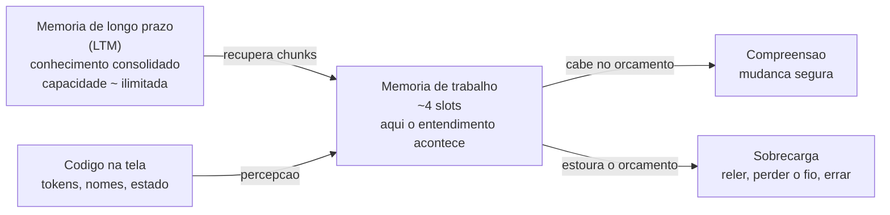
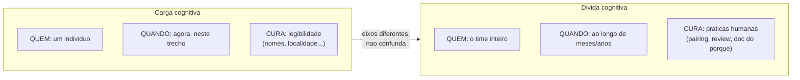
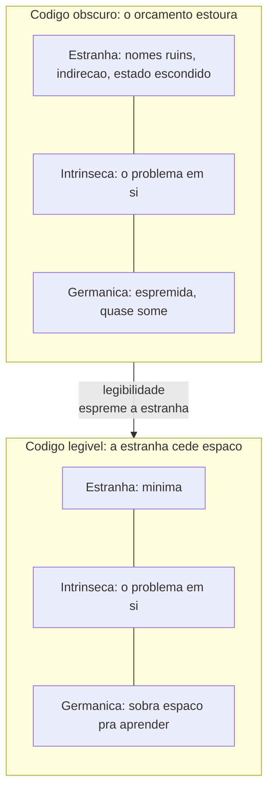
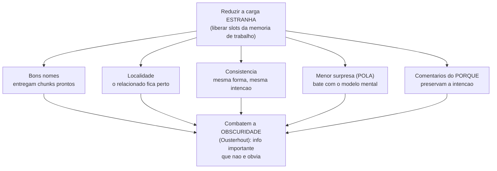

# Carga cognitiva e legibilidade

A nota anterior fechou dizendo que um módulo raso impõe um custo ao leitor: você paga em esforço mental cada vez que precisa entender uma interface inflada pra mudar algo com segurança ([[07 - Módulos profundos e rasos]]).

Esse custo tem nome — **carga cognitiva** — e é hora de olhar pra ele de frente.

Porque, no fim, todas as heurísticas de design das notas anteriores existem por um motivo só: código é **lido** muito mais vezes do que é **escrito**, e quem lê tem uma cabeça com capacidade finita.

> [!abstract] TL;DR
> **Carga cognitiva** é o esforço mental que você precisa gastar *agora* pra entender um trecho de código e mudá-lo com segurança. É **momentânea** e **individual** — uma propriedade de uma pessoa diante de uma tarefa, limitada pela memória de trabalho (que segura só ~4 chunks). Não confunda com **dívida cognitiva**, que é de **time** e se acumula ao **longo do tempo** ([[11 - Dívida cognitiva]]). A teoria da carga cognitiva (Sweller) separa três tipos — intrínseca (o problema é difícil mesmo), estranha (a apresentação ruim atrapalha) e germânica (o esforço que constrói entendimento) — e os dois primeiros mapeiam direto no par essencial/acidental ([[02 - Complexidade essencial vs. acidental]]). Legibilidade é o conjunto de alavancas que cortam a carga estranha: bons nomes, localidade, consistência e o **princípio da menor surpresa**. E cuidado com métricas: complexidade ciclomática mede *uma* faceta (ramificação de fluxo), não "a" dificuldade humana.

## O que é

**Carga cognitiva** (*cognitive load*) é a quantidade de esforço mental que uma tarefa exige da sua **memória de trabalho** — a parte da mente que segura e manipula informação ativa, o "RAM" do raciocínio.

Diante de um trecho de código, o que é a carga, concretamente?

É tudo que você precisa segurar na cabeça ao mesmo tempo pra entender o que ele faz:

- Quais variáveis estão em jogo e qual o estado atual.
- Que invariantes valem aqui.
- O que essa chamada faz lá embaixo.
- O que pode dar errado.

O detalhe que torna isso urgente é uma limitação dura da biologia: a memória de trabalho é **pequena**.

A estimativa clássica de **Miller** (1956) era "7 ± 2" itens. Mas o próprio Miller tratava esse número mais como recurso retórico do que como um limite duro.

O refinamento moderno, de **Nelson Cowan** (2001), é ainda mais modesto.

Quando se controla o ensaio mental e o apoio da memória de longo prazo, a capacidade real fica em torno de **4 chunks** processados ao mesmo tempo — não 7. (Cowan situa a faixa real entre 3 e 5.)

Quando a tarefa exige segurar mais do que cabe, você sofre **sobrecarga cognitiva**: passa a reler, a perder o fio, a errar.

Carga alta não é desconforto estético. É causa direta de **mais lentidão e mais bugs**.

> [!note] Carga é uma propriedade de quem lê, não só do código
> Duas pessoas diante do mesmo arquivo podem sentir cargas muito diferentes. Quem já tem o domínio na cabeça (chunks prontos, o *conhecimento prévio* de que a teoria fala) lê com folga; quem chega de fora afoga. Por isso carga cognitiva é **momentânea e individual** — depende da tarefa, do código *e* de quem está olhando agora. Não é um número fixo gravado no arquivo.

### O gargalo da memória de trabalho

O modelo mental que sustenta tudo nesta nota é uma cadeia com um gargalo no meio.

A **memória de longo prazo** (LTM) guarda, sem limite prático, o que você já sabe — sintaxe, padrões, o domínio.

A **memória de trabalho** é onde o entendimento acontece *agora*, e ela tem só ~4 slots.

O que liga as duas é o **chunk**: um pedaço de conhecimento já consolidado na LTM que ocupa *um único slot* na memória de trabalho.

É por isso que o especialista lê com folga.

Onde o iniciante vê dez tokens soltos (`for`, `(`, `int i`, `=`, `0`...), o especialista vê *um* chunk — "um loop padrão". Mesma capacidade de 4 slots, conteúdo muito mais denso.



Leitura do diagrama: o entendimento é o estreito de uma ampulheta — a LTM enche por cima, o código chega de lado, mas tudo precisa passar pelos ~4 slots da memória de trabalho; quem estoura esse orçamento desliza pra direita-baixo, pro território dos bugs.

## Carga cognitiva não é dívida cognitiva

Aqui mora a distinção mais importante desta nota — e a razão dela existir como âncora conceitual.

Três termos parecidos descrevem coisas diferentes, e confundi-los embaralha o diagnóstico:

| Conceito | Onde vive | Natureza |
| --- | --- | --- |
| **Débito técnico** | no código | atalhos estruturais que cobram juros em manutenção |
| **Carga cognitiva** | no indivíduo, no momento | esforço mental exigido por uma tarefa *agora* |
| **Débito cognitivo** | na mente coletiva, ao longo do tempo | erosão do entendimento compartilhado em nível de projeto |

A linha que separa os dois "cognitivos" é eixo e escala.

**Carga cognitiva** é *individual* e *instantânea*: o esforço que *você* gasta pra entender *este* trecho *agora*.

**Dívida cognitiva** é *coletiva* e *temporal*: a erosão, ao longo de meses, da [[04 - O programa como teoria|teoria do sistema]] que o *time* compartilha — o que acontece quando ninguém mais detém o porquê das decisões ([[11 - Dívida cognitiva]]).



Leitura do diagrama: as duas caixas compartilham a palavra "cognitiva" e nada mais — muda o *quem* (indivíduo × time), o *quando* (instante × duração) e, sobretudo, a *cura*; tratar uma com o remédio da outra é desperdício.

A consequência prática é que você pode atacar um sem mexer no outro.

Refatorar um nome ruim baixa a carga cognitiva de quem lê amanhã, mas não reconstrói sozinho o entendimento que o time perdeu. E um sistema com código impecável (carga baixa por trecho) pode estar afundado em dívida cognitiva, porque a teoria do conjunto se dissolveu.

Sob a lente da IA generativa, esse descolamento fica gritante — é o tema da nota de IA, que herda exatamente esta distinção ([[03-Dominios/Tecnologia/IA/O Lado Sombrio da IA/Débito cognitivo|Débito cognitivo (lente IA)]]).

> [!note] Por que a confusão é perigosa
> Quando alguém diz "esse código tem carga cognitiva alta", está falando de uma *experiência de leitura* — solúvel com legibilidade. Quando diz "estamos com dívida cognitiva", está falando de uma *perda organizacional de entendimento* — solúvel com práticas de time (pair programming, reviews, documentar o porquê). Tratar o segundo como se fosse o primeiro ("é só refatorar os nomes") é remédio errado pra doença errada.

## Os três tipos de carga

A **teoria da carga cognitiva** (*cognitive load theory*), formulada por **John Sweller** no fim dos anos 1980 no contexto de educação, separa a carga em três tipos.

Trazidos pro código, eles encaixam com precisão no par essencial/acidental ([[02 - Complexidade essencial vs. acidental]]):

- **Carga intrínseca** (*intrinsic*) — a dificuldade inerente ao próprio problema. Um algoritmo de consenso distribuído é difícil de entender porque consenso distribuído *é* difícil, não porque o código está mal escrito. Isso mapeia na **complexidade essencial**: é o piso irredutível, a dificuldade que nenhuma refatoração elimina.
- **Carga estranha** (*extraneous*) — o esforço imposto pela *apresentação* ruim, não pelo problema. Nomes enganosos, estado espalhado, indireção gratuita, formatação caótica: tudo que faz você gastar memória de trabalho com coisas que não são o problema. Isso é a **complexidade acidental** vivida pela cabeça do leitor — e é exatamente a parte que dá pra cortar.
- **Carga germânica** (*germane*) — o esforço *produtivo*, o que constrói entendimento durável (formar chunks, montar a teoria do sistema). Não é desperdício; é o trabalho mental que vira conhecimento.

O objetivo do bom design não é zerar toda carga. É liberar memória de trabalho da carga estranha pra sobrar capacidade pra intrínseca e germânica.

E aqui está o ponto que faz a teoria valer a pena: as três cargas competem pelo **mesmo orçamento finito**. Cada slot gasto com carga estranha é um slot a menos pro problema de verdade.



Leitura do diagrama: o orçamento (a altura de cada pilha) é fixo em ~4 slots; à esquerda a carga estranha engole quase tudo e sufoca a germânica; legibilidade não aumenta o orçamento — ela só desocupa a fatia estranha pra que o leitor caiba no problema.

> [!tip] A conta que importa
> Na teoria, as três cargas são aproximadamente **aditivas**: intrínseca + estranha + germânica = carga total, e a sobrecarga acontece quando a soma estoura a memória de trabalho. Você não controla a intrínseca (o problema é o que é) nem quer matar a germânica (ela é o aprendizado). O alvo do design — e da legibilidade — é uma coisa só: **espremer a carga estranha até quase zero**, pra que a cabeça do leitor caiba no problema de verdade.

## Chunking e os tipos de confusão

A ponte mais direta entre a psicologia cognitiva e o ato de ler código está em **Felienne Hermans**, *The Programmer's Brain* (2021).

A tese central é a do **chunking**: especialistas não leem código linha a linha como o iniciante — eles reconhecem *padrões* inteiros de uma vez.

Onde o novato vê dez tokens, o especialista vê um chunk ("isso é um null-check", "isso é um builder"). É a mesma capacidade de 4 slots usada com muito mais densidade, porque os chunks já estão prontos na LTM.

O corolário desconfortável é que a maioria dos chunks vem da *experiência*, não da inteligência.

Quem lê pouco código de um domínio não tem os chunks daquele domínio — e por isso afoga onde o veterano nada.

Hermans organiza a dificuldade de ler código em **três tipos de confusão**, cada um atrelado a um tipo de memória:

| Confusão | Falta de... | Memória envolvida | No código |
| --- | --- | --- | --- |
| **Falta de conhecimento** | saber *o que* algo significa | longo prazo (LTM) | um operador, uma API, um conceito de domínio que você nunca viu |
| **Falta de informação** | saber *como* algo funciona | curto prazo (STM) | precisa caçar a definição de um método em outro arquivo pra entender |
| **Falta de poder de processamento** | conseguir *executar* na cabeça | de trabalho | lógica densa demais pra simular mentalmente; precisa de papel ou debugger |

A leitura prática dessa tabela é um diagnóstico afiado.

Quando travar num código, pergunte *qual* confusão é a sua — porque cada uma tem uma cura diferente:

- **Falta de conhecimento** → estude (a cura é encher a LTM de chunks).
- **Falta de informação** → vá buscar a peça que falta (a cura está fora da sua cabeça, no código).
- **Falta de poder de processamento** → externalize: anote o estado, desenhe, use o debugger (a cura é tirar peso da memória de trabalho).

> [!note] Por que isso muda o design
> Boa parte da legibilidade é **fabricar chunks** pro leitor. Um nome como `daysSinceLastLogin` entrega um chunk pronto; um padrão consistente repetido pelo código vira um chunk que o leitor reaproveita. Design legível é, em boa medida, o ato de empacotar significado em pedaços que cabem num único slot da memória de trabalho de quem vem depois.

## O que aumenta a carga estranha

A carga estranha é a única das três que você projeta — e, portanto, pode *projetar away*.

Vale catalogar de onde ela vem, porque cada item é uma escolha que pode ser desfeita:

- **Aninhamento profundo.** Cada nível de indentação é um contexto que o leitor precisa segurar ("estou dentro do `if`, dentro do `for`, dentro do `try`..."). Três níveis já lotam a memória de trabalho.
- **Nomes ruins ou inconsistentes.** Um nome que mente, ou que muda de sentido entre arquivos, força o leitor a reconstruir o significado a cada uso.
- **Estado escondido e *action-at-a-distance*.** Quando uma variável global ou um efeito colateral distante muda o comportamento daqui, o leitor precisa segurar o mundo inteiro na cabeça pra ter certeza do que acontece.
- **Funções longas.** Quanto mais linhas, mais estado vivo o leitor acumula até o fim — e o estado vivo é exatamente o que ocupa slots.
- **Fluxo de controle surpreendente.** `goto`s morais, exceções usadas como controle de fluxo, retornos no meio de lugares improváveis: tudo que quebra a leitura linear de cima pra baixo.
- **Inconsistência.** Quando a mesma intenção aparece de cinco formas diferentes, o leitor não consegue reusar chunks e trata cada trecho como caso especial.

Repare que esses são, quase um a um, os culpados que a **Cognitive Complexity** penaliza (mais adiante) — e o oposto exato das alavancas de legibilidade a seguir.

Um exemplo concreto deixa o conceito tangível. Os dois trechos a seguir fazem *exatamente a mesma coisa*:

```js
// Carga estranha alta: aninhado, nomes opacos, fluxo torto
function f(u) {
  if (u) {
    if (u.s === 1) {
      if (u.b > 0) {
        return true;
      }
    }
  }
  return false;
}
```

```js
// Carga estranha baixa: linear, nomes que sao chunks, intencao na cara
function podeComprar(usuario) {
  if (!usuario) return false;
  const estaAtivo = usuario.status === ATIVO;
  const temSaldo = usuario.saldo > 0;
  return estaAtivo && temSaldo;
}
```

A complexidade *intrínseca* é idêntica nos dois — a regra de negócio é a mesma.

O que mudou foi só a carga *estranha*: o segundo achata o aninhamento (early-return), troca `u`/`s`/`b` por chunks legíveis e deixa a intenção (`podeComprar`) na assinatura.

Curiosamente, a complexidade *ciclomática* dos dois é parecida — mas a carga humana despencou. É exatamente o buraco que a próxima seção explora.

## Alavancas de legibilidade

Legibilidade é o nome do conjunto de escolhas que reduzem a **carga estranha**.

Vale lembrar o motivo de fundo: código é lido muito mais vezes do que é escrito, então otimizar pra escrita rápida à custa da leitura é trocar uma economia pequena por um imposto perpétuo.

As principais alavancas:

- **Bons nomes.** Um nome que diz o que a coisa é e faz poupa o leitor de reconstruir o sentido a partir do uso. `daysSinceLastLogin` é um chunk pronto; `d` força você a rastrear de onde veio e o que significa — pura carga estranha. (Nomear bem é, reconhecidamente, um dos problemas mais difíceis da computação.)
- **Localidade.** Coisas que mudam juntas devem ficar **perto**. Quando entender uma função exige pular entre sete arquivos, cada salto consome um slot da memória de trabalho que devia estar no problema. Manter o relacionado próximo é manter a cabeça do leitor inteira.
- **Consistência.** Quando o código segue padrões previsíveis (mesma forma pra mesma intenção), o leitor reaproveita chunks em vez de aprender cada trecho do zero. Inconsistência obriga a tratar tudo como caso especial.
- **Princípio da menor surpresa** (*principle of least astonishment*, POLA). Um componente deve se comportar do jeito que a maioria dos leitores **espera** — alinhado ao modelo mental deles. Um método chamado `getUser` que silenciosamente grava no banco viola o princípio: a surpresa custa caro, porque o leitor confiou no nome e errou. Seguir convenções da plataforma é a forma mais barata de não surpreender.
- **Comentários que capturam o *porquê*.** O código já mostra o *quê* e o *como*; o que se perde é a *intenção*. Um comentário que explica por que aquela escolha estranha existe poupa o leitor de arqueologia.



Leitura do diagrama: todas as alavancas miram o mesmo alvo de cima (cortar carga estranha) e desembocam no mesmo inimigo embaixo — a *obscuridade*; legibilidade é menos uma lista de regras e mais uma guerra de duas frentes contra o que não está óbvio.

Todas essas alavancas combatem o que Ousterhout chama de **obscuridade** (*obscurity*): quando uma informação importante pra entender o código **não é óbvia** — está implícita, escondida num efeito colateral, dependente de contexto que o leitor não tem.

Obscuridade é, nas palavras dele, um dos dois grandes sintomas de complexidade (o outro é a *change amplification* da nota 01). Legibilidade é, no fundo, a guerra contra a obscuridade.

> [!warning] "Eu entendo, então está claro"
> O autor de um trecho quase nunca sente a carga estranha que ele impõe — porque carrega na cabeça todo o contexto que o leitor não tem. "Pra mim está óbvio" é o viés que produz código obscuro. O teste honesto não é se *você* entende; é se alguém **sem o seu contexto** entende. Por isso code review e a pergunta "o que um leitor precisa saber que não está aqui?" valem mais que a sua própria sensação de clareza.

## A armadilha das métricas

Se carga cognitiva importa tanto, por que não medir e botar um número no CI?

Porque as métricas que temos medem **facetas**, não o todo — e tratar uma faceta como "a" complexidade é cair numa armadilha.

A métrica clássica é a **complexidade ciclomática** (*cyclomatic complexity*), proposta por **Thomas McCabe** em 1976.

Ela conta o número de caminhos linearmente independentes pelo grafo de fluxo de controle — na prática, quantos pontos de decisão (`if`, `for`, `case`, `&&`) o código tem, mais um.

Ela é útil: alta complexidade ciclomática sinaliza muitos ramos, e muitos ramos geralmente custam mais pra testar e seguir.

Mas ela mede **uma única coisa** — ramificação de fluxo — e é cega pra quase todo o resto que pesa na cabeça humana: nomes ruins, indireção, estado escondido, nível de aninhamento.

**Ciclomática baixa não implica carga cognitiva baixa.** Um `switch` gigante e plano pontua alto e é trivial de ler; três `if` aninhados dentro de um loop pontuam baixo e doem.

> [!warning] Goodhart: a métrica vira alvo
> *"When a measure becomes a target, it ceases to be a good measure."* No instante em que "complexidade ciclomática < 10" vira meta de CI, gente começa a fatiar funções só pra baixar o número — produzindo a *classitis* da nota anterior ([[07 - Módulos profundos e rasos]]): mais funções rasas, mais saltos, carga total maior, métrica menor. Use métricas como **detector de fumaça** (um trecho com número alto *merece um olhar*), nunca como **alvo** a otimizar.

Houve tentativas de aproximar melhor a dificuldade humana.

A mais conhecida é a **Cognitive Complexity** da **SonarSource** (white paper de **G. Ann Campbell**, 2018), criada explicitamente porque *"testability != understandability"*: a ciclomática mede testabilidade, não compreensibilidade.

A métrica da Sonar penaliza o que quebra o fluxo de leitura linear, com três regras:

- **Incremento básico** por cada estrutura que rompe a leitura linear (`if`, `for`, `catch`, operadores lógicos encadeados...).
- **Penalidade de aninhamento**: a estrutura ganha um incremento *extra* por cada nível em que está aninhada — um `for` no topo custa 1, um `if` dentro dele custa 2, outro dentro desse custa 3. É aqui que ela diverge da ciclomática e pune o que mais dói.
- **Sem penalidade** pra atalhos que *facilitam* a leitura (como um `switch` plano, que conta como um só).

É um proxy melhor que a ciclomática pra "quão difícil isso é de ler".

Mas continua sendo um **proxy**: aproxima o sintoma (controle de fluxo) e ainda ignora nomes, contexto e conhecimento prévio do leitor — justamente o que torna a carga *individual*.

Nenhum número captura a carga cognitiva inteira, porque parte dela mora na cabeça de quem lê, não no arquivo.

## Carga cognitiva de time

A ideia escala do indivíduo pro time.

Em *Team Topologies* (Matthew Skelton & Manuel Pais, 2019), a tese organizacional é que **um time também tem um orçamento de carga cognitiva**.

Esse orçamento é a soma do domínio, da tecnologia e da operação que aquelas pessoas precisam segurar na cabeça pra trabalhar bem.

Quando o time é responsável por mais sistemas (ou domínios mais complexos) do que cabe nesse orçamento, ele desacelera e erra — o mesmo sintoma de sobrecarga, agora coletivo.

A recomendação prática inverte a lógica usual.

Em vez de dimensionar o **bounded context** pela arquitetura e depois jogar um time nele, dimensione os contextos pra **caberem na carga cognitiva** de *um* time.

Um time, idealmente, é dono de um modelo de cada vez — você só consegue estar fundo num domínio por vez.

Isso conecta diretamente com a [[16 - Lei de Conway]]: se a estrutura social e a técnica se espelham, então respeitar o limite cognitivo das equipes *é* uma decisão de arquitetura.

> [!note] Carga de time ≠ dívida cognitiva
> Cuidado pra não embaralhar de novo. A "carga cognitiva de time" do *Team Topologies* ainda é **carga** — um orçamento *agora*, de quanta complexidade o time aguenta segurar. A **dívida cognitiva** ([[11 - Dívida cognitiva]]) é a erosão *ao longo do tempo* do entendimento que o time já teve. Uma é o teto de hoje; a outra é o vazamento lento de ontem pra amanhã.

## Armadilhas comuns

> [!warning] Usar complexidade ciclomática como proxy de legibilidade
> A métrica de McCabe conta ramificação de fluxo — nada mais. Um código com ciclomática baixa pode ter nomes opacos, estado escondido e três níveis de aninhamento; um `switch` gigante e plano pode ter ciclomática alta e ser trivial de ler. Tratar "ciclomática < 10" como sinônimo de "fácil de entender" ignora tudo que a carga estranha realmente cobra do leitor.

> [!warning] Confundir carga cognitiva com dívida cognitiva
> São eixos diferentes: carga é individual e momentânea (o esforço que *você* gasta *agora*); dívida é coletiva e temporal (a erosão do entendimento do *time* ao longo de meses). Refatorar um nome ruim baixa a carga de quem lê amanhã, mas não devolve ao time a teoria do sistema que ele perdeu. Diagnosticar dívida como se fosse carga leva a prescrever o remédio errado — "é só refatorar os nomes" não resolve uma perda organizacional de entendimento.

> [!warning] Atacar a carga intrínseca em vez da estranha
> A carga intrínseca é a dificuldade do próprio problema — nenhuma refatoração a elimina, porque ela não mora no código, mora no domínio. Gastar esforço tentando "simplificar" um algoritmo de consenso distribuído até ele parecer trivial é ilusório: ou a simplificação é falsa (esconde um caso que volta como bug), ou o que baixou foi carga estranha disfarçada de intrínseca. O alvo certo é sempre a carga que a apresentação impõe, não a que o problema impõe.

## Inglês

Boa parte do vocabulário desta nota carrega falsos amigos ou traduções capengas que valem a pena destravar.

**Germane** é o mais traiçoeiro dos três termos de Sweller. Não é "germânico" (falso cognato de aparência) nem "relevante" no sentido frouxo do dia a dia. No jargão da teoria, *germane load* é o esforço que efetivamente constrói esquema mental — a única das três cargas que você *quer* gastar, porque é ela que vira conhecimento durável.

**Principle of least astonishment** é a forma canônica na literatura mais antiga de design de linguagens; hoje aparece com frequência igual como **principle of least surprise**. Os dois termos são intercambiáveis — "astonishment" soa mais formal e é o que aparece nas fontes originais dos anos 1970, "surprise" é a variante mais coloquial que se popularizou depois.

**Obscurity**, no vocabulário de Ousterhout, não é "obscuridade" no sentido de "coisa rara" ou "pouco conhecida" — é informação importante que *deveria* estar visível e não está. E **chunking**, tomado emprestado direto da psicologia cognitiva, não tem tradução natural em português de uso corrente; "agrupamento" ou "fragmentação em blocos" perdem a precisão técnica do termo original.

| Português | Inglês |
| --- | --- |
| carga cognitiva | cognitive load |
| carga intrínseca | intrinsic load |
| carga estranha | extraneous load |
| carga germânica / produtiva | germane load |
| fragmentação em pedaços (memória) | chunking |
| princípio da menor surpresa | principle of least astonishment / least surprise |
| obscuridade | obscurity |
| legibilidade | readability |

## Em entrevista

Esta é uma das ideias que mais rende em entrevista sênior, porque conecta código a pessoas.

Como usá-la sem soar decorado:

- Quando pedirem pra você **avaliar legibilidade**, não diga "está feio". Diga *qual carga* o código impõe: "esse aninhamento de três níveis estoura a memória de trabalho de quem lê; achatar com early-returns corta carga estranha sem mudar o comportamento".
- Se citarem **métricas de complexidade**, mostre que você sabe o que cada uma mede *e não mede*: ciclomática = ramificação/testabilidade; Cognitive Complexity = aproximação da compreensibilidade; nenhuma captura nomes nem contexto. Bônus: cite Goodhart pra mostrar que entende o risco de virar meta.
- Se a conversa for de **arquitetura/times**, traga o orçamento de carga cognitiva do *Team Topologies* — é a ponte entre "código legível" e "organização que escala".
- O erro a evitar: tratar legibilidade como questão de gosto. O argumento forte é sempre o mesmo — código é lido muito mais do que escrito, a memória de trabalho tem ~4 slots, e legibilidade é engenharia pra caber nesse limite.

## O que vem a seguir

Carga cognitiva alta é um custo que se paga toda vez que alguém abre o arquivo — um imposto momentâneo, cobrado leitura após leitura, de uma pessoa de cada vez.

Mas o que acontece quando esse custo não é pago e amortizado, e sim adiado, sessão após sessão, review após review, até ninguém mais lembrar por que aquela decisão estranha existe?

Aí o esforço individual e pontual vira outra coisa: uma erosão coletiva que se acumula com o tempo. Esta nota já separou esse fenômeno da carga cognitiva — é a **dívida cognitiva** ([[11 - Dívida cognitiva]]), e ela é só uma de três dívidas que o software acumula.

A próxima nota abre o cofre: [[09 - As três dívidas do software]].

## Referências

- **George A. Miller** — *The Magical Number Seven, Plus or Minus Two* (1956), origem da estimativa "7 ± 2" itens em memória de curto prazo. Confirmado; o próprio Miller tratava o número como recurso retórico.
- **Nelson Cowan** — *The Magical Number 4 in Short-Term Memory: A Reconsideration of Mental Storage Capacity* (Behavioral and Brain Sciences, 2001). Refinamento moderno: controlado o ensaio e o apoio da LTM, a capacidade da memória de trabalho fica em ~4 chunks (faixa de 3 a 5), não 7. Confirmado por busca contra o paper e panoramas (Cambridge, ResearchGate).
- **John Sweller** — *Cognitive Load During Problem Solving: Effects on Learning* (Cognitive Science, 12(2), 257–285, 1988), origem da tríade **intrinsic / extraneous / germane** e da tese de que a **memória de trabalho** é o gargalo, com as cargas aproximadamente aditivas. [Cognitive Load During Problem Solving](https://doi.org/10.1207/s15516709cog1202_4). Verificado contra o registro do DOI e panoramas secundários; a aplicação ao **código** (intrínseca↔essencial, estranha↔acidental) é mapeamento desta nota, não afirmação literal de Sweller.
- **Felienne Hermans** — *The Programmer's Brain* (Manning, 2021). Origem (no contexto de código) do **chunking** por especialistas e dos **três tipos de confusão**: falta de conhecimento (LTM), falta de informação (STM) e falta de poder de processamento (memória de trabalho). Confirmado contra a editora (Manning/O'Reilly), o sumário e resumos do livro.
- **Thomas J. McCabe** — *A Complexity Measure* (IEEE TSE, 1976), origem da **complexidade ciclomática** como contagem de caminhos linearmente independentes no grafo de fluxo de controle (`M = E − N + 2P`). Confirmado.
- **G. Ann Campbell / SonarSource** — *Cognitive Complexity: A new way of measuring understandability* (white paper, 2018; também no *International Conference on Technical Debt 2018*). Métrica que penaliza aninhamento (incremento extra por nível) e quebras do fluxo linear, motivada por *"testability != understandability"*. Confirmado — é um proxy de compreensibilidade, não medida direta de carga.
- **John Ousterhout** — *A Philosophy of Software Design*, origem do termo **obscurity** (*obscuridade*) como um dos dois sintomas de complexidade. Ver lastro em [[07 - Módulos profundos e rasos]].
- **Princípio da menor surpresa** (*principle of least astonishment*, POLA) — formulado em publicação de design de linguagens de 1972; um componente deve se comportar como a maioria dos leitores espera, reduzindo carga cognitiva. Confirmado.
- **"Código é lido mais do que escrito"** — a formulação mais citada ("*code is read much more often than it is written*") é atribuída a **Guido van Rossum** (espírito da PEP 8 de Python); **Robert C. Martin** popularizou a versão quantitativa no *Clean Code* (2008): "the ratio of time spent reading vs. writing is well over 10 to 1". Esta nota usa a ideia, não cita autor único no corpo. Atribuição conferida por busca.
- **Lei de Goodhart** — *"When a measure becomes a target, it ceases to be a good measure"* — atribuída a Charles Goodhart; formulação canônica de Marilyn Strathern. Paráfrase fiel.
- **Matthew Skelton & Manuel Pais** — *Team Topologies: Organizing Business and Technology Teams for Fast Flow* (IT Revolution, 2019). Origem do uso organizacional de **carga cognitiva de time** como orçamento, e da recomendação de dimensionar bounded contexts pra caber na carga de um time. [Página oficial do livro](https://teamtopologies.com/book). Confirmado contra a página oficial e resumos do livro.
- **Simone Scalabrino et al.** — *Automatically Assessing Code Understandability: How Far Are We?* (ASE 2017, IEEE/ACM). Evidência empírica de que nenhuma métrica testada — incluindo as de complexidade e legibilidade assumidas como mais próximas do conceito — captura bem a compreensibilidade real do código; reforça, com dados, o argumento desta nota contra tratar a ciclomática como proxy confiável de carga cognitiva. [Automatically Assessing Code Understandability](https://www.semanticscholar.org/paper/Automatically-Assessing-Code-Understandability-Scalabrino-Bavota/ae6496ec4c6d34fec0c044187cc07c91c923f848). Confirmado via busca acadêmica (autoria, veículo e achado central).

> [!note] Sobre o lastro
> A tríade de cargas e a aditividade (Sweller), o limite de ~4 chunks (Cowan, refinando Miller), o chunking e os três tipos de confusão (Hermans), a ciclomática (McCabe), a Cognitive Complexity (Campbell/SonarSource), o POLA e a carga de time (Team Topologies) foram conferidos por busca contra fontes primárias e panoramas confiáveis. **Ressalva honesta:** não li o white paper da SonarSource, *The Programmer's Brain* nem os papers de Sweller/Cowan página a página; as afirmações reproduzem o argumento e o vocabulário com alta fidelidade, mas detalhes de fórmula e fraseado podem diferir da redação original. O mapeamento intrínseca↔essencial / estranha↔acidental é construção desta nota. Padrão de marcação seguindo [[06 - Abstrações que vazam]].

## Veja também

- [[07 - Módulos profundos e rasos]] — a interface rasa que impõe carga cognitiva ao leitor
- [[02 - Complexidade essencial vs. acidental]] — o par que carga intrínseca e estranha espelham
- [[11 - Dívida cognitiva]] — o conceito de time, ao longo do tempo, que esta nota não é
- [[16 - Lei de Conway]] — por que o orçamento cognitivo de um time é decisão de arquitetura
- [[Dicionário de Ciência da Computação]] — verbetes do domínio
