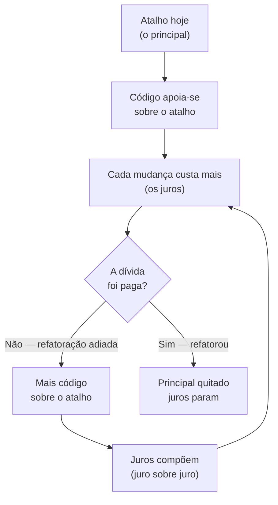
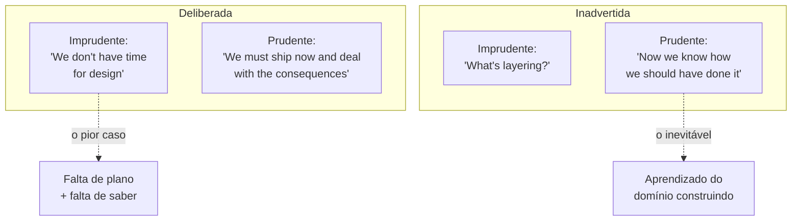
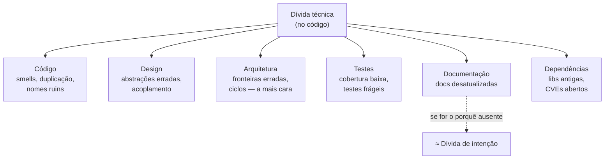
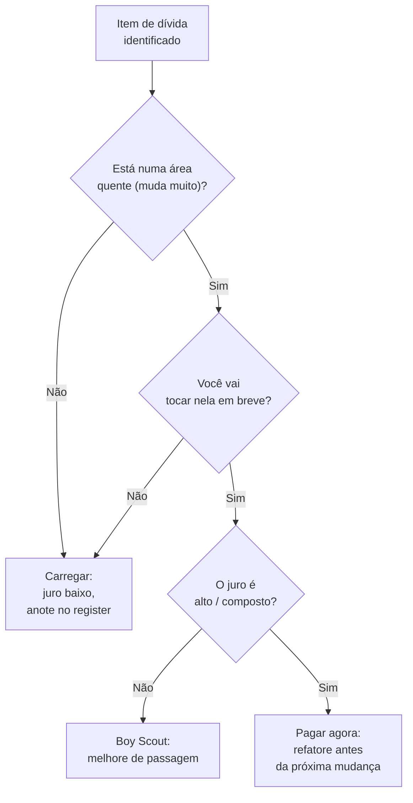

# Dívida técnica

A nota anterior apresentou o tabuleiro das três dívidas e prometeu aprofundar cada uma ([[09 - As três dívidas do software]]).

Esta é a primeira: a dívida que vive **no código** — a mais antiga, a mais famosa e, justamente por isso, a mais distorcida.

Quase todo mundo já usou a expressão "dívida técnica" numa reunião. Quase ninguém sabe que a metáfora original dizia algo bem diferente do que virou no boca a boca.

> [!abstract] TL;DR
> **Ward Cunningham** cunhou a metáfora da dívida em 1992 (relatório de experiência do WyCash, em OOPSLA). A ideia: *enviar* código com seu entendimento de primeira passada é como **pegar dinheiro emprestado** — tudo bem, *desde que você pague a dívida* refatorando à medida que aprende. O **principal** é o atalho; os **juros** são o arrasto de trabalhar contra código que não está bem certo, e eles **compõem** — quanto mais você carrega a dívida, mais cara fica cada mudança. **Nuance crucial e muito mal-citada:** a metáfora de Cunningham **nunca foi sobre escrever código ruim de propósito** — era sobre a *distância entre o seu entendimento atual e o código*. O **Quadrante de Fowler** (2009) refina: dívida pode ser *deliberada × inadvertida* e *prudente × imprudente* — nem toda dívida é falha moral. **Uncle Bob** corta o abuso da metáfora: *uma bagunça não é dívida técnica*. **McConnell** taxonomiza (intencional × não-intencional). Mede-se com **SQALE / SonarQube** (custo de remediação, *debt ratio*). Paga-se com **refatoração** ([[14 - Manutenção e evolução]]) e gerencia-se com a **Regra do Escoteiro** e um *debt register*; a meta é **gerenciar**, não zerar. E quando a dívida fica impagável, a tentação é o *rewrite* — quase sempre um erro (Spolsky). No fundo, dívida técnica é, em larga medida, **complexidade acidental acumulada no código** ([[02 - Complexidade essencial vs. acidental]]).

## O que é

A metáfora nasceu de um problema bem concreto.

Como Cunningham, trabalhando num produto financeiro (o WyCash), explicava a *stakeholders* por que valia a pena continuar mexendo num código que "já funcionava"?

A resposta foi falar a língua deles — a língua de finanças.

Por que finanças, e não engenharia? Porque *stakeholders* de um produto financeiro entendiam de empréstimo, juros e quitação muito melhor do que de coesão e acoplamento.

A metáfora foi, antes de tudo, um instrumento de **comunicação com o negócio** — e parte da distorção posterior vem de esquecer isso e tratá-la como uma teoria técnica fechada.

O trecho original, do relatório de OOPSLA 1992, é curto e cirúrgico:

> [!quote] Cunningham, WyCash (OOPSLA, 1992)
> *"Shipping first time code is like going into debt. A little debt speeds development so long as it is paid back promptly with a rewrite. [...] The danger occurs when the debt is not repaid. Every minute spent on not-quite-right code counts as interest on that debt."*

Repare na lógica: ir pra produção com o código que reflete seu entendimento *de agora* não é o erro — é até saudável, porque acelera o aprendizado.

Você só descobre o que o sistema realmente precisa ser *usando-o* — então entregar cedo é como o sistema te ensina.

O erro é **não pagar de volta**: deixar o "código não-quite-certo" acumular enquanto seu entendimento avança.

Cada minuto trabalhando contra esse código desalinhado **é juro**.

> [!warning] A metáfora que quase todo mundo cita errado
> A leitura popular de "dívida técnica" virou *"escrevemos código porco pra entregar rápido, e isso é a dívida"*. **Não é o que Cunningham disse.** Em 2009 ele gravou um vídeo (*"Debt Metaphor"*) justamente pra corrigir o mal-entendido. O ponto dele era a **distância entre o entendimento e o código** — não o desleixo deliberado. Nas palavras dele, a dívida é *"writing code to reflect your current understanding of a problem even if that understanding is partial"*; e mais — toda a metáfora *"depends upon you writing code that is clean enough to be able to refactor as you come to understand your problem"*. Ou seja: o código precisa estar **limpo o bastante pra ser refatorado**. Quem usa "dívida técnica" como desculpa pra entregar lixo inverteu o sentido original.

O que de fato corrói o sistema, segundo ele, é parar de devolver o aprendizado ao código:

> [!quote] Cunningham, "Debt Metaphor" (2009)
> *"I think that there were plenty of cases where people would rush software out the door and learn things but never, never put that learning back into the program and that by analogy was borrowing money thinking that you never had to pay it back."*

## Principal e juros

A metáfora financeira tem duas partes, e confundi-las atrapalha a conversa.

O **principal** é a quantia que você "tomou emprestada": o atalho de implementação em si — a abstração apressada, o módulo emaranhado, o caso de borda deixado pra depois.

Pagar o principal é fazer a refatoração que conserta aquilo de uma vez. É um custo *único e localizado*: você gasta um esforço definido e a dívida some.

Os **juros** são o que você paga *enquanto não quita o principal*: o esforço extra em **toda** mudança futura porque o sistema está mais difícil de entender e alterar do que precisava.

Lê-se um código mais confuso, testa-se mais à mão, tropeça-se mais em bugs colaterais.

O juro não é um evento — é um **imposto recorrente** sobre cada tarefa que toca a área endividada.

Onde os juros aparecem no dia a dia? Em sintomas que ninguém liga à dívida na hora:

- onboarding de gente nova que demora porque "ninguém entende esse módulo";
- estimativas que estouram porque a mudança "simples" abriu três bugs;
- medo de tocar numa área — o famoso "funciona, não mexe" — que congela features.

Cada um desses é juro sendo cobrado. A dívida não te manda um boleto; ela aparece diluída em mil pequenas fricções.

E o detalhe que torna a metáfora perigosa de verdade: **os juros compõem**.

Quanto mais tempo a dívida fica, mais código novo se apoia sobre o atalho, mais difícil fica refatorar, e mais cara fica cada mudança seguinte.

É a espiral que faz times relatarem que "tudo demora três vezes mais que antes" sem nenhuma feature individual ser difícil — eles estão pagando juros sobre juros.

Vale desenhar o ciclo, porque é nele que está o veneno da metáfora. Abaixo, o laço que transforma um atalho barato num imposto que só cresce:

Leitura do diagrama: o nó perigoso é o laço `C → E → F → C` — enquanto você não paga o principal, o sistema acumula código novo sobre o atalho e os juros se realimentam; só a refatoração (`D → G`) corta o ciclo.

Para sentir o "compõe" de forma concreta, imagine um atalho tomado no sprint 1 e nunca pago.

Cada feature seguinte que toca a área endividada custa um pouco mais, e parte desse custo é código novo que *também* se apoia no atalho — aumentando a base sobre a qual o próximo juro incide:

| Sprint | O que acontece | Custo da feature na área |
| --- | --- | --- |
| 1 | atalho tomado (principal) | normal |
| 3 | duas features já se apoiam nele | +20% |
| 6 | testes ficaram frágeis em volta | +50% |
| 10 | "ninguém mexe sem medo" | +120% |

Os números são ilustrativos, mas a *forma da curva* é real: não é linear, é acelerada. É por isso que "depois a gente arruma" quase sempre sai mais caro que parece — o "depois" cobra juros sobre juros.

> [!example] Por que a distinção importa na prática
> Imagine duas decisões. (A) "Vamos cortar esse atalho agora e refatorar na sprint que vem" — você *escolheu o principal de olho aberto*, com plano de quitar. (B) "Faz três anos que ninguém mexe nesse módulo porque ninguém entende" — aí você não está pagando o principal nem percebe os juros; só sente que tudo é lento. O mesmo emaranhado de código pode ser dívida **gerenciada** (A) ou dívida **fora de controle** (B). A diferença não está no código — está em se você sabe que tem a dívida e tem plano de pagá-la.

## O quadrante de Fowler

A genialidade do relatório de Cunningham era também sua armadilha.

Ao virar slogan, "dívida técnica" passou a tratar *qualquer* imperfeição como pecado.

**Martin Fowler** resolveu isso em 2009 com o **Technical Debt Quadrant**, que cruza dois eixos e mostra que **nem toda dívida é igual** — e nem toda é falha moral.

Os dois eixos são:

- **deliberada × inadvertida** — você *sabia* que estava criando dívida?
- **prudente × imprudente** — a decisão foi pensada ou irresponsável?

| | **Imprudente** (reckless) | **Prudente** (prudent) |
| --- | --- | --- |
| **Deliberada** (deliberate) | *"We don't have time for design"* — pressa cega, sem plano de pagamento | *"We must ship now and deal with the consequences"* — atalho consciente, com plano de quitar |
| **Inadvertida** (inadvertent) | *"What's layering?"* — ignorância de fundamentos; nem sabe que está se endividando | *"Now we know how we should have done it"* — só dá pra ver o desenho certo *depois* de construir |

O mesmo quadrante, em forma de mapa, ajuda a fixar onde cada caso cai:

Leitura do diagrama: as quatro frases canônicas de Fowler ocupam os quatro cantos; a seta tracejada marca os dois extremos que mais importam na conversa — o canto imprudente/inadvertido (o pior) e o prudente/inadvertido (o inevitável).

O quadrante mais nocivo é o **inadvertido/imprudente** ("o que é camada?"): dívida que você acumula sem saber, por não dominar o básico.

O mais defensável é o **inadvertido/prudente** ("agora sabemos como deveríamos ter feito") — e ele é praticamente **inevitável**, porque o entendimento de um domínio só amadurece *construindo* (exatamente o ponto de Cunningham: você escreve com o entendimento parcial de hoje).

O **deliberado/prudente** é uma decisão de negócio legítima: entregar antes pra validar mercado, e pagar a dívida com a receita depois.

E o **deliberado/imprudente** ("não temos tempo pra design") é o mais traiçoeiro: parece pragmatismo, mas é o atalho *sem plano de pagamento* — a porta de entrada da bagunça que Uncle Bob denuncia.

O segredo de leitura do quadrante é que o eixo **prudente × imprudente** importa mais do que o **deliberada × inadvertida**.

A dívida inadvertida você não tinha como evitar (não sabia ainda); o que define se ela vai te afundar é se, ao descobri-la, você age com prudência (anota, prioriza, paga) ou imprudência (ignora). A moral da história não está em *como* a dívida entrou — está em *o que você faz* depois que ela está lá.

> [!tip] O que o quadrante te dá
> Ele desarma duas conversas ruins. Contra o gerente que ouve "dívida técnica" e pensa "negligência", você mostra que existe dívida *prudente e inevitável* — a que vem de aprender o domínio. Contra o colega que romantiza qualquer gambiarra como "decisão pragmática", você aponta o quadrante imprudente e pergunta: cadê o plano de pagamento? A dívida deixa de ser xingamento ou desculpa e vira o que sempre foi pra Cunningham: um *trade-off* a administrar.

## "A mess is not a technical debt" (Uncle Bob)

Fowler mostrou que nem toda dívida é igual. **Robert C. Martin (Uncle Bob)** foi além e, no mesmo ano de 2009, traçou a fronteira que mais gente atravessa errado: *uma bagunça não é dívida técnica.*

A distinção, pra Uncle Bob, está no **caráter da decisão** — não no resultado no código.

Dois trechos podem ser igualmente emaranhados; o que os separa é se houve uma escolha racional por trás.

Dívida técnica é uma escolha *racional*, tomada sob restrições reais de projeto:

> [!quote] Robert C. Martin, "A Mess is not a Technical Debt" (2009)
> *"Technical debt decisions are made based on real project constraints. They are risky, but they can be beneficial."*

Uma bagunça (*a mess*) é o oposto — não tem racionalidade, nem plano, nem retorno possível:

> [!quote] Robert C. Martin, "A Mess is not a Technical Debt" (2009)
> *"The decision to make a mess is never rational, is always based on laziness and unprofessionalism, and has no chance of paying off in the future."*

A consequência é contraintuitiva e poderosa.

Assumir dívida técnica deveria **aumentar** o rigor profissional, não diminuí-lo.

Soa paradoxal: se vou tomar um atalho, por que ficar *mais* cuidadoso?

Porque o atalho só compensa se a dívida for **pagável** — e dívida só é pagável se o código em volta estiver limpo o bastante pra ser refatorado. Quem toma dívida de propósito precisa de *mais* teste, *mais* refatoração, *mais* disciplina — não menos:

> [!quote] Robert C. Martin, "A Mess is not a Technical Debt" (2009)
> *"When you decide to take on a technical debt, you had better make sure that your code stays squeaky clean."*

A analogia dele é a da hipoteca: quem assume uma dívida financeira grande de forma responsável *aperta* o orçamento e aumenta o controle — não relaxa.

Isto fecha o círculo com Cunningham: a metáfora **exige** código limpo o bastante pra ser refatorado. "Bagunça em nome de dívida técnica" é uma contradição em termos.

> [!example] Bagunça ou dívida? O teste de uma pergunta
> Há um teste simples pra separar os dois no dia a dia: *você consegue dizer o que ganhou ao tomá-la, e tem um plano pra pagá-la?* Se a resposta é "ganhamos a entrega de outubro, e o item está no backlog pra a sprint que vem" — é dívida. Se a resposta é "ninguém sabe por que está assim, foi ficando" — é bagunça. Dívida tem contrato implícito; bagunça é dívida que ninguém assinou e ninguém vai honrar.

## Tipos de dívida técnica

"Dívida no código" é só a entrada da taxonomia. Quando a comunidade acadêmica tentou organizar o vocabulário (Alves et al., *Towards an Ontology of Terms on Technical Debt*, 2014/2016), apareceu uma lista bem maior de *onde* a dívida mora.

As variedades que mais aparecem na prática:

- **Dívida de código** — o emaranhado local: duplicação, métodos longos, nomes ruins, *code smells*. É o que ferramentas de análise estática pegam direto.
- **Dívida de design** — abstrações erradas, violações de princípios (SRP, acoplamento), decisões de modelagem que travam a evolução.
- **Dívida de arquitetura** — a mais cara: fronteiras de módulo erradas, dependências cíclicas, escolhas estruturais que custam meses pra reverter.
- **Dívida de testes** — cobertura baixa, testes frágeis, ausência de testes onde mais se mexe; encarece toda mudança porque tira a rede de segurança.
- **Dívida de documentação** — docs ausentes, desatualizadas ou erradas. (Cuidado: a parte que é *rationale ausente* tende mais à [[12 - Dívida de intenção|dívida de intenção]].)
- **Dívida de dependências** — bibliotecas e runtimes desatualizados, versões presas, CVEs não corrigidos; cobra juros em segurança e em compatibilidade.

Leitura do diagrama: os seis ramos são *espécies* da dívida que vive no código; a seta tracejada lembra que parte da "dívida de documentação" (o *rationale*, o porquê) na verdade pertence à dívida de intenção, não a esta nota.

> [!note] Por que arquitetura é a dívida mais cara
> A regra empírica: quanto mais cedo na pilha de decisões a dívida mora, mais caro é o juro e a remediação. Trocar um nome de variável é minutos; trocar uma fronteira de módulo que vinte serviços assumem é um projeto. Por isso dívida de arquitetura raramente é "prudente/inadvertida sem dor" — quando você descobre que o desenho estava errado, já tem muito código apoiado nele.

### Dívida auto-confessada (SATD)

Existe um tipo de dívida que o próprio código *admite*: a **dívida auto-confessada** (*self-admitted technical debt*, SATD), termo cunhado por Potdar e Shihab (2014).

São os comentários em que o desenvolvedor reconhece, na hora, que está deixando algo torto:

- `// TODO: this method is too complex, let's break it up`
- `// FIXME: hack to allow the full URL in the host field`
- `// HACK`, `// XXX`, `// ugly`, `// may cause problem`

A pesquisa achou SATD em ~31% dos arquivos-fonte de quatro sistemas Java grandes. É dívida deliberada *e* confessada — o caso mais saudável da metáfora: você não só assumiu, como **deixou um bilhete** pra o próximo (ou pro você futuro).

Por isso varrer `TODO`/`FIXME`/`HACK` é o *debt register* mais barato que existe — está embutido no próprio código. O perigo é o bilhete que ninguém lê de novo: SATD que vira fóssil é dívida que você confessou e nunca pagou.

## Como se reconhece

Antes de medir, é preciso *ver*. A superfície visível da dívida de código tem nome desde Kent Beck e Martin Fowler: os **code smells** ("cheiros" de código) — sinais locais de que algo está mais difícil do que precisava.

Não são bugs; são pistas. O código com *smell* funciona — só cobra juros.

Os clássicos, que todo *code review* aprende a farejar:

- **Métodos longos** e **classes deus** — fazem coisas demais; difícil de entender e testar.
- **Código duplicado** — a mesma lógica em N lugares; uma correção vira N correções.
- **Inveja de feature** (*feature envy*) — um método que mexe mais nos dados de outra classe do que nos seus; sinal de fronteira errada.
- **Listas de parâmetros longas** e **obsessão por primitivos** — abstração que não foi criada.
- **Comentários que pedem desculpa** — o `// I know this is ugly`, que é também SATD.

> [!note] Cheiro não é dívida — é o sintoma dela
> Um *smell* é o *sintoma* na superfície; a dívida é a *condição* embaixo. Por isso ferramentas de análise estática medem dívida contando smells e violações: o smell é o que dá pra automatizar. Mas cuidado — nem todo smell vale pagar. Um método longo num arquivo que ninguém toca há anos é juro quase zero. O smell te diz *onde olhar*; o *churn* te diz *se importa*.

## Como se mede

Falar em "muita dívida" sem número é palpite — e palpite perde a discussão de prioridade pra qualquer feature que tenha um valor em reais ao lado.

Por isso a indústria convergiu numa forma de **estimar** a dívida em tempo ou dinheiro: o método **SQALE** (*Software Quality Assessment based on Lifecycle Expectations*), de Jean-Louis Letouzey, publicado em 2010 e adotado por ferramentas como o **SonarQube**.

A ideia central do SQALE é o **custo de remediação**.

Para cada problema de manutenibilidade detectado, estima-se o esforço (em minutos) pra corrigi-lo.

A soma desses custos é a **dívida técnica** do projeto, expressa em tempo (ex.: "37 dias de dívida"). É uma forma de transformar uma intuição ("isso aqui está ruim") num número que cabe num roadmap.

Em cima disso, o SonarQube calcula o **Technical Debt Ratio**:

> [!info] A conta do *debt ratio*
> `debt ratio = custo de remediação ÷ (custo de desenvolver o código do zero)`
> O denominador é estimado como *custo de desenvolver uma linha × número de linhas* — com o custo por linha configurável (padrão histórico: **30 minutos/linha** no SonarQube). É uma razão entre "quanto custa consertar" e "quanto custou construir".

Um exemplo torna a fórmula tangível.

Suponha 100 mil linhas e 30 minutos por linha: o custo de "construir do zero" estimado é 3 milhões de minutos. Se a soma das remediações dá 150 mil minutos, o *debt ratio* é 5% — bem na fronteira entre nota A e B.

Repare que o denominador cresce com o tamanho do código: o mesmo problema absoluto "pesa" menos num sistema grande. É uma razão *relativa*, de propósito.

Essa razão vira uma **nota de manutenibilidade** (a *Maintainability Rating*, herdeira do SQALE Rating), de A a E:

| Nota | Debt ratio |
| --- | --- |
| **A** | ≤ 5% |
| **B** | 5% – 10% |
| **C** | 10% – 20% |
| **D** | 20% – 50% |
| **E** | > 50% |

> [!warning] O número é uma estimativa, não uma verdade
> O *debt ratio* é útil *como tendência* — está subindo ou descendo? — mas é frágil como valor absoluto. Ele só captura o que a regra estática consegue ver (smells, complexidade ciclomática, duplicação); **não enxerga dívida de arquitetura nem de intenção** — justamente as mais caras. Um sistema com nota A no SonarQube ainda pode ter uma fronteira de módulo desastrosa. Use o número pra vigiar a curva, não pra declarar saúde.

## Como se gerencia

O objetivo não é zerar a dívida — é mantê-la **sob controle**.

> [!warning] Dívida zero é tão irracional quanto dívida descontrolada
> O erro simétrico ao "ignorar a dívida" é querer **zerá-la** sempre. Pagar toda dívida o tempo todo é tão irracional quanto na vida financeira — há dívida que *vale a pena carregar*. A dívida deliberada/prudente do quadrante é literalmente isso: às vezes o juro de carregar um atalho por seis meses é mais barato que o custo de oportunidade de não entregar agora. A meta de um time sênior não é dívida zero — é saber qual dívida tem, quanto de juro ela cobra, e quitar a que está cara antes que componha.

Três práticas, da mais barata à mais cara, formam o repertório de quem mantém a dívida sob controle.

A mais barata é a **Regra do Escoteiro** (*Boy Scout Rule*), que Uncle Bob trouxe pro software no *Clean Code* (2008): *"deixe o acampamento mais limpo do que você o encontrou"*.

Toda vez que você toca um arquivo, melhore-o um pouquinho — um nome, um teste, uma extração.

Por que isso funciona melhor do que o "grande mutirão de refatoração"? Porque o mutirão quase nunca acontece — ele compete com features e perde.

Já a melhoria de passagem é gratuita: você já estava ali, já entendeu o trecho, já vai commitar. Mil melhorias minúsculas, ao longo do tempo, reformam um sistema sem nunca pedir um "projeto de refatoração". É como pagar juros antes que componham.

A do meio é o **registro de dívida** (*debt register* / *backlog* de dívida): tornar a dívida **visível e rastreável**.

Isto é exatamente o que separa dívida prudente de bagunça, na chave de Uncle Bob — dívida você *anota e decide*; bagunça você esconde.

Um item de dívida bem registrado responde a três perguntas: *onde* dói (qual módulo), *quanto* custa (o juro estimado) e *qual o gatilho* pra pagá-la ("quando formos mexer em pagamentos de novo"). Sem isso, vira uma lista de boas intenções que ninguém lê.

A mais cara é o **orçamento de refatoração**: reservar capacidade fixa (ex.: 10–20% de cada ciclo) pra quitar principal nas áreas mais quentes — onde o código mais muda, porque é lá que o juro composto mais dói.

Por que reservar *fixo* em vez de "refatorar quando sobrar tempo"? Porque tempo nunca sobra.

A dívida compete com features pela mesma capacidade, e features quase sempre ganham a discussão de curto prazo. Um orçamento fixo tira a refatoração do campo da boa vontade e a coloca no campo da política do time — é a única forma de pagar principal grande de forma sustentável.

> [!tip] "Make the change easy, then make the easy change"
> A frase de Kent Beck resume a tática de pagar dívida *no caminho* de uma feature: antes de fazer a mudança que o negócio pediu, refatore o código pra que essa mudança fique fácil — e só então faça a mudança fácil. É refatoração com retorno imediato, e o elo direto entre dívida técnica e [[14 - Manutenção e evolução|manutenção e evolução]], onde a mecânica da refatoração mora.

A refatoração é a moeda comum de tudo isto: mudar a *estrutura* do código **sem mudar o comportamento** observável.

É devolver ao código o entendimento que você ganhou — o "pagar de volta" da metáfora original.

Há uma quarta prática que não é técnica, mas decide se as três acima sobrevivem: **comunicar a dívida na língua do negócio.**

Lembre que a metáfora nasceu disso — Cunningham inventou "dívida" pra falar com *stakeholders*, não com engenheiros.

O erro clássico é pedir "tempo pra refatorar" como se fosse um capricho estético. O movimento certo é traduzir em **risco e velocidade**:

- "essa área cobra +X% em cada feature; pagar agora libera o roadmap do Q3";
- "sem quitar isto, o próximo incidente nesse módulo vai levar dias, não horas";
- "esse atalho foi a entrega de outubro — combinamos pagar em novembro; é novembro."

> [!warning] A dívida é invisível até virar crise
> O perigo político da dívida técnica é que ela não tem sintoma visível pro negócio *até* explodir. Por meses, "tudo está um pouco mais lento" não aparece em nenhum gráfico — até o dia em que uma feature trivial leva três semanas, ou um incidente derruba produção. Quem só fala de dívida na hora da crise já perdeu a discussão. O *debt register* e as métricas do SonarQube existem justamente pra tornar o invisível *visível antes* — pra que a conversa aconteça quando o juro ainda é barato.

> [!note] Por que isto é, no fundo, complexidade acidental
> Dívida técnica e [[02 - Complexidade essencial vs. acidental|complexidade acidental]] são quase o mesmo fenômeno vistos por ângulos diferentes. Brooks distingue a complexidade que vem do *problema* (essencial, irredutível) da que vem da *forma como o representamos* (acidental, redutível). A dívida técnica é, em larga medida, **complexidade acidental que se acumulou no código** — emaranhado, duplicação, abstrações erradas que ninguém limpou. Refatorar é, em larga medida, **remover acidental**. A diferença de foco: "complexidade acidental" descreve o *estado* do código; "dívida técnica" acrescenta a *dimensão temporal e econômica* — o juro que esse estado cobra ao longo do tempo. E é por isso que ela vive **no código**, distinta da cognitiva (nas pessoas) e da de intenção (nos artefatos) — [[09 - As três dívidas do software]].

## Pagar agora ou depois?

Nem toda dívida vale ser paga já. **McConnell** (2007–2008) deu o eixo que falta: dívida pode ser *intencional × não-intencional* e *de curto × longo prazo*.

Dívida intencional é a que o time assume estrategicamente, de olho aberto; não-intencional é "o resultado não-estratégico de fazer um trabalho ruim".

Repare como McConnell e Uncle Bob conversam: a dívida *não-intencional* de McConnell é quase a *bagunça* de Uncle Bob — a diferença é que McConnell ainda a chama de dívida, e Uncle Bob recusa o nome.

O eixo de prazo importa pra priorização: dívida de **curto prazo** (paga no próximo ciclo) é barata e pontual; dívida de **longo prazo** que fica anos no sistema é a que mais compõe juros. O perigo mora na de longo prazo que ninguém marcou pra pagar.

A decisão de quitar agora ou carregar depende de poucas perguntas práticas:

Leitura do diagrama: a prioridade segue o **juro**, não a feiura. Dívida em área fria que ninguém vai tocar fica no *register* (juro quase nulo); dívida em área quente e cara você quita antes que os juros componham.

A regra de bolso, então, não é "refatore tudo" nem "nunca refatore".

É: **ataque primeiro a dívida nas áreas que mais mudam**, porque é onde o juro composto mais machuca.

Deixe a dívida fria viver no registro, anotada e barata. Refatorar código que ninguém vai tocar é pagar principal de uma dívida que não cobra juro — esforço sem retorno.

> [!tip] Como achar a "área quente" sem adivinhar
> Não é palpite — é dado. O histórico do Git mostra quais arquivos mudam com mais frequência (*change frequency*); cruze isso com uma métrica de complexidade (do SonarQube, por exemplo) e você tem um mapa de risco. Arquivo que muda muito **e** é complexo é onde o juro composto está mais alto — exatamente onde pagar primeiro. Esse cruzamento (complexidade × *churn*) é a análise de *hotspots*, na linha de Michael Feathers e popularizada por Adam Tornhill. É a forma mais barata de priorizar dívida sem depender de quem grita mais alto na retrospectiva.

## Falência e o mito do rewrite

Há um ponto em que a dívida fica **impagável**: o juro consome tanto do esforço que nenhuma feature anda.

É a **falência técnica** — o time gasta a maior parte da energia só mantendo o sistema de pé, e quase nada em valor novo.

E a tentação imediata é a mais sedutora e perigosa de todas: *jogar tudo fora e reescrever do zero*.

Quase sempre é um erro. O texto clássico é de **Joel Spolsky**, *"Things You Should Never Do, Part I"* (2000), sobre a Netscape:

> [!quote] Joel Spolsky, "Things You Should Never Do, Part I" (2000)
> *"They did. They threw away the code and started from scratch. [...] the single worst strategic mistake that any software company can make: They decided to rewrite the code from scratch."*

O caso Netscape é a parábola: ao reescrever o navegador do 4.0 pro 6.0, a empresa ficou **quase três anos sem lançar versão competitiva** — e perdeu o mercado pra Internet Explorer nesse buraco. Nunca houve um Netscape 5.0.

Por que rewrites costumam fracassar?

O argumento de Spolsky é que código antigo e feio *não é* dívida pura — é **conhecimento acumulado**.

> [!quote] Joel Spolsky, "Things You Should Never Do, Part I" (2000)
> *"Each of these bugs took weeks of real-world usage before they were found. [...] When you throw away code and start from scratch, you are throwing away all that knowledge."*

Cada correção feia naquele código resolveu um bug real que levou semanas pra aparecer. Reescrever joga fora essa cura, e você vai **redescobrir os mesmos bugs**, um por um.

Há ainda o erro de percepção que torna o rewrite tão tentador.

É mais difícil *ler* código do que *escrevê-lo* — então o código de outra pessoa (ou o seu de um ano atrás) sempre parece pior do que é. O programador olha o emaranhado, não entende, e conclui "está tudo errado, melhor recomeçar". Mas grande parte daquele emaranhado é conhecimento que ele simplesmente ainda não decifrou.

E o blackout cobra o seu próprio juro: enquanto você reescreve por dois ou três anos, o concorrente continua lançando features sobre o sistema "feio" que funciona. O rewrite não é só caro em esforço — é caro em **tempo de mercado parado**.

A diferença entre falência técnica e bancarrota financeira é instrutiva.

Na vida real, a falência às vezes é a saída racional: você zera as dívidas e recomeça. No software, "zerar e recomeçar" é justamente a armadilha — porque o ativo que você jogaria fora (o conhecimento embutido no código) é exatamente o que vale a pena preservar.

> [!tip] A alternativa ao rewrite
> Em vez do *big rewrite*, a saída sã é a refatoração incremental — o "Strangler Fig" de Fowler: estrangular o sistema velho aos poucos, módulo a módulo, com o sistema rodando o tempo todo. Você redireciona uma fatia do tráfego pro código novo de cada vez, e o sistema antigo vai minguando até sumir. Você paga o principal em parcelas, sem o blackout de três anos. Rewrite total só se justifica quando a plataforma morreu de verdade (linguagem/runtime sem futuro), não porque o código "está feio".

## Em entrevista

> [!tip] Como falar de dívida técnica sem clichê
> O movimento que sinaliza senioridade é **separar principal de juros e citar o quadrante**. Frase de efeito: *"Technical debt isn't bad code — it's the gap between the code and our current understanding, and the interest is what we pay on every change until we close that gap."* Mostre que você sabe que a metáfora de Cunningham foi **mal-citada**: ela nunca defendeu escrever código ruim — ela *exige* código limpo o bastante pra ser refatorado. Use o quadrante de Fowler pra desarmar o falso dilema "refatorar tudo vs. nunca refatorar": *"Some debt is prudent and deliberate — we take it on purpose with a payback plan. The goal isn't zero debt, it's debt you've chosen and can service."* Se perguntarem "como você prioriza dívida técnica?", responda em termos de **juros**: ataque primeiro a dívida nas áreas que mais mudam. E se alguém propuser reescrever do zero, cite Spolsky: *"Old code isn't debt — it's knowledge. A rewrite throws away all the bugs you already paid to fix."*

## Referências

- **Ward Cunningham** — *The WyCash Portfolio Management System* (relatório de experiência, OOPSLA 1992). A cunhagem da metáfora: *"Shipping first time code is like going into debt... Every minute spent on not-quite-right code counts as interest on that debt."* [c2.com/doc/oopsla92.html](https://c2.com/doc/oopsla92.html)
- **Ward Cunningham** — *Debt Metaphor* (vídeo, 2009). A correção do mal-entendido: a dívida é *"writing code to reflect your current understanding of a problem even if that understanding is partial"*, e a metáfora *"depends upon you writing code that is clean enough to be able to refactor as you come to understand your problem"*; mais o *"borrowing money thinking that you never had to pay it back"*. Transcrição em [cmdev.com/papers/debt-metaphor](https://cmdev.com/papers/debt-metaphor/).
- **Martin Fowler** — *Technical Debt Quadrant* (bliki, 2009). Os dois eixos (deliberate × inadvertent, prudent × reckless) e os quatro exemplos canônicos (*"We don't have time for design"*, *"We must ship now..."*, *"Now we know how we should have done it"*, *"What's layering?"*). [martinfowler.com/bliki/TechnicalDebtQuadrant.html](https://martinfowler.com/bliki/TechnicalDebtQuadrant.html)
- **Robert C. Martin (Uncle Bob)** — *A Mess is not a Technical Debt* (blog, 22/09/2009). A fronteira entre dívida (decisão racional sob restrições reais) e bagunça (*"never rational... no chance of paying off"*), e o *"keep your code squeaky clean"*. [sites.google.com/site/unclebobconsultingllc/a-mess-is-not-a-technical-debt](https://sites.google.com/site/unclebobconsultingllc/a-mess-is-not-a-technical-debt)
- **Robert C. Martin** — *Clean Code* (2008). A origem da **Regra do Escoteiro** no software: "deixe o código mais limpo do que você o encontrou" (adaptada do lema escoteiro de Baden-Powell).
- **Narayan Potdar, Emad Shihab** — *An Exploratory Study on Self-Admitted Technical Debt* (ICSME 2014). Cunhagem de **SATD**: dívida que o desenvolvedor confessa em comentários (`TODO`, `FIXME`, `HACK`, `XXX`); encontrada em ~31% dos arquivos de quatro sistemas Java grandes.
- **Steve McConnell** — taxonomia da dívida (2007–2008): intencional (estratégica) × não-intencional ("o resultado não-estratégico de fazer um trabalho ruim"), e curto × longo prazo. Amplamente adotada na academia (Construx).
- **Alves, Mendes, de Mendonça, Spínola, Shull, Seaman** — *Towards an Ontology of Terms on Technical Debt* (IEEE MTD, 2014; consolidada no Dagstuhl Seminar 16162, 2016, Avgeriou, Kruchten, Ozkaya, Seaman). A taxonomia dos *tipos* de dívida (code, design, architecture, test, documentation, build, defect, infrastructure, requirement etc.). [ieeexplore.ieee.org/document/6974882](https://ieeexplore.ieee.org/document/6974882)
- **Jean-Louis Letouzey** — *The SQALE Method* (2010+). Custo de remediação somado = dívida em tempo; o SonarQube implementa o *Technical Debt Ratio* (`remediação ÷ custo de construir do zero`, ~30 min/linha) e a *Maintainability Rating* A–E (A ≤ 5%, B 5–10%, C 10–20%, D 20–50%, E > 50%). [sonarsource.com/blog/sqale-the-ultimate-quality-model-to-assess-technical-debt](https://www.sonarsource.com/blog/sqale-the-ultimate-quality-model-to-assess-technical-debt) e [docs.sonarsource.com](https://docs.sonarsource.com/sonarqube-server/2025.1/user-guide/code-metrics/metrics-definition).
- **Kent Beck, Martin Fowler** — *code smells* (capítulo "Bad Smells in Code", em *Refactoring*, Fowler, 1999/2018). Os "cheiros" (métodos longos, duplicação, *feature envy* etc.) como sintomas locais de dívida de código que guiam a refatoração.
- **Michael Feathers** — análise de *hotspots* (complexidade × frequência de mudança / *churn*) pra priorizar refatoração; popularizada em ferramentas por Adam Tornhill (*Your Code as a Crime Scene*; CodeScene). Arquivo complexo que muda muito é onde o juro composto mais dói.
- **Joel Spolsky** — *Things You Should Never Do, Part I* (Joel on Software, 06/04/2000). O caso Netscape: reescrever do zero como *"the single worst strategic mistake"*; código velho é conhecimento acumulado, não só dívida. [joelonsoftware.com/2000/04/06/things-you-should-never-do-part-i](https://www.joelonsoftware.com/2000/04/06/things-you-should-never-do-part-i/)

> [!note] Sobre o lastro das afirmações
> As citações de Cunningham (1992 e 2009), os quatro rótulos do quadrante de Fowler, e as falas de Uncle Bob (2009) e Spolsky (2000) foram **conferidas na pesquisa web** que alimentou esta nota — Cunningham via c2.com e a transcrição em cmdev.com; Fowler via bliki; Uncle Bob via leitura direta do post em sites.google.com; Spolsky via o post em joelonsoftware.com. Os números do SQALE/SonarQube (debt ratio, ~30 min/linha, faixas A–E) vêm da documentação oficial do SonarQube e do blog da SonarSource. A taxonomia de tipos vem da ontologia de Alves et al. e do consenso Dagstuhl 16162. SATD (Potdar & Shihab, 2014), os *code smells* (Beck/Fowler) e a análise de *hotspots* (Feathers; popularização por Adam Tornhill) foram conferidos na pesquisa web, não nos livros/papers originais na íntegra; as listas de smells e os exemplos de SATD reproduzem itens canônicos das fontes. **Ressalva honesta:** não assisti ao vídeo de 2009 de ponta a ponta nem li os papers acadêmicos na íntegra — as citações reproduzem com alta fidelidade trechos verbatim recuperados das fontes, mas o fraseado de partes não-citadas e a ordem exata de algumas falas podem diferir. As atribuições, anos e estruturas (quadrante, taxonomia, fórmula do debt ratio) estão confirmados. Padrão de marcação seguindo [[06 - Abstrações que vazam]].

## Veja também

- [[09 - As três dívidas do software]] — o hub: dívida técnica é uma de três (código × pessoas × artefatos)
- [[11 - Dívida cognitiva]] — a dívida-irmã que vive nas pessoas, não no código
- [[12 - Dívida de intenção]] — a terceira dívida; vive no *rationale* e nos artefatos
- [[02 - Complexidade essencial vs. acidental]] — dívida técnica ≈ complexidade acidental acumulada
- [[14 - Manutenção e evolução]] — onde a refatoração paga a dívida ao longo da vida do sistema
- [[Dicionário de Fundamentos]] — verbetes do domínio (Débito técnico, Quadrante de dívida técnica, Regra do Escoteiro)
