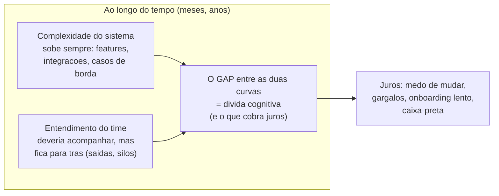
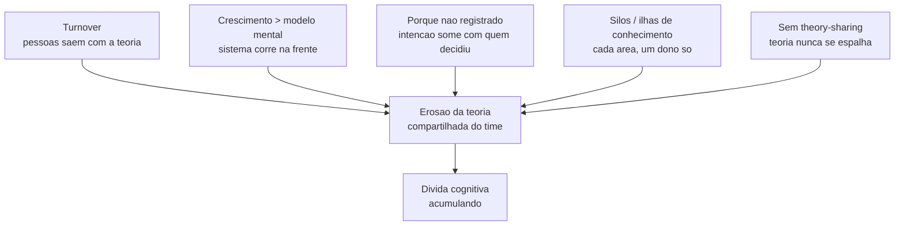
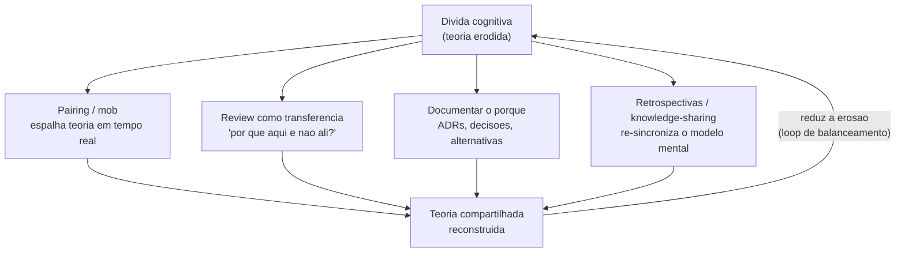

# Dívida cognitiva

A nota do hub apresentou o tabuleiro das três dívidas e prometeu aprofundar cada peça ([[09 - As três dívidas do software]]). Esta é a do meio — a que não vive no código nem nos artefatos, mas nas **cabeças do time**.

É a mais escorregadia das três, porque é a única que nenhuma ferramenta enxerga.

Você pode ter um repositório impecável e, ainda assim, estar à beira do precipício.

Imagine uma equipe que herda um sistema antigo: tudo compila, os testes passam, mas ninguém ousa mexer numa certa parte — porque a pessoa que entendia *por que* aquilo funciona saiu há dois anos.

O código está lá, intacto. O **entendimento** evaporou.

Esse buraco tem nome.

> [!abstract] TL;DR
> **Dívida cognitiva** é a erosão, ao longo do tempo, do **entendimento compartilhado** que um time tem do seu sistema: o que ele faz, por que as decisões foram tomadas e como mudá-lo com segurança. É uma propriedade de **nível de projeto/time** — coletiva e temporal —, diferente da **carga cognitiva** (individual e momentânea, [[08 - Carga cognitiva e legibilidade]]) e da **dívida técnica** (que mora no código). Sua base teórica é a tese de [[04 - O programa como teoria|Naur de que um programa é uma teoria]]: dívida cognitiva é o que se acumula quando o time perde essa teoria. Código limpo e testes verdes **não** a impedem. Acumula-se com *turnover*, crescimento mais rápido que o modelo mental, "porquê" não registrado e ilhas de conhecimento. Não tem métrica limpa — só *proxies* (*bus factor*, tempo de onboarding, "medo de mudar"). Combate-se com **prática humana** — pairing, review, retrospectivas, documentar o porquê. O termo moderno é de Margaret-Anne Storey (2026); o fenômeno é mais velho que o nome.

## O que é

**Dívida cognitiva** é a erosão progressiva do **entendimento compartilhado** que uma equipe detém sobre o sistema que constrói e mantém.

Não é o esforço de uma pessoa diante de um trecho difícil *agora* — isso é carga cognitiva.

É a deterioração lenta, ao longo de meses e anos, da capacidade *coletiva* do time de responder três perguntas sobre o sistema:

- **O que** ele faz, de verdade, nas bordas e nos casos especiais.
- **Por que** está estruturado assim — quais decisões foram tomadas, contra quais alternativas, sob quais restrições.
- **Como** mudá-lo com segurança, sem quebrar invariantes que ninguém lembra mais que existem.

São exatamente as três capacidades que [[04 - O programa como teoria|Naur]] atribui a quem tem a *teoria* do programa.

Por isso a definição mais precisa de dívida cognitiva é: **o que se acumula quando o time, gradualmente, perde a teoria do sistema.**

O termo moderno foi cunhado por **Margaret-Anne Storey** (2026), como uma das três peças do [[09 - As três dívidas do software|Triple Debt Model]]. Storey a define como propriedade de nível de time/projeto — "*the erosion of shared understanding across a team*".

Mas o **fenômeno** é muito mais velho que o nome: todo veterano já viu um sistema "morrer" no sentido de Naur quando a equipe que o entendia se dispersou.

O que Storey faz é dar nome, lugar no modelo e contraste com as outras dívidas.

> [!note] Por que é tão fácil de ignorar
> Dívida técnica deixa rastro no código — um linter fareja, uma métrica pontua, um code smell salta aos olhos. Dívida cognitiva não deixa rastro *no artefato*: ela vive na ausência de algo que está na cabeça das pessoas. Por isso ela passa despercebida até o dia em que a pessoa que detinha o entendimento sai — e o buraco aparece de uma vez. É uma dívida que você só vê quando já é tarde.

### A imagem central: duas curvas que se separam

A forma mais honesta de visualizar a dívida cognitiva é como uma distância que cresce.

De um lado, a **complexidade do sistema** sobe sem parar: cada feature, cada integração, cada caso de borda tratado adiciona algo que precisa ser entendido.

Do outro, o **entendimento que o time detém** *deveria* subir junto — mas raramente sobe na mesma velocidade, e às vezes despenca (alguém-chave sai, um pedaço vira terra de ninguém).

A **distância entre as duas curvas é a dívida cognitiva.** Não é o nível de complexidade nem o nível de entendimento isolados — é o *gap* entre eles, e é ele que cobra juros.

Leitura do diagrama: a dívida cognitiva não é uma das duas curvas, é a **abertura** entre elas — o sistema corre na frente, o entendimento fica para trás, e tudo que mora nesse vão (medo, gargalos, lentidão) é juros sendo pagos.

## Não confunda: as três coisas

Três termos parecidos descrevem coisas diferentes, e embaralhá-los embaralha o diagnóstico — e, portanto, o remédio.

Esta é a mesma tabela das notas [[08 - Carga cognitiva e legibilidade|08]] e [[09 - As três dívidas do software|09]] (e da nota irmã sob a lente da IA), porque a distinção é o eixo de tudo:

| Conceito | Onde vive | Natureza |
| --- | --- | --- |
| **Débito técnico** | no código | atalhos estruturais que cobram juros em manutenção |
| **Carga cognitiva** | no indivíduo, no momento | esforço mental exigido por uma tarefa *agora* |
| **Dívida cognitiva** | na mente coletiva, ao longo do tempo | erosão do entendimento compartilhado em nível de projeto |

A linha que separa os dois "cognitivos" é **eixo e escala**.

Carga cognitiva é *individual* e *instantânea*: o esforço que *você* gasta pra entender *este* trecho *agora* ([[08 - Carga cognitiva e legibilidade]]).

Dívida cognitiva é *coletiva* e *temporal*: a erosão, ao longo do tempo, da teoria que o *time* compartilha.

O diagrama abaixo cruza as três peças por três perguntas — **onde** vive, **quando** importa e **quem** ela afeta:

```mermaid
flowchart LR
    subgraph TEC["Divida tecnica"]
        direction TB
        T1["ONDE: no codigo"]
        T2["QUANDO: a cada manutencao"]
        T3["QUEM: quem edita o artefato"]
    end
    subgraph CAR["Carga cognitiva"]
        direction TB
        C1["ONDE: na cabeca de quem le"]
        C2["QUANDO: agora, neste trecho"]
        C3["QUEM: um individuo"]
    end
    subgraph DIV["Divida cognitiva"]
        direction TB
        D1["ONDE: na mente coletiva do time"]
        D2["QUANDO: ao longo de meses/anos"]
        D3["QUEM: o time inteiro"]
    end
    TEC -.->|"linter ve"| CAR
    CAR -.->|"nenhuma ferramenta ve"| DIV
```

Leitura do diagrama: as três caixas parecem vizinhas, mas mudam o *onde* (código → cabeça individual → mente coletiva), o *quando* (manutenção → instante → duração) e o *quem* — e só a primeira é vista por ferramenta; as duas cognitivas vivem fora do alcance de qualquer linter.

A consequência prática é que você ataca um sem mexer no outro.

**Refatorar um nome ruim** baixa a carga cognitiva de quem lê amanhã — mas não reconstrói sozinho o entendimento que o time perdeu.

E o inverso é o mais perigoso: um sistema com **código impecável** (carga baixa por trecho, dívida técnica zero) pode estar afundado em dívida cognitiva, porque a teoria do conjunto se dissolveu.

Limpeza de código não compra entendimento de time.

> [!note] Remédio errado pra doença errada
> Quando alguém diz "esse código tem carga cognitiva alta", está falando de uma *experiência de leitura* — solúvel com legibilidade. Quando diz "estamos com dívida cognitiva", está falando de uma *perda organizacional de entendimento* — solúvel com práticas de time. Tratar o segundo como se fosse o primeiro ("é só refatorar os nomes") é gastar energia no lugar errado enquanto o problema real cresce.

## A base teórica: a teoria do programa

Dívida cognitiva não é um conceito solto de 2026 — ela tem raiz teórica funda, em **Peter Naur** ([[04 - O programa como teoria]], 1985).

A tese de Naur é que programar não é produzir *texto* (código), e sim **construir uma teoria**: um conhecimento em grande parte tácito, na cabeça de quem desenvolve, que permite mapear o programa ao mundo, justificar sua estrutura e evoluí-lo com coerência.

Código e documentação são externalizações *parciais* dessa teoria — nunca a substituem.

O corolário de Naur é a chave: **um programa "morre" quando a equipe que detém sua teoria se dispersa.**

O que sobra é texto — ainda executa, mas quem não tem a teoria só consegue fazer remendos que não se encaixam no design, degradando o sistema.

Reviver o programa não é ler a documentação: é **reconstruir a teoria**, trabalho lento e caro que só pessoas fazem.

Dívida cognitiva é exatamente esse morrer, em câmera lenta e em parcelas.

Não é o evento binário "a equipe se dispersou"; é a erosão contínua que leva até lá — cada pessoa que sai, cada decisão cujo porquê não foi registrado, cada parte do sistema que vira terra de ninguém.

É por isso que **código limpo e testes verdes não impedem dívida cognitiva**: eles atestam o *texto*, e o texto nunca foi a teoria.

Você pode ter o artefato perfeito e ter perdido a capacidade de raciocinar sobre ele.

> [!tip] A analogia da cidade
> Pense numa cidade antiga cujos engenheiros originais já morreram. As construções continuam de pé, as ruas continuam pavimentadas — o "código" está intacto. Mas ninguém sabe mais por que aquele cano passa por ali, qual muro é estrutural e qual é decorativo, o que acontece se você desviar aquele riacho. Mexer vira aposta. A cidade não ruiu; o **mapa mental** que permitia evoluí-la com segurança é que se perdeu. Dívida cognitiva é a cidade sem seus engenheiros.

### A ponte com o decaimento

Há uma consequência da base teórica que vale tornar explícita: dívida cognitiva e **decaimento de software** se alimentam.

Quando o time perde a teoria, as mudanças deixam de "encaixar" no design — viram remendos feitos às cegas, do tipo que o grupo B fazia no compilador de Naur mesmo com toda a documentação na mão.

Cada remendo desses *degrada* a estrutura: aumenta a dívida técnica e a entropia do sistema ([[13 - Entropia de software e decaimento]]).

E a estrutura degradada, por sua vez, fica *mais difícil de entender* — o que acelera a perda de teoria do próximo que chega.

É um laço perverso: menos teoria → remendos → estrutura pior → ainda menos teoria. A dívida cognitiva não é só um sintoma do decaimento; é um de seus **motores**.

> [!note] Carga de time ≠ dívida cognitiva
> Cuidado para não embaralhar com mais um vizinho. *Team Topologies* fala de "carga cognitiva de **time**" — um orçamento de *agora*, de quanta complexidade aquelas pessoas aguentam segurar na cabeça ([[08 - Carga cognitiva e legibilidade]]). Isso ainda é **carga**, não dívida: é o teto de hoje, não o vazamento de ontem pra amanhã. Dívida cognitiva é a erosão *ao longo do tempo* do que o time já entendeu. Um time pode estar dentro do seu orçamento de carga e, mesmo assim, sangrando dívida cognitiva — porque a teoria que tinha está escorrendo.

## Como a dívida cognitiva se acumula

Se o problema é a perda gradual da teoria compartilhada, vale perguntar: por *onde* ela vaza?

As causas são gerais — valem para qualquer time, em qualquer stack, com ou sem IA. Elas se somam e se reforçam.

- **Rotatividade de pessoas (*turnover*).** Cada pessoa que sai leva embora um pedaço da teoria que nenhum documento guardou. É o motor mais direto: o programa de Naur "morre" exatamente quando quem o entendia se dispersa. No limite, isso vira uma métrica — o *truck factor* (mais abaixo).
- **O sistema cresce mais rápido que o modelo mental.** Quando features e integrações entram numa velocidade que o time não consegue absorver, a complexidade ([[01 - A complexidade como problema central]]) sobe mais rápido que o entendimento. O gap das duas curvas se abre por excesso de oferta, não por perda.
- **O "porquê" não é registrado.** O código mostra o *quê*; a intenção por trás das decisões — alternativas descartadas, restrições que justificam a estrutura — raramente é externalizada. Quando some da cabeça de quem decidiu, some de tudo. (Essa é a fronteira com a dívida vizinha → [[12 - Dívida de intenção]].)
- **Conhecimento siloado / ilhas de conhecimento.** Quando cada área tem um único "dono" e ninguém mais toca nela, a teoria fica fragmentada em feudos. O time *coletivamente* não entende o sistema — cada pedaço vive numa cabeça só.
- **Ausência de práticas de *theory-sharing*.** Sem pareamento, sem review que transfere entendimento, sem rotação de áreas, a teoria nunca se espalha. Ela nasce concentrada e fica concentrada — pronta pra evaporar na primeira saída.

Leitura do diagrama: nenhuma das causas isolada *é* a dívida — todas alimentam o mesmo reservatório (a erosão da teoria compartilhada), e é o acúmulo nesse reservatório que vira dívida cognitiva; atacar uma causa só raramente basta, porque as outras continuam vazando.

> [!example] Um cenário concreto
> Um time de quatro pessoas constrói um sistema de cobrança ao longo de três anos. Aos poucos, a parte de conciliação fiscal — cheia de regras de borda que cicatrizam bugs reais — fica nas mãos de uma só pessoa, a única que lembra *por que* cada exceção existe. O código está limpo, os testes passam. Então ela sai. Ninguém mais consegue dizer se aquele `if` esquisito é regra de negócio ou gambiarra. Toda mudança vira aposta; o onboarding de quem entra dobra de tempo. Nada quebrou no artefato — e, ainda assim, o sistema ficou perigoso de evoluir. Esse é o **gap das duas curvas** se abrindo de uma vez, no instante de uma saída.

## O truck factor: a dívida cognitiva como número

De todos os *proxies*, um merece destaque porque é a tradução mais direta da tese de Naur em métrica: o **truck factor** (também *bus factor*, ou *lottery factor*).

A definição é crua: **quantas pessoas precisariam sumir de repente — serem "atropeladas por um ônibus" — para o projeto travar por falta de quem detém a teoria.**

Um truck factor de 1 significa um sistema que está vivo apenas porque *uma* pessoa específica não foi atropelada. Não é exagero retórico; é uma descrição honesta do risco que mora numa ilha de conhecimento.

O ponto sutil é *por que* a defesa não é "documentar mais".

Já vimos com Naur: a teoria é majoritariamente tácita, então o documento captura o "o quê" e perde o "porquê" e o julgamento. Encher o wiki não eleva o truck factor de verdade — só dá a *ilusão* de que elevou.

O que eleva é **espalhar a teoria entre cabeças**: pareamento, rotação de quem mexe em cada área, *code ownership* compartilhado em vez de feudos. Cada uma dessas práticas transforma um truck factor de 1 em 2 ou 3 — sem reunião extra, no fluxo do trabalho.

Há ainda o ângulo das *gerações* de teoria (Bjarnason): a forma mais confiável de ter a teoria de um código é **ter estado lá** quando ele foi escrito; a segunda melhor é ter trabalhado com alguém que estava. A cada saída sem sobreposição, a teoria fica mais diluída e a reconstrução, mais cara — o que liga *churn* alto diretamente ao acúmulo de dívida cognitiva ([[04 - O programa como teoria]]).

> [!tip] Truck factor não é só headcount
> Dois times de cinco pessoas podem ter truck factors opostos. Um, onde todos pareiam e rodam por todas as áreas, tem truck factor alto: perder uma cabeça dói, mas o sistema sobrevive. Outro, onde cada um é dono solitário de um quadrante, tem truck factor 1 em cada quadrante — apesar das cinco pessoas. O número não mede o tamanho do time; mede o quanto a teoria está **distribuída** dentro dele.

## Por que é difícil de ver e medir

A pergunta natural de quem gosta de governança é: "então me dê o número, ponho no dashboard e monitoro".

E aqui vem a parte honesta: **não existe métrica limpa de dívida cognitiva.**

A razão é estrutural. Dívida técnica deixa rastro *no artefato* — você conta code smells, mede cobertura, roda um linter. Dívida cognitiva vive na *ausência* de algo que está na cabeça das pessoas. Não há arquivo pra inspecionar; o que falta não está em lugar nenhum que uma ferramenta leia.

O que existe são **proxies** — sinais indiretos que correlacionam com a dívida, sem medi-la diretamente:

- **Truck factor / bus factor.** Quantas pessoas precisam sumir pra travar uma área? Bus factor 1 numa parte crítica é dívida cognitiva escancarada.
- **Tempo de onboarding.** Quanto tempo gente nova leva pra ficar produtiva numa área. Se está subindo, a teoria que ela precisa absorver não está acessível.
- **"Medo de mudar".** Áreas que o time evita tocar — o medo é um termômetro de quanto entendimento se perdeu ali.
- **Áreas de dono único.** Partes do código que só uma pessoa edita há meses são candidatas a ilha de conhecimento.
- **Arqueologia por mudança.** Quanto de `git blame` e leitura é preciso *antes* de cada alteração — quanto mais, mais a intenção se perdeu.

Nenhum desses é uma "métrica de dívida cognitiva" no sentido de um número que você otimiza.

São termômetros — úteis pra *suspeitar* e investigar, perigosos se tratados como alvo (cuidado com a Lei de Goodhart, [[08 - Carga cognitiva e legibilidade]]).

> [!note] Por que não inventar uma métrica resolve
> A tentação é construir um índice — "score de dívida cognitiva" — combinando os proxies. O problema é que a coisa medida mora parcialmente na cabeça das pessoas, e isso não tem sensor. Um índice desses mediria os *sintomas* (concentração, medo, lentidão), não a *causa* (a teoria que se perdeu). É melhor usar os proxies como o que são — sinais de fumaça pra olhar mais de perto — do que fingir precisão que o fenômeno não permite.

## Sinais de alerta

Como a dívida cognitiva não deixa rastro no código, você a diagnostica pelo **comportamento do time**, não por uma métrica. Os sintomas são gerais — valem para qualquer stack, com ou sem IA:

> [!warning] Sintomas de dívida cognitiva acumulando
> - **Medo de mudar.** Hesitação em mexer numa parte do código porque ninguém entende direito o que ela faz — "se funciona, não toca".
> - **Conhecimento tribal concentrado.** Dependência crescente do "só fulano sabe": uma ou duas pessoas viram gargalo de qualquer mudança numa área.
> - **O sistema vira caixa-preta.** Funciona, mas o *porquê* das decisões se perdeu — ninguém consegue explicar a estrutura, só constatar que "é assim".
> - **Onboarding cada vez mais lento.** Gente nova demora mais e mais pra ficar produtiva, porque a teoria que precisa absorver não está escrita em lugar nenhum.
> - **Arqueologia constante.** Cada mudança começa com horas de "git blame" e leitura de código tentando reconstruir intenção que deveria estar clara.

Esses sinais raramente aparecem isolados — e tendem a se reforçar.

Quanto menos gente entende, mais o conhecimento se concentra; quanto mais concentrado, mais lento o onboarding; quanto mais lento o onboarding, mais o sistema vira caixa-preta.

É uma espiral — e cada volta dela alarga o *gap* das duas curvas lá do começo.

## Como reconstruir a teoria

A pista está na natureza do problema: dívida cognitiva é perda de **teoria compartilhada**, então o remédio é **reconstruir teoria compartilhada** — e tratá-la como algo que se mantém ativamente, não como um estado que se atinge uma vez.

Nenhuma ferramenta faz isso; é trabalho humano, contínuo.

- **Espalhar a teoria entre pessoas.** Pair programming, mob programming, code review com foco em *entendimento* (não só em achar bugs), rotação de quem mexe em cada área. O objetivo é nunca deixar a teoria caber numa cabeça só — é elevar o *truck factor*.
- **Documentar o porquê, não só o quê.** O código já mostra o *quê*. O que se perde — e o que precisa ser externalizado — é o **porquê**: as decisões tomadas, as alternativas descartadas e *por que* foram descartadas, as restrições que justificam a estrutura. (Essa externalização é o tema da dívida vizinha, com ADRs no centro → [[12 - Dívida de intenção]].)
- **Checkpoints de reconstrução.** Retrospectivas, sessões de knowledge-sharing, design reviews, *brown bags*. Momentos deliberados em que o time re-sincroniza o modelo mental que naturalmente diverge no dia a dia.
- **Reduzir áreas de *bus factor* 1.** Identificar os feudos de dono único e deliberadamente trazer uma segunda cabeça pra dentro — antes que a primeira saia.
- **"Make the change easy".** Manter o sistema mudável é manter a teoria viável: a frase de Kent Beck — *"make the change easy, then make the easy change"* — vale tanto pro código quanto pro entendimento ([[14 - Manutenção e evolução]]).
- **Tratar entendimento como ativo a manter.** Assim como você dedica esforço a pagar dívida técnica (refactoring), reserve esforço pra pagar dívida cognitiva. Ela não se resolve sozinha, e adiar só aumenta os juros — em forma de medo, gargalos e onboarding lento.

Essas práticas não são uma lista solta — elas formam um **ciclo de balanceamento** (no sentido do pensamento sistêmico): quanto mais a teoria se espalha e se captura, menor a erosão, e o gap das duas curvas para de crescer.

Leitura do diagrama: a seta de volta é o coração — reconstruir a teoria *realimenta* o sistema e reduz a própria dívida que a disparou, formando um loop que se equilibra; tire as práticas e o loop se quebra, deixando só a erosão correr solta.

> [!note] Por que prevenir é mais barato que reconstruir
> Naur já alertava: reconstruir a teoria de um programa depois que ela se perdeu é caro e lento — às vezes mais caro do que reescrever. Manter o entendimento vivo enquanto a teoria *ainda existe* na cabeça das pessoas custa uma fração disso. A mitigação mais barata da dívida cognitiva é não deixá-la acumular.

## Armadilhas comuns

Os sintomas em [[#Sinais de alerta]] dizem *como perceber* a dívida acumulando. Esta seção é o complemento: os erros de raciocínio mais comuns sobre *o que fazer* a respeito dela — respostas que parecem ajuda e, na prática, não ajudam.

> [!warning] Achar que código limpo e testes verdes provam que está tudo bem
> É o erro mais caro porque parece racional: se o linter não reclama e o CI está verde, "deve estar saudável". Mas dívida cognitiva vive fora do artefato — no que as pessoas sabem, não no que o código diz. Um sistema pode estar impecável na superfície e afundado em dívida cognitiva por baixo, porque a teoria do conjunto já se dissolveu.

> [!warning] Tentar consertar encarregando alguém de "documentar mais"
> Encher o wiki dá a *ilusão* de subir o truck factor, não o efeito. A teoria de Naur é majoritariamente tácita — o documento captura o "o quê" e perde o "porquê" e o julgamento que só quem viveu a decisão carrega. O que eleva o truck factor de verdade é espalhar a teoria entre cabeças, não empilhar texto que ninguém vai reler no momento certo.

> [!warning] Confundir com a carga cognitiva de time (Team Topologies)
> "Carga cognitiva de time" é um orçamento de *agora* — quanta complexidade aquelas pessoas aguentam segurar na cabeça hoje. Dívida cognitiva é o vazamento *ao longo do tempo* do que o time já entendeu. Um time pode estar dentro do seu orçamento de carga e, mesmo assim, sangrando dívida cognitiva — são problemas diferentes, com remédios diferentes.

> [!warning] Inventar um "índice de dívida cognitiva" pra colocar no dashboard
> A tentação de governança é combinar os proxies (truck factor, tempo de onboarding, medo de mudar) num score único e tratá-lo como meta. Isso mede os *sintomas*, não a *causa* — e vira alvo gameável (Lei de Goodhart). É mais honesto usar os proxies como sinais de fumaça pra investigar do que fingir uma precisão que o fenômeno, por definição, não permite.

## Inglês

**Cognitive debt** ainda é termo em consolidação — mais novo que *technical debt*, que já é vocabulário corporativo assentado há décadas. Em conversa técnica em inglês, vale contextualizar rapidamente ("the erosion of a team's shared understanding of the system") em vez de assumir que o termo já é familiar pra quem ouve.

**Bus factor** (ou *truck factor*, ou ainda *lottery factor*) é jargão informal, e a piada macabra por trás do nome — quantas pessoas precisariam ser atropeladas por um ônibus pra travar o projeto — costuma exigir uma explicação rápida em contexto profissional, principalmente pra quem não é nativo do jargão de engenharia. Não é linguagem de slide de diretoria; é linguagem de corredor.

**Tribal knowledge** é expressão comum no inglês corporativo de engenharia e não tem tradução boa em português — "conhecimento tribal" é um decalque que funciona, mas soa mais formal do que o original, que carrega um tom quase irônico sobre como o conhecimento vive em "clãs" informais dentro do time.

| Português | Inglês |
| --- | --- |
| Dívida cognitiva | Cognitive debt |
| Entendimento compartilhado | Shared understanding |
| Truck factor / fator caminhão | Bus factor (truck factor, lottery factor) |
| Perda da teoria | Theory loss |
| Conhecimento tribal | Tribal knowledge |
| Integração de novos membros | Onboarding |

## A mesma ideia, sob a lente da IA

> [!note] Fronteira: o tratamento geral × a manifestação na IA
> Esta nota trata a dívida cognitiva pela lente **geral e atemporal** — o fenômeno existe desde sempre na engenharia, muito antes da IA, e seus sinais e remédios não dependem de nenhuma tecnologia específica. A **manifestação na era da IA generativa** — como agentes que geram código mais rápido do que o entendimento estabiliza *aceleram* a dívida cognitiva, e práticas específicas como o *comprehension gate* — vive em [[03-Dominios/Tecnologia/IA/O Lado Sombrio da IA/Débito cognitivo|Débito cognitivo]], dentro de [[03-Dominios/Tecnologia/IA/O Lado Sombrio da IA/index|O Lado Sombrio da IA]]. As duas notas são o **mesmo conceito por lentes diferentes** e se reforçam: esta é a base atemporal, aquela é o sintoma agudo do momento. Vá pra lá pra entender por que a IA torna esta dívida mais urgente do que nunca.

## Em entrevista

É uma ideia que rende em entrevista sênior porque conecta código a pessoas e organização. Como usá-la sem soar decorado:

- **Defina pela distinção, não pela frase de efeito.** "Dívida cognitiva é a erosão, ao longo do tempo, do entendimento que o *time* compartilha — diferente da carga cognitiva, que é o esforço de *um* leitor *agora*, e da dívida técnica, que mora no código." A tabela das três peças é o seu mapa.
- **Ancore em Naur.** Mostre que sabe a base teórica: é o que se acumula quando o time perde a *teoria do programa*; código limpo não impede, porque o texto nunca foi a teoria.
- **Seja honesto sobre a medição.** Se perguntarem "como você mede?", a resposta forte é "não há métrica limpa — uso proxies como *truck factor*, tempo de onboarding e áreas que o time tem medo de tocar". Reconhecer a falta de número é mais maduro do que inventar um.
- **Termine na ação.** O remédio é humano e contínuo: pairing, review como transferência de teoria, documentar o porquê, reduzir bus factor 1. "Trato entendimento como ativo a manter, igual a dívida técnica."

## O que vem a seguir

Há uma diferença que separa dívida cognitiva de sua vizinha mais nova.

Perder o entendimento de um código que alguém *um dia teve* — e documentou, ainda que mal, ainda que só na cabeça de quem saiu — é doloroso, mas é reconstruível: alguém pode entrevistar quem ficou, ler commits antigos, remontar o raciocínio aos poucos, do jeito caro e lento que Naur descreve.

Agora imagine o caso pior: a decisão nunca foi *registrada* em lugar nenhum, nem sequer na cabeça de uma pessoa que ainda está no time. Ninguém sabe por que aquele `if` esquisito existe porque **ninguém jamais soube** — a IA gerou o trecho numa sessão de prompt que já foi embora, ou um humano decidiu de improviso e seguiu em frente sem anotar o porquê.

Aí não há teoria pra reconstruir, porque nunca houve teoria externalizada pra começo de conversa. É uma dívida diferente — não a erosão de algo que existiu, mas a ausência do que nunca foi criado.

Essa é a dívida de intenção, a terceira peça do Triple Debt Model: [[12 - Dívida de intenção]].

## Fontes

> [!tip] Assista — Cognitive Debt and the Future of Programming
> **Vivek Haldar** · 20min · [Cognitive Debt and the Future of Programming](https://www.youtube.com/watch?v=KAySVbJoF0M) Trata da erosão do entendimento como categoria própria, separada da dívida técnica — a distinção que esta nota inteira defende. Útil para ver o argumento formulado por outra voz, sem o vocabulário do Triple Debt Model.

- **Margaret-Anne Storey** — *From Technical Debt to Cognitive and Intent Debt: Rethinking Software Health in the Age of AI* (arXiv, 2026). A fonte primária do termo moderno: define dívida cognitiva como "*the erosion of shared understanding across a team*", propriedade de nível de time/projeto. [[02-Glosas/2026-from-technical-debt-to-cognitive-and-intent-debt|Glosa]] · [arXiv:2603.22106](https://arxiv.org/abs/2603.22106).
- **Margaret-Anne Storey** — *Cognitive debt: The hidden risk in AI-driven software development* (DX / Engineering Enablement, abr. 2026). O artigo original — anterior ao paper acadêmico — que cunha e desenvolve o termo em linguagem de praticante. [Ler no newsletter da DX](https://newsletter.getdx.com/p/cognitive-debt-the-hidden-risk-in).
- **Peter Naur** — *Programming as Theory Building* (1985). A base teórica da nota inteira: o que exatamente uma equipe perde quando a dívida cognitiva se acumula. [PDF (gwern.net)](https://gwern.net/doc/cs/algorithm/1985-naur.pdf).
- **Baldur Bjarnason** — *Theory-building and why employee churn is lethal to software companies* (2022). Sustenta o argumento das "gerações de teoria" — ter estado lá quando o código foi escrito é a forma mais confiável de ter a teoria dele. [baldurbjarnason.com](https://www.baldurbjarnason.com/2022/theory-building/).
- **Bus factor** (truck/lottery factor) — sustenta a seção sobre a dívida cognitiva como número: quantas pessoas precisam sumir pra travar o projeto. [Wikipedia](https://en.wikipedia.org/wiki/Bus_factor).

> [!note] Sobre o lastro
> O **termo moderno** "dívida cognitiva" é atribuível a **Margaret-Anne Storey** (paper no arXiv, 2026), como peça do Triple Debt Model. O **fenômeno**, porém, é muito mais antigo que o nome — está na tese de [[04 - O programa como teoria|Naur]] (1985) sobre a morte do programa e na noção folclórica de *tribal knowledge* (e do *bus/truck factor*) que precede qualquer literatura formal. Toda citação em inglês é **verbatim** da seção "Citações" da glosa acima; não li o paper de Storey página a página — as afirmações reproduzem o argumento registrado na glosa com alta fidelidade, mas detalhes de fraseado podem diferir do original. Padrão de marcação seguindo [[06 - Abstrações que vazam]].

## Veja também

- [[09 - As três dívidas do software]] — o hub que enquadra as três dívidas; esta nota aprofunda a do meio
- [[08 - Carga cognitiva e legibilidade]] — o par carga (individual, momentânea) × dívida (de time, no tempo)
- [[04 - O programa como teoria]] — a base teórica (Naur): o que exatamente se perde quando há dívida cognitiva
- [[01 - A complexidade como problema central]] — a complexidade que cresce mais rápido que o modelo mental do time
- [[12 - Dívida de intenção]] — a captura do "porquê" (ADRs) que freia a erosão; a dívida vizinha
- [[13 - Entropia de software e decaimento]] — o decaimento que a perda de teoria alimenta (remendos sem teoria)
- [[14 - Manutenção e evolução]] — "make the change easy": manter o sistema mudável é manter a teoria viável
- [[03-Dominios/Tecnologia/IA/O Lado Sombrio da IA/Débito cognitivo|Débito cognitivo (lente IA)]] — o mesmo conceito sob a ótica da IA generativa
- [[Dicionário de Ciência da Computação]] — verbetes do domínio
