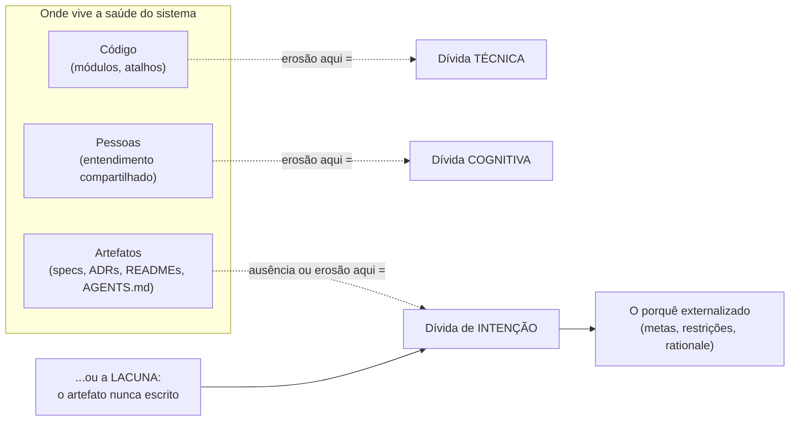
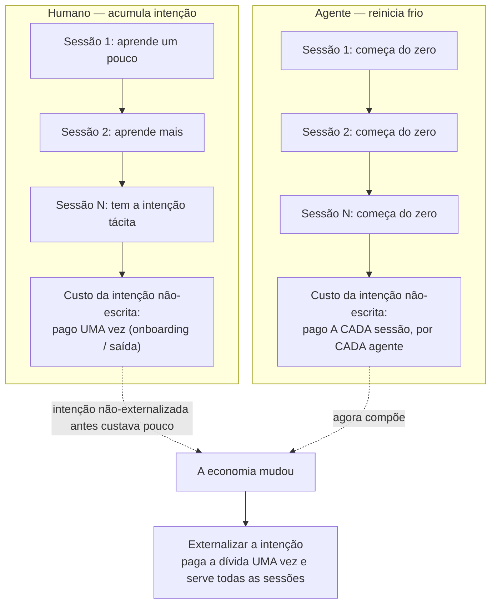
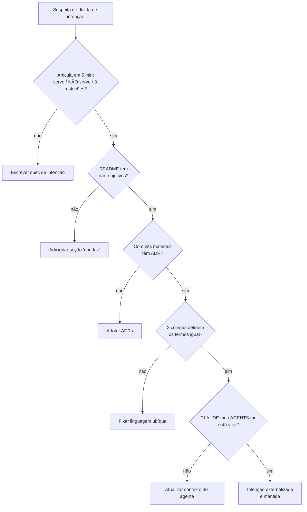
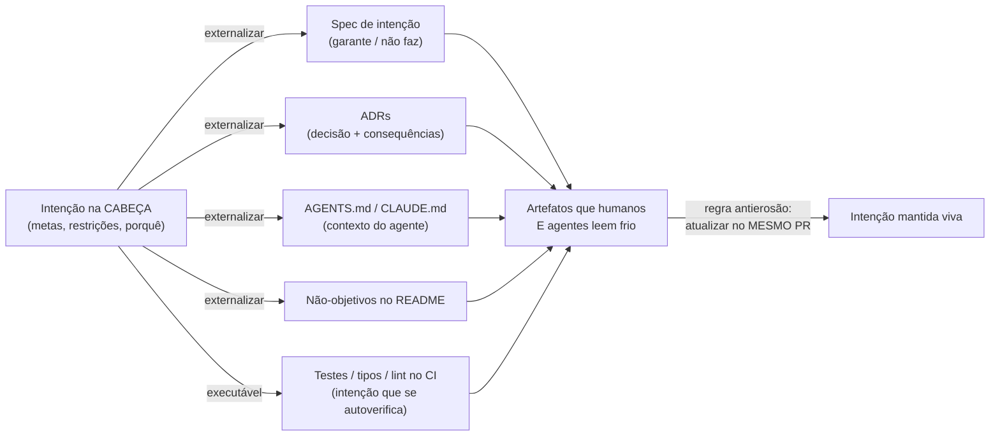

# Dívida de intenção

A nota do hub fechou prometendo aprofundar cada uma das três dívidas, e as anteriores cobriram as duas mais antigas: a que vive no código ([[10 - Dívida técnica]]) e a que vive nas pessoas ([[11 - Dívida cognitiva]]). Esta é a terceira — a mais nova das três, e a única que nenhum agente de IA consegue pagar por você.

Ela vive nos **artefatos**: nas specs, ADRs, READMEs e arquivos de contexto que registram *por que* o sistema é como é. Ou, mais frequentemente, na ausência deles.

Pense num prédio cujas plantas se perderam. Ele ainda fica de pé, atende, abriga gente.

Mas ninguém ousa derrubar uma parede sem saber se ela é estrutural — e cada reforma vira uma aposta.

> [!abstract] TL;DR
> **Dívida de intenção** é a ausência ou erosão do **rationale externalizado** — as metas, restrições e o *porquê* das decisões — que explica por que o sistema é como é. Diferente das outras duas, ela não vive no código nem nas cabeças: vive nos **artefatos** (specs, ADRs, AGENTS.md/CLAUDE.md, não-objetivos no README, critérios de aceitação) ou na falta deles. A propriedade que a define: **só humanos geram intenção**. Um agente até *infere* um rationale plausível olhando o código, mas um palpite sobre intenção não é a intenção — é por isso que esta é a dívida que o agente não paga. E ela **compõe agora** porque cada agente começa a sessão frio: intenção não-escrita, que antes custava uma vez (no onboarding), passa a ser paga **a cada sessão, por cada agente**. Diagnostica-se com testes simples (teste dos 5 minutos, não-objetivos, ADR, linguagem ubíqua) e paga-se de um jeito só — **externalizar a intenção como artefato de primeira classe**.

## O que é

A **dívida de intenção** é a terceira peça do **Triple Debt Model** de **Margaret-Anne Storey** ([[09 - As três dívidas do software]]). A definição da fonte primária é precisa:

> [!quote] Storey, sobre a dívida de intenção
> *"Intent debt refers to the absence or erosion of explicit rationale, goals, and constraints that guide how humans and agents evolve the system."*

Repare nas duas palavras de carga: **absence** e **erosion**.

A dívida não é só *nunca ter escrito* o porquê.

É também ter escrito e deixado o artefato apodrecer, divergindo da intenção real até virar mentira documentada — um README que descreve um sistema que já não existe.

E repare em *humans **and** agents*: o rationale precisa guiar os dois.

Não é documentação pra auditoria; é insumo de quem (ou o quê) vai evoluir o sistema amanhã.

### Ausência não é o único modo: a erosão

Vale demorar na palavra **erosion**, porque ela esconde o modo mais perigoso da dívida.

A ausência é honesta: você abre o README, não há seção de não-objetivos, e *você sabe* que não sabe. A erosão é traiçoeira: o artefato existe, parece autoritativo, e está errado.

Um ADR que descreve uma decisão já revertida. Um CLAUDE.md que cita um serviço aposentado. Uma spec que documenta o sistema de seis meses atrás.

Todos esses são pior que a lacuna — porque guiam o leitor (humano ou agente) **confiantemente** para o lugar errado.

A Developers Digest é direta sobre o mecanismo: o agente lê o artefato documentado, e se o artefato diverge da intenção real, ele "implementa a coisa errada documentada". Um artefato apodrecido não é neutro; é uma armadilha que parece um mapa.

É por isso que pagar a dívida de intenção não é um evento único de "escrever os docs". É uma **manutenção contínua**.

A regra antierosão (atualizar o artefato no mesmo PR que muda o significado, vista mais adiante) existe justamente para impedir que o que você escreveu hoje vire a mentira de amanhã.

### Onde ela mora

O traço que distingue essa dívida das outras é **onde ela mora**.

A técnica vive no código; a cognitiva, nas pessoas; a de intenção, nos **artefatos**. Fowler resume o substrato em uma frase:

> [!quote] Fowler, sobre onde a dívida vive
> *"Intent debt lives in artifacts. It accumulates when the goals and constraints that should guide the system are poorly captured or maintained."*

Quais artefatos? Os que carregam o *porquê*, não o *como*:

- specs de **intenção** (o que o sistema garante, não como ele faz);
- **ADRs** (Architecture Decision Records);
- arquivos de contexto pra agentes (AGENTS.md, CLAUDE.md);
- a seção de **não-objetivos** do README;
- critérios de aceitação.

Osmani aponta o lugar mais cruel — o artefato que você *nunca escreveu*:

> [!quote] Osmani, sobre o artefato ausente
> *"Intent debt lives in the artifacts you may have never wrote: the goals, constraints, and rationale for why the system is the way it is."*

O modelo é atribuído a **Storey** (paper no arXiv, 2026); **Osmani** afiou a economia da intenção, **Fowler** divulgou o substrato, e a **Developers Digest** sistematizou o diagnóstico operacional.

O diagrama abaixo separa os três lugares onde as dívidas moram — e isola a fatia que é a dívida de intenção.

Leitura do diagrama: cada substrato (código, pessoas, artefatos) tem sua dívida; a de intenção é a que mora nos artefatos — e, no caso mais comum, na lacuna onde o artefato deveria estar.

## A dívida que o agente não paga

Aqui está o ponto que torna esta dívida singular na era da IA — e a razão de ela ser a única das três que um agente não consegue quitar sozinho.

Um agente é ótimo pagando dívida técnica: refatora rápido, sem cansaço.

Ajuda com a cognitiva: explica o código sob demanda, num nível de paciência que nenhum colega humano sustenta.

Mas com a intenção ele bate num muro — porque **intenção é o único input que tem de vir de você**:

> [!quote] Osmani, sobre quem gera intenção
> *"An agent can't generate intent, because intent is the one input that has to come from you."*

A distinção é sutil e decisiva.

Um agente *pode* inferir um rationale plausível olhando o código — "essa guard clause deve estar aqui pra evitar divisão por zero".

Mas isso é um **palpite**, não a intenção.

Talvez a cláusula proteja um caso de borda regulatório que nunca foi escrito em lugar nenhum. Talvez ela exista por um incidente de produção de 2023 que ninguém documentou.

Inferir não é recuperar.

O agente fabrica uma intenção que *parece* certa e implementa a coisa errada com convicção — o pior tipo de erro, porque vem com confiança.

A Developers Digest é seca a respeito:

> [!quote] Developers Digest, sobre o que agentes leem
> *"AI agents cannot read minds or infer unwritten constraints. They read documented artifacts. If artifacts don't match actual intent, agents implement the documented wrong thing."*

Há uma assimetria aqui que vale nomear. As outras duas dívidas, um agente *amortiza*: ele as torna mais baratas de carregar.

A de intenção, não — ela é a única que **só pode ser originada por um humano**. O agente lê intenção; não a produz.

### Os sintomas concretos

A dívida de intenção não anuncia o nome. Ela aparece como bugs estranhos e refactors traiçoeiros.

Osmani lista dois sintomas clássicos, e ambos têm a mesma raiz:

- **O agente "conserta" um bug removendo uma guard clause cujo propósito nunca foi registrado.** O código ficou mais limpo, os testes passaram — e três semanas depois o caso de borda que a cláusula protegia volta em produção. A cláusula era intenção; sem o porquê escrito, virou ruído a ser podado.
- **Um refactor quebra um comportamento de que usuários dependiam, porque os testes codificavam só o comportamento anterior — nunca a intenção subjacente.** O teste dizia *o que* o sistema fazia, não *por que*. O agente preservou a letra e traiu o espírito.

O padrão dos dois é o mesmo.

Existia intenção, ela não estava externalizada, e quem mexeu (agente ou humano novo) não tinha como saber que estava mexendo em algo carregado de propósito.

O sintoma é sempre o mesmo: alguém apaga, simplifica ou "melhora" exatamente a parte que existia por um motivo invisível.

## A economia do cold-start

Esta é a parte que faz a dívida de intenção compor *agora*, e não daqui a dez anos. É o coração do argumento de Osmani, e merece ser destrinchada devagar.

Comece pelo modo antigo. Times humanos absorviam intenção **por osmose**, ao longo do tempo:

- conversas de corredor ("ah, isso é assim porque o cliente X exigiu");
- code reviews onde o veterano explica o porquê no momento em que ele importa;
- incidentes vividos, que gravam na memória qual atalho não se pode tomar;
- memória institucional acumulada por anos de convívio.

Nada disso está escrito. Tudo isso é tácito.

E funcionava — porque o humano que entra fica, e vai *acumulando* a intenção sessão após sessão.

Um agente não tem nada disso. Ele começa **a sessão fria**:

> [!quote] Osmani, sobre o agente que começa frio
> *"An agent starts most sessions cold. It carries none of the tacit intent your humans built up over years."*

Aqui está o golpe econômico.

Para um humano, intenção não-externalizada custava **uma vez**: você pagava no onboarding de alguém novo, ou quando um veterano saía levando o que sabia.

Era um custo raro, espaçado por meses.

Para um agente, é diferente.

Esse custo se paga **a cada sessão**, porque cada sessão é um onboarding do zero:

> [!quote] Osmani, sobre a economia da intenção
> *"Un-externalized intent used to cost you once in a while, at onboarding or after someone left. Now you pay it every session."*

Cada agente é, em efeito, um colega novo que esqueceu tudo de ontem.

Multiplique por quantas sessões você roda por dia, por quantos agentes você opera em paralelo, e o custo raro de antes vira custo recorrente de throughput.

A dívida de intenção deixou de ser custo suave (onboarding lento, uma vez por contratação) e virou **custo direto de produção** — pago em cada execução.

Um exemplo deixa a aritmética concreta. Suponha uma restrição não-escrita: "este endpoint nunca pode chamar o serviço de cobrança de forma síncrona, porque ele entra no caminho crítico de checkout".

Para um time estável, esse saber circula uma vez e fica.

Para um time agêntico que roda dez sessões por dia, cada sessão é uma chance de o agente, sem essa restrição na frente, "otimizar" o fluxo e reintroduzir a chamada síncrona.

A restrição não-escrita não custa uma vez — custa toda vez que alguém frio toca o código.

É por isso que externalizá-la **uma vez** (num teste, num ADR, num comentário com porquê) paga uma dívida que, não-escrita, seria cobrada indefinidamente.

O diagrama abaixo contrasta as duas curvas: o humano que acumula intenção e o agente que reinicia do zero.

Leitura do diagrama: o humano sobe uma escada (acumula), o agente fica preso no degrau zero (reinicia) — então a intenção não-escrita, que antes era um custo único, vira recorrente, e só a externalização quebra o ciclo.

### Por que isso muda a importância relativa das três dívidas

Storey faz uma observação que dá a esta dívida sua urgência de 2026: a IA generativa não cria as dívidas, mas **muda o peso relativo delas**.

Ao baratear a produção de código, ela faz o gargalo migrar do *escrever* para o *entender* e o *saber o porquê*.

A dívida técnica — a do código — era a cara de carregar quando escrever código era caro.

Agora que escrever é barato, ela perdeu peso relativo: um agente a paga rápido.

O gargalo se deslocou para as duas dívidas que a IA *não* barateia: a cognitiva (entender) e a de intenção (saber o porquê). São elas que agora limitam a velocidade do time.

É um realinhamento de prioridades.

A dívida que mais importava (técnica) virou a mais fácil; a que menos se rastreava (intenção) virou a que mais dói.

## A intenção é a teoria externalizada

Vale conectar esta dívida a uma raiz mais funda: a tese de **Peter Naur** em [[04 - O programa como teoria]].

Naur diz que o produto real da programação não é o código, mas a **teoria** — a compreensão viva de como o programa mapeia o mundo, por que tem a forma que tem, e como evoluí-lo com coerência.

Essa teoria é majoritariamente **tácita**: vive na cabeça da equipe, e o código/documentação são externalizações *parciais* dela.

A dívida de intenção é, então, **a fatia externalizável dessa teoria que ficou por escrever**.

Repare na precisão: não é a teoria inteira — boa parte dela é irredutível à escrita (o paradoxo de Polanyi). É só o *porquê* que **poderia** ter ido para um artefato e não foi.

Isso esclarece os limites da prática. Externalizar intenção não "salva" a teoria toda — Naur já avisou que isso é impossível.

Mas captura a parte que *dava* para capturar:

- as decisões e suas alternativas (um ADR);
- as restrições que o sistema respeita (a spec);
- o que ele deliberadamente *não* faz (os não-objetivos).

A leitura moderna de Naur (Barn & Clark, 2011) chama ADRs, specs e testes de captura **"necessária, mas não suficiente"**.

É exatamente a fronteira certa: pagar a dívida de intenção é fazer a parte *necessária* — sem a ilusão de que ela é *suficiente* para transmitir a teoria inteira.

O resto continua dependendo de transferência humana, que é o domínio da [[11 - Dívida cognitiva]].

Daí uma consequência que separa esta dívida das outras duas: **as três são independentes**.

Dá pra ter código limpo (dívida técnica zero) *e* um time que entende o sistema (dívida cognitiva baixa) e, ainda assim, **dívida de intenção altíssima** — porque a teoria está toda na cabeça e nada foi escrito.

O dia em que o time se dispersa, ela vira dívida cognitiva aguda; mas até lá ela é, especificamente, intenção não-externalizada.

## Como diagnosticar

Como você sabe que tem dívida de intenção alta, se ela vive justamente na *ausência* de coisas?

A dívida técnica tem métricas: cobertura, complexidade ciclomática, code smells contáveis.

A dívida de intenção não tem — você não mede a *ausência* de um porquê com um linter.

Por isso a Developers Digest propõe um conjunto de **testes rápidos**, não um dashboard. São perguntas — e é exatamente isso que as torna úteis numa reunião, sem ferramenta nenhuma.

O truque de todas elas é o mesmo: forçar alguém a *tentar articular* a intenção. Se a articulação trava, a dívida está medida.

> [!tip] Os testes da dívida de intenção
> - **Teste dos 5 minutos.** Você consegue, em cinco minutos, articular pra que o sistema **serve**, pra que ele **NÃO serve**, e as **três restrições mais duras** que ele respeita? Se não, a intenção não está externalizada — está (na melhor das hipóteses) na sua cabeça.
> - **Teste dos não-objetivos.** O README diz o que o sistema **não vai fazer**? Quase nenhum diz. Não-objetivos são a parte mais barata e mais negligenciada da intenção — e a que mais protege contra "melhorias" que quebram o propósito.
> - **Teste do ADR.** Os commits **materiais** (os que mudam o significado do sistema, não os de formatação) têm um registro de decisão associado? Se decisões grandes não deixam rastro escrito, o *porquê* evaporou junto com a thread do Slack.
> - **Teste da linguagem ubíqua.** Pegue um termo-chave do domínio e peça pra **três colegas** definirem. Se as três definições divergem, não há intenção compartilhada sobre o que as palavras significam — e código construído sobre termos ambíguos herda a ambiguidade.
> - **Teste do CLAUDE.md vivo vs. abandonado.** O arquivo de contexto do agente reflete o sistema de hoje, ou fossilizou numa versão de seis meses atrás? Um arquivo de intenção desatualizado é pior que ausente: ele guia o agente confiantemente para o lugar errado.

O fio comum dos cinco: eles testam se a intenção está **fora da cabeça**, num lugar que um colega novo — ou um agente frio — conseguiria ler.

Se a resposta a qualquer um deles é "pergunta pro fulano", a dívida está lá — e é exatamente o "fulano" que o agente não tem como consultar.

O diagrama abaixo organiza os testes como um fluxo de triagem: cada "não" aponta para um artefato a escrever.

Leitura do diagrama: cada teste que falha não é um diagnóstico abstrato — é uma instrução concreta de qual artefato escrever em seguida, o que torna o diagnóstico já o começo do tratamento.

## Como se paga

Diferente da dívida técnica, que se paga refatorando aos poucos, a dívida de intenção tem um movimento único e claro: **externalizar a intenção como artefato de primeira classe**.

Não é documentação por documentação. É registrar o *porquê* no lugar onde humanos e agentes vão lê-lo.

Algumas práticas concretas, destiladas das fontes:

- **Especifique a intenção, não a implementação.** A spec valiosa não descreve *como* o código faz — descreve o que o sistema deve garantir e o que ele deliberadamente não faz. Implementação muda; intenção persiste.
- **Escreva ADRs barato e agressivo.** Toda decisão material merece um registro curto. Caro é *não* ter o registro quando, dois anos depois, alguém (ou um agente) for desfazer a decisão sem saber o que ela protegia.
- **Não-objetivos em todo README.** Uma seção curta de "o que isto não faz" desarma metade das regressões de propósito antes de elas acontecerem.
- **Trate AGENTS.md/CLAUDE.md como ledger de intenção, não como configuração.** Não é só onde moram flags e comandos de build — é onde mora o contexto que o agente lê frio toda sessão. Escreva-o *antes* da primeira execução de agente.
- **Atualize o artefato de intenção no MESMO PR que muda o significado.** Esta é a regra antierosão: se o PR muda *o que o sistema é pra ser*, ele atualiza o artefato que descreve isso — na mesma entrega. Intenção que só se atualiza "depois" nunca se atualiza.
- **Torne a intenção executável.** Intenção codificada em **testes, tipos e regras de lint no CI** não pode apodrecer em silêncio: se a intenção e o código divergem, o build quebra. É a forma mais durável de rationale — a que se autoverifica.
- **Faça o loop de aprendizado escrever a intenção de volta.** Cada experimento falho, cada incidente, cada "ah, não dá pra fazer assim" é intenção descoberta. Registre — senão a próxima sessão (sua ou de um agente) vai redescobri-la do jeito caro.

> [!info] ADRs: a origem (Michael Nygard, 2011)
> O formato **ADR** vem de um ensaio de **Michael Nygard**, *Documenting Architecture Decisions* (novembro de 2011, na Cognitect). A proposta é deliberadamente leve: um arquivo Markdown por decisão, versionado **no mesmo repositório do código**, com quatro seções — **contexto** (as forças em jogo), **decisão** (o que se escolheu), **status** (proposto/aceito/substituído) e **consequências** (o que fica mais fácil e mais difícil depois). O barato é o ponto: um ADR que leva dez minutos pra escrever é o que de fato se escreve. Nygard não inventou o "log de decisões" (inspirou-se em Philippe Kruchten), mas foi quem fez a versão *leve* pegar.

### A regra antierosão: mesmo PR, mesmo significado

De todas as práticas, uma decide se as outras sobrevivem: **atualizar o artefato de intenção no mesmo PR que muda o significado**.

A razão é a erosão.

Intenção que se atualiza "depois" não se atualiza nunca — o "depois" vira um backlog que ninguém prioriza, e o artefato começa a divergir do sistema no instante seguinte ao merge.

Acoplar a atualização ao PR que causou a mudança resolve isso por construção. A mudança de significado e o registro do novo significado viajam juntos, revisados juntos, mergeados juntos.

É a mesma lógica de "teste no mesmo commit que o código": você não confia na boa vontade futura de ninguém.

Você torna a atualização parte indivisível da mudança.

Sem essa regra, qualquer esforço de externalização tem prazo de validade.

Com ela, o artefato envelhece na mesma cadência do sistema — que é o máximo de frescor que se pode pedir.

### A intenção executável: o rationale que se autoverifica

Das práticas acima, uma merece destaque, porque resolve a erosão na raiz: **tornar a intenção executável**.

Um ADR pode mentir em silêncio. Um README pode ficar para trás.

Mas um **teste** que codifica a intenção quebra o build no instante em que o código diverge dela.

A intenção executável não pode apodrecer sem fazer barulho.

A diferença é entre documentar e *fazer cumprir* a intenção. Documentar pede que alguém leia e respeite; fazer cumprir não pede nada — bloqueia.

Veja em três formas:

- um teste que afirma "o checkout nunca chama cobrança de forma síncrona" é intenção que o CI defende a cada commit;
- um **tipo** que torna um estado inválido impossível de representar é intenção codificada no compilador;
- uma **regra de lint** que proíbe um padrão perigoso é intenção que falha o pipeline antes do merge.

A diferença de durabilidade vem do mecanismo de feedback.

Um artefato textual depende de *alguém lembrar de mantê-lo*; um artefato executável **força** a manutenção, porque a divergência vira um build vermelho.

É a forma de rationale que não conta com a disciplina humana — e é por isso que é a mais durável.

Cuidado com o limite, porém: a intenção executável captura *restrições* bem, mas captura *o porquê* mal.

O teste prova que a chamada síncrona é proibida; não explica que é por causa do caminho crítico de checkout.

Por isso ela anda de mãos dadas com o ADR — o teste faz cumprir, o ADR explica. Os dois juntos, não um só.

Osmani põe o veredito sobre o valor do *porquê*:

> [!quote] Osmani, sobre o valor do porquê
> *"Write down the why, because it's becoming the most valuable thing you can leave in the repo."*

O diagrama abaixo mostra o movimento de pagamento: tirar a intenção da cabeça e depositá-la em artefatos que um agente consegue ler.

Leitura do diagrama: o pagamento é um fluxo de mão única da cabeça para os artefatos legíveis a frio — e a regra antierosão (atualizar no mesmo PR que muda o significado) é o que impede o artefato de apodrecer de volta.

## O deslocamento para a verificação

Há uma moldura econômica de segunda ordem, registrada por Fowler e pela Developers Digest, que dá à dívida de intenção uma urgência que ela não tinha antes da IA.

Se agentes barateiam *escrever* código, a atividade cara migra de construir para **verificar** se o código faz a coisa certa:

> [!quote] Developers Digest, sobre o custo da verificação
> *"If coding agents make writing code cheap, verification becomes expensive."*

E verificar contra o quê?

Contra a intenção. Não há como julgar se um código está "correto" sem uma referência externalizada do que "correto" significa:

> [!quote] Developers Digest, sobre o deslocamento
> *"The expensive activity shifts from building to judging what correct means."*

A Developers Digest leva isso à composição do time: de "10 engenheiros de feature" para "3 engenheiros + 7 pessoas definindo critérios de aceitação, harness de testes e monitoramento".

A atividade valiosa deixou de ser *digitar a solução* e passou a ser *definir o que é uma solução certa*.

Fowler reforça que programar nunca foi só digitar:

> [!quote] Fowler, sobre o que é programar
> *"Programming isn't just typing coding syntax that computers can understand and execute; it's shaping a solution."*

A conclusão fecha o ciclo.

Se o código ficou barato e a verificação ficou cara, a intenção externalizada — a referência contra a qual se verifica — deixou de ser "boa prática" e virou **o ativo mais valioso do repositório**.

Sem ela, não há contra o quê verificar.

Por décadas, escrever o porquê foi a tarefa que se adiava porque "o código fala por si".

Agora o código é barato e abundante, e o que é raro — e portanto valioso — é o porquê.

A dívida que ninguém rastreava virou a que mais custa não pagar.

## Em entrevista

> [!tip] Como articular a dívida de intenção
> O movimento que sinaliza senioridade é mostrar que você sabe que **as três dívidas são independentes**: dá pra ter código limpo (dívida técnica zero) *e* um time que entende o sistema (dívida cognitiva baixa) e, ainda assim, **dívida de intenção altíssima** — porque ninguém registrou o *porquê* em lugar nenhum. Frase de efeito: *"Intent is the one input an agent can't generate — it has to come from a human, so the why is becoming the most valuable thing you leave in the repo."* Se o entrevistador perguntar "como você documenta decisões?", não responda "a gente escreve docs"; responda em termos de **artefato de primeira classe**: ADRs baratos (formato Nygard), não-objetivos no README, e a regra de ouro — *atualizar a intenção no mesmo PR que muda o significado*. E mencione o teste dos 5 minutos como ferramenta de diagnóstico: "se eu não consigo dizer em cinco minutos pra que o sistema NÃO serve, a intenção não está externalizada". É um framework de 2026 (Storey); citar a fonte mostra que você acompanha a literatura.

## Fontes

- [[02-Glosas/2026-from-technical-debt-to-cognitive-and-intent-debt|From Technical Debt to Cognitive and Intent Debt — Margaret-Anne Storey (arXiv)]] — a **fonte primária**: a definição de dívida de intenção ("absence or erosion of explicit rationale, goals, and constraints")
- [[02-Glosas/2026-the-intent-debt|The Intent Debt — Addy Osmani]] — a exposição mais clara: só humanos geram intenção e a economia do cold start
- [[02-Glosas/2026-fowler-fragments-triple-debt-model|Fragments: April 2 — Martin Fowler]] — o substrato ("intent debt lives in artifacts") e o custo da verificação
- [[02-Glosas/2026-intent-debt-the-ai-era-debt-nobody-is-tracking|Intent Debt: The AI-Era Debt Nobody Is Tracking — Developers Digest]] — os testes de diagnóstico e as práticas de pagamento

> [!note] Sobre o lastro
> O termo e o modelo são atribuídos a **Margaret-Anne Storey** (paper no arXiv, 2026); **Osmani**, **Fowler** e a **Developers Digest** o afiaram e operacionalizaram. Todas as citações em inglês são **verbatim** das seções "Citações" das glosas acima. A origem do formato **ADR** (Michael Nygard, *Documenting Architecture Decisions*, novembro de 2011, Cognitect; quatro seções, Markdown no repo) foi conferida via fonte externa ([Fowler, bliki ADR](https://martinfowler.com/bliki/ArchitectureDecisionRecord.html)) e não vem das glosas. **Ressalva honesta:** não li o paper de Storey nem os posts de Osmani/Fowler/Developers Digest na íntegra — as afirmações reproduzem com alta fidelidade o argumento e o vocabulário registrados nas glosas, mas o fraseado de partes não-citadas pode diferir do original. A atribuição (Storey; afiado por Osmani/Fowler/Developers Digest) e os testes de diagnóstico estão confirmados nas glosas. Padrão de marcação seguindo [[06 - Abstrações que vazam]].

## Veja também

- [[09 - As três dívidas do software]] — o hub: dívida de intenção é uma de três (código × pessoas × artefatos)
- [[11 - Dívida cognitiva]] — a dívida-irmã que vive nas pessoas; intenção não-registrada acelera a erosão do entendimento
- [[04 - O programa como teoria]] — Naur: o programa é uma teoria na cabeça; a dívida de intenção é a fatia externalizável dessa teoria que ficou por escrever
- [[10 - Dívida técnica]] — a dívida-irmã que vive no código; um agente paga essa fácil, mas não a de intenção
- [[13 - Entropia de software e decaimento]] — o que acontece quando o artefato de intenção apodrece e diverge do sistema real
- [[Dicionário de Ciência da Computação]] — verbetes do domínio (ver *ADR* e *Dívida de intenção*)
