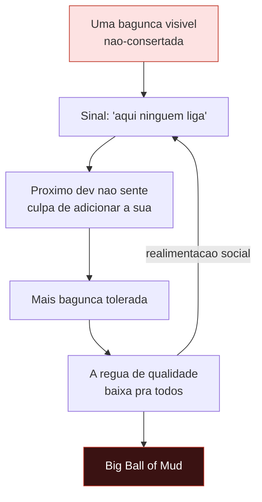
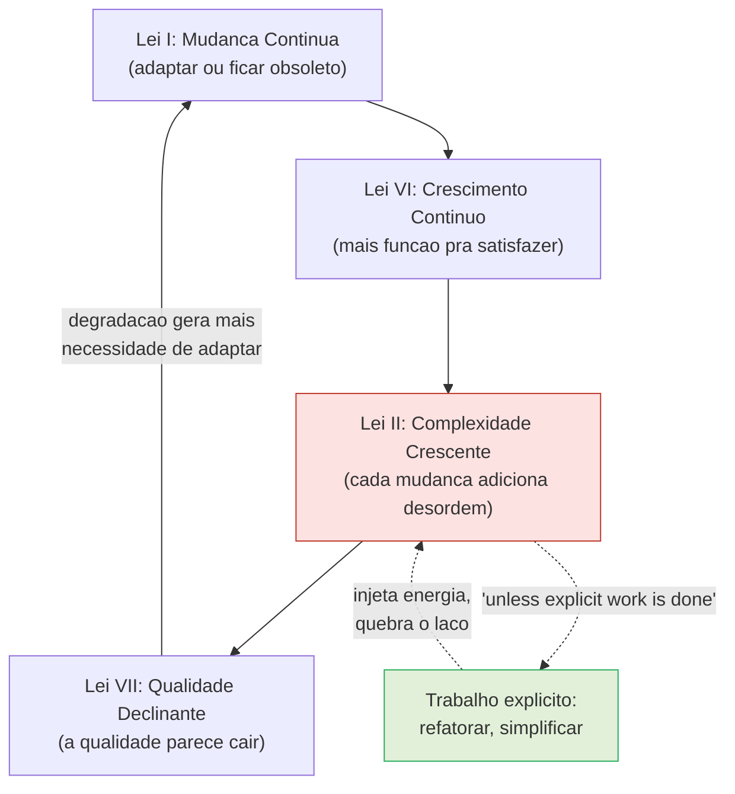
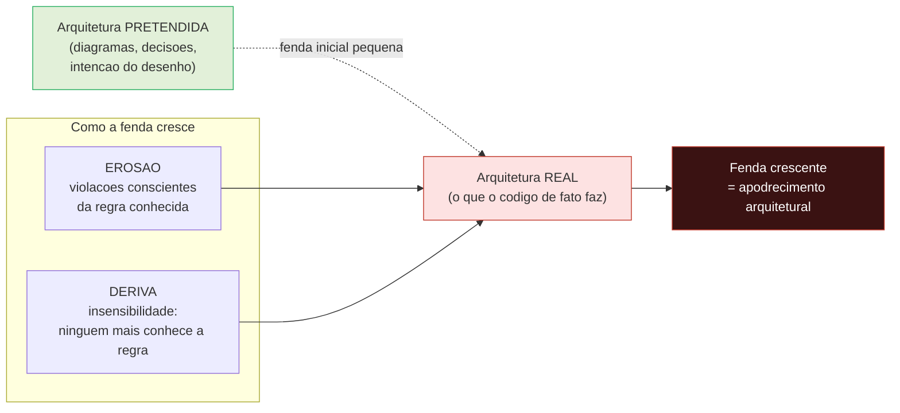
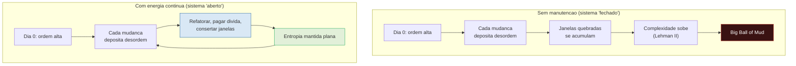

# Entropia de software e decaimento

A nota sobre dívida técnica ([[10 - Dívida técnica]]) tratou do que acontece quando você deixa de *pagar de volta* o aprendizado ao código. Mas falta a pergunta de fundo: por que o sistema **piora sozinho** se ninguém faz nada?

Hardware enferruja, parafuso solta, metal fadiga — coisas físicas se desgastam pelo uso. Software não tem átomos: o bit que você gravou ontem é idêntico ao de hoje.

E mesmo assim todo desenvolvedor sênior sabe que sistemas **apodrecem**.

Esta nota é sobre essa física estranha — a tendência do software a ganhar desordem com o tempo — e sobre por que mantê-lo saudável custa energia o tempo todo.

> [!abstract] TL;DR
> Software não se desgasta como hardware — ele **apodrece pela mudança**. Cada alteração tende a aumentar a desordem (a *entropia*) do sistema, a menos que você gaste trabalho ativamente pra combatê-la. Quatro ideias ancoram isso: a **teoria das janelas quebradas** (Hunt & Thomas) — uma bagunça visível não-consertada convida mais bagunça; o **Big Ball of Mud** (Foote & Yoder, 1997) — a arquitetura mais comum do mundo é a *ausência* de arquitetura, e isso tem causas estruturais, não morais; as **leis de Lehman** — em especial *Continuing Change* e *Increasing Complexity*; e a **erosão arquitetural** (Perry & Wolf, 1992) — a distância crescente entre a arquitetura que você desenhou e a que de fato existe. A síntese: **o decaimento é o default** — a segunda lei da termodinâmica do software. Manter um sistema vivo exige injeção *contínua* e *deliberada* de energia.

## O que é

Tome emprestada uma palavra da física. **Entropia** é a medida da desordem de um sistema; a segunda lei da termodinâmica diz que, num sistema fechado, a entropia só tende a aumentar.

Um quarto arrumado vira bagunça sozinho. Bagunça nunca se arruma sozinha. Pra *baixar* a entropia local — arrumar o quarto — você precisa gastar energia.

Software se comporta assim. Hunt e Thomas chamam isso de **software entropy**: conforme um sistema é mudado ao longo do tempo, sua desordem tende a crescer, e revertê-la exige trabalho. O nome popular do fenômeno é **software rot** (ou *bit rot*, ou *code decay*) — o código "apodrece".

Software **não se desgasta como hardware**. Um parafuso fadiga porque sofre estresse físico; o seu `if` não. O código que você não toca por cinco anos roda hoje exatamente como rodava — o apodrecimento vem da **mudança**, não do uso (ver [[#Armadilhas comuns]] adiante).

A diferença é libertadora e cruel ao mesmo tempo.

Libertadora porque decaimento não é inevitável como ferrugem — é reversível com trabalho.

Cruel porque, justamente por não ser físico, ninguém *vê* acontecer: não há rachadura na parede, só um diff de cada vez tornando o próximo diff um pouco mais difícil.

> [!info] A analogia da entropia é uma metáfora, não física
> Software não obedece literalmente à segunda lei da termodinâmica. Não há "energia livre", "calor" nem "sistema fechado" no seu repositório — bits não têm temperatura. A entropia termodinâmica (e mesmo a de Shannon, da teoria da informação) é uma grandeza com definição matemática precisa; "entropia de software" é um *empréstimo conceitual*, uma analogia que captura uma intuição real (desordem tende a crescer sem trabalho) sem ser uma derivação rigorosa.
>
> Por que então a metáfora é útil? Porque ela acerta a *direção da seta* — a desordem é o estado provável, a ordem é o improvável e custoso — e essa é exatamente a lição prática. Use a analogia como bússola, não como lei física. Quem a leva ao pé da letra acaba afirmando bobagens ("o código gera calor", "viola a termodinâmica"); quem a usa como metáfora ganha um modelo mental certeiro.

> [!note] Dois sentidos de "bit rot"
> Cuidado com o termo *bit rot*, porque ele tem dois significados que não devem se confundir.
>
> O **literal** é físico e raro: a degradação de mídia de armazenamento — um bit que de fato vira no disco magnético, na fita, na célula de memória flash que perdeu carga. Isso *é* desgaste físico, mas é um problema de hardware/mídia, não de software.
>
> O **metafórico** é o que esta nota trata: o código que "apodrece" sem que um único bit mude. O arquivo é byte-a-byte idêntico ao de cinco anos atrás; o que apodreceu foi o *contexto* em volta dele — as dependências que mudaram, as APIs que sumiram, o entendimento que evaporou, o sistema operacional que evoluiu. O programa "parou de funcionar" sem nunca ter sido alterado.
>
> Repare na ironia: no sentido metafórico, o código pode apodrecer *ficando exatamente igual* enquanto o mundo se move — que é precisamente a Lei I de Lehman vista de outro ângulo.

## Janelas quebradas

Hunt e Thomas importaram uma metáfora da criminologia urbana. Pesquisadores observaram que um prédio com **uma janela quebrada** não-consertada degrada rápido: a janela sinaliza abandono, o abandono convida pichação, a pichação convida mais quebra, e em pouco tempo o prédio inteiro está arruinado.

Não foi o clima — foi o sinal de que *ninguém liga*.

> [!quote] Hunt & Thomas, *The Pragmatic Programmer*
> *"Don't live with broken windows."*

Aplicada ao código, a tese é direta: **uma bagunça visível e tolerada autoriza a próxima**. Um *hack* feio que ninguém limpa, um teste comentado, um `TODO` de dois anos, um nome enganoso deixado de pé — cada um é uma janela quebrada.

O dano não é só o defeito em si. É a *mensagem* que ele passa pra quem chega depois: "aqui a régua é essa". E a régua baixa se propaga. O próximo dev, vendo o desleixo, não sente culpa de adicionar o seu.

Assim a entropia ganha **realimentação social**: a desordem não só persiste, ela *recruta* mais desordem.

Esse é o padrão central — uma janela quebrada vira o gatilho de um ciclo que termina em bola de lama:

Leitura do diagrama: o nó vermelho-escuro (a bola de lama) não é a causa, é o *destino* de um laço que se realimenta — cada volta no ciclo "ninguém liga → mais bagunça → régua mais baixa" empurra o sistema mais fundo no lodo. Quebrar o laço é barato no início (consertar uma janela) e quase impossível no fim.

> [!example] Por que o conserto pequeno importa tanto
> Imagine duas bases. Na primeira, todo *hack* temporário vem com um comentário "REMOVER quando X" e é de fato removido; nomes ruins são renomeados na primeira vez que alguém tropeça neles. Na segunda, "depois eu arrumo" virou folclore e ninguém mais arruma nada.
>
> A diferença técnica entre as duas, no dia zero, era mínima — um *hack* aqui, um nome ali. A diferença em dois anos é abissal, e ela não veio de uma decisão grande: veio de mil decisões pequenas de **deixar a janela quebrada**.
>
> É por isso que a regra é não conviver com ela — não porque um defeito isolado seja caro, mas porque ele *normaliza o próximo*.

> [!info] Lastro honesto: a teoria criminológica é contestada
> A *origem* da metáfora — Wilson & Kelling, 1982 — é uma teoria das ciências sociais, e o consenso empírico sobre ela é fraco. Estudos posteriores (notadamente Sampson & Raudenbush) argumentam que o elo causal direto "desordem visível → crime" é frágil, possivelmente mediado pela coesão social da comunidade, e que o policiamento de "tolerância zero" derivado dela teve custos sociais sérios. Em outras palavras: a teoria *criminológica* não está estabelecida.
>
> Isso enfraquece a lição para o código? **Não.** A lição de engenharia não depende da física social do crime urbano. Ela vale como *disciplina* observável: bases que toleram pequenos desleixos visíveis acumulam desleixo mais rápido — algo que qualquer sênior já viu acontecer. Trate "janelas quebradas" como heurística de cultura de equipe, não como lei comprovada importada da sociologia.

## Big Ball of Mud

Se janelas quebradas explicam a *dinâmica* do decaimento, **Brian Foote e Joseph Yoder** nomearam o *destino* dele. No paper *Big Ball of Mud*, apresentado na 4ª conferência **PLoP em 1997** (eles creditam a Brian Marick a cunhagem do termo), descreveram a arquitetura que emerge quando ninguém combate a entropia:

> [!quote] Foote & Yoder, *Big Ball of Mud* (PLoP, 1997)
> *"A Big Ball of Mud is a haphazardly structured, sprawling, sloppy, duct-tape-and-baling-wire, spaghetti-code jungle."*

O *insight* genial do paper não é condenar o lodo — é observar, com honestidade desconfortável, que ele é a **arquitetura mais comum do mundo**. A *de-facto standard*.

A maioria dos sistemas em produção, agora, é uma bola de lama. E os autores se recusam a tratar isso como mero fracasso moral de programadores preguiçosos.

Eles perguntam *por que* o lodo se forma, e a resposta é estrutural — quatro forças:

- **Pressão de tempo** (*business pressures*) — entregar agora quase sempre vence projetar direito; o mercado paga pela função, não pela arquitetura.
- **Rotatividade** (*developer turnover*) — quem construiu o entendimento foi embora; quem chega remenda o que não compreende (eco direto de [[11 - Dívida cognitiva|dívida cognitiva]]).
- **Crescimento aos pedaços** (*piecemeal growth*) — o sistema cresce uma feature por vez, sem ninguém parando pra rever o todo.
- **Entropia** — o pano de fundo de tudo: na ausência de força contrária, a desordem se acumula.

Repare que as três primeiras forças são todas *legítimas*. Ninguém escolhe a bola de lama; ela é o subproduto de pressões que, isoladamente, fazem sentido de negócio.

> [!note] Por que isso não é só xingamento
> É tentador usar "Big Ball of Mud" como insulto — "esse projeto é uma bola de lama". Mas o valor do paper é o oposto: ele *explica* o lodo em vez de só desprezá-lo.
>
> As mesmas forças que produzem lodo (entregar rápido, time que muda, crescer por incremento) são forças **legítimas de negócio**. O lodo não é o que acontece quando os programadores são ruins; é o que acontece quando ninguém gasta energia, *de propósito e de forma contínua*, pra impedi-lo.
>
> Isto conecta de volta à [[10 - Dívida técnica|dívida técnica]]: a bola de lama é, em larga medida, dívida que ninguém pagou, composta por anos. Reconhecer as causas é o primeiro passo pra não tratar a doença como se fosse caráter.

## As leis de Lehman

Se janelas quebradas são a *psicologia* do decaimento e a bola de lama é o *resultado*, faltava a **física** — a parte que diz "isto vai acontecer, são leis".

Quem a forneceu foi **Meir (Manny) Lehman**, com László Belády, a partir de 1974, estudando a evolução do OS/360 da IBM. São **oito leis** no total (formuladas entre 1974 e 1996), mas elas só valem para uma classe específica de sistema.

> [!info] O que é um sistema E-type
> Lehman classificou programas em três tipos. **S-type** resolve um problema com especificação formal fixa (um algoritmo de ordenação: o que é "correto" é matematicamente definido). **P-type** ataca um problema do mundo real cuja solução é aproximável (xadrez: a regra é exata, a estratégia ótima não). E **E-type** (*embedded* / *evolutionary*) é escrito pra *mecanizar uma atividade humana ou social* — ele vive imerso no mundo que modela.
>
> As leis valem só para os **E-type**, que são quase todo software comercial: folha de pagamento, e-commerce, prontuário, ERP. A razão é precisamente que o E-type está acoplado a um mundo que muda — e é esse acoplamento que gera a pressão evolutiva.

Quatro das oito leis ancoram o decaimento. As outras quatro (Self Regulation, Conservation of Organisational Stability, Conservation of Familiarity, Feedback System) descrevem a *dinâmica do processo* de evolução.

Uma delas merece nota de rodapé. A **Lei VIII — Sistema de Feedback** (*Feedback System*, 1996) diz que a evolução de um E-type é um sistema de feedback multinível, multiloop e multi-agente — e *precisa ser tratado como tal*. É a lei que conecta tudo o que esta nota descreve à [[15 - Pensamento sistêmico|lente sistêmica]]: os laços que veremos nos diagramas (janelas que recrutam janelas, complexidade que gera mais complexidade) não são acidentes, são a *estrutura* da evolução de software. Lehman estava dizendo, em 1996, que software evolui como um sistema com loops de realimentação — exatamente a tese que [[15 - Pensamento sistêmico]] desenvolve.

A primeira é a **Lei I — Mudança Contínua** (*Continuing Change*):

> [!quote] Lehman, Lei I — Continuing Change
> *"An E-type system must be continually adapted or it becomes progressively less satisfactory."*

O mundo muda: leis, regras de negócio, expectativas. Logo o sistema precisa mudar *junto*, continuamente, ou vai ficando cada vez **menos útil** mesmo sem ninguém mexer nele.

Software não tem o luxo de "ficar pronto" — ficar parado já é decair, porque o terreno em volta se move.

A segunda é a que dá nome ao tema desta nota inteira, a **Lei II — Complexidade Crescente** (*Increasing Complexity*):

> [!quote] Lehman, Lei II — Increasing Complexity
> *"As an E-type system evolves, its complexity increases unless explicit work is done to maintain or reduce it."*

Repare na cláusula final — ela é o coração da coisa: *"unless explicit work is done"*.

A complexidade não cresce porque alguém é desleixado; cresce **por padrão**, como subproduto inevitável da evolução. Cada mudança, mesmo limpa, adiciona um caso, uma interação, uma exceção. Sem trabalho *explícito* em sentido contrário, a curva só sobe.

Esta é, literalmente, a [[01 - A complexidade como problema central|complexidade como problema central]] elevada a lei empírica: ela não é um evento, é uma *tendência*.

Lehman ainda fechou o circuito com mais duas leis tardias. A **Lei VI — Crescimento Contínuo** (*Continuing Growth*) diz que o conteúdo funcional precisa crescer continuamente pra manter a satisfação do usuário — mais função, mais superfície, mais complexidade. E a **Lei VII — Qualidade Declinante** (*Declining Quality*) fecha a conta:

> [!quote] Lehman, Lei VII — Declining Quality
> *"The quality of an E-type system will appear to be declining unless it is rigorously maintained and adapted to operational environment changes."*

As quatro juntas formam um laço que se reforça — e é por isso que "vai decair" não é pessimismo, é o que as leis preveem:

Leitura do diagrama: o ciclo vermelho (I → VI → II → VII → I) é um *loop de reforço* — cada lei alimenta a próxima, e a queda de qualidade fecha de volta no topo, gerando mais demanda por mudança. A única saída é a seta verde tracejada: o "trabalho explícito" da Lei II, que é a *única* coisa que interrompe o laço.

> [!info] Lastro e escopo
> As oito leis (Continuing Change, Increasing Complexity, Self Regulation, Conservation of Organisational Stability, Conservation of Familiarity, Continuing Growth, Declining Quality, Feedback System), a autoria (Lehman & Belády), as datas (1974–1996), os três tipos de programa (S/P/E) e o enunciado *verbatim* das Leis I, II e VII foram conferidos na pesquisa web que alimentou esta nota (Wikipedia, *Lehman's laws of software evolution*).
>
> **Ressalva honesta:** não li os papers originais de Lehman na íntegra — os enunciados reproduzem com alta fidelidade o fraseado recuperado da fonte secundária, e há debate empírico sobre até onde as leis valem para software *open source* (o estudo original era de software monolítico e proprietário, e revisões sistemáticas posteriores questionam a universalidade de algumas leis). Padrão de marcação seguindo [[06 - Abstrações que vazam]].

## Erosão e deriva arquitetural

Lehman descreve o sistema crescendo em complexidade. Mas há um ângulo complementar: o que acontece com a *arquitetura* — o desenho de alto nível, a estrutura que se pretendia manter?

Em 1992, **Dewayne Perry e Alexander Wolf**, no paper fundador *Foundations for the Study of Software Architecture*, deram nome a esse decaimento específico. Eles separaram a arquitetura **pretendida** (a que está na cabeça dos arquitetos e nos diagramas) da arquitetura **implementada** (a que de fato existe no código). E observaram que, com o tempo, abre-se uma fenda entre as duas.

Mais útil ainda: distinguiram *dois modos* dessa fenda se abrir.

- **Erosão arquitetural** (*architecture erosion*) — a fenda se abre por **violações**. Alguém conhece a regra ("o domínio nunca importa o framework web") e a quebra mesmo assim, por pressa ou conveniência. O sistema fica mais frágil a cada violação deliberada da arquitetura original.
- **Deriva arquitetural** (*architecture drift*) — a fenda se abre por **insensibilidade**. Ninguém *viola* a arquitetura de propósito; é que ninguém mais a *conhece* o suficiente pra respeitá-la. As decisões vão sendo tomadas sem consciência do desenho, e a estrutura escorrega pra longe do projeto sem que ninguém perceba.

A diferença prática é de *intenção*. Erosão é quebrar a regra que você conhece. Deriva é esquecer que a regra existia. A primeira se combate com disciplina e fitness functions; a segunda, com documentação viva e transmissão de conhecimento (de novo, [[11 - Dívida cognitiva|dívida cognitiva]] — quando o entendimento evapora, a deriva é inevitável).

> [!example] Erosão e deriva na mesma regra
> A arquitetura pretendia uma regra simples: *a camada de domínio nunca depende do framework web*. O domínio é puro; o framework é detalhe de borda.
>
> **Erosão** aparece quando um dev, com prazo apertado, importa `HttpServletRequest` direto numa classe de domínio pra "pegar o usuário logado". Ele *sabe* da regra; só a quebrou porque era mais rápido. Há uma violação consciente, rastreável a um commit, a uma decisão.
>
> **Deriva** aparece dois anos depois. O time original saiu. O novo dev nunca ouviu a regra; pra ele, importar coisas de web no domínio é só "como esse projeto faz" — afinal, já tem três outros lugares fazendo isso (os resíduos da erosão antiga). Ele copia o padrão de boa-fé. Ninguém violou nada de propósito; a regra simplesmente *deixou de existir* na cabeça de quem mantém o código.
>
> Repare como uma vira a outra: a erosão de hoje, deixada de pé, vira o "padrão existente" que causa a deriva de amanhã. Janela quebrada, de novo — só que aplicada à arquitetura.

Leitura do diagrama: as duas caixas de cima são a *mesma* arquitetura vista de dois lugares — o que se quis (verde) e o que se construiu (vermelho). No dia zero elas quase coincidem (a seta tracejada fina). Erosão e deriva são as *duas máquinas* que alargam a fenda entre elas; o resultado, embaixo, é o apodrecimento arquitetural — a versão estrutural da entropia que as outras seções descreveram átomo a átomo.

> [!info] Lastro: Perry & Wolf
> A autoria (Dewayne Perry & Alexander Wolf), o ano (1992), o título do paper (*Foundations for the Study of Software Architecture*, ACM SIGSOFT Software Engineering Notes), a distinção arquitetura pretendida vs. implementada, e a separação **erosão = violações** / **deriva = insensibilidade** foram conferidos na pesquisa web (Wikipedia *Software architecture*; survey de architecture erosion no arXiv). **Ressalva honesta:** não li o paper original de 1992 na íntegra; os termos e definições reproduzem com fidelidade o que as fontes secundárias atribuem a Perry & Wolf.

## Como o decaimento se manifesta

A entropia é invisível enquanto abstração. Mas ela deixa *sintomas* observáveis — sinais de que a desordem está crescendo. Saber lê-los é o que separa "o projeto tá ruim" (vago) de "o projeto está decaindo, e dá pra medir".

John Ousterhout, em *A Philosophy of Software Design*, dá dois nomes precisos a dois desses sintomas (ver [[01 - A complexidade como problema central]] e [[05 - Abstração - a ferramenta central]]):

- **Amplificação de mudança** (*change amplification*) — uma mudança que *deveria* ser pequena exige tocar em muitos lugares. Trocar uma cor de botão e ter que editar quinze arquivos é entropia visível.
- **Carga cognitiva** (*cognitive load*) — você precisa saber cada vez mais coisas pra fazer cada vez menos. O sistema acumula "você tem que lembrar que..." (ver [[08 - Carga cognitiva e legibilidade]]).

A esses, a prática soma sintomas mais grosseiros:

- **Medo de mexer.** Ninguém quer tocar em certo módulo "porque sempre quebra algo". Medo é entropia que virou cultura.
- **Estimativas que explodem.** Tarefas triviais passam a levar dias, porque cada uma esbarra em surpresas acopladas.
- **Comentários do tipo "não mexa nisso".** O código documenta o próprio apodrecimento.
- **Duplicação que ninguém ousa unificar.** Há três versões da mesma lógica, levemente diferentes, e mesclar dá medo.

Todos esses são a mesma coisa por baixo: a curva da Lei II de Lehman subindo. O valor de nomeá-los é que sintoma nomeado é sintoma que se pode *combater* — e combater é, de novo, a [[14 - Manutenção e evolução|manutenção]].

## Gravidade do software

Falta nomear o *mecanismo* pelo qual toda essa teoria se concretiza no dia a dia. Por que, na prática, é tão mais provável depositar desordem do que remover?

A resposta é o **caminho de menor resistência**. Diante de um prazo, o dev escolhe quase sempre a alteração que custa menos *agora*: copiar e adaptar em vez de generalizar, adicionar um `if` no método de 300 linhas em vez de quebrá-lo, espelhar o jeito ruim que já existe em vez de introduzir o jeito certo.

Cada uma dessas escolhas é, individualmente, racional. E cada uma deposita um grão de entropia.

> [!tip] A "gravidade" puxa pra desordem
> Pense numa força constante e silenciosa — uma *gravidade do software* — que sempre puxa o código na direção da bagunça. Ela age porque a opção desordenada é, quase sempre, a mais barata no curtíssimo prazo:
> - **Duplicar** é mais fácil que abstrair.
> - **Empilhar mais um caso especial** é mais fácil que reprojetar o modelo.
> - **Imitar o padrão ruim existente** é mais fácil (e mais "seguro") que destoar com um padrão bom.
> - **Adiar o conserto** sempre cabe no sprint; o conserto, não.
>
> Subir contra a gravidade — refatorar, simplificar, consertar a janela — exige energia *e* coragem (destoar do que já está lá). Por isso a ordem não se mantém sozinha: ninguém "acidentalmente" deixa o código mais limpo. A limpeza é sempre deliberada; a sujeira, sempre o default.

Note que a gravidade também explica a **deriva** de Perry & Wolf. Imitar o padrão ruim que já existe é o caminho de menor resistência — e cada imitação afasta mais o código real da arquitetura pretendida, sem que ninguém *decida* violá-la. A deriva é a gravidade agindo sobre a arquitetura.

## O decaimento é o default

Junte as quatro peças e aparece um único princípio.

Janelas quebradas mostram que a desordem **se realimenta socialmente**. A bola de lama mostra que ela tem **causas estruturais**, não morais. As leis de Lehman mostram que ela é uma **tendência empírica**, não um acidente. A erosão arquitetural mostra que ela ataca até o *desenho*, não só o código.

A conclusão é dura e clarificadora: **o decaimento é o estado natural**. Deixe um sistema sozinho — sem refatoração, sem reentendimento, sem alguém pagando dívida — e ele *vai* virar bola de lama; não é risco, é trajetória. A pergunta certa nunca foi "como evitar que o sistema apodreça?", e sim "quanta energia estamos gastando pra mantê-lo de pé?" (ver [[#Armadilhas comuns]]).

A imagem que amarra tudo é a da entropia ao longo do tempo. Sem energia injetada, a desordem só sobe. Com energia contínua, ela é mantida plana — não em zero, mas estável:

Leitura do diagrama: os dois fluxos partem do *mesmo* ponto (ordem alta, dia 0) e enfrentam a *mesma* força (cada mudança deposita desordem). A diferença é só a caixa azul à direita — a injeção deliberada de energia — que transforma uma linha reta rumo ao lodo num laço estável que segura a entropia plana. O default é a coluna da esquerda; a saúde é uma escolha que custa a coluna da direita, sempre.

E é por isso que a manutenção não é um luxo nem um sinal de fracasso — é a injeção de energia que mantém a entropia local baixa.

Refatorar, pagar dívida técnica, reconstruir o entendimento que a rotatividade dissolveu, consertar as janelas quebradas antes que recrutem mais: tudo isso é o trabalho *explícito* que a Lei II de Lehman exige.

Pare de gastar essa energia e a segunda lei cobra a conta — devagar, sem rachadura na parede, um diff de cada vez.

É exatamente esse trabalho contínuo de combate à entropia que a próxima nota trata como disciplina: [[14 - Manutenção e evolução]]. E é a [[15 - Pensamento sistêmico|lente sistêmica]] que dá nome aos laços de reforço que vimos nos diagramas — janelas quebradas e leis de Lehman são, no fundo, *feedback loops*.

## Armadilhas comuns

> [!warning] O equívoco do "desgaste"
> Software **não se desgasta como hardware**. Um parafuso fadiga porque sofre estresse físico; o seu `if` não. O código que você não toca por cinco anos roda hoje exatamente como rodava.
>
> Então de onde vem o apodrecimento? Da **mudança** — não do uso. Cada alteração feita sob pressa, sem reentender o todo, deposita um pouco de desordem. O sistema não envelhece pelo tempo que passa; envelhece pelas *mãos que passam por ele* sem cuidado.
>
> Confundir os dois leva à conclusão errada: "é velho, por isso é ruim". Não. É **mal-mantido**, e isso é uma escolha, não um destino.

> [!warning] A segunda lei da termodinâmica do software
> **O decaimento é o estado natural.** Deixe um sistema sozinho — sem refatoração, sem reentendimento, sem alguém pagando dívida — e ele *vai* virar bola de lama. Não é risco, é trajetória.
>
> A pergunta certa nunca foi "como evitar que o sistema apodreça?" (não dá pra evitar a gravidade), e sim "**quanta energia estamos gastando pra mantê-lo de pé contra o apodrecimento?**".
>
> Um sistema saudável não é um sistema que não decai — é um onde *alguém está pagando, continuamente, o custo de combater o decaimento*.

> [!warning] Erosão não é deriva — e "legado" não é "velho"
> É fácil embolar duas armadilhas distintas numa só frase: "esse código é uma bagunça arquitetural".
>
> **Erosão** é violar a regra que você conhece; **deriva** é nunca ter conhecido a regra (ou tê-la esquecido). Tratar as duas como sinônimos empasta o diagnóstico — e o remédio é oposto em cada caso. Erosão se combate com disciplina (fitness functions, revisão de arquitetura, *linters* de dependência); deriva se combate com transmissão de conhecimento (documentação viva, onboarding, [[11 - Dívida cognitiva|dívida cognitiva]] paga em dia). Prescrever disciplina pra quem nunca conheceu a regra não resolve nada; prescrever documentação pra quem a conhece e a ignora, tampouco.
>
> A mesma confusão de superfície aparece na palavra **"legado"**: não é sinônimo de "velho". Um sistema de dez anos bem mantido — janelas consertadas, dívida paga em dia, arquitetura íntegra — não decaiu; "legado" descreve *mal-mantido*, não "com muito tempo de vida". Julgar um sistema pela idade é medir a métrica errada; a métrica certa é quanta energia foi gasta pra segurá-lo.

## Inglês

O vocabulário desta nota é quase todo emprestado — de física, de criminologia, de dois papers seminais — e boa parte não tem tradução assentada em português técnico; usa-se o termo em inglês mesmo em conversa.

**Bit rot** é o caso mais traiçoeiro: soa literal, mas é metáfora. Nenhum bit de fato apodrece — o arquivo é byte-a-byte idêntico anos depois. O que "apodrece" é o *entorno*: dependências que mudaram, APIs que sumiram, entendimento que evaporou. Traduzir por "apodrecimento de bits" preserva a imagem, mas sem o alerta de que é figura de linguagem, o termo engana quem não conhece a distinção.

**Erosion** e **drift**, de Perry & Wolf, é uma distinção fina que se perde fácil na tradução. Verter as duas por "desgaste arquitetural" apaga exatamente o que o par distingue: intenção. *Erosion* é violação consciente da regra; *drift* é insensibilidade a ela. Em português, "erosão" e "deriva" mantêm a mesma nuance — mas só se as duas palavras forem usadas com esse cuidado, não como sinônimos.

**Big Ball of Mud** não é só apelido pitoresco — é o *título* de um paper (Foote & Yoder, PLoP 1997) que virou termo técnico consagrado, ao ponto de aparecer em diagramas de arquitetura sem aspas nem crédito. Traduzir por "bola de lama" funciona em prosa, mas em contexto técnico o nome em inglês é o que se busca e se cita.

| Português | Inglês |
|---|---|
| apodrecimento do software (metafórico) | bit rot / software rot |
| apodrecimento do código | code decay |
| janelas quebradas | broken windows |
| bola de lama | big ball of mud |
| leis de Lehman | Lehman's laws (of software evolution) |
| erosão arquitetural | architectural erosion |
| deriva arquitetural | architectural drift |
| gravidade do software | software gravity |
| entulho, resíduo acumulado | cruft |
| amplificação de mudança | change amplification |
| carga cognitiva | cognitive load |
| entropia do software | software entropy |

## Em entrevista

Se perguntarem "por que sistemas legados são ruins?", a resposta fraca é "porque são velhos". A resposta forte separa as ideias:

- **Não é desgaste.** Software não enferruja; apodrece pela *mudança*, não pelo uso. "Velho" não é o problema — "mal-mantido" é.
- **O decaimento é o default.** Por Lehman II, a complexidade cresce a menos que haja *trabalho explícito* pra contê-la. Manter um sistema saudável custa energia contínua; não é um estado, é um processo.
- **As causas são estruturais.** Bola de lama (Foote & Yoder) vem de forças legítimas — pressão de prazo, rotatividade, crescimento incremental — não de programadores ruins.
- **Ataca até a arquitetura.** Erosão (violar a regra) e deriva (esquecer a regra), de Perry & Wolf, abrem a fenda entre o desenho pretendido e o real.

A frase de efeito: *"a pergunta não é se o sistema vai decair, é quanta energia estamos gastando pra segurá-lo."*

## O que vem a seguir

Esta nota estabeleceu uma sentença incômoda: o sistema piora **sozinho**. Sem trabalho explícito, a Lei II de Lehman cobra a conta, a janela quebrada recruta a próxima, e a arquitetura pretendida se afasta da real — erosão ou deriva, tanto faz o caminho, o destino é o mesmo lodo.

Falta a pergunta prática. Se o decaimento é o *default*, e mantê-lo à distância exige energia contínua, então: **que energia é essa**? Onde ela é gasta, contra o quê, exatamente, e com qual disciplina — todo dia, todo sprint, todo *release* — pra que a entropia fique plana em vez de subir?

Essa é a pergunta que a próxima nota assume como ofício: [[14 - Manutenção e evolução]].

## Referências

- **Brian Foote & Joseph Yoder** — [Big Ball of Mud](https://www.laputan.org/mud/) (4ª conferência PLoP, Monticello, Illinois, set/1997; também em *Pattern Languages of Program Design 4*). A arquitetura *de-facto standard*: *"a haphazardly structured, sprawling, sloppy, duct-tape-and-baling-wire, spaghetti-code jungle."* Causas estruturais do lodo: *business pressures*, *developer turnover*, *piecemeal growth*, *software entropy*. Termo creditado a Brian Marick. ([PDF na hillside.net](https://hillside.net/plop/plop97/Proceedings/foote.pdf))
- **Meir M. Lehman & László Belády** — *Laws of Software Evolution* (1974–1996). As oito leis e os tipos S/P/E de programa; em especial Lei I *Continuing Change* (*"An E-type system must be continually adapted or it becomes progressively less satisfactory"*), Lei II *Increasing Complexity* (*"its complexity increases unless explicit work is done to maintain or reduce it"*) e Lei VII *Declining Quality*. Sumarizadas em [Lehman's laws of software evolution](https://en.wikipedia.org/wiki/Lehman%27s_laws_of_software_evolution) (Wikipedia).
- **Dewayne E. Perry & Alexander L. Wolf** — *Foundations for the Study of Software Architecture* (ACM SIGSOFT Software Engineering Notes, vol. 17, 1992). Distinção entre arquitetura pretendida e implementada; **erosão** (violações da arquitetura) vs. **deriva** (insensibilidade à arquitetura). Contexto em [Software architecture](https://en.wikipedia.org/wiki/Software_architecture) (Wikipedia) e no survey [Understanding Architecture Erosion](https://arxiv.org/pdf/2103.11392) (arXiv).
- **Andrew Hunt & David Thomas** — *The Pragmatic Programmer: From Journeyman to Master* (Addison-Wesley, 1999). *Software entropy* e a *broken windows theory* aplicada a código: *"Don't live with broken windows."* Tópico "Software Entropy" do livro.
- **John Ousterhout** — *A Philosophy of Software Design* (Yaknyam Press, 2018). Sintomas observáveis da complexidade crescente: *change amplification*, *cognitive load* e *unknown unknowns*. Usados aqui como sinais de decaimento.
- **James Q. Wilson & George L. Kelling** — *Broken Windows* (The Atlantic, 1982). Origem criminológica da metáfora; consenso empírico contestado (cf. Sampson & Raudenbush). Resumo e críticas em [Broken windows theory](https://en.wikipedia.org/wiki/Broken_windows_theory) (Wikipedia).

> [!note] Sobre o lastro das afirmações
> A autoria, ano e tese do *Big Ball of Mud* (Foote & Yoder, PLoP 1997) e o trecho *verbatim* da definição foram **conferidos na pesquisa web** (laputan.org, hillside.net e Wikipedia). As Leis de Lehman (autoria, datas, oito leis, tipos S/P/E, enunciado das Leis I, II e VII) foram conferidas na Wikipedia. A distinção erosão/deriva de Perry & Wolf (1992) foi conferida na Wikipedia *Software architecture* e em survey no arXiv. A natureza contestada da teoria criminológica das janelas quebradas (Wilson & Kelling 1982; críticas de Sampson & Raudenbush) foi conferida na Wikipedia *Broken windows theory*. A atribuição de *software entropy* / *broken windows* a Hunt & Thomas (1999) foi conferida. Os três sintomas de Ousterhout (*change amplification*, *cognitive load*, *unknown unknowns*) foram conferidos na pesquisa web.
>
> **Ressalva honesta:** não li os textos primários (paper de Foote & Yoder, papers de Lehman, paper de Perry & Wolf, capítulo do *Pragmatic Programmer*) integralmente — as citações reproduzem com alta fidelidade os trechos recuperados, mas o fraseado de partes não-citadas pode diferir, e há debate empírico sobre o alcance das leis de Lehman em software *open source*. A analogia da entropia com a termodinâmica é **metáfora, não derivação física**. Padrão de marcação seguindo [[06 - Abstrações que vazam]].

## Veja também

- [[10 - Dívida técnica]] — decaimento é, em larga medida, dívida deixada sem pagar, composta por anos
- [[14 - Manutenção e evolução]] — a disciplina que injeta energia contra a entropia ao longo da vida do sistema
- [[15 - Pensamento sistêmico]] — janelas quebradas e leis de Lehman são, no fundo, *feedback loops* de reforço
- [[01 - A complexidade como problema central]] — a Lei II de Lehman é essa tese elevada a lei empírica
- [[06 - Abstrações que vazam]] — origem do padrão de callout de lastro/honestidade usado aqui
- [[Dicionário de Ciência da Computação]] — verbetes do domínio
