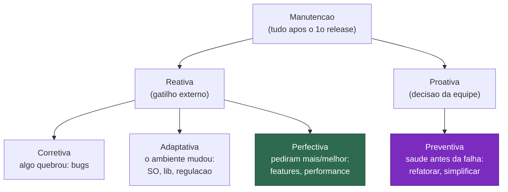
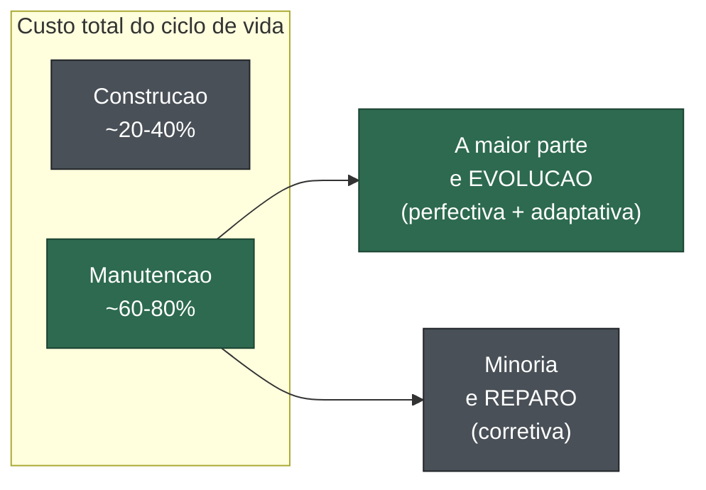
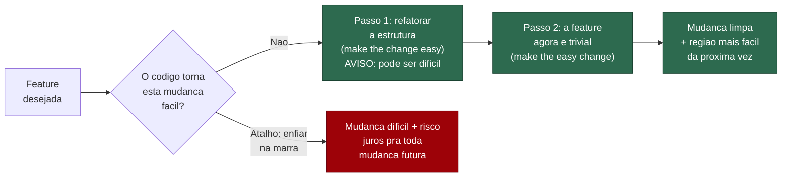
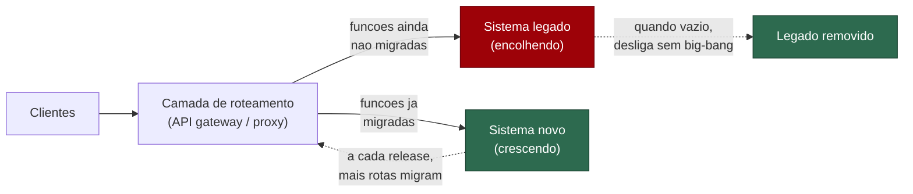

# Manutenção e evolução

A nota anterior ([[13 - Entropia de software e decaimento]]) terminou com uma sentença incômoda: o decaimento é o *default*, e manter um sistema vivo exige injeção contínua de energia.

Esta nota é sobre essa energia — onde ela é gasta, contra o quê, e com qual disciplina.

Porque há um mito persistente na cabeça de quem ainda não maturou: o de que software se *constrói*, entrega, e pronto.

A verdade que esta nota inteira do galho vem perseguindo é o oposto. Software, em sua maior parte, não é construído — é **mantido**.

E manter é onde gerir complexidade deixa de ser um ato de design e vira um *fluxo* que nunca termina.

> [!abstract] TL;DR
> A **maior parte da vida (e do custo) de um sistema é gasta sendo mudada depois do primeiro release**, não sendo construída. **Lientz & Swanson** classificaram a manutenção em quatro tipos: *corrective* (bugs), *adaptive* (novo ambiente), *perfective* (novas features/melhorias) e *preventive* (refatoração/saúde) — e descobriram que a *perfective* domina. **Código legado** tem duas definições que apontam pro mesmo medo: a provocação de **Michael Feathers** — *"legacy code is simply code without tests"* (código que você teme mudar porque não consegue verificar) — e a leitura de **Naur** ([[04 - O programa como teoria]]): legado é código cuja *teoria* se perdeu. **Kent Beck** dá o *mindset*: *"make the change easy, then make the easy change"* — invista na estrutura primeiro. **Refatoração** (Fowler) é a disciplina de mudar a estrutura interna sem mudar o comportamento; testes a tornam destemida. Síntese: gerir complexidade é uma atividade **contínua**, não um evento de projeto. Saúde de software é um *fluxo*, não um estado.

## A maior parte da vida do software é manutenção

Eis o fato que reorganiza a profissão inteira na cabeça de quem o aceita: a fase de "desenvolvimento inicial" — do nada à primeira entrega — é a **menor** parte da vida de um sistema.

Tudo o que vem depois (anos de mudanças, correções, adaptações) costuma consumir a *maioria* do custo total.

O código que você escreve hoje será **lido, alterado e remendado** por outras pessoas (e por você mesmo, que esqueceu) muito mais vezes do que foi escrito.

E "manutenção" não é uma coisa só.

**Bennet Lientz e E. Burton Swanson**, num estudo de larga escala de quase 500 organizações de processamento de dados (publicado em *Software Maintenance Management*, 1980), classificaram a manutenção em **quatro categorias**.

Swanson propôs três em 1976; a quarta (*preventive*) entrou depois:

- **Corretiva** (*corrective*) — consertar o que está quebrado: bugs e falhas descobertos depois do deploy. É o que o leigo imagina quando ouve "manutenção".
- **Adaptativa** (*adaptive*) — ajustar o sistema a um **ambiente que mudou**: novo sistema operacional, nova versão de uma dependência, nova regulação, nova integração. O código não está errado; o mundo em volta se moveu (eco direto da Lei I de Lehman, *Continuing Change*, da nota [[13 - Entropia de software e decaimento]]).
- **Perfectiva** (*perfective*) — adicionar funcionalidade nova ou melhorar a existente (performance, usabilidade) a pedido dos usuários. É a categoria **maior**.
- **Preventiva** (*preventive*) — trabalhar pra manter o sistema *saudável* antes que algo quebre: refatorar, reduzir complexidade, aumentar a manutenibilidade. É a única categoria que não responde a um estímulo externo — é energia gasta *de propósito* contra a entropia.

Vale ver as quatro lado a lado, organizadas pela pergunta que cada uma responde — porque o eixo que de fato as separa é se o gatilho veio *de fora* (alguém pediu, algo quebrou, o mundo mudou) ou se foi a equipe que *escolheu* gastar energia.

Leitura do diagrama: a manutenção se divide entre o que é *reagir* a um estímulo de fora (corretiva, adaptativa, perfectiva) e o que é *agir* por decisão própria (preventiva, em roxo). E a maior fatia — a perfectiva, em verde — é justamente *adicionar e melhorar*, não consertar. Conserto de bug é a menor das três reativas.

> [!info] O número que surpreende todo mundo
> No estudo de Lientz & Swanson, a divisão da *manutenção* (excluindo o "outros") ficava em torno de **~60% perfectiva, ~18% adaptativa, ~17% corretiva** e uma fração pequena preventiva. O dado contra-intuitivo: a maior parte do que chamamos de "manutenção" **não é consertar bugs** — é *adicionar e melhorar coisas*. Ou seja, "manutenção" é, em larguíssima medida, **evolução**. Por isso esta nota junta as duas palavras: manter um sistema *é* fazê-lo crescer e se adaptar, não só apagar incêndios. **Ressalva honesta:** os percentuais exatos variam entre relatos secundários do estudo (algumas fontes citam 17,4/18,2/60,3/4,1; outras arredondam) e estudos posteriores acharam distribuições diferentes; trate os números como *ordem de grandeza*, não como verdade cravada. A existência das quatro categorias e o domínio da perfectiva, esses sim, são bem estabelecidos. Padrão de marcação seguindo [[06 - Abstrações que vazam]].

## Onde vai o custo do ciclo de vida

Quanto, em dinheiro, é "a maior parte"?

O número mais citado na literatura é desconfortável: a manutenção costuma consumir **60 a 80% do custo total** do ciclo de vida de um sistema.

A IEEE Computer Society e a norma **ISO/IEC/IEEE 14764** (a referência internacional para o processo de manutenção) ancoram essa faixa.

Algumas fontes baixam o piso pra 50%; outras citam ~75% como número redondo. A ordem de grandeza é sólida: *construir é a parte barata*.

Agora junte com o achado de Lientz & Swanson e o quadro fica nítido.

Não só a manutenção domina o custo — dentro da própria manutenção, a maior fatia é *evolução*, não *reparo*.

Leitura do diagrama: a barra da construção (cinza, à esquerda) é a menor; a manutenção (verde) é a dominante. E ao abrir a manutenção, a evolução (verde) engole o reparo de bugs (cinza). Ou seja: o trabalho que define a vida de um sistema é *mudá-lo pra acompanhar o mundo e os usuários* — não apagar incêndios.

Se a maior parte do dinheiro e do tempo vai pra *mudar* o sistema, então qual é a pergunta central da engenharia?

Não é "como construir?". É "**como construir algo que será fácil de mudar depois?**".

Toda a primeira metade deste galho — abstração, módulos profundos, baixa carga cognitiva — existe a serviço disto. Você não projeta bem por estética; projeta bem porque *alguém vai mexer nisso por dez anos*.

## O que é código legado

A palavra "legado" carrega desprezo no jargão — "código legado" soa como "código velho e ruim". Mas as duas melhores definições do termo não falam de **idade**. Falam de **medo**.

A mais provocativa é de **Michael Feathers**, em *Working Effectively with Legacy Code* (2004):

> [!quote] Michael Feathers, *Working Effectively with Legacy Code* (2004)
> *"To me, legacy code is simply code without tests."*

Repare no que essa definição *não* diz. Não diz "código antigo", "código mal escrito", "código de outra equipe".

Pela régua de Feathers, o código que você escreveu **na semana passada sem testes já é legado** — por mais bonito, orientado a objetos e bem encapsulado que seja.

Por quê?

Porque sem testes você **não consegue mudá-lo com confiança**: cada alteração é uma aposta às cegas sobre se você quebrou algo.

Legado, pra Feathers, é o código que você *tem medo de tocar*.

> [!quote] Feathers, sobre o porquê
> *"Code without tests is bad code. It doesn't matter how well written it is; it doesn't matter how pretty or object-oriented or well-encapsulated it is. With tests, we can change the behavior of our code quickly and verifiably."*

A segunda definição vem de muito antes, de **Peter Naur** ([[04 - O programa como teoria]]): um programa **morre** quando a equipe que detinha sua *teoria* se dispersa.

O que sobra é texto — ainda compila, ainda roda, mas ninguém consegue evoluí-lo com coerência porque o *knowing-how* (por que está estruturado assim, como mudá-lo sem violar o design) foi embora com as pessoas.

Legado, pra Naur, é código cuja **teoria se perdeu**.

> [!note] Duas definições, um único medo
> Feathers olha pra **verificação** ("não consigo *checar* se minha mudança quebrou algo"); Naur olha pra **compreensão** ("não *entendo* por que isto é assim, então não sei mudar com coerência"). Parecem coisas diferentes, mas apontam pro mesmo lugar: **o terror de alterar o que você não domina**. Sem testes, você não pode *verificar*; sem a teoria, você não pode *entender*. Nos dois casos, o código vira uma caixa-preta que pune cada mudança. E note como elas se reforçam: reconstruir a teoria perdida (Naur) é mais fácil quando há testes que documentam o comportamento real (Feathers) — e escrever esses testes é, em si, um ato de reconstruir entendimento. Combater o legado é, no fundo, **diminuir o medo** — por verificação, por compreensão, idealmente por ambas.

## Make the change easy, then make the easy change

Aceito que a vida do software é mudança, e que código que se teme mudar é o inimigo, qual é a *postura* certa diante de uma alteração? **Kent Beck** condensou a resposta num tweet de **2012** que virou cânone:

> [!quote] Kent Beck (Twitter, 25/09/2012)
> *"for each desired change, make the change easy (warning: this may be hard), then make the easy change"*

A genialidade está na **ordem** e no aviso entre parênteses.

O instinto do júnior diante de uma feature nova é ir direto na mudança — enfiá-la no código como está, na marra.

O movimento sênior é parar e perguntar: *"esse código está numa forma que torna esta mudança fácil?"*.

Se não está, o primeiro passo é **refatorar a estrutura** até que a mudança desejada vire trivial. Só então você faz a mudança — agora fácil.

É o que Martin Fowler chama de *preparatory refactoring*: a metáfora dele é que, indo de carro a um lugar difícil de chegar, você primeiro dirige até um ponto de onde o destino fica fácil.

O aviso *"this may be hard"* é o coração honesto da coisa. Tornar a mudança fácil costuma dar **mais** trabalho do que enfiá-la na marra *hoje*. Mas paga-se uma vez e colhe-se em toda mudança futura naquela região — é, em linguagem da nota [[10 - Dívida técnica]], *não contrair juros*.

O fluxo dos dois passos, lado a lado com o atalho tentador:

Leitura do diagrama: o caminho sênior (verde) gasta um passo a mais — refatorar primeiro — pra que a feature vire trivial e a região fique mais barata de mexer depois. O atalho (vermelho) economiza hoje e cobra juros em toda mudança futura. É a metáfora de Fowler do "ir pro leste dirigindo pro oeste": o desvio é o caminho mais curto.

> [!tip] O irmão dessa frase: a ordem das preocupações
> Beck também é associado a *"make it work, make it right, make it fast"* — primeiro funcione, depois fique limpo, só então otimize. É a mesma sabedoria de *particionar* a dificuldade: não tente acertar tudo de uma vez. **Ressalva honesta:** essa frase é atribuída a Beck (ele a citou como "as my Pappy taught me"), mas a formulação aparece atribuída a outros antes dele (uma versão é creditada a Brian Kernighan, ~1983); trate a *autoria* como popularização, não invenção. O *"make the change easy"*, esse sim, é verbatim de Beck (tweet de 2012, verificado). Padrão de marcação seguindo [[06 - Abstrações que vazam]].

## Refatoração: a energia que combate a entropia

A ferramenta que torna "make the change easy" possível tem nome e disciplina: **refatoração**. **Martin Fowler**, em *Refactoring: Improving the Design of Existing Code* (1999; 2ª ed. 2018), a define com precisão cirúrgica:

> [!quote] Martin Fowler, *Refactoring*
> *"Refactoring (noun): a change made to the internal structure of software to make it easier to understand and cheaper to modify without changing its observable behavior."*

Os dois pedaços importam igualmente.

**Mudar a estrutura interna** — reorganizar, renomear, extrair, simplificar — é o objetivo.

**Sem mudar o comportamento observável** é a restrição que separa refatoração de "reescrever e rezar": se o comportamento muda, não foi refatoração, foi outra coisa (provavelmente um bug novo disfarçado).

Refatorar é o ato disciplinado de **reduzir complexidade acidental acumulada** ([[10 - Dívida técnica]]) e *reconstruir o entendimento* — devolver ao código a teoria que você ganhou.

Mas há um pré-requisito brutal: como você garante que *não mudou o comportamento*?

A resposta de Feathers fecha o círculo: **testes**.

São eles que tornam a refatoração **destemida** — você muda a estrutura e roda os testes; se passam, o comportamento se preservou.

Sem testes, cada refatoração é uma aposta, e o medo paralisa (de volta à definição de legado).

> [!note] Como refatorar o que não tem testes (o paradoxo de Feathers)
> Há um problema do ovo e da galinha: refatorar com segurança exige testes, mas código legado *não tem testes* — e é difícil testá-lo justamente porque está emaranhado. A solução de Feathers são duas técnicas. **Characterization tests** (testes de caracterização): em vez de testar o que o código *deveria* fazer, você escreve testes que capturam o que ele *de fato faz hoje* — congela o comportamento atual como rede de segurança, mesmo que esse comportamento seja esquisito. E **seams** (costuras): pontos do programa onde dá pra alterar o comportamento *sem editar naquele ponto* — uma costura por onde você insere um substituto (um *mock*, um *stub*) pra conseguir isolar e testar a parte que quer mexer. Com as duas, você cria a rede primeiro e *então* refatora — transformando código legado em código mantível, um pedaço de cada vez. É a manobra inversa da entropia: gastar energia deliberada pra baixar a desordem local. Aprofundamento da mecânica de testes em [[Testes]].

Há ainda uma disciplina de *processo* dentro da refatoração, e é talvez a regra mais subestimada da prática: os **dois chapéus** (*two hats*), metáfora de Kent Beck que Fowler popularizou.

> [!tip] Os dois chapéus: uma coisa de cada vez
> Programando, você está sempre num de dois modos — e só pode usar **um chapéu por vez**. Com o chapéu de **adicionar função**, você acrescenta capacidade nova: escreve testes novos, comportamento muda, é arriscado e estressante por natureza. Com o chapéu de **refatorar**, você *não* adiciona nada: só reorganiza, e todo passo preserva o comportamento com os testes verdes. O pecado capital é **misturar os dois** — mexer na estrutura *e* na funcionalidade no mesmo commit. Quando algo quebra, você não sabe se foi a refatoração ou a feature; perdeu a rede. Troque de chapéu o quanto quiser (a cada poucos minutos, até), mas nunca use os dois juntos. É a mesma sabedoria de *particionar a dificuldade* que move "make the change easy".

E a refatoração não vive só nos momentos de "limpeza" agendada. A forma mais saudável é a **contínua**: pequenas melhorias toda vez que você passa por uma região do código. É exatamente essa energia difusa e constante — não o grande mutirão raro — que segura a Lei II de Lehman ([[13 - Entropia de software e decaimento]]), pela qual a complexidade *sobe por padrão*. Refatoração contínua é o atrito que impede o sistema de rolar morro abaixo. (E ela tem um nome de marketing famoso — a regra do escoteiro — que veremos adiante.)

## Modernizar sem big-bang: o Strangler Fig

Há um caso extremo do legado: o sistema inteiro envelheceu, a tecnologia ficou obsoleta, e bate a tentação mais perigosa da engenharia — **reescrever do zero**. Jogar fora o velho, construir o novo limpo, trocar tudo de uma vez. Esse é o *big-bang rewrite*, e ele tem uma taxa de fracasso notória (a nota [[10 - Dívida técnica]] registra o argumento clássico de Joel Spolsky: a reescrita descarta anos de bugs *já corrigidos* — toda aquela teoria endurecida no código, no sentido de Naur — e quase sempre demora mais e entrega menos do que se prometia).

A alternativa disciplinada tem nome botânico: o **Strangler Fig** (figueira estranguladora), padrão batizado por **Martin Fowler** em 2004. A metáfora é literal: a figueira estranguladora germina nos galhos de uma árvore hospedeira, manda raízes que descem e a envolvem, e ao longo de anos a estrangula e ocupa seu lugar — até que a árvore original morre e a figueira fica de pé sozinha, com a forma da antiga.

A tradução pra software: você **não** substitui o sistema legado de uma vez. Você ergue o novo *em volta* dele e migra **funcionalidade por funcionalidade**.

Uma camada de roteamento na frente (tipicamente um *API gateway* ou *proxy*) decide, requisição a requisição, se atende pelo sistema velho ou pelo novo.

A cada migração, mais tráfego vai pro novo e menos pro velho — até que o legado não recebe mais nada e pode ser desligado sem cerimônia.

Leitura do diagrama: o gateway na frente roteia cada requisição — o que já foi migrado vai pro sistema novo (verde, crescendo), o resto ainda cai no legado (vermelho, encolhendo). Release após release, mais rotas migram; quando o legado não recebe mais nada, ele é desligado. Sem dia D, sem congelamento, sem aposta única: o sistema fica **sempre funcionando** durante a travessia. É a diferença entre trocar o avião em pleno voo, peça por peça, e tentar construir um avião novo no chão torcendo pra ele decolar antes de o antigo cair.

## A regra do escoteiro

Toda essa disciplina pode soar como grandes projetos. Não é. O modo dominante de combater a entropia é minúsculo e constante, capturado numa regra que **Robert C. Martin** (Uncle Bob) adaptou pra *Clean Code* (2008) a partir do lema escoteiro:

> [!quote] A regra do escoteiro (Boy Scout Rule)
> *"Deixe o acampamento mais limpo do que você o encontrou."*
> Aplicada ao código: toda vez que você toca num arquivo, deixe-o **um pouquinho melhor** do que estava — renomeie uma variável obscura, extraia uma função, apague um comentário mentiroso.

A potência da regra está na escala.

Você **não** precisa de um mutirão de refatoração (que raramente é aprovado e quase nunca termina). Precisa de melhorias pequenas e oportunistas, espalhadas por centenas de toques diários de uma equipe inteira.

Some isso ao longo do tempo e o codebase *melhora sozinho*, sem nunca ter havido um "projeto de limpeza".

É a contrapartida exata da Lei II de Lehman: se a complexidade sobe um tiquinho a cada mudança descuidada, ela *desce* um tiquinho a cada mudança escoteira.

Quem vence é quem tem o sinal certo na maioria dos toques.

## Síntese: saúde é fluxo, não estado

Aqui o galho inteiro presta contas.

Volte ao começo: gerir complexidade *parece* um ato de design — escolher a boa abstração, o módulo profundo, a fronteira certa.

Mas esta nota desfaz essa ilusão. O design inicial é a **menor** parte.

A complexidade não é domada num momento heroico de arquitetura; ela é **administrada continuamente**, mudança após mudança, ao longo de toda a vida do sistema.

> [!warning] Saúde de software não é um estado que se alcança — é um fluxo que se mantém
> Você nunca "termina" de gerir complexidade, do mesmo jeito que ninguém "termina" de estar saudável e pode parar de comer e dormir. A Lei II de Lehman ([[13 - Entropia de software e decaimento]]) garante que a complexidade *sobe por padrão*; manutenção e refatoração são o trabalho explícito que a empurra de volta. Pare de gastar essa energia e o sistema decai — não por um erro, mas por *ausência de cuidado contínuo*. Um sistema saudável não é um que foi bem projetado; é um onde **alguém continua, todo dia, pagando o custo de mantê-lo simples o bastante pra mudar**. Software não é uma obra que se entrega. É um jardim que se cuida.

## Em entrevista

Quando o tema aparece, o entrevistador quer ver se você entende manutenção como *trabalho de primeira classe*, não como tarefa de estagiário. Munição curta:

- **"Manutenção é a maior parte do ciclo de vida (60–80% do custo) — e a maior parte dela é evolução, não correção de bug."** Cita Lientz & Swanson e as quatro categorias. Mostra que você pensa no software como algo vivo, não como entrega.
- **"Código legado, pra mim, é código sem testes (Feathers) — ou código cuja teoria se perdeu (Naur)."** É uma definição madura: legado é sobre *medo de mudar*, não sobre idade.
- **"Antes de uma feature difícil, eu faço refatoração preparatória: make the change easy, then make the easy change."** Sinaliza postura sênior — você investe na estrutura antes de empurrar a mudança.
- **"Pra modernizar um monólito legado, eu evito o big-bang rewrite e prefiro o Strangler Fig."** Demonstra que você conhece o risco da reescrita e tem uma alternativa incremental concreta.
- **Se perguntarem como refatorar com segurança:** dois chapéus (nunca misturar feature e refatoração), testes verdes como rede, e characterization tests/seams pra domar o legado sem testes.

## Referências

- **Michael C. Feathers** — *Working Effectively with Legacy Code* (Prentice Hall, 2004). A definição: *"To me, legacy code is simply code without tests."* As técnicas centrais: *seams* e *characterization tests*. *"Code without tests is bad code [...] With tests, we can change the behavior of our code quickly and verifiably."*
- **Kent Beck** — Tweet de 25/09/2012: *"for each desired change, make the change easy (warning: this may be hard), then make the easy change."* ([x.com/KentBeck/status/250733358307500032](https://x.com/KentBeck/status/250733358307500032)). Também associado a *"make it work, make it right, make it fast"* (popularizado por Beck; formulação anterior atribuída a Brian Kernighan, ~1983).
- **Bennet P. Lientz & E. Burton Swanson** — *Software Maintenance Management* (Addison-Wesley, 1980), estudo de ~500 organizações; as quatro categorias (corrective, adaptive, perfective, preventive — esta última posterior à tríade de Swanson, 1976) e o achado de que a perfectiva domina. A distribuição aproximada citada: ~60% perfectiva, ~18% adaptativa, ~17% corretiva.
- **Martin Fowler** — *Refactoring: Improving the Design of Existing Code* (Addison-Wesley, 1999; 2ª ed. 2018). *"Refactoring (noun): a change made to the internal structure of software to make it easier to understand and cheaper to modify without changing its observable behavior."* Também o *preparatory refactoring* e a metáfora dos **dois chapéus** (*two hats*, originalmente de Kent Beck), em *Workflows of Refactoring* — martinfowler.com.
- **Martin Fowler** — *StranglerFigApplication* (martinfowler.com, 2004). O padrão **Strangler Fig** para modernizar sistemas legados incrementalmente, sem *big-bang rewrite*, com uma camada de roteamento na frente migrando funcionalidade por funcionalidade. Documentado também por AWS Prescriptive Guidance e Microsoft Azure Architecture Center.
- **Robert C. Martin** — *Clean Code: A Handbook of Agile Software Craftsmanship* (Prentice Hall, 2008). A **regra do escoteiro** ("deixe o acampamento mais limpo do que encontrou"), adaptada do lema escoteiro de Baden-Powell: melhoria contínua e oportunista do código a cada toque.
- **ISO/IEC/IEEE 14764** — *Software engineering — Software life cycle processes — Maintenance* (edições 2006 e 2022). Norma de referência para o processo de manutenção; ancora a faixa, citada pela IEEE Computer Society, de **60–80% do custo total do ciclo de vida** gasto em manutenção.

> [!note] Sobre o lastro das afirmações
> A definição de Feathers (*"legacy code is simply code without tests"*), os conceitos de *seams* e *characterization tests*, o tweet de Kent Beck de 2012 (verbatim e data), a existência das quatro categorias de Lientz & Swanson com domínio da perfectiva, a definição de refatoração e os dois chapéus de Fowler, o padrão Strangler Fig (Fowler, 2004), a regra do escoteiro (Uncle Bob) e a faixa de 60–80% do custo de ciclo de vida (IEEE/ISO 14764) foram **conferidos na pesquisa web** que alimentou esta nota. **Ressalvas honestas:** (1) os percentuais exatos de Lientz & Swanson variam entre fontes secundárias e estudos posteriores — trate como ordem de grandeza; (2) a faixa de 60–80% também varia por estudo (algumas fontes citam 50%, outras ~75%) — é um benchmark robusto, não um número cravado; (3) *"make it work, make it right, make it fast"* é popularizado por Beck mas tem formulação anterior atribuída a Kernighan; (4) não li os textos primários (livros de Feathers, Fowler, Lientz & Swanson, Martin) integralmente — as citações reproduzem com alta fidelidade os trechos verbatim recuperados, mas o fraseado de partes não-citadas pode diferir. Autoria, datas e a tese central de cada fonte estão confirmadas. Padrão de marcação seguindo [[06 - Abstrações que vazam]].

## Veja também

- [[13 - Entropia de software e decaimento]] — o decaimento é o default; manutenção é a energia que o combate
- [[04 - O programa como teoria]] — legado também é código cuja teoria se perdeu (Naur)
- [[10 - Dívida técnica]] — a refatoração é a moeda com que se paga a dívida ao longo da vida do sistema
- [[Testes]] — a mecânica que torna a refatoração destemida (a rede de segurança de Feathers)
- [[Dicionário de Fundamentos]] — verbetes do domínio
