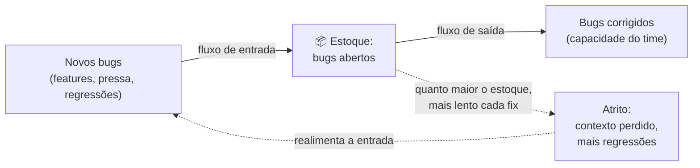
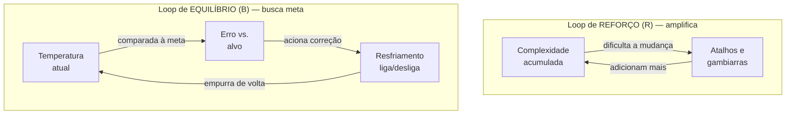
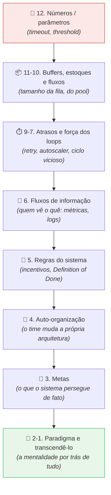
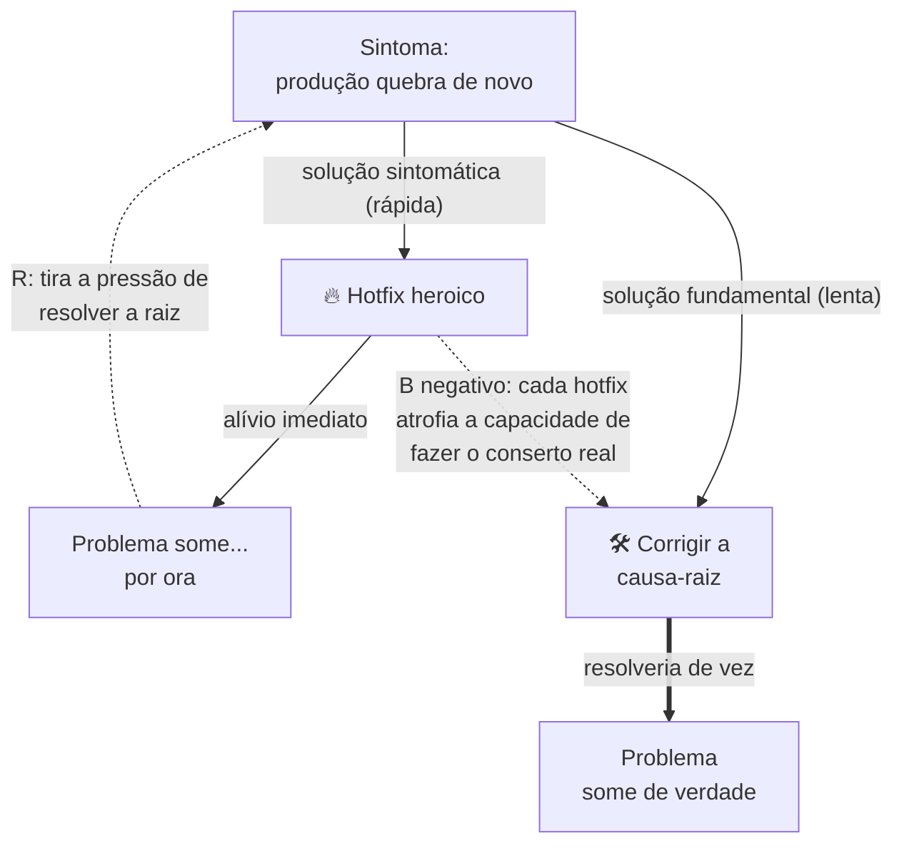

# Pensamento sistêmico

A nota sobre entropia ([[13 - Entropia de software e decaimento]]) mostrou que a desordem se **realimenta** — janelas quebradas recrutam mais janelas quebradas. Repare na palavra: *realimenta*.

Esse não é um detalhe de vocabulário. É uma pista de que estamos diante de um **sistema**, e que sistemas têm leis próprias que o estudo das partes isoladas não revela.

Esta nota dá o nome dessa lente — **pensamento sistêmico** — e dela depende boa parte da fase Magus. Por quê? Porque gerenciar complexidade no *todo* (codebase + time + processo) exige enxergar o todo como um todo, não como uma pilha de pedaços.

> [!abstract] TL;DR
> **Pensamento sistêmico** (*systems thinking*) é entender o comportamento de algo olhando o **sistema inteiro e as relações entre as partes**, não as partes isoladas — porque o todo tem propriedades que nenhuma parte tem.
>
> Cinco ideias ancoram a lente:
> - **Emergência** — comportamento que surge da *interação* e não existe em componente nenhum (um deadlock não mora em nenhuma thread).
> - **Estoques e fluxos** — o sistema é feito de acúmulos (estoques) e das taxas que os enchem e esvaziam (fluxos).
> - **Loops de feedback** — de reforço (amplificam ciclos viciosos/virtuosos) e de equilíbrio (estabilizam, buscam meta) — **Donella Meadows**, *Thinking in Systems*.
> - **Pontos de alavancagem** — onde empurrar; as intervenções óbvias costumam ser fracas, as fortes são sutis e contraintuitivas (paradigmas > metas > regras > números).
> - **Arquétipos** — padrões de comportamento que se repetem em sistemas diferentes (Peter Senge, *The Fifth Discipline*).
>
> A raiz intelectual é a *General System Theory* de **Ludwig von Bertalanffy**. Aplicado a software: complexidade é, em larga medida, **emergente** — nasce das interações, não das peças.

## O que é

Pergunta de abertura: por que um time de bons engenheiros, cada um competente, produz um sistema que ninguém entende?

A resposta reducionista — "alguém errou" — não explica nada, porque ninguém errou.

A resposta sistêmica é outra: **o comportamento problemático não está em nenhuma das partes; está nas relações entre elas.**

Pensamento sistêmico é exatamente essa mudança de foco.

Em vez de perguntar "como cada componente funciona?", pergunta "como os componentes **interagem**, e que comportamento isso produz no nível do todo?".

A tese central vem da **General System Theory** de **Ludwig von Bertalanffy** (formulada nos anos 1940-50, livro de 1968).

É simples de enunciar e difícil de internalizar: **o todo é mais que a soma das partes.**

O próprio Bertalanffy desmistificou essa frase. Ela não é misticismo.

Significa apenas que as *características constitutivas* do todo não são explicáveis a partir das características das partes isoladas. Elas aparecem como **novas** ou **emergentes** quando as partes interagem.

Um sistema, na definição operacional, é um conjunto de elementos *interconectados* organizados em torno de um propósito.

Dessa interconexão surgem propriedades que você não acha desmontando o sistema peça por peça.

> [!note] Reducionismo não está errado — está incompleto
> Decompor um problema em partes menores é uma das ferramentas mais poderosas que temos (é literalmente o que a modularidade faz). O ponto do pensamento sistêmico não é abandonar a decomposição, e sim lembrar que **algumas coisas só existem na junção**.
>
> Você pode entender perfeitamente cada thread do seu programa e ainda assim não ver o deadlock chegando — porque o deadlock não é uma propriedade de thread nenhuma. Olhar só as partes te cega para tudo que vive *entre* elas.

> [!info] Duas linhagens que se cruzam
> O campo nasce de duas tradições quase simultâneas. **Bertalanffy** (biologia) propôs a *teoria geral dos sistemas*: sistemas de domínios distintos — organismos, organizações, máquinas — compartilham princípios comuns. **Norbert Wiener** (matemática/engenharia), em *Cybernetics* (1948), fundou a **cibernética**: o estudo de controle e comunicação por meio de **feedback**, em animais e máquinas.
>
> A frase-resumo: Bertalanffy deu a ênfase no *todo > partes*; Wiener deu o **circuito de feedback** como modelo básico de como um sistema se regula. As duas linhagens são a espinha dorsal de tudo que vem a seguir.

## Emergência

**Emergência** é o nome do comportamento que surge da interação entre as partes e **não está presente em nenhum componente isolado**.

É a propriedade do todo que nenhuma peça carrega.

O exemplo que todo dev sênior conhece na pele: o **deadlock**.

Pegue a thread A, leia o código dela inteiro — não há deadlock ali. Pegue a thread B — também não.

O deadlock só *existe* quando A segura o recurso 1 e quer o 2, enquanto B segura o 2 e quer o 1.

Ele **emerge da interação**, e por isso é tão traiçoeiro: você não consegue encontrá-lo inspecionando as partes, porque ele não mora em nenhuma delas. Mora na relação.

O exemplo fora da computação é o **engarrafamento**. Nenhum carro "contém" um congestionamento.

Ele surge da densidade, dos tempos de reação e das pequenas frenagens que se propagam para trás como uma onda. O engarrafamento é um fenômeno do *trânsito*, não de carro nenhum.

> [!example] Emergência boa e ruim
> Emergência não é sinônimo de problema — é neutra.
>
> - **Boa:** um *cache* que melhora o tempo de resposta médio do sistema inteiro sem que nenhum componente individual tenha "velocidade" como propriedade.
> - **Ruim:** um *thundering herd* em que mil clientes, cada um educadamente fazendo retry, derrubam o servidor juntos.
>
> Em ambos os casos, o comportamento é do **sistema**, não de um cliente. Daí a regra prática: quando algo estranho acontece e você não acha o culpado em nenhum arquivo, suspeite de emergência — o "culpado" é a *configuração de interações*.

E aqui está o elo com o galho inteiro: **a complexidade costuma ser emergente.**

Aquela base que "ninguém entende" raramente tem uma única parte horrível.

O que ela tem é uma teia de dependências e casos especiais cujo *enredamento* — não cujas peças — torna o todo ininteligível.

Foi por isso que [[01 - A complexidade como problema central|Ousterhout]] definiu complexidade pela estrutura e pelas dependências: ela é uma propriedade do sistema, não dos pedaços.

E há um agravante sistêmico: a complexidade emergente é um **loop de reforço**. Quanto mais enredada a base, mais difícil cada mudança; quanto mais difícil a mudança, mais atalhos e casos especiais; mais atalhos, mais enredamento. A complexidade alimenta a própria produção — o que conecta esta nota diretamente ao decaimento de [[13 - Entropia de software e decaimento]].

## Estoques e fluxos

Antes de falar de loops, Meadows insiste num vocabulário mais básico: **estoques** e **fluxos**.

É o esqueleto de qualquer sistema.

Um **estoque** (*stock*) é um acúmulo — algo que você poderia, em princípio, contar num instante.

Exemplos: o saldo de uma conta. O número de bugs abertos. A quantidade de dívida técnica. A confiança do time.

Um **fluxo** (*flow*) é uma *taxa* — algo que enche ou esvazia o estoque ao longo do tempo.

Bugs *entrando* (novos defeitos por semana) e bugs *saindo* (correções por semana) são os dois fluxos do estoque "bugs abertos".

A intuição que isso treina: **o estoque só muda pela diferença entre o fluxo de entrada e o de saída.**

Um backlog de bugs cresce não porque "tem muito bug", mas porque a taxa de chegada supera a taxa de correção. Atacar o nível do estoque sem mexer nos fluxos é enxugar gelo.

Eis o backlog de bugs modelado como estoque e fluxo:

Leitura do diagrama: o estoque (bugs abertos) sobe quando a entrada supera a saída; e há um detalhe sistêmico cruel — um estoque grande *aumenta o atrito* (mais contexto perdido, mais regressões), o que realimenta a entrada. O acúmulo dificulta o próprio esvaziamento.

> [!tip] Por que estoques importam: eles criam atraso e memória
> Estoques são a **memória** do sistema e a fonte dos seus **atrasos**. Você pode fechar a torneira de entrada hoje (parar de criar bugs), e o estoque continua alto por semanas. Esse descompasso entre *agir agora* e *ver o efeito depois* é a raiz das oscilações que veremos nos loops. Quem ignora estoques se frustra esperando resultados instantâneos de mudanças que precisam *drenar* um acúmulo.

## Loops de feedback

Se emergência é o *quê*, os **loops de feedback** são uma boa parte do *como*.

Um loop de feedback existe quando a saída de um processo volta a influenciar a sua própria entrada — o sistema "se ouve".

**Donella Meadows**, em *Thinking in Systems: A Primer*, classifica esses loops em dois tipos. Essa distinção é uma das ferramentas mais úteis do pensamento sistêmico.

**Loops de reforço** (*reinforcing*, marcados **R**) **amplificam**. O que está acontecendo faz acontecer ainda mais — pra cima ou pra baixo, dá no mesmo: é uma bola de neve. São os **ciclos viciosos e virtuosos**.

A teoria das janelas quebradas que vimos em [[13 - Entropia de software e decaimento|entropia]] é um loop de reforço puro.

O ciclo: bagunça visível → sinal de descuido → mais bagunça tolerada → mais sinal de descuido. Cada volta torna a próxima mais provável.

Software complexo cresce assim — a complexidade que já existe torna a próxima mudança mais difícil, o que produz mais atalhos, o que produz mais complexidade.

**Loops de equilíbrio** (*balancing*, marcados **B**) **estabilizam**. Eles buscam uma meta e corrigem desvios, resistindo à mudança.

A analogia clássica de Meadows é o **termostato**: a temperatura sobe, ele liga o resfriamento; cai, ele desliga. O loop puxa o sistema de volta ao alvo.

Em software: um *autoscaler* que adiciona réplicas quando a carga sobe e remove quando cai é um loop de equilíbrio; uma revisão de código que barra cada degradação antes do merge também é.

Eis os dois lado a lado:

Leitura do diagrama: à esquerda, um loop **R** — cada volta torna a próxima mais intensa, sem freio interno (bola de neve). À direita, um loop **B** — ele *compara* o estado a uma meta e age para anular o desvio, voltando ao alvo. R foge do equilíbrio; B persegue o equilíbrio.

> [!note] A assimetria que importa
> Meadows faz uma observação contraintuitiva e prática: **frear um loop de reforço costuma ser mais eficaz do que reforçar os loops de equilíbrio** que tentam compensá-lo.
>
> Você não vence uma bola de neve construindo paredes cada vez maiores no caminho dela — você vence *parando a bola de neve*. Traduzindo: combater o crescimento da complexidade na raiz (cortar o ciclo vicioso) bate adicionar mais e mais processo defensivo pra conter os sintomas. É o mesmo espírito do "consertar a janela quebrada" — atacar o reforço, não acumular contenção.

### Atrasos: por que sistemas oscilam

Um ingrediente quase invisível dos loops é o **atraso** (*delay*).

Quase nenhuma realimentação é instantânea — há sempre um intervalo entre a ação e o efeito que ela produz, e entre o efeito e a sua percepção.

Atrasos são a causa principal de **oscilação** e *overshoot*.

Pense no chuveiro com encanamento longo: você abre o quente, nada acontece, você abre mais, e de repente vem o escaldante — você passou do ponto porque o feedback chegou tarde. Aí corrige pro frio demais, e oscila.

Em software o padrão é idêntico:

- Você adiciona servidores reagindo a uma carga que já passou (escala tarde, derruba; depois sobra capacidade).
- Ou contrata gente reagindo a uma sobrecarga de seis meses atrás, e o time fica grande demais quando a demanda já recuou.

O atraso transforma boas intenções em pêndulo.

A lição prática: **num sistema com atraso, a paciência é parte do controle.**

Quem reage a cada leitura sem respeitar o tempo de resposta do sistema o faz oscilar com as próprias mãos.

## Pontos de alavancagem

Meadows escreveu um ensaio célebre, *Leverage Points: Places to Intervene in a System* (1997, depois incorporado ao livro).

A pergunta é: dado um sistema que você quer mudar, **onde empurrar?**

E a resposta dela é profundamente contraintuitiva.

> [!abstract] A tese central dos leverage points
> As intervenções **óbvias** num sistema costumam ser as **mais fracas**, e as intervenções **fortes** costumam ser as **mais sutis** — e por isso mesmo ninguém pensa nelas.
>
> Mexer em números (orçamento, parâmetros, *thresholds*) é o que todo mundo faz primeiro e é o que menos muda. Mexer na **estrutura**, nas **regras**, nas **metas** e — no topo da lista — nos **paradigmas** que sustentam o sistema é o que de fato o transforma, e é justamente o que ninguém tenta porque é o mais difícil de enxergar.

Meadows ordena **doze** pontos de alavancagem, dos mais fracos aos mais fortes.

A lista canônica (do nº 12, mais fraco, ao nº 1, mais profundo):

1. **12.** Constantes, parâmetros, números (taxas, *thresholds*, subsídios).
2. **11.** Tamanho dos *buffers* e estoques estabilizadores em relação aos fluxos.
3. **10.** Estrutura de estoques e fluxos.
4. **9.** Atrasos (*delays*), em relação à velocidade de mudança do sistema.
5. **8.** Força dos loops de **equilíbrio** em relação ao que tentam corrigir.
6. **7.** Ganho dos loops de **reforço**.
7. **6.** Estrutura dos fluxos de **informação** (quem tem acesso a quê).
8. **5.** **Regras** do sistema (incentivos, punições, restrições).
9. **4.** Capacidade de **auto-organização** (mudar a própria estrutura).
10. **3.** **Metas** do sistema.
11. **2.** **Paradigma** — a mentalidade de onde o sistema (e suas metas) emerge.
12. **1.** O poder de **transcender** paradigmas — não se aprisionar a nenhum.

Repare na progressão: começa em "ajustar um número" e termina em "mudar a mentalidade".

A escada subindo do fraco ao forte:

Leitura do diagrama: de cima (vermelho, alavancagem **fraca**: mexer num número) para baixo (verde, alavancagem **forte**: mudar o paradigma). Quanto mais fundo, mais o ponto transforma o sistema — e mais difícil é enxergá-lo e tocá-lo.

Em software, a tradução é direta:

- Trocar um valor de *timeout* → ponto **12**, fraco.
- Redimensionar um *connection pool* → ponto **11**, ainda fraco.
- Mudar a **arquitetura** (estrutura de estoques/fluxos) → ponto **10**, mais forte.
- Dar visibilidade de métricas ao time todo → ponto **6**, informação.
- Mudar a **Definition of Done** ou os incentivos de avaliação → ponto **5**, regras.
- Redefinir **o que o sistema persegue** (velocidade vs. qualidade vs. segurança) → ponto **3**, meta.

Por isso *guidelines* de qualidade e a definição de *done* alavancam mais que qualquer micro-otimização: elas operam num degrau muito mais fundo da escada.

O reflexo a treinar: quando algo no sistema te incomoda, suba a escada antes de agir. A primeira ideia que vem (mexer num número) é quase sempre a mais fraca.

> [!warning] Intervir num sistema complexo tem consequências não óbvias
> O outro lado da mesma moeda: porque tudo está interconectado por loops, **empurrar um ponto raramente faz só o que você esperava.**
>
> Você "conserta" um sintoma e ele reaparece em outro lugar. Você reforça uma métrica e o sistema otimiza *para a métrica*, não para a intenção (lei de Goodhart à espreita — ver adiante). Meadows é explícita: sistemas complexos resistem, contra-atacam e surpreendem. Humildade não é modéstia aqui — é método. Antes de empurrar, pergunte que loops você vai acordar.

## Arquétipos de sistema

Se loops e estoques são o alfabeto, os **arquétipos** são as palavras que aparecem o tempo todo.

**Peter Senge**, em *The Fifth Discipline* (1990), catalogou padrões de comportamento que se repetem em sistemas completamente diferentes — empresas, ecossistemas, times de software.

Conhecê-los é como aprender aberturas de xadrez: você reconhece a situação antes de ela se desenrolar.

Dois deles são onipresentes na engenharia.

### "Shifting the Burden" (transferindo o fardo)

Há um problema. Existem duas respostas:

- Uma **solução sintomática** — rápida, alivia já.
- Uma **solução fundamental** — lenta, ataca a raiz.

O arquétipo descreve a armadilha.

A solução sintomática alivia tão depressa que **reduz a pressão** por resolver a causa.

Pior, o uso repetido do paliativo costuma **atrofiar a capacidade** de aplicar a solução real. Você fica *dependente* do paliativo.

O exemplo de software é tão claro que dói: o time vive de **hotfix**.

Algo quebra, alguém heroico corrige em produção às pressas, todo mundo respira. A causa-raiz nunca é tratada porque "o fogo foi apagado".

E cada hotfix deixa o código um pouco pior, tornando o *próximo* incêndio mais provável e o conserto de raiz mais distante.

É um loop de reforço disfarçado de alívio: cada volta parece resolver e, no agregado, piora.

Leitura do diagrama: o caminho do **hotfix** (linha cheia) é curto e gratificante, mas alimenta um loop que *remove a motivação* de seguir o caminho fundamental (linha dupla, tracejada) — e ainda corrói a capacidade de percorrê-lo. Com o tempo, o time só sabe apagar incêndio. O sintoma vira crônico.

A saída sistêmica: **proteger deliberadamente o tempo da solução fundamental**, mesmo sob pressão.

Senão o loop sintomático sequestra o sistema — e o time perde, aos poucos, a própria habilidade de fazer o conserto de raiz.

### "Fixes that Fail" (consertos que falham)

Primo do anterior.

Aqui o conserto rápido funciona — *e depois piora o problema*, por um efeito colateral atrasado que só aparece volta adiante.

Dois exemplos típicos em software:

- Você silencia um teste *flaky* pra destravar o deploy (conserta o sintoma); meses depois, aquele teste teria pego um bug real que agora vaza pra produção.
- Você adiciona um *retry* automático pra mascarar instabilidade; o retry multiplica a carga e, no próximo pico, *amplifica* a queda que deveria conter.

O traço comum dos dois arquétipos: **o tempo é o vilão.**

O alívio é imediato e visível; o custo é atrasado e difuso. Nosso cérebro desconta o futuro, e o atraso esconde o preço — exatamente o que a seção de *delays* previu.

> [!info] Outros arquétipos que valem o nome
> Senge cataloga vários; dois que aparecem em software:
> - **"Limits to Growth"** (limites ao crescimento): um loop de reforço impulsiona o crescimento até esbarrar num loop de equilíbrio escondido (um limite de recursos). Uma feature viraliza, o uso cresce, até o banco de dados saturar e o crescimento travar. *Nenhum sistema físico cresce para sempre.*
> - **"Tragedy of the Commons"** (tragédia dos comuns): cada ator otimiza seu uso de um recurso compartilhado até exauri-lo para todos. Cada time abusa do cluster compartilhado, do *rate limit* da API interna, do tempo do time de plataforma — e o comum colapsa.

### Três propriedades que Meadows valoriza

Meadows insiste que sistemas saudáveis exibem três virtudes — e que a obsessão por *produtividade* costuma sacrificá-las.

- **Resiliência** — a capacidade de absorver choques e voltar ao normal. Não é a mesma coisa que estabilidade no instante; é a margem de manobra ao longo do tempo. Em software: *circuit breakers*, *retries* com *backoff*, *bulkheads* e folga de capacidade compram resiliência.
- **Auto-organização** — a capacidade do sistema de *mudar a própria estrutura*. Um time que refatora a arquitetura quando ela aperta tem auto-organização; um congelado por processo não tem. (É o ponto de alavancagem nº 4.)
- **Hierarquia** — sistemas complexos se organizam em camadas de subsistemas, justamente para conter a complexidade. Modularidade é hierarquia aplicada ao código.

> [!note] Racionalidade limitada (*bounded rationality*)
> Meadows toma de empréstimo de **Herbert Simon** a ideia de **racionalidade limitada**: cada ator decide *racionalmente* com a informação parcial que tem do seu canto do sistema — e a soma dessas decisões locais e razoáveis produz um resultado global ruim. Ninguém é vilão; cada um otimiza o que vê. É a base teórica da "otimização local que machuca o todo" e da *tragédia dos comuns*. A cura sistêmica não é cobrar mais virtude individual, e sim **mudar a estrutura de informação e incentivos** (pontos de alavancagem 6 e 5) para que a decisão local passe a servir o todo.

## Por que importa em software

Aqui está o reenquadramento que sustenta a fase Magus inteira: **um codebase não é o sistema. O sistema é codebase + time + processo.**

O código é só uma parte.

O comportamento que você vive no dia a dia — velocidade de entrega, taxa de bugs, moral, decaimento — **emerge da interação** entre o código, as pessoas que o escrevem e as regras sob as quais escrevem.

Isso reorganiza tudo que veio antes:

- A entropia ([[13 - Entropia de software e decaimento]]) é um **loop de reforço** rodando nesse sistema sócio-técnico — janelas quebradas que recrutam mais janelas quebradas.
- A manutenção ([[14 - Manutenção e evolução]]) é uma tentativa de injetar **loops de equilíbrio** que estabilizem o decaimento.
- A dívida técnica em si é um **estoque** que cresce quando o fluxo de atalhos supera o fluxo de refatoração — e que, grande demais, atrofia a capacidade de drená-lo.

### Efeitos de segunda ordem e otimização local

Todo sistema tem uma **fronteira** — a linha que separa o "dentro" do "ambiente".

E aqui mora uma sutileza: **a fronteira não é dada pela natureza, é desenhada pelo observador.** *Onde você traça a fronteira muda o que consegue explicar.*

Desenhe a fronteira em volta de um único serviço e ele parece saudável: latência baixa, CPU folgada.

Desenhe-a em volta da requisição inteira, atravessando dez serviços, e o quadro vira outro — aquele serviço "saudável" está segurando uma conexão que estrangula o sistema todo.

O perigo das fronteiras estreitas são os **efeitos de segunda ordem** — consequências que vazam para fora do recorte onde você otimizou. O caso canônico é a **otimização local que machuca o todo**:

- Você acelera seu módulo cacheando agressivamente, e o cache estoura a memória que outro serviço precisava.
- Você adiciona um índice que deixa a leitura voadora e a escrita lenta.
- Cada time otimiza o seu pedaço, e o sistema inteiro fica pior.

Ninguém errou *dentro* da sua fronteira. O erro foi **a fronteira** — estreita demais pra enxergar o custo que recaía sobre o vizinho.

Pensar sistemicamente é treinar-se a perguntar: "e do lado de fora do meu recorte, o que isso causa?"

### Goodhart: quando a métrica vira o sistema

Há uma falha sistêmica tão recorrente que ganhou nome próprio: a **lei de Goodhart**.

*"Quando uma medida se torna uma meta, ela deixa de ser uma boa medida"* (Charles Goodhart, 1975; a formulação famosa é de Marilyn Strathern, 1997).

A mecânica é puro pensamento sistêmico. Uma métrica é um **proxy** — ela *representa* algo que importa, mas não é a coisa.

No instante em que você anexa incentivos ao proxy (bônus, promoção, ranking), o sistema passa a otimizar **o número**, não a intenção por trás dele.

A consequência: o sistema (pessoas + ferramentas + incentivos) aprende a mover o número pelo caminho de menor esforço, que quase nunca é o caminho que você tinha em mente.

Os exemplos de software são clássicos:

- Meta de **cobertura de testes** → testes que executam linhas sem asserções de verdade.
- Meta de **velocity / story points** → inflação de estimativas.
- Meta de **número de bugs fechados** → bugs fechados como "duplicata" ou "não reproduz".
- Meta de **linhas de código** → o pior incentivo já inventado.

Goodhart é o que acontece quando você empurra o **ponto de alavancagem das regras** (nº 5) sem entender os loops que vai acordar.

Você mexe num incentivo; o sistema, criativo, encontra o caminho de menor esforço para o número — geralmente atravessando a sua intenção.

> [!note] Otimização local vs. global, em uma linha
> Quase todo desastre sistêmico em software é uma **otimização local** vencendo o **ótimo global**: cada parte (time, serviço, métrica) maximiza o seu, e a soma é pior que o todo coordenado. A lente sistêmica é, em boa medida, o hábito de subir o nível da fronteira até enxergar o ótimo global.

### Conway: um resultado sistêmico

Há um resultado clássico que é puro pensamento sistêmico aplicado ao par **organização ↔ arquitetura**: a forma como o time se comunica acaba estampada na forma do software.

Isso é um efeito sistêmico — uma propriedade que **emerge** do acoplamento entre a estrutura humana e a estrutura técnica, não de nenhuma das duas isoladamente.

É um tema grande o bastante pra ter nota própria: [[16 - Lei de Conway]] o desenvolve por inteiro.

Aqui fica só o gesto: quando você desenha a organização, está desenhando a arquitetura, queira ou não.

A moral, em uma frase: **pare de procurar a peça culpada e comece a olhar a configuração de interações.**

A complexidade que você combate é, quase sempre, emergente — e só uma lente que enxerga o todo consegue vê-la.

## Armadilhas comuns

> [!warning] Empurrar o ponto errado da escada
> A armadilha mais comum é agir no ponto de alavancagem mais fraco só porque é o mais fácil de enxergar e de tocar. O time sofre com um serviço lento e a resposta vira "aumenta o timeout" ou "sobe mais réplica" — pontos 12 e 11, os mais baixos da lista de Meadows. Se o problema de verdade é a **estrutura** (um acoplamento que devia ter sido cortado), o **objetivo** do sistema (otimizar entrega em vez de qualidade) ou o **paradigma** da equipe (achar que "dá pra resolver depois"), mexer em números só compra tempo — e ainda dá a falsa sensação de que "algo foi feito".

> [!warning] Confundir o sintoma correlacionado com o loop que o produz
> Dois sintomas aparecerem juntos não significa que um seja a causa do outro — muitas vezes os dois são efeitos do mesmo loop escondido, e tratar um deles isoladamente não muda nada. Bugs subindo e moral caindo, por exemplo, correlacionam-se, mas "melhorar a moral" (um afterwork, um elogio) não fecha o loop de reforço entropia → atrito → mais atalhos → mais bugs → menos moral. Quem trata correlação como causa acaba investindo esforço num sintoma e vendo o outro voltar semanas depois — porque o loop real nunca foi tocado.

> [!warning] A intervenção óbvia empurra o sistema na direção errada (*policy resistance*)
> Meadows chama de **resistência política** (*policy resistance*) o fenômeno em que várias partes do sistema, cada uma perseguindo sua própria meta local, neutralizam ou até invertem o efeito de uma intervenção bem-intencionada. Você impõe um processo de revisão mais rígido pra frear bugs, e o time aprende a dividir PRs de um jeito que passa raspando pela regra sem passar pelo espírito dela. O sistema "resiste" não por malícia, mas porque cada ator continua otimizando o que sempre otimizou — e a régua nova vira só mais uma restrição a contornar. A lição de Meadows: antes de empurrar, mapeie quem mais tem meta própria dentro do sistema, porque é ali que a sua alavanca vai ser absorvida ou revertida.

## Inglês

A tradução direta funciona bem para a maioria dos termos desta nota, mas três merecem cuidado.

**Reinforcing** e **balancing** são o vocabulário que Meadows escolheu de propósito, e a literatura mais antiga de cibernética usava *positive feedback* e *negative feedback* para a mesma distinção. Evite misturar os dois pares: "positive" não quer dizer "bom" — um loop *positivo* (reforçador) pode ser uma bola de neve destrutiva, e um loop *negativo* (de equilíbrio) pode ser exatamente o que o sistema precisa para não sair do controle. Meadows trocou os rótulos justamente para tirar essa carga moral do nome.

**Stock**, na tradução "estoque", não carrega o sentido de inventário de almoxarifado nem de ação na bolsa — é qualquer quantidade acumulada e mensurável num instante: bugs abertos, dívida técnica, confiança do time, água numa banheira. Quando você ler *stock* num texto de *systems thinking*, resista à tentação de pensar em "estoque de produto".

**Leverage point** quase sempre aparece em inglês mesmo em textos em português, porque é o termo de busca que leva direto ao ensaio original de Meadows e à lista canônica dos doze pontos — traduzir para "ponto de alavancagem" é correto e usado nesta nota, mas ao pesquisar ou citar a fonte, o termo em inglês é o que resolve.

| Português | Inglês |
|---|---|
| Pensamento sistêmico | Systems thinking |
| Emergência | Emergence |
| Estoques e fluxos | Stocks and flows |
| Loop de feedback | Feedback loop |
| Loop de reforço | Reinforcing loop |
| Loop de equilíbrio | Balancing loop |
| Pontos de alavancagem | Leverage points |
| Arquétipos de sistema | System archetypes |
| Resistência política | Policy resistance |
| Consequências não intencionais | Unintended consequences |

## Em entrevista

Se cair "como você pensa sobre complexidade de sistemas?", o arco curto é:

1. **Defina a lente.** "O sistema não é só o código — é código + time + processo; e a complexidade é em larga medida *emergente*, nasce das interações."
2. **Use um exemplo de emergência.** Deadlock ou thundering herd: o problema não mora em nenhuma parte, mora na relação.
3. **Cite loops.** Reforço (entropia, bola de neve) vs. equilíbrio (revisão de código, autoscaler); e a assimetria: frear o reforço bate empilhar contenção.
4. **Mostre maturidade com alavancagem.** "As intervenções óbvias — mexer num número — são fracas; as fortes são regras, metas e mentalidade (Meadows)." Mencionar Goodhart aqui demonstra que você já viu métricas darem errado.

O sinal sênior é não procurar um culpado e sim mapear o loop.

Se sobrar tempo, feche com a moral: o sistema não é só o código; é o código somado às pessoas e às regras — e é nas relações entre eles que a complexidade nasce.

## O que vem a seguir

Esta nota reenquadrou o sistema: não é o codebase, é codebase + time + processo. E se o sistema tem essa fronteira mais larga, uma consequência incômoda cai direto: **as pessoas que constroem o código também são parte do sistema** — não um ambiente externo que produz o software, mas um componente dele, sujeito às mesmas leis de estoque, fluxo e feedback que tudo o mais.

E não é uma parte qualquer. É a parte cuja **estrutura de comunicação** — quem fala com quem, quem depende de quem, onde ficam os silos — tem o hábito de aparecer, praticamente copiada, na arquitetura que essas pessoas produzem. Não por acaso ou má vontade: é o mesmo tipo de acoplamento emergente que gerou o deadlock e o engarrafamento, só que entre a estrutura humana e a estrutura técnica.

É um resultado antigo, testado à exaustão em empresas de software reais, e é onde este galho fecha o círculo entre "pensar em sistemas" e "pensar na organização que constrói o sistema": [[16 - Lei de Conway]].

## Referências

> [!tip] Assista — A Philosophical Look at System Dynamics
> **Donella Meadows** · 53min · [A Philosophical Look at System Dynamics](https://www.youtube.com/watch?v=XL_lOoomRTA)
> A própria Meadows falando sobre dinâmica de sistemas. Vale pelo que raramente aparece nos resumos do livro: a insistência de que o modelo mental do observador é parte do sistema, e que os pontos de alavancagem mais fortes são também os mais difíceis de aceitar.

- **Donella H. Meadows** — *Thinking in Systems: A Primer* (Chelsea Green Publishing, 2008; editado por Diana Wright a partir de manuscrito da autora, falecida em 2001). Origem, nesta nota, dos conceitos de **estoques e fluxos**, **loops de feedback** (*reinforcing* vs *balancing*), **atrasos**, **emergência** e da lista de **pontos de alavancagem**. O ensaio *Leverage Points: Places to Intervene in a System* (1997/1999), incorporado ao livro, está no [Donella Meadows Project](https://donellameadows.org/archives/leverage-points-places-to-intervene-in-a-system/); a ordenação dos 12 pontos confere com a [Wikipedia — *Twelve leverage points*](https://en.wikipedia.org/wiki/Twelve_leverage_points).
- **Peter M. Senge** — *The Fifth Discipline: The Art & Practice of the Learning Organization* (Doubleday/Currency, 1990). Origem dos **arquétipos de sistema** usados aqui: *Shifting the Burden*, *Fixes that Fail*, *Limits to Growth*, *Tragedy of the Commons*. Verificados em resumos do livro e em [Saybrook — *Eight System Archetypes*](https://www.saybrook.edu/unbound/systems-archetypes/).
- **Ludwig von Bertalanffy** — *General System Theory: Foundations, Development, Applications* (George Braziller, 1968). Origem intelectual mais ampla do campo (anos 1940-50): sistemas de domínios distintos compartilham princípios comuns, com ênfase no **todo > soma das partes** e em **propriedades emergentes**. É essa linhagem que justifica os aliases "Teoria do sistema" / "Teoria dos sistemas" desta nota.
- **Norbert Wiener** — *Cybernetics: Or Control and Communication in the Animal and the Machine* (MIT Press, 1948). Fundação da **cibernética** e do **circuito de feedback** como modelo de regulação — a outra linhagem que alimenta a noção de loops.
- **Herbert A. Simon** — origem da **racionalidade limitada** (*bounded rationality*), retomada por Meadows no cap. 4 (*"Why systems surprise us"*) para explicar por que decisões locais razoáveis somam num todo ruim.
- **Lei de Goodhart** — Charles Goodhart (1975); formulação popular ("quando uma medida se torna uma meta…") de Marilyn Strathern (1997). Tratada aqui como falha sistêmica de otimização de *proxy*.

> [!note] Sobre o lastro das afirmações
> A autoria e o ano de *Thinking in Systems* (Meadows, 2008, póstumo), a classificação de loops em *reinforcing*/*balancing*, a noção de *leverage points* e **a ordenação dos 12 pontos** (do nº 12, parâmetros, ao nº 1, transcender paradigmas) foram **conferidas na pesquisa web** ([Donella Meadows Project](https://donellameadows.org/archives/leverage-points-places-to-intervene-in-a-system/) e [Wikipedia](https://en.wikipedia.org/wiki/Twelve_leverage_points)).
>
> Estoques/fluxos, atrasos como causa de oscilação, **racionalidade limitada** (Meadows citando Herbert Simon, cap. 4) e as três virtudes (**resiliência, auto-organização, hierarquia**) constam do livro e foram conferidas em resumos. Os **arquétipos** (*Shifting the Burden*, *Fixes that Fail*, *Limits to Growth*, *Tragedy of the Commons*) foram conferidos como pertencentes a Senge / ao cânone de *system archetypes*. A atribuição da *General System Theory* a Bertalanffy (1968), da *Cybernetics* a Wiener (1948) e da lei de Goodhart (Goodhart 1975 / Strathern 1997) também foram conferidas.
> **Ressalva honesta:** não li os textos primários integralmente. Os exemplos de software (deadlock, *thundering herd*, otimização local, *autoscaler* como loop de equilíbrio, hotfix como *Shifting the Burden*, teste *flaky* como *Fixes that Fail*) são **paráfrase e aplicação minha** dos conceitos, não exemplos dos autores. Padrão de marcação seguindo [[06 - Abstrações que vazam]].

## Veja também

- [[13 - Entropia de software e decaimento]] — o decaimento é um *loop de reforço* rodando no sistema sócio-técnico
- [[14 - Manutenção e evolução]] — manutenção como tentativa de injetar *loops de equilíbrio* no decaimento
- [[16 - Lei de Conway]] — o acoplamento organização ↔ arquitetura, um resultado de pensamento sistêmico
- [[01 - A complexidade como problema central]] — a complexidade que o galho combate é, em larga medida, emergente
- [[Dicionário de Ciência da Computação]] — verbetes do domínio
