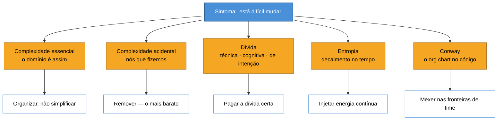
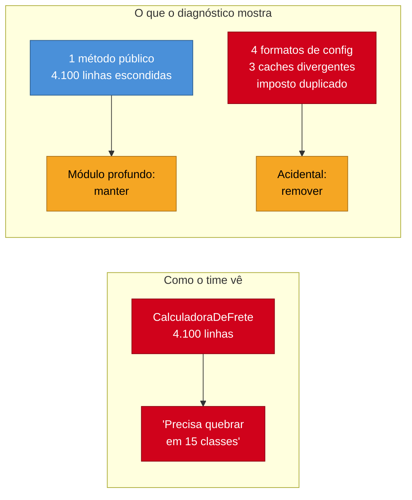
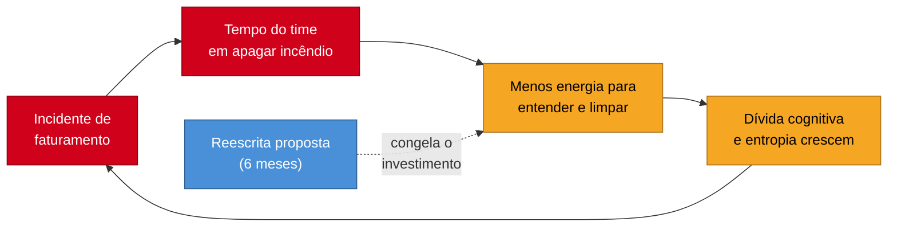

# Capstone - O diagnóstico diferencial da complexidade

A nota anterior ([[16 - Lei de Conway]]) fechou o argumento do galho: o sistema não é só o código, é código + time + processo, e gerenciar complexidade é gerenciar o todo sócio-técnico.

Isso encerra a **tese**. Falta encerrar a **prática**.

Porque há uma distância grande entre saber os dezesseis conceitos e conseguir usá-los quando alguém entra na sua sala e diz: *"o time está lento, e a gente acha que precisa reescrever"*.

Essa frase é o momento em que o galho inteiro é cobrado de uma vez. E a armadilha é que ela **soa como uma pergunta de arquitetura**, quando quase sempre é uma pergunta de diagnóstico.

> [!abstract] TL;DR
> As dezesseis notas anteriores deram **nomes** para tipos diferentes de dificuldade. Esta nota não acrescenta um nome novo: ela os usa como um **diagnóstico diferencial** — o raciocínio clínico que separa causas distintas que produzem o mesmo sintoma. O sintoma é sempre o mesmo: *"está difícil mudar esse sistema"*. As causas são pelo menos cinco, e cada uma pede um tratamento diferente: complexidade **essencial** (não tem cura, tem organização), complexidade **acidental** (tem cura, e é a mais barata), as três **dívidas** (técnica, cognitiva, de intenção — que se disfarçam uma de outra), **entropia** (o decaimento que é o *default*) e complexidade **organizacional** (Conway: o código está espelhando o org chart). Acompanha-se um caso do começo ao fim — um sistema de faturamento fictício, mas típico — até a decisão sobre o *rewrite*. A tese que sobrevive ao caso: **quase todo pedido de reescrita é um diagnóstico apressado**, e o erro caro não é escolher o tratamento errado, é pular a fase de nomear a doença.

> [!info] O recorte desta nota
> Este capstone é sobre **diagnosticar** — nomear corretamente o tipo de dificuldade. O que fazer depois (rede de segurança, seams, Mikado, Strangler Fig, frameworks de decisão) é o ofício do galho vizinho [[03-Dominios/Engenharia/Arqueologia e Restauração de Software/index|Arqueologia e Restauração de Software]], cujo próprio capstone percorre um engajamento completo. Aqui para-se **no diagnóstico e no encaminhamento**, de propósito. Os dois galhos se encontram exatamente nesta fronteira.

## Por que "diferencial"

Na medicina, diagnóstico diferencial é o procedimento que lista todas as causas capazes de produzir um sintoma e as elimina uma a uma, com evidência, até sobrar a provável. Existe porque sintoma não é doença: dor no peito pode ser infarto, refluxo, ansiedade ou uma costela trincada — e tratar refluxo como infarto é tão errado quanto o inverso.

Software tem exatamente o mesmo problema, e quase nenhuma disciplina para lidar com ele.

O sintoma que chega até você é sempre um destes, e sempre vago:

- "o time está lento"
- "toda mudança quebra outra coisa"
- "ninguém entende mais esse módulo"
- "a estimativa nunca fecha"
- "a gente precisa reescrever"

O último não é sintoma — é uma **proposta de tratamento apresentada como sintoma**. Quando alguém diz "precisamos reescrever", a informação real que ela está te dando é *"minha dor é grande o suficiente para eu querer a opção mais cara"*. Não é um diagnóstico. É a medida da dor.

E aqui está o custo de pular esta etapa: as cinco causas abaixo produzem **o mesmo sintoma** e têm **tratamentos incompatíveis**. Reescrever um sistema cuja complexidade é essencial reproduz a complexidade no destino, com bugs novos. Refatorar um sistema cujo problema é dívida cognitiva reorganiza um código que ninguém entende — e destrói o pouco de teoria que restava. Reorganizar times sem tocar no código, quando o problema é acidental, não move nada.

Um sintoma, cinco causas, cinco tratamentos que não se substituem. É isso que torna o diagnóstico obrigatório.

## O caso

> [!note] Sobre o caso
> O sistema abaixo é **fictício e ilustrativo**, montado para exercitar as dezesseis lentes. Os números existem para dar textura ao raciocínio, não para representar nenhuma organização real.

Uma empresa de logística tem um sistema de **faturamento** que roda há nove anos. Ele calcula quanto cobrar de cada cliente por cada carga transportada, e emite as faturas.

Os fatos que chegam até você na primeira conversa:

- O time tem seis pessoas. Nenhuma está lá desde o início; a mais antiga tem dois anos e meio de casa.
- Uma mudança de regra de preço leva, em média, três semanas — da definição de negócio até produção.
- Nos últimos seis meses, quatro das últimas onze entregas causaram incidente de faturamento (cobrança errada, fatura duplicada).
- Existe uma classe chamada `CalculadoraDeFrete` com 4.100 linhas.
- O time propôs formalmente reescrever o módulo de precificação em seis meses.
- A diretoria quer uma recomendação sua em duas semanas.

Todo mundo já tem uma teoria. O tech lead diz que é dívida técnica. O gerente diz que é falta de documentação. Um dev sênior diz que o problema é que "ninguém sabe mais por que as regras são assim". O diretor acha que o time está desmotivado.

Curiosamente, **as quatro teorias estão parcialmente certas**, e é justamente por isso que o caso é difícil: os sintomas se sobrepõem. O trabalho é descobrir qual causa é **dominante**, porque é ela que define onde o primeiro esforço vai.

## Lente 1 — Quanto disso é essencial?

A primeira pergunta é a de [[02 - Complexidade essencial vs. acidental|Brooks]], e é a primeira porque é a que mais muda o tamanho do problema: **quanto dessa dificuldade é do domínio, e quanto é nossa?**

Você lê as regras de negócio antes de ler o código. Descobre o seguinte: a empresa cobra por peso, por volume, por distância, por tipo de carga (perecível, perigosa, comum), com tabelas diferentes por região, contratos que sobrescrevem tabelas para clientes grandes, e uma regra de reajuste indexada a combustível que muda mensalmente.

Isso é **complexidade essencial**. Não é um sistema mal feito querendo ser simples; é um domínio que **é** complicado. Nenhuma reescrita, em nenhuma linguagem, com nenhuma arquitetura, faz essas regras desaparecerem — elas são o negócio. Como Brooks argumenta em *No Silver Bullet*, é a parte irredutível, e nenhuma tecnologia dá o ganho de ordem de magnitude sobre ela.

O erro que essa lente evita é enorme e comum: olhar 4.100 linhas de `CalculadoraDeFrete` e concluir "que código horrível". Parte considerável daquelas linhas é o domínio. Uma reescrita produziria outras tantas milhares de linhas, em código novo, sem os nove anos de casos de borda descobertos em produção.

Mas a lente também dá o outro lado. Você conta as regras de negócio reais e chega a algo como **setenta regras**. Setenta regras não são 4.100 linhas. A diferença é **acidental** — e é ali que o ganho está.

Onde você encontra o acidental, neste caso: quatro formatos diferentes de configuração de tabela de preço (herança de migrações sucessivas), três mecanismos distintos de cache do valor do combustível, e o cálculo de imposto duplicado em dois lugares que divergiram sem que ninguém percebesse.

> [!tip] O que essa lente entrega
> Uma partição do problema em "o que não tem cura" e "o que tem". A segunda parte quase sempre é maior do que o time acredita, e mais barata do que a reescrita.

## Lente 2 — O que se perdeu não está no código

Aqui entra a lente mais contra-intuitiva do galho, e a que mais muda o diagnóstico deste caso: [[04 - O programa como teoria|Naur]].

O tech lead disse "dívida técnica". Mas repare no fato mais importante da lista inicial: **ninguém do time original está lá**. A pessoa mais antiga chegou seis anos e meio depois do sistema nascer.

Para Naur, programar é construir uma **teoria** — o modelo mental de por que o sistema é assim, quais alternativas foram descartadas, o que cada estrutura corresponde no mundo. Essa teoria vive nas pessoas. O código é o resíduo dela, não ela.

Quando as pessoas saem, a teoria não é transferida pelo código que ficou. O sistema fica no estado que Naur chama de morto: o texto executa, mas ninguém consegue mais estendê-lo *no espírito em que foi construído*.

Isso reorganiza o caso inteiro. Volte ao fato de que uma mudança de regra leva três semanas. Onde vão essas três semanas? Quase nunca em digitar. Vão em **reconstruir a teoria** — ler, rastrear, testar hipótese, descobrir que aquele `if` estranho existe por causa de um contrato de 2019.

Você agora tem duas hipóteses concorrentes para o mesmo sintoma, e elas pedem tratamentos opostos:

| Hipótese | Sintoma que explica | Tratamento |
| --- | --- | --- |
| Dívida técnica ([[10 - Dívida técnica]]) | mudança é arriscada, quebra coisas | refatorar, testar, limpar |
| Dívida cognitiva ([[11 - Dívida cognitiva]]) | mudança é **lenta**, ninguém entende | reconstruir teoria, documentar rationale, pareamento |

E o teste que as separa é simples e barato: **pegue a última mudança de regra e cronometre onde o tempo foi**. Se a maior parte foi em entender, é cognitiva. Se foi em mudar com medo de quebrar, é técnica. Se foi em descobrir *por que* a regra antiga existia, é [[12 - Dívida de intenção|dívida de intenção]].

Neste caso, o cronômetro mostra: das três semanas, cerca de duas foram em entender e descobrir o porquê. **A dívida dominante não é a técnica.** E essa é exatamente a que a reescrita proposta não resolve — pelo contrário, uma reescrita feita por quem não tem a teoria reimplementa as regras sem os casos de borda que ninguém sabe explicar.

## Lente 3 — Medindo a superfície, não o volume

Agora o código. E aqui a lente de [[07 - Módulos profundos e rasos|Ousterhout]] evita o segundo erro clássico.

O instinto diante de uma classe de 4.100 linhas é quebrá-la. Mas o critério de Ousterhout não é tamanho, é **profundidade**: a razão entre a funcionalidade escondida e a interface cobrada.

Você olha `CalculadoraDeFrete` e vê que ela expõe **um método público**: `calcular(carga, contrato)`. Quatro mil linhas escondidas atrás de uma interface de dois parâmetros.

Isso é um **módulo profundo**. É o tipo de módulo que Ousterhout considera bom. Quebrá-la em quinze classes de trezentas linhas com interfaces entre si — o reflexo de "classes pequenas são melhores", a *classitis* — produziria quinze interfaces novas onde havia uma, aumentando a [[08 - Carga cognitiva e legibilidade|carga cognitiva]] em vez de reduzi-la.

O problema dela não é o tamanho. É outro, e você só encontra lendo: **dentro** das 4.100 linhas, os três mecanismos de cache de combustível vazam entre si, e o cálculo de imposto duplicado significa que a mesma decisão de negócio está representada em dois lugares.

> [!warning] Tamanho não é diagnóstico
> "Essa classe tem 4.000 linhas" descreve o volume, não a doença. A pergunta diagnóstica é *quanta interface ela cobra por quanta complexidade esconde?* — e a resposta aqui é favorável. O sintoma real está na duplicação interna e no vazamento entre caches, não na contagem de linhas.

Já os quatro formatos de configuração são o oposto: cada um é uma [[06 - Abstrações que vazam|abstração que vazou]] e virou permanente. Quem mexe em preço precisa saber qual formato aquela tabela usa — a abstração prometia esconder isso e não escondeu. Isso, sim, é acidental, e é removível.

## Lente 4 — O tempo e a direção da curva

As lentes anteriores tiram uma fotografia. [[13 - Entropia de software e decaimento|Entropia]] pergunta pelo **filme**: para onde isso está indo?

Por Lehman, um sistema em uso muda continuamente, e sua complexidade **cresce** a menos que haja trabalho explícito para contê-la. Decaimento é o *default*; estabilidade é que custa energia.

O dado que responde a isso no caso é a curva de incidentes: quatro em onze entregas nos últimos seis meses. Você pede os doze meses anteriores e descobre que era um em doze. A curva está **subindo**.

Isso muda a urgência, não o diagnóstico. E acrescenta uma leitura de [[15 - Pensamento sistêmico|pensamento sistêmico]]: procure o **laço de reforço**. Ele está visível assim que você o desenha — incidente consome tempo do time, tempo consumido reduz o investimento em entender e limpar, o que aumenta a chance do próximo incidente.

O laço explica por que o time propôs reescrever: de dentro dele, a saída parece impossível, porque cada mês tem menos folga que o anterior. A proposta de reescrita é **um sintoma do laço**, não uma solução para ele.

E o diagrama mostra o efeito colateral que ninguém calculou: seis meses reescrevendo é meio ano de energia **retirada** do sistema que continua faturando. O laço acelera durante a reescrita. Esse é o mecanismo pelo qual reescritas chegam atrasadas a um sistema pior do que quando começaram.

## Lente 5 — Olhando para o org chart

Falta a última, e é a que quase ninguém aplica: [[16 - Lei de Conway|Conway]]. A estrutura do sistema tende a espelhar a estrutura de comunicação de quem o constrói.

Você pergunta quem define preço. A resposta: o time comercial define tabelas, o time fiscal define impostos, e o time de logística define regras de carga. Três áreas, com ciclos e prioridades próprios, todas escrevendo no mesmo módulo através do mesmo time de seis pessoas.

Aí está a origem estrutural dos quatro formatos de configuração: cada área trouxe o seu, em momentos distintos, e o time de engenharia — sem autoridade sobre nenhuma delas — acomodou os quatro em vez de negociar um.

Isso é decisivo para a recomendação, porque significa que **um tratamento puramente técnico não segura**. Unificar os quatro formatos sem tocar em como as três áreas negociam produz, em dois anos, um quinto formato. A manobra inversa de Conway diz o caminho: defina a fronteira organizacional que você quer que o código tenha, e o código a seguirá.

## O diagnóstico

Reunindo as cinco lentes, o caso se lê assim:

| Lente | Achado | Peso |
| --- | --- | --- |
| Essencial × acidental | ~70 regras reais; boa parte das 4.100 linhas é domínio irredutível | alto |
| Teoria (Naur) | equipe original inteira saiu; teoria perdida | **dominante** |
| Dívidas | cognitiva e de intenção dominam; técnica é secundária | **dominante** |
| Módulos | `CalculadoraDeFrete` é profunda — manter; acidental está na config e nos caches | médio |
| Entropia | curva de incidentes subindo; laço de reforço ativo | urgência |
| Conway | três áreas escrevendo no mesmo módulo sem fronteira negociada | causa-raiz estrutural |

A recomendação que sai disso é uma frase que a diretoria consegue ouvir:

> O sistema não está tecnicamente falido. O que se perdeu foi o **entendimento** dele — e reescrever é a maneira mais cara de não recuperá-lo, porque quem reescreveria é justamente quem não sabe por que as regras são o que são.

E o **não** ao *rewrite* tem que vir acompanhado de um encaminhamento, senão é só uma recusa. O encaminhamento, em ordem de retorno:

1. **Parar o laço primeiro.** A curva de incidentes é o que consome a energia. Rede de segurança sobre as regras de precificação antes de qualquer mudança estrutural.
2. **Recuperar teoria onde dói.** As setenta regras têm dono no negócio. Documentar o *porquê* — não o *como*, que já está no código — paga a [[12 - Dívida de intenção|dívida de intenção]] onde ela custa mais caro.
3. **Remover o acidental barato.** Unificar os quatro formatos e os três caches; eliminar o imposto duplicado. É a parte com melhor razão esforço/ganho, e não exige entender todas as regras.
4. **Negociar a fronteira de Conway.** Sem isso, o item 3 volta.
5. **Não quebrar a `CalculadoraDeFrete`.** Ela é o ativo, não o problema.

O tratamento propriamente dito — como construir a rede de segurança, onde abrir os *seams*, quando o Strangler Fig se justifica — é o ofício do galho de [[03-Dominios/Engenharia/Arqueologia e Restauração de Software/index|Arqueologia e Restauração]]. O trabalho deste galho termina aqui: com a doença nomeada e a ordem de ataque definida.

## Armadilhas comuns

> [!warning] Tratar "precisamos reescrever" como diagnóstico
> É uma proposta de tratamento, e mede a dor de quem fala — não a natureza do problema. Aceitar a proposta pela intensidade com que é defendida é pular a etapa inteira. A pergunta de volta é sempre a mesma: *o que exatamente está difícil, e onde o tempo vai?*

> [!warning] Confundir dívida técnica com dívida cognitiva
> São o diagnóstico mais frequentemente trocado, porque produzem o mesmo sintoma ("está difícil mudar") e têm tratamentos que não se substituem. Refatorar um sistema que ninguém entende é reorganizar um texto cuja teoria se perdeu — o risco é destruir o que restava. O teste barato: cronometre onde foi o tempo da última mudança.

> [!warning] Ler tamanho como doença
> "Essa classe tem 4.000 linhas" é uma medida de volume. A medida diagnóstica é a profundidade — funcionalidade escondida por unidade de interface. Quebrar módulos profundos por reflexo de *classitis* aumenta a carga cognitiva em nome de reduzi-la.

> [!warning] Diagnosticar sem olhar a curva
> Uma fotografia não distingue um sistema estável e imperfeito de um em decaimento acelerado — e a urgência dos dois é completamente diferente. Sempre peça a série temporal (incidentes, tempo de ciclo), não só o estado atual.

> [!warning] Parar o diagnóstico no código
> Se três áreas escrevem no mesmo módulo sem fronteira negociada, o tratamento técnico é revertido pela organização em um ou dois anos. Conway não é uma curiosidade sociológica no fim do galho: é uma lente diagnóstica que se aplica junto com as outras, não depois.

## Inglês

O vocabulário deste capstone é o que aparece quando se discute o estado de um sistema com liderança técnica — e é quase todo do inglês, porque a literatura é.

A expressão-chave é **differential diagnosis**, emprestada da medicina; em engenharia ela não é termo consagrado, então usá-la exige explicá-la em uma frase (*"listing the causes that produce the same symptom and ruling them out one by one"*). Já **rewrite** e **big rewrite** são o vocabulário nativo da decisão, e vêm quase sempre acompanhados do alerta de Joel Spolsky de que reescrever do zero é o pior erro estratégico que uma empresa de software pode cometer.

Repare que *debt* em inglês é contável no plural (*the three debts*), mas as combinações são fixas: diz-se **to pay down debt** (não *pay off*, que sugere quitação total) e **to service the interest**.

| Português | Inglês |
| --- | --- |
| diagnóstico diferencial | differential diagnosis |
| sintoma × causa | symptom vs. root cause |
| reescrita (do zero) | rewrite / big rewrite |
| complexidade essencial / acidental | essential / accidental complexity |
| construção de teoria | theory building |
| teoria perdida | theory loss |
| dívida técnica / cognitiva / de intenção | technical / cognitive / intent debt |
| pagar a dívida | to pay down the debt |
| juros da dívida | debt interest |
| módulo profundo / raso | deep / shallow module |
| carga cognitiva | cognitive load |
| laço de reforço | reinforcing loop |
| decaimento, apodrecimento | decay, bit rot |
| tempo de ciclo | cycle time |
| manobra inversa de Conway | inverse Conway maneuver |
| fronteira de time | team boundary |
| rede de segurança | safety net |

## Em entrevista

> [!tip] Como isso aparece numa entrevista
> Esta é a nota mais "entrevistável" do galho, porque a pergunta que ela responde é literalmente uma pergunta de entrevista sênior: *"você herdou um sistema legado e o time quer reescrever — o que você faz?"*
> - **Não responda com o tratamento.** A resposta júnior começa em "eu faria testes de caracterização e um Strangler Fig". A resposta sênior começa em *"primeiro eu descobriria o que está errado, porque 'difícil de mudar' tem pelo menos cinco causas com tratamentos diferentes"*. Liste as cinco. É o que separa quem tem um método de quem tem um repertório de ferramentas.
> - **Traga o teste barato.** Dizer "eu cronometraria onde foi o tempo da última mudança — entender, mudar com medo, ou descobrir o porquê — porque isso separa dívida cognitiva de técnica e de intenção" mostra que você sabe **decidir com evidência barata**, não só nomear conceitos. É o detalhe que mais impressiona.
> - **Use Naur para justificar o não ao rewrite.** "Quem reescreveria é justamente quem não tem a teoria do sistema" é o argumento mais forte e menos usado contra a reescrita. Vale mais que qualquer estimativa de prazo, porque ataca a premissa em vez do custo.
> - **Mostre que o tamanho não te assusta.** Diante de "uma classe de 4.000 linhas", dizer que a métrica é profundidade (interface × complexidade escondida), não contagem de linhas, e citar o risco de *classitis*, sinaliza leitura de Ousterhout e independência de dogma.
> - **Feche em Conway.** "Eu também olharia quem escreve nesse módulo, porque se três áreas escrevem sem fronteira negociada, o conserto técnico é revertido em dois anos." Poucos candidatos chegam nessa camada, e ela prova que você pensa em sistema sócio-técnico.
> - **Cuidado com o oposto do cargo cult:** recusar toda reescrita por princípio é tão dogmático quanto propô-la sempre. Saiba dizer quando ela se justifica — plataforma sem saída de suporte, domínio que mudou de tal forma que a teoria antiga não serve mais — e você mostra julgamento, não regra decorada.

## O que vem a seguir

Este é o fim do galho. As dezesseis notas deram os nomes; esta mostrou o raciocínio que os usa junto, sob pressão, diante de uma decisão cara.

O caminho natural a partir daqui se bifurca conforme o que você quer fazer com isso.

Se o que interessa é **agir** sobre o sistema depois de diagnosticá-lo, o galho de [[03-Dominios/Engenharia/Arqueologia e Restauração de Software/index|Arqueologia e Restauração de Software]] começa exatamente onde este termina: rede de segurança, *seams*, Mikado, Strangler Fig, e a dimensão política de sustentar tudo isso.

Se o que interessa é a **estrutura** que evita chegar nesse estado, [[03-Dominios/Engenharia/Arquitetura/index|Arquitetura]] trata das decisões que definem fronteiras antes que Conway as defina por você.

E se o que interessa é a manifestação contemporânea disso — dívida cognitiva e de intenção acumulando em velocidade nova quando o código passa a ser gerado —, o cluster [[03-Dominios/Tecnologia/IA/O Lado Sombrio da IA/index|O Lado Sombrio da IA]] trata das mesmas três dívidas sob a lente da IA, que este galho deliberadamente manteve atemporal.

## Referências

> [!tip] Assista — Best Simple System for Now — Daniel Terhorst-North (GOTO 2025)
> **GOTO Conferences** · 44min · [Best Simple System for Now — Daniel Terhorst-North (GOTO 2025)](https://www.youtube.com/watch?v=u4Cv65F9DcY)
> Sobre decidir quanta complexidade um sistema merece *agora*, que é o julgamento que este capstone exercita. Complementa o diagnóstico com a pergunta seguinte: uma vez nomeada a doença, qual é o sistema mais simples que resolve o problema de hoje?

- **Frederick P. Brooks Jr.** — *No Silver Bullet: Essence and Accidents of Software Engineering* (1986) e *The Mythical Man-Month* (1975). A distinção essencial/acidental que abre todo diagnóstico. [Texto do ensaio](https://worrydream.com/refs/Brooks_1986_-_No_Silver_Bullet.pdf).
- **Peter Naur** — *Programming as Theory Building* (1985). A base do argumento de que a teoria perdida, e não o código, é o que torna um sistema difícil. [PDF](https://pages.cs.wisc.edu/~remzi/Naur.pdf).
- **John Ousterhout** — *A Philosophy of Software Design*. Profundidade de módulo, *classitis* e a crítica ao dogma das funções pequenas. [Página do livro](https://web.stanford.edu/~ouster/cgi-bin/aposd.php).
- **Joel Spolsky** — *Things You Should Never Do, Part I* (2000). O argumento clássico contra a reescrita do zero, e o caso Netscape. [Ensaio](https://www.joelonsoftware.com/2000/04/06/things-you-should-never-do-part-i/).
- **Martin Fowler** — *Technical Debt Quadrant* (2009) e *Is High Quality Software Worth the Cost?* (2019). O vocabulário para discutir dívida com quem paga a conta. [Quadrante](https://martinfowler.com/bliki/TechnicalDebtQuadrant.html).
- **Meir M. Lehman** — *Programs, Life Cycles, and Laws of Software Evolution* (1980). As leis da evolução, em especial a de que a complexidade cresce salvo trabalho explícito para contê-la.
- **Donella H. Meadows** — *Thinking in Systems: A Primer* (2008). Laços de reforço e pontos de alavancagem, que dão a leitura da curva.
- **Melvin E. Conway** — *How Do Committees Invent?* (1968). [melconway.com](https://www.melconway.com/Home/Conways_Law.html).

## Veja também

- [[index|Complexidade de Software (MOC do galho)]]
- [[16 - Lei de Conway]] — a síntese conceitual do galho, que esta nota converte em prática
- [[03-Dominios/Engenharia/Arqueologia e Restauração de Software/index|Arqueologia e Restauração de Software]] — o tratamento, onde este diagnóstico desemboca
- [[03-Dominios/Engenharia/Arquitetura/index|Arquitetura]] — as decisões de fronteira
- [[03-Dominios/Tecnologia/IA/O Lado Sombrio da IA/index|O Lado Sombrio da IA]] — as três dívidas sob a lente da IA
- [[Dicionário de Ciência da Computação]]
